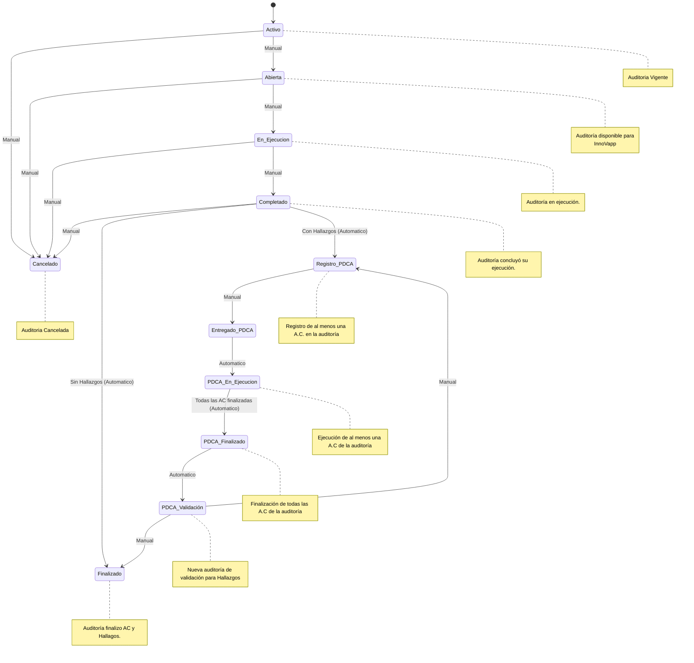

# Mapa de Estados

```mermaid
stateDiagram-v2

%% =====================================================
%% FLUJO DE AUDITORÍA
%% =====================================================

[*] --> Activo

Activo --> Cancelado : Manual
Abierta --> Cancelado : Manual
En_Ejecucion --> Cancelado : Manual
Completado --> Cancelado : Manual

Activo --> Abierta : Manual
Abierta --> En_Ejecucion : Manual

En_Ejecucion --> Completado : Manual

%% Flujo sin hallazgos
Completado --> Finalizado : Sin Hallazgos (Automatico)

%% Flujo con PDCA
Completado --> Registro_PDCA : Con Hallazgos (Automatico)

Registro_PDCA --> Entregado_PDCA : Manual

Entregado_PDCA --> PDCA_En_Ejecucion : Automatico

PDCA_En_Ejecucion --> PDCA_Finalizado : Todas las AC finalizadas (Automatico)
PDCA_Finalizado --> PDCA_Validación : Automatico

PDCA_Validación --> Registro_PDCA : Manual
PDCA_Validación --> Finalizado : Manual

%% =====================================================
%% ESTADOS Y NOTAS
%% =====================================================
state Activo
note right of Activo
    Auditoria Vigente
end note

state Cancelado
note right of Cancelado
    Auditoria Cancelada
end note

state Abierta
note right of Abierta
    Auditoría disponible para
    InnoVapp
end note

state En_Ejecucion
note right of En_Ejecucion
    Auditoría en ejecución.
end note

state Completado
note right of Completado
    Auditoría concluyó su ejecución.
end note

state Registro_PDCA
note right of Registro_PDCA
    Registro de al menos una A.C. en la auditoría
end note

state PDCA_En_Ejecucion
note right of PDCA_En_Ejecucion
    Ejecución de al menos una A.C de la auditoría
end note

state PDCA_Finalizado
note right of PDCA_Finalizado
    Finalización de todas las A.C de la auditoría
end note

state PDCA_Validación
note right of PDCA_Validación
    Nueva auditoría de validación para Hallazgos
end note

state Finalizado
note right of Finalizado
    Auditoría finalizo AC y Hallagos.
end note
```
