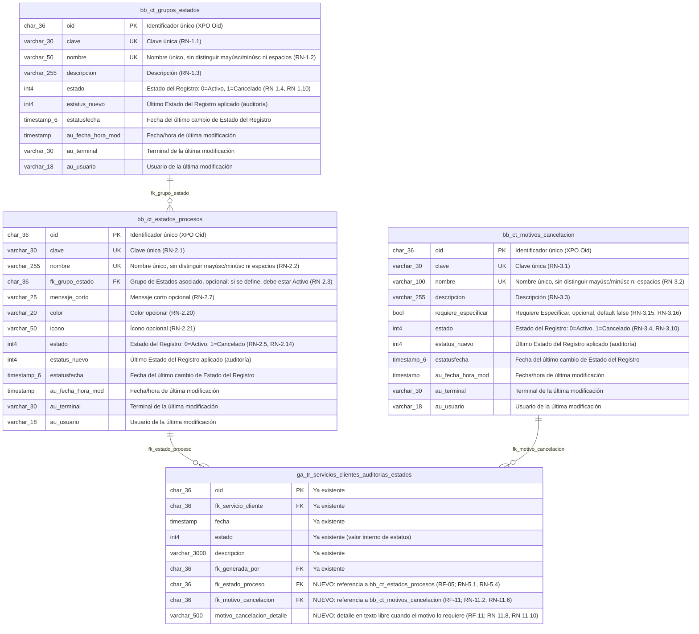

# Documento Técnico — Monitor CAU, Nuevos Estados

| Campo       | Valor                      |
|-------------|----------------------------|
| Versión     | 1.0                        |
| Fecha       | 2026-07-22                 |
| Estado      | Definición                 |
| Soporta a   | "Funcionales-Monitor-CAU-Nuevos-Estados.md" |
| Motor BD    | PostgreSQL                 |
| Autor       | Análisis de Negocio        |

---

## 1. Propósito

Este documento define el soporte técnico (modelo E-R y scripts de creación) de los requerimientos funcionales descritos en "Funcionales-Monitor-CAU-Nuevos-Estados.md". Incluye **únicamente** las tablas y campos **nuevos** necesarios para cubrir dichos requerimientos; no reproduce el script de tablas ya existentes en el sistema.

Este documento se irá ampliando conforme se agreguen nuevos RF al documento funcional que soporta.

**Nota sobre nulabilidad de campos `varchar`:** las tablas de este documento se implementan como clases persistentes de XPO, cuyo esquema se autogenera a partir de las propiedades de la clase. En XPO, las propiedades de tipo `string` generan siempre columnas `NULL`, sin importar si tienen una regla `RuleRequiredField`: dicha obligatoriedad se valida a nivel de aplicación (XAF), no se traduce en un `NOT NULL` de base de datos. Por ello, todo campo `varchar` en los scripts de esta sección se declara `NULL`, aun cuando el documento funcional lo marque como obligatorio; solo los campos de tipo valor no-nullable (`int4`, `bool`, `timestamp`, y el `oid` como llave primaria) se declaran `NOT NULL`.

---

## 2. Índice de tablas por requerimiento

| RF | Tabla | Sección |
|----|-------|---------|
| RF-01 | `bb_ct_grupos_estados` | [3. RF-01 — Administración de Grupos de Estados](#3-rf-01--administración-de-grupos-de-estados) |
| RF-02 | `bb_ct_estados_procesos` | [4. RF-02 — Administración de Estados](#4-rf-02--administración-de-estados) |
| RF-03 | `bb_ct_motivos_cancelacion` | [5. RF-03 — Administración de Motivos de Cancelación](#5-rf-03--administración-de-motivos-de-cancelación) |
| RF-04 | `bb_ct_estados_procesos` (carga de datos inicial) | [6. RF-04 — Importación de los Estados existentes al catálogo](#6-rf-04--importación-de-los-estados-existentes-al-catálogo) |
| RF-05 | `ga_tr_servicios_clientes_auditorias_estados` (columna nueva) | [7. RF-05 — Bitácora del Servicio Cliente con catálogo de Estados](#7-rf-05--bitácora-del-servicio-cliente-con-catálogo-de-estados) |
| RF-11 | `ga_tr_servicios_clientes_auditorias_estados` (columna nueva) | [9. RF-11 — Cancelación del Servicio desde el wizard](#9-rf-11--cancelación-del-servicio-desde-el-wizard) |

---

## 3. Modelo E-R general

El siguiente diagrama consolida **todas** las tablas y columnas nuevas descritas en este documento, junto con sus relaciones. Las secciones siguientes detallan cada tabla (diccionario de datos y script de creación) sin repetir el diagrama.



---

## 4. RF-01 — Administración de Grupos de Estados

### 4.1 Diccionario de datos

| Columna | Tipo | Nulo | Descripción | Regla de negocio |
|---|---|---|---|---|
| `oid` | `char(36)` | No | Identificador único del registro (PK) | — |
| `clave` | `varchar(30)` | Sí¹ | Clave única del Grupo de Estados | RN-1.1 |
| `nombre` | `varchar(50)` | Sí¹ | Nombre único del Grupo de Estados (comparación sin distinguir mayúsculas/minúsculas ni espacios al inicio/final) | RN-1.2 |
| `descripcion` | `varchar(255)` | Sí¹ | Descripción del Grupo de Estados | RN-1.3 |
| `estado` | `int4` | No | Estado del Registro: `0` = Activo, `1` = Cancelado | RN-1.4, RN-1.10, RN-1.13 |
| `estatus_nuevo` | `int4` | Sí | Último Estado del Registro aplicado; soporta la auditoría de cancelación/reactivación | RN-1.5, RN-1.10 |
| `estatusfecha` | `timestamp(6)` | Sí | Fecha en la que se aplicó el último cambio de Estado del Registro | RN-1.5 |
| `au_fecha_hora_mod` | `timestamp` | Sí | Fecha y hora de la última modificación del registro | RN-1.5 |
| `au_terminal` | `varchar(30)` | Sí | Terminal desde la que se realizó la última modificación | RN-1.5 |
| `au_usuario` | `varchar(18)` | Sí | Usuario que realizó la última modificación | RN-1.5 |

**Llaves y restricciones:**
- PK: `oid`.
- Única: `clave` (RN-1.1). No distingue entre grupos Activos y Cancelados: la restricción aplica sobre toda la tabla.
- Única (case-insensitive, sin espacios al inicio/final): `nombre` (RN-1.2), implementada mediante índice funcional sobre `lower(btrim(nombre))`. Tampoco distingue entre grupos Activos y Cancelados.
- ¹ `clave`, `nombre` y `descripcion` son `NULL` en el esquema (comportamiento estándar de XPO para propiedades `string`); su obligatoriedad (RN-1.1, RN-1.2, RN-1.3) se valida a nivel de aplicación, no como constraint de base de datos.

### 4.2 Script de creación (solo objetos nuevos)

```sql
-- =========================================================
-- RF-01 — Administración de Grupos de Estados
-- Tabla nueva: bb_ct_grupos_estados
-- =========================================================
CREATE TABLE bb_ct_grupos_estados
(
    oid                 char(36)        NOT NULL,
    clave               varchar(30)     NULL,
    nombre              varchar(50)     NULL,
    descripcion         varchar(255)    NULL,
    estado              int4            NOT NULL DEFAULT 0,
    estatus_nuevo       int4            NULL,
    estatusfecha        timestamp(6)    NULL,
    au_fecha_hora_mod   timestamp       NULL,
    au_terminal         varchar(30)     NULL,
    au_usuario          varchar(18)     NULL,
    CONSTRAINT pk_bb_ct_grupos_estados PRIMARY KEY (oid),
    CONSTRAINT uq_bb_ct_grupos_estados_clave UNIQUE (clave)
);

-- RN-1.2: unicidad de Nombre sin distinguir mayúsculas/minúsculas ni espacios al inicio/final
CREATE UNIQUE INDEX uq_bb_ct_grupos_estados_nombre
    ON bb_ct_grupos_estados (lower(btrim(nombre)));

COMMENT ON TABLE bb_ct_grupos_estados IS 'Catálogo de Grupos de Estados (RF-01)';
COMMENT ON COLUMN bb_ct_grupos_estados.oid IS 'Identificador único del registro (XPO Oid)';
COMMENT ON COLUMN bb_ct_grupos_estados.clave IS 'Clave única del Grupo de Estados (RN-1.1)';
COMMENT ON COLUMN bb_ct_grupos_estados.nombre IS 'Nombre único del Grupo de Estados (RN-1.2)';
COMMENT ON COLUMN bb_ct_grupos_estados.descripcion IS 'Descripción del Grupo de Estados (RN-1.3)';
COMMENT ON COLUMN bb_ct_grupos_estados.estado IS 'Estado del Registro: 0 = Activo, 1 = Cancelado (RN-1.4, RN-1.10)';
COMMENT ON COLUMN bb_ct_grupos_estados.estatus_nuevo IS 'Último Estado del Registro aplicado (auditoría de cancelación/reactivación)';
COMMENT ON COLUMN bb_ct_grupos_estados.estatusfecha IS 'Fecha del último cambio de Estado del Registro';
COMMENT ON COLUMN bb_ct_grupos_estados.au_fecha_hora_mod IS 'Fecha y hora de la última modificación (bitácora de auditoría)';
COMMENT ON COLUMN bb_ct_grupos_estados.au_terminal IS 'Terminal desde la que se realizó la última modificación';
COMMENT ON COLUMN bb_ct_grupos_estados.au_usuario IS 'Usuario que realizó la última modificación';
```

---

## 5. RF-02 — Administración de Estados

> **Puntos abiertos, según decisión de negocio al momento de este documento:**
> - **Descripción (RN-2.4):** RN-2.4 exige Descripción obligatoria, pero por decisión de negocio no se agrega columna `descripcion` a `bb_ct_estados_procesos` en esta versión. Este RN queda sin soporte de persistencia hasta que se resuelva.

### 5.1 Diccionario de datos

| Columna | Tipo | Nulo | Descripción | Regla de negocio |
|---|---|---|---|---|
| `oid` | `char(36)` | No | Identificador único del registro (PK) | — |
| `clave` | `varchar(30)` | Sí¹ | Clave única del Estado | RN-2.1 |
| `nombre` | `varchar(255)` | Sí¹ | Nombre único del Estado (comparación sin distinguir mayúsculas/minúsculas ni espacios al inicio/final), sin importar el Grupo de Estados | RN-2.2 |
| `fk_grupo_estado` | `char(36)` | Sí | Referencia opcional al Grupo de Estados (`bb_ct_grupos_estados.oid`); cuando se define, debe corresponder a un grupo Activo | RN-2.3, RN-2.10, RN-2.19 |
| `mensaje_corto` | `varchar(25)` | Sí | Mensaje corto opcional para representar el estatus en la trayectoria/timeline de los procesos que lo consumen | RN-2.7, RN-2.12 |
| `color` | `varchar(20)` | Sí | Color opcional para identificar visualmente el Estado en tarjetas y bitácoras | RN-2.20 |
| `icono` | `varchar(50)` | Sí | Ícono opcional para identificar visualmente el Estado en tarjetas y bitácoras | RN-2.21 |
| `estado` | `int4` | No | Estado del Registro: `0` = Activo, `1` = Cancelado | RN-2.5, RN-2.14, RN-2.17 |
| `estatus_nuevo` | `int4` | Sí | Último Estado del Registro aplicado; soporta la auditoría de cancelación/reactivación | RN-2.6 |
| `estatusfecha` | `timestamp(6)` | Sí | Fecha en la que se aplicó el último cambio de Estado del Registro | RN-2.6 |
| `au_fecha_hora_mod` | `timestamp` | Sí | Fecha y hora de la última modificación del registro | RN-2.6 |
| `au_terminal` | `varchar(30)` | Sí | Terminal desde la que se realizó la última modificación | RN-2.6 |
| `au_usuario` | `varchar(18)` | Sí | Usuario que realizó la última modificación | RN-2.6 |

**Llaves y restricciones:**
- PK: `oid`.
- Única: `clave` (RN-2.1). No distingue entre estados Activos y Cancelados.
- Única (case-insensitive, sin espacios al inicio/final): `nombre` (RN-2.2), implementada mediante índice funcional sobre `lower(btrim(nombre))`. No distingue entre estados Activos y Cancelados, ni entre Grupos de Estados.
- FK: `fk_grupo_estado` → `bb_ct_grupos_estados(oid)`, nullable (RN-2.3). La validación de que, cuando se define, el grupo referenciado esté Activo (RN-2.3, RN-2.10, RN-2.19) es una regla de negocio aplicativa, no se expresa como constraint de base de datos.
- ¹ `clave` y `nombre` son `NULL` en el esquema (comportamiento estándar de XPO para propiedades `string`); su obligatoriedad (RN-2.1, RN-2.2) se valida a nivel de aplicación, no como constraint de base de datos.

### 5.2 Script de creación (solo objetos nuevos)

```sql
-- =========================================================
-- RF-02 — Administración de Estados
-- Tabla nueva: bb_ct_estados_procesos
-- =========================================================
CREATE TABLE bb_ct_estados_procesos
(
    oid                 char(36)        NOT NULL,
    clave               varchar(30)     NULL,
    nombre              varchar(255)    NULL,
    fk_grupo_estado     char(36)        NULL,
    mensaje_corto       varchar(25)     NULL,
    color               varchar(20)     NULL,
    icono               varchar(50)     NULL,
    estado              int4            NOT NULL DEFAULT 0,
    estatus_nuevo       int4            NULL,
    estatusfecha        timestamp(6)    NULL,
    au_fecha_hora_mod   timestamp       NULL,
    au_terminal         varchar(30)     NULL,
    au_usuario          varchar(18)     NULL,
    CONSTRAINT pk_bb_ct_estados_procesos PRIMARY KEY (oid),
    CONSTRAINT uq_bb_ct_estados_procesos_clave UNIQUE (clave),
    CONSTRAINT fk_bb_ct_estados_procesos_grupo_estado FOREIGN KEY (fk_grupo_estado)
        REFERENCES bb_ct_grupos_estados (oid)
);

-- RN-2.2: unicidad de Nombre sin distinguir mayúsculas/minúsculas ni espacios al inicio/final
CREATE UNIQUE INDEX uq_bb_ct_estados_procesos_nombre
    ON bb_ct_estados_procesos (lower(btrim(nombre)));

-- Índice de apoyo para la validación de Grupo de Estados Activo (RN-2.3, RN-2.10, RN-2.19)
CREATE INDEX ix_bb_ct_estados_procesos_fk_grupo_estado
    ON bb_ct_estados_procesos (fk_grupo_estado);

COMMENT ON TABLE bb_ct_estados_procesos IS 'Catálogo de Estados (RF-02)';
COMMENT ON COLUMN bb_ct_estados_procesos.oid IS 'Identificador único del registro (XPO Oid)';
COMMENT ON COLUMN bb_ct_estados_procesos.clave IS 'Clave única del Estado (RN-2.1)';
COMMENT ON COLUMN bb_ct_estados_procesos.nombre IS 'Nombre único del Estado (RN-2.2)';
COMMENT ON COLUMN bb_ct_estados_procesos.fk_grupo_estado IS 'Grupo de Estados asociado, opcional; si se define, debe estar Activo (RN-2.3)';
COMMENT ON COLUMN bb_ct_estados_procesos.mensaje_corto IS 'Mensaje corto, opcional (RN-2.7)';
COMMENT ON COLUMN bb_ct_estados_procesos.color IS 'Color, opcional, para identificación visual del Estado (RN-2.20)';
COMMENT ON COLUMN bb_ct_estados_procesos.icono IS 'Ícono, opcional, para identificación visual del Estado (RN-2.21)';
COMMENT ON COLUMN bb_ct_estados_procesos.estado IS 'Estado del Registro: 0 = Activo, 1 = Cancelado (RN-2.5, RN-2.14)';
COMMENT ON COLUMN bb_ct_estados_procesos.estatus_nuevo IS 'Último Estado del Registro aplicado (auditoría de cancelación/reactivación)';
COMMENT ON COLUMN bb_ct_estados_procesos.estatusfecha IS 'Fecha del último cambio de Estado del Registro';
COMMENT ON COLUMN bb_ct_estados_procesos.au_fecha_hora_mod IS 'Fecha y hora de la última modificación (bitácora de auditoría)';
COMMENT ON COLUMN bb_ct_estados_procesos.au_terminal IS 'Terminal desde la que se realizó la última modificación';
COMMENT ON COLUMN bb_ct_estados_procesos.au_usuario IS 'Usuario que realizó la última modificación';
```

---

## 6. RF-03 — Administración de Motivos de Cancelación

Ver su consumo desde la acción de cancelación del wizard (`fk_motivo_cancelacion`) en la [sección 9](#9-rf-11--cancelación-del-servicio-desde-el-wizard).

### 6.1 Diccionario de datos

| Columna | Tipo | Nulo | Descripción | Regla de negocio |
|---|---|---|---|---|
| `oid` | `char(36)` | No | Identificador único del registro (PK) | — |
| `clave` | `varchar(30)` | Sí¹ | Clave única del Motivo de Cancelación | RN-3.1 |
| `nombre` | `varchar(100)` | Sí¹ | Nombre único del Motivo de Cancelación (comparación sin distinguir mayúsculas/minúsculas ni espacios al inicio/final) | RN-3.2 |
| `descripcion` | `varchar(255)` | Sí¹ | Descripción del Motivo de Cancelación | RN-3.3 |
| `requiere_especificar` | `bool` | No | Indica si este motivo exige capturar un detalle adicional en texto libre al usarse en una cancelación (por ejemplo, "Otro"); default `false` | RN-3.15, RN-3.16 |
| `estado` | `int4` | No | Estado del Registro: `0` = Activo, `1` = Cancelado | RN-3.4, RN-3.10, RN-3.13 |
| `estatus_nuevo` | `int4` | Sí | Último Estado del Registro aplicado; soporta la auditoría de cancelación/reactivación | RN-3.5 |
| `estatusfecha` | `timestamp(6)` | Sí | Fecha en la que se aplicó el último cambio de Estado del Registro | RN-3.5 |
| `au_fecha_hora_mod` | `timestamp` | Sí | Fecha y hora de la última modificación del registro | RN-3.5 |
| `au_terminal` | `varchar(30)` | Sí | Terminal desde la que se realizó la última modificación | RN-3.5 |
| `au_usuario` | `varchar(18)` | Sí | Usuario que realizó la última modificación | RN-3.5 |

**Llaves y restricciones:**
- PK: `oid`.
- Única: `clave` (RN-3.1). No distingue entre motivos Activos y Cancelados.
- Única (case-insensitive, sin espacios al inicio/final): `nombre` (RN-3.2), implementada mediante índice funcional sobre `lower(btrim(nombre))`.
- ¹ `clave`, `nombre` y `descripcion` son `NULL` en el esquema (comportamiento estándar de XPO para propiedades `string`); su obligatoriedad (RN-3.1, RN-3.2, RN-3.3) se valida a nivel de aplicación, no como constraint de base de datos.

### 6.2 Script de creación (solo objetos nuevos)

```sql
-- =========================================================
-- RF-03 — Administración de Motivos de Cancelación
-- Tabla nueva: bb_ct_motivos_cancelacion
-- =========================================================
CREATE TABLE bb_ct_motivos_cancelacion
(
    oid                 char(36)        NOT NULL,
    clave               varchar(30)     NULL,
    nombre              varchar(100)    NULL,
    descripcion         varchar(255)    NULL,
    requiere_especificar bool           NOT NULL DEFAULT false,
    estado              int4            NOT NULL DEFAULT 0,
    estatus_nuevo       int4            NULL,
    estatusfecha        timestamp(6)    NULL,
    au_fecha_hora_mod   timestamp       NULL,
    au_terminal         varchar(30)     NULL,
    au_usuario          varchar(18)     NULL,
    CONSTRAINT pk_bb_ct_motivos_cancelacion PRIMARY KEY (oid),
    CONSTRAINT uq_bb_ct_motivos_cancelacion_clave UNIQUE (clave)
);

-- RN-3.2: unicidad de Nombre sin distinguir mayúsculas/minúsculas ni espacios al inicio/final
CREATE UNIQUE INDEX uq_bb_ct_motivos_cancelacion_nombre
    ON bb_ct_motivos_cancelacion (lower(btrim(nombre)));

COMMENT ON TABLE bb_ct_motivos_cancelacion IS 'Catálogo de Motivos de Cancelación (RF-03)';
COMMENT ON COLUMN bb_ct_motivos_cancelacion.oid IS 'Identificador único del registro (XPO Oid)';
COMMENT ON COLUMN bb_ct_motivos_cancelacion.clave IS 'Clave única del Motivo de Cancelación (RN-3.1)';
COMMENT ON COLUMN bb_ct_motivos_cancelacion.nombre IS 'Nombre único del Motivo de Cancelación (RN-3.2)';
COMMENT ON COLUMN bb_ct_motivos_cancelacion.descripcion IS 'Descripción del Motivo de Cancelación (RN-3.3)';
COMMENT ON COLUMN bb_ct_motivos_cancelacion.requiere_especificar IS 'Indica si el motivo exige detalle adicional en texto libre al usarse en una cancelación (RN-3.15, RN-3.16)';
COMMENT ON COLUMN bb_ct_motivos_cancelacion.estado IS 'Estado del Registro: 0 = Activo, 1 = Cancelado (RN-3.4, RN-3.10)';
COMMENT ON COLUMN bb_ct_motivos_cancelacion.estatus_nuevo IS 'Último Estado del Registro aplicado (auditoría de cancelación/reactivación)';
COMMENT ON COLUMN bb_ct_motivos_cancelacion.estatusfecha IS 'Fecha del último cambio de Estado del Registro';
COMMENT ON COLUMN bb_ct_motivos_cancelacion.au_fecha_hora_mod IS 'Fecha y hora de la última modificación (bitácora de auditoría)';
COMMENT ON COLUMN bb_ct_motivos_cancelacion.au_terminal IS 'Terminal desde la que se realizó la última modificación';
COMMENT ON COLUMN bb_ct_motivos_cancelacion.au_usuario IS 'Usuario que realizó la última modificación';
```

---

## 7. RF-04 — Importación de los Estados existentes al catálogo

Este RF no crea tablas ni columnas nuevas: es una carga de datos única sobre `bb_ct_estados_procesos` (RF-02), que registra un Estado por cada valor del listado fijo de estatus que hoy utiliza el sistema. No requiere `fk_grupo_estado` (nullable desde RF-02) ni genera ninguna estructura adicional.

### 7.1 Alcance de la carga

Por cada valor del listado fijo de estatus del sistema, se inserta en `bb_ct_estados_procesos` un registro con:
- `clave` y `nombre`: el mismo valor ya utilizado internamente para ese estatus.
- `color` e `icono`: el mismo valor ya definido para ese estatus, cuando exista; `NULL` en caso contrario.
- `fk_grupo_estado`: `NULL` (RN-4.4).
- `estado`: `0` (Activo).

Dado que el listado fijo de origen no es una tabla de base de datos sino un catálogo definido en el propio sistema, este script no puede expresarse como un único `INSERT ... SELECT`; se ejecuta como un lote de sentencias `INSERT`, una por cada valor del listado, siguiendo la plantilla de la sección 6.2. El detalle completo (una fila por cada estatus a importar, con su clave, nombre, color e ícono) debe completarse a partir del listado fijo vigente al momento de ejecutar la carga.

### 7.2 Script de creación (solo objetos nuevos)

```sql
-- =========================================================
-- RF-04 — Importación de los Estados existentes al catálogo
-- Carga de datos única sobre bb_ct_estados_procesos (RF-02)
-- Plantilla: repetir un INSERT por cada valor del listado fijo de estatus
-- =========================================================
INSERT INTO bb_ct_estados_procesos
    (oid, clave, nombre, fk_grupo_estado, mensaje_corto, color, icono, estado)
VALUES
    (gen_random_uuid(), '<CLAVE_DEL_ESTATUS>', '<NOMBRE_DEL_ESTATUS>', NULL, NULL, '<COLOR_SI_EXISTE>', '<ICONO_SI_EXISTE>', 0);
-- ... repetir para cada estatus del listado fijo vigente ...
```

---

## 8. RF-05 — Bitácora del Servicio Cliente con catálogo de Estados

Este RF no crea una tabla nueva: agrega una columna nueva a una tabla ya existente, `ga_tr_servicios_clientes_auditorias_estados`, sin modificar ni eliminar ninguna de sus columnas actuales. Ver esta relación en el [Modelo E-R general (sección 3)](#3-modelo-e-r-general).

### 8.1 Diccionario de datos (solo columna nueva)

| Columna | Tipo | Nulo | Descripción | Regla de negocio |
|---|---|---|---|---|
| `fk_estado_proceso` | `char(36)` | Sí | Referencia al Estado del catálogo (`bb_ct_estados_procesos.oid`) homologado a la transición registrada; nulo cuando la transición aún no tiene un Estado homologado en el catálogo | RN-5.1, RN-5.2, RN-5.4, RN-5.5 |

**Llaves y restricciones:**
- FK: `fk_estado_proceso` → `bb_ct_estados_procesos(oid)`, nullable.
- La validación de que el Estado referenciado esté Activo (RN-5.4) es una regla de negocio aplicativa, no se expresa como constraint de base de datos.
- El campo de estatus interno ya existente no se modifica (RN-5.3).

### 8.2 Script de creación (solo objetos nuevos)

```sql
-- =========================================================
-- RF-05 — Relación de la bitácora del Servicio Cliente
--         con el catálogo de Estados
-- Columna nueva sobre tabla ya existente: ga_tr_servicios_clientes_auditorias_estados
-- =========================================================
ALTER TABLE ga_tr_servicios_clientes_auditorias_estados
    ADD COLUMN fk_estado_proceso char(36) NULL;

ALTER TABLE ga_tr_servicios_clientes_auditorias_estados
    ADD CONSTRAINT fk_ga_tr_servicios_clientes_auditorias_estados_estado
        FOREIGN KEY (fk_estado_proceso) REFERENCES bb_ct_estados_procesos (oid);

CREATE INDEX ix_ga_tr_servicios_clientes_auditorias_estados_fk_estado_proceso
    ON ga_tr_servicios_clientes_auditorias_estados (fk_estado_proceso);

COMMENT ON COLUMN ga_tr_servicios_clientes_auditorias_estados.fk_estado_proceso IS
    'Estado del catálogo (RF-02) homologado a la transición registrada; nulo si aún no existe homologación (RN-5.1, RN-5.5)';
```

---

## 9. RF-11 — Cancelación del Servicio desde el wizard

Este RF no crea una tabla nueva: agrega una columna adicional a `ga_tr_servicios_clientes_auditorias_estados` (la misma tabla ampliada por RF-05 en la sección 8), sin modificar ni eliminar ninguna de sus columnas actuales. Ver esta relación en el [Modelo E-R general (sección 3)](#3-modelo-e-r-general).

### 9.1 Diccionario de datos (solo columnas nuevas)

| Columna | Tipo | Nulo | Descripción | Regla de negocio |
|---|---|---|---|---|
| `fk_motivo_cancelacion` | `char(36)` | Sí | Referencia al Motivo de Cancelación (`bb_ct_motivos_cancelacion.oid`) seleccionado al cancelar el Servicio desde el wizard; nulo en cualquier registro de bitácora que no corresponda a una cancelación | RN-11.2, RN-11.3, RN-11.6 |
| `motivo_cancelacion_detalle` | `varchar(500)` | Sí | Detalle en texto libre capturado cuando el Motivo de Cancelación seleccionado tiene el indicador "Requiere Especificar" = Sí; nulo en cualquier otro caso | RN-11.8, RN-11.9, RN-11.10, RN-11.11 |

**Llaves y restricciones:**
- FK: `fk_motivo_cancelacion` → `bb_ct_motivos_cancelacion(oid)`, nullable.
- La validación de que el Motivo de Cancelación esté Activo (RN-11.2), y de que `motivo_cancelacion_detalle` sea obligatorio solo cuando el motivo lo requiere (RN-11.9), son reglas de negocio aplicativas; no se expresan como constraints de base de datos.

### 9.2 Script de creación (solo objetos nuevos)

```sql
-- =========================================================
-- RF-11 — Cancelación del Servicio desde el wizard
-- Columnas nuevas sobre tabla ya existente: ga_tr_servicios_clientes_auditorias_estados
-- =========================================================
ALTER TABLE ga_tr_servicios_clientes_auditorias_estados
    ADD COLUMN fk_motivo_cancelacion char(36) NULL;

ALTER TABLE ga_tr_servicios_clientes_auditorias_estados
    ADD COLUMN motivo_cancelacion_detalle varchar(500) NULL;

ALTER TABLE ga_tr_servicios_clientes_auditorias_estados
    ADD CONSTRAINT fk_ga_tr_servicios_clientes_auditorias_estados_motivo_cancelacion
        FOREIGN KEY (fk_motivo_cancelacion) REFERENCES bb_ct_motivos_cancelacion (oid);

CREATE INDEX ix_ga_tr_servicios_clientes_auditorias_estados_fk_motivo_cancelacion
    ON ga_tr_servicios_clientes_auditorias_estados (fk_motivo_cancelacion);

COMMENT ON COLUMN ga_tr_servicios_clientes_auditorias_estados.fk_motivo_cancelacion IS
    'Motivo de Cancelación (RF-03) seleccionado al cancelar el Servicio desde el wizard (RN-11.2, RN-11.6)';
COMMENT ON COLUMN ga_tr_servicios_clientes_auditorias_estados.motivo_cancelacion_detalle IS
    'Detalle en texto libre, obligatorio solo cuando el Motivo de Cancelación requiere especificar (RN-11.8, RN-11.9)';
```

---
