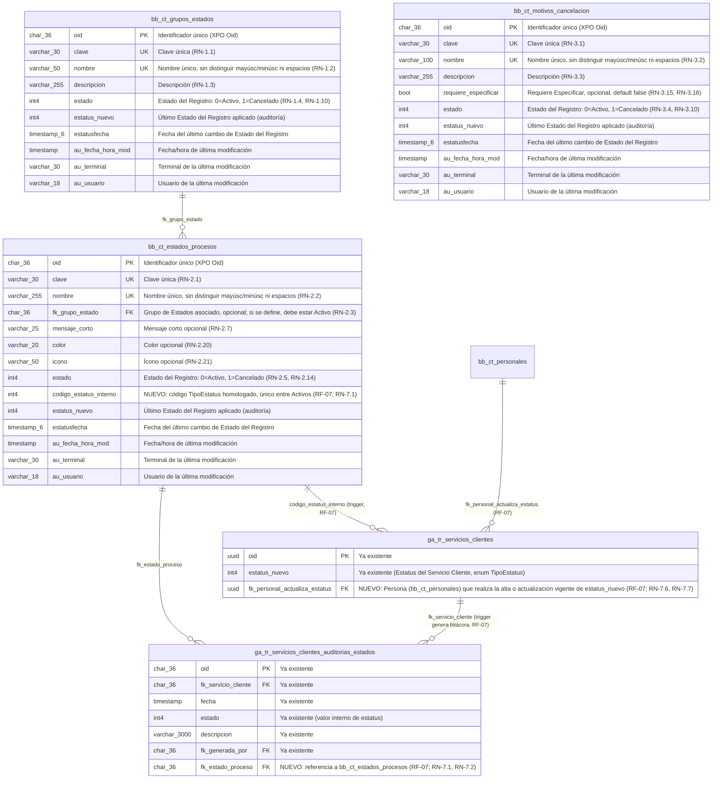

# Documento Técnico — Monitor CAU, Nuevos Estados

| Campo       | Valor                      |
|-------------|----------------------------|
| Versión     | 1.0                        |
| Fecha       | 2026-07-22                 |
| Estado      | Definición                 |
| Soporta a   | "Funcionales-Estados-Tickets-Proyectos.md" |
| Motor BD    | PostgreSQL                 |
| Autor       | Análisis de Negocio        |

---

## 1. Propósito

Este documento define el soporte técnico (modelo E-R y scripts de creación) de los requerimientos funcionales descritos en "Funcionales-Estados-Tickets-Proyectos.md". Incluye **únicamente** las tablas y campos **nuevos** necesarios para cubrir dichos requerimientos; no reproduce el script de tablas ya existentes en el sistema.

Este documento se irá ampliando conforme se agreguen nuevos RF al documento funcional que soporta.

**Nota sobre nulabilidad de campos `varchar`:** las tablas de este documento se implementan como clases persistentes de XPO, cuyo esquema se autogenera a partir de las propiedades de la clase. En XPO, las propiedades de tipo `string` generan siempre columnas `NULL`, sin importar si tienen una regla `RuleRequiredField`: dicha obligatoriedad se valida a nivel de aplicación (XAF), no se traduce en un `NOT NULL` de base de datos. Por ello, todo campo `varchar` en los scripts de esta sección se declara `NULL`, aun cuando el documento funcional lo marque como obligatorio; solo los campos de tipo valor no-nullable (`int4`, `bool`, `timestamp`, y el `oid` como llave primaria) se declaran `NOT NULL`.

---

## 2. Índice de tablas por requerimiento

| RF | Tabla | Sección |
|----|-------|---------|
| RF-01 | `bb_ct_grupos_estados` | [3. RF-01 — Administración de Grupos de Estados](#3-rf-01--administración-de-grupos-de-estados) |
| RF-02 | `bb_ct_estados_procesos` | [4. RF-02 — Administración de Estados](#4-rf-02--administración-de-estados) |
| RF-03 | `bb_ct_motivos_cancelacion` | [5. RF-03 — Administración de Motivos de Cancelación](#5-rf-03--administración-de-motivos-de-cancelación) |
| RF-04 | `bb_ct_estados_procesos` (carga de datos inicial) | [6. RF-04 — Importación de los Estados existentes al catálogo](#6-rf-04--importación-de-los-estados-existentes-al-catálogo) |
| RF-05 | `ga_ct_tickets_tipo_servicios` (columnas nuevas) | [9. RF-05 — Marca de Validación en el catálogo de Servicios de Tickets](#9-rf-05--marca-de-validación-en-el-catálogo-de-servicios-de-tickets) |
| RF-06 | `ga_ct_tickets_tipo_servicios` (columna nueva), `gp_ct_servicios` (columna nueva), `bb_ct_servicios_innovacion_negocios` (columna ya existente, hoy huérfana) | [13. RF-06 — Marca de Autorización en los catálogos de Servicios](#13-rf-06--marca-de-autorización-en-los-catálogos-de-servicios) |
| RF-07 | `ga_tr_servicios_clientes_auditorias_estados` (columna nueva), `bb_ct_estados_procesos` (columna nueva), `ga_tr_servicios_clientes` (columna nueva + triggers) | [8. RF-07 — Bitácora obligatoria del Servicio Cliente relacionada al catálogo de Estados](#8-rf-07--bitácora-obligatoria-del-servicio-cliente-relacionada-al-catálogo-de-estados) |
| RF-16, RF-18, RF-20, RF-22 | `bb_ct_grupos_estados`, `bb_ct_estados_procesos` (carga de datos, sin columnas nuevas) | [10. RF-16, RF-18, RF-20, RF-22 — Alta de los nuevos Estados del Ticket](#10-rf-16-rf-18-rf-20-rf-22--alta-de-los-nuevos-estados-del-ticket) |
| RF-23 | `ga_tr_tickets` (columna nueva) | [11. RF-23 — Fecha de Inicio de Validación del Ticket](#11-rf-23--fecha-de-inicio-de-validación-del-ticket) |
| RF-17, RF-19, RF-21, RF-24 | Sin objetos nuevos: reutilizan `Estatus`/bitácora ya existentes del Ticket | — |
| RF-15 | Sin tablas nuevas: usa `TicketComputo.PersonalAsignado`, `TicketComputoAsignaciones` y `TicketComputo.Estatus` ya existentes | [12. RF-15 — Transición del Ticket a "Proceso" con la Persona Asignada del wizard](#12-rf-15--transición-del-ticket-a-proceso-con-la-persona-asignada-del-wizard) |

---

## 3. Modelo E-R general

El siguiente diagrama consolida **todas** las tablas y columnas nuevas descritas en este documento, junto con sus relaciones. Las secciones siguientes detallan cada tabla (diccionario de datos y script de creación) sin repetir el diagrama.



---

## 4. RF-01 — Administración de Grupos de Estados

### 4.1 Diccionario de datos

| Columna | Tipo | Nulo | Descripción | Regla de negocio |
|---|---|---|---|---|
| `oid` | `char(36)` | No | Identificador único del registro (PK) | — |
| `clave` | `varchar(30)` | Sí¹ | Clave única del Grupo de Estados | RN-1.1 |
| `nombre` | `varchar(50)` | Sí¹ | Nombre único del Grupo de Estados (comparación sin distinguir mayúsculas/minúsculas ni espacios al inicio/final) | RN-1.2 |
| `descripcion` | `varchar(255)` | Sí¹ | Descripción del Grupo de Estados | RN-1.3 |
| `estado` | `int4` | No | Estado del Registro: `0` = Activo, `1` = Cancelado | RN-1.4, RN-1.10, RN-1.13 |
| `estatus_nuevo` | `int4` | Sí | Último Estado del Registro aplicado; soporta la auditoría de cancelación/reactivación | RN-1.5, RN-1.10 |
| `estatusfecha` | `timestamp(6)` | Sí | Fecha en la que se aplicó el último cambio de Estado del Registro | RN-1.5 |
| `au_fecha_hora_mod` | `timestamp` | Sí | Fecha y hora de la última modificación del registro | RN-1.5 |
| `au_terminal` | `varchar(30)` | Sí | Terminal desde la que se realizó la última modificación | RN-1.5 |
| `au_usuario` | `varchar(18)` | Sí | Usuario que realizó la última modificación | RN-1.5 |

**Llaves y restricciones:**
- PK: `oid`.
- Única: `clave` (RN-1.1). No distingue entre grupos Activos y Cancelados: la restricción aplica sobre toda la tabla.
- Única (case-insensitive, sin espacios al inicio/final): `nombre` (RN-1.2), implementada mediante índice funcional sobre `lower(btrim(nombre))`. Tampoco distingue entre grupos Activos y Cancelados.
- ¹ `clave`, `nombre` y `descripcion` son `NULL` en el esquema (comportamiento estándar de XPO para propiedades `string`); su obligatoriedad (RN-1.1, RN-1.2, RN-1.3) se valida a nivel de aplicación, no como constraint de base de datos.

### 4.2 Script de creación (solo objetos nuevos)

```sql
-- =========================================================
-- RF-01 — Administración de Grupos de Estados
-- Tabla nueva: bb_ct_grupos_estados
-- =========================================================
CREATE TABLE bb_ct_grupos_estados
(
    oid                 char(36)        NOT NULL,
    clave               varchar(30)     NULL,
    nombre              varchar(50)     NULL,
    descripcion         varchar(255)    NULL,
    estado              int4            NOT NULL DEFAULT 0,
    estatus_nuevo       int4            NULL,
    estatusfecha        timestamp(6)    NULL,
    au_fecha_hora_mod   timestamp       NULL,
    au_terminal         varchar(30)     NULL,
    au_usuario          varchar(18)     NULL,
    CONSTRAINT pk_bb_ct_grupos_estados PRIMARY KEY (oid),
    CONSTRAINT uq_bb_ct_grupos_estados_clave UNIQUE (clave)
);

-- RN-1.2: unicidad de Nombre sin distinguir mayúsculas/minúsculas ni espacios al inicio/final
CREATE UNIQUE INDEX uq_bb_ct_grupos_estados_nombre
    ON bb_ct_grupos_estados (lower(btrim(nombre)));

COMMENT ON TABLE bb_ct_grupos_estados IS 'Catálogo de Grupos de Estados (RF-01)';
COMMENT ON COLUMN bb_ct_grupos_estados.oid IS 'Identificador único del registro (XPO Oid)';
COMMENT ON COLUMN bb_ct_grupos_estados.clave IS 'Clave única del Grupo de Estados (RN-1.1)';
COMMENT ON COLUMN bb_ct_grupos_estados.nombre IS 'Nombre único del Grupo de Estados (RN-1.2)';
COMMENT ON COLUMN bb_ct_grupos_estados.descripcion IS 'Descripción del Grupo de Estados (RN-1.3)';
COMMENT ON COLUMN bb_ct_grupos_estados.estado IS 'Estado del Registro: 0 = Activo, 1 = Cancelado (RN-1.4, RN-1.10)';
COMMENT ON COLUMN bb_ct_grupos_estados.estatus_nuevo IS 'Último Estado del Registro aplicado (auditoría de cancelación/reactivación)';
COMMENT ON COLUMN bb_ct_grupos_estados.estatusfecha IS 'Fecha del último cambio de Estado del Registro';
COMMENT ON COLUMN bb_ct_grupos_estados.au_fecha_hora_mod IS 'Fecha y hora de la última modificación (bitácora de auditoría)';
COMMENT ON COLUMN bb_ct_grupos_estados.au_terminal IS 'Terminal desde la que se realizó la última modificación';
COMMENT ON COLUMN bb_ct_grupos_estados.au_usuario IS 'Usuario que realizó la última modificación';
```

---

## 5. RF-02 — Administración de Estados

> **Puntos abiertos, según decisión de negocio al momento de este documento:**
> - **Descripción (RN-2.4):** RN-2.4 exige Descripción obligatoria, pero por decisión de negocio no se agrega columna `descripcion` a `bb_ct_estados_procesos` en esta versión. Este RN queda sin soporte de persistencia hasta que se resuelva.

### 5.1 Diccionario de datos

| Columna | Tipo | Nulo | Descripción | Regla de negocio |
|---|---|---|---|---|
| `oid` | `char(36)` | No | Identificador único del registro (PK) | — |
| `clave` | `varchar(30)` | Sí¹ | Clave única del Estado | RN-2.1 |
| `nombre` | `varchar(255)` | Sí¹ | Nombre único del Estado (comparación sin distinguir mayúsculas/minúsculas ni espacios al inicio/final), sin importar el Grupo de Estados | RN-2.2 |
| `fk_grupo_estado` | `char(36)` | Sí | Referencia opcional al Grupo de Estados (`bb_ct_grupos_estados.oid`); cuando se define, debe corresponder a un grupo Activo | RN-2.3, RN-2.10, RN-2.19 |
| `mensaje_corto` | `varchar(25)` | Sí | Mensaje corto opcional para representar el estatus en la trayectoria/timeline de los procesos que lo consumen | RN-2.7, RN-2.12 |
| `color` | `varchar(20)` | Sí | Color opcional para identificar visualmente el Estado en tarjetas y bitácoras | RN-2.20 |
| `icono` | `varchar(50)` | Sí | Ícono opcional para identificar visualmente el Estado en tarjetas y bitácoras | RN-2.21 |
| `estado` | `int4` | No | Estado del Registro: `0` = Activo, `1` = Cancelado | RN-2.5, RN-2.14, RN-2.17 |
| `estatus_nuevo` | `int4` | Sí | Último Estado del Registro aplicado; soporta la auditoría de cancelación/reactivación | RN-2.6 |
| `estatusfecha` | `timestamp(6)` | Sí | Fecha en la que se aplicó el último cambio de Estado del Registro | RN-2.6 |
| `au_fecha_hora_mod` | `timestamp` | Sí | Fecha y hora de la última modificación del registro | RN-2.6 |
| `au_terminal` | `varchar(30)` | Sí | Terminal desde la que se realizó la última modificación | RN-2.6 |
| `au_usuario` | `varchar(18)` | Sí | Usuario que realizó la última modificación | RN-2.6 |

**Llaves y restricciones:**
- PK: `oid`.
- Única: `clave` (RN-2.1). No distingue entre estados Activos y Cancelados.
- Única (case-insensitive, sin espacios al inicio/final): `nombre` (RN-2.2), implementada mediante índice funcional sobre `lower(btrim(nombre))`. No distingue entre estados Activos y Cancelados, ni entre Grupos de Estados.
- FK: `fk_grupo_estado` → `bb_ct_grupos_estados(oid)`, nullable (RN-2.3). La validación de que, cuando se define, el grupo referenciado esté Activo (RN-2.3, RN-2.10, RN-2.19) es una regla de negocio aplicativa, no se expresa como constraint de base de datos.
- ¹ `clave` y `nombre` son `NULL` en el esquema (comportamiento estándar de XPO para propiedades `string`); su obligatoriedad (RN-2.1, RN-2.2) se valida a nivel de aplicación, no como constraint de base de datos.

### 5.2 Script de creación (solo objetos nuevos)

```sql
-- =========================================================
-- RF-02 — Administración de Estados
-- Tabla nueva: bb_ct_estados_procesos
-- =========================================================
CREATE TABLE bb_ct_estados_procesos
(
    oid                 char(36)        NOT NULL,
    clave               varchar(30)     NULL,
    nombre              varchar(255)    NULL,
    fk_grupo_estado     char(36)        NULL,
    mensaje_corto       varchar(25)     NULL,
    color               varchar(20)     NULL,
    icono               varchar(50)     NULL,
    estado              int4            NOT NULL DEFAULT 0,
    estatus_nuevo       int4            NULL,
    estatusfecha        timestamp(6)    NULL,
    au_fecha_hora_mod   timestamp       NULL,
    au_terminal         varchar(30)     NULL,
    au_usuario          varchar(18)     NULL,
    CONSTRAINT pk_bb_ct_estados_procesos PRIMARY KEY (oid),
    CONSTRAINT uq_bb_ct_estados_procesos_clave UNIQUE (clave),
    CONSTRAINT fk_bb_ct_estados_procesos_grupo_estado FOREIGN KEY (fk_grupo_estado)
        REFERENCES bb_ct_grupos_estados (oid)
);

-- RN-2.2: unicidad de Nombre sin distinguir mayúsculas/minúsculas ni espacios al inicio/final
CREATE UNIQUE INDEX uq_bb_ct_estados_procesos_nombre
    ON bb_ct_estados_procesos (lower(btrim(nombre)));

-- Índice de apoyo para la validación de Grupo de Estados Activo (RN-2.3, RN-2.10, RN-2.19)
CREATE INDEX ix_bb_ct_estados_procesos_fk_grupo_estado
    ON bb_ct_estados_procesos (fk_grupo_estado);

COMMENT ON TABLE bb_ct_estados_procesos IS 'Catálogo de Estados (RF-02)';
COMMENT ON COLUMN bb_ct_estados_procesos.oid IS 'Identificador único del registro (XPO Oid)';
COMMENT ON COLUMN bb_ct_estados_procesos.clave IS 'Clave única del Estado (RN-2.1)';
COMMENT ON COLUMN bb_ct_estados_procesos.nombre IS 'Nombre único del Estado (RN-2.2)';
COMMENT ON COLUMN bb_ct_estados_procesos.fk_grupo_estado IS 'Grupo de Estados asociado, opcional; si se define, debe estar Activo (RN-2.3)';
COMMENT ON COLUMN bb_ct_estados_procesos.mensaje_corto IS 'Mensaje corto, opcional (RN-2.7)';
COMMENT ON COLUMN bb_ct_estados_procesos.color IS 'Color, opcional, para identificación visual del Estado (RN-2.20)';
COMMENT ON COLUMN bb_ct_estados_procesos.icono IS 'Ícono, opcional, para identificación visual del Estado (RN-2.21)';
COMMENT ON COLUMN bb_ct_estados_procesos.estado IS 'Estado del Registro: 0 = Activo, 1 = Cancelado (RN-2.5, RN-2.14)';
COMMENT ON COLUMN bb_ct_estados_procesos.estatus_nuevo IS 'Último Estado del Registro aplicado (auditoría de cancelación/reactivación)';
COMMENT ON COLUMN bb_ct_estados_procesos.estatusfecha IS 'Fecha del último cambio de Estado del Registro';
COMMENT ON COLUMN bb_ct_estados_procesos.au_fecha_hora_mod IS 'Fecha y hora de la última modificación (bitácora de auditoría)';
COMMENT ON COLUMN bb_ct_estados_procesos.au_terminal IS 'Terminal desde la que se realizó la última modificación';
COMMENT ON COLUMN bb_ct_estados_procesos.au_usuario IS 'Usuario que realizó la última modificación';
```

---

## 6. RF-03 — Administración de Motivos de Cancelación

### 6.1 Diccionario de datos

| Columna | Tipo | Nulo | Descripción | Regla de negocio |
|---|---|---|---|---|
| `oid` | `char(36)` | No | Identificador único del registro (PK) | — |
| `clave` | `varchar(30)` | Sí¹ | Clave única del Motivo de Cancelación | RN-3.1 |
| `nombre` | `varchar(100)` | Sí¹ | Nombre único del Motivo de Cancelación (comparación sin distinguir mayúsculas/minúsculas ni espacios al inicio/final) | RN-3.2 |
| `descripcion` | `varchar(255)` | Sí¹ | Descripción del Motivo de Cancelación | RN-3.3 |
| `requiere_especificar` | `bool` | No | Indica si este motivo exige capturar un detalle adicional en texto libre al usarse en una cancelación (por ejemplo, "Otro"); default `false` | RN-3.15, RN-3.16 |
| `estado` | `int4` | No | Estado del Registro: `0` = Activo, `1` = Cancelado | RN-3.4, RN-3.10, RN-3.13 |
| `estatus_nuevo` | `int4` | Sí | Último Estado del Registro aplicado; soporta la auditoría de cancelación/reactivación | RN-3.5 |
| `estatusfecha` | `timestamp(6)` | Sí | Fecha en la que se aplicó el último cambio de Estado del Registro | RN-3.5 |
| `au_fecha_hora_mod` | `timestamp` | Sí | Fecha y hora de la última modificación del registro | RN-3.5 |
| `au_terminal` | `varchar(30)` | Sí | Terminal desde la que se realizó la última modificación | RN-3.5 |
| `au_usuario` | `varchar(18)` | Sí | Usuario que realizó la última modificación | RN-3.5 |

**Llaves y restricciones:**
- PK: `oid`.
- Única: `clave` (RN-3.1). No distingue entre motivos Activos y Cancelados.
- Única (case-insensitive, sin espacios al inicio/final): `nombre` (RN-3.2), implementada mediante índice funcional sobre `lower(btrim(nombre))`.
- ¹ `clave`, `nombre` y `descripcion` son `NULL` en el esquema (comportamiento estándar de XPO para propiedades `string`); su obligatoriedad (RN-3.1, RN-3.2, RN-3.3) se valida a nivel de aplicación, no como constraint de base de datos.

### 6.2 Script de creación (solo objetos nuevos)

```sql
-- =========================================================
-- RF-03 — Administración de Motivos de Cancelación
-- Tabla nueva: bb_ct_motivos_cancelacion
-- =========================================================
CREATE TABLE bb_ct_motivos_cancelacion
(
    oid                 char(36)        NOT NULL,
    clave               varchar(30)     NULL,
    nombre              varchar(100)    NULL,
    descripcion         varchar(255)    NULL,
    requiere_especificar bool           NOT NULL DEFAULT false,
    estado              int4            NOT NULL DEFAULT 0,
    estatus_nuevo       int4            NULL,
    estatusfecha        timestamp(6)    NULL,
    au_fecha_hora_mod   timestamp       NULL,
    au_terminal         varchar(30)     NULL,
    au_usuario          varchar(18)     NULL,
    CONSTRAINT pk_bb_ct_motivos_cancelacion PRIMARY KEY (oid),
    CONSTRAINT uq_bb_ct_motivos_cancelacion_clave UNIQUE (clave)
);

-- RN-3.2: unicidad de Nombre sin distinguir mayúsculas/minúsculas ni espacios al inicio/final
CREATE UNIQUE INDEX uq_bb_ct_motivos_cancelacion_nombre
    ON bb_ct_motivos_cancelacion (lower(btrim(nombre)));

COMMENT ON TABLE bb_ct_motivos_cancelacion IS 'Catálogo de Motivos de Cancelación (RF-03)';
COMMENT ON COLUMN bb_ct_motivos_cancelacion.oid IS 'Identificador único del registro (XPO Oid)';
COMMENT ON COLUMN bb_ct_motivos_cancelacion.clave IS 'Clave única del Motivo de Cancelación (RN-3.1)';
COMMENT ON COLUMN bb_ct_motivos_cancelacion.nombre IS 'Nombre único del Motivo de Cancelación (RN-3.2)';
COMMENT ON COLUMN bb_ct_motivos_cancelacion.descripcion IS 'Descripción del Motivo de Cancelación (RN-3.3)';
COMMENT ON COLUMN bb_ct_motivos_cancelacion.requiere_especificar IS 'Indica si el motivo exige detalle adicional en texto libre al usarse en una cancelación (RN-3.15, RN-3.16)';
COMMENT ON COLUMN bb_ct_motivos_cancelacion.estado IS 'Estado del Registro: 0 = Activo, 1 = Cancelado (RN-3.4, RN-3.10)';
COMMENT ON COLUMN bb_ct_motivos_cancelacion.estatus_nuevo IS 'Último Estado del Registro aplicado (auditoría de cancelación/reactivación)';
COMMENT ON COLUMN bb_ct_motivos_cancelacion.estatusfecha IS 'Fecha del último cambio de Estado del Registro';
COMMENT ON COLUMN bb_ct_motivos_cancelacion.au_fecha_hora_mod IS 'Fecha y hora de la última modificación (bitácora de auditoría)';
COMMENT ON COLUMN bb_ct_motivos_cancelacion.au_terminal IS 'Terminal desde la que se realizó la última modificación';
COMMENT ON COLUMN bb_ct_motivos_cancelacion.au_usuario IS 'Usuario que realizó la última modificación';
```

---

## 7. RF-04 — Importación de los Estados existentes al catálogo

Este RF no crea tablas ni columnas nuevas: es una carga de datos única sobre `bb_ct_estados_procesos` (RF-02), que registra un Estado por cada valor del listado fijo de estatus que hoy utiliza el sistema. No requiere `fk_grupo_estado` (nullable desde RF-02) ni genera ninguna estructura adicional.

### 7.1 Alcance de la carga

Por cada valor del listado fijo de estatus del sistema, se inserta en `bb_ct_estados_procesos` un registro con:
- `clave` y `nombre`: el mismo valor ya utilizado internamente para ese estatus.
- `color` e `icono`: el mismo valor ya definido para ese estatus, cuando exista; `NULL` en caso contrario.
- `fk_grupo_estado`: `NULL` (RN-4.4).
- `estado`: `0` (Activo).

El listado fijo de origen no es una tabla de base de datos, sino un catálogo definido en el propio sistema. Por eso este script no puede expresarse como un único `INSERT ... SELECT`: se ejecuta como un lote de sentencias `INSERT`, una por cada valor del listado, siguiendo la plantilla de la sección 7.2. El detalle completo (una fila por cada estatus a importar, con su clave, nombre, color e ícono) debe completarse a partir del listado fijo vigente al momento de ejecutar la carga.

### 7.2 Script de creación (solo objetos nuevos)

```sql
-- =========================================================
-- RF-04 — Importación de los Estados existentes al catálogo
-- Carga de datos única sobre bb_ct_estados_procesos (RF-02)
-- Plantilla: repetir un INSERT por cada valor del listado fijo de estatus
-- =========================================================
INSERT INTO bb_ct_estados_procesos
    (oid, clave, nombre, fk_grupo_estado, mensaje_corto, color, icono, estado)
VALUES
    (gen_random_uuid(), '<CLAVE_DEL_ESTATUS>', '<NOMBRE_DEL_ESTATUS>', NULL, NULL, '<COLOR_SI_EXISTE>', '<ICONO_SI_EXISTE>', 0);
-- ... repetir para cada estatus del listado fijo vigente ...
```

---

## 8. RF-07 — Bitácora obligatoria del Servicio Cliente relacionada al catálogo de Estados

Este RF no crea ninguna tabla nueva; agrega tres columnas sobre tablas ya existentes:
- `ga_tr_servicios_clientes_auditorias_estados.fk_estado_proceso` (sección 8.2).
- `bb_ct_estados_procesos.codigo_estatus_interno`, columna de soporte (sección 8.3).
- `ga_tr_servicios_clientes.fk_personal_actualiza_estatus`, columna de soporte (sección 8.4).

Su mecanismo de cumplimiento **no se implementa a nivel de aplicación (XPO/C#), sino mediante un trigger en el motor de base de datos** (sección 8.5), por la razón descrita en 8.1. Ver esta relación en el [Modelo E-R general (sección 3)](#3-modelo-e-r-general).

### 8.1 Por qué el cumplimiento se implementa mediante un trigger de base de datos

El sistema tiene más de una aplicación escribiendo sobre la misma base de datos PostgreSQL: BusinessSuite (Blazor Server / XAF, este repositorio) y la aplicación móvil InnoVapp (sistema externo a este workspace, no encontrado en este repositorio). Cualquier validación implementada únicamente en la capa de negocio de XPO (por ejemplo, sobrescribir `OnEstatusUpdated` en `ServicioCliente` e invocar `ServicioClienteAuditoriaEstado.RegistraBitacora`) **solo protegería las escrituras que pasan por BusinessSuite**; si InnoVapp actualiza `ga_tr_servicios_clientes.estatus_nuevo` directamente contra la base de datos, esa validación nunca se ejecutaría y la relación obligatoria al catálogo de Estados (RN-7.1 a RN-7.3) quedaría sin garantizar por esa vía.

Por lo anterior, este RF se implementa como un **trigger `AFTER INSERT` y `AFTER UPDATE OF estatus_nuevo` sobre `ga_tr_servicios_clientes`**, que:
1. Se ejecuta sin importar qué aplicación (BusinessSuite o InnoVapp) haya originado el alta o el cambio de Estatus.
2. Resuelve el `bb_ct_estados_procesos` homologado al Estatus destino y bloquea la transacción completa si no existe o está Cancelado (RN-7.2, RN-7.3), desde un único punto, no duplicado por aplicación.
3. Inserta él mismo el registro correspondiente en `ga_tr_servicios_clientes_auditorias_estados`, ya relacionado con `fk_estado_proceso`, sustituyendo la necesidad de que cada aplicación genere su propia bitácora ante cada alta o cambio de Estatus.

**Consecuencia para el código de BusinessSuite:** ninguna acción/controller de los grupos Monitor CAU, Ticket, Proyectos o Equipo de Cómputo debe insertar manualmente un `ServicioClienteAuditoriaEstado` como reacción a una alta o un cambio de `Estatus` (ni mediante `RegistraBitacora` ni de otra forma); basta con que actualicen `ServicioCliente.Estatus` y el trigger genera la bitácora. Insertar el registro manualmente **además** del trigger duplicaría la fila de bitácora.

> **Nota sobre `oid`:** las secciones 3 a 7 de este documento describen `oid` como `char(36)` en el modelo E-R, siguiendo la convención general de XPO. Sin embargo, `ReymaBaseObject` (clase base de todas las entidades de este sistema, incluida `ServicioCliente`) declara `oid` como `Guid`, que el proveedor de XPO para PostgreSQL mapea a `uuid`, no a `char(36)`. El script de esta sección usa `uuid`, el tipo físico real de `ga_tr_servicios_clientes.oid` y `ga_tr_servicios_clientes_auditorias_estados.fk_servicio_cliente`; se recomienda confirmar contra el esquema real antes de ejecutar, dado que esto también aplicaría a las secciones 3-7 si se detecta la misma discrepancia.

### 8.2 Columna `fk_estado_proceso` sobre `ga_tr_servicios_clientes_auditorias_estados`

| Columna | Tipo | Nulo | Descripción | Regla de negocio |
|---|---|---|---|---|
| `fk_estado_proceso` | `char(36)` | Sí¹ | Referencia al Estado del catálogo (`bb_ct_estados_procesos.oid`) homologado al Estatus registrado | RN-7.1, RN-7.2 |

**Llaves y restricciones:**
- FK: `fk_estado_proceso` → `bb_ct_estados_procesos(oid)`, nullable a nivel de esquema.
- ¹ Aunque la columna es nullable en el esquema (RN-7.4: esta obligatoriedad no se traduce en un `NOT NULL` de base de datos), el trigger de la sección 8.5 garantiza que, en la práctica, todo registro que el trigger inserte siempre traiga este valor; nunca queda en `NULL` para movimientos posteriores a la entrada en vigor de este RF.
- La validación de que el Estado referenciado esté Activo (RN-7.2) y de que exista homologación (RN-7.3) es responsabilidad del trigger de la sección 8.5, no una constraint de base de datos.
- El campo de estatus interno ya existente no se modifica (RN-7.5).

```sql
-- =========================================================
-- RF-07 — Columna nueva sobre tabla ya existente: ga_tr_servicios_clientes_auditorias_estados
-- =========================================================
ALTER TABLE ga_tr_servicios_clientes_auditorias_estados
    ADD COLUMN fk_estado_proceso char(36) NULL;

ALTER TABLE ga_tr_servicios_clientes_auditorias_estados
    ADD CONSTRAINT fk_ga_tr_servicios_clientes_auditorias_estados_estado
        FOREIGN KEY (fk_estado_proceso) REFERENCES bb_ct_estados_procesos (oid);

CREATE INDEX ix_ga_tr_servicios_clientes_auditorias_estados_fk_estado_proceso
    ON ga_tr_servicios_clientes_auditorias_estados (fk_estado_proceso);

COMMENT ON COLUMN ga_tr_servicios_clientes_auditorias_estados.fk_estado_proceso IS
    'Estado del catálogo (RF-02) homologado al Estatus registrado; el trigger de RF-07 garantiza que siempre tenga valor (RN-7.1, RN-7.2, RN-7.3)';
```

### 8.3 Columna de soporte nueva: `bb_ct_estados_procesos.codigo_estatus_interno`

`bb_ct_estados_procesos.clave`/`.nombre` (RF-02) son `varchar` pensados para presentación administrativa, no para un `JOIN` numérico determinístico contra `ga_tr_servicios_clientes.estatus_nuevo` (`int4`, valor del enum interno `TipoEstatus`). Para que el trigger resuelva el Estado homologado sin ambigüedad, se agrega una columna numérica dedicada a ese único fin, independiente de `clave`, `nombre` y de la columna `estado` (que sigue significando exclusivamente "Estado del Registro del catálogo: 0=Activo, 1=Cancelado", sin cambios respecto a RF-02).

| Columna | Tipo | Nulo | Descripción | Regla de negocio |
|---|---|---|---|---|
| `codigo_estatus_interno` | `int4` | Sí | Código numérico del enum interno `TipoEstatus` (columna `ga_tr_servicios_clientes.estatus_nuevo`) al que este Estado del catálogo está homologado; permite al trigger de RF-07 resolver el Estado correspondiente a cada Estatus del Servicio Cliente sin ambigüedad | RN-7.1 |

**Llaves y restricciones:**
- Única (parcial, solo sobre estados Activos): no pueden existir dos `bb_ct_estados_procesos` con `estado = 0` (Activo) y el mismo `codigo_estatus_interno`, para que la resolución del trigger sea siempre determinística.
- Esta columna es nueva y **no fue parte de la carga inicial de RF-04**; su llenado para los estados ya importados por RF-04 (uno por cada valor del listado fijo de estatus) es un prerrequisito de datos de este RF, dado que sin ella el trigger bloquearía toda alta o actualización de Estatus para la que aún no se haya asignado.

```sql
-- =========================================================
-- RF-07 — Columna de soporte nueva sobre bb_ct_estados_procesos (RF-02)
-- =========================================================
ALTER TABLE bb_ct_estados_procesos
    ADD COLUMN codigo_estatus_interno int4 NULL;

-- Unicidad del código interno entre estados Activos (evita ambigüedad en el trigger)
CREATE UNIQUE INDEX uq_bb_ct_estados_procesos_codigo_estatus_interno_activo
    ON bb_ct_estados_procesos (codigo_estatus_interno)
    WHERE estado = 0;

COMMENT ON COLUMN bb_ct_estados_procesos.codigo_estatus_interno IS
    'Código numérico del enum interno TipoEstatus (ga_tr_servicios_clientes.estatus_nuevo) homologado a este Estado (RF-07)';
```

### 8.4 Columna de soporte nueva: `ga_tr_servicios_clientes.fk_personal_actualiza_estatus`

Se descarta resolver `fk_generada_por` (RN-7.7) mediante una variable de sesión (`SET LOCAL`) leída por el trigger: no hay garantía de que la variable de sesión viaje en la misma conexión que el `INSERT`/`UPDATE` cuando existe *connection pooling* (pgbouncer en modo transacción, pools del proveedor XPO, o el pool propio de InnoVapp), por lo que el dato podría perderse de forma intermitente y silenciosa.

En su lugar, se agrega una columna en la propia `ga_tr_servicios_clientes` que **cada aplicación** (BusinessSuite e InnoVapp) debe llenar como parte de la misma fila/transacción que actualiza `estatus_nuevo`, igual que ya hacen hoy con `au_usuario`/`au_terminal`. El trigger simplemente la copia a `fk_generada_por` en la bitácora; no depende de sesión.

| Columna | Tipo | Nulo | Descripción | Regla de negocio |
|---|---|---|---|---|
| `fk_personal_actualiza_estatus` | `uuid` | Sí | Persona (empleado) que realiza la alta o actualización vigente de `estatus_nuevo`; toda aplicación que registre o actualice el Estatus del Servicio Cliente debe establecer esta columna en la misma operación de guardado. El trigger de la sección 8.5 la copia a `fk_generada_por` en el registro de bitácora generado | RN-7.6, RN-7.7 |

**Llaves y restricciones:**
- FK: `fk_personal_actualiza_estatus` → `bb_ct_personales(oid)`, la misma tabla de Personal ya referenciada por `ga_tr_servicios_clientes_auditorias_estados.fk_generada_por`.
- Nullable a nivel de esquema, consistente con el resto de este documento; la obligatoriedad de que siempre traiga valor (RN-7.6) la aplica el trigger de la sección 8.5, que bloquea la operación si viene en `NULL`.

```sql
-- =========================================================
-- RF-07 — Columna de soporte nueva sobre ga_tr_servicios_clientes (tabla ya existente)
-- =========================================================
ALTER TABLE ga_tr_servicios_clientes
    ADD COLUMN fk_personal_actualiza_estatus uuid NULL;

ALTER TABLE ga_tr_servicios_clientes
    ADD CONSTRAINT fk_ga_tr_servicios_clientes_personal_actualiza_estatus
        FOREIGN KEY (fk_personal_actualiza_estatus) REFERENCES bb_ct_personales (oid);

COMMENT ON COLUMN ga_tr_servicios_clientes.fk_personal_actualiza_estatus IS
    'Persona (bb_ct_personales) que realiza la alta o actualización vigente de estatus_nuevo; obligatoria en cada alta o actualización de Estatus (RF-07; RN-7.6, RN-7.7)';
```

### 8.5 Trigger sobre `ga_tr_servicios_clientes`

La función de trigger resuelve el Estado homologado, valida que se haya identificado a la Persona que registra o actualiza el Estatus, y genera la bitácora en un solo paso; se asocia a dos triggers (uno para `INSERT`, uno para `UPDATE` con condición `WHEN`) que comparten la misma función, patrón estándar en PostgreSQL.

```sql
-- =========================================================
-- RF-07 — Trigger de bitácora obligatoria relacionada al catálogo de Estados
-- =========================================================
CREATE OR REPLACE FUNCTION fn_valida_genera_bitacora_estado_servicio_cliente()
RETURNS trigger AS $$
DECLARE
    v_fk_estado_proceso uuid;
    v_estado_catalogo   int4;
BEGIN
    -- RN-7.6: la Persona que registra o actualiza el Estatus es obligatoria en toda operación
    IF NEW.fk_personal_actualiza_estatus IS NULL THEN
        RAISE EXCEPTION
            'La alta o actualización de Estatus % del Servicio Cliente % no identifica a la Persona que la realiza (fk_personal_actualiza_estatus)',
            NEW.estatus_nuevo, NEW.oid;
    END IF;

    -- RN-7.1, RN-7.2, RN-7.3: resolver el Estado Activo homologado al Estatus destino
    SELECT oid, estado
      INTO v_fk_estado_proceso, v_estado_catalogo
      FROM bb_ct_estados_procesos
     WHERE codigo_estatus_interno = NEW.estatus_nuevo
     LIMIT 1;

    IF v_fk_estado_proceso IS NULL THEN
        RAISE EXCEPTION
            'No existe un Estado homologado en bb_ct_estados_procesos para el Estatus % del Servicio Cliente %',
            NEW.estatus_nuevo, NEW.oid;
    END IF;

    IF v_estado_catalogo <> 0 THEN
        RAISE EXCEPTION
            'El Estado homologado al Estatus % del Servicio Cliente % está Cancelado en el catálogo',
            NEW.estatus_nuevo, NEW.oid;
    END IF;

    -- RN-7.8: sin Descripción en texto libre; la información visual se obtiene vía fk_estado_proceso
    INSERT INTO ga_tr_servicios_clientes_auditorias_estados
        (oid, fk_servicio_cliente, fecha, estado, descripcion, fk_generada_por, fk_estado_proceso)
    VALUES
        (gen_random_uuid(), NEW.oid, now(), NEW.estatus_nuevo, NULL, NEW.fk_personal_actualiza_estatus, v_fk_estado_proceso);

    RETURN NEW;
END;
$$ LANGUAGE plpgsql;

-- Alta del Servicio Cliente (RF-08): genera el primer registro de bitácora
CREATE TRIGGER trg_ai_servicio_cliente_bitacora_estado
    AFTER INSERT ON ga_tr_servicios_clientes
    FOR EACH ROW
    EXECUTE FUNCTION fn_valida_genera_bitacora_estado_servicio_cliente();

-- Cambios posteriores de Estatus (Monitor CAU, Ticket, Proyectos, Equipo de Cómputo y futuros): solo cuando estatus_nuevo cambia de valor
CREATE TRIGGER trg_au_servicio_cliente_bitacora_estado
    AFTER UPDATE ON ga_tr_servicios_clientes
    FOR EACH ROW
    WHEN (OLD.estatus_nuevo IS DISTINCT FROM NEW.estatus_nuevo)
    EXECUTE FUNCTION fn_valida_genera_bitacora_estado_servicio_cliente();
```

### 8.6 Alcance y no-retroactividad

- **Sin backfill:** los registros históricos de bitácora generados antes de la entrada en vigor de este RF, que no cuenten con `fk_estado_proceso`, no se modifican; el trigger solo aplica hacia adelante, a partir de su creación. Lo mismo aplica a `fk_personal_actualiza_estatus`: los Servicios Cliente existentes antes de este RF quedan con esa columna en `NULL` hasta su próxima alta o actualización de Estatus.
- **Prerrequisito de datos:** antes de habilitar este trigger en un ambiente, todo valor de `TipoEstatus` que la operación real utilice como `estatus_nuevo` de `ga_tr_servicios_clientes` debe tener ya un `bb_ct_estados_procesos` Activo con su `codigo_estatus_interno` asignado (sección 8.3); de lo contrario, el trigger bloqueará esa transición en producción.
- **Prerrequisito de aplicación:** tanto BusinessSuite como InnoVapp deben establecer `fk_personal_actualiza_estatus` en la misma operación de guardado que registra o actualiza `estatus_nuevo`, antes de habilitar este trigger; de lo contrario, toda alta o actualización de Estatus de la aplicación que no lo haga quedará bloqueada por RN-7.6.

---

## 9. RF-05 — Marca de Validación en el catálogo de Servicios de Tickets

Este RF no crea tablas nuevas; agrega dos columnas sobre `ga_ct_tickets_tipo_servicios` (clase `TipoServicioComputo`, ya existente).

### 9.1 Diccionario de datos

| Columna | Tipo | Nulo | Descripción | Regla de negocio |
|---|---|---|---|---|
| `requiere_validacion` | `bool` | No | Indica si el tipo de servicio exige confirmación del usuario que reporta antes del cierre definitivo. Default `false` | RN-5.1 |
| `tiempo_expiracion_validacion_horas` | `int4` | Sí | Horas de vigencia de la validación; obligatorio y mayor a cero únicamente cuando `requiere_validacion = true` (validado a nivel de aplicación, no como constraint) | RN-5.2, RN-5.3 |

### 9.2 Script de creación (solo objetos nuevos)

```sql
-- =========================================================
-- RF-05 — Columnas nuevas sobre ga_ct_tickets_tipo_servicios (tabla ya existente)
-- =========================================================
ALTER TABLE ga_ct_tickets_tipo_servicios
    ADD COLUMN requiere_validacion bool NOT NULL DEFAULT false;

ALTER TABLE ga_ct_tickets_tipo_servicios
    ADD COLUMN tiempo_expiracion_validacion_horas int4 NULL;

COMMENT ON COLUMN ga_ct_tickets_tipo_servicios.requiere_validacion IS
    'Indica si el tipo de servicio exige validación del usuario que reporta antes del cierre definitivo (RF-05)';
COMMENT ON COLUMN ga_ct_tickets_tipo_servicios.tiempo_expiracion_validacion_horas IS
    'Horas de vigencia de la validación cuando requiere_validacion = true (RF-05; RN-5.2, RN-5.3)';
```

---

## 10. RF-16, RF-18, RF-20, RF-22 — Alta de los nuevos Estados del Ticket

Ninguno de estos 4 RFs crea tablas ni columnas nuevas: cada uno es una carga de datos sobre `bb_ct_grupos_estados` (RF-01) y `bb_ct_estados_procesos` (RF-02), siguiendo exactamente el mismo patrón de alta administrativa ya soportado por esas tablas. No requieren script propio más allá de un `INSERT` por Grupo y por Estado, análogo al de la sección 7.2 (RF-04), uno por cada nombre: "Ing. Traslado" (RF-16), "Esperando Información de Usuario" (RF-18), "Autorización Financiera" (RF-20) y "En Validación" (RF-22).

**Prerrequisito de datos:** cada uno de estos 4 Estados debe recibir también su propio `codigo_estatus_interno` (columna de soporte introducida en la sección 8.3), homologado al valor de `TipoEstatus` que el Ticket utilice para ese Estatus; sin ese dato, el trigger de la sección 8.5 bloquearía la transición del Servicio Cliente relacionado al ejecutarse RF-17, RF-19, RF-21 o RF-23.

---

## 11. RF-23 — Fecha de Inicio de Validación del Ticket

Este RF no crea tablas nuevas; agrega una columna sobre `ga_tr_tickets` (clase `TicketComputo`, ya existente), como campo propio del Ticket, independiente de su bitácora de estatus, para que el Job de RF-24 pueda consultarla directamente sin depender de un `JOIN` contra la bitácora.

### 11.1 Diccionario de datos

| Columna | Tipo | Nulo | Descripción | Regla de negocio |
|---|---|---|---|---|
| `fecha_inicio_validacion` | `timestamp` | Sí | Fecha y hora en que el Ticket transicionó a "En Validación"; se captura automáticamente, sin intervención manual | RN-23.7 |

### 11.2 Script de creación (solo objetos nuevos)

```sql
-- =========================================================
-- RF-23 — Columna nueva sobre ga_tr_tickets (tabla ya existente)
-- =========================================================
ALTER TABLE ga_tr_tickets
    ADD COLUMN fecha_inicio_validacion timestamp NULL;

COMMENT ON COLUMN ga_tr_tickets.fecha_inicio_validacion IS
    'Fecha y hora en que el Ticket transicionó a "En Validación", capturada automáticamente (RF-23; RN-23.7)';
```

### 11.3 Nota técnica — cierre automático del Job de RF-24

El Job de RF-24 finaliza el Ticket transicionándolo a `Atendido` sin intervención humana. El cierre normal del Ticket (acción operada por una persona) dispara lógica adicional en `AfterEstatusChangeLogic` (`TicketComputo.cs`) que registra quién atendió, la fecha de atención y el Tipo de Servicio Interno de cierre; esa lógica no se dispara automáticamente al solo cambiar la propiedad `Estatus`. El desarrollo debe invocar explícitamente esa misma lógica desde el Job —resolviendo un empleado de respaldo para el campo de responsable (RN-24.10), siguiendo el mismo patrón ya usado por el Job de cancelación existente (`CancelacionTicketService`)— en lugar de asignar `Estatus` de forma aislada, para no dejar el Ticket en un estado inconsistente.

---

## 12. RF-15 — Transición del Ticket a "Proceso" con la Persona Asignada del wizard

Este RF no crea tablas ni columnas nuevas: reutiliza `TicketComputo.PersonalAsignado`, el historial `TicketComputoAsignaciones` (`ga_tr_tickets_asignaciones`), la bitácora `TicketComputoAuditoriaEstado` (`ga_tr_tickets_auditorias_estados`) y el campo `Estatus`, todos ya existentes. Requiere alta de datos maestros nuevos (ver 12.4).

### 12.1 Punto de enganche pendiente — resolución de la autorización (RN-15.2)

Confirmado en código: `TicketComputo.BeforeCommitAuthorization()` fija `Estatus = TipoEstatus.EnAutorizacion` únicamente al **enviar** la solicitud de autorización (invocado desde `AutorizacionGenericaExtensions.CreateByDocumento`). La resolución final (Autorizada/Rechazada) la procesa un servicio externo (paquete `Reyma.GenericAuthorization.Auth.Contracts`, invocado desde `AutorizacionGenericaController.cs`); tras la respuesta, el código de este repositorio únicamente ejecuta `ObjectSpace.Refresh()`, sin propagar el resultado al `Estatus` del Ticket.

**Prerrequisito técnico de RN-15.2:** antes de implementar este RF debe definirse el punto de enganche (evento/callback) que reciba la resolución "Autorizada" del servicio externo de autorización genérica y dispare, desde ahí, la generación del tercer registro de `TicketComputoAsignaciones` (RN-15.6) y la transición de `Estatus` a `Proceso`. Este mecanismo no existe hoy en el código. Nótese que, tras el ajuste de RF-13, el Ticket ya no llega a este punto directo desde el registro: siempre transiciona antes por `Estatus.RequiereAutorizacion` (ver 12.3).

### 12.2 Historial de asignaciones — caso sin autorización (RN-15.4)

`TicketComputoAsignaciones` ya expone el método interno `CrearAsignacion(Departamento, Empleado, DateTime?)` (usado hoy por `RegistrarAsignacion` en `TicketComputo.cs`), que resuelve `TipoServicioInterno` según el Departamento recibido (`MDA` si es Mesa de Ayuda, `Transitorio` en cualquier otro caso). RN-15.4 puede implementarse invocando este mismo método dos veces: una con el personal y la fecha de la transición a "Investigación CAU" (bitácora del Servicio Cliente, `GeneradaPor`/`Fecha` de `ServicioClienteAuditoriaEstado`), y otra con `PersonalAsignado` capturado en el wizard (RF-12) y la fecha de la transición a "Proceso".

### 12.3 Historial de asignaciones — caso con autorización (RN-15.5 y RN-15.6)

RN-15.5 requiere invocar `CrearAsignacion` una segunda vez en cuanto el Ticket transiciona a `Estatus.RequiereAutorizacion` (RF-13), usando el Departamento y el Empleado genéricos dados de alta para el tramo de "Autorización" (ver 12.4) y la fecha de dicha transición. RN-15.6 reutiliza el mismo patrón de 12.2 para el tercer registro (Persona Asignada), disparado en el punto de enganche descrito en 12.1.

**Nota técnica:** `CrearAsignacion` hoy solo distingue Mesa de Ayuda (`ClaveDepartamentos.MesaDeAyuda` → `TipoServicioInterno = MDA`) de "cualquier otro caso" (→ `Transitorio`). Si el Departamento genérico de "Autorización" no es Mesa de Ayuda, quedaría clasificado como `Transitorio` con la lógica actual — a definir en diseño técnico si el registro de Autorización requiere su propio `TipoServicioInterno` distinto de "Transitorio", o si se acepta ese valor.

### 12.4 Estatus "Atendido" de los registros (RN-15.7) y datos maestros nuevos

`TicketComputoAsignaciones.Estatus` hoy solo se fija a `Asignado` en `AfterConstruction()`; no existe código que lo transicione a `Atendido`. Cumplir RN-15.7 (todos los registros del historial en "Atendido") requiere agregar esa asignación explícita, dado que no hay un mecanismo existente que lo haga.

RN-15.5 depende de un Departamento y un Empleado genéricos ("dummy") reservados para representar el tramo de "Autorización" en el historial de asignaciones — no existen hoy en los catálogos y deben darse de alta como datos maestros antes de implementar este RF.

### 12.5 Bitácora de estatus propia del Ticket al llegar a "Proceso" (RN-15.8)

Confirmado en código: `TicketComputo.OnEstatusUpdated(TipoEstatus oldValue)` ya invoca `AddAuditoriaEstados(...)` automáticamente ante **cualquier** cambio de `Estatus`, generando un registro en `TicketComputoAuditoriaEstado` (`BitacoraEstados`). RN-15.8 (y también RN-13.5 del documento funcional, para las transiciones a "Requiere Autorización"/"En Autorización") ya queda cubierta por este mecanismo genérico existente, sin requerir desarrollo adicional — basta con que la transición a `Estatus.Proceso` se ejecute a través del setter de `Estatus` para que el hook la registre.

---

## 13. RF-06 — Marca de Autorización en los catálogos de Servicios

Este RF agrega columnas nuevas en `ga_ct_tickets_tipo_servicios` (clase `TipoServicioComputo`) y en `gp_ct_servicios` (clase `ServicioTI`), y activa una columna que ya existe pero está huérfana en `bb_ct_servicios_innovacion_negocios` (clase `ServiciosInnovacionNegocios`, el catálogo concentrador que consulta el wizard vía `ServicioCliente.ServicioIN`).

Confirmado en código: `ServiciosInnovacionNegocios.RequiereAutorizacion` (columna `requiere_autorizacion`) ya existe hoy, pero está `[Browsable(false)]`, sin `AllowEdit` explícito, y nunca se lee ni se escribe en ningún punto del código — ni `SetTipoServicioComputo` ni `SetServicioTI` (los métodos que sincronizan Clave/Nombre/Departamento/Responsable/Estatus desde el Servicio de origen hacia el concentrador) la incluyen.

### 13.1 Diccionario de datos

| Tabla | Columna | Tipo | Nulo | Descripción | Regla de negocio |
|---|---|---|---|---|---|
| `ga_ct_tickets_tipo_servicios` | `requiere_autorizacion` | `bool` | No | Indica si el Servicio de Ticket exige el registro automático de autorización al generarse el Ticket (RF-13). Default `false` | RN-6.1 |
| `gp_ct_servicios` | `requiere_autorizacion` | `bool` | No | Indica si el Servicio de Solicitud exige el registro automático de autorización al generarse la Solicitud de Servicio (RF-13). Default `false` | RN-6.1 |
| `bb_ct_servicios_innovacion_negocios` | `requiere_autorizacion` | `bool` | No | Columna ya existente; refleja el valor de `requiere_autorizacion` del Servicio de origen (Ticket o Solicitud) asociado. Debe pasar de huérfana/oculta a sincronizada. | RN-6.3, RN-6.4 |

### 13.2 Script de creación (solo objetos nuevos)

```sql
-- =========================================================
-- RF-06 — Columna nueva sobre ga_ct_tickets_tipo_servicios (tabla ya existente)
-- =========================================================
ALTER TABLE ga_ct_tickets_tipo_servicios
    ADD COLUMN requiere_autorizacion bool NOT NULL DEFAULT false;

COMMENT ON COLUMN ga_ct_tickets_tipo_servicios.requiere_autorizacion IS
    'Indica si el Servicio de Ticket exige el registro automático de autorización al generarse el Ticket (RF-06; consumido por RF-13)';

-- =========================================================
-- RF-06 — Columna nueva sobre gp_ct_servicios (tabla ya existente)
-- =========================================================
ALTER TABLE gp_ct_servicios
    ADD COLUMN requiere_autorizacion bool NOT NULL DEFAULT false;

COMMENT ON COLUMN gp_ct_servicios.requiere_autorizacion IS
    'Indica si el Servicio de Solicitud exige el registro automático de autorización al generarse la Solicitud de Servicio (RF-06; consumido por RF-13)';

-- =========================================================
-- RF-06 — bb_ct_servicios_innovacion_negocios.requiere_autorizacion ya existe;
-- no requiere ALTER TABLE, solo dejar de estar huérfana (ver 13.3).
-- =========================================================
```

### 13.3 Nota técnica — puntos de código a ajustar

Confirmado en código:

- **`ServiciosInnovacionNegocios.cs`**: la propiedad `RequiereAutorizacion` tiene un comentario XML incorrecto (habla de "papelería", copiado por error de otra propiedad) y está marcada `[Browsable(false)]` — debe quitarse esa restricción para administrarla, o bien dejarla de solo lectura (`ModelDefault(AllowEdit, False)`) si su único origen debe ser el Servicio asociado. Los métodos `SetTipoServicioComputo` y `SetServicioTI` deben extenderse para copiar `RequiereAutorizacion` desde `servicioComputo`/`servicioSolicitud` (RN-6.3), igual que ya copian `Clave`, `Nombre`, `Departamento`, `Responsable` y `Estatus`. Falta también resolver el caso de RN-6.4 (edición posterior del valor de origen): hoy `SetTipoServicioComputo`/`SetServicioTI` solo se invocan desde `AgregarServicio`/`EditarServicio` al asociar el Servicio al concentrador, por lo que un cambio posterior en `TipoServicioComputo.RequiereAutorizacion` o `ServicioTI.RequiereAutorizacion` no se propaga automáticamente — se requiere un mecanismo (evento `Changed` o `OnSaving` del Servicio de origen que re-sincronice el concentrador asociado, o vista de solo consulta) a definir en el diseño técnico.
- **`TicketComputo.cs`**: el método `RegistraTicket` y el cálculo de `EvaluaRequiereAutorizacion()`/`EsServicioSolicitudAcceso` comparan hoy `TipoServicio.Clave` contra la constante `CatalogosEspeciales.TipoServicioSolicitudAccesoiKey` ("Solicitud de Acceso"). El `Appearance` sobre `GrupoAutorizacion` (`RA_TicketComputo_GrupoAutorizacion`) usa la misma condición. Ambos puntos deben sustituirse por una lectura de `ServicioIN.RequiereAutorizacion` (a través del catálogo concentrador) o de `TipoServicio.RequiereAutorizacion` directamente.
- **`ServicioClienteTicketBuilder.cs`** y **`ServicioClienteSolicitudServicioBuilder.cs`**: ambos hoy fijan `RequiereAutorizacionDigital => false` de forma hardcodeada al construir el Ticket/Solicitud desde el wizard, por lo que el valor real terminaba siendo recalculado después por `TicketComputo` mediante el hardcode de "Solicitud de Acceso". Ambos builders deben leer el valor desde `_sc.ServicioIN.RequiereAutorizacion` en lugar del literal `false`.
- **`AutorizadorServicio.cs`** y su criterio `CriteriaServiciosInnovacionNegocios`: quedan fuera de alcance de este RF (no se condicionan por esta marca); es un mecanismo separado de "quién autoriza" que ya filtra por Estatus Activo del concentrador.

---
