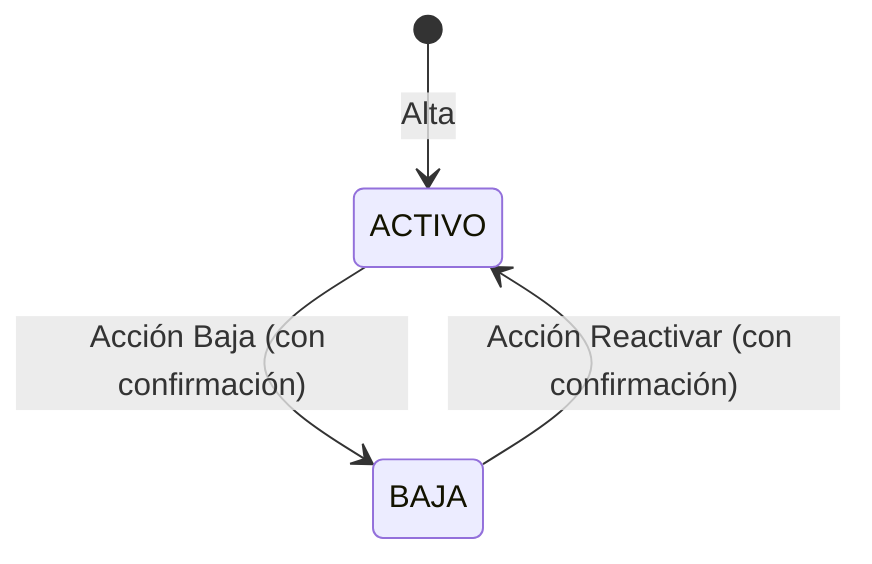

# Requerimientos Funcionales — Catálogos del sistema CIVENTOR

| Campo   | Valor |
|---------|-------|
| Versión | 1.1 |
| Fecha   | 2026-09-29 |
| Estado  | En definición |
| Módulo  | Backbone — menú **Catálogos** |
| Autor   | Análisis de Negocio |

---

## 1. Propósito del documento

Este documento explica qué deben hacer los catálogos del sistema CIVENTOR. Un catálogo es una lista de datos base (por ejemplo, empresas, sucursales o empleados) que otros procesos del sistema usan.

Para cada catálogo se describen las acciones comunes:

- **Registrar:** dar de alta un elemento nuevo.
- **Editar:** cambiar los datos de un elemento existente.
- **Dar de baja:** dejar de usar un elemento sin borrarlo.
- **Reactivar:** volver a usar un elemento que se dio de baja.
- **Consultar:** buscar y ver los elementos registrados.

El documento está pensado para que lo usen desarrolladores, testers, líderes de proyecto y usuarios del negocio.

## 2. Alcance del documento

**Incluye:** el catálogo de **Empresas**, con sus acciones de registro, edición, baja, reactivación y consulta, y la forma de enlazar a cada empresa sus certificados del SAT, sus sucursales y su personal.

**No incluye:** el registro y la edición de certificados, sucursales y empleados. Cada uno se describe en el documento de su propio catálogo.

## 3. Cómo leer este documento

Cada requerimiento sigue la misma estructura, de lo general a lo particular:

| Nivel | Qué es | Ejemplo |
|---|---|---|
| **RF** — Requerimiento funcional | Una función completa del sistema | RF-01 Registro de empresa |
| **HU** — Historia de usuario | Lo que una persona necesita hacer y para qué | HU-1.1 Registrar una empresa |
| **RN** — Regla de negocio | Una regla que el sistema siempre debe cumplir | RN-1.5 El RFC no se puede repetir |
| **CA** — Criterio de aceptación | La condición que confirma que la historia funciona | CA-1.1.4 Razón Social, RFC o Abreviatura repetidos |
| **CP** — Caso de prueba | Un ejemplo concreto, con datos, para probar un criterio | CP-1.1.12 RFC repetido |
| **PD** — Pendiente de definir | Una duda que el negocio debe resolver | PD-09 Roles con permiso |

Los criterios de aceptación y los casos de prueba se escriben en tres pasos:

- **Dado que:** la situación de partida.
- **Cuando:** lo que hace el usuario.
- **Entonces:** lo que el sistema debe hacer.

Cada caso de prueba indica entre paréntesis qué tipo de situación revisa:

| Tipo | Qué revisa |
|---|---|
| Flujo principal | El uso normal, cuando todo sale bien |
| Alternativo | Otra forma válida de llegar al resultado |
| Error | Datos incorrectos o incompletos que el sistema debe rechazar |
| Validación | Que el sistema revise o muestre bien un dato |
| Permisos | Lo que puede o no puede hacer un usuario según su rol |
| Estatus no permitido | Una acción que no aplica por el estatus del registro (por ejemplo, editar una empresa en BAJA) |
| Falta un paso previo | Una acción que aún no se puede hacer (por ejemplo, porque la empresa no se ha guardado o no hay nada seleccionado) |
| Dos usuarios al mismo tiempo | Dos personas cambian el mismo dato casi a la vez |
| Visibilidad | Qué se ve y qué no en pantalla |
| Restricción | Una acción que el sistema nunca permite |

La **prioridad** de cada requerimiento indica su importancia:

- **Indispensable (Must):** sin él no se puede operar.
- **Importante (Should):** es necesario, pero se puede operar un tiempo sin él.

## 4. Glosario

| Término | Significado |
|---|---|
| Backbone | Sistema de administración donde se encuentra el menú **Catálogos**. |
| SAT | Servicio de Administración Tributaria, la autoridad fiscal de México. |
| RFC | Registro Federal de Contribuyentes. Clave fiscal de la empresa ante el SAT. |
| Razón Social | Nombre legal de la empresa. |
| Persona física / moral | Una persona física es un individuo; una persona moral es una sociedad o empresa. |
| Régimen Fiscal | Forma en que la empresa paga impuestos ante el SAT. |
| Régimen Capital | Tipo de sociedad de la empresa (por ejemplo, S.A. de C.V.). |
| CFDI | Comprobante Fiscal Digital por Internet, es decir, la factura electrónica. |
| Uso CFDI | Para qué se usará la factura, según el catálogo del SAT. |
| Certificado de sello digital (CSD) | Archivo que entrega el SAT para firmar las facturas electrónicas de la empresa. Tiene fecha de vencimiento. |
| Timbrar | Enviar una factura para que se certifique y sea válida ante el SAT. |
| PAC | Proveedor Autorizado de Certificación. Es la empresa externa que timbra las facturas. |
| Consulta de timbres del PAC | Proceso del sistema que consulta al PAC la información de timbrado de cada empresa, por su RFC. |
| Forma de pago TRANS | Forma de pago "transferencia" del catálogo del SAT. Define qué formato debe tener un número de cuenta bancaria. |
| CLABE | Clave bancaria de 18 dígitos que se usa para transferencias. |
| Estatus | Situación de un registro: **ACTIVO** (se puede usar) o **BAJA** (ya no se usa, pero se conserva). |
| Enlazar / Desvincular | Enlazar asocia un elemento que ya existe (certificado, sucursal o empleado) con la empresa. Desvincular quita esa asociación sin borrar el elemento. |
| Solo lectura | El dato se puede ver, pero no se puede cambiar. |
| Datos de auditoría | Fecha, hora, equipo y usuario del último cambio guardado. |
| Bitácora de cambios | Historial completo de todos los movimientos que se hicieron sobre una empresa. |
| Equipo | Nombre o dirección IP de la computadora desde donde se hizo un movimiento. |
| Rol | Conjunto de permisos que tiene un usuario. Define qué acciones puede ver y usar. |

## 5. Usuarios que participan

| Usuario | Qué puede hacer |
|-------------|-------------|
| Responsable del catálogo de empresas | Registra, edita y consulta empresas. El sistema controla su acceso con roles de seguridad. Los roles que tienen este permiso están **pendientes de definir** (ver PD-09). |
| Usuario con permiso de baja | Responsable del catálogo cuyo rol le permite dar de baja empresas. Solo este usuario ve la acción **Baja**. |
| Usuario con permiso de reactivar | Responsable del catálogo cuyo rol le permite regresar a ACTIVO una empresa que está en BAJA. Solo este usuario ve la acción **Reactivar**. Los roles están **pendientes de definir** (ver PD-09). |
| Usuario con permiso de enlazar y desvincular | Responsable del catálogo cuyo rol le permite enlazar certificados, sucursales o personal a la empresa, y desvincularlos. Solo este usuario ve las acciones **Enlazar** y **Desvincular** de cada lista. Los roles están **pendientes de definir** (ver PD-09). |
| Usuario del sistema | Cualquier persona que consulta el catálogo o que elige una empresa desde otras pantallas. |

## 6. Catálogo al que aplica

Este documento describe el catálogo de **Empresas**. Las reglas de estatus y de bitácora de esta sección aplican a todas las empresas.

### 6.1 Estatus de una empresa

| Estatus | Qué significa | Cómo se asigna |
|---|---|---|
| ACTIVO | La empresa está vigente y se puede usar en los procesos | Automáticamente, al guardar una empresa nueva o al reactivarla |
| BAJA | La empresa ya no se usa; sus datos se conservan y solo se pueden consultar | Con la acción **Baja** del listado |

Una empresa en BAJA puede volver a ACTIVO con la acción **Reactivar** del listado.

**Cambios de estatus permitidos**

| Estatus inicial | Estatus final | Qué lo provoca |
|---|---|---|
| (Empresa nueva) | ACTIVO | Guardar la empresa por primera vez |
| ACTIVO | BAJA | Acción Baja, después de confirmar |
| BAJA | ACTIVO | Acción Reactivar, después de confirmar |

No existe ningún otro cambio de estatus. El diagrama muestra el ciclo de vida de una empresa: se crea en ACTIVO, se puede dar de baja y, desde BAJA, se puede reactivar. El ciclo se puede repetir las veces que sea necesario.

### 6.2 Bitácora de cambios

Cada empresa tiene una bitácora de cambios: un historial que guarda, en orden, todos los movimientos que se hacen sobre ella.

La diferencia con los datos de auditoría es esta: los datos de auditoría solo guardan el **último** cambio; la bitácora guarda **todos** los cambios.

**Qué guarda cada registro de la bitácora**

| Dato | Descripción |
|---|---|
| Tipo de movimiento | Alta, Modificación, Baja o Reactivación |
| Fecha y hora | Momento en que se guardó el movimiento |
| Usuario | Usuario que hizo el movimiento |
| Equipo | Nombre o dirección IP de la computadora desde donde se hizo |
| Detalle de campos | Por cada campo que cambió: nombre del campo, valor anterior y valor nuevo |

**Qué se registra en cada movimiento**

| Movimiento | Cuándo ocurre | Detalle que se guarda | RF |
|---|---|---|---|
| Alta | Al guardar una empresa nueva | No se guarda detalle de campos | RF-01 |
| Modificación | Al guardar cambios en una empresa en ACTIVO, incluido enlazar o desvincular certificados, sucursales o personal | Cada campo que cambió, con su valor anterior y el nuevo. En "Certificados", "Sucursales" o "Personal", el elemento que se enlazó o desvinculó | RF-02, RF-05, RF-06, RF-07 |
| Baja | Al confirmar la acción Baja | Estatus: ACTIVO → BAJA | RF-03 |
| Reactivación | Al confirmar la acción Reactivar | Estatus: BAJA → ACTIVO | RF-03 |

Si una operación no se guarda (porque no pasó una validación, porque el usuario no tenía permiso o porque canceló la confirmación), no se agrega nada a la bitácora.

La bitácora se consulta en la sección **Bitácora de cambios** del detalle de la empresa. Es de solo lectura y muestra primero el movimiento más reciente. Las reglas que la controlan son RN-1.14, RN-1.15, RN-1.16, RN-2.5 y RN-3.6.

## 7. Índice de requerimientos

> Haz clic en el identificador de la primera columna para ir directamente al requerimiento.

### 7.1 Empresas

| RF | Título | Sistema | Aplica a |
|----|--------|---------|----------|
| [RF-01](#rf-01) | Registro de empresa | Backbone | Alta de empresas |
| [RF-02](#rf-02) | Edición de empresa | Backbone | Empresas en ACTIVO |
| [RF-03](#rf-03) | Baja y reactivación de empresa | Backbone | Empresas en ACTIVO y en BAJA |
| [RF-04](#rf-04) | Consulta de empresas | Backbone | Todas las empresas |
| [RF-05](#rf-05) | Enlazar y desvincular certificados del SAT | Backbone | Lista Certificados del detalle de la empresa |
| [RF-06](#rf-06) | Enlazar y desvincular sucursales | Backbone | Lista Sucursales del detalle de la empresa |
| [RF-07](#rf-07) | Enlazar y desvincular personal | Backbone | Lista Personales del detalle de la empresa |

### 7.2 Otros catálogos que usa el catálogo de Empresas

| Catálogo | Tipo | Para qué se usa |
|---|---|---|
| Régimen Fiscal (catálogo del SAT) | Obligatorio | Indicar el régimen fiscal de la empresa |
| Uso CFDI (catálogo del SAT) | Obligatorio | Indicar el uso de CFDI; sus opciones dependen del régimen fiscal |
| Régimen Capital | Obligatorio | Indicar el tipo de sociedad |
| Ciudad, Estado y País | Domicilio | Capturar el domicilio fiscal |
| Banco | Opcional | Indicar el banco de la cuenta beneficiaria |
| Forma de Pago del SAT (clave TRANS) | Catálogo del SAT | Revisar que el número de cuenta tenga el formato correcto |
| Certificados de sello digital (SAT) | Catálogo relacionado | Elegir los certificados que se enlazan a la empresa o se desvinculan de ella (RF-05) |
| PAC | Dato del certificado | Proveedor que timbra con el certificado; se administra en el catálogo de Certificados |
| Sucursal | Catálogo relacionado | Elegir las sucursales que se enlazan a la empresa o se desvinculan de ella (RF-06) |
| Empleado | Catálogo relacionado | Elegir los empleados que se enlazan a la empresa o se desvinculan de ella (RF-07) |

---
---

# RF-01 — Registro de empresa

| Campo        | Valor |
|--------------|-------|
| Prioridad    | Indispensable (Must) |
| Estado       | En definición |
| Dependencias | Ninguna |

## Objetivo
Dar de alta cada empresa una sola vez y con datos correctos, para poder operar y facturar a su nombre.

## Descripción
El usuario captura los datos de la empresa: fiscales, domicilio, contacto y cuenta bancaria. El sistema revisa que estén completos, que tengan el formato del SAT y que la Razón Social, el RFC y la Abreviatura no estén ya registrados. La empresa queda en ACTIVO y el alta se guarda en la bitácora de cambios.

### Datos de la empresa

Los campos obligatorios de este requerimiento son Abreviatura, Razón Social, RFC, Régimen Fiscal, Uso CFDI, Régimen Capital y C.P.

La pantalla de la empresa se organiza en las secciones **Información General**, **Dirección**, **Contacto** y **Cuenta Beneficiario**. Después vienen las listas **Lista Certificados**, **Lista Sucursales** y **Lista Personales**, que se describen en la tabla "Listas de detalle". El orden y el contenido de cada sección se definen en CA-1.1.8.

**Campos que captura el usuario**

| Nombre | Descripción | Tipo de dato | Obligatorio | Longitud o formato | Valores permitidos | Observaciones |
|---|---|---|---|---|---|---|
| Abreviatura | Clave corta que identifica a la empresa | Texto | Sí | Máximo 6 caracteres | No se puede repetir entre empresas | Si se usa la opción de duplicar la empresa, este dato no se copia |
| Razón Social | Nombre fiscal de la empresa | Texto | Sí | De 1 a 254 caracteres; no admite el carácter `\|` | No se puede repetir entre empresas | Es el nombre con el que se elige la empresa en otras pantallas. Si se usa la opción de duplicar la empresa, este dato no se copia |
| RFC | Registro Federal de Contribuyentes | Texto | Sí | Máximo 13 caracteres. Formato del SAT: 3 o 4 letras (A-Z, Ñ, &), 6 dígitos de fecha y 3 caracteres de homoclave | No se puede repetir entre empresas | Si se usa la opción de duplicar la empresa, este dato no se copia. Ver PD-05 y PD-13 |
| Tipo de Persona | Tipo de persona fiscal | Lista de opciones | Pendiente de definir (ver PD-06) | No aplica | FÍSICA, MORAL | Al cambiarlo se borra el Régimen Fiscal elegido |
| Régimen Fiscal | Régimen fiscal ante el SAT | Lista de opciones (catálogo) | Sí | No aplica | Regímenes activos que corresponden al Tipo de Persona | Al cambiarlo se borra el Uso CFDI elegido |
| Uso CFDI | Uso de CFDI de la empresa | Lista de opciones (catálogo) | Sí, solo al crear la empresa | No aplica | Usos activos del Régimen Fiscal elegido que aplican al Tipo de Persona | Ver PD-02 |
| Régimen Capital | Régimen de capital de la sociedad | Lista de opciones (catálogo) | Sí | No aplica | Regímenes de capital activos | |
| F. Registro | Fecha de registro de la empresa | Fecha | No | Fecha | Pendiente de definir | |
| Calle | Calle del domicilio fiscal | Texto | No | Máximo 80 caracteres | Libre | |
| No. Exterior | Número exterior | Texto | No | Máximo 20 caracteres | Libre | |
| No. Interior | Número interior | Texto | No | Máximo 20 caracteres | Libre | |
| Colonia | Colonia | Texto | No | Máximo 60 caracteres | Libre | |
| Ciudad | Ciudad del domicilio | Lista de opciones (catálogo) | No | No aplica | Catálogo de ciudades | Al elegirla se llenan solos Estado y País |
| Estado | Estado del domicilio | Lista de opciones (catálogo) | No | No aplica | El de la ciudad elegida | No se puede editar |
| País | País del domicilio | Lista de opciones (catálogo) | No | No aplica | El del estado | No se puede editar. Al crear una empresa aparece "México" |
| C.P. | Código postal | Texto | Sí | Exactamente 5 dígitos | Solo números del 0 al 9 | |
| Email | Correo de contacto | Texto | No | Máximo 60 caracteres, con formato de correo válido | Libre | Se guarda en minúsculas |
| Teléfono | Teléfono de contacto | Texto | No | Máximo 25 caracteres | Libre | No se valida el formato |
| Banco | Banco de la cuenta beneficiaria | Lista de opciones (catálogo) | No | No aplica | Catálogo de bancos | No aparece en el listado |
| No. Cuenta | Número de la cuenta beneficiaria | Texto | No | Máximo 100 caracteres; debe tener el formato de cuenta que indica la forma de pago TRANS del SAT | Según ese formato | No aparece en el listado. Ver PD-10 |

**Campos que llena el sistema**

| Nombre | Descripción | Tipo de dato | Observaciones |
|---|---|---|---|
| Estatus | Situación de la empresa | Lista | ACTIVO o BAJA. No se captura. Ver la sección 6.1 y PD-07 |
| Fecha de estatus | Fecha y hora del último cambio de estatus | Fecha y hora | Automática |
| Baja por | Usuario que dio de baja la empresa | Usuario | No se muestra en pantalla; se llena al dar de baja |
| Reactivado por | Usuario que reactivó la empresa, con la fecha y hora | Usuario, fecha y hora | No se muestra en pantalla; se llena al reactivar. Ver PD-14 |
| Datos de auditoría | Fecha y hora de la última modificación, equipo o dirección IP desde donde se hizo, y usuario | Varios | Automáticos al guardar |

**Listas de detalle**

| Lista | Contenido | Observaciones |
|---|---|---|
| Lista Certificados | Certificados de sello digital enlazados a la empresa: No. Certificado, F. Expiración y Estatus | Se agregan con Enlazar y se quitan con Desvincular (RF-05). Los certificados se registran en su propio catálogo |
| Lista Sucursales | Sucursales enlazadas a la empresa: Abreviatura, Nombre, Tipo y Estatus | Se agregan con Enlazar y se quitan con Desvincular (RF-06). Las sucursales se registran en su propio catálogo |
| Lista Personales | Empleados enlazados a la empresa: No. Nómina, Nombre completo, Puesto y Estatus | Se agregan con Enlazar y se quitan con Desvincular (RF-07). Los empleados se registran en su propio catálogo |
| Bitácora de cambios | Movimientos de alta, modificación, baja y reactivación de la empresa | Solo lectura. Ver la sección 6.2 |

## HU-1.1 — Registrar una empresa

Como responsable del catálogo de empresas, quiero registrar una nueva empresa con sus datos de identificación fiscal, para poder emitir documentos y operar procesos a su nombre.

### Reglas de negocio

**RN-1.1** La Razón Social es obligatoria.

**RN-1.2** La Razón Social no se puede repetir entre empresas, estén activas o dadas de baja.

**RN-1.3** La Razón Social no admite el carácter `|` ni más de 254 caracteres.

**RN-1.4** El RFC es obligatorio.

**RN-1.5** El RFC no se puede repetir entre empresas, estén activas o dadas de baja.

**RN-1.6** El RFC debe cumplir el formato del SAT.

**RN-1.7** La Abreviatura es obligatoria.

**RN-1.8** La Abreviatura no se puede repetir entre empresas.

**RN-1.9** El Régimen Fiscal es obligatorio.

**RN-1.10** El Uso CFDI es obligatorio al crear la empresa.

**RN-1.11** El Régimen Capital es obligatorio y solo se eligen regímenes de capital activos.

**RN-1.12** Toda empresa nueva queda en estatus ACTIVO.

**RN-1.13** Al guardar se registran la fecha y hora, el equipo y el usuario.

**RN-1.14** Cada alta, modificación, baja y reactivación que se guarda con éxito agrega un registro a la bitácora de cambios de la empresa, con el tipo de movimiento, la fecha y hora, el usuario y el equipo o dirección IP.

**RN-1.15** Una operación que no se guarda (por una validación, por falta de permiso o porque se canceló la confirmación) no genera registro en la bitácora.

**RN-1.16** La bitácora es de solo lectura: sus registros no se pueden modificar ni eliminar, se conservan aunque la empresa esté en BAJA y se muestran en la sección Bitácora de cambios del detalle, del más reciente al más antiguo.

### Criterios de Aceptación

**CA-1.1.1 — Registrar empresa con datos válidos**
Dado que el responsable captura Abreviatura, Razón Social, RFC, Régimen Fiscal, Uso CFDI, Régimen Capital y C.P. válidos y que no existen en otra empresa
Cuando guarda
Entonces el sistema crea la empresa en estatus ACTIVO.

**CA-1.1.2 — Valores iniciales de una empresa nueva**
Dado que el responsable elige Nuevo en el catálogo de empresas
Cuando se muestra la pantalla de captura
Entonces el País aparece como "México" y el Estatus como ACTIVO.

**CA-1.1.3 — Campo obligatorio vacío**
Dado que el responsable deja vacío alguno de los campos Abreviatura, Razón Social, RFC, Régimen Fiscal, Uso CFDI o Régimen Capital
Cuando guarda
Entonces el sistema muestra el mensaje de campo requerido correspondiente y no guarda.

**CA-1.1.4 — Razón Social, RFC o Abreviatura repetidos**
Dado que ya existe otra empresa, activa o dada de baja, con la misma Razón Social, el mismo RFC o la misma Abreviatura
Cuando el responsable guarda la nueva empresa
Entonces el sistema muestra el mensaje de valor repetido correspondiente y no guarda.

**CA-1.1.5 — Formato inválido de Razón Social o RFC**
Dado que la Razón Social contiene el carácter `|`, o el RFC no cumple el formato del SAT
Cuando el responsable guarda
Entonces el sistema muestra el mensaje de formato inválido correspondiente y no guarda.

**CA-1.1.6 — Registro de auditoría**
Dado que el responsable guardó una empresa nueva con éxito
Cuando se revisan los datos de auditoría de la empresa
Entonces aparecen la fecha y hora, el equipo y el usuario que hizo el alta.

**CA-1.1.7 — Usuario sin permiso de alta**
Dado que el rol del usuario no le permite crear empresas
Cuando abre el catálogo de empresas
Entonces el sistema no le ofrece la opción de crear una empresa nueva.

**CA-1.1.8 — Acomodo visual de la pantalla por secciones**
Dado que el responsable abre la pantalla de captura de una empresa
Cuando se muestra la pantalla
Entonces los campos aparecen agrupados en secciones con título propio, en este orden, y cada campo aparece solo en su sección:

| Orden | Sección | Contenido |
|---|---|---|
| 1 | Información General | Abreviatura, Razón Social, RFC, Tipo de Persona, Régimen Fiscal, Uso CFDI, Régimen Capital, F. Registro y Estatus |
| 2 | Dirección | Calle, No. Exterior, No. Interior, Colonia, Ciudad, Estado, País y C.P. |
| 3 | Contacto | Email y Teléfono |
| 4 | Cuenta Beneficiario | Banco y No. Cuenta |
| 5 | Lista Certificados | Certificados de sello digital enlazados a la empresa, con las acciones Enlazar y Desvincular (RF-05) |
| 6 | Lista Sucursales | Sucursales enlazadas a la empresa, con las acciones Enlazar y Desvincular (RF-06) |
| 7 | Lista Personales | Empleados enlazados a la empresa, con las acciones Enlazar y Desvincular (RF-07) |
| 8 | Bitácora de cambios | Movimientos de la empresa, en solo lectura (sección 6.2) |

**CA-1.1.9 — Alta registrada en la bitácora de cambios**
Dado que el responsable guardó una empresa nueva con éxito
Cuando consulta la sección Bitácora de cambios de la empresa
Entonces aparece un único registro de tipo Alta con la fecha y hora, el usuario y el equipo del alta.

**CA-1.1.10 — Alta rechazada no se registra**
Dado que el responsable intenta guardar una empresa nueva que no cumple una regla del alta
Cuando el sistema rechaza el guardado
Entonces no se crea ningún registro en la bitácora de cambios.

**CA-1.1.11 — Bitácora de solo lectura**
Dado que la empresa tiene registros en su bitácora de cambios
Cuando el usuario consulta la sección Bitácora de cambios
Entonces ve los registros del más reciente al más antiguo y no puede modificarlos ni eliminarlos.

### Casos de prueba

**CP-1.1.1 — Alta exitosa de empresa (flujo principal)**
Verifica: CA-1.1.1 · RN-1.12
Dado que no existe ninguna empresa con Abreviatura "GMAL", Razón Social "GRUPO MALIA SA DE CV" ni RFC "GMA010101AB1"
Cuando el responsable captura esos datos, elige Tipo de Persona MORAL, un Régimen Fiscal, un Uso CFDI, un Régimen Capital, el C.P. "20000" y guarda
Entonces el sistema crea la empresa y la muestra con estatus ACTIVO.

**CP-1.1.2 — Alta de persona física (alternativo)**
Verifica: CA-1.1.1
Dado que no existe ninguna empresa con RFC "VERM800101AB1"
Cuando el responsable registra una empresa con Tipo de Persona FÍSICA, ese RFC de 13 caracteres y el resto de los campos obligatorios válidos
Entonces el sistema crea la empresa en estatus ACTIVO.

**CP-1.1.3 — Valores iniciales al crear (validación)**
Verifica: CA-1.1.2 · RN-1.22, RN-1.12
Dado que el responsable está en el listado de empresas
Cuando elige Nuevo
Entonces el campo País muestra "México" y el Estatus muestra ACTIVO.

**CP-1.1.4 — Falta la Abreviatura (error)**
Verifica: CA-1.1.3 · RN-1.7
Dado que el responsable captura todos los campos obligatorios excepto la Abreviatura
Cuando guarda
Entonces el sistema muestra "La Abreviatura es un campo requerido." y no guarda.

**CP-1.1.5 — Falta la Razón Social (error)**
Verifica: CA-1.1.3 · RN-1.1
Dado que el responsable deja vacía la Razón Social
Cuando guarda
Entonces el sistema muestra "La Razón Social es un campo requerido." y no guarda.

**CP-1.1.6 — Falta el RFC (error)**
Verifica: CA-1.1.3 · RN-1.4
Dado que el responsable deja vacío el RFC
Cuando guarda
Entonces el sistema muestra "El RFC es un campo requerido." y no guarda.

**CP-1.1.7 — Falta el Régimen Fiscal (error)**
Verifica: CA-1.1.3 · RN-1.9
Dado que el responsable no elige Régimen Fiscal
Cuando guarda
Entonces el sistema muestra "El Régimen Fiscal es un campo requerido." y no guarda.

**CP-1.1.8 — Falta el Uso CFDI en una empresa nueva (error)**
Verifica: CA-1.1.3 · RN-1.10
Dado que el responsable está creando una empresa y no elige Uso CFDI
Cuando guarda
Entonces el sistema muestra "Seleccione el uso del CFDI" y no guarda.

**CP-1.1.9 — Falta el Régimen Capital (error)**
Verifica: CA-1.1.3 · RN-1.11
Dado que el responsable no elige Régimen Capital
Cuando guarda
Entonces el sistema muestra "El Régimen Capital es un campo requerido." y no guarda.

**CP-1.1.10 — Razón Social repetida con empresa activa (validación)**
Verifica: CA-1.1.4 · RN-1.2
Dado que existe la empresa "GRUPO MALIA SA DE CV" en estatus ACTIVO
Cuando el responsable intenta registrar otra empresa con esa misma Razón Social
Entonces el sistema muestra "La Razón Social debe de ser único, el mismo valor ya existe." y no guarda.

**CP-1.1.11 — Razón Social repetida con empresa dada de baja (validación)**
Verifica: CA-1.1.4 · RN-1.2
Dado que existe la empresa "VICENTE REYES MAGAÑA" en estatus BAJA
Cuando el responsable intenta registrar otra empresa con esa misma Razón Social
Entonces el sistema muestra el mensaje de Razón Social repetida y no guarda.

**CP-1.1.12 — RFC repetido (validación)**
Verifica: CA-1.1.4 · RN-1.5
Dado que existe una empresa con RFC "GMA010101AB1"
Cuando el responsable intenta registrar otra empresa con ese RFC
Entonces el sistema muestra "El RFC debe de ser único, el mismo valor ya existe." y no guarda.

**CP-1.1.13 — Abreviatura repetida (validación)**
Verifica: CA-1.1.4 · RN-1.8
Dado que existe una empresa con Abreviatura "GMAL"
Cuando el responsable intenta registrar otra empresa con esa Abreviatura
Entonces el sistema muestra "La Abreviatura ya se encuentra registrado en el sistema." y no guarda.

**CP-1.1.14 — Abreviatura de más de 6 caracteres (validación)**
Verifica: CA-1.1.3
Dado que el responsable está capturando la Abreviatura
Cuando intenta escribir "GRUPOMA" (7 caracteres)
Entonces el campo no admite más de 6 caracteres.

**CP-1.1.15 — Razón Social con carácter no permitido (validación)**
Verifica: CA-1.1.5 · RN-1.3
Dado que el responsable captura la Razón Social "GRUPO | MALIA"
Cuando guarda
Entonces el sistema muestra "La Razón Social no contiene un formato válido de acuerdo a la especificación del SAT." y no guarda.

**CP-1.1.16 — RFC con formato inválido (validación)**
Verifica: CA-1.1.5 · RN-1.6
Dado que el responsable captura el RFC "12AB0101"
Cuando guarda
Entonces el sistema muestra "El RFC no contiene un formato válido de acuerdo a la especificación del SAT." y no guarda.

**CP-1.1.17 — Datos de auditoría del alta (validación)**
Verifica: CA-1.1.6 · RN-1.13
Dado que el usuario "jperez" guarda una empresa nueva con éxito
Cuando se consultan los datos de auditoría de esa empresa
Entonces aparecen la fecha y hora del alta, el equipo desde donde se hizo y el usuario "jperez".

**CP-1.1.18 — Usuario sin permiso de alta (permisos)**
Verifica: CA-1.1.7
Dado que un usuario cuyo rol solo permite consultar abre el catálogo de empresas
Cuando busca la opción para crear una empresa
Entonces el sistema no la muestra o la deshabilita.

**CP-1.1.19 — Secciones de la pantalla y su orden (flujo principal)**
Verifica: CA-1.1.8
Dado que el responsable está en el listado de empresas
Cuando elige Nuevo
Entonces la pantalla muestra, en este orden, las secciones con título "Información General", "Dirección", "Contacto", "Cuenta Beneficiario", "Lista Certificados", "Lista Sucursales", "Lista Personales" y "Bitácora de cambios".

**CP-1.1.20 — Campos de la sección Información General (validación)**
Verifica: CA-1.1.8
Dado que el responsable abre la pantalla de captura de una empresa nueva
Cuando revisa la sección "Información General"
Entonces encuentra Abreviatura, Razón Social, RFC, Tipo de Persona, Régimen Fiscal, Uso CFDI, Régimen Capital, F. Registro y Estatus, y ninguno de esos campos aparece en otra sección.

**CP-1.1.21 — Campos de la sección Dirección (validación)**
Verifica: CA-1.1.8
Dado que el responsable abre la pantalla de captura de una empresa nueva
Cuando revisa la sección "Dirección"
Entonces encuentra Calle, No. Exterior, No. Interior, Colonia, Ciudad, Estado, País y C.P., y ninguno de esos campos aparece en otra sección.

**CP-1.1.22 — Campos de las secciones Contacto y Cuenta Beneficiario (validación)**
Verifica: CA-1.1.8
Dado que el responsable abre la pantalla de captura de una empresa nueva
Cuando revisa las secciones "Contacto" y "Cuenta Beneficiario"
Entonces "Contacto" contiene solo Email y Teléfono, y "Cuenta Beneficiario" contiene solo Banco y No. Cuenta.

**CP-1.1.23 — Listas de una empresa nueva (alternativo)**
Verifica: CA-1.1.8
Dado que el responsable está creando una empresa que aún no se ha guardado
Cuando revisa las secciones "Lista Certificados", "Lista Sucursales", "Lista Personales" y "Bitácora de cambios"
Entonces las cuatro secciones se muestran con su título y sin registros.

**CP-1.1.24 — Listas de una empresa con registros (validación)**
Verifica: CA-1.1.8
Dado que existe la empresa "GRUPO MALIA SA DE CV" con un certificado, dos sucursales y tres empleados asignados
Cuando el responsable abre su detalle
Entonces "Lista Certificados" muestra el certificado, "Lista Sucursales" muestra las dos sucursales y "Lista Personales" muestra los tres empleados, cada uno solo en su lista.

**CP-1.1.25 — Registro de Alta en la bitácora (flujo principal)**
Verifica: CA-1.1.9 · RN-1.14
Dado que el usuario "jperez" guarda con éxito la empresa nueva "GRUPO MALIA SA DE CV"
Cuando abre su detalle y revisa la sección "Bitácora de cambios"
Entonces aparece un solo registro de tipo "Alta", con la fecha y hora del alta, el usuario "jperez" y el equipo desde donde se hizo.

**CP-1.1.26 — Alta rechazada por RFC repetido (error)**
Verifica: CA-1.1.10 · RN-1.15, RN-1.5
Dado que existe una empresa con RFC "GMA010101AB1"
Cuando el responsable intenta registrar otra empresa con ese RFC y el sistema muestra "El RFC debe de ser único, el mismo valor ya existe."
Entonces no se crea la empresa ni ningún registro de Alta en la bitácora.

**CP-1.1.27 — Registros de la bitácora no editables (restricción)**
Verifica: CA-1.1.11 · RN-1.16
Dado que la empresa "GRUPO MALIA SA DE CV" tiene su registro de Alta en la bitácora
Cuando el usuario intenta modificar o eliminar ese registro desde la sección "Bitácora de cambios"
Entonces el sistema no ofrece ninguna acción para modificarlo ni eliminarlo.

**CP-1.1.28 — Orden de los registros (validación)**
Verifica: CA-1.1.11 · RN-1.16
Dado que la empresa "GRUPO MALIA SA DE CV" tiene un registro de Alta y, después, dos de Modificación
Cuando el usuario consulta la sección "Bitácora de cambios"
Entonces la Modificación más reciente aparece primero y el Alta aparece al final.

| CA | Caso(s) de prueba | Escenarios cubiertos |
| --- | --- | --- |
| CA-1.1.1 | CP-1.1.1, CP-1.1.2 | Flujo principal, alternativo (persona física) |
| CA-1.1.2 | CP-1.1.3 | Validación de valores iniciales |
| CA-1.1.3 | CP-1.1.4 a CP-1.1.9, CP-1.1.14 | Error por obligatorios, longitud |
| CA-1.1.4 | CP-1.1.10 a CP-1.1.13 | Validación de repetidos (activa y en baja) |
| CA-1.1.5 | CP-1.1.15, CP-1.1.16 | Validación de formato SAT |
| CA-1.1.6 | CP-1.1.17 | Auditoría |
| CA-1.1.7 | CP-1.1.18 | Permisos |
| CA-1.1.8 | CP-1.1.19 a CP-1.1.24 | Acomodo visual: orden de secciones, campos por sección, listas vacías y con registros |
| CA-1.1.9 | CP-1.1.25 | Bitácora: registro de Alta |
| CA-1.1.10 | CP-1.1.26 | Bitácora: alta rechazada sin registro |
| CA-1.1.11 | CP-1.1.27, CP-1.1.28 | Bitácora: solo lectura, orden de registros |

---

## HU-1.2 — Filtrar régimen fiscal y uso de CFDI

Como responsable del catálogo de empresas, quiero que las listas de Régimen Fiscal y Uso CFDI solo me muestren las opciones que corresponden al Tipo de Persona y al régimen elegido, para no elegir una combinación que el SAT no acepta.

### Reglas de negocio

**RN-1.17** La lista de Régimen Fiscal solo muestra regímenes activos del Tipo de Persona elegido: los de persona física si es FÍSICA, y los de persona moral si es MORAL o si todavía no se elige un Tipo de Persona.

**RN-1.18** Al cambiar el Tipo de Persona se borra el Régimen Fiscal elegido.

**RN-1.19** La lista de Uso CFDI solo muestra usos activos del Régimen Fiscal elegido que aplican al Tipo de Persona.

**RN-1.20** Al cambiar el Régimen Fiscal se borra el Uso CFDI elegido.

### Criterios de Aceptación

**CA-1.2.1 — Regímenes de persona física**
Dado que el Tipo de Persona es FÍSICA
Cuando el responsable abre la lista de Régimen Fiscal
Entonces solo ve regímenes activos que aplican a persona física.

**CA-1.2.2 — Regímenes de persona moral**
Dado que el Tipo de Persona es MORAL
Cuando el responsable abre la lista de Régimen Fiscal
Entonces solo ve regímenes activos que aplican a persona moral.

**CA-1.2.3 — Cambio de Tipo de Persona**
Dado que el responsable ya eligió un Régimen Fiscal
Cuando cambia el Tipo de Persona
Entonces el Régimen Fiscal queda vacío.

**CA-1.2.4 — Usos de CFDI del régimen**
Dado que el responsable eligió un Régimen Fiscal
Cuando abre la lista de Uso CFDI
Entonces solo ve usos activos de ese régimen que aplican al Tipo de Persona.

**CA-1.2.5 — Cambio de Régimen Fiscal**
Dado que el responsable ya eligió un Uso CFDI
Cuando cambia el Régimen Fiscal
Entonces el Uso CFDI queda vacío.

### Casos de prueba

**CP-1.2.1 — Lista de regímenes para persona física (flujo principal)**
Verifica: CA-1.2.1 · RN-1.17
Dado que el responsable elige Tipo de Persona FÍSICA
Cuando abre la lista de Régimen Fiscal
Entonces solo aparecen regímenes activos marcados para persona física.

**CP-1.2.2 — Régimen inactivo no aparece (validación)**
Verifica: CA-1.2.1 · RN-1.17
Dado que en el catálogo de Régimen Fiscal hay un régimen de persona física en estatus inactivo
Cuando el responsable, con Tipo de Persona FÍSICA, abre la lista de Régimen Fiscal
Entonces ese régimen no aparece.

**CP-1.2.3 — Lista de regímenes para persona moral (flujo principal)**
Verifica: CA-1.2.2 · RN-1.17
Dado que el responsable elige Tipo de Persona MORAL
Cuando abre la lista de Régimen Fiscal
Entonces solo aparecen regímenes activos marcados para persona moral.

**CP-1.2.4 — Cambio de MORAL a FÍSICA borra el régimen (alternativo)**
Verifica: CA-1.2.3 · RN-1.18
Dado que la empresa tiene Tipo de Persona MORAL y un Régimen Fiscal elegido
Cuando el responsable cambia el Tipo de Persona a FÍSICA
Entonces el Régimen Fiscal queda vacío y la lista solo ofrece regímenes de persona física.

**CP-1.2.5 — Guardar tras borrar el régimen (error)**
Verifica: CA-1.2.3 · RN-1.9, RN-1.18
Dado que el responsable cambió el Tipo de Persona y el Régimen Fiscal quedó vacío
Cuando guarda sin elegir un nuevo régimen
Entonces el sistema muestra "El Régimen Fiscal es un campo requerido." y no guarda.

**CP-1.2.6 — Lista de usos de CFDI del régimen (flujo principal)**
Verifica: CA-1.2.4 · RN-1.19
Dado que el responsable eligió Tipo de Persona MORAL y un Régimen Fiscal
Cuando abre la lista de Uso CFDI
Entonces solo aparecen usos activos ligados a ese régimen y que aplican a persona moral.

**CP-1.2.7 — Uso de CFDI inactivo no aparece (validación)**
Verifica: CA-1.2.4 · RN-1.19
Dado que un uso de CFDI ligado al régimen elegido está inactivo
Cuando el responsable abre la lista de Uso CFDI
Entonces ese uso no aparece.

**CP-1.2.8 — Cambio de régimen borra el uso (alternativo)**
Verifica: CA-1.2.5 · RN-1.20
Dado que la empresa tiene un Régimen Fiscal y un Uso CFDI elegidos
Cuando el responsable elige otro Régimen Fiscal
Entonces el Uso CFDI queda vacío.

| CA | Caso(s) de prueba | Escenarios cubiertos |
| --- | --- | --- |
| CA-1.2.1 | CP-1.2.1, CP-1.2.2 | Flujo principal, validación de activos |
| CA-1.2.2 | CP-1.2.3 | Flujo principal |
| CA-1.2.3 | CP-1.2.4, CP-1.2.5 | Alternativo, error al guardar |
| CA-1.2.4 | CP-1.2.6, CP-1.2.7 | Flujo principal, validación de activos |
| CA-1.2.5 | CP-1.2.8 | Alternativo |

---

## HU-1.3 — Capturar el domicilio fiscal

Como responsable del catálogo de empresas, quiero capturar el domicilio fiscal y que el estado y el país se llenen a partir de la ciudad, para evitar direcciones incongruentes en los documentos de la empresa.

### Reglas de negocio

**RN-1.21** El C.P. es obligatorio y debe tener exactamente 5 dígitos.

**RN-1.22** Al elegir una Ciudad, Estado y País se llenan solos y no se pueden editar. Al crear una empresa aparece el País "México".

### Criterios de Aceptación

**CA-1.3.1 — Estado y país automáticos**
Dado que el responsable está capturando el domicilio
Cuando elige una Ciudad
Entonces el Estado y el País se llenan con los que corresponden a esa ciudad y no se pueden editar.

**CA-1.3.2 — C.P. obligatorio**
Dado que el responsable deja vacío el C.P.
Cuando guarda
Entonces el sistema muestra "El Código Postal (C.P.) es un campo requerido." y no guarda.

**CA-1.3.3 — C.P. con formato inválido**
Dado que el responsable captura un C.P. que no tiene exactamente 5 dígitos
Cuando guarda
Entonces el sistema no lo acepta e indica "El Codigo Postal es inválido.".

**CA-1.3.4 — Domicilio parcial**
Dado que el responsable captura solo el C.P. y deja vacíos Calle, números, Colonia y Ciudad
Cuando guarda con el resto de los datos obligatorios válidos
Entonces el sistema guarda la empresa.

### Casos de prueba

**CP-1.3.1 — Llenado automático de estado y país (flujo principal)**
Verifica: CA-1.3.1 · RN-1.22
Dado que el responsable está capturando una empresa
Cuando elige la Ciudad "Aguascalientes"
Entonces el Estado muestra "Aguascalientes" y el País "México".

**CP-1.3.2 — Estado y país no editables (validación)**
Verifica: CA-1.3.1 · RN-1.22
Dado que el responsable ya eligió una Ciudad
Cuando intenta cambiar a mano el Estado o el País
Entonces ambos campos aparecen deshabilitados.

**CP-1.3.3 — C.P. vacío (error)**
Verifica: CA-1.3.2 · RN-1.21
Dado que el responsable deja vacío el C.P.
Cuando guarda
Entonces el sistema muestra "El Código Postal (C.P.) es un campo requerido." y no guarda.

**CP-1.3.4 — C.P. de 4 dígitos (validación)**
Verifica: CA-1.3.3 · RN-1.21
Dado que el responsable captura el C.P. "2000"
Cuando guarda
Entonces el sistema muestra "El Codigo Postal es inválido." y no guarda.

**CP-1.3.5 — C.P. con letras (validación)**
Verifica: CA-1.3.3 · RN-1.21
Dado que el responsable está capturando el C.P.
Cuando intenta escribir "20A00"
Entonces el campo no acepta la letra.

**CP-1.3.6 — Guardar con domicilio parcial (alternativo)**
Verifica: CA-1.3.4
Dado que el responsable captura solo el C.P. "20000" y deja vacíos los demás datos del domicilio
Cuando guarda con el resto de los datos obligatorios válidos
Entonces el sistema guarda la empresa en estatus ACTIVO.

| CA | Caso(s) de prueba | Escenarios cubiertos |
| --- | --- | --- |
| CA-1.3.1 | CP-1.3.1, CP-1.3.2 | Flujo principal, validación de solo lectura |
| CA-1.3.2 | CP-1.3.3 | Error por obligatorio |
| CA-1.3.3 | CP-1.3.4, CP-1.3.5 | Validación de formato |
| CA-1.3.4 | CP-1.3.6 | Alternativo |

---

## HU-1.4 — Registrar contacto y cuenta beneficiaria

Como responsable del catálogo de empresas, quiero registrar el correo, el teléfono y la cuenta bancaria beneficiaria de la empresa, para tener a la mano sus datos de contacto.

### Reglas de negocio

**RN-1.23** El Email, si se captura, debe tener formato de correo válido; se guarda en minúsculas.

**RN-1.24** El No. Cuenta, si se captura, debe tener el formato de cuenta que indica la forma de pago TRANS. Si esa forma de pago no existe en el sistema, la cuenta no se revisa.

**RN-1.25** Banco y No. Cuenta no se muestran en el listado de empresas.

### Criterios de Aceptación

**CA-1.4.1 — Email válido**
Dado que el responsable captura un Email con formato de correo válido
Cuando guarda
Entonces el sistema lo acepta y lo guarda en minúsculas.

**CA-1.4.2 — Email inválido**
Dado que el responsable captura un Email sin formato de correo
Cuando guarda
Entonces el sistema muestra "El Email no posee un formato válido." y no guarda.

**CA-1.4.3 — Email vacío**
Dado que el responsable deja vacío el Email
Cuando guarda
Entonces el sistema no valida el correo y guarda la empresa.

**CA-1.4.4 — Número de cuenta válido**
Dado que existe la forma de pago TRANS y el responsable captura un No. Cuenta que tiene el formato que ella indica
Cuando guarda
Entonces el sistema acepta la cuenta.

**CA-1.4.5 — Número de cuenta inválido**
Dado que existe la forma de pago TRANS y el responsable captura un No. Cuenta que no tiene el formato que ella indica
Cuando guarda
Entonces el sistema muestra "El Número de Cuenta especificado no es válido de acuerdo al patrón indicado en el catálogo de FormaPago del SAT." y no guarda.

**CA-1.4.6 — Cuenta sin validar**
Dado que el No. Cuenta está vacío, o no existe la forma de pago TRANS
Cuando el responsable guarda
Entonces el sistema no valida la cuenta y guarda la empresa.

**CA-1.4.7 — Datos bancarios fuera del listado**
Dado que el usuario está en el listado de empresas
Cuando revisa las columnas
Entonces no ve Banco ni No. Cuenta.

### Casos de prueba

**CP-1.4.1 — Email en mayúsculas se guarda en minúsculas (flujo principal)**
Verifica: CA-1.4.1 · RN-1.23
Dado que el responsable captura el Email "Contacto@GrupoMalia.MX"
Cuando guarda
Entonces el sistema guarda "contacto@grupomalia.mx".

**CP-1.4.2 — Email sin arroba (error)**
Verifica: CA-1.4.2 · RN-1.23
Dado que el responsable captura el Email "contacto.grupomalia.mx"
Cuando guarda
Entonces el sistema muestra "El Email no posee un formato válido." y no guarda.

**CP-1.4.3 — Email vacío (alternativo)**
Verifica: CA-1.4.3 · RN-1.23
Dado que el responsable deja vacío el Email y los demás datos obligatorios son válidos
Cuando guarda
Entonces el sistema guarda la empresa.

**CP-1.4.4 — Cuenta con formato correcto (flujo principal)**
Verifica: CA-1.4.4 · RN-1.24
Dado que existe la forma de pago TRANS con su formato de cuenta configurado
Cuando el responsable captura una CLABE de 18 dígitos que tiene ese formato y guarda
Entonces el sistema acepta la cuenta.

**CP-1.4.5 — Cuenta con formato incorrecto (error)**
Verifica: CA-1.4.5 · RN-1.24
Dado que existe la forma de pago TRANS con su formato de cuenta configurado
Cuando el responsable captura el No. Cuenta "ABC123" y guarda
Entonces el sistema muestra el mensaje de número de cuenta no válido y no guarda.

**CP-1.4.6 — Cuenta vacía (alternativo)**
Verifica: CA-1.4.6 · RN-1.24
Dado que el responsable deja vacío el No. Cuenta
Cuando guarda
Entonces el sistema no valida la cuenta y guarda la empresa.

**CP-1.4.7 — Sin forma de pago TRANS (alternativo)**
Verifica: CA-1.4.6 · RN-1.24
Dado que en el catálogo de formas de pago no existe la clave TRANS
Cuando el responsable captura cualquier No. Cuenta y guarda
Entonces el sistema no valida la cuenta y guarda la empresa.

**CP-1.4.8 — Listado sin datos bancarios (visibilidad)**
Verifica: CA-1.4.7 · RN-1.25
Dado que existe una empresa con Banco y No. Cuenta capturados
Cuando el usuario abre el listado de empresas
Entonces no aparecen las columnas Banco ni No. Cuenta.

| CA | Caso(s) de prueba | Escenarios cubiertos |
| --- | --- | --- |
| CA-1.4.1 | CP-1.4.1 | Flujo principal |
| CA-1.4.2 | CP-1.4.2 | Error de formato |
| CA-1.4.3 | CP-1.4.3 | Alternativo |
| CA-1.4.4 | CP-1.4.4 | Flujo principal |
| CA-1.4.5 | CP-1.4.5 | Error de formato de cuenta |
| CA-1.4.6 | CP-1.4.6, CP-1.4.7 | Alternativos |
| CA-1.4.7 | CP-1.4.8 | Visibilidad |

---

**Regla general:**
La Razón Social de la empresa es el nombre con el que se identifica en todas las pantallas que permiten elegir una empresa (RN-4.4), y su RFC es el que se usa para consultar los timbres del PAC (RN-3.5). Por eso ambos deben ser únicos y válidos desde el alta.

[← Regresar al Índice de requerimientos](#indice-requerimientos)

---
---

# RF-02 — Edición de empresa

| Campo        | Valor |
|--------------|-------|
| Prioridad    | Indispensable (Must) |
| Estado       | En definición |
| Dependencias | RF-01 |

## Objetivo
Mantener al día los datos de las empresas activas.

## Descripción
El usuario puede cambiar los datos de una empresa en ACTIVO; el sistema aplica las mismas revisiones del alta, salvo el Uso CFDI, que al editar no es obligatorio (ver PD-02). Una empresa en BAJA solo se puede consultar. Cada cambio se guarda en la bitácora con el valor anterior y el nuevo.

## HU-2.1 — Modificar una empresa activa

Como responsable del catálogo de empresas, quiero modificar los datos de una empresa activa, para mantener al día su información fiscal, de domicilio y de contacto.

### Reglas de negocio

**RN-2.1** El Uso CFDI solo es obligatorio al crear la empresa; al editar no se exige.

**RN-2.2** Una empresa en BAJA queda en solo lectura.

**RN-2.3** Al guardar se actualizan la fecha y hora, el equipo y el usuario.

**RN-2.4** Cada modificación que se guarda con éxito agrega un registro de tipo Modificación a la bitácora de cambios.

**RN-2.5** El registro de Modificación incluye, por cada campo que cambió, el nombre del campo, el valor anterior y el valor nuevo. Si se guarda sin haber cambiado ningún campo, no se genera registro.

**RN-2.6** Una modificación que no se guarda no genera registro en la bitácora.

### Criterios de Aceptación

**CA-2.1.1 — Edición exitosa**
Dado que la empresa está en estatus ACTIVO
Cuando el responsable modifica datos con valores válidos y guarda
Entonces el sistema guarda los cambios y actualiza los datos de auditoría.

**CA-2.1.2 — Validaciones al editar**
Dado que la empresa está en estatus ACTIVO
Cuando el responsable deja un valor que incumple una regla del alta y guarda
Entonces el sistema muestra el mensaje de la regla y no guarda.

**CA-2.1.3 — Uso CFDI al editar**
Dado que la empresa ya existe y el Uso CFDI quedó vacío
Cuando el responsable guarda
Entonces el sistema guarda la empresa sin exigir el Uso CFDI.

**CA-2.1.4 — Empresa en BAJA**
Dado que la empresa está en estatus BAJA
Cuando el responsable abre su detalle
Entonces todos los campos aparecen en solo lectura.

**CA-2.1.5 — Usuario sin permiso de edición**
Dado que el rol del usuario no le permite modificar empresas
Cuando abre el detalle de una empresa activa
Entonces no puede modificar sus datos.

**CA-2.1.6 — Modificación registrada en la bitácora de cambios**
Dado que la empresa está en estatus ACTIVO
Cuando el responsable modifica uno o más campos con valores válidos y guarda
Entonces se agrega a la bitácora un registro de tipo Modificación con la fecha y hora, el usuario, el equipo y, por cada campo modificado, su valor anterior y el nuevo.

**CA-2.1.7 — Guardar sin cambios**
Dado que el responsable abre una empresa en ACTIVO y no cambia ningún campo
Cuando guarda
Entonces no se agrega ningún registro a la bitácora.

**CA-2.1.8 — Modificación rechazada no se registra**
Dado que el responsable modifica un campo con un valor que incumple una regla
Cuando el sistema rechaza el guardado
Entonces no se agrega ningún registro a la bitácora.

### Casos de prueba

**CP-2.1.1 — Cambio de teléfono (flujo principal)**
Verifica: CA-2.1.1 · RN-2.3
Dado que la empresa "GRUPO MALIA SA DE CV" está en ACTIVO
Cuando el usuario "jperez" cambia el Teléfono a "449 123 4567" y guarda
Entonces el sistema guarda el cambio y registra a "jperez" con la fecha y hora de la modificación.

**CP-2.1.2 — RFC repetido al editar (validación)**
Verifica: CA-2.1.2 · RN-1.5
Dado que existen las empresas A con RFC "GMA010101AB1" y B con otro RFC
Cuando el responsable cambia el RFC de B a "GMA010101AB1" y guarda
Entonces el sistema muestra "El RFC debe de ser único, el mismo valor ya existe." y no guarda.

**CP-2.1.3 — C.P. borrado al editar (error)**
Verifica: CA-2.1.2 · RN-1.21
Dado que la empresa está en ACTIVO con C.P. "20000"
Cuando el responsable borra el C.P. y guarda
Entonces el sistema muestra "El Código Postal (C.P.) es un campo requerido." y no guarda.

**CP-2.1.4 — Guardar sin Uso CFDI tras cambiar el régimen (alternativo)**
Verifica: CA-2.1.3 · RN-2.1, RN-1.20
Dado que la empresa ya existe con Régimen Fiscal y Uso CFDI
Cuando el responsable cambia el Régimen Fiscal, el Uso CFDI queda vacío y guarda
Entonces el sistema guarda la empresa sin Uso CFDI.

**CP-2.1.5 — Detalle de empresa en BAJA (estatus no permitido)**
Verifica: CA-2.1.4 · RN-2.2
Dado que la empresa "VICENTE REYES MAGAÑA" está en BAJA
Cuando el responsable abre su detalle
Entonces ningún campo se puede modificar.

**CP-2.1.6 — Usuario de solo consulta (permisos)**
Verifica: CA-2.1.5
Dado que un usuario cuyo rol solo permite consultar abre una empresa activa
Cuando intenta modificar la Razón Social
Entonces el sistema no le permite editar el campo ni guardar cambios.

**CP-2.1.7 — Registro de Modificación de un campo (flujo principal)**
Verifica: CA-2.1.6 · RN-2.4, RN-2.5
Dado que la empresa "GRUPO MALIA SA DE CV" está en ACTIVO con Teléfono "449 000 0000"
Cuando el usuario "jperez" cambia el Teléfono a "449 123 4567" y guarda
Entonces la bitácora muestra, como registro más reciente, una Modificación de "jperez" con la fecha, la hora y el equipo, y el detalle "Teléfono: 449 000 0000 → 449 123 4567".

**CP-2.1.8 — Registro de Modificación de varios campos (alternativo)**
Verifica: CA-2.1.6 · RN-2.5
Dado que la empresa "GRUPO MALIA SA DE CV" está en ACTIVO con Email "contacto@malia.mx" y Colonia "CENTRO"
Cuando el responsable cambia el Email a "ventas@malia.mx" y la Colonia a "JARDINES", y guarda una sola vez
Entonces se agrega un solo registro de Modificación con dos detalles: "Email: contacto@malia.mx → ventas@malia.mx" y "Colonia: CENTRO → JARDINES".

**CP-2.1.9 — Cambio de régimen registra también el Uso CFDI borrado (alternativo)**
Verifica: CA-2.1.6 · RN-2.5, RN-1.20
Dado que la empresa tiene un Régimen Fiscal y un Uso CFDI elegidos
Cuando el responsable cambia el Régimen Fiscal, el Uso CFDI queda vacío y guarda
Entonces el registro de Modificación incluye el Régimen Fiscal con su valor anterior y el nuevo, y el Uso CFDI con su valor anterior y el valor nuevo vacío.

**CP-2.1.10 — Campos que no cambiaron no aparecen (validación)**
Verifica: CA-2.1.6 · RN-2.5
Dado que la empresa "GRUPO MALIA SA DE CV" está en ACTIVO
Cuando el responsable cambia solo el Teléfono y guarda
Entonces el registro de Modificación solo contiene el detalle del Teléfono.

**CP-2.1.11 — Guardar sin cambios (alternativo)**
Verifica: CA-2.1.7 · RN-2.5
Dado que la bitácora de "GRUPO MALIA SA DE CV" tiene 3 registros
Cuando el responsable abre la empresa, no cambia ningún campo y guarda
Entonces la bitácora sigue con 3 registros.

**CP-2.1.12 — Modificación rechazada por C.P. vacío (error)**
Verifica: CA-2.1.8 · RN-2.6, RN-1.21
Dado que la bitácora de la empresa tiene 3 registros y su C.P. es "20000"
Cuando el responsable borra el C.P., guarda y el sistema muestra "El Código Postal (C.P.) es un campo requerido."
Entonces la bitácora sigue con 3 registros.

| CA | Caso(s) de prueba | Escenarios cubiertos |
| --- | --- | --- |
| CA-2.1.1 | CP-2.1.1 | Flujo principal, auditoría |
| CA-2.1.2 | CP-2.1.2, CP-2.1.3 | Validación, error |
| CA-2.1.3 | CP-2.1.4 | Alternativo |
| CA-2.1.4 | CP-2.1.5 | Estatus no permitido |
| CA-2.1.5 | CP-2.1.6 | Permisos |
| CA-2.1.6 | CP-2.1.7 a CP-2.1.10 | Bitácora: un campo, varios campos, campos borrados automáticamente, solo campos cambiados |
| CA-2.1.7 | CP-2.1.11 | Bitácora: guardar sin cambios |
| CA-2.1.8 | CP-2.1.12 | Bitácora: modificación rechazada |

[← Regresar al Índice de requerimientos](#indice-requerimientos)

---
---

# RF-03 — Baja y reactivación de empresa

| Campo        | Valor |
|--------------|-------|
| Prioridad    | Indispensable (Must) |
| Estado       | En definición |
| Dependencias | RF-01 |

## Objetivo
Sacar de operación una empresa sin perder su información, y volver a activarla cuando se necesite.

## Descripción
Desde el listado, el usuario con permiso puede dar de **Baja** una empresa activa o **Reactivar** una dada de baja; el sistema siempre pide confirmar. La empresa en BAJA solo se puede consultar y, al reactivarla, vuelve a operar con los mismos datos. Cada cambio de estatus se guarda en la bitácora. Las empresas nunca se borran.

### Cómo se ve en pantalla
Las acciones **Baja** y **Reactivar** están en la barra de botones del listado de empresas y nunca están disponibles al mismo tiempo para la misma empresa:
- **Baja** solo aparece si la empresa seleccionada está en ACTIVO, ya está guardada y el usuario tiene permiso de baja.
- **Reactivar** solo aparece si la empresa seleccionada está en BAJA y el usuario tiene permiso de reactivar.

## HU-3.1 — Dar de baja una empresa

Como usuario con permiso de baja, quiero dar de baja una empresa que ya no opera, para que deje de estar disponible en los procesos sin perder su historial.

### Reglas de negocio

**RN-3.1** No se permite eliminar una empresa.

**RN-3.2** La acción Baja solo está disponible en el listado, para una empresa a la vez, en ACTIVO y ya guardada, si el usuario tiene permiso de baja; siempre pide confirmación.

**RN-3.3** Al confirmar la baja, el estatus cambia a BAJA y se registran en la bitácora de cambios el usuario, la fecha y la hora.

**RN-3.4** Una empresa en BAJA queda en solo lectura, con sus acciones deshabilitadas salvo **Reactivar** (HU-3.2), y se resalta en el listado.

**RN-3.5** La consulta de timbres del PAC solo considera empresas en ACTIVO, por su RFC; una empresa en BAJA deja de consultarse.

**RN-3.6** Al dar de baja o reactivar una empresa se agrega a la bitácora un registro de tipo Baja o Reactivación, con el campo Estatus y sus valores anterior y nuevo.

**RN-3.7** Una baja cancelada o no permitida no genera registro en la bitácora.

**RN-3.8** La bitácora de una empresa en BAJA se conserva y se puede consultar en solo lectura.

### Criterios de Aceptación

**CA-3.1.1 — Baja exitosa**
Dado que el usuario tiene permiso de baja y la empresa está en ACTIVO
Cuando selecciona la empresa en el listado, elige Baja y confirma
Entonces el estatus cambia a BAJA y queda registrado su usuario con la fecha y hora.

**CA-3.1.2 — Cancelar la baja**
Dado que el usuario eligió Baja
Cuando cancela la confirmación
Entonces la empresa sigue en ACTIVO sin cambios.

**CA-3.1.3 — Acción no disponible por estatus**
Dado que la empresa ya está en BAJA o todavía no se ha guardado
Cuando el usuario busca la acción Baja
Entonces la acción no está disponible.

**CA-3.1.4 — Usuario sin permiso de baja**
Dado que el rol del usuario no le da permiso de baja
Cuando selecciona una empresa en ACTIVO
Entonces no ve la acción Baja.

**CA-3.1.5 — No se puede eliminar**
Dado que el usuario selecciona cualquier empresa
Cuando busca la acción para eliminarla
Entonces la acción no está disponible.

**CA-3.1.6 — Baja registrada en la bitácora de cambios**
Dado que el usuario confirmó la baja de una empresa en ACTIVO
Cuando se consulta la bitácora de la empresa
Entonces aparece como registro más reciente un movimiento de tipo Baja con la fecha y hora, el usuario, el equipo y el detalle "Estatus: ACTIVO → BAJA".

**CA-3.1.7 — Baja cancelada no se registra**
Dado que el usuario eligió Baja
Cuando cancela la confirmación
Entonces no se agrega ningún registro a la bitácora.

**CA-3.1.8 — Bitácora de una empresa en BAJA**
Dado que la empresa está en BAJA
Cuando el usuario abre su detalle
Entonces puede consultar la bitácora completa, en solo lectura, incluidos los movimientos anteriores a la baja.

**CA-3.1.9 — Consulta de timbres solo de empresas activas**
Dado que existen empresas en ACTIVO y en BAJA
Cuando se consultan los timbres del PAC
Entonces solo se consultan las empresas en ACTIVO.

### Casos de prueba

**CP-3.1.1 — Baja de empresa activa (flujo principal)**
Verifica: CA-3.1.1 · RN-3.2, RN-3.3
Dado que el usuario "admin01" tiene permiso de baja y la empresa "GRUPO MALIA SA DE CV" está en ACTIVO
Cuando la selecciona en el listado, elige Baja y responde que sí a "¿Realmente desea dar de Baja el elemento seleccionado?"
Entonces la empresa pasa a BAJA y queda registrado "admin01" con la fecha y hora de la baja.

**CP-3.1.2 — Empresa dada de baja queda bloqueada (validación)**
Verifica: CA-3.1.1 · RN-3.4
Dado que la empresa "GRUPO MALIA SA DE CV" acaba de pasar a BAJA
Cuando el usuario abre su detalle y vuelve al listado
Entonces sus campos están en solo lectura y en el listado aparece resaltada.

**CP-3.1.3 — Cancelar la confirmación (alternativo)**
Verifica: CA-3.1.2
Dado que la empresa "GRUPO MALIA SA DE CV" está en ACTIVO
Cuando el usuario elige Baja y responde que no en la confirmación
Entonces la empresa sigue en ACTIVO.

**CP-3.1.4 — Empresa ya en BAJA (estatus no permitido)**
Verifica: CA-3.1.3 · RN-3.2
Dado que la empresa "VICENTE REYES MAGAÑA" está en BAJA
Cuando el usuario la selecciona en el listado
Entonces la acción Baja no está disponible.

**CP-3.1.5 — Empresa sin guardar (falta un paso previo)**
Verifica: CA-3.1.3 · RN-3.2
Dado que el usuario está capturando una empresa nueva que aún no guarda
Cuando busca la acción Baja
Entonces la acción no está disponible.

**CP-3.1.6 — Usuario sin permiso de baja (permisos)**
Verifica: CA-3.1.4 · RN-3.2
Dado que el rol del usuario no le da permiso de baja
Cuando selecciona la empresa "GRUPO MALIA SA DE CV" en ACTIVO
Entonces la acción Baja no aparece.

**CP-3.1.7 — Intento de eliminar (restricción)**
Verifica: CA-3.1.5 · RN-3.1
Dado que el usuario selecciona una empresa en ACTIVO o en BAJA
Cuando busca la acción de eliminar
Entonces la acción no está disponible.

**CP-3.1.8 — Registro de Baja en la bitácora (flujo principal)**
Verifica: CA-3.1.6 · RN-3.6
Dado que el usuario "admin01" da de baja la empresa "GRUPO MALIA SA DE CV", que estaba en ACTIVO
Cuando abre su detalle y revisa la sección "Bitácora de cambios"
Entonces el registro más reciente es de tipo "Baja", del usuario "admin01", con la fecha, la hora y el equipo de la baja y el detalle "Estatus: ACTIVO → BAJA".

**CP-3.1.9 — Baja cancelada sin registro (alternativo)**
Verifica: CA-3.1.7 · RN-3.7
Dado que la bitácora de "GRUPO MALIA SA DE CV" tiene 3 registros
Cuando el usuario elige Baja y responde que no en la confirmación
Entonces la bitácora sigue con 3 registros.

**CP-3.1.10 — Consulta de la bitácora de una empresa en BAJA (visibilidad)**
Verifica: CA-3.1.8 · RN-3.8
Dado que la empresa "VICENTE REYES MAGAÑA" tuvo un Alta y dos Modificaciones y después se dio de baja
Cuando el usuario abre su detalle
Entonces la sección "Bitácora de cambios" muestra los 4 registros (Baja, Modificación, Modificación, Alta), en solo lectura.

**CP-3.1.11 — Consulta de timbres excluye empresas en BAJA (visibilidad)**
Verifica: CA-3.1.9 · RN-3.5
Dado que "GRUPO MALIA SA DE CV" está en ACTIVO y "VICENTE REYES MAGAÑA" en BAJA
Cuando se consultan los timbres del PAC
Entonces solo se consulta el RFC de "GRUPO MALIA SA DE CV".

| CA | Caso(s) de prueba | Escenarios cubiertos |
| --- | --- | --- |
| CA-3.1.1 | CP-3.1.1, CP-3.1.2 | Flujo principal, validación de bloqueo |
| CA-3.1.2 | CP-3.1.3 | Alternativo |
| CA-3.1.3 | CP-3.1.4, CP-3.1.5 | Estatus no permitido, falta un paso previo |
| CA-3.1.4 | CP-3.1.6 | Permisos |
| CA-3.1.5 | CP-3.1.7 | Restricción |
| CA-3.1.6 | CP-3.1.8 | Bitácora: registro de Baja |
| CA-3.1.7 | CP-3.1.9 | Bitácora: baja cancelada |
| CA-3.1.8 | CP-3.1.10 | Bitácora: consulta con empresa en BAJA |
| CA-3.1.9 | CP-3.1.11 | Visibilidad: consulta de timbres del PAC |

---

## HU-3.2 — Reactivar una empresa dada de baja

Como usuario con permiso de reactivar, quiero regresar a ACTIVO una empresa que se dio de baja, para volver a operar y timbrar a su nombre sin tener que capturarla de nuevo ni perder su historial.

### Reglas de negocio

**RN-3.9** Una empresa en BAJA solo puede regresar a ACTIVO con la acción **Reactivar**; no existe otra forma de cambiar su estatus.

**RN-3.10** La acción Reactivar solo está disponible en el listado, para una empresa a la vez, en BAJA, si el usuario tiene permiso de reactivar; siempre pide confirmación con el mensaje "¿Realmente desea Reactivar el elemento seleccionado?".

**RN-3.11** Al confirmar la reactivación, el estatus cambia a ACTIVO, se actualiza la Fecha de estatus y se registran en la bitácora de cambios el usuario, la fecha y la hora de la reactivación.

**RN-3.12** Una empresa reactivada vuelve a poder editarse (RF-02), deja de resaltarse en el listado, aparece en el filtro Activas, se puede elegir en otras pantallas y vuelve a considerarse en la consulta de timbres del PAC (RN-3.5).

**RN-3.13** La reactivación conserva todos los datos que la empresa tenía al darse de baja (datos fiscales, domicilio, contacto, cuenta beneficiaria, certificados, sucursales y personal asignado) y no cambia el estatus de sus sucursales ni de su personal.

**RN-3.14** Una empresa reactivada se puede volver a dar de baja con la acción Baja, en las mismas condiciones de RN-3.2.

**RN-3.15** Al reactivar una empresa se agrega a la bitácora un registro de tipo Reactivación, con el campo Estatus y sus valores anterior y nuevo.

**RN-3.16** Una reactivación cancelada o no permitida no genera registro en la bitácora.

**RN-3.17** La reactivación no borra ni cambia los registros anteriores de la bitácora.

### Criterios de Aceptación

**CA-3.2.1 — Reactivación exitosa**
Dado que el usuario tiene permiso de reactivar y la empresa está en BAJA
Cuando selecciona la empresa en el listado, elige Reactivar y confirma
Entonces el estatus cambia a ACTIVO y queda registrado en la bitácora de cambios el usuario que realizó la acción, junto con la fecha y hora.

**CA-3.2.2 — Cancelar la reactivación**
Dado que el usuario eligió Reactivar
Cuando cancela la confirmación
Entonces la empresa sigue en BAJA sin cambios.

**CA-3.2.3 — Acción no disponible por estatus**
Dado que la empresa está en ACTIVO o todavía no se ha guardado
Cuando el usuario busca la acción Reactivar
Entonces la acción no está disponible.

**CA-3.2.4 — Usuario sin permiso de reactivar**
Dado que el rol del usuario no le da permiso de reactivar
Cuando selecciona una empresa en BAJA
Entonces no ve la acción Reactivar.

**CA-3.2.5 — La empresa reactivada vuelve a operar**
Dado que la empresa se reactivó con éxito
Cuando el usuario la consulta en el listado, abre su detalle o la busca en otros procesos
Entonces la empresa se puede editar, ya no aparece resaltada, aparece en el filtro Activas y se considera en la consulta de timbres del PAC.

**CA-3.2.6 — Se conservan los datos de la empresa**
Dado que la empresa se reactivó con éxito
Cuando el usuario abre su detalle
Entonces encuentra los mismos datos, certificados, sucursales y personal asignado que tenía al darse de baja.

**CA-3.2.7 — Nueva baja después de reactivar**
Dado que la empresa se reactivó con éxito
Cuando el usuario con permiso de baja la selecciona en el listado
Entonces la acción Baja vuelve a estar disponible y la acción Reactivar ya no.

**CA-3.2.8 — Reactivación registrada en la bitácora de cambios**
Dado que el usuario confirmó la reactivación de una empresa en BAJA
Cuando se consulta la bitácora de la empresa
Entonces aparece como registro más reciente un movimiento de tipo Reactivación con la fecha y hora, el usuario, el equipo y el detalle "Estatus: BAJA → ACTIVO", y se conservan todos los registros anteriores.

**CA-3.2.9 — Reactivación cancelada no se registra**
Dado que el usuario eligió Reactivar
Cuando cancela la confirmación
Entonces no se agrega ningún registro a la bitácora.

### Casos de prueba

**CP-3.2.1 — Reactivación de empresa en baja (flujo principal)**
Verifica: CA-3.2.1 · RN-3.9, RN-3.10, RN-3.11
Dado que el usuario "admin01" tiene permiso de reactivar y la empresa "VICENTE REYES MAGAÑA" está en BAJA
Cuando la selecciona en el listado, elige Reactivar y responde que sí a "¿Realmente desea Reactivar el elemento seleccionado?"
Entonces la empresa pasa a ACTIVO, la Fecha de estatus se actualiza y queda registrado en bitácora de cambios el usuario "admin01" con la fecha y hora de la reactivación.

**CP-3.2.2 — Cancelar la confirmación (alternativo)**
Verifica: CA-3.2.2 · RN-3.10
Dado que la empresa "VICENTE REYES MAGAÑA" está en BAJA
Cuando el usuario elige Reactivar y responde que no en la confirmación
Entonces la empresa sigue en BAJA, en solo lectura y resaltada en el listado.

**CP-3.2.3 — Empresa en ACTIVO (estatus no permitido)**
Verifica: CA-3.2.3 · RN-3.10
Dado que la empresa "GRUPO MALIA SA DE CV" está en ACTIVO
Cuando el usuario la selecciona en el listado
Entonces la acción Reactivar no está disponible.

**CP-3.2.4 — Empresa sin guardar (falta un paso previo)**
Verifica: CA-3.2.3 · RN-3.10
Dado que el usuario está capturando una empresa nueva que aún no guarda
Cuando busca la acción Reactivar
Entonces la acción no está disponible.

**CP-3.2.5 — Usuario sin permiso de reactivar (permisos)**
Verifica: CA-3.2.4 · RN-3.10
Dado que el rol del usuario no le da permiso de reactivar
Cuando selecciona la empresa "VICENTE REYES MAGAÑA" en BAJA
Entonces la acción Reactivar no aparece y la empresa sigue en BAJA.

**CP-3.2.6 — Selección de varias empresas (restricción)**
Verifica: CA-3.2.3 · RN-3.10
Dado que existen dos empresas en BAJA
Cuando el usuario selecciona ambas en el listado
Entonces la acción Reactivar no está disponible.

**CP-3.2.7 — Empresa reactivada se puede editar (validación)**
Verifica: CA-3.2.5 · RN-3.12
Dado que la empresa "VICENTE REYES MAGAÑA" acaba de reactivarse
Cuando el usuario abre su detalle, cambia el Teléfono y guarda
Entonces el sistema guarda el cambio y actualiza los datos de auditoría.

**CP-3.2.8 — Empresa reactivada en el listado (visibilidad)**
Verifica: CA-3.2.5 · RN-3.12
Dado que la empresa "VICENTE REYES MAGAÑA" acaba de reactivarse
Cuando el usuario vuelve al listado y aplica los filtros Activas y Baja
Entonces la empresa ya no aparece resaltada, aparece con el filtro Activas y no aparece con el filtro Baja.

**CP-3.2.9 — Empresa reactivada en la consulta de timbres (visibilidad)**
Verifica: CA-3.2.5 · RN-3.12, RN-3.5
Dado que la empresa "VICENTE REYES MAGAÑA" acaba de reactivarse
Cuando se ejecuta la consulta de timbres del PAC
Entonces la consulta incluye el RFC de esa empresa.

**CP-3.2.10 — Datos conservados tras reactivar (validación)**
Verifica: CA-3.2.6 · RN-3.13
Dado que la empresa "VICENTE REYES MAGAÑA" se dio de baja con RFC "VERM800101AB1", C.P. "20000", un certificado, una sucursal y dos empleados asignados
Cuando el usuario la reactiva y abre su detalle
Entonces la empresa conserva ese RFC, ese C.P., el certificado, la sucursal y los dos empleados, sin cambios en su estatus.

**CP-3.2.11 — Baja después de reactivar (alternativo)**
Verifica: CA-3.2.7 · RN-3.14, RN-3.2
Dado que la empresa "VICENTE REYES MAGAÑA" acaba de reactivarse
Cuando un usuario con permiso de baja la selecciona en el listado, elige Baja y confirma
Entonces la empresa vuelve a BAJA y queda registrado el usuario con la fecha y hora de la nueva baja.

**CP-3.2.12 — Registro de Reactivación en la bitácora (flujo principal)**
Verifica: CA-3.2.8 · RN-3.15, RN-3.17
Dado que la empresa "VICENTE REYES MAGAÑA" está en BAJA y su bitácora tiene 4 registros
Cuando el usuario "admin01" la reactiva
Entonces la bitácora tiene 5 registros; el más reciente es de tipo "Reactivación", del usuario "admin01", con la fecha, la hora y el equipo y el detalle "Estatus: BAJA → ACTIVO", y los 4 anteriores siguen sin cambios.

**CP-3.2.13 — Reactivación cancelada sin registro (alternativo)**
Verifica: CA-3.2.9 · RN-3.16
Dado que la empresa "VICENTE REYES MAGAÑA" está en BAJA y su bitácora tiene 4 registros
Cuando el usuario elige Reactivar y responde que no en la confirmación
Entonces la bitácora sigue con 4 registros.

**CP-3.2.14 — Historial completo del ciclo de vida (validación)**
Verifica: CA-3.2.8 · RN-1.14, RN-3.15, RN-3.17
Dado que la empresa "GRUPO MALIA SA DE CV" se da de alta, se modifica su Teléfono, se da de baja, se reactiva y se vuelve a dar de baja
Cuando el usuario consulta su bitácora
Entonces aparecen 5 registros, del más reciente al más antiguo: Baja, Reactivación, Baja, Modificación y Alta, cada uno con su usuario, fecha, hora y equipo.

| CA | Caso(s) de prueba | Escenarios cubiertos |
| --- | --- | --- |
| CA-3.2.1 | CP-3.2.1 | Flujo principal, auditoría |
| CA-3.2.2 | CP-3.2.2 | Alternativo |
| CA-3.2.3 | CP-3.2.3, CP-3.2.4, CP-3.2.6 | Estatus no permitido, falta un paso previo, selección múltiple |
| CA-3.2.4 | CP-3.2.5 | Permisos |
| CA-3.2.5 | CP-3.2.7, CP-3.2.8, CP-3.2.9 | Edición, listado y filtros, consulta de timbres |
| CA-3.2.6 | CP-3.2.10 | Conservación de datos |
| CA-3.2.7 | CP-3.2.11 | Ciclo baja → reactivación → baja |
| CA-3.2.8 | CP-3.2.12, CP-3.2.14 | Bitácora: registro de Reactivación, historial completo |
| CA-3.2.9 | CP-3.2.13 | Bitácora: reactivación cancelada |

---

**Regla general:**
Una empresa en BAJA deja de considerarse en la consulta de timbres del PAC (RN-3.5) y vuelve a considerarse al reactivarse (RN-3.12). Ni la baja ni la reactivación cambian el estatus de las sucursales ni del personal asignado; si eso debe ocurrir, está pendiente de definición (PD-03).

[← Regresar al Índice de requerimientos](#indice-requerimientos)

---
---

# RF-04 — Consulta de empresas

| Campo        | Valor |
|--------------|-------|
| Prioridad    | Indispensable (Must) |
| Estado       | En definición |
| Dependencias | Ninguna |

## Objetivo
Encontrar rápido las empresas activas o las dadas de baja.

## Descripción
El listado de empresas tiene un buscador y tres filtros: **Todas**, **Activas** y **Baja**.
Las empresas en BAJA aparecen resaltadas para identificarlas fácilmente.
El listado muestra estas columnas: Abreviatura, Razón Social, RFC, Régimen Capital, Teléfono, C.P. y Estatus.

## HU-4.1 — Consultar y filtrar empresas

Como usuario del sistema, quiero consultar las empresas y filtrarlas por estatus, para encontrar rápido las vigentes o las dadas de baja.

### Reglas de negocio

**RN-4.1** Las empresas en BAJA se resaltan en el listado.

**RN-4.2** El listado ofrece los filtros Todas, Activas y Baja; "Todas" está seleccionado de inicio.

**RN-4.3** Banco y No. Cuenta no se muestran en el listado.

**RN-4.4** En otras pantallas la empresa se identifica por su Razón Social.

### Criterios de Aceptación

**CA-4.1.1 — Filtro inicial**
Dado que el usuario tiene acceso al catálogo
Cuando lo abre
Entonces el filtro "Todas" está seleccionado y ve empresas en ACTIVO y en BAJA.

**CA-4.1.2 — Filtrar por estatus**
Dado que el usuario está en el listado
Cuando elige el filtro "Activas" o "Baja"
Entonces solo ve las empresas con ese estatus.

**CA-4.1.3 — Empresas en BAJA resaltadas**
Dado que hay empresas en BAJA
Cuando el usuario ve el listado con el filtro "Todas"
Entonces las empresas en BAJA se ven resaltadas.

**CA-4.1.4 — Identificación por Razón Social**
Dado que el usuario está en otra pantalla que pide elegir una empresa
Cuando abre la lista de empresas
Entonces cada empresa aparece con su Razón Social.

### Casos de prueba

**CP-4.1.1 — Apertura del catálogo (flujo principal)**
Verifica: CA-4.1.1 · RN-4.2
Dado que existen las empresas "GRUPO MALIA SA DE CV" en ACTIVO y "VICENTE REYES MAGAÑA" en BAJA
Cuando el usuario abre Catálogos > Empresa
Entonces el filtro "Todas" está seleccionado y aparecen las dos empresas.

**CP-4.1.2 — Filtro Activas (alternativo)**
Verifica: CA-4.1.2 · RN-4.2
Dado el mismo escenario de CP-4.1.1
Cuando el usuario elige el filtro "Activas"
Entonces solo aparece "GRUPO MALIA SA DE CV".

**CP-4.1.3 — Filtro Baja (alternativo)**
Verifica: CA-4.1.2 · RN-4.2
Dado el mismo escenario de CP-4.1.1
Cuando el usuario elige el filtro "Baja"
Entonces solo aparece "VICENTE REYES MAGAÑA".

**CP-4.1.4 — Resaltado de empresas en BAJA (visibilidad)**
Verifica: CA-4.1.3 · RN-4.1
Dado el mismo escenario de CP-4.1.1
Cuando el usuario ve el listado con el filtro "Todas"
Entonces "VICENTE REYES MAGAÑA" aparece con color resaltado y "GRUPO MALIA SA DE CV" con color normal.

**CP-4.1.5 — Elección de empresa desde una sucursal (visibilidad)**
Verifica: CA-4.1.4 · RN-4.4
Dado que el usuario está capturando una sucursal
Cuando abre la lista del campo Empresa
Entonces las empresas aparecen con su Razón Social.

| CA | Caso(s) de prueba | Escenarios cubiertos |
| --- | --- | --- |
| CA-4.1.1 | CP-4.1.1 | Flujo principal |
| CA-4.1.2 | CP-4.1.2, CP-4.1.3 | Alternativos |
| CA-4.1.3 | CP-4.1.4 | Visibilidad |
| CA-4.1.4 | CP-4.1.5 | Visibilidad |

[← Regresar al Índice de requerimientos](#indice-requerimientos)

---
---

# RF-05 — Enlazar y desvincular certificados SAT

| Campo        | Valor |
|--------------|-------|
| Prioridad    | Indispensable (Must) |
| Estado       | En definición |
| Dependencias | RF-01, catálogo de Certificados de sello digital |

## Objetivo
Asociar a cada empresa los certificados de sello digital (CSD) del SAT que le corresponden y retirarlos cuando ya no deban usarse, sin volver a capturarlos ni perder su información.

## Descripción
En la sección **Lista Certificados** del detalle de la empresa, el usuario con permiso puede **Enlazar** certificados que ya están registrados en el catálogo de Certificados y **Desvincular** los que ya están enlazados. Enlazar solo asocia el certificado con la empresa. Desvincular solo quita esa asociación: el certificado sigue existiendo en su catálogo, con sus datos, su estatus y sus PAC. Cada enlace y cada desvinculación se guardan en la bitácora de cambios de la empresa.

### Fuera de alcance
El registro, la edición y la baja de los certificados (archivo .cer, llave .key, contraseña, fecha de expiración y PAC), así como la elección automática del certificado y del PAC vigentes al timbrar, se describen en otro requerimiento, el del catálogo de Certificados. La regla de la consulta de timbres del PAC está en RF-03 (RN-3.5), porque depende del estatus de la empresa.

### Cómo se ve en pantalla
Las acciones **Enlazar** y **Desvincular** están en la barra de la sección Lista Certificados:
- **Enlazar** abre una lista para elegir uno o varios certificados que se pueden enlazar (RN-5.3).
- **Desvincular** solo se activa cuando hay uno o más certificados seleccionados en la lista.
- Ninguna de las dos acciones aparece si la empresa está en BAJA o si el usuario no tiene el permiso.

La Lista Certificados muestra, por cada certificado enlazado: No. Certificado, F. Expiración y Estatus.

## HU-5.1 — Enlazar certificados a la empresa

Como responsable del catálogo de empresas, quiero enlazar a la empresa los certificados de sello digital que ya están registrados, para que la empresa tenga los certificados con los que timbra a su nombre.

### Reglas de negocio

**RN-5.1** Una empresa en BAJA queda en solo lectura: no se pueden enlazar ni desvincular certificados.

**RN-5.2** La acción Enlazar solo está disponible en la sección Lista Certificados de una empresa en ACTIVO ya guardada, y solo si el usuario tiene permiso para enlazar certificados.

**RN-5.3** La lista de Enlazar solo ofrece certificados que cumplen todo lo siguiente:
- están registrados en el catálogo de Certificados;
- están en estatus Activo;
- no están vencidos;
- su RFC es el mismo que el RFC de la empresa;
- no están enlazados a ninguna empresa.

**RN-5.4** Un certificado solo puede estar enlazado a una empresa a la vez.

**RN-5.5** El RFC del certificado debe ser igual al RFC de la empresa.

**RN-5.6** Enlazar un certificado no cambia sus datos, su estatus ni sus PAC; solo lo asocia con la empresa.

**RN-5.7** Cada enlace o desvinculación que se guarda agrega a la bitácora un registro de tipo Modificación. El registro lleva el campo "Certificados":
- al enlazar: valor anterior vacío y valor nuevo con el No. Certificado;
- al desvincular: valor anterior con el No. Certificado y valor nuevo vacío.

Si en un mismo guardado se enlazan o desvinculan varios certificados, se genera un solo registro, con un detalle por cada certificado.

**RN-5.8** Un enlace que no se guarda (por una validación, por falta de permiso o porque se canceló) no genera registro en la bitácora.

### Criterios de Aceptación

**CA-5.1.1 — Enlace exitoso**
Dado que el usuario tiene permiso para enlazar y la empresa está en ACTIVO
Cuando elige Enlazar, selecciona uno o varios certificados de la lista y guarda la empresa
Entonces los certificados aparecen en la Lista Certificados de la empresa, con su No. Certificado, su F. Expiración y su Estatus.

**CA-5.1.2 — Solo se ofrecen certificados que se pueden enlazar**
Dado que en el catálogo de Certificados hay certificados inactivos, vencidos, de otro RFC o ya enlazados a una empresa
Cuando el usuario elige Enlazar
Entonces la lista no muestra ninguno de esos certificados.

**CA-5.1.3 — Certificado ya enlazado a otra empresa**
Dado que un certificado ya está enlazado a una empresa
Cuando se intenta enlazar ese certificado a otra empresa y guardar
Entonces el sistema muestra "El certificado {No. Certificado} ya está enlazado a la empresa {Razón Social}." y no guarda.

**CA-5.1.4 — RFC del certificado distinto al de la empresa**
Dado que el RFC del certificado no es el mismo que el RFC de la empresa
Cuando se intenta enlazar el certificado y guardar
Entonces el sistema muestra "El certificado {No. Certificado} no corresponde al RFC de la empresa." y no guarda.

**CA-5.1.5 — El certificado no cambia al enlazarse**
Dado que el usuario enlazó un certificado a la empresa
Cuando se consulta ese certificado en el catálogo de Certificados
Entonces conserva sus mismos datos, su mismo estatus y sus mismos PAC.

**CA-5.1.6 — Acción no disponible**
Dado que la empresa está en BAJA, todavía no se ha guardado, o el usuario no tiene permiso para enlazar
Cuando el usuario revisa la sección Lista Certificados
Entonces la acción Enlazar no está disponible.

**CA-5.1.7 — Enlace registrado en la bitácora**
Dado que el usuario enlazó uno o varios certificados y guardó la empresa
Cuando se consulta la bitácora de la empresa
Entonces el registro más reciente es de tipo Modificación. Tiene la fecha y hora, el usuario y el equipo, y un detalle "Certificados" por cada certificado enlazado, con el valor anterior vacío y su No. Certificado como valor nuevo.

**CA-5.1.8 — Enlace cancelado no se registra**
Dado que el usuario eligió Enlazar
Cuando cierra la lista sin elegir un certificado, o descarta los cambios de la empresa sin guardarlos
Entonces la Lista Certificados no cambia y no se agrega ningún registro a la bitácora.

### Casos de prueba

**CP-5.1.1 — Enlazar un certificado (flujo principal)**
Verifica: CA-5.1.1 · RN-5.2, RN-5.3
Dado que:
- la empresa "GRUPO MALIA SA DE CV", con RFC "GMA010101AB1", está en ACTIVO;
- en el catálogo de Certificados existe el certificado "00001000000500000001", activo, que vence el 2028-03-31, con RFC "GMA010101AB1" y sin empresa enlazada.

Cuando el responsable elige Enlazar, selecciona ese certificado y guarda la empresa
Entonces la Lista Certificados muestra el certificado "00001000000500000001", con F. Expiración 2028-03-31 y Estatus Activo.

**CP-5.1.2 — Enlazar varios certificados a la vez (alternativo)**
Verifica: CA-5.1.1 · RN-5.3
Dado que existen dos certificados con RFC "GMA010101AB1" que se pueden enlazar
Cuando el responsable elige Enlazar, selecciona los dos y guarda la empresa
Entonces la Lista Certificados muestra los dos certificados.

**CP-5.1.3 — Certificado vencido no se ofrece (validación)**
Verifica: CA-5.1.2 · RN-5.3
Dado que el certificado "00001000000500000002", con RFC "GMA010101AB1", venció el 2026-01-31
Cuando el responsable elige Enlazar en la empresa "GRUPO MALIA SA DE CV"
Entonces ese certificado no aparece en la lista.

**CP-5.1.4 — Certificado inactivo no se ofrece (validación)**
Verifica: CA-5.1.2 · RN-5.3
Dado que el certificado "00001000000500000003", con RFC "GMA010101AB1", está inactivo
Cuando el responsable elige Enlazar en la empresa "GRUPO MALIA SA DE CV"
Entonces ese certificado no aparece en la lista.

**CP-5.1.5 — Certificado de otro RFC no se ofrece (validación)**
Verifica: CA-5.1.2 · RN-5.3, RN-5.5
Dado que el certificado "00001000000500000004" es del RFC "VERM800101AB1"
Cuando el responsable elige Enlazar en la empresa "GRUPO MALIA SA DE CV", con RFC "GMA010101AB1"
Entonces ese certificado no aparece en la lista.

**CP-5.1.6 — Certificado ya enlazado no se ofrece (validación)**
Verifica: CA-5.1.2 · RN-5.3, RN-5.4
Dado que el certificado "00001000000500000001" ya está enlazado a "GRUPO MALIA SA DE CV"
Cuando el responsable elige Enlazar en esa misma empresa
Entonces ese certificado no aparece en la lista.

**CP-5.1.7 — Certificado enlazado a otra empresa (error)**
Verifica: CA-5.1.3 · RN-5.4
Dado que:
- el certificado "00001000000500000001" está enlazado a "GRUPO MALIA SA DE CV";
- otro usuario lo desvincula de esa empresa y lo enlaza a una segunda empresa antes de que el responsable guarde.

Cuando el responsable guarda la empresa "GRUPO MALIA SA DE CV" con ese certificado enlazado
Entonces el sistema muestra "El certificado 00001000000500000001 ya está enlazado a la empresa {Razón Social}." y no guarda.

**CP-5.1.8 — RFC del certificado no coincide al guardar (error)**
Verifica: CA-5.1.4 · RN-5.5
Dado que el responsable enlazó un certificado con RFC "GMA010101AB1" y, antes de guardar, cambió el RFC de la empresa a "GMB020202CD2"
Cuando guarda la empresa
Entonces el sistema muestra "El certificado {No. Certificado} no corresponde al RFC de la empresa." y no guarda.

**CP-5.1.9 — El certificado conserva sus datos (validación)**
Verifica: CA-5.1.5 · RN-5.6
Dado que el certificado "00001000000500000001" tiene F. Expiración 2028-03-31, Estatus Activo y un PAC activo
Cuando el responsable lo enlaza a "GRUPO MALIA SA DE CV", guarda y lo consulta en el catálogo de Certificados
Entonces el certificado sigue con la misma F. Expiración, el mismo Estatus y el mismo PAC.

**CP-5.1.10 — Empresa en BAJA (estatus no permitido)**
Verifica: CA-5.1.6 · RN-5.1
Dado que la empresa "VICENTE REYES MAGAÑA" está en BAJA
Cuando el usuario abre su detalle y revisa la sección Lista Certificados
Entonces la acción Enlazar no está disponible.

**CP-5.1.11 — Empresa sin guardar (falta un paso previo)**
Verifica: CA-5.1.6 · RN-5.2
Dado que el responsable está capturando una empresa nueva que aún no guarda
Cuando revisa la sección Lista Certificados
Entonces la acción Enlazar no está disponible.

**CP-5.1.12 — Usuario sin permiso de enlazar (permisos)**
Verifica: CA-5.1.6 · RN-5.2
Dado que el rol del usuario no le da permiso para enlazar certificados
Cuando abre el detalle de "GRUPO MALIA SA DE CV", que está en ACTIVO
Entonces la acción Enlazar no aparece.

**CP-5.1.13 — Registro del enlace en la bitácora (flujo principal)**
Verifica: CA-5.1.7 · RN-5.7
Dado que el usuario "jperez" enlaza el certificado "00001000000500000001" a "GRUPO MALIA SA DE CV" y guarda
Cuando consulta la sección "Bitácora de cambios"
Entonces el registro más reciente es de tipo "Modificación". Es del usuario "jperez", con la fecha, la hora y el equipo, y tiene el detalle "Certificados: (vacío) → 00001000000500000001".

**CP-5.1.14 — Enlace de varios certificados en un solo registro (alternativo)**
Verifica: CA-5.1.7 · RN-5.7
Dado que el responsable enlaza dos certificados y guarda una sola vez
Cuando consulta la bitácora
Entonces se agrega un solo registro de Modificación, con un detalle "Certificados" por cada certificado enlazado.

**CP-5.1.15 — Enlace cancelado (alternativo)**
Verifica: CA-5.1.8 · RN-5.8
Dado que la bitácora de "GRUPO MALIA SA DE CV" tiene 3 registros
Cuando el responsable elige Enlazar, selecciona un certificado y descarta los cambios de la empresa sin guardar
Entonces la Lista Certificados no cambia y la bitácora sigue con 3 registros.

| CA | Caso(s) de prueba | Escenarios cubiertos |
| --- | --- | --- |
| CA-5.1.1 | CP-5.1.1, CP-5.1.2 | Flujo principal, varios certificados |
| CA-5.1.2 | CP-5.1.3 a CP-5.1.6 | Validación de la lista: vencido, inactivo, otro RFC, ya enlazado |
| CA-5.1.3 | CP-5.1.7 | Error: enlazado a otra empresa (dos usuarios al mismo tiempo) |
| CA-5.1.4 | CP-5.1.8 | Error: RFC distinto |
| CA-5.1.5 | CP-5.1.9 | Conservación de los datos del certificado |
| CA-5.1.6 | CP-5.1.10 a CP-5.1.12 | Estatus no permitido, falta un paso previo, permisos |
| CA-5.1.7 | CP-5.1.13, CP-5.1.14 | Bitácora: un certificado, varios certificados |
| CA-5.1.8 | CP-5.1.15 | Bitácora: enlace cancelado |

---

## HU-5.2 — Desvincular certificados de la empresa

Como responsable del catálogo de empresas, quiero desvincular de la empresa los certificados que ya no deben usarse, para que dejen de estar asociados a ella sin borrarlos del catálogo de Certificados.

### Reglas de negocio

**RN-5.9** Una empresa en BAJA queda en solo lectura: no se pueden desvincular certificados.

**RN-5.10** La acción Desvincular solo está disponible en la sección Lista Certificados de una empresa en ACTIVO, con uno o más certificados seleccionados, y solo si el usuario tiene permiso para desvincular certificados. Siempre pide confirmación con el mensaje "¿Realmente desea desvincular de la empresa el certificado seleccionado?".

**RN-5.11** Desvincular quita el certificado de la Lista Certificados de la empresa, pero no lo borra ni cambia sus datos, su estatus ni sus PAC. El certificado vuelve a estar disponible para enlazarse (RN-5.3).

**RN-5.12** Si después de desvincular la empresa se queda sin certificados activos y no vencidos, la confirmación agrega el aviso "La empresa se quedará sin un certificado vigente y no podrá timbrar." El usuario puede continuar o cancelar (ver PD-17).

**RN-5.13** Desvincular un certificado no cambia los documentos que ya se timbraron con él.

**RN-5.14** Cada desvinculación que se guarda agrega un registro de tipo Modificación a la bitácora (ver HU-5.1).

**RN-5.15** Una desvinculación cancelada o que no se guarda no genera registro en la bitácora.

### Criterios de Aceptación

**CA-5.2.1 — Desvinculación exitosa**
Dado que el usuario tiene permiso para desvincular, la empresa está en ACTIVO y tiene certificados enlazados
Cuando selecciona uno o varios certificados, elige Desvincular, confirma y guarda la empresa
Entonces los certificados ya no aparecen en la Lista Certificados de la empresa.

**CA-5.2.2 — El certificado se conserva en su catálogo**
Dado que el usuario desvinculó un certificado de la empresa
Cuando se consulta ese certificado en el catálogo de Certificados
Entonces el certificado sigue existiendo, con sus mismos datos, su mismo estatus y sus mismos PAC, y no tiene empresa enlazada.

**CA-5.2.3 — Se puede volver a enlazar**
Dado que un certificado activo y no vencido se desvinculó de la empresa
Cuando el usuario elige Enlazar en esa misma empresa
Entonces el certificado vuelve a aparecer en la lista para enlazar.

**CA-5.2.4 — Cancelar la desvinculación**
Dado que el usuario eligió Desvincular
Cuando cancela la confirmación
Entonces el certificado sigue en la Lista Certificados sin cambios.

**CA-5.2.5 — Aviso de empresa sin certificado vigente**
Dado que el certificado seleccionado es el único certificado activo y no vencido de la empresa
Cuando el usuario elige Desvincular
Entonces la confirmación muestra además "La empresa se quedará sin un certificado vigente y no podrá timbrar."

**CA-5.2.6 — Acción no disponible**
Dado que la empresa está en BAJA, que no hay certificados seleccionados, o que el usuario no tiene permiso para desvincular
Cuando el usuario revisa la sección Lista Certificados
Entonces la acción Desvincular no está disponible.

**CA-5.2.7 — Documentos ya timbrados**
Dado que existen documentos timbrados con un certificado
Cuando el usuario desvincula ese certificado de la empresa
Entonces esos documentos no cambian.

**CA-5.2.8 — Desvinculación registrada en la bitácora**
Dado que el usuario desvinculó uno o varios certificados y guardó la empresa
Cuando se consulta la bitácora de la empresa
Entonces el registro más reciente es de tipo Modificación. Tiene la fecha y hora, el usuario y el equipo, y un detalle "Certificados" por cada certificado desvinculado, con su No. Certificado como valor anterior y el valor nuevo vacío.

**CA-5.2.9 — Desvinculación cancelada no se registra**
Dado que el usuario eligió Desvincular
Cuando cancela la confirmación, o descarta los cambios de la empresa sin guardarlos
Entonces no se agrega ningún registro a la bitácora.

### Casos de prueba

**CP-5.2.1 — Desvincular un certificado (flujo principal)**
Verifica: CA-5.2.1 · RN-5.10, RN-5.11
Dado que "GRUPO MALIA SA DE CV" está en ACTIVO y tiene enlazados los certificados "00001000000500000001" y "00001000000500000005"
Cuando el responsable selecciona "00001000000500000001", elige Desvincular, responde que sí a "¿Realmente desea desvincular de la empresa el certificado seleccionado?" y guarda
Entonces la Lista Certificados solo muestra "00001000000500000005".

**CP-5.2.2 — Desvincular varios certificados (alternativo)**
Verifica: CA-5.2.1 · RN-5.10
Dado que "GRUPO MALIA SA DE CV" tiene enlazados tres certificados
Cuando el responsable selecciona dos, elige Desvincular, confirma y guarda
Entonces la Lista Certificados solo muestra el certificado que no se seleccionó.

**CP-5.2.3 — El certificado sigue en su catálogo (validación)**
Verifica: CA-5.2.2 · RN-5.11
Dado que el responsable desvinculó el certificado "00001000000500000001" de "GRUPO MALIA SA DE CV"
Cuando consulta ese certificado en el catálogo de Certificados
Entonces el certificado aparece con la misma F. Expiración, el mismo Estatus y el mismo PAC, y sin empresa enlazada.

**CP-5.2.4 — Volver a enlazar un certificado desvinculado (alternativo)**
Verifica: CA-5.2.3 · RN-5.11, RN-5.3
Dado que el certificado "00001000000500000001", activo y vigente, se desvinculó de "GRUPO MALIA SA DE CV"
Cuando el responsable elige Enlazar en esa empresa
Entonces el certificado aparece en la lista y se puede enlazar de nuevo.

**CP-5.2.5 — Cancelar la confirmación (alternativo)**
Verifica: CA-5.2.4 · RN-5.10
Dado que "GRUPO MALIA SA DE CV" tiene enlazado el certificado "00001000000500000001"
Cuando el responsable lo selecciona, elige Desvincular y responde que no en la confirmación
Entonces el certificado sigue en la Lista Certificados.

**CP-5.2.6 — Desvincular el único certificado vigente (validación)**
Verifica: CA-5.2.5 · RN-5.12
Dado que:
- "GRUPO MALIA SA DE CV" tiene enlazados el certificado "00001000000500000001", activo y vigente;
- también tiene enlazado el certificado "00001000000500000002", vencido.

Cuando el responsable selecciona "00001000000500000001" y elige Desvincular
Entonces la confirmación muestra además "La empresa se quedará sin un certificado vigente y no podrá timbrar."

**CP-5.2.7 — Sin aviso cuando queda otro certificado vigente (alternativo)**
Verifica: CA-5.2.5 · RN-5.12
Dado que "GRUPO MALIA SA DE CV" tiene enlazados dos certificados activos y vigentes
Cuando el responsable selecciona uno y elige Desvincular
Entonces la confirmación no muestra el aviso de empresa sin certificado vigente.

**CP-5.2.8 — Empresa en BAJA (estatus no permitido)**
Verifica: CA-5.2.6 · RN-5.9
Dado que la empresa "VICENTE REYES MAGAÑA" está en BAJA y tiene un certificado enlazado
Cuando el usuario abre su detalle y selecciona el certificado
Entonces la acción Desvincular no está disponible.

**CP-5.2.9 — Sin certificado seleccionado (falta un paso previo)**
Verifica: CA-5.2.6 · RN-5.10
Dado que "GRUPO MALIA SA DE CV" está en ACTIVO con certificados enlazados
Cuando el responsable no selecciona ningún certificado en la Lista Certificados
Entonces la acción Desvincular no está disponible.

**CP-5.2.10 — Usuario sin permiso de desvincular (permisos)**
Verifica: CA-5.2.6 · RN-5.10
Dado que el rol del usuario no le da permiso para desvincular certificados
Cuando selecciona un certificado en la Lista Certificados de "GRUPO MALIA SA DE CV"
Entonces la acción Desvincular no aparece.

**CP-5.2.11 — Documentos timbrados no cambian (validación)**
Verifica: CA-5.2.7 · RN-5.13
Dado que existe una factura timbrada con el certificado "00001000000500000001"
Cuando el responsable desvincula ese certificado de "GRUPO MALIA SA DE CV" y guarda
Entonces la factura conserva su No. de certificado y su timbre sin cambios.

**CP-5.2.12 — Registro de la desvinculación en la bitácora (flujo principal)**
Verifica: CA-5.2.8 · RN-5.14
Dado que el usuario "jperez" desvincula el certificado "00001000000500000001" de "GRUPO MALIA SA DE CV" y guarda
Cuando consulta la sección "Bitácora de cambios"
Entonces el registro más reciente es de tipo "Modificación". Es del usuario "jperez", con la fecha, la hora y el equipo, y tiene el detalle "Certificados: 00001000000500000001 → (vacío)".

**CP-5.2.13 — Desvinculación cancelada sin registro (alternativo)**
Verifica: CA-5.2.9 · RN-5.15
Dado que la bitácora de "GRUPO MALIA SA DE CV" tiene 3 registros
Cuando el responsable elige Desvincular y responde que no en la confirmación
Entonces la bitácora sigue con 3 registros.

| CA | Caso(s) de prueba | Escenarios cubiertos |
| --- | --- | --- |
| CA-5.2.1 | CP-5.2.1, CP-5.2.2 | Flujo principal, varios certificados |
| CA-5.2.2 | CP-5.2.3 | Conservación en el catálogo |
| CA-5.2.3 | CP-5.2.4 | Volver a enlazar |
| CA-5.2.4 | CP-5.2.5 | Alternativo: cancelar |
| CA-5.2.5 | CP-5.2.6, CP-5.2.7 | Aviso de empresa sin certificado vigente |
| CA-5.2.6 | CP-5.2.8 a CP-5.2.10 | Estatus no permitido, falta un paso previo, permisos |
| CA-5.2.7 | CP-5.2.11 | Documentos ya timbrados |
| CA-5.2.8 | CP-5.2.12 | Bitácora: registro de desvinculación |
| CA-5.2.9 | CP-5.2.13 | Bitácora: desvinculación cancelada |

---

**Regla general:**
Como el RFC de la empresa es único (RN-1.5) y un certificado solo se enlaza a una empresa con su mismo RFC (RN-5.5), un certificado no puede quedar enlazado a dos empresas distintas. El registro, la edición y la baja de certificados y de sus PAC, así como la elección del certificado vigente para timbrar, se definen en el requerimiento del catálogo de Certificados.

[← Regresar al Índice de requerimientos](#indice-requerimientos)

---
---

# RF-06 — Enlazar y desvincular Sucursales

| Campo        | Valor |
|--------------|-------|
| Prioridad    | Importante (Should) |
| Estado       | En definición |
| Dependencias | RF-01, catálogo de Sucursales |

## Objetivo
Indicar qué sucursales pertenecen a cada empresa.

## Descripción
Desde la sección **Lista Sucursales** de la empresa, el usuario agrega con **Enlazar** sucursales que ya existen y quita con **Desvincular** las que ya no le pertenecen. Desvincular no borra la sucursal. Registrar, editar y dar de baja sucursales se describe en el requerimiento del catálogo de Sucursales.

### Cómo se ve en pantalla
Las acciones **Enlazar** y **Desvincular** están en la barra de la sección Lista Sucursales:
- **Enlazar** abre una lista para elegir una o varias sucursales.
- **Desvincular** solo se activa cuando hay sucursales seleccionadas.

La lista muestra, por cada sucursal: Abreviatura, Nombre, Tipo y Estatus.

## HU-6.1 — Enlazar sucursales a la empresa

Como responsable del catálogo de empresas, quiero enlazar a la empresa las sucursales que ya están registradas, para saber qué sucursales le pertenecen.

### Reglas de negocio

**RN-6.1** Una empresa en BAJA queda en solo lectura: no se pueden enlazar ni desvincular sucursales.

**RN-6.2** La acción Enlazar solo está disponible en la sección Lista Sucursales de una empresa en ACTIVO ya guardada, y solo si el usuario tiene permiso para enlazar sucursales.

**RN-6.3** La lista de Enlazar solo ofrece sucursales que cumplen todo lo siguiente:
- están registradas en el catálogo de Sucursales;
- están en estatus ACTIVO;
- no están enlazadas a ninguna empresa.

**RN-6.4** Una sucursal solo puede estar enlazada a una empresa a la vez. Para pasarla a otra empresa, primero se desvincula de la actual.

**RN-6.5** Enlazar una sucursal no cambia sus datos ni su estatus.

**RN-6.6** Cada enlace o desvinculación que se guarda agrega a la bitácora un registro de tipo Modificación. El registro lleva el campo "Sucursales":
- al enlazar: valor anterior vacío y valor nuevo con la Abreviatura y el Nombre de la sucursal;
- al desvincular: valor anterior con la Abreviatura y el Nombre, y valor nuevo vacío.

Si en un mismo guardado cambian varias sucursales, se genera un solo registro, con un detalle por cada sucursal.

**RN-6.7** Un enlace que no se guarda no genera registro en la bitácora.

### Criterios de Aceptación

**CA-6.1.1 — Enlace exitoso**
Dado que el usuario tiene permiso para enlazar y la empresa está en ACTIVO
Cuando elige Enlazar, selecciona una o varias sucursales y guarda la empresa
Entonces las sucursales aparecen en la Lista Sucursales de la empresa.

**CA-6.1.2 — Solo se ofrecen sucursales que se pueden enlazar**
Dado que hay sucursales en BAJA o ya enlazadas a una empresa
Cuando el usuario elige Enlazar
Entonces la lista no muestra esas sucursales.

**CA-6.1.3 — Sucursal ya enlazada a otra empresa**
Dado que una sucursal ya está enlazada a una empresa
Cuando se intenta enlazar esa sucursal a otra empresa y guardar
Entonces el sistema muestra "La sucursal {Nombre} ya está enlazada a la empresa {Razón Social}." y no guarda.

**CA-6.1.4 — La sucursal no cambia al enlazarse**
Dado que el usuario enlazó una sucursal
Cuando se consulta esa sucursal en el catálogo de Sucursales
Entonces conserva sus mismos datos y su mismo estatus, y muestra la empresa enlazada.

**CA-6.1.5 — Acción no disponible**
Dado que la empresa está en BAJA, todavía no se ha guardado, o el usuario no tiene permiso para enlazar
Cuando el usuario revisa la sección Lista Sucursales
Entonces la acción Enlazar no está disponible.

**CA-6.1.6 — Enlace registrado en la bitácora**
Dado que el usuario enlazó una o varias sucursales y guardó la empresa
Cuando se consulta la bitácora
Entonces el registro más reciente es de tipo Modificación, con un detalle "Sucursales" por cada sucursal enlazada.

**CA-6.1.7 — Enlace cancelado no se registra**
Dado que el usuario eligió Enlazar
Cuando cierra la lista sin elegir, o descarta los cambios sin guardar
Entonces la Lista Sucursales no cambia y no se agrega ningún registro a la bitácora.

### Casos de prueba

**CP-6.1.1 — Enlazar una sucursal (flujo principal)**
Verifica: CA-6.1.1 · RN-6.2, RN-6.3
Dado que "GRUPO MALIA SA DE CV" está en ACTIVO y la sucursal "CEN - Centro" está en ACTIVO y sin empresa enlazada
Cuando el responsable elige Enlazar, selecciona "CEN - Centro" y guarda
Entonces la Lista Sucursales muestra "CEN - Centro".

**CP-6.1.2 — Enlazar varias sucursales (alternativo)**
Verifica: CA-6.1.1 · RN-6.3
Dado que las sucursales "CEN - Centro" y "NTE - Norte" están en ACTIVO y sin empresa enlazada
Cuando el responsable las enlaza a "GRUPO MALIA SA DE CV" y guarda
Entonces la Lista Sucursales muestra las dos sucursales.

**CP-6.1.3 — Sucursal en BAJA no se ofrece (validación)**
Verifica: CA-6.1.2 · RN-6.3
Dado que la sucursal "SUR - Sur" está en BAJA
Cuando el responsable elige Enlazar
Entonces "SUR - Sur" no aparece en la lista.

**CP-6.1.4 — Sucursal ya enlazada no se ofrece (validación)**
Verifica: CA-6.1.2 · RN-6.3, RN-6.4
Dado que "CEN - Centro" está enlazada a "GRUPO MALIA SA DE CV"
Cuando el responsable elige Enlazar en "VICENTE REYES MAGAÑA" o en la misma "GRUPO MALIA SA DE CV"
Entonces "CEN - Centro" no aparece en la lista.

**CP-6.1.5 — Sucursal enlazada a otra empresa al guardar (error)**
Verifica: CA-6.1.3 · RN-6.4
Dado que:
- el responsable eligió "NTE - Norte" para enlazarla a "GRUPO MALIA SA DE CV";
- antes de que guarde, otro usuario enlaza "NTE - Norte" a otra empresa.

Cuando el responsable guarda
Entonces el sistema muestra "La sucursal Norte ya está enlazada a la empresa {Razón Social}." y no guarda.

**CP-6.1.6 — La sucursal conserva sus datos (validación)**
Verifica: CA-6.1.4 · RN-6.5
Dado que "CEN - Centro" es de Tipo "Matriz" y está en ACTIVO
Cuando el responsable la enlaza a "GRUPO MALIA SA DE CV", guarda y la consulta en el catálogo de Sucursales
Entonces conserva su Tipo y su Estatus, y muestra "GRUPO MALIA SA DE CV" como empresa.

**CP-6.1.7 — Empresa en BAJA (estatus no permitido)**
Verifica: CA-6.1.5 · RN-6.1
Dado que "VICENTE REYES MAGAÑA" está en BAJA
Cuando el usuario revisa su Lista Sucursales
Entonces la acción Enlazar no está disponible.

**CP-6.1.8 — Empresa sin guardar (falta un paso previo)**
Verifica: CA-6.1.5 · RN-6.2
Dado que el responsable está capturando una empresa nueva que aún no guarda
Cuando revisa la Lista Sucursales
Entonces la acción Enlazar no está disponible.

**CP-6.1.9 — Usuario sin permiso (permisos)**
Verifica: CA-6.1.5 · RN-6.2
Dado que el rol del usuario no le da permiso para enlazar sucursales
Cuando abre "GRUPO MALIA SA DE CV", que está en ACTIVO
Entonces la acción Enlazar no aparece.

**CP-6.1.10 — Registro del enlace en la bitácora (flujo principal)**
Verifica: CA-6.1.6 · RN-6.6
Dado que el usuario "jperez" enlaza "CEN - Centro" a "GRUPO MALIA SA DE CV" y guarda
Cuando consulta la "Bitácora de cambios"
Entonces el registro más reciente es de tipo "Modificación", de "jperez", con el detalle "Sucursales: (vacío) → CEN - Centro".

**CP-6.1.11 — Enlace cancelado (alternativo)**
Verifica: CA-6.1.7 · RN-6.7
Dado que la bitácora de "GRUPO MALIA SA DE CV" tiene 3 registros
Cuando el responsable elige Enlazar, selecciona una sucursal y descarta los cambios
Entonces la Lista Sucursales no cambia y la bitácora sigue con 3 registros.

| CA | Caso(s) de prueba | Escenarios cubiertos |
| --- | --- | --- |
| CA-6.1.1 | CP-6.1.1, CP-6.1.2 | Flujo principal, varias sucursales |
| CA-6.1.2 | CP-6.1.3, CP-6.1.4 | Validación de la lista: en BAJA, ya enlazada |
| CA-6.1.3 | CP-6.1.5 | Error: enlazada a otra empresa (dos usuarios al mismo tiempo) |
| CA-6.1.4 | CP-6.1.6 | Conservación de datos de la sucursal |
| CA-6.1.5 | CP-6.1.7 a CP-6.1.9 | Estatus no permitido, falta un paso previo, permisos |
| CA-6.1.6 | CP-6.1.10 | Bitácora: registro del enlace |
| CA-6.1.7 | CP-6.1.11 | Bitácora: enlace cancelado |

---

## HU-6.2 — Desvincular sucursales de la empresa

Como responsable del catálogo de empresas, quiero desvincular de la empresa las sucursales que ya no le pertenecen, para que su lista esté al día sin borrar las sucursales.

### Reglas de negocio

**RN-6.8** Una empresa en BAJA queda en solo lectura: no se pueden desvincular sucursales.

**RN-6.9** La acción Desvincular solo está disponible en la sección Lista Sucursales de una empresa en ACTIVO, con una o más sucursales seleccionadas, y solo si el usuario tiene permiso para desvincular sucursales. Siempre pide confirmación con el mensaje "¿Realmente desea desvincular de la empresa la sucursal seleccionada?".

**RN-6.10** Al desvincularse, la sucursal queda sin empresa. No se borra ni cambia de estatus, y se puede volver a enlazar (RN-6.3).

**RN-6.11** Al desvincularse, la sucursal pierde su personal asignado y su Responsable, porque los dos deben ser empleados de la empresa. Los empleados siguen asignados a la empresa. Si la sucursal tiene personal o Responsable, la confirmación agrega el aviso "La sucursal perderá su personal asignado y su responsable."

**RN-6.12** Una sucursal sin empresa no se puede elegir en los procesos hasta que se enlace a una empresa. Desvincularla no cambia los documentos ni las operaciones que ya se registraron con ella (ver PD-19).

**RN-6.13** Cada desvinculación que se guarda agrega un registro de tipo Modificación a la bitácora (ver HU-6.1).

**RN-6.14** Una desvinculación cancelada o que no se guarda no genera registro en la bitácora.

### Criterios de Aceptación

**CA-6.2.1 — Desvinculación exitosa**
Dado que el usuario tiene permiso para desvincular y la empresa está en ACTIVO con sucursales enlazadas
Cuando selecciona una o varias sucursales, elige Desvincular, confirma y guarda
Entonces las sucursales ya no aparecen en la Lista Sucursales.

**CA-6.2.2 — La sucursal se conserva sin empresa**
Dado que el usuario desvinculó una sucursal
Cuando se consulta esa sucursal en el catálogo de Sucursales
Entonces la sucursal sigue existiendo, con el mismo estatus y sin empresa, y se puede volver a enlazar.

**CA-6.2.3 — Se quitan el personal y el responsable**
Dado que la sucursal tiene personal asignado o un Responsable
Cuando el usuario la desvincula
Entonces la confirmación muestra el aviso de RN-6.11 y, al guardar, la sucursal queda sin personal y sin Responsable, mientras los empleados siguen en la empresa.

**CA-6.2.4 — Cancelar la desvinculación**
Dado que el usuario eligió Desvincular
Cuando cancela la confirmación
Entonces la sucursal sigue en la Lista Sucursales sin cambios.

**CA-6.2.5 — Acción no disponible**
Dado que la empresa está en BAJA, que no hay sucursales seleccionadas, o que el usuario no tiene permiso
Cuando el usuario revisa la sección Lista Sucursales
Entonces la acción Desvincular no está disponible.

**CA-6.2.6 — Sucursal sin empresa en los procesos**
Dado que una sucursal se desvinculó
Cuando el usuario busca elegirla en un proceso
Entonces la sucursal no aparece, y los documentos que ya se registraron con ella no cambian.

**CA-6.2.7 — Desvinculación registrada en la bitácora**
Dado que el usuario desvinculó sucursales y guardó
Cuando se consulta la bitácora
Entonces el registro más reciente es de tipo Modificación, con un detalle "Sucursales" por cada sucursal desvinculada y el valor nuevo vacío.

**CA-6.2.8 — Desvinculación cancelada no se registra**
Dado que el usuario eligió Desvincular
Cuando cancela la confirmación o descarta los cambios
Entonces no se agrega ningún registro a la bitácora.

### Casos de prueba

**CP-6.2.1 — Desvincular una sucursal (flujo principal)**
Verifica: CA-6.2.1 · RN-6.9, RN-6.10
Dado que "GRUPO MALIA SA DE CV" tiene enlazadas "CEN - Centro" y "NTE - Norte"
Cuando el responsable selecciona "NTE - Norte", elige Desvincular, responde que sí a "¿Realmente desea desvincular de la empresa la sucursal seleccionada?" y guarda
Entonces la Lista Sucursales solo muestra "CEN - Centro".

**CP-6.2.2 — La sucursal queda sin empresa (validación)**
Verifica: CA-6.2.2 · RN-6.10
Dado que se desvinculó "NTE - Norte"
Cuando el responsable la consulta en el catálogo de Sucursales
Entonces aparece en ACTIVO y sin empresa.

**CP-6.2.3 — Volver a enlazar (alternativo)**
Verifica: CA-6.2.2 · RN-6.10, RN-6.3
Dado que se desvinculó "NTE - Norte", que está en ACTIVO
Cuando el responsable elige Enlazar en "GRUPO MALIA SA DE CV"
Entonces "NTE - Norte" aparece en la lista y se puede enlazar de nuevo.

**CP-6.2.4 — Sucursal con personal y responsable (validación)**
Verifica: CA-6.2.3 · RN-6.11
Dado que "CEN - Centro" tiene como Responsable a "Juan Pérez López" y dos empleados asignados
Cuando el responsable la desvincula, acepta el aviso "La sucursal perderá su personal asignado y su responsable." y guarda
Entonces "CEN - Centro" queda sin personal y sin Responsable, y los tres empleados siguen en la Lista Personales de "GRUPO MALIA SA DE CV".

**CP-6.2.5 — Sucursal sin personal (alternativo)**
Verifica: CA-6.2.3 · RN-6.11
Dado que "NTE - Norte" no tiene personal ni Responsable
Cuando el responsable elige Desvincular
Entonces la confirmación no muestra el aviso de personal.

**CP-6.2.6 — Cancelar la confirmación (alternativo)**
Verifica: CA-6.2.4 · RN-6.9
Dado que "GRUPO MALIA SA DE CV" tiene enlazada "CEN - Centro"
Cuando el responsable elige Desvincular y responde que no
Entonces "CEN - Centro" sigue en la lista, con su personal y su Responsable.

**CP-6.2.7 — Empresa en BAJA (estatus no permitido)**
Verifica: CA-6.2.5 · RN-6.8
Dado que "VICENTE REYES MAGAÑA" está en BAJA y tiene una sucursal enlazada
Cuando el usuario selecciona la sucursal
Entonces la acción Desvincular no está disponible.

**CP-6.2.8 — Sin sucursal seleccionada (falta un paso previo)**
Verifica: CA-6.2.5 · RN-6.9
Dado que "GRUPO MALIA SA DE CV" tiene sucursales enlazadas
Cuando el responsable no selecciona ninguna
Entonces la acción Desvincular no está disponible.

**CP-6.2.9 — Usuario sin permiso (permisos)**
Verifica: CA-6.2.5 · RN-6.9
Dado que el rol del usuario no le da permiso para desvincular sucursales
Cuando selecciona una sucursal de "GRUPO MALIA SA DE CV"
Entonces la acción Desvincular no aparece.

**CP-6.2.10 — Sucursal desvinculada fuera de los procesos (visibilidad)**
Verifica: CA-6.2.6 · RN-6.12
Dado que:
- "NTE - Norte" tiene documentos registrados;
- después se desvinculó de su empresa.

Cuando el usuario captura un documento nuevo y abre la lista de sucursales
Entonces "NTE - Norte" no aparece, y sus documentos anteriores no cambian.

**CP-6.2.11 — Registro de la desvinculación en la bitácora (flujo principal)**
Verifica: CA-6.2.7 · RN-6.13
Dado que el usuario "jperez" desvincula "NTE - Norte" de "GRUPO MALIA SA DE CV" y guarda
Cuando consulta la "Bitácora de cambios"
Entonces el registro más reciente es de tipo "Modificación", de "jperez", con el detalle "Sucursales: NTE - Norte → (vacío)".

**CP-6.2.12 — Desvinculación cancelada sin registro (alternativo)**
Verifica: CA-6.2.8 · RN-6.14
Dado que la bitácora de "GRUPO MALIA SA DE CV" tiene 3 registros
Cuando el responsable elige Desvincular y responde que no
Entonces la bitácora sigue con 3 registros.

| CA | Caso(s) de prueba | Escenarios cubiertos |
| --- | --- | --- |
| CA-6.2.1 | CP-6.2.1 | Flujo principal |
| CA-6.2.2 | CP-6.2.2, CP-6.2.3 | Sucursal sin empresa, volver a enlazar |
| CA-6.2.3 | CP-6.2.4, CP-6.2.5 | Personal y responsable: con y sin |
| CA-6.2.4 | CP-6.2.6 | Alternativo: cancelar |
| CA-6.2.5 | CP-6.2.7 a CP-6.2.9 | Estatus no permitido, falta un paso previo, permisos |
| CA-6.2.6 | CP-6.2.10 | Visibilidad en procesos |
| CA-6.2.7 | CP-6.2.11 | Bitácora: registro de desvinculación |
| CA-6.2.8 | CP-6.2.12 | Bitácora: desvinculación cancelada |

[← Regresar al Índice de requerimientos](#indice-requerimientos)

---
---

# RF-07 — Enlazar y desvincular Personal

| Campo        | Valor |
|--------------|-------|
| Prioridad    | Importante (Should) |
| Estado       | En definición |
| Dependencias | RF-01, catálogo de Empleados |

## Objetivo
Indicar qué empleados trabajan para cada empresa.

## Descripción
Desde la sección **Lista Personales** de la empresa, el usuario agrega con **Enlazar** empleados que ya existen y quita con **Desvincular** los que ya no trabajan para ella. Desvincular no borra al empleado. Registrar, editar y dar de baja empleados se describe en el requerimiento del catálogo de Empleados. Asignar empleados a una sucursal se hace desde la sucursal.

### Cómo se ve en pantalla
Las acciones **Enlazar** y **Desvincular** están en la barra de la sección Lista Personales:
- **Enlazar** abre una lista para elegir uno o varios empleados.
- **Desvincular** solo se activa cuando hay empleados seleccionados.

La lista muestra, por cada empleado: No. Nómina, Nombre completo, Puesto y Estatus.

## HU-7.1 — Enlazar personal a la empresa

Como responsable del catálogo de empresas, quiero enlazar a la empresa los empleados que ya están registrados, para saber quién trabaja para ella.

### Reglas de negocio

**RN-7.1** Una empresa en BAJA queda en solo lectura: no se puede enlazar ni desvincular personal.

**RN-7.2** La acción Enlazar solo está disponible en la sección Lista Personales de una empresa en ACTIVO ya guardada, y solo si el usuario tiene permiso para enlazar personal.

**RN-7.3** La lista de Enlazar solo ofrece empleados que cumplen todo lo siguiente:
- están registrados en el catálogo de Empleados;
- están en estatus ACTIVO;
- no están asignados a ninguna empresa.

**RN-7.4** Un empleado solo puede estar asignado a una empresa a la vez. Para pasarlo a otra empresa, primero se desvincula de la actual.

**RN-7.5** Enlazar a un empleado no cambia sus datos ni su estatus, y no lo asigna a ninguna sucursal.

**RN-7.6** Cada enlace o desvinculación que se guarda agrega a la bitácora un registro de tipo Modificación. El registro lleva el campo "Personal":
- al enlazar: valor anterior vacío y valor nuevo con el No. Nómina y el Nombre completo;
- al desvincular: valor anterior con el No. Nómina y el Nombre completo, y valor nuevo vacío.

Si en un mismo guardado cambian varios empleados, se genera un solo registro, con un detalle por cada empleado.

**RN-7.7** Un enlace que no se guarda no genera registro en la bitácora.

### Criterios de Aceptación

**CA-7.1.1 — Enlace exitoso**
Dado que el usuario tiene permiso para enlazar y la empresa está en ACTIVO
Cuando elige Enlazar, selecciona uno o varios empleados y guarda la empresa
Entonces los empleados aparecen en la Lista Personales de la empresa.

**CA-7.1.2 — Solo se ofrecen empleados que se pueden enlazar**
Dado que hay empleados en BAJA o ya asignados a una empresa
Cuando el usuario elige Enlazar
Entonces la lista no muestra esos empleados.

**CA-7.1.3 — Empleado ya asignado a otra empresa**
Dado que un empleado ya está asignado a una empresa
Cuando se intenta enlazarlo a otra empresa y guardar
Entonces el sistema muestra "El empleado {Nombre completo} ya está asignado a la empresa {Razón Social}." y no guarda.

**CA-7.1.4 — El empleado no cambia al enlazarse**
Dado que el usuario enlazó un empleado
Cuando se consulta ese empleado en el catálogo de Empleados
Entonces conserva sus mismos datos y su mismo estatus, muestra la empresa como su Empresa Asignada y no tiene una sucursal nueva.

**CA-7.1.5 — Acción no disponible**
Dado que la empresa está en BAJA, todavía no se ha guardado, o el usuario no tiene permiso para enlazar
Cuando el usuario revisa la sección Lista Personales
Entonces la acción Enlazar no está disponible.

**CA-7.1.6 — Enlace registrado en la bitácora**
Dado que el usuario enlazó uno o varios empleados y guardó
Cuando se consulta la bitácora
Entonces el registro más reciente es de tipo Modificación, con un detalle "Personal" por cada empleado enlazado.

**CA-7.1.7 — Enlace cancelado no se registra**
Dado que el usuario eligió Enlazar
Cuando cierra la lista sin elegir, o descarta los cambios sin guardar
Entonces la Lista Personales no cambia y no se agrega ningún registro a la bitácora.

### Casos de prueba

**CP-7.1.1 — Enlazar un empleado (flujo principal)**
Verifica: CA-7.1.1 · RN-7.2, RN-7.3
Dado que "GRUPO MALIA SA DE CV" está en ACTIVO y el empleado "1001 - Juan Pérez López" está en ACTIVO y sin empresa
Cuando el responsable elige Enlazar, selecciona a "Juan Pérez López" y guarda
Entonces la Lista Personales muestra "1001 - Juan Pérez López".

**CP-7.1.2 — Enlazar varios empleados (alternativo)**
Verifica: CA-7.1.1 · RN-7.3
Dado que "1001 - Juan Pérez López" y "1002 - Ana Ruiz Gómez" están en ACTIVO y sin empresa
Cuando el responsable los enlaza a "GRUPO MALIA SA DE CV" y guarda
Entonces la Lista Personales muestra a los dos.

**CP-7.1.3 — Empleado en BAJA no se ofrece (validación)**
Verifica: CA-7.1.2 · RN-7.3
Dado que el empleado "1003 - Luis Díaz Mora" está en BAJA
Cuando el responsable elige Enlazar
Entonces "Luis Díaz Mora" no aparece en la lista.

**CP-7.1.4 — Empleado ya asignado no se ofrece (validación)**
Verifica: CA-7.1.2 · RN-7.3, RN-7.4
Dado que "Juan Pérez López" está asignado a "GRUPO MALIA SA DE CV"
Cuando el responsable elige Enlazar en "VICENTE REYES MAGAÑA"
Entonces "Juan Pérez López" no aparece en la lista.

**CP-7.1.5 — Empleado asignado a otra empresa al guardar (error)**
Verifica: CA-7.1.3 · RN-7.4
Dado que:
- el responsable eligió a "Ana Ruiz Gómez" para enlazarla a "GRUPO MALIA SA DE CV";
- antes de que guarde, otro usuario la asigna a otra empresa.

Cuando el responsable guarda
Entonces el sistema muestra "El empleado Ana Ruiz Gómez ya está asignado a la empresa {Razón Social}." y no guarda.

**CP-7.1.6 — El empleado conserva sus datos (validación)**
Verifica: CA-7.1.4 · RN-7.5
Dado que "Juan Pérez López" tiene el Puesto "Cajero" y no tiene sucursal
Cuando el responsable lo enlaza a "GRUPO MALIA SA DE CV", guarda y lo consulta en el catálogo de Empleados
Entonces conserva el Puesto "Cajero", tiene como Empresa Asignada "GRUPO MALIA SA DE CV" y sigue sin sucursal.

**CP-7.1.7 — Empresa en BAJA (estatus no permitido)**
Verifica: CA-7.1.5 · RN-7.1
Dado que "VICENTE REYES MAGAÑA" está en BAJA
Cuando el usuario revisa su Lista Personales
Entonces la acción Enlazar no está disponible.

**CP-7.1.8 — Empresa sin guardar (falta un paso previo)**
Verifica: CA-7.1.5 · RN-7.2
Dado que el responsable está capturando una empresa nueva que aún no guarda
Cuando revisa la Lista Personales
Entonces la acción Enlazar no está disponible.

**CP-7.1.9 — Usuario sin permiso (permisos)**
Verifica: CA-7.1.5 · RN-7.2
Dado que el rol del usuario no le da permiso para enlazar personal
Cuando abre "GRUPO MALIA SA DE CV", que está en ACTIVO
Entonces la acción Enlazar no aparece.

**CP-7.1.10 — Registro del enlace en la bitácora (flujo principal)**
Verifica: CA-7.1.6 · RN-7.6
Dado que el usuario "jperez" enlaza a "1001 - Juan Pérez López" y guarda
Cuando consulta la "Bitácora de cambios"
Entonces el registro más reciente es de tipo "Modificación", de "jperez", con el detalle "Personal: (vacío) → 1001 - Juan Pérez López".

**CP-7.1.11 — Enlace cancelado (alternativo)**
Verifica: CA-7.1.7 · RN-7.7
Dado que la bitácora de "GRUPO MALIA SA DE CV" tiene 3 registros
Cuando el responsable elige Enlazar, selecciona un empleado y descarta los cambios
Entonces la Lista Personales no cambia y la bitácora sigue con 3 registros.

| CA | Caso(s) de prueba | Escenarios cubiertos |
| --- | --- | --- |
| CA-7.1.1 | CP-7.1.1, CP-7.1.2 | Flujo principal, varios empleados |
| CA-7.1.2 | CP-7.1.3, CP-7.1.4 | Validación de la lista: en BAJA, ya asignado |
| CA-7.1.3 | CP-7.1.5 | Error: asignado a otra empresa (dos usuarios al mismo tiempo) |
| CA-7.1.4 | CP-7.1.6 | Conservación de datos del empleado |
| CA-7.1.5 | CP-7.1.7 a CP-7.1.9 | Estatus no permitido, falta un paso previo, permisos |
| CA-7.1.6 | CP-7.1.10 | Bitácora: registro del enlace |
| CA-7.1.7 | CP-7.1.11 | Bitácora: enlace cancelado |

---

## HU-7.2 — Desvincular personal de la empresa

Como responsable del catálogo de empresas, quiero desvincular de la empresa a los empleados que ya no trabajan para ella, para que su lista de personal esté al día sin borrar a los empleados.

### Reglas de negocio

**RN-7.8** Una empresa en BAJA queda en solo lectura: no se puede desvincular personal.

**RN-7.9** La acción Desvincular solo está disponible en la sección Lista Personales de una empresa en ACTIVO, con uno o más empleados seleccionados, y solo si el usuario tiene permiso para desvincular personal. Siempre pide confirmación con el mensaje "¿Realmente desea desvincular de la empresa al empleado seleccionado?".

**RN-7.10** Al desvincularse, el empleado queda sin empresa. No se borra ni cambia de estatus, se quita de las sucursales de la empresa en las que estaba asignado, y se puede volver a enlazar (RN-7.3).

**RN-7.11** No se puede desvincular a un empleado que es Responsable de una sucursal o de otro empleado de la empresa. El sistema muestra "El empleado {Nombre completo} es responsable de {Sucursal o empleado}; cambie el responsable antes de desvincularlo." y no guarda.

**RN-7.12** Desvincular a un empleado no cambia los documentos ni las operaciones que ya se registraron con él.

**RN-7.13** Cada desvinculación que se guarda agrega un registro de tipo Modificación a la bitácora (ver HU-7.1).

**RN-7.14** Una desvinculación cancelada o que no se guarda no genera registro en la bitácora.

### Criterios de Aceptación

**CA-7.2.1 — Desvinculación exitosa**
Dado que el usuario tiene permiso para desvincular y la empresa está en ACTIVO con personal enlazado
Cuando selecciona uno o varios empleados, elige Desvincular, confirma y guarda
Entonces los empleados ya no aparecen en la Lista Personales.

**CA-7.2.2 — El empleado se conserva sin empresa**
Dado que el usuario desvinculó a un empleado
Cuando se consulta ese empleado en el catálogo de Empleados
Entonces sigue existiendo, con el mismo estatus, sin empresa y sin las sucursales de la empresa anterior, y se puede volver a enlazar.

**CA-7.2.3 — Empleado responsable**
Dado que el empleado es Responsable de una sucursal o de otro empleado de la empresa
Cuando el usuario intenta desvincularlo y guardar
Entonces el sistema muestra el mensaje de RN-7.11 y no guarda.

**CA-7.2.4 — Cancelar la desvinculación**
Dado que el usuario eligió Desvincular
Cuando cancela la confirmación
Entonces el empleado sigue en la Lista Personales sin cambios.

**CA-7.2.5 — Acción no disponible**
Dado que la empresa está en BAJA, que no hay empleados seleccionados, o que el usuario no tiene permiso
Cuando el usuario revisa la sección Lista Personales
Entonces la acción Desvincular no está disponible.

**CA-7.2.6 — Documentos ya registrados**
Dado que existen documentos registrados con un empleado
Cuando el usuario lo desvincula de la empresa
Entonces esos documentos no cambian.

**CA-7.2.7 — Desvinculación registrada en la bitácora**
Dado que el usuario desvinculó empleados y guardó
Cuando se consulta la bitácora
Entonces el registro más reciente es de tipo Modificación, con un detalle "Personal" por cada empleado desvinculado y el valor nuevo vacío.

**CA-7.2.8 — Desvinculación cancelada o rechazada no se registra**
Dado que el usuario eligió Desvincular
Cuando cancela la confirmación, descarta los cambios, o el sistema rechaza el guardado por RN-7.11
Entonces no se agrega ningún registro a la bitácora.

### Casos de prueba

**CP-7.2.1 — Desvincular un empleado (flujo principal)**
Verifica: CA-7.2.1 · RN-7.9, RN-7.10
Dado que "GRUPO MALIA SA DE CV" tiene enlazados a "1001 - Juan Pérez López" y "1002 - Ana Ruiz Gómez", y ninguno es responsable
Cuando el responsable selecciona a "Ana Ruiz Gómez", elige Desvincular, responde que sí a "¿Realmente desea desvincular de la empresa al empleado seleccionado?" y guarda
Entonces la Lista Personales solo muestra a "Juan Pérez López".

**CP-7.2.2 — El empleado sale de las sucursales (validación)**
Verifica: CA-7.2.2 · RN-7.10
Dado que "Ana Ruiz Gómez" está asignada a la sucursal "CEN - Centro" de "GRUPO MALIA SA DE CV"
Cuando el responsable la desvincula de la empresa y guarda
Entonces "Ana Ruiz Gómez" queda sin empresa y ya no aparece en el personal de "CEN - Centro".

**CP-7.2.3 — Volver a enlazar (alternativo)**
Verifica: CA-7.2.2 · RN-7.10, RN-7.3
Dado que "Ana Ruiz Gómez", en ACTIVO, se desvinculó de "GRUPO MALIA SA DE CV"
Cuando el responsable elige Enlazar en cualquier empresa en ACTIVO
Entonces "Ana Ruiz Gómez" aparece en la lista y se puede enlazar.

**CP-7.2.4 — Empleado responsable de una sucursal (error)**
Verifica: CA-7.2.3 · RN-7.11
Dado que "Juan Pérez López" es Responsable de la sucursal "CEN - Centro"
Cuando el responsable lo desvincula y guarda
Entonces el sistema muestra "El empleado Juan Pérez López es responsable de CEN - Centro; cambie el responsable antes de desvincularlo." y no guarda.

**CP-7.2.5 — Empleado responsable de otro empleado (error)**
Verifica: CA-7.2.3 · RN-7.11
Dado que "Juan Pérez López" es Responsable de "Ana Ruiz Gómez"
Cuando el responsable lo desvincula y guarda
Entonces el sistema muestra el mensaje de RN-7.11 y no guarda.

**CP-7.2.6 — Cancelar la confirmación (alternativo)**
Verifica: CA-7.2.4 · RN-7.9
Dado que "GRUPO MALIA SA DE CV" tiene enlazada a "Ana Ruiz Gómez"
Cuando el responsable elige Desvincular y responde que no
Entonces "Ana Ruiz Gómez" sigue en la lista, con sus sucursales.

**CP-7.2.7 — Empresa en BAJA (estatus no permitido)**
Verifica: CA-7.2.5 · RN-7.8
Dado que "VICENTE REYES MAGAÑA" está en BAJA y tiene personal enlazado
Cuando el usuario selecciona a un empleado
Entonces la acción Desvincular no está disponible.

**CP-7.2.8 — Sin empleado seleccionado (falta un paso previo)**
Verifica: CA-7.2.5 · RN-7.9
Dado que "GRUPO MALIA SA DE CV" tiene personal enlazado
Cuando el responsable no selecciona a ningún empleado
Entonces la acción Desvincular no está disponible.

**CP-7.2.9 — Usuario sin permiso (permisos)**
Verifica: CA-7.2.5 · RN-7.9
Dado que el rol del usuario no le da permiso para desvincular personal
Cuando selecciona a un empleado de "GRUPO MALIA SA DE CV"
Entonces la acción Desvincular no aparece.

**CP-7.2.10 — Documentos anteriores no cambian (validación)**
Verifica: CA-7.2.6 · RN-7.12
Dado que "Ana Ruiz Gómez" registró operaciones en "GRUPO MALIA SA DE CV"
Cuando el responsable la desvincula y guarda
Entonces esas operaciones conservan a "Ana Ruiz Gómez" sin cambios.

**CP-7.2.11 — Registro de la desvinculación en la bitácora (flujo principal)**
Verifica: CA-7.2.7 · RN-7.13
Dado que el usuario "jperez" desvincula a "1002 - Ana Ruiz Gómez" y guarda
Cuando consulta la "Bitácora de cambios"
Entonces el registro más reciente es de tipo "Modificación", de "jperez", con el detalle "Personal: 1002 - Ana Ruiz Gómez → (vacío)".

**CP-7.2.12 — Desvinculación rechazada sin registro (error)**
Verifica: CA-7.2.8 · RN-7.14, RN-7.11
Dado que la bitácora de "GRUPO MALIA SA DE CV" tiene 3 registros y "Juan Pérez López" es Responsable de "CEN - Centro"
Cuando el responsable intenta desvincularlo y el sistema rechaza el guardado
Entonces la bitácora sigue con 3 registros.

| CA | Caso(s) de prueba | Escenarios cubiertos |
| --- | --- | --- |
| CA-7.2.1 | CP-7.2.1 | Flujo principal |
| CA-7.2.2 | CP-7.2.2, CP-7.2.3 | Sale de sucursales, volver a enlazar |
| CA-7.2.3 | CP-7.2.4, CP-7.2.5 | Error: responsable de sucursal o de empleado |
| CA-7.2.4 | CP-7.2.6 | Alternativo: cancelar |
| CA-7.2.5 | CP-7.2.7 a CP-7.2.9 | Estatus no permitido, falta un paso previo, permisos |
| CA-7.2.6 | CP-7.2.10 | Documentos anteriores |
| CA-7.2.7 | CP-7.2.11 | Bitácora: registro de desvinculación |
| CA-7.2.8 | CP-7.2.12 | Bitácora: desvinculación rechazada |

---

**Regla general:**
Una sucursal solo puede tener personal y Responsable que estén asignados a su misma empresa. Por eso:
- al desvincular una sucursal, pierde su personal y su Responsable (RN-6.11);
- al desvincular a un empleado, sale de las sucursales de la empresa (RN-7.10);
- no se puede desvincular a un empleado que es responsable (RN-7.11).

Registrar, editar y dar de baja sucursales y empleados, así como asignar personal a una sucursal, se definen en los requerimientos de sus propios catálogos.

[← Regresar al Índice de requerimientos](#indice-requerimientos)

---
---

## 8. Requerimientos no funcionales

### RNF-001 — Auditoría: registro de cambios
- **Descripción:** el 100% de las altas, modificaciones, bajas y reactivaciones de empresas que se guardan con éxito generan un registro en la bitácora de cambios (sección 6.2) con fecha y hora, equipo (dirección IP o nombre del equipo) y usuario; las modificaciones incluyen además cada campo modificado con su valor anterior y el nuevo. Ningún registro de la bitácora se puede modificar ni eliminar.
- **Métrica / criterio de verificación:** revisar la bitácora de una muestra de altas, ediciones, bajas y reactivaciones; cada operación debe tener su registro y ninguno debe tener estos datos vacíos.
- **Prioridad:** Indispensable (Must)

### RNF-002 — Seguridad: acceso por roles
- **Descripción:** las acciones de alta, edición, baja, reactivación, enlace y desvinculación de certificados, sucursales y personal solo están disponibles para los roles que tengan el permiso correspondiente. Los roles concretos están pendientes de definir (ver PD-09).
- **Métrica / criterio de verificación:** con un usuario de cada rol, comprobar qué acciones ve; ninguna acción aparece a un rol sin permiso.
- **Prioridad:** Indispensable (Must)

### RNF-003 — Conservación de la información
- **Descripción:** ninguna empresa se borra del sistema; todas las empresas dadas de baja siguen disponibles para consulta.
- **Métrica / criterio de verificación:** dar de baja una empresa y comprobar que aparece con el filtro "Baja".
- **Prioridad:** Indispensable (Must)

Los requerimientos de rendimiento, disponibilidad y capacidad están pendientes de definir.

---

## 9. Matriz de trazabilidad

| Objetivo de negocio | RF | Historia | Criterio de aceptación | Prioridad | Estado |
|---|---|---|---|---|---|
| OBJ-1 Empresa emisora válida ante el SAT | RF-01 | HU-1.1 | CA-1.1.1 a CA-1.1.11 | Indispensable | Propuesto |
| OBJ-1 | RF-01 | HU-1.2 | CA-1.2.1 a CA-1.2.5 | Indispensable | Propuesto |
| OBJ-1 | RF-01 | HU-1.3 | CA-1.3.1 a CA-1.3.4 | Indispensable | Propuesto |
| OBJ-2 Datos de contacto y pago correctos | RF-01 | HU-1.4 | CA-1.4.1 a CA-1.4.7 | Importante | Propuesto |
| OBJ-3 Información vigente y con historial | RF-02 | HU-2.1 | CA-2.1.1 a CA-2.1.8 | Indispensable | Propuesto |
| OBJ-3 | RF-03 | HU-3.1 | CA-3.1.1 a CA-3.1.9 | Indispensable | Propuesto |
| OBJ-3 | RF-03 | HU-3.2 | CA-3.2.1 a CA-3.2.9 | Indispensable | Propuesto |
| OBJ-3 | RF-04 | HU-4.1 | CA-4.1.1 a CA-4.1.4 | Indispensable | Propuesto |
| OBJ-4 Certificados correctos por empresa | RF-05 | HU-5.1 | CA-5.1.1 a CA-5.1.8 | Indispensable | Propuesto |
| OBJ-4 | RF-05 | HU-5.2 | CA-5.2.1 a CA-5.2.9 | Indispensable | Propuesto |
| OBJ-5 Estructura de la empresa al día | RF-06 | HU-6.1 | CA-6.1.1 a CA-6.1.7 | Importante | Propuesto |
| OBJ-5 | RF-06 | HU-6.2 | CA-6.2.1 a CA-6.2.8 | Importante | Propuesto |
| OBJ-5 | RF-07 | HU-7.1 | CA-7.1.1 a CA-7.1.7 | Importante | Propuesto |
| OBJ-5 | RF-07 | HU-7.2 | CA-7.2.1 a CA-7.2.8 | Importante | Propuesto |

---

## 10. Supuestos, dependencias y riesgos

### Supuestos

| ID | Supuesto | Impacto si es falso |
|----|----------|---------------------|
| SUP-01 | La prioridad (Indispensable o Importante) se asignó según lo necesario para operar; el sistema actual no la define. | Negocio debe ajustar las prioridades. |
| SUP-02 | Los objetivos de negocio OBJ-1 a OBJ-5 se derivaron de la función de cada requerimiento; no están declarados formalmente. | Negocio debe validarlos o reemplazarlos. |
| SUP-03 | La forma de pago TRANS existe en el sistema y tiene configurado su formato de cuenta. | Si no existe, cualquier número de cuenta se acepta (PD-10). |

### Dependencias

| ID | Dependencia | De quién / de qué |
|----|-------------|-------------------|
| DEP-01 | Catálogos del SAT actualizados (Régimen Fiscal, Uso CFDI, Forma de Pago) | Administración de catálogos del SAT |
| DEP-02 | Catálogos de Ciudad, Estado, País, Régimen Capital y Banco cargados | Administración del sistema |
| DEP-03 | Catálogo de Certificados de sello digital (registro, edición y baja de certificados y sus PAC) disponible por separado de la empresa, con el RFC de cada certificado | Requerimiento del catálogo de Certificados / Área fiscal |
| DEP-04 | Roles de seguridad configurados con los permisos de alta, edición, baja y reactivación | Administración de seguridad |

### Riesgos

| ID | Riesgo | Probabilidad | Impacto | Cómo reducirlo |
|----|--------|-------|---------|------------|
| RGO-01 | Al editar, una empresa puede quedar sin Uso CFDI (PD-02). | Media | Medio | Definir si el Uso CFDI debe ser obligatorio siempre. |
| RGO-02 | Una empresa dada de baja deja sucursales y personal activos (PD-03). | Media | Alto | Definir la regla de baja en cascada o de validación previa. |
| RGO-03 | Se aceptan RFC que no corresponden al tipo de persona o que contienen comas (PD-05, PD-13). | Baja | Alto | Revisar la validación de formato del RFC. |
| RGO-04 | El reporte de cobranza no muestra la empresa correcta cuando se opera con varias empresas (PD-08). | Alta | Medio | Mostrar la Razón Social de la empresa en el reporte. |
| RGO-05 | Se desvincula el único certificado vigente y la empresa deja de poder timbrar (RN-5.12, PD-17). | Media | Alto | Aviso en la confirmación; definir si se bloquea. |

---

## 11. Pendientes de definir

Dudas que el negocio debe resolver antes de desarrollar. Cada una indica a qué parte del documento afecta y quién debería resolverla.

| ID | Tema | Descripción | Afecta a | Responsable sugerido |
|---|---|---|---|---|
| PD-01 | Descripción interna del catálogo | La descripción interna del catálogo en el sistema dice "Catálogo de Empleados", lo cual no corresponde a Empresas. | Documentación técnica | Desarrollo |
| PD-02 | Obligatoriedad del Uso CFDI | Solo es obligatorio al crear. Al editar, si cambia el Régimen Fiscal, el Uso CFDI se borra y la empresa se puede guardar sin él. ¿Debe ser obligatorio siempre? | RN-1.10, RN-1.20, RF-02 | Área fiscal |
| PD-03 | Baja en cascada | En el código existe un pendiente para que, al dar de baja una empresa, también se den de baja sus sucursales y almacenes, revisando antes si es posible. Hoy la baja no revisa ni afecta sucursales ni empleados. ¿Qué debe pasar con ellos? | RF-03 | Negocio |
| PD-04 | Reactivación | **Resuelto:** sí se requiere. Se agrega la acción Reactivar (RF-03, HU-3.2). | RN-3.9, RN-3.10, RN-3.11, RN-3.12, RN-3.13, RN-3.14 | Negocio |
| PD-05 | RFC y tipo de persona | La validación no comprueba que la longitud del RFC corresponda al Tipo de Persona (12 caracteres moral, 13 física). | RN-1.6 | Área fiscal |
| PD-06 | Tipo de Persona | No es obligatorio ni tiene un valor inicial definido. Si no se elige, la lista de regímenes muestra los de persona moral. ¿Debe ser obligatorio? | RF-01 (HU-1.2) | Área fiscal |
| PD-07 | Visibilidad del Estatus | El Estatus está configurado como oculto en el detalle, pero la pantalla lo incluye en solo lectura. ¿Debe verse en el detalle? | Sección 6.1 | Negocio |
| PD-08 | Reporte de cobranza (Inmobiliaria) | El reporte muestra el texto fijo "INMOBILIARIA" en lugar de la Razón Social de la empresa. Es relevante para operar con varias empresas. | Dependencias | Desarrollo |
| PD-09 | Roles con permiso | No se definen qué perfiles pueden dar de alta, editar, dar de baja o reactivar empresas, ni enlazar o desvincular certificados, sucursales o personal; tampoco si esos permisos son distintos entre sí o forman parte del permiso de edición. | RF-01, RF-02, RF-03, RF-05, RF-06, RF-07 | Administración de seguridad |
| PD-10 | Validación de cuenta | Si no existe la forma de pago TRANS, se acepta cualquier número de cuenta. Tampoco se exige Banco cuando se captura una cuenta, ni al revés. | RN-1.24 | Tesorería |
| PD-11 | Referencia BSuite | Existe un identificador de la empresa en BSuite cuyo uso funcional no está definido. | RF-01 (Campos que llena el sistema) | Desarrollo |
| PD-12 | Búsqueda del listado | Las columnas del listado se indican en RF-04, pero no se define en qué campos busca el buscador general. | RF-04 | Negocio |
| PD-13 | Carácter coma en el RFC | La validación de formato del RFC acepta el carácter coma (,) en la parte de letras y de homoclave, que el SAT no permite. | RN-1.6 | Desarrollo |
| PD-14 | Datos de baja y motivo | El historial completo de cambios de estatus ya lo guarda la bitácora (sección 6.2). Queda pendiente: al reactivar, ¿se debe limpiar el campo "Baja por" o conservarlo? ¿Se debe pedir un motivo al dar de baja o reactivar y guardarlo en la bitácora? | RN-3.11, RN-3.6, RF-01 (Campos que llena el sistema) | Negocio |
| PD-15 | Datos sensibles en la bitácora | Banco y No. Cuenta no se muestran en el listado (RN-1.25). ¿La bitácora debe mostrar sus valores anterior y nuevo completos, enmascarados (por ejemplo, solo los últimos 4 dígitos) o solo indicar que cambiaron? | RN-2.5, RN-1.25 | Tesorería / Seguridad |
| PD-16 | Alcance y acceso a la bitácora | El enlace y la desvinculación de certificados, sucursales y personal ya se registran (RN-5.7, RN-6.6, RN-7.6); los cambios a los datos de cada uno pertenecen a su catálogo. ¿Todos los usuarios que consultan la empresa pueden ver su bitácora o se requiere un permiso? ¿Cuánto tiempo se conservan los registros? | Sección 6.2, RN-1.16, PD-09 | Negocio / Administración de seguridad |
| PD-17 | Desvincular el único certificado vigente | Hoy se permite con un aviso (RN-5.12). ¿Se debe bloquear la desvinculación cuando la empresa se quedaría sin un certificado vigente? | RN-5.12, RF-05 | Área fiscal |
| PD-18 | Modelo actual de certificados | Hoy el certificado se captura dentro de la empresa y forma parte de ella; no existe un catálogo de Certificados independiente ni se guarda el RFC del certificado. Enlazar y desvincular (RF-05) requiere ese catálogo y leer el RFC del archivo .cer. | RF-05, DEP-03 | Desarrollo |
| PD-19 | Sucursal sin empresa | Hoy toda sucursal debe tener empresa (validación "La Empresa es un campo requerido." del catálogo de Sucursales). Al desvincular, la sucursal queda sin empresa (RN-6.10, RN-6.12). ¿Se acepta que exista sin empresa y fuera de los procesos, o se debe exigir enlazarla a otra empresa en el mismo paso? Lo mismo aplica al empleado, cuya Empresa Asignada hoy es obligatoria (RN-7.10). | RF-06, RF-07, catálogos de Sucursales y Empleados | Negocio |
| PD-20 | Empleados de Recursos Humanos | Algunos empleados tienen datos que vienen de Recursos Humanos (empresa y departamento de RH) y la empresa asignada no siempre se puede editar. ¿Se permite enlazarlos y desvincularlos desde la empresa, o solo desde RH? | RF-07 | Recursos Humanos / Desarrollo |
