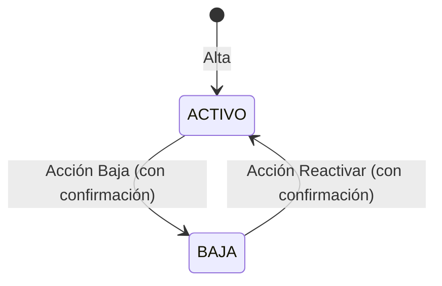

# Requerimientos Funcionales — Catálogos del sistema CIVENTOR

| Campo   | Valor |
|---------|-------|
| Versión | 1.1 |
| Fecha   | 2026-09-29 |
| Estado  | En definición |
| Módulo  | Backbone — menú **Catálogos** |
| Autor   | Análisis de Negocio |

---

## 1. Propósito del documento

Este documento explica qué deben hacer los catálogos del menú **Catálogos** del sistema CIVENTOR. Un catálogo es una lista de datos base (por ejemplo, empresas, bancos, formas de pago o tipos de vehículo) que otros procesos del sistema usan.

Para cada catálogo se describen las mismas acciones, en este orden:

- **Registrar:** dar de alta un elemento nuevo.
- **Editar:** cambiar los datos de un elemento existente.
- **Dar de baja:** dejar de usar un elemento sin borrarlo. Según el catálogo, la acción se llama **Baja**, **Deshabilitar** o **Cancelar**.
- **Reactivar:** volver a usar un elemento que se dio de baja.
- **Consultar:** ver el detalle de un elemento y buscar en el listado.

Cuando una acción no aplica a un catálogo, el requerimiento se conserva y explica por qué no está disponible. Así todos los catálogos se leen con la misma estructura.

El documento está pensado para que lo usen desarrolladores, testers, líderes de proyecto y usuarios del negocio.

## 2. Alcance del documento

**Incluye:** los 32 catálogos del menú **Catálogos** del Backbone que aparecen en la sección [7.1 Menú de catálogos](#menu-catalogos).

Los catálogos soportarán las siguientes funcionalidades base:

- **Registrar:** dar de alta un elemento nuevo.
- **Editar:** cambiar los datos de un elemento existente.
- **Dar de baja:** dejar de usar un elemento sin borrarlo. Según el catálogo, la acción se llama **Baja**, **Deshabilitar** o **Cancelar**.
- **Reactivar:** volver a usar un elemento que se dio de baja.
- **Consultar:** ver el detalle de un elemento y buscar en el listado.

**No incluye:**

- El área operativa será responsable de definir, proporcionar y mantener actualizada la información de contenido de cada catálogo operativos.

## 3. Cómo leer este documento

Cada requerimiento sigue la misma estructura, de lo general a lo particular:

| Nivel | Qué es | Ejemplo |
|---|---|---|
| **RF** — Requerimiento funcional | Una función completa del sistema | RF-01 Registro de empresa |
| **HU** — Historia de usuario | Lo que una persona necesita hacer y para qué | HU-1.1 Registrar una empresa |
| **RN** — Regla de negocio | Una regla que el sistema siempre debe cumplir | RN-1.5 El RFC no se puede repetir |
| **CA** — Criterio de aceptación | La condición que confirma que la historia funciona | CA-1.1.4 Razón Social, RFC o Abreviatura repetidos |
| **CP** — Caso de prueba | Un ejemplo concreto, con datos, para probar un criterio | CP-1.1.12 RFC repetido |
| **PD** — Pendiente de definir | Una duda que el negocio debe resolver | PD-09 Roles con permiso |

Los criterios de aceptación y los casos de prueba se escriben en tres pasos:

- **Dado que:** la situación de partida.
- **Cuando:** lo que hace el usuario.
- **Entonces:** lo que el sistema debe hacer.

Cada caso de prueba indica entre paréntesis qué tipo de situación revisa:

| Tipo | Qué revisa |
|---|---|
| Flujo principal | El uso normal, cuando todo sale bien |
| Alternativo | Otra forma válida de llegar al resultado |
| Error | Datos incorrectos o incompletos que el sistema debe rechazar |
| Validación | Que el sistema revise o muestre bien un dato |
| Permisos | Lo que puede o no puede hacer un usuario según su rol |
| Estatus no permitido | Una acción que no aplica por el estatus del registro (por ejemplo, editar una empresa en BAJA) |
| Falta un paso previo | Una acción que aún no se puede hacer (por ejemplo, porque la empresa no se ha guardado o no hay nada seleccionado) |
| Dos usuarios al mismo tiempo | Dos personas cambian el mismo dato casi a la vez |
| Visibilidad | Qué se ve y qué no en pantalla |
| Restricción | Una acción que el sistema nunca permite |

La **prioridad** de cada requerimiento indica su importancia:

- **Indispensable (Must):** sin él no se puede operar.
- **Importante (Should):** es necesario, pero se puede operar un tiempo sin él.

## 4. Glosario

| Término | Significado |
|---|---|
| Backbone | Sistema de administración donde se encuentra el menú **Catálogos**. |
| SAT | Servicio de Administración Tributaria, la autoridad fiscal de México. |
| RFC | Registro Federal de Contribuyentes. Clave fiscal de la empresa ante el SAT. |
| Razón Social | Nombre legal de la empresa. |
| Persona física / moral | Una persona física es un individuo; una persona moral es una sociedad o empresa. |
| Régimen Fiscal | Forma en que la empresa paga impuestos ante el SAT. |
| Régimen Capital | Tipo de sociedad de la empresa (por ejemplo, S.A. de C.V.). |
| CFDI | Comprobante Fiscal Digital por Internet, es decir, la factura electrónica. |
| Uso CFDI | Para qué se usará la factura, según el catálogo del SAT. |
| Certificado de sello digital (CSD) | Archivo que entrega el SAT para firmar las facturas electrónicas de la empresa. Tiene fecha de vencimiento. |
| Timbrar | Enviar una factura para que se certifique y sea válida ante el SAT. |
| PAC | Proveedor Autorizado de Certificación. Es la empresa externa que timbra las facturas. |
| Consulta de timbres del PAC | Proceso del sistema que consulta al PAC la información de timbrado de cada empresa, por su RFC. |
| Forma de pago TRANS | Forma de pago "transferencia" del catálogo del SAT. Define qué formato debe tener un número de cuenta bancaria. |
| CLABE | Clave bancaria de 18 dígitos que se usa para transferencias. |
| Estatus | Situación de un registro: **ACTIVO** (se puede usar) o **BAJA** (ya no se usa, pero se conserva). |
| Enlazar / Desvincular | Enlazar asocia un elemento que ya existe (certificado, sucursal o empleado) con la empresa. Desvincular quita esa asociación sin borrar el elemento. |
| Solo lectura | El dato se puede ver, pero no se puede cambiar. |
| Datos de auditoría | Fecha, hora, equipo y usuario del último cambio guardado. |
| Bitácora de cambios | Historial completo de todos los movimientos que se hicieron sobre una empresa. |
| Equipo | Nombre o dirección IP de la computadora desde donde se hizo un movimiento. |
| Rol | Conjunto de permisos que tiene un usuario. Define qué acciones puede ver y usar. |

## 5. Usuarios que participan

| Usuario | Qué puede hacer |
|-------------|-------------|
| Responsable del catálogo de empresas | Registra, edita y consulta empresas. El sistema controla su acceso con roles de seguridad. Los roles que tienen este permiso están **pendientes de definir** (ver PD-09). |
| Usuario con permiso de baja | Responsable del catálogo cuyo rol le permite dar de baja empresas. Solo este usuario ve la acción **Baja**. |
| Usuario con permiso de reactivar | Responsable del catálogo cuyo rol le permite regresar a ACTIVO una empresa que está en BAJA. Solo este usuario ve la acción **Reactivar**. Los roles están **pendientes de definir** (ver PD-09). |
| Usuario con permiso de enlazar y desvincular | Responsable del catálogo cuyo rol le permite enlazar certificados, sucursales o personal a la empresa, y desvincularlos. Solo este usuario ve las acciones **Enlazar** y **Desvincular** de cada lista. Los roles están **pendientes de definir** (ver PD-09). |
| Usuario del sistema | Cualquier persona que consulta el catálogo o que elige una empresa desde otras pantallas. |

## 6. Catálogos que aplica

Este documento aplica a los 32 catálogos listados en la sección [7.1 Menú de catálogos](#menu-catalogos). 

En ningún catálogo se borran los registros: lo que se da de baja se conserva para consulta.

### 6.1 Estatus de un catálogo

| Estatus | Qué significa | Cómo se asigna |
|---|---|---|
| ACTIVO | La empresa está vigente y se puede usar en los procesos | Automáticamente, al guardar una empresa nueva o al reactivarla |
| BAJA | La empresa ya no se usa; sus datos se conservan y solo se pueden consultar | Con la acción **Baja** del listado |

Una empresa en BAJA puede volver a ACTIVO con la acción **Reactivar** del listado.

**Cambios de estatus permitidos**

| Estatus inicial | Estatus final | Qué lo provoca |
|---|---|---|
| (Empresa nueva) | ACTIVO | Guardar la empresa por primera vez |
| ACTIVO | BAJA | Acción Baja, después de confirmar |
| BAJA | ACTIVO | Acción Reactivar, después de confirmar |

No existe ningún otro cambio de estatus. El diagrama muestra el ciclo de vida de una empresa: se crea en ACTIVO, se puede dar de baja y, desde BAJA, se puede reactivar. El ciclo se puede repetir las veces que sea necesario.

## 7. Índice de requerimientos

> Haz clic en el nombre de un catálogo para ver sus requerimientos, o en el identificador de un requerimiento para ir directamente a su detalle.

### 7.1 Menú de catálogos

<strong>7.2 Empresas</strong>

| RF | Título | Sistema | Aplica a |
|----|--------|---------|----------|
| [RF-01](#rf-01) | Registro de empresa | Backbone | Alta de empresas |
| [RF-02](#rf-02) | Edición de empresa | Backbone | Empresas en ACTIVO |
| [RF-03](#rf-03) | Baja y reactivación de empresa | Backbone | Empresas en ACTIVO y en BAJA |
| [RF-04](#rf-04) | Consulta de empresas | Backbone | Todas las empresas |
| [RF-05](#rf-05) | Enlazar y desvincular certificados del SAT | Backbone | Lista Certificados del detalle de la empresa |
| [RF-06](#rf-06) | Enlazar y desvincular sucursales | Backbone | Lista Sucursales del detalle de la empresa |
| [RF-07](#rf-07) | Enlazar y desvincular personal | Backbone | Lista Personales del detalle de la empresa |

<strong>7.3 Empleado Contacto</strong>

| RF | Título | Sistema | Aplica a |
|----|--------|---------|----------|
| [RF-08](#rf-08) | Registro de método de contacto del empleado | Backbone | Alta de métodos de contacto en la lista Métodos de Contacto del empleado |
| [RF-09](#rf-09) | Edición de método de contacto del empleado | Backbone | Métodos de contacto de empleados en ACTIVO |
| [RF-10](#rf-10) | Baja de método de contacto del empleado | Backbone | No disponible: el catálogo no maneja estatus |
| [RF-11](#rf-11) | Reactivación de método de contacto del empleado | Backbone | No disponible: el catálogo no maneja estatus |
| [RF-12](#rf-12) | Consulta del detalle de método de contacto del empleado | Backbone | Todos los métodos de contacto de un empleado |
| [RF-13](#rf-13) | Consulta del listado de métodos de contacto del empleado | Backbone | Lista Métodos de Contacto del detalle del empleado |

#### 7.3.1 Otros catálogos que usa el catálogo de Empleado Contacto

| Catálogo | Tipo | Para qué se usa |
|---|---|---|
| Empleados | Obligatorio | Indicar el empleado al que pertenece el método de contacto. No se elige: el sistema lo asigna solo, porque el método de contacto se captura dentro del detalle del empleado |

<strong>7.4 Tipos de Vehículo</strong>

| RF | Título | Sistema | Aplica a |
|----|--------|---------|----------|
| [RF-14](#rf-14) | Registro de tipo de vehículo | Backbone | Alta de tipos de vehículo |
| [RF-15](#rf-15) | Edición de tipo de vehículo | Backbone | Tipos de vehículo registrados |
| [RF-16](#rf-16) | Baja de tipo de vehículo | Backbone | Tipos de vehículo en ACTIVO (acción Deshabilitar) |
| [RF-17](#rf-17) | Reactivación de tipo de vehículo | Backbone | Tipos de vehículo en INACTIVO |
| [RF-18](#rf-18) | Consulta del detalle de tipo de vehículo | Backbone | Todos los tipos de vehículo |
| [RF-19](#rf-19) | Consulta del listado de tipos de vehículo | Backbone | Todos los tipos de vehículo |

<strong>7.5 Tipos de Transporte</strong>

| RF | Título | Sistema | Aplica a |
|----|--------|---------|----------|
| [RF-20](#rf-20) | Registro de tipo de transporte | Backbone | Alta de tipos de transporte |
| [RF-21](#rf-21) | Edición de tipo de transporte | Backbone | Tipos de transporte en ACTIVO |
| [RF-22](#rf-22) | Baja de tipo de transporte | Backbone | Tipos de transporte en ACTIVO (acción Cancelar) |
| [RF-23](#rf-23) | Reactivación de tipo de transporte | Backbone | Tipos de transporte en CANCELADO |
| [RF-24](#rf-24) | Consulta del detalle de tipo de transporte | Backbone | Todos los tipos de transporte |
| [RF-25](#rf-25) | Consulta del listado de tipos de transporte | Backbone | Todos los tipos de transporte |

<strong>7.6 Categorías de Licencia de Conducir</strong>

| RF | Título | Sistema | Aplica a |
|----|--------|---------|----------|
| [RF-26](#rf-26) | Registro de categoría de licencia de conducir | Backbone | Alta de categorías de licencia de conducir |
| [RF-27](#rf-27) | Edición de categoría de licencia de conducir | Backbone | Categorías de licencia de conducir registradas |
| [RF-28](#rf-28) | Baja de categoría de licencia de conducir | Backbone | Categorías en ACTIVO (acción Deshabilitar) |
| [RF-29](#rf-29) | Reactivación de categoría de licencia de conducir | Backbone | Categorías en INACTIVO |
| [RF-30](#rf-30) | Consulta del detalle de categoría de licencia de conducir | Backbone | Todas las categorías de licencia de conducir |
| [RF-31](#rf-31) | Consulta del listado de categorías de licencia de conducir | Backbone | Todas las categorías de licencia de conducir |

<strong>7.7 Puestos Laborales</strong>

| RF | Título | Sistema | Aplica a |
|----|--------|---------|----------|
| [RF-32](#rf-32) | Registro de puesto laboral | Backbone | Alta de puestos laborales |
| [RF-33](#rf-33) | Edición de puesto laboral | Backbone | Puestos laborales registrados |
| [RF-34](#rf-34) | Baja de puesto laboral | Backbone | No disponible para este catálogo |
| [RF-35](#rf-35) | Reactivación de puesto laboral | Backbone | No disponible para este catálogo |
| [RF-36](#rf-36) | Consulta del detalle de puesto laboral | Backbone | Todos los puestos laborales |
| [RF-37](#rf-37) | Consulta del listado de puestos laborales | Backbone | Todos los puestos laborales |

<strong>7.8 Ciudades</strong>

| RF | Título | Sistema | Aplica a |
|----|--------|---------|----------|
| [RF-38](#rf-38) | Registro de ciudad | Backbone | Alta de ciudades |
| [RF-39](#rf-39) | Edición de ciudad | Backbone | Todas las ciudades |
| [RF-40](#rf-40) | Baja de ciudad | Backbone | No disponible: el catálogo no maneja estatus |
| [RF-41](#rf-41) | Reactivación de ciudad | Backbone | No disponible: el catálogo no maneja estatus |
| [RF-42](#rf-42) | Consulta del detalle de ciudad | Backbone | Todas las ciudades |
| [RF-43](#rf-43) | Consulta del listado de ciudades | Backbone | Todas las ciudades |

#### 7.8.1 Otros catálogos que usa el catálogo de Ciudades

| Catálogo | Tipo | Para qué se usa |
|---|---|---|
| Estado | Obligatorio | Indicar el estado al que pertenece la ciudad |

<strong>7.9 Lista de Precios Detalle</strong>

| RF | Título | Sistema | Aplica a |
|----|--------|---------|----------|
| [RF-44](#rf-44) | Registro de precio en lista de precios | Backbone | Alta de productos en la Lista Base |
| [RF-45](#rf-45) | Edición de precio en lista de precios | Backbone | Precios de listas en ACTIVO |
| [RF-46](#rf-46) | Baja de precio en lista de precios | Backbone | No disponible: el catálogo no maneja estatus |
| [RF-47](#rf-47) | Reactivación de precio en lista de precios | Backbone | No disponible: el catálogo no maneja estatus |
| [RF-48](#rf-48) | Consulta del detalle de precio en lista de precios | Backbone | Todos los precios de las listas |
| [RF-49](#rf-49) | Consulta del listado de precios de una lista de precios | Backbone | Todos los precios e históricos de las listas |

#### 7.9.1 Otros catálogos que usa el catálogo de Lista de Precios Detalle

| Catálogo | Tipo | Para qué se usa |
|---|---|---|
| Lista de Precio | Obligatorio | Es la lista de precios de la empresa a la que pertenece cada precio. Los precios se capturan y consultan dentro de ella; su estatus (ACTIVO, INACTIVO o EXPIRADO), su moneda, su fecha de fin de vigencia y si es Lista Base definen qué se puede hacer con sus precios |
| Producto | Obligatorio | Indicar el producto al que se le pone precio; solo se eligen productos en ACTIVO y marcados como Comercializable |
| Tipo de Lista de Precio | Obligatorio (a través de la lista) | Dar los porcentajes de utilidad con que el sistema calcula los precios de las listas que no son base, incluidas sus excepciones por producto, por categoría de utilidad, por marca y por subfamilia |

<strong>7.10 Unidades de Medida</strong>

| RF | Título | Sistema | Aplica a |
|----|--------|---------|----------|
| [RF-50](#rf-50) | Registro de unidad de medida | Backbone | Alta de unidades de medida |
| [RF-51](#rf-51) | Edición de unidad de medida | Backbone | Todas las unidades de medida |
| [RF-52](#rf-52) | Baja de unidad de medida | Backbone | No disponible: el catálogo no maneja estatus |
| [RF-53](#rf-53) | Reactivación de unidad de medida | Backbone | No disponible: el catálogo no maneja estatus |
| [RF-54](#rf-54) | Consulta del detalle de unidad de medida | Backbone | Todas las unidades de medida |
| [RF-55](#rf-55) | Consulta del listado de unidades de medida | Backbone | Todas las unidades de medida |

<strong>7.11 Periodos</strong>

| RF | Título | Sistema | Aplica a |
|----|--------|---------|----------|
| [RF-56](#rf-56) | Registro de periodo | Backbone | Alta de periodos |
| [RF-57](#rf-57) | Edición de periodo | Backbone | Periodos registrados |
| [RF-58](#rf-58) | Baja de periodo | Backbone | Periodos en ACTIVO (acción Deshabilitar) |
| [RF-59](#rf-59) | Reactivación de periodo | Backbone | Periodos en INACTIVO |
| [RF-60](#rf-60) | Consulta del detalle de periodo | Backbone | Todos los periodos |
| [RF-61](#rf-61) | Consulta del listado de periodos | Backbone | Todos los periodos |

<strong>7.12 Ramos (Tipos de Póliza)</strong>

| RF | Título | Sistema | Aplica a |
|----|--------|---------|----------|
| [RF-62](#rf-62) | Registro de ramo | Backbone | Alta de ramos |
| [RF-63](#rf-63) | Edición de ramo | Backbone | Ramos registrados |
| [RF-64](#rf-64) | Baja de ramo | Backbone | Ramos en ACTIVO (acción Deshabilitar) |
| [RF-65](#rf-65) | Reactivación de ramo | Backbone | Ramos en INACTIVO |
| [RF-66](#rf-66) | Consulta del detalle de ramo | Backbone | Todos los ramos |
| [RF-67](#rf-67) | Consulta del listado de ramos | Backbone | Todos los ramos |

#### 7.12.1 Otros catálogos que usa el catálogo de Ramos

| Catálogo | Tipo | Para qué se usa |
|---|---|---|
| Aseguradoras | Opcional | Indicar las aseguradoras que ofrecen el ramo. Esta relación está pendiente de definir: falta confirmar si existe, si admite varias aseguradoras por ramo y si solo se eligen aseguradoras en ACTIVO. El catálogo de Aseguradoras no se documenta en este documento |

<strong>7.13 Formas de Pago del Cliente</strong>

| RF | Título | Sistema | Aplica a |
|----|--------|---------|----------|
| [RF-68](#rf-68) | Registro de forma de pago del cliente | Backbone | Alta de formas de pago del cliente |
| [RF-69](#rf-69) | Edición de forma de pago del cliente | Backbone | Formas de pago del cliente registradas (ACTIVO o INACTIVO) |
| [RF-70](#rf-70) | Baja de forma de pago del cliente | Backbone | Formas de pago del cliente en ACTIVO (acción Deshabilitar) |
| [RF-71](#rf-71) | Reactivación de forma de pago del cliente | Backbone | Formas de pago del cliente en INACTIVO |
| [RF-72](#rf-72) | Consulta del detalle de forma de pago del cliente | Backbone | Todas las formas de pago del cliente |
| [RF-73](#rf-73) | Consulta del listado de formas de pago del cliente | Backbone | Todas las formas de pago del cliente |

#### 7.13.1 Otros catálogos que usa el catálogo de Formas de Pago del Cliente

| Catálogo | Tipo | Para qué se usa |
|---|---|---|
| Cliente | Obligatorio | Es el cliente al que pertenece la forma de pago. Las formas de pago se capturan y consultan en la sección Formas de Pago del detalle del cliente |
| Formas de Pago | Obligatorio | Indicar la forma de pago que usa el cliente; solo se eligen formas de pago con Bancarizado en SI. Su Cuenta Ordenante define el formato que debe cumplir el No. Cuenta/Tarjeta |
| Banco | Obligatorio | Indicar el banco de la cuenta o tarjeta con la que paga el cliente |

<strong>7.14 Tipos de Clasificación</strong>

| RF | Título | Sistema | Aplica a |
|----|--------|---------|----------|
| [RF-74](#rf-74) | Registro de tipo de clasificación | Backbone | Alta de tipos de clasificación |
| [RF-75](#rf-75) | Edición de tipo de clasificación | Backbone | Tipos de clasificación registrados |
| [RF-76](#rf-76) | Baja de tipo de clasificación | Backbone | Tipos de clasificación en ACTIVO (acción Deshabilitar) |
| [RF-77](#rf-77) | Reactivación de tipo de clasificación | Backbone | Tipos de clasificación en INACTIVO |
| [RF-78](#rf-78) | Consulta del detalle de tipo de clasificación | Backbone | Todos los tipos de clasificación |
| [RF-79](#rf-79) | Consulta del listado de tipos de clasificación | Backbone | Todos los tipos de clasificación |

<strong>7.15 Grupos</strong>

| RF | Título | Sistema | Aplica a |
|----|--------|---------|----------|
| [RF-80](#rf-80) | Registro de grupo | Backbone | Alta de grupos |
| [RF-81](#rf-81) | Edición de grupo | Backbone | Grupos registrados |
| [RF-82](#rf-82) | Baja de grupo | Backbone | Grupos en ACTIVO (acción Deshabilitar) |
| [RF-83](#rf-83) | Reactivación de grupo | Backbone | Grupos en INACTIVO |
| [RF-84](#rf-84) | Consulta del detalle de grupo | Backbone | Todos los grupos |
| [RF-85](#rf-85) | Consulta del listado de grupos | Backbone | Todos los grupos |

<strong>7.16 Tipos de Asegurado</strong>

| RF | Título | Sistema | Aplica a |
|----|--------|---------|----------|
| [RF-86](#rf-86) | Registro de tipo de asegurado | Backbone | Alta de tipos de asegurado |
| [RF-87](#rf-87) | Edición de tipo de asegurado | Backbone | Tipos de asegurado registrados |
| [RF-88](#rf-88) | Baja de tipo de asegurado | Backbone | Tipos de asegurado en ACTIVO (acción Deshabilitar) |
| [RF-89](#rf-89) | Reactivación de tipo de asegurado | Backbone | Tipos de asegurado en INACTIVO |
| [RF-90](#rf-90) | Consulta del detalle de tipo de asegurado | Backbone | Todos los tipos de asegurado |
| [RF-91](#rf-91) | Consulta del listado de tipos de asegurado | Backbone | Todos los tipos de asegurado |

#### 7.16.1 Otros catálogos que usa el catálogo de Tipos de Asegurado

| Catálogo | Tipo | Para qué se usa |
|---|---|---|
| Puesto Laboral | Opcional | Mostrar en el detalle del tipo de asegurado los puestos laborales que tienen ese nivel de riesgo. La forma en que se asocia un puesto laboral con un tipo de asegurado está pendiente de definir |

<strong>7.17 Tipos de Notificación</strong>

| RF | Título | Sistema | Aplica a |
|----|--------|---------|----------|
| [RF-92](#rf-92) | Registro de tipo de notificación | Backbone | Alta de tipos de notificación |
| [RF-93](#rf-93) | Edición de tipo de notificación | Backbone | Tipos de notificación registrados |
| [RF-94](#rf-94) | Baja de tipo de notificación | Backbone | Tipos de notificación en ACTIVO (acción Deshabilitar) |
| [RF-95](#rf-95) | Reactivación de tipo de notificación | Backbone | Tipos de notificación en INACTIVO |
| [RF-96](#rf-96) | Consulta del detalle de tipo de notificación | Backbone | Todos los tipos de notificación |
| [RF-97](#rf-97) | Consulta del listado de tipos de notificación | Backbone | Todos los tipos de notificación |

<strong>7.18 Plataformas de Notificación</strong>

| RF | Título | Sistema | Aplica a |
|----|--------|---------|----------|
| [RF-98](#rf-98) | Registro de plataforma de notificación | Backbone | Alta de plataformas de notificación |
| [RF-99](#rf-99) | Edición de plataforma de notificación | Backbone | Plataformas de notificación registradas |
| [RF-100](#rf-100) | Baja de plataforma de notificación | Backbone | Plataformas de notificación en ACTIVO (acción Deshabilitar) |
| [RF-101](#rf-101) | Reactivación de plataforma de notificación | Backbone | Plataformas de notificación en INACTIVO |
| [RF-102](#rf-102) | Consulta del detalle de plataforma de notificación | Backbone | Todas las plataformas de notificación |
| [RF-103](#rf-103) | Consulta del listado de plataformas de notificación | Backbone | Todas las plataformas de notificación |

#### 7.18.1 Otros catálogos que usa el catálogo de Plataformas de Notificación

| Catálogo | Tipo | Para qué se usa |
|---|---|---|
| Emails | Pendiente de definir | Posible relación con la plataforma de correo electrónico, para indicar la cuenta de correo desde la que se envían las notificaciones. Si existe y cómo funciona está pendiente de definir |
| Servidores de Email | Pendiente de definir | Posible relación con la plataforma de correo electrónico, para indicar el servidor de correo saliente. Si existe y cómo funciona está pendiente de definir |

<strong>7.19 Tipos de Acción de Póliza</strong>

| RF | Título | Sistema | Aplica a |
|----|--------|---------|----------|
| [RF-104](#rf-104) | Registro de tipo de acción de póliza | Backbone | Alta de tipos de acción de póliza |
| [RF-105](#rf-105) | Edición de tipo de acción de póliza | Backbone | Tipos de acción de póliza registrados |
| [RF-106](#rf-106) | Baja de tipo de acción de póliza | Backbone | Tipos de acción de póliza en ACTIVO (acción Deshabilitar) |
| [RF-107](#rf-107) | Reactivación de tipo de acción de póliza | Backbone | Tipos de acción de póliza en INACTIVO |
| [RF-108](#rf-108) | Consulta del detalle de tipo de acción de póliza | Backbone | Todos los tipos de acción de póliza |
| [RF-109](#rf-109) | Consulta del listado de tipos de acción de póliza | Backbone | Todos los tipos de acción de póliza |

<strong>7.20 Métodos de Pago</strong>

| RF | Título | Sistema | Aplica a |
|----|--------|---------|----------|
| [RF-110](#rf-110) | Registro de método de pago | Backbone | Alta de métodos de pago |
| [RF-111](#rf-111) | Edición de método de pago | Backbone | Métodos de pago registrados |
| [RF-112](#rf-112) | Baja de método de pago | Backbone | Métodos de pago en ACTIVO (acción Deshabilitar) |
| [RF-113](#rf-113) | Reactivación de método de pago | Backbone | Métodos de pago en INACTIVO |
| [RF-114](#rf-114) | Consulta del detalle de método de pago | Backbone | Todos los métodos de pago |
| [RF-115](#rf-115) | Consulta del listado de métodos de pago | Backbone | Todos los métodos de pago |

<strong>7.21 Tipos de Régimen Capital</strong>

| RF | Título | Sistema | Aplica a |
|----|--------|---------|----------|
| [RF-116](#rf-116) | Registro de tipo de régimen capital | Backbone | Alta de tipos de régimen capital |
| [RF-117](#rf-117) | Edición de tipo de régimen capital | Backbone | Tipos de régimen capital registrados |
| [RF-118](#rf-118) | Baja de tipo de régimen capital | Backbone | Tipos de régimen capital en ACTIVO (acción Cancelar) |
| [RF-119](#rf-119) | Reactivación de tipo de régimen capital | Backbone | Tipos de régimen capital en CANCELADO |
| [RF-120](#rf-120) | Consulta del detalle de tipo de régimen capital | Backbone | Todos los tipos de régimen capital |
| [RF-121](#rf-121) | Consulta del listado de tipos de régimen capital | Backbone | Todos los tipos de régimen capital |

<strong>7.22 Uso CFDI</strong>

| RF | Título | Sistema | Aplica a |
|----|--------|---------|----------|
| [RF-122](#rf-122) | Registro de uso CFDI | Backbone | Alta de usos CFDI |
| [RF-123](#rf-123) | Edición de uso CFDI | Backbone | Usos CFDI en ACTIVO |
| [RF-124](#rf-124) | Baja de uso CFDI | Backbone | Usos CFDI en ACTIVO (acción Deshabilitar) |
| [RF-125](#rf-125) | Reactivación de uso CFDI | Backbone | Usos CFDI en INACTIVO |
| [RF-126](#rf-126) | Consulta del detalle de uso CFDI | Backbone | Todos los usos CFDI |
| [RF-127](#rf-127) | Consulta del listado de usos CFDI | Backbone | Todos los usos CFDI |

#### 7.22.1 Otros catálogos que usa el catálogo de Uso CFDI

| Catálogo | Tipo | Para qué se usa |
|---|---|---|
| Régimen Fiscal | Opcional | Indicar con qué regímenes fiscales del SAT se puede usar el uso CFDI. Un uso sin regímenes enlazados no se ofrece en la lista Uso CFDI de Empresas (RN-1.19) |

<strong>7.23 Tipos de Comprobante</strong>

| RF | Título | Sistema | Aplica a |
|----|--------|---------|----------|
| [RF-128](#rf-128) | Registro de tipo de comprobante | Backbone | Alta de tipos de comprobante |
| [RF-129](#rf-129) | Edición de tipo de comprobante | Backbone | Tipos de comprobante registrados |
| [RF-130](#rf-130) | Baja de tipo de comprobante | Backbone | Tipos de comprobante en ACTIVO (acción Deshabilitar) |
| [RF-131](#rf-131) | Reactivación de tipo de comprobante | Backbone | Tipos de comprobante en INACTIVO |
| [RF-132](#rf-132) | Consulta del detalle de tipo de comprobante | Backbone | Todos los tipos de comprobante |
| [RF-133](#rf-133) | Consulta del listado de tipos de comprobante | Backbone | Todos los tipos de comprobante |

<strong>7.24 Emails</strong>

| RF | Título | Sistema | Aplica a |
|----|--------|---------|----------|
| [RF-134](#rf-134) | Registro de email | Backbone | Alta de emails |
| [RF-135](#rf-135) | Edición de email | Backbone | Emails registrados |
| [RF-136](#rf-136) | Baja de email | Backbone | Emails en ACTIVO |
| [RF-137](#rf-137) | Reactivación de email | Backbone | Emails en INACTIVO |
| [RF-138](#rf-138) | Consulta del detalle de email | Backbone | Todos los emails |
| [RF-139](#rf-139) | Consulta del listado de emails | Backbone | Todos los emails |

#### 7.24.1 Otros catálogos que usa el catálogo de Emails

| Catálogo | Tipo | Para qué se usa |
|---|---|---|
| Módulo de Email | Obligatorio | Indicar el proceso del sistema que envía correos con la cuenta; cada módulo tiene un solo email |
| Servidor de Email | Obligatorio | Indicar el servidor de correo saliente por el que se envían los correos de la cuenta |

<strong>7.25 Módulos de Email</strong>

| RF | Título | Sistema | Aplica a |
|----|--------|---------|----------|
| [RF-140](#rf-140) | Registro de módulo de email | Backbone | Alta de módulos de email |
| [RF-141](#rf-141) | Edición de módulo de email | Backbone | Módulos de email registrados |
| [RF-142](#rf-142) | Baja de módulo de email | Backbone | No disponible para este catálogo |
| [RF-143](#rf-143) | Reactivación de módulo de email | Backbone | No disponible para este catálogo |
| [RF-144](#rf-144) | Consulta del detalle de módulo de email | Backbone | Todos los módulos de email |
| [RF-145](#rf-145) | Consulta del listado de módulos de email | Backbone | Todos los módulos de email |

#### 7.25.1 Otros catálogos que usa el catálogo de Módulos de Email

| Catálogo | Tipo | Para qué se usa |
|---|---|---|
| Sucursal | Opcional | Indicar la sucursal a la que corresponde el módulo, cuando el módulo es propio de una sucursal |

<strong>7.26 Servidores de Email</strong>

| RF | Título | Sistema | Aplica a |
|----|--------|---------|----------|
| [RF-146](#rf-146) | Registro de servidor de email | Backbone | Alta de servidores de email |
| [RF-147](#rf-147) | Edición de servidor de email | Backbone | Servidores de email registrados |
| [RF-148](#rf-148) | Baja de servidor de email | Backbone | Servidores de email en ACTIVO |
| [RF-149](#rf-149) | Reactivación de servidor de email | Backbone | Servidores de email en INACTIVO |
| [RF-150](#rf-150) | Consulta del detalle de servidor de email | Backbone | Todos los servidores de email |
| [RF-151](#rf-151) | Consulta del listado de servidores de email | Backbone | Todos los servidores de email |

<strong>7.27 Variables del Sistema</strong>

| RF | Título | Sistema | Aplica a |
|----|--------|---------|----------|
| [RF-152](#rf-152) | Registro de variable del sistema | Backbone | Alta de variables del sistema |
| [RF-153](#rf-153) | Edición de variable del sistema | Backbone | Variables del sistema registradas |
| [RF-154](#rf-154) | Baja de variable del sistema | Backbone | No disponible: el catálogo no maneja estatus |
| [RF-155](#rf-155) | Reactivación de variable del sistema | Backbone | No disponible: el catálogo no maneja estatus |
| [RF-156](#rf-156) | Consulta del detalle de variable del sistema | Backbone | Todas las variables del sistema |
| [RF-157](#rf-157) | Consulta del listado de variables del sistema | Backbone | Todas las variables del sistema |

<strong>7.28 Bancos</strong>

| RF | Título | Sistema | Aplica a |
|----|--------|---------|----------|
| [RF-158](#rf-158) | Registro de banco | Backbone | Alta de bancos |
| [RF-159](#rf-159) | Edición de banco | Backbone | Bancos en ACTIVO |
| [RF-160](#rf-160) | Baja de banco | Backbone | Bancos en ACTIVO |
| [RF-161](#rf-161) | Reactivación de banco | Backbone | No disponible para este catálogo |
| [RF-162](#rf-162) | Consulta del detalle de banco | Backbone | Todos los bancos |
| [RF-163](#rf-163) | Consulta del listado de bancos | Backbone | Todos los bancos |

#### 7.28.1 Otros catálogos que usa el catálogo de Bancos

| Catálogo | Tipo | Para qué se usa |
|---|---|---|
| Ciudad, Estado y País | Opcional | Capturar el domicilio del banco; al elegir la Ciudad se llenan solos el Estado y el País |

<strong>7.29 Cuentas bancarias</strong>

| RF | Título | Sistema | Aplica a |
|----|--------|---------|----------|
| [RF-164](#rf-164) | Registro de cuenta bancaria | Backbone | Alta de cuentas bancarias |
| [RF-165](#rf-165) | Edición de cuenta bancaria | Backbone | Cuentas bancarias en ACTIVO |
| [RF-166](#rf-166) | Baja de cuenta bancaria | Backbone | Cuentas bancarias en ACTIVO (acción Deshabilitar) |
| [RF-167](#rf-167) | Reactivación de cuenta bancaria | Backbone | Cuentas bancarias en INACTIVO |
| [RF-168](#rf-168) | Consulta del detalle de cuenta bancaria | Backbone | Todas las cuentas bancarias |
| [RF-169](#rf-169) | Consulta del listado de cuentas bancarias | Backbone | Todas las cuentas bancarias |

#### 7.29.1 Otros catálogos que usa el catálogo de Cuentas bancarias

| Catálogo | Tipo | Para qué se usa |
|---|---|---|
| Banco | Obligatorio | Indicar el banco al que pertenece la cuenta |
| Empresa | Obligatorio | Indicar la empresa dueña de la cuenta |
| Sucursal | Obligatorio | Indicar la sucursal que usa la cuenta |
| Moneda | Obligatorio | Indicar la moneda en que se maneja la cuenta |
| Central de Compra | Opcional | Indicar la central de compras relacionada con la cuenta |
| Formato de cheques | Opcional | Indicar el formato con que se imprimen los cheques de la cuenta; solo se eligen formatos en ACTIVO |

<strong>7.30 Formas de Pago</strong>

| RF | Título | Sistema | Aplica a |
|----|--------|---------|----------|
| [RF-170](#rf-170) | Registro de forma de pago | Backbone | Alta de formas de pago |
| [RF-171](#rf-171) | Edición de forma de pago | Backbone | Formas de pago registradas (ACTIVO o INACTIVO) |
| [RF-172](#rf-172) | Baja de forma de pago | Backbone | Formas de pago en ACTIVO (acción Deshabilitar) |
| [RF-173](#rf-173) | Reactivación de forma de pago | Backbone | Formas de pago en INACTIVO |
| [RF-174](#rf-174) | Consulta del detalle de forma de pago | Backbone | Todas las formas de pago |
| [RF-175](#rf-175) | Consulta del listado de formas de pago | Backbone | Todas las formas de pago |

<strong>7.31 Leyendas forma de pago</strong>

| RF | Título | Sistema | Aplica a |
|----|--------|---------|----------|
| [RF-176](#rf-176) | Registro de leyenda forma de pago | Backbone | Alta de leyendas forma de pago |
| [RF-177](#rf-177) | Edición de leyenda forma de pago | Backbone | Leyendas forma de pago en ACTIVO |
| [RF-178](#rf-178) | Baja de leyenda forma de pago | Backbone | Leyendas forma de pago en ACTIVO |
| [RF-179](#rf-179) | Reactivación de leyenda forma de pago | Backbone | Leyendas forma de pago en BAJA |
| [RF-180](#rf-180) | Consulta del detalle de leyenda forma de pago | Backbone | Todas las leyendas forma de pago |
| [RF-181](#rf-181) | Consulta del listado de leyendas forma de pago | Backbone | Todas las leyendas forma de pago |

<strong>7.32 Conceptos Bancarios</strong>

| RF | Título | Sistema | Aplica a |
|----|--------|---------|----------|
| [RF-182](#rf-182) | Registro de concepto bancario | Backbone | Alta de conceptos bancarios |
| [RF-183](#rf-183) | Edición de concepto bancario | Backbone | Conceptos bancarios en ACTIVO |
| [RF-184](#rf-184) | Baja de concepto bancario | Backbone | Conceptos bancarios en ACTIVO (acción Deshabilitar) |
| [RF-185](#rf-185) | Reactivación de concepto bancario | Backbone | Conceptos bancarios en INACTIVO |
| [RF-186](#rf-186) | Consulta del detalle de concepto bancario | Backbone | Todos los conceptos bancarios |
| [RF-187](#rf-187) | Consulta del listado de conceptos bancarios | Backbone | Todos los conceptos bancarios |

#### 7.32.1 Otros catálogos que usa el catálogo de Conceptos Bancarios

| Catálogo | Tipo | Para qué se usa |
|---|---|---|
| Conceptos de CXP | Opcional | Relacionar el concepto bancario con un concepto de cuentas por pagar; solo se eligen conceptos de CXP en ACTIVO y de tipo MAESTRO |

<strong>7.33 Formato de cheques</strong>

| RF | Título | Sistema | Aplica a |
|----|--------|---------|----------|
| [RF-188](#rf-188) | Registro de formato de cheque | Backbone | Alta de formatos de cheque |
| [RF-189](#rf-189) | Edición de formato de cheque | Backbone | Formatos de cheque en ACTIVO |
| [RF-190](#rf-190) | Baja de formato de cheque | Backbone | Formatos de cheque en ACTIVO (acción Deshabilitar) |
| [RF-191](#rf-191) | Reactivación de formato de cheque | Backbone | Formatos de cheque en INACTIVO |
| [RF-192](#rf-192) | Consulta del detalle de formato de cheque | Backbone | Todos los formatos de cheque |
| [RF-193](#rf-193) | Consulta del listado de formatos de cheque | Backbone | Todos los formatos de cheque |

---
---

# RF-01 — Registro de empresa

| Campo        | Valor |
|--------------|-------|
| Prioridad    | Indispensable (Must) |
| Estado       | En definición |
| Dependencias | Ninguna |

## Objetivo
Dar de alta cada empresa una sola vez y con datos correctos, para poder operar y facturar a su nombre.

## Descripción
El usuario captura los datos de la empresa: fiscales, domicilio, contacto y cuenta bancaria. El sistema revisa que estén completos, que tengan el formato del SAT y que la Razón Social, el RFC y la Abreviatura no estén ya registrados. La empresa queda en ACTIVO y el alta se guarda en la bitácora de cambios.

### Datos de la empresa

Los campos obligatorios de este requerimiento son Abreviatura, Razón Social, RFC, Régimen Fiscal, Uso CFDI, Régimen Capital y C.P.

La pantalla de la empresa se organiza en las secciones **Información General**, **Dirección**, **Contacto** y **Cuenta Beneficiario**. Después vienen las listas **Lista Certificados**, **Lista Sucursales** y **Lista Personales**, que se describen en la tabla "Listas de detalle". El orden y el contenido de cada sección se definen en CA-1.1.8.

**Campos que captura el usuario**

| Nombre | Descripción | Tipo de dato | Obligatorio | Longitud o formato | Valores permitidos | Observaciones |
|---|---|---|---|---|---|---|
| Abreviatura | Clave corta que identifica a la empresa | Texto | Sí | Máximo 6 caracteres | No se puede repetir entre empresas | Si se usa la opción de duplicar la empresa, este dato no se copia |
| Razón Social | Nombre fiscal de la empresa | Texto | Sí | De 1 a 254 caracteres; no admite el carácter `\|` | No se puede repetir entre empresas | Es el nombre con el que se elige la empresa en otras pantallas. Si se usa la opción de duplicar la empresa, este dato no se copia |
| RFC | Registro Federal de Contribuyentes | Texto | Sí | Máximo 13 caracteres. Formato del SAT: 3 o 4 letras (A-Z, Ñ, &), 6 dígitos de fecha y 3 caracteres de homoclave | No se puede repetir entre empresas | Si se usa la opción de duplicar la empresa, este dato no se copia. Ver PD-05 y PD-13 |
| Tipo de Persona | Tipo de persona fiscal | Lista de opciones | Pendiente de definir (ver PD-06) | No aplica | FÍSICA, MORAL | Al cambiarlo se borra el Régimen Fiscal elegido |
| Régimen Fiscal | Régimen fiscal ante el SAT | Lista de opciones (catálogo) | Sí | No aplica | Regímenes activos que corresponden al Tipo de Persona | Al cambiarlo se borra el Uso CFDI elegido |
| Uso CFDI | Uso de CFDI de la empresa | Lista de opciones (catálogo) | Sí, solo al crear la empresa | No aplica | Usos activos del Régimen Fiscal elegido que aplican al Tipo de Persona | Ver PD-02 |
| Régimen Capital | Régimen de capital de la sociedad | Lista de opciones (catálogo) | Sí | No aplica | Regímenes de capital activos | |
| F. Registro | Fecha de registro de la empresa | Fecha | No | Fecha | Pendiente de definir | |
| Calle | Calle del domicilio fiscal | Texto | No | Máximo 80 caracteres | Libre | |
| No. Exterior | Número exterior | Texto | No | Máximo 20 caracteres | Libre | |
| No. Interior | Número interior | Texto | No | Máximo 20 caracteres | Libre | |
| Colonia | Colonia | Texto | No | Máximo 60 caracteres | Libre | |
| Ciudad | Ciudad del domicilio | Lista de opciones (catálogo) | No | No aplica | Catálogo de ciudades | Al elegirla se llenan solos Estado y País |
| Estado | Estado del domicilio | Lista de opciones (catálogo) | No | No aplica | El de la ciudad elegida | No se puede editar |
| País | País del domicilio | Lista de opciones (catálogo) | No | No aplica | El del estado | No se puede editar. Al crear una empresa aparece "México" |
| C.P. | Código postal | Texto | Sí | Exactamente 5 dígitos | Solo números del 0 al 9 | |
| Email | Correo de contacto | Texto | No | Máximo 60 caracteres, con formato de correo válido | Libre | Se guarda en minúsculas |
| Teléfono | Teléfono de contacto | Texto | No | Máximo 25 caracteres | Libre | No se valida el formato |
| Banco | Banco de la cuenta beneficiaria | Lista de opciones (catálogo) | No | No aplica | Catálogo de bancos | No aparece en el listado |
| No. Cuenta | Número de la cuenta beneficiaria | Texto | No | Máximo 100 caracteres; debe tener el formato de cuenta que indica la forma de pago TRANS del SAT | Según ese formato | No aparece en el listado. Ver PD-10 |

**Campos que llena el sistema**

| Nombre | Descripción | Tipo de dato | Observaciones |
|---|---|---|---|
| Estatus | Situación de la empresa | Lista | ACTIVO o BAJA. No se captura. Ver la sección 6.1 y PD-07 |
| Fecha de estatus | Fecha y hora del último cambio de estatus | Fecha y hora | Automática |
| Baja por | Usuario que dio de baja la empresa | Usuario | No se muestra en pantalla; se llena al dar de baja |
| Reactivado por | Usuario que reactivó la empresa, con la fecha y hora | Usuario, fecha y hora | No se muestra en pantalla; se llena al reactivar. Ver PD-14 |
| Datos de auditoría | Fecha y hora de la última modificación, equipo o dirección IP desde donde se hizo, y usuario | Varios | Automáticos al guardar |

**Listas de detalle**

| Lista | Contenido | Observaciones |
|---|---|---|
| Lista Certificados | Certificados de sello digital enlazados a la empresa: No. Certificado, F. Expiración y Estatus | Se agregan con Enlazar y se quitan con Desvincular (RF-05). Los certificados se registran en su propio catálogo |
| Lista Sucursales | Sucursales enlazadas a la empresa: Abreviatura, Nombre, Tipo y Estatus | Se agregan con Enlazar y se quitan con Desvincular (RF-06). Las sucursales se registran en su propio catálogo |
| Lista Personales | Empleados enlazados a la empresa: No. Nómina, Nombre completo, Puesto y Estatus | Se agregan con Enlazar y se quitan con Desvincular (RF-07). Los empleados se registran en su propio catálogo |
| Bitácora de cambios | Movimientos de alta, modificación, baja y reactivación de la empresa | Solo lectura. Ver la sección 6.2 |

## HU-1.1 — Registrar una empresa

Como responsable del catálogo de empresas, quiero registrar una nueva empresa con sus datos de identificación fiscal, para poder emitir documentos y operar procesos a su nombre.

### Reglas de negocio

**RN-1.1** La Razón Social es obligatoria.

**RN-1.2** La Razón Social no se puede repetir entre empresas, estén activas o dadas de baja.

**RN-1.3** La Razón Social no admite el carácter `|` ni más de 254 caracteres.

**RN-1.4** El RFC es obligatorio.

**RN-1.5** El RFC no se puede repetir entre empresas, estén activas o dadas de baja.

**RN-1.6** El RFC debe cumplir el formato del SAT.

**RN-1.7** La Abreviatura es obligatoria.

**RN-1.8** La Abreviatura no se puede repetir entre empresas.

**RN-1.9** El Régimen Fiscal es obligatorio.

**RN-1.10** El Uso CFDI es obligatorio al crear la empresa.

**RN-1.11** El Régimen Capital es obligatorio y solo se eligen regímenes de capital activos.

**RN-1.12** Toda empresa nueva queda en estatus ACTIVO.

**RN-1.13** Al guardar se registran la fecha y hora, el equipo y el usuario.

**RN-1.14** Cada alta, modificación, baja y reactivación que se guarda con éxito agrega un registro a la bitácora de cambios de la empresa, con el tipo de movimiento, la fecha y hora, el usuario y el equipo o dirección IP.

**RN-1.15** Una operación que no se guarda (por una validación, por falta de permiso o porque se canceló la confirmación) no genera registro en la bitácora.

**RN-1.16** La bitácora es de solo lectura: sus registros no se pueden modificar ni eliminar, se conservan aunque la empresa esté en BAJA y se muestran en la sección Bitácora de cambios del detalle, del más reciente al más antiguo.

### Criterios de Aceptación

**CA-1.1.1 — Registrar empresa con datos válidos**
Dado que el responsable captura Abreviatura, Razón Social, RFC, Régimen Fiscal, Uso CFDI, Régimen Capital y C.P. válidos y que no existen en otra empresa
Cuando guarda
Entonces el sistema crea la empresa en estatus ACTIVO.

**CA-1.1.2 — Valores iniciales de una empresa nueva**
Dado que el responsable elige Nuevo en el catálogo de empresas
Cuando se muestra la pantalla de captura
Entonces el País aparece como "México" y el Estatus como ACTIVO.

**CA-1.1.3 — Campo obligatorio vacío**
Dado que el responsable deja vacío alguno de los campos Abreviatura, Razón Social, RFC, Régimen Fiscal, Uso CFDI o Régimen Capital
Cuando guarda
Entonces el sistema muestra el mensaje de campo requerido correspondiente y no guarda.

**CA-1.1.4 — Razón Social, RFC o Abreviatura repetidos**
Dado que ya existe otra empresa, activa o dada de baja, con la misma Razón Social, el mismo RFC o la misma Abreviatura
Cuando el responsable guarda la nueva empresa
Entonces el sistema muestra el mensaje de valor repetido correspondiente y no guarda.

**CA-1.1.5 — Formato inválido de Razón Social o RFC**
Dado que la Razón Social contiene el carácter `|`, o el RFC no cumple el formato del SAT
Cuando el responsable guarda
Entonces el sistema muestra el mensaje de formato inválido correspondiente y no guarda.

**CA-1.1.6 — Registro de auditoría**
Dado que el responsable guardó una empresa nueva con éxito
Cuando se revisan los datos de auditoría de la empresa
Entonces aparecen la fecha y hora, el equipo y el usuario que hizo el alta.

**CA-1.1.7 — Usuario sin permiso de alta**
Dado que el rol del usuario no le permite crear empresas
Cuando abre el catálogo de empresas
Entonces el sistema no le ofrece la opción de crear una empresa nueva.

**CA-1.1.8 — Acomodo visual de la pantalla por secciones**
Dado que el responsable abre la pantalla de captura de una empresa
Cuando se muestra la pantalla
Entonces los campos aparecen agrupados en secciones con título propio, en este orden, y cada campo aparece solo en su sección:

| Orden | Sección | Contenido |
|---|---|---|
| 1 | Información General | Abreviatura, Razón Social, RFC, Tipo de Persona, Régimen Fiscal, Uso CFDI, Régimen Capital, F. Registro y Estatus |
| 2 | Dirección | Calle, No. Exterior, No. Interior, Colonia, Ciudad, Estado, País y C.P. |
| 3 | Contacto | Email y Teléfono |
| 4 | Cuenta Beneficiario | Banco y No. Cuenta |
| 5 | Lista Certificados | Certificados de sello digital enlazados a la empresa, con las acciones Enlazar y Desvincular (RF-05) |
| 6 | Lista Sucursales | Sucursales enlazadas a la empresa, con las acciones Enlazar y Desvincular (RF-06) |
| 7 | Lista Personales | Empleados enlazados a la empresa, con las acciones Enlazar y Desvincular (RF-07) |
| 8 | Bitácora de cambios | Movimientos de la empresa, en solo lectura (sección 6.2) |

**CA-1.1.9 — Alta registrada en la bitácora de cambios**
Dado que el responsable guardó una empresa nueva con éxito
Cuando consulta la sección Bitácora de cambios de la empresa
Entonces aparece un único registro de tipo Alta con la fecha y hora, el usuario y el equipo del alta.

**CA-1.1.10 — Alta rechazada no se registra**
Dado que el responsable intenta guardar una empresa nueva que no cumple una regla del alta
Cuando el sistema rechaza el guardado
Entonces no se crea ningún registro en la bitácora de cambios.

**CA-1.1.11 — Bitácora de solo lectura**
Dado que la empresa tiene registros en su bitácora de cambios
Cuando el usuario consulta la sección Bitácora de cambios
Entonces ve los registros del más reciente al más antiguo y no puede modificarlos ni eliminarlos.

### Casos de prueba

**CP-1.1.1 — Alta exitosa de empresa (flujo principal)**
Verifica: CA-1.1.1 · RN-1.12
Dado que no existe ninguna empresa con Abreviatura "GMAL", Razón Social "GRUPO MALIA SA DE CV" ni RFC "GMA010101AB1"
Cuando el responsable captura esos datos, elige Tipo de Persona MORAL, un Régimen Fiscal, un Uso CFDI, un Régimen Capital, el C.P. "20000" y guarda
Entonces el sistema crea la empresa y la muestra con estatus ACTIVO.

**CP-1.1.2 — Alta de persona física (alternativo)**
Verifica: CA-1.1.1
Dado que no existe ninguna empresa con RFC "VERM800101AB1"
Cuando el responsable registra una empresa con Tipo de Persona FÍSICA, ese RFC de 13 caracteres y el resto de los campos obligatorios válidos
Entonces el sistema crea la empresa en estatus ACTIVO.

**CP-1.1.3 — Valores iniciales al crear (validación)**
Verifica: CA-1.1.2 · RN-1.22, RN-1.12
Dado que el responsable está en el listado de empresas
Cuando elige Nuevo
Entonces el campo País muestra "México" y el Estatus muestra ACTIVO.

**CP-1.1.4 — Falta la Abreviatura (error)**
Verifica: CA-1.1.3 · RN-1.7
Dado que el responsable captura todos los campos obligatorios excepto la Abreviatura
Cuando guarda
Entonces el sistema muestra "La Abreviatura es un campo requerido." y no guarda.

**CP-1.1.5 — Falta la Razón Social (error)**
Verifica: CA-1.1.3 · RN-1.1
Dado que el responsable deja vacía la Razón Social
Cuando guarda
Entonces el sistema muestra "La Razón Social es un campo requerido." y no guarda.

**CP-1.1.6 — Falta el RFC (error)**
Verifica: CA-1.1.3 · RN-1.4
Dado que el responsable deja vacío el RFC
Cuando guarda
Entonces el sistema muestra "El RFC es un campo requerido." y no guarda.

**CP-1.1.7 — Falta el Régimen Fiscal (error)**
Verifica: CA-1.1.3 · RN-1.9
Dado que el responsable no elige Régimen Fiscal
Cuando guarda
Entonces el sistema muestra "El Régimen Fiscal es un campo requerido." y no guarda.

**CP-1.1.8 — Falta el Uso CFDI en una empresa nueva (error)**
Verifica: CA-1.1.3 · RN-1.10
Dado que el responsable está creando una empresa y no elige Uso CFDI
Cuando guarda
Entonces el sistema muestra "Seleccione el uso del CFDI" y no guarda.

**CP-1.1.9 — Falta el Régimen Capital (error)**
Verifica: CA-1.1.3 · RN-1.11
Dado que el responsable no elige Régimen Capital
Cuando guarda
Entonces el sistema muestra "El Régimen Capital es un campo requerido." y no guarda.

**CP-1.1.10 — Razón Social repetida con empresa activa (validación)**
Verifica: CA-1.1.4 · RN-1.2
Dado que existe la empresa "GRUPO MALIA SA DE CV" en estatus ACTIVO
Cuando el responsable intenta registrar otra empresa con esa misma Razón Social
Entonces el sistema muestra "La Razón Social debe de ser único, el mismo valor ya existe." y no guarda.

**CP-1.1.11 — Razón Social repetida con empresa dada de baja (validación)**
Verifica: CA-1.1.4 · RN-1.2
Dado que existe la empresa "VICENTE REYES MAGAÑA" en estatus BAJA
Cuando el responsable intenta registrar otra empresa con esa misma Razón Social
Entonces el sistema muestra el mensaje de Razón Social repetida y no guarda.

**CP-1.1.12 — RFC repetido (validación)**
Verifica: CA-1.1.4 · RN-1.5
Dado que existe una empresa con RFC "GMA010101AB1"
Cuando el responsable intenta registrar otra empresa con ese RFC
Entonces el sistema muestra "El RFC debe de ser único, el mismo valor ya existe." y no guarda.

**CP-1.1.13 — Abreviatura repetida (validación)**
Verifica: CA-1.1.4 · RN-1.8
Dado que existe una empresa con Abreviatura "GMAL"
Cuando el responsable intenta registrar otra empresa con esa Abreviatura
Entonces el sistema muestra "La Abreviatura ya se encuentra registrado en el sistema." y no guarda.

**CP-1.1.14 — Abreviatura de más de 6 caracteres (validación)**
Verifica: CA-1.1.3
Dado que el responsable está capturando la Abreviatura
Cuando intenta escribir "GRUPOMA" (7 caracteres)
Entonces el campo no admite más de 6 caracteres.

**CP-1.1.15 — Razón Social con carácter no permitido (validación)**
Verifica: CA-1.1.5 · RN-1.3
Dado que el responsable captura la Razón Social "GRUPO | MALIA"
Cuando guarda
Entonces el sistema muestra "La Razón Social no contiene un formato válido de acuerdo a la especificación del SAT." y no guarda.

**CP-1.1.16 — RFC con formato inválido (validación)**
Verifica: CA-1.1.5 · RN-1.6
Dado que el responsable captura el RFC "12AB0101"
Cuando guarda
Entonces el sistema muestra "El RFC no contiene un formato válido de acuerdo a la especificación del SAT." y no guarda.

**CP-1.1.17 — Datos de auditoría del alta (validación)**
Verifica: CA-1.1.6 · RN-1.13
Dado que el usuario "jperez" guarda una empresa nueva con éxito
Cuando se consultan los datos de auditoría de esa empresa
Entonces aparecen la fecha y hora del alta, el equipo desde donde se hizo y el usuario "jperez".

**CP-1.1.18 — Usuario sin permiso de alta (permisos)**
Verifica: CA-1.1.7
Dado que un usuario cuyo rol solo permite consultar abre el catálogo de empresas
Cuando busca la opción para crear una empresa
Entonces el sistema no la muestra o la deshabilita.

**CP-1.1.19 — Secciones de la pantalla y su orden (flujo principal)**
Verifica: CA-1.1.8
Dado que el responsable está en el listado de empresas
Cuando elige Nuevo
Entonces la pantalla muestra, en este orden, las secciones con título "Información General", "Dirección", "Contacto", "Cuenta Beneficiario", "Lista Certificados", "Lista Sucursales", "Lista Personales" y "Bitácora de cambios".

**CP-1.1.20 — Campos de la sección Información General (validación)**
Verifica: CA-1.1.8
Dado que el responsable abre la pantalla de captura de una empresa nueva
Cuando revisa la sección "Información General"
Entonces encuentra Abreviatura, Razón Social, RFC, Tipo de Persona, Régimen Fiscal, Uso CFDI, Régimen Capital, F. Registro y Estatus, y ninguno de esos campos aparece en otra sección.

**CP-1.1.21 — Campos de la sección Dirección (validación)**
Verifica: CA-1.1.8
Dado que el responsable abre la pantalla de captura de una empresa nueva
Cuando revisa la sección "Dirección"
Entonces encuentra Calle, No. Exterior, No. Interior, Colonia, Ciudad, Estado, País y C.P., y ninguno de esos campos aparece en otra sección.

**CP-1.1.22 — Campos de las secciones Contacto y Cuenta Beneficiario (validación)**
Verifica: CA-1.1.8
Dado que el responsable abre la pantalla de captura de una empresa nueva
Cuando revisa las secciones "Contacto" y "Cuenta Beneficiario"
Entonces "Contacto" contiene solo Email y Teléfono, y "Cuenta Beneficiario" contiene solo Banco y No. Cuenta.

**CP-1.1.23 — Listas de una empresa nueva (alternativo)**
Verifica: CA-1.1.8
Dado que el responsable está creando una empresa que aún no se ha guardado
Cuando revisa las secciones "Lista Certificados", "Lista Sucursales", "Lista Personales" y "Bitácora de cambios"
Entonces las cuatro secciones se muestran con su título y sin registros.

**CP-1.1.24 — Listas de una empresa con registros (validación)**
Verifica: CA-1.1.8
Dado que existe la empresa "GRUPO MALIA SA DE CV" con un certificado, dos sucursales y tres empleados asignados
Cuando el responsable abre su detalle
Entonces "Lista Certificados" muestra el certificado, "Lista Sucursales" muestra las dos sucursales y "Lista Personales" muestra los tres empleados, cada uno solo en su lista.

**CP-1.1.25 — Registro de Alta en la bitácora (flujo principal)**
Verifica: CA-1.1.9 · RN-1.14
Dado que el usuario "jperez" guarda con éxito la empresa nueva "GRUPO MALIA SA DE CV"
Cuando abre su detalle y revisa la sección "Bitácora de cambios"
Entonces aparece un solo registro de tipo "Alta", con la fecha y hora del alta, el usuario "jperez" y el equipo desde donde se hizo.

**CP-1.1.26 — Alta rechazada por RFC repetido (error)**
Verifica: CA-1.1.10 · RN-1.15, RN-1.5
Dado que existe una empresa con RFC "GMA010101AB1"
Cuando el responsable intenta registrar otra empresa con ese RFC y el sistema muestra "El RFC debe de ser único, el mismo valor ya existe."
Entonces no se crea la empresa ni ningún registro de Alta en la bitácora.

**CP-1.1.27 — Registros de la bitácora no editables (restricción)**
Verifica: CA-1.1.11 · RN-1.16
Dado que la empresa "GRUPO MALIA SA DE CV" tiene su registro de Alta en la bitácora
Cuando el usuario intenta modificar o eliminar ese registro desde la sección "Bitácora de cambios"
Entonces el sistema no ofrece ninguna acción para modificarlo ni eliminarlo.

**CP-1.1.28 — Orden de los registros (validación)**
Verifica: CA-1.1.11 · RN-1.16
Dado que la empresa "GRUPO MALIA SA DE CV" tiene un registro de Alta y, después, dos de Modificación
Cuando el usuario consulta la sección "Bitácora de cambios"
Entonces la Modificación más reciente aparece primero y el Alta aparece al final.

| CA | Caso(s) de prueba | Escenarios cubiertos |
| --- | --- | --- |
| CA-1.1.1 | CP-1.1.1, CP-1.1.2 | Flujo principal, alternativo (persona física) |
| CA-1.1.2 | CP-1.1.3 | Validación de valores iniciales |
| CA-1.1.3 | CP-1.1.4 a CP-1.1.9, CP-1.1.14 | Error por obligatorios, longitud |
| CA-1.1.4 | CP-1.1.10 a CP-1.1.13 | Validación de repetidos (activa y en baja) |
| CA-1.1.5 | CP-1.1.15, CP-1.1.16 | Validación de formato SAT |
| CA-1.1.6 | CP-1.1.17 | Auditoría |
| CA-1.1.7 | CP-1.1.18 | Permisos |
| CA-1.1.8 | CP-1.1.19 a CP-1.1.24 | Acomodo visual: orden de secciones, campos por sección, listas vacías y con registros |
| CA-1.1.9 | CP-1.1.25 | Bitácora: registro de Alta |
| CA-1.1.10 | CP-1.1.26 | Bitácora: alta rechazada sin registro |
| CA-1.1.11 | CP-1.1.27, CP-1.1.28 | Bitácora: solo lectura, orden de registros |

---

## HU-1.2 — Filtrar régimen fiscal y uso de CFDI

Como responsable del catálogo de empresas, quiero que las listas de Régimen Fiscal y Uso CFDI solo me muestren las opciones que corresponden al Tipo de Persona y al régimen elegido, para no elegir una combinación que el SAT no acepta.

### Reglas de negocio

**RN-1.17** La lista de Régimen Fiscal solo muestra regímenes activos del Tipo de Persona elegido: los de persona física si es FÍSICA, y los de persona moral si es MORAL o si todavía no se elige un Tipo de Persona.

**RN-1.18** Al cambiar el Tipo de Persona se borra el Régimen Fiscal elegido.

**RN-1.19** La lista de Uso CFDI solo muestra usos activos del Régimen Fiscal elegido que aplican al Tipo de Persona.

**RN-1.20** Al cambiar el Régimen Fiscal se borra el Uso CFDI elegido.

### Criterios de Aceptación

**CA-1.2.1 — Regímenes de persona física**
Dado que el Tipo de Persona es FÍSICA
Cuando el responsable abre la lista de Régimen Fiscal
Entonces solo ve regímenes activos que aplican a persona física.

**CA-1.2.2 — Regímenes de persona moral**
Dado que el Tipo de Persona es MORAL
Cuando el responsable abre la lista de Régimen Fiscal
Entonces solo ve regímenes activos que aplican a persona moral.

**CA-1.2.3 — Cambio de Tipo de Persona**
Dado que el responsable ya eligió un Régimen Fiscal
Cuando cambia el Tipo de Persona
Entonces el Régimen Fiscal queda vacío.

**CA-1.2.4 — Usos de CFDI del régimen**
Dado que el responsable eligió un Régimen Fiscal
Cuando abre la lista de Uso CFDI
Entonces solo ve usos activos de ese régimen que aplican al Tipo de Persona.

**CA-1.2.5 — Cambio de Régimen Fiscal**
Dado que el responsable ya eligió un Uso CFDI
Cuando cambia el Régimen Fiscal
Entonces el Uso CFDI queda vacío.

### Casos de prueba

**CP-1.2.1 — Lista de regímenes para persona física (flujo principal)**
Verifica: CA-1.2.1 · RN-1.17
Dado que el responsable elige Tipo de Persona FÍSICA
Cuando abre la lista de Régimen Fiscal
Entonces solo aparecen regímenes activos marcados para persona física.

**CP-1.2.2 — Régimen inactivo no aparece (validación)**
Verifica: CA-1.2.1 · RN-1.17
Dado que en el catálogo de Régimen Fiscal hay un régimen de persona física en estatus inactivo
Cuando el responsable, con Tipo de Persona FÍSICA, abre la lista de Régimen Fiscal
Entonces ese régimen no aparece.

**CP-1.2.3 — Lista de regímenes para persona moral (flujo principal)**
Verifica: CA-1.2.2 · RN-1.17
Dado que el responsable elige Tipo de Persona MORAL
Cuando abre la lista de Régimen Fiscal
Entonces solo aparecen regímenes activos marcados para persona moral.

**CP-1.2.4 — Cambio de MORAL a FÍSICA borra el régimen (alternativo)**
Verifica: CA-1.2.3 · RN-1.18
Dado que la empresa tiene Tipo de Persona MORAL y un Régimen Fiscal elegido
Cuando el responsable cambia el Tipo de Persona a FÍSICA
Entonces el Régimen Fiscal queda vacío y la lista solo ofrece regímenes de persona física.

**CP-1.2.5 — Guardar tras borrar el régimen (error)**
Verifica: CA-1.2.3 · RN-1.9, RN-1.18
Dado que el responsable cambió el Tipo de Persona y el Régimen Fiscal quedó vacío
Cuando guarda sin elegir un nuevo régimen
Entonces el sistema muestra "El Régimen Fiscal es un campo requerido." y no guarda.

**CP-1.2.6 — Lista de usos de CFDI del régimen (flujo principal)**
Verifica: CA-1.2.4 · RN-1.19
Dado que el responsable eligió Tipo de Persona MORAL y un Régimen Fiscal
Cuando abre la lista de Uso CFDI
Entonces solo aparecen usos activos ligados a ese régimen y que aplican a persona moral.

**CP-1.2.7 — Uso de CFDI inactivo no aparece (validación)**
Verifica: CA-1.2.4 · RN-1.19
Dado que un uso de CFDI ligado al régimen elegido está inactivo
Cuando el responsable abre la lista de Uso CFDI
Entonces ese uso no aparece.

**CP-1.2.8 — Cambio de régimen borra el uso (alternativo)**
Verifica: CA-1.2.5 · RN-1.20
Dado que la empresa tiene un Régimen Fiscal y un Uso CFDI elegidos
Cuando el responsable elige otro Régimen Fiscal
Entonces el Uso CFDI queda vacío.

| CA | Caso(s) de prueba | Escenarios cubiertos |
| --- | --- | --- |
| CA-1.2.1 | CP-1.2.1, CP-1.2.2 | Flujo principal, validación de activos |
| CA-1.2.2 | CP-1.2.3 | Flujo principal |
| CA-1.2.3 | CP-1.2.4, CP-1.2.5 | Alternativo, error al guardar |
| CA-1.2.4 | CP-1.2.6, CP-1.2.7 | Flujo principal, validación de activos |
| CA-1.2.5 | CP-1.2.8 | Alternativo |

---

## HU-1.3 — Capturar el domicilio fiscal

Como responsable del catálogo de empresas, quiero capturar el domicilio fiscal y que el estado y el país se llenen a partir de la ciudad, para evitar direcciones incongruentes en los documentos de la empresa.

### Reglas de negocio

**RN-1.21** El C.P. es obligatorio y debe tener exactamente 5 dígitos.

**RN-1.22** Al elegir una Ciudad, Estado y País se llenan solos y no se pueden editar. Al crear una empresa aparece el País "México".

### Criterios de Aceptación

**CA-1.3.1 — Estado y país automáticos**
Dado que el responsable está capturando el domicilio
Cuando elige una Ciudad
Entonces el Estado y el País se llenan con los que corresponden a esa ciudad y no se pueden editar.

**CA-1.3.2 — C.P. obligatorio**
Dado que el responsable deja vacío el C.P.
Cuando guarda
Entonces el sistema muestra "El Código Postal (C.P.) es un campo requerido." y no guarda.

**CA-1.3.3 — C.P. con formato inválido**
Dado que el responsable captura un C.P. que no tiene exactamente 5 dígitos
Cuando guarda
Entonces el sistema no lo acepta e indica "El Codigo Postal es inválido.".

**CA-1.3.4 — Domicilio parcial**
Dado que el responsable captura solo el C.P. y deja vacíos Calle, números, Colonia y Ciudad
Cuando guarda con el resto de los datos obligatorios válidos
Entonces el sistema guarda la empresa.

### Casos de prueba

**CP-1.3.1 — Llenado automático de estado y país (flujo principal)**
Verifica: CA-1.3.1 · RN-1.22
Dado que el responsable está capturando una empresa
Cuando elige la Ciudad "Aguascalientes"
Entonces el Estado muestra "Aguascalientes" y el País "México".

**CP-1.3.2 — Estado y país no editables (validación)**
Verifica: CA-1.3.1 · RN-1.22
Dado que el responsable ya eligió una Ciudad
Cuando intenta cambiar a mano el Estado o el País
Entonces ambos campos aparecen deshabilitados.

**CP-1.3.3 — C.P. vacío (error)**
Verifica: CA-1.3.2 · RN-1.21
Dado que el responsable deja vacío el C.P.
Cuando guarda
Entonces el sistema muestra "El Código Postal (C.P.) es un campo requerido." y no guarda.

**CP-1.3.4 — C.P. de 4 dígitos (validación)**
Verifica: CA-1.3.3 · RN-1.21
Dado que el responsable captura el C.P. "2000"
Cuando guarda
Entonces el sistema muestra "El Codigo Postal es inválido." y no guarda.

**CP-1.3.5 — C.P. con letras (validación)**
Verifica: CA-1.3.3 · RN-1.21
Dado que el responsable está capturando el C.P.
Cuando intenta escribir "20A00"
Entonces el campo no acepta la letra.

**CP-1.3.6 — Guardar con domicilio parcial (alternativo)**
Verifica: CA-1.3.4
Dado que el responsable captura solo el C.P. "20000" y deja vacíos los demás datos del domicilio
Cuando guarda con el resto de los datos obligatorios válidos
Entonces el sistema guarda la empresa en estatus ACTIVO.

| CA | Caso(s) de prueba | Escenarios cubiertos |
| --- | --- | --- |
| CA-1.3.1 | CP-1.3.1, CP-1.3.2 | Flujo principal, validación de solo lectura |
| CA-1.3.2 | CP-1.3.3 | Error por obligatorio |
| CA-1.3.3 | CP-1.3.4, CP-1.3.5 | Validación de formato |
| CA-1.3.4 | CP-1.3.6 | Alternativo |

---

## HU-1.4 — Registrar contacto y cuenta beneficiaria

Como responsable del catálogo de empresas, quiero registrar el correo, el teléfono y la cuenta bancaria beneficiaria de la empresa, para tener a la mano sus datos de contacto.

### Reglas de negocio

**RN-1.23** El Email, si se captura, debe tener formato de correo válido; se guarda en minúsculas.

**RN-1.24** El No. Cuenta, si se captura, debe tener el formato de cuenta que indica la forma de pago TRANS. Si esa forma de pago no existe en el sistema, la cuenta no se revisa.

**RN-1.25** Banco y No. Cuenta no se muestran en el listado de empresas.

### Criterios de Aceptación

**CA-1.4.1 — Email válido**
Dado que el responsable captura un Email con formato de correo válido
Cuando guarda
Entonces el sistema lo acepta y lo guarda en minúsculas.

**CA-1.4.2 — Email inválido**
Dado que el responsable captura un Email sin formato de correo
Cuando guarda
Entonces el sistema muestra "El Email no posee un formato válido." y no guarda.

**CA-1.4.3 — Email vacío**
Dado que el responsable deja vacío el Email
Cuando guarda
Entonces el sistema no valida el correo y guarda la empresa.

**CA-1.4.4 — Número de cuenta válido**
Dado que existe la forma de pago TRANS y el responsable captura un No. Cuenta que tiene el formato que ella indica
Cuando guarda
Entonces el sistema acepta la cuenta.

**CA-1.4.5 — Número de cuenta inválido**
Dado que existe la forma de pago TRANS y el responsable captura un No. Cuenta que no tiene el formato que ella indica
Cuando guarda
Entonces el sistema muestra "El Número de Cuenta especificado no es válido de acuerdo al patrón indicado en el catálogo de FormaPago del SAT." y no guarda.

**CA-1.4.6 — Cuenta sin validar**
Dado que el No. Cuenta está vacío, o no existe la forma de pago TRANS
Cuando el responsable guarda
Entonces el sistema no valida la cuenta y guarda la empresa.

**CA-1.4.7 — Datos bancarios fuera del listado**
Dado que el usuario está en el listado de empresas
Cuando revisa las columnas
Entonces no ve Banco ni No. Cuenta.

### Casos de prueba

**CP-1.4.1 — Email en mayúsculas se guarda en minúsculas (flujo principal)**
Verifica: CA-1.4.1 · RN-1.23
Dado que el responsable captura el Email "Contacto@GrupoMalia.MX"
Cuando guarda
Entonces el sistema guarda "contacto@grupomalia.mx".

**CP-1.4.2 — Email sin arroba (error)**
Verifica: CA-1.4.2 · RN-1.23
Dado que el responsable captura el Email "contacto.grupomalia.mx"
Cuando guarda
Entonces el sistema muestra "El Email no posee un formato válido." y no guarda.

**CP-1.4.3 — Email vacío (alternativo)**
Verifica: CA-1.4.3 · RN-1.23
Dado que el responsable deja vacío el Email y los demás datos obligatorios son válidos
Cuando guarda
Entonces el sistema guarda la empresa.

**CP-1.4.4 — Cuenta con formato correcto (flujo principal)**
Verifica: CA-1.4.4 · RN-1.24
Dado que existe la forma de pago TRANS con su formato de cuenta configurado
Cuando el responsable captura una CLABE de 18 dígitos que tiene ese formato y guarda
Entonces el sistema acepta la cuenta.

**CP-1.4.5 — Cuenta con formato incorrecto (error)**
Verifica: CA-1.4.5 · RN-1.24
Dado que existe la forma de pago TRANS con su formato de cuenta configurado
Cuando el responsable captura el No. Cuenta "ABC123" y guarda
Entonces el sistema muestra el mensaje de número de cuenta no válido y no guarda.

**CP-1.4.6 — Cuenta vacía (alternativo)**
Verifica: CA-1.4.6 · RN-1.24
Dado que el responsable deja vacío el No. Cuenta
Cuando guarda
Entonces el sistema no valida la cuenta y guarda la empresa.

**CP-1.4.7 — Sin forma de pago TRANS (alternativo)**
Verifica: CA-1.4.6 · RN-1.24
Dado que en el catálogo de formas de pago no existe la clave TRANS
Cuando el responsable captura cualquier No. Cuenta y guarda
Entonces el sistema no valida la cuenta y guarda la empresa.

**CP-1.4.8 — Listado sin datos bancarios (visibilidad)**
Verifica: CA-1.4.7 · RN-1.25
Dado que existe una empresa con Banco y No. Cuenta capturados
Cuando el usuario abre el listado de empresas
Entonces no aparecen las columnas Banco ni No. Cuenta.

| CA | Caso(s) de prueba | Escenarios cubiertos |
| --- | --- | --- |
| CA-1.4.1 | CP-1.4.1 | Flujo principal |
| CA-1.4.2 | CP-1.4.2 | Error de formato |
| CA-1.4.3 | CP-1.4.3 | Alternativo |
| CA-1.4.4 | CP-1.4.4 | Flujo principal |
| CA-1.4.5 | CP-1.4.5 | Error de formato de cuenta |
| CA-1.4.6 | CP-1.4.6, CP-1.4.7 | Alternativos |
| CA-1.4.7 | CP-1.4.8 | Visibilidad |

---

**Regla general:**
La Razón Social de la empresa es el nombre con el que se identifica en todas las pantallas que permiten elegir una empresa (RN-4.4), y su RFC es el que se usa para consultar los timbres del PAC (RN-3.5). Por eso ambos deben ser únicos y válidos desde el alta.

[↑ Regresar a Empresas](#cat-empresas)

---
---

# RF-02 — Edición de empresa

| Campo        | Valor |
|--------------|-------|
| Prioridad    | Indispensable (Must) |
| Estado       | En definición |
| Dependencias | RF-01 |

## Objetivo
Mantener al día los datos de las empresas activas.

## Descripción
El usuario puede cambiar los datos de una empresa en ACTIVO; el sistema aplica las mismas revisiones del alta, salvo el Uso CFDI, que al editar no es obligatorio (ver PD-02). Una empresa en BAJA solo se puede consultar. Cada cambio se guarda en la bitácora con el valor anterior y el nuevo.

## HU-2.1 — Modificar una empresa activa

Como responsable del catálogo de empresas, quiero modificar los datos de una empresa activa, para mantener al día su información fiscal, de domicilio y de contacto.

### Reglas de negocio

**RN-2.1** El Uso CFDI solo es obligatorio al crear la empresa; al editar no se exige.

**RN-2.2** Una empresa en BAJA queda en solo lectura.

**RN-2.3** Al guardar se actualizan la fecha y hora, el equipo y el usuario.

**RN-2.4** Cada modificación que se guarda con éxito agrega un registro de tipo Modificación a la bitácora de cambios.

**RN-2.5** El registro de Modificación incluye, por cada campo que cambió, el nombre del campo, el valor anterior y el valor nuevo. Si se guarda sin haber cambiado ningún campo, no se genera registro.

**RN-2.6** Una modificación que no se guarda no genera registro en la bitácora.

### Criterios de Aceptación

**CA-2.1.1 — Edición exitosa**
Dado que la empresa está en estatus ACTIVO
Cuando el responsable modifica datos con valores válidos y guarda
Entonces el sistema guarda los cambios y actualiza los datos de auditoría.

**CA-2.1.2 — Validaciones al editar**
Dado que la empresa está en estatus ACTIVO
Cuando el responsable deja un valor que incumple una regla del alta y guarda
Entonces el sistema muestra el mensaje de la regla y no guarda.

**CA-2.1.3 — Uso CFDI al editar**
Dado que la empresa ya existe y el Uso CFDI quedó vacío
Cuando el responsable guarda
Entonces el sistema guarda la empresa sin exigir el Uso CFDI.

**CA-2.1.4 — Empresa en BAJA**
Dado que la empresa está en estatus BAJA
Cuando el responsable abre su detalle
Entonces todos los campos aparecen en solo lectura.

**CA-2.1.5 — Usuario sin permiso de edición**
Dado que el rol del usuario no le permite modificar empresas
Cuando abre el detalle de una empresa activa
Entonces no puede modificar sus datos.

**CA-2.1.6 — Modificación registrada en la bitácora de cambios**
Dado que la empresa está en estatus ACTIVO
Cuando el responsable modifica uno o más campos con valores válidos y guarda
Entonces se agrega a la bitácora un registro de tipo Modificación con la fecha y hora, el usuario, el equipo y, por cada campo modificado, su valor anterior y el nuevo.

**CA-2.1.7 — Guardar sin cambios**
Dado que el responsable abre una empresa en ACTIVO y no cambia ningún campo
Cuando guarda
Entonces no se agrega ningún registro a la bitácora.

**CA-2.1.8 — Modificación rechazada no se registra**
Dado que el responsable modifica un campo con un valor que incumple una regla
Cuando el sistema rechaza el guardado
Entonces no se agrega ningún registro a la bitácora.

### Casos de prueba

**CP-2.1.1 — Cambio de teléfono (flujo principal)**
Verifica: CA-2.1.1 · RN-2.3
Dado que la empresa "GRUPO MALIA SA DE CV" está en ACTIVO
Cuando el usuario "jperez" cambia el Teléfono a "449 123 4567" y guarda
Entonces el sistema guarda el cambio y registra a "jperez" con la fecha y hora de la modificación.

**CP-2.1.2 — RFC repetido al editar (validación)**
Verifica: CA-2.1.2 · RN-1.5
Dado que existen las empresas A con RFC "GMA010101AB1" y B con otro RFC
Cuando el responsable cambia el RFC de B a "GMA010101AB1" y guarda
Entonces el sistema muestra "El RFC debe de ser único, el mismo valor ya existe." y no guarda.

**CP-2.1.3 — C.P. borrado al editar (error)**
Verifica: CA-2.1.2 · RN-1.21
Dado que la empresa está en ACTIVO con C.P. "20000"
Cuando el responsable borra el C.P. y guarda
Entonces el sistema muestra "El Código Postal (C.P.) es un campo requerido." y no guarda.

**CP-2.1.4 — Guardar sin Uso CFDI tras cambiar el régimen (alternativo)**
Verifica: CA-2.1.3 · RN-2.1, RN-1.20
Dado que la empresa ya existe con Régimen Fiscal y Uso CFDI
Cuando el responsable cambia el Régimen Fiscal, el Uso CFDI queda vacío y guarda
Entonces el sistema guarda la empresa sin Uso CFDI.

**CP-2.1.5 — Detalle de empresa en BAJA (estatus no permitido)**
Verifica: CA-2.1.4 · RN-2.2
Dado que la empresa "VICENTE REYES MAGAÑA" está en BAJA
Cuando el responsable abre su detalle
Entonces ningún campo se puede modificar.

**CP-2.1.6 — Usuario de solo consulta (permisos)**
Verifica: CA-2.1.5
Dado que un usuario cuyo rol solo permite consultar abre una empresa activa
Cuando intenta modificar la Razón Social
Entonces el sistema no le permite editar el campo ni guardar cambios.

**CP-2.1.7 — Registro de Modificación de un campo (flujo principal)**
Verifica: CA-2.1.6 · RN-2.4, RN-2.5
Dado que la empresa "GRUPO MALIA SA DE CV" está en ACTIVO con Teléfono "449 000 0000"
Cuando el usuario "jperez" cambia el Teléfono a "449 123 4567" y guarda
Entonces la bitácora muestra, como registro más reciente, una Modificación de "jperez" con la fecha, la hora y el equipo, y el detalle "Teléfono: 449 000 0000 → 449 123 4567".

**CP-2.1.8 — Registro de Modificación de varios campos (alternativo)**
Verifica: CA-2.1.6 · RN-2.5
Dado que la empresa "GRUPO MALIA SA DE CV" está en ACTIVO con Email "contacto@malia.mx" y Colonia "CENTRO"
Cuando el responsable cambia el Email a "ventas@malia.mx" y la Colonia a "JARDINES", y guarda una sola vez
Entonces se agrega un solo registro de Modificación con dos detalles: "Email: contacto@malia.mx → ventas@malia.mx" y "Colonia: CENTRO → JARDINES".

**CP-2.1.9 — Cambio de régimen registra también el Uso CFDI borrado (alternativo)**
Verifica: CA-2.1.6 · RN-2.5, RN-1.20
Dado que la empresa tiene un Régimen Fiscal y un Uso CFDI elegidos
Cuando el responsable cambia el Régimen Fiscal, el Uso CFDI queda vacío y guarda
Entonces el registro de Modificación incluye el Régimen Fiscal con su valor anterior y el nuevo, y el Uso CFDI con su valor anterior y el valor nuevo vacío.

**CP-2.1.10 — Campos que no cambiaron no aparecen (validación)**
Verifica: CA-2.1.6 · RN-2.5
Dado que la empresa "GRUPO MALIA SA DE CV" está en ACTIVO
Cuando el responsable cambia solo el Teléfono y guarda
Entonces el registro de Modificación solo contiene el detalle del Teléfono.

**CP-2.1.11 — Guardar sin cambios (alternativo)**
Verifica: CA-2.1.7 · RN-2.5
Dado que la bitácora de "GRUPO MALIA SA DE CV" tiene 3 registros
Cuando el responsable abre la empresa, no cambia ningún campo y guarda
Entonces la bitácora sigue con 3 registros.

**CP-2.1.12 — Modificación rechazada por C.P. vacío (error)**
Verifica: CA-2.1.8 · RN-2.6, RN-1.21
Dado que la bitácora de la empresa tiene 3 registros y su C.P. es "20000"
Cuando el responsable borra el C.P., guarda y el sistema muestra "El Código Postal (C.P.) es un campo requerido."
Entonces la bitácora sigue con 3 registros.

| CA | Caso(s) de prueba | Escenarios cubiertos |
| --- | --- | --- |
| CA-2.1.1 | CP-2.1.1 | Flujo principal, auditoría |
| CA-2.1.2 | CP-2.1.2, CP-2.1.3 | Validación, error |
| CA-2.1.3 | CP-2.1.4 | Alternativo |
| CA-2.1.4 | CP-2.1.5 | Estatus no permitido |
| CA-2.1.5 | CP-2.1.6 | Permisos |
| CA-2.1.6 | CP-2.1.7 a CP-2.1.10 | Bitácora: un campo, varios campos, campos borrados automáticamente, solo campos cambiados |
| CA-2.1.7 | CP-2.1.11 | Bitácora: guardar sin cambios |
| CA-2.1.8 | CP-2.1.12 | Bitácora: modificación rechazada |

[↑ Regresar a Empresas](#cat-empresas)

---
---

# RF-03 — Baja y reactivación de empresa

| Campo        | Valor |
|--------------|-------|
| Prioridad    | Indispensable (Must) |
| Estado       | En definición |
| Dependencias | RF-01 |

## Objetivo
Sacar de operación una empresa sin perder su información, y volver a activarla cuando se necesite.

## Descripción
Desde el listado, el usuario con permiso puede dar de **Baja** una empresa activa o **Reactivar** una dada de baja; el sistema siempre pide confirmar. La empresa en BAJA solo se puede consultar y, al reactivarla, vuelve a operar con los mismos datos. Cada cambio de estatus se guarda en la bitácora. Las empresas nunca se borran.

### Cómo se ve en pantalla
Las acciones **Baja** y **Reactivar** están en la barra de botones del listado de empresas y nunca están disponibles al mismo tiempo para la misma empresa:
- **Baja** solo aparece si la empresa seleccionada está en ACTIVO, ya está guardada y el usuario tiene permiso de baja.
- **Reactivar** solo aparece si la empresa seleccionada está en BAJA y el usuario tiene permiso de reactivar.

## HU-3.1 — Dar de baja una empresa

Como usuario con permiso de baja, quiero dar de baja una empresa que ya no opera, para que deje de estar disponible en los procesos sin perder su historial.

### Reglas de negocio

**RN-3.1** No se permite eliminar una empresa.

**RN-3.2** La acción Baja solo está disponible en el listado, para una empresa a la vez, en ACTIVO y ya guardada, si el usuario tiene permiso de baja; siempre pide confirmación.

**RN-3.3** Al confirmar la baja, el estatus cambia a BAJA y se registran en la bitácora de cambios el usuario, la fecha y la hora.

**RN-3.4** Una empresa en BAJA queda en solo lectura, con sus acciones deshabilitadas salvo **Reactivar** (HU-3.2), y se resalta en el listado.

**RN-3.5** La consulta de timbres del PAC solo considera empresas en ACTIVO, por su RFC; una empresa en BAJA deja de consultarse.

**RN-3.6** Al dar de baja o reactivar una empresa se agrega a la bitácora un registro de tipo Baja o Reactivación, con el campo Estatus y sus valores anterior y nuevo.

**RN-3.7** Una baja cancelada o no permitida no genera registro en la bitácora.

**RN-3.8** La bitácora de una empresa en BAJA se conserva y se puede consultar en solo lectura.

### Criterios de Aceptación

**CA-3.1.1 — Baja exitosa**
Dado que el usuario tiene permiso de baja y la empresa está en ACTIVO
Cuando selecciona la empresa en el listado, elige Baja y confirma
Entonces el estatus cambia a BAJA y queda registrado su usuario con la fecha y hora.

**CA-3.1.2 — Cancelar la baja**
Dado que el usuario eligió Baja
Cuando cancela la confirmación
Entonces la empresa sigue en ACTIVO sin cambios.

**CA-3.1.3 — Acción no disponible por estatus**
Dado que la empresa ya está en BAJA o todavía no se ha guardado
Cuando el usuario busca la acción Baja
Entonces la acción no está disponible.

**CA-3.1.4 — Usuario sin permiso de baja**
Dado que el rol del usuario no le da permiso de baja
Cuando selecciona una empresa en ACTIVO
Entonces no ve la acción Baja.

**CA-3.1.5 — No se puede eliminar**
Dado que el usuario selecciona cualquier empresa
Cuando busca la acción para eliminarla
Entonces la acción no está disponible.

**CA-3.1.6 — Baja registrada en la bitácora de cambios**
Dado que el usuario confirmó la baja de una empresa en ACTIVO
Cuando se consulta la bitácora de la empresa
Entonces aparece como registro más reciente un movimiento de tipo Baja con la fecha y hora, el usuario, el equipo y el detalle "Estatus: ACTIVO → BAJA".

**CA-3.1.7 — Baja cancelada no se registra**
Dado que el usuario eligió Baja
Cuando cancela la confirmación
Entonces no se agrega ningún registro a la bitácora.

**CA-3.1.8 — Bitácora de una empresa en BAJA**
Dado que la empresa está en BAJA
Cuando el usuario abre su detalle
Entonces puede consultar la bitácora completa, en solo lectura, incluidos los movimientos anteriores a la baja.

**CA-3.1.9 — Consulta de timbres solo de empresas activas**
Dado que existen empresas en ACTIVO y en BAJA
Cuando se consultan los timbres del PAC
Entonces solo se consultan las empresas en ACTIVO.

### Casos de prueba

**CP-3.1.1 — Baja de empresa activa (flujo principal)**
Verifica: CA-3.1.1 · RN-3.2, RN-3.3
Dado que el usuario "admin01" tiene permiso de baja y la empresa "GRUPO MALIA SA DE CV" está en ACTIVO
Cuando la selecciona en el listado, elige Baja y responde que sí a "¿Realmente desea dar de Baja el elemento seleccionado?"
Entonces la empresa pasa a BAJA y queda registrado "admin01" con la fecha y hora de la baja.

**CP-3.1.2 — Empresa dada de baja queda bloqueada (validación)**
Verifica: CA-3.1.1 · RN-3.4
Dado que la empresa "GRUPO MALIA SA DE CV" acaba de pasar a BAJA
Cuando el usuario abre su detalle y vuelve al listado
Entonces sus campos están en solo lectura y en el listado aparece resaltada.

**CP-3.1.3 — Cancelar la confirmación (alternativo)**
Verifica: CA-3.1.2
Dado que la empresa "GRUPO MALIA SA DE CV" está en ACTIVO
Cuando el usuario elige Baja y responde que no en la confirmación
Entonces la empresa sigue en ACTIVO.

**CP-3.1.4 — Empresa ya en BAJA (estatus no permitido)**
Verifica: CA-3.1.3 · RN-3.2
Dado que la empresa "VICENTE REYES MAGAÑA" está en BAJA
Cuando el usuario la selecciona en el listado
Entonces la acción Baja no está disponible.

**CP-3.1.5 — Empresa sin guardar (falta un paso previo)**
Verifica: CA-3.1.3 · RN-3.2
Dado que el usuario está capturando una empresa nueva que aún no guarda
Cuando busca la acción Baja
Entonces la acción no está disponible.

**CP-3.1.6 — Usuario sin permiso de baja (permisos)**
Verifica: CA-3.1.4 · RN-3.2
Dado que el rol del usuario no le da permiso de baja
Cuando selecciona la empresa "GRUPO MALIA SA DE CV" en ACTIVO
Entonces la acción Baja no aparece.

**CP-3.1.7 — Intento de eliminar (restricción)**
Verifica: CA-3.1.5 · RN-3.1
Dado que el usuario selecciona una empresa en ACTIVO o en BAJA
Cuando busca la acción de eliminar
Entonces la acción no está disponible.

**CP-3.1.8 — Registro de Baja en la bitácora (flujo principal)**
Verifica: CA-3.1.6 · RN-3.6
Dado que el usuario "admin01" da de baja la empresa "GRUPO MALIA SA DE CV", que estaba en ACTIVO
Cuando abre su detalle y revisa la sección "Bitácora de cambios"
Entonces el registro más reciente es de tipo "Baja", del usuario "admin01", con la fecha, la hora y el equipo de la baja y el detalle "Estatus: ACTIVO → BAJA".

**CP-3.1.9 — Baja cancelada sin registro (alternativo)**
Verifica: CA-3.1.7 · RN-3.7
Dado que la bitácora de "GRUPO MALIA SA DE CV" tiene 3 registros
Cuando el usuario elige Baja y responde que no en la confirmación
Entonces la bitácora sigue con 3 registros.

**CP-3.1.10 — Consulta de la bitácora de una empresa en BAJA (visibilidad)**
Verifica: CA-3.1.8 · RN-3.8
Dado que la empresa "VICENTE REYES MAGAÑA" tuvo un Alta y dos Modificaciones y después se dio de baja
Cuando el usuario abre su detalle
Entonces la sección "Bitácora de cambios" muestra los 4 registros (Baja, Modificación, Modificación, Alta), en solo lectura.

**CP-3.1.11 — Consulta de timbres excluye empresas en BAJA (visibilidad)**
Verifica: CA-3.1.9 · RN-3.5
Dado que "GRUPO MALIA SA DE CV" está en ACTIVO y "VICENTE REYES MAGAÑA" en BAJA
Cuando se consultan los timbres del PAC
Entonces solo se consulta el RFC de "GRUPO MALIA SA DE CV".

| CA | Caso(s) de prueba | Escenarios cubiertos |
| --- | --- | --- |
| CA-3.1.1 | CP-3.1.1, CP-3.1.2 | Flujo principal, validación de bloqueo |
| CA-3.1.2 | CP-3.1.3 | Alternativo |
| CA-3.1.3 | CP-3.1.4, CP-3.1.5 | Estatus no permitido, falta un paso previo |
| CA-3.1.4 | CP-3.1.6 | Permisos |
| CA-3.1.5 | CP-3.1.7 | Restricción |
| CA-3.1.6 | CP-3.1.8 | Bitácora: registro de Baja |
| CA-3.1.7 | CP-3.1.9 | Bitácora: baja cancelada |
| CA-3.1.8 | CP-3.1.10 | Bitácora: consulta con empresa en BAJA |
| CA-3.1.9 | CP-3.1.11 | Visibilidad: consulta de timbres del PAC |

---

## HU-3.2 — Reactivar una empresa dada de baja

Como usuario con permiso de reactivar, quiero regresar a ACTIVO una empresa que se dio de baja, para volver a operar y timbrar a su nombre sin tener que capturarla de nuevo ni perder su historial.

### Reglas de negocio

**RN-3.9** Una empresa en BAJA solo puede regresar a ACTIVO con la acción **Reactivar**; no existe otra forma de cambiar su estatus.

**RN-3.10** La acción Reactivar solo está disponible en el listado, para una empresa a la vez, en BAJA, si el usuario tiene permiso de reactivar; siempre pide confirmación con el mensaje "¿Realmente desea Reactivar el elemento seleccionado?".

**RN-3.11** Al confirmar la reactivación, el estatus cambia a ACTIVO, se actualiza la Fecha de estatus y se registran en la bitácora de cambios el usuario, la fecha y la hora de la reactivación.

**RN-3.12** Una empresa reactivada vuelve a poder editarse (RF-02), deja de resaltarse en el listado, aparece en el filtro Activas, se puede elegir en otras pantallas y vuelve a considerarse en la consulta de timbres del PAC (RN-3.5).

**RN-3.13** La reactivación conserva todos los datos que la empresa tenía al darse de baja (datos fiscales, domicilio, contacto, cuenta beneficiaria, certificados, sucursales y personal asignado) y no cambia el estatus de sus sucursales ni de su personal.

**RN-3.14** Una empresa reactivada se puede volver a dar de baja con la acción Baja, en las mismas condiciones de RN-3.2.

**RN-3.15** Al reactivar una empresa se agrega a la bitácora un registro de tipo Reactivación, con el campo Estatus y sus valores anterior y nuevo.

**RN-3.16** Una reactivación cancelada o no permitida no genera registro en la bitácora.

**RN-3.17** La reactivación no borra ni cambia los registros anteriores de la bitácora.

### Criterios de Aceptación

**CA-3.2.1 — Reactivación exitosa**
Dado que el usuario tiene permiso de reactivar y la empresa está en BAJA
Cuando selecciona la empresa en el listado, elige Reactivar y confirma
Entonces el estatus cambia a ACTIVO y queda registrado en la bitácora de cambios el usuario que realizó la acción, junto con la fecha y hora.

**CA-3.2.2 — Cancelar la reactivación**
Dado que el usuario eligió Reactivar
Cuando cancela la confirmación
Entonces la empresa sigue en BAJA sin cambios.

**CA-3.2.3 — Acción no disponible por estatus**
Dado que la empresa está en ACTIVO o todavía no se ha guardado
Cuando el usuario busca la acción Reactivar
Entonces la acción no está disponible.

**CA-3.2.4 — Usuario sin permiso de reactivar**
Dado que el rol del usuario no le da permiso de reactivar
Cuando selecciona una empresa en BAJA
Entonces no ve la acción Reactivar.

**CA-3.2.5 — La empresa reactivada vuelve a operar**
Dado que la empresa se reactivó con éxito
Cuando el usuario la consulta en el listado, abre su detalle o la busca en otros procesos
Entonces la empresa se puede editar, ya no aparece resaltada, aparece en el filtro Activas y se considera en la consulta de timbres del PAC.

**CA-3.2.6 — Se conservan los datos de la empresa**
Dado que la empresa se reactivó con éxito
Cuando el usuario abre su detalle
Entonces encuentra los mismos datos, certificados, sucursales y personal asignado que tenía al darse de baja.

**CA-3.2.7 — Nueva baja después de reactivar**
Dado que la empresa se reactivó con éxito
Cuando el usuario con permiso de baja la selecciona en el listado
Entonces la acción Baja vuelve a estar disponible y la acción Reactivar ya no.

**CA-3.2.8 — Reactivación registrada en la bitácora de cambios**
Dado que el usuario confirmó la reactivación de una empresa en BAJA
Cuando se consulta la bitácora de la empresa
Entonces aparece como registro más reciente un movimiento de tipo Reactivación con la fecha y hora, el usuario, el equipo y el detalle "Estatus: BAJA → ACTIVO", y se conservan todos los registros anteriores.

**CA-3.2.9 — Reactivación cancelada no se registra**
Dado que el usuario eligió Reactivar
Cuando cancela la confirmación
Entonces no se agrega ningún registro a la bitácora.

### Casos de prueba

**CP-3.2.1 — Reactivación de empresa en baja (flujo principal)**
Verifica: CA-3.2.1 · RN-3.9, RN-3.10, RN-3.11
Dado que el usuario "admin01" tiene permiso de reactivar y la empresa "VICENTE REYES MAGAÑA" está en BAJA
Cuando la selecciona en el listado, elige Reactivar y responde que sí a "¿Realmente desea Reactivar el elemento seleccionado?"
Entonces la empresa pasa a ACTIVO, la Fecha de estatus se actualiza y queda registrado en bitácora de cambios el usuario "admin01" con la fecha y hora de la reactivación.

**CP-3.2.2 — Cancelar la confirmación (alternativo)**
Verifica: CA-3.2.2 · RN-3.10
Dado que la empresa "VICENTE REYES MAGAÑA" está en BAJA
Cuando el usuario elige Reactivar y responde que no en la confirmación
Entonces la empresa sigue en BAJA, en solo lectura y resaltada en el listado.

**CP-3.2.3 — Empresa en ACTIVO (estatus no permitido)**
Verifica: CA-3.2.3 · RN-3.10
Dado que la empresa "GRUPO MALIA SA DE CV" está en ACTIVO
Cuando el usuario la selecciona en el listado
Entonces la acción Reactivar no está disponible.

**CP-3.2.4 — Empresa sin guardar (falta un paso previo)**
Verifica: CA-3.2.3 · RN-3.10
Dado que el usuario está capturando una empresa nueva que aún no guarda
Cuando busca la acción Reactivar
Entonces la acción no está disponible.

**CP-3.2.5 — Usuario sin permiso de reactivar (permisos)**
Verifica: CA-3.2.4 · RN-3.10
Dado que el rol del usuario no le da permiso de reactivar
Cuando selecciona la empresa "VICENTE REYES MAGAÑA" en BAJA
Entonces la acción Reactivar no aparece y la empresa sigue en BAJA.

**CP-3.2.6 — Selección de varias empresas (restricción)**
Verifica: CA-3.2.3 · RN-3.10
Dado que existen dos empresas en BAJA
Cuando el usuario selecciona ambas en el listado
Entonces la acción Reactivar no está disponible.

**CP-3.2.7 — Empresa reactivada se puede editar (validación)**
Verifica: CA-3.2.5 · RN-3.12
Dado que la empresa "VICENTE REYES MAGAÑA" acaba de reactivarse
Cuando el usuario abre su detalle, cambia el Teléfono y guarda
Entonces el sistema guarda el cambio y actualiza los datos de auditoría.

**CP-3.2.8 — Empresa reactivada en el listado (visibilidad)**
Verifica: CA-3.2.5 · RN-3.12
Dado que la empresa "VICENTE REYES MAGAÑA" acaba de reactivarse
Cuando el usuario vuelve al listado y aplica los filtros Activas y Baja
Entonces la empresa ya no aparece resaltada, aparece con el filtro Activas y no aparece con el filtro Baja.

**CP-3.2.9 — Empresa reactivada en la consulta de timbres (visibilidad)**
Verifica: CA-3.2.5 · RN-3.12, RN-3.5
Dado que la empresa "VICENTE REYES MAGAÑA" acaba de reactivarse
Cuando se ejecuta la consulta de timbres del PAC
Entonces la consulta incluye el RFC de esa empresa.

**CP-3.2.10 — Datos conservados tras reactivar (validación)**
Verifica: CA-3.2.6 · RN-3.13
Dado que la empresa "VICENTE REYES MAGAÑA" se dio de baja con RFC "VERM800101AB1", C.P. "20000", un certificado, una sucursal y dos empleados asignados
Cuando el usuario la reactiva y abre su detalle
Entonces la empresa conserva ese RFC, ese C.P., el certificado, la sucursal y los dos empleados, sin cambios en su estatus.

**CP-3.2.11 — Baja después de reactivar (alternativo)**
Verifica: CA-3.2.7 · RN-3.14, RN-3.2
Dado que la empresa "VICENTE REYES MAGAÑA" acaba de reactivarse
Cuando un usuario con permiso de baja la selecciona en el listado, elige Baja y confirma
Entonces la empresa vuelve a BAJA y queda registrado el usuario con la fecha y hora de la nueva baja.

**CP-3.2.12 — Registro de Reactivación en la bitácora (flujo principal)**
Verifica: CA-3.2.8 · RN-3.15, RN-3.17
Dado que la empresa "VICENTE REYES MAGAÑA" está en BAJA y su bitácora tiene 4 registros
Cuando el usuario "admin01" la reactiva
Entonces la bitácora tiene 5 registros; el más reciente es de tipo "Reactivación", del usuario "admin01", con la fecha, la hora y el equipo y el detalle "Estatus: BAJA → ACTIVO", y los 4 anteriores siguen sin cambios.

**CP-3.2.13 — Reactivación cancelada sin registro (alternativo)**
Verifica: CA-3.2.9 · RN-3.16
Dado que la empresa "VICENTE REYES MAGAÑA" está en BAJA y su bitácora tiene 4 registros
Cuando el usuario elige Reactivar y responde que no en la confirmación
Entonces la bitácora sigue con 4 registros.

**CP-3.2.14 — Historial completo del ciclo de vida (validación)**
Verifica: CA-3.2.8 · RN-1.14, RN-3.15, RN-3.17
Dado que la empresa "GRUPO MALIA SA DE CV" se da de alta, se modifica su Teléfono, se da de baja, se reactiva y se vuelve a dar de baja
Cuando el usuario consulta su bitácora
Entonces aparecen 5 registros, del más reciente al más antiguo: Baja, Reactivación, Baja, Modificación y Alta, cada uno con su usuario, fecha, hora y equipo.

| CA | Caso(s) de prueba | Escenarios cubiertos |
| --- | --- | --- |
| CA-3.2.1 | CP-3.2.1 | Flujo principal, auditoría |
| CA-3.2.2 | CP-3.2.2 | Alternativo |
| CA-3.2.3 | CP-3.2.3, CP-3.2.4, CP-3.2.6 | Estatus no permitido, falta un paso previo, selección múltiple |
| CA-3.2.4 | CP-3.2.5 | Permisos |
| CA-3.2.5 | CP-3.2.7, CP-3.2.8, CP-3.2.9 | Edición, listado y filtros, consulta de timbres |
| CA-3.2.6 | CP-3.2.10 | Conservación de datos |
| CA-3.2.7 | CP-3.2.11 | Ciclo baja → reactivación → baja |
| CA-3.2.8 | CP-3.2.12, CP-3.2.14 | Bitácora: registro de Reactivación, historial completo |
| CA-3.2.9 | CP-3.2.13 | Bitácora: reactivación cancelada |

---

**Regla general:**
Una empresa en BAJA deja de considerarse en la consulta de timbres del PAC (RN-3.5) y vuelve a considerarse al reactivarse (RN-3.12). Ni la baja ni la reactivación cambian el estatus de las sucursales ni del personal asignado; si eso debe ocurrir, está pendiente de definición (PD-03).

[↑ Regresar a Empresas](#cat-empresas)

---
---

# RF-04 — Consulta de empresas

| Campo        | Valor |
|--------------|-------|
| Prioridad    | Indispensable (Must) |
| Estado       | En definición |
| Dependencias | Ninguna |

## Objetivo
Encontrar rápido las empresas activas o las dadas de baja.

## Descripción
El listado de empresas tiene un buscador y tres filtros: **Todas**, **Activas** y **Baja**.
Las empresas en BAJA aparecen resaltadas para identificarlas fácilmente.
El listado muestra estas columnas: Abreviatura, Razón Social, RFC, Régimen Capital, Teléfono, C.P. y Estatus.

## HU-4.1 — Consultar y filtrar empresas

Como usuario del sistema, quiero consultar las empresas y filtrarlas por estatus, para encontrar rápido las vigentes o las dadas de baja.

### Reglas de negocio

**RN-4.1** Las empresas en BAJA se resaltan en el listado.

**RN-4.2** El listado ofrece los filtros Todas, Activas y Baja; "Todas" está seleccionado de inicio.

**RN-4.3** Banco y No. Cuenta no se muestran en el listado.

**RN-4.4** En otras pantallas la empresa se identifica por su Razón Social.

### Criterios de Aceptación

**CA-4.1.1 — Filtro inicial**
Dado que el usuario tiene acceso al catálogo
Cuando lo abre
Entonces el filtro "Todas" está seleccionado y ve empresas en ACTIVO y en BAJA.

**CA-4.1.2 — Filtrar por estatus**
Dado que el usuario está en el listado
Cuando elige el filtro "Activas" o "Baja"
Entonces solo ve las empresas con ese estatus.

**CA-4.1.3 — Empresas en BAJA resaltadas**
Dado que hay empresas en BAJA
Cuando el usuario ve el listado con el filtro "Todas"
Entonces las empresas en BAJA se ven resaltadas.

**CA-4.1.4 — Identificación por Razón Social**
Dado que el usuario está en otra pantalla que pide elegir una empresa
Cuando abre la lista de empresas
Entonces cada empresa aparece con su Razón Social.

### Casos de prueba

**CP-4.1.1 — Apertura del catálogo (flujo principal)**
Verifica: CA-4.1.1 · RN-4.2
Dado que existen las empresas "GRUPO MALIA SA DE CV" en ACTIVO y "VICENTE REYES MAGAÑA" en BAJA
Cuando el usuario abre Catálogos > Empresa
Entonces el filtro "Todas" está seleccionado y aparecen las dos empresas.

**CP-4.1.2 — Filtro Activas (alternativo)**
Verifica: CA-4.1.2 · RN-4.2
Dado el mismo escenario de CP-4.1.1
Cuando el usuario elige el filtro "Activas"
Entonces solo aparece "GRUPO MALIA SA DE CV".

**CP-4.1.3 — Filtro Baja (alternativo)**
Verifica: CA-4.1.2 · RN-4.2
Dado el mismo escenario de CP-4.1.1
Cuando el usuario elige el filtro "Baja"
Entonces solo aparece "VICENTE REYES MAGAÑA".

**CP-4.1.4 — Resaltado de empresas en BAJA (visibilidad)**
Verifica: CA-4.1.3 · RN-4.1
Dado el mismo escenario de CP-4.1.1
Cuando el usuario ve el listado con el filtro "Todas"
Entonces "VICENTE REYES MAGAÑA" aparece con color resaltado y "GRUPO MALIA SA DE CV" con color normal.

**CP-4.1.5 — Elección de empresa desde una sucursal (visibilidad)**
Verifica: CA-4.1.4 · RN-4.4
Dado que el usuario está capturando una sucursal
Cuando abre la lista del campo Empresa
Entonces las empresas aparecen con su Razón Social.

| CA | Caso(s) de prueba | Escenarios cubiertos |
| --- | --- | --- |
| CA-4.1.1 | CP-4.1.1 | Flujo principal |
| CA-4.1.2 | CP-4.1.2, CP-4.1.3 | Alternativos |
| CA-4.1.3 | CP-4.1.4 | Visibilidad |
| CA-4.1.4 | CP-4.1.5 | Visibilidad |

[↑ Regresar a Empresas](#cat-empresas)

---
---

# RF-05 — Enlazar y desvincular certificados SAT

| Campo        | Valor |
|--------------|-------|
| Prioridad    | Indispensable (Must) |
| Estado       | En definición |
| Dependencias | RF-01, catálogo de Certificados de sello digital |

## Objetivo
Asociar a cada empresa los certificados de sello digital (CSD) del SAT que le corresponden y retirarlos cuando ya no deban usarse, sin volver a capturarlos ni perder su información.

## Descripción
En la sección **Lista Certificados** del detalle de la empresa, el usuario con permiso puede **Enlazar** certificados que ya están registrados en el catálogo de Certificados y **Desvincular** los que ya están enlazados. Enlazar solo asocia el certificado con la empresa. Desvincular solo quita esa asociación: el certificado sigue existiendo en su catálogo, con sus datos, su estatus y sus PAC. Cada enlace y cada desvinculación se guardan en la bitácora de cambios de la empresa.

### Fuera de alcance
El registro, la edición y la baja de los certificados (archivo .cer, llave .key, contraseña, fecha de expiración y PAC), así como la elección automática del certificado y del PAC vigentes al timbrar, se describen en otro requerimiento, el del catálogo de Certificados. La regla de la consulta de timbres del PAC está en RF-03 (RN-3.5), porque depende del estatus de la empresa.

### Cómo se ve en pantalla
Las acciones **Enlazar** y **Desvincular** están en la barra de la sección Lista Certificados:
- **Enlazar** abre una lista para elegir uno o varios certificados que se pueden enlazar (RN-5.3).
- **Desvincular** solo se activa cuando hay uno o más certificados seleccionados en la lista.
- Ninguna de las dos acciones aparece si la empresa está en BAJA o si el usuario no tiene el permiso.

La Lista Certificados muestra, por cada certificado enlazado: No. Certificado, F. Expiración y Estatus.

## HU-5.1 — Enlazar certificados a la empresa

Como responsable del catálogo de empresas, quiero enlazar a la empresa los certificados de sello digital que ya están registrados, para que la empresa tenga los certificados con los que timbra a su nombre.

### Reglas de negocio

**RN-5.1** Una empresa en BAJA queda en solo lectura: no se pueden enlazar ni desvincular certificados.

**RN-5.2** La acción Enlazar solo está disponible en la sección Lista Certificados de una empresa en ACTIVO ya guardada, y solo si el usuario tiene permiso para enlazar certificados.

**RN-5.3** La lista de Enlazar solo ofrece certificados que cumplen todo lo siguiente:
- están registrados en el catálogo de Certificados;
- están en estatus Activo;
- no están vencidos;
- su RFC es el mismo que el RFC de la empresa;
- no están enlazados a ninguna empresa.

**RN-5.4** Un certificado solo puede estar enlazado a una empresa a la vez.

**RN-5.5** El RFC del certificado debe ser igual al RFC de la empresa.

**RN-5.6** Enlazar un certificado no cambia sus datos, su estatus ni sus PAC; solo lo asocia con la empresa.

**RN-5.7** Cada enlace o desvinculación que se guarda agrega a la bitácora un registro de tipo Modificación. El registro lleva el campo "Certificados":
- al enlazar: valor anterior vacío y valor nuevo con el No. Certificado;
- al desvincular: valor anterior con el No. Certificado y valor nuevo vacío.

Si en un mismo guardado se enlazan o desvinculan varios certificados, se genera un solo registro, con un detalle por cada certificado.

**RN-5.8** Un enlace que no se guarda (por una validación, por falta de permiso o porque se canceló) no genera registro en la bitácora.

### Criterios de Aceptación

**CA-5.1.1 — Enlace exitoso**
Dado que el usuario tiene permiso para enlazar y la empresa está en ACTIVO
Cuando elige Enlazar, selecciona uno o varios certificados de la lista y guarda la empresa
Entonces los certificados aparecen en la Lista Certificados de la empresa, con su No. Certificado, su F. Expiración y su Estatus.

**CA-5.1.2 — Solo se ofrecen certificados que se pueden enlazar**
Dado que en el catálogo de Certificados hay certificados inactivos, vencidos, de otro RFC o ya enlazados a una empresa
Cuando el usuario elige Enlazar
Entonces la lista no muestra ninguno de esos certificados.

**CA-5.1.3 — Certificado ya enlazado a otra empresa**
Dado que un certificado ya está enlazado a una empresa
Cuando se intenta enlazar ese certificado a otra empresa y guardar
Entonces el sistema muestra "El certificado {No. Certificado} ya está enlazado a la empresa {Razón Social}." y no guarda.

**CA-5.1.4 — RFC del certificado distinto al de la empresa**
Dado que el RFC del certificado no es el mismo que el RFC de la empresa
Cuando se intenta enlazar el certificado y guardar
Entonces el sistema muestra "El certificado {No. Certificado} no corresponde al RFC de la empresa." y no guarda.

**CA-5.1.5 — El certificado no cambia al enlazarse**
Dado que el usuario enlazó un certificado a la empresa
Cuando se consulta ese certificado en el catálogo de Certificados
Entonces conserva sus mismos datos, su mismo estatus y sus mismos PAC.

**CA-5.1.6 — Acción no disponible**
Dado que la empresa está en BAJA, todavía no se ha guardado, o el usuario no tiene permiso para enlazar
Cuando el usuario revisa la sección Lista Certificados
Entonces la acción Enlazar no está disponible.

**CA-5.1.7 — Enlace registrado en la bitácora**
Dado que el usuario enlazó uno o varios certificados y guardó la empresa
Cuando se consulta la bitácora de la empresa
Entonces el registro más reciente es de tipo Modificación. Tiene la fecha y hora, el usuario y el equipo, y un detalle "Certificados" por cada certificado enlazado, con el valor anterior vacío y su No. Certificado como valor nuevo.

**CA-5.1.8 — Enlace cancelado no se registra**
Dado que el usuario eligió Enlazar
Cuando cierra la lista sin elegir un certificado, o descarta los cambios de la empresa sin guardarlos
Entonces la Lista Certificados no cambia y no se agrega ningún registro a la bitácora.

### Casos de prueba

**CP-5.1.1 — Enlazar un certificado (flujo principal)**
Verifica: CA-5.1.1 · RN-5.2, RN-5.3
Dado que:
- la empresa "GRUPO MALIA SA DE CV", con RFC "GMA010101AB1", está en ACTIVO;
- en el catálogo de Certificados existe el certificado "00001000000500000001", activo, que vence el 2028-03-31, con RFC "GMA010101AB1" y sin empresa enlazada.

Cuando el responsable elige Enlazar, selecciona ese certificado y guarda la empresa
Entonces la Lista Certificados muestra el certificado "00001000000500000001", con F. Expiración 2028-03-31 y Estatus Activo.

**CP-5.1.2 — Enlazar varios certificados a la vez (alternativo)**
Verifica: CA-5.1.1 · RN-5.3
Dado que existen dos certificados con RFC "GMA010101AB1" que se pueden enlazar
Cuando el responsable elige Enlazar, selecciona los dos y guarda la empresa
Entonces la Lista Certificados muestra los dos certificados.

**CP-5.1.3 — Certificado vencido no se ofrece (validación)**
Verifica: CA-5.1.2 · RN-5.3
Dado que el certificado "00001000000500000002", con RFC "GMA010101AB1", venció el 2026-01-31
Cuando el responsable elige Enlazar en la empresa "GRUPO MALIA SA DE CV"
Entonces ese certificado no aparece en la lista.

**CP-5.1.4 — Certificado inactivo no se ofrece (validación)**
Verifica: CA-5.1.2 · RN-5.3
Dado que el certificado "00001000000500000003", con RFC "GMA010101AB1", está inactivo
Cuando el responsable elige Enlazar en la empresa "GRUPO MALIA SA DE CV"
Entonces ese certificado no aparece en la lista.

**CP-5.1.5 — Certificado de otro RFC no se ofrece (validación)**
Verifica: CA-5.1.2 · RN-5.3, RN-5.5
Dado que el certificado "00001000000500000004" es del RFC "VERM800101AB1"
Cuando el responsable elige Enlazar en la empresa "GRUPO MALIA SA DE CV", con RFC "GMA010101AB1"
Entonces ese certificado no aparece en la lista.

**CP-5.1.6 — Certificado ya enlazado no se ofrece (validación)**
Verifica: CA-5.1.2 · RN-5.3, RN-5.4
Dado que el certificado "00001000000500000001" ya está enlazado a "GRUPO MALIA SA DE CV"
Cuando el responsable elige Enlazar en esa misma empresa
Entonces ese certificado no aparece en la lista.

**CP-5.1.7 — Certificado enlazado a otra empresa (error)**
Verifica: CA-5.1.3 · RN-5.4
Dado que:
- el certificado "00001000000500000001" está enlazado a "GRUPO MALIA SA DE CV";
- otro usuario lo desvincula de esa empresa y lo enlaza a una segunda empresa antes de que el responsable guarde.

Cuando el responsable guarda la empresa "GRUPO MALIA SA DE CV" con ese certificado enlazado
Entonces el sistema muestra "El certificado 00001000000500000001 ya está enlazado a la empresa {Razón Social}." y no guarda.

**CP-5.1.8 — RFC del certificado no coincide al guardar (error)**
Verifica: CA-5.1.4 · RN-5.5
Dado que el responsable enlazó un certificado con RFC "GMA010101AB1" y, antes de guardar, cambió el RFC de la empresa a "GMB020202CD2"
Cuando guarda la empresa
Entonces el sistema muestra "El certificado {No. Certificado} no corresponde al RFC de la empresa." y no guarda.

**CP-5.1.9 — El certificado conserva sus datos (validación)**
Verifica: CA-5.1.5 · RN-5.6
Dado que el certificado "00001000000500000001" tiene F. Expiración 2028-03-31, Estatus Activo y un PAC activo
Cuando el responsable lo enlaza a "GRUPO MALIA SA DE CV", guarda y lo consulta en el catálogo de Certificados
Entonces el certificado sigue con la misma F. Expiración, el mismo Estatus y el mismo PAC.

**CP-5.1.10 — Empresa en BAJA (estatus no permitido)**
Verifica: CA-5.1.6 · RN-5.1
Dado que la empresa "VICENTE REYES MAGAÑA" está en BAJA
Cuando el usuario abre su detalle y revisa la sección Lista Certificados
Entonces la acción Enlazar no está disponible.

**CP-5.1.11 — Empresa sin guardar (falta un paso previo)**
Verifica: CA-5.1.6 · RN-5.2
Dado que el responsable está capturando una empresa nueva que aún no guarda
Cuando revisa la sección Lista Certificados
Entonces la acción Enlazar no está disponible.

**CP-5.1.12 — Usuario sin permiso de enlazar (permisos)**
Verifica: CA-5.1.6 · RN-5.2
Dado que el rol del usuario no le da permiso para enlazar certificados
Cuando abre el detalle de "GRUPO MALIA SA DE CV", que está en ACTIVO
Entonces la acción Enlazar no aparece.

**CP-5.1.13 — Registro del enlace en la bitácora (flujo principal)**
Verifica: CA-5.1.7 · RN-5.7
Dado que el usuario "jperez" enlaza el certificado "00001000000500000001" a "GRUPO MALIA SA DE CV" y guarda
Cuando consulta la sección "Bitácora de cambios"
Entonces el registro más reciente es de tipo "Modificación". Es del usuario "jperez", con la fecha, la hora y el equipo, y tiene el detalle "Certificados: (vacío) → 00001000000500000001".

**CP-5.1.14 — Enlace de varios certificados en un solo registro (alternativo)**
Verifica: CA-5.1.7 · RN-5.7
Dado que el responsable enlaza dos certificados y guarda una sola vez
Cuando consulta la bitácora
Entonces se agrega un solo registro de Modificación, con un detalle "Certificados" por cada certificado enlazado.

**CP-5.1.15 — Enlace cancelado (alternativo)**
Verifica: CA-5.1.8 · RN-5.8
Dado que la bitácora de "GRUPO MALIA SA DE CV" tiene 3 registros
Cuando el responsable elige Enlazar, selecciona un certificado y descarta los cambios de la empresa sin guardar
Entonces la Lista Certificados no cambia y la bitácora sigue con 3 registros.

| CA | Caso(s) de prueba | Escenarios cubiertos |
| --- | --- | --- |
| CA-5.1.1 | CP-5.1.1, CP-5.1.2 | Flujo principal, varios certificados |
| CA-5.1.2 | CP-5.1.3 a CP-5.1.6 | Validación de la lista: vencido, inactivo, otro RFC, ya enlazado |
| CA-5.1.3 | CP-5.1.7 | Error: enlazado a otra empresa (dos usuarios al mismo tiempo) |
| CA-5.1.4 | CP-5.1.8 | Error: RFC distinto |
| CA-5.1.5 | CP-5.1.9 | Conservación de los datos del certificado |
| CA-5.1.6 | CP-5.1.10 a CP-5.1.12 | Estatus no permitido, falta un paso previo, permisos |
| CA-5.1.7 | CP-5.1.13, CP-5.1.14 | Bitácora: un certificado, varios certificados |
| CA-5.1.8 | CP-5.1.15 | Bitácora: enlace cancelado |

---

## HU-5.2 — Desvincular certificados de la empresa

Como responsable del catálogo de empresas, quiero desvincular de la empresa los certificados que ya no deben usarse, para que dejen de estar asociados a ella sin borrarlos del catálogo de Certificados.

### Reglas de negocio

**RN-5.9** Una empresa en BAJA queda en solo lectura: no se pueden desvincular certificados.

**RN-5.10** La acción Desvincular solo está disponible en la sección Lista Certificados de una empresa en ACTIVO, con uno o más certificados seleccionados, y solo si el usuario tiene permiso para desvincular certificados. Siempre pide confirmación con el mensaje "¿Realmente desea desvincular de la empresa el certificado seleccionado?".

**RN-5.11** Desvincular quita el certificado de la Lista Certificados de la empresa, pero no lo borra ni cambia sus datos, su estatus ni sus PAC. El certificado vuelve a estar disponible para enlazarse (RN-5.3).

**RN-5.12** Si después de desvincular la empresa se queda sin certificados activos y no vencidos, la confirmación agrega el aviso "La empresa se quedará sin un certificado vigente y no podrá timbrar." El usuario puede continuar o cancelar (ver PD-17).

**RN-5.13** Desvincular un certificado no cambia los documentos que ya se timbraron con él.

**RN-5.14** Cada desvinculación que se guarda agrega un registro de tipo Modificación a la bitácora (ver HU-5.1).

**RN-5.15** Una desvinculación cancelada o que no se guarda no genera registro en la bitácora.

### Criterios de Aceptación

**CA-5.2.1 — Desvinculación exitosa**
Dado que el usuario tiene permiso para desvincular, la empresa está en ACTIVO y tiene certificados enlazados
Cuando selecciona uno o varios certificados, elige Desvincular, confirma y guarda la empresa
Entonces los certificados ya no aparecen en la Lista Certificados de la empresa.

**CA-5.2.2 — El certificado se conserva en su catálogo**
Dado que el usuario desvinculó un certificado de la empresa
Cuando se consulta ese certificado en el catálogo de Certificados
Entonces el certificado sigue existiendo, con sus mismos datos, su mismo estatus y sus mismos PAC, y no tiene empresa enlazada.

**CA-5.2.3 — Se puede volver a enlazar**
Dado que un certificado activo y no vencido se desvinculó de la empresa
Cuando el usuario elige Enlazar en esa misma empresa
Entonces el certificado vuelve a aparecer en la lista para enlazar.

**CA-5.2.4 — Cancelar la desvinculación**
Dado que el usuario eligió Desvincular
Cuando cancela la confirmación
Entonces el certificado sigue en la Lista Certificados sin cambios.

**CA-5.2.5 — Aviso de empresa sin certificado vigente**
Dado que el certificado seleccionado es el único certificado activo y no vencido de la empresa
Cuando el usuario elige Desvincular
Entonces la confirmación muestra además "La empresa se quedará sin un certificado vigente y no podrá timbrar."

**CA-5.2.6 — Acción no disponible**
Dado que la empresa está en BAJA, que no hay certificados seleccionados, o que el usuario no tiene permiso para desvincular
Cuando el usuario revisa la sección Lista Certificados
Entonces la acción Desvincular no está disponible.

**CA-5.2.7 — Documentos ya timbrados**
Dado que existen documentos timbrados con un certificado
Cuando el usuario desvincula ese certificado de la empresa
Entonces esos documentos no cambian.

**CA-5.2.8 — Desvinculación registrada en la bitácora**
Dado que el usuario desvinculó uno o varios certificados y guardó la empresa
Cuando se consulta la bitácora de la empresa
Entonces el registro más reciente es de tipo Modificación. Tiene la fecha y hora, el usuario y el equipo, y un detalle "Certificados" por cada certificado desvinculado, con su No. Certificado como valor anterior y el valor nuevo vacío.

**CA-5.2.9 — Desvinculación cancelada no se registra**
Dado que el usuario eligió Desvincular
Cuando cancela la confirmación, o descarta los cambios de la empresa sin guardarlos
Entonces no se agrega ningún registro a la bitácora.

### Casos de prueba

**CP-5.2.1 — Desvincular un certificado (flujo principal)**
Verifica: CA-5.2.1 · RN-5.10, RN-5.11
Dado que "GRUPO MALIA SA DE CV" está en ACTIVO y tiene enlazados los certificados "00001000000500000001" y "00001000000500000005"
Cuando el responsable selecciona "00001000000500000001", elige Desvincular, responde que sí a "¿Realmente desea desvincular de la empresa el certificado seleccionado?" y guarda
Entonces la Lista Certificados solo muestra "00001000000500000005".

**CP-5.2.2 — Desvincular varios certificados (alternativo)**
Verifica: CA-5.2.1 · RN-5.10
Dado que "GRUPO MALIA SA DE CV" tiene enlazados tres certificados
Cuando el responsable selecciona dos, elige Desvincular, confirma y guarda
Entonces la Lista Certificados solo muestra el certificado que no se seleccionó.

**CP-5.2.3 — El certificado sigue en su catálogo (validación)**
Verifica: CA-5.2.2 · RN-5.11
Dado que el responsable desvinculó el certificado "00001000000500000001" de "GRUPO MALIA SA DE CV"
Cuando consulta ese certificado en el catálogo de Certificados
Entonces el certificado aparece con la misma F. Expiración, el mismo Estatus y el mismo PAC, y sin empresa enlazada.

**CP-5.2.4 — Volver a enlazar un certificado desvinculado (alternativo)**
Verifica: CA-5.2.3 · RN-5.11, RN-5.3
Dado que el certificado "00001000000500000001", activo y vigente, se desvinculó de "GRUPO MALIA SA DE CV"
Cuando el responsable elige Enlazar en esa empresa
Entonces el certificado aparece en la lista y se puede enlazar de nuevo.

**CP-5.2.5 — Cancelar la confirmación (alternativo)**
Verifica: CA-5.2.4 · RN-5.10
Dado que "GRUPO MALIA SA DE CV" tiene enlazado el certificado "00001000000500000001"
Cuando el responsable lo selecciona, elige Desvincular y responde que no en la confirmación
Entonces el certificado sigue en la Lista Certificados.

**CP-5.2.6 — Desvincular el único certificado vigente (validación)**
Verifica: CA-5.2.5 · RN-5.12
Dado que:
- "GRUPO MALIA SA DE CV" tiene enlazados el certificado "00001000000500000001", activo y vigente;
- también tiene enlazado el certificado "00001000000500000002", vencido.

Cuando el responsable selecciona "00001000000500000001" y elige Desvincular
Entonces la confirmación muestra además "La empresa se quedará sin un certificado vigente y no podrá timbrar."

**CP-5.2.7 — Sin aviso cuando queda otro certificado vigente (alternativo)**
Verifica: CA-5.2.5 · RN-5.12
Dado que "GRUPO MALIA SA DE CV" tiene enlazados dos certificados activos y vigentes
Cuando el responsable selecciona uno y elige Desvincular
Entonces la confirmación no muestra el aviso de empresa sin certificado vigente.

**CP-5.2.8 — Empresa en BAJA (estatus no permitido)**
Verifica: CA-5.2.6 · RN-5.9
Dado que la empresa "VICENTE REYES MAGAÑA" está en BAJA y tiene un certificado enlazado
Cuando el usuario abre su detalle y selecciona el certificado
Entonces la acción Desvincular no está disponible.

**CP-5.2.9 — Sin certificado seleccionado (falta un paso previo)**
Verifica: CA-5.2.6 · RN-5.10
Dado que "GRUPO MALIA SA DE CV" está en ACTIVO con certificados enlazados
Cuando el responsable no selecciona ningún certificado en la Lista Certificados
Entonces la acción Desvincular no está disponible.

**CP-5.2.10 — Usuario sin permiso de desvincular (permisos)**
Verifica: CA-5.2.6 · RN-5.10
Dado que el rol del usuario no le da permiso para desvincular certificados
Cuando selecciona un certificado en la Lista Certificados de "GRUPO MALIA SA DE CV"
Entonces la acción Desvincular no aparece.

**CP-5.2.11 — Documentos timbrados no cambian (validación)**
Verifica: CA-5.2.7 · RN-5.13
Dado que existe una factura timbrada con el certificado "00001000000500000001"
Cuando el responsable desvincula ese certificado de "GRUPO MALIA SA DE CV" y guarda
Entonces la factura conserva su No. de certificado y su timbre sin cambios.

**CP-5.2.12 — Registro de la desvinculación en la bitácora (flujo principal)**
Verifica: CA-5.2.8 · RN-5.14
Dado que el usuario "jperez" desvincula el certificado "00001000000500000001" de "GRUPO MALIA SA DE CV" y guarda
Cuando consulta la sección "Bitácora de cambios"
Entonces el registro más reciente es de tipo "Modificación". Es del usuario "jperez", con la fecha, la hora y el equipo, y tiene el detalle "Certificados: 00001000000500000001 → (vacío)".

**CP-5.2.13 — Desvinculación cancelada sin registro (alternativo)**
Verifica: CA-5.2.9 · RN-5.15
Dado que la bitácora de "GRUPO MALIA SA DE CV" tiene 3 registros
Cuando el responsable elige Desvincular y responde que no en la confirmación
Entonces la bitácora sigue con 3 registros.

| CA | Caso(s) de prueba | Escenarios cubiertos |
| --- | --- | --- |
| CA-5.2.1 | CP-5.2.1, CP-5.2.2 | Flujo principal, varios certificados |
| CA-5.2.2 | CP-5.2.3 | Conservación en el catálogo |
| CA-5.2.3 | CP-5.2.4 | Volver a enlazar |
| CA-5.2.4 | CP-5.2.5 | Alternativo: cancelar |
| CA-5.2.5 | CP-5.2.6, CP-5.2.7 | Aviso de empresa sin certificado vigente |
| CA-5.2.6 | CP-5.2.8 a CP-5.2.10 | Estatus no permitido, falta un paso previo, permisos |
| CA-5.2.7 | CP-5.2.11 | Documentos ya timbrados |
| CA-5.2.8 | CP-5.2.12 | Bitácora: registro de desvinculación |
| CA-5.2.9 | CP-5.2.13 | Bitácora: desvinculación cancelada |

---

**Regla general:**
Como el RFC de la empresa es único (RN-1.5) y un certificado solo se enlaza a una empresa con su mismo RFC (RN-5.5), un certificado no puede quedar enlazado a dos empresas distintas. El registro, la edición y la baja de certificados y de sus PAC, así como la elección del certificado vigente para timbrar, se definen en el requerimiento del catálogo de Certificados.

[↑ Regresar a Empresas](#cat-empresas)

---
---

# RF-06 — Enlazar y desvincular Sucursales

| Campo        | Valor |
|--------------|-------|
| Prioridad    | Importante (Should) |
| Estado       | En definición |
| Dependencias | RF-01, catálogo de Sucursales |

## Objetivo
Indicar qué sucursales pertenecen a cada empresa.

## Descripción
Desde la sección **Lista Sucursales** de la empresa, el usuario agrega con **Enlazar** sucursales que ya existen y quita con **Desvincular** las que ya no le pertenecen. Desvincular no borra la sucursal. Registrar, editar y dar de baja sucursales se describe en el requerimiento del catálogo de Sucursales.

### Cómo se ve en pantalla
Las acciones **Enlazar** y **Desvincular** están en la barra de la sección Lista Sucursales:
- **Enlazar** abre una lista para elegir una o varias sucursales.
- **Desvincular** solo se activa cuando hay sucursales seleccionadas.

La lista muestra, por cada sucursal: Abreviatura, Nombre, Tipo y Estatus.

## HU-6.1 — Enlazar sucursales a la empresa

Como responsable del catálogo de empresas, quiero enlazar a la empresa las sucursales que ya están registradas, para saber qué sucursales le pertenecen.

### Reglas de negocio

**RN-6.1** Una empresa en BAJA queda en solo lectura: no se pueden enlazar ni desvincular sucursales.

**RN-6.2** La acción Enlazar solo está disponible en la sección Lista Sucursales de una empresa en ACTIVO ya guardada, y solo si el usuario tiene permiso para enlazar sucursales.

**RN-6.3** La lista de Enlazar solo ofrece sucursales que cumplen todo lo siguiente:
- están registradas en el catálogo de Sucursales;
- están en estatus ACTIVO;
- no están enlazadas a ninguna empresa.

**RN-6.4** Una sucursal solo puede estar enlazada a una empresa a la vez. Para pasarla a otra empresa, primero se desvincula de la actual.

**RN-6.5** Enlazar una sucursal no cambia sus datos ni su estatus.

**RN-6.6** Cada enlace o desvinculación que se guarda agrega a la bitácora un registro de tipo Modificación. El registro lleva el campo "Sucursales":
- al enlazar: valor anterior vacío y valor nuevo con la Abreviatura y el Nombre de la sucursal;
- al desvincular: valor anterior con la Abreviatura y el Nombre, y valor nuevo vacío.

Si en un mismo guardado cambian varias sucursales, se genera un solo registro, con un detalle por cada sucursal.

**RN-6.7** Un enlace que no se guarda no genera registro en la bitácora.

### Criterios de Aceptación

**CA-6.1.1 — Enlace exitoso**
Dado que el usuario tiene permiso para enlazar y la empresa está en ACTIVO
Cuando elige Enlazar, selecciona una o varias sucursales y guarda la empresa
Entonces las sucursales aparecen en la Lista Sucursales de la empresa.

**CA-6.1.2 — Solo se ofrecen sucursales que se pueden enlazar**
Dado que hay sucursales en BAJA o ya enlazadas a una empresa
Cuando el usuario elige Enlazar
Entonces la lista no muestra esas sucursales.

**CA-6.1.3 — Sucursal ya enlazada a otra empresa**
Dado que una sucursal ya está enlazada a una empresa
Cuando se intenta enlazar esa sucursal a otra empresa y guardar
Entonces el sistema muestra "La sucursal {Nombre} ya está enlazada a la empresa {Razón Social}." y no guarda.

**CA-6.1.4 — La sucursal no cambia al enlazarse**
Dado que el usuario enlazó una sucursal
Cuando se consulta esa sucursal en el catálogo de Sucursales
Entonces conserva sus mismos datos y su mismo estatus, y muestra la empresa enlazada.

**CA-6.1.5 — Acción no disponible**
Dado que la empresa está en BAJA, todavía no se ha guardado, o el usuario no tiene permiso para enlazar
Cuando el usuario revisa la sección Lista Sucursales
Entonces la acción Enlazar no está disponible.

**CA-6.1.6 — Enlace registrado en la bitácora**
Dado que el usuario enlazó una o varias sucursales y guardó la empresa
Cuando se consulta la bitácora
Entonces el registro más reciente es de tipo Modificación, con un detalle "Sucursales" por cada sucursal enlazada.

**CA-6.1.7 — Enlace cancelado no se registra**
Dado que el usuario eligió Enlazar
Cuando cierra la lista sin elegir, o descarta los cambios sin guardar
Entonces la Lista Sucursales no cambia y no se agrega ningún registro a la bitácora.

### Casos de prueba

**CP-6.1.1 — Enlazar una sucursal (flujo principal)**
Verifica: CA-6.1.1 · RN-6.2, RN-6.3
Dado que "GRUPO MALIA SA DE CV" está en ACTIVO y la sucursal "CEN - Centro" está en ACTIVO y sin empresa enlazada
Cuando el responsable elige Enlazar, selecciona "CEN - Centro" y guarda
Entonces la Lista Sucursales muestra "CEN - Centro".

**CP-6.1.2 — Enlazar varias sucursales (alternativo)**
Verifica: CA-6.1.1 · RN-6.3
Dado que las sucursales "CEN - Centro" y "NTE - Norte" están en ACTIVO y sin empresa enlazada
Cuando el responsable las enlaza a "GRUPO MALIA SA DE CV" y guarda
Entonces la Lista Sucursales muestra las dos sucursales.

**CP-6.1.3 — Sucursal en BAJA no se ofrece (validación)**
Verifica: CA-6.1.2 · RN-6.3
Dado que la sucursal "SUR - Sur" está en BAJA
Cuando el responsable elige Enlazar
Entonces "SUR - Sur" no aparece en la lista.

**CP-6.1.4 — Sucursal ya enlazada no se ofrece (validación)**
Verifica: CA-6.1.2 · RN-6.3, RN-6.4
Dado que "CEN - Centro" está enlazada a "GRUPO MALIA SA DE CV"
Cuando el responsable elige Enlazar en "VICENTE REYES MAGAÑA" o en la misma "GRUPO MALIA SA DE CV"
Entonces "CEN - Centro" no aparece en la lista.

**CP-6.1.5 — Sucursal enlazada a otra empresa al guardar (error)**
Verifica: CA-6.1.3 · RN-6.4
Dado que:
- el responsable eligió "NTE - Norte" para enlazarla a "GRUPO MALIA SA DE CV";
- antes de que guarde, otro usuario enlaza "NTE - Norte" a otra empresa.

Cuando el responsable guarda
Entonces el sistema muestra "La sucursal Norte ya está enlazada a la empresa {Razón Social}." y no guarda.

**CP-6.1.6 — La sucursal conserva sus datos (validación)**
Verifica: CA-6.1.4 · RN-6.5
Dado que "CEN - Centro" es de Tipo "Matriz" y está en ACTIVO
Cuando el responsable la enlaza a "GRUPO MALIA SA DE CV", guarda y la consulta en el catálogo de Sucursales
Entonces conserva su Tipo y su Estatus, y muestra "GRUPO MALIA SA DE CV" como empresa.

**CP-6.1.7 — Empresa en BAJA (estatus no permitido)**
Verifica: CA-6.1.5 · RN-6.1
Dado que "VICENTE REYES MAGAÑA" está en BAJA
Cuando el usuario revisa su Lista Sucursales
Entonces la acción Enlazar no está disponible.

**CP-6.1.8 — Empresa sin guardar (falta un paso previo)**
Verifica: CA-6.1.5 · RN-6.2
Dado que el responsable está capturando una empresa nueva que aún no guarda
Cuando revisa la Lista Sucursales
Entonces la acción Enlazar no está disponible.

**CP-6.1.9 — Usuario sin permiso (permisos)**
Verifica: CA-6.1.5 · RN-6.2
Dado que el rol del usuario no le da permiso para enlazar sucursales
Cuando abre "GRUPO MALIA SA DE CV", que está en ACTIVO
Entonces la acción Enlazar no aparece.

**CP-6.1.10 — Registro del enlace en la bitácora (flujo principal)**
Verifica: CA-6.1.6 · RN-6.6
Dado que el usuario "jperez" enlaza "CEN - Centro" a "GRUPO MALIA SA DE CV" y guarda
Cuando consulta la "Bitácora de cambios"
Entonces el registro más reciente es de tipo "Modificación", de "jperez", con el detalle "Sucursales: (vacío) → CEN - Centro".

**CP-6.1.11 — Enlace cancelado (alternativo)**
Verifica: CA-6.1.7 · RN-6.7
Dado que la bitácora de "GRUPO MALIA SA DE CV" tiene 3 registros
Cuando el responsable elige Enlazar, selecciona una sucursal y descarta los cambios
Entonces la Lista Sucursales no cambia y la bitácora sigue con 3 registros.

| CA | Caso(s) de prueba | Escenarios cubiertos |
| --- | --- | --- |
| CA-6.1.1 | CP-6.1.1, CP-6.1.2 | Flujo principal, varias sucursales |
| CA-6.1.2 | CP-6.1.3, CP-6.1.4 | Validación de la lista: en BAJA, ya enlazada |
| CA-6.1.3 | CP-6.1.5 | Error: enlazada a otra empresa (dos usuarios al mismo tiempo) |
| CA-6.1.4 | CP-6.1.6 | Conservación de datos de la sucursal |
| CA-6.1.5 | CP-6.1.7 a CP-6.1.9 | Estatus no permitido, falta un paso previo, permisos |
| CA-6.1.6 | CP-6.1.10 | Bitácora: registro del enlace |
| CA-6.1.7 | CP-6.1.11 | Bitácora: enlace cancelado |

---

## HU-6.2 — Desvincular sucursales de la empresa

Como responsable del catálogo de empresas, quiero desvincular de la empresa las sucursales que ya no le pertenecen, para que su lista esté al día sin borrar las sucursales.

### Reglas de negocio

**RN-6.8** Una empresa en BAJA queda en solo lectura: no se pueden desvincular sucursales.

**RN-6.9** La acción Desvincular solo está disponible en la sección Lista Sucursales de una empresa en ACTIVO, con una o más sucursales seleccionadas, y solo si el usuario tiene permiso para desvincular sucursales. Siempre pide confirmación con el mensaje "¿Realmente desea desvincular de la empresa la sucursal seleccionada?".

**RN-6.10** Al desvincularse, la sucursal queda sin empresa. No se borra ni cambia de estatus, y se puede volver a enlazar (RN-6.3).

**RN-6.11** Al desvincularse, la sucursal pierde su personal asignado y su Responsable, porque los dos deben ser empleados de la empresa. Los empleados siguen asignados a la empresa. Si la sucursal tiene personal o Responsable, la confirmación agrega el aviso "La sucursal perderá su personal asignado y su responsable."

**RN-6.12** Una sucursal sin empresa no se puede elegir en los procesos hasta que se enlace a una empresa. Desvincularla no cambia los documentos ni las operaciones que ya se registraron con ella (ver PD-19).

**RN-6.13** Cada desvinculación que se guarda agrega un registro de tipo Modificación a la bitácora (ver HU-6.1).

**RN-6.14** Una desvinculación cancelada o que no se guarda no genera registro en la bitácora.

### Criterios de Aceptación

**CA-6.2.1 — Desvinculación exitosa**
Dado que el usuario tiene permiso para desvincular y la empresa está en ACTIVO con sucursales enlazadas
Cuando selecciona una o varias sucursales, elige Desvincular, confirma y guarda
Entonces las sucursales ya no aparecen en la Lista Sucursales.

**CA-6.2.2 — La sucursal se conserva sin empresa**
Dado que el usuario desvinculó una sucursal
Cuando se consulta esa sucursal en el catálogo de Sucursales
Entonces la sucursal sigue existiendo, con el mismo estatus y sin empresa, y se puede volver a enlazar.

**CA-6.2.3 — Se quitan el personal y el responsable**
Dado que la sucursal tiene personal asignado o un Responsable
Cuando el usuario la desvincula
Entonces la confirmación muestra el aviso de RN-6.11 y, al guardar, la sucursal queda sin personal y sin Responsable, mientras los empleados siguen en la empresa.

**CA-6.2.4 — Cancelar la desvinculación**
Dado que el usuario eligió Desvincular
Cuando cancela la confirmación
Entonces la sucursal sigue en la Lista Sucursales sin cambios.

**CA-6.2.5 — Acción no disponible**
Dado que la empresa está en BAJA, que no hay sucursales seleccionadas, o que el usuario no tiene permiso
Cuando el usuario revisa la sección Lista Sucursales
Entonces la acción Desvincular no está disponible.

**CA-6.2.6 — Sucursal sin empresa en los procesos**
Dado que una sucursal se desvinculó
Cuando el usuario busca elegirla en un proceso
Entonces la sucursal no aparece, y los documentos que ya se registraron con ella no cambian.

**CA-6.2.7 — Desvinculación registrada en la bitácora**
Dado que el usuario desvinculó sucursales y guardó
Cuando se consulta la bitácora
Entonces el registro más reciente es de tipo Modificación, con un detalle "Sucursales" por cada sucursal desvinculada y el valor nuevo vacío.

**CA-6.2.8 — Desvinculación cancelada no se registra**
Dado que el usuario eligió Desvincular
Cuando cancela la confirmación o descarta los cambios
Entonces no se agrega ningún registro a la bitácora.

### Casos de prueba

**CP-6.2.1 — Desvincular una sucursal (flujo principal)**
Verifica: CA-6.2.1 · RN-6.9, RN-6.10
Dado que "GRUPO MALIA SA DE CV" tiene enlazadas "CEN - Centro" y "NTE - Norte"
Cuando el responsable selecciona "NTE - Norte", elige Desvincular, responde que sí a "¿Realmente desea desvincular de la empresa la sucursal seleccionada?" y guarda
Entonces la Lista Sucursales solo muestra "CEN - Centro".

**CP-6.2.2 — La sucursal queda sin empresa (validación)**
Verifica: CA-6.2.2 · RN-6.10
Dado que se desvinculó "NTE - Norte"
Cuando el responsable la consulta en el catálogo de Sucursales
Entonces aparece en ACTIVO y sin empresa.

**CP-6.2.3 — Volver a enlazar (alternativo)**
Verifica: CA-6.2.2 · RN-6.10, RN-6.3
Dado que se desvinculó "NTE - Norte", que está en ACTIVO
Cuando el responsable elige Enlazar en "GRUPO MALIA SA DE CV"
Entonces "NTE - Norte" aparece en la lista y se puede enlazar de nuevo.

**CP-6.2.4 — Sucursal con personal y responsable (validación)**
Verifica: CA-6.2.3 · RN-6.11
Dado que "CEN - Centro" tiene como Responsable a "Juan Pérez López" y dos empleados asignados
Cuando el responsable la desvincula, acepta el aviso "La sucursal perderá su personal asignado y su responsable." y guarda
Entonces "CEN - Centro" queda sin personal y sin Responsable, y los tres empleados siguen en la Lista Personales de "GRUPO MALIA SA DE CV".

**CP-6.2.5 — Sucursal sin personal (alternativo)**
Verifica: CA-6.2.3 · RN-6.11
Dado que "NTE - Norte" no tiene personal ni Responsable
Cuando el responsable elige Desvincular
Entonces la confirmación no muestra el aviso de personal.

**CP-6.2.6 — Cancelar la confirmación (alternativo)**
Verifica: CA-6.2.4 · RN-6.9
Dado que "GRUPO MALIA SA DE CV" tiene enlazada "CEN - Centro"
Cuando el responsable elige Desvincular y responde que no
Entonces "CEN - Centro" sigue en la lista, con su personal y su Responsable.

**CP-6.2.7 — Empresa en BAJA (estatus no permitido)**
Verifica: CA-6.2.5 · RN-6.8
Dado que "VICENTE REYES MAGAÑA" está en BAJA y tiene una sucursal enlazada
Cuando el usuario selecciona la sucursal
Entonces la acción Desvincular no está disponible.

**CP-6.2.8 — Sin sucursal seleccionada (falta un paso previo)**
Verifica: CA-6.2.5 · RN-6.9
Dado que "GRUPO MALIA SA DE CV" tiene sucursales enlazadas
Cuando el responsable no selecciona ninguna
Entonces la acción Desvincular no está disponible.

**CP-6.2.9 — Usuario sin permiso (permisos)**
Verifica: CA-6.2.5 · RN-6.9
Dado que el rol del usuario no le da permiso para desvincular sucursales
Cuando selecciona una sucursal de "GRUPO MALIA SA DE CV"
Entonces la acción Desvincular no aparece.

**CP-6.2.10 — Sucursal desvinculada fuera de los procesos (visibilidad)**
Verifica: CA-6.2.6 · RN-6.12
Dado que:
- "NTE - Norte" tiene documentos registrados;
- después se desvinculó de su empresa.

Cuando el usuario captura un documento nuevo y abre la lista de sucursales
Entonces "NTE - Norte" no aparece, y sus documentos anteriores no cambian.

**CP-6.2.11 — Registro de la desvinculación en la bitácora (flujo principal)**
Verifica: CA-6.2.7 · RN-6.13
Dado que el usuario "jperez" desvincula "NTE - Norte" de "GRUPO MALIA SA DE CV" y guarda
Cuando consulta la "Bitácora de cambios"
Entonces el registro más reciente es de tipo "Modificación", de "jperez", con el detalle "Sucursales: NTE - Norte → (vacío)".

**CP-6.2.12 — Desvinculación cancelada sin registro (alternativo)**
Verifica: CA-6.2.8 · RN-6.14
Dado que la bitácora de "GRUPO MALIA SA DE CV" tiene 3 registros
Cuando el responsable elige Desvincular y responde que no
Entonces la bitácora sigue con 3 registros.

| CA | Caso(s) de prueba | Escenarios cubiertos |
| --- | --- | --- |
| CA-6.2.1 | CP-6.2.1 | Flujo principal |
| CA-6.2.2 | CP-6.2.2, CP-6.2.3 | Sucursal sin empresa, volver a enlazar |
| CA-6.2.3 | CP-6.2.4, CP-6.2.5 | Personal y responsable: con y sin |
| CA-6.2.4 | CP-6.2.6 | Alternativo: cancelar |
| CA-6.2.5 | CP-6.2.7 a CP-6.2.9 | Estatus no permitido, falta un paso previo, permisos |
| CA-6.2.6 | CP-6.2.10 | Visibilidad en procesos |
| CA-6.2.7 | CP-6.2.11 | Bitácora: registro de desvinculación |
| CA-6.2.8 | CP-6.2.12 | Bitácora: desvinculación cancelada |

[↑ Regresar a Empresas](#cat-empresas)

---
---

# RF-07 — Enlazar y desvincular Personal

| Campo        | Valor |
|--------------|-------|
| Prioridad    | Importante (Should) |
| Estado       | En definición |
| Dependencias | RF-01, catálogo de Empleados |

## Objetivo
Indicar qué empleados trabajan para cada empresa.

## Descripción
Desde la sección **Lista Personales** de la empresa, el usuario agrega con **Enlazar** empleados que ya existen y quita con **Desvincular** los que ya no trabajan para ella. Desvincular no borra al empleado. Registrar, editar y dar de baja empleados se describe en el requerimiento del catálogo de Empleados. Asignar empleados a una sucursal se hace desde la sucursal.

### Cómo se ve en pantalla
Las acciones **Enlazar** y **Desvincular** están en la barra de la sección Lista Personales:
- **Enlazar** abre una lista para elegir uno o varios empleados.
- **Desvincular** solo se activa cuando hay empleados seleccionados.

La lista muestra, por cada empleado: No. Nómina, Nombre completo, Puesto y Estatus.

## HU-7.1 — Enlazar personal a la empresa

Como responsable del catálogo de empresas, quiero enlazar a la empresa los empleados que ya están registrados, para saber quién trabaja para ella.

### Reglas de negocio

**RN-7.1** Una empresa en BAJA queda en solo lectura: no se puede enlazar ni desvincular personal.

**RN-7.2** La acción Enlazar solo está disponible en la sección Lista Personales de una empresa en ACTIVO ya guardada, y solo si el usuario tiene permiso para enlazar personal.

**RN-7.3** La lista de Enlazar solo ofrece empleados que cumplen todo lo siguiente:
- están registrados en el catálogo de Empleados;
- están en estatus ACTIVO;
- no están asignados a ninguna empresa.

**RN-7.4** Un empleado solo puede estar asignado a una empresa a la vez. Para pasarlo a otra empresa, primero se desvincula de la actual.

**RN-7.5** Enlazar a un empleado no cambia sus datos ni su estatus, y no lo asigna a ninguna sucursal.

**RN-7.6** Cada enlace o desvinculación que se guarda agrega a la bitácora un registro de tipo Modificación. El registro lleva el campo "Personal":
- al enlazar: valor anterior vacío y valor nuevo con el No. Nómina y el Nombre completo;
- al desvincular: valor anterior con el No. Nómina y el Nombre completo, y valor nuevo vacío.

Si en un mismo guardado cambian varios empleados, se genera un solo registro, con un detalle por cada empleado.

**RN-7.7** Un enlace que no se guarda no genera registro en la bitácora.

### Criterios de Aceptación

**CA-7.1.1 — Enlace exitoso**
Dado que el usuario tiene permiso para enlazar y la empresa está en ACTIVO
Cuando elige Enlazar, selecciona uno o varios empleados y guarda la empresa
Entonces los empleados aparecen en la Lista Personales de la empresa.

**CA-7.1.2 — Solo se ofrecen empleados que se pueden enlazar**
Dado que hay empleados en BAJA o ya asignados a una empresa
Cuando el usuario elige Enlazar
Entonces la lista no muestra esos empleados.

**CA-7.1.3 — Empleado ya asignado a otra empresa**
Dado que un empleado ya está asignado a una empresa
Cuando se intenta enlazarlo a otra empresa y guardar
Entonces el sistema muestra "El empleado {Nombre completo} ya está asignado a la empresa {Razón Social}." y no guarda.

**CA-7.1.4 — El empleado no cambia al enlazarse**
Dado que el usuario enlazó un empleado
Cuando se consulta ese empleado en el catálogo de Empleados
Entonces conserva sus mismos datos y su mismo estatus, muestra la empresa como su Empresa Asignada y no tiene una sucursal nueva.

**CA-7.1.5 — Acción no disponible**
Dado que la empresa está en BAJA, todavía no se ha guardado, o el usuario no tiene permiso para enlazar
Cuando el usuario revisa la sección Lista Personales
Entonces la acción Enlazar no está disponible.

**CA-7.1.6 — Enlace registrado en la bitácora**
Dado que el usuario enlazó uno o varios empleados y guardó
Cuando se consulta la bitácora
Entonces el registro más reciente es de tipo Modificación, con un detalle "Personal" por cada empleado enlazado.

**CA-7.1.7 — Enlace cancelado no se registra**
Dado que el usuario eligió Enlazar
Cuando cierra la lista sin elegir, o descarta los cambios sin guardar
Entonces la Lista Personales no cambia y no se agrega ningún registro a la bitácora.

### Casos de prueba

**CP-7.1.1 — Enlazar un empleado (flujo principal)**
Verifica: CA-7.1.1 · RN-7.2, RN-7.3
Dado que "GRUPO MALIA SA DE CV" está en ACTIVO y el empleado "1001 - Juan Pérez López" está en ACTIVO y sin empresa
Cuando el responsable elige Enlazar, selecciona a "Juan Pérez López" y guarda
Entonces la Lista Personales muestra "1001 - Juan Pérez López".

**CP-7.1.2 — Enlazar varios empleados (alternativo)**
Verifica: CA-7.1.1 · RN-7.3
Dado que "1001 - Juan Pérez López" y "1002 - Ana Ruiz Gómez" están en ACTIVO y sin empresa
Cuando el responsable los enlaza a "GRUPO MALIA SA DE CV" y guarda
Entonces la Lista Personales muestra a los dos.

**CP-7.1.3 — Empleado en BAJA no se ofrece (validación)**
Verifica: CA-7.1.2 · RN-7.3
Dado que el empleado "1003 - Luis Díaz Mora" está en BAJA
Cuando el responsable elige Enlazar
Entonces "Luis Díaz Mora" no aparece en la lista.

**CP-7.1.4 — Empleado ya asignado no se ofrece (validación)**
Verifica: CA-7.1.2 · RN-7.3, RN-7.4
Dado que "Juan Pérez López" está asignado a "GRUPO MALIA SA DE CV"
Cuando el responsable elige Enlazar en "VICENTE REYES MAGAÑA"
Entonces "Juan Pérez López" no aparece en la lista.

**CP-7.1.5 — Empleado asignado a otra empresa al guardar (error)**
Verifica: CA-7.1.3 · RN-7.4
Dado que:
- el responsable eligió a "Ana Ruiz Gómez" para enlazarla a "GRUPO MALIA SA DE CV";
- antes de que guarde, otro usuario la asigna a otra empresa.

Cuando el responsable guarda
Entonces el sistema muestra "El empleado Ana Ruiz Gómez ya está asignado a la empresa {Razón Social}." y no guarda.

**CP-7.1.6 — El empleado conserva sus datos (validación)**
Verifica: CA-7.1.4 · RN-7.5
Dado que "Juan Pérez López" tiene el Puesto "Cajero" y no tiene sucursal
Cuando el responsable lo enlaza a "GRUPO MALIA SA DE CV", guarda y lo consulta en el catálogo de Empleados
Entonces conserva el Puesto "Cajero", tiene como Empresa Asignada "GRUPO MALIA SA DE CV" y sigue sin sucursal.

**CP-7.1.7 — Empresa en BAJA (estatus no permitido)**
Verifica: CA-7.1.5 · RN-7.1
Dado que "VICENTE REYES MAGAÑA" está en BAJA
Cuando el usuario revisa su Lista Personales
Entonces la acción Enlazar no está disponible.

**CP-7.1.8 — Empresa sin guardar (falta un paso previo)**
Verifica: CA-7.1.5 · RN-7.2
Dado que el responsable está capturando una empresa nueva que aún no guarda
Cuando revisa la Lista Personales
Entonces la acción Enlazar no está disponible.

**CP-7.1.9 — Usuario sin permiso (permisos)**
Verifica: CA-7.1.5 · RN-7.2
Dado que el rol del usuario no le da permiso para enlazar personal
Cuando abre "GRUPO MALIA SA DE CV", que está en ACTIVO
Entonces la acción Enlazar no aparece.

**CP-7.1.10 — Registro del enlace en la bitácora (flujo principal)**
Verifica: CA-7.1.6 · RN-7.6
Dado que el usuario "jperez" enlaza a "1001 - Juan Pérez López" y guarda
Cuando consulta la "Bitácora de cambios"
Entonces el registro más reciente es de tipo "Modificación", de "jperez", con el detalle "Personal: (vacío) → 1001 - Juan Pérez López".

**CP-7.1.11 — Enlace cancelado (alternativo)**
Verifica: CA-7.1.7 · RN-7.7
Dado que la bitácora de "GRUPO MALIA SA DE CV" tiene 3 registros
Cuando el responsable elige Enlazar, selecciona un empleado y descarta los cambios
Entonces la Lista Personales no cambia y la bitácora sigue con 3 registros.

| CA | Caso(s) de prueba | Escenarios cubiertos |
| --- | --- | --- |
| CA-7.1.1 | CP-7.1.1, CP-7.1.2 | Flujo principal, varios empleados |
| CA-7.1.2 | CP-7.1.3, CP-7.1.4 | Validación de la lista: en BAJA, ya asignado |
| CA-7.1.3 | CP-7.1.5 | Error: asignado a otra empresa (dos usuarios al mismo tiempo) |
| CA-7.1.4 | CP-7.1.6 | Conservación de datos del empleado |
| CA-7.1.5 | CP-7.1.7 a CP-7.1.9 | Estatus no permitido, falta un paso previo, permisos |
| CA-7.1.6 | CP-7.1.10 | Bitácora: registro del enlace |
| CA-7.1.7 | CP-7.1.11 | Bitácora: enlace cancelado |

---

## HU-7.2 — Desvincular personal de la empresa

Como responsable del catálogo de empresas, quiero desvincular de la empresa a los empleados que ya no trabajan para ella, para que su lista de personal esté al día sin borrar a los empleados.

### Reglas de negocio

**RN-7.8** Una empresa en BAJA queda en solo lectura: no se puede desvincular personal.

**RN-7.9** La acción Desvincular solo está disponible en la sección Lista Personales de una empresa en ACTIVO, con uno o más empleados seleccionados, y solo si el usuario tiene permiso para desvincular personal. Siempre pide confirmación con el mensaje "¿Realmente desea desvincular de la empresa al empleado seleccionado?".

**RN-7.10** Al desvincularse, el empleado queda sin empresa. No se borra ni cambia de estatus, se quita de las sucursales de la empresa en las que estaba asignado, y se puede volver a enlazar (RN-7.3).

**RN-7.11** No se puede desvincular a un empleado que es Responsable de una sucursal o de otro empleado de la empresa. El sistema muestra "El empleado {Nombre completo} es responsable de {Sucursal o empleado}; cambie el responsable antes de desvincularlo." y no guarda.

**RN-7.12** Desvincular a un empleado no cambia los documentos ni las operaciones que ya se registraron con él.

**RN-7.13** Cada desvinculación que se guarda agrega un registro de tipo Modificación a la bitácora (ver HU-7.1).

**RN-7.14** Una desvinculación cancelada o que no se guarda no genera registro en la bitácora.

### Criterios de Aceptación

**CA-7.2.1 — Desvinculación exitosa**
Dado que el usuario tiene permiso para desvincular y la empresa está en ACTIVO con personal enlazado
Cuando selecciona uno o varios empleados, elige Desvincular, confirma y guarda
Entonces los empleados ya no aparecen en la Lista Personales.

**CA-7.2.2 — El empleado se conserva sin empresa**
Dado que el usuario desvinculó a un empleado
Cuando se consulta ese empleado en el catálogo de Empleados
Entonces sigue existiendo, con el mismo estatus, sin empresa y sin las sucursales de la empresa anterior, y se puede volver a enlazar.

**CA-7.2.3 — Empleado responsable**
Dado que el empleado es Responsable de una sucursal o de otro empleado de la empresa
Cuando el usuario intenta desvincularlo y guardar
Entonces el sistema muestra el mensaje de RN-7.11 y no guarda.

**CA-7.2.4 — Cancelar la desvinculación**
Dado que el usuario eligió Desvincular
Cuando cancela la confirmación
Entonces el empleado sigue en la Lista Personales sin cambios.

**CA-7.2.5 — Acción no disponible**
Dado que la empresa está en BAJA, que no hay empleados seleccionados, o que el usuario no tiene permiso
Cuando el usuario revisa la sección Lista Personales
Entonces la acción Desvincular no está disponible.

**CA-7.2.6 — Documentos ya registrados**
Dado que existen documentos registrados con un empleado
Cuando el usuario lo desvincula de la empresa
Entonces esos documentos no cambian.

**CA-7.2.7 — Desvinculación registrada en la bitácora**
Dado que el usuario desvinculó empleados y guardó
Cuando se consulta la bitácora
Entonces el registro más reciente es de tipo Modificación, con un detalle "Personal" por cada empleado desvinculado y el valor nuevo vacío.

**CA-7.2.8 — Desvinculación cancelada o rechazada no se registra**
Dado que el usuario eligió Desvincular
Cuando cancela la confirmación, descarta los cambios, o el sistema rechaza el guardado por RN-7.11
Entonces no se agrega ningún registro a la bitácora.

### Casos de prueba

**CP-7.2.1 — Desvincular un empleado (flujo principal)**
Verifica: CA-7.2.1 · RN-7.9, RN-7.10
Dado que "GRUPO MALIA SA DE CV" tiene enlazados a "1001 - Juan Pérez López" y "1002 - Ana Ruiz Gómez", y ninguno es responsable
Cuando el responsable selecciona a "Ana Ruiz Gómez", elige Desvincular, responde que sí a "¿Realmente desea desvincular de la empresa al empleado seleccionado?" y guarda
Entonces la Lista Personales solo muestra a "Juan Pérez López".

**CP-7.2.2 — El empleado sale de las sucursales (validación)**
Verifica: CA-7.2.2 · RN-7.10
Dado que "Ana Ruiz Gómez" está asignada a la sucursal "CEN - Centro" de "GRUPO MALIA SA DE CV"
Cuando el responsable la desvincula de la empresa y guarda
Entonces "Ana Ruiz Gómez" queda sin empresa y ya no aparece en el personal de "CEN - Centro".

**CP-7.2.3 — Volver a enlazar (alternativo)**
Verifica: CA-7.2.2 · RN-7.10, RN-7.3
Dado que "Ana Ruiz Gómez", en ACTIVO, se desvinculó de "GRUPO MALIA SA DE CV"
Cuando el responsable elige Enlazar en cualquier empresa en ACTIVO
Entonces "Ana Ruiz Gómez" aparece en la lista y se puede enlazar.

**CP-7.2.4 — Empleado responsable de una sucursal (error)**
Verifica: CA-7.2.3 · RN-7.11
Dado que "Juan Pérez López" es Responsable de la sucursal "CEN - Centro"
Cuando el responsable lo desvincula y guarda
Entonces el sistema muestra "El empleado Juan Pérez López es responsable de CEN - Centro; cambie el responsable antes de desvincularlo." y no guarda.

**CP-7.2.5 — Empleado responsable de otro empleado (error)**
Verifica: CA-7.2.3 · RN-7.11
Dado que "Juan Pérez López" es Responsable de "Ana Ruiz Gómez"
Cuando el responsable lo desvincula y guarda
Entonces el sistema muestra el mensaje de RN-7.11 y no guarda.

**CP-7.2.6 — Cancelar la confirmación (alternativo)**
Verifica: CA-7.2.4 · RN-7.9
Dado que "GRUPO MALIA SA DE CV" tiene enlazada a "Ana Ruiz Gómez"
Cuando el responsable elige Desvincular y responde que no
Entonces "Ana Ruiz Gómez" sigue en la lista, con sus sucursales.

**CP-7.2.7 — Empresa en BAJA (estatus no permitido)**
Verifica: CA-7.2.5 · RN-7.8
Dado que "VICENTE REYES MAGAÑA" está en BAJA y tiene personal enlazado
Cuando el usuario selecciona a un empleado
Entonces la acción Desvincular no está disponible.

**CP-7.2.8 — Sin empleado seleccionado (falta un paso previo)**
Verifica: CA-7.2.5 · RN-7.9
Dado que "GRUPO MALIA SA DE CV" tiene personal enlazado
Cuando el responsable no selecciona a ningún empleado
Entonces la acción Desvincular no está disponible.

**CP-7.2.9 — Usuario sin permiso (permisos)**
Verifica: CA-7.2.5 · RN-7.9
Dado que el rol del usuario no le da permiso para desvincular personal
Cuando selecciona a un empleado de "GRUPO MALIA SA DE CV"
Entonces la acción Desvincular no aparece.

**CP-7.2.10 — Documentos anteriores no cambian (validación)**
Verifica: CA-7.2.6 · RN-7.12
Dado que "Ana Ruiz Gómez" registró operaciones en "GRUPO MALIA SA DE CV"
Cuando el responsable la desvincula y guarda
Entonces esas operaciones conservan a "Ana Ruiz Gómez" sin cambios.

**CP-7.2.11 — Registro de la desvinculación en la bitácora (flujo principal)**
Verifica: CA-7.2.7 · RN-7.13
Dado que el usuario "jperez" desvincula a "1002 - Ana Ruiz Gómez" y guarda
Cuando consulta la "Bitácora de cambios"
Entonces el registro más reciente es de tipo "Modificación", de "jperez", con el detalle "Personal: 1002 - Ana Ruiz Gómez → (vacío)".

**CP-7.2.12 — Desvinculación rechazada sin registro (error)**
Verifica: CA-7.2.8 · RN-7.14, RN-7.11
Dado que la bitácora de "GRUPO MALIA SA DE CV" tiene 3 registros y "Juan Pérez López" es Responsable de "CEN - Centro"
Cuando el responsable intenta desvincularlo y el sistema rechaza el guardado
Entonces la bitácora sigue con 3 registros.

| CA | Caso(s) de prueba | Escenarios cubiertos |
| --- | --- | --- |
| CA-7.2.1 | CP-7.2.1 | Flujo principal |
| CA-7.2.2 | CP-7.2.2, CP-7.2.3 | Sale de sucursales, volver a enlazar |
| CA-7.2.3 | CP-7.2.4, CP-7.2.5 | Error: responsable de sucursal o de empleado |
| CA-7.2.4 | CP-7.2.6 | Alternativo: cancelar |
| CA-7.2.5 | CP-7.2.7 a CP-7.2.9 | Estatus no permitido, falta un paso previo, permisos |
| CA-7.2.6 | CP-7.2.10 | Documentos anteriores |
| CA-7.2.7 | CP-7.2.11 | Bitácora: registro de desvinculación |
| CA-7.2.8 | CP-7.2.12 | Bitácora: desvinculación rechazada |

---

**Regla general:**
Una sucursal solo puede tener personal y Responsable que estén asignados a su misma empresa. Por eso:
- al desvincular una sucursal, pierde su personal y su Responsable (RN-6.11);
- al desvincular a un empleado, sale de las sucursales de la empresa (RN-7.10);
- no se puede desvincular a un empleado que es responsable (RN-7.11).

Registrar, editar y dar de baja sucursales y empleados, así como asignar personal a una sucursal, se definen en los requerimientos de sus propios catálogos.

[↑ Regresar a Empresas](#cat-empresas)

---
---

# RF-08 — Registro de método de contacto del empleado

| Campo        | Valor |
|--------------|-------|
| Prioridad    | Indispensable (Must) |
| Estado       | En definición |
| Dependencias | Catálogo de Empleados |

## Objetivo
Guardar los teléfonos y correos electrónicos de cada empleado, para poder localizarlo cuando se necesite.

## Descripción
El catálogo de contactos de empleados no tiene una opción propia en el menú: se trabaja desde la pantalla del empleado. El responsable entra a **Catálogos > Empleados**, abre o crea un empleado y va a la sección **Métodos de Contacto**. Ahí agrega un renglón nuevo, elige el Tipo (TELÉFONO, MÓVIL o Email) y captura el Dato (el número o la dirección de correo). Un empleado puede tener los métodos de contacto que necesite. El método de contacto se guarda al guardar el empleado; en ese momento el sistema revisa que el Dato esté capturado y, si el Tipo es Email, que tenga formato de correo electrónico. Al guardar se registran los datos de auditoría.

Registrar, editar y dar de baja empleados se describe en el documento del catálogo de Empleados.

### Datos del método de contacto

El campo obligatorio de este requerimiento es Dato.

**Campos que captura el usuario**

| Nombre | Descripción | Tipo de dato | Obligatorio | Longitud o formato | Valores permitidos | Observaciones |
|---|---|---|---|---|---|---|
| Tipo | Medio por el que se contacta al empleado | Lista de opciones | Sí (siempre tiene un valor) | No aplica | TELÉFONO, MÓVIL o Email | Al agregar un renglón el sistema propone TELÉFONO. La lista es fija; no se administra desde un catálogo |
| Dato | Número de teléfono o dirección de correo electrónico | Texto | Sí | Máximo 50 caracteres. Si el Tipo es Email, debe tener formato de correo (por ejemplo, nombre@dominio.com) | Libre; hoy se puede repetir, incluso en el mismo empleado | El sistema lo convierte a minúsculas mientras se captura. Para TELÉFONO y MÓVIL no se revisa el formato; si se debe validar (solo dígitos, 10 dígitos, lada) está pendiente de definir |

**Campos que llena el sistema**

| Nombre | Descripción | Tipo de dato | Observaciones |
|---|---|---|---|
| Empleado | Empleado al que pertenece el método de contacto | Catálogo | Se asigna solo, porque el método de contacto se captura dentro del empleado. No se muestra en la lista |
| Usuario del último cambio | Usuario que hizo el último cambio guardado | Texto | Dato de auditoría. Automático al guardar; no se muestra en pantalla |
| Equipo del último cambio | Nombre o dirección IP de la computadora desde donde se hizo el último cambio | Texto | Dato de auditoría. Automático al guardar; no se muestra en pantalla |
| Fecha y hora del último cambio | Momento en que se guardó el último cambio | Fecha y hora | Dato de auditoría. Automático al guardar; no se muestra en pantalla |

El método de contacto no tiene Clave, Nombre ni Estatus.

## HU-8.1 — Registrar un método de contacto del empleado

Como responsable del catálogo de empleados, quiero agregar a un empleado sus teléfonos y correos electrónicos, para tener a la mano cómo localizarlo.

### Reglas de negocio

**RN-8.1** El método de contacto solo se registra desde la sección Métodos de Contacto del detalle del empleado; no tiene opción propia en el menú y siempre queda ligado al empleado en el que se capturó.

**RN-8.2** El Tipo se elige de la lista fija TELÉFONO, MÓVIL o Email; al agregar un renglón el sistema propone TELÉFONO.

**RN-8.3** El Dato es obligatorio.

**RN-8.4** El Dato admite máximo 50 caracteres y el sistema lo guarda en minúsculas.

**RN-8.5** Si el Tipo es Email, el Dato debe tener formato de correo electrónico; si no lo tiene, el sistema muestra "El Email no posee un formato válido." y no guarda.

**RN-8.6** Un empleado puede tener varios métodos de contacto, de cualquier tipo. Hoy el sistema no impide capturar dos veces el mismo Dato.

**RN-8.7** El método de contacto se guarda al guardar el empleado; si el empleado no se guarda, el método de contacto tampoco.

**RN-8.8** Al guardar se registran los datos de auditoría: usuario, equipo y fecha y hora.

### Criterios de Aceptación

**CA-8.1.1 — Registrar método de contacto con datos válidos**
Dado que el responsable está en la sección Métodos de Contacto de un empleado en ACTIVO
Cuando agrega un renglón, elige el Tipo, captura un Dato válido y guarda el empleado
Entonces el sistema guarda el método de contacto y lo muestra en la lista del empleado.

**CA-8.1.2 — Dato vacío**
Dado que el responsable agrega un renglón y deja vacío el Dato
Cuando guarda el empleado
Entonces el sistema muestra "El Dato es un campo requerido." y no guarda.

**CA-8.1.3 — Email con formato incorrecto**
Dado que el responsable elige el Tipo Email
Cuando captura un Dato que no tiene formato de correo electrónico y guarda el empleado
Entonces el sistema muestra "El Email no posee un formato válido." y no guarda.

**CA-8.1.4 — Longitud máxima y minúsculas**
Dado que el responsable está capturando el Dato
Cuando escribe el texto
Entonces el campo no admite más de 50 caracteres y convierte las letras a minúsculas.

**CA-8.1.5 — Varios métodos de contacto**
Dado que el empleado ya tiene un método de contacto
Cuando el responsable agrega otro, del mismo tipo o de otro, y guarda el empleado
Entonces el empleado queda con los dos métodos de contacto.

**CA-8.1.6 — Registro de auditoría**
Dado que el responsable guardó un método de contacto nuevo con éxito
Cuando se revisan los datos de auditoría del registro
Entonces aparecen el usuario, el equipo y la fecha y hora del alta.

**CA-8.1.7 — Usuario sin permiso de alta**
Dado que el rol del usuario no le permite modificar empleados
Cuando abre la sección Métodos de Contacto de un empleado
Entonces el sistema no le ofrece la opción de agregar un método de contacto.

### Casos de prueba

**CP-8.1.1 — Alta de un móvil (flujo principal)**
Verifica: CA-8.1.1 · RN-8.1, RN-8.2, RN-8.7
Dado que existe el empleado "JUAN PÉREZ LÓPEZ" en ACTIVO sin métodos de contacto
Cuando el responsable abre su detalle, agrega un renglón en Métodos de Contacto, elige el Tipo "MÓVIL", captura el Dato "4771234567" y guarda el empleado
Entonces el sistema guarda el método de contacto y la lista del empleado muestra "MÓVIL" con "4771234567".

**CP-8.1.2 — Alta de un email (alternativo)**
Verifica: CA-8.1.1 · RN-8.2, RN-8.5
Dado que existe el empleado "JUAN PÉREZ LÓPEZ" en ACTIVO
Cuando el responsable agrega un renglón, elige el Tipo "Email", captura "jperez@empresa.com.mx" y guarda el empleado
Entonces el sistema guarda el método de contacto y la lista muestra "Email" con "jperez@empresa.com.mx".

**CP-8.1.3 — Tipo propuesto al agregar (validación)**
Verifica: CA-8.1.1 · RN-8.2
Dado que el responsable está en la sección Métodos de Contacto del empleado "JUAN PÉREZ LÓPEZ"
Cuando agrega un renglón nuevo
Entonces el Tipo aparece con el valor "TELÉFONO" y se puede cambiar a "MÓVIL" o "Email".

**CP-8.1.4 — Falta el Dato (error)**
Verifica: CA-8.1.2 · RN-8.3
Dado que el responsable agrega un renglón con el Tipo "TELÉFONO" y deja vacío el Dato
Cuando guarda el empleado
Entonces el sistema muestra "El Dato es un campo requerido." y no guarda.

**CP-8.1.5 — Email sin dominio completo (validación)**
Verifica: CA-8.1.3 · RN-8.5
Dado que el responsable agrega un renglón con el Tipo "Email"
Cuando captura "jperez@empresa" y guarda el empleado
Entonces el sistema muestra "El Email no posee un formato válido." y no guarda.

**CP-8.1.6 — Email sin arroba (validación)**
Verifica: CA-8.1.3 · RN-8.5
Dado que el responsable agrega un renglón con el Tipo "Email"
Cuando captura "jperez.empresa.com.mx" y guarda el empleado
Entonces el sistema muestra "El Email no posee un formato válido." y no guarda.

**CP-8.1.7 — Teléfono sin revisión de formato (alternativo)**
Verifica: CA-8.1.3 · RN-8.5
Dado que el responsable agrega un renglón con el Tipo "TELÉFONO"
Cuando captura "477 712 3456 ext. 105" y guarda el empleado
Entonces el sistema guarda el método de contacto sin mostrar el mensaje de formato de email.

**CP-8.1.8 — Dato de más de 50 caracteres (validación)**
Verifica: CA-8.1.4 · RN-8.4
Dado que el responsable está capturando el Dato
Cuando intenta escribir un texto de 51 caracteres
Entonces el campo no admite más de 50 caracteres.

**CP-8.1.9 — Conversión a minúsculas (validación)**
Verifica: CA-8.1.4 · RN-8.4
Dado que el responsable elige el Tipo "Email"
Cuando captura "JPerez@Empresa.com.mx" y guarda el empleado
Entonces la lista muestra el Dato "jperez@empresa.com.mx".

**CP-8.1.10 — Dos métodos de contacto en el mismo empleado (alternativo)**
Verifica: CA-8.1.5 · RN-8.6
Dado que el empleado "JUAN PÉREZ LÓPEZ" tiene el MÓVIL "4771234567"
Cuando el responsable agrega el TELÉFONO "4777123456" y guarda el empleado
Entonces la lista del empleado muestra los dos métodos de contacto.

**CP-8.1.11 — Alta junto con un empleado nuevo (alternativo)**
Verifica: CA-8.1.1 · RN-8.7
Dado que el responsable está capturando un empleado nuevo que aún no guarda
Cuando agrega en Métodos de Contacto el MÓVIL "4779876543" y guarda el empleado
Entonces el sistema guarda el empleado y su método de contacto al mismo tiempo.

**CP-8.1.12 — Datos de auditoría del alta (validación)**
Verifica: CA-8.1.6 · RN-8.8
Dado que el usuario "jperez" guarda con éxito el Email "ventas@empresa.com.mx" en un empleado
Cuando se consultan los datos de auditoría de ese método de contacto
Entonces aparecen el usuario "jperez", el equipo desde donde se hizo y la fecha y hora del alta.

**CP-8.1.13 — Usuario sin permiso de alta (permisos)**
Verifica: CA-8.1.7
Dado que un usuario cuyo rol solo permite consultar empleados abre el empleado "JUAN PÉREZ LÓPEZ"
Cuando busca la opción para agregar un método de contacto
Entonces el sistema no la muestra o la deshabilita.

| CA | Caso(s) de prueba | Escenarios cubiertos |
| --- | --- | --- |
| CA-8.1.1 | CP-8.1.1, CP-8.1.2, CP-8.1.3, CP-8.1.11 | Flujo principal, alternativos (email, empleado nuevo), valor propuesto del Tipo |
| CA-8.1.2 | CP-8.1.4 | Error por obligatorio |
| CA-8.1.3 | CP-8.1.5, CP-8.1.6, CP-8.1.7 | Validación de formato de email |
| CA-8.1.4 | CP-8.1.8, CP-8.1.9 | Validación de longitud y minúsculas |
| CA-8.1.5 | CP-8.1.10 | Varios métodos de contacto |
| CA-8.1.6 | CP-8.1.12 | Auditoría |
| CA-8.1.7 | CP-8.1.13 | Permisos |

[↑ Regresar a Empleado Contacto](#cat-empleado-contacto)

---
---

# RF-09 — Edición de método de contacto del empleado

| Campo        | Valor |
|--------------|-------|
| Prioridad    | Indispensable (Must) |
| Estado       | En definición |
| Dependencias | RF-08 |

## Objetivo
Corregir o actualizar los teléfonos y correos de un empleado, y quitar los que ya no sirven.

## Descripción
Desde la sección **Métodos de Contacto** del detalle del empleado, el responsable cambia el Tipo o el Dato de un método de contacto directamente en el renglón de la lista y guarda el empleado. El sistema aplica las mismas revisiones del registro. Si un método de contacto ya no sirve, el responsable lo elimina de la lista; al guardar el empleado, el método de contacto se borra. Si el empleado está en BAJA, la sección queda en solo lectura. Al guardar se actualizan los datos de auditoría.

## HU-9.1 — Editar un método de contacto del empleado

Como responsable del catálogo de empleados, quiero cambiar o quitar un teléfono o correo de un empleado, para que sus datos de contacto estén al día.

### Reglas de negocio

**RN-9.1** Al editar se aplican las mismas reglas del registro: el Dato es obligatorio, admite máximo 50 caracteres, se guarda en minúsculas y, si el Tipo es Email, debe tener formato de correo (RN-8.2 a RN-8.5).

**RN-9.2** El método de contacto se edita en el renglón de la lista Métodos de Contacto del empleado; los cambios se guardan al guardar el empleado.

**RN-9.3** Un método de contacto se puede eliminar de la lista del empleado. La eliminación es definitiva al guardar el empleado; el método de contacto no se conserva para consulta.

**RN-9.4** Si el empleado está en BAJA, la sección Métodos de Contacto queda en solo lectura: no se pueden agregar, cambiar ni eliminar métodos de contacto.

**RN-9.5** Al guardar los cambios se actualizan los datos de auditoría con el usuario, el equipo y la fecha y hora del cambio.

### Criterios de Aceptación

**CA-9.1.1 — Edición exitosa**
Dado que el empleado está en ACTIVO y tiene un método de contacto
Cuando el responsable cambia el Dato por uno válido y guarda el empleado
Entonces el sistema guarda el cambio y actualiza los datos de auditoría.

**CA-9.1.2 — Cambio de Tipo a Email con Dato que no es correo**
Dado que el método de contacto es de Tipo TELÉFONO
Cuando el responsable cambia el Tipo a Email sin cambiar el Dato y guarda el empleado
Entonces el sistema muestra "El Email no posee un formato válido." y no guarda.

**CA-9.1.3 — Dato vacío**
Dado que el responsable borra el Dato de un método de contacto
Cuando guarda el empleado
Entonces el sistema muestra "El Dato es un campo requerido." y no guarda.

**CA-9.1.4 — Eliminar un método de contacto**
Dado que el empleado en ACTIVO tiene un método de contacto que ya no sirve
Cuando el responsable lo elimina de la lista y guarda el empleado
Entonces el método de contacto ya no aparece en la lista del empleado.

**CA-9.1.5 — Empleado en BAJA**
Dado que el empleado está en BAJA
Cuando el usuario abre la sección Métodos de Contacto
Entonces no puede agregar, cambiar ni eliminar métodos de contacto.

**CA-9.1.6 — Usuario sin permiso de editar**
Dado que el rol del usuario no le permite modificar empleados
Cuando abre la sección Métodos de Contacto de un empleado
Entonces el sistema no le permite cambiar, eliminar ni guardar métodos de contacto.

### Casos de prueba

**CP-9.1.1 — Cambio de número (flujo principal)**
Verifica: CA-9.1.1 · RN-9.1, RN-9.2, RN-9.5
Dado que el empleado "JUAN PÉREZ LÓPEZ" en ACTIVO tiene el MÓVIL "4771234567"
Cuando el usuario "jperez" cambia el Dato a "4771112233" y guarda el empleado
Entonces el sistema guarda el cambio y los datos de auditoría muestran al usuario "jperez" con la fecha y hora del cambio.

**CP-9.1.2 — Cambio de Tipo sin ajustar el Dato (validación)**
Verifica: CA-9.1.2 · RN-9.1
Dado que el empleado "JUAN PÉREZ LÓPEZ" tiene el TELÉFONO "4777123456"
Cuando el responsable cambia el Tipo a "Email" y guarda el empleado
Entonces el sistema muestra "El Email no posee un formato válido." y no guarda.

**CP-9.1.3 — Corrección de un email (alternativo)**
Verifica: CA-9.1.1 · RN-9.1
Dado que el empleado "JUAN PÉREZ LÓPEZ" tiene el Email "jperez@empresa.com"
Cuando el responsable cambia el Dato a "juan.perez@empresa.com.mx" y guarda el empleado
Entonces el sistema guarda el cambio y la lista muestra "juan.perez@empresa.com.mx".

**CP-9.1.4 — Borrar el Dato (error)**
Verifica: CA-9.1.3 · RN-9.1
Dado que el empleado "JUAN PÉREZ LÓPEZ" tiene el MÓVIL "4771234567"
Cuando el responsable borra el Dato y guarda el empleado
Entonces el sistema muestra "El Dato es un campo requerido." y no guarda.

**CP-9.1.5 — Eliminar un teléfono (alternativo)**
Verifica: CA-9.1.4 · RN-9.3
Dado que el empleado "JUAN PÉREZ LÓPEZ" tiene el TELÉFONO "4777123456" y el MÓVIL "4771234567"
Cuando el responsable elimina el TELÉFONO de la lista y guarda el empleado
Entonces la lista muestra solo el MÓVIL "4771234567".

**CP-9.1.6 — Empleado en BAJA (estatus no permitido)**
Verifica: CA-9.1.5 · RN-9.4
Dado que el empleado "MARÍA GÓMEZ RUIZ" está en BAJA y tiene el MÓVIL "4775556677"
Cuando el responsable abre su detalle e intenta cambiar el Dato o eliminar el renglón
Entonces la sección Métodos de Contacto está en solo lectura y no permite el cambio.

**CP-9.1.7 — Usuario sin permiso de editar (permisos)**
Verifica: CA-9.1.6
Dado que un usuario cuyo rol solo permite consultar empleados abre el empleado "JUAN PÉREZ LÓPEZ"
Cuando intenta cambiar el Dato de su MÓVIL
Entonces el sistema no le permite cambiarlo ni guardar.

| CA | Caso(s) de prueba | Escenarios cubiertos |
| --- | --- | --- |
| CA-9.1.1 | CP-9.1.1, CP-9.1.3 | Flujo principal, auditoría, alternativo (email) |
| CA-9.1.2 | CP-9.1.2 | Validación de formato de email |
| CA-9.1.3 | CP-9.1.4 | Error por obligatorio |
| CA-9.1.4 | CP-9.1.5 | Alternativo (eliminar) |
| CA-9.1.5 | CP-9.1.6 | Estatus no permitido del empleado |
| CA-9.1.6 | CP-9.1.7 | Permisos |

[↑ Regresar a Empleado Contacto](#cat-empleado-contacto)

---
---

# RF-10 — Baja de método de contacto del empleado

| Campo        | Valor |
|--------------|-------|
| Prioridad    | Indispensable (Must) |
| Estado       | En definición |
| Dependencias | RF-08 |

## Objetivo
Sacar de uso un método de contacto del empleado sin perder su información.

## Descripción
El catálogo de contactos de empleados no tiene las acciones Baja, Deshabilitar ni Cancelar. Los métodos de contacto no tienen estatus: un teléfono o correo que ya no sirve se corrige o se elimina desde la lista Métodos de Contacto del empleado, como se describe en la edición (RF-09).

Esta acción no está disponible para este catálogo. El catálogo no maneja estatus. Si el negocio necesita conservar los métodos de contacto que ya no se usan en lugar de eliminarlos, está pendiente de definir.

[↑ Regresar a Empleado Contacto](#cat-empleado-contacto)

---
---

# RF-11 — Reactivación de método de contacto del empleado

| Campo        | Valor |
|--------------|-------|
| Prioridad    | Importante (Should) |
| Estado       | En definición |
| Dependencias | RF-08 |

## Objetivo
Volver a usar un método de contacto del empleado que se dejó de usar.

## Descripción
El catálogo de contactos de empleados no tiene la acción Reactivar. Como los métodos de contacto no se dan de baja, no hay métodos de contacto que reactivar.

Esta acción no está disponible para este catálogo. El catálogo no maneja estatus; si un método de contacto se eliminó y se vuelve a necesitar, se captura de nuevo en el empleado (RF-08).

[↑ Regresar a Empleado Contacto](#cat-empleado-contacto)

---
---

# RF-12 — Consulta del detalle de método de contacto del empleado

| Campo        | Valor |
|--------------|-------|
| Prioridad    | Indispensable (Must) |
| Estado       | En definición |
| Dependencias | Ninguna |

## Objetivo
Ver los datos de un método de contacto de un empleado.

## Descripción
Desde la sección **Métodos de Contacto** del detalle del empleado, el usuario ve el Tipo y el Dato de cada método de contacto en su renglón, o lo abre para ver su detalle, que muestra el grupo General con el Tipo y el Dato. Los datos de auditoría se guardan, pero no se muestran en pantalla. Si el empleado está en BAJA o el rol del usuario no le permite modificar empleados, ve el detalle en solo lectura. En otras pantallas, el método de contacto se identifica por su Dato.

## HU-12.1 — Consultar el detalle de un método de contacto del empleado

Como usuario del sistema, quiero ver el detalle de un método de contacto de un empleado, para saber cómo localizarlo.

### Reglas de negocio

**RN-12.1** El detalle del método de contacto muestra el Tipo y el Dato.

**RN-12.2** Los datos de auditoría no se muestran en el detalle.

**RN-12.3** Si el empleado está en BAJA o el usuario no tiene permiso de modificar empleados, el detalle se ve en solo lectura.

**RN-12.4** En otras pantallas el método de contacto se identifica por su Dato.

### Criterios de Aceptación

**CA-12.1.1 — Ver el detalle**
Dado que el empleado tiene un método de contacto registrado
Cuando el usuario lo abre desde la sección Métodos de Contacto
Entonces ve su Tipo y su Dato.

**CA-12.1.2 — Datos de auditoría no visibles**
Dado que el usuario abre el detalle de un método de contacto
Cuando revisa la pantalla
Entonces no aparecen la fecha y hora, el equipo ni el usuario del último cambio.

**CA-12.1.3 — Detalle en solo lectura**
Dado que el empleado está en BAJA o el rol del usuario solo le permite consultar empleados
Cuando abre el detalle de un método de contacto
Entonces ve sus datos en solo lectura.

### Casos de prueba

**CP-12.1.1 — Apertura del detalle (flujo principal)**
Verifica: CA-12.1.1 · RN-12.1
Dado que el empleado "JUAN PÉREZ LÓPEZ" tiene el Email "jperez@empresa.com.mx"
Cuando el usuario lo abre desde la sección Métodos de Contacto
Entonces el detalle muestra el Tipo "Email" y el Dato "jperez@empresa.com.mx".

**CP-12.1.2 — Campos visibles del detalle (visibilidad)**
Verifica: CA-12.1.2 · RN-12.2
Dado que el usuario abre el detalle del MÓVIL "4771234567" del empleado "JUAN PÉREZ LÓPEZ"
Cuando revisa los campos de la pantalla
Entonces solo encuentra Tipo y Dato, sin datos de auditoría ni el nombre del empleado.

**CP-12.1.3 — Empleado en BAJA (estatus no permitido)**
Verifica: CA-12.1.3 · RN-12.3
Dado que el empleado "MARÍA GÓMEZ RUIZ" está en BAJA y tiene el MÓVIL "4775556677"
Cuando el usuario abre ese método de contacto
Entonces ve el Tipo y el Dato en solo lectura.

**CP-12.1.4 — Usuario de solo consulta (permisos)**
Verifica: CA-12.1.3 · RN-12.3
Dado que un usuario cuyo rol solo permite consultar empleados abre el Email "jperez@empresa.com.mx" del empleado "JUAN PÉREZ LÓPEZ"
Cuando intenta cambiar el Tipo
Entonces el campo está en solo lectura.

| CA | Caso(s) de prueba | Escenarios cubiertos |
| --- | --- | --- |
| CA-12.1.1 | CP-12.1.1 | Flujo principal |
| CA-12.1.2 | CP-12.1.2 | Visibilidad |
| CA-12.1.3 | CP-12.1.3, CP-12.1.4 | Estatus no permitido del empleado, permisos |

[↑ Regresar a Empleado Contacto](#cat-empleado-contacto)

---
---

# RF-13 — Consulta del listado de métodos de contacto del empleado

| Campo        | Valor |
|--------------|-------|
| Prioridad    | Indispensable (Must) |
| Estado       | En definición |
| Dependencias | Ninguna |

## Objetivo
Ver de un vistazo todos los teléfonos y correos de un empleado.

## Descripción
El catálogo no tiene un listado propio en el menú. Los métodos de contacto se consultan en la sección **Métodos de Contacto** del detalle de cada empleado (**Catálogos > Empleados**). La lista muestra solo los métodos de contacto de ese empleado, con las columnas Tipo y Dato, ordenados por Tipo. Como el catálogo no maneja estatus, la lista no tiene filtros por estatus. La lista no ofrece las acciones Enlazar ni Desvincular: los métodos de contacto se agregan y se eliminan directamente en ella.

## HU-13.1 — Consultar los métodos de contacto de un empleado

Como usuario del sistema, quiero ver la lista de métodos de contacto de un empleado, para elegir el medio más adecuado para localizarlo.

### Reglas de negocio

**RN-13.1** La lista de métodos de contacto se encuentra en la sección Métodos de Contacto del detalle del empleado y solo muestra los de ese empleado.

**RN-13.2** La lista muestra las columnas Tipo y Dato y se ordena por Tipo.

**RN-13.3** La lista no tiene filtros por estatus ni las acciones Enlazar y Desvincular.

### Criterios de Aceptación

**CA-13.1.1 — Apertura de la lista**
Dado que el empleado tiene varios métodos de contacto
Cuando el usuario abre su detalle y va a la sección Métodos de Contacto
Entonces ve todos los métodos de contacto de ese empleado y ninguno de otro empleado.

**CA-13.1.2 — Columnas y orden**
Dado que el usuario está en la sección Métodos de Contacto
Cuando revisa la lista
Entonces encuentra las columnas Tipo y Dato, con los renglones ordenados por Tipo.

**CA-13.1.3 — Sin filtros por estatus ni enlace**
Dado que el usuario está en la sección Métodos de Contacto
Cuando revisa la barra de la lista
Entonces no encuentra filtros por estatus ni las acciones Enlazar y Desvincular.

### Casos de prueba

**CP-13.1.1 — Lista de un empleado (flujo principal)**
Verifica: CA-13.1.1 · RN-13.1
Dado que el empleado "JUAN PÉREZ LÓPEZ" tiene el MÓVIL "4771234567" y el Email "jperez@empresa.com.mx", y el empleado "MARÍA GÓMEZ RUIZ" tiene el MÓVIL "4775556677"
Cuando el usuario abre el detalle de "JUAN PÉREZ LÓPEZ" y va a Métodos de Contacto
Entonces aparecen "4771234567" y "jperez@empresa.com.mx", y no aparece "4775556677".

**CP-13.1.2 — Columnas y orden (visibilidad)**
Verifica: CA-13.1.2 · RN-13.2
Dado que el empleado "JUAN PÉREZ LÓPEZ" tiene un Email, un MÓVIL y un TELÉFONO
Cuando el usuario revisa la lista de Métodos de Contacto
Entonces ve las columnas Tipo y Dato y los renglones aparecen agrupados en orden por su Tipo.

**CP-13.1.3 — Barra de la lista (visibilidad)**
Verifica: CA-13.1.3 · RN-13.3
Dado que el usuario está en la sección Métodos de Contacto del empleado "JUAN PÉREZ LÓPEZ"
Cuando revisa la barra de botones de la lista
Entonces no encuentra filtros por estatus ni las acciones Enlazar y Desvincular.

| CA | Caso(s) de prueba | Escenarios cubiertos |
| --- | --- | --- |
| CA-13.1.1 | CP-13.1.1 | Flujo principal |
| CA-13.1.2 | CP-13.1.2 | Visibilidad de columnas y orden |
| CA-13.1.3 | CP-13.1.3 | Visibilidad de acciones |

[↑ Regresar a Empleado Contacto](#cat-empleado-contacto)

---
---

# RF-14 — Registro de tipo de vehículo

| Campo        | Valor |
|--------------|-------|
| Prioridad    | Indispensable (Must) |
| Estado       | En definición |
| Dependencias | Ninguna |

## Objetivo
Dar de alta cada tipo de vehículo una sola vez, con una Clave y un Nombre únicos, para clasificar los vehículos que se registran en el sistema.

## Descripción
El responsable entra a **Catálogos > Tipo de Vehículo**, elige **Nuevo**, captura la Clave y el Nombre y guarda. El sistema revisa que los dos datos estén capturados y que no existan en otro tipo de vehículo, esté en ACTIVO o en INACTIVO. El tipo de vehículo queda en ACTIVO y se guardan los datos de auditoría.

### Datos del tipo de vehículo

Los campos obligatorios de este requerimiento son Clave y Nombre.

**Campos que captura el usuario**

| Nombre | Descripción | Tipo de dato | Obligatorio | Longitud o formato | Valores permitidos | Observaciones |
|---|---|---|---|---|---|---|
| Clave | Clave corta que identifica el tipo de vehículo | Texto | Sí | Máximo 10 caracteres | No se puede repetir entre tipos de vehículo, estén en ACTIVO o en INACTIVO | |
| Nombre | Nombre del tipo de vehículo | Texto | Sí | Máximo 250 caracteres | No se puede repetir entre tipos de vehículo, estén en ACTIVO o en INACTIVO | Es el dato con el que se elige el tipo en el campo Tipo de la pantalla de Vehículo |

**Campos que llena el sistema**

| Nombre | Descripción | Tipo de dato | Observaciones |
|---|---|---|---|
| Estatus | Situación del tipo de vehículo | Lista de opciones | ACTIVO o INACTIVO. No se captura: al crear queda en ACTIVO y solo cambia con las acciones Deshabilitar y Reactivar. Se ve en el listado, no en el detalle |
| Estatus Fecha | Fecha y hora del último cambio de estatus | Fecha y hora | Automática al crear y en cada cambio de estatus. Se ve en el listado, no en el detalle |
| Usuario del último cambio | Usuario que hizo el último cambio guardado | Texto | Dato de auditoría. Automático al guardar; no se muestra en pantalla |
| Equipo del último cambio | Nombre o dirección IP de la computadora desde donde se hizo el último cambio | Texto | Dato de auditoría. Automático al guardar; no se muestra en pantalla |
| Fecha y hora del último cambio | Momento en que se guardó el último cambio | Fecha y hora | Dato de auditoría. Automático al guardar; no se muestra en pantalla |

## HU-14.1 — Registrar un tipo de vehículo

Como responsable del catálogo de tipos de vehículo, quiero registrar un nuevo tipo de vehículo con su Clave y su Nombre, para poder clasificar los vehículos que se dan de alta en el sistema.

### Reglas de negocio

**RN-14.1** La Clave es obligatoria.

**RN-14.2** La Clave no se puede repetir entre tipos de vehículo, estén en ACTIVO o en INACTIVO.

**RN-14.3** La Clave admite máximo 10 caracteres.

**RN-14.4** El Nombre es obligatorio.

**RN-14.5** El Nombre no se puede repetir entre tipos de vehículo, estén en ACTIVO o en INACTIVO.

**RN-14.6** El Nombre admite máximo 250 caracteres.

**RN-14.7** Todo tipo de vehículo nuevo queda en estatus ACTIVO y el sistema anota en Estatus Fecha la fecha y hora del alta.

**RN-14.8** Al guardar se registran los datos de auditoría: usuario, equipo y fecha y hora.

### Criterios de Aceptación

**CA-14.1.1 — Registrar tipo de vehículo con datos válidos**
Dado que el responsable captura una Clave y un Nombre que no existen en otro tipo de vehículo
Cuando guarda
Entonces el sistema crea el tipo de vehículo en estatus ACTIVO, con la fecha y hora del alta en Estatus Fecha.

**CA-14.1.2 — Campo obligatorio vacío**
Dado que el responsable deja vacía la Clave o el Nombre
Cuando guarda
Entonces el sistema muestra el mensaje de campo requerido correspondiente y no guarda.

**CA-14.1.3 — Clave o Nombre repetidos**
Dado que ya existe otro tipo de vehículo, en ACTIVO o en INACTIVO, con la misma Clave o el mismo Nombre
Cuando el responsable guarda el nuevo tipo de vehículo
Entonces el sistema muestra el mensaje de valor repetido correspondiente y no guarda.

**CA-14.1.4 — Longitud máxima de Clave y Nombre**
Dado que el responsable captura la Clave o el Nombre
Cuando escribe más caracteres de los permitidos
Entonces el campo no admite más de 10 caracteres en la Clave ni más de 250 en el Nombre.

**CA-14.1.5 — Registro de auditoría**
Dado que el responsable guardó un tipo de vehículo nuevo con éxito
Cuando se revisan los datos de auditoría del registro
Entonces aparecen el usuario, el equipo y la fecha y hora del alta.

**CA-14.1.6 — Usuario sin permiso de alta**
Dado que el rol del usuario no le permite crear tipos de vehículo
Cuando abre el catálogo de tipos de vehículo
Entonces el sistema no le ofrece la opción de crear un tipo de vehículo nuevo.

### Casos de prueba

**CP-14.1.1 — Alta exitosa de tipo de vehículo (flujo principal)**
Verifica: CA-14.1.1 · RN-14.7
Dado que no existe ningún tipo de vehículo con Clave "CAM" ni con Nombre "CAMIONETA"
Cuando el responsable elige Nuevo, captura la Clave "CAM" y el Nombre "CAMIONETA" y guarda
Entonces el sistema crea el tipo de vehículo y en el listado aparece con estatus ACTIVO y con la fecha y hora del alta en Estatus Fecha.

**CP-14.1.2 — Falta la Clave (error)**
Verifica: CA-14.1.2 · RN-14.1
Dado que el responsable captura el Nombre "CAMIONETA" y deja vacía la Clave
Cuando guarda
Entonces el sistema muestra "La Clave es un campo requerido." y no guarda.

**CP-14.1.3 — Falta el Nombre (error)**
Verifica: CA-14.1.2 · RN-14.4
Dado que el responsable captura la Clave "CAM" y deja vacío el Nombre
Cuando guarda
Entonces el sistema muestra "El Nombre es un campo requerido." y no guarda.

**CP-14.1.4 — Clave repetida con un tipo en ACTIVO (validación)**
Verifica: CA-14.1.3 · RN-14.2
Dado que existe el tipo de vehículo con Clave "CAM" en estatus ACTIVO
Cuando el responsable intenta registrar otro tipo de vehículo con la Clave "CAM" y el Nombre "CAMIÓN"
Entonces el sistema muestra "La Clave debe de ser única, el mismo valor ya existe." y no guarda.

**CP-14.1.5 — Clave repetida con un tipo en INACTIVO (validación)**
Verifica: CA-14.1.3 · RN-14.2
Dado que existe el tipo de vehículo con Clave "MOTO" en estatus INACTIVO
Cuando el responsable intenta registrar otro tipo de vehículo con la Clave "MOTO"
Entonces el sistema muestra "La Clave debe de ser única, el mismo valor ya existe." y no guarda.

**CP-14.1.6 — Nombre repetido (validación)**
Verifica: CA-14.1.3 · RN-14.5
Dado que existe el tipo de vehículo con Nombre "CAMIONETA"
Cuando el responsable intenta registrar otro tipo de vehículo con la Clave "CAM2" y el Nombre "CAMIONETA"
Entonces el sistema muestra "El Nombre debe de ser único, el mismo valor ya existe." y no guarda.

**CP-14.1.7 — Clave de más de 10 caracteres (validación)**
Verifica: CA-14.1.4 · RN-14.3
Dado que el responsable está capturando la Clave
Cuando intenta escribir "CAMIONETA01" (11 caracteres)
Entonces el campo no admite más de 10 caracteres.

**CP-14.1.8 — Nombre de más de 250 caracteres (validación)**
Verifica: CA-14.1.4 · RN-14.6
Dado que el responsable está capturando el Nombre
Cuando intenta escribir un texto de 251 caracteres
Entonces el campo no admite más de 250 caracteres.

**CP-14.1.9 — Datos de auditoría del alta (validación)**
Verifica: CA-14.1.5 · RN-14.8
Dado que el usuario "jperez" guarda con éxito el tipo de vehículo "CAMIONETA"
Cuando se consultan los datos de auditoría de ese registro
Entonces aparecen el usuario "jperez", el equipo desde donde se hizo y la fecha y hora del alta.

**CP-14.1.10 — Usuario sin permiso de alta (permisos)**
Verifica: CA-14.1.6
Dado que un usuario cuyo rol solo permite consultar abre el catálogo de tipos de vehículo
Cuando busca la opción para crear un tipo de vehículo
Entonces el sistema no la muestra.

| CA | Caso(s) de prueba | Escenarios cubiertos |
| --- | --- | --- |
| CA-14.1.1 | CP-14.1.1 | Flujo principal |
| CA-14.1.2 | CP-14.1.2, CP-14.1.3 | Error por obligatorios |
| CA-14.1.3 | CP-14.1.4, CP-14.1.5, CP-14.1.6 | Validación de repetidos (en ACTIVO y en INACTIVO) |
| CA-14.1.4 | CP-14.1.7, CP-14.1.8 | Validación de longitud |
| CA-14.1.5 | CP-14.1.9 | Auditoría |
| CA-14.1.6 | CP-14.1.10 | Permisos |

[↑ Regresar a Tipos de Vehículo](#cat-tipos-vehiculo)

---
---

# RF-15 — Edición de tipo de vehículo

| Campo        | Valor |
|--------------|-------|
| Prioridad    | Indispensable (Must) |
| Estado       | En definición |
| Dependencias | RF-14 |

## Objetivo
Corregir o actualizar la Clave y el Nombre de un tipo de vehículo sin tener que registrarlo de nuevo.

## Descripción
Desde el listado, el responsable abre un tipo de vehículo, cambia la Clave o el Nombre y guarda. El sistema aplica las mismas validaciones del registro: los dos datos son obligatorios y no pueden quedar iguales a los de otro tipo de vehículo. El Estatus no se cambia desde esta pantalla. Al guardar se actualizan los datos de auditoría.

## HU-15.1 — Editar un tipo de vehículo

Como responsable del catálogo de tipos de vehículo, quiero cambiar la Clave o el Nombre de un tipo de vehículo, para mantener el catálogo correcto y al día.

### Reglas de negocio

**RN-15.1** Al editar se aplican las mismas reglas de la Clave y del Nombre que en el registro (RN-14.1 a RN-14.6).

**RN-15.2** La revisión de valores repetidos solo compara contra los demás tipos de vehículo; el registro puede conservar su propia Clave y su propio Nombre al guardar.

**RN-15.3** El Estatus no se cambia desde la edición; solo cambia con las acciones Deshabilitar (RF-16) y Reactivar (RF-17).

**RN-15.4** Al guardar los cambios se actualizan los datos de auditoría con el usuario, el equipo y la fecha y hora del cambio.

### Criterios de Aceptación

**CA-15.1.1 — Edición exitosa**
Dado que el responsable abre un tipo de vehículo y cambia su Nombre por uno que no existe en otro tipo de vehículo
Cuando guarda
Entonces el sistema guarda el cambio y actualiza los datos de auditoría.

**CA-15.1.2 — Guardar sin cambiar la Clave ni el Nombre**
Dado que el responsable abre un tipo de vehículo y no cambia su Clave ni su Nombre
Cuando guarda
Entonces el sistema guarda sin mostrar mensajes de valor repetido.

**CA-15.1.3 — Valor repetido con otro tipo de vehículo**
Dado que el responsable cambia la Clave o el Nombre por los de otro tipo de vehículo
Cuando guarda
Entonces el sistema muestra el mensaje de valor repetido correspondiente y no guarda.

**CA-15.1.4 — Campo obligatorio vacío**
Dado que el responsable borra la Clave o el Nombre
Cuando guarda
Entonces el sistema muestra el mensaje de campo requerido correspondiente y no guarda.

**CA-15.1.5 — El Estatus no se edita**
Dado que el responsable abre un tipo de vehículo
Cuando revisa la pantalla de detalle
Entonces no encuentra el campo Estatus para cambiarlo.

**CA-15.1.6 — Usuario sin permiso de editar**
Dado que el rol del usuario no le permite modificar tipos de vehículo
Cuando abre un tipo de vehículo
Entonces el sistema no le permite cambiar ni guardar sus datos.

### Casos de prueba

**CP-15.1.1 — Cambio de Nombre (flujo principal)**
Verifica: CA-15.1.1 · RN-15.1, RN-15.4
Dado que existe el tipo de vehículo "CAM" con Nombre "CAMIONETA" y no existe ningún tipo con Nombre "CAMIONETA PICK UP"
Cuando el usuario "jperez" abre el registro, cambia el Nombre a "CAMIONETA PICK UP" y guarda
Entonces el sistema guarda el cambio y los datos de auditoría muestran al usuario "jperez" con la fecha y hora del cambio.

**CP-15.1.2 — Guardar con los mismos valores (alternativo)**
Verifica: CA-15.1.2 · RN-15.2
Dado que existe el tipo de vehículo "CAM" con Nombre "CAMIONETA"
Cuando el responsable lo abre y guarda sin cambiar la Clave ni el Nombre
Entonces el sistema guarda sin mostrar mensajes de valor repetido.

**CP-15.1.3 — Clave repetida con otro tipo (validación)**
Verifica: CA-15.1.3 · RN-15.1
Dado que existen los tipos de vehículo "CAM" y "AUTO"
Cuando el responsable abre "AUTO", cambia la Clave a "CAM" y guarda
Entonces el sistema muestra "La Clave debe de ser única, el mismo valor ya existe." y no guarda.

**CP-15.1.4 — Nombre repetido con otro tipo (validación)**
Verifica: CA-15.1.3 · RN-15.1
Dado que existen los tipos de vehículo "CAMIONETA" y "AUTOMÓVIL"
Cuando el responsable abre "AUTOMÓVIL", cambia el Nombre a "CAMIONETA" y guarda
Entonces el sistema muestra "El Nombre debe de ser único, el mismo valor ya existe." y no guarda.

**CP-15.1.5 — Borrar el Nombre (error)**
Verifica: CA-15.1.4 · RN-15.1
Dado que el responsable abre el tipo de vehículo "CAM"
Cuando borra el Nombre y guarda
Entonces el sistema muestra "El Nombre es un campo requerido." y no guarda.

**CP-15.1.6 — Estatus fuera de la pantalla de detalle (visibilidad)**
Verifica: CA-15.1.5 · RN-15.3
Dado que el tipo de vehículo "CAM" está en ACTIVO
Cuando el responsable abre su detalle
Entonces la pantalla muestra solo Clave y Nombre, y el Estatus no aparece para cambiarlo.

**CP-15.1.7 — Usuario sin permiso de editar (permisos)**
Verifica: CA-15.1.6
Dado que un usuario cuyo rol solo permite consultar abre el tipo de vehículo "CAM"
Cuando intenta cambiar el Nombre
Entonces el sistema no le permite cambiarlo ni guardar.

| CA | Caso(s) de prueba | Escenarios cubiertos |
| --- | --- | --- |
| CA-15.1.1 | CP-15.1.1 | Flujo principal, auditoría |
| CA-15.1.2 | CP-15.1.2 | Alternativo |
| CA-15.1.3 | CP-15.1.3, CP-15.1.4 | Validación de repetidos |
| CA-15.1.4 | CP-15.1.5 | Error por obligatorio |
| CA-15.1.5 | CP-15.1.6 | Visibilidad |
| CA-15.1.6 | CP-15.1.7 | Permisos |

[↑ Regresar a Tipos de Vehículo](#cat-tipos-vehiculo)

---
---

# RF-16 — Baja de tipo de vehículo

| Campo        | Valor |
|--------------|-------|
| Prioridad    | Indispensable (Must) |
| Estado       | En definición |
| Dependencias | RF-14 |

## Objetivo
Sacar de uso un tipo de vehículo sin perder su información.

## Descripción
En este catálogo la baja se hace con la acción **Deshabilitar**, que deja el tipo de vehículo en estatus INACTIVO. Desde el listado, el usuario con permiso de deshabilitar selecciona un tipo de vehículo en ACTIVO, elige **Deshabilitar** y confirma. El sistema cambia el estatus a INACTIVO y anota la fecha y hora en Estatus Fecha. Los tipos de vehículo nunca se eliminan.

### Cómo se ve en pantalla
La acción **Deshabilitar** está en la barra de botones del listado de tipos de vehículo. Solo aparece si el usuario tiene permiso de deshabilitar, y solo se puede usar cuando hay un único tipo de vehículo seleccionado, en ACTIVO y ya guardado. El catálogo no tiene las acciones Baja ni Cancelar.

## HU-16.1 — Deshabilitar un tipo de vehículo

Como usuario con permiso de deshabilitar, quiero deshabilitar un tipo de vehículo que ya no se usa, para que quede en INACTIVO sin perder su información.

### Reglas de negocio

**RN-16.1** No se permite eliminar un tipo de vehículo.

**RN-16.2** La acción Deshabilitar solo está disponible en el listado, para un tipo de vehículo a la vez, en ACTIVO y ya guardado, si el usuario tiene permiso de deshabilitar; siempre pide confirmación con el mensaje "¿Realmente desea deshabilitar el elemento seleccionado?".

**RN-16.3** Al confirmar, el estatus cambia a INACTIVO, Estatus Fecha toma la fecha y hora del cambio y se actualizan los datos de auditoría.

**RN-16.4** El catálogo solo maneja los estatus ACTIVO e INACTIVO; no ofrece las acciones Baja ni Cancelar.

### Criterios de Aceptación

**CA-16.1.1 — Deshabilitar con éxito**
Dado que el usuario tiene permiso de deshabilitar y el tipo de vehículo está en ACTIVO
Cuando lo selecciona en el listado, elige Deshabilitar y confirma
Entonces el estatus cambia a INACTIVO y Estatus Fecha muestra la fecha y hora del cambio.

**CA-16.1.2 — Cancelar la confirmación**
Dado que el usuario eligió Deshabilitar
Cuando cancela la confirmación
Entonces el tipo de vehículo sigue en ACTIVO sin cambios.

**CA-16.1.3 — Acción no disponible por estatus o sin guardar**
Dado que el tipo de vehículo ya está en INACTIVO o todavía no se ha guardado
Cuando el usuario busca la acción Deshabilitar
Entonces la acción no está disponible.

**CA-16.1.4 — Usuario sin permiso de deshabilitar**
Dado que el rol del usuario no le da permiso de deshabilitar
Cuando selecciona un tipo de vehículo en ACTIVO
Entonces no ve la acción Deshabilitar.

**CA-16.1.5 — Varios registros seleccionados**
Dado que el usuario selecciona dos o más tipos de vehículo en el listado
Cuando busca la acción Deshabilitar
Entonces la acción no está disponible.

**CA-16.1.6 — No se puede eliminar**
Dado que el usuario selecciona cualquier tipo de vehículo
Cuando busca la acción para eliminarlo
Entonces la acción no está disponible.

**CA-16.1.7 — Solo existe la acción Deshabilitar**
Dado que el usuario selecciona un tipo de vehículo en ACTIVO
Cuando revisa la barra de botones del listado
Entonces no encuentra las acciones Baja ni Cancelar.

### Casos de prueba

**CP-16.1.1 — Deshabilitar un tipo en ACTIVO (flujo principal)**
Verifica: CA-16.1.1 · RN-16.2, RN-16.3
Dado que el usuario "admin01" tiene permiso de deshabilitar y el tipo de vehículo "CAMIONETA" está en ACTIVO
Cuando lo selecciona en el listado, elige Deshabilitar y responde que sí a "¿Realmente desea deshabilitar el elemento seleccionado?"
Entonces "CAMIONETA" pasa a INACTIVO y su Estatus Fecha muestra la fecha y hora del cambio.

**CP-16.1.2 — Cancelar la confirmación (alternativo)**
Verifica: CA-16.1.2 · RN-16.2
Dado que el tipo de vehículo "CAMIONETA" está en ACTIVO
Cuando el usuario elige Deshabilitar y responde que no en la confirmación
Entonces "CAMIONETA" sigue en ACTIVO y su Estatus Fecha no cambia.

**CP-16.1.3 — Tipo ya en INACTIVO (estatus no permitido)**
Verifica: CA-16.1.3 · RN-16.2
Dado que el tipo de vehículo "MOTOCICLETA" está en INACTIVO
Cuando el usuario lo selecciona en el listado
Entonces la acción Deshabilitar no está disponible.

**CP-16.1.4 — Tipo sin guardar (falta un paso previo)**
Verifica: CA-16.1.3 · RN-16.2
Dado que el responsable está capturando un tipo de vehículo nuevo que aún no guarda
Cuando busca la acción Deshabilitar
Entonces la acción no está disponible.

**CP-16.1.5 — Usuario sin permiso de deshabilitar (permisos)**
Verifica: CA-16.1.4 · RN-16.2
Dado que el rol del usuario no le da permiso de deshabilitar
Cuando selecciona el tipo de vehículo "CAMIONETA" en ACTIVO
Entonces la acción Deshabilitar no aparece.

**CP-16.1.6 — Selección de varios tipos (restricción)**
Verifica: CA-16.1.5 · RN-16.2
Dado que los tipos de vehículo "CAMIONETA" y "AUTOMÓVIL" están en ACTIVO
Cuando el usuario selecciona ambos en el listado
Entonces la acción Deshabilitar no está disponible.

**CP-16.1.7 — Intento de eliminar (restricción)**
Verifica: CA-16.1.6 · RN-16.1
Dado que el usuario selecciona un tipo de vehículo en ACTIVO o en INACTIVO
Cuando busca la acción de eliminar en el listado o en el detalle
Entonces la acción no está disponible.

**CP-16.1.8 — Acciones Baja y Cancelar no existen (visibilidad)**
Verifica: CA-16.1.7 · RN-16.4
Dado que el usuario tiene todos los permisos del catálogo y selecciona el tipo de vehículo "CAMIONETA" en ACTIVO
Cuando revisa la barra de botones del listado
Entonces ve la acción Deshabilitar y no ve las acciones Baja ni Cancelar.

| CA | Caso(s) de prueba | Escenarios cubiertos |
| --- | --- | --- |
| CA-16.1.1 | CP-16.1.1 | Flujo principal |
| CA-16.1.2 | CP-16.1.2 | Alternativo |
| CA-16.1.3 | CP-16.1.3, CP-16.1.4 | Estatus no permitido, falta un paso previo |
| CA-16.1.4 | CP-16.1.5 | Permisos |
| CA-16.1.5 | CP-16.1.6 | Restricción: selección múltiple |
| CA-16.1.6 | CP-16.1.7 | Restricción: eliminar |
| CA-16.1.7 | CP-16.1.8 | Visibilidad de acciones |

[↑ Regresar a Tipos de Vehículo](#cat-tipos-vehiculo)

---
---

# RF-17 — Reactivación de tipo de vehículo

| Campo        | Valor |
|--------------|-------|
| Prioridad    | Importante (Should) |
| Estado       | En definición |
| Dependencias | RF-14 |

## Objetivo
Volver a usar un tipo de vehículo que se deshabilitó, sin tener que capturarlo de nuevo.

## Descripción
Desde el listado, el usuario con permiso de reactivar selecciona un tipo de vehículo en INACTIVO, elige **Reactivar** y confirma. El sistema regresa el estatus a ACTIVO y anota la fecha y hora en Estatus Fecha. El tipo de vehículo conserva su Clave y su Nombre.

### Cómo se ve en pantalla
La acción **Reactivar** está en la barra de botones del listado. Solo aparece si el usuario tiene permiso de reactivar, y solo se puede usar cuando hay un único tipo de vehículo seleccionado, en INACTIVO y ya guardado. Deshabilitar y Reactivar nunca están disponibles al mismo tiempo para el mismo tipo de vehículo.

## HU-17.1 — Reactivar un tipo de vehículo

Como usuario con permiso de reactivar, quiero regresar a ACTIVO un tipo de vehículo que se deshabilitó, para volver a usarlo sin capturarlo de nuevo.

### Reglas de negocio

**RN-17.1** La acción Reactivar solo está disponible en el listado, para un tipo de vehículo a la vez, que no esté en ACTIVO y que ya esté guardado, si el usuario tiene permiso de reactivar; siempre pide confirmación con el mensaje "¿Realmente desea revertir el Estatus a Activo del elemento seleccionado?".

**RN-17.2** Al confirmar, el estatus cambia a ACTIVO, Estatus Fecha toma la fecha y hora del cambio y se actualizan los datos de auditoría.

**RN-17.3** La reactivación conserva la Clave y el Nombre que el tipo de vehículo tenía al deshabilitarse.

**RN-17.4** Un tipo de vehículo reactivado se puede volver a deshabilitar con la acción Deshabilitar, en las mismas condiciones de RN-16.2.

### Criterios de Aceptación

**CA-17.1.1 — Reactivación exitosa**
Dado que el usuario tiene permiso de reactivar y el tipo de vehículo está en INACTIVO
Cuando lo selecciona en el listado, elige Reactivar y confirma
Entonces el estatus cambia a ACTIVO y Estatus Fecha muestra la fecha y hora del cambio.

**CA-17.1.2 — Cancelar la reactivación**
Dado que el usuario eligió Reactivar
Cuando cancela la confirmación
Entonces el tipo de vehículo sigue en INACTIVO sin cambios.

**CA-17.1.3 — Acción no disponible por estatus o selección**
Dado que el tipo de vehículo está en ACTIVO, o hay más de un tipo de vehículo seleccionado
Cuando el usuario busca la acción Reactivar
Entonces la acción no está disponible.

**CA-17.1.4 — Usuario sin permiso de reactivar**
Dado que el rol del usuario no le da permiso de reactivar
Cuando selecciona un tipo de vehículo en INACTIVO
Entonces no ve la acción Reactivar.

**CA-17.1.5 — Se conservan los datos**
Dado que el tipo de vehículo se reactivó con éxito
Cuando el usuario abre su detalle
Entonces encuentra la misma Clave y el mismo Nombre que tenía al deshabilitarse.

**CA-17.1.6 — Nueva deshabilitación después de reactivar**
Dado que el tipo de vehículo se reactivó con éxito
Cuando el usuario con permiso de deshabilitar lo selecciona en el listado
Entonces la acción Deshabilitar vuelve a estar disponible y la acción Reactivar ya no.

### Casos de prueba

**CP-17.1.1 — Reactivar un tipo en INACTIVO (flujo principal)**
Verifica: CA-17.1.1 · RN-17.1, RN-17.2
Dado que el usuario "admin01" tiene permiso de reactivar y el tipo de vehículo "MOTOCICLETA" está en INACTIVO
Cuando lo selecciona en el listado, elige Reactivar y responde que sí a "¿Realmente desea revertir el Estatus a Activo del elemento seleccionado?"
Entonces "MOTOCICLETA" pasa a ACTIVO y su Estatus Fecha muestra la fecha y hora de la reactivación.

**CP-17.1.2 — Cancelar la confirmación (alternativo)**
Verifica: CA-17.1.2 · RN-17.1
Dado que el tipo de vehículo "MOTOCICLETA" está en INACTIVO
Cuando el usuario elige Reactivar y responde que no en la confirmación
Entonces "MOTOCICLETA" sigue en INACTIVO.

**CP-17.1.3 — Tipo en ACTIVO (estatus no permitido)**
Verifica: CA-17.1.3 · RN-17.1
Dado que el tipo de vehículo "CAMIONETA" está en ACTIVO
Cuando el usuario lo selecciona en el listado
Entonces la acción Reactivar no está disponible.

**CP-17.1.4 — Selección de varios tipos (restricción)**
Verifica: CA-17.1.3 · RN-17.1
Dado que los tipos de vehículo "MOTOCICLETA" y "REMOLQUE" están en INACTIVO
Cuando el usuario selecciona ambos en el listado
Entonces la acción Reactivar no está disponible.

**CP-17.1.5 — Usuario sin permiso de reactivar (permisos)**
Verifica: CA-17.1.4 · RN-17.1
Dado que el rol del usuario no le da permiso de reactivar
Cuando selecciona el tipo de vehículo "MOTOCICLETA" en INACTIVO
Entonces la acción Reactivar no aparece y el tipo sigue en INACTIVO.

**CP-17.1.6 — Datos conservados tras reactivar (validación)**
Verifica: CA-17.1.5 · RN-17.3
Dado que el tipo de vehículo con Clave "MOTO" y Nombre "MOTOCICLETA" se deshabilitó
Cuando el usuario lo reactiva y abre su detalle
Entonces el tipo conserva la Clave "MOTO" y el Nombre "MOTOCICLETA".

**CP-17.1.7 — Deshabilitar después de reactivar (alternativo)**
Verifica: CA-17.1.6 · RN-17.4, RN-16.2
Dado que el tipo de vehículo "MOTOCICLETA" acaba de reactivarse
Cuando un usuario con permiso de deshabilitar lo selecciona en el listado, elige Deshabilitar y confirma
Entonces "MOTOCICLETA" vuelve a INACTIVO y su Estatus Fecha se actualiza.

| CA | Caso(s) de prueba | Escenarios cubiertos |
| --- | --- | --- |
| CA-17.1.1 | CP-17.1.1 | Flujo principal |
| CA-17.1.2 | CP-17.1.2 | Alternativo |
| CA-17.1.3 | CP-17.1.3, CP-17.1.4 | Estatus no permitido, selección múltiple |
| CA-17.1.4 | CP-17.1.5 | Permisos |
| CA-17.1.5 | CP-17.1.6 | Conservación de datos |
| CA-17.1.6 | CP-17.1.7 | Ciclo deshabilitar → reactivar → deshabilitar |

[↑ Regresar a Tipos de Vehículo](#cat-tipos-vehiculo)

---
---

# RF-18 — Consulta del detalle de tipo de vehículo

| Campo        | Valor |
|--------------|-------|
| Prioridad    | Indispensable (Must) |
| Estado       | En definición |
| Dependencias | Ninguna |

## Objetivo
Ver los datos de un tipo de vehículo en particular.

## Descripción
Desde el listado, el usuario abre un tipo de vehículo, esté en ACTIVO o en INACTIVO. La pantalla de detalle muestra la Clave y el Nombre. El Estatus y la Estatus Fecha no aparecen en el detalle: se consultan en el listado. En otras pantallas, como la de Vehículo, el tipo de vehículo se identifica por su Nombre.

## HU-18.1 — Consultar el detalle de un tipo de vehículo

Como usuario del sistema, quiero abrir un tipo de vehículo, para revisar su Clave y su Nombre.

### Reglas de negocio

**RN-18.1** La pantalla de detalle muestra la Clave y el Nombre del tipo de vehículo, esté en ACTIVO o en INACTIVO.

**RN-18.2** El Estatus y la Estatus Fecha no se muestran en el detalle; se consultan en el listado (RF-19).

**RN-18.3** En otras pantallas el tipo de vehículo se identifica por su Nombre.

### Criterios de Aceptación

**CA-18.1.1 — Ver el detalle**
Dado que existe un tipo de vehículo, en ACTIVO o en INACTIVO
Cuando el usuario lo abre desde el listado
Entonces la pantalla muestra su Clave y su Nombre.

**CA-18.1.2 — Estatus fuera del detalle**
Dado que el usuario abre el detalle de un tipo de vehículo
Cuando revisa la pantalla
Entonces no aparecen el Estatus ni la Estatus Fecha.

**CA-18.1.3 — Identificación por Nombre**
Dado que el usuario está en la pantalla de Vehículo
Cuando abre la lista del campo Tipo
Entonces cada tipo de vehículo aparece con su Nombre.

### Casos de prueba

**CP-18.1.1 — Detalle de un tipo en ACTIVO (flujo principal)**
Verifica: CA-18.1.1 · RN-18.1
Dado que existe el tipo de vehículo con Clave "CAM" y Nombre "CAMIONETA" en ACTIVO
Cuando el usuario lo abre desde el listado
Entonces la pantalla muestra la Clave "CAM" y el Nombre "CAMIONETA".

**CP-18.1.2 — Detalle de un tipo en INACTIVO (alternativo)**
Verifica: CA-18.1.1 · RN-18.1
Dado que existe el tipo de vehículo con Clave "MOTO" y Nombre "MOTOCICLETA" en INACTIVO
Cuando el usuario lo abre desde el listado
Entonces la pantalla muestra la Clave "MOTO" y el Nombre "MOTOCICLETA".

**CP-18.1.3 — Estatus no aparece en el detalle (visibilidad)**
Verifica: CA-18.1.2 · RN-18.2
Dado que el tipo de vehículo "CAMIONETA" está en ACTIVO
Cuando el usuario abre su detalle
Entonces la pantalla no muestra el Estatus ni la Estatus Fecha, y ambos datos sí aparecen en el listado.

**CP-18.1.4 — Elección del tipo en la pantalla de Vehículo (visibilidad)**
Verifica: CA-18.1.3 · RN-18.3
Dado que existe el tipo de vehículo con Clave "CAM" y Nombre "CAMIONETA"
Cuando el usuario captura un vehículo y abre la lista del campo Tipo
Entonces el tipo aparece como "CAMIONETA".

| CA | Caso(s) de prueba | Escenarios cubiertos |
| --- | --- | --- |
| CA-18.1.1 | CP-18.1.1, CP-18.1.2 | Flujo principal, alternativo (INACTIVO) |
| CA-18.1.2 | CP-18.1.3 | Visibilidad |
| CA-18.1.3 | CP-18.1.4 | Visibilidad en otras pantallas |

[↑ Regresar a Tipos de Vehículo](#cat-tipos-vehiculo)

---
---

# RF-19 — Consulta del listado de tipos de vehículo

| Campo        | Valor |
|--------------|-------|
| Prioridad    | Indispensable (Must) |
| Estado       | En definición |
| Dependencias | Ninguna |

## Objetivo
Encontrar rápido los tipos de vehículo registrados y saber cuáles están en ACTIVO o en INACTIVO.

## Descripción
El usuario entra a **Catálogos > Tipo de Vehículo**. El listado muestra todos los tipos de vehículo, en ACTIVO y en INACTIVO, con las columnas Clave, Nombre, Estatus y Estatus Fecha. El estatus de cada registro se identifica por la columna Estatus. Desde el listado se abren los registros y se usan las acciones Deshabilitar y Reactivar.

## HU-19.1 — Consultar el listado de tipos de vehículo

Como usuario del sistema, quiero consultar el listado de tipos de vehículo, para encontrar rápido el que necesito y saber si está en ACTIVO o en INACTIVO.

### Reglas de negocio

**RN-19.1** El listado muestra todos los tipos de vehículo, en ACTIVO y en INACTIVO.

**RN-19.2** El listado muestra las columnas Clave, Nombre, Estatus y Estatus Fecha.

**RN-19.3** El estatus de cada tipo de vehículo se identifica por el valor de la columna Estatus: ACTIVO o INACTIVO.

### Criterios de Aceptación

**CA-19.1.1 — Apertura del listado**
Dado que existen tipos de vehículo en ACTIVO y en INACTIVO
Cuando el usuario abre el catálogo
Entonces ve todos los tipos de vehículo, sin importar su estatus.

**CA-19.1.2 — Columnas del listado**
Dado que el usuario está en el listado
Cuando revisa sus columnas
Entonces encuentra Clave, Nombre, Estatus y Estatus Fecha.

**CA-19.1.3 — Identificar el estatus**
Dado que el listado tiene tipos de vehículo en ACTIVO y en INACTIVO
Cuando el usuario revisa la columna Estatus
Entonces cada registro muestra ACTIVO o INACTIVO según su estatus.

### Casos de prueba

**CP-19.1.1 — Apertura del catálogo (flujo principal)**
Verifica: CA-19.1.1 · RN-19.1
Dado que existen los tipos de vehículo "CAMIONETA" en ACTIVO y "MOTOCICLETA" en INACTIVO
Cuando el usuario abre Catálogos > Tipo de Vehículo
Entonces aparecen los dos tipos de vehículo.

**CP-19.1.2 — Columnas visibles (visibilidad)**
Verifica: CA-19.1.2 · RN-19.2
Dado el mismo escenario de CP-19.1.1
Cuando el usuario revisa el listado
Entonces ve las columnas Clave, Nombre, Estatus y Estatus Fecha.

**CP-19.1.3 — Estatus de cada registro (validación)**
Verifica: CA-19.1.3 · RN-19.3
Dado el mismo escenario de CP-19.1.1
Cuando el usuario revisa la columna Estatus
Entonces "CAMIONETA" muestra ACTIVO y "MOTOCICLETA" muestra INACTIVO.

| CA | Caso(s) de prueba | Escenarios cubiertos |
| --- | --- | --- |
| CA-19.1.1 | CP-19.1.1 | Flujo principal |
| CA-19.1.2 | CP-19.1.2 | Visibilidad |
| CA-19.1.3 | CP-19.1.3 | Validación de estatus |

[↑ Regresar a Tipos de Vehículo](#cat-tipos-vehiculo)

---
---

# RF-20 — Registro de tipo de transporte

| Campo        | Valor |
|--------------|-------|
| Prioridad    | Indispensable (Must) |
| Estado       | En definición |
| Dependencias | Ninguna |

## Objetivo
Dar de alta cada tipo de transporte una sola vez, con una Clave y una Descripción únicas, para indicar en cada vehículo con qué tipo de transporte opera.

## Descripción
El catálogo representa los tipos de transporte que usa la empresa. El negocio los agrupa en las categorías Terrestre, Aéreo y Marítimo; hoy el catálogo no tiene un campo para guardar la categoría, y si se debe agregar (y si es obligatoria) está pendiente de definir.

El responsable entra a **Catálogos > Tipos de Transporte**, elige **Nuevo**, captura la Clave y la Descripción y, si aplica, el Número de ejes, el Número de llantas y si el tipo de transporte Requiere Remolque, y guarda. El sistema revisa que la Clave y la Descripción estén capturadas y que no existan en otro tipo de transporte, esté en ACTIVO o en CANCELADO. El tipo de transporte queda en ACTIVO, se guardan los datos de auditoría y ya se puede elegir en el campo Tipo Transporte de la pantalla de Vehículo.

El catálogo se usa en la sección **Datos Para Carta Porte** de la pantalla de Vehículo. Cuando el Tipo de Vehículo tiene marcado "Requiere Tipo Transporte", al registrar un vehículo nuevo el sistema pide elegir un tipo de transporte con el mensaje "Seleccione un Tipo de Transporte". En las facturas con Carta Porte se usa la Clave del tipo de transporte del vehículo y, si el tipo de transporte tiene marcado Requiere Remolque, se habilita y se pide el Remolque.

### Datos del tipo de transporte

Los campos obligatorios de este requerimiento son Clave y Descripción.

**Campos que captura el usuario**

| Nombre | Descripción | Tipo de dato | Obligatorio | Longitud o formato | Valores permitidos | Observaciones |
|---|---|---|---|---|---|---|
| Clave | Clave corta que identifica el tipo de transporte | Texto | Sí | Máximo 15 caracteres | No se puede repetir entre tipos de transporte, estén en ACTIVO o en CANCELADO | Se envía como configuración vehicular en la Carta Porte de las facturas. Si debe coincidir con las claves del catálogo del SAT (por ejemplo, C2 o T3S2) está pendiente de definir |
| Descripción | Nombre del tipo de transporte | Texto | Sí | Máximo 200 caracteres | No se puede repetir entre tipos de transporte, estén en ACTIVO o en CANCELADO | Es el dato con el que se ve el tipo de transporte en otras pantallas, como la de Vehículo |
| Número de ejes | Cantidad de ejes del tipo de transporte | Número entero | No | Solo números enteros positivos | 0 o mayor | Si no se captura queda en 0 |
| Número de llantas | Cantidad de llantas del tipo de transporte | Número entero | No | Solo números enteros positivos | 0 o mayor | Si no se captura queda en 0 |
| Requiere Remolque | Indica si el tipo de transporte necesita un remolque para operar | Casilla (sí/no) | No | No aplica | Marcada o sin marcar | Al crear queda sin marcar. Si está marcada, las facturas con Carta Porte del vehículo habilitan y piden el Remolque |
| Categoría | Categoría del tipo de transporte | Lista de opciones | Pendiente de definir | No aplica | Terrestre, Aéreo o Marítimo | Pendiente de definir: hoy el campo no existe en el sistema |

**Campos que llena el sistema**

| Nombre | Descripción | Tipo de dato | Observaciones |
|---|---|---|---|
| Estatus | Situación del tipo de transporte | Lista de opciones | ACTIVO o CANCELADO. No se captura: al crear queda en ACTIVO y solo cambia con las acciones Cancelar y Reactivar. Se ve en el listado, no en el detalle |
| Estatus Fecha | Fecha y hora del último cambio de estatus | Fecha y hora | Automática. Se ve en el listado, no en el detalle |
| Usuario del último cambio | Usuario que hizo el último cambio guardado | Texto | Dato de auditoría. Automático al guardar; no se muestra en pantalla |
| Equipo del último cambio | Nombre o dirección IP de la computadora desde donde se hizo el último cambio | Texto | Dato de auditoría. Automático al guardar; no se muestra en pantalla |
| Fecha y hora del último cambio | Momento en que se guardó el último cambio | Fecha y hora | Dato de auditoría. Automático al guardar; no se muestra en pantalla |

## HU-20.1 — Registrar un tipo de transporte

Como responsable del catálogo de tipos de transporte, quiero registrar un nuevo tipo de transporte con su Clave, su Descripción y sus características, para poder asignarlo a los vehículos de la empresa.

### Reglas de negocio

**RN-20.1** La Clave es obligatoria.

**RN-20.2** La Clave no se puede repetir entre tipos de transporte, estén en ACTIVO o en CANCELADO.

**RN-20.3** La Clave admite máximo 15 caracteres.

**RN-20.4** La Descripción es obligatoria.

**RN-20.5** La Descripción no se puede repetir entre tipos de transporte, estén en ACTIVO o en CANCELADO.

**RN-20.6** La Descripción admite máximo 200 caracteres.

**RN-20.7** El Número de ejes y el Número de llantas son opcionales y solo admiten números enteros positivos; si no se capturan quedan en 0.

**RN-20.8** Requiere Remolque es opcional y al crear queda sin marcar.

**RN-20.9** Todo tipo de transporte nuevo queda en estatus ACTIVO y se puede elegir en el campo Tipo Transporte de la pantalla de Vehículo.

**RN-20.10** Al guardar se registran los datos de auditoría: usuario, equipo y fecha y hora.

### Criterios de Aceptación

**CA-20.1.1 — Registrar tipo de transporte con datos válidos**
Dado que el responsable captura una Clave y una Descripción que no existen en otro tipo de transporte
Cuando guarda
Entonces el sistema crea el tipo de transporte en estatus ACTIVO.

**CA-20.1.2 — Campo obligatorio vacío**
Dado que el responsable deja vacía la Clave o la Descripción
Cuando guarda
Entonces el sistema muestra el mensaje de campo requerido correspondiente y no guarda.

**CA-20.1.3 — Clave o Descripción repetidas**
Dado que ya existe otro tipo de transporte, en ACTIVO o en CANCELADO, con la misma Clave o la misma Descripción
Cuando el responsable guarda el nuevo tipo de transporte
Entonces el sistema muestra el mensaje de valor repetido correspondiente y no guarda.

**CA-20.1.4 — Longitud máxima de Clave y Descripción**
Dado que el responsable captura la Clave o la Descripción
Cuando escribe más caracteres de los permitidos
Entonces el campo no admite más de 15 caracteres en la Clave ni más de 200 en la Descripción.

**CA-20.1.5 — Ejes y llantas**
Dado que el responsable captura el Número de ejes o el Número de llantas
Cuando intenta escribir un número negativo o con decimales
Entonces el campo solo admite números enteros positivos.

**CA-20.1.6 — Valores iniciales**
Dado que el responsable elige Nuevo
Cuando revisa la pantalla antes de capturar
Entonces el Número de ejes y el Número de llantas aparecen en 0 y Requiere Remolque aparece sin marcar.

**CA-20.1.7 — Disponible en la pantalla de Vehículo**
Dado que el responsable guardó un tipo de transporte nuevo
Cuando un usuario abre la lista del campo Tipo Transporte en la pantalla de Vehículo
Entonces el tipo de transporte nuevo aparece como opción.

**CA-20.1.8 — Registro de auditoría**
Dado que el responsable guardó un tipo de transporte nuevo con éxito
Cuando se revisan los datos de auditoría del registro
Entonces aparecen el usuario, el equipo y la fecha y hora del alta.

**CA-20.1.9 — Usuario sin permiso de alta**
Dado que el rol del usuario no le permite crear tipos de transporte
Cuando abre el catálogo de tipos de transporte
Entonces el sistema no le ofrece la opción de crear un tipo de transporte nuevo.

### Casos de prueba

**CP-20.1.1 — Alta exitosa de tipo de transporte (flujo principal)**
Verifica: CA-20.1.1 · RN-20.9
Dado que no existe ningún tipo de transporte con Clave "C2" ni con Descripción "CAMIÓN UNITARIO DE 2 EJES"
Cuando el responsable elige Nuevo, captura la Clave "C2", la Descripción "CAMIÓN UNITARIO DE 2 EJES", el Número de ejes 2 y el Número de llantas 6, y guarda
Entonces el sistema crea el tipo de transporte y en el listado aparece con estatus ACTIVO.

**CP-20.1.2 — Alta de un tipo que requiere remolque (alternativo)**
Verifica: CA-20.1.1 · RN-20.8
Dado que no existe ningún tipo de transporte con Clave "T3S2"
Cuando el responsable captura la Clave "T3S2", la Descripción "TRACTOCAMIÓN ARTICULADO DE 5 EJES", el Número de ejes 5, el Número de llantas 18, marca Requiere Remolque y guarda
Entonces el sistema crea el tipo de transporte en ACTIVO con Requiere Remolque marcado.

**CP-20.1.3 — Falta la Clave (error)**
Verifica: CA-20.1.2 · RN-20.1
Dado que el responsable captura la Descripción "CAMIÓN UNITARIO DE 2 EJES" y deja vacía la Clave
Cuando guarda
Entonces el sistema muestra "La Clave es un campo requerido." y no guarda.

**CP-20.1.4 — Falta la Descripción (error)**
Verifica: CA-20.1.2 · RN-20.4
Dado que el responsable captura la Clave "C2" y deja vacía la Descripción
Cuando guarda
Entonces el sistema muestra "La Descripción es un campo requerido." y no guarda.

**CP-20.1.5 — Clave repetida con un tipo en ACTIVO (validación)**
Verifica: CA-20.1.3 · RN-20.2
Dado que existe el tipo de transporte con Clave "C2" en estatus ACTIVO
Cuando el responsable intenta registrar otro tipo de transporte con la Clave "C2" y la Descripción "CAMIÓN DE CARGA LIGERA"
Entonces el sistema muestra "La Clave debe de ser única, el mismo valor ya existe." y no guarda.

**CP-20.1.6 — Clave repetida con un tipo en CANCELADO (validación)**
Verifica: CA-20.1.3 · RN-20.2
Dado que existe el tipo de transporte con Clave "C3" en estatus CANCELADO
Cuando el responsable intenta registrar otro tipo de transporte con la Clave "C3"
Entonces el sistema muestra "La Clave debe de ser única, el mismo valor ya existe." y no guarda.

**CP-20.1.7 — Descripción repetida (validación)**
Verifica: CA-20.1.3 · RN-20.5
Dado que existe el tipo de transporte con Descripción "CAMIÓN UNITARIO DE 2 EJES"
Cuando el responsable intenta registrar otro tipo de transporte con la Clave "C2B" y la Descripción "CAMIÓN UNITARIO DE 2 EJES"
Entonces el sistema muestra "La Descripción debe de ser única, el mismo valor ya existe." y no guarda.

**CP-20.1.8 — Clave de más de 15 caracteres (validación)**
Verifica: CA-20.1.4 · RN-20.3
Dado que el responsable está capturando la Clave
Cuando intenta escribir "TRACTOCAMION-T3S" (16 caracteres)
Entonces el campo no admite más de 15 caracteres.

**CP-20.1.9 — Descripción de más de 200 caracteres (validación)**
Verifica: CA-20.1.4 · RN-20.6
Dado que el responsable está capturando la Descripción
Cuando intenta escribir un texto de 201 caracteres
Entonces el campo no admite más de 200 caracteres.

**CP-20.1.10 — Número de ejes negativo (validación)**
Verifica: CA-20.1.5 · RN-20.7
Dado que el responsable está capturando el tipo de transporte "C2"
Cuando intenta escribir -2 en el Número de ejes
Entonces el campo no admite el valor negativo.

**CP-20.1.11 — Valores iniciales del alta (validación)**
Verifica: CA-20.1.6 · RN-20.7, RN-20.8
Dado que el responsable está en el listado de tipos de transporte
Cuando elige Nuevo
Entonces el Número de ejes y el Número de llantas muestran 0 y Requiere Remolque aparece sin marcar.

**CP-20.1.12 — Nuevo tipo disponible en Vehículo (visibilidad)**
Verifica: CA-20.1.7 · RN-20.9
Dado que el responsable acaba de registrar "CAMIÓN UNITARIO DE 2 EJES" en ACTIVO
Cuando otro usuario captura un vehículo y despliega el campo Tipo Transporte de la sección Datos Para Carta Porte
Entonces "CAMIÓN UNITARIO DE 2 EJES" aparece entre las opciones.

**CP-20.1.13 — Datos de auditoría del alta (validación)**
Verifica: CA-20.1.8 · RN-20.10
Dado que el usuario "jperez" guarda con éxito el tipo de transporte "CAMIÓN UNITARIO DE 2 EJES"
Cuando se consultan los datos de auditoría de ese registro
Entonces aparecen el usuario "jperez", el equipo desde donde se hizo y la fecha y hora del alta.

**CP-20.1.14 — Usuario sin permiso de alta (permisos)**
Verifica: CA-20.1.9
Dado que un usuario cuyo rol solo permite consultar abre el catálogo de tipos de transporte
Cuando busca la opción para crear un tipo de transporte
Entonces el sistema no la muestra.

| CA | Caso(s) de prueba | Escenarios cubiertos |
| --- | --- | --- |
| CA-20.1.1 | CP-20.1.1, CP-20.1.2 | Flujo principal, alternativo (requiere remolque) |
| CA-20.1.2 | CP-20.1.3, CP-20.1.4 | Error por obligatorios |
| CA-20.1.3 | CP-20.1.5, CP-20.1.6, CP-20.1.7 | Validación de repetidos (en ACTIVO y en CANCELADO) |
| CA-20.1.4 | CP-20.1.8, CP-20.1.9 | Validación de longitud |
| CA-20.1.5 | CP-20.1.10 | Validación de números enteros positivos |
| CA-20.1.6 | CP-20.1.11 | Valores iniciales |
| CA-20.1.7 | CP-20.1.12 | Visibilidad en la pantalla de Vehículo |
| CA-20.1.8 | CP-20.1.13 | Auditoría |
| CA-20.1.9 | CP-20.1.14 | Permisos |

[↑ Regresar a Tipos de Transporte](#cat-tipos-transporte)

---
---

# RF-21 — Edición de tipo de transporte

| Campo        | Valor |
|--------------|-------|
| Prioridad    | Indispensable (Must) |
| Estado       | En definición |
| Dependencias | RF-20 |

## Objetivo
Corregir o actualizar los datos de un tipo de transporte sin tener que registrarlo de nuevo.

## Descripción
Desde el listado, el responsable abre un tipo de transporte en ACTIVO, cambia la Clave, la Descripción, el Número de ejes, el Número de llantas o Requiere Remolque, y guarda. El sistema aplica las mismas validaciones del registro. Un tipo de transporte en CANCELADO se abre en solo lectura y no se puede editar. El Estatus no se cambia desde esta pantalla. Al guardar se actualizan los datos de auditoría y los vehículos que ya tienen asignado ese tipo de transporte muestran la Descripción actualizada.

## HU-21.1 — Editar un tipo de transporte

Como responsable del catálogo de tipos de transporte, quiero cambiar los datos de un tipo de transporte, para mantener el catálogo correcto y al día.

### Reglas de negocio

**RN-21.1** Al editar se aplican las mismas reglas del registro (RN-20.1 a RN-20.8).

**RN-21.2** La revisión de valores repetidos solo compara contra los demás tipos de transporte; el registro puede conservar su propia Clave y su propia Descripción al guardar.

**RN-21.3** Solo se puede editar un tipo de transporte en ACTIVO; en CANCELADO todos sus campos quedan en solo lectura.

**RN-21.4** El Estatus no se cambia desde la edición; solo cambia con las acciones Cancelar (RF-22) y Reactivar (RF-23).

**RN-21.5** Los vehículos que tienen asignado el tipo de transporte muestran la Descripción actualizada.

**RN-21.6** Al guardar los cambios se actualizan los datos de auditoría con el usuario, el equipo y la fecha y hora del cambio.

### Criterios de Aceptación

**CA-21.1.1 — Edición exitosa**
Dado que el responsable abre un tipo de transporte en ACTIVO y cambia su Descripción por una que no existe en otro tipo de transporte
Cuando guarda
Entonces el sistema guarda el cambio y actualiza los datos de auditoría.

**CA-21.1.2 — Guardar sin cambiar la Clave ni la Descripción**
Dado que el responsable abre un tipo de transporte y solo cambia el Número de llantas
Cuando guarda
Entonces el sistema guarda sin mostrar mensajes de valor repetido.

**CA-21.1.3 — Valor repetido con otro tipo de transporte**
Dado que el responsable cambia la Clave o la Descripción por las de otro tipo de transporte
Cuando guarda
Entonces el sistema muestra el mensaje de valor repetido correspondiente y no guarda.

**CA-21.1.4 — Campo obligatorio vacío**
Dado que el responsable borra la Clave o la Descripción
Cuando guarda
Entonces el sistema muestra el mensaje de campo requerido correspondiente y no guarda.

**CA-21.1.5 — Tipo de transporte en CANCELADO**
Dado que el tipo de transporte está en CANCELADO
Cuando el responsable abre su detalle
Entonces todos los campos están en solo lectura y no puede guardar cambios.

**CA-21.1.6 — El Estatus no se edita**
Dado que el responsable abre un tipo de transporte
Cuando revisa la pantalla de detalle
Entonces no encuentra el campo Estatus para cambiarlo.

**CA-21.1.7 — Cambio visible en los vehículos**
Dado que un vehículo tiene asignado un tipo de transporte
Cuando el responsable cambia la Descripción de ese tipo de transporte y guarda
Entonces el vehículo muestra la Descripción nueva en su campo Tipo Transporte.

**CA-21.1.8 — Usuario sin permiso de editar**
Dado que el rol del usuario no le permite modificar tipos de transporte
Cuando abre un tipo de transporte
Entonces el sistema no le permite cambiar ni guardar sus datos.

### Casos de prueba

**CP-21.1.1 — Cambio de Descripción (flujo principal)**
Verifica: CA-21.1.1 · RN-21.1, RN-21.6
Dado que existe el tipo de transporte "C2" con Descripción "CAMIÓN UNITARIO DE 2 EJES" en ACTIVO y no existe ningún tipo con Descripción "CAMIÓN UNITARIO DE 2 EJES Y 6 LLANTAS"
Cuando el usuario "jperez" abre el registro, cambia la Descripción a "CAMIÓN UNITARIO DE 2 EJES Y 6 LLANTAS" y guarda
Entonces el sistema guarda el cambio y los datos de auditoría muestran al usuario "jperez" con la fecha y hora del cambio.

**CP-21.1.2 — Cambio solo de llantas (alternativo)**
Verifica: CA-21.1.2 · RN-21.2
Dado que existe el tipo de transporte "C2" con Número de llantas 6
Cuando el responsable lo abre, cambia el Número de llantas a 4 y guarda sin cambiar la Clave ni la Descripción
Entonces el sistema guarda sin mostrar mensajes de valor repetido.

**CP-21.1.3 — Marcar Requiere Remolque (alternativo)**
Verifica: CA-21.1.1 · RN-21.1
Dado que el tipo de transporte "T3S2" está en ACTIVO con Requiere Remolque sin marcar
Cuando el responsable marca Requiere Remolque y guarda
Entonces el sistema guarda el cambio y el detalle muestra Requiere Remolque marcado.

**CP-21.1.4 — Clave repetida con otro tipo (validación)**
Verifica: CA-21.1.3 · RN-21.1
Dado que existen los tipos de transporte "C2" y "C3"
Cuando el responsable abre "C3", cambia la Clave a "C2" y guarda
Entonces el sistema muestra "La Clave debe de ser única, el mismo valor ya existe." y no guarda.

**CP-21.1.5 — Descripción repetida con otro tipo (validación)**
Verifica: CA-21.1.3 · RN-21.1
Dado que existen los tipos de transporte "CAMIÓN UNITARIO DE 2 EJES" y "CAMIÓN UNITARIO DE 3 EJES"
Cuando el responsable abre "CAMIÓN UNITARIO DE 3 EJES", cambia la Descripción a "CAMIÓN UNITARIO DE 2 EJES" y guarda
Entonces el sistema muestra "La Descripción debe de ser única, el mismo valor ya existe." y no guarda.

**CP-21.1.6 — Borrar la Descripción (error)**
Verifica: CA-21.1.4 · RN-21.1
Dado que el responsable abre el tipo de transporte "C2"
Cuando borra la Descripción y guarda
Entonces el sistema muestra "La Descripción es un campo requerido." y no guarda.

**CP-21.1.7 — Tipo en CANCELADO (estatus no permitido)**
Verifica: CA-21.1.5 · RN-21.3
Dado que el tipo de transporte "C3" está en CANCELADO
Cuando el responsable abre su detalle e intenta cambiar la Descripción
Entonces el campo está en solo lectura y no puede guardar cambios.

**CP-21.1.8 — Estatus fuera de la pantalla de detalle (visibilidad)**
Verifica: CA-21.1.6 · RN-21.4
Dado que el tipo de transporte "C2" está en ACTIVO
Cuando el responsable abre su detalle
Entonces la pantalla no muestra el Estatus ni la Estatus Fecha para cambiarlos.

**CP-21.1.9 — Vehículo con la Descripción actualizada (visibilidad)**
Verifica: CA-21.1.7 · RN-21.5
Dado que el vehículo con placa "GTO-123-A" tiene como Tipo Transporte "CAMIÓN UNITARIO DE 2 EJES"
Cuando el responsable cambia esa Descripción a "CAMIÓN UNITARIO DE 2 EJES Y 6 LLANTAS" y después se abre el vehículo
Entonces el campo Tipo Transporte del vehículo muestra "CAMIÓN UNITARIO DE 2 EJES Y 6 LLANTAS".

**CP-21.1.10 — Usuario sin permiso de editar (permisos)**
Verifica: CA-21.1.8
Dado que un usuario cuyo rol solo permite consultar abre el tipo de transporte "C2"
Cuando intenta cambiar la Descripción
Entonces el sistema no le permite cambiarla ni guardar.

| CA | Caso(s) de prueba | Escenarios cubiertos |
| --- | --- | --- |
| CA-21.1.1 | CP-21.1.1, CP-21.1.3 | Flujo principal, auditoría, alternativo (Requiere Remolque) |
| CA-21.1.2 | CP-21.1.2 | Alternativo |
| CA-21.1.3 | CP-21.1.4, CP-21.1.5 | Validación de repetidos |
| CA-21.1.4 | CP-21.1.6 | Error por obligatorio |
| CA-21.1.5 | CP-21.1.7 | Estatus no permitido |
| CA-21.1.6 | CP-21.1.8 | Visibilidad |
| CA-21.1.7 | CP-21.1.9 | Visibilidad en la pantalla de Vehículo |
| CA-21.1.8 | CP-21.1.10 | Permisos |

[↑ Regresar a Tipos de Transporte](#cat-tipos-transporte)

---
---

# RF-22 — Baja de tipo de transporte

| Campo        | Valor |
|--------------|-------|
| Prioridad    | Indispensable (Must) |
| Estado       | En definición |
| Dependencias | RF-20 |

## Objetivo
Sacar de uso un tipo de transporte sin borrarlo, para que ya no se elija en los vehículos.

## Descripción
En este catálogo la baja se hace con la acción **Cancelar**, que deja el tipo de transporte en estatus CANCELADO. Desde el listado, el usuario con permiso de cancelar selecciona un tipo de transporte en ACTIVO, elige **Cancelar** y confirma. El sistema cambia el estatus a CANCELADO, actualiza la Estatus Fecha y el tipo de transporte deja de aparecer como opción del campo Tipo Transporte de la pantalla de Vehículo. Los tipos de transporte nunca se eliminan.

### Cómo se ve en pantalla
La acción **Cancelar** está en la barra de botones del listado de tipos de transporte. Solo aparece si el usuario tiene permiso de cancelar, y solo se puede usar cuando hay un único tipo de transporte seleccionado, en ACTIVO y ya guardado. El catálogo no tiene las acciones Baja ni Deshabilitar. En el listado, los tipos de transporte en CANCELADO se muestran con la letra en color salmón.

## HU-22.1 — Cancelar un tipo de transporte

Como usuario con permiso de cancelar, quiero cancelar un tipo de transporte que ya no se usa, para que ya no se pueda elegir en los vehículos sin perder su información.

### Reglas de negocio

**RN-22.1** No se permite eliminar un tipo de transporte.

**RN-22.2** La acción Cancelar solo está disponible en el listado, para un tipo de transporte a la vez, en ACTIVO y ya guardado, si el usuario tiene permiso de cancelar; siempre pide confirmación con el mensaje "¿Realmente desea Cancelar el elemento seleccionado?".

**RN-22.3** Al confirmar, el estatus cambia a CANCELADO, se actualiza la Estatus Fecha y se actualizan los datos de auditoría con el usuario, el equipo y la fecha y hora.

**RN-22.4** Un tipo de transporte en CANCELADO no aparece como opción del campo Tipo Transporte en la pantalla de Vehículo.

**RN-22.5** Cancelar un tipo de transporte no cambia el Tipo Transporte de los vehículos que ya lo tienen asignado.

**RN-22.6** El catálogo solo maneja los estatus ACTIVO y CANCELADO; no ofrece las acciones Baja ni Deshabilitar.

### Criterios de Aceptación

**CA-22.1.1 — Cancelación exitosa**
Dado que el usuario tiene permiso de cancelar y el tipo de transporte está en ACTIVO
Cuando lo selecciona en el listado, elige Cancelar y confirma
Entonces el estatus cambia a CANCELADO y la Estatus Fecha muestra la fecha y hora del cambio.

**CA-22.1.2 — Responder que no a la confirmación**
Dado que el usuario eligió Cancelar
Cuando responde que no en la confirmación
Entonces el tipo de transporte sigue en ACTIVO sin cambios.

**CA-22.1.3 — Acción no disponible por estatus, sin guardar o selección**
Dado que el tipo de transporte ya está en CANCELADO, todavía no se ha guardado o hay más de uno seleccionado
Cuando el usuario busca la acción Cancelar
Entonces la acción no está disponible.

**CA-22.1.4 — Usuario sin permiso de cancelar**
Dado que el rol del usuario no le da permiso de cancelar
Cuando selecciona un tipo de transporte en ACTIVO
Entonces no ve la acción Cancelar.

**CA-22.1.5 — No se puede eliminar**
Dado que el usuario selecciona cualquier tipo de transporte
Cuando busca la acción para eliminarlo
Entonces la acción no está disponible.

**CA-22.1.6 — Ya no se ofrece en los vehículos**
Dado que un tipo de transporte se canceló
Cuando un usuario abre la lista del campo Tipo Transporte en la pantalla de Vehículo
Entonces ese tipo de transporte no aparece como opción.

**CA-22.1.7 — Los vehículos conservan su tipo de transporte**
Dado que un vehículo tiene asignado un tipo de transporte
Cuando ese tipo de transporte se cancela
Entonces el vehículo sigue mostrando el mismo Tipo Transporte.

**CA-22.1.8 — Solo existe la acción Cancelar**
Dado que el usuario selecciona un tipo de transporte en ACTIVO
Cuando revisa la barra de botones del listado
Entonces no encuentra las acciones Baja ni Deshabilitar.

### Casos de prueba

**CP-22.1.1 — Cancelar un tipo en ACTIVO (flujo principal)**
Verifica: CA-22.1.1 · RN-22.2, RN-22.3
Dado que el usuario "admin01" tiene permiso de cancelar y el tipo de transporte "CAMIÓN UNITARIO DE 3 EJES" está en ACTIVO
Cuando lo selecciona en el listado, elige Cancelar y responde que sí a "¿Realmente desea Cancelar el elemento seleccionado?"
Entonces "CAMIÓN UNITARIO DE 3 EJES" pasa a CANCELADO, su Estatus Fecha muestra la fecha y hora del cambio y los datos de auditoría registran a "admin01".

**CP-22.1.2 — Responder que no (alternativo)**
Verifica: CA-22.1.2 · RN-22.2
Dado que el tipo de transporte "CAMIÓN UNITARIO DE 3 EJES" está en ACTIVO
Cuando el usuario elige Cancelar y responde que no en la confirmación
Entonces "CAMIÓN UNITARIO DE 3 EJES" sigue en ACTIVO y su Estatus Fecha no cambia.

**CP-22.1.3 — Tipo ya en CANCELADO (estatus no permitido)**
Verifica: CA-22.1.3 · RN-22.2
Dado que el tipo de transporte "VEHÍCULO LIGERO DE CARGA" está en CANCELADO
Cuando el usuario lo selecciona en el listado
Entonces la acción Cancelar no está disponible.

**CP-22.1.4 — Tipo sin guardar (falta un paso previo)**
Verifica: CA-22.1.3 · RN-22.2
Dado que el responsable está capturando un tipo de transporte nuevo que aún no guarda
Cuando busca la acción Cancelar
Entonces la acción no está disponible.

**CP-22.1.5 — Selección de varios tipos (restricción)**
Verifica: CA-22.1.3 · RN-22.2
Dado que los tipos de transporte "CAMIÓN UNITARIO DE 2 EJES" y "CAMIÓN UNITARIO DE 3 EJES" están en ACTIVO
Cuando el usuario selecciona ambos en el listado
Entonces la acción Cancelar no está disponible.

**CP-22.1.6 — Usuario sin permiso de cancelar (permisos)**
Verifica: CA-22.1.4 · RN-22.2
Dado que el rol del usuario no le da permiso de cancelar
Cuando selecciona el tipo de transporte "CAMIÓN UNITARIO DE 2 EJES" en ACTIVO
Entonces la acción Cancelar no aparece.

**CP-22.1.7 — Intento de eliminar (restricción)**
Verifica: CA-22.1.5 · RN-22.1
Dado que el usuario selecciona un tipo de transporte en ACTIVO o en CANCELADO
Cuando busca la acción de eliminar en el listado o en el detalle
Entonces la acción no está disponible.

**CP-22.1.8 — Tipo cancelado fuera de la lista de Vehículo (visibilidad)**
Verifica: CA-22.1.6 · RN-22.4
Dado que "CAMIÓN UNITARIO DE 3 EJES" acaba de pasar a CANCELADO
Cuando el usuario captura un vehículo y despliega el campo Tipo Transporte
Entonces "CAMIÓN UNITARIO DE 3 EJES" no aparece entre las opciones.

**CP-22.1.9 — Vehículo con un tipo cancelado (validación)**
Verifica: CA-22.1.7 · RN-22.5
Dado que el vehículo con placa "GTO-456-B" tiene como Tipo Transporte "CAMIÓN UNITARIO DE 3 EJES"
Cuando "CAMIÓN UNITARIO DE 3 EJES" se cancela y el usuario abre el vehículo
Entonces el campo Tipo Transporte del vehículo sigue mostrando "CAMIÓN UNITARIO DE 3 EJES".

**CP-22.1.10 — Acciones Baja y Deshabilitar no existen (visibilidad)**
Verifica: CA-22.1.8 · RN-22.6
Dado que el usuario tiene todos los permisos del catálogo y selecciona el tipo de transporte "CAMIÓN UNITARIO DE 2 EJES" en ACTIVO
Cuando revisa la barra de botones del listado
Entonces ve la acción Cancelar y no ve las acciones Baja ni Deshabilitar.

| CA | Caso(s) de prueba | Escenarios cubiertos |
| --- | --- | --- |
| CA-22.1.1 | CP-22.1.1 | Flujo principal, auditoría |
| CA-22.1.2 | CP-22.1.2 | Alternativo |
| CA-22.1.3 | CP-22.1.3, CP-22.1.4, CP-22.1.5 | Estatus no permitido, falta un paso previo, selección múltiple |
| CA-22.1.4 | CP-22.1.6 | Permisos |
| CA-22.1.5 | CP-22.1.7 | Restricción: eliminar |
| CA-22.1.6 | CP-22.1.8 | Visibilidad en la pantalla de Vehículo |
| CA-22.1.7 | CP-22.1.9 | Vehículos que ya lo tenían asignado |
| CA-22.1.8 | CP-22.1.10 | Visibilidad de acciones |

[↑ Regresar a Tipos de Transporte](#cat-tipos-transporte)

---
---

# RF-23 — Reactivación de tipo de transporte

| Campo        | Valor |
|--------------|-------|
| Prioridad    | Importante (Should) |
| Estado       | En definición |
| Dependencias | RF-20 |

## Objetivo
Volver a usar un tipo de transporte que se canceló, sin tener que capturarlo de nuevo.

## Descripción
Desde el listado, el usuario con permiso de reactivar selecciona un tipo de transporte en CANCELADO, elige **Reactivar** y confirma. El sistema regresa el estatus a ACTIVO y actualiza la Estatus Fecha. El tipo de transporte conserva todos sus datos, se vuelve a poder editar y vuelve a aparecer como opción del campo Tipo Transporte de la pantalla de Vehículo.

### Cómo se ve en pantalla
La acción **Reactivar** está en la barra de botones del listado. Solo aparece si el usuario tiene permiso de reactivar, y solo se puede usar cuando hay un único tipo de transporte seleccionado, que no esté en ACTIVO y ya guardado. Cancelar y Reactivar nunca están disponibles al mismo tiempo para el mismo tipo de transporte.

## HU-23.1 — Reactivar un tipo de transporte

Como usuario con permiso de reactivar, quiero regresar a ACTIVO un tipo de transporte que se canceló, para volver a asignarlo a los vehículos sin capturarlo de nuevo.

### Reglas de negocio

**RN-23.1** La acción Reactivar solo está disponible en el listado, para un tipo de transporte a la vez, que no esté en ACTIVO y que ya esté guardado, si el usuario tiene permiso de reactivar; siempre pide confirmación con el mensaje "¿Realmente desea revertir el Estatus a Activo del elemento seleccionado?".

**RN-23.2** Al confirmar, el estatus cambia a ACTIVO, se actualiza la Estatus Fecha y se actualizan los datos de auditoría.

**RN-23.3** La reactivación conserva la Clave, la Descripción, el Número de ejes, el Número de llantas y Requiere Remolque que el tipo de transporte tenía al cancelarse.

**RN-23.4** Un tipo de transporte reactivado vuelve a aparecer como opción del campo Tipo Transporte en la pantalla de Vehículo y se puede volver a editar.

**RN-23.5** Un tipo de transporte reactivado se puede volver a cancelar con la acción Cancelar, en las mismas condiciones de RN-22.2.

### Criterios de Aceptación

**CA-23.1.1 — Reactivación exitosa**
Dado que el usuario tiene permiso de reactivar y el tipo de transporte está en CANCELADO
Cuando lo selecciona en el listado, elige Reactivar y confirma
Entonces el estatus cambia a ACTIVO y la Estatus Fecha muestra la fecha y hora del cambio.

**CA-23.1.2 — Responder que no a la confirmación**
Dado que el usuario eligió Reactivar
Cuando responde que no en la confirmación
Entonces el tipo de transporte sigue en CANCELADO sin cambios.

**CA-23.1.3 — Acción no disponible por estatus o selección**
Dado que el tipo de transporte está en ACTIVO, o hay más de un tipo de transporte seleccionado
Cuando el usuario busca la acción Reactivar
Entonces la acción no está disponible.

**CA-23.1.4 — Usuario sin permiso de reactivar**
Dado que el rol del usuario no le da permiso de reactivar
Cuando selecciona un tipo de transporte en CANCELADO
Entonces no ve la acción Reactivar.

**CA-23.1.5 — Se conservan los datos y se puede volver a editar**
Dado que el tipo de transporte se reactivó con éxito
Cuando el usuario abre su detalle
Entonces encuentra los mismos datos que tenía al cancelarse y puede modificarlos.

**CA-23.1.6 — Vuelve a ofrecerse en los vehículos**
Dado que el tipo de transporte se reactivó con éxito
Cuando un usuario abre la lista del campo Tipo Transporte en la pantalla de Vehículo
Entonces el tipo de transporte aparece como opción.

**CA-23.1.7 — Nueva cancelación después de reactivar**
Dado que el tipo de transporte se reactivó con éxito
Cuando el usuario con permiso de cancelar lo selecciona en el listado
Entonces la acción Cancelar vuelve a estar disponible y la acción Reactivar ya no.

### Casos de prueba

**CP-23.1.1 — Reactivar un tipo en CANCELADO (flujo principal)**
Verifica: CA-23.1.1 · RN-23.1, RN-23.2
Dado que el usuario "admin01" tiene permiso de reactivar y el tipo de transporte "VEHÍCULO LIGERO DE CARGA" está en CANCELADO
Cuando lo selecciona en el listado, elige Reactivar y responde que sí a "¿Realmente desea revertir el Estatus a Activo del elemento seleccionado?"
Entonces "VEHÍCULO LIGERO DE CARGA" pasa a ACTIVO y su Estatus Fecha muestra la fecha y hora de la reactivación.

**CP-23.1.2 — Responder que no (alternativo)**
Verifica: CA-23.1.2 · RN-23.1
Dado que el tipo de transporte "VEHÍCULO LIGERO DE CARGA" está en CANCELADO
Cuando el usuario elige Reactivar y responde que no en la confirmación
Entonces "VEHÍCULO LIGERO DE CARGA" sigue en CANCELADO.

**CP-23.1.3 — Tipo en ACTIVO (estatus no permitido)**
Verifica: CA-23.1.3 · RN-23.1
Dado que el tipo de transporte "CAMIÓN UNITARIO DE 2 EJES" está en ACTIVO
Cuando el usuario lo selecciona en el listado
Entonces la acción Reactivar no está disponible.

**CP-23.1.4 — Selección de varios tipos (restricción)**
Verifica: CA-23.1.3 · RN-23.1
Dado que los tipos de transporte "VEHÍCULO LIGERO DE CARGA" y "CAMIÓN UNITARIO DE 3 EJES" están en CANCELADO
Cuando el usuario selecciona ambos en el listado
Entonces la acción Reactivar no está disponible.

**CP-23.1.5 — Usuario sin permiso de reactivar (permisos)**
Verifica: CA-23.1.4 · RN-23.1
Dado que el rol del usuario no le da permiso de reactivar
Cuando selecciona el tipo de transporte "VEHÍCULO LIGERO DE CARGA" en CANCELADO
Entonces la acción Reactivar no aparece y el tipo sigue en CANCELADO.

**CP-23.1.6 — Datos conservados tras reactivar (validación)**
Verifica: CA-23.1.5 · RN-23.3, RN-23.4
Dado que el tipo de transporte con Clave "VL", Descripción "VEHÍCULO LIGERO DE CARGA", 2 ejes y 4 llantas se canceló
Cuando el usuario lo reactiva y abre su detalle
Entonces el tipo conserva la Clave "VL", la Descripción "VEHÍCULO LIGERO DE CARGA", 2 ejes y 4 llantas, y sus campos se pueden modificar.

**CP-23.1.7 — Tipo reactivado en la lista de Vehículo (visibilidad)**
Verifica: CA-23.1.6 · RN-23.4
Dado que "VEHÍCULO LIGERO DE CARGA" acaba de reactivarse
Cuando el usuario captura un vehículo y despliega el campo Tipo Transporte
Entonces "VEHÍCULO LIGERO DE CARGA" aparece entre las opciones.

**CP-23.1.8 — Cancelar después de reactivar (alternativo)**
Verifica: CA-23.1.7 · RN-23.5, RN-22.2
Dado que el tipo de transporte "VEHÍCULO LIGERO DE CARGA" acaba de reactivarse
Cuando un usuario con permiso de cancelar lo selecciona en el listado, elige Cancelar y confirma
Entonces "VEHÍCULO LIGERO DE CARGA" vuelve a CANCELADO y su Estatus Fecha se actualiza.

| CA | Caso(s) de prueba | Escenarios cubiertos |
| --- | --- | --- |
| CA-23.1.1 | CP-23.1.1 | Flujo principal |
| CA-23.1.2 | CP-23.1.2 | Alternativo |
| CA-23.1.3 | CP-23.1.3, CP-23.1.4 | Estatus no permitido, selección múltiple |
| CA-23.1.4 | CP-23.1.5 | Permisos |
| CA-23.1.5 | CP-23.1.6 | Conservación de datos |
| CA-23.1.6 | CP-23.1.7 | Visibilidad en la pantalla de Vehículo |
| CA-23.1.7 | CP-23.1.8 | Ciclo cancelar → reactivar → cancelar |

[↑ Regresar a Tipos de Transporte](#cat-tipos-transporte)

---
---

# RF-24 — Consulta del detalle de tipo de transporte

| Campo        | Valor |
|--------------|-------|
| Prioridad    | Indispensable (Must) |
| Estado       | En definición |
| Dependencias | Ninguna |

## Objetivo
Ver los datos de un tipo de transporte en particular.

## Descripción
Desde el listado, el usuario abre un tipo de transporte, esté en ACTIVO o en CANCELADO. La pantalla de detalle muestra la Clave, la Descripción, el Número de ejes, el Número de llantas y Requiere Remolque. Si el tipo de transporte está en CANCELADO, todos los campos se ven en solo lectura. El Estatus y la Estatus Fecha no aparecen en el detalle: se consultan en el listado. En otras pantallas, como la de Vehículo, el tipo de transporte se identifica por su Descripción.

## HU-24.1 — Consultar el detalle de un tipo de transporte

Como usuario del sistema, quiero abrir un tipo de transporte, para revisar su Clave, su Descripción y sus características.

### Reglas de negocio

**RN-24.1** La pantalla de detalle muestra la Clave, la Descripción, el Número de ejes, el Número de llantas y Requiere Remolque, esté el tipo de transporte en ACTIVO o en CANCELADO.

**RN-24.2** Un tipo de transporte en CANCELADO se muestra en solo lectura.

**RN-24.3** El Estatus, la Estatus Fecha y los datos de auditoría no se muestran en el detalle; el Estatus y la Estatus Fecha se consultan en el listado (RF-25).

**RN-24.4** En otras pantallas el tipo de transporte se identifica por su Descripción.

### Criterios de Aceptación

**CA-24.1.1 — Ver el detalle**
Dado que existe un tipo de transporte en ACTIVO
Cuando el usuario lo abre desde el listado
Entonces la pantalla muestra su Clave, su Descripción, el Número de ejes, el Número de llantas y Requiere Remolque.

**CA-24.1.2 — Detalle de un tipo cancelado**
Dado que el tipo de transporte está en CANCELADO
Cuando el usuario abre su detalle
Entonces ve los mismos datos que en un registro en ACTIVO, en solo lectura.

**CA-24.1.3 — Estatus fuera del detalle**
Dado que el usuario abre el detalle de un tipo de transporte
Cuando revisa la pantalla
Entonces no aparecen el Estatus, la Estatus Fecha ni los datos de auditoría.

**CA-24.1.4 — Identificación por Descripción**
Dado que el usuario está en la pantalla de Vehículo
Cuando abre la lista del campo Tipo Transporte
Entonces cada tipo de transporte aparece con su Descripción.

### Casos de prueba

**CP-24.1.1 — Detalle de un tipo en ACTIVO (flujo principal)**
Verifica: CA-24.1.1 · RN-24.1
Dado que existe el tipo de transporte con Clave "T3S2", Descripción "TRACTOCAMIÓN ARTICULADO DE 5 EJES", 5 ejes, 18 llantas y Requiere Remolque marcado, en ACTIVO
Cuando el usuario lo abre desde el listado
Entonces la pantalla muestra la Clave "T3S2", la Descripción "TRACTOCAMIÓN ARTICULADO DE 5 EJES", 5 ejes, 18 llantas y Requiere Remolque marcado.

**CP-24.1.2 — Detalle de un tipo en CANCELADO (alternativo)**
Verifica: CA-24.1.2 · RN-24.1, RN-24.2
Dado que existe el tipo de transporte con Clave "C3" y Descripción "CAMIÓN UNITARIO DE 3 EJES" en CANCELADO
Cuando el usuario lo abre desde el listado
Entonces la pantalla muestra la Clave "C3" y la Descripción "CAMIÓN UNITARIO DE 3 EJES", y ningún campo se puede modificar.

**CP-24.1.3 — Estatus no aparece en el detalle (visibilidad)**
Verifica: CA-24.1.3 · RN-24.3
Dado que el tipo de transporte "C2" está en ACTIVO
Cuando el usuario abre su detalle
Entonces la pantalla no muestra el Estatus, la Estatus Fecha ni el usuario, el equipo o la fecha del último cambio, y el Estatus y la Estatus Fecha sí aparecen en el listado.

**CP-24.1.4 — Elección del tipo en la pantalla de Vehículo (visibilidad)**
Verifica: CA-24.1.4 · RN-24.4
Dado que existe el tipo de transporte con Clave "C2" y Descripción "CAMIÓN UNITARIO DE 2 EJES" en ACTIVO
Cuando el usuario captura un vehículo y abre la lista del campo Tipo Transporte
Entonces el tipo aparece como "CAMIÓN UNITARIO DE 2 EJES".

| CA | Caso(s) de prueba | Escenarios cubiertos |
| --- | --- | --- |
| CA-24.1.1 | CP-24.1.1 | Flujo principal |
| CA-24.1.2 | CP-24.1.2 | Alternativo (CANCELADO, solo lectura) |
| CA-24.1.3 | CP-24.1.3 | Visibilidad |
| CA-24.1.4 | CP-24.1.4 | Visibilidad en otras pantallas |

[↑ Regresar a Tipos de Transporte](#cat-tipos-transporte)

---
---

# RF-25 — Consulta del listado de tipos de transporte

| Campo        | Valor |
|--------------|-------|
| Prioridad    | Indispensable (Must) |
| Estado       | En definición |
| Dependencias | Ninguna |

## Objetivo
Encontrar rápido los tipos de transporte registrados y saber cuáles están en ACTIVO o en CANCELADO.

## Descripción
El usuario entra a **Catálogos > Tipos de Transporte**. El listado muestra todos los tipos de transporte, en ACTIVO y en CANCELADO, con las columnas Clave, Descripción, Número de ejes, Número de llantas, Requiere Remolque, Estatus y Estatus Fecha. El listado tiene los filtros rápidos **Todos** (el que aparece al abrir), **Activos** y **Cancelados**. Los registros en CANCELADO se muestran con la letra en color salmón. Desde el listado se abren los registros y se usan las acciones Cancelar y Reactivar. En la pantalla de Vehículo, la lista del campo Tipo Transporte solo ofrece los tipos de transporte en ACTIVO y permite buscar.

## HU-25.1 — Consultar el listado de tipos de transporte

Como usuario del sistema, quiero consultar el listado de tipos de transporte, para encontrar rápido el que necesito y saber si está en ACTIVO o en CANCELADO.

### Reglas de negocio

**RN-25.1** El listado muestra todos los tipos de transporte, en ACTIVO y en CANCELADO.

**RN-25.2** El listado muestra las columnas Clave, Descripción, Número de ejes, Número de llantas, Requiere Remolque, Estatus y Estatus Fecha.

**RN-25.3** El listado tiene los filtros rápidos Todos, Activos y Cancelados; al abrir el catálogo se aplica el filtro Todos.

**RN-25.4** Los tipos de transporte en CANCELADO se muestran con la letra en color salmón.

**RN-25.5** En la pantalla de Vehículo, la lista del campo Tipo Transporte solo muestra tipos de transporte en ACTIVO y permite buscar entre ellos.

### Criterios de Aceptación

**CA-25.1.1 — Apertura del listado**
Dado que existen tipos de transporte en ACTIVO y en CANCELADO
Cuando el usuario abre el catálogo
Entonces ve todos los tipos de transporte, sin importar su estatus, con el filtro Todos aplicado.

**CA-25.1.2 — Columnas del listado**
Dado que el usuario está en el listado
Cuando revisa sus columnas
Entonces encuentra Clave, Descripción, Número de ejes, Número de llantas, Requiere Remolque, Estatus y Estatus Fecha.

**CA-25.1.3 — Filtros por estatus**
Dado que el listado tiene tipos de transporte en ACTIVO y en CANCELADO
Cuando el usuario elige el filtro Activos o el filtro Cancelados
Entonces solo ve los tipos de transporte con ese estatus.

**CA-25.1.4 — Identificar los cancelados**
Dado que el listado tiene tipos de transporte en CANCELADO
Cuando el usuario revisa el listado
Entonces esos registros muestran CANCELADO en la columna Estatus y su letra aparece en color salmón.

**CA-25.1.5 — Lista de selección en la pantalla de Vehículo**
Dado que existen tipos de transporte en ACTIVO y en CANCELADO
Cuando el usuario despliega el campo Tipo Transporte en la pantalla de Vehículo y escribe para buscar
Entonces la lista solo muestra los tipos de transporte en ACTIVO que coinciden con lo escrito.

### Casos de prueba

**CP-25.1.1 — Apertura del catálogo (flujo principal)**
Verifica: CA-25.1.1 · RN-25.1, RN-25.3
Dado que existen los tipos de transporte "CAMIÓN UNITARIO DE 2 EJES" en ACTIVO y "CAMIÓN UNITARIO DE 3 EJES" en CANCELADO
Cuando el usuario abre Catálogos > Tipos de Transporte
Entonces aparecen los dos tipos de transporte y el filtro Todos está seleccionado.

**CP-25.1.2 — Columnas visibles (visibilidad)**
Verifica: CA-25.1.2 · RN-25.2
Dado el mismo escenario de CP-25.1.1
Cuando el usuario revisa el listado
Entonces ve las columnas Clave, Descripción, Número de ejes, Número de llantas, Requiere Remolque, Estatus y Estatus Fecha.

**CP-25.1.3 — Filtro Activos (alternativo)**
Verifica: CA-25.1.3 · RN-25.3
Dado el mismo escenario de CP-25.1.1
Cuando el usuario elige el filtro Activos
Entonces solo aparece "CAMIÓN UNITARIO DE 2 EJES".

**CP-25.1.4 — Filtro Cancelados (alternativo)**
Verifica: CA-25.1.3 · RN-25.3
Dado el mismo escenario de CP-25.1.1
Cuando el usuario elige el filtro Cancelados
Entonces solo aparece "CAMIÓN UNITARIO DE 3 EJES".

**CP-25.1.5 — Registro cancelado resaltado (visibilidad)**
Verifica: CA-25.1.4 · RN-25.4
Dado el mismo escenario de CP-25.1.1
Cuando el usuario revisa el listado con el filtro Todos
Entonces "CAMIÓN UNITARIO DE 3 EJES" muestra CANCELADO en la columna Estatus con la letra en color salmón, y "CAMIÓN UNITARIO DE 2 EJES" muestra ACTIVO con la letra normal.

**CP-25.1.6 — Búsqueda en la lista de Vehículo (validación)**
Verifica: CA-25.1.5 · RN-25.5
Dado que existen en ACTIVO "CAMIÓN UNITARIO DE 2 EJES" y "TRACTOCAMIÓN ARTICULADO DE 5 EJES", y en CANCELADO "CAMIÓN UNITARIO DE 3 EJES"
Cuando el usuario despliega el campo Tipo Transporte de un vehículo y escribe "CAMIÓN UNITARIO"
Entonces la lista muestra "CAMIÓN UNITARIO DE 2 EJES" y no muestra "CAMIÓN UNITARIO DE 3 EJES" ni "TRACTOCAMIÓN ARTICULADO DE 5 EJES".

| CA | Caso(s) de prueba | Escenarios cubiertos |
| --- | --- | --- |
| CA-25.1.1 | CP-25.1.1 | Flujo principal |
| CA-25.1.2 | CP-25.1.2 | Visibilidad |
| CA-25.1.3 | CP-25.1.3, CP-25.1.4 | Filtros por estatus |
| CA-25.1.4 | CP-25.1.5 | Visibilidad del estatus |
| CA-25.1.5 | CP-25.1.6 | Validación de la lista de selección en Vehículo |

[↑ Regresar a Tipos de Transporte](#cat-tipos-transporte)

---
---

# RF-26 — Registro de categoría de licencia de conducir

| Campo        | Valor |
|--------------|-------|
| Prioridad    | Indispensable (Must) |
| Estado       | En definición |
| Dependencias | Ninguna |

## Objetivo
Dar de alta cada categoría de licencia de conducir una sola vez, con su Nivel y su Categoría, para asignarla a las licencias de los conductores.

## Descripción
El responsable entra a **Catálogos > Categoría de Licencia de Conducir**, elige **Nuevo**, captura la Clave y el Nombre, elige el Nivel (FEDERAL o ESTATAL) y la Categoría (de la A a la F) y guarda. El sistema revisa que la Clave y el Nombre estén capturados y que no existan en otra categoría, esté en ACTIVO o en INACTIVO. La categoría queda en ACTIVO y se guardan los datos de auditoría.

### Datos de la categoría de licencia de conducir

Los campos obligatorios de este requerimiento son Clave y Nombre. Nivel y Categoría siempre tienen un valor elegido.

**Campos que captura el usuario**

| Nombre | Descripción | Tipo de dato | Obligatorio | Longitud o formato | Valores permitidos | Observaciones |
|---|---|---|---|---|---|---|
| Clave | Clave corta que identifica la categoría | Texto | Sí | Máximo 10 caracteres | No se puede repetir entre categorías, estén en ACTIVO o en INACTIVO | |
| Nombre | Nombre de la categoría | Texto | Sí | Máximo 250 caracteres | No se puede repetir entre categorías, estén en ACTIVO o en INACTIVO | |
| Nivel | Ámbito de la licencia | Lista de opciones | Sí | No aplica | FEDERAL, ESTATAL | Siempre tiene un valor; al crear aparece FEDERAL |
| Categoría | Letra de la categoría de la licencia | Lista de opciones | Sí | No aplica | A, B, C, D, E, F | Siempre tiene un valor; al crear aparece A |

**Campos que llena el sistema**

| Nombre | Descripción | Tipo de dato | Observaciones |
|---|---|---|---|
| Estatus | Situación de la categoría | Lista de opciones | ACTIVO o INACTIVO. No se captura: al crear queda en ACTIVO y solo cambia con las acciones Deshabilitar y Reactivar. Se ve en el listado, no en el detalle |
| Estatus Fecha | Fecha y hora del último cambio de estatus | Fecha y hora | Automática al crear y en cada cambio de estatus. Se ve en el listado, no en el detalle |
| Usuario del último cambio | Usuario que hizo el último cambio guardado | Texto | Dato de auditoría. Automático al guardar; no se muestra en pantalla |
| Equipo del último cambio | Nombre o dirección IP de la computadora desde donde se hizo el último cambio | Texto | Dato de auditoría. Automático al guardar; no se muestra en pantalla |
| Fecha y hora del último cambio | Momento en que se guardó el último cambio | Fecha y hora | Dato de auditoría. Automático al guardar; no se muestra en pantalla |

## HU-26.1 — Registrar una categoría de licencia de conducir

Como responsable del catálogo de categorías de licencia de conducir, quiero registrar una nueva categoría con su Clave, su Nombre, su Nivel y su Categoría, para poder asignarla a las licencias de los conductores.

### Reglas de negocio

**RN-26.1** La Clave es obligatoria.

**RN-26.2** La Clave no se puede repetir entre categorías de licencia de conducir, estén en ACTIVO o en INACTIVO.

**RN-26.3** La Clave admite máximo 10 caracteres.

**RN-26.4** El Nombre es obligatorio.

**RN-26.5** El Nombre no se puede repetir entre categorías de licencia de conducir, estén en ACTIVO o en INACTIVO.

**RN-26.6** El Nombre admite máximo 250 caracteres.

**RN-26.7** El Nivel se elige entre FEDERAL y ESTATAL; al crear una categoría aparece FEDERAL.

**RN-26.8** La Categoría se elige entre A, B, C, D, E y F; al crear una categoría aparece A.

**RN-26.9** Toda categoría nueva queda en estatus ACTIVO y el sistema anota en Estatus Fecha la fecha y hora del alta.

**RN-26.10** Al guardar se registran los datos de auditoría: usuario, equipo y fecha y hora.

### Criterios de Aceptación

**CA-26.1.1 — Registrar categoría con datos válidos**
Dado que el responsable captura una Clave y un Nombre que no existen en otra categoría y elige un Nivel y una Categoría
Cuando guarda
Entonces el sistema crea la categoría en estatus ACTIVO, con la fecha y hora del alta en Estatus Fecha.

**CA-26.1.2 — Valores iniciales de una categoría nueva**
Dado que el responsable elige Nuevo en el catálogo
Cuando se muestra la pantalla de captura
Entonces el Nivel aparece como FEDERAL y la Categoría como A.

**CA-26.1.3 — Opciones de Nivel y Categoría**
Dado que el responsable está capturando una categoría
Cuando abre las listas de Nivel y de Categoría
Entonces el Nivel ofrece solo FEDERAL y ESTATAL, y la Categoría ofrece solo A, B, C, D, E y F.

**CA-26.1.4 — Campo obligatorio vacío**
Dado que el responsable deja vacía la Clave o el Nombre
Cuando guarda
Entonces el sistema muestra el mensaje de campo requerido correspondiente y no guarda.

**CA-26.1.5 — Clave o Nombre repetidos**
Dado que ya existe otra categoría, en ACTIVO o en INACTIVO, con la misma Clave o el mismo Nombre
Cuando el responsable guarda la nueva categoría
Entonces el sistema muestra el mensaje de valor repetido correspondiente y no guarda.

**CA-26.1.6 — Longitud máxima de Clave y Nombre**
Dado que el responsable captura la Clave o el Nombre
Cuando escribe más caracteres de los permitidos
Entonces el campo no admite más de 10 caracteres en la Clave ni más de 250 en el Nombre.

**CA-26.1.7 — Registro de auditoría**
Dado que el responsable guardó una categoría nueva con éxito
Cuando se revisan los datos de auditoría del registro
Entonces aparecen el usuario, el equipo y la fecha y hora del alta.

**CA-26.1.8 — Usuario sin permiso de alta**
Dado que el rol del usuario no le permite crear categorías de licencia de conducir
Cuando abre el catálogo
Entonces el sistema no le ofrece la opción de crear una categoría nueva.

### Casos de prueba

**CP-26.1.1 — Alta exitosa de categoría federal (flujo principal)**
Verifica: CA-26.1.1 · RN-26.9
Dado que no existe ninguna categoría con Clave "FA" ni con Nombre "FEDERAL TIPO A"
Cuando el responsable elige Nuevo, captura la Clave "FA" y el Nombre "FEDERAL TIPO A", deja el Nivel FEDERAL y la Categoría A y guarda
Entonces el sistema crea la categoría y en el listado aparece con estatus ACTIVO y con la fecha y hora del alta en Estatus Fecha.

**CP-26.1.2 — Alta de categoría estatal (alternativo)**
Verifica: CA-26.1.1 · RN-26.7, RN-26.8
Dado que no existe ninguna categoría con Clave "EB" ni con Nombre "ESTATAL TIPO B"
Cuando el responsable captura esos datos, elige el Nivel ESTATAL y la Categoría B y guarda
Entonces el sistema crea la categoría en ACTIVO con Nivel ESTATAL y Categoría B.

**CP-26.1.3 — Valores iniciales al crear (validación)**
Verifica: CA-26.1.2 · RN-26.7, RN-26.8
Dado que el responsable está en el listado de categorías
Cuando elige Nuevo
Entonces el Nivel muestra FEDERAL y la Categoría muestra A.

**CP-26.1.4 — Opciones de las listas (validación)**
Verifica: CA-26.1.3 · RN-26.7, RN-26.8
Dado que el responsable está capturando una categoría nueva
Cuando abre la lista de Nivel y después la de Categoría
Entonces la lista de Nivel muestra FEDERAL y ESTATAL, y la de Categoría muestra A, B, C, D, E y F.

**CP-26.1.5 — Falta la Clave (error)**
Verifica: CA-26.1.4 · RN-26.1
Dado que el responsable captura el Nombre "FEDERAL TIPO A" y deja vacía la Clave
Cuando guarda
Entonces el sistema muestra "La Clave es un campo requerido." y no guarda.

**CP-26.1.6 — Falta el Nombre (error)**
Verifica: CA-26.1.4 · RN-26.4
Dado que el responsable captura la Clave "FA" y deja vacío el Nombre
Cuando guarda
Entonces el sistema muestra "El Nombre es un campo requerido." y no guarda.

**CP-26.1.7 — Clave repetida con una categoría en ACTIVO (validación)**
Verifica: CA-26.1.5 · RN-26.2
Dado que existe la categoría con Clave "FA" en ACTIVO
Cuando el responsable intenta registrar otra categoría con la Clave "FA" y el Nombre "FEDERAL A2"
Entonces el sistema muestra "La Clave debe de ser única, el mismo valor ya existe." y no guarda.

**CP-26.1.8 — Clave repetida con una categoría en INACTIVO (validación)**
Verifica: CA-26.1.5 · RN-26.2
Dado que existe la categoría con Clave "FF" en INACTIVO
Cuando el responsable intenta registrar otra categoría con la Clave "FF"
Entonces el sistema muestra "La Clave debe de ser única, el mismo valor ya existe." y no guarda.

**CP-26.1.9 — Nombre repetido (validación)**
Verifica: CA-26.1.5 · RN-26.5
Dado que existe la categoría con Nombre "FEDERAL TIPO A"
Cuando el responsable intenta registrar otra categoría con la Clave "FA2" y el Nombre "FEDERAL TIPO A"
Entonces el sistema muestra "El Nombre debe de ser único, el mismo valor ya existe." y no guarda.

**CP-26.1.10 — Clave de más de 10 caracteres (validación)**
Verifica: CA-26.1.6 · RN-26.3
Dado que el responsable está capturando la Clave
Cuando intenta escribir "FEDERALA001" (11 caracteres)
Entonces el campo no admite más de 10 caracteres.

**CP-26.1.11 — Nombre de más de 250 caracteres (validación)**
Verifica: CA-26.1.6 · RN-26.6
Dado que el responsable está capturando el Nombre
Cuando intenta escribir un texto de 251 caracteres
Entonces el campo no admite más de 250 caracteres.

**CP-26.1.12 — Datos de auditoría del alta (validación)**
Verifica: CA-26.1.7 · RN-26.10
Dado que el usuario "jperez" guarda con éxito la categoría "FEDERAL TIPO A"
Cuando se consultan los datos de auditoría de ese registro
Entonces aparecen el usuario "jperez", el equipo desde donde se hizo y la fecha y hora del alta.

**CP-26.1.13 — Usuario sin permiso de alta (permisos)**
Verifica: CA-26.1.8
Dado que un usuario cuyo rol solo permite consultar abre el catálogo de categorías de licencia de conducir
Cuando busca la opción para crear una categoría
Entonces el sistema no la muestra.

| CA | Caso(s) de prueba | Escenarios cubiertos |
| --- | --- | --- |
| CA-26.1.1 | CP-26.1.1, CP-26.1.2 | Flujo principal, alternativo (nivel estatal) |
| CA-26.1.2 | CP-26.1.3 | Validación de valores iniciales |
| CA-26.1.3 | CP-26.1.4 | Validación de opciones |
| CA-26.1.4 | CP-26.1.5, CP-26.1.6 | Error por obligatorios |
| CA-26.1.5 | CP-26.1.7, CP-26.1.8, CP-26.1.9 | Validación de repetidos (en ACTIVO y en INACTIVO) |
| CA-26.1.6 | CP-26.1.10, CP-26.1.11 | Validación de longitud |
| CA-26.1.7 | CP-26.1.12 | Auditoría |
| CA-26.1.8 | CP-26.1.13 | Permisos |

[↑ Regresar a Categorías de Licencia de Conducir](#cat-categorias-licencia-conducir)

---
---

# RF-27 — Edición de categoría de licencia de conducir

| Campo        | Valor |
|--------------|-------|
| Prioridad    | Indispensable (Must) |
| Estado       | En definición |
| Dependencias | RF-26 |

## Objetivo
Corregir o actualizar los datos de una categoría de licencia de conducir sin tener que registrarla de nuevo.

## Descripción
Desde el listado, el responsable abre una categoría, cambia la Clave, el Nombre, el Nivel o la Categoría y guarda. El sistema aplica las mismas validaciones del registro: la Clave y el Nombre son obligatorios y no pueden quedar iguales a los de otra categoría. El Estatus no se cambia desde esta pantalla. Al guardar se actualizan los datos de auditoría.

## HU-27.1 — Editar una categoría de licencia de conducir

Como responsable del catálogo de categorías de licencia de conducir, quiero cambiar los datos de una categoría, para mantener el catálogo correcto y al día.

### Reglas de negocio

**RN-27.1** Al editar se aplican las mismas reglas de la Clave, el Nombre, el Nivel y la Categoría que en el registro (RN-26.1 a RN-26.8).

**RN-27.2** La revisión de valores repetidos solo compara contra las demás categorías; el registro puede conservar su propia Clave y su propio Nombre al guardar.

**RN-27.3** El Estatus no se cambia desde la edición; solo cambia con las acciones Deshabilitar (RF-28) y Reactivar (RF-29).

**RN-27.4** Al guardar los cambios se actualizan los datos de auditoría con el usuario, el equipo y la fecha y hora del cambio.

### Criterios de Aceptación

**CA-27.1.1 — Edición exitosa**
Dado que el responsable abre una categoría y cambia su Nombre por uno que no existe en otra categoría, o cambia su Nivel o su Categoría
Cuando guarda
Entonces el sistema guarda el cambio y actualiza los datos de auditoría.

**CA-27.1.2 — Guardar sin cambiar la Clave ni el Nombre**
Dado que el responsable abre una categoría y no cambia su Clave ni su Nombre
Cuando guarda
Entonces el sistema guarda sin mostrar mensajes de valor repetido.

**CA-27.1.3 — Valor repetido con otra categoría**
Dado que el responsable cambia la Clave o el Nombre por los de otra categoría
Cuando guarda
Entonces el sistema muestra el mensaje de valor repetido correspondiente y no guarda.

**CA-27.1.4 — Campo obligatorio vacío**
Dado que el responsable borra la Clave o el Nombre
Cuando guarda
Entonces el sistema muestra el mensaje de campo requerido correspondiente y no guarda.

**CA-27.1.5 — El Estatus no se edita**
Dado que el responsable abre una categoría
Cuando revisa la pantalla de detalle
Entonces no encuentra el campo Estatus para cambiarlo.

**CA-27.1.6 — Usuario sin permiso de editar**
Dado que el rol del usuario no le permite modificar categorías de licencia de conducir
Cuando abre una categoría
Entonces el sistema no le permite cambiar ni guardar sus datos.

### Casos de prueba

**CP-27.1.1 — Cambio de Nombre (flujo principal)**
Verifica: CA-27.1.1 · RN-27.1, RN-27.4
Dado que existe la categoría "FA" con Nombre "FEDERAL TIPO A" y no existe ninguna con Nombre "FEDERAL CATEGORÍA A"
Cuando el usuario "jperez" abre el registro, cambia el Nombre a "FEDERAL CATEGORÍA A" y guarda
Entonces el sistema guarda el cambio y los datos de auditoría muestran al usuario "jperez" con la fecha y hora del cambio.

**CP-27.1.2 — Cambio de Nivel y Categoría (alternativo)**
Verifica: CA-27.1.1 · RN-27.1
Dado que existe la categoría "EB" con Nivel ESTATAL y Categoría B
Cuando el responsable cambia el Nivel a FEDERAL y la Categoría a C y guarda
Entonces el sistema guarda la categoría con Nivel FEDERAL y Categoría C.

**CP-27.1.3 — Guardar con los mismos valores (alternativo)**
Verifica: CA-27.1.2 · RN-27.2
Dado que existe la categoría "FA" con Nombre "FEDERAL TIPO A"
Cuando el responsable la abre y guarda sin cambiar la Clave ni el Nombre
Entonces el sistema guarda sin mostrar mensajes de valor repetido.

**CP-27.1.4 — Clave repetida con otra categoría (validación)**
Verifica: CA-27.1.3 · RN-27.1
Dado que existen las categorías "FA" y "EB"
Cuando el responsable abre "EB", cambia la Clave a "FA" y guarda
Entonces el sistema muestra "La Clave debe de ser única, el mismo valor ya existe." y no guarda.

**CP-27.1.5 — Nombre repetido con otra categoría (validación)**
Verifica: CA-27.1.3 · RN-27.1
Dado que existen las categorías "FEDERAL TIPO A" y "ESTATAL TIPO B"
Cuando el responsable abre "ESTATAL TIPO B", cambia el Nombre a "FEDERAL TIPO A" y guarda
Entonces el sistema muestra "El Nombre debe de ser único, el mismo valor ya existe." y no guarda.

**CP-27.1.6 — Borrar la Clave (error)**
Verifica: CA-27.1.4 · RN-27.1
Dado que el responsable abre la categoría "FA"
Cuando borra la Clave y guarda
Entonces el sistema muestra "La Clave es un campo requerido." y no guarda.

**CP-27.1.7 — Estatus fuera de la pantalla de detalle (visibilidad)**
Verifica: CA-27.1.5 · RN-27.3
Dado que la categoría "FA" está en ACTIVO
Cuando el responsable abre su detalle
Entonces la pantalla muestra Clave, Nombre, Nivel y Categoría, y el Estatus no aparece para cambiarlo.

**CP-27.1.8 — Usuario sin permiso de editar (permisos)**
Verifica: CA-27.1.6
Dado que un usuario cuyo rol solo permite consultar abre la categoría "FA"
Cuando intenta cambiar el Nombre
Entonces el sistema no le permite cambiarlo ni guardar.

| CA | Caso(s) de prueba | Escenarios cubiertos |
| --- | --- | --- |
| CA-27.1.1 | CP-27.1.1, CP-27.1.2 | Flujo principal, alternativo (Nivel y Categoría) |
| CA-27.1.2 | CP-27.1.3 | Alternativo |
| CA-27.1.3 | CP-27.1.4, CP-27.1.5 | Validación de repetidos |
| CA-27.1.4 | CP-27.1.6 | Error por obligatorio |
| CA-27.1.5 | CP-27.1.7 | Visibilidad |
| CA-27.1.6 | CP-27.1.8 | Permisos |

[↑ Regresar a Categorías de Licencia de Conducir](#cat-categorias-licencia-conducir)

---
---

# RF-28 — Baja de categoría de licencia de conducir

| Campo        | Valor |
|--------------|-------|
| Prioridad    | Indispensable (Must) |
| Estado       | En definición |
| Dependencias | RF-26 |

## Objetivo
Sacar de uso una categoría de licencia de conducir sin perder su información.

## Descripción
En este catálogo la baja se hace con la acción **Deshabilitar**, que deja la categoría en estatus INACTIVO. Desde el listado, el usuario con permiso de deshabilitar selecciona una categoría en ACTIVO, elige **Deshabilitar** y confirma. El sistema cambia el estatus a INACTIVO y anota la fecha y hora en Estatus Fecha. En el listado, las categorías en INACTIVO se resaltan con otro color. Las categorías nunca se eliminan.

### Cómo se ve en pantalla
La acción **Deshabilitar** está en la barra de botones del listado de categorías. Solo aparece si el usuario tiene permiso de deshabilitar, y solo se puede usar cuando hay una única categoría seleccionada, en ACTIVO y ya guardada. El catálogo no tiene las acciones Baja ni Cancelar.

## HU-28.1 — Deshabilitar una categoría de licencia de conducir

Como usuario con permiso de deshabilitar, quiero deshabilitar una categoría de licencia de conducir que ya no se usa, para que quede en INACTIVO sin perder su información.

### Reglas de negocio

**RN-28.1** No se permite eliminar una categoría de licencia de conducir.

**RN-28.2** La acción Deshabilitar solo está disponible en el listado, para una categoría a la vez, en ACTIVO y ya guardada, si el usuario tiene permiso de deshabilitar; siempre pide confirmación con el mensaje "¿Realmente desea deshabilitar el elemento seleccionado?".

**RN-28.3** Al confirmar, el estatus cambia a INACTIVO, Estatus Fecha toma la fecha y hora del cambio y se actualizan los datos de auditoría.

**RN-28.4** Una categoría en INACTIVO se resalta en el listado con letra de color salmón.

**RN-28.5** El catálogo solo maneja los estatus ACTIVO e INACTIVO; no ofrece las acciones Baja ni Cancelar.

### Criterios de Aceptación

**CA-28.1.1 — Deshabilitar con éxito**
Dado que el usuario tiene permiso de deshabilitar y la categoría está en ACTIVO
Cuando la selecciona en el listado, elige Deshabilitar y confirma
Entonces el estatus cambia a INACTIVO, Estatus Fecha muestra la fecha y hora del cambio y la categoría aparece resaltada en el listado.

**CA-28.1.2 — Cancelar la confirmación**
Dado que el usuario eligió Deshabilitar
Cuando cancela la confirmación
Entonces la categoría sigue en ACTIVO sin cambios.

**CA-28.1.3 — Acción no disponible por estatus o sin guardar**
Dado que la categoría ya está en INACTIVO o todavía no se ha guardado
Cuando el usuario busca la acción Deshabilitar
Entonces la acción no está disponible.

**CA-28.1.4 — Usuario sin permiso de deshabilitar**
Dado que el rol del usuario no le da permiso de deshabilitar
Cuando selecciona una categoría en ACTIVO
Entonces no ve la acción Deshabilitar.

**CA-28.1.5 — Varios registros seleccionados**
Dado que el usuario selecciona dos o más categorías en el listado
Cuando busca la acción Deshabilitar
Entonces la acción no está disponible.

**CA-28.1.6 — No se puede eliminar**
Dado que el usuario selecciona cualquier categoría
Cuando busca la acción para eliminarla
Entonces la acción no está disponible.

**CA-28.1.7 — Solo existe la acción Deshabilitar**
Dado que el usuario selecciona una categoría en ACTIVO
Cuando revisa la barra de botones del listado
Entonces no encuentra las acciones Baja ni Cancelar.

### Casos de prueba

**CP-28.1.1 — Deshabilitar una categoría en ACTIVO (flujo principal)**
Verifica: CA-28.1.1 · RN-28.2, RN-28.3
Dado que el usuario "admin01" tiene permiso de deshabilitar y la categoría "FEDERAL TIPO A" está en ACTIVO
Cuando la selecciona en el listado, elige Deshabilitar y responde que sí a "¿Realmente desea deshabilitar el elemento seleccionado?"
Entonces "FEDERAL TIPO A" pasa a INACTIVO y su Estatus Fecha muestra la fecha y hora del cambio.

**CP-28.1.2 — Categoría deshabilitada resaltada (visibilidad)**
Verifica: CA-28.1.1 · RN-28.4
Dado que la categoría "FEDERAL TIPO A" acaba de pasar a INACTIVO
Cuando el usuario vuelve al listado con el filtro "Todas"
Entonces "FEDERAL TIPO A" aparece con letra de color salmón y las categorías en ACTIVO aparecen con color normal.

**CP-28.1.3 — Cancelar la confirmación (alternativo)**
Verifica: CA-28.1.2 · RN-28.2
Dado que la categoría "FEDERAL TIPO A" está en ACTIVO
Cuando el usuario elige Deshabilitar y responde que no en la confirmación
Entonces la categoría sigue en ACTIVO y su Estatus Fecha no cambia.

**CP-28.1.4 — Categoría ya en INACTIVO (estatus no permitido)**
Verifica: CA-28.1.3 · RN-28.2
Dado que la categoría "FEDERAL TIPO F" está en INACTIVO
Cuando el usuario la selecciona en el listado
Entonces la acción Deshabilitar no está disponible.

**CP-28.1.5 — Categoría sin guardar (falta un paso previo)**
Verifica: CA-28.1.3 · RN-28.2
Dado que el responsable está capturando una categoría nueva que aún no guarda
Cuando busca la acción Deshabilitar
Entonces la acción no está disponible.

**CP-28.1.6 — Usuario sin permiso de deshabilitar (permisos)**
Verifica: CA-28.1.4 · RN-28.2
Dado que el rol del usuario no le da permiso de deshabilitar
Cuando selecciona la categoría "FEDERAL TIPO A" en ACTIVO
Entonces la acción Deshabilitar no aparece.

**CP-28.1.7 — Selección de varias categorías (restricción)**
Verifica: CA-28.1.5 · RN-28.2
Dado que las categorías "FEDERAL TIPO A" y "ESTATAL TIPO B" están en ACTIVO
Cuando el usuario selecciona ambas en el listado
Entonces la acción Deshabilitar no está disponible.

**CP-28.1.8 — Intento de eliminar (restricción)**
Verifica: CA-28.1.6 · RN-28.1
Dado que el usuario selecciona una categoría en ACTIVO o en INACTIVO
Cuando busca la acción de eliminar en el listado o en el detalle
Entonces la acción no está disponible.

**CP-28.1.9 — Acciones Baja y Cancelar no existen (visibilidad)**
Verifica: CA-28.1.7 · RN-28.5
Dado que el usuario tiene todos los permisos del catálogo y selecciona la categoría "FEDERAL TIPO A" en ACTIVO
Cuando revisa la barra de botones del listado
Entonces ve la acción Deshabilitar y no ve las acciones Baja ni Cancelar.

| CA | Caso(s) de prueba | Escenarios cubiertos |
| --- | --- | --- |
| CA-28.1.1 | CP-28.1.1, CP-28.1.2 | Flujo principal, visibilidad del resaltado |
| CA-28.1.2 | CP-28.1.3 | Alternativo |
| CA-28.1.3 | CP-28.1.4, CP-28.1.5 | Estatus no permitido, falta un paso previo |
| CA-28.1.4 | CP-28.1.6 | Permisos |
| CA-28.1.5 | CP-28.1.7 | Restricción: selección múltiple |
| CA-28.1.6 | CP-28.1.8 | Restricción: eliminar |
| CA-28.1.7 | CP-28.1.9 | Visibilidad de acciones |

[↑ Regresar a Categorías de Licencia de Conducir](#cat-categorias-licencia-conducir)

---
---

# RF-29 — Reactivación de categoría de licencia de conducir

| Campo        | Valor |
|--------------|-------|
| Prioridad    | Importante (Should) |
| Estado       | En definición |
| Dependencias | RF-26 |

## Objetivo
Volver a usar una categoría de licencia de conducir que se deshabilitó, sin tener que capturarla de nuevo.

## Descripción
Desde el listado, el usuario con permiso de reactivar selecciona una categoría en INACTIVO, elige **Reactivar** y confirma. El sistema regresa el estatus a ACTIVO, anota la fecha y hora en Estatus Fecha y la categoría deja de resaltarse en el listado. La categoría conserva todos sus datos.

### Cómo se ve en pantalla
La acción **Reactivar** está en la barra de botones del listado. Solo aparece si el usuario tiene permiso de reactivar, y solo se puede usar cuando hay una única categoría seleccionada, en INACTIVO y ya guardada. Deshabilitar y Reactivar nunca están disponibles al mismo tiempo para la misma categoría.

## HU-29.1 — Reactivar una categoría de licencia de conducir

Como usuario con permiso de reactivar, quiero regresar a ACTIVO una categoría de licencia de conducir que se deshabilitó, para volver a usarla sin capturarla de nuevo.

### Reglas de negocio

**RN-29.1** La acción Reactivar solo está disponible en el listado, para una categoría a la vez, que no esté en ACTIVO y que ya esté guardada, si el usuario tiene permiso de reactivar; siempre pide confirmación con el mensaje "¿Realmente desea revertir el Estatus a Activo del elemento seleccionado?".

**RN-29.2** Al confirmar, el estatus cambia a ACTIVO, Estatus Fecha toma la fecha y hora del cambio y se actualizan los datos de auditoría.

**RN-29.3** Una categoría reactivada deja de resaltarse en el listado, aparece con el filtro "Activas" y ya no aparece con el filtro "Inactivas".

**RN-29.4** La reactivación conserva la Clave, el Nombre, el Nivel y la Categoría que la categoría tenía al deshabilitarse.

**RN-29.5** Una categoría reactivada se puede volver a deshabilitar con la acción Deshabilitar, en las mismas condiciones de RN-28.2.

### Criterios de Aceptación

**CA-29.1.1 — Reactivación exitosa**
Dado que el usuario tiene permiso de reactivar y la categoría está en INACTIVO
Cuando la selecciona en el listado, elige Reactivar y confirma
Entonces el estatus cambia a ACTIVO y Estatus Fecha muestra la fecha y hora del cambio.

**CA-29.1.2 — Cancelar la reactivación**
Dado que el usuario eligió Reactivar
Cuando cancela la confirmación
Entonces la categoría sigue en INACTIVO sin cambios.

**CA-29.1.3 — Acción no disponible por estatus o selección**
Dado que la categoría está en ACTIVO, o hay más de una categoría seleccionada
Cuando el usuario busca la acción Reactivar
Entonces la acción no está disponible.

**CA-29.1.4 — Usuario sin permiso de reactivar**
Dado que el rol del usuario no le da permiso de reactivar
Cuando selecciona una categoría en INACTIVO
Entonces no ve la acción Reactivar.

**CA-29.1.5 — La categoría reactivada en el listado**
Dado que la categoría se reactivó con éxito
Cuando el usuario la consulta en el listado
Entonces ya no aparece resaltada, aparece con el filtro "Activas" y no aparece con el filtro "Inactivas".

**CA-29.1.6 — Se conservan los datos**
Dado que la categoría se reactivó con éxito
Cuando el usuario abre su detalle
Entonces encuentra la misma Clave, el mismo Nombre, el mismo Nivel y la misma Categoría que tenía al deshabilitarse.

**CA-29.1.7 — Nueva deshabilitación después de reactivar**
Dado que la categoría se reactivó con éxito
Cuando el usuario con permiso de deshabilitar la selecciona en el listado
Entonces la acción Deshabilitar vuelve a estar disponible y la acción Reactivar ya no.

### Casos de prueba

**CP-29.1.1 — Reactivar una categoría en INACTIVO (flujo principal)**
Verifica: CA-29.1.1 · RN-29.1, RN-29.2
Dado que el usuario "admin01" tiene permiso de reactivar y la categoría "FEDERAL TIPO F" está en INACTIVO
Cuando la selecciona en el listado, elige Reactivar y responde que sí a "¿Realmente desea revertir el Estatus a Activo del elemento seleccionado?"
Entonces "FEDERAL TIPO F" pasa a ACTIVO y su Estatus Fecha muestra la fecha y hora de la reactivación.

**CP-29.1.2 — Cancelar la confirmación (alternativo)**
Verifica: CA-29.1.2 · RN-29.1
Dado que la categoría "FEDERAL TIPO F" está en INACTIVO
Cuando el usuario elige Reactivar y responde que no en la confirmación
Entonces la categoría sigue en INACTIVO y resaltada en el listado.

**CP-29.1.3 — Categoría en ACTIVO (estatus no permitido)**
Verifica: CA-29.1.3 · RN-29.1
Dado que la categoría "FEDERAL TIPO A" está en ACTIVO
Cuando el usuario la selecciona en el listado
Entonces la acción Reactivar no está disponible.

**CP-29.1.4 — Selección de varias categorías (restricción)**
Verifica: CA-29.1.3 · RN-29.1
Dado que las categorías "FEDERAL TIPO F" y "ESTATAL TIPO E" están en INACTIVO
Cuando el usuario selecciona ambas en el listado
Entonces la acción Reactivar no está disponible.

**CP-29.1.5 — Usuario sin permiso de reactivar (permisos)**
Verifica: CA-29.1.4 · RN-29.1
Dado que el rol del usuario no le da permiso de reactivar
Cuando selecciona la categoría "FEDERAL TIPO F" en INACTIVO
Entonces la acción Reactivar no aparece y la categoría sigue en INACTIVO.

**CP-29.1.6 — Categoría reactivada en el listado (visibilidad)**
Verifica: CA-29.1.5 · RN-29.3
Dado que la categoría "FEDERAL TIPO F" acaba de reactivarse
Cuando el usuario vuelve al listado y aplica los filtros "Activas" e "Inactivas"
Entonces la categoría ya no aparece resaltada, aparece con el filtro "Activas" y no aparece con el filtro "Inactivas".

**CP-29.1.7 — Datos conservados tras reactivar (validación)**
Verifica: CA-29.1.6 · RN-29.4
Dado que la categoría con Clave "FF", Nombre "FEDERAL TIPO F", Nivel FEDERAL y Categoría F se deshabilitó
Cuando el usuario la reactiva y abre su detalle
Entonces la categoría conserva la Clave "FF", el Nombre "FEDERAL TIPO F", el Nivel FEDERAL y la Categoría F.

**CP-29.1.8 — Deshabilitar después de reactivar (alternativo)**
Verifica: CA-29.1.7 · RN-29.5, RN-28.2
Dado que la categoría "FEDERAL TIPO F" acaba de reactivarse
Cuando un usuario con permiso de deshabilitar la selecciona en el listado, elige Deshabilitar y confirma
Entonces la categoría vuelve a INACTIVO y su Estatus Fecha se actualiza.

| CA | Caso(s) de prueba | Escenarios cubiertos |
| --- | --- | --- |
| CA-29.1.1 | CP-29.1.1 | Flujo principal |
| CA-29.1.2 | CP-29.1.2 | Alternativo |
| CA-29.1.3 | CP-29.1.3, CP-29.1.4 | Estatus no permitido, selección múltiple |
| CA-29.1.4 | CP-29.1.5 | Permisos |
| CA-29.1.5 | CP-29.1.6 | Visibilidad: listado y filtros |
| CA-29.1.6 | CP-29.1.7 | Conservación de datos |
| CA-29.1.7 | CP-29.1.8 | Ciclo deshabilitar → reactivar → deshabilitar |

[↑ Regresar a Categorías de Licencia de Conducir](#cat-categorias-licencia-conducir)

---
---

# RF-30 — Consulta del detalle de categoría de licencia de conducir

| Campo        | Valor |
|--------------|-------|
| Prioridad    | Indispensable (Must) |
| Estado       | En definición |
| Dependencias | Ninguna |

## Objetivo
Ver los datos de una categoría de licencia de conducir en particular.

## Descripción
Desde el listado, el usuario abre una categoría, esté en ACTIVO o en INACTIVO. La pantalla de detalle muestra la Clave, el Nombre, el Nivel y la Categoría. El Estatus y la Estatus Fecha no aparecen en el detalle: se consultan en el listado. En otras pantallas la categoría se identifica por su Nivel y su Categoría. En la pantalla de Licencia de Conducir de un conductor, la lista del campo Categoría solo muestra las categorías del Nivel elegido.

## HU-30.1 — Consultar el detalle de una categoría de licencia de conducir

Como usuario del sistema, quiero abrir una categoría de licencia de conducir, para revisar su Clave, su Nombre, su Nivel y su Categoría.

### Reglas de negocio

**RN-30.1** La pantalla de detalle muestra la Clave, el Nombre, el Nivel y la Categoría, esté la categoría en ACTIVO o en INACTIVO.

**RN-30.2** El Estatus y la Estatus Fecha no se muestran en el detalle; se consultan en el listado (RF-31).

**RN-30.3** En otras pantallas la categoría se identifica por su Nivel seguido de su Categoría.

**RN-30.4** En la pantalla de Licencia de Conducir de un conductor, la lista del campo Categoría solo muestra las categorías cuyo Nivel es igual al Nivel elegido en esa licencia.

### Criterios de Aceptación

**CA-30.1.1 — Ver el detalle**
Dado que existe una categoría, en ACTIVO o en INACTIVO
Cuando el usuario la abre desde el listado
Entonces la pantalla muestra su Clave, su Nombre, su Nivel y su Categoría.

**CA-30.1.2 — Estatus fuera del detalle**
Dado que el usuario abre el detalle de una categoría
Cuando revisa la pantalla
Entonces no aparecen el Estatus ni la Estatus Fecha.

**CA-30.1.3 — Identificación por Nivel y Categoría**
Dado que el usuario está en la pantalla de Licencia de Conducir de un conductor
Cuando abre la lista del campo Categoría
Entonces cada categoría aparece con su Nivel y su Categoría.

**CA-30.1.4 — Categorías según el Nivel de la licencia**
Dado que existen categorías con Nivel FEDERAL y con Nivel ESTATAL
Cuando el usuario elige un Nivel en la licencia de un conductor y abre la lista del campo Categoría
Entonces solo ve las categorías de ese Nivel.

### Casos de prueba

**CP-30.1.1 — Detalle de una categoría en ACTIVO (flujo principal)**
Verifica: CA-30.1.1 · RN-30.1
Dado que existe la categoría con Clave "FA", Nombre "FEDERAL TIPO A", Nivel FEDERAL y Categoría A, en ACTIVO
Cuando el usuario la abre desde el listado
Entonces la pantalla muestra la Clave "FA", el Nombre "FEDERAL TIPO A", el Nivel FEDERAL y la Categoría A.

**CP-30.1.2 — Detalle de una categoría en INACTIVO (alternativo)**
Verifica: CA-30.1.1 · RN-30.1
Dado que la categoría "FEDERAL TIPO F" está en INACTIVO
Cuando el usuario la abre desde el listado
Entonces la pantalla muestra su Clave, su Nombre, su Nivel y su Categoría.

**CP-30.1.3 — Estatus no aparece en el detalle (visibilidad)**
Verifica: CA-30.1.2 · RN-30.2
Dado que la categoría "FEDERAL TIPO A" está en ACTIVO
Cuando el usuario abre su detalle
Entonces la pantalla no muestra el Estatus ni la Estatus Fecha, y ambos datos sí aparecen en el listado.

**CP-30.1.4 — Identificación en la licencia de un conductor (visibilidad)**
Verifica: CA-30.1.3 · RN-30.3
Dado que existe la categoría con Nivel FEDERAL y Categoría A
Cuando el usuario captura la licencia de un conductor, elige el Nivel FEDERAL y abre la lista del campo Categoría
Entonces la categoría aparece identificada con el Nivel FEDERAL y la Categoría A.

**CP-30.1.5 — Filtrado por Nivel (validación)**
Verifica: CA-30.1.4 · RN-30.4
Dado que existen las categorías "FEDERAL TIPO A" con Nivel FEDERAL y "ESTATAL TIPO B" con Nivel ESTATAL
Cuando el usuario elige el Nivel ESTATAL en la licencia de un conductor y abre la lista del campo Categoría
Entonces solo aparece "ESTATAL TIPO B".

| CA | Caso(s) de prueba | Escenarios cubiertos |
| --- | --- | --- |
| CA-30.1.1 | CP-30.1.1, CP-30.1.2 | Flujo principal, alternativo (INACTIVO) |
| CA-30.1.2 | CP-30.1.3 | Visibilidad |
| CA-30.1.3 | CP-30.1.4 | Visibilidad en otras pantallas |
| CA-30.1.4 | CP-30.1.5 | Validación del filtro por Nivel |

[↑ Regresar a Categorías de Licencia de Conducir](#cat-categorias-licencia-conducir)

---
---

# RF-31 — Consulta del listado de categorías de licencia de conducir

| Campo        | Valor |
|--------------|-------|
| Prioridad    | Indispensable (Must) |
| Estado       | En definición |
| Dependencias | Ninguna |

## Objetivo
Encontrar rápido las categorías de licencia de conducir activas o inactivas.

## Descripción
El usuario entra a **Catálogos > Categoría de Licencia de Conducir**. El listado tiene tres filtros: **Todas**, **Activas** e **Inactivas**; "Todas" está seleccionado de inicio. Las categorías en INACTIVO aparecen con letra de color salmón para identificarlas fácilmente. El listado muestra las columnas Clave, Nombre, Nivel, Categoría, Estatus y Estatus Fecha.

## HU-31.1 — Consultar y filtrar categorías de licencia de conducir

Como usuario del sistema, quiero consultar las categorías de licencia de conducir y filtrarlas por estatus, para encontrar rápido las activas o las inactivas.

### Reglas de negocio

**RN-31.1** El listado ofrece los filtros Todas, Activas e Inactivas; "Todas" está seleccionado de inicio.

**RN-31.2** Las categorías en INACTIVO se resaltan en el listado con letra de color salmón.

**RN-31.3** El listado muestra las columnas Clave, Nombre, Nivel, Categoría, Estatus y Estatus Fecha.

### Criterios de Aceptación

**CA-31.1.1 — Filtro inicial**
Dado que el usuario tiene acceso al catálogo
Cuando lo abre
Entonces el filtro "Todas" está seleccionado y ve categorías en ACTIVO y en INACTIVO.

**CA-31.1.2 — Filtrar por estatus**
Dado que el usuario está en el listado
Cuando elige el filtro "Activas" o "Inactivas"
Entonces solo ve las categorías con ese estatus.

**CA-31.1.3 — Categorías en INACTIVO resaltadas**
Dado que hay categorías en INACTIVO
Cuando el usuario ve el listado con el filtro "Todas"
Entonces las categorías en INACTIVO se ven con letra de color salmón.

**CA-31.1.4 — Columnas del listado**
Dado que el usuario está en el listado
Cuando revisa sus columnas
Entonces encuentra Clave, Nombre, Nivel, Categoría, Estatus y Estatus Fecha.

### Casos de prueba

**CP-31.1.1 — Apertura del catálogo (flujo principal)**
Verifica: CA-31.1.1 · RN-31.1
Dado que existen las categorías "FEDERAL TIPO A" en ACTIVO y "FEDERAL TIPO F" en INACTIVO
Cuando el usuario abre Catálogos > Categoría de Licencia de Conducir
Entonces el filtro "Todas" está seleccionado y aparecen las dos categorías.

**CP-31.1.2 — Filtro Activas (alternativo)**
Verifica: CA-31.1.2 · RN-31.1
Dado el mismo escenario de CP-31.1.1
Cuando el usuario elige el filtro "Activas"
Entonces solo aparece "FEDERAL TIPO A".

**CP-31.1.3 — Filtro Inactivas (alternativo)**
Verifica: CA-31.1.2 · RN-31.1
Dado el mismo escenario de CP-31.1.1
Cuando el usuario elige el filtro "Inactivas"
Entonces solo aparece "FEDERAL TIPO F".

**CP-31.1.4 — Resaltado de categorías en INACTIVO (visibilidad)**
Verifica: CA-31.1.3 · RN-31.2
Dado el mismo escenario de CP-31.1.1
Cuando el usuario ve el listado con el filtro "Todas"
Entonces "FEDERAL TIPO F" aparece con letra de color salmón y "FEDERAL TIPO A" con color normal.

**CP-31.1.5 — Columnas visibles (visibilidad)**
Verifica: CA-31.1.4 · RN-31.3
Dado el mismo escenario de CP-31.1.1
Cuando el usuario revisa el listado
Entonces ve las columnas Clave, Nombre, Nivel, Categoría, Estatus y Estatus Fecha.

| CA | Caso(s) de prueba | Escenarios cubiertos |
| --- | --- | --- |
| CA-31.1.1 | CP-31.1.1 | Flujo principal |
| CA-31.1.2 | CP-31.1.2, CP-31.1.3 | Alternativos |
| CA-31.1.3 | CP-31.1.4 | Visibilidad |
| CA-31.1.4 | CP-31.1.5 | Visibilidad de columnas |

[↑ Regresar a Categorías de Licencia de Conducir](#cat-categorias-licencia-conducir)

---
---

# RF-32 — Registro de puesto laboral

| Campo        | Valor |
|--------------|-------|
| Prioridad    | Indispensable (Must) |
| Estado       | En definición |
| Dependencias | Ninguna |

## Objetivo
Dar de alta cada puesto laboral una sola vez, con una Clave y un Nombre únicos, para asignarlo a los empleados.

## Descripción
El responsable entra a **Catálogos > Puesto Laboral**, elige **Nuevo**, captura la Clave y el Nombre y guarda. El sistema revisa que los dos datos estén capturados y que no existan en otro puesto laboral. Se guardan los datos de auditoría. Este catálogo no maneja estatus.

### Datos del puesto laboral

Los campos obligatorios de este requerimiento son Clave y Nombre.

**Campos que captura el usuario**

| Nombre | Descripción | Tipo de dato | Obligatorio | Longitud o formato | Valores permitidos | Observaciones |
|---|---|---|---|---|---|---|
| Clave | Clave corta que identifica el puesto laboral | Texto | Sí | Máximo 10 caracteres | No se puede repetir entre puestos laborales | |
| Nombre | Nombre del puesto laboral | Texto | Sí | Máximo 250 caracteres | No se puede repetir entre puestos laborales | Es el dato con el que se elige el puesto en el campo Puesto de la pantalla de Empleado |

**Campos que llena el sistema**

| Nombre | Descripción | Tipo de dato | Observaciones |
|---|---|---|---|
| Usuario del último cambio | Usuario que hizo el último cambio guardado | Texto | Dato de auditoría. Automático al guardar; no se muestra en pantalla |
| Equipo del último cambio | Nombre o dirección IP de la computadora desde donde se hizo el último cambio | Texto | Dato de auditoría. Automático al guardar; no se muestra en pantalla |
| Fecha y hora del último cambio | Momento en que se guardó el último cambio | Fecha y hora | Dato de auditoría. Automático al guardar; no se muestra en pantalla |

## HU-32.1 — Registrar un puesto laboral

Como responsable del catálogo de puestos laborales, quiero registrar un nuevo puesto laboral con su Clave y su Nombre, para poder asignarlo a los empleados.

### Reglas de negocio

**RN-32.1** La Clave es obligatoria.

**RN-32.2** La Clave no se puede repetir entre puestos laborales.

**RN-32.3** La Clave admite máximo 10 caracteres.

**RN-32.4** El Nombre es obligatorio.

**RN-32.5** El Nombre no se puede repetir entre puestos laborales.

**RN-32.6** El Nombre admite máximo 250 caracteres.

**RN-32.7** Al guardar se registran los datos de auditoría: usuario, equipo y fecha y hora.

### Criterios de Aceptación

**CA-32.1.1 — Registrar puesto laboral con datos válidos**
Dado que el responsable captura una Clave y un Nombre que no existen en otro puesto laboral
Cuando guarda
Entonces el sistema crea el puesto laboral y lo muestra en el listado.

**CA-32.1.2 — Campo obligatorio vacío**
Dado que el responsable deja vacía la Clave o el Nombre
Cuando guarda
Entonces el sistema muestra el mensaje de campo requerido correspondiente y no guarda.

**CA-32.1.3 — Clave o Nombre repetidos**
Dado que ya existe otro puesto laboral con la misma Clave o el mismo Nombre
Cuando el responsable guarda el nuevo puesto laboral
Entonces el sistema muestra el mensaje de valor repetido correspondiente y no guarda.

**CA-32.1.4 — Longitud máxima de Clave y Nombre**
Dado que el responsable captura la Clave o el Nombre
Cuando escribe más caracteres de los permitidos
Entonces el campo no admite más de 10 caracteres en la Clave ni más de 250 en el Nombre.

**CA-32.1.5 — Registro de auditoría**
Dado que el responsable guardó un puesto laboral nuevo con éxito
Cuando se revisan los datos de auditoría del registro
Entonces aparecen el usuario, el equipo y la fecha y hora del alta.

**CA-32.1.6 — Usuario sin permiso de alta**
Dado que el rol del usuario no le permite crear puestos laborales
Cuando abre el catálogo de puestos laborales
Entonces el sistema no le ofrece la opción de crear un puesto laboral nuevo.

### Casos de prueba

**CP-32.1.1 — Alta exitosa de puesto laboral (flujo principal)**
Verifica: CA-32.1.1 · RN-32.1, RN-32.4
Dado que no existe ningún puesto laboral con Clave "VENDEDOR" ni con Nombre "VENDEDOR DE PISO"
Cuando el responsable elige Nuevo, captura la Clave "VENDEDOR" y el Nombre "VENDEDOR DE PISO" y guarda
Entonces el sistema crea el puesto laboral y lo muestra en el listado.

**CP-32.1.2 — Falta la Clave (error)**
Verifica: CA-32.1.2 · RN-32.1
Dado que el responsable captura el Nombre "VENDEDOR DE PISO" y deja vacía la Clave
Cuando guarda
Entonces el sistema muestra "La Clave es un campo requerido." y no guarda.

**CP-32.1.3 — Falta el Nombre (error)**
Verifica: CA-32.1.2 · RN-32.4
Dado que el responsable captura la Clave "VENDEDOR" y deja vacío el Nombre
Cuando guarda
Entonces el sistema muestra "El Nombre es un campo requerido." y no guarda.

**CP-32.1.4 — Clave repetida (validación)**
Verifica: CA-32.1.3 · RN-32.2
Dado que existe el puesto laboral con Clave "VENDEDOR"
Cuando el responsable intenta registrar otro puesto laboral con la Clave "VENDEDOR" y el Nombre "VENDEDOR FORÁNEO"
Entonces el sistema muestra "La Clave debe de ser única, el mismo valor ya existe." y no guarda.

**CP-32.1.5 — Nombre repetido (validación)**
Verifica: CA-32.1.3 · RN-32.5
Dado que existe el puesto laboral con Nombre "VENDEDOR DE PISO"
Cuando el responsable intenta registrar otro puesto laboral con la Clave "VEND2" y el Nombre "VENDEDOR DE PISO"
Entonces el sistema muestra "El Nombre debe de ser único, el mismo valor ya existe." y no guarda.

**CP-32.1.6 — Clave de más de 10 caracteres (validación)**
Verifica: CA-32.1.4 · RN-32.3
Dado que el responsable está capturando la Clave
Cuando intenta escribir "SUPERVISOR1" (11 caracteres)
Entonces el campo no admite más de 10 caracteres.

**CP-32.1.7 — Nombre de más de 250 caracteres (validación)**
Verifica: CA-32.1.4 · RN-32.6
Dado que el responsable está capturando el Nombre
Cuando intenta escribir un texto de 251 caracteres
Entonces el campo no admite más de 250 caracteres.

**CP-32.1.8 — Datos de auditoría del alta (validación)**
Verifica: CA-32.1.5 · RN-32.7
Dado que el usuario "jperez" guarda con éxito el puesto laboral "VENDEDOR DE PISO"
Cuando se consultan los datos de auditoría de ese registro
Entonces aparecen el usuario "jperez", el equipo desde donde se hizo y la fecha y hora del alta.

**CP-32.1.9 — Usuario sin permiso de alta (permisos)**
Verifica: CA-32.1.6
Dado que un usuario cuyo rol solo permite consultar abre el catálogo de puestos laborales
Cuando busca la opción para crear un puesto laboral
Entonces el sistema no la muestra.

| CA | Caso(s) de prueba | Escenarios cubiertos |
| --- | --- | --- |
| CA-32.1.1 | CP-32.1.1 | Flujo principal |
| CA-32.1.2 | CP-32.1.2, CP-32.1.3 | Error por obligatorios |
| CA-32.1.3 | CP-32.1.4, CP-32.1.5 | Validación de repetidos |
| CA-32.1.4 | CP-32.1.6, CP-32.1.7 | Validación de longitud |
| CA-32.1.5 | CP-32.1.8 | Auditoría |
| CA-32.1.6 | CP-32.1.9 | Permisos |

[↑ Regresar a Puestos Laborales](#cat-puestos-laborales)

---
---

# RF-33 — Edición de puesto laboral

| Campo        | Valor |
|--------------|-------|
| Prioridad    | Indispensable (Must) |
| Estado       | En definición |
| Dependencias | RF-32 |

## Objetivo
Corregir o actualizar la Clave y el Nombre de un puesto laboral sin tener que registrarlo de nuevo.

## Descripción
Desde el listado, el responsable abre un puesto laboral, cambia la Clave o el Nombre y guarda. El sistema aplica las mismas validaciones del registro: los dos datos son obligatorios y no pueden quedar iguales a los de otro puesto laboral. Al guardar se actualizan los datos de auditoría.

## HU-33.1 — Editar un puesto laboral

Como responsable del catálogo de puestos laborales, quiero cambiar la Clave o el Nombre de un puesto laboral, para mantener el catálogo correcto y al día.

### Reglas de negocio

**RN-33.1** Al editar se aplican las mismas reglas de la Clave y del Nombre que en el registro (RN-32.1 a RN-32.6).

**RN-33.2** La revisión de valores repetidos solo compara contra los demás puestos laborales; el registro puede conservar su propia Clave y su propio Nombre al guardar.

**RN-33.3** Al guardar los cambios se actualizan los datos de auditoría con el usuario, el equipo y la fecha y hora del cambio.

### Criterios de Aceptación

**CA-33.1.1 — Edición exitosa**
Dado que el responsable abre un puesto laboral y cambia su Nombre por uno que no existe en otro puesto laboral
Cuando guarda
Entonces el sistema guarda el cambio y actualiza los datos de auditoría.

**CA-33.1.2 — Guardar sin cambiar la Clave ni el Nombre**
Dado que el responsable abre un puesto laboral y no cambia su Clave ni su Nombre
Cuando guarda
Entonces el sistema guarda sin mostrar mensajes de valor repetido.

**CA-33.1.3 — Valor repetido con otro puesto laboral**
Dado que el responsable cambia la Clave o el Nombre por los de otro puesto laboral
Cuando guarda
Entonces el sistema muestra el mensaje de valor repetido correspondiente y no guarda.

**CA-33.1.4 — Campo obligatorio vacío**
Dado que el responsable borra la Clave o el Nombre
Cuando guarda
Entonces el sistema muestra el mensaje de campo requerido correspondiente y no guarda.

**CA-33.1.5 — Usuario sin permiso de editar**
Dado que el rol del usuario no le permite modificar puestos laborales
Cuando abre un puesto laboral
Entonces el sistema no le permite cambiar ni guardar sus datos.

### Casos de prueba

**CP-33.1.1 — Cambio de Nombre (flujo principal)**
Verifica: CA-33.1.1 · RN-33.1, RN-33.3
Dado que existe el puesto laboral "VENDEDOR" con Nombre "VENDEDOR DE PISO" y no existe ninguno con Nombre "VENDEDOR DE MOSTRADOR"
Cuando el usuario "jperez" abre el registro, cambia el Nombre a "VENDEDOR DE MOSTRADOR" y guarda
Entonces el sistema guarda el cambio y los datos de auditoría muestran al usuario "jperez" con la fecha y hora del cambio.

**CP-33.1.2 — Guardar con los mismos valores (alternativo)**
Verifica: CA-33.1.2 · RN-33.2
Dado que existe el puesto laboral "VENDEDOR" con Nombre "VENDEDOR DE PISO"
Cuando el responsable lo abre y guarda sin cambiar la Clave ni el Nombre
Entonces el sistema guarda sin mostrar mensajes de valor repetido.

**CP-33.1.3 — Clave repetida con otro puesto (validación)**
Verifica: CA-33.1.3 · RN-33.1
Dado que existen los puestos laborales "VENDEDOR" y "CAJERO"
Cuando el responsable abre "CAJERO", cambia la Clave a "VENDEDOR" y guarda
Entonces el sistema muestra "La Clave debe de ser única, el mismo valor ya existe." y no guarda.

**CP-33.1.4 — Nombre repetido con otro puesto (validación)**
Verifica: CA-33.1.3 · RN-33.1
Dado que existen los puestos laborales "VENDEDOR DE PISO" y "CAJERO GENERAL"
Cuando el responsable abre "CAJERO GENERAL", cambia el Nombre a "VENDEDOR DE PISO" y guarda
Entonces el sistema muestra "El Nombre debe de ser único, el mismo valor ya existe." y no guarda.

**CP-33.1.5 — Borrar la Clave (error)**
Verifica: CA-33.1.4 · RN-33.1
Dado que el responsable abre el puesto laboral "VENDEDOR"
Cuando borra la Clave y guarda
Entonces el sistema muestra "La Clave es un campo requerido." y no guarda.

**CP-33.1.6 — Usuario sin permiso de editar (permisos)**
Verifica: CA-33.1.5
Dado que un usuario cuyo rol solo permite consultar abre el puesto laboral "VENDEDOR"
Cuando intenta cambiar el Nombre
Entonces el sistema no le permite cambiarlo ni guardar.

| CA | Caso(s) de prueba | Escenarios cubiertos |
| --- | --- | --- |
| CA-33.1.1 | CP-33.1.1 | Flujo principal, auditoría |
| CA-33.1.2 | CP-33.1.2 | Alternativo |
| CA-33.1.3 | CP-33.1.3, CP-33.1.4 | Validación de repetidos |
| CA-33.1.4 | CP-33.1.5 | Error por obligatorio |
| CA-33.1.5 | CP-33.1.6 | Permisos |

[↑ Regresar a Puestos Laborales](#cat-puestos-laborales)

---
---

# RF-34 — Baja de puesto laboral

| Campo        | Valor |
|--------------|-------|
| Prioridad    | Indispensable (Must) |
| Estado       | En definición |
| Dependencias | RF-32 |

## Objetivo
Sacar de uso un puesto laboral sin perder su información.

## Descripción
El catálogo de puestos laborales no tiene acción de baja: sus registros no tienen estatus y no se pueden eliminar.

Esta acción no está disponible para este catálogo. El catálogo no maneja estatus; sus registros no se eliminan.

[↑ Regresar a Puestos Laborales](#cat-puestos-laborales)

---
---

# RF-35 — Reactivación de puesto laboral

| Campo        | Valor |
|--------------|-------|
| Prioridad    | Importante (Should) |
| Estado       | En definición |
| Dependencias | RF-32 |

## Objetivo
Volver a usar un puesto laboral que se dio de baja.

## Descripción
El catálogo de puestos laborales no tiene acción de reactivar, porque sus registros no se dan de baja.

Esta acción no está disponible para este catálogo. El catálogo no maneja estatus; ningún puesto laboral sale de uso, así que no hay nada que reactivar.

[↑ Regresar a Puestos Laborales](#cat-puestos-laborales)

---
---

# RF-36 — Consulta del detalle de puesto laboral

| Campo        | Valor |
|--------------|-------|
| Prioridad    | Indispensable (Must) |
| Estado       | En definición |
| Dependencias | Ninguna |

## Objetivo
Ver los datos de un puesto laboral en particular.

## Descripción
Desde el listado, el usuario abre un puesto laboral. La pantalla de detalle muestra la Clave y el Nombre. En otras pantallas, como la de Empleado, el puesto laboral se identifica por su Nombre.

## HU-36.1 — Consultar el detalle de un puesto laboral

Como usuario del sistema, quiero abrir un puesto laboral, para revisar su Clave y su Nombre.

### Reglas de negocio

**RN-36.1** La pantalla de detalle muestra la Clave y el Nombre del puesto laboral.

**RN-36.2** En otras pantallas el puesto laboral se identifica por su Nombre.

### Criterios de Aceptación

**CA-36.1.1 — Ver el detalle**
Dado que existe un puesto laboral
Cuando el usuario lo abre desde el listado
Entonces la pantalla muestra su Clave y su Nombre.

**CA-36.1.2 — Identificación por Nombre**
Dado que el usuario está en la pantalla de Empleado
Cuando abre la lista del campo Puesto
Entonces cada puesto laboral aparece con su Nombre.

### Casos de prueba

**CP-36.1.1 — Detalle de un puesto laboral (flujo principal)**
Verifica: CA-36.1.1 · RN-36.1
Dado que existe el puesto laboral con Clave "VENDEDOR" y Nombre "VENDEDOR DE PISO"
Cuando el usuario lo abre desde el listado
Entonces la pantalla muestra la Clave "VENDEDOR" y el Nombre "VENDEDOR DE PISO".

**CP-36.1.2 — Elección del puesto en la pantalla de Empleado (visibilidad)**
Verifica: CA-36.1.2 · RN-36.2
Dado que existe el puesto laboral con Clave "VENDEDOR" y Nombre "VENDEDOR DE PISO"
Cuando el usuario captura un empleado y abre la lista del campo Puesto
Entonces el puesto aparece como "VENDEDOR DE PISO".

| CA | Caso(s) de prueba | Escenarios cubiertos |
| --- | --- | --- |
| CA-36.1.1 | CP-36.1.1 | Flujo principal |
| CA-36.1.2 | CP-36.1.2 | Visibilidad en otras pantallas |

[↑ Regresar a Puestos Laborales](#cat-puestos-laborales)

---
---

# RF-37 — Consulta del listado de puestos laborales

| Campo        | Valor |
|--------------|-------|
| Prioridad    | Indispensable (Must) |
| Estado       | En definición |
| Dependencias | Ninguna |

## Objetivo
Encontrar rápido los puestos laborales registrados.

## Descripción
El usuario entra a **Catálogos > Puesto Laboral**. El listado muestra todos los puestos laborales con las columnas Clave y Nombre. Como el catálogo no maneja estatus, el listado no tiene filtros por estatus. Desde el listado se abren los registros; ningún puesto laboral se puede eliminar.

## HU-37.1 — Consultar el listado de puestos laborales

Como usuario del sistema, quiero consultar el listado de puestos laborales, para encontrar rápido el que necesito.

### Reglas de negocio

**RN-37.1** El listado muestra todos los puestos laborales registrados, con las columnas Clave y Nombre.

**RN-37.2** No se permite eliminar un puesto laboral.

### Criterios de Aceptación

**CA-37.1.1 — Apertura del listado**
Dado que existen puestos laborales registrados
Cuando el usuario abre el catálogo
Entonces ve todos los puestos laborales con su Clave y su Nombre.

**CA-37.1.2 — No se puede eliminar**
Dado que el usuario selecciona cualquier puesto laboral
Cuando busca la acción para eliminarlo
Entonces la acción no está disponible.

### Casos de prueba

**CP-37.1.1 — Apertura del catálogo (flujo principal)**
Verifica: CA-37.1.1 · RN-37.1
Dado que existen los puestos laborales "VENDEDOR DE PISO" y "CAJERO GENERAL"
Cuando el usuario abre Catálogos > Puesto Laboral
Entonces aparecen los dos puestos laborales con las columnas Clave y Nombre.

**CP-37.1.2 — Intento de eliminar (restricción)**
Verifica: CA-37.1.2 · RN-37.2
Dado que el usuario selecciona el puesto laboral "VENDEDOR DE PISO"
Cuando busca la acción de eliminar en el listado o en el detalle
Entonces la acción no está disponible.

| CA | Caso(s) de prueba | Escenarios cubiertos |
| --- | --- | --- |
| CA-37.1.1 | CP-37.1.1 | Flujo principal |
| CA-37.1.2 | CP-37.1.2 | Restricción: eliminar |

[↑ Regresar a Puestos Laborales](#cat-puestos-laborales)

---
---

# RF-38 — Registro de ciudad

| Campo        | Valor |
|--------------|-------|
| Prioridad    | Indispensable (Must) |
| Estado       | En definición |
| Dependencias | Ninguna |

## Objetivo
Dar de alta las ciudades, cada una con su estado, para poder elegirlas en los domicilios de otras pantallas.

## Descripción
El responsable captura el Nombre de la ciudad y elige el Estado al que pertenece. El sistema revisa que los dos datos estén capturados y guarda la ciudad. Al guardar, el sistema registra los datos de auditoría.

### Datos de la ciudad

Los campos obligatorios de este requerimiento son Nombre y Estado.

**Campos que captura el usuario**

| Nombre | Descripción | Tipo de dato | Obligatorio | Longitud o formato | Valores permitidos | Observaciones |
|---|---|---|---|---|---|---|
| Nombre | Nombre de la ciudad | Texto | Sí | Máximo 250 caracteres | Libre | Es el nombre con el que se elige la ciudad en otras pantallas |
| Estado | Estado al que pertenece la ciudad | Lista de opciones (catálogo) | Sí | No aplica | Estados registrados en el catálogo de Estados | La lista muestra todos los estados y permite buscar por nombre |

**Campos que llena el sistema**

| Nombre | Descripción | Tipo de dato | Observaciones |
|---|---|---|---|
| Datos de auditoría | Fecha y hora del último cambio, equipo o dirección IP desde donde se hizo, y usuario | Fecha y hora, Texto | Automáticos al guardar. No se muestran en pantalla |

## HU-38.1 — Registrar una ciudad

Como responsable del catálogo de ciudades, quiero registrar una ciudad con su estado, para poder elegirla al capturar un domicilio.

### Reglas de negocio

**RN-38.1** El Nombre es obligatorio.

**RN-38.2** El Nombre admite como máximo 250 caracteres.

**RN-38.3** El Estado es obligatorio y se elige del catálogo de Estados.

**RN-38.4** Al guardar se registran la fecha y hora, el equipo y el usuario.

### Criterios de Aceptación

**CA-38.1.1 — Registrar ciudad con datos válidos**
Dado que el responsable captura el Nombre y elige un Estado
Cuando guarda
Entonces el sistema crea la ciudad y la muestra en el listado.

**CA-38.1.2 — Campo obligatorio vacío**
Dado que el responsable deja vacío el Nombre o no elige el Estado
Cuando guarda
Entonces el sistema muestra el mensaje de campo requerido correspondiente y no guarda.

**CA-38.1.3 — Longitud máxima del Nombre**
Dado que el responsable está capturando el Nombre
Cuando intenta escribir más de 250 caracteres
Entonces el campo no admite más de 250 caracteres.

**CA-38.1.4 — Lista de estados**
Dado que el responsable está capturando una ciudad
Cuando abre la lista del campo Estado
Entonces ve los estados registrados en el catálogo de Estados y puede buscar uno por su nombre.

**CA-38.1.5 — Registro de auditoría**
Dado que el responsable guardó una ciudad nueva con éxito
Cuando se revisan los datos de auditoría de la ciudad
Entonces aparecen la fecha y hora, el equipo y el usuario que hizo el alta.

**CA-38.1.6 — Usuario sin permiso de alta**
Dado que el rol del usuario no le permite crear ciudades
Cuando abre el catálogo de ciudades
Entonces el sistema no le ofrece la opción de crear una ciudad nueva.

### Casos de prueba

**CP-38.1.1 — Alta exitosa de ciudad (flujo principal)**
Verifica: CA-38.1.1 · RN-38.1, RN-38.3
Dado que existe el estado "AGUASCALIENTES" en el catálogo de Estados
Cuando el responsable elige Nuevo, captura el Nombre "CALVILLO", elige el Estado "AGUASCALIENTES" y guarda
Entonces el sistema crea la ciudad "CALVILLO" y la muestra en el listado con el Estado "AGUASCALIENTES".

**CP-38.1.2 — Falta el Nombre (error)**
Verifica: CA-38.1.2 · RN-38.1
Dado que el responsable elige el Estado "AGUASCALIENTES" y deja vacío el Nombre
Cuando guarda
Entonces el sistema muestra "El Nombre es un campo requerido." y no guarda.

**CP-38.1.3 — Falta el Estado (error)**
Verifica: CA-38.1.2 · RN-38.3
Dado que el responsable captura el Nombre "CALVILLO" y no elige Estado
Cuando guarda
Entonces el sistema muestra "El Estado es un campo requerido." y no guarda.

**CP-38.1.4 — Nombre de más de 250 caracteres (validación)**
Verifica: CA-38.1.3 · RN-38.2
Dado que el responsable está capturando el Nombre
Cuando intenta escribir un texto de 251 caracteres
Entonces el campo no admite más de 250 caracteres.

**CP-38.1.5 — Búsqueda en la lista de estados (validación)**
Verifica: CA-38.1.4 · RN-38.3
Dado que existen los estados "AGUASCALIENTES" y "JALISCO"
Cuando el responsable abre la lista del campo Estado y escribe "JAL" en la búsqueda
Entonces la lista muestra "JALISCO" y no muestra "AGUASCALIENTES".

**CP-38.1.6 — Datos de auditoría del alta (validación)**
Verifica: CA-38.1.5 · RN-38.4
Dado que el usuario "jperez" guarda la ciudad nueva "CALVILLO" con éxito
Cuando se consultan los datos de auditoría de esa ciudad
Entonces aparecen la fecha y hora del alta, el equipo desde donde se hizo y el usuario "jperez".

**CP-38.1.7 — Usuario sin permiso de alta (permisos)**
Verifica: CA-38.1.6
Dado que un usuario cuyo rol solo permite consultar abre el catálogo de ciudades
Cuando busca la opción para crear una ciudad
Entonces el sistema no la muestra o la deshabilita.

| CA | Caso(s) de prueba | Escenarios cubiertos |
| --- | --- | --- |
| CA-38.1.1 | CP-38.1.1 | Flujo principal |
| CA-38.1.2 | CP-38.1.2, CP-38.1.3 | Error por obligatorios |
| CA-38.1.3 | CP-38.1.4 | Validación de longitud |
| CA-38.1.4 | CP-38.1.5 | Validación de la lista de estados |
| CA-38.1.5 | CP-38.1.6 | Auditoría |
| CA-38.1.6 | CP-38.1.7 | Permisos |

[↑ Regresar a Ciudades](#cat-ciudades)

---
---

# RF-39 — Edición de ciudad

| Campo        | Valor |
|--------------|-------|
| Prioridad    | Indispensable (Must) |
| Estado       | En definición |
| Dependencias | RF-38 |

## Objetivo
Mantener al día el nombre y el estado de las ciudades registradas.

## Descripción
El responsable abre una ciudad, cambia su Nombre o su Estado y guarda. El sistema aplica las mismas revisiones del alta y actualiza los datos de auditoría. Como el catálogo no maneja estatus, cualquier ciudad registrada se puede editar. Las ciudades no se eliminan.

## HU-39.1 — Modificar una ciudad

Como responsable del catálogo de ciudades, quiero modificar el nombre o el estado de una ciudad, para corregir errores de captura.

### Reglas de negocio

**RN-39.1** Al editar se aplican las mismas reglas del alta: el Nombre y el Estado son obligatorios y el Nombre admite como máximo 250 caracteres (RN-38.1 a RN-38.3).

**RN-39.2** Al guardar se actualizan la fecha y hora, el equipo y el usuario.

**RN-39.3** No se permite eliminar una ciudad.

### Criterios de Aceptación

**CA-39.1.1 — Edición exitosa**
Dado que existe una ciudad registrada
Cuando el responsable cambia su Nombre o su Estado con valores válidos y guarda
Entonces el sistema guarda los cambios y actualiza los datos de auditoría.

**CA-39.1.2 — Validaciones al editar**
Dado que el responsable está editando una ciudad
Cuando deja vacío el Nombre o el Estado y guarda
Entonces el sistema muestra el mensaje de campo requerido correspondiente y no guarda.

**CA-39.1.3 — No se puede eliminar**
Dado que el usuario selecciona cualquier ciudad
Cuando busca la acción para eliminarla
Entonces la acción no está disponible.

**CA-39.1.4 — Usuario sin permiso de edición**
Dado que el rol del usuario no le permite modificar ciudades
Cuando abre el detalle de una ciudad
Entonces no puede modificar sus datos.

### Casos de prueba

**CP-39.1.1 — Cambio de nombre (flujo principal)**
Verifica: CA-39.1.1 · RN-39.2
Dado que existe la ciudad "CALVILO" del estado "AGUASCALIENTES"
Cuando el usuario "jperez" cambia el Nombre a "CALVILLO" y guarda
Entonces el sistema guarda el cambio y registra a "jperez" con la fecha y hora de la modificación.

**CP-39.1.2 — Cambio de estado (alternativo)**
Verifica: CA-39.1.1 · RN-39.1
Dado que la ciudad "LAGOS DE MORENO" está registrada con el Estado "AGUASCALIENTES"
Cuando el responsable cambia el Estado a "JALISCO" y guarda
Entonces el sistema guarda el cambio y el listado muestra "LAGOS DE MORENO" con el Estado "JALISCO".

**CP-39.1.3 — Nombre borrado al editar (error)**
Verifica: CA-39.1.2 · RN-39.1, RN-38.1
Dado que existe la ciudad "CALVILLO"
Cuando el responsable borra el Nombre y guarda
Entonces el sistema muestra "El Nombre es un campo requerido." y no guarda.

**CP-39.1.4 — Estado borrado al editar (error)**
Verifica: CA-39.1.2 · RN-39.1, RN-38.3
Dado que existe la ciudad "CALVILLO" con el Estado "AGUASCALIENTES"
Cuando el responsable quita el Estado y guarda
Entonces el sistema muestra "El Estado es un campo requerido." y no guarda.

**CP-39.1.5 — Intento de eliminar (restricción)**
Verifica: CA-39.1.3 · RN-39.3
Dado que el usuario selecciona la ciudad "CALVILLO" en el listado o abre su detalle
Cuando busca la acción de eliminar
Entonces la acción no está disponible.

**CP-39.1.6 — Usuario de solo consulta (permisos)**
Verifica: CA-39.1.4
Dado que un usuario cuyo rol solo permite consultar abre la ciudad "CALVILLO"
Cuando intenta cambiar el Nombre
Entonces el sistema no le permite editar el campo ni guardar cambios.

| CA | Caso(s) de prueba | Escenarios cubiertos |
| --- | --- | --- |
| CA-39.1.1 | CP-39.1.1, CP-39.1.2 | Flujo principal, alternativo (cambio de estado) |
| CA-39.1.2 | CP-39.1.3, CP-39.1.4 | Error por obligatorios |
| CA-39.1.3 | CP-39.1.5 | Restricción |
| CA-39.1.4 | CP-39.1.6 | Permisos |

[↑ Regresar a Ciudades](#cat-ciudades)

---
---

# RF-40 — Baja de ciudad

| Campo        | Valor |
|--------------|-------|
| Prioridad    | Indispensable (Must) |
| Estado       | En definición |
| Dependencias | RF-38 |

## Objetivo
Sacar de uso una ciudad sin perder su información.

## Descripción
El catálogo de ciudades no tiene la acción Baja. Las ciudades no tienen estatus y no se eliminan: toda ciudad registrada se conserva y sigue disponible para consulta y edición.

Esta acción no está disponible para este catálogo. El catálogo no maneja estatus; sus registros no se eliminan.

[↑ Regresar a Ciudades](#cat-ciudades)

---
---

# RF-41 — Reactivación de ciudad

| Campo        | Valor |
|--------------|-------|
| Prioridad    | Importante (Should) |
| Estado       | En definición |
| Dependencias | RF-38 |

## Objetivo
Volver a usar una ciudad que se dejó de usar.

## Descripción
El catálogo de ciudades no tiene la acción Reactivar. Como las ciudades no se dan de baja, no hay ciudades que reactivar.

Esta acción no está disponible para este catálogo. El catálogo no maneja estatus; ninguna ciudad sale de uso, por lo que no hay nada que reactivar.

[↑ Regresar a Ciudades](#cat-ciudades)

---
---

# RF-42 — Consulta del detalle de ciudad

| Campo        | Valor |
|--------------|-------|
| Prioridad    | Indispensable (Must) |
| Estado       | En definición |
| Dependencias | Ninguna |

## Objetivo
Ver los datos de una ciudad registrada.

## Descripción
Desde el listado, el usuario abre una ciudad y ve su Nombre y su Estado. Los datos de auditoría se guardan, pero no se muestran en pantalla. Si el rol del usuario no le permite modificar ciudades, ve el detalle en solo lectura.

## HU-42.1 — Consultar el detalle de una ciudad

Como usuario del sistema, quiero ver el detalle de una ciudad, para confirmar a qué estado pertenece.

### Reglas de negocio

**RN-42.1** El detalle de la ciudad muestra el Nombre y el Estado.

**RN-42.2** Los datos de auditoría no se muestran en el detalle.

**RN-42.3** Un usuario sin permiso de edición ve el detalle en solo lectura.

### Criterios de Aceptación

**CA-42.1.1 — Ver el detalle**
Dado que existe una ciudad registrada
Cuando el usuario la abre desde el listado
Entonces ve su Nombre y su Estado.

**CA-42.1.2 — Datos de auditoría no visibles**
Dado que el usuario abre el detalle de una ciudad
Cuando revisa la pantalla
Entonces no aparecen la fecha y hora, el equipo ni el usuario del último cambio.

**CA-42.1.3 — Detalle en solo lectura sin permiso de edición**
Dado que el rol del usuario solo le permite consultar ciudades
Cuando abre el detalle de una ciudad
Entonces ve sus datos en solo lectura.

### Casos de prueba

**CP-42.1.1 — Apertura del detalle (flujo principal)**
Verifica: CA-42.1.1 · RN-42.1
Dado que existe la ciudad "CALVILLO" del estado "AGUASCALIENTES"
Cuando el usuario la abre desde el listado
Entonces el detalle muestra el Nombre "CALVILLO" y el Estado "AGUASCALIENTES".

**CP-42.1.2 — Campos visibles del detalle (visibilidad)**
Verifica: CA-42.1.2 · RN-42.2
Dado que el usuario abre el detalle de la ciudad "CALVILLO"
Cuando revisa los campos de la pantalla
Entonces solo encuentra Nombre y Estado, sin datos de auditoría.

**CP-42.1.3 — Usuario de solo consulta (permisos)**
Verifica: CA-42.1.3 · RN-42.3
Dado que un usuario cuyo rol solo permite consultar abre la ciudad "CALVILLO"
Cuando intenta cambiar el Estado
Entonces el campo está en solo lectura.

| CA | Caso(s) de prueba | Escenarios cubiertos |
| --- | --- | --- |
| CA-42.1.1 | CP-42.1.1 | Flujo principal |
| CA-42.1.2 | CP-42.1.2 | Visibilidad |
| CA-42.1.3 | CP-42.1.3 | Permisos |

[↑ Regresar a Ciudades](#cat-ciudades)

---
---

# RF-43 — Consulta del listado de ciudades

| Campo        | Valor |
|--------------|-------|
| Prioridad    | Indispensable (Must) |
| Estado       | En definición |
| Dependencias | Ninguna |

## Objetivo
Encontrar rápido una ciudad registrada.

## Descripción
El listado de ciudades tiene un buscador y muestra las columnas Nombre y Estado. Como el catálogo no maneja estatus, el listado no tiene filtros por estatus y muestra todas las ciudades. En otras pantallas, la ciudad se elige por su Nombre.

## HU-43.1 — Consultar y buscar ciudades

Como usuario del sistema, quiero consultar y buscar las ciudades registradas, para encontrar rápido la que necesito.

### Reglas de negocio

**RN-43.1** El listado muestra las columnas Nombre y Estado.

**RN-43.2** El listado tiene un buscador.

**RN-43.3** El listado no tiene filtros por estatus y muestra todas las ciudades registradas.

**RN-43.4** En otras pantallas la ciudad se identifica por su Nombre.

### Criterios de Aceptación

**CA-43.1.1 — Apertura del listado**
Dado que el usuario tiene acceso al catálogo
Cuando lo abre
Entonces ve todas las ciudades registradas con las columnas Nombre y Estado, sin filtros por estatus.

**CA-43.1.2 — Búsqueda**
Dado que el usuario está en el listado
Cuando escribe un texto en el buscador
Entonces solo ve las ciudades que coinciden con ese texto.

**CA-43.1.3 — Identificación por Nombre**
Dado que el usuario está en otra pantalla que pide elegir una ciudad
Cuando abre la lista de ciudades
Entonces cada ciudad aparece con su Nombre.

### Casos de prueba

**CP-43.1.1 — Apertura del catálogo (flujo principal)**
Verifica: CA-43.1.1 · RN-43.1, RN-43.3
Dado que existen las ciudades "CALVILLO" del estado "AGUASCALIENTES" y "LAGOS DE MORENO" del estado "JALISCO"
Cuando el usuario abre Catálogos > Ciudad
Entonces aparecen las dos ciudades con su Nombre y su Estado, y no hay filtros por estatus.

**CP-43.1.2 — Búsqueda por nombre (alternativo)**
Verifica: CA-43.1.2 · RN-43.2
Dado el mismo escenario de CP-43.1.1
Cuando el usuario escribe "LAGOS" en el buscador
Entonces solo aparece "LAGOS DE MORENO".

**CP-43.1.3 — Elección de ciudad desde un domicilio (visibilidad)**
Verifica: CA-43.1.3 · RN-43.4
Dado que el usuario está capturando el domicilio de un inmueble
Cuando abre la lista del campo Ciudad
Entonces las ciudades aparecen con su Nombre.

| CA | Caso(s) de prueba | Escenarios cubiertos |
| --- | --- | --- |
| CA-43.1.1 | CP-43.1.1 | Flujo principal |
| CA-43.1.2 | CP-43.1.2 | Alternativo (búsqueda) |
| CA-43.1.3 | CP-43.1.3 | Visibilidad |

[↑ Regresar a Ciudades](#cat-ciudades)

---
---

# RF-44 — Registro de precio en lista de precios

| Campo        | Valor |
|--------------|-------|
| Prioridad    | Indispensable (Must) |
| Estado       | En definición |
| Dependencias | Ninguna |

## Objetivo
Dar de alta el precio de cada producto en la lista de precios de la empresa, una sola vez por lista, y repartirlo de forma automática a las demás listas de precios con la utilidad que corresponde a cada una.

## Descripción
El catálogo de Lista de Precios Detalle guarda los precios de los productos dentro de una lista de precios. No tiene una opción propia en el menú: el responsable entra a **Catálogos > Lista de Precio**, abre una lista y trabaja en la pestaña **Precios**.

Los precios solo se agregan a mano en una lista marcada como **Lista Base**. El responsable agrega una fila, elige el Producto y captura el precio Base. El sistema copia ese valor en los precios Mínimo, Lista, Contado Mayoreo y Crédito Mayoreo, revisa que los precios sean correctos y, al guardar, agrega el producto a las demás listas de precios en ACTIVO de la misma empresa, la misma moneda y la misma fecha de fin de vigencia. En esas listas, el sistema calcula los precios Lista y Mínimo con los porcentajes de utilidad de su tipo de lista.

En las listas que no son base no se pueden agregar productos a mano: sus precios los crea el sistema cuando se crea la lista (a partir de la Lista Base) o cuando se agrega un producto a la Lista Base.

Los precios no tienen estatus. Al guardar se registran los datos de auditoría.

### Datos del precio en lista de precios

El campo obligatorio de este requerimiento es Producto. Los precios Base, Mínimo y Lista deben ser mayores que cero.

**Campos que captura el usuario**

| Nombre | Descripción | Tipo de dato | Obligatorio | Longitud o formato | Valores permitidos | Observaciones |
|---|---|---|---|---|---|---|
| Producto | Producto al que se le pone precio en la lista | Lista de opciones (catálogo) | Sí | No aplica | Productos en ACTIVO, marcados como Comercializable, que todavía no estén en la misma lista | La lista permite buscar. Ya no se puede cambiar una vez guardado el precio |
| Base | Precio base del producto; es el punto de partida para calcular los demás precios | Importe | Sí, debe ser mayor que cero | Importe con formato de moneda; solo positivos | Mayor que 0 | Solo se captura en la Lista Base. En las demás listas lo llena el sistema con el precio de la Lista Base. Solo lo ven los usuarios con el permiso especial de precios confidenciales (RN-48.3) |

**Campos que llena el sistema**

| Nombre | Descripción | Tipo de dato | Observaciones |
|---|---|---|---|
| Clave | Clave del producto | Texto | Se toma del producto. Solo lectura |
| Unidad de Medida | Unidad de medida del producto | Texto | Se toma del producto. Solo lectura. Se ve en el detalle |
| Clasificación | Categoría del producto | Texto | Se toma del producto. Solo lectura. Se ve en el detalle |
| Mínimo | Precio más bajo al que se puede vender el producto en la lista | Importe | Debe ser mayor que 0 y mayor o igual que Base. En la Lista Base toma el valor de Base. En las demás listas lo calcula el sistema con el porcentaje de utilidad mínima (RN-44.9) |
| Lista | Precio de venta del producto en la lista | Importe | Debe ser mayor que 0 y mayor o igual que Base. En la Lista Base toma el valor de Base. En las demás listas lo calcula el sistema con el porcentaje de utilidad (RN-44.9) |
| Contado Mayoreo | Precio de mayoreo para venta de contado | Importe | Mayor o igual que 0. En la Lista Base toma el valor de Base; en las demás listas toma el valor de Lista |
| Crédito Mayoreo | Precio de mayoreo para venta a crédito | Importe | Mayor o igual que 0. En la Lista Base toma el valor de Base; en las demás listas toma el valor de Lista |
| Utilidad Mínima | Porcentaje de utilidad del precio Mínimo sobre Base | Porcentaje | Se calcula como (Mínimo − Base) ÷ Base × 100, redondeado a entero. Solo lectura |
| Utilidad | Porcentaje de utilidad del precio Lista sobre Base | Porcentaje | Se calcula como (Lista − Base) ÷ Base × 100, redondeado a entero. Solo lectura |
| Usuario del último cambio | Usuario que hizo el último cambio guardado | Texto | Dato de auditoría. Automático al guardar; no se muestra en pantalla |
| Equipo del último cambio | Nombre o dirección IP de la computadora desde donde se hizo el último cambio | Texto | Dato de auditoría. Automático al guardar; no se muestra en pantalla |
| Fecha y hora del último cambio | Momento en que se guardó el último cambio | Fecha y hora | Dato de auditoría. Automático al guardar; no se muestra en pantalla |

## HU-44.1 — Registrar el precio de un producto en la Lista Base

Como responsable del catálogo de listas de precios, quiero agregar un producto con su precio Base a la Lista Base, para que el producto quede con precio en esa lista y en todas las demás listas de precios de la empresa sin capturarlo varias veces.

### Reglas de negocio

**RN-44.1** Solo se pueden agregar precios a mano en una lista de precios marcada como Lista Base. En las demás listas, la opción para agregar un precio no aparece.

**RN-44.2** No se pueden agregar ni modificar precios en una lista de precios en estatus INACTIVO o EXPIRADO.

**RN-44.3** El Producto es obligatorio.

**RN-44.4** Solo se eligen productos en ACTIVO y marcados como Comercializable. Un producto que ya está en la lista no aparece para elegirlo, por lo que un producto no se repite dentro de la misma lista.

**RN-44.5** El precio Base es obligatorio y debe ser mayor que cero. Los precios Mínimo y Lista deben ser mayores que cero; Contado Mayoreo y Crédito Mayoreo deben ser mayores o iguales que cero. Los importes se capturan con formato de moneda y solo admiten valores positivos.

**RN-44.6** En la Lista Base, al capturar el precio Base, el sistema copia el mismo valor en Mínimo, Lista, Contado Mayoreo y Crédito Mayoreo. Mínimo y Lista no se pueden editar en la Lista Base. Si Contado Mayoreo y Crédito Mayoreo se pueden ajustar a mano en la Lista Base está pendiente de definir.

**RN-44.7** El precio Lista debe ser mayor o igual que el precio Base, y el precio Mínimo debe ser mayor o igual que el precio Base.

**RN-44.8** Utilidad y Utilidad Mínima los calcula el sistema y no se editan: Utilidad = (Lista − Base) ÷ Base × 100 y Utilidad Mínima = (Mínimo − Base) ÷ Base × 100, redondeados a entero. Ninguno de los dos puede ser negativo.

**RN-44.9** Al guardar un producto nuevo en la Lista Base, el sistema lo agrega a cada lista de precios que cumpla todo esto: está en ACTIVO, no es Lista Base, tiene la misma moneda y la misma fecha de fin de vigencia que la Lista Base, pertenece a la empresa del usuario y todavía no tiene ese producto. En cada una:
- Base toma el precio Base capturado.
- Lista = Base × (1 + porcentaje de utilidad ÷ 100) y Mínimo = Base × (1 + porcentaje de utilidad mínima ÷ 100).
- Los porcentajes se toman del tipo de la lista, en este orden: la excepción del tipo de lista para ese producto; si no hay, la excepción para la categoría de utilidad del producto; si no hay, la excepción por marca y subfamilia del producto; si no hay ninguna, los porcentajes generales del tipo de lista. El orden de prioridad entre las excepciones por marca, por subfamilia y por marca y subfamilia juntas está pendiente de definir.
- Contado Mayoreo y Crédito Mayoreo toman el valor de Lista.

**RN-44.10** Si la lista que recibe el producto es de tipo Público General, el sistema actualiza en el producto el Precio mínimo con el precio Mínimo y el Precio máximo con el precio Lista de esa lista.

**RN-44.11** Un precio que todavía no se guarda se puede quitar de la lista; una vez guardado, no se elimina.

**RN-44.12** Al guardar se registran los datos de auditoría: usuario, equipo y fecha y hora.

### Criterios de Aceptación

**CA-44.1.1 — Registrar un precio con datos válidos**
Dado que el responsable está en la pestaña Precios de una Lista Base en ACTIVO
Cuando agrega una fila, elige un Producto que no está en la lista, captura un precio Base mayor que cero y guarda
Entonces el sistema guarda el precio con el mismo valor en Base, Mínimo, Lista, Contado Mayoreo y Crédito Mayoreo, y Utilidad y Utilidad Mínima en 0.

**CA-44.1.2 — Producto o precio Base faltante**
Dado que el responsable agrega una fila en la Lista Base
Cuando deja vacío el Producto o deja el precio Base en cero y guarda
Entonces el sistema muestra el mensaje correspondiente y no guarda.

**CA-44.1.3 — Productos que se pueden elegir**
Dado que el responsable está eligiendo el Producto de una fila nueva
Cuando abre la lista de productos
Entonces solo ve productos en ACTIVO, marcados como Comercializable y que no están ya en la lista.

**CA-44.1.4 — Agregar solo en la Lista Base**
Dado que el responsable abre una lista de precios que no es Lista Base
Cuando revisa la pestaña Precios
Entonces la opción para agregar un precio no aparece.

**CA-44.1.5 — Reparto a las demás listas**
Dado que existen listas de precios en ACTIVO, que no son base, con la misma empresa, moneda y fecha de fin de vigencia que la Lista Base
Cuando el responsable guarda un producto nuevo en la Lista Base
Entonces el sistema agrega el producto a esas listas con Lista y Mínimo calculados con los porcentajes de su tipo de lista, y Contado Mayoreo y Crédito Mayoreo iguales a Lista.

**CA-44.1.6 — Listas que no reciben el producto**
Dado que existe una lista de precios en INACTIVO o EXPIRADO, de otra moneda, de otra fecha de fin de vigencia o de otra empresa
Cuando el responsable guarda un producto nuevo en la Lista Base
Entonces esa lista no recibe el producto.

**CA-44.1.7 — Actualización de precios de compra del producto**
Dado que una de las listas que reciben el producto es de tipo Público General
Cuando el sistema le agrega el producto
Entonces el producto queda con Precio mínimo igual al precio Mínimo y Precio máximo igual al precio Lista de esa lista.

**CA-44.1.8 — Lista no editable por estatus**
Dado que la lista de precios está en INACTIVO o EXPIRADO
Cuando el responsable abre su pestaña Precios
Entonces no puede agregar ni modificar precios.

**CA-44.1.9 — Quitar un precio antes y después de guardar**
Dado que el responsable agregó una fila de precio
Cuando intenta quitarla
Entonces el sistema la quita si todavía no se guarda, y no ofrece la opción si ya se guardó.

**CA-44.1.10 — Registro de auditoría**
Dado que el responsable guardó un precio nuevo con éxito
Cuando se revisan los datos de auditoría del registro
Entonces aparecen el usuario, el equipo y la fecha y hora del alta.

**CA-44.1.11 — Usuario sin permiso de alta**
Dado que el rol del usuario no le permite modificar listas de precios
Cuando abre la Lista Base
Entonces el sistema no le permite agregar precios.

### Casos de prueba

**CP-44.1.1 — Alta de un producto en la Lista Base (flujo principal)**
Verifica: CA-44.1.1 · RN-44.1, RN-44.6, RN-44.8
Dado que la Lista Base "BASE (MXN)" está en ACTIVO y no tiene el producto "FER-0012 FERTILIZANTE UREA 46% 50 KG"
Cuando el responsable agrega una fila, elige ese producto, captura Base 520.00 y guarda
Entonces el precio queda con Base, Mínimo, Lista, Contado Mayoreo y Crédito Mayoreo en 520.00, y Utilidad y Utilidad Mínima en 0.

**CP-44.1.2 — Falta el Producto (error)**
Verifica: CA-44.1.2 · RN-44.3
Dado que el responsable agrega una fila en la Lista Base "BASE (MXN)"
Cuando captura Base 520.00, deja vacío el Producto y guarda
Entonces el sistema muestra "El Producto es un campo requerido." y no guarda.

**CP-44.1.3 — Precio Base en cero (error)**
Verifica: CA-44.1.2 · RN-44.5
Dado que el responsable agrega el producto "FER-0012" en la Lista Base
Cuando deja Base en 0.00 y guarda
Entonces el sistema muestra el mensaje "Base" debe ser mayor que "0". y no guarda.

**CP-44.1.4 — Producto ya registrado en la lista (validación)**
Verifica: CA-44.1.3 · RN-44.4
Dado que la Lista Base "BASE (MXN)" ya tiene el producto "FER-0012"
Cuando el responsable agrega una fila y abre la lista de productos
Entonces "FER-0012" no aparece para elegirlo.

**CP-44.1.5 — Producto inactivo o no comercializable (validación)**
Verifica: CA-44.1.3 · RN-44.4
Dado que el producto "SEM-0450 SEMILLA MAÍZ BLANCO" está en INACTIVO y el producto "EMP-0003 COSTAL VACÍO" no está marcado como Comercializable
Cuando el responsable abre la lista de productos de una fila nueva
Entonces ninguno de los dos aparece.

**CP-44.1.6 — Lista que no es base (visibilidad)**
Verifica: CA-44.1.4 · RN-44.1
Dado que la lista "PUBLICO GENERAL (MXN)" no es Lista Base
Cuando el responsable abre su pestaña Precios
Entonces no aparece la opción para agregar un precio.

**CP-44.1.7 — Reparto con porcentajes generales del tipo de lista (flujo principal)**
Verifica: CA-44.1.5 · RN-44.9
Dado que la lista "MAYOREO (MXN)" está en ACTIVO, no es base, tiene la misma empresa, moneda y fecha de fin de vigencia que la Lista Base, su tipo tiene utilidad 15 % y utilidad mínima 8 %, y no hay excepciones para el producto "FER-0012"
Cuando el responsable guarda "FER-0012" con Base 520.00 en la Lista Base
Entonces "MAYOREO (MXN)" recibe el producto con Base 520.00, Lista 598.00, Mínimo 561.60, Contado Mayoreo 598.00 y Crédito Mayoreo 598.00.

**CP-44.1.8 — Reparto con excepción por producto (alternativo)**
Verifica: CA-44.1.5 · RN-44.9
Dado que el tipo de la lista "MAYOREO (MXN)" tiene una excepción para el producto "FER-0012" con utilidad 10 % y utilidad mínima 5 %
Cuando el responsable guarda "FER-0012" con Base 520.00 en la Lista Base
Entonces "MAYOREO (MXN)" recibe el producto con Lista 572.00 y Mínimo 546.00.

**CP-44.1.9 — Lista inactiva o de otra moneda no recibe el producto (validación)**
Verifica: CA-44.1.6 · RN-44.9
Dado que la lista "DISTRIBUIDOR (MXN)" está en INACTIVO y la lista "EXPORTACIÓN (USD)" está en ACTIVO pero en dólares
Cuando el responsable guarda "FER-0012" en la Lista Base "BASE (MXN)"
Entonces ninguna de las dos listas recibe el producto.

**CP-44.1.10 — Precios de compra del producto (validación)**
Verifica: CA-44.1.7 · RN-44.10
Dado que la lista "PUBLICO GENERAL (MXN)" es de tipo Público General, está en ACTIVO y su tipo tiene utilidad 20 % y utilidad mínima 10 %
Cuando el responsable guarda "FER-0012" con Base 520.00 en la Lista Base
Entonces el producto "FER-0012" queda con Precio mínimo 572.00 y Precio máximo 624.00.

**CP-44.1.11 — Lista en EXPIRADO (estatus no permitido)**
Verifica: CA-44.1.8 · RN-44.2
Dado que la Lista Base "BASE 2025 (MXN)" está en EXPIRADO
Cuando el responsable abre su pestaña Precios
Entonces no puede agregar una fila ni cambiar ningún precio.

**CP-44.1.12 — Quitar una fila sin guardar (alternativo)**
Verifica: CA-44.1.9 · RN-44.11
Dado que el responsable agregó el producto "FER-0012" en la Lista Base y no ha guardado
Cuando quita la fila
Entonces la fila desaparece y el producto no se guarda.

**CP-44.1.13 — Quitar un precio guardado (restricción)**
Verifica: CA-44.1.9 · RN-44.11
Dado que el producto "FER-0012" ya está guardado en la Lista Base
Cuando el responsable lo selecciona y busca la acción para eliminarlo
Entonces la acción no está disponible.

**CP-44.1.14 — Datos de auditoría del alta (validación)**
Verifica: CA-44.1.10 · RN-44.12
Dado que el usuario "jperez" guarda con éxito el producto "FER-0012" en la Lista Base
Cuando se consultan los datos de auditoría de ese precio
Entonces aparecen el usuario "jperez", el equipo desde donde se hizo y la fecha y hora del alta.

**CP-44.1.15 — Usuario sin permiso de alta (permisos)**
Verifica: CA-44.1.11
Dado que un usuario cuyo rol solo permite consultar abre la Lista Base "BASE (MXN)"
Cuando busca la opción para agregar un precio
Entonces el sistema no se la permite.

| CA | Caso(s) de prueba | Escenarios cubiertos |
| --- | --- | --- |
| CA-44.1.1 | CP-44.1.1 | Flujo principal |
| CA-44.1.2 | CP-44.1.2, CP-44.1.3 | Error por obligatorio y precio en cero |
| CA-44.1.3 | CP-44.1.4, CP-44.1.5 | Validación de productos que se pueden elegir |
| CA-44.1.4 | CP-44.1.6 | Visibilidad: solo Lista Base |
| CA-44.1.5 | CP-44.1.7, CP-44.1.8 | Reparto con porcentajes generales y con excepción |
| CA-44.1.6 | CP-44.1.9 | Validación de listas que no reciben el producto |
| CA-44.1.7 | CP-44.1.10 | Actualización de precios de compra del producto |
| CA-44.1.8 | CP-44.1.11 | Estatus no permitido |
| CA-44.1.9 | CP-44.1.12, CP-44.1.13 | Alternativo, restricción: eliminar |
| CA-44.1.10 | CP-44.1.14 | Auditoría |
| CA-44.1.11 | CP-44.1.15 | Permisos |

[↑ Regresar a Lista de Precios Detalle](#cat-lista-precio-detalle)

---
---

# RF-45 — Edición de precio en lista de precios

| Campo        | Valor |
|--------------|-------|
| Prioridad    | Indispensable (Must) |
| Estado       | En definición |
| Dependencias | RF-44 |

## Objetivo
Actualizar los precios de un producto en una lista de precios, controlando quién puede cambiar los precios base y los de público general, y mantener alineadas las demás listas cuando cambia el precio base.

## Descripción
Desde la pestaña **Precios** de una lista de precios, el usuario cambia los precios de un producto ya registrado y guarda la lista. Lo que se puede cambiar depende del tipo de lista y de los permisos especiales del usuario:

- **Lista Base:** solo se cambia el precio Base, y solo si el usuario tiene el permiso especial para actualizar la lista de precios base. Al cambiarlo, el sistema copia el nuevo valor en Mínimo, Lista, Contado Mayoreo y Crédito Mayoreo y, al guardar, recalcula ese producto en las demás listas.
- **Lista de tipo Público General:** solo se cambian Mínimo y Lista, y solo si el usuario tiene el permiso especial para actualizar la lista de precios general.
- **Demás listas:** los precios no se editan; los calcula el sistema.

El Producto no se cambia. El sistema aplica las mismas revisiones de importes del registro. Al guardar se actualizan los datos de auditoría.

## HU-45.1 — Editar el precio de un producto

Como responsable del catálogo de listas de precios, quiero cambiar los precios de un producto en una lista, para mantener los precios al día sin tener que capturar el producto de nuevo.

### Reglas de negocio

**RN-45.1** El Producto de un precio guardado no se puede cambiar.

**RN-45.2** Al editar se aplican las mismas reglas de importes del registro (RN-44.5, RN-44.7 y RN-44.8).

**RN-45.3** En la Lista Base, el precio Base de un producto ya guardado solo lo puede cambiar un usuario con el permiso especial para actualizar la lista de precios base (clave AL_UPD_LP). Al cambiarlo, Mínimo, Lista, Contado Mayoreo y Crédito Mayoreo toman el nuevo valor.

**RN-45.4** Al guardar un cambio de precio Base en la Lista Base, el sistema busca el producto en las demás listas de precios en ACTIVO, que no son base, de la misma moneda, la misma fecha de fin de vigencia y la misma empresa del usuario, y en cada una actualiza Base y recalcula Lista y Mínimo con los porcentajes de su tipo de lista, en el orden de RN-44.9. Si alguna de esas listas es de tipo Público General, también actualiza el Precio mínimo y el Precio máximo del producto (RN-44.10). Si en este recálculo Contado Mayoreo y Crédito Mayoreo también se deben actualizar está pendiente de definir.

**RN-45.5** En una lista de tipo Público General que no es base, los precios Mínimo y Lista solo los puede cambiar un usuario con el permiso especial para actualizar la lista de precios general (clave AL_UPD_LP_GRAL).

**RN-45.6** En las listas que no son base ni de tipo Público General, ningún precio se puede cambiar a mano. Contado Mayoreo y Crédito Mayoreo no se pueden cambiar a mano en ninguna lista que no sea base; está pendiente de confirmar con el negocio si es el comportamiento esperado.

**RN-45.7** Ningún precio se puede cambiar si la lista de precios está en INACTIVO o EXPIRADO (RN-44.2).

**RN-45.8** Al guardar los cambios se actualizan los datos de auditoría con el usuario, el equipo y la fecha y hora del cambio.

### Criterios de Aceptación

**CA-45.1.1 — Cambio del precio Base con permiso**
Dado que el usuario tiene el permiso especial para actualizar la lista de precios base y el producto ya está guardado en la Lista Base
Cuando cambia el precio Base y guarda
Entonces el sistema guarda el nuevo valor en Base, Mínimo, Lista, Contado Mayoreo y Crédito Mayoreo, y actualiza los datos de auditoría.

**CA-45.1.2 — Recálculo en las demás listas**
Dado que el producto existe en otras listas en ACTIVO, que no son base, de la misma empresa, moneda y fecha de fin de vigencia
Cuando el usuario guarda un nuevo precio Base en la Lista Base
Entonces el sistema actualiza Base y recalcula Lista y Mínimo del producto en esas listas.

**CA-45.1.3 — Precio Base sin permiso**
Dado que el usuario no tiene el permiso especial para actualizar la lista de precios base
Cuando abre un precio ya guardado de la Lista Base
Entonces el precio Base aparece bloqueado.

**CA-45.1.4 — Precios de Público General**
Dado que la lista es de tipo Público General y no es base
Cuando el usuario la abre
Entonces puede cambiar Mínimo y Lista solo si tiene el permiso especial para actualizar la lista de precios general; si no lo tiene, aparecen bloqueados.

**CA-45.1.5 — Precios calculados en las demás listas**
Dado que la lista no es base ni de tipo Público General
Cuando el usuario abre sus precios
Entonces Base, Mínimo, Lista, Contado Mayoreo y Crédito Mayoreo aparecen bloqueados.

**CA-45.1.6 — Precio menor que Base**
Dado que el usuario cambia el precio Lista o el precio Mínimo por un valor menor que Base
Cuando guarda
Entonces el sistema muestra el mensaje correspondiente y no guarda.

**CA-45.1.7 — Producto no editable**
Dado que el usuario abre un precio ya guardado
Cuando intenta cambiar el Producto
Entonces el campo aparece bloqueado.

**CA-45.1.8 — Lista no editable por estatus**
Dado que la lista de precios está en INACTIVO o EXPIRADO
Cuando el usuario abre un precio de la lista
Entonces no puede cambiar ningún dato.

### Casos de prueba

**CP-45.1.1 — Cambio del precio Base en la Lista Base (flujo principal)**
Verifica: CA-45.1.1 · RN-45.3, RN-45.8
Dado que el usuario "jperez" tiene el permiso especial para actualizar la lista de precios base y el producto "FER-0012" tiene Base 520.00 en la Lista Base "BASE (MXN)"
Cuando cambia Base a 540.00 y guarda
Entonces Base, Mínimo, Lista, Contado Mayoreo y Crédito Mayoreo quedan en 540.00 y los datos de auditoría muestran al usuario "jperez" con la fecha y hora del cambio.

**CP-45.1.2 — Recálculo en la lista de mayoreo (flujo principal)**
Verifica: CA-45.1.2 · RN-45.4
Dado que el producto "FER-0012" existe en la lista "MAYOREO (MXN)", cuyo tipo tiene utilidad 15 % y utilidad mínima 8 % sin excepciones
Cuando el usuario cambia Base a 540.00 en la Lista Base y guarda
Entonces en "MAYOREO (MXN)" el producto queda con Base 540.00, Lista 621.00 y Mínimo 583.20.

**CP-45.1.3 — Recálculo en Público General (validación)**
Verifica: CA-45.1.2 · RN-45.4
Dado que el producto "FER-0012" existe en la lista "PUBLICO GENERAL (MXN)", cuyo tipo tiene utilidad 20 % y utilidad mínima 10 %
Cuando el usuario cambia Base a 540.00 en la Lista Base y guarda
Entonces en esa lista el producto queda con Lista 648.00 y Mínimo 594.00, y el producto queda con Precio mínimo 594.00 y Precio máximo 648.00.

**CP-45.1.4 — Precio Base sin permiso (permisos)**
Verifica: CA-45.1.3 · RN-45.3
Dado que el usuario "mlopez" no tiene el permiso especial para actualizar la lista de precios base
Cuando abre el precio de "FER-0012" en la Lista Base
Entonces el precio Base aparece bloqueado.

**CP-45.1.5 — Cambio en Público General con permiso (alternativo)**
Verifica: CA-45.1.4 · RN-45.5
Dado que el usuario tiene el permiso especial para actualizar la lista de precios general y "FER-0012" tiene Base 520.00 y Lista 624.00 en "PUBLICO GENERAL (MXN)"
Cuando cambia Lista a 650.00 y guarda
Entonces el sistema guarda Lista 650.00 y Utilidad queda en 25.

**CP-45.1.6 — Cambio en Público General sin permiso (permisos)**
Verifica: CA-45.1.4 · RN-45.5
Dado que el usuario no tiene el permiso especial para actualizar la lista de precios general
Cuando abre el precio de "FER-0012" en "PUBLICO GENERAL (MXN)"
Entonces Mínimo y Lista aparecen bloqueados.

**CP-45.1.7 — Lista de mayoreo sin precios editables (visibilidad)**
Verifica: CA-45.1.5 · RN-45.6
Dado que la lista "MAYOREO (MXN)" no es base ni de tipo Público General
Cuando el usuario abre el precio de "FER-0012"
Entonces Base, Mínimo, Lista, Contado Mayoreo y Crédito Mayoreo aparecen bloqueados.

**CP-45.1.8 — Precio Lista menor que Base (error)**
Verifica: CA-45.1.6 · RN-45.2, RN-44.7
Dado que "FER-0012" tiene Base 520.00 en "PUBLICO GENERAL (MXN)" y el usuario tiene el permiso para actualizarla
Cuando cambia Lista a 500.00 y guarda
Entonces el sistema muestra "El precio de Lista debe ser mayor o igual que el Precio Base." y no guarda.

**CP-45.1.9 — Precio Mínimo menor que Base (error)**
Verifica: CA-45.1.6 · RN-45.2, RN-44.7
Dado el mismo escenario de CP-45.1.8
Cuando el usuario cambia Mínimo a 510.00 y guarda
Entonces el sistema muestra "El Precio de Minimo debe ser mayor o igual que el Precio Base." y no guarda.

**CP-45.1.10 — Producto bloqueado (visibilidad)**
Verifica: CA-45.1.7 · RN-45.1
Dado que el producto "FER-0012" ya está guardado en la Lista Base
Cuando el usuario abre su precio
Entonces el campo Producto aparece bloqueado.

**CP-45.1.11 — Lista en INACTIVO (estatus no permitido)**
Verifica: CA-45.1.8 · RN-45.7
Dado que la lista "DISTRIBUIDOR (MXN)" está en INACTIVO
Cuando el usuario abre el precio de cualquier producto
Entonces todos los campos aparecen bloqueados.

| CA | Caso(s) de prueba | Escenarios cubiertos |
| --- | --- | --- |
| CA-45.1.1 | CP-45.1.1 | Flujo principal, auditoría |
| CA-45.1.2 | CP-45.1.2, CP-45.1.3 | Recálculo en las demás listas y en Público General |
| CA-45.1.3 | CP-45.1.4 | Permisos |
| CA-45.1.4 | CP-45.1.5, CP-45.1.6 | Alternativo, permisos |
| CA-45.1.5 | CP-45.1.7 | Visibilidad |
| CA-45.1.6 | CP-45.1.8, CP-45.1.9 | Error por precio menor que Base |
| CA-45.1.7 | CP-45.1.10 | Visibilidad |
| CA-45.1.8 | CP-45.1.11 | Estatus no permitido |

[↑ Regresar a Lista de Precios Detalle](#cat-lista-precio-detalle)

---
---

# RF-46 — Baja de precio en lista de precios

| Campo        | Valor |
|--------------|-------|
| Prioridad    | Indispensable (Must) |
| Estado       | En definición |
| Dependencias | RF-44 |

## Objetivo
Sacar de uso el precio de un producto en una lista sin perder su información.

## Descripción
El catálogo de Lista de Precios Detalle no tiene la acción Baja. Los precios no tienen estatus y, una vez guardados, no se eliminan: todo precio registrado se conserva dentro de su lista de precios.

Esta acción no está disponible para este catálogo. El catálogo no maneja estatus; sus registros no se eliminan. Para dejar de usar los precios se cambia el estatus de la lista de precios completa (INACTIVO o EXPIRADO) en el catálogo de Lista de Precio. La columna Estatus que aparece en la pestaña Precios es el estatus del producto, no del precio.

[↑ Regresar a Lista de Precios Detalle](#cat-lista-precio-detalle)

---
---

# RF-47 — Reactivación de precio en lista de precios

| Campo        | Valor |
|--------------|-------|
| Prioridad    | Importante (Should) |
| Estado       | En definición |
| Dependencias | RF-44 |

## Objetivo
Volver a usar el precio de un producto que se dejó de usar.

## Descripción
El catálogo de Lista de Precios Detalle no tiene la acción Reactivar. Como los precios no se dan de baja, no hay precios que reactivar.

Esta acción no está disponible para este catálogo. El catálogo no maneja estatus; ningún precio sale de uso por sí solo, por lo que no hay nada que reactivar. Si lo que se quiere es volver a usar una lista de precios completa, se reactiva la lista en el catálogo de Lista de Precio.

[↑ Regresar a Lista de Precios Detalle](#cat-lista-precio-detalle)

---
---

# RF-48 — Consulta del detalle de precio en lista de precios

| Campo        | Valor |
|--------------|-------|
| Prioridad    | Indispensable (Must) |
| Estado       | En definición |
| Dependencias | Ninguna |

## Objetivo
Ver los datos del producto y todos sus precios dentro de una lista de precios, cuidando que los precios confidenciales solo los vean las personas autorizadas.

## Descripción
Desde la pestaña **Precios** de una lista de precios, el usuario abre el precio de un producto. La pantalla de detalle tiene dos grupos:

- **Producto:** Producto, Clave, Unidad de Medida y Clasificación. Clave, Unidad de Medida y Clasificación se toman del producto y son de solo lectura.
- **Precios:** Base, Mínimo, Lista, Contado Mayoreo, Crédito Mayoreo, Utilidad Mínima y Utilidad.

Base, Mínimo, Utilidad Mínima y Utilidad son datos confidenciales: solo los ve el usuario con el permiso especial de precios confidenciales. Los datos de auditoría no se muestran. En otras pantallas, como la captura de ventas, el precio se elige por el producto y se usa el precio Lista.

## HU-48.1 — Consultar el detalle de un precio

Como usuario del sistema, quiero abrir el precio de un producto en una lista, para revisar sus datos y sus precios.

### Reglas de negocio

**RN-48.1** El detalle muestra, en el grupo Producto, el Producto, la Clave, la Unidad de Medida y la Clasificación; en el grupo Precios, Base, Mínimo, Lista, Contado Mayoreo, Crédito Mayoreo, Utilidad Mínima y Utilidad.

**RN-48.2** Clave, Unidad de Medida y Clasificación se toman del producto y no se pueden cambiar desde esta pantalla.

**RN-48.3** Base, Mínimo, Utilidad Mínima y Utilidad solo se muestran al usuario con el permiso especial de precios confidenciales de listas de precios (clave BB-LISTA-PRECIOS). Sin ese permiso, esos datos no aparecen ni en el detalle ni en el listado.

**RN-48.4** Los datos de auditoría no se muestran en el detalle.

**RN-48.5** En otras pantallas, como la captura de ventas, el precio se identifica por su Producto y el sistema toma el precio Lista como precio unitario. La lista para elegirlo muestra Clave, Nombre, Categoría, Unidad, Precio y Mín. Venta.

### Criterios de Aceptación

**CA-48.1.1 — Ver el detalle**
Dado que existe un precio guardado en una lista de precios
Cuando el usuario con el permiso especial de precios confidenciales lo abre
Entonces ve el grupo Producto y el grupo Precios con todos sus datos.

**CA-48.1.2 — Precios confidenciales sin permiso**
Dado que el usuario no tiene el permiso especial de precios confidenciales
Cuando abre el detalle de un precio
Entonces no aparecen Base, Mínimo, Utilidad Mínima ni Utilidad, y sí aparecen Lista, Contado Mayoreo y Crédito Mayoreo.

**CA-48.1.3 — Datos del producto en solo lectura**
Dado que el usuario abre el detalle de un precio
Cuando revisa Clave, Unidad de Medida y Clasificación
Entonces los ve con los datos del producto y no los puede cambiar.

**CA-48.1.4 — Identificación en otras pantallas**
Dado que el usuario está capturando una venta con una lista de precios
Cuando elige un producto de la lista
Entonces el precio aparece por su producto y la venta toma el precio Lista.

### Casos de prueba

**CP-48.1.1 — Detalle completo con permiso (flujo principal)**
Verifica: CA-48.1.1 · RN-48.1, RN-48.3
Dado que el usuario "jperez" tiene el permiso especial de precios confidenciales y el producto "FER-0012" tiene Base 520.00, Mínimo 572.00 y Lista 624.00 en "PUBLICO GENERAL (MXN)"
Cuando abre ese precio
Entonces ve Producto "FERTILIZANTE UREA 46% 50 KG", Clave "FER-0012", su unidad de medida y su clasificación, y los precios Base 520.00, Mínimo 572.00, Lista 624.00, Contado Mayoreo, Crédito Mayoreo, Utilidad Mínima 10 y Utilidad 20.

**CP-48.1.2 — Detalle sin permiso de precios confidenciales (permisos)**
Verifica: CA-48.1.2 · RN-48.3
Dado que el usuario "mlopez" no tiene el permiso especial de precios confidenciales
Cuando abre el precio de "FER-0012" en "PUBLICO GENERAL (MXN)"
Entonces ve Lista 624.00, Contado Mayoreo y Crédito Mayoreo, y no ve Base, Mínimo, Utilidad Mínima ni Utilidad.

**CP-48.1.3 — Datos del producto bloqueados (visibilidad)**
Verifica: CA-48.1.3 · RN-48.2, RN-48.4
Dado que el usuario abre el precio de "FER-0012"
Cuando revisa la pantalla
Entonces Clave, Unidad de Medida y Clasificación aparecen bloqueados y no aparecen los datos de auditoría.

**CP-48.1.4 — Precio usado en una venta (visibilidad)**
Verifica: CA-48.1.4 · RN-48.5
Dado que "FER-0012" tiene Lista 624.00 en "PUBLICO GENERAL (MXN)"
Cuando el usuario captura una venta con esa lista y elige "FER-0012"
Entonces el producto aparece con su Clave, Nombre, Categoría, Unidad, Precio y Mín. Venta, y el precio unitario de la venta es 624.00.

| CA | Caso(s) de prueba | Escenarios cubiertos |
| --- | --- | --- |
| CA-48.1.1 | CP-48.1.1 | Flujo principal |
| CA-48.1.2 | CP-48.1.2 | Permisos |
| CA-48.1.3 | CP-48.1.3 | Visibilidad |
| CA-48.1.4 | CP-48.1.4 | Visibilidad en otras pantallas |

[↑ Regresar a Lista de Precios Detalle](#cat-lista-precio-detalle)

---
---

# RF-49 — Consulta del listado de precios de una lista de precios

| Campo        | Valor |
|--------------|-------|
| Prioridad    | Indispensable (Must) |
| Estado       | En definición |
| Dependencias | Ninguna |

## Objetivo
Encontrar rápido el precio de un producto dentro de una lista de precios y revisar los precios anteriores.

## Descripción
El usuario entra a **Catálogos > Lista de Precio** y abre una lista. La pestaña **Precios** muestra todos los productos de la lista con las columnas Clave, Producto, Base, Mínimo, Lista, Contado Mayoreo, Crédito Mayoreo, Utilidad Mínima, Utilidad y Estatus (del producto), ordenados por Producto. El listado tiene una fila de filtros para buscar por cualquier columna. Las columnas confidenciales solo las ve el usuario con el permiso especial (RN-48.3).

La pestaña **Historicos** muestra los precios anteriores de los productos de la lista, con sus fechas de vigencia. Es de solo lectura.

## HU-49.1 — Consultar el listado de precios de una lista

Como usuario del sistema, quiero consultar los precios de una lista y su histórico, para encontrar rápido el precio de un producto y saber cómo ha cambiado.

### Reglas de negocio

**RN-49.1** La pestaña Precios muestra todos los productos de la lista de precios, ordenados por Producto de la A a la Z.

**RN-49.2** El listado muestra las columnas Clave, Producto, Base, Mínimo, Lista, Contado Mayoreo, Crédito Mayoreo, Utilidad Mínima, Utilidad y Estatus. La columna Estatus es el estatus del producto (por ejemplo, ACTIVO o INACTIVO), no del precio.

**RN-49.3** Las columnas Base, Mínimo, Utilidad Mínima y Utilidad solo aparecen para el usuario con el permiso especial de precios confidenciales (RN-48.3).

**RN-49.4** El listado tiene una fila de filtros para buscar por el valor de cualquier columna.

**RN-49.5** La pestaña Historicos muestra los precios anteriores con las columnas Producto, Base, Lista, Mínimo, Contado Mayoreo, Crédito Mayoreo, Utilidad Mínima, Utilidad, Fecha Inicio Vigencia y Fecha Fin Vigencia. En el histórico, Utilidad y Utilidad Mínima se calculan igual que en RN-44.8.

**RN-49.6** El histórico es de solo lectura: no se pueden agregar, cambiar, guardar ni eliminar registros. Cuándo y cómo se genera un registro del histórico está pendiente de definir.

### Criterios de Aceptación

**CA-49.1.1 — Apertura del listado de precios**
Dado que una lista de precios tiene productos registrados
Cuando el usuario abre la lista y entra a la pestaña Precios
Entonces ve todos sus productos ordenados por Producto.

**CA-49.1.2 — Columnas del listado**
Dado que el usuario tiene el permiso especial de precios confidenciales
Cuando revisa las columnas de la pestaña Precios
Entonces encuentra Clave, Producto, Base, Mínimo, Lista, Contado Mayoreo, Crédito Mayoreo, Utilidad Mínima, Utilidad y Estatus.

**CA-49.1.3 — Columnas confidenciales sin permiso**
Dado que el usuario no tiene el permiso especial de precios confidenciales
Cuando revisa las columnas de la pestaña Precios
Entonces no ve Base, Mínimo, Utilidad Mínima ni Utilidad.

**CA-49.1.4 — Buscar con la fila de filtros**
Dado que el usuario está en la pestaña Precios
Cuando escribe un valor en la fila de filtros de una columna
Entonces el listado muestra solo los productos que coinciden.

**CA-49.1.5 — Consultar el histórico**
Dado que la lista de precios tiene registros en su histórico
Cuando el usuario entra a la pestaña Historicos
Entonces ve los precios anteriores con sus fechas de vigencia y no puede agregarlos, cambiarlos ni guardarlos.

### Casos de prueba

**CP-49.1.1 — Apertura de la pestaña Precios (flujo principal)**
Verifica: CA-49.1.1 · RN-49.1
Dado que la lista "PUBLICO GENERAL (MXN)" tiene los productos "FERTILIZANTE UREA 46% 50 KG" y "ALIMENTO BOVINO ENGORDA 40 KG"
Cuando el usuario abre la lista y entra a la pestaña Precios
Entonces aparecen los dos productos, primero "ALIMENTO BOVINO ENGORDA 40 KG" y después "FERTILIZANTE UREA 46% 50 KG".

**CP-49.1.2 — Columnas visibles con permiso (visibilidad)**
Verifica: CA-49.1.2 · RN-49.2
Dado que el usuario "jperez" tiene el permiso especial de precios confidenciales
Cuando revisa la pestaña Precios de "PUBLICO GENERAL (MXN)"
Entonces ve las columnas Clave, Producto, Base, Mínimo, Lista, Contado Mayoreo, Crédito Mayoreo, Utilidad Mínima, Utilidad y Estatus.

**CP-49.1.3 — Columnas sin permiso (permisos)**
Verifica: CA-49.1.3 · RN-49.3
Dado que el usuario "mlopez" no tiene el permiso especial de precios confidenciales
Cuando revisa la pestaña Precios de "PUBLICO GENERAL (MXN)"
Entonces ve Clave, Producto, Lista, Contado Mayoreo, Crédito Mayoreo y Estatus, y no ve Base, Mínimo, Utilidad Mínima ni Utilidad.

**CP-49.1.4 — Estatus del producto (validación)**
Verifica: CA-49.1.2 · RN-49.2
Dado que el producto "SEM-0450 SEMILLA MAÍZ BLANCO" está en la lista y el producto está en INACTIVO
Cuando el usuario revisa la columna Estatus
Entonces "SEM-0450" muestra INACTIVO.

**CP-49.1.5 — Búsqueda por clave (alternativo)**
Verifica: CA-49.1.4 · RN-49.4
Dado que la lista tiene los productos "FER-0012" y "ALI-0101"
Cuando el usuario escribe "FER" en el filtro de la columna Clave
Entonces el listado muestra solo "FER-0012".

**CP-49.1.6 — Histórico de solo lectura (restricción)**
Verifica: CA-49.1.5 · RN-49.5, RN-49.6
Dado que la lista "PUBLICO GENERAL (MXN)" tiene en su histórico el producto "FER-0012" con Base 500.00, Lista 600.00, Fecha Inicio Vigencia 01/01/2026 y Fecha Fin Vigencia 30/06/2026
Cuando el usuario entra a la pestaña Historicos
Entonces ve ese registro con Utilidad 20 y no encuentra opciones para agregar, cambiar ni guardar registros.

| CA | Caso(s) de prueba | Escenarios cubiertos |
| --- | --- | --- |
| CA-49.1.1 | CP-49.1.1 | Flujo principal |
| CA-49.1.2 | CP-49.1.2, CP-49.1.4 | Visibilidad, validación de estatus del producto |
| CA-49.1.3 | CP-49.1.3 | Permisos |
| CA-49.1.4 | CP-49.1.5 | Alternativo: búsqueda |
| CA-49.1.5 | CP-49.1.6 | Restricción: histórico de solo lectura |

[↑ Regresar a Lista de Precios Detalle](#cat-lista-precio-detalle)

---
---

# RF-50 — Registro de unidad de medida

| Campo        | Valor |
|--------------|-------|
| Prioridad    | Indispensable (Must) |
| Estado       | En definición |
| Dependencias | Ninguna |

## Objetivo
Dar de alta cada unidad de medida una sola vez, con su clave del SAT, para asignarla a los productos.

## Descripción
El responsable captura la Clave, el Nombre y la Clave SAT de la unidad de medida. El sistema revisa que los tres datos estén capturados y que ninguno ya esté registrado en otra unidad de medida. Al guardar, el sistema registra los datos de auditoría.

### Datos de la unidad de medida

Los campos obligatorios de este requerimiento son Clave, Nombre y Clave SAT.

**Campos que captura el usuario**

| Nombre | Descripción | Tipo de dato | Obligatorio | Longitud o formato | Valores permitidos | Observaciones |
|---|---|---|---|---|---|---|
| Clave | Clave corta que identifica a la unidad de medida | Texto | Sí | Máximo 10 caracteres | No se puede repetir entre unidades de medida | Es el dato con el que se elige la unidad de medida en otras pantallas |
| Nombre | Nombre de la unidad de medida | Texto | Sí | Máximo 250 caracteres | No se puede repetir entre unidades de medida | |
| Clave SAT | Clave de la unidad de medida en el catálogo del SAT | Texto | Sí | Máximo 20 caracteres | No se puede repetir entre unidades de medida | El sistema no revisa que la clave exista en el catálogo del SAT |

**Campos que llena el sistema**

| Nombre | Descripción | Tipo de dato | Observaciones |
|---|---|---|---|
| Datos de auditoría | Fecha y hora del último cambio, equipo o dirección IP desde donde se hizo, y usuario | Fecha y hora, Texto | Automáticos al guardar. No se muestran en pantalla |

## HU-50.1 — Registrar una unidad de medida

Como responsable del catálogo de unidades de medida, quiero registrar una unidad de medida con su clave del SAT, para poder asignarla a los productos.

### Reglas de negocio

**RN-50.1** La Clave es obligatoria.

**RN-50.2** La Clave no se puede repetir entre unidades de medida.

**RN-50.3** El Nombre es obligatorio.

**RN-50.4** El Nombre no se puede repetir entre unidades de medida.

**RN-50.5** La Clave SAT es obligatoria.

**RN-50.6** La Clave SAT no se puede repetir entre unidades de medida.

**RN-50.7** La Clave admite como máximo 10 caracteres, el Nombre 250 y la Clave SAT 20.

**RN-50.8** Al guardar se registran la fecha y hora, el equipo y el usuario.

### Criterios de Aceptación

**CA-50.1.1 — Registrar unidad de medida con datos válidos**
Dado que el responsable captura Clave, Nombre y Clave SAT que no existen en otra unidad de medida
Cuando guarda
Entonces el sistema crea la unidad de medida y la muestra en el listado.

**CA-50.1.2 — Campo obligatorio vacío**
Dado que el responsable deja vacío alguno de los campos Clave, Nombre o Clave SAT
Cuando guarda
Entonces el sistema muestra el mensaje de campo requerido correspondiente y no guarda.

**CA-50.1.3 — Clave, Nombre o Clave SAT repetidos**
Dado que ya existe otra unidad de medida con la misma Clave, el mismo Nombre o la misma Clave SAT
Cuando el responsable guarda la nueva unidad de medida
Entonces el sistema muestra el mensaje de valor repetido correspondiente y no guarda.

**CA-50.1.4 — Longitud máxima de los campos**
Dado que el responsable está capturando la Clave, el Nombre o la Clave SAT
Cuando intenta escribir más caracteres de los permitidos
Entonces el campo no admite más de 10, 250 o 20 caracteres, según corresponda.

**CA-50.1.5 — Registro de auditoría**
Dado que el responsable guardó una unidad de medida nueva con éxito
Cuando se revisan los datos de auditoría de la unidad de medida
Entonces aparecen la fecha y hora, el equipo y el usuario que hizo el alta.

**CA-50.1.6 — Usuario sin permiso de alta**
Dado que el rol del usuario no le permite crear unidades de medida
Cuando abre el catálogo de unidades de medida
Entonces el sistema no le ofrece la opción de crear una unidad de medida nueva.

### Casos de prueba

**CP-50.1.1 — Alta exitosa de unidad de medida (flujo principal)**
Verifica: CA-50.1.1 · RN-50.1, RN-50.3, RN-50.5
Dado que no existe ninguna unidad de medida con Clave "KG", Nombre "KILOGRAMO" ni Clave SAT "KGM"
Cuando el responsable elige Nuevo, captura esos datos y guarda
Entonces el sistema crea la unidad de medida "KG" y la muestra en el listado.

**CP-50.1.2 — Falta la Clave (error)**
Verifica: CA-50.1.2 · RN-50.1
Dado que el responsable captura el Nombre "KILOGRAMO" y la Clave SAT "KGM" y deja vacía la Clave
Cuando guarda
Entonces el sistema muestra "La Clave es un campo requerido." y no guarda.

**CP-50.1.3 — Falta el Nombre (error)**
Verifica: CA-50.1.2 · RN-50.3
Dado que el responsable captura la Clave "KG" y la Clave SAT "KGM" y deja vacío el Nombre
Cuando guarda
Entonces el sistema muestra "El Nombre es un campo requerido." y no guarda.

**CP-50.1.4 — Falta la Clave SAT (error)**
Verifica: CA-50.1.2 · RN-50.5
Dado que el responsable captura la Clave "KG" y el Nombre "KILOGRAMO" y deja vacía la Clave SAT
Cuando guarda
Entonces el sistema muestra "La Clave del SAT es un campo requerido." y no guarda.

**CP-50.1.5 — Clave repetida (validación)**
Verifica: CA-50.1.3 · RN-50.2
Dado que existe una unidad de medida con Clave "KG"
Cuando el responsable intenta registrar otra unidad de medida con la Clave "KG", el Nombre "KILOGRAMO NETO" y la Clave SAT "KGN"
Entonces el sistema muestra "La Clave debe de ser única, el mismo valor ya existe." y no guarda.

**CP-50.1.6 — Nombre repetido (validación)**
Verifica: CA-50.1.3 · RN-50.4
Dado que existe una unidad de medida con Nombre "KILOGRAMO"
Cuando el responsable intenta registrar otra unidad de medida con la Clave "KGS", el Nombre "KILOGRAMO" y la Clave SAT "KGN"
Entonces el sistema muestra "El Nombre debe de ser único, el mismo valor ya existe." y no guarda.

**CP-50.1.7 — Clave SAT repetida (validación)**
Verifica: CA-50.1.3 · RN-50.6
Dado que existe una unidad de medida con Clave SAT "KGM"
Cuando el responsable intenta registrar otra unidad de medida con la Clave "KGS", el Nombre "KILOS" y la Clave SAT "KGM"
Entonces el sistema muestra el mensaje de valor repetido de la Clave SAT y no guarda.

**CP-50.1.8 — Clave de más de 10 caracteres (validación)**
Verifica: CA-50.1.4 · RN-50.7
Dado que el responsable está capturando la Clave
Cuando intenta escribir "KILOGRAMOS1" (11 caracteres)
Entonces el campo no admite más de 10 caracteres.

**CP-50.1.9 — Clave SAT de más de 20 caracteres (validación)**
Verifica: CA-50.1.4 · RN-50.7
Dado que el responsable está capturando la Clave SAT
Cuando intenta escribir un texto de 21 caracteres
Entonces el campo no admite más de 20 caracteres.

**CP-50.1.10 — Datos de auditoría del alta (validación)**
Verifica: CA-50.1.5 · RN-50.8
Dado que el usuario "jperez" guarda la unidad de medida nueva "KG" con éxito
Cuando se consultan los datos de auditoría de esa unidad de medida
Entonces aparecen la fecha y hora del alta, el equipo desde donde se hizo y el usuario "jperez".

**CP-50.1.11 — Usuario sin permiso de alta (permisos)**
Verifica: CA-50.1.6
Dado que un usuario cuyo rol solo permite consultar abre el catálogo de unidades de medida
Cuando busca la opción para crear una unidad de medida
Entonces el sistema no la muestra o la deshabilita.

| CA | Caso(s) de prueba | Escenarios cubiertos |
| --- | --- | --- |
| CA-50.1.1 | CP-50.1.1 | Flujo principal |
| CA-50.1.2 | CP-50.1.2, CP-50.1.3, CP-50.1.4 | Error por obligatorios |
| CA-50.1.3 | CP-50.1.5, CP-50.1.6, CP-50.1.7 | Validación de repetidos |
| CA-50.1.4 | CP-50.1.8, CP-50.1.9 | Validación de longitud |
| CA-50.1.5 | CP-50.1.10 | Auditoría |
| CA-50.1.6 | CP-50.1.11 | Permisos |

[↑ Regresar a Unidades de Medida](#cat-unidades-medida)

---
---

# RF-51 — Edición de unidad de medida

| Campo        | Valor |
|--------------|-------|
| Prioridad    | Indispensable (Must) |
| Estado       | En definición |
| Dependencias | RF-50 |

## Objetivo
Mantener al día los datos de las unidades de medida registradas.

## Descripción
El responsable abre una unidad de medida, cambia su Clave, su Nombre o su Clave SAT y guarda. El sistema aplica las mismas revisiones del alta y actualiza los datos de auditoría. Al revisar los valores repetidos, el sistema no compara la unidad de medida consigo misma. Como el catálogo no maneja estatus, cualquier unidad de medida registrada se puede editar. Las unidades de medida no se eliminan.

## HU-51.1 — Modificar una unidad de medida

Como responsable del catálogo de unidades de medida, quiero modificar los datos de una unidad de medida, para corregir errores de captura.

### Reglas de negocio

**RN-51.1** Al editar se aplican las mismas reglas del alta (RN-50.1 a RN-50.7).

**RN-51.2** Al revisar si la Clave, el Nombre o la Clave SAT están repetidos, el sistema solo compara con las otras unidades de medida; guardar sin cambiar esos datos no marca un valor repetido.

**RN-51.3** Al guardar se actualizan la fecha y hora, el equipo y el usuario.

**RN-51.4** No se permite eliminar una unidad de medida.

### Criterios de Aceptación

**CA-51.1.1 — Edición exitosa**
Dado que existe una unidad de medida registrada
Cuando el responsable modifica sus datos con valores válidos y guarda
Entonces el sistema guarda los cambios y actualiza los datos de auditoría.

**CA-51.1.2 — Validaciones al editar**
Dado que el responsable está editando una unidad de medida
Cuando deja un valor que incumple una regla del alta y guarda
Entonces el sistema muestra el mensaje de la regla y no guarda.

**CA-51.1.3 — Guardar sin cambiar los datos únicos**
Dado que el responsable abre una unidad de medida y no cambia su Clave, su Nombre ni su Clave SAT
Cuando guarda
Entonces el sistema guarda sin mostrar mensajes de valor repetido.

**CA-51.1.4 — No se puede eliminar**
Dado que el usuario selecciona cualquier unidad de medida
Cuando busca la acción para eliminarla
Entonces la acción no está disponible.

**CA-51.1.5 — Usuario sin permiso de edición**
Dado que el rol del usuario no le permite modificar unidades de medida
Cuando abre el detalle de una unidad de medida
Entonces no puede modificar sus datos.

### Casos de prueba

**CP-51.1.1 — Cambio de nombre (flujo principal)**
Verifica: CA-51.1.1 · RN-51.3
Dado que existe la unidad de medida "KG" con Nombre "KILO"
Cuando el usuario "jperez" cambia el Nombre a "KILOGRAMO" y guarda
Entonces el sistema guarda el cambio y registra a "jperez" con la fecha y hora de la modificación.

**CP-51.1.2 — Clave repetida al editar (validación)**
Verifica: CA-51.1.2 · RN-51.1, RN-50.2
Dado que existen las unidades de medida "KG" y "PZA"
Cuando el responsable cambia la Clave de "PZA" a "KG" y guarda
Entonces el sistema muestra "La Clave debe de ser única, el mismo valor ya existe." y no guarda.

**CP-51.1.3 — Clave SAT borrada al editar (error)**
Verifica: CA-51.1.2 · RN-51.1, RN-50.5
Dado que existe la unidad de medida "KG" con Clave SAT "KGM"
Cuando el responsable borra la Clave SAT y guarda
Entonces el sistema muestra "La Clave del SAT es un campo requerido." y no guarda.

**CP-51.1.4 — Guardar sin cambiar los datos únicos (alternativo)**
Verifica: CA-51.1.3 · RN-51.2
Dado que existe la unidad de medida "KG", "KILOGRAMO", "KGM"
Cuando el responsable la abre y guarda sin cambiar ningún dato
Entonces el sistema guarda sin mostrar mensajes de valor repetido.

**CP-51.1.5 — Intento de eliminar (restricción)**
Verifica: CA-51.1.4 · RN-51.4
Dado que el usuario selecciona la unidad de medida "KG" en el listado o abre su detalle
Cuando busca la acción de eliminar
Entonces la acción no está disponible.

**CP-51.1.6 — Usuario de solo consulta (permisos)**
Verifica: CA-51.1.5
Dado que un usuario cuyo rol solo permite consultar abre la unidad de medida "KG"
Cuando intenta cambiar el Nombre
Entonces el sistema no le permite editar el campo ni guardar cambios.

| CA | Caso(s) de prueba | Escenarios cubiertos |
| --- | --- | --- |
| CA-51.1.1 | CP-51.1.1 | Flujo principal, auditoría |
| CA-51.1.2 | CP-51.1.2, CP-51.1.3 | Validación de repetidos, error por obligatorio |
| CA-51.1.3 | CP-51.1.4 | Alternativo (sin cambios) |
| CA-51.1.4 | CP-51.1.5 | Restricción |
| CA-51.1.5 | CP-51.1.6 | Permisos |

[↑ Regresar a Unidades de Medida](#cat-unidades-medida)

---
---

# RF-52 — Baja de unidad de medida

| Campo        | Valor |
|--------------|-------|
| Prioridad    | Indispensable (Must) |
| Estado       | En definición |
| Dependencias | RF-50 |

## Objetivo
Sacar de uso una unidad de medida sin perder su información.

## Descripción
El catálogo de unidades de medida no tiene la acción Baja. Las unidades de medida no tienen estatus y no se eliminan: toda unidad de medida registrada se conserva y sigue disponible para consulta y edición.

Esta acción no está disponible para este catálogo. El catálogo no maneja estatus; sus registros no se eliminan.

[↑ Regresar a Unidades de Medida](#cat-unidades-medida)

---
---

# RF-53 — Reactivación de unidad de medida

| Campo        | Valor |
|--------------|-------|
| Prioridad    | Importante (Should) |
| Estado       | En definición |
| Dependencias | RF-50 |

## Objetivo
Volver a usar una unidad de medida que se dejó de usar.

## Descripción
El catálogo de unidades de medida no tiene la acción Reactivar. Como las unidades de medida no se dan de baja, no hay unidades de medida que reactivar.

Esta acción no está disponible para este catálogo. El catálogo no maneja estatus; ninguna unidad de medida sale de uso, por lo que no hay nada que reactivar.

[↑ Regresar a Unidades de Medida](#cat-unidades-medida)

---
---

# RF-54 — Consulta del detalle de unidad de medida

| Campo        | Valor |
|--------------|-------|
| Prioridad    | Indispensable (Must) |
| Estado       | En definición |
| Dependencias | Ninguna |

## Objetivo
Ver los datos de una unidad de medida registrada.

## Descripción
Desde el listado, el usuario abre una unidad de medida y ve su Clave, su Nombre y su Clave SAT. Los datos de auditoría se guardan, pero no se muestran en pantalla. Si el rol del usuario no le permite modificar unidades de medida, ve el detalle en solo lectura.

## HU-54.1 — Consultar el detalle de una unidad de medida

Como usuario del sistema, quiero ver el detalle de una unidad de medida, para confirmar su clave del SAT.

### Reglas de negocio

**RN-54.1** El detalle de la unidad de medida muestra la Clave, el Nombre y la Clave SAT.

**RN-54.2** Los datos de auditoría no se muestran en el detalle.

**RN-54.3** Un usuario sin permiso de edición ve el detalle en solo lectura.

### Criterios de Aceptación

**CA-54.1.1 — Ver el detalle**
Dado que existe una unidad de medida registrada
Cuando el usuario la abre desde el listado
Entonces ve su Clave, su Nombre y su Clave SAT.

**CA-54.1.2 — Datos de auditoría no visibles**
Dado que el usuario abre el detalle de una unidad de medida
Cuando revisa la pantalla
Entonces no aparecen la fecha y hora, el equipo ni el usuario del último cambio.

**CA-54.1.3 — Detalle en solo lectura sin permiso de edición**
Dado que el rol del usuario solo le permite consultar unidades de medida
Cuando abre el detalle de una unidad de medida
Entonces ve sus datos en solo lectura.

### Casos de prueba

**CP-54.1.1 — Apertura del detalle (flujo principal)**
Verifica: CA-54.1.1 · RN-54.1
Dado que existe la unidad de medida con Clave "KG", Nombre "KILOGRAMO" y Clave SAT "KGM"
Cuando el usuario la abre desde el listado
Entonces el detalle muestra la Clave "KG", el Nombre "KILOGRAMO" y la Clave SAT "KGM".

**CP-54.1.2 — Campos visibles del detalle (visibilidad)**
Verifica: CA-54.1.2 · RN-54.2
Dado que el usuario abre el detalle de la unidad de medida "KG"
Cuando revisa los campos de la pantalla
Entonces solo encuentra Clave, Nombre y Clave SAT, sin datos de auditoría.

**CP-54.1.3 — Usuario de solo consulta (permisos)**
Verifica: CA-54.1.3 · RN-54.3
Dado que un usuario cuyo rol solo permite consultar abre la unidad de medida "KG"
Cuando intenta cambiar la Clave SAT
Entonces el campo está en solo lectura.

| CA | Caso(s) de prueba | Escenarios cubiertos |
| --- | --- | --- |
| CA-54.1.1 | CP-54.1.1 | Flujo principal |
| CA-54.1.2 | CP-54.1.2 | Visibilidad |
| CA-54.1.3 | CP-54.1.3 | Permisos |

[↑ Regresar a Unidades de Medida](#cat-unidades-medida)

---
---

# RF-55 — Consulta del listado de unidades de medida

| Campo        | Valor |
|--------------|-------|
| Prioridad    | Indispensable (Must) |
| Estado       | En definición |
| Dependencias | Ninguna |

## Objetivo
Encontrar rápido una unidad de medida registrada.

## Descripción
El listado de unidades de medida tiene un buscador y muestra las columnas Clave, Nombre y Clave SAT. Como el catálogo no maneja estatus, el listado no tiene filtros por estatus y muestra todas las unidades de medida. En otras pantallas, como la de productos, la unidad de medida se elige por su Clave.

## HU-55.1 — Consultar y buscar unidades de medida

Como usuario del sistema, quiero consultar y buscar las unidades de medida registradas, para encontrar rápido la que necesito.

### Reglas de negocio

**RN-55.1** El listado muestra las columnas Clave, Nombre y Clave SAT.

**RN-55.2** El listado tiene un buscador.

**RN-55.3** El listado no tiene filtros por estatus y muestra todas las unidades de medida registradas.

**RN-55.4** En otras pantallas la unidad de medida se identifica por su Clave.

### Criterios de Aceptación

**CA-55.1.1 — Apertura del listado**
Dado que el usuario tiene acceso al catálogo
Cuando lo abre
Entonces ve todas las unidades de medida con las columnas Clave, Nombre y Clave SAT, sin filtros por estatus.

**CA-55.1.2 — Búsqueda**
Dado que el usuario está en el listado
Cuando escribe un texto en el buscador
Entonces solo ve las unidades de medida que coinciden con ese texto.

**CA-55.1.3 — Identificación por Clave**
Dado que el usuario está en otra pantalla que pide elegir una unidad de medida
Cuando abre la lista de unidades de medida
Entonces cada unidad de medida aparece con su Clave.

### Casos de prueba

**CP-55.1.1 — Apertura del catálogo (flujo principal)**
Verifica: CA-55.1.1 · RN-55.1, RN-55.3
Dado que existen las unidades de medida "KG" (KILOGRAMO, KGM) y "PZA" (PIEZA, H87)
Cuando el usuario abre Catálogos > Unidad de Medida
Entonces aparecen las dos unidades de medida con su Clave, su Nombre y su Clave SAT, y no hay filtros por estatus.

**CP-55.1.2 — Búsqueda por nombre (alternativo)**
Verifica: CA-55.1.2 · RN-55.2
Dado el mismo escenario de CP-55.1.1
Cuando el usuario escribe "PIEZA" en el buscador
Entonces solo aparece "PZA".

**CP-55.1.3 — Elección de unidad de medida desde un producto (visibilidad)**
Verifica: CA-55.1.3 · RN-55.4
Dado que el usuario está capturando un producto
Cuando abre la lista del campo Unidad de Medida
Entonces las unidades de medida aparecen con su Clave, por ejemplo "KG" y "PZA".

| CA | Caso(s) de prueba | Escenarios cubiertos |
| --- | --- | --- |
| CA-55.1.1 | CP-55.1.1 | Flujo principal |
| CA-55.1.2 | CP-55.1.2 | Alternativo (búsqueda) |
| CA-55.1.3 | CP-55.1.3 | Visibilidad |

[↑ Regresar a Unidades de Medida](#cat-unidades-medida)

---
---

# RF-56 — Registro de periodo

| Campo        | Valor |
|--------------|-------|
| Prioridad    | Indispensable (Must) |
| Estado       | En definición |
| Dependencias | Ninguna |

## Objetivo
Dar de alta cada periodo una sola vez, con una Clave y un Nombre únicos y con su duración, para que los procesos del sistema que trabajan con una periodicidad usen siempre los mismos periodos.

## Descripción
El catálogo de Periodos es un catálogo del módulo General de CIVENTOR. Guarda las periodicidades que usa el negocio de seguros, por ejemplo MENSUAL, BIMESTRAL, TRIMESTRAL, SEMESTRAL o ANUAL. El propósito exacto del catálogo y los procesos que lo usan están pendientes de definir; los usos que se esperan son la vigencia de las pólizas, sus renovaciones, la periodicidad de los pagos y la de las notificaciones.

El responsable entra a **Catálogos > Periodo**, elige **Nuevo**, captura la Clave, el Nombre y la duración del periodo y guarda. El sistema revisa que la Clave y el Nombre estén capturados y que no existan en otro periodo, esté en ACTIVO o en INACTIVO. El periodo queda en ACTIVO y se guardan los datos de auditoría.

### Datos del periodo

Los campos obligatorios de este requerimiento son Clave y Nombre. La obligatoriedad de Duración y Unidad de duración está pendiente de definir, igual que si el catálogo necesita otros campos.

**Campos que captura el usuario**

| Nombre | Descripción | Tipo de dato | Obligatorio | Longitud o formato | Valores permitidos | Observaciones |
|---|---|---|---|---|---|---|
| Clave | Clave corta que identifica el periodo (por ejemplo, MEN o ANU) | Texto | Sí | Máximo 10 caracteres | No se puede repetir entre periodos, estén en ACTIVO o en INACTIVO | |
| Nombre | Nombre del periodo (por ejemplo, MENSUAL o ANUAL) | Texto | Sí | Máximo 250 caracteres | No se puede repetir entre periodos, estén en ACTIVO o en INACTIVO | Es el dato con el que se elige el periodo en otras pantallas. Las pantallas que lo usan están pendientes de definir |
| Duración | Cuánto dura el periodo, contado en la Unidad de duración (por ejemplo, 2 para BIMESTRAL) | Número entero | Pendiente de definir | Pendiente de definir | Pendiente de definir. Se propone un número mayor que cero | Junto con la Unidad de duración permite calcular fechas, por ejemplo el fin de una vigencia o la fecha del siguiente pago. Si el sistema hará esos cálculos está pendiente de definir |
| Unidad de duración | Unidad en la que se cuenta la Duración | Lista de opciones | Pendiente de definir | No aplica | Pendiente de definir. Se propone DÍAS, MESES y AÑOS | Si dos periodos pueden tener la misma Duración y la misma Unidad de duración está pendiente de definir |

**Campos que llena el sistema**

| Nombre | Descripción | Tipo de dato | Observaciones |
|---|---|---|---|
| Estatus | Situación del periodo | Lista de opciones | ACTIVO o INACTIVO. No se captura: al crear queda en ACTIVO y solo cambia con las acciones Deshabilitar y Reactivar. Se ve en el listado, no en el detalle |
| Estatus Fecha | Fecha y hora del último cambio de estatus | Fecha y hora | Automática al crear y en cada cambio de estatus. Se ve en el listado, no en el detalle |
| Usuario del último cambio | Usuario que hizo el último cambio guardado | Texto | Dato de auditoría. Automático al guardar; no se muestra en pantalla |
| Equipo del último cambio | Nombre o dirección IP de la computadora desde donde se hizo el último cambio | Texto | Dato de auditoría. Automático al guardar; no se muestra en pantalla |
| Fecha y hora del último cambio | Momento en que se guardó el último cambio | Fecha y hora | Dato de auditoría. Automático al guardar; no se muestra en pantalla |

## HU-56.1 — Registrar un periodo

Como responsable del catálogo de periodos, quiero registrar un nuevo periodo con su Clave, su Nombre y su duración, para que los procesos que manejan vigencias, renovaciones, pagos o notificaciones usen los mismos periodos.

### Reglas de negocio

**RN-56.1** La Clave es obligatoria.

**RN-56.2** La Clave no se puede repetir entre periodos, estén en ACTIVO o en INACTIVO.

**RN-56.3** La Clave admite máximo 10 caracteres.

**RN-56.4** El Nombre es obligatorio.

**RN-56.5** El Nombre no se puede repetir entre periodos, estén en ACTIVO o en INACTIVO.

**RN-56.6** El Nombre admite máximo 250 caracteres.

**RN-56.7** La Duración es un número entero y la Unidad de duración se elige de una lista. Su obligatoriedad, sus valores permitidos y si la Duración debe ser mayor que cero están pendientes de definir.

**RN-56.8** Todo periodo nuevo queda en estatus ACTIVO y el sistema anota en Estatus Fecha la fecha y hora del alta.

**RN-56.9** Al guardar se registran los datos de auditoría: usuario, equipo y fecha y hora.

### Criterios de Aceptación

**CA-56.1.1 — Registrar periodo con datos válidos**
Dado que el responsable captura una Clave y un Nombre que no existen en otro periodo, y una Duración y una Unidad de duración
Cuando guarda
Entonces el sistema crea el periodo en estatus ACTIVO, con la fecha y hora del alta en Estatus Fecha.

**CA-56.1.2 — Campo obligatorio vacío**
Dado que el responsable deja vacía la Clave o el Nombre
Cuando guarda
Entonces el sistema muestra el mensaje de campo requerido correspondiente y no guarda.

**CA-56.1.3 — Clave o Nombre repetidos**
Dado que ya existe otro periodo, en ACTIVO o en INACTIVO, con la misma Clave o el mismo Nombre
Cuando el responsable guarda el nuevo periodo
Entonces el sistema muestra el mensaje de valor repetido correspondiente y no guarda.

**CA-56.1.4 — Longitud máxima de Clave y Nombre**
Dado que el responsable captura la Clave o el Nombre
Cuando escribe más caracteres de los permitidos
Entonces el campo no admite más de 10 caracteres en la Clave ni más de 250 en el Nombre.

**CA-56.1.5 — Duración del periodo**
Dado que el responsable está registrando un periodo
Cuando captura la Duración y elige la Unidad de duración y guarda
Entonces el periodo queda guardado con esa Duración y esa Unidad de duración.

**CA-56.1.6 — Registro de auditoría**
Dado que el responsable guardó un periodo nuevo con éxito
Cuando se revisan los datos de auditoría del registro
Entonces aparecen el usuario, el equipo y la fecha y hora del alta.

**CA-56.1.7 — Usuario sin permiso de alta**
Dado que el rol del usuario no le permite crear periodos
Cuando abre el catálogo de periodos
Entonces el sistema no le ofrece la opción de crear un periodo nuevo.

### Casos de prueba

**CP-56.1.1 — Alta exitosa de periodo (flujo principal)**
Verifica: CA-56.1.1, CA-56.1.5 · RN-56.7, RN-56.8
Dado que no existe ningún periodo con Clave "MEN" ni con Nombre "MENSUAL"
Cuando el responsable elige Nuevo, captura la Clave "MEN", el Nombre "MENSUAL", la Duración 1, elige la Unidad de duración MESES y guarda
Entonces el sistema crea el periodo con Duración 1 en MESES, y en el listado aparece con estatus ACTIVO y con la fecha y hora del alta en Estatus Fecha.

**CP-56.1.2 — Falta la Clave (error)**
Verifica: CA-56.1.2 · RN-56.1
Dado que el responsable captura el Nombre "MENSUAL" y deja vacía la Clave
Cuando guarda
Entonces el sistema muestra "La Clave es un campo requerido." y no guarda.

**CP-56.1.3 — Falta el Nombre (error)**
Verifica: CA-56.1.2 · RN-56.4
Dado que el responsable captura la Clave "MEN" y deja vacío el Nombre
Cuando guarda
Entonces el sistema muestra "El Nombre es un campo requerido." y no guarda.

**CP-56.1.4 — Clave repetida con un periodo en ACTIVO (validación)**
Verifica: CA-56.1.3 · RN-56.2
Dado que existe el periodo con Clave "ANU" y Nombre "ANUAL" en estatus ACTIVO
Cuando el responsable intenta registrar otro periodo con la Clave "ANU" y el Nombre "ANUALIDAD"
Entonces el sistema muestra "La Clave debe de ser única, el mismo valor ya existe." y no guarda.

**CP-56.1.5 — Clave repetida con un periodo en INACTIVO (validación)**
Verifica: CA-56.1.3 · RN-56.2
Dado que existe el periodo con Clave "QUI" y Nombre "QUINCENAL" en estatus INACTIVO
Cuando el responsable intenta registrar otro periodo con la Clave "QUI"
Entonces el sistema muestra "La Clave debe de ser única, el mismo valor ya existe." y no guarda.

**CP-56.1.6 — Nombre repetido (validación)**
Verifica: CA-56.1.3 · RN-56.5
Dado que existe el periodo con Nombre "SEMESTRAL"
Cuando el responsable intenta registrar otro periodo con la Clave "SEM2" y el Nombre "SEMESTRAL"
Entonces el sistema muestra "El Nombre debe de ser único, el mismo valor ya existe." y no guarda.

**CP-56.1.7 — Clave de más de 10 caracteres (validación)**
Verifica: CA-56.1.4 · RN-56.3
Dado que el responsable está capturando la Clave
Cuando intenta escribir "TRIMESTRAL1" (11 caracteres)
Entonces el campo no admite más de 10 caracteres.

**CP-56.1.8 — Nombre de más de 250 caracteres (validación)**
Verifica: CA-56.1.4 · RN-56.6
Dado que el responsable está capturando el Nombre
Cuando intenta escribir un texto de 251 caracteres
Entonces el campo no admite más de 250 caracteres.

**CP-56.1.9 — Periodo de varios meses (alternativo)**
Verifica: CA-56.1.5 · RN-56.7
Dado que no existe ningún periodo con Clave "BIM"
Cuando el responsable registra la Clave "BIM", el Nombre "BIMESTRAL", la Duración 2 y la Unidad de duración MESES y guarda
Entonces el periodo "BIMESTRAL" queda guardado con Duración 2 en MESES.

**CP-56.1.10 — Datos de auditoría del alta (validación)**
Verifica: CA-56.1.6 · RN-56.9
Dado que el usuario "jperez" guarda con éxito el periodo "MENSUAL"
Cuando se consultan los datos de auditoría de ese registro
Entonces aparecen el usuario "jperez", el equipo desde donde se hizo y la fecha y hora del alta.

**CP-56.1.11 — Usuario sin permiso de alta (permisos)**
Verifica: CA-56.1.7
Dado que un usuario cuyo rol solo permite consultar abre el catálogo de periodos
Cuando busca la opción para crear un periodo
Entonces el sistema no la muestra.

| CA | Caso(s) de prueba | Escenarios cubiertos |
| --- | --- | --- |
| CA-56.1.1 | CP-56.1.1 | Flujo principal |
| CA-56.1.2 | CP-56.1.2, CP-56.1.3 | Error por obligatorios |
| CA-56.1.3 | CP-56.1.4, CP-56.1.5, CP-56.1.6 | Validación de repetidos (en ACTIVO y en INACTIVO) |
| CA-56.1.4 | CP-56.1.7, CP-56.1.8 | Validación de longitud |
| CA-56.1.5 | CP-56.1.1, CP-56.1.9 | Flujo principal, alternativo (duración de varios meses) |
| CA-56.1.6 | CP-56.1.10 | Auditoría |
| CA-56.1.7 | CP-56.1.11 | Permisos |

[↑ Regresar a Periodos](#cat-periodos)

---
---

# RF-57 — Edición de periodo

| Campo        | Valor |
|--------------|-------|
| Prioridad    | Indispensable (Must) |
| Estado       | En definición |
| Dependencias | RF-56 |

## Objetivo
Corregir o actualizar la Clave, el Nombre y la duración de un periodo sin tener que registrarlo de nuevo.

## Descripción
Desde el listado, el responsable abre un periodo, cambia la Clave, el Nombre, la Duración o la Unidad de duración y guarda. El sistema aplica las mismas validaciones del registro: la Clave y el Nombre son obligatorios y no pueden quedar iguales a los de otro periodo. El Estatus no se cambia desde esta pantalla. Al guardar se actualizan los datos de auditoría. Si un periodo en INACTIVO se puede editar o debe quedar en solo lectura está pendiente de definir; igual que si se permite cambiar la duración de un periodo que ya usan otros procesos.

## HU-57.1 — Editar un periodo

Como responsable del catálogo de periodos, quiero cambiar la Clave, el Nombre o la duración de un periodo, para mantener el catálogo correcto y al día.

### Reglas de negocio

**RN-57.1** Al editar se aplican las mismas reglas de la Clave, del Nombre, de la Duración y de la Unidad de duración que en el registro (RN-56.1 a RN-56.7).

**RN-57.2** La revisión de valores repetidos solo compara contra los demás periodos; el registro puede conservar su propia Clave y su propio Nombre al guardar.

**RN-57.3** El Estatus no se cambia desde la edición; solo cambia con las acciones Deshabilitar (RF-58) y Reactivar (RF-59).

**RN-57.4** Al guardar los cambios se actualizan los datos de auditoría con el usuario, el equipo y la fecha y hora del cambio.

### Criterios de Aceptación

**CA-57.1.1 — Edición exitosa**
Dado que el responsable abre un periodo y cambia su Nombre por uno que no existe en otro periodo
Cuando guarda
Entonces el sistema guarda el cambio y actualiza los datos de auditoría.

**CA-57.1.2 — Guardar sin cambiar la Clave ni el Nombre**
Dado que el responsable abre un periodo y no cambia su Clave ni su Nombre
Cuando guarda
Entonces el sistema guarda sin mostrar mensajes de valor repetido.

**CA-57.1.3 — Valor repetido con otro periodo**
Dado que el responsable cambia la Clave o el Nombre por los de otro periodo
Cuando guarda
Entonces el sistema muestra el mensaje de valor repetido correspondiente y no guarda.

**CA-57.1.4 — Campo obligatorio vacío**
Dado que el responsable borra la Clave o el Nombre
Cuando guarda
Entonces el sistema muestra el mensaje de campo requerido correspondiente y no guarda.

**CA-57.1.5 — Cambiar la duración**
Dado que el responsable abre un periodo
Cuando cambia la Duración o la Unidad de duración y guarda
Entonces el periodo queda con la nueva duración.

**CA-57.1.6 — El Estatus no se edita**
Dado que el responsable abre un periodo
Cuando revisa la pantalla de detalle
Entonces no encuentra el campo Estatus para cambiarlo.

**CA-57.1.7 — Usuario sin permiso de editar**
Dado que el rol del usuario no le permite modificar periodos
Cuando abre un periodo
Entonces el sistema no le permite cambiar ni guardar sus datos.

### Casos de prueba

**CP-57.1.1 — Cambio de Nombre (flujo principal)**
Verifica: CA-57.1.1 · RN-57.1, RN-57.4
Dado que existe el periodo "ANU" con Nombre "ANUALIDAD" y no existe ningún periodo con Nombre "ANUAL"
Cuando el usuario "jperez" abre el registro, cambia el Nombre a "ANUAL" y guarda
Entonces el sistema guarda el cambio y los datos de auditoría muestran al usuario "jperez" con la fecha y hora del cambio.

**CP-57.1.2 — Guardar con los mismos valores (alternativo)**
Verifica: CA-57.1.2 · RN-57.2
Dado que existe el periodo "MEN" con Nombre "MENSUAL"
Cuando el responsable lo abre y guarda sin cambiar la Clave ni el Nombre
Entonces el sistema guarda sin mostrar mensajes de valor repetido.

**CP-57.1.3 — Clave repetida con otro periodo (validación)**
Verifica: CA-57.1.3 · RN-57.1
Dado que existen los periodos "MEN" y "BIM"
Cuando el responsable abre "BIM", cambia la Clave a "MEN" y guarda
Entonces el sistema muestra "La Clave debe de ser única, el mismo valor ya existe." y no guarda.

**CP-57.1.4 — Nombre repetido con otro periodo (validación)**
Verifica: CA-57.1.3 · RN-57.1
Dado que existen los periodos "TRIMESTRAL" y "SEMESTRAL"
Cuando el responsable abre "SEMESTRAL", cambia el Nombre a "TRIMESTRAL" y guarda
Entonces el sistema muestra "El Nombre debe de ser único, el mismo valor ya existe." y no guarda.

**CP-57.1.5 — Borrar el Nombre (error)**
Verifica: CA-57.1.4 · RN-57.1
Dado que el responsable abre el periodo "MEN"
Cuando borra el Nombre y guarda
Entonces el sistema muestra "El Nombre es un campo requerido." y no guarda.

**CP-57.1.6 — Corregir la duración (alternativo)**
Verifica: CA-57.1.5 · RN-57.1
Dado que el periodo "TRI" con Nombre "TRIMESTRAL" se registró por error con Duración 4 en MESES
Cuando el responsable cambia la Duración a 3 y guarda
Entonces el periodo "TRIMESTRAL" queda con Duración 3 en MESES.

**CP-57.1.7 — Estatus fuera de la pantalla de detalle (visibilidad)**
Verifica: CA-57.1.6 · RN-57.3
Dado que el periodo "MEN" está en ACTIVO
Cuando el responsable abre su detalle
Entonces la pantalla muestra Clave, Nombre, Duración y Unidad de duración, y el Estatus no aparece para cambiarlo.

**CP-57.1.8 — Usuario sin permiso de editar (permisos)**
Verifica: CA-57.1.7
Dado que un usuario cuyo rol solo permite consultar abre el periodo "MEN"
Cuando intenta cambiar el Nombre
Entonces el sistema no le permite cambiarlo ni guardar.

| CA | Caso(s) de prueba | Escenarios cubiertos |
| --- | --- | --- |
| CA-57.1.1 | CP-57.1.1 | Flujo principal, auditoría |
| CA-57.1.2 | CP-57.1.2 | Alternativo |
| CA-57.1.3 | CP-57.1.3, CP-57.1.4 | Validación de repetidos |
| CA-57.1.4 | CP-57.1.5 | Error por obligatorio |
| CA-57.1.5 | CP-57.1.6 | Alternativo (duración) |
| CA-57.1.6 | CP-57.1.7 | Visibilidad |
| CA-57.1.7 | CP-57.1.8 | Permisos |

[↑ Regresar a Periodos](#cat-periodos)

---
---

# RF-58 — Baja de periodo

| Campo        | Valor |
|--------------|-------|
| Prioridad    | Indispensable (Must) |
| Estado       | En definición |
| Dependencias | RF-56 |

## Objetivo
Sacar de uso un periodo sin perder su información.

## Descripción
En este catálogo la baja se hace con la acción **Deshabilitar**, que deja el periodo en estatus INACTIVO. Desde el listado, el usuario con permiso de deshabilitar selecciona un periodo en ACTIVO, elige **Deshabilitar** y confirma. El sistema cambia el estatus a INACTIVO y anota la fecha y hora en Estatus Fecha. Los periodos nunca se eliminan. Si un periodo en INACTIVO deja de ofrecerse en las pantallas que lo usan, y si se puede deshabilitar un periodo que ya está en uso, está pendiente de definir.

### Cómo se ve en pantalla
La acción **Deshabilitar** está en la barra de botones del listado de periodos. Solo aparece si el usuario tiene permiso de deshabilitar, y solo se puede usar cuando hay un único periodo seleccionado, en ACTIVO y ya guardado. El catálogo no tiene las acciones Baja ni Cancelar.

## HU-58.1 — Deshabilitar un periodo

Como usuario con permiso de deshabilitar, quiero deshabilitar un periodo que ya no se usa, para que quede en INACTIVO sin perder su información.

### Reglas de negocio

**RN-58.1** No se permite eliminar un periodo.

**RN-58.2** La acción Deshabilitar solo está disponible en el listado, para un periodo a la vez, en ACTIVO y ya guardado, si el usuario tiene permiso de deshabilitar; siempre pide confirmación con el mensaje "¿Realmente desea deshabilitar el elemento seleccionado?".

**RN-58.3** Al confirmar, el estatus cambia a INACTIVO, Estatus Fecha toma la fecha y hora del cambio y se actualizan los datos de auditoría.

**RN-58.4** El catálogo solo maneja los estatus ACTIVO e INACTIVO; no ofrece las acciones Baja ni Cancelar.

### Criterios de Aceptación

**CA-58.1.1 — Deshabilitar con éxito**
Dado que el usuario tiene permiso de deshabilitar y el periodo está en ACTIVO
Cuando lo selecciona en el listado, elige Deshabilitar y confirma
Entonces el estatus cambia a INACTIVO y Estatus Fecha muestra la fecha y hora del cambio.

**CA-58.1.2 — Cancelar la confirmación**
Dado que el usuario eligió Deshabilitar
Cuando cancela la confirmación
Entonces el periodo sigue en ACTIVO sin cambios.

**CA-58.1.3 — Acción no disponible por estatus o sin guardar**
Dado que el periodo ya está en INACTIVO o todavía no se ha guardado
Cuando el usuario busca la acción Deshabilitar
Entonces la acción no está disponible.

**CA-58.1.4 — Usuario sin permiso de deshabilitar**
Dado que el rol del usuario no le da permiso de deshabilitar
Cuando selecciona un periodo en ACTIVO
Entonces no ve la acción Deshabilitar.

**CA-58.1.5 — Varios registros seleccionados**
Dado que el usuario selecciona dos o más periodos en el listado
Cuando busca la acción Deshabilitar
Entonces la acción no está disponible.

**CA-58.1.6 — No se puede eliminar**
Dado que el usuario selecciona cualquier periodo
Cuando busca la acción para eliminarlo
Entonces la acción no está disponible.

**CA-58.1.7 — Solo existe la acción Deshabilitar**
Dado que el usuario selecciona un periodo en ACTIVO
Cuando revisa la barra de botones del listado
Entonces no encuentra las acciones Baja ni Cancelar.

### Casos de prueba

**CP-58.1.1 — Deshabilitar un periodo en ACTIVO (flujo principal)**
Verifica: CA-58.1.1 · RN-58.2, RN-58.3
Dado que el usuario "admin01" tiene permiso de deshabilitar y el periodo "QUINCENAL" está en ACTIVO
Cuando lo selecciona en el listado, elige Deshabilitar y responde que sí a "¿Realmente desea deshabilitar el elemento seleccionado?"
Entonces "QUINCENAL" pasa a INACTIVO y su Estatus Fecha muestra la fecha y hora del cambio.

**CP-58.1.2 — Cancelar la confirmación (alternativo)**
Verifica: CA-58.1.2 · RN-58.2
Dado que el periodo "QUINCENAL" está en ACTIVO
Cuando el usuario elige Deshabilitar y responde que no en la confirmación
Entonces "QUINCENAL" sigue en ACTIVO y su Estatus Fecha no cambia.

**CP-58.1.3 — Periodo ya en INACTIVO (estatus no permitido)**
Verifica: CA-58.1.3 · RN-58.2
Dado que el periodo "SEMANAL" está en INACTIVO
Cuando el usuario lo selecciona en el listado
Entonces la acción Deshabilitar no está disponible.

**CP-58.1.4 — Periodo sin guardar (falta un paso previo)**
Verifica: CA-58.1.3 · RN-58.2
Dado que el responsable está capturando un periodo nuevo que aún no guarda
Cuando busca la acción Deshabilitar
Entonces la acción no está disponible.

**CP-58.1.5 — Usuario sin permiso de deshabilitar (permisos)**
Verifica: CA-58.1.4 · RN-58.2
Dado que el rol del usuario no le da permiso de deshabilitar
Cuando selecciona el periodo "QUINCENAL" en ACTIVO
Entonces la acción Deshabilitar no aparece.

**CP-58.1.6 — Selección de varios periodos (restricción)**
Verifica: CA-58.1.5 · RN-58.2
Dado que los periodos "MENSUAL" y "BIMESTRAL" están en ACTIVO
Cuando el usuario selecciona ambos en el listado
Entonces la acción Deshabilitar no está disponible.

**CP-58.1.7 — Intento de eliminar (restricción)**
Verifica: CA-58.1.6 · RN-58.1
Dado que el usuario selecciona un periodo en ACTIVO o en INACTIVO
Cuando busca la acción de eliminar en el listado o en el detalle
Entonces la acción no está disponible.

**CP-58.1.8 — Acciones Baja y Cancelar no existen (visibilidad)**
Verifica: CA-58.1.7 · RN-58.4
Dado que el usuario tiene todos los permisos del catálogo y selecciona el periodo "MENSUAL" en ACTIVO
Cuando revisa la barra de botones del listado
Entonces ve la acción Deshabilitar y no ve las acciones Baja ni Cancelar.

| CA | Caso(s) de prueba | Escenarios cubiertos |
| --- | --- | --- |
| CA-58.1.1 | CP-58.1.1 | Flujo principal |
| CA-58.1.2 | CP-58.1.2 | Alternativo |
| CA-58.1.3 | CP-58.1.3, CP-58.1.4 | Estatus no permitido, falta un paso previo |
| CA-58.1.4 | CP-58.1.5 | Permisos |
| CA-58.1.5 | CP-58.1.6 | Restricción: selección múltiple |
| CA-58.1.6 | CP-58.1.7 | Restricción: eliminar |
| CA-58.1.7 | CP-58.1.8 | Visibilidad de acciones |

[↑ Regresar a Periodos](#cat-periodos)

---
---

# RF-59 — Reactivación de periodo

| Campo        | Valor |
|--------------|-------|
| Prioridad    | Importante (Should) |
| Estado       | En definición |
| Dependencias | RF-56 |

## Objetivo
Volver a usar un periodo que se deshabilitó, sin tener que capturarlo de nuevo.

## Descripción
Desde el listado, el usuario con permiso de reactivar selecciona un periodo en INACTIVO, elige **Reactivar** y confirma. El sistema regresa el estatus a ACTIVO y anota la fecha y hora en Estatus Fecha. El periodo conserva su Clave, su Nombre, su Duración y su Unidad de duración.

### Cómo se ve en pantalla
La acción **Reactivar** está en la barra de botones del listado. Solo aparece si el usuario tiene permiso de reactivar, y solo se puede usar cuando hay un único periodo seleccionado, en INACTIVO y ya guardado. Deshabilitar y Reactivar nunca están disponibles al mismo tiempo para el mismo periodo.

## HU-59.1 — Reactivar un periodo

Como usuario con permiso de reactivar, quiero regresar a ACTIVO un periodo que se deshabilitó, para volver a usarlo sin capturarlo de nuevo.

### Reglas de negocio

**RN-59.1** La acción Reactivar solo está disponible en el listado, para un periodo a la vez, que no esté en ACTIVO y que ya esté guardado, si el usuario tiene permiso de reactivar; siempre pide confirmación con el mensaje "¿Realmente desea revertir el Estatus a Activo del elemento seleccionado?".

**RN-59.2** Al confirmar, el estatus cambia a ACTIVO, Estatus Fecha toma la fecha y hora del cambio y se actualizan los datos de auditoría.

**RN-59.3** La reactivación conserva la Clave, el Nombre, la Duración y la Unidad de duración que el periodo tenía al deshabilitarse.

**RN-59.4** Un periodo reactivado se puede volver a deshabilitar con la acción Deshabilitar, en las mismas condiciones de RN-58.2.

### Criterios de Aceptación

**CA-59.1.1 — Reactivación exitosa**
Dado que el usuario tiene permiso de reactivar y el periodo está en INACTIVO
Cuando lo selecciona en el listado, elige Reactivar y confirma
Entonces el estatus cambia a ACTIVO y Estatus Fecha muestra la fecha y hora del cambio.

**CA-59.1.2 — Cancelar la reactivación**
Dado que el usuario eligió Reactivar
Cuando cancela la confirmación
Entonces el periodo sigue en INACTIVO sin cambios.

**CA-59.1.3 — Acción no disponible por estatus o selección**
Dado que el periodo está en ACTIVO, o hay más de un periodo seleccionado
Cuando el usuario busca la acción Reactivar
Entonces la acción no está disponible.

**CA-59.1.4 — Usuario sin permiso de reactivar**
Dado que el rol del usuario no le da permiso de reactivar
Cuando selecciona un periodo en INACTIVO
Entonces no ve la acción Reactivar.

**CA-59.1.5 — Se conservan los datos**
Dado que el periodo se reactivó con éxito
Cuando el usuario abre su detalle
Entonces encuentra la misma Clave, el mismo Nombre, la misma Duración y la misma Unidad de duración que tenía al deshabilitarse.

**CA-59.1.6 — Nueva deshabilitación después de reactivar**
Dado que el periodo se reactivó con éxito
Cuando el usuario con permiso de deshabilitar lo selecciona en el listado
Entonces la acción Deshabilitar vuelve a estar disponible y la acción Reactivar ya no.

### Casos de prueba

**CP-59.1.1 — Reactivar un periodo en INACTIVO (flujo principal)**
Verifica: CA-59.1.1 · RN-59.1, RN-59.2
Dado que el usuario "admin01" tiene permiso de reactivar y el periodo "SEMANAL" está en INACTIVO
Cuando lo selecciona en el listado, elige Reactivar y responde que sí a "¿Realmente desea revertir el Estatus a Activo del elemento seleccionado?"
Entonces "SEMANAL" pasa a ACTIVO y su Estatus Fecha muestra la fecha y hora de la reactivación.

**CP-59.1.2 — Cancelar la confirmación (alternativo)**
Verifica: CA-59.1.2 · RN-59.1
Dado que el periodo "SEMANAL" está en INACTIVO
Cuando el usuario elige Reactivar y responde que no en la confirmación
Entonces "SEMANAL" sigue en INACTIVO.

**CP-59.1.3 — Periodo en ACTIVO (estatus no permitido)**
Verifica: CA-59.1.3 · RN-59.1
Dado que el periodo "MENSUAL" está en ACTIVO
Cuando el usuario lo selecciona en el listado
Entonces la acción Reactivar no está disponible.

**CP-59.1.4 — Selección de varios periodos (restricción)**
Verifica: CA-59.1.3 · RN-59.1
Dado que los periodos "SEMANAL" y "QUINCENAL" están en INACTIVO
Cuando el usuario selecciona ambos en el listado
Entonces la acción Reactivar no está disponible.

**CP-59.1.5 — Usuario sin permiso de reactivar (permisos)**
Verifica: CA-59.1.4 · RN-59.1
Dado que el rol del usuario no le da permiso de reactivar
Cuando selecciona el periodo "SEMANAL" en INACTIVO
Entonces la acción Reactivar no aparece y el periodo sigue en INACTIVO.

**CP-59.1.6 — Datos conservados tras reactivar (validación)**
Verifica: CA-59.1.5 · RN-59.3
Dado que el periodo con Clave "SEMA", Nombre "SEMANAL", Duración 7 y Unidad de duración DÍAS se deshabilitó
Cuando el usuario lo reactiva y abre su detalle
Entonces el periodo conserva la Clave "SEMA", el Nombre "SEMANAL", la Duración 7 y la Unidad de duración DÍAS.

**CP-59.1.7 — Deshabilitar después de reactivar (alternativo)**
Verifica: CA-59.1.6 · RN-59.4, RN-58.2
Dado que el periodo "SEMANAL" acaba de reactivarse
Cuando un usuario con permiso de deshabilitar lo selecciona en el listado, elige Deshabilitar y confirma
Entonces "SEMANAL" vuelve a INACTIVO y su Estatus Fecha se actualiza.

| CA | Caso(s) de prueba | Escenarios cubiertos |
| --- | --- | --- |
| CA-59.1.1 | CP-59.1.1 | Flujo principal |
| CA-59.1.2 | CP-59.1.2 | Alternativo |
| CA-59.1.3 | CP-59.1.3, CP-59.1.4 | Estatus no permitido, selección múltiple |
| CA-59.1.4 | CP-59.1.5 | Permisos |
| CA-59.1.5 | CP-59.1.6 | Conservación de datos |
| CA-59.1.6 | CP-59.1.7 | Ciclo deshabilitar → reactivar → deshabilitar |

[↑ Regresar a Periodos](#cat-periodos)

---
---

# RF-60 — Consulta del detalle de periodo

| Campo        | Valor |
|--------------|-------|
| Prioridad    | Indispensable (Must) |
| Estado       | En definición |
| Dependencias | Ninguna |

## Objetivo
Ver los datos de un periodo en particular.

## Descripción
Desde el listado, el usuario abre un periodo, esté en ACTIVO o en INACTIVO. La pantalla de detalle muestra la Clave, el Nombre, la Duración y la Unidad de duración. El Estatus y la Estatus Fecha no aparecen en el detalle: se consultan en el listado. En otras pantallas el periodo se identifica por su Nombre; las pantallas que lo usan están pendientes de definir.

## HU-60.1 — Consultar el detalle de un periodo

Como usuario del sistema, quiero abrir un periodo, para revisar su Clave, su Nombre y su duración.

### Reglas de negocio

**RN-60.1** La pantalla de detalle muestra la Clave, el Nombre, la Duración y la Unidad de duración del periodo, esté en ACTIVO o en INACTIVO.

**RN-60.2** El Estatus y la Estatus Fecha no se muestran en el detalle; se consultan en el listado (RF-61). Los datos de auditoría no se muestran en pantalla.

**RN-60.3** En otras pantallas el periodo se identifica por su Nombre.

### Criterios de Aceptación

**CA-60.1.1 — Ver el detalle**
Dado que existe un periodo, en ACTIVO o en INACTIVO
Cuando el usuario lo abre desde el listado
Entonces la pantalla muestra su Clave, su Nombre, su Duración y su Unidad de duración.

**CA-60.1.2 — Estatus fuera del detalle**
Dado que el usuario abre el detalle de un periodo
Cuando revisa la pantalla
Entonces no aparecen el Estatus, la Estatus Fecha ni los datos de auditoría.

**CA-60.1.3 — Identificación por Nombre**
Dado que el usuario está en una pantalla que pide elegir un periodo
Cuando abre la lista de periodos
Entonces cada periodo aparece con su Nombre.

### Casos de prueba

**CP-60.1.1 — Detalle de un periodo en ACTIVO (flujo principal)**
Verifica: CA-60.1.1 · RN-60.1
Dado que existe el periodo con Clave "ANU", Nombre "ANUAL", Duración 1 y Unidad de duración AÑOS en ACTIVO
Cuando el usuario lo abre desde el listado
Entonces la pantalla muestra la Clave "ANU", el Nombre "ANUAL", la Duración 1 y la Unidad de duración AÑOS.

**CP-60.1.2 — Detalle de un periodo en INACTIVO (alternativo)**
Verifica: CA-60.1.1 · RN-60.1
Dado que existe el periodo con Clave "SEMA" y Nombre "SEMANAL" en INACTIVO
Cuando el usuario lo abre desde el listado
Entonces la pantalla muestra la Clave "SEMA", el Nombre "SEMANAL", su Duración y su Unidad de duración.

**CP-60.1.3 — Estatus no aparece en el detalle (visibilidad)**
Verifica: CA-60.1.2 · RN-60.2
Dado que el periodo "ANUAL" está en ACTIVO
Cuando el usuario abre su detalle
Entonces la pantalla no muestra el Estatus, la Estatus Fecha ni el usuario, el equipo o la fecha del último cambio, y el Estatus y la Estatus Fecha sí aparecen en el listado.

**CP-60.1.4 — Elección del periodo en otra pantalla (visibilidad)**
Verifica: CA-60.1.3 · RN-60.3
Dado que existe el periodo con Clave "SEM" y Nombre "SEMESTRAL"
Cuando el usuario abre la lista de periodos en una pantalla que lo pide
Entonces el periodo aparece como "SEMESTRAL".

| CA | Caso(s) de prueba | Escenarios cubiertos |
| --- | --- | --- |
| CA-60.1.1 | CP-60.1.1, CP-60.1.2 | Flujo principal, alternativo (INACTIVO) |
| CA-60.1.2 | CP-60.1.3 | Visibilidad |
| CA-60.1.3 | CP-60.1.4 | Visibilidad en otras pantallas |

[↑ Regresar a Periodos](#cat-periodos)

---
---

# RF-61 — Consulta del listado de periodos

| Campo        | Valor |
|--------------|-------|
| Prioridad    | Indispensable (Must) |
| Estado       | En definición |
| Dependencias | Ninguna |

## Objetivo
Encontrar rápido los periodos registrados y saber cuáles están en ACTIVO o en INACTIVO.

## Descripción
El usuario entra a **Catálogos > Periodo**. El listado muestra todos los periodos, en ACTIVO y en INACTIVO, con las columnas Clave, Nombre, Duración, Unidad de duración, Estatus y Estatus Fecha. El estatus de cada registro se identifica por la columna Estatus. Desde el listado se abren los registros y se usan las acciones Deshabilitar y Reactivar. Si el listado tendrá filtros por estatus (Todos, Activos e Inactivos) está pendiente de definir.

## HU-61.1 — Consultar el listado de periodos

Como usuario del sistema, quiero consultar el listado de periodos, para encontrar rápido el que necesito y saber si está en ACTIVO o en INACTIVO.

### Reglas de negocio

**RN-61.1** El listado muestra todos los periodos, en ACTIVO y en INACTIVO.

**RN-61.2** El listado muestra las columnas Clave, Nombre, Duración, Unidad de duración, Estatus y Estatus Fecha.

**RN-61.3** El estatus de cada periodo se identifica por el valor de la columna Estatus: ACTIVO o INACTIVO.

### Criterios de Aceptación

**CA-61.1.1 — Apertura del listado**
Dado que existen periodos en ACTIVO y en INACTIVO
Cuando el usuario abre el catálogo
Entonces ve todos los periodos, sin importar su estatus.

**CA-61.1.2 — Columnas del listado**
Dado que el usuario está en el listado
Cuando revisa sus columnas
Entonces encuentra Clave, Nombre, Duración, Unidad de duración, Estatus y Estatus Fecha.

**CA-61.1.3 — Identificar el estatus**
Dado que el listado tiene periodos en ACTIVO y en INACTIVO
Cuando el usuario revisa la columna Estatus
Entonces cada registro muestra ACTIVO o INACTIVO según su estatus.

### Casos de prueba

**CP-61.1.1 — Apertura del catálogo (flujo principal)**
Verifica: CA-61.1.1 · RN-61.1
Dado que existen los periodos "MENSUAL" y "ANUAL" en ACTIVO y "SEMANAL" en INACTIVO
Cuando el usuario abre Catálogos > Periodo
Entonces aparecen los tres periodos.

**CP-61.1.2 — Columnas visibles (visibilidad)**
Verifica: CA-61.1.2 · RN-61.2
Dado el mismo escenario de CP-61.1.1, donde "MENSUAL" tiene Duración 1 en MESES
Cuando el usuario revisa el listado
Entonces ve las columnas Clave, Nombre, Duración, Unidad de duración, Estatus y Estatus Fecha, y "MENSUAL" muestra 1 y MESES.

**CP-61.1.3 — Estatus de cada registro (validación)**
Verifica: CA-61.1.3 · RN-61.3
Dado el mismo escenario de CP-61.1.1
Cuando el usuario revisa la columna Estatus
Entonces "MENSUAL" y "ANUAL" muestran ACTIVO y "SEMANAL" muestra INACTIVO.

| CA | Caso(s) de prueba | Escenarios cubiertos |
| --- | --- | --- |
| CA-61.1.1 | CP-61.1.1 | Flujo principal |
| CA-61.1.2 | CP-61.1.2 | Visibilidad |
| CA-61.1.3 | CP-61.1.3 | Validación de estatus |

[↑ Regresar a Periodos](#cat-periodos)

---
---

# RF-62 — Registro de ramo

| Campo        | Valor |
|--------------|-------|
| Prioridad    | Indispensable (Must) |
| Estado       | En definición |
| Dependencias | Ninguna |

## Objetivo
Dar de alta cada ramo de seguro una sola vez, con una Clave y un Nombre únicos, para clasificar las pólizas de seguro que se gestionan en el sistema.

## Descripción
Un ramo es el tipo de seguro al que pertenece una póliza, por ejemplo Vida, Gastos Médicos o Vehículos y Flotillas de Automóviles. El negocio necesita administrar este catálogo para poder agregar ramos nuevos, como Aviación y Marítimos, sin depender de un cambio en el sistema.

El responsable entra a **Catálogos > Ramo**, elige **Nuevo**, captura la Clave, el Nombre y, si lo desea, la Descripción, y guarda. El sistema revisa que la Clave y el Nombre estén capturados y que no existan en otro ramo, esté en ACTIVO o en INACTIVO. El ramo queda en ACTIVO y se guardan los datos de auditoría.

Los ramos que hoy maneja CIVENTOR son: Vehículos y Flotillas de Automóviles, Vida, Vida Sindicalizado, Empresarial, Daños, Gastos Médicos, Equipo Contratista, Transporte de Mercancía, Específica por Viaje, Responsabilidad Civil, Aviación y Marítimos. Las claves que se usan en los ejemplos de este documento son ilustrativas; las claves reales de cada ramo están pendientes de definir.

### Datos del ramo

Los campos obligatorios de este requerimiento son Clave y Nombre.

**Campos que captura el usuario**

| Nombre | Descripción | Tipo de dato | Obligatorio | Longitud o formato | Valores permitidos | Observaciones |
|---|---|---|---|---|---|---|
| Clave | Clave corta que identifica el ramo | Texto | Sí | Máximo 10 caracteres | No se puede repetir entre ramos, estén en ACTIVO o en INACTIVO | |
| Nombre | Nombre del ramo | Texto | Sí | Máximo 250 caracteres | No se puede repetir entre ramos, estén en ACTIVO o en INACTIVO | Es el dato con el que se elige el ramo al gestionar una póliza |
| Descripción | Explicación breve del tipo de seguro que cubre el ramo | Texto | Pendiente de definir | Pendiente de definir | Libre | Se propone como dato opcional |
| Aseguradoras | Aseguradoras que ofrecen el ramo | Lista de opciones (catálogo) | No | No aplica | Catálogo de aseguradoras | Pendiente de definir si el campo existe, si admite varias aseguradoras y si solo se eligen aseguradoras en ACTIVO (ver 7.12.1) |

**Campos que llena el sistema**

| Nombre | Descripción | Tipo de dato | Observaciones |
|---|---|---|---|
| Estatus | Situación del ramo | Lista de opciones | ACTIVO o INACTIVO. No se captura: al crear queda en ACTIVO y solo cambia con las acciones Deshabilitar y Reactivar. Se ve en el listado, no en el detalle |
| Estatus Fecha | Fecha y hora del último cambio de estatus | Fecha y hora | Automática al crear y en cada cambio de estatus. Se ve en el listado, no en el detalle |
| Usuario del último cambio | Usuario que hizo el último cambio guardado | Texto | Dato de auditoría. Automático al guardar; no se muestra en pantalla |
| Equipo del último cambio | Nombre o dirección IP de la computadora desde donde se hizo el último cambio | Texto | Dato de auditoría. Automático al guardar; no se muestra en pantalla |
| Fecha y hora del último cambio | Momento en que se guardó el último cambio | Fecha y hora | Dato de auditoría. Automático al guardar; no se muestra en pantalla |

## HU-62.1 — Registrar un ramo

Como responsable del catálogo de ramos, quiero registrar un nuevo ramo con su Clave y su Nombre, para poder gestionar las pólizas de seguro de ese tipo.

### Reglas de negocio

**RN-62.1** La Clave es obligatoria.

**RN-62.2** La Clave no se puede repetir entre ramos, estén en ACTIVO o en INACTIVO.

**RN-62.3** La Clave admite máximo 10 caracteres.

**RN-62.4** El Nombre es obligatorio.

**RN-62.5** El Nombre no se puede repetir entre ramos, estén en ACTIVO o en INACTIVO.

**RN-62.6** El Nombre admite máximo 250 caracteres.

**RN-62.7** Todo ramo nuevo queda en estatus ACTIVO y el sistema anota en Estatus Fecha la fecha y hora del alta.

**RN-62.8** Al guardar se registran los datos de auditoría: usuario, equipo y fecha y hora.

**RN-62.9** La Descripción y la relación con Aseguradoras están pendientes de definir: falta confirmar si son obligatorias, su longitud y, en el caso de Aseguradoras, si el campo existe.

### Criterios de Aceptación

**CA-62.1.1 — Registrar ramo con datos válidos**
Dado que el responsable captura una Clave y un Nombre que no existen en otro ramo
Cuando guarda
Entonces el sistema crea el ramo en estatus ACTIVO, con la fecha y hora del alta en Estatus Fecha.

**CA-62.1.2 — Campo obligatorio vacío**
Dado que el responsable deja vacía la Clave o el Nombre
Cuando guarda
Entonces el sistema muestra el mensaje de campo requerido correspondiente y no guarda.

**CA-62.1.3 — Clave o Nombre repetidos**
Dado que ya existe otro ramo, en ACTIVO o en INACTIVO, con la misma Clave o el mismo Nombre
Cuando el responsable guarda el nuevo ramo
Entonces el sistema muestra el mensaje de valor repetido correspondiente y no guarda.

**CA-62.1.4 — Longitud máxima de Clave y Nombre**
Dado que el responsable captura la Clave o el Nombre
Cuando escribe más caracteres de los permitidos
Entonces el campo no admite más de 10 caracteres en la Clave ni más de 250 en el Nombre.

**CA-62.1.5 — Registro de auditoría**
Dado que el responsable guardó un ramo nuevo con éxito
Cuando se revisan los datos de auditoría del registro
Entonces aparecen el usuario, el equipo y la fecha y hora del alta.

**CA-62.1.6 — Usuario sin permiso de alta**
Dado que el rol del usuario no le permite crear ramos
Cuando abre el catálogo de ramos
Entonces el sistema no le ofrece la opción de crear un ramo nuevo.

### Casos de prueba

**CP-62.1.1 — Alta exitosa de ramo (flujo principal)**
Verifica: CA-62.1.1 · RN-62.7
Dado que no existe ningún ramo con Clave "AVI" ni con Nombre "AVIACIÓN"
Cuando el responsable elige Nuevo, captura la Clave "AVI", el Nombre "AVIACIÓN" y la Descripción "Seguros para aeronaves y su responsabilidad civil" y guarda
Entonces el sistema crea el ramo y en el listado aparece con estatus ACTIVO y con la fecha y hora del alta en Estatus Fecha.

**CP-62.1.2 — Alta de ramo sin Descripción (alternativo)**
Verifica: CA-62.1.1 · RN-62.7
Dado que no existe ningún ramo con Clave "MAR" ni con Nombre "MARÍTIMOS"
Cuando el responsable captura la Clave "MAR" y el Nombre "MARÍTIMOS", deja vacía la Descripción y guarda
Entonces el sistema crea el ramo en estatus ACTIVO. Este caso se confirma cuando se defina si la Descripción es obligatoria.

**CP-62.1.3 — Falta la Clave (error)**
Verifica: CA-62.1.2 · RN-62.1
Dado que el responsable captura el Nombre "MARÍTIMOS" y deja vacía la Clave
Cuando guarda
Entonces el sistema muestra "La Clave es un campo requerido." y no guarda.

**CP-62.1.4 — Falta el Nombre (error)**
Verifica: CA-62.1.2 · RN-62.4
Dado que el responsable captura la Clave "MAR" y deja vacío el Nombre
Cuando guarda
Entonces el sistema muestra "El Nombre es un campo requerido." y no guarda.

**CP-62.1.5 — Clave repetida con un ramo en ACTIVO (validación)**
Verifica: CA-62.1.3 · RN-62.2
Dado que existe el ramo con Clave "VIDA" y Nombre "VIDA" en estatus ACTIVO
Cuando el responsable intenta registrar otro ramo con la Clave "VIDA" y el Nombre "VIDA SINDICALIZADO"
Entonces el sistema muestra "La Clave debe de ser única, el mismo valor ya existe." y no guarda.

**CP-62.1.6 — Clave repetida con un ramo en INACTIVO (validación)**
Verifica: CA-62.1.3 · RN-62.2
Dado que existe el ramo con Clave "EPV" y Nombre "ESPECÍFICA POR VIAJE" en estatus INACTIVO
Cuando el responsable intenta registrar otro ramo con la Clave "EPV"
Entonces el sistema muestra "La Clave debe de ser única, el mismo valor ya existe." y no guarda.

**CP-62.1.7 — Nombre repetido (validación)**
Verifica: CA-62.1.3 · RN-62.5
Dado que existe el ramo con Nombre "GASTOS MÉDICOS"
Cuando el responsable intenta registrar otro ramo con la Clave "GMM2" y el Nombre "GASTOS MÉDICOS"
Entonces el sistema muestra "El Nombre debe de ser único, el mismo valor ya existe." y no guarda.

**CP-62.1.8 — Clave de más de 10 caracteres (validación)**
Verifica: CA-62.1.4 · RN-62.3
Dado que el responsable está capturando la Clave
Cuando intenta escribir "TRANSPORTE1" (11 caracteres)
Entonces el campo no admite más de 10 caracteres.

**CP-62.1.9 — Nombre de más de 250 caracteres (validación)**
Verifica: CA-62.1.4 · RN-62.6
Dado que el responsable está capturando el Nombre
Cuando intenta escribir un texto de 251 caracteres
Entonces el campo no admite más de 250 caracteres.

**CP-62.1.10 — Datos de auditoría del alta (validación)**
Verifica: CA-62.1.5 · RN-62.8
Dado que el usuario "jperez" guarda con éxito el ramo "AVIACIÓN"
Cuando se consultan los datos de auditoría de ese registro
Entonces aparecen el usuario "jperez", el equipo desde donde se hizo y la fecha y hora del alta.

**CP-62.1.11 — Usuario sin permiso de alta (permisos)**
Verifica: CA-62.1.6
Dado que un usuario cuyo rol solo permite consultar abre el catálogo de ramos
Cuando busca la opción para crear un ramo
Entonces el sistema no la muestra.

| CA | Caso(s) de prueba | Escenarios cubiertos |
| --- | --- | --- |
| CA-62.1.1 | CP-62.1.1, CP-62.1.2 | Flujo principal, alternativo (sin Descripción) |
| CA-62.1.2 | CP-62.1.3, CP-62.1.4 | Error por obligatorios |
| CA-62.1.3 | CP-62.1.5, CP-62.1.6, CP-62.1.7 | Validación de repetidos (en ACTIVO y en INACTIVO) |
| CA-62.1.4 | CP-62.1.8, CP-62.1.9 | Validación de longitud |
| CA-62.1.5 | CP-62.1.10 | Auditoría |
| CA-62.1.6 | CP-62.1.11 | Permisos |

[↑ Regresar a Ramos](#cat-ramos)

---
---

# RF-63 — Edición de ramo

| Campo        | Valor |
|--------------|-------|
| Prioridad    | Indispensable (Must) |
| Estado       | En definición |
| Dependencias | RF-62 |

## Objetivo
Corregir o actualizar la Clave, el Nombre o la Descripción de un ramo sin tener que registrarlo de nuevo.

## Descripción
Desde el listado, el responsable abre un ramo, cambia la Clave, el Nombre o la Descripción y guarda. El sistema aplica las mismas validaciones del registro: la Clave y el Nombre son obligatorios y no pueden quedar iguales a los de otro ramo. El Estatus no se cambia desde esta pantalla. Al guardar se actualizan los datos de auditoría.

Está pendiente de definir si se permite cambiar la Clave o el Nombre de un ramo que ya se usa en pólizas, y si se puede editar un ramo en INACTIVO.

## HU-63.1 — Editar un ramo

Como responsable del catálogo de ramos, quiero cambiar la Clave, el Nombre o la Descripción de un ramo, para mantener el catálogo correcto y al día.

### Reglas de negocio

**RN-63.1** Al editar se aplican las mismas reglas de la Clave y del Nombre que en el registro (RN-62.1 a RN-62.6).

**RN-63.2** La revisión de valores repetidos solo compara contra los demás ramos; el registro puede conservar su propia Clave y su propio Nombre al guardar.

**RN-63.3** El Estatus no se cambia desde la edición; solo cambia con las acciones Deshabilitar (RF-64) y Reactivar (RF-65).

**RN-63.4** Al guardar los cambios se actualizan los datos de auditoría con el usuario, el equipo y la fecha y hora del cambio.

### Criterios de Aceptación

**CA-63.1.1 — Edición exitosa**
Dado que el responsable abre un ramo y cambia su Nombre por uno que no existe en otro ramo
Cuando guarda
Entonces el sistema guarda el cambio y actualiza los datos de auditoría.

**CA-63.1.2 — Guardar sin cambiar la Clave ni el Nombre**
Dado que el responsable abre un ramo y no cambia su Clave ni su Nombre
Cuando guarda
Entonces el sistema guarda sin mostrar mensajes de valor repetido.

**CA-63.1.3 — Valor repetido con otro ramo**
Dado que el responsable cambia la Clave o el Nombre por los de otro ramo
Cuando guarda
Entonces el sistema muestra el mensaje de valor repetido correspondiente y no guarda.

**CA-63.1.4 — Campo obligatorio vacío**
Dado que el responsable borra la Clave o el Nombre
Cuando guarda
Entonces el sistema muestra el mensaje de campo requerido correspondiente y no guarda.

**CA-63.1.5 — El Estatus no se edita**
Dado que el responsable abre un ramo
Cuando revisa la pantalla de detalle
Entonces no encuentra el campo Estatus para cambiarlo.

**CA-63.1.6 — Usuario sin permiso de editar**
Dado que el rol del usuario no le permite modificar ramos
Cuando abre un ramo
Entonces el sistema no le permite cambiar ni guardar sus datos.

### Casos de prueba

**CP-63.1.1 — Cambio de Nombre (flujo principal)**
Verifica: CA-63.1.1 · RN-63.1, RN-63.4
Dado que existe el ramo "VEH" con Nombre "VEHÍCULOS" y no existe ningún ramo con Nombre "VEHÍCULOS Y FLOTILLAS DE AUTOMÓVILES"
Cuando el usuario "jperez" abre el registro, cambia el Nombre a "VEHÍCULOS Y FLOTILLAS DE AUTOMÓVILES" y guarda
Entonces el sistema guarda el cambio y los datos de auditoría muestran al usuario "jperez" con la fecha y hora del cambio.

**CP-63.1.2 — Guardar con los mismos valores (alternativo)**
Verifica: CA-63.1.2 · RN-63.2
Dado que existe el ramo "DAN" con Nombre "DAÑOS"
Cuando el responsable lo abre, cambia solo la Descripción y guarda
Entonces el sistema guarda sin mostrar mensajes de valor repetido.

**CP-63.1.3 — Clave repetida con otro ramo (validación)**
Verifica: CA-63.1.3 · RN-63.1
Dado que existen los ramos "EMP" (EMPRESARIAL) y "DAN" (DAÑOS)
Cuando el responsable abre "DAÑOS", cambia la Clave a "EMP" y guarda
Entonces el sistema muestra "La Clave debe de ser única, el mismo valor ya existe." y no guarda.

**CP-63.1.4 — Nombre repetido con otro ramo (validación)**
Verifica: CA-63.1.3 · RN-63.1
Dado que existen los ramos "VIDA" y "VIDA SINDICALIZADO"
Cuando el responsable abre "VIDA SINDICALIZADO", cambia el Nombre a "VIDA" y guarda
Entonces el sistema muestra "El Nombre debe de ser único, el mismo valor ya existe." y no guarda.

**CP-63.1.5 — Borrar el Nombre (error)**
Verifica: CA-63.1.4 · RN-63.1
Dado que el responsable abre el ramo "RC" (RESPONSABILIDAD CIVIL)
Cuando borra el Nombre y guarda
Entonces el sistema muestra "El Nombre es un campo requerido." y no guarda.

**CP-63.1.6 — Estatus fuera de la pantalla de detalle (visibilidad)**
Verifica: CA-63.1.5 · RN-63.3
Dado que el ramo "AVIACIÓN" está en ACTIVO
Cuando el responsable abre su detalle
Entonces la pantalla no muestra el Estatus para cambiarlo.

**CP-63.1.7 — Usuario sin permiso de editar (permisos)**
Verifica: CA-63.1.6
Dado que un usuario cuyo rol solo permite consultar abre el ramo "AVIACIÓN"
Cuando intenta cambiar el Nombre
Entonces el sistema no le permite cambiarlo ni guardar.

| CA | Caso(s) de prueba | Escenarios cubiertos |
| --- | --- | --- |
| CA-63.1.1 | CP-63.1.1 | Flujo principal, auditoría |
| CA-63.1.2 | CP-63.1.2 | Alternativo |
| CA-63.1.3 | CP-63.1.3, CP-63.1.4 | Validación de repetidos |
| CA-63.1.4 | CP-63.1.5 | Error por obligatorio |
| CA-63.1.5 | CP-63.1.6 | Visibilidad |
| CA-63.1.6 | CP-63.1.7 | Permisos |

[↑ Regresar a Ramos](#cat-ramos)

---
---

# RF-64 — Baja de ramo

| Campo        | Valor |
|--------------|-------|
| Prioridad    | Indispensable (Must) |
| Estado       | En definición |
| Dependencias | RF-62 |

## Objetivo
Sacar de uso un ramo sin perder su información ni afectar las pólizas que ya lo tienen.

## Descripción
En este catálogo la baja se hace con la acción **Deshabilitar**, que deja el ramo en estatus INACTIVO. Desde el listado, el usuario con permiso de deshabilitar selecciona un ramo en ACTIVO, elige **Deshabilitar** y confirma. El sistema cambia el estatus a INACTIVO y anota la fecha y hora en Estatus Fecha. Los ramos nunca se eliminan, así las pólizas que ya tienen un ramo lo conservan.

Está pendiente de definir si se permite deshabilitar un ramo que tiene pólizas vigentes y si un ramo en INACTIVO deja de ofrecerse al gestionar pólizas nuevas.

### Cómo se ve en pantalla
La acción **Deshabilitar** está en la barra de botones del listado de ramos. Solo aparece si el usuario tiene permiso de deshabilitar, y solo se puede usar cuando hay un único ramo seleccionado, en ACTIVO y ya guardado. El catálogo no tiene las acciones Baja ni Cancelar.

## HU-64.1 — Deshabilitar un ramo

Como usuario con permiso de deshabilitar, quiero deshabilitar un ramo que ya no se maneja, para que quede en INACTIVO sin perder su información.

### Reglas de negocio

**RN-64.1** No se permite eliminar un ramo.

**RN-64.2** La acción Deshabilitar solo está disponible en el listado, para un ramo a la vez, en ACTIVO y ya guardado, si el usuario tiene permiso de deshabilitar; siempre pide confirmación con el mensaje "¿Realmente desea deshabilitar el elemento seleccionado?".

**RN-64.3** Al confirmar, el estatus cambia a INACTIVO, Estatus Fecha toma la fecha y hora del cambio y se actualizan los datos de auditoría.

**RN-64.4** El catálogo solo maneja los estatus ACTIVO e INACTIVO; no ofrece las acciones Baja ni Cancelar.

### Criterios de Aceptación

**CA-64.1.1 — Deshabilitar con éxito**
Dado que el usuario tiene permiso de deshabilitar y el ramo está en ACTIVO
Cuando lo selecciona en el listado, elige Deshabilitar y confirma
Entonces el estatus cambia a INACTIVO y Estatus Fecha muestra la fecha y hora del cambio.

**CA-64.1.2 — Cancelar la confirmación**
Dado que el usuario eligió Deshabilitar
Cuando cancela la confirmación
Entonces el ramo sigue en ACTIVO sin cambios.

**CA-64.1.3 — Acción no disponible por estatus o sin guardar**
Dado que el ramo ya está en INACTIVO o todavía no se ha guardado
Cuando el usuario busca la acción Deshabilitar
Entonces la acción no está disponible.

**CA-64.1.4 — Usuario sin permiso de deshabilitar**
Dado que el rol del usuario no le da permiso de deshabilitar
Cuando selecciona un ramo en ACTIVO
Entonces no ve la acción Deshabilitar.

**CA-64.1.5 — Varios registros seleccionados**
Dado que el usuario selecciona dos o más ramos en el listado
Cuando busca la acción Deshabilitar
Entonces la acción no está disponible.

**CA-64.1.6 — No se puede eliminar**
Dado que el usuario selecciona cualquier ramo
Cuando busca la acción para eliminarlo
Entonces la acción no está disponible.

**CA-64.1.7 — Solo existe la acción Deshabilitar**
Dado que el usuario selecciona un ramo en ACTIVO
Cuando revisa la barra de botones del listado
Entonces no encuentra las acciones Baja ni Cancelar.

### Casos de prueba

**CP-64.1.1 — Deshabilitar un ramo en ACTIVO (flujo principal)**
Verifica: CA-64.1.1 · RN-64.2, RN-64.3
Dado que el usuario "admin01" tiene permiso de deshabilitar y el ramo "ESPECÍFICA POR VIAJE" está en ACTIVO
Cuando lo selecciona en el listado, elige Deshabilitar y responde que sí a "¿Realmente desea deshabilitar el elemento seleccionado?"
Entonces "ESPECÍFICA POR VIAJE" pasa a INACTIVO y su Estatus Fecha muestra la fecha y hora del cambio.

**CP-64.1.2 — Cancelar la confirmación (alternativo)**
Verifica: CA-64.1.2 · RN-64.2
Dado que el ramo "ESPECÍFICA POR VIAJE" está en ACTIVO
Cuando el usuario elige Deshabilitar y responde que no en la confirmación
Entonces "ESPECÍFICA POR VIAJE" sigue en ACTIVO y su Estatus Fecha no cambia.

**CP-64.1.3 — Ramo ya en INACTIVO (estatus no permitido)**
Verifica: CA-64.1.3 · RN-64.2
Dado que el ramo "EQUIPO CONTRATISTA" está en INACTIVO
Cuando el usuario lo selecciona en el listado
Entonces la acción Deshabilitar no está disponible.

**CP-64.1.4 — Ramo sin guardar (falta un paso previo)**
Verifica: CA-64.1.3 · RN-64.2
Dado que el responsable está capturando un ramo nuevo que aún no guarda
Cuando busca la acción Deshabilitar
Entonces la acción no está disponible.

**CP-64.1.5 — Usuario sin permiso de deshabilitar (permisos)**
Verifica: CA-64.1.4 · RN-64.2
Dado que el rol del usuario no le da permiso de deshabilitar
Cuando selecciona el ramo "MARÍTIMOS" en ACTIVO
Entonces la acción Deshabilitar no aparece.

**CP-64.1.6 — Selección de varios ramos (restricción)**
Verifica: CA-64.1.5 · RN-64.2
Dado que los ramos "AVIACIÓN" y "MARÍTIMOS" están en ACTIVO
Cuando el usuario selecciona ambos en el listado
Entonces la acción Deshabilitar no está disponible.

**CP-64.1.7 — Intento de eliminar (restricción)**
Verifica: CA-64.1.6 · RN-64.1
Dado que el usuario selecciona un ramo en ACTIVO o en INACTIVO
Cuando busca la acción de eliminar en el listado o en el detalle
Entonces la acción no está disponible.

**CP-64.1.8 — Acciones Baja y Cancelar no existen (visibilidad)**
Verifica: CA-64.1.7 · RN-64.4
Dado que el usuario tiene todos los permisos del catálogo y selecciona el ramo "MARÍTIMOS" en ACTIVO
Cuando revisa la barra de botones del listado
Entonces ve la acción Deshabilitar y no ve las acciones Baja ni Cancelar.

| CA | Caso(s) de prueba | Escenarios cubiertos |
| --- | --- | --- |
| CA-64.1.1 | CP-64.1.1 | Flujo principal |
| CA-64.1.2 | CP-64.1.2 | Alternativo |
| CA-64.1.3 | CP-64.1.3, CP-64.1.4 | Estatus no permitido, falta un paso previo |
| CA-64.1.4 | CP-64.1.5 | Permisos |
| CA-64.1.5 | CP-64.1.6 | Restricción: selección múltiple |
| CA-64.1.6 | CP-64.1.7 | Restricción: eliminar |
| CA-64.1.7 | CP-64.1.8 | Visibilidad de acciones |

[↑ Regresar a Ramos](#cat-ramos)

---
---

# RF-65 — Reactivación de ramo

| Campo        | Valor |
|--------------|-------|
| Prioridad    | Importante (Should) |
| Estado       | En definición |
| Dependencias | RF-62 |

## Objetivo
Volver a usar un ramo que se deshabilitó, sin tener que capturarlo de nuevo.

## Descripción
Desde el listado, el usuario con permiso de reactivar selecciona un ramo en INACTIVO, elige **Reactivar** y confirma. El sistema regresa el estatus a ACTIVO y anota la fecha y hora en Estatus Fecha. El ramo conserva su Clave, su Nombre y su Descripción.

### Cómo se ve en pantalla
La acción **Reactivar** está en la barra de botones del listado. Solo aparece si el usuario tiene permiso de reactivar, y solo se puede usar cuando hay un único ramo seleccionado, en INACTIVO y ya guardado. Deshabilitar y Reactivar nunca están disponibles al mismo tiempo para el mismo ramo.

## HU-65.1 — Reactivar un ramo

Como usuario con permiso de reactivar, quiero regresar a ACTIVO un ramo que se deshabilitó, para volver a gestionar pólizas de ese tipo sin capturarlo de nuevo.

### Reglas de negocio

**RN-65.1** La acción Reactivar solo está disponible en el listado, para un ramo a la vez, que no esté en ACTIVO y que ya esté guardado, si el usuario tiene permiso de reactivar; siempre pide confirmación con el mensaje "¿Realmente desea revertir el Estatus a Activo del elemento seleccionado?".

**RN-65.2** Al confirmar, el estatus cambia a ACTIVO, Estatus Fecha toma la fecha y hora del cambio y se actualizan los datos de auditoría.

**RN-65.3** La reactivación conserva la Clave, el Nombre y la Descripción que el ramo tenía al deshabilitarse.

**RN-65.4** Un ramo reactivado se puede volver a deshabilitar con la acción Deshabilitar, en las mismas condiciones de RN-64.2.

### Criterios de Aceptación

**CA-65.1.1 — Reactivación exitosa**
Dado que el usuario tiene permiso de reactivar y el ramo está en INACTIVO
Cuando lo selecciona en el listado, elige Reactivar y confirma
Entonces el estatus cambia a ACTIVO y Estatus Fecha muestra la fecha y hora del cambio.

**CA-65.1.2 — Cancelar la reactivación**
Dado que el usuario eligió Reactivar
Cuando cancela la confirmación
Entonces el ramo sigue en INACTIVO sin cambios.

**CA-65.1.3 — Acción no disponible por estatus o selección**
Dado que el ramo está en ACTIVO, o hay más de un ramo seleccionado
Cuando el usuario busca la acción Reactivar
Entonces la acción no está disponible.

**CA-65.1.4 — Usuario sin permiso de reactivar**
Dado que el rol del usuario no le da permiso de reactivar
Cuando selecciona un ramo en INACTIVO
Entonces no ve la acción Reactivar.

**CA-65.1.5 — Se conservan los datos**
Dado que el ramo se reactivó con éxito
Cuando el usuario abre su detalle
Entonces encuentra la misma Clave, el mismo Nombre y la misma Descripción que tenía al deshabilitarse.

**CA-65.1.6 — Nueva deshabilitación después de reactivar**
Dado que el ramo se reactivó con éxito
Cuando el usuario con permiso de deshabilitar lo selecciona en el listado
Entonces la acción Deshabilitar vuelve a estar disponible y la acción Reactivar ya no.

### Casos de prueba

**CP-65.1.1 — Reactivar un ramo en INACTIVO (flujo principal)**
Verifica: CA-65.1.1 · RN-65.1, RN-65.2
Dado que el usuario "admin01" tiene permiso de reactivar y el ramo "EQUIPO CONTRATISTA" está en INACTIVO
Cuando lo selecciona en el listado, elige Reactivar y responde que sí a "¿Realmente desea revertir el Estatus a Activo del elemento seleccionado?"
Entonces "EQUIPO CONTRATISTA" pasa a ACTIVO y su Estatus Fecha muestra la fecha y hora de la reactivación.

**CP-65.1.2 — Cancelar la confirmación (alternativo)**
Verifica: CA-65.1.2 · RN-65.1
Dado que el ramo "EQUIPO CONTRATISTA" está en INACTIVO
Cuando el usuario elige Reactivar y responde que no en la confirmación
Entonces "EQUIPO CONTRATISTA" sigue en INACTIVO.

**CP-65.1.3 — Ramo en ACTIVO (estatus no permitido)**
Verifica: CA-65.1.3 · RN-65.1
Dado que el ramo "GASTOS MÉDICOS" está en ACTIVO
Cuando el usuario lo selecciona en el listado
Entonces la acción Reactivar no está disponible.

**CP-65.1.4 — Selección de varios ramos (restricción)**
Verifica: CA-65.1.3 · RN-65.1
Dado que los ramos "EQUIPO CONTRATISTA" y "ESPECÍFICA POR VIAJE" están en INACTIVO
Cuando el usuario selecciona ambos en el listado
Entonces la acción Reactivar no está disponible.

**CP-65.1.5 — Usuario sin permiso de reactivar (permisos)**
Verifica: CA-65.1.4 · RN-65.1
Dado que el rol del usuario no le da permiso de reactivar
Cuando selecciona el ramo "EQUIPO CONTRATISTA" en INACTIVO
Entonces la acción Reactivar no aparece y el ramo sigue en INACTIVO.

**CP-65.1.6 — Datos conservados tras reactivar (validación)**
Verifica: CA-65.1.5 · RN-65.3
Dado que el ramo con Clave "EQC" y Nombre "EQUIPO CONTRATISTA" se deshabilitó
Cuando el usuario lo reactiva y abre su detalle
Entonces el ramo conserva la Clave "EQC", el Nombre "EQUIPO CONTRATISTA" y su Descripción.

**CP-65.1.7 — Deshabilitar después de reactivar (alternativo)**
Verifica: CA-65.1.6 · RN-65.4, RN-64.2
Dado que el ramo "EQUIPO CONTRATISTA" acaba de reactivarse
Cuando un usuario con permiso de deshabilitar lo selecciona en el listado, elige Deshabilitar y confirma
Entonces "EQUIPO CONTRATISTA" vuelve a INACTIVO y su Estatus Fecha se actualiza.

| CA | Caso(s) de prueba | Escenarios cubiertos |
| --- | --- | --- |
| CA-65.1.1 | CP-65.1.1 | Flujo principal |
| CA-65.1.2 | CP-65.1.2 | Alternativo |
| CA-65.1.3 | CP-65.1.3, CP-65.1.4 | Estatus no permitido, selección múltiple |
| CA-65.1.4 | CP-65.1.5 | Permisos |
| CA-65.1.5 | CP-65.1.6 | Conservación de datos |
| CA-65.1.6 | CP-65.1.7 | Ciclo deshabilitar → reactivar → deshabilitar |

[↑ Regresar a Ramos](#cat-ramos)

---
---

# RF-66 — Consulta del detalle de ramo

| Campo        | Valor |
|--------------|-------|
| Prioridad    | Indispensable (Must) |
| Estado       | En definición |
| Dependencias | Ninguna |

## Objetivo
Ver los datos de un ramo en particular.

## Descripción
Desde el listado, el usuario abre un ramo, esté en ACTIVO o en INACTIVO. La pantalla de detalle muestra la Clave, el Nombre y la Descripción. El Estatus y la Estatus Fecha no aparecen en el detalle: se consultan en el listado. En otras pantallas, como las de gestión de pólizas, el ramo se identifica por su Nombre.

Si se confirma la relación con Aseguradoras (ver 7.12.1), el detalle también mostrará las aseguradoras que ofrecen el ramo; esto está pendiente de definir.

## HU-66.1 — Consultar el detalle de un ramo

Como usuario del sistema, quiero abrir un ramo, para revisar su Clave, su Nombre y su Descripción.

### Reglas de negocio

**RN-66.1** La pantalla de detalle muestra la Clave, el Nombre y la Descripción del ramo, esté en ACTIVO o en INACTIVO.

**RN-66.2** El Estatus y la Estatus Fecha no se muestran en el detalle; se consultan en el listado (RF-67).

**RN-66.3** En otras pantallas el ramo se identifica por su Nombre.

### Criterios de Aceptación

**CA-66.1.1 — Ver el detalle**
Dado que existe un ramo, en ACTIVO o en INACTIVO
Cuando el usuario lo abre desde el listado
Entonces la pantalla muestra su Clave, su Nombre y su Descripción.

**CA-66.1.2 — Estatus fuera del detalle**
Dado que el usuario abre el detalle de un ramo
Cuando revisa la pantalla
Entonces no aparecen el Estatus ni la Estatus Fecha.

**CA-66.1.3 — Identificación por Nombre**
Dado que el usuario está gestionando una póliza
Cuando abre la lista para elegir el ramo
Entonces cada ramo aparece con su Nombre.

### Casos de prueba

**CP-66.1.1 — Detalle de un ramo en ACTIVO (flujo principal)**
Verifica: CA-66.1.1 · RN-66.1
Dado que existe el ramo con Clave "AVI", Nombre "AVIACIÓN" y Descripción "Seguros para aeronaves y su responsabilidad civil" en ACTIVO
Cuando el usuario lo abre desde el listado
Entonces la pantalla muestra la Clave "AVI", el Nombre "AVIACIÓN" y la Descripción capturada.

**CP-66.1.2 — Detalle de un ramo en INACTIVO (alternativo)**
Verifica: CA-66.1.1 · RN-66.1
Dado que existe el ramo con Clave "EPV" y Nombre "ESPECÍFICA POR VIAJE" en INACTIVO
Cuando el usuario lo abre desde el listado
Entonces la pantalla muestra la Clave "EPV" y el Nombre "ESPECÍFICA POR VIAJE".

**CP-66.1.3 — Estatus no aparece en el detalle (visibilidad)**
Verifica: CA-66.1.2 · RN-66.2
Dado que el ramo "AVIACIÓN" está en ACTIVO
Cuando el usuario abre su detalle
Entonces la pantalla no muestra el Estatus ni la Estatus Fecha, y ambos datos sí aparecen en el listado.

**CP-66.1.4 — Elección del ramo al gestionar una póliza (visibilidad)**
Verifica: CA-66.1.3 · RN-66.3
Dado que existe el ramo con Clave "TRM" y Nombre "TRANSPORTE DE MERCANCÍA"
Cuando el usuario captura una póliza y abre la lista para elegir el ramo
Entonces el ramo aparece como "TRANSPORTE DE MERCANCÍA".

| CA | Caso(s) de prueba | Escenarios cubiertos |
| --- | --- | --- |
| CA-66.1.1 | CP-66.1.1, CP-66.1.2 | Flujo principal, alternativo (INACTIVO) |
| CA-66.1.2 | CP-66.1.3 | Visibilidad |
| CA-66.1.3 | CP-66.1.4 | Visibilidad en otras pantallas |

[↑ Regresar a Ramos](#cat-ramos)

---
---

# RF-67 — Consulta del listado de ramos

| Campo        | Valor |
|--------------|-------|
| Prioridad    | Indispensable (Must) |
| Estado       | En definición |
| Dependencias | Ninguna |

## Objetivo
Encontrar rápido los ramos registrados y saber cuáles están en ACTIVO o en INACTIVO.

## Descripción
El usuario entra a **Catálogos > Ramo**. El listado muestra todos los ramos, en ACTIVO y en INACTIVO, con las columnas Clave, Nombre, Estatus y Estatus Fecha. El estatus de cada registro se identifica por la columna Estatus. Desde el listado se abren los registros y se usan las acciones Deshabilitar y Reactivar.

Está pendiente de definir si el listado muestra también la Descripción, si se puede filtrar por aseguradora (en caso de confirmarse esa relación) y si el catálogo se entrega con los doce ramos que hoy maneja CIVENTOR ya registrados.

## HU-67.1 — Consultar el listado de ramos

Como usuario del sistema, quiero consultar el listado de ramos, para encontrar rápido el que necesito y saber si está en ACTIVO o en INACTIVO.

### Reglas de negocio

**RN-67.1** El listado muestra todos los ramos, en ACTIVO y en INACTIVO.

**RN-67.2** El listado muestra las columnas Clave, Nombre, Estatus y Estatus Fecha.

**RN-67.3** El estatus de cada ramo se identifica por el valor de la columna Estatus: ACTIVO o INACTIVO.

### Criterios de Aceptación

**CA-67.1.1 — Apertura del listado**
Dado que existen ramos en ACTIVO y en INACTIVO
Cuando el usuario abre el catálogo
Entonces ve todos los ramos, sin importar su estatus.

**CA-67.1.2 — Columnas del listado**
Dado que el usuario está en el listado
Cuando revisa sus columnas
Entonces encuentra Clave, Nombre, Estatus y Estatus Fecha.

**CA-67.1.3 — Identificar el estatus**
Dado que el listado tiene ramos en ACTIVO y en INACTIVO
Cuando el usuario revisa la columna Estatus
Entonces cada registro muestra ACTIVO o INACTIVO según su estatus.

### Casos de prueba

**CP-67.1.1 — Apertura del catálogo (flujo principal)**
Verifica: CA-67.1.1 · RN-67.1
Dado que existen los ramos "VIDA", "GASTOS MÉDICOS" y "AVIACIÓN" en ACTIVO y "ESPECÍFICA POR VIAJE" en INACTIVO
Cuando el usuario abre Catálogos > Ramo
Entonces aparecen los cuatro ramos.

**CP-67.1.2 — Columnas visibles (visibilidad)**
Verifica: CA-67.1.2 · RN-67.2
Dado el mismo escenario de CP-67.1.1
Cuando el usuario revisa el listado
Entonces ve las columnas Clave, Nombre, Estatus y Estatus Fecha.

**CP-67.1.3 — Estatus de cada registro (validación)**
Verifica: CA-67.1.3 · RN-67.3
Dado el mismo escenario de CP-67.1.1
Cuando el usuario revisa la columna Estatus
Entonces "VIDA", "GASTOS MÉDICOS" y "AVIACIÓN" muestran ACTIVO y "ESPECÍFICA POR VIAJE" muestra INACTIVO.

| CA | Caso(s) de prueba | Escenarios cubiertos |
| --- | --- | --- |
| CA-67.1.1 | CP-67.1.1 | Flujo principal |
| CA-67.1.2 | CP-67.1.2 | Visibilidad |
| CA-67.1.3 | CP-67.1.3 | Validación de estatus |

[↑ Regresar a Ramos](#cat-ramos)

---
---

# RF-68 — Registro de forma de pago del cliente

| Campo        | Valor |
|--------------|-------|
| Prioridad    | Indispensable (Must) |
| Estado       | En definición |
| Dependencias | Ninguna |

## Objetivo
Registrar las formas de pago bancarizadas que usa cada cliente, con su banco y su número de cuenta o tarjeta, y marcar cuál es la predeterminada, para proponerlas al capturar abonos, anticipos y facturas.

## Descripción
El catálogo de Formas de Pago del Cliente no tiene una opción propia en el menú: el responsable entra a **Catálogos > Cliente**, abre un cliente y trabaja en la sección **Formas de Pago**. Ahí agrega una fila, elige la Forma de Pago y el Banco, captura el No. Cuenta/Tarjeta, indica si es la forma de pago Predeterminada y guarda el cliente.

El sistema revisa que la Forma de Pago y el Banco estén capturados, que el No. Cuenta/Tarjeta tenga solo dígitos y que cumpla el formato de la Cuenta Ordenante de la forma de pago. Al guardar el cliente revisa que, si tiene formas de pago, exactamente una de las que están en ACTIVO sea la predeterminada. La forma de pago queda en ACTIVO y se guardan los datos de auditoría.

El sistema también registra una forma de pago predeterminada de forma automática cuando se crea un cliente a partir de una Solicitud de cliente nuevo, con la forma de pago, el banco y la cuenta de la solicitud.

### Datos de la forma de pago del cliente

Los campos obligatorios de este requerimiento son Forma de Pago, Banco y No. Cuenta/Tarjeta.

**Campos que captura el usuario**

| Nombre | Descripción | Tipo de dato | Obligatorio | Longitud o formato | Valores permitidos | Observaciones |
|---|---|---|---|---|---|---|
| Forma de Pago | Forma de pago que usa el cliente | Lista de opciones (catálogo) | Sí | No aplica | Formas de pago con Bancarizado en SI | La lista permite buscar. Si también se deben excluir las formas de pago en INACTIVO está pendiente de definir |
| Banco | Banco de la cuenta o tarjeta del cliente | Lista de opciones (catálogo) | Sí, cuando la forma de pago tiene Bancarizado en SI | No aplica | Catálogo de bancos | La lista permite buscar. Si se deben excluir los bancos en BAJA está pendiente de definir |
| No. Cuenta/Tarjeta | Número de cuenta o de tarjeta con el que paga el cliente | Texto | Sí, cuando la forma de pago tiene Bancarizado en SI | Máximo 50 caracteres; solo dígitos del 0 al 9 | Debe cumplir el formato de la Cuenta Ordenante de la forma de pago, si la tiene | El sistema no revisa que no se repita |
| Predeterminada | Indica que es la forma de pago que se propone primero para el cliente | Sí/No | No | No aplica | SI, NO | Al crear aparece en NO. Al guardar el cliente debe haber una sola forma de pago predeterminada en ACTIVO (RN-68.7) |

**Campos que llena el sistema**

| Nombre | Descripción | Tipo de dato | Observaciones |
|---|---|---|---|
| Estatus | Situación de la forma de pago del cliente | Lista de opciones | ACTIVO o INACTIVO. No se captura: al crear queda en ACTIVO y solo cambia con las acciones Deshabilitar y Reactivar. Se ve en el listado, no en el detalle |
| Estatus Fecha | Fecha y hora del último cambio de estatus | Fecha y hora | Automática al crear y en cada cambio de estatus. No se ve en el detalle |
| Usuario del último cambio | Usuario que hizo el último cambio guardado | Texto | Dato de auditoría. Automático al guardar; no se muestra en pantalla |
| Equipo del último cambio | Nombre o dirección IP de la computadora desde donde se hizo el último cambio | Texto | Dato de auditoría. Automático al guardar; no se muestra en pantalla |
| Fecha y hora del último cambio | Momento en que se guardó el último cambio | Fecha y hora | Dato de auditoría. Automático al guardar; no se muestra en pantalla |

## HU-68.1 — Registrar una forma de pago del cliente

Como responsable del catálogo de clientes, quiero registrar la forma de pago, el banco y la cuenta con que paga un cliente, para que se proponga al capturar sus abonos, anticipos y facturas.

### Reglas de negocio

**RN-68.1** La Forma de Pago es obligatoria y solo se eligen formas de pago con Bancarizado en SI.

**RN-68.2** El Banco es obligatorio cuando la forma de pago tiene Bancarizado en SI.

**RN-68.3** El No. Cuenta/Tarjeta admite máximo 50 caracteres y solo dígitos del 0 al 9. Cuando la forma de pago tiene Bancarizado en SI, el No. Cuenta/Tarjeta no puede quedar vacío.

**RN-68.4** Cuando la forma de pago tiene Bancarizado en SI y su Cuenta Ordenante no está vacía, el No. Cuenta/Tarjeta debe cumplir ese formato, tal como se define en el catálogo de Formas de Pago.

**RN-68.5** El sistema no revisa que la misma combinación de Forma de Pago, Banco y No. Cuenta/Tarjeta no se repita en el mismo cliente. Si se debe impedir está pendiente de definir.

**RN-68.6** Al crear una forma de pago del cliente, Predeterminada aparece en NO.

**RN-68.7** Al guardar el cliente, si tiene formas de pago, exactamente una de las que están en ACTIVO debe tener Predeterminada en SI.

**RN-68.8** Toda forma de pago del cliente nueva queda en estatus ACTIVO y el sistema anota en Estatus Fecha la fecha y hora del alta.

**RN-68.9** La sección Formas de Pago del cliente solo la ve el usuario con el permiso especial de formas de pago de clientes (clave BB-CLI-FORMAS-PAGO).

**RN-68.10** No se pueden agregar ni modificar formas de pago de un cliente en estatus BAJA o JURÍDICO.

**RN-68.11** Al crear un cliente desde una Solicitud de cliente nuevo, el sistema le registra una forma de pago con la Forma de Pago, el Banco y la cuenta de la solicitud, con Predeterminada en SI.

**RN-68.12** Una forma de pago que todavía no se guarda se puede quitar de la lista; una vez guardada, no se elimina.

**RN-68.13** Al guardar se registran los datos de auditoría: usuario, equipo y fecha y hora.

### Criterios de Aceptación

**CA-68.1.1 — Registrar forma de pago con datos válidos**
Dado que el responsable agrega en un cliente una forma de pago bancarizada, elige el Banco y captura un No. Cuenta/Tarjeta válido, y es la única predeterminada en ACTIVO
Cuando guarda el cliente
Entonces el sistema crea la forma de pago del cliente en estatus ACTIVO, con la fecha y hora del alta en Estatus Fecha.

**CA-68.1.2 — Campo obligatorio vacío**
Dado que el responsable deja vacía la Forma de Pago o el Banco
Cuando guarda el cliente
Entonces el sistema muestra el mensaje de campo requerido correspondiente y no guarda.

**CA-68.1.3 — Formas de pago que se pueden elegir**
Dado que el responsable está eligiendo la Forma de Pago
Cuando abre la lista
Entonces solo ve formas de pago con Bancarizado en SI.

**CA-68.1.4 — No. Cuenta/Tarjeta no válido**
Dado que el responsable captura un No. Cuenta/Tarjeta vacío, con letras o que no cumple la Cuenta Ordenante de la forma de pago
Cuando guarda el cliente
Entonces el sistema muestra el mensaje correspondiente y no guarda.

**CA-68.1.5 — Una sola forma de pago predeterminada**
Dado que el cliente tiene formas de pago y ninguna o más de una de las que están en ACTIVO tiene Predeterminada en SI
Cuando el responsable guarda el cliente
Entonces el sistema muestra "Sólo una Forma de Pago debe ser predeterminada." y no guarda.

**CA-68.1.6 — Valor inicial de Predeterminada**
Dado que el responsable agrega una fila en la sección Formas de Pago
Cuando se muestra la fila nueva
Entonces Predeterminada aparece en NO y el Estatus no se captura.

**CA-68.1.7 — Registro automático desde la solicitud de cliente nuevo**
Dado que existe una Solicitud de cliente nuevo con forma de pago, banco y cuenta
Cuando se crea el cliente a partir de esa solicitud
Entonces el cliente queda con esa forma de pago en ACTIVO y con Predeterminada en SI.

**CA-68.1.8 — Quitar una forma de pago antes y después de guardar**
Dado que el responsable agregó una forma de pago al cliente
Cuando intenta quitarla
Entonces el sistema la quita si todavía no se guarda, y no ofrece la opción si ya se guardó.

**CA-68.1.9 — Registro de auditoría**
Dado que el responsable guardó una forma de pago nueva con éxito
Cuando se revisan los datos de auditoría del registro
Entonces aparecen el usuario, el equipo y la fecha y hora del alta.

**CA-68.1.10 — Usuario sin permiso**
Dado que el usuario no tiene el permiso especial de formas de pago de clientes
Cuando abre el detalle de un cliente
Entonces no ve la sección Formas de Pago.

**CA-68.1.11 — Cliente en BAJA o JURÍDICO**
Dado que el cliente está en BAJA o en JURÍDICO
Cuando el responsable abre su sección Formas de Pago
Entonces no puede agregar ni modificar formas de pago.

### Casos de prueba

**CP-68.1.1 — Alta de forma de pago predeterminada (flujo principal)**
Verifica: CA-68.1.1 · RN-68.1, RN-68.2, RN-68.3, RN-68.8
Dado que el cliente "AGROINSUMOS DEL BAJÍO SA DE CV" no tiene formas de pago y la forma de pago "TRANSFERENCIA ELECTRÓNICA DE FONDOS" tiene Bancarizado en SI y Cuenta Ordenante de 10, 11 o 18 dígitos
Cuando el responsable agrega una fila, elige "TRANSFERENCIA ELECTRÓNICA DE FONDOS", el Banco "BBVA MÉXICO", captura el No. Cuenta/Tarjeta "0123456789", marca Predeterminada en SI y guarda el cliente
Entonces la forma de pago aparece en la sección Formas de Pago con estatus ACTIVO y Predeterminada SI.

**CP-68.1.2 — Falta la Forma de Pago (error)**
Verifica: CA-68.1.2 · RN-68.1
Dado que el responsable agrega una fila con el Banco "BBVA MÉXICO" y deja vacía la Forma de Pago
Cuando guarda el cliente
Entonces el sistema muestra "La Forma de Pago es un campo requerido." y no guarda.

**CP-68.1.3 — Falta el Banco (error)**
Verifica: CA-68.1.2 · RN-68.2
Dado que el responsable elige "TRANSFERENCIA ELECTRÓNICA DE FONDOS" y deja vacío el Banco
Cuando guarda el cliente
Entonces el sistema muestra "El Banco es un campo requerido." y no guarda.

**CP-68.1.4 — Forma de pago no bancarizada (validación)**
Verifica: CA-68.1.3 · RN-68.1
Dado que la forma de pago "EFECTIVO" tiene Bancarizado en NO
Cuando el responsable abre la lista del campo Forma de Pago
Entonces "EFECTIVO" no aparece.

**CP-68.1.5 — No. Cuenta/Tarjeta con letras (error)**
Verifica: CA-68.1.4 · RN-68.3
Dado que el responsable elige "TRANSFERENCIA ELECTRÓNICA DE FONDOS" y el Banco "BBVA MÉXICO"
Cuando captura el No. Cuenta/Tarjeta "01234ABC89" y guarda el cliente
Entonces el sistema muestra "Se requieren sólo digitos en el Número de Cuenta/Tarjeta." y no guarda.

**CP-68.1.6 — No. Cuenta/Tarjeta vacío (error)**
Verifica: CA-68.1.4 · RN-68.3
Dado el mismo escenario de CP-68.1.5
Cuando el responsable deja vacío el No. Cuenta/Tarjeta y guarda el cliente
Entonces el sistema muestra "Se requieren sólo digitos en el Número de Cuenta/Tarjeta." y no guarda.

**CP-68.1.7 — No. Cuenta/Tarjeta fuera del formato de la Cuenta Ordenante (validación)**
Verifica: CA-68.1.4 · RN-68.4
Dado que la Cuenta Ordenante de "TRANSFERENCIA ELECTRÓNICA DE FONDOS" solo admite 10, 11 o 18 dígitos
Cuando el responsable captura el No. Cuenta/Tarjeta "123456" y guarda el cliente
Entonces el sistema muestra "El Número de Cuenta no es válido de acuerdo al patrón indicado en el catálogo de FormaPago del SAT." y no guarda.

**CP-68.1.8 — Dos formas de pago predeterminadas (validación)**
Verifica: CA-68.1.5 · RN-68.7
Dado que el cliente ya tiene en ACTIVO la forma de pago "TRANSFERENCIA ELECTRÓNICA DE FONDOS, BBVA MÉXICO: 0123456789" con Predeterminada en SI
Cuando el responsable agrega "CHEQUE NOMINATIVO, BANORTE: 0987654321" también con Predeterminada en SI y guarda el cliente
Entonces el sistema muestra "Sólo una Forma de Pago debe ser predeterminada." y no guarda.

**CP-68.1.9 — Ninguna forma de pago predeterminada (validación)**
Verifica: CA-68.1.5 · RN-68.7
Dado que el cliente no tiene formas de pago
Cuando el responsable agrega "CHEQUE NOMINATIVO, BANORTE: 0987654321" con Predeterminada en NO y guarda el cliente
Entonces el sistema muestra "Sólo una Forma de Pago debe ser predeterminada." y no guarda.

**CP-68.1.10 — Valor inicial de Predeterminada (validación)**
Verifica: CA-68.1.6 · RN-68.6
Dado que el responsable está en la sección Formas de Pago del cliente
Cuando agrega una fila
Entonces Predeterminada aparece en NO.

**CP-68.1.11 — Alta desde la solicitud de cliente nuevo (alternativo)**
Verifica: CA-68.1.7 · RN-68.11
Dado que la Solicitud de cliente nuevo de "FORRAJES EL SAUZ SPR DE RL" tiene la forma de pago "TRANSFERENCIA ELECTRÓNICA DE FONDOS", el Banco "BANAMEX" y la cuenta "5204123498"
Cuando se crea el cliente a partir de la solicitud
Entonces el cliente queda con esa forma de pago en ACTIVO y Predeterminada en SI.

**CP-68.1.12 — Quitar una forma de pago guardada (restricción)**
Verifica: CA-68.1.8 · RN-68.12
Dado que la forma de pago "CHEQUE NOMINATIVO, BANORTE: 0987654321" ya está guardada en el cliente
Cuando el responsable la selecciona y busca la acción para eliminarla
Entonces la acción no está disponible.

**CP-68.1.13 — Datos de auditoría del alta (validación)**
Verifica: CA-68.1.9 · RN-68.13
Dado que el usuario "jperez" guarda con éxito una forma de pago nueva en el cliente "AGROINSUMOS DEL BAJÍO SA DE CV"
Cuando se consultan los datos de auditoría de esa forma de pago
Entonces aparecen el usuario "jperez", el equipo desde donde se hizo y la fecha y hora del alta.

**CP-68.1.14 — Usuario sin permiso especial (permisos)**
Verifica: CA-68.1.10 · RN-68.9
Dado que el usuario "mlopez" no tiene el permiso especial de formas de pago de clientes
Cuando abre el cliente "AGROINSUMOS DEL BAJÍO SA DE CV"
Entonces no aparece la sección Formas de Pago.

**CP-68.1.15 — Cliente en BAJA (estatus no permitido)**
Verifica: CA-68.1.11 · RN-68.10
Dado que el cliente "GRANOS LA PIEDAD SA DE CV" está en BAJA
Cuando el responsable abre su sección Formas de Pago
Entonces no puede agregar una fila ni cambiar ninguna forma de pago.

| CA | Caso(s) de prueba | Escenarios cubiertos |
| --- | --- | --- |
| CA-68.1.1 | CP-68.1.1 | Flujo principal |
| CA-68.1.2 | CP-68.1.2, CP-68.1.3 | Error por obligatorios |
| CA-68.1.3 | CP-68.1.4 | Validación de formas de pago que se pueden elegir |
| CA-68.1.4 | CP-68.1.5, CP-68.1.6, CP-68.1.7 | Error y validación del No. Cuenta/Tarjeta |
| CA-68.1.5 | CP-68.1.8, CP-68.1.9 | Validación de una sola predeterminada |
| CA-68.1.6 | CP-68.1.10 | Valor inicial |
| CA-68.1.7 | CP-68.1.11 | Alternativo: alta automática |
| CA-68.1.8 | CP-68.1.12 | Restricción: eliminar |
| CA-68.1.9 | CP-68.1.13 | Auditoría |
| CA-68.1.10 | CP-68.1.14 | Permisos |
| CA-68.1.11 | CP-68.1.15 | Estatus no permitido |

[↑ Regresar a Formas de Pago del Cliente](#cat-cliente-forma-pago)

---
---

# RF-69 — Edición de forma de pago del cliente

| Campo        | Valor |
|--------------|-------|
| Prioridad    | Indispensable (Must) |
| Estado       | En definición |
| Dependencias | RF-68 |

## Objetivo
Corregir o actualizar la forma de pago, el banco, la cuenta o la marca de predeterminada de un cliente sin tener que registrarla de nuevo.

## Descripción
Desde la sección **Formas de Pago** del cliente, el responsable cambia la Forma de Pago, el Banco, el No. Cuenta/Tarjeta o Predeterminada de una forma de pago, esté en ACTIVO o en INACTIVO, y guarda el cliente. El sistema aplica las mismas validaciones del registro, incluida la de una sola forma de pago predeterminada en ACTIVO. El Estatus no se cambia desde esta pantalla. Al guardar se actualizan los datos de auditoría.

## HU-69.1 — Editar una forma de pago del cliente

Como responsable del catálogo de clientes, quiero cambiar los datos de una forma de pago del cliente, para mantener al día la cuenta con la que paga.

### Reglas de negocio

**RN-69.1** Al editar se aplican las mismas reglas del registro (RN-68.1 a RN-68.5 y RN-68.7).

**RN-69.2** Se pueden editar las formas de pago del cliente en ACTIVO y en INACTIVO.

**RN-69.3** El Estatus no se cambia desde la edición; solo cambia con las acciones Deshabilitar (RF-70) y Reactivar (RF-71).

**RN-69.4** No se pueden modificar formas de pago de un cliente en estatus BAJA o JURÍDICO (RN-68.10).

**RN-69.5** Al guardar los cambios se actualizan los datos de auditoría con el usuario, el equipo y la fecha y hora del cambio.

### Criterios de Aceptación

**CA-69.1.1 — Edición exitosa**
Dado que el responsable cambia el No. Cuenta/Tarjeta de una forma de pago del cliente por uno válido
Cuando guarda el cliente
Entonces el sistema guarda el cambio y actualiza los datos de auditoría.

**CA-69.1.2 — Cambiar la forma de pago predeterminada**
Dado que el cliente tiene dos formas de pago en ACTIVO y una es la predeterminada
Cuando el responsable pasa la marca Predeterminada a la otra y guarda el cliente
Entonces el sistema guarda el cambio y solo la nueva queda como predeterminada.

**CA-69.1.3 — Datos no válidos**
Dado que el responsable borra la Forma de Pago o el Banco, o captura un No. Cuenta/Tarjeta no válido
Cuando guarda el cliente
Entonces el sistema muestra el mensaje correspondiente y no guarda.

**CA-69.1.4 — El Estatus no se edita**
Dado que el responsable abre una forma de pago del cliente
Cuando revisa la pantalla de detalle
Entonces no encuentra el campo Estatus para cambiarlo.

**CA-69.1.5 — Edición de una forma de pago en INACTIVO**
Dado que una forma de pago del cliente está en INACTIVO
Cuando el responsable cambia su Banco y guarda el cliente
Entonces el sistema guarda el cambio y la forma de pago sigue en INACTIVO.

**CA-69.1.6 — Usuario sin permiso de editar**
Dado que el rol del usuario no le permite modificar clientes
Cuando abre una forma de pago del cliente
Entonces el sistema no le permite cambiar ni guardar sus datos.

### Casos de prueba

**CP-69.1.1 — Cambio de No. Cuenta/Tarjeta (flujo principal)**
Verifica: CA-69.1.1 · RN-69.1, RN-69.5
Dado que el cliente "AGROINSUMOS DEL BAJÍO SA DE CV" tiene "TRANSFERENCIA ELECTRÓNICA DE FONDOS, BBVA MÉXICO: 0123456789"
Cuando el usuario "jperez" cambia el No. Cuenta/Tarjeta a "01234567890" y guarda el cliente
Entonces el sistema guarda el cambio y los datos de auditoría muestran al usuario "jperez" con la fecha y hora del cambio.

**CP-69.1.2 — Cambio de predeterminada (alternativo)**
Verifica: CA-69.1.2 · RN-69.1, RN-68.7
Dado que el cliente tiene en ACTIVO "TRANSFERENCIA ELECTRÓNICA DE FONDOS, BBVA MÉXICO: 0123456789" como predeterminada y "CHEQUE NOMINATIVO, BANORTE: 0987654321" sin marcar
Cuando el responsable pone Predeterminada en NO en la primera, en SI en la segunda y guarda el cliente
Entonces el sistema guarda y "CHEQUE NOMINATIVO, BANORTE: 0987654321" queda como la única predeterminada.

**CP-69.1.3 — Marcar una segunda predeterminada (validación)**
Verifica: CA-69.1.3 · RN-69.1, RN-68.7
Dado el mismo escenario de CP-69.1.2
Cuando el responsable pone Predeterminada en SI en la segunda sin quitarla de la primera y guarda el cliente
Entonces el sistema muestra "Sólo una Forma de Pago debe ser predeterminada." y no guarda.

**CP-69.1.4 — Borrar el Banco (error)**
Verifica: CA-69.1.3 · RN-69.1
Dado que el responsable abre "TRANSFERENCIA ELECTRÓNICA DE FONDOS, BBVA MÉXICO: 0123456789"
Cuando borra el Banco y guarda el cliente
Entonces el sistema muestra "El Banco es un campo requerido." y no guarda.

**CP-69.1.5 — Estatus fuera de la pantalla de detalle (visibilidad)**
Verifica: CA-69.1.4 · RN-69.3
Dado que la forma de pago "TRANSFERENCIA ELECTRÓNICA DE FONDOS, BBVA MÉXICO: 0123456789" está en ACTIVO
Cuando el responsable abre su detalle
Entonces la pantalla muestra Forma de Pago, Banco, Predeterminada y No. Cuenta/Tarjeta, y el Estatus no aparece para cambiarlo.

**CP-69.1.6 — Editar una forma de pago en INACTIVO (alternativo)**
Verifica: CA-69.1.5 · RN-69.2
Dado que "CHEQUE NOMINATIVO, BANORTE: 0987654321" está en INACTIVO
Cuando el responsable cambia el Banco a "SANTANDER" y guarda el cliente
Entonces el sistema guarda el cambio y la forma de pago sigue en INACTIVO.

**CP-69.1.7 — Usuario sin permiso de editar (permisos)**
Verifica: CA-69.1.6
Dado que un usuario cuyo rol solo permite consultar clientes abre la forma de pago "TRANSFERENCIA ELECTRÓNICA DE FONDOS, BBVA MÉXICO: 0123456789"
Cuando intenta cambiar el No. Cuenta/Tarjeta
Entonces el sistema no le permite cambiarlo ni guardar.

| CA | Caso(s) de prueba | Escenarios cubiertos |
| --- | --- | --- |
| CA-69.1.1 | CP-69.1.1 | Flujo principal, auditoría |
| CA-69.1.2 | CP-69.1.2 | Alternativo: cambio de predeterminada |
| CA-69.1.3 | CP-69.1.3, CP-69.1.4 | Validación de predeterminada, error por obligatorio |
| CA-69.1.4 | CP-69.1.5 | Visibilidad |
| CA-69.1.5 | CP-69.1.6 | Alternativo: edición en INACTIVO |
| CA-69.1.6 | CP-69.1.7 | Permisos |

[↑ Regresar a Formas de Pago del Cliente](#cat-cliente-forma-pago)

---
---

# RF-70 — Baja de forma de pago del cliente

| Campo        | Valor |
|--------------|-------|
| Prioridad    | Indispensable (Must) |
| Estado       | En definición |
| Dependencias | RF-68 |

## Objetivo
Sacar de uso una forma de pago del cliente sin perder su información.

## Descripción
En este catálogo la baja se hace con la acción **Deshabilitar**, que deja la forma de pago del cliente en estatus INACTIVO. Desde la sección **Formas de Pago** del cliente, el usuario con permiso de deshabilitar selecciona una forma de pago en ACTIVO, elige **Deshabilitar** y confirma. El sistema cambia el estatus a INACTIVO y anota la fecha y hora en Estatus Fecha. Una forma de pago en INACTIVO ya no se ofrece al capturar abonos, anticipos ni formas de pago de facturas. Las formas de pago del cliente nunca se eliminan.

### Cómo se ve en pantalla
La acción **Deshabilitar** está en la barra de botones de la lista Formas de Pago del cliente. Solo aparece si el usuario tiene permiso de deshabilitar, y solo se puede usar cuando hay una única forma de pago seleccionada, en ACTIVO y ya guardada. En la lista, las formas de pago en INACTIVO se muestran con letra de color salmón. El catálogo no tiene las acciones Baja ni Cancelar.

## HU-70.1 — Deshabilitar una forma de pago del cliente

Como usuario con permiso de deshabilitar, quiero deshabilitar una forma de pago que el cliente ya no usa, para que quede en INACTIVO y ya no se proponga en los cobros, sin perder su información.

### Reglas de negocio

**RN-70.1** No se permite eliminar una forma de pago del cliente ya guardada.

**RN-70.2** La acción Deshabilitar solo está disponible en la lista Formas de Pago del cliente, para una forma de pago a la vez, en ACTIVO y ya guardada, si el usuario tiene permiso de deshabilitar; siempre pide confirmación con el mensaje "¿Realmente desea deshabilitar el elemento seleccionado?".

**RN-70.3** Al confirmar, el estatus cambia a INACTIVO, Estatus Fecha toma la fecha y hora del cambio y se actualizan los datos de auditoría.

**RN-70.4** Una forma de pago del cliente en INACTIVO no aparece para elegirla en abonos, anticipos ni formas de pago de facturas.

**RN-70.5** Una forma de pago en INACTIVO no cuenta para la regla de una sola predeterminada (RN-68.7). Si se permite deshabilitar la forma de pago predeterminada, y si el sistema debe pedir que se marque otra antes, está pendiente de definir.

**RN-70.6** El catálogo solo maneja los estatus ACTIVO e INACTIVO; no ofrece las acciones Baja ni Cancelar.

### Criterios de Aceptación

**CA-70.1.1 — Deshabilitar con éxito**
Dado que el usuario tiene permiso de deshabilitar y la forma de pago del cliente está en ACTIVO
Cuando la selecciona en la lista Formas de Pago, elige Deshabilitar y confirma
Entonces el estatus cambia a INACTIVO y Estatus Fecha muestra la fecha y hora del cambio.

**CA-70.1.2 — Cancelar la confirmación**
Dado que el usuario eligió Deshabilitar
Cuando cancela la confirmación
Entonces la forma de pago sigue en ACTIVO sin cambios.

**CA-70.1.3 — Acción no disponible por estatus o sin guardar**
Dado que la forma de pago ya está en INACTIVO o todavía no se ha guardado
Cuando el usuario busca la acción Deshabilitar
Entonces la acción no está disponible.

**CA-70.1.4 — Usuario sin permiso de deshabilitar**
Dado que el rol del usuario no le da permiso de deshabilitar
Cuando selecciona una forma de pago en ACTIVO
Entonces no ve la acción Deshabilitar.

**CA-70.1.5 — Varios registros seleccionados**
Dado que el usuario selecciona dos o más formas de pago en la lista
Cuando busca la acción Deshabilitar
Entonces la acción no está disponible.

**CA-70.1.6 — No se puede eliminar**
Dado que el usuario selecciona una forma de pago ya guardada
Cuando busca la acción para eliminarla
Entonces la acción no está disponible.

**CA-70.1.7 — Ya no se ofrece en los cobros**
Dado que una forma de pago del cliente se deshabilitó
Cuando el usuario captura un abono, un anticipo o la forma de pago de una factura de ese cliente
Entonces esa forma de pago no aparece para elegirla.

**CA-70.1.8 — Solo existe la acción Deshabilitar**
Dado que el usuario selecciona una forma de pago en ACTIVO
Cuando revisa la barra de botones de la lista
Entonces no encuentra las acciones Baja ni Cancelar.

### Casos de prueba

**CP-70.1.1 — Deshabilitar una forma de pago en ACTIVO (flujo principal)**
Verifica: CA-70.1.1 · RN-70.2, RN-70.3
Dado que el usuario "admin01" tiene permiso de deshabilitar y la forma de pago "CHEQUE NOMINATIVO, BANORTE: 0987654321" del cliente "AGROINSUMOS DEL BAJÍO SA DE CV" está en ACTIVO y no es la predeterminada
Cuando la selecciona en la lista, elige Deshabilitar y responde que sí a "¿Realmente desea deshabilitar el elemento seleccionado?"
Entonces la forma de pago pasa a INACTIVO, su Estatus Fecha muestra la fecha y hora del cambio y se muestra con letra de color salmón.

**CP-70.1.2 — Cancelar la confirmación (alternativo)**
Verifica: CA-70.1.2 · RN-70.2
Dado que "CHEQUE NOMINATIVO, BANORTE: 0987654321" está en ACTIVO
Cuando el usuario elige Deshabilitar y responde que no en la confirmación
Entonces la forma de pago sigue en ACTIVO y su Estatus Fecha no cambia.

**CP-70.1.3 — Forma de pago ya en INACTIVO (estatus no permitido)**
Verifica: CA-70.1.3 · RN-70.2
Dado que "TRANSFERENCIA ELECTRÓNICA DE FONDOS, SANTANDER: 65501234567" está en INACTIVO
Cuando el usuario la selecciona en la lista
Entonces la acción Deshabilitar no está disponible.

**CP-70.1.4 — Forma de pago sin guardar (falta un paso previo)**
Verifica: CA-70.1.3 · RN-70.2
Dado que el responsable agregó una forma de pago al cliente y aún no guarda
Cuando busca la acción Deshabilitar
Entonces la acción no está disponible.

**CP-70.1.5 — Usuario sin permiso de deshabilitar (permisos)**
Verifica: CA-70.1.4 · RN-70.2
Dado que el rol del usuario no le da permiso de deshabilitar
Cuando selecciona "CHEQUE NOMINATIVO, BANORTE: 0987654321" en ACTIVO
Entonces la acción Deshabilitar no aparece.

**CP-70.1.6 — Selección de varias formas de pago (restricción)**
Verifica: CA-70.1.5 · RN-70.2
Dado que el cliente tiene dos formas de pago en ACTIVO
Cuando el usuario selecciona ambas en la lista
Entonces la acción Deshabilitar no está disponible.

**CP-70.1.7 — Intento de eliminar (restricción)**
Verifica: CA-70.1.6 · RN-70.1
Dado que el usuario selecciona una forma de pago guardada, en ACTIVO o en INACTIVO
Cuando busca la acción de eliminar en la lista o en el detalle
Entonces la acción no está disponible.

**CP-70.1.8 — Forma de pago deshabilitada en un abono (validación)**
Verifica: CA-70.1.7 · RN-70.4
Dado que "CHEQUE NOMINATIVO, BANORTE: 0987654321" del cliente "AGROINSUMOS DEL BAJÍO SA DE CV" está en INACTIVO
Cuando el usuario captura un abono de ese cliente y abre la lista de formas de pago del cliente
Entonces esa forma de pago no aparece y sí aparecen las que están en ACTIVO.

**CP-70.1.9 — Acciones Baja y Cancelar no existen (visibilidad)**
Verifica: CA-70.1.8 · RN-70.6
Dado que el usuario tiene todos los permisos del catálogo y selecciona una forma de pago en ACTIVO
Cuando revisa la barra de botones de la lista
Entonces ve la acción Deshabilitar y no ve las acciones Baja ni Cancelar.

| CA | Caso(s) de prueba | Escenarios cubiertos |
| --- | --- | --- |
| CA-70.1.1 | CP-70.1.1 | Flujo principal |
| CA-70.1.2 | CP-70.1.2 | Alternativo |
| CA-70.1.3 | CP-70.1.3, CP-70.1.4 | Estatus no permitido, falta un paso previo |
| CA-70.1.4 | CP-70.1.5 | Permisos |
| CA-70.1.5 | CP-70.1.6 | Restricción: selección múltiple |
| CA-70.1.6 | CP-70.1.7 | Restricción: eliminar |
| CA-70.1.7 | CP-70.1.8 | Validación en otras pantallas |
| CA-70.1.8 | CP-70.1.9 | Visibilidad de acciones |

[↑ Regresar a Formas de Pago del Cliente](#cat-cliente-forma-pago)

---
---

# RF-71 — Reactivación de forma de pago del cliente

| Campo        | Valor |
|--------------|-------|
| Prioridad    | Importante (Should) |
| Estado       | En definición |
| Dependencias | RF-68 |

## Objetivo
Volver a usar una forma de pago del cliente que se deshabilitó, sin tener que capturarla de nuevo.

## Descripción
Desde la sección **Formas de Pago** del cliente, el usuario con permiso de reactivar selecciona una forma de pago en INACTIVO, elige **Reactivar** y confirma. El sistema regresa el estatus a ACTIVO y anota la fecha y hora en Estatus Fecha. La forma de pago conserva su Forma de Pago, Banco, No. Cuenta/Tarjeta y Predeterminada, y vuelve a ofrecerse al capturar abonos, anticipos y formas de pago de facturas.

### Cómo se ve en pantalla
La acción **Reactivar** está en la barra de botones de la lista Formas de Pago del cliente. Solo aparece si el usuario tiene permiso de reactivar, y solo se puede usar cuando hay una única forma de pago seleccionada, en INACTIVO y ya guardada. Deshabilitar y Reactivar nunca están disponibles al mismo tiempo para la misma forma de pago.

## HU-71.1 — Reactivar una forma de pago del cliente

Como usuario con permiso de reactivar, quiero regresar a ACTIVO una forma de pago del cliente que se deshabilitó, para volver a usarla sin capturarla de nuevo.

### Reglas de negocio

**RN-71.1** La acción Reactivar solo está disponible en la lista Formas de Pago del cliente, para una forma de pago a la vez, que no esté en ACTIVO y que ya esté guardada, si el usuario tiene permiso de reactivar; siempre pide confirmación con el mensaje "¿Realmente desea revertir el Estatus a Activo del elemento seleccionado?".

**RN-71.2** Al confirmar, el estatus cambia a ACTIVO, Estatus Fecha toma la fecha y hora del cambio y se actualizan los datos de auditoría.

**RN-71.3** La reactivación conserva la Forma de Pago, el Banco, el No. Cuenta/Tarjeta y Predeterminada que la forma de pago tenía al deshabilitarse.

**RN-71.4** Al volver a ACTIVO, la forma de pago vuelve a contar para la regla de una sola predeterminada (RN-68.7). Si reactivar una forma de pago con Predeterminada en SI deja al cliente con dos predeterminadas, el sistema no deja guardar el cliente hasta que quede una sola. Si la reactivación se debe impedir en ese caso está pendiente de definir.

**RN-71.5** Una forma de pago reactivada se puede volver a deshabilitar con la acción Deshabilitar, en las mismas condiciones de RN-70.2.

### Criterios de Aceptación

**CA-71.1.1 — Reactivación exitosa**
Dado que el usuario tiene permiso de reactivar y la forma de pago del cliente está en INACTIVO
Cuando la selecciona en la lista, elige Reactivar y confirma
Entonces el estatus cambia a ACTIVO y Estatus Fecha muestra la fecha y hora del cambio.

**CA-71.1.2 — Cancelar la reactivación**
Dado que el usuario eligió Reactivar
Cuando cancela la confirmación
Entonces la forma de pago sigue en INACTIVO sin cambios.

**CA-71.1.3 — Acción no disponible por estatus o selección**
Dado que la forma de pago está en ACTIVO, o hay más de una forma de pago seleccionada
Cuando el usuario busca la acción Reactivar
Entonces la acción no está disponible.

**CA-71.1.4 — Usuario sin permiso de reactivar**
Dado que el rol del usuario no le da permiso de reactivar
Cuando selecciona una forma de pago en INACTIVO
Entonces no ve la acción Reactivar.

**CA-71.1.5 — Se conservan los datos**
Dado que la forma de pago se reactivó con éxito
Cuando el usuario abre su detalle
Entonces encuentra la misma Forma de Pago, Banco, No. Cuenta/Tarjeta y Predeterminada que tenía al deshabilitarse.

**CA-71.1.6 — Nueva deshabilitación después de reactivar**
Dado que la forma de pago se reactivó con éxito
Cuando el usuario con permiso de deshabilitar la selecciona en la lista
Entonces la acción Deshabilitar vuelve a estar disponible y la acción Reactivar ya no.

### Casos de prueba

**CP-71.1.1 — Reactivar una forma de pago en INACTIVO (flujo principal)**
Verifica: CA-71.1.1 · RN-71.1, RN-71.2
Dado que el usuario "admin01" tiene permiso de reactivar y "CHEQUE NOMINATIVO, BANORTE: 0987654321" está en INACTIVO con Predeterminada en NO
Cuando la selecciona en la lista, elige Reactivar y responde que sí a "¿Realmente desea revertir el Estatus a Activo del elemento seleccionado?"
Entonces la forma de pago pasa a ACTIVO, su Estatus Fecha muestra la fecha y hora de la reactivación y vuelve a aparecer al capturar un abono del cliente.

**CP-71.1.2 — Cancelar la confirmación (alternativo)**
Verifica: CA-71.1.2 · RN-71.1
Dado que "CHEQUE NOMINATIVO, BANORTE: 0987654321" está en INACTIVO
Cuando el usuario elige Reactivar y responde que no en la confirmación
Entonces la forma de pago sigue en INACTIVO.

**CP-71.1.3 — Forma de pago en ACTIVO (estatus no permitido)**
Verifica: CA-71.1.3 · RN-71.1
Dado que "TRANSFERENCIA ELECTRÓNICA DE FONDOS, BBVA MÉXICO: 0123456789" está en ACTIVO
Cuando el usuario la selecciona en la lista
Entonces la acción Reactivar no está disponible.

**CP-71.1.4 — Selección de varias formas de pago (restricción)**
Verifica: CA-71.1.3 · RN-71.1
Dado que el cliente tiene dos formas de pago en INACTIVO
Cuando el usuario selecciona ambas en la lista
Entonces la acción Reactivar no está disponible.

**CP-71.1.5 — Usuario sin permiso de reactivar (permisos)**
Verifica: CA-71.1.4 · RN-71.1
Dado que el rol del usuario no le da permiso de reactivar
Cuando selecciona "CHEQUE NOMINATIVO, BANORTE: 0987654321" en INACTIVO
Entonces la acción Reactivar no aparece y la forma de pago sigue en INACTIVO.

**CP-71.1.6 — Datos conservados tras reactivar (validación)**
Verifica: CA-71.1.5 · RN-71.3
Dado que la forma de pago "CHEQUE NOMINATIVO", Banco "BANORTE", No. Cuenta/Tarjeta "0987654321" y Predeterminada NO se deshabilitó
Cuando el usuario la reactiva y abre su detalle
Entonces conserva la Forma de Pago "CHEQUE NOMINATIVO", el Banco "BANORTE", el No. Cuenta/Tarjeta "0987654321" y Predeterminada NO.

**CP-71.1.7 — Reactivar una predeterminada cuando ya hay otra (validación)**
Verifica: CA-71.1.5 · RN-71.4
Dado que "TRANSFERENCIA ELECTRÓNICA DE FONDOS, SANTANDER: 65501234567" está en INACTIVO con Predeterminada en SI y el cliente ya tiene otra predeterminada en ACTIVO
Cuando el usuario la reactiva y después guarda el cliente
Entonces el sistema muestra "Sólo una Forma de Pago debe ser predeterminada." y no guarda el cliente hasta que quede una sola predeterminada.

**CP-71.1.8 — Deshabilitar después de reactivar (alternativo)**
Verifica: CA-71.1.6 · RN-71.5, RN-70.2
Dado que "CHEQUE NOMINATIVO, BANORTE: 0987654321" acaba de reactivarse
Cuando un usuario con permiso de deshabilitar la selecciona, elige Deshabilitar y confirma
Entonces la forma de pago vuelve a INACTIVO y su Estatus Fecha se actualiza.

| CA | Caso(s) de prueba | Escenarios cubiertos |
| --- | --- | --- |
| CA-71.1.1 | CP-71.1.1 | Flujo principal |
| CA-71.1.2 | CP-71.1.2 | Alternativo |
| CA-71.1.3 | CP-71.1.3, CP-71.1.4 | Estatus no permitido, selección múltiple |
| CA-71.1.4 | CP-71.1.5 | Permisos |
| CA-71.1.5 | CP-71.1.6, CP-71.1.7 | Conservación de datos, validación de predeterminada |
| CA-71.1.6 | CP-71.1.8 | Ciclo deshabilitar → reactivar → deshabilitar |

[↑ Regresar a Formas de Pago del Cliente](#cat-cliente-forma-pago)

---
---

# RF-72 — Consulta del detalle de forma de pago del cliente

| Campo        | Valor |
|--------------|-------|
| Prioridad    | Indispensable (Must) |
| Estado       | En definición |
| Dependencias | Ninguna |

## Objetivo
Ver los datos de una forma de pago de un cliente en particular.

## Descripción
Desde la sección **Formas de Pago** del cliente, el usuario abre una forma de pago, esté en ACTIVO o en INACTIVO. La pantalla de detalle muestra, en el grupo General, la Forma de Pago, el Banco, Predeterminada y el No. Cuenta/Tarjeta. El Estatus y la Estatus Fecha no aparecen en el detalle. En otras pantallas, como abonos, anticipos y formas de pago de facturas, la forma de pago del cliente se identifica con el texto "Forma de Pago, Banco: No. Cuenta/Tarjeta".

## HU-72.1 — Consultar el detalle de una forma de pago del cliente

Como usuario del sistema, quiero abrir una forma de pago de un cliente, para revisar su banco, su cuenta y si es la predeterminada.

### Reglas de negocio

**RN-72.1** La pantalla de detalle muestra la Forma de Pago, el Banco, Predeterminada y el No. Cuenta/Tarjeta, esté la forma de pago en ACTIVO o en INACTIVO.

**RN-72.2** El Estatus y la Estatus Fecha no se muestran en el detalle; el Estatus se consulta en la lista (RF-73).

**RN-72.3** En otras pantallas la forma de pago del cliente se identifica con el texto "Forma de Pago, Banco: No. Cuenta/Tarjeta". En abonos, anticipos y formas de pago de facturas, la lista para elegirla solo muestra las que están en ACTIVO, con las columnas Forma de Pago, Banco y No. Cuenta/Tarjeta.

**RN-72.4** Solo el usuario con el permiso especial de formas de pago de clientes puede consultar el detalle (RN-68.9).

### Criterios de Aceptación

**CA-72.1.1 — Ver el detalle**
Dado que existe una forma de pago del cliente, en ACTIVO o en INACTIVO
Cuando el usuario la abre desde la sección Formas de Pago
Entonces la pantalla muestra su Forma de Pago, Banco, Predeterminada y No. Cuenta/Tarjeta.

**CA-72.1.2 — Estatus fuera del detalle**
Dado que el usuario abre el detalle de una forma de pago del cliente
Cuando revisa la pantalla
Entonces no aparecen el Estatus ni la Estatus Fecha.

**CA-72.1.3 — Identificación en otras pantallas**
Dado que el usuario captura un abono, un anticipo o la forma de pago de una factura de un cliente
Cuando abre la lista de formas de pago del cliente
Entonces cada una aparece con su Forma de Pago, Banco y No. Cuenta/Tarjeta, y solo aparecen las que están en ACTIVO.

### Casos de prueba

**CP-72.1.1 — Detalle de una forma de pago en ACTIVO (flujo principal)**
Verifica: CA-72.1.1 · RN-72.1
Dado que el cliente "AGROINSUMOS DEL BAJÍO SA DE CV" tiene en ACTIVO la forma de pago "TRANSFERENCIA ELECTRÓNICA DE FONDOS", Banco "BBVA MÉXICO", No. Cuenta/Tarjeta "0123456789" y Predeterminada SI
Cuando el usuario la abre desde la sección Formas de Pago
Entonces la pantalla muestra esos cuatro datos.

**CP-72.1.2 — Detalle de una forma de pago en INACTIVO (alternativo)**
Verifica: CA-72.1.1 · RN-72.1
Dado que "CHEQUE NOMINATIVO, BANORTE: 0987654321" está en INACTIVO
Cuando el usuario la abre
Entonces la pantalla muestra la Forma de Pago "CHEQUE NOMINATIVO", el Banco "BANORTE", el No. Cuenta/Tarjeta "0987654321" y Predeterminada NO.

**CP-72.1.3 — Estatus no aparece en el detalle (visibilidad)**
Verifica: CA-72.1.2 · RN-72.2
Dado que la forma de pago "TRANSFERENCIA ELECTRÓNICA DE FONDOS, BBVA MÉXICO: 0123456789" está en ACTIVO
Cuando el usuario abre su detalle
Entonces la pantalla no muestra el Estatus ni la Estatus Fecha, y el Estatus sí aparece en la lista.

**CP-72.1.4 — Elección en un anticipo (visibilidad)**
Verifica: CA-72.1.3 · RN-72.3
Dado que el cliente tiene "TRANSFERENCIA ELECTRÓNICA DE FONDOS, BBVA MÉXICO: 0123456789" en ACTIVO y "CHEQUE NOMINATIVO, BANORTE: 0987654321" en INACTIVO
Cuando el usuario captura un anticipo del cliente y abre la lista de formas de pago del cliente
Entonces solo aparece "TRANSFERENCIA ELECTRÓNICA DE FONDOS" con el Banco "BBVA MÉXICO" y el No. Cuenta/Tarjeta "0123456789".

| CA | Caso(s) de prueba | Escenarios cubiertos |
| --- | --- | --- |
| CA-72.1.1 | CP-72.1.1, CP-72.1.2 | Flujo principal, alternativo (INACTIVO) |
| CA-72.1.2 | CP-72.1.3 | Visibilidad |
| CA-72.1.3 | CP-72.1.4 | Visibilidad en otras pantallas |

[↑ Regresar a Formas de Pago del Cliente](#cat-cliente-forma-pago)

---
---

# RF-73 — Consulta del listado de formas de pago del cliente

| Campo        | Valor |
|--------------|-------|
| Prioridad    | Indispensable (Must) |
| Estado       | En definición |
| Dependencias | Ninguna |

## Objetivo
Ver rápido todas las formas de pago de un cliente y saber cuál es la predeterminada y cuáles están en ACTIVO o en INACTIVO.

## Descripción
El usuario entra a **Catálogos > Cliente**, abre un cliente y revisa la sección **Formas de Pago**. La lista muestra todas las formas de pago del cliente, en ACTIVO y en INACTIVO, con las columnas Forma de Pago, Banco, No. Cuenta/Tarjeta, Predeterminada y Estatus. Las formas de pago en INACTIVO se muestran con letra de color salmón. Desde la lista se agregan y abren las formas de pago y se usan las acciones Deshabilitar y Reactivar. Si la Estatus Fecha también debe aparecer como columna está pendiente de definir.

## HU-73.1 — Consultar el listado de formas de pago del cliente

Como usuario del sistema, quiero consultar las formas de pago de un cliente, para saber con qué bancos y cuentas paga y cuál es la predeterminada.

### Reglas de negocio

**RN-73.1** La lista muestra todas las formas de pago del cliente, en ACTIVO y en INACTIVO.

**RN-73.2** La lista muestra las columnas Forma de Pago, Banco, No. Cuenta/Tarjeta, Predeterminada y Estatus.

**RN-73.3** El estatus de cada forma de pago se identifica por el valor de la columna Estatus (ACTIVO o INACTIVO); además, las que están en INACTIVO se muestran con letra de color salmón.

**RN-73.4** La sección Formas de Pago solo la ve el usuario con el permiso especial de formas de pago de clientes (RN-68.9).

### Criterios de Aceptación

**CA-73.1.1 — Apertura de la lista**
Dado que el cliente tiene formas de pago en ACTIVO y en INACTIVO
Cuando el usuario abre la sección Formas de Pago
Entonces ve todas las formas de pago del cliente, sin importar su estatus.

**CA-73.1.2 — Columnas de la lista**
Dado que el usuario está en la sección Formas de Pago
Cuando revisa sus columnas
Entonces encuentra Forma de Pago, Banco, No. Cuenta/Tarjeta, Predeterminada y Estatus.

**CA-73.1.3 — Identificar el estatus**
Dado que la lista tiene formas de pago en ACTIVO y en INACTIVO
Cuando el usuario revisa la columna Estatus
Entonces cada registro muestra ACTIVO o INACTIVO según su estatus, y los que están en INACTIVO se ven con letra de color salmón.

**CA-73.1.4 — Sección no visible sin permiso**
Dado que el usuario no tiene el permiso especial de formas de pago de clientes
Cuando abre el detalle de un cliente
Entonces no ve la sección Formas de Pago.

### Casos de prueba

**CP-73.1.1 — Apertura de la sección (flujo principal)**
Verifica: CA-73.1.1 · RN-73.1
Dado que el cliente "AGROINSUMOS DEL BAJÍO SA DE CV" tiene "TRANSFERENCIA ELECTRÓNICA DE FONDOS, BBVA MÉXICO: 0123456789" en ACTIVO y "CHEQUE NOMINATIVO, BANORTE: 0987654321" en INACTIVO
Cuando el usuario abre Catálogos > Cliente, abre ese cliente y revisa la sección Formas de Pago
Entonces aparecen las dos formas de pago.

**CP-73.1.2 — Columnas visibles (visibilidad)**
Verifica: CA-73.1.2 · RN-73.2
Dado el mismo escenario de CP-73.1.1
Cuando el usuario revisa la lista
Entonces ve las columnas Forma de Pago, Banco, No. Cuenta/Tarjeta, Predeterminada y Estatus.

**CP-73.1.3 — Estatus de cada registro (validación)**
Verifica: CA-73.1.3 · RN-73.3
Dado el mismo escenario de CP-73.1.1
Cuando el usuario revisa la columna Estatus
Entonces "TRANSFERENCIA ELECTRÓNICA DE FONDOS" muestra ACTIVO y "CHEQUE NOMINATIVO" muestra INACTIVO con letra de color salmón.

**CP-73.1.4 — Usuario sin permiso especial (permisos)**
Verifica: CA-73.1.4 · RN-73.4
Dado que el usuario "mlopez" no tiene el permiso especial de formas de pago de clientes
Cuando abre el cliente "AGROINSUMOS DEL BAJÍO SA DE CV"
Entonces no aparece la sección Formas de Pago.

| CA | Caso(s) de prueba | Escenarios cubiertos |
| --- | --- | --- |
| CA-73.1.1 | CP-73.1.1 | Flujo principal |
| CA-73.1.2 | CP-73.1.2 | Visibilidad |
| CA-73.1.3 | CP-73.1.3 | Validación de estatus |
| CA-73.1.4 | CP-73.1.4 | Permisos |

[↑ Regresar a Formas de Pago del Cliente](#cat-cliente-forma-pago)

---
---

# RF-74 — Registro de tipo de clasificación

| Campo        | Valor |
|--------------|-------|
| Prioridad    | Indispensable (Must) |
| Estado       | En definición |
| Dependencias | Ninguna |

## Objetivo
Dar de alta cada tipo de clasificación una sola vez, con una Clave y un Nombre únicos, para indicar en las pólizas si el seguro es individual o de grupo.

## Descripción
Un tipo de clasificación representa la característica que permite clasificar los seguros según su modalidad, como seguros individuales y seguros grupales. Los valores que hoy conoce el negocio son **Individual** y **Grupo**.

El responsable entra a **Catálogos > Tipo de Clasificación**, elige **Nuevo**, captura la Clave y el Nombre y guarda. El sistema revisa que los dos datos estén capturados y que no existan en otro tipo de clasificación, esté en ACTIVO o en INACTIVO. El tipo de clasificación queda en ACTIVO y se guardan los datos de auditoría.

**Uso en las pólizas.** El tipo de clasificación se elige en la póliza y cambia lo que se captura en ella, según el análisis de Emisión:

| Ramo | Tipo de clasificación "Individual" | Tipo de clasificación "Grupo" |
|---|---|---|
| Vehículos y Flotillas | Se muestran los datos del vehículo | Se ocultan los datos del vehículo y el campo Grupo Flotilla es obligatorio |
| Vida y Vida Sindicalizado | Se muestran los datos del asegurado | Se ocultan los datos del asegurado y el campo Grupo es obligatorio |

Como ese comportamiento depende del valor elegido, está **pendiente de definir** si los valores Individual y Grupo son fijos (los entrega el sistema y el usuario no los puede cambiar) o si el usuario puede registrar más tipos de clasificación. Si se permiten más valores, también está pendiente de definir cómo se debe comportar la póliza con ellos. En los casos de prueba se usa "Colectivo" solo como ejemplo de un tercer valor.

### Datos del tipo de clasificación

Los campos obligatorios de este requerimiento son Clave y Nombre.

**Campos que captura el usuario**

| Nombre | Descripción | Tipo de dato | Obligatorio | Longitud o formato | Valores permitidos | Observaciones |
|---|---|---|---|---|---|---|
| Clave | Clave corta que identifica el tipo de clasificación | Texto | Sí | Máximo 10 caracteres | No se puede repetir entre tipos de clasificación, estén en ACTIVO o en INACTIVO | La longitud está pendiente de definir; se propone la del modelo estándar del catálogo |
| Nombre | Nombre del tipo de clasificación | Texto | Sí | Máximo 250 caracteres | No se puede repetir entre tipos de clasificación, estén en ACTIVO o en INACTIVO. Valores conocidos: Individual, Grupo | Es el dato con el que se elige el tipo de clasificación en la póliza. La longitud está pendiente de definir |
| Descripción | Explicación de la modalidad del seguro | Texto | Pendiente de definir | Pendiente de definir | Libre | Pendiente de definir si el catálogo lleva este campo |

**Campos que llena el sistema**

| Nombre | Descripción | Tipo de dato | Observaciones |
|---|---|---|---|
| Estatus | Situación del tipo de clasificación | Lista de opciones | ACTIVO o INACTIVO. No se captura: al crear queda en ACTIVO y solo cambia con las acciones Deshabilitar y Reactivar. Se ve en el listado, no en el detalle |
| Estatus Fecha | Fecha y hora del último cambio de estatus | Fecha y hora | Automática al crear y en cada cambio de estatus. Se ve en el listado, no en el detalle |
| Usuario del último cambio | Usuario que hizo el último cambio guardado | Texto | Dato de auditoría. Automático al guardar; no se muestra en pantalla |
| Equipo del último cambio | Nombre o dirección IP de la computadora desde donde se hizo el último cambio | Texto | Dato de auditoría. Automático al guardar; no se muestra en pantalla |
| Fecha y hora del último cambio | Momento en que se guardó el último cambio | Fecha y hora | Dato de auditoría. Automático al guardar; no se muestra en pantalla |

## HU-74.1 — Registrar un tipo de clasificación

Como responsable del catálogo de tipos de clasificación, quiero registrar un nuevo tipo de clasificación con su Clave y su Nombre, para poder indicar en cada póliza si el seguro es individual o de grupo.

### Reglas de negocio

**RN-74.1** La Clave es obligatoria.

**RN-74.2** La Clave no se puede repetir entre tipos de clasificación, estén en ACTIVO o en INACTIVO.

**RN-74.3** La Clave admite máximo 10 caracteres.

**RN-74.4** El Nombre es obligatorio.

**RN-74.5** El Nombre no se puede repetir entre tipos de clasificación, estén en ACTIVO o en INACTIVO.

**RN-74.6** El Nombre admite máximo 250 caracteres.

**RN-74.7** Todo tipo de clasificación nuevo queda en estatus ACTIVO y el sistema anota en Estatus Fecha la fecha y hora del alta.

**RN-74.8** Al guardar se registran los datos de auditoría: usuario, equipo y fecha y hora.

### Criterios de Aceptación

**CA-74.1.1 — Registrar tipo de clasificación con datos válidos**
Dado que el responsable captura una Clave y un Nombre que no existen en otro tipo de clasificación
Cuando guarda
Entonces el sistema crea el tipo de clasificación en estatus ACTIVO, con la fecha y hora del alta en Estatus Fecha.

**CA-74.1.2 — Campo obligatorio vacío**
Dado que el responsable deja vacía la Clave o el Nombre
Cuando guarda
Entonces el sistema muestra el mensaje de campo requerido correspondiente y no guarda.

**CA-74.1.3 — Clave o Nombre repetidos**
Dado que ya existe otro tipo de clasificación, en ACTIVO o en INACTIVO, con la misma Clave o el mismo Nombre
Cuando el responsable guarda el nuevo tipo de clasificación
Entonces el sistema muestra el mensaje de valor repetido correspondiente y no guarda.

**CA-74.1.4 — Longitud máxima de Clave y Nombre**
Dado que el responsable captura la Clave o el Nombre
Cuando escribe más caracteres de los permitidos
Entonces el campo no admite más de 10 caracteres en la Clave ni más de 250 en el Nombre.

**CA-74.1.5 — Registro de auditoría**
Dado que el responsable guardó un tipo de clasificación nuevo con éxito
Cuando se revisan los datos de auditoría del registro
Entonces aparecen el usuario, el equipo y la fecha y hora del alta.

**CA-74.1.6 — Usuario sin permiso de alta**
Dado que el rol del usuario no le permite crear tipos de clasificación
Cuando abre el catálogo de tipos de clasificación
Entonces el sistema no le ofrece la opción de crear un tipo de clasificación nuevo.

### Casos de prueba

**CP-74.1.1 — Alta exitosa de tipo de clasificación (flujo principal)**
Verifica: CA-74.1.1 · RN-74.7
Dado que no existe ningún tipo de clasificación con Clave "GRU" ni con Nombre "Grupo"
Cuando el responsable elige Nuevo, captura la Clave "GRU" y el Nombre "Grupo" y guarda
Entonces el sistema crea el tipo de clasificación y en el listado aparece con estatus ACTIVO y con la fecha y hora del alta en Estatus Fecha.

**CP-74.1.2 — Falta la Clave (error)**
Verifica: CA-74.1.2 · RN-74.1
Dado que el responsable captura el Nombre "Individual" y deja vacía la Clave
Cuando guarda
Entonces el sistema muestra "La Clave es un campo requerido." y no guarda.

**CP-74.1.3 — Falta el Nombre (error)**
Verifica: CA-74.1.2 · RN-74.4
Dado que el responsable captura la Clave "IND" y deja vacío el Nombre
Cuando guarda
Entonces el sistema muestra "El Nombre es un campo requerido." y no guarda.

**CP-74.1.4 — Clave repetida con un tipo en ACTIVO (validación)**
Verifica: CA-74.1.3 · RN-74.2
Dado que existe el tipo de clasificación con Clave "IND" y Nombre "Individual" en estatus ACTIVO
Cuando el responsable intenta registrar otro tipo de clasificación con la Clave "IND" y el Nombre "Individual Especial"
Entonces el sistema muestra "La Clave debe de ser única, el mismo valor ya existe." y no guarda.

**CP-74.1.5 — Clave repetida con un tipo en INACTIVO (validación)**
Verifica: CA-74.1.3 · RN-74.2
Dado que existe el tipo de clasificación con Clave "COL" y Nombre "Colectivo" en estatus INACTIVO
Cuando el responsable intenta registrar otro tipo de clasificación con la Clave "COL"
Entonces el sistema muestra "La Clave debe de ser única, el mismo valor ya existe." y no guarda.

**CP-74.1.6 — Nombre repetido (validación)**
Verifica: CA-74.1.3 · RN-74.5
Dado que existe el tipo de clasificación con Nombre "Grupo"
Cuando el responsable intenta registrar otro tipo de clasificación con la Clave "GRU2" y el Nombre "Grupo"
Entonces el sistema muestra "El Nombre debe de ser único, el mismo valor ya existe." y no guarda.

**CP-74.1.7 — Clave de más de 10 caracteres (validación)**
Verifica: CA-74.1.4 · RN-74.3
Dado que el responsable está capturando la Clave
Cuando intenta escribir "INDIVIDUAL1" (11 caracteres)
Entonces el campo no admite más de 10 caracteres.

**CP-74.1.8 — Nombre de más de 250 caracteres (validación)**
Verifica: CA-74.1.4 · RN-74.6
Dado que el responsable está capturando el Nombre
Cuando intenta escribir un texto de 251 caracteres
Entonces el campo no admite más de 250 caracteres.

**CP-74.1.9 — Datos de auditoría del alta (validación)**
Verifica: CA-74.1.5 · RN-74.8
Dado que el usuario "jperez" guarda con éxito el tipo de clasificación "Grupo"
Cuando se consultan los datos de auditoría de ese registro
Entonces aparecen el usuario "jperez", el equipo desde donde se hizo y la fecha y hora del alta.

**CP-74.1.10 — Usuario sin permiso de alta (permisos)**
Verifica: CA-74.1.6
Dado que un usuario cuyo rol solo permite consultar abre el catálogo de tipos de clasificación
Cuando busca la opción para crear un tipo de clasificación
Entonces el sistema no la muestra.

| CA | Caso(s) de prueba | Escenarios cubiertos |
| --- | --- | --- |
| CA-74.1.1 | CP-74.1.1 | Flujo principal |
| CA-74.1.2 | CP-74.1.2, CP-74.1.3 | Error por obligatorios |
| CA-74.1.3 | CP-74.1.4, CP-74.1.5, CP-74.1.6 | Validación de repetidos (en ACTIVO y en INACTIVO) |
| CA-74.1.4 | CP-74.1.7, CP-74.1.8 | Validación de longitud |
| CA-74.1.5 | CP-74.1.9 | Auditoría |
| CA-74.1.6 | CP-74.1.10 | Permisos |

[↑ Regresar a Tipos de Clasificación](#cat-tipos-clasificacion)

---
---

# RF-75 — Edición de tipo de clasificación

| Campo        | Valor |
|--------------|-------|
| Prioridad    | Indispensable (Must) |
| Estado       | En definición |
| Dependencias | RF-74 |

## Objetivo
Corregir o actualizar la Clave y el Nombre de un tipo de clasificación sin tener que registrarlo de nuevo.

## Descripción
Desde el listado, el responsable abre un tipo de clasificación, cambia la Clave o el Nombre y guarda. El sistema aplica las mismas validaciones del registro: los dos datos son obligatorios y no pueden quedar iguales a los de otro tipo de clasificación. El Estatus no se cambia desde esta pantalla. Al guardar se actualizan los datos de auditoría.

**Pendiente de definir:** si se puede editar el Nombre de los tipos de clasificación "Individual" y "Grupo". La póliza oculta o muestra los datos del vehículo o del asegurado según ese valor (ver RF-74); si alguien cambia, por ejemplo, "Grupo" por "Grupal", la póliza podría dejar de reconocerlo y dejar de pedir el Grupo o el Grupo Flotilla. Mientras no se defina, este requerimiento describe la edición como en el resto de los catálogos.

## HU-75.1 — Editar un tipo de clasificación

Como responsable del catálogo de tipos de clasificación, quiero cambiar la Clave o el Nombre de un tipo de clasificación, para mantener el catálogo correcto y al día.

### Reglas de negocio

**RN-75.1** Al editar se aplican las mismas reglas de la Clave y del Nombre que en el registro (RN-74.1 a RN-74.6).

**RN-75.2** La revisión de valores repetidos solo compara contra los demás tipos de clasificación; el registro puede conservar su propia Clave y su propio Nombre al guardar.

**RN-75.3** El Estatus no se cambia desde la edición; solo cambia con las acciones Deshabilitar (RF-76) y Reactivar (RF-77).

**RN-75.4** Al guardar los cambios se actualizan los datos de auditoría con el usuario, el equipo y la fecha y hora del cambio.

### Criterios de Aceptación

**CA-75.1.1 — Edición exitosa**
Dado que el responsable abre un tipo de clasificación y cambia su Clave o su Nombre por uno que no existe en otro tipo de clasificación
Cuando guarda
Entonces el sistema guarda el cambio y actualiza los datos de auditoría.

**CA-75.1.2 — Guardar sin cambiar la Clave ni el Nombre**
Dado que el responsable abre un tipo de clasificación y no cambia su Clave ni su Nombre
Cuando guarda
Entonces el sistema guarda sin mostrar mensajes de valor repetido.

**CA-75.1.3 — Valor repetido con otro tipo de clasificación**
Dado que el responsable cambia la Clave o el Nombre por los de otro tipo de clasificación
Cuando guarda
Entonces el sistema muestra el mensaje de valor repetido correspondiente y no guarda.

**CA-75.1.4 — Campo obligatorio vacío**
Dado que el responsable borra la Clave o el Nombre
Cuando guarda
Entonces el sistema muestra el mensaje de campo requerido correspondiente y no guarda.

**CA-75.1.5 — El Estatus no se edita**
Dado que el responsable abre un tipo de clasificación
Cuando revisa la pantalla de detalle
Entonces no encuentra el campo Estatus para cambiarlo.

**CA-75.1.6 — Usuario sin permiso de editar**
Dado que el rol del usuario no le permite modificar tipos de clasificación
Cuando abre un tipo de clasificación
Entonces el sistema no le permite cambiar ni guardar sus datos.

### Casos de prueba

**CP-75.1.1 — Cambio de Clave (flujo principal)**
Verifica: CA-75.1.1 · RN-75.1, RN-75.4
Dado que existe el tipo de clasificación con Clave "IND" y Nombre "Individual", y no existe ningún tipo con Clave "INDIV"
Cuando el usuario "jperez" abre el registro, cambia la Clave a "INDIV" y guarda
Entonces el sistema guarda el cambio y los datos de auditoría muestran al usuario "jperez" con la fecha y hora del cambio.

**CP-75.1.2 — Guardar con los mismos valores (alternativo)**
Verifica: CA-75.1.2 · RN-75.2
Dado que existe el tipo de clasificación "GRU" con Nombre "Grupo"
Cuando el responsable lo abre y guarda sin cambiar la Clave ni el Nombre
Entonces el sistema guarda sin mostrar mensajes de valor repetido.

**CP-75.1.3 — Clave repetida con otro tipo (validación)**
Verifica: CA-75.1.3 · RN-75.1
Dado que existen los tipos de clasificación "IND" y "GRU"
Cuando el responsable abre "GRU", cambia la Clave a "IND" y guarda
Entonces el sistema muestra "La Clave debe de ser única, el mismo valor ya existe." y no guarda.

**CP-75.1.4 — Nombre repetido con otro tipo (validación)**
Verifica: CA-75.1.3 · RN-75.1
Dado que existen los tipos de clasificación "Individual" y "Colectivo"
Cuando el responsable abre "Colectivo", cambia el Nombre a "Individual" y guarda
Entonces el sistema muestra "El Nombre debe de ser único, el mismo valor ya existe." y no guarda.

**CP-75.1.5 — Borrar el Nombre (error)**
Verifica: CA-75.1.4 · RN-75.1
Dado que el responsable abre el tipo de clasificación "IND"
Cuando borra el Nombre y guarda
Entonces el sistema muestra "El Nombre es un campo requerido." y no guarda.

**CP-75.1.6 — Estatus fuera de la pantalla de detalle (visibilidad)**
Verifica: CA-75.1.5 · RN-75.3
Dado que el tipo de clasificación "GRU" está en ACTIVO
Cuando el responsable abre su detalle
Entonces la pantalla muestra solo Clave y Nombre, y el Estatus no aparece para cambiarlo.

**CP-75.1.7 — Usuario sin permiso de editar (permisos)**
Verifica: CA-75.1.6
Dado que un usuario cuyo rol solo permite consultar abre el tipo de clasificación "IND"
Cuando intenta cambiar la Clave
Entonces el sistema no le permite cambiarla ni guardar.

| CA | Caso(s) de prueba | Escenarios cubiertos |
| --- | --- | --- |
| CA-75.1.1 | CP-75.1.1 | Flujo principal, auditoría |
| CA-75.1.2 | CP-75.1.2 | Alternativo |
| CA-75.1.3 | CP-75.1.3, CP-75.1.4 | Validación de repetidos |
| CA-75.1.4 | CP-75.1.5 | Error por obligatorio |
| CA-75.1.5 | CP-75.1.6 | Visibilidad |
| CA-75.1.6 | CP-75.1.7 | Permisos |

[↑ Regresar a Tipos de Clasificación](#cat-tipos-clasificacion)

---
---

# RF-76 — Baja de tipo de clasificación

| Campo        | Valor |
|--------------|-------|
| Prioridad    | Indispensable (Must) |
| Estado       | En definición |
| Dependencias | RF-74 |

## Objetivo
Sacar de uso un tipo de clasificación sin perder su información.

## Descripción
En este catálogo la baja se hace con la acción **Deshabilitar**, que deja el tipo de clasificación en estatus INACTIVO. Desde el listado, el usuario con permiso de deshabilitar selecciona un tipo de clasificación en ACTIVO, elige **Deshabilitar** y confirma. El sistema cambia el estatus a INACTIVO y anota la fecha y hora en Estatus Fecha. Los tipos de clasificación nunca se eliminan, aunque ya se hayan usado en pólizas.

**Pendiente de definir:**

- Si se puede deshabilitar "Individual" o "Grupo". Si uno de los dos queda en INACTIVO, la póliza podría quedarse sin una de las dos modalidades del seguro.
- Si un tipo de clasificación en INACTIVO deja de aparecer para elegirlo en la póliza, y qué pasa con las pólizas vigentes que ya lo tienen.
- Si el sistema debe impedir deshabilitar un tipo de clasificación que está en pólizas vigentes.

### Cómo se ve en pantalla
La acción **Deshabilitar** está en la barra de botones del listado de tipos de clasificación. Solo aparece si el usuario tiene permiso de deshabilitar, y solo se puede usar cuando hay un único tipo de clasificación seleccionado, en ACTIVO y ya guardado. El catálogo no tiene las acciones Baja ni Cancelar.

## HU-76.1 — Deshabilitar un tipo de clasificación

Como usuario con permiso de deshabilitar, quiero deshabilitar un tipo de clasificación que ya no se usa, para que quede en INACTIVO sin perder su información.

### Reglas de negocio

**RN-76.1** No se permite eliminar un tipo de clasificación.

**RN-76.2** La acción Deshabilitar solo está disponible en el listado, para un tipo de clasificación a la vez, en ACTIVO y ya guardado, si el usuario tiene permiso de deshabilitar; siempre pide confirmación con el mensaje "¿Realmente desea deshabilitar el elemento seleccionado?".

**RN-76.3** Al confirmar, el estatus cambia a INACTIVO, Estatus Fecha toma la fecha y hora del cambio y se actualizan los datos de auditoría.

**RN-76.4** El catálogo solo maneja los estatus ACTIVO e INACTIVO; no ofrece las acciones Baja ni Cancelar.

### Criterios de Aceptación

**CA-76.1.1 — Deshabilitar con éxito**
Dado que el usuario tiene permiso de deshabilitar y el tipo de clasificación está en ACTIVO
Cuando lo selecciona en el listado, elige Deshabilitar y confirma
Entonces el estatus cambia a INACTIVO y Estatus Fecha muestra la fecha y hora del cambio.

**CA-76.1.2 — Cancelar la confirmación**
Dado que el usuario eligió Deshabilitar
Cuando cancela la confirmación
Entonces el tipo de clasificación sigue en ACTIVO sin cambios.

**CA-76.1.3 — Acción no disponible por estatus o sin guardar**
Dado que el tipo de clasificación ya está en INACTIVO o todavía no se ha guardado
Cuando el usuario busca la acción Deshabilitar
Entonces la acción no está disponible.

**CA-76.1.4 — Usuario sin permiso de deshabilitar**
Dado que el rol del usuario no le da permiso de deshabilitar
Cuando selecciona un tipo de clasificación en ACTIVO
Entonces no ve la acción Deshabilitar.

**CA-76.1.5 — Varios registros seleccionados**
Dado que el usuario selecciona dos o más tipos de clasificación en el listado
Cuando busca la acción Deshabilitar
Entonces la acción no está disponible.

**CA-76.1.6 — No se puede eliminar**
Dado que el usuario selecciona cualquier tipo de clasificación
Cuando busca la acción para eliminarlo
Entonces la acción no está disponible.

**CA-76.1.7 — Solo existe la acción Deshabilitar**
Dado que el usuario selecciona un tipo de clasificación en ACTIVO
Cuando revisa la barra de botones del listado
Entonces no encuentra las acciones Baja ni Cancelar.

### Casos de prueba

**CP-76.1.1 — Deshabilitar un tipo en ACTIVO (flujo principal)**
Verifica: CA-76.1.1 · RN-76.2, RN-76.3
Dado que el usuario "admin01" tiene permiso de deshabilitar y el tipo de clasificación "Colectivo" está en ACTIVO
Cuando lo selecciona en el listado, elige Deshabilitar y responde que sí a "¿Realmente desea deshabilitar el elemento seleccionado?"
Entonces "Colectivo" pasa a INACTIVO y su Estatus Fecha muestra la fecha y hora del cambio.

**CP-76.1.2 — Cancelar la confirmación (alternativo)**
Verifica: CA-76.1.2 · RN-76.2
Dado que el tipo de clasificación "Colectivo" está en ACTIVO
Cuando el usuario elige Deshabilitar y responde que no en la confirmación
Entonces "Colectivo" sigue en ACTIVO y su Estatus Fecha no cambia.

**CP-76.1.3 — Tipo ya en INACTIVO (estatus no permitido)**
Verifica: CA-76.1.3 · RN-76.2
Dado que el tipo de clasificación "Colectivo" está en INACTIVO
Cuando el usuario lo selecciona en el listado
Entonces la acción Deshabilitar no está disponible.

**CP-76.1.4 — Tipo sin guardar (falta un paso previo)**
Verifica: CA-76.1.3 · RN-76.2
Dado que el responsable está capturando un tipo de clasificación nuevo que aún no guarda
Cuando busca la acción Deshabilitar
Entonces la acción no está disponible.

**CP-76.1.5 — Usuario sin permiso de deshabilitar (permisos)**
Verifica: CA-76.1.4 · RN-76.2
Dado que el rol del usuario no le da permiso de deshabilitar
Cuando selecciona el tipo de clasificación "Colectivo" en ACTIVO
Entonces la acción Deshabilitar no aparece.

**CP-76.1.6 — Selección de varios tipos (restricción)**
Verifica: CA-76.1.5 · RN-76.2
Dado que los tipos de clasificación "Individual" y "Grupo" están en ACTIVO
Cuando el usuario selecciona ambos en el listado
Entonces la acción Deshabilitar no está disponible.

**CP-76.1.7 — Intento de eliminar (restricción)**
Verifica: CA-76.1.6 · RN-76.1
Dado que el usuario selecciona un tipo de clasificación en ACTIVO o en INACTIVO
Cuando busca la acción de eliminar en el listado o en el detalle
Entonces la acción no está disponible.

**CP-76.1.8 — Acciones Baja y Cancelar no existen (visibilidad)**
Verifica: CA-76.1.7 · RN-76.4
Dado que el usuario tiene todos los permisos del catálogo y selecciona el tipo de clasificación "Colectivo" en ACTIVO
Cuando revisa la barra de botones del listado
Entonces ve la acción Deshabilitar y no ve las acciones Baja ni Cancelar.

| CA | Caso(s) de prueba | Escenarios cubiertos |
| --- | --- | --- |
| CA-76.1.1 | CP-76.1.1 | Flujo principal |
| CA-76.1.2 | CP-76.1.2 | Alternativo |
| CA-76.1.3 | CP-76.1.3, CP-76.1.4 | Estatus no permitido, falta un paso previo |
| CA-76.1.4 | CP-76.1.5 | Permisos |
| CA-76.1.5 | CP-76.1.6 | Restricción: selección múltiple |
| CA-76.1.6 | CP-76.1.7 | Restricción: eliminar |
| CA-76.1.7 | CP-76.1.8 | Visibilidad de acciones |

[↑ Regresar a Tipos de Clasificación](#cat-tipos-clasificacion)

---
---

# RF-77 — Reactivación de tipo de clasificación

| Campo        | Valor |
|--------------|-------|
| Prioridad    | Importante (Should) |
| Estado       | En definición |
| Dependencias | RF-74 |

## Objetivo
Volver a usar un tipo de clasificación que se deshabilitó, sin tener que capturarlo de nuevo.

## Descripción
Desde el listado, el usuario con permiso de reactivar selecciona un tipo de clasificación en INACTIVO, elige **Reactivar** y confirma. El sistema regresa el estatus a ACTIVO y anota la fecha y hora en Estatus Fecha. El tipo de clasificación conserva su Clave y su Nombre.

### Cómo se ve en pantalla
La acción **Reactivar** está en la barra de botones del listado. Solo aparece si el usuario tiene permiso de reactivar, y solo se puede usar cuando hay un único tipo de clasificación seleccionado, en INACTIVO y ya guardado. Deshabilitar y Reactivar nunca están disponibles al mismo tiempo para el mismo tipo de clasificación.

## HU-77.1 — Reactivar un tipo de clasificación

Como usuario con permiso de reactivar, quiero regresar a ACTIVO un tipo de clasificación que se deshabilitó, para volver a usarlo sin capturarlo de nuevo.

### Reglas de negocio

**RN-77.1** La acción Reactivar solo está disponible en el listado, para un tipo de clasificación a la vez, que no esté en ACTIVO y que ya esté guardado, si el usuario tiene permiso de reactivar; siempre pide confirmación con el mensaje "¿Realmente desea revertir el Estatus a Activo del elemento seleccionado?".

**RN-77.2** Al confirmar, el estatus cambia a ACTIVO, Estatus Fecha toma la fecha y hora del cambio y se actualizan los datos de auditoría.

**RN-77.3** La reactivación conserva la Clave y el Nombre que el tipo de clasificación tenía al deshabilitarse.

**RN-77.4** Un tipo de clasificación reactivado se puede volver a deshabilitar con la acción Deshabilitar, en las mismas condiciones de RN-76.2.

### Criterios de Aceptación

**CA-77.1.1 — Reactivación exitosa**
Dado que el usuario tiene permiso de reactivar y el tipo de clasificación está en INACTIVO
Cuando lo selecciona en el listado, elige Reactivar y confirma
Entonces el estatus cambia a ACTIVO y Estatus Fecha muestra la fecha y hora del cambio.

**CA-77.1.2 — Cancelar la reactivación**
Dado que el usuario eligió Reactivar
Cuando cancela la confirmación
Entonces el tipo de clasificación sigue en INACTIVO sin cambios.

**CA-77.1.3 — Acción no disponible por estatus o selección**
Dado que el tipo de clasificación está en ACTIVO, o hay más de un tipo de clasificación seleccionado
Cuando el usuario busca la acción Reactivar
Entonces la acción no está disponible.

**CA-77.1.4 — Usuario sin permiso de reactivar**
Dado que el rol del usuario no le da permiso de reactivar
Cuando selecciona un tipo de clasificación en INACTIVO
Entonces no ve la acción Reactivar.

**CA-77.1.5 — Se conservan los datos**
Dado que el tipo de clasificación se reactivó con éxito
Cuando el usuario abre su detalle
Entonces encuentra la misma Clave y el mismo Nombre que tenía al deshabilitarse.

**CA-77.1.6 — Nueva deshabilitación después de reactivar**
Dado que el tipo de clasificación se reactivó con éxito
Cuando el usuario con permiso de deshabilitar lo selecciona en el listado
Entonces la acción Deshabilitar vuelve a estar disponible y la acción Reactivar ya no.

### Casos de prueba

**CP-77.1.1 — Reactivar un tipo en INACTIVO (flujo principal)**
Verifica: CA-77.1.1 · RN-77.1, RN-77.2
Dado que el usuario "admin01" tiene permiso de reactivar y el tipo de clasificación "Colectivo" está en INACTIVO
Cuando lo selecciona en el listado, elige Reactivar y responde que sí a "¿Realmente desea revertir el Estatus a Activo del elemento seleccionado?"
Entonces "Colectivo" pasa a ACTIVO y su Estatus Fecha muestra la fecha y hora de la reactivación.

**CP-77.1.2 — Cancelar la confirmación (alternativo)**
Verifica: CA-77.1.2 · RN-77.1
Dado que el tipo de clasificación "Colectivo" está en INACTIVO
Cuando el usuario elige Reactivar y responde que no en la confirmación
Entonces "Colectivo" sigue en INACTIVO.

**CP-77.1.3 — Tipo en ACTIVO (estatus no permitido)**
Verifica: CA-77.1.3 · RN-77.1
Dado que el tipo de clasificación "Individual" está en ACTIVO
Cuando el usuario lo selecciona en el listado
Entonces la acción Reactivar no está disponible.

**CP-77.1.4 — Selección de varios tipos (restricción)**
Verifica: CA-77.1.3 · RN-77.1
Dado que los tipos de clasificación "Colectivo" y "Mancomunado" están en INACTIVO
Cuando el usuario selecciona ambos en el listado
Entonces la acción Reactivar no está disponible.

**CP-77.1.5 — Usuario sin permiso de reactivar (permisos)**
Verifica: CA-77.1.4 · RN-77.1
Dado que el rol del usuario no le da permiso de reactivar
Cuando selecciona el tipo de clasificación "Colectivo" en INACTIVO
Entonces la acción Reactivar no aparece y el tipo sigue en INACTIVO.

**CP-77.1.6 — Datos conservados tras reactivar (validación)**
Verifica: CA-77.1.5 · RN-77.3
Dado que el tipo de clasificación con Clave "COL" y Nombre "Colectivo" se deshabilitó
Cuando el usuario lo reactiva y abre su detalle
Entonces el tipo conserva la Clave "COL" y el Nombre "Colectivo".

**CP-77.1.7 — Deshabilitar después de reactivar (alternativo)**
Verifica: CA-77.1.6 · RN-77.4, RN-76.2
Dado que el tipo de clasificación "Colectivo" acaba de reactivarse
Cuando un usuario con permiso de deshabilitar lo selecciona en el listado, elige Deshabilitar y confirma
Entonces "Colectivo" vuelve a INACTIVO y su Estatus Fecha se actualiza.

| CA | Caso(s) de prueba | Escenarios cubiertos |
| --- | --- | --- |
| CA-77.1.1 | CP-77.1.1 | Flujo principal |
| CA-77.1.2 | CP-77.1.2 | Alternativo |
| CA-77.1.3 | CP-77.1.3, CP-77.1.4 | Estatus no permitido, selección múltiple |
| CA-77.1.4 | CP-77.1.5 | Permisos |
| CA-77.1.5 | CP-77.1.6 | Conservación de datos |
| CA-77.1.6 | CP-77.1.7 | Ciclo deshabilitar → reactivar → deshabilitar |

[↑ Regresar a Tipos de Clasificación](#cat-tipos-clasificacion)

---
---

# RF-78 — Consulta del detalle de tipo de clasificación

| Campo        | Valor |
|--------------|-------|
| Prioridad    | Indispensable (Must) |
| Estado       | En definición |
| Dependencias | Ninguna |

## Objetivo
Ver los datos de un tipo de clasificación en particular.

## Descripción
Desde el listado, el usuario abre un tipo de clasificación, esté en ACTIVO o en INACTIVO. La pantalla de detalle muestra la Clave y el Nombre. El Estatus y la Estatus Fecha no aparecen en el detalle: se consultan en el listado. En otras pantallas, como la de la póliza, el tipo de clasificación se identifica por su Nombre.

## HU-78.1 — Consultar el detalle de un tipo de clasificación

Como usuario del sistema, quiero abrir un tipo de clasificación, para revisar su Clave y su Nombre.

### Reglas de negocio

**RN-78.1** La pantalla de detalle muestra la Clave y el Nombre del tipo de clasificación, esté en ACTIVO o en INACTIVO.

**RN-78.2** El Estatus y la Estatus Fecha no se muestran en el detalle; se consultan en el listado (RF-79).

**RN-78.3** En otras pantallas el tipo de clasificación se identifica por su Nombre.

### Criterios de Aceptación

**CA-78.1.1 — Ver el detalle**
Dado que existe un tipo de clasificación, en ACTIVO o en INACTIVO
Cuando el usuario lo abre desde el listado
Entonces la pantalla muestra su Clave y su Nombre.

**CA-78.1.2 — Estatus fuera del detalle**
Dado que el usuario abre el detalle de un tipo de clasificación
Cuando revisa la pantalla
Entonces no aparecen el Estatus ni la Estatus Fecha.

**CA-78.1.3 — Identificación por Nombre**
Dado que el usuario está capturando una póliza
Cuando abre la lista del campo Tipo de Clasificación
Entonces cada tipo de clasificación aparece con su Nombre.

### Casos de prueba

**CP-78.1.1 — Detalle de un tipo en ACTIVO (flujo principal)**
Verifica: CA-78.1.1 · RN-78.1
Dado que existe el tipo de clasificación con Clave "GRU" y Nombre "Grupo" en ACTIVO
Cuando el usuario lo abre desde el listado
Entonces la pantalla muestra la Clave "GRU" y el Nombre "Grupo".

**CP-78.1.2 — Detalle de un tipo en INACTIVO (alternativo)**
Verifica: CA-78.1.1 · RN-78.1
Dado que existe el tipo de clasificación con Clave "COL" y Nombre "Colectivo" en INACTIVO
Cuando el usuario lo abre desde el listado
Entonces la pantalla muestra la Clave "COL" y el Nombre "Colectivo".

**CP-78.1.3 — Estatus no aparece en el detalle (visibilidad)**
Verifica: CA-78.1.2 · RN-78.2
Dado que el tipo de clasificación "Grupo" está en ACTIVO
Cuando el usuario abre su detalle
Entonces la pantalla no muestra el Estatus ni la Estatus Fecha, y ambos datos sí aparecen en el listado.

**CP-78.1.4 — Elección del tipo en la póliza (visibilidad)**
Verifica: CA-78.1.3 · RN-78.3
Dado que existen los tipos de clasificación con Clave "IND" y Nombre "Individual", y con Clave "GRU" y Nombre "Grupo"
Cuando el usuario captura una póliza del ramo Vida y abre la lista del campo Tipo de Clasificación
Entonces los tipos aparecen como "Individual" y "Grupo".

| CA | Caso(s) de prueba | Escenarios cubiertos |
| --- | --- | --- |
| CA-78.1.1 | CP-78.1.1, CP-78.1.2 | Flujo principal, alternativo (INACTIVO) |
| CA-78.1.2 | CP-78.1.3 | Visibilidad |
| CA-78.1.3 | CP-78.1.4 | Visibilidad en otras pantallas |

[↑ Regresar a Tipos de Clasificación](#cat-tipos-clasificacion)

---
---

# RF-79 — Consulta del listado de tipos de clasificación

| Campo        | Valor |
|--------------|-------|
| Prioridad    | Indispensable (Must) |
| Estado       | En definición |
| Dependencias | Ninguna |

## Objetivo
Encontrar rápido los tipos de clasificación registrados y saber cuáles están en ACTIVO o en INACTIVO.

## Descripción
El usuario entra a **Catálogos > Tipo de Clasificación**. El listado muestra todos los tipos de clasificación, en ACTIVO y en INACTIVO, con las columnas Clave, Nombre, Estatus y Estatus Fecha. El estatus de cada registro se identifica por la columna Estatus. Desde el listado se abren los registros y se usan las acciones Deshabilitar y Reactivar.

## HU-79.1 — Consultar el listado de tipos de clasificación

Como usuario del sistema, quiero consultar el listado de tipos de clasificación, para encontrar rápido el que necesito y saber si está en ACTIVO o en INACTIVO.

### Reglas de negocio

**RN-79.1** El listado muestra todos los tipos de clasificación, en ACTIVO y en INACTIVO.

**RN-79.2** El listado muestra las columnas Clave, Nombre, Estatus y Estatus Fecha.

**RN-79.3** El estatus de cada tipo de clasificación se identifica por el valor de la columna Estatus: ACTIVO o INACTIVO.

### Criterios de Aceptación

**CA-79.1.1 — Apertura del listado**
Dado que existen tipos de clasificación en ACTIVO y en INACTIVO
Cuando el usuario abre el catálogo
Entonces ve todos los tipos de clasificación, sin importar su estatus.

**CA-79.1.2 — Columnas del listado**
Dado que el usuario está en el listado
Cuando revisa sus columnas
Entonces encuentra Clave, Nombre, Estatus y Estatus Fecha.

**CA-79.1.3 — Identificar el estatus**
Dado que el listado tiene tipos de clasificación en ACTIVO y en INACTIVO
Cuando el usuario revisa la columna Estatus
Entonces cada registro muestra ACTIVO o INACTIVO según su estatus.

### Casos de prueba

**CP-79.1.1 — Apertura del catálogo (flujo principal)**
Verifica: CA-79.1.1 · RN-79.1
Dado que existen los tipos de clasificación "Individual" y "Grupo" en ACTIVO y "Colectivo" en INACTIVO
Cuando el usuario abre Catálogos > Tipo de Clasificación
Entonces aparecen los tres tipos de clasificación.

**CP-79.1.2 — Columnas visibles (visibilidad)**
Verifica: CA-79.1.2 · RN-79.2
Dado el mismo escenario de CP-79.1.1
Cuando el usuario revisa el listado
Entonces ve las columnas Clave, Nombre, Estatus y Estatus Fecha.

**CP-79.1.3 — Estatus de cada registro (validación)**
Verifica: CA-79.1.3 · RN-79.3
Dado el mismo escenario de CP-79.1.1
Cuando el usuario revisa la columna Estatus
Entonces "Individual" y "Grupo" muestran ACTIVO y "Colectivo" muestra INACTIVO.

| CA | Caso(s) de prueba | Escenarios cubiertos |
| --- | --- | --- |
| CA-79.1.1 | CP-79.1.1 | Flujo principal |
| CA-79.1.2 | CP-79.1.2 | Visibilidad |
| CA-79.1.3 | CP-79.1.3 | Validación de estatus |

[↑ Regresar a Tipos de Clasificación](#cat-tipos-clasificacion)

---
---

# RF-80 — Registro de grupo

| Campo        | Valor |
|--------------|-------|
| Prioridad    | Indispensable (Must) |
| Estado       | En definición |
| Dependencias | Ninguna |

## Objetivo
Dar de alta cada grupo una sola vez, con una Clave y un Nombre únicos, para poder aplicarle una póliza de seguros de grupo.

## Descripción
Un grupo representa una agrupación a la que puede aplicarse una póliza de seguros, como familiares, grupos de personas, puestos de personal, tractocamiones, vehículos utilitarios, montacargas y vehículos de uso personal.

El responsable entra a **Catálogos > Grupo**, elige **Nuevo**, captura la Clave y el Nombre y guarda. El sistema revisa que los dos datos estén capturados y que no existan en otro grupo, esté en ACTIVO o en INACTIVO. El grupo queda en ACTIVO y se guardan los datos de auditoría.

**Uso en las pólizas.** Según el análisis de Emisión, el grupo se elige en la póliza cuando el Tipo de Clasificación es "Grupo" (ver el catálogo de Tipos de Clasificación). En ese caso la póliza oculta los datos individuales y el campo del grupo se vuelve obligatorio:

| Ramo | Campo de la póliza donde se elige el grupo |
|---|---|
| Vehículos y Flotillas | Grupo Flotilla |
| Vida y Vida Sindicalizado | Grupo |

**Pendiente de definir:**

- Si el grupo lleva un campo **Tipo de agrupación** que se elige de una lista cerrada (Familiar, Grupo de personas, Puestos de personal, Tractocamiones, Vehículos utilitarios, Montacargas, Vehículos de uso personal), o si esos valores son solo ejemplos de nombres de grupo. Mientras no se defina, los casos de prueba usan esos valores como Nombre del grupo.
- Si al grupo se le asocian los elementos que lo componen (familiares, empleados, puestos laborales o vehículos) y de qué catálogos se toman, o si los integrantes se capturan en la póliza. Esta función no se describe en este documento.
- Si los grupos de vehículos (por ejemplo, Tractocamiones) solo se deben ofrecer en el campo Grupo Flotilla y los grupos de personas (por ejemplo, Familiares) solo en el campo Grupo, o si los dos campos muestran todos los grupos.

### Datos del grupo

Los campos obligatorios de este requerimiento son Clave y Nombre.

**Campos que captura el usuario**

| Nombre | Descripción | Tipo de dato | Obligatorio | Longitud o formato | Valores permitidos | Observaciones |
|---|---|---|---|---|---|---|
| Clave | Clave corta que identifica el grupo | Texto | Sí | Máximo 10 caracteres | No se puede repetir entre grupos, estén en ACTIVO o en INACTIVO | La longitud está pendiente de definir; se propone la del modelo estándar del catálogo |
| Nombre | Nombre del grupo | Texto | Sí | Máximo 250 caracteres | No se puede repetir entre grupos, estén en ACTIVO o en INACTIVO | Es el dato con el que se elige el grupo en los campos Grupo y Grupo Flotilla de la póliza. La longitud está pendiente de definir |
| Tipo de agrupación | Clase de agrupación a la que pertenece el grupo | Lista de opciones | Pendiente de definir | No aplica | Pendiente de definir. Propuesta: Familiar, Grupo de personas, Puestos de personal, Tractocamiones, Vehículos utilitarios, Montacargas, Vehículos de uso personal | Pendiente de definir si el catálogo lleva este campo y si la lista es cerrada |

**Campos que llena el sistema**

| Nombre | Descripción | Tipo de dato | Observaciones |
|---|---|---|---|
| Estatus | Situación del grupo | Lista de opciones | ACTIVO o INACTIVO. No se captura: al crear queda en ACTIVO y solo cambia con las acciones Deshabilitar y Reactivar. Se ve en el listado, no en el detalle |
| Estatus Fecha | Fecha y hora del último cambio de estatus | Fecha y hora | Automática al crear y en cada cambio de estatus. Se ve en el listado, no en el detalle |
| Usuario del último cambio | Usuario que hizo el último cambio guardado | Texto | Dato de auditoría. Automático al guardar; no se muestra en pantalla |
| Equipo del último cambio | Nombre o dirección IP de la computadora desde donde se hizo el último cambio | Texto | Dato de auditoría. Automático al guardar; no se muestra en pantalla |
| Fecha y hora del último cambio | Momento en que se guardó el último cambio | Fecha y hora | Dato de auditoría. Automático al guardar; no se muestra en pantalla |

## HU-80.1 — Registrar un grupo

Como responsable del catálogo de grupos, quiero registrar un nuevo grupo con su Clave y su Nombre, para poder elegirlo en las pólizas de seguros de grupo.

### Reglas de negocio

**RN-80.1** La Clave es obligatoria.

**RN-80.2** La Clave no se puede repetir entre grupos, estén en ACTIVO o en INACTIVO.

**RN-80.3** La Clave admite máximo 10 caracteres.

**RN-80.4** El Nombre es obligatorio.

**RN-80.5** El Nombre no se puede repetir entre grupos, estén en ACTIVO o en INACTIVO.

**RN-80.6** El Nombre admite máximo 250 caracteres.

**RN-80.7** Todo grupo nuevo queda en estatus ACTIVO y el sistema anota en Estatus Fecha la fecha y hora del alta.

**RN-80.8** Al guardar se registran los datos de auditoría: usuario, equipo y fecha y hora.

### Criterios de Aceptación

**CA-80.1.1 — Registrar grupo con datos válidos**
Dado que el responsable captura una Clave y un Nombre que no existen en otro grupo
Cuando guarda
Entonces el sistema crea el grupo en estatus ACTIVO, con la fecha y hora del alta en Estatus Fecha.

**CA-80.1.2 — Campo obligatorio vacío**
Dado que el responsable deja vacía la Clave o el Nombre
Cuando guarda
Entonces el sistema muestra el mensaje de campo requerido correspondiente y no guarda.

**CA-80.1.3 — Clave o Nombre repetidos**
Dado que ya existe otro grupo, en ACTIVO o en INACTIVO, con la misma Clave o el mismo Nombre
Cuando el responsable guarda el nuevo grupo
Entonces el sistema muestra el mensaje de valor repetido correspondiente y no guarda.

**CA-80.1.4 — Longitud máxima de Clave y Nombre**
Dado que el responsable captura la Clave o el Nombre
Cuando escribe más caracteres de los permitidos
Entonces el campo no admite más de 10 caracteres en la Clave ni más de 250 en el Nombre.

**CA-80.1.5 — Registro de auditoría**
Dado que el responsable guardó un grupo nuevo con éxito
Cuando se revisan los datos de auditoría del registro
Entonces aparecen el usuario, el equipo y la fecha y hora del alta.

**CA-80.1.6 — Usuario sin permiso de alta**
Dado que el rol del usuario no le permite crear grupos
Cuando abre el catálogo de grupos
Entonces el sistema no le ofrece la opción de crear un grupo nuevo.

### Casos de prueba

**CP-80.1.1 — Alta exitosa de grupo (flujo principal)**
Verifica: CA-80.1.1 · RN-80.7
Dado que no existe ningún grupo con Clave "TRACTO" ni con Nombre "Tractocamiones"
Cuando el responsable elige Nuevo, captura la Clave "TRACTO" y el Nombre "Tractocamiones" y guarda
Entonces el sistema crea el grupo y en el listado aparece con estatus ACTIVO y con la fecha y hora del alta en Estatus Fecha.

**CP-80.1.2 — Falta la Clave (error)**
Verifica: CA-80.1.2 · RN-80.1
Dado que el responsable captura el Nombre "Familiares" y deja vacía la Clave
Cuando guarda
Entonces el sistema muestra "La Clave es un campo requerido." y no guarda.

**CP-80.1.3 — Falta el Nombre (error)**
Verifica: CA-80.1.2 · RN-80.4
Dado que el responsable captura la Clave "FAM" y deja vacío el Nombre
Cuando guarda
Entonces el sistema muestra "El Nombre es un campo requerido." y no guarda.

**CP-80.1.4 — Clave repetida con un grupo en ACTIVO (validación)**
Verifica: CA-80.1.3 · RN-80.2
Dado que existe el grupo con Clave "FAM" y Nombre "Familiares" en estatus ACTIVO
Cuando el responsable intenta registrar otro grupo con la Clave "FAM" y el Nombre "Familiares Directos"
Entonces el sistema muestra "La Clave debe de ser única, el mismo valor ya existe." y no guarda.

**CP-80.1.5 — Clave repetida con un grupo en INACTIVO (validación)**
Verifica: CA-80.1.3 · RN-80.2
Dado que existe el grupo con Clave "MONTA" y Nombre "Montacargas" en estatus INACTIVO
Cuando el responsable intenta registrar otro grupo con la Clave "MONTA"
Entonces el sistema muestra "La Clave debe de ser única, el mismo valor ya existe." y no guarda.

**CP-80.1.6 — Nombre repetido (validación)**
Verifica: CA-80.1.3 · RN-80.5
Dado que existe el grupo con Nombre "Vehículos utilitarios"
Cuando el responsable intenta registrar otro grupo con la Clave "UTIL2" y el Nombre "Vehículos utilitarios"
Entonces el sistema muestra "El Nombre debe de ser único, el mismo valor ya existe." y no guarda.

**CP-80.1.7 — Clave de más de 10 caracteres (validación)**
Verifica: CA-80.1.4 · RN-80.3
Dado que el responsable está capturando la Clave
Cuando intenta escribir "MONTACARGAS" (11 caracteres)
Entonces el campo no admite más de 10 caracteres.

**CP-80.1.8 — Nombre de más de 250 caracteres (validación)**
Verifica: CA-80.1.4 · RN-80.6
Dado que el responsable está capturando el Nombre
Cuando intenta escribir un texto de 251 caracteres
Entonces el campo no admite más de 250 caracteres.

**CP-80.1.9 — Datos de auditoría del alta (validación)**
Verifica: CA-80.1.5 · RN-80.8
Dado que el usuario "jperez" guarda con éxito el grupo "Tractocamiones"
Cuando se consultan los datos de auditoría de ese registro
Entonces aparecen el usuario "jperez", el equipo desde donde se hizo y la fecha y hora del alta.

**CP-80.1.10 — Usuario sin permiso de alta (permisos)**
Verifica: CA-80.1.6
Dado que un usuario cuyo rol solo permite consultar abre el catálogo de grupos
Cuando busca la opción para crear un grupo
Entonces el sistema no la muestra.

| CA | Caso(s) de prueba | Escenarios cubiertos |
| --- | --- | --- |
| CA-80.1.1 | CP-80.1.1 | Flujo principal |
| CA-80.1.2 | CP-80.1.2, CP-80.1.3 | Error por obligatorios |
| CA-80.1.3 | CP-80.1.4, CP-80.1.5, CP-80.1.6 | Validación de repetidos (en ACTIVO y en INACTIVO) |
| CA-80.1.4 | CP-80.1.7, CP-80.1.8 | Validación de longitud |
| CA-80.1.5 | CP-80.1.9 | Auditoría |
| CA-80.1.6 | CP-80.1.10 | Permisos |

[↑ Regresar a Grupos](#cat-grupos)

---
---

# RF-81 — Edición de grupo

| Campo        | Valor |
|--------------|-------|
| Prioridad    | Indispensable (Must) |
| Estado       | En definición |
| Dependencias | RF-80 |

## Objetivo
Corregir o actualizar la Clave y el Nombre de un grupo sin tener que registrarlo de nuevo.

## Descripción
Desde el listado, el responsable abre un grupo, cambia la Clave o el Nombre y guarda. El sistema aplica las mismas validaciones del registro: los dos datos son obligatorios y no pueden quedar iguales a los de otro grupo. El Estatus no se cambia desde esta pantalla. Al guardar se actualizan los datos de auditoría.

Está pendiente de definir si se puede cambiar el Tipo de agrupación de un grupo que ya se usa en pólizas, en caso de que ese campo se confirme (ver RF-80).

## HU-81.1 — Editar un grupo

Como responsable del catálogo de grupos, quiero cambiar la Clave o el Nombre de un grupo, para mantener el catálogo correcto y al día.

### Reglas de negocio

**RN-81.1** Al editar se aplican las mismas reglas de la Clave y del Nombre que en el registro (RN-80.1 a RN-80.6).

**RN-81.2** La revisión de valores repetidos solo compara contra los demás grupos; el registro puede conservar su propia Clave y su propio Nombre al guardar.

**RN-81.3** El Estatus no se cambia desde la edición; solo cambia con las acciones Deshabilitar (RF-82) y Reactivar (RF-83).

**RN-81.4** Al guardar los cambios se actualizan los datos de auditoría con el usuario, el equipo y la fecha y hora del cambio.

### Criterios de Aceptación

**CA-81.1.1 — Edición exitosa**
Dado que el responsable abre un grupo y cambia su Nombre por uno que no existe en otro grupo
Cuando guarda
Entonces el sistema guarda el cambio y actualiza los datos de auditoría.

**CA-81.1.2 — Guardar sin cambiar la Clave ni el Nombre**
Dado que el responsable abre un grupo y no cambia su Clave ni su Nombre
Cuando guarda
Entonces el sistema guarda sin mostrar mensajes de valor repetido.

**CA-81.1.3 — Valor repetido con otro grupo**
Dado que el responsable cambia la Clave o el Nombre por los de otro grupo
Cuando guarda
Entonces el sistema muestra el mensaje de valor repetido correspondiente y no guarda.

**CA-81.1.4 — Campo obligatorio vacío**
Dado que el responsable borra la Clave o el Nombre
Cuando guarda
Entonces el sistema muestra el mensaje de campo requerido correspondiente y no guarda.

**CA-81.1.5 — El Estatus no se edita**
Dado que el responsable abre un grupo
Cuando revisa la pantalla de detalle
Entonces no encuentra el campo Estatus para cambiarlo.

**CA-81.1.6 — Usuario sin permiso de editar**
Dado que el rol del usuario no le permite modificar grupos
Cuando abre un grupo
Entonces el sistema no le permite cambiar ni guardar sus datos.

### Casos de prueba

**CP-81.1.1 — Cambio de Nombre (flujo principal)**
Verifica: CA-81.1.1 · RN-81.1, RN-81.4
Dado que existe el grupo "UTIL" con Nombre "Vehículos utilitarios" y no existe ningún grupo con Nombre "Vehículos utilitarios de reparto"
Cuando el usuario "jperez" abre el registro, cambia el Nombre a "Vehículos utilitarios de reparto" y guarda
Entonces el sistema guarda el cambio y los datos de auditoría muestran al usuario "jperez" con la fecha y hora del cambio.

**CP-81.1.2 — Guardar con los mismos valores (alternativo)**
Verifica: CA-81.1.2 · RN-81.2
Dado que existe el grupo "FAM" con Nombre "Familiares"
Cuando el responsable lo abre y guarda sin cambiar la Clave ni el Nombre
Entonces el sistema guarda sin mostrar mensajes de valor repetido.

**CP-81.1.3 — Clave repetida con otro grupo (validación)**
Verifica: CA-81.1.3 · RN-81.1
Dado que existen los grupos "FAM" y "PUESTOS"
Cuando el responsable abre "PUESTOS", cambia la Clave a "FAM" y guarda
Entonces el sistema muestra "La Clave debe de ser única, el mismo valor ya existe." y no guarda.

**CP-81.1.4 — Nombre repetido con otro grupo (validación)**
Verifica: CA-81.1.3 · RN-81.1
Dado que existen los grupos "Tractocamiones" y "Montacargas"
Cuando el responsable abre "Montacargas", cambia el Nombre a "Tractocamiones" y guarda
Entonces el sistema muestra "El Nombre debe de ser único, el mismo valor ya existe." y no guarda.

**CP-81.1.5 — Borrar el Nombre (error)**
Verifica: CA-81.1.4 · RN-81.1
Dado que el responsable abre el grupo "FAM"
Cuando borra el Nombre y guarda
Entonces el sistema muestra "El Nombre es un campo requerido." y no guarda.

**CP-81.1.6 — Estatus fuera de la pantalla de detalle (visibilidad)**
Verifica: CA-81.1.5 · RN-81.3
Dado que el grupo "FAM" está en ACTIVO
Cuando el responsable abre su detalle
Entonces el Estatus no aparece para cambiarlo.

**CP-81.1.7 — Usuario sin permiso de editar (permisos)**
Verifica: CA-81.1.6
Dado que un usuario cuyo rol solo permite consultar abre el grupo "FAM"
Cuando intenta cambiar el Nombre
Entonces el sistema no le permite cambiarlo ni guardar.

| CA | Caso(s) de prueba | Escenarios cubiertos |
| --- | --- | --- |
| CA-81.1.1 | CP-81.1.1 | Flujo principal, auditoría |
| CA-81.1.2 | CP-81.1.2 | Alternativo |
| CA-81.1.3 | CP-81.1.3, CP-81.1.4 | Validación de repetidos |
| CA-81.1.4 | CP-81.1.5 | Error por obligatorio |
| CA-81.1.5 | CP-81.1.6 | Visibilidad |
| CA-81.1.6 | CP-81.1.7 | Permisos |

[↑ Regresar a Grupos](#cat-grupos)

---
---

# RF-82 — Baja de grupo

| Campo        | Valor |
|--------------|-------|
| Prioridad    | Indispensable (Must) |
| Estado       | En definición |
| Dependencias | RF-80 |

## Objetivo
Sacar de uso un grupo sin perder su información.

## Descripción
En este catálogo la baja se hace con la acción **Deshabilitar**, que deja el grupo en estatus INACTIVO. Desde el listado, el usuario con permiso de deshabilitar selecciona un grupo en ACTIVO, elige **Deshabilitar** y confirma. El sistema cambia el estatus a INACTIVO y anota la fecha y hora en Estatus Fecha. Los grupos nunca se eliminan, aunque ya se hayan usado en pólizas.

**Pendiente de definir:**

- Si el sistema debe impedir deshabilitar un grupo que está en una póliza vigente.
- Si un grupo en INACTIVO deja de aparecer para elegirlo en los campos Grupo y Grupo Flotilla de la póliza, y qué pasa con las pólizas vigentes que ya lo tienen.

### Cómo se ve en pantalla
La acción **Deshabilitar** está en la barra de botones del listado de grupos. Solo aparece si el usuario tiene permiso de deshabilitar, y solo se puede usar cuando hay un único grupo seleccionado, en ACTIVO y ya guardado. El catálogo no tiene las acciones Baja ni Cancelar.

## HU-82.1 — Deshabilitar un grupo

Como usuario con permiso de deshabilitar, quiero deshabilitar un grupo que ya no se usa, para que quede en INACTIVO sin perder su información.

### Reglas de negocio

**RN-82.1** No se permite eliminar un grupo.

**RN-82.2** La acción Deshabilitar solo está disponible en el listado, para un grupo a la vez, en ACTIVO y ya guardado, si el usuario tiene permiso de deshabilitar; siempre pide confirmación con el mensaje "¿Realmente desea deshabilitar el elemento seleccionado?".

**RN-82.3** Al confirmar, el estatus cambia a INACTIVO, Estatus Fecha toma la fecha y hora del cambio y se actualizan los datos de auditoría.

**RN-82.4** El catálogo solo maneja los estatus ACTIVO e INACTIVO; no ofrece las acciones Baja ni Cancelar.

### Criterios de Aceptación

**CA-82.1.1 — Deshabilitar con éxito**
Dado que el usuario tiene permiso de deshabilitar y el grupo está en ACTIVO
Cuando lo selecciona en el listado, elige Deshabilitar y confirma
Entonces el estatus cambia a INACTIVO y Estatus Fecha muestra la fecha y hora del cambio.

**CA-82.1.2 — Cancelar la confirmación**
Dado que el usuario eligió Deshabilitar
Cuando cancela la confirmación
Entonces el grupo sigue en ACTIVO sin cambios.

**CA-82.1.3 — Acción no disponible por estatus o sin guardar**
Dado que el grupo ya está en INACTIVO o todavía no se ha guardado
Cuando el usuario busca la acción Deshabilitar
Entonces la acción no está disponible.

**CA-82.1.4 — Usuario sin permiso de deshabilitar**
Dado que el rol del usuario no le da permiso de deshabilitar
Cuando selecciona un grupo en ACTIVO
Entonces no ve la acción Deshabilitar.

**CA-82.1.5 — Varios registros seleccionados**
Dado que el usuario selecciona dos o más grupos en el listado
Cuando busca la acción Deshabilitar
Entonces la acción no está disponible.

**CA-82.1.6 — No se puede eliminar**
Dado que el usuario selecciona cualquier grupo
Cuando busca la acción para eliminarlo
Entonces la acción no está disponible.

**CA-82.1.7 — Solo existe la acción Deshabilitar**
Dado que el usuario selecciona un grupo en ACTIVO
Cuando revisa la barra de botones del listado
Entonces no encuentra las acciones Baja ni Cancelar.

### Casos de prueba

**CP-82.1.1 — Deshabilitar un grupo en ACTIVO (flujo principal)**
Verifica: CA-82.1.1 · RN-82.2, RN-82.3
Dado que el usuario "admin01" tiene permiso de deshabilitar y el grupo "Montacargas" está en ACTIVO
Cuando lo selecciona en el listado, elige Deshabilitar y responde que sí a "¿Realmente desea deshabilitar el elemento seleccionado?"
Entonces "Montacargas" pasa a INACTIVO y su Estatus Fecha muestra la fecha y hora del cambio.

**CP-82.1.2 — Cancelar la confirmación (alternativo)**
Verifica: CA-82.1.2 · RN-82.2
Dado que el grupo "Montacargas" está en ACTIVO
Cuando el usuario elige Deshabilitar y responde que no en la confirmación
Entonces "Montacargas" sigue en ACTIVO y su Estatus Fecha no cambia.

**CP-82.1.3 — Grupo ya en INACTIVO (estatus no permitido)**
Verifica: CA-82.1.3 · RN-82.2
Dado que el grupo "Vehículos de uso personal" está en INACTIVO
Cuando el usuario lo selecciona en el listado
Entonces la acción Deshabilitar no está disponible.

**CP-82.1.4 — Grupo sin guardar (falta un paso previo)**
Verifica: CA-82.1.3 · RN-82.2
Dado que el responsable está capturando un grupo nuevo que aún no guarda
Cuando busca la acción Deshabilitar
Entonces la acción no está disponible.

**CP-82.1.5 — Usuario sin permiso de deshabilitar (permisos)**
Verifica: CA-82.1.4 · RN-82.2
Dado que el rol del usuario no le da permiso de deshabilitar
Cuando selecciona el grupo "Montacargas" en ACTIVO
Entonces la acción Deshabilitar no aparece.

**CP-82.1.6 — Selección de varios grupos (restricción)**
Verifica: CA-82.1.5 · RN-82.2
Dado que los grupos "Montacargas" y "Tractocamiones" están en ACTIVO
Cuando el usuario selecciona ambos en el listado
Entonces la acción Deshabilitar no está disponible.

**CP-82.1.7 — Intento de eliminar (restricción)**
Verifica: CA-82.1.6 · RN-82.1
Dado que el usuario selecciona un grupo en ACTIVO o en INACTIVO
Cuando busca la acción de eliminar en el listado o en el detalle
Entonces la acción no está disponible.

**CP-82.1.8 — Acciones Baja y Cancelar no existen (visibilidad)**
Verifica: CA-82.1.7 · RN-82.4
Dado que el usuario tiene todos los permisos del catálogo y selecciona el grupo "Montacargas" en ACTIVO
Cuando revisa la barra de botones del listado
Entonces ve la acción Deshabilitar y no ve las acciones Baja ni Cancelar.

| CA | Caso(s) de prueba | Escenarios cubiertos |
| --- | --- | --- |
| CA-82.1.1 | CP-82.1.1 | Flujo principal |
| CA-82.1.2 | CP-82.1.2 | Alternativo |
| CA-82.1.3 | CP-82.1.3, CP-82.1.4 | Estatus no permitido, falta un paso previo |
| CA-82.1.4 | CP-82.1.5 | Permisos |
| CA-82.1.5 | CP-82.1.6 | Restricción: selección múltiple |
| CA-82.1.6 | CP-82.1.7 | Restricción: eliminar |
| CA-82.1.7 | CP-82.1.8 | Visibilidad de acciones |

[↑ Regresar a Grupos](#cat-grupos)

---
---

# RF-83 — Reactivación de grupo

| Campo        | Valor |
|--------------|-------|
| Prioridad    | Importante (Should) |
| Estado       | En definición |
| Dependencias | RF-80 |

## Objetivo
Volver a usar un grupo que se deshabilitó, sin tener que capturarlo de nuevo.

## Descripción
Desde el listado, el usuario con permiso de reactivar selecciona un grupo en INACTIVO, elige **Reactivar** y confirma. El sistema regresa el estatus a ACTIVO y anota la fecha y hora en Estatus Fecha. El grupo conserva su Clave y su Nombre.

### Cómo se ve en pantalla
La acción **Reactivar** está en la barra de botones del listado. Solo aparece si el usuario tiene permiso de reactivar, y solo se puede usar cuando hay un único grupo seleccionado, en INACTIVO y ya guardado. Deshabilitar y Reactivar nunca están disponibles al mismo tiempo para el mismo grupo.

## HU-83.1 — Reactivar un grupo

Como usuario con permiso de reactivar, quiero regresar a ACTIVO un grupo que se deshabilitó, para volver a usarlo sin capturarlo de nuevo.

### Reglas de negocio

**RN-83.1** La acción Reactivar solo está disponible en el listado, para un grupo a la vez, que no esté en ACTIVO y que ya esté guardado, si el usuario tiene permiso de reactivar; siempre pide confirmación con el mensaje "¿Realmente desea revertir el Estatus a Activo del elemento seleccionado?".

**RN-83.2** Al confirmar, el estatus cambia a ACTIVO, Estatus Fecha toma la fecha y hora del cambio y se actualizan los datos de auditoría.

**RN-83.3** La reactivación conserva la Clave y el Nombre que el grupo tenía al deshabilitarse.

**RN-83.4** Un grupo reactivado se puede volver a deshabilitar con la acción Deshabilitar, en las mismas condiciones de RN-82.2.

### Criterios de Aceptación

**CA-83.1.1 — Reactivación exitosa**
Dado que el usuario tiene permiso de reactivar y el grupo está en INACTIVO
Cuando lo selecciona en el listado, elige Reactivar y confirma
Entonces el estatus cambia a ACTIVO y Estatus Fecha muestra la fecha y hora del cambio.

**CA-83.1.2 — Cancelar la reactivación**
Dado que el usuario eligió Reactivar
Cuando cancela la confirmación
Entonces el grupo sigue en INACTIVO sin cambios.

**CA-83.1.3 — Acción no disponible por estatus o selección**
Dado que el grupo está en ACTIVO, o hay más de un grupo seleccionado
Cuando el usuario busca la acción Reactivar
Entonces la acción no está disponible.

**CA-83.1.4 — Usuario sin permiso de reactivar**
Dado que el rol del usuario no le da permiso de reactivar
Cuando selecciona un grupo en INACTIVO
Entonces no ve la acción Reactivar.

**CA-83.1.5 — Se conservan los datos**
Dado que el grupo se reactivó con éxito
Cuando el usuario abre su detalle
Entonces encuentra la misma Clave y el mismo Nombre que tenía al deshabilitarse.

**CA-83.1.6 — Nueva deshabilitación después de reactivar**
Dado que el grupo se reactivó con éxito
Cuando el usuario con permiso de deshabilitar lo selecciona en el listado
Entonces la acción Deshabilitar vuelve a estar disponible y la acción Reactivar ya no.

### Casos de prueba

**CP-83.1.1 — Reactivar un grupo en INACTIVO (flujo principal)**
Verifica: CA-83.1.1 · RN-83.1, RN-83.2
Dado que el usuario "admin01" tiene permiso de reactivar y el grupo "Vehículos de uso personal" está en INACTIVO
Cuando lo selecciona en el listado, elige Reactivar y responde que sí a "¿Realmente desea revertir el Estatus a Activo del elemento seleccionado?"
Entonces "Vehículos de uso personal" pasa a ACTIVO y su Estatus Fecha muestra la fecha y hora de la reactivación.

**CP-83.1.2 — Cancelar la confirmación (alternativo)**
Verifica: CA-83.1.2 · RN-83.1
Dado que el grupo "Vehículos de uso personal" está en INACTIVO
Cuando el usuario elige Reactivar y responde que no en la confirmación
Entonces "Vehículos de uso personal" sigue en INACTIVO.

**CP-83.1.3 — Grupo en ACTIVO (estatus no permitido)**
Verifica: CA-83.1.3 · RN-83.1
Dado que el grupo "Familiares" está en ACTIVO
Cuando el usuario lo selecciona en el listado
Entonces la acción Reactivar no está disponible.

**CP-83.1.4 — Selección de varios grupos (restricción)**
Verifica: CA-83.1.3 · RN-83.1
Dado que los grupos "Vehículos de uso personal" y "Montacargas" están en INACTIVO
Cuando el usuario selecciona ambos en el listado
Entonces la acción Reactivar no está disponible.

**CP-83.1.5 — Usuario sin permiso de reactivar (permisos)**
Verifica: CA-83.1.4 · RN-83.1
Dado que el rol del usuario no le da permiso de reactivar
Cuando selecciona el grupo "Vehículos de uso personal" en INACTIVO
Entonces la acción Reactivar no aparece y el grupo sigue en INACTIVO.

**CP-83.1.6 — Datos conservados tras reactivar (validación)**
Verifica: CA-83.1.5 · RN-83.3
Dado que el grupo con Clave "USOPER" y Nombre "Vehículos de uso personal" se deshabilitó
Cuando el usuario lo reactiva y abre su detalle
Entonces el grupo conserva la Clave "USOPER" y el Nombre "Vehículos de uso personal".

**CP-83.1.7 — Deshabilitar después de reactivar (alternativo)**
Verifica: CA-83.1.6 · RN-83.4, RN-82.2
Dado que el grupo "Vehículos de uso personal" acaba de reactivarse
Cuando un usuario con permiso de deshabilitar lo selecciona en el listado, elige Deshabilitar y confirma
Entonces "Vehículos de uso personal" vuelve a INACTIVO y su Estatus Fecha se actualiza.

| CA | Caso(s) de prueba | Escenarios cubiertos |
| --- | --- | --- |
| CA-83.1.1 | CP-83.1.1 | Flujo principal |
| CA-83.1.2 | CP-83.1.2 | Alternativo |
| CA-83.1.3 | CP-83.1.3, CP-83.1.4 | Estatus no permitido, selección múltiple |
| CA-83.1.4 | CP-83.1.5 | Permisos |
| CA-83.1.5 | CP-83.1.6 | Conservación de datos |
| CA-83.1.6 | CP-83.1.7 | Ciclo deshabilitar → reactivar → deshabilitar |

[↑ Regresar a Grupos](#cat-grupos)

---
---

# RF-84 — Consulta del detalle de grupo

| Campo        | Valor |
|--------------|-------|
| Prioridad    | Indispensable (Must) |
| Estado       | En definición |
| Dependencias | Ninguna |

## Objetivo
Ver los datos de un grupo en particular.

## Descripción
Desde el listado, el usuario abre un grupo, esté en ACTIVO o en INACTIVO. La pantalla de detalle muestra la Clave y el Nombre; si se confirma el Tipo de agrupación (ver RF-80), también lo muestra. El Estatus y la Estatus Fecha no aparecen en el detalle: se consultan en el listado. En la póliza, el grupo se identifica por su Nombre en los campos Grupo (ramos Vida y Vida Sindicalizado) y Grupo Flotilla (ramo Vehículos y Flotillas).

## HU-84.1 — Consultar el detalle de un grupo

Como usuario del sistema, quiero abrir un grupo, para revisar su Clave y su Nombre.

### Reglas de negocio

**RN-84.1** La pantalla de detalle muestra la Clave y el Nombre del grupo, esté en ACTIVO o en INACTIVO.

**RN-84.2** El Estatus y la Estatus Fecha no se muestran en el detalle; se consultan en el listado (RF-85).

**RN-84.3** En otras pantallas el grupo se identifica por su Nombre.

### Criterios de Aceptación

**CA-84.1.1 — Ver el detalle**
Dado que existe un grupo, en ACTIVO o en INACTIVO
Cuando el usuario lo abre desde el listado
Entonces la pantalla muestra su Clave y su Nombre.

**CA-84.1.2 — Estatus fuera del detalle**
Dado que el usuario abre el detalle de un grupo
Cuando revisa la pantalla
Entonces no aparecen el Estatus ni la Estatus Fecha.

**CA-84.1.3 — Identificación por Nombre**
Dado que el usuario está capturando una póliza con Tipo de Clasificación "Grupo"
Cuando abre la lista del campo Grupo o del campo Grupo Flotilla
Entonces cada grupo aparece con su Nombre.

### Casos de prueba

**CP-84.1.1 — Detalle de un grupo en ACTIVO (flujo principal)**
Verifica: CA-84.1.1 · RN-84.1
Dado que existe el grupo con Clave "FAM" y Nombre "Familiares" en ACTIVO
Cuando el usuario lo abre desde el listado
Entonces la pantalla muestra la Clave "FAM" y el Nombre "Familiares".

**CP-84.1.2 — Detalle de un grupo en INACTIVO (alternativo)**
Verifica: CA-84.1.1 · RN-84.1
Dado que existe el grupo con Clave "MONTA" y Nombre "Montacargas" en INACTIVO
Cuando el usuario lo abre desde el listado
Entonces la pantalla muestra la Clave "MONTA" y el Nombre "Montacargas".

**CP-84.1.3 — Estatus no aparece en el detalle (visibilidad)**
Verifica: CA-84.1.2 · RN-84.2
Dado que el grupo "Familiares" está en ACTIVO
Cuando el usuario abre su detalle
Entonces la pantalla no muestra el Estatus ni la Estatus Fecha, y ambos datos sí aparecen en el listado.

**CP-84.1.4 — Elección del grupo en una póliza de Vida (visibilidad)**
Verifica: CA-84.1.3 · RN-84.3
Dado que existe el grupo con Clave "PUESTOS" y Nombre "Puestos de personal"
Cuando el usuario captura una póliza del ramo Vida, elige el Tipo de Clasificación "Grupo" y abre la lista del campo Grupo
Entonces el grupo aparece como "Puestos de personal".

**CP-84.1.5 — Elección del grupo en una póliza de Flotillas (visibilidad)**
Verifica: CA-84.1.3 · RN-84.3
Dado que existe el grupo con Clave "TRACTO" y Nombre "Tractocamiones"
Cuando el usuario captura una póliza del ramo Vehículos y Flotillas, elige el Tipo de Clasificación "Grupo" y abre la lista del campo Grupo Flotilla
Entonces el grupo aparece como "Tractocamiones".

| CA | Caso(s) de prueba | Escenarios cubiertos |
| --- | --- | --- |
| CA-84.1.1 | CP-84.1.1, CP-84.1.2 | Flujo principal, alternativo (INACTIVO) |
| CA-84.1.2 | CP-84.1.3 | Visibilidad |
| CA-84.1.3 | CP-84.1.4, CP-84.1.5 | Visibilidad en otras pantallas (Grupo y Grupo Flotilla) |

[↑ Regresar a Grupos](#cat-grupos)

---
---

# RF-85 — Consulta del listado de grupos

| Campo        | Valor |
|--------------|-------|
| Prioridad    | Indispensable (Must) |
| Estado       | En definición |
| Dependencias | Ninguna |

## Objetivo
Encontrar rápido los grupos registrados y saber cuáles están en ACTIVO o en INACTIVO.

## Descripción
El usuario entra a **Catálogos > Grupo**. El listado muestra todos los grupos, en ACTIVO y en INACTIVO, con las columnas Clave, Nombre, Estatus y Estatus Fecha. El estatus de cada registro se identifica por la columna Estatus. Desde el listado se abren los registros y se usan las acciones Deshabilitar y Reactivar.

Si se confirma el campo Tipo de agrupación (ver RF-80), está pendiente de definir si se muestra como columna del listado y si se puede filtrar por él junto con el Estatus.

## HU-85.1 — Consultar el listado de grupos

Como usuario del sistema, quiero consultar el listado de grupos, para encontrar rápido el que necesito y saber si está en ACTIVO o en INACTIVO.

### Reglas de negocio

**RN-85.1** El listado muestra todos los grupos, en ACTIVO y en INACTIVO.

**RN-85.2** El listado muestra las columnas Clave, Nombre, Estatus y Estatus Fecha.

**RN-85.3** El estatus de cada grupo se identifica por el valor de la columna Estatus: ACTIVO o INACTIVO.

### Criterios de Aceptación

**CA-85.1.1 — Apertura del listado**
Dado que existen grupos en ACTIVO y en INACTIVO
Cuando el usuario abre el catálogo
Entonces ve todos los grupos, sin importar su estatus.

**CA-85.1.2 — Columnas del listado**
Dado que el usuario está en el listado
Cuando revisa sus columnas
Entonces encuentra Clave, Nombre, Estatus y Estatus Fecha.

**CA-85.1.3 — Identificar el estatus**
Dado que el listado tiene grupos en ACTIVO y en INACTIVO
Cuando el usuario revisa la columna Estatus
Entonces cada registro muestra ACTIVO o INACTIVO según su estatus.

### Casos de prueba

**CP-85.1.1 — Apertura del catálogo (flujo principal)**
Verifica: CA-85.1.1 · RN-85.1
Dado que existen los grupos "Familiares" y "Tractocamiones" en ACTIVO y "Montacargas" en INACTIVO
Cuando el usuario abre Catálogos > Grupo
Entonces aparecen los tres grupos.

**CP-85.1.2 — Columnas visibles (visibilidad)**
Verifica: CA-85.1.2 · RN-85.2
Dado el mismo escenario de CP-85.1.1
Cuando el usuario revisa el listado
Entonces ve las columnas Clave, Nombre, Estatus y Estatus Fecha.

**CP-85.1.3 — Estatus de cada registro (validación)**
Verifica: CA-85.1.3 · RN-85.3
Dado el mismo escenario de CP-85.1.1
Cuando el usuario revisa la columna Estatus
Entonces "Familiares" y "Tractocamiones" muestran ACTIVO y "Montacargas" muestra INACTIVO.

| CA | Caso(s) de prueba | Escenarios cubiertos |
| --- | --- | --- |
| CA-85.1.1 | CP-85.1.1 | Flujo principal |
| CA-85.1.2 | CP-85.1.2 | Visibilidad |
| CA-85.1.3 | CP-85.1.3 | Validación de estatus |

[↑ Regresar a Grupos](#cat-grupos)

---
---

# RF-86 — Registro de tipo de asegurado

| Campo        | Valor |
|--------------|-------|
| Prioridad    | Indispensable (Must) |
| Estado       | En definición |
| Dependencias | Ninguna |

## Objetivo
Dar de alta cada tipo de asegurado una sola vez, con una Clave y un Nombre únicos y su nivel de riesgo, para distinguir a los asegurados según el riesgo de su puesto laboral en las pólizas de Vida y Vida Sindicalizado.

## Descripción
Un tipo de asegurado es un grupo de características que permite distinguir los puestos laborales según su nivel de riesgo: riesgo bajo, riesgo medio y riesgo alto. Se usa en el campo **Tipo de Asegurado** del asegurado individual en las pólizas de Vida y Vida Sindicalizado.

El responsable entra a **Catálogos > Tipo de Asegurado**, elige **Nuevo**, captura la Clave, el Nombre y el Nivel de riesgo y, si lo desea, una Descripción, y guarda. El sistema revisa que la Clave, el Nombre y el Nivel de riesgo estén capturados, que el Nivel de riesgo sea uno de los valores permitidos y que la Clave y el Nombre no existan en otro tipo de asegurado, esté en ACTIVO o en INACTIVO. El tipo de asegurado queda en ACTIVO y se guardan los datos de auditoría.

Los campos Nivel de riesgo y Descripción salen del análisis preliminar del catálogo y no están confirmados con el negocio: si existen como campos propios, su obligatoriedad y la longitud de la Descripción están pendientes de definir.

### Datos del tipo de asegurado

Los campos obligatorios de este requerimiento son Clave, Nombre y Nivel de riesgo. La obligatoriedad del Nivel de riesgo está pendiente de confirmar.

**Campos que captura el usuario**

| Nombre | Descripción | Tipo de dato | Obligatorio | Longitud o formato | Valores permitidos | Observaciones |
|---|---|---|---|---|---|---|
| Clave | Clave corta que identifica el tipo de asegurado | Texto | Sí | Máximo 10 caracteres | No se puede repetir entre tipos de asegurado, estén en ACTIVO o en INACTIVO | |
| Nombre | Nombre del tipo de asegurado | Texto | Sí | Máximo 250 caracteres | No se puede repetir entre tipos de asegurado, estén en ACTIVO o en INACTIVO | Es el dato con el que se elige el tipo en el campo Tipo de Asegurado de las pólizas de Vida y Vida Sindicalizado. Ejemplos: RIESGO BAJO, RIESGO MEDIO, RIESGO ALTO |
| Nivel de riesgo | Nivel de riesgo que representa el tipo de asegurado | Lista de opciones | Sí (pendiente de confirmar) | No aplica | BAJO, MEDIO, ALTO | No admite texto libre. Si dos tipos de asegurado pueden tener el mismo Nivel de riesgo está pendiente de definir |
| Descripción | Explicación de las características del tipo de asegurado | Texto | No (pendiente de definir) | Pendiente de definir | Libre | Ejemplo: "Personal administrativo que trabaja en oficina, sin exposición a maquinaria ni trabajo en campo" |

**Campos que llena el sistema**

| Nombre | Descripción | Tipo de dato | Observaciones |
|---|---|---|---|
| Estatus | Situación del tipo de asegurado | Lista de opciones | ACTIVO o INACTIVO. No se captura: al crear queda en ACTIVO y solo cambia con las acciones Deshabilitar y Reactivar. Se ve en el listado, no en el detalle |
| Estatus Fecha | Fecha y hora del último cambio de estatus | Fecha y hora | Automática al crear y en cada cambio de estatus. Se ve en el listado, no en el detalle |
| Usuario del último cambio | Usuario que hizo el último cambio guardado | Texto | Dato de auditoría. Automático al guardar; no se muestra en pantalla |
| Equipo del último cambio | Nombre o dirección IP de la computadora desde donde se hizo el último cambio | Texto | Dato de auditoría. Automático al guardar; no se muestra en pantalla |
| Fecha y hora del último cambio | Momento en que se guardó el último cambio | Fecha y hora | Dato de auditoría. Automático al guardar; no se muestra en pantalla |

## HU-86.1 — Registrar un tipo de asegurado

Como responsable del catálogo de tipos de asegurado, quiero registrar un nuevo tipo de asegurado con su Clave, su Nombre y su Nivel de riesgo, para poder clasificar a los asegurados de las pólizas de Vida y Vida Sindicalizado según el riesgo de su puesto laboral.

### Reglas de negocio

**RN-86.1** La Clave es obligatoria.

**RN-86.2** La Clave no se puede repetir entre tipos de asegurado, estén en ACTIVO o en INACTIVO.

**RN-86.3** La Clave admite máximo 10 caracteres.

**RN-86.4** El Nombre es obligatorio.

**RN-86.5** El Nombre no se puede repetir entre tipos de asegurado, estén en ACTIVO o en INACTIVO.

**RN-86.6** El Nombre admite máximo 250 caracteres.

**RN-86.7** El Nivel de riesgo es obligatorio. Esta regla está pendiente de confirmar con el negocio.

**RN-86.8** El Nivel de riesgo solo admite los valores BAJO, MEDIO o ALTO; no se captura como texto libre.

**RN-86.9** La Descripción es opcional. Su longitud máxima está pendiente de definir.

**RN-86.10** Todo tipo de asegurado nuevo queda en estatus ACTIVO y el sistema anota en Estatus Fecha la fecha y hora del alta.

**RN-86.11** Al guardar se registran los datos de auditoría: usuario, equipo y fecha y hora.

### Criterios de Aceptación

**CA-86.1.1 — Registrar tipo de asegurado con datos válidos**
Dado que el responsable captura una Clave y un Nombre que no existen en otro tipo de asegurado y elige un Nivel de riesgo
Cuando guarda
Entonces el sistema crea el tipo de asegurado en estatus ACTIVO, con la fecha y hora del alta en Estatus Fecha.

**CA-86.1.2 — Campo obligatorio vacío**
Dado que el responsable deja vacía la Clave, el Nombre o el Nivel de riesgo
Cuando guarda
Entonces el sistema muestra el mensaje de campo requerido correspondiente y no guarda.

**CA-86.1.3 — Clave o Nombre repetidos**
Dado que ya existe otro tipo de asegurado, en ACTIVO o en INACTIVO, con la misma Clave o el mismo Nombre
Cuando el responsable guarda el nuevo tipo de asegurado
Entonces el sistema muestra el mensaje de valor repetido correspondiente y no guarda.

**CA-86.1.4 — Longitud máxima de Clave y Nombre**
Dado que el responsable captura la Clave o el Nombre
Cuando escribe más caracteres de los permitidos
Entonces el campo no admite más de 10 caracteres en la Clave ni más de 250 en el Nombre.

**CA-86.1.5 — Nivel de riesgo con valores predefinidos**
Dado que el responsable captura el Nivel de riesgo
Cuando abre la lista del campo
Entonces solo puede elegir BAJO, MEDIO o ALTO y no puede escribir otro valor.

**CA-86.1.6 — Registro de auditoría**
Dado que el responsable guardó un tipo de asegurado nuevo con éxito
Cuando se revisan los datos de auditoría del registro
Entonces aparecen el usuario, el equipo y la fecha y hora del alta.

**CA-86.1.7 — Usuario sin permiso de alta**
Dado que el rol del usuario no le permite crear tipos de asegurado
Cuando abre el catálogo de tipos de asegurado
Entonces el sistema no le ofrece la opción de crear un tipo de asegurado nuevo.

### Casos de prueba

**CP-86.1.1 — Alta exitosa de tipo de asegurado (flujo principal)**
Verifica: CA-86.1.1 · RN-86.8, RN-86.10
Dado que no existe ningún tipo de asegurado con Clave "RB" ni con Nombre "RIESGO BAJO"
Cuando el responsable elige Nuevo, captura la Clave "RB", el Nombre "RIESGO BAJO", elige el Nivel de riesgo BAJO, captura la Descripción "Personal administrativo que trabaja en oficina" y guarda
Entonces el sistema crea el tipo de asegurado y en el listado aparece con estatus ACTIVO y con la fecha y hora del alta en Estatus Fecha.

**CP-86.1.2 — Alta sin Descripción (alternativo)**
Verifica: CA-86.1.1 · RN-86.9
Dado que no existe ningún tipo de asegurado con Clave "RM" ni con Nombre "RIESGO MEDIO"
Cuando el responsable captura la Clave "RM", el Nombre "RIESGO MEDIO", elige el Nivel de riesgo MEDIO, deja vacía la Descripción y guarda
Entonces el sistema crea el tipo de asegurado en estatus ACTIVO.

**CP-86.1.3 — Falta la Clave (error)**
Verifica: CA-86.1.2 · RN-86.1
Dado que el responsable captura el Nombre "RIESGO ALTO", elige el Nivel de riesgo ALTO y deja vacía la Clave
Cuando guarda
Entonces el sistema muestra "La Clave es un campo requerido." y no guarda.

**CP-86.1.4 — Falta el Nombre (error)**
Verifica: CA-86.1.2 · RN-86.4
Dado que el responsable captura la Clave "RA", elige el Nivel de riesgo ALTO y deja vacío el Nombre
Cuando guarda
Entonces el sistema muestra "El Nombre es un campo requerido." y no guarda.

**CP-86.1.5 — Falta el Nivel de riesgo (error)**
Verifica: CA-86.1.2 · RN-86.7
Dado que el responsable captura la Clave "RA" y el Nombre "RIESGO ALTO" y no elige el Nivel de riesgo
Cuando guarda
Entonces el sistema muestra "El Nivel de riesgo es un campo requerido." y no guarda.

**CP-86.1.6 — Clave repetida con un tipo en ACTIVO (validación)**
Verifica: CA-86.1.3 · RN-86.2
Dado que existe el tipo de asegurado con Clave "RB" en estatus ACTIVO
Cuando el responsable intenta registrar otro tipo de asegurado con la Clave "RB" y el Nombre "RIESGO BAJO OFICINA"
Entonces el sistema muestra "La Clave debe de ser única, el mismo valor ya existe." y no guarda.

**CP-86.1.7 — Clave repetida con un tipo en INACTIVO (validación)**
Verifica: CA-86.1.3 · RN-86.2
Dado que existe el tipo de asegurado con Clave "RA" en estatus INACTIVO
Cuando el responsable intenta registrar otro tipo de asegurado con la Clave "RA"
Entonces el sistema muestra "La Clave debe de ser única, el mismo valor ya existe." y no guarda.

**CP-86.1.8 — Nombre repetido (validación)**
Verifica: CA-86.1.3 · RN-86.5
Dado que existe el tipo de asegurado con Nombre "RIESGO BAJO"
Cuando el responsable intenta registrar otro tipo de asegurado con la Clave "RB2" y el Nombre "RIESGO BAJO"
Entonces el sistema muestra "El Nombre debe de ser único, el mismo valor ya existe." y no guarda.

**CP-86.1.9 — Clave de más de 10 caracteres (validación)**
Verifica: CA-86.1.4 · RN-86.3
Dado que el responsable está capturando la Clave
Cuando intenta escribir "RIESGOALTO1" (11 caracteres)
Entonces el campo no admite más de 10 caracteres.

**CP-86.1.10 — Nombre de más de 250 caracteres (validación)**
Verifica: CA-86.1.4 · RN-86.6
Dado que el responsable está capturando el Nombre
Cuando intenta escribir un texto de 251 caracteres
Entonces el campo no admite más de 250 caracteres.

**CP-86.1.11 — Valores de la lista Nivel de riesgo (validación)**
Verifica: CA-86.1.5 · RN-86.8
Dado que el responsable está capturando un tipo de asegurado nuevo
Cuando abre la lista del campo Nivel de riesgo e intenta escribir "MUY ALTO"
Entonces la lista solo ofrece BAJO, MEDIO y ALTO, y el campo no acepta el texto "MUY ALTO".

**CP-86.1.12 — Datos de auditoría del alta (validación)**
Verifica: CA-86.1.6 · RN-86.11
Dado que el usuario "jperez" guarda con éxito el tipo de asegurado "RIESGO BAJO"
Cuando se consultan los datos de auditoría de ese registro
Entonces aparecen el usuario "jperez", el equipo desde donde se hizo y la fecha y hora del alta.

**CP-86.1.13 — Usuario sin permiso de alta (permisos)**
Verifica: CA-86.1.7
Dado que un usuario cuyo rol solo permite consultar abre el catálogo de tipos de asegurado
Cuando busca la opción para crear un tipo de asegurado
Entonces el sistema no la muestra.

| CA | Caso(s) de prueba | Escenarios cubiertos |
| --- | --- | --- |
| CA-86.1.1 | CP-86.1.1, CP-86.1.2 | Flujo principal, alternativo (sin Descripción) |
| CA-86.1.2 | CP-86.1.3, CP-86.1.4, CP-86.1.5 | Error por obligatorios |
| CA-86.1.3 | CP-86.1.6, CP-86.1.7, CP-86.1.8 | Validación de repetidos (en ACTIVO y en INACTIVO) |
| CA-86.1.4 | CP-86.1.9, CP-86.1.10 | Validación de longitud |
| CA-86.1.5 | CP-86.1.11 | Validación de valores permitidos |
| CA-86.1.6 | CP-86.1.12 | Auditoría |
| CA-86.1.7 | CP-86.1.13 | Permisos |

[↑ Regresar a Tipos de Asegurado](#cat-tipos-asegurado)

---
---

# RF-87 — Edición de tipo de asegurado

| Campo        | Valor |
|--------------|-------|
| Prioridad    | Indispensable (Must) |
| Estado       | En definición |
| Dependencias | RF-86 |

## Objetivo
Corregir o actualizar la Clave, el Nombre, el Nivel de riesgo y la Descripción de un tipo de asegurado sin tener que registrarlo de nuevo.

## Descripción
Desde el listado, el responsable abre un tipo de asegurado, cambia la Clave, el Nombre, el Nivel de riesgo o la Descripción y guarda. El sistema aplica las mismas validaciones del registro: la Clave, el Nombre y el Nivel de riesgo son obligatorios, el Nivel de riesgo solo admite los valores permitidos y la Clave y el Nombre no pueden quedar iguales a los de otro tipo de asegurado. El Estatus no se cambia desde esta pantalla. Al guardar se actualizan los datos de auditoría.

Si se puede editar un tipo de asegurado en INACTIVO, y qué pasa con las pólizas de Vida y Vida Sindicalizado que ya tienen asignado un tipo de asegurado cuando se cambia su Nivel de riesgo, está pendiente de definir.

## HU-87.1 — Editar un tipo de asegurado

Como responsable del catálogo de tipos de asegurado, quiero cambiar la Clave, el Nombre, el Nivel de riesgo o la Descripción de un tipo de asegurado, para mantener el catálogo correcto y al día.

### Reglas de negocio

**RN-87.1** Al editar se aplican las mismas reglas de la Clave, del Nombre, del Nivel de riesgo y de la Descripción que en el registro (RN-86.1 a RN-86.9).

**RN-87.2** La revisión de valores repetidos solo compara contra los demás tipos de asegurado; el registro puede conservar su propia Clave y su propio Nombre al guardar.

**RN-87.3** El Estatus no se cambia desde la edición; solo cambia con las acciones Deshabilitar (RF-88) y Reactivar (RF-89).

**RN-87.4** Al guardar los cambios se actualizan los datos de auditoría con el usuario, el equipo y la fecha y hora del cambio.

### Criterios de Aceptación

**CA-87.1.1 — Edición exitosa**
Dado que el responsable abre un tipo de asegurado y cambia su Nombre por uno que no existe en otro tipo de asegurado
Cuando guarda
Entonces el sistema guarda el cambio y actualiza los datos de auditoría.

**CA-87.1.2 — Guardar sin cambiar la Clave ni el Nombre**
Dado que el responsable abre un tipo de asegurado y no cambia su Clave ni su Nombre
Cuando guarda
Entonces el sistema guarda sin mostrar mensajes de valor repetido.

**CA-87.1.3 — Valor repetido con otro tipo de asegurado**
Dado que el responsable cambia la Clave o el Nombre por los de otro tipo de asegurado
Cuando guarda
Entonces el sistema muestra el mensaje de valor repetido correspondiente y no guarda.

**CA-87.1.4 — Campo obligatorio vacío**
Dado que el responsable borra la Clave, el Nombre o el Nivel de riesgo
Cuando guarda
Entonces el sistema muestra el mensaje de campo requerido correspondiente y no guarda.

**CA-87.1.5 — Cambio del Nivel de riesgo**
Dado que el responsable abre un tipo de asegurado
Cuando elige otro valor de la lista Nivel de riesgo y guarda
Entonces el sistema guarda el nuevo Nivel de riesgo.

**CA-87.1.6 — El Estatus no se edita**
Dado que el responsable abre un tipo de asegurado
Cuando revisa la pantalla de detalle
Entonces no encuentra el campo Estatus para cambiarlo.

**CA-87.1.7 — Usuario sin permiso de editar**
Dado que el rol del usuario no le permite modificar tipos de asegurado
Cuando abre un tipo de asegurado
Entonces el sistema no le permite cambiar ni guardar sus datos.

### Casos de prueba

**CP-87.1.1 — Cambio de Nombre (flujo principal)**
Verifica: CA-87.1.1 · RN-87.1, RN-87.4
Dado que existe el tipo de asegurado "RB" con Nombre "RIESGO BAJO" y no existe ningún tipo con Nombre "RIESGO BAJO ADMINISTRATIVO"
Cuando el usuario "jperez" abre el registro, cambia el Nombre a "RIESGO BAJO ADMINISTRATIVO" y guarda
Entonces el sistema guarda el cambio y los datos de auditoría muestran al usuario "jperez" con la fecha y hora del cambio.

**CP-87.1.2 — Guardar con los mismos valores (alternativo)**
Verifica: CA-87.1.2 · RN-87.2
Dado que existe el tipo de asegurado "RB" con Nombre "RIESGO BAJO"
Cuando el responsable lo abre y guarda sin cambiar la Clave ni el Nombre
Entonces el sistema guarda sin mostrar mensajes de valor repetido.

**CP-87.1.3 — Clave repetida con otro tipo (validación)**
Verifica: CA-87.1.3 · RN-87.1
Dado que existen los tipos de asegurado "RB" y "RM"
Cuando el responsable abre "RM", cambia la Clave a "RB" y guarda
Entonces el sistema muestra "La Clave debe de ser única, el mismo valor ya existe." y no guarda.

**CP-87.1.4 — Nombre repetido con otro tipo (validación)**
Verifica: CA-87.1.3 · RN-87.1
Dado que existen los tipos de asegurado "RIESGO BAJO" y "RIESGO MEDIO"
Cuando el responsable abre "RIESGO MEDIO", cambia el Nombre a "RIESGO BAJO" y guarda
Entonces el sistema muestra "El Nombre debe de ser único, el mismo valor ya existe." y no guarda.

**CP-87.1.5 — Borrar el Nombre (error)**
Verifica: CA-87.1.4 · RN-87.1
Dado que el responsable abre el tipo de asegurado "RB"
Cuando borra el Nombre y guarda
Entonces el sistema muestra "El Nombre es un campo requerido." y no guarda.

**CP-87.1.6 — Borrar el Nivel de riesgo (error)**
Verifica: CA-87.1.4 · RN-87.1
Dado que el responsable abre el tipo de asegurado "RM" con Nivel de riesgo MEDIO
Cuando quita el Nivel de riesgo y guarda
Entonces el sistema muestra "El Nivel de riesgo es un campo requerido." y no guarda.

**CP-87.1.7 — Cambiar el Nivel de riesgo (alternativo)**
Verifica: CA-87.1.5 · RN-87.1, RN-87.4
Dado que existe el tipo de asegurado "RM" con Nombre "RIESGO MEDIO" y Nivel de riesgo MEDIO
Cuando el responsable lo abre, elige el Nivel de riesgo ALTO y guarda
Entonces el sistema guarda el Nivel de riesgo ALTO y actualiza los datos de auditoría.

**CP-87.1.8 — Estatus fuera de la pantalla de detalle (visibilidad)**
Verifica: CA-87.1.6 · RN-87.3
Dado que el tipo de asegurado "RB" está en ACTIVO
Cuando el responsable abre su detalle
Entonces la pantalla muestra Clave, Nombre, Nivel de riesgo y Descripción, y el Estatus no aparece para cambiarlo.

**CP-87.1.9 — Usuario sin permiso de editar (permisos)**
Verifica: CA-87.1.7
Dado que un usuario cuyo rol solo permite consultar abre el tipo de asegurado "RB"
Cuando intenta cambiar el Nombre
Entonces el sistema no le permite cambiarlo ni guardar.

| CA | Caso(s) de prueba | Escenarios cubiertos |
| --- | --- | --- |
| CA-87.1.1 | CP-87.1.1 | Flujo principal, auditoría |
| CA-87.1.2 | CP-87.1.2 | Alternativo |
| CA-87.1.3 | CP-87.1.3, CP-87.1.4 | Validación de repetidos |
| CA-87.1.4 | CP-87.1.5, CP-87.1.6 | Error por obligatorios |
| CA-87.1.5 | CP-87.1.7 | Alternativo: cambio de Nivel de riesgo |
| CA-87.1.6 | CP-87.1.8 | Visibilidad |
| CA-87.1.7 | CP-87.1.9 | Permisos |

[↑ Regresar a Tipos de Asegurado](#cat-tipos-asegurado)

---
---

# RF-88 — Baja de tipo de asegurado

| Campo        | Valor |
|--------------|-------|
| Prioridad    | Indispensable (Must) |
| Estado       | En definición |
| Dependencias | RF-86 |

## Objetivo
Sacar de uso un tipo de asegurado sin perder su información.

## Descripción
En este catálogo la baja se hace con la acción **Deshabilitar**, que deja el tipo de asegurado en estatus INACTIVO. Desde el listado, el usuario con permiso de deshabilitar selecciona un tipo de asegurado en ACTIVO, elige **Deshabilitar** y confirma. El sistema cambia el estatus a INACTIVO y anota la fecha y hora en Estatus Fecha. Los tipos de asegurado nunca se eliminan, por lo que las pólizas y los puestos laborales que ya lo usan conservan la información.

Si se permite deshabilitar un tipo de asegurado que está asignado a asegurados de pólizas de Vida o Vida Sindicalizado vigentes, y si un tipo de asegurado en INACTIVO deja de aparecer en el campo Tipo de Asegurado de las pólizas nuevas, está pendiente de definir.

### Cómo se ve en pantalla
La acción **Deshabilitar** está en la barra de botones del listado de tipos de asegurado. Solo aparece si el usuario tiene permiso de deshabilitar, y solo se puede usar cuando hay un único tipo de asegurado seleccionado, en ACTIVO y ya guardado. El catálogo no tiene las acciones Baja ni Cancelar.

## HU-88.1 — Deshabilitar un tipo de asegurado

Como usuario con permiso de deshabilitar, quiero deshabilitar un tipo de asegurado que ya no se usa, para que quede en INACTIVO sin perder su información.

### Reglas de negocio

**RN-88.1** No se permite eliminar un tipo de asegurado.

**RN-88.2** La acción Deshabilitar solo está disponible en el listado, para un tipo de asegurado a la vez, en ACTIVO y ya guardado, si el usuario tiene permiso de deshabilitar; siempre pide confirmación con el mensaje "¿Realmente desea deshabilitar el elemento seleccionado?".

**RN-88.3** Al confirmar, el estatus cambia a INACTIVO, Estatus Fecha toma la fecha y hora del cambio y se actualizan los datos de auditoría.

**RN-88.4** El catálogo solo maneja los estatus ACTIVO e INACTIVO; no ofrece las acciones Baja ni Cancelar.

### Criterios de Aceptación

**CA-88.1.1 — Deshabilitar con éxito**
Dado que el usuario tiene permiso de deshabilitar y el tipo de asegurado está en ACTIVO
Cuando lo selecciona en el listado, elige Deshabilitar y confirma
Entonces el estatus cambia a INACTIVO y Estatus Fecha muestra la fecha y hora del cambio.

**CA-88.1.2 — Cancelar la confirmación**
Dado que el usuario eligió Deshabilitar
Cuando cancela la confirmación
Entonces el tipo de asegurado sigue en ACTIVO sin cambios.

**CA-88.1.3 — Acción no disponible por estatus o sin guardar**
Dado que el tipo de asegurado ya está en INACTIVO o todavía no se ha guardado
Cuando el usuario busca la acción Deshabilitar
Entonces la acción no está disponible.

**CA-88.1.4 — Usuario sin permiso de deshabilitar**
Dado que el rol del usuario no le da permiso de deshabilitar
Cuando selecciona un tipo de asegurado en ACTIVO
Entonces no ve la acción Deshabilitar.

**CA-88.1.5 — Varios registros seleccionados**
Dado que el usuario selecciona dos o más tipos de asegurado en el listado
Cuando busca la acción Deshabilitar
Entonces la acción no está disponible.

**CA-88.1.6 — No se puede eliminar**
Dado que el usuario selecciona cualquier tipo de asegurado
Cuando busca la acción para eliminarlo
Entonces la acción no está disponible.

**CA-88.1.7 — Solo existe la acción Deshabilitar**
Dado que el usuario selecciona un tipo de asegurado en ACTIVO
Cuando revisa la barra de botones del listado
Entonces no encuentra las acciones Baja ni Cancelar.

### Casos de prueba

**CP-88.1.1 — Deshabilitar un tipo en ACTIVO (flujo principal)**
Verifica: CA-88.1.1 · RN-88.2, RN-88.3
Dado que el usuario "admin01" tiene permiso de deshabilitar y el tipo de asegurado "RIESGO MEDIO" está en ACTIVO
Cuando lo selecciona en el listado, elige Deshabilitar y responde que sí a "¿Realmente desea deshabilitar el elemento seleccionado?"
Entonces "RIESGO MEDIO" pasa a INACTIVO y su Estatus Fecha muestra la fecha y hora del cambio.

**CP-88.1.2 — Cancelar la confirmación (alternativo)**
Verifica: CA-88.1.2 · RN-88.2
Dado que el tipo de asegurado "RIESGO MEDIO" está en ACTIVO
Cuando el usuario elige Deshabilitar y responde que no en la confirmación
Entonces "RIESGO MEDIO" sigue en ACTIVO y su Estatus Fecha no cambia.

**CP-88.1.3 — Tipo ya en INACTIVO (estatus no permitido)**
Verifica: CA-88.1.3 · RN-88.2
Dado que el tipo de asegurado "RIESGO ALTO" está en INACTIVO
Cuando el usuario lo selecciona en el listado
Entonces la acción Deshabilitar no está disponible.

**CP-88.1.4 — Tipo sin guardar (falta un paso previo)**
Verifica: CA-88.1.3 · RN-88.2
Dado que el responsable está capturando un tipo de asegurado nuevo que aún no guarda
Cuando busca la acción Deshabilitar
Entonces la acción no está disponible.

**CP-88.1.5 — Usuario sin permiso de deshabilitar (permisos)**
Verifica: CA-88.1.4 · RN-88.2
Dado que el rol del usuario no le da permiso de deshabilitar
Cuando selecciona el tipo de asegurado "RIESGO MEDIO" en ACTIVO
Entonces la acción Deshabilitar no aparece.

**CP-88.1.6 — Selección de varios tipos (restricción)**
Verifica: CA-88.1.5 · RN-88.2
Dado que los tipos de asegurado "RIESGO BAJO" y "RIESGO MEDIO" están en ACTIVO
Cuando el usuario selecciona ambos en el listado
Entonces la acción Deshabilitar no está disponible.

**CP-88.1.7 — Intento de eliminar (restricción)**
Verifica: CA-88.1.6 · RN-88.1
Dado que el usuario selecciona un tipo de asegurado en ACTIVO o en INACTIVO
Cuando busca la acción de eliminar en el listado o en el detalle
Entonces la acción no está disponible.

**CP-88.1.8 — Acciones Baja y Cancelar no existen (visibilidad)**
Verifica: CA-88.1.7 · RN-88.4
Dado que el usuario tiene todos los permisos del catálogo y selecciona el tipo de asegurado "RIESGO BAJO" en ACTIVO
Cuando revisa la barra de botones del listado
Entonces ve la acción Deshabilitar y no ve las acciones Baja ni Cancelar.

| CA | Caso(s) de prueba | Escenarios cubiertos |
| --- | --- | --- |
| CA-88.1.1 | CP-88.1.1 | Flujo principal |
| CA-88.1.2 | CP-88.1.2 | Alternativo |
| CA-88.1.3 | CP-88.1.3, CP-88.1.4 | Estatus no permitido, falta un paso previo |
| CA-88.1.4 | CP-88.1.5 | Permisos |
| CA-88.1.5 | CP-88.1.6 | Restricción: selección múltiple |
| CA-88.1.6 | CP-88.1.7 | Restricción: eliminar |
| CA-88.1.7 | CP-88.1.8 | Visibilidad de acciones |

[↑ Regresar a Tipos de Asegurado](#cat-tipos-asegurado)

---
---

# RF-89 — Reactivación de tipo de asegurado

| Campo        | Valor |
|--------------|-------|
| Prioridad    | Importante (Should) |
| Estado       | En definición |
| Dependencias | RF-86 |

## Objetivo
Volver a usar un tipo de asegurado que se deshabilitó, sin tener que capturarlo de nuevo.

## Descripción
Desde el listado, el usuario con permiso de reactivar selecciona un tipo de asegurado en INACTIVO, elige **Reactivar** y confirma. El sistema regresa el estatus a ACTIVO y anota la fecha y hora en Estatus Fecha. El tipo de asegurado conserva su Clave, su Nombre, su Nivel de riesgo y su Descripción.

### Cómo se ve en pantalla
La acción **Reactivar** está en la barra de botones del listado. Solo aparece si el usuario tiene permiso de reactivar, y solo se puede usar cuando hay un único tipo de asegurado seleccionado, en INACTIVO y ya guardado. Deshabilitar y Reactivar nunca están disponibles al mismo tiempo para el mismo tipo de asegurado.

## HU-89.1 — Reactivar un tipo de asegurado

Como usuario con permiso de reactivar, quiero regresar a ACTIVO un tipo de asegurado que se deshabilitó, para volver a usarlo sin capturarlo de nuevo.

### Reglas de negocio

**RN-89.1** La acción Reactivar solo está disponible en el listado, para un tipo de asegurado a la vez, que no esté en ACTIVO y que ya esté guardado, si el usuario tiene permiso de reactivar; siempre pide confirmación con el mensaje "¿Realmente desea revertir el Estatus a Activo del elemento seleccionado?".

**RN-89.2** Al confirmar, el estatus cambia a ACTIVO, Estatus Fecha toma la fecha y hora del cambio y se actualizan los datos de auditoría.

**RN-89.3** La reactivación conserva la Clave, el Nombre, el Nivel de riesgo y la Descripción que el tipo de asegurado tenía al deshabilitarse.

**RN-89.4** Un tipo de asegurado reactivado se puede volver a deshabilitar con la acción Deshabilitar, en las mismas condiciones de RN-88.2.

### Criterios de Aceptación

**CA-89.1.1 — Reactivación exitosa**
Dado que el usuario tiene permiso de reactivar y el tipo de asegurado está en INACTIVO
Cuando lo selecciona en el listado, elige Reactivar y confirma
Entonces el estatus cambia a ACTIVO y Estatus Fecha muestra la fecha y hora del cambio.

**CA-89.1.2 — Cancelar la reactivación**
Dado que el usuario eligió Reactivar
Cuando cancela la confirmación
Entonces el tipo de asegurado sigue en INACTIVO sin cambios.

**CA-89.1.3 — Acción no disponible por estatus o selección**
Dado que el tipo de asegurado está en ACTIVO, o hay más de un tipo de asegurado seleccionado
Cuando el usuario busca la acción Reactivar
Entonces la acción no está disponible.

**CA-89.1.4 — Usuario sin permiso de reactivar**
Dado que el rol del usuario no le da permiso de reactivar
Cuando selecciona un tipo de asegurado en INACTIVO
Entonces no ve la acción Reactivar.

**CA-89.1.5 — Se conservan los datos**
Dado que el tipo de asegurado se reactivó con éxito
Cuando el usuario abre su detalle
Entonces encuentra la misma Clave, el mismo Nombre, el mismo Nivel de riesgo y la misma Descripción que tenía al deshabilitarse.

**CA-89.1.6 — Nueva deshabilitación después de reactivar**
Dado que el tipo de asegurado se reactivó con éxito
Cuando el usuario con permiso de deshabilitar lo selecciona en el listado
Entonces la acción Deshabilitar vuelve a estar disponible y la acción Reactivar ya no.

### Casos de prueba

**CP-89.1.1 — Reactivar un tipo en INACTIVO (flujo principal)**
Verifica: CA-89.1.1 · RN-89.1, RN-89.2
Dado que el usuario "admin01" tiene permiso de reactivar y el tipo de asegurado "RIESGO ALTO" está en INACTIVO
Cuando lo selecciona en el listado, elige Reactivar y responde que sí a "¿Realmente desea revertir el Estatus a Activo del elemento seleccionado?"
Entonces "RIESGO ALTO" pasa a ACTIVO y su Estatus Fecha muestra la fecha y hora de la reactivación.

**CP-89.1.2 — Cancelar la confirmación (alternativo)**
Verifica: CA-89.1.2 · RN-89.1
Dado que el tipo de asegurado "RIESGO ALTO" está en INACTIVO
Cuando el usuario elige Reactivar y responde que no en la confirmación
Entonces "RIESGO ALTO" sigue en INACTIVO.

**CP-89.1.3 — Tipo en ACTIVO (estatus no permitido)**
Verifica: CA-89.1.3 · RN-89.1
Dado que el tipo de asegurado "RIESGO BAJO" está en ACTIVO
Cuando el usuario lo selecciona en el listado
Entonces la acción Reactivar no está disponible.

**CP-89.1.4 — Selección de varios tipos (restricción)**
Verifica: CA-89.1.3 · RN-89.1
Dado que los tipos de asegurado "RIESGO MEDIO" y "RIESGO ALTO" están en INACTIVO
Cuando el usuario selecciona ambos en el listado
Entonces la acción Reactivar no está disponible.

**CP-89.1.5 — Usuario sin permiso de reactivar (permisos)**
Verifica: CA-89.1.4 · RN-89.1
Dado que el rol del usuario no le da permiso de reactivar
Cuando selecciona el tipo de asegurado "RIESGO ALTO" en INACTIVO
Entonces la acción Reactivar no aparece y el tipo sigue en INACTIVO.

**CP-89.1.6 — Datos conservados tras reactivar (validación)**
Verifica: CA-89.1.5 · RN-89.3
Dado que el tipo de asegurado con Clave "RA", Nombre "RIESGO ALTO" y Nivel de riesgo ALTO se deshabilitó
Cuando el usuario lo reactiva y abre su detalle
Entonces el tipo conserva la Clave "RA", el Nombre "RIESGO ALTO" y el Nivel de riesgo ALTO.

**CP-89.1.7 — Deshabilitar después de reactivar (alternativo)**
Verifica: CA-89.1.6 · RN-89.4, RN-88.2
Dado que el tipo de asegurado "RIESGO ALTO" acaba de reactivarse
Cuando un usuario con permiso de deshabilitar lo selecciona en el listado, elige Deshabilitar y confirma
Entonces "RIESGO ALTO" vuelve a INACTIVO y su Estatus Fecha se actualiza.

| CA | Caso(s) de prueba | Escenarios cubiertos |
| --- | --- | --- |
| CA-89.1.1 | CP-89.1.1 | Flujo principal |
| CA-89.1.2 | CP-89.1.2 | Alternativo |
| CA-89.1.3 | CP-89.1.3, CP-89.1.4 | Estatus no permitido, selección múltiple |
| CA-89.1.4 | CP-89.1.5 | Permisos |
| CA-89.1.5 | CP-89.1.6 | Conservación de datos |
| CA-89.1.6 | CP-89.1.7 | Ciclo deshabilitar → reactivar → deshabilitar |

[↑ Regresar a Tipos de Asegurado](#cat-tipos-asegurado)

---
---

# RF-90 — Consulta del detalle de tipo de asegurado

| Campo        | Valor |
|--------------|-------|
| Prioridad    | Indispensable (Must) |
| Estado       | En definición |
| Dependencias | Ninguna |

## Objetivo
Ver los datos de un tipo de asegurado en particular.

## Descripción
Desde el listado, el usuario abre un tipo de asegurado, esté en ACTIVO o en INACTIVO. La pantalla de detalle muestra la Clave, el Nombre, el Nivel de riesgo y la Descripción. El Estatus y la Estatus Fecha no aparecen en el detalle: se consultan en el listado. En otras pantallas, como el asegurado individual de las pólizas de Vida y Vida Sindicalizado, el tipo de asegurado se identifica por su Nombre.

El análisis preliminar del catálogo pide que el detalle muestre también los puestos laborales que tienen ese nivel de riesgo. Como hoy el catálogo de Puestos Laborales solo captura Clave y Nombre, la forma de asociar un puesto laboral con un tipo de asegurado y si esa lista se muestra en el detalle están pendientes de definir.

## HU-90.1 — Consultar el detalle de un tipo de asegurado

Como usuario del sistema, quiero abrir un tipo de asegurado, para revisar su Clave, su Nombre, su Nivel de riesgo y su Descripción.

### Reglas de negocio

**RN-90.1** La pantalla de detalle muestra la Clave, el Nombre, el Nivel de riesgo y la Descripción del tipo de asegurado, esté en ACTIVO o en INACTIVO.

**RN-90.2** El Estatus y la Estatus Fecha no se muestran en el detalle; se consultan en el listado (RF-91).

**RN-90.3** En otras pantallas el tipo de asegurado se identifica por su Nombre.

### Criterios de Aceptación

**CA-90.1.1 — Ver el detalle**
Dado que existe un tipo de asegurado, en ACTIVO o en INACTIVO
Cuando el usuario lo abre desde el listado
Entonces la pantalla muestra su Clave, su Nombre, su Nivel de riesgo y su Descripción.

**CA-90.1.2 — Estatus fuera del detalle**
Dado que el usuario abre el detalle de un tipo de asegurado
Cuando revisa la pantalla
Entonces no aparecen el Estatus ni la Estatus Fecha.

**CA-90.1.3 — Identificación por Nombre**
Dado que el usuario está capturando un asegurado individual en una póliza de Vida o Vida Sindicalizado
Cuando abre la lista del campo Tipo de Asegurado
Entonces cada tipo de asegurado aparece con su Nombre.

### Casos de prueba

**CP-90.1.1 — Detalle de un tipo en ACTIVO (flujo principal)**
Verifica: CA-90.1.1 · RN-90.1
Dado que existe el tipo de asegurado con Clave "RB", Nombre "RIESGO BAJO", Nivel de riesgo BAJO y Descripción "Personal administrativo que trabaja en oficina" en ACTIVO
Cuando el usuario lo abre desde el listado
Entonces la pantalla muestra la Clave "RB", el Nombre "RIESGO BAJO", el Nivel de riesgo BAJO y la Descripción "Personal administrativo que trabaja en oficina".

**CP-90.1.2 — Detalle de un tipo en INACTIVO (alternativo)**
Verifica: CA-90.1.1 · RN-90.1
Dado que existe el tipo de asegurado con Clave "RA", Nombre "RIESGO ALTO" y Nivel de riesgo ALTO en INACTIVO
Cuando el usuario lo abre desde el listado
Entonces la pantalla muestra la Clave "RA", el Nombre "RIESGO ALTO" y el Nivel de riesgo ALTO.

**CP-90.1.3 — Estatus no aparece en el detalle (visibilidad)**
Verifica: CA-90.1.2 · RN-90.2
Dado que el tipo de asegurado "RIESGO BAJO" está en ACTIVO
Cuando el usuario abre su detalle
Entonces la pantalla no muestra el Estatus ni la Estatus Fecha, y ambos datos sí aparecen en el listado.

**CP-90.1.4 — Elección del tipo en la póliza de Vida (visibilidad)**
Verifica: CA-90.1.3 · RN-90.3
Dado que existe el tipo de asegurado con Clave "RM" y Nombre "RIESGO MEDIO" en ACTIVO
Cuando el usuario captura un asegurado individual en una póliza de Vida y abre la lista del campo Tipo de Asegurado
Entonces el tipo aparece como "RIESGO MEDIO".

| CA | Caso(s) de prueba | Escenarios cubiertos |
| --- | --- | --- |
| CA-90.1.1 | CP-90.1.1, CP-90.1.2 | Flujo principal, alternativo (INACTIVO) |
| CA-90.1.2 | CP-90.1.3 | Visibilidad |
| CA-90.1.3 | CP-90.1.4 | Visibilidad en otras pantallas |

[↑ Regresar a Tipos de Asegurado](#cat-tipos-asegurado)

---
---

# RF-91 — Consulta del listado de tipos de asegurado

| Campo        | Valor |
|--------------|-------|
| Prioridad    | Indispensable (Must) |
| Estado       | En definición |
| Dependencias | Ninguna |

## Objetivo
Encontrar rápido los tipos de asegurado registrados, conocer su nivel de riesgo y saber cuáles están en ACTIVO o en INACTIVO.

## Descripción
El usuario entra a **Catálogos > Tipo de Asegurado**. El listado muestra todos los tipos de asegurado, en ACTIVO y en INACTIVO, con las columnas Clave, Nombre, Nivel de riesgo, Estatus y Estatus Fecha. El estatus de cada registro se identifica por la columna Estatus. Desde el listado se abren los registros y se usan las acciones Deshabilitar y Reactivar. Si la Descripción también se muestra como columna del listado está pendiente de definir.

## HU-91.1 — Consultar el listado de tipos de asegurado

Como usuario del sistema, quiero consultar el listado de tipos de asegurado, para encontrar rápido el que necesito, ver su nivel de riesgo y saber si está en ACTIVO o en INACTIVO.

### Reglas de negocio

**RN-91.1** El listado muestra todos los tipos de asegurado, en ACTIVO y en INACTIVO.

**RN-91.2** El listado muestra las columnas Clave, Nombre, Nivel de riesgo, Estatus y Estatus Fecha.

**RN-91.3** El estatus de cada tipo de asegurado se identifica por el valor de la columna Estatus: ACTIVO o INACTIVO.

### Criterios de Aceptación

**CA-91.1.1 — Apertura del listado**
Dado que existen tipos de asegurado en ACTIVO y en INACTIVO
Cuando el usuario abre el catálogo
Entonces ve todos los tipos de asegurado, sin importar su estatus.

**CA-91.1.2 — Columnas del listado**
Dado que el usuario está en el listado
Cuando revisa sus columnas
Entonces encuentra Clave, Nombre, Nivel de riesgo, Estatus y Estatus Fecha.

**CA-91.1.3 — Identificar el estatus**
Dado que el listado tiene tipos de asegurado en ACTIVO y en INACTIVO
Cuando el usuario revisa la columna Estatus
Entonces cada registro muestra ACTIVO o INACTIVO según su estatus.

### Casos de prueba

**CP-91.1.1 — Apertura del catálogo (flujo principal)**
Verifica: CA-91.1.1 · RN-91.1
Dado que existen los tipos de asegurado "RIESGO BAJO" y "RIESGO MEDIO" en ACTIVO y "RIESGO ALTO" en INACTIVO
Cuando el usuario abre Catálogos > Tipo de Asegurado
Entonces aparecen los tres tipos de asegurado.

**CP-91.1.2 — Columnas visibles (visibilidad)**
Verifica: CA-91.1.2 · RN-91.2
Dado el mismo escenario de CP-91.1.1
Cuando el usuario revisa el listado
Entonces ve las columnas Clave, Nombre, Nivel de riesgo, Estatus y Estatus Fecha, y "RIESGO BAJO" muestra el Nivel de riesgo BAJO.

**CP-91.1.3 — Estatus de cada registro (validación)**
Verifica: CA-91.1.3 · RN-91.3
Dado el mismo escenario de CP-91.1.1
Cuando el usuario revisa la columna Estatus
Entonces "RIESGO BAJO" y "RIESGO MEDIO" muestran ACTIVO y "RIESGO ALTO" muestra INACTIVO.

| CA | Caso(s) de prueba | Escenarios cubiertos |
| --- | --- | --- |
| CA-91.1.1 | CP-91.1.1 | Flujo principal |
| CA-91.1.2 | CP-91.1.2 | Visibilidad |
| CA-91.1.3 | CP-91.1.3 | Validación de estatus |

[↑ Regresar a Tipos de Asegurado](#cat-tipos-asegurado)

---
---

# RF-92 — Registro de tipo de notificación

| Campo        | Valor |
|--------------|-------|
| Prioridad    | Indispensable (Must) |
| Estado       | En definición |
| Dependencias | Ninguna |

## Objetivo
Dar de alta cada tipo de notificación una sola vez, con una Clave y un Nombre únicos, para clasificar los avisos que el sistema envía, como recordatorios, vencimientos o mensajes informativos.

## Descripción
El catálogo de tipos de notificación forma parte del módulo de Notificaciones de CIVENTOR. Junto con el catálogo de Plataformas de Notificación (correo, SMS, WhatsApp y aplicaciones) y la Configuración de Notificación (eventos y periodicidad), permite definir qué avisos se envían. Este requerimiento solo describe el catálogo de tipos; las plataformas y la configuración se documentan por separado.

El responsable entra a **Catálogos > Tipo de Notificación**, elige **Nuevo**, captura la Clave y el Nombre y, si lo desea, una Descripción, y guarda. El sistema revisa que la Clave y el Nombre estén capturados y que no existan en otro tipo de notificación, esté en ACTIVO o en INACTIVO. El tipo de notificación queda en ACTIVO y se guardan los datos de auditoría.

La ubicación exacta del catálogo en el menú (dentro de Catálogos o dentro del módulo de Notificaciones) y si existe el campo Descripción, con su obligatoriedad y su longitud, están pendientes de definir.

### Datos del tipo de notificación

Los campos obligatorios de este requerimiento son Clave y Nombre.

**Campos que captura el usuario**

| Nombre | Descripción | Tipo de dato | Obligatorio | Longitud o formato | Valores permitidos | Observaciones |
|---|---|---|---|---|---|---|
| Clave | Clave corta que identifica el tipo de notificación | Texto | Sí | Máximo 10 caracteres | No se puede repetir entre tipos de notificación, estén en ACTIVO o en INACTIVO | |
| Nombre | Nombre del tipo de notificación | Texto | Sí | Máximo 250 caracteres | No se puede repetir entre tipos de notificación, estén en ACTIVO o en INACTIVO | Es el dato con el que se elige el tipo en la Configuración de Notificación. Ejemplos: RECORDATORIO, VENCIMIENTO, INFORMATIVA |
| Descripción | Explicación de para qué se usa el tipo de notificación | Texto | No (pendiente de definir) | Pendiente de definir | Libre | Ejemplo: "Aviso de que una póliza está por vencer o tiene un pago pendiente" |

**Campos que llena el sistema**

| Nombre | Descripción | Tipo de dato | Observaciones |
|---|---|---|---|
| Estatus | Situación del tipo de notificación | Lista de opciones | ACTIVO o INACTIVO. No se captura: al crear queda en ACTIVO y solo cambia con las acciones Deshabilitar y Reactivar. Se ve en el listado, no en el detalle |
| Estatus Fecha | Fecha y hora del último cambio de estatus | Fecha y hora | Automática al crear y en cada cambio de estatus. Se ve en el listado, no en el detalle |
| Usuario del último cambio | Usuario que hizo el último cambio guardado | Texto | Dato de auditoría. Automático al guardar; no se muestra en pantalla |
| Equipo del último cambio | Nombre o dirección IP de la computadora desde donde se hizo el último cambio | Texto | Dato de auditoría. Automático al guardar; no se muestra en pantalla |
| Fecha y hora del último cambio | Momento en que se guardó el último cambio | Fecha y hora | Dato de auditoría. Automático al guardar; no se muestra en pantalla |

## HU-92.1 — Registrar un tipo de notificación

Como responsable del catálogo de tipos de notificación, quiero registrar un nuevo tipo de notificación con su Clave y su Nombre, para poder clasificar los avisos que el sistema envía a los usuarios y clientes.

### Reglas de negocio

**RN-92.1** La Clave es obligatoria.

**RN-92.2** La Clave no se puede repetir entre tipos de notificación, estén en ACTIVO o en INACTIVO.

**RN-92.3** La Clave admite máximo 10 caracteres.

**RN-92.4** El Nombre es obligatorio.

**RN-92.5** El Nombre no se puede repetir entre tipos de notificación, estén en ACTIVO o en INACTIVO.

**RN-92.6** El Nombre admite máximo 250 caracteres.

**RN-92.7** La Descripción es opcional. Su longitud máxima está pendiente de definir.

**RN-92.8** Todo tipo de notificación nuevo queda en estatus ACTIVO y el sistema anota en Estatus Fecha la fecha y hora del alta.

**RN-92.9** Al guardar se registran los datos de auditoría: usuario, equipo y fecha y hora.

### Criterios de Aceptación

**CA-92.1.1 — Registrar tipo de notificación con datos válidos**
Dado que el responsable captura una Clave y un Nombre que no existen en otro tipo de notificación
Cuando guarda
Entonces el sistema crea el tipo de notificación en estatus ACTIVO, con la fecha y hora del alta en Estatus Fecha.

**CA-92.1.2 — Campo obligatorio vacío**
Dado que el responsable deja vacía la Clave o el Nombre
Cuando guarda
Entonces el sistema muestra el mensaje de campo requerido correspondiente y no guarda.

**CA-92.1.3 — Clave o Nombre repetidos**
Dado que ya existe otro tipo de notificación, en ACTIVO o en INACTIVO, con la misma Clave o el mismo Nombre
Cuando el responsable guarda el nuevo tipo de notificación
Entonces el sistema muestra el mensaje de valor repetido correspondiente y no guarda.

**CA-92.1.4 — Longitud máxima de Clave y Nombre**
Dado que el responsable captura la Clave o el Nombre
Cuando escribe más caracteres de los permitidos
Entonces el campo no admite más de 10 caracteres en la Clave ni más de 250 en el Nombre.

**CA-92.1.5 — Registro de auditoría**
Dado que el responsable guardó un tipo de notificación nuevo con éxito
Cuando se revisan los datos de auditoría del registro
Entonces aparecen el usuario, el equipo y la fecha y hora del alta.

**CA-92.1.6 — Usuario sin permiso de alta**
Dado que el rol del usuario no le permite crear tipos de notificación
Cuando abre el catálogo de tipos de notificación
Entonces el sistema no le ofrece la opción de crear un tipo de notificación nuevo.

### Casos de prueba

**CP-92.1.1 — Alta exitosa de tipo de notificación (flujo principal)**
Verifica: CA-92.1.1 · RN-92.8
Dado que no existe ningún tipo de notificación con Clave "VEN" ni con Nombre "VENCIMIENTO"
Cuando el responsable elige Nuevo, captura la Clave "VEN", el Nombre "VENCIMIENTO", la Descripción "Aviso de que una póliza está por vencer" y guarda
Entonces el sistema crea el tipo de notificación y en el listado aparece con estatus ACTIVO y con la fecha y hora del alta en Estatus Fecha.

**CP-92.1.2 — Alta sin Descripción (alternativo)**
Verifica: CA-92.1.1 · RN-92.7
Dado que no existe ningún tipo de notificación con Clave "INF" ni con Nombre "INFORMATIVA"
Cuando el responsable captura la Clave "INF" y el Nombre "INFORMATIVA", deja vacía la Descripción y guarda
Entonces el sistema crea el tipo de notificación en estatus ACTIVO.

**CP-92.1.3 — Falta la Clave (error)**
Verifica: CA-92.1.2 · RN-92.1
Dado que el responsable captura el Nombre "RECORDATORIO" y deja vacía la Clave
Cuando guarda
Entonces el sistema muestra "La Clave es un campo requerido." y no guarda.

**CP-92.1.4 — Falta el Nombre (error)**
Verifica: CA-92.1.2 · RN-92.4
Dado que el responsable captura la Clave "REC" y deja vacío el Nombre
Cuando guarda
Entonces el sistema muestra "El Nombre es un campo requerido." y no guarda.

**CP-92.1.5 — Clave repetida con un tipo en ACTIVO (validación)**
Verifica: CA-92.1.3 · RN-92.2
Dado que existe el tipo de notificación con Clave "VEN" en estatus ACTIVO
Cuando el responsable intenta registrar otro tipo de notificación con la Clave "VEN" y el Nombre "VENCIMIENTO DE PAGO"
Entonces el sistema muestra "La Clave debe de ser única, el mismo valor ya existe." y no guarda.

**CP-92.1.6 — Clave repetida con un tipo en INACTIVO (validación)**
Verifica: CA-92.1.3 · RN-92.2
Dado que existe el tipo de notificación con Clave "INF" en estatus INACTIVO
Cuando el responsable intenta registrar otro tipo de notificación con la Clave "INF"
Entonces el sistema muestra "La Clave debe de ser única, el mismo valor ya existe." y no guarda.

**CP-92.1.7 — Nombre repetido (validación)**
Verifica: CA-92.1.3 · RN-92.5
Dado que existe el tipo de notificación con Nombre "RECORDATORIO"
Cuando el responsable intenta registrar otro tipo de notificación con la Clave "REC2" y el Nombre "RECORDATORIO"
Entonces el sistema muestra "El Nombre debe de ser único, el mismo valor ya existe." y no guarda.

**CP-92.1.8 — Clave de más de 10 caracteres (validación)**
Verifica: CA-92.1.4 · RN-92.3
Dado que el responsable está capturando la Clave
Cuando intenta escribir "RECORDATOR1" (11 caracteres)
Entonces el campo no admite más de 10 caracteres.

**CP-92.1.9 — Nombre de más de 250 caracteres (validación)**
Verifica: CA-92.1.4 · RN-92.6
Dado que el responsable está capturando el Nombre
Cuando intenta escribir un texto de 251 caracteres
Entonces el campo no admite más de 250 caracteres.

**CP-92.1.10 — Datos de auditoría del alta (validación)**
Verifica: CA-92.1.5 · RN-92.9
Dado que el usuario "jperez" guarda con éxito el tipo de notificación "VENCIMIENTO"
Cuando se consultan los datos de auditoría de ese registro
Entonces aparecen el usuario "jperez", el equipo desde donde se hizo y la fecha y hora del alta.

**CP-92.1.11 — Usuario sin permiso de alta (permisos)**
Verifica: CA-92.1.6
Dado que un usuario cuyo rol solo permite consultar abre el catálogo de tipos de notificación
Cuando busca la opción para crear un tipo de notificación
Entonces el sistema no la muestra.

| CA | Caso(s) de prueba | Escenarios cubiertos |
| --- | --- | --- |
| CA-92.1.1 | CP-92.1.1, CP-92.1.2 | Flujo principal, alternativo (sin Descripción) |
| CA-92.1.2 | CP-92.1.3, CP-92.1.4 | Error por obligatorios |
| CA-92.1.3 | CP-92.1.5, CP-92.1.6, CP-92.1.7 | Validación de repetidos (en ACTIVO y en INACTIVO) |
| CA-92.1.4 | CP-92.1.8, CP-92.1.9 | Validación de longitud |
| CA-92.1.5 | CP-92.1.10 | Auditoría |
| CA-92.1.6 | CP-92.1.11 | Permisos |

[↑ Regresar a Tipos de Notificación](#cat-tipos-notificacion)

---
---

# RF-93 — Edición de tipo de notificación

| Campo        | Valor |
|--------------|-------|
| Prioridad    | Indispensable (Must) |
| Estado       | En definición |
| Dependencias | RF-92 |

## Objetivo
Corregir o actualizar la Clave, el Nombre y la Descripción de un tipo de notificación sin tener que registrarlo de nuevo.

## Descripción
Desde el listado, el responsable abre un tipo de notificación, cambia la Clave, el Nombre o la Descripción y guarda. El sistema aplica las mismas validaciones del registro: la Clave y el Nombre son obligatorios y no pueden quedar iguales a los de otro tipo de notificación. El Estatus no se cambia desde esta pantalla. Al guardar se actualizan los datos de auditoría.

Si se puede editar un tipo de notificación en INACTIVO está pendiente de definir.

## HU-93.1 — Editar un tipo de notificación

Como responsable del catálogo de tipos de notificación, quiero cambiar la Clave, el Nombre o la Descripción de un tipo de notificación, para mantener el catálogo correcto y al día.

### Reglas de negocio

**RN-93.1** Al editar se aplican las mismas reglas de la Clave, del Nombre y de la Descripción que en el registro (RN-92.1 a RN-92.7).

**RN-93.2** La revisión de valores repetidos solo compara contra los demás tipos de notificación; el registro puede conservar su propia Clave y su propio Nombre al guardar.

**RN-93.3** El Estatus no se cambia desde la edición; solo cambia con las acciones Deshabilitar (RF-94) y Reactivar (RF-95).

**RN-93.4** Al guardar los cambios se actualizan los datos de auditoría con el usuario, el equipo y la fecha y hora del cambio.

### Criterios de Aceptación

**CA-93.1.1 — Edición exitosa**
Dado que el responsable abre un tipo de notificación y cambia su Nombre por uno que no existe en otro tipo de notificación
Cuando guarda
Entonces el sistema guarda el cambio y actualiza los datos de auditoría.

**CA-93.1.2 — Guardar sin cambiar la Clave ni el Nombre**
Dado que el responsable abre un tipo de notificación y no cambia su Clave ni su Nombre
Cuando guarda
Entonces el sistema guarda sin mostrar mensajes de valor repetido.

**CA-93.1.3 — Valor repetido con otro tipo de notificación**
Dado que el responsable cambia la Clave o el Nombre por los de otro tipo de notificación
Cuando guarda
Entonces el sistema muestra el mensaje de valor repetido correspondiente y no guarda.

**CA-93.1.4 — Campo obligatorio vacío**
Dado que el responsable borra la Clave o el Nombre
Cuando guarda
Entonces el sistema muestra el mensaje de campo requerido correspondiente y no guarda.

**CA-93.1.5 — El Estatus no se edita**
Dado que el responsable abre un tipo de notificación
Cuando revisa la pantalla de detalle
Entonces no encuentra el campo Estatus para cambiarlo.

**CA-93.1.6 — Usuario sin permiso de editar**
Dado que el rol del usuario no le permite modificar tipos de notificación
Cuando abre un tipo de notificación
Entonces el sistema no le permite cambiar ni guardar sus datos.

### Casos de prueba

**CP-93.1.1 — Cambio de Nombre (flujo principal)**
Verifica: CA-93.1.1 · RN-93.1, RN-93.4
Dado que existe el tipo de notificación "REC" con Nombre "RECORDATORIO" y no existe ningún tipo con Nombre "RECORDATORIO DE PAGO"
Cuando el usuario "jperez" abre el registro, cambia el Nombre a "RECORDATORIO DE PAGO" y guarda
Entonces el sistema guarda el cambio y los datos de auditoría muestran al usuario "jperez" con la fecha y hora del cambio.

**CP-93.1.2 — Guardar con los mismos valores (alternativo)**
Verifica: CA-93.1.2 · RN-93.2
Dado que existe el tipo de notificación "REC" con Nombre "RECORDATORIO"
Cuando el responsable lo abre y guarda sin cambiar la Clave ni el Nombre
Entonces el sistema guarda sin mostrar mensajes de valor repetido.

**CP-93.1.3 — Clave repetida con otro tipo (validación)**
Verifica: CA-93.1.3 · RN-93.1
Dado que existen los tipos de notificación "REC" y "VEN"
Cuando el responsable abre "VEN", cambia la Clave a "REC" y guarda
Entonces el sistema muestra "La Clave debe de ser única, el mismo valor ya existe." y no guarda.

**CP-93.1.4 — Nombre repetido con otro tipo (validación)**
Verifica: CA-93.1.3 · RN-93.1
Dado que existen los tipos de notificación "RECORDATORIO" y "VENCIMIENTO"
Cuando el responsable abre "VENCIMIENTO", cambia el Nombre a "RECORDATORIO" y guarda
Entonces el sistema muestra "El Nombre debe de ser único, el mismo valor ya existe." y no guarda.

**CP-93.1.5 — Borrar el Nombre (error)**
Verifica: CA-93.1.4 · RN-93.1
Dado que el responsable abre el tipo de notificación "REC"
Cuando borra el Nombre y guarda
Entonces el sistema muestra "El Nombre es un campo requerido." y no guarda.

**CP-93.1.6 — Estatus fuera de la pantalla de detalle (visibilidad)**
Verifica: CA-93.1.5 · RN-93.3
Dado que el tipo de notificación "REC" está en ACTIVO
Cuando el responsable abre su detalle
Entonces la pantalla muestra Clave, Nombre y Descripción, y el Estatus no aparece para cambiarlo.

**CP-93.1.7 — Usuario sin permiso de editar (permisos)**
Verifica: CA-93.1.6
Dado que un usuario cuyo rol solo permite consultar abre el tipo de notificación "REC"
Cuando intenta cambiar el Nombre
Entonces el sistema no le permite cambiarlo ni guardar.

| CA | Caso(s) de prueba | Escenarios cubiertos |
| --- | --- | --- |
| CA-93.1.1 | CP-93.1.1 | Flujo principal, auditoría |
| CA-93.1.2 | CP-93.1.2 | Alternativo |
| CA-93.1.3 | CP-93.1.3, CP-93.1.4 | Validación de repetidos |
| CA-93.1.4 | CP-93.1.5 | Error por obligatorio |
| CA-93.1.5 | CP-93.1.6 | Visibilidad |
| CA-93.1.6 | CP-93.1.7 | Permisos |

[↑ Regresar a Tipos de Notificación](#cat-tipos-notificacion)

---
---

# RF-94 — Baja de tipo de notificación

| Campo        | Valor |
|--------------|-------|
| Prioridad    | Indispensable (Must) |
| Estado       | En definición |
| Dependencias | RF-92 |

## Objetivo
Sacar de uso un tipo de notificación sin perder su información.

## Descripción
En este catálogo la baja se hace con la acción **Deshabilitar**, que deja el tipo de notificación en estatus INACTIVO. Desde el listado, el usuario con permiso de deshabilitar selecciona un tipo de notificación en ACTIVO, elige **Deshabilitar** y confirma. El sistema cambia el estatus a INACTIVO y anota la fecha y hora en Estatus Fecha. Los tipos de notificación nunca se eliminan.

Qué pasa con las notificaciones ya configuradas con un tipo que se deshabilita (si se siguen enviando o se detienen), y si se permite deshabilitar un tipo que está en uso en la Configuración de Notificación, está pendiente de definir.

### Cómo se ve en pantalla
La acción **Deshabilitar** está en la barra de botones del listado de tipos de notificación. Solo aparece si el usuario tiene permiso de deshabilitar, y solo se puede usar cuando hay un único tipo de notificación seleccionado, en ACTIVO y ya guardado. El catálogo no tiene las acciones Baja ni Cancelar.

## HU-94.1 — Deshabilitar un tipo de notificación

Como usuario con permiso de deshabilitar, quiero deshabilitar un tipo de notificación que ya no se usa, para que quede en INACTIVO sin perder su información.

### Reglas de negocio

**RN-94.1** No se permite eliminar un tipo de notificación.

**RN-94.2** La acción Deshabilitar solo está disponible en el listado, para un tipo de notificación a la vez, en ACTIVO y ya guardado, si el usuario tiene permiso de deshabilitar; siempre pide confirmación con el mensaje "¿Realmente desea deshabilitar el elemento seleccionado?".

**RN-94.3** Al confirmar, el estatus cambia a INACTIVO, Estatus Fecha toma la fecha y hora del cambio y se actualizan los datos de auditoría.

**RN-94.4** El catálogo solo maneja los estatus ACTIVO e INACTIVO; no ofrece las acciones Baja ni Cancelar.

### Criterios de Aceptación

**CA-94.1.1 — Deshabilitar con éxito**
Dado que el usuario tiene permiso de deshabilitar y el tipo de notificación está en ACTIVO
Cuando lo selecciona en el listado, elige Deshabilitar y confirma
Entonces el estatus cambia a INACTIVO y Estatus Fecha muestra la fecha y hora del cambio.

**CA-94.1.2 — Cancelar la confirmación**
Dado que el usuario eligió Deshabilitar
Cuando cancela la confirmación
Entonces el tipo de notificación sigue en ACTIVO sin cambios.

**CA-94.1.3 — Acción no disponible por estatus o sin guardar**
Dado que el tipo de notificación ya está en INACTIVO o todavía no se ha guardado
Cuando el usuario busca la acción Deshabilitar
Entonces la acción no está disponible.

**CA-94.1.4 — Usuario sin permiso de deshabilitar**
Dado que el rol del usuario no le da permiso de deshabilitar
Cuando selecciona un tipo de notificación en ACTIVO
Entonces no ve la acción Deshabilitar.

**CA-94.1.5 — Varios registros seleccionados**
Dado que el usuario selecciona dos o más tipos de notificación en el listado
Cuando busca la acción Deshabilitar
Entonces la acción no está disponible.

**CA-94.1.6 — No se puede eliminar**
Dado que el usuario selecciona cualquier tipo de notificación
Cuando busca la acción para eliminarlo
Entonces la acción no está disponible.

**CA-94.1.7 — Solo existe la acción Deshabilitar**
Dado que el usuario selecciona un tipo de notificación en ACTIVO
Cuando revisa la barra de botones del listado
Entonces no encuentra las acciones Baja ni Cancelar.

### Casos de prueba

**CP-94.1.1 — Deshabilitar un tipo en ACTIVO (flujo principal)**
Verifica: CA-94.1.1 · RN-94.2, RN-94.3
Dado que el usuario "admin01" tiene permiso de deshabilitar y el tipo de notificación "RECORDATORIO" está en ACTIVO
Cuando lo selecciona en el listado, elige Deshabilitar y responde que sí a "¿Realmente desea deshabilitar el elemento seleccionado?"
Entonces "RECORDATORIO" pasa a INACTIVO y su Estatus Fecha muestra la fecha y hora del cambio.

**CP-94.1.2 — Cancelar la confirmación (alternativo)**
Verifica: CA-94.1.2 · RN-94.2
Dado que el tipo de notificación "RECORDATORIO" está en ACTIVO
Cuando el usuario elige Deshabilitar y responde que no en la confirmación
Entonces "RECORDATORIO" sigue en ACTIVO y su Estatus Fecha no cambia.

**CP-94.1.3 — Tipo ya en INACTIVO (estatus no permitido)**
Verifica: CA-94.1.3 · RN-94.2
Dado que el tipo de notificación "INFORMATIVA" está en INACTIVO
Cuando el usuario lo selecciona en el listado
Entonces la acción Deshabilitar no está disponible.

**CP-94.1.4 — Tipo sin guardar (falta un paso previo)**
Verifica: CA-94.1.3 · RN-94.2
Dado que el responsable está capturando un tipo de notificación nuevo que aún no guarda
Cuando busca la acción Deshabilitar
Entonces la acción no está disponible.

**CP-94.1.5 — Usuario sin permiso de deshabilitar (permisos)**
Verifica: CA-94.1.4 · RN-94.2
Dado que el rol del usuario no le da permiso de deshabilitar
Cuando selecciona el tipo de notificación "RECORDATORIO" en ACTIVO
Entonces la acción Deshabilitar no aparece.

**CP-94.1.6 — Selección de varios tipos (restricción)**
Verifica: CA-94.1.5 · RN-94.2
Dado que los tipos de notificación "RECORDATORIO" y "VENCIMIENTO" están en ACTIVO
Cuando el usuario selecciona ambos en el listado
Entonces la acción Deshabilitar no está disponible.

**CP-94.1.7 — Intento de eliminar (restricción)**
Verifica: CA-94.1.6 · RN-94.1
Dado que el usuario selecciona un tipo de notificación en ACTIVO o en INACTIVO
Cuando busca la acción de eliminar en el listado o en el detalle
Entonces la acción no está disponible.

**CP-94.1.8 — Acciones Baja y Cancelar no existen (visibilidad)**
Verifica: CA-94.1.7 · RN-94.4
Dado que el usuario tiene todos los permisos del catálogo y selecciona el tipo de notificación "VENCIMIENTO" en ACTIVO
Cuando revisa la barra de botones del listado
Entonces ve la acción Deshabilitar y no ve las acciones Baja ni Cancelar.

| CA | Caso(s) de prueba | Escenarios cubiertos |
| --- | --- | --- |
| CA-94.1.1 | CP-94.1.1 | Flujo principal |
| CA-94.1.2 | CP-94.1.2 | Alternativo |
| CA-94.1.3 | CP-94.1.3, CP-94.1.4 | Estatus no permitido, falta un paso previo |
| CA-94.1.4 | CP-94.1.5 | Permisos |
| CA-94.1.5 | CP-94.1.6 | Restricción: selección múltiple |
| CA-94.1.6 | CP-94.1.7 | Restricción: eliminar |
| CA-94.1.7 | CP-94.1.8 | Visibilidad de acciones |

[↑ Regresar a Tipos de Notificación](#cat-tipos-notificacion)

---
---

# RF-95 — Reactivación de tipo de notificación

| Campo        | Valor |
|--------------|-------|
| Prioridad    | Importante (Should) |
| Estado       | En definición |
| Dependencias | RF-92 |

## Objetivo
Volver a usar un tipo de notificación que se deshabilitó, sin tener que capturarlo de nuevo.

## Descripción
Desde el listado, el usuario con permiso de reactivar selecciona un tipo de notificación en INACTIVO, elige **Reactivar** y confirma. El sistema regresa el estatus a ACTIVO y anota la fecha y hora en Estatus Fecha. El tipo de notificación conserva su Clave, su Nombre y su Descripción.

### Cómo se ve en pantalla
La acción **Reactivar** está en la barra de botones del listado. Solo aparece si el usuario tiene permiso de reactivar, y solo se puede usar cuando hay un único tipo de notificación seleccionado, en INACTIVO y ya guardado. Deshabilitar y Reactivar nunca están disponibles al mismo tiempo para el mismo tipo de notificación.

## HU-95.1 — Reactivar un tipo de notificación

Como usuario con permiso de reactivar, quiero regresar a ACTIVO un tipo de notificación que se deshabilitó, para volver a usarlo sin capturarlo de nuevo.

### Reglas de negocio

**RN-95.1** La acción Reactivar solo está disponible en el listado, para un tipo de notificación a la vez, que no esté en ACTIVO y que ya esté guardado, si el usuario tiene permiso de reactivar; siempre pide confirmación con el mensaje "¿Realmente desea revertir el Estatus a Activo del elemento seleccionado?".

**RN-95.2** Al confirmar, el estatus cambia a ACTIVO, Estatus Fecha toma la fecha y hora del cambio y se actualizan los datos de auditoría.

**RN-95.3** La reactivación conserva la Clave, el Nombre y la Descripción que el tipo de notificación tenía al deshabilitarse.

**RN-95.4** Un tipo de notificación reactivado se puede volver a deshabilitar con la acción Deshabilitar, en las mismas condiciones de RN-94.2.

### Criterios de Aceptación

**CA-95.1.1 — Reactivación exitosa**
Dado que el usuario tiene permiso de reactivar y el tipo de notificación está en INACTIVO
Cuando lo selecciona en el listado, elige Reactivar y confirma
Entonces el estatus cambia a ACTIVO y Estatus Fecha muestra la fecha y hora del cambio.

**CA-95.1.2 — Cancelar la reactivación**
Dado que el usuario eligió Reactivar
Cuando cancela la confirmación
Entonces el tipo de notificación sigue en INACTIVO sin cambios.

**CA-95.1.3 — Acción no disponible por estatus o selección**
Dado que el tipo de notificación está en ACTIVO, o hay más de un tipo de notificación seleccionado
Cuando el usuario busca la acción Reactivar
Entonces la acción no está disponible.

**CA-95.1.4 — Usuario sin permiso de reactivar**
Dado que el rol del usuario no le da permiso de reactivar
Cuando selecciona un tipo de notificación en INACTIVO
Entonces no ve la acción Reactivar.

**CA-95.1.5 — Se conservan los datos**
Dado que el tipo de notificación se reactivó con éxito
Cuando el usuario abre su detalle
Entonces encuentra la misma Clave, el mismo Nombre y la misma Descripción que tenía al deshabilitarse.

**CA-95.1.6 — Nueva deshabilitación después de reactivar**
Dado que el tipo de notificación se reactivó con éxito
Cuando el usuario con permiso de deshabilitar lo selecciona en el listado
Entonces la acción Deshabilitar vuelve a estar disponible y la acción Reactivar ya no.

### Casos de prueba

**CP-95.1.1 — Reactivar un tipo en INACTIVO (flujo principal)**
Verifica: CA-95.1.1 · RN-95.1, RN-95.2
Dado que el usuario "admin01" tiene permiso de reactivar y el tipo de notificación "INFORMATIVA" está en INACTIVO
Cuando lo selecciona en el listado, elige Reactivar y responde que sí a "¿Realmente desea revertir el Estatus a Activo del elemento seleccionado?"
Entonces "INFORMATIVA" pasa a ACTIVO y su Estatus Fecha muestra la fecha y hora de la reactivación.

**CP-95.1.2 — Cancelar la confirmación (alternativo)**
Verifica: CA-95.1.2 · RN-95.1
Dado que el tipo de notificación "INFORMATIVA" está en INACTIVO
Cuando el usuario elige Reactivar y responde que no en la confirmación
Entonces "INFORMATIVA" sigue en INACTIVO.

**CP-95.1.3 — Tipo en ACTIVO (estatus no permitido)**
Verifica: CA-95.1.3 · RN-95.1
Dado que el tipo de notificación "VENCIMIENTO" está en ACTIVO
Cuando el usuario lo selecciona en el listado
Entonces la acción Reactivar no está disponible.

**CP-95.1.4 — Selección de varios tipos (restricción)**
Verifica: CA-95.1.3 · RN-95.1
Dado que los tipos de notificación "INFORMATIVA" y "RECORDATORIO" están en INACTIVO
Cuando el usuario selecciona ambos en el listado
Entonces la acción Reactivar no está disponible.

**CP-95.1.5 — Usuario sin permiso de reactivar (permisos)**
Verifica: CA-95.1.4 · RN-95.1
Dado que el rol del usuario no le da permiso de reactivar
Cuando selecciona el tipo de notificación "INFORMATIVA" en INACTIVO
Entonces la acción Reactivar no aparece y el tipo sigue en INACTIVO.

**CP-95.1.6 — Datos conservados tras reactivar (validación)**
Verifica: CA-95.1.5 · RN-95.3
Dado que el tipo de notificación con Clave "INF", Nombre "INFORMATIVA" y Descripción "Avisos generales sin fecha límite" se deshabilitó
Cuando el usuario lo reactiva y abre su detalle
Entonces el tipo conserva la Clave "INF", el Nombre "INFORMATIVA" y la Descripción "Avisos generales sin fecha límite".

**CP-95.1.7 — Deshabilitar después de reactivar (alternativo)**
Verifica: CA-95.1.6 · RN-95.4, RN-94.2
Dado que el tipo de notificación "INFORMATIVA" acaba de reactivarse
Cuando un usuario con permiso de deshabilitar lo selecciona en el listado, elige Deshabilitar y confirma
Entonces "INFORMATIVA" vuelve a INACTIVO y su Estatus Fecha se actualiza.

| CA | Caso(s) de prueba | Escenarios cubiertos |
| --- | --- | --- |
| CA-95.1.1 | CP-95.1.1 | Flujo principal |
| CA-95.1.2 | CP-95.1.2 | Alternativo |
| CA-95.1.3 | CP-95.1.3, CP-95.1.4 | Estatus no permitido, selección múltiple |
| CA-95.1.4 | CP-95.1.5 | Permisos |
| CA-95.1.5 | CP-95.1.6 | Conservación de datos |
| CA-95.1.6 | CP-95.1.7 | Ciclo deshabilitar → reactivar → deshabilitar |

[↑ Regresar a Tipos de Notificación](#cat-tipos-notificacion)

---
---

# RF-96 — Consulta del detalle de tipo de notificación

| Campo        | Valor |
|--------------|-------|
| Prioridad    | Indispensable (Must) |
| Estado       | En definición |
| Dependencias | Ninguna |

## Objetivo
Ver los datos de un tipo de notificación en particular.

## Descripción
Desde el listado, el usuario abre un tipo de notificación, esté en ACTIVO o en INACTIVO. La pantalla de detalle muestra la Clave, el Nombre y la Descripción. El Estatus y la Estatus Fecha no aparecen en el detalle: se consultan en el listado. En otras pantallas, como la Configuración de Notificación, el tipo de notificación se identifica por su Nombre. El nombre exacto del campo donde se elige el tipo dentro de la Configuración de Notificación está pendiente de definir.

## HU-96.1 — Consultar el detalle de un tipo de notificación

Como usuario del sistema, quiero abrir un tipo de notificación, para revisar su Clave, su Nombre y su Descripción.

### Reglas de negocio

**RN-96.1** La pantalla de detalle muestra la Clave, el Nombre y la Descripción del tipo de notificación, esté en ACTIVO o en INACTIVO.

**RN-96.2** El Estatus y la Estatus Fecha no se muestran en el detalle; se consultan en el listado (RF-97).

**RN-96.3** En otras pantallas el tipo de notificación se identifica por su Nombre.

### Criterios de Aceptación

**CA-96.1.1 — Ver el detalle**
Dado que existe un tipo de notificación, en ACTIVO o en INACTIVO
Cuando el usuario lo abre desde el listado
Entonces la pantalla muestra su Clave, su Nombre y su Descripción.

**CA-96.1.2 — Estatus fuera del detalle**
Dado que el usuario abre el detalle de un tipo de notificación
Cuando revisa la pantalla
Entonces no aparecen el Estatus ni la Estatus Fecha.

**CA-96.1.3 — Identificación por Nombre**
Dado que el usuario está en la pantalla de Configuración de Notificación
Cuando abre la lista para elegir el tipo de notificación
Entonces cada tipo de notificación aparece con su Nombre.

### Casos de prueba

**CP-96.1.1 — Detalle de un tipo en ACTIVO (flujo principal)**
Verifica: CA-96.1.1 · RN-96.1
Dado que existe el tipo de notificación con Clave "VEN", Nombre "VENCIMIENTO" y Descripción "Aviso de que una póliza está por vencer" en ACTIVO
Cuando el usuario lo abre desde el listado
Entonces la pantalla muestra la Clave "VEN", el Nombre "VENCIMIENTO" y la Descripción "Aviso de que una póliza está por vencer".

**CP-96.1.2 — Detalle de un tipo en INACTIVO (alternativo)**
Verifica: CA-96.1.1 · RN-96.1
Dado que existe el tipo de notificación con Clave "INF" y Nombre "INFORMATIVA" en INACTIVO
Cuando el usuario lo abre desde el listado
Entonces la pantalla muestra la Clave "INF" y el Nombre "INFORMATIVA".

**CP-96.1.3 — Estatus no aparece en el detalle (visibilidad)**
Verifica: CA-96.1.2 · RN-96.2
Dado que el tipo de notificación "VENCIMIENTO" está en ACTIVO
Cuando el usuario abre su detalle
Entonces la pantalla no muestra el Estatus ni la Estatus Fecha, y ambos datos sí aparecen en el listado.

**CP-96.1.4 — Elección del tipo en la Configuración de Notificación (visibilidad)**
Verifica: CA-96.1.3 · RN-96.3
Dado que existe el tipo de notificación con Clave "REC" y Nombre "RECORDATORIO" en ACTIVO
Cuando el usuario configura la notificación de renovación próxima de póliza y abre la lista para elegir el tipo de notificación
Entonces el tipo aparece como "RECORDATORIO".

| CA | Caso(s) de prueba | Escenarios cubiertos |
| --- | --- | --- |
| CA-96.1.1 | CP-96.1.1, CP-96.1.2 | Flujo principal, alternativo (INACTIVO) |
| CA-96.1.2 | CP-96.1.3 | Visibilidad |
| CA-96.1.3 | CP-96.1.4 | Visibilidad en otras pantallas |

[↑ Regresar a Tipos de Notificación](#cat-tipos-notificacion)

---
---

# RF-97 — Consulta del listado de tipos de notificación

| Campo        | Valor |
|--------------|-------|
| Prioridad    | Indispensable (Must) |
| Estado       | En definición |
| Dependencias | Ninguna |

## Objetivo
Encontrar rápido los tipos de notificación registrados y saber cuáles están en ACTIVO o en INACTIVO.

## Descripción
El usuario entra a **Catálogos > Tipo de Notificación**. El listado muestra todos los tipos de notificación, en ACTIVO y en INACTIVO, con las columnas Clave, Nombre, Estatus y Estatus Fecha. El estatus de cada registro se identifica por la columna Estatus. Desde el listado se abren los registros y se usan las acciones Deshabilitar y Reactivar. Si la Descripción también se muestra como columna del listado está pendiente de definir.

## HU-97.1 — Consultar el listado de tipos de notificación

Como usuario del sistema, quiero consultar el listado de tipos de notificación, para encontrar rápido el que necesito y saber si está en ACTIVO o en INACTIVO.

### Reglas de negocio

**RN-97.1** El listado muestra todos los tipos de notificación, en ACTIVO y en INACTIVO.

**RN-97.2** El listado muestra las columnas Clave, Nombre, Estatus y Estatus Fecha.

**RN-97.3** El estatus de cada tipo de notificación se identifica por el valor de la columna Estatus: ACTIVO o INACTIVO.

### Criterios de Aceptación

**CA-97.1.1 — Apertura del listado**
Dado que existen tipos de notificación en ACTIVO y en INACTIVO
Cuando el usuario abre el catálogo
Entonces ve todos los tipos de notificación, sin importar su estatus.

**CA-97.1.2 — Columnas del listado**
Dado que el usuario está en el listado
Cuando revisa sus columnas
Entonces encuentra Clave, Nombre, Estatus y Estatus Fecha.

**CA-97.1.3 — Identificar el estatus**
Dado que el listado tiene tipos de notificación en ACTIVO y en INACTIVO
Cuando el usuario revisa la columna Estatus
Entonces cada registro muestra ACTIVO o INACTIVO según su estatus.

### Casos de prueba

**CP-97.1.1 — Apertura del catálogo (flujo principal)**
Verifica: CA-97.1.1 · RN-97.1
Dado que existen los tipos de notificación "RECORDATORIO" y "VENCIMIENTO" en ACTIVO e "INFORMATIVA" en INACTIVO
Cuando el usuario abre Catálogos > Tipo de Notificación
Entonces aparecen los tres tipos de notificación.

**CP-97.1.2 — Columnas visibles (visibilidad)**
Verifica: CA-97.1.2 · RN-97.2
Dado el mismo escenario de CP-97.1.1
Cuando el usuario revisa el listado
Entonces ve las columnas Clave, Nombre, Estatus y Estatus Fecha.

**CP-97.1.3 — Estatus de cada registro (validación)**
Verifica: CA-97.1.3 · RN-97.3
Dado el mismo escenario de CP-97.1.1
Cuando el usuario revisa la columna Estatus
Entonces "RECORDATORIO" y "VENCIMIENTO" muestran ACTIVO e "INFORMATIVA" muestra INACTIVO.

| CA | Caso(s) de prueba | Escenarios cubiertos |
| --- | --- | --- |
| CA-97.1.1 | CP-97.1.1 | Flujo principal |
| CA-97.1.2 | CP-97.1.2 | Visibilidad |
| CA-97.1.3 | CP-97.1.3 | Validación de estatus |

[↑ Regresar a Tipos de Notificación](#cat-tipos-notificacion)

---
---

# RF-98 — Registro de plataforma de notificación

| Campo        | Valor |
|--------------|-------|
| Prioridad    | Indispensable (Must) |
| Estado       | En definición |
| Dependencias | Ninguna |

## Objetivo
Dar de alta cada plataforma por la que el sistema puede enviar notificaciones, como correo electrónico, SMS, WhatsApp o aplicaciones móviles, una sola vez y con una Clave y un Nombre únicos.

## Descripción
El responsable entra a **Catálogos > Plataforma de Notificación**, elige **Nuevo**, captura la Clave y el Nombre y guarda. El sistema revisa que los dos datos estén capturados y que no existan en otra plataforma de notificación, esté en ACTIVO o en INACTIVO. La plataforma queda en ACTIVO y se guardan los datos de auditoría.

Este catálogo forma parte del módulo Notificaciones de CIVENTOR, junto con los catálogos Tipos de Notificación (por ejemplo, recordatorios, vencimientos e informativas) y Configuración de Notificación, que se documentan por separado. Cómo usan esos catálogos la plataforma de notificación está pendiente de definir.

Está pendiente de definir si cada plataforma necesita datos de conexión propios, como el proveedor del servicio, la cuenta o el token de acceso. También está pendiente de definir si la plataforma de correo electrónico se relaciona con los catálogos de Emails y Servidores de Email, que hoy guardan la cuenta y el servidor de correo saliente con los que el sistema envía correos (ver sección 7.18.1). Mientras no se definan, este requerimiento solo describe la Clave y el Nombre.

### Datos de la plataforma de notificación

Los campos obligatorios de este requerimiento son Clave y Nombre.

**Campos que captura el usuario**

| Nombre | Descripción | Tipo de dato | Obligatorio | Longitud o formato | Valores permitidos | Observaciones |
|---|---|---|---|---|---|---|
| Clave | Clave corta que identifica la plataforma de notificación | Texto | Sí | Máximo 10 caracteres | No se puede repetir entre plataformas de notificación, estén en ACTIVO o en INACTIVO | Por ejemplo, "EMAIL", "SMS", "WHATSAPP" o "APP" |
| Nombre | Nombre de la plataforma de notificación | Texto | Sí | Máximo 250 caracteres | No se puede repetir entre plataformas de notificación, estén en ACTIVO o en INACTIVO | Por ejemplo, "CORREO ELECTRÓNICO", "SMS", "WHATSAPP" o "APLICACIÓN MÓVIL". Es el dato con el que se identifica la plataforma en otras pantallas |
| Datos de conexión (proveedor, cuenta, token) | Datos que la plataforma podría necesitar para conectarse al servicio que envía las notificaciones | Pendiente de definir | Pendiente de definir | Pendiente de definir | Pendiente de definir | Si estos datos existen, si se capturan aquí o en otro catálogo y si son distintos por plataforma está pendiente de definir |

**Campos que llena el sistema**

| Nombre | Descripción | Tipo de dato | Observaciones |
|---|---|---|---|
| Estatus | Situación de la plataforma de notificación | Lista de opciones | ACTIVO o INACTIVO. No se captura: al crear queda en ACTIVO y solo cambia con las acciones Deshabilitar y Reactivar. Se ve en el listado, no en el detalle |
| Estatus Fecha | Fecha y hora del último cambio de estatus | Fecha y hora | Automática al crear y en cada cambio de estatus. Se ve en el listado, no en el detalle |
| Usuario del último cambio | Usuario que hizo el último cambio guardado | Texto | Dato de auditoría. Automático al guardar; no se muestra en pantalla |
| Equipo del último cambio | Nombre o dirección IP de la computadora desde donde se hizo el último cambio | Texto | Dato de auditoría. Automático al guardar; no se muestra en pantalla |
| Fecha y hora del último cambio | Momento en que se guardó el último cambio | Fecha y hora | Dato de auditoría. Automático al guardar; no se muestra en pantalla |

## HU-98.1 — Registrar una plataforma de notificación

Como responsable del catálogo de plataformas de notificación, quiero registrar una nueva plataforma con su Clave y su Nombre, para indicar por qué medios puede el sistema enviar notificaciones.

### Reglas de negocio

**RN-98.1** La Clave es obligatoria.

**RN-98.2** La Clave no se puede repetir entre plataformas de notificación, estén en ACTIVO o en INACTIVO.

**RN-98.3** La Clave admite máximo 10 caracteres.

**RN-98.4** El Nombre es obligatorio.

**RN-98.5** El Nombre no se puede repetir entre plataformas de notificación, estén en ACTIVO o en INACTIVO.

**RN-98.6** El Nombre admite máximo 250 caracteres.

**RN-98.7** Toda plataforma de notificación nueva queda en estatus ACTIVO y el sistema anota en Estatus Fecha la fecha y hora del alta.

**RN-98.8** Al guardar se registran los datos de auditoría: usuario, equipo y fecha y hora.

**RN-98.9** Los datos de conexión de cada plataforma (proveedor, cuenta, token) y la relación de la plataforma de correo electrónico con los catálogos de Emails y Servidores de Email están pendientes de definir. Mientras no se definan, el registro no los pide ni los revisa.

### Criterios de Aceptación

**CA-98.1.1 — Registrar plataforma con datos válidos**
Dado que el responsable captura una Clave y un Nombre que no existen en otra plataforma de notificación
Cuando guarda
Entonces el sistema crea la plataforma de notificación en estatus ACTIVO, con la fecha y hora del alta en Estatus Fecha.

**CA-98.1.2 — Campo obligatorio vacío**
Dado que el responsable deja vacía la Clave o el Nombre
Cuando guarda
Entonces el sistema muestra el mensaje de campo requerido correspondiente y no guarda.

**CA-98.1.3 — Clave o Nombre repetidos**
Dado que ya existe otra plataforma de notificación, en ACTIVO o en INACTIVO, con la misma Clave o el mismo Nombre
Cuando el responsable guarda la nueva plataforma
Entonces el sistema muestra el mensaje de valor repetido correspondiente y no guarda.

**CA-98.1.4 — Longitud máxima de Clave y Nombre**
Dado que el responsable captura la Clave o el Nombre
Cuando escribe más caracteres de los permitidos
Entonces el campo no admite más de 10 caracteres en la Clave ni más de 250 en el Nombre.

**CA-98.1.5 — Registro de auditoría**
Dado que el responsable guardó una plataforma de notificación nueva con éxito
Cuando se revisan los datos de auditoría del registro
Entonces aparecen el usuario, el equipo y la fecha y hora del alta.

**CA-98.1.6 — Usuario sin permiso de alta**
Dado que el rol del usuario no le permite crear plataformas de notificación
Cuando abre el catálogo de plataformas de notificación
Entonces el sistema no le ofrece la opción de crear una plataforma nueva.

### Casos de prueba

**CP-98.1.1 — Alta exitosa de plataforma de notificación (flujo principal)**
Verifica: CA-98.1.1 · RN-98.7
Dado que no existe ninguna plataforma de notificación con Clave "WHATSAPP" ni con Nombre "WHATSAPP"
Cuando el responsable elige Nuevo, captura la Clave "WHATSAPP" y el Nombre "WHATSAPP" y guarda
Entonces el sistema crea la plataforma y en el listado aparece con estatus ACTIVO y con la fecha y hora del alta en Estatus Fecha.

**CP-98.1.2 — Alta de la plataforma de correo electrónico (alternativo)**
Verifica: CA-98.1.1 · RN-98.9
Dado que no existe ninguna plataforma de notificación con Clave "EMAIL" ni con Nombre "CORREO ELECTRÓNICO"
Cuando el responsable captura la Clave "EMAIL" y el Nombre "CORREO ELECTRÓNICO" y guarda
Entonces el sistema crea la plataforma en estatus ACTIVO sin pedir cuenta de correo ni servidor de correo saliente.

**CP-98.1.3 — Falta la Clave (error)**
Verifica: CA-98.1.2 · RN-98.1
Dado que el responsable captura el Nombre "SMS" y deja vacía la Clave
Cuando guarda
Entonces el sistema muestra "La Clave es un campo requerido." y no guarda.

**CP-98.1.4 — Falta el Nombre (error)**
Verifica: CA-98.1.2 · RN-98.4
Dado que el responsable captura la Clave "SMS" y deja vacío el Nombre
Cuando guarda
Entonces el sistema muestra "El Nombre es un campo requerido." y no guarda.

**CP-98.1.5 — Clave repetida con una plataforma en ACTIVO (validación)**
Verifica: CA-98.1.3 · RN-98.2
Dado que existe la plataforma de notificación con Clave "SMS" en estatus ACTIVO
Cuando el responsable intenta registrar otra plataforma con la Clave "SMS" y el Nombre "MENSAJE DE TEXTO"
Entonces el sistema muestra "La Clave debe de ser única, el mismo valor ya existe." y no guarda.

**CP-98.1.6 — Clave repetida con una plataforma en INACTIVO (validación)**
Verifica: CA-98.1.3 · RN-98.2
Dado que existe la plataforma de notificación con Clave "APP" en estatus INACTIVO
Cuando el responsable intenta registrar otra plataforma con la Clave "APP"
Entonces el sistema muestra "La Clave debe de ser única, el mismo valor ya existe." y no guarda.

**CP-98.1.7 — Nombre repetido (validación)**
Verifica: CA-98.1.3 · RN-98.5
Dado que existe la plataforma de notificación con Nombre "CORREO ELECTRÓNICO"
Cuando el responsable intenta registrar otra plataforma con la Clave "MAIL2" y el Nombre "CORREO ELECTRÓNICO"
Entonces el sistema muestra "El Nombre debe de ser único, el mismo valor ya existe." y no guarda.

**CP-98.1.8 — Clave de más de 10 caracteres (validación)**
Verifica: CA-98.1.4 · RN-98.3
Dado que el responsable está capturando la Clave
Cuando intenta escribir "WHATSAPP001" (11 caracteres)
Entonces el campo no admite más de 10 caracteres.

**CP-98.1.9 — Nombre de más de 250 caracteres (validación)**
Verifica: CA-98.1.4 · RN-98.6
Dado que el responsable está capturando el Nombre
Cuando intenta escribir un texto de 251 caracteres
Entonces el campo no admite más de 250 caracteres.

**CP-98.1.10 — Datos de auditoría del alta (validación)**
Verifica: CA-98.1.5 · RN-98.8
Dado que el usuario "jperez" guarda con éxito la plataforma de notificación "WHATSAPP"
Cuando se consultan los datos de auditoría de ese registro
Entonces aparecen el usuario "jperez", el equipo desde donde se hizo y la fecha y hora del alta.

**CP-98.1.11 — Usuario sin permiso de alta (permisos)**
Verifica: CA-98.1.6
Dado que un usuario cuyo rol solo permite consultar abre el catálogo de plataformas de notificación
Cuando busca la opción para crear una plataforma de notificación
Entonces el sistema no la muestra.

| CA | Caso(s) de prueba | Escenarios cubiertos |
| --- | --- | --- |
| CA-98.1.1 | CP-98.1.1, CP-98.1.2 | Flujo principal, alternativo (correo electrónico) |
| CA-98.1.2 | CP-98.1.3, CP-98.1.4 | Error por obligatorios |
| CA-98.1.3 | CP-98.1.5, CP-98.1.6, CP-98.1.7 | Validación de repetidos (en ACTIVO y en INACTIVO) |
| CA-98.1.4 | CP-98.1.8, CP-98.1.9 | Validación de longitud |
| CA-98.1.5 | CP-98.1.10 | Auditoría |
| CA-98.1.6 | CP-98.1.11 | Permisos |

[↑ Regresar a Plataformas de Notificación](#cat-plataformas-notificacion)

---
---

# RF-99 — Edición de plataforma de notificación

| Campo        | Valor |
|--------------|-------|
| Prioridad    | Indispensable (Must) |
| Estado       | En definición |
| Dependencias | RF-98 |

## Objetivo
Corregir o actualizar la Clave y el Nombre de una plataforma de notificación sin tener que registrarla de nuevo.

## Descripción
Desde el listado, el responsable abre una plataforma de notificación, cambia la Clave o el Nombre y guarda. El sistema aplica las mismas validaciones del registro: los dos datos son obligatorios y no pueden quedar iguales a los de otra plataforma de notificación. El Estatus no se cambia desde esta pantalla. Al guardar se actualizan los datos de auditoría.

Está pendiente de definir si se puede editar una plataforma en INACTIVO y si cambiar la Clave o el Nombre afecta a los tipos o configuraciones de notificación que ya la usan.

## HU-99.1 — Editar una plataforma de notificación

Como responsable del catálogo de plataformas de notificación, quiero cambiar la Clave o el Nombre de una plataforma, para mantener el catálogo correcto y al día.

### Reglas de negocio

**RN-99.1** Al editar se aplican las mismas reglas de la Clave y del Nombre que en el registro (RN-98.1 a RN-98.6).

**RN-99.2** La revisión de valores repetidos solo compara contra las demás plataformas de notificación; el registro puede conservar su propia Clave y su propio Nombre al guardar.

**RN-99.3** El Estatus no se cambia desde la edición; solo cambia con las acciones Deshabilitar (RF-100) y Reactivar (RF-101).

**RN-99.4** Al guardar los cambios se actualizan los datos de auditoría con el usuario, el equipo y la fecha y hora del cambio.

### Criterios de Aceptación

**CA-99.1.1 — Edición exitosa**
Dado que el responsable abre una plataforma de notificación y cambia su Nombre por uno que no existe en otra plataforma
Cuando guarda
Entonces el sistema guarda el cambio y actualiza los datos de auditoría.

**CA-99.1.2 — Guardar sin cambiar la Clave ni el Nombre**
Dado que el responsable abre una plataforma de notificación y no cambia su Clave ni su Nombre
Cuando guarda
Entonces el sistema guarda sin mostrar mensajes de valor repetido.

**CA-99.1.3 — Valor repetido con otra plataforma**
Dado que el responsable cambia la Clave o el Nombre por los de otra plataforma de notificación
Cuando guarda
Entonces el sistema muestra el mensaje de valor repetido correspondiente y no guarda.

**CA-99.1.4 — Campo obligatorio vacío**
Dado que el responsable borra la Clave o el Nombre
Cuando guarda
Entonces el sistema muestra el mensaje de campo requerido correspondiente y no guarda.

**CA-99.1.5 — El Estatus no se edita**
Dado que el responsable abre una plataforma de notificación
Cuando revisa la pantalla de detalle
Entonces no encuentra el campo Estatus para cambiarlo.

**CA-99.1.6 — Usuario sin permiso de editar**
Dado que el rol del usuario no le permite modificar plataformas de notificación
Cuando abre una plataforma de notificación
Entonces el sistema no le permite cambiar ni guardar sus datos.

### Casos de prueba

**CP-99.1.1 — Cambio de Nombre (flujo principal)**
Verifica: CA-99.1.1 · RN-99.1, RN-99.4
Dado que existe la plataforma "APP" con Nombre "APLICACIÓN MÓVIL" y no existe ninguna plataforma con Nombre "APLICACIÓN MÓVIL CIVENTOR"
Cuando el usuario "jperez" abre el registro, cambia el Nombre a "APLICACIÓN MÓVIL CIVENTOR" y guarda
Entonces el sistema guarda el cambio y los datos de auditoría muestran al usuario "jperez" con la fecha y hora del cambio.

**CP-99.1.2 — Guardar con los mismos valores (alternativo)**
Verifica: CA-99.1.2 · RN-99.2
Dado que existe la plataforma "EMAIL" con Nombre "CORREO ELECTRÓNICO"
Cuando el responsable la abre y guarda sin cambiar la Clave ni el Nombre
Entonces el sistema guarda sin mostrar mensajes de valor repetido.

**CP-99.1.3 — Clave repetida con otra plataforma (validación)**
Verifica: CA-99.1.3 · RN-99.1
Dado que existen las plataformas "SMS" y "WHATSAPP"
Cuando el responsable abre "WHATSAPP", cambia la Clave a "SMS" y guarda
Entonces el sistema muestra "La Clave debe de ser única, el mismo valor ya existe." y no guarda.

**CP-99.1.4 — Nombre repetido con otra plataforma (validación)**
Verifica: CA-99.1.3 · RN-99.1
Dado que existen las plataformas "CORREO ELECTRÓNICO" y "SMS"
Cuando el responsable abre "SMS", cambia el Nombre a "CORREO ELECTRÓNICO" y guarda
Entonces el sistema muestra "El Nombre debe de ser único, el mismo valor ya existe." y no guarda.

**CP-99.1.5 — Borrar el Nombre (error)**
Verifica: CA-99.1.4 · RN-99.1
Dado que el responsable abre la plataforma "SMS"
Cuando borra el Nombre y guarda
Entonces el sistema muestra "El Nombre es un campo requerido." y no guarda.

**CP-99.1.6 — Estatus fuera de la pantalla de detalle (visibilidad)**
Verifica: CA-99.1.5 · RN-99.3
Dado que la plataforma "WHATSAPP" está en ACTIVO
Cuando el responsable abre su detalle
Entonces la pantalla muestra solo Clave y Nombre, y el Estatus no aparece para cambiarlo.

**CP-99.1.7 — Usuario sin permiso de editar (permisos)**
Verifica: CA-99.1.6
Dado que un usuario cuyo rol solo permite consultar abre la plataforma "WHATSAPP"
Cuando intenta cambiar el Nombre
Entonces el sistema no le permite cambiarlo ni guardar.

| CA | Caso(s) de prueba | Escenarios cubiertos |
| --- | --- | --- |
| CA-99.1.1 | CP-99.1.1 | Flujo principal, auditoría |
| CA-99.1.2 | CP-99.1.2 | Alternativo |
| CA-99.1.3 | CP-99.1.3, CP-99.1.4 | Validación de repetidos |
| CA-99.1.4 | CP-99.1.5 | Error por obligatorio |
| CA-99.1.5 | CP-99.1.6 | Visibilidad |
| CA-99.1.6 | CP-99.1.7 | Permisos |

[↑ Regresar a Plataformas de Notificación](#cat-plataformas-notificacion)

---
---

# RF-100 — Baja de plataforma de notificación

| Campo        | Valor |
|--------------|-------|
| Prioridad    | Indispensable (Must) |
| Estado       | En definición |
| Dependencias | RF-98 |

## Objetivo
Sacar de uso una plataforma de notificación sin perder su información.

## Descripción
En este catálogo la baja se hace con la acción **Deshabilitar**, que deja la plataforma de notificación en estatus INACTIVO. Desde el listado, el usuario con permiso de deshabilitar selecciona una plataforma en ACTIVO, elige **Deshabilitar** y confirma. El sistema cambia el estatus a INACTIVO y anota la fecha y hora en Estatus Fecha. Las plataformas de notificación nunca se eliminan.

Está pendiente de definir qué pasa con las notificaciones que ya están configuradas para enviarse por una plataforma que se deshabilita, y si se permite deshabilitar una plataforma que está en uso.

### Cómo se ve en pantalla
La acción **Deshabilitar** está en la barra de botones del listado de plataformas de notificación. Solo aparece si el usuario tiene permiso de deshabilitar, y solo se puede usar cuando hay una única plataforma seleccionada, en ACTIVO y ya guardada. El catálogo no tiene las acciones Baja ni Cancelar.

## HU-100.1 — Deshabilitar una plataforma de notificación

Como usuario con permiso de deshabilitar, quiero deshabilitar una plataforma de notificación que ya no se usa, para que quede en INACTIVO sin perder su información.

### Reglas de negocio

**RN-100.1** No se permite eliminar una plataforma de notificación.

**RN-100.2** La acción Deshabilitar solo está disponible en el listado, para una plataforma de notificación a la vez, en ACTIVO y ya guardada, si el usuario tiene permiso de deshabilitar; siempre pide confirmación con el mensaje "¿Realmente desea deshabilitar el elemento seleccionado?".

**RN-100.3** Al confirmar, el estatus cambia a INACTIVO, Estatus Fecha toma la fecha y hora del cambio y se actualizan los datos de auditoría.

**RN-100.4** El catálogo solo maneja los estatus ACTIVO e INACTIVO; no ofrece las acciones Baja ni Cancelar.

### Criterios de Aceptación

**CA-100.1.1 — Deshabilitar con éxito**
Dado que el usuario tiene permiso de deshabilitar y la plataforma de notificación está en ACTIVO
Cuando la selecciona en el listado, elige Deshabilitar y confirma
Entonces el estatus cambia a INACTIVO y Estatus Fecha muestra la fecha y hora del cambio.

**CA-100.1.2 — Cancelar la confirmación**
Dado que el usuario eligió Deshabilitar
Cuando cancela la confirmación
Entonces la plataforma de notificación sigue en ACTIVO sin cambios.

**CA-100.1.3 — Acción no disponible por estatus o sin guardar**
Dado que la plataforma de notificación ya está en INACTIVO o todavía no se ha guardado
Cuando el usuario busca la acción Deshabilitar
Entonces la acción no está disponible.

**CA-100.1.4 — Usuario sin permiso de deshabilitar**
Dado que el rol del usuario no le da permiso de deshabilitar
Cuando selecciona una plataforma de notificación en ACTIVO
Entonces no ve la acción Deshabilitar.

**CA-100.1.5 — Varios registros seleccionados**
Dado que el usuario selecciona dos o más plataformas de notificación en el listado
Cuando busca la acción Deshabilitar
Entonces la acción no está disponible.

**CA-100.1.6 — No se puede eliminar**
Dado que el usuario selecciona cualquier plataforma de notificación
Cuando busca la acción para eliminarla
Entonces la acción no está disponible.

**CA-100.1.7 — Solo existe la acción Deshabilitar**
Dado que el usuario selecciona una plataforma de notificación en ACTIVO
Cuando revisa la barra de botones del listado
Entonces no encuentra las acciones Baja ni Cancelar.

### Casos de prueba

**CP-100.1.1 — Deshabilitar una plataforma en ACTIVO (flujo principal)**
Verifica: CA-100.1.1 · RN-100.2, RN-100.3
Dado que el usuario "admin01" tiene permiso de deshabilitar y la plataforma de notificación "SMS" está en ACTIVO
Cuando la selecciona en el listado, elige Deshabilitar y responde que sí a "¿Realmente desea deshabilitar el elemento seleccionado?"
Entonces "SMS" pasa a INACTIVO y su Estatus Fecha muestra la fecha y hora del cambio.

**CP-100.1.2 — Cancelar la confirmación (alternativo)**
Verifica: CA-100.1.2 · RN-100.2
Dado que la plataforma de notificación "SMS" está en ACTIVO
Cuando el usuario elige Deshabilitar y responde que no en la confirmación
Entonces "SMS" sigue en ACTIVO y su Estatus Fecha no cambia.

**CP-100.1.3 — Plataforma ya en INACTIVO (estatus no permitido)**
Verifica: CA-100.1.3 · RN-100.2
Dado que la plataforma de notificación "APLICACIÓN MÓVIL" está en INACTIVO
Cuando el usuario la selecciona en el listado
Entonces la acción Deshabilitar no está disponible.

**CP-100.1.4 — Plataforma sin guardar (falta un paso previo)**
Verifica: CA-100.1.3 · RN-100.2
Dado que el responsable está capturando una plataforma de notificación nueva que aún no guarda
Cuando busca la acción Deshabilitar
Entonces la acción no está disponible.

**CP-100.1.5 — Usuario sin permiso de deshabilitar (permisos)**
Verifica: CA-100.1.4 · RN-100.2
Dado que el rol del usuario no le da permiso de deshabilitar
Cuando selecciona la plataforma de notificación "SMS" en ACTIVO
Entonces la acción Deshabilitar no aparece.

**CP-100.1.6 — Selección de varias plataformas (restricción)**
Verifica: CA-100.1.5 · RN-100.2
Dado que las plataformas de notificación "SMS" y "WHATSAPP" están en ACTIVO
Cuando el usuario selecciona ambas en el listado
Entonces la acción Deshabilitar no está disponible.

**CP-100.1.7 — Intento de eliminar (restricción)**
Verifica: CA-100.1.6 · RN-100.1
Dado que el usuario selecciona una plataforma de notificación en ACTIVO o en INACTIVO
Cuando busca la acción de eliminar en el listado o en el detalle
Entonces la acción no está disponible.

**CP-100.1.8 — Acciones Baja y Cancelar no existen (visibilidad)**
Verifica: CA-100.1.7 · RN-100.4
Dado que el usuario tiene todos los permisos del catálogo y selecciona la plataforma de notificación "SMS" en ACTIVO
Cuando revisa la barra de botones del listado
Entonces ve la acción Deshabilitar y no ve las acciones Baja ni Cancelar.

| CA | Caso(s) de prueba | Escenarios cubiertos |
| --- | --- | --- |
| CA-100.1.1 | CP-100.1.1 | Flujo principal |
| CA-100.1.2 | CP-100.1.2 | Alternativo |
| CA-100.1.3 | CP-100.1.3, CP-100.1.4 | Estatus no permitido, falta un paso previo |
| CA-100.1.4 | CP-100.1.5 | Permisos |
| CA-100.1.5 | CP-100.1.6 | Restricción: selección múltiple |
| CA-100.1.6 | CP-100.1.7 | Restricción: eliminar |
| CA-100.1.7 | CP-100.1.8 | Visibilidad de acciones |

[↑ Regresar a Plataformas de Notificación](#cat-plataformas-notificacion)

---
---

# RF-101 — Reactivación de plataforma de notificación

| Campo        | Valor |
|--------------|-------|
| Prioridad    | Importante (Should) |
| Estado       | En definición |
| Dependencias | RF-98 |

## Objetivo
Volver a usar una plataforma de notificación que se deshabilitó, sin tener que capturarla de nuevo.

## Descripción
Desde el listado, el usuario con permiso de reactivar selecciona una plataforma de notificación en INACTIVO, elige **Reactivar** y confirma. El sistema regresa el estatus a ACTIVO y anota la fecha y hora en Estatus Fecha. La plataforma conserva su Clave y su Nombre.

### Cómo se ve en pantalla
La acción **Reactivar** está en la barra de botones del listado. Solo aparece si el usuario tiene permiso de reactivar, y solo se puede usar cuando hay una única plataforma de notificación seleccionada, en INACTIVO y ya guardada. Deshabilitar y Reactivar nunca están disponibles al mismo tiempo para la misma plataforma.

## HU-101.1 — Reactivar una plataforma de notificación

Como usuario con permiso de reactivar, quiero regresar a ACTIVO una plataforma de notificación que se deshabilitó, para volver a usarla sin capturarla de nuevo.

### Reglas de negocio

**RN-101.1** La acción Reactivar solo está disponible en el listado, para una plataforma de notificación a la vez, que no esté en ACTIVO y que ya esté guardada, si el usuario tiene permiso de reactivar; siempre pide confirmación con el mensaje "¿Realmente desea revertir el Estatus a Activo del elemento seleccionado?".

**RN-101.2** Al confirmar, el estatus cambia a ACTIVO, Estatus Fecha toma la fecha y hora del cambio y se actualizan los datos de auditoría.

**RN-101.3** La reactivación conserva la Clave y el Nombre que la plataforma de notificación tenía al deshabilitarse.

**RN-101.4** Una plataforma de notificación reactivada se puede volver a deshabilitar con la acción Deshabilitar, en las mismas condiciones de RN-100.2.

### Criterios de Aceptación

**CA-101.1.1 — Reactivación exitosa**
Dado que el usuario tiene permiso de reactivar y la plataforma de notificación está en INACTIVO
Cuando la selecciona en el listado, elige Reactivar y confirma
Entonces el estatus cambia a ACTIVO y Estatus Fecha muestra la fecha y hora del cambio.

**CA-101.1.2 — Cancelar la reactivación**
Dado que el usuario eligió Reactivar
Cuando cancela la confirmación
Entonces la plataforma de notificación sigue en INACTIVO sin cambios.

**CA-101.1.3 — Acción no disponible por estatus o selección**
Dado que la plataforma de notificación está en ACTIVO, o hay más de una plataforma seleccionada
Cuando el usuario busca la acción Reactivar
Entonces la acción no está disponible.

**CA-101.1.4 — Usuario sin permiso de reactivar**
Dado que el rol del usuario no le da permiso de reactivar
Cuando selecciona una plataforma de notificación en INACTIVO
Entonces no ve la acción Reactivar.

**CA-101.1.5 — Se conservan los datos**
Dado que la plataforma de notificación se reactivó con éxito
Cuando el usuario abre su detalle
Entonces encuentra la misma Clave y el mismo Nombre que tenía al deshabilitarse.

**CA-101.1.6 — Nueva deshabilitación después de reactivar**
Dado que la plataforma de notificación se reactivó con éxito
Cuando el usuario con permiso de deshabilitar la selecciona en el listado
Entonces la acción Deshabilitar vuelve a estar disponible y la acción Reactivar ya no.

### Casos de prueba

**CP-101.1.1 — Reactivar una plataforma en INACTIVO (flujo principal)**
Verifica: CA-101.1.1 · RN-101.1, RN-101.2
Dado que el usuario "admin01" tiene permiso de reactivar y la plataforma de notificación "APLICACIÓN MÓVIL" está en INACTIVO
Cuando la selecciona en el listado, elige Reactivar y responde que sí a "¿Realmente desea revertir el Estatus a Activo del elemento seleccionado?"
Entonces "APLICACIÓN MÓVIL" pasa a ACTIVO y su Estatus Fecha muestra la fecha y hora de la reactivación.

**CP-101.1.2 — Cancelar la confirmación (alternativo)**
Verifica: CA-101.1.2 · RN-101.1
Dado que la plataforma de notificación "APLICACIÓN MÓVIL" está en INACTIVO
Cuando el usuario elige Reactivar y responde que no en la confirmación
Entonces "APLICACIÓN MÓVIL" sigue en INACTIVO.

**CP-101.1.3 — Plataforma en ACTIVO (estatus no permitido)**
Verifica: CA-101.1.3 · RN-101.1
Dado que la plataforma de notificación "CORREO ELECTRÓNICO" está en ACTIVO
Cuando el usuario la selecciona en el listado
Entonces la acción Reactivar no está disponible.

**CP-101.1.4 — Selección de varias plataformas (restricción)**
Verifica: CA-101.1.3 · RN-101.1
Dado que las plataformas de notificación "APLICACIÓN MÓVIL" y "SMS" están en INACTIVO
Cuando el usuario selecciona ambas en el listado
Entonces la acción Reactivar no está disponible.

**CP-101.1.5 — Usuario sin permiso de reactivar (permisos)**
Verifica: CA-101.1.4 · RN-101.1
Dado que el rol del usuario no le da permiso de reactivar
Cuando selecciona la plataforma de notificación "APLICACIÓN MÓVIL" en INACTIVO
Entonces la acción Reactivar no aparece y la plataforma sigue en INACTIVO.

**CP-101.1.6 — Datos conservados tras reactivar (validación)**
Verifica: CA-101.1.5 · RN-101.3
Dado que la plataforma de notificación con Clave "APP" y Nombre "APLICACIÓN MÓVIL" se deshabilitó
Cuando el usuario la reactiva y abre su detalle
Entonces la plataforma conserva la Clave "APP" y el Nombre "APLICACIÓN MÓVIL".

**CP-101.1.7 — Deshabilitar después de reactivar (alternativo)**
Verifica: CA-101.1.6 · RN-101.4, RN-100.2
Dado que la plataforma de notificación "APLICACIÓN MÓVIL" acaba de reactivarse
Cuando un usuario con permiso de deshabilitar la selecciona en el listado, elige Deshabilitar y confirma
Entonces "APLICACIÓN MÓVIL" vuelve a INACTIVO y su Estatus Fecha se actualiza.

| CA | Caso(s) de prueba | Escenarios cubiertos |
| --- | --- | --- |
| CA-101.1.1 | CP-101.1.1 | Flujo principal |
| CA-101.1.2 | CP-101.1.2 | Alternativo |
| CA-101.1.3 | CP-101.1.3, CP-101.1.4 | Estatus no permitido, selección múltiple |
| CA-101.1.4 | CP-101.1.5 | Permisos |
| CA-101.1.5 | CP-101.1.6 | Conservación de datos |
| CA-101.1.6 | CP-101.1.7 | Ciclo deshabilitar → reactivar → deshabilitar |

[↑ Regresar a Plataformas de Notificación](#cat-plataformas-notificacion)

---
---

# RF-102 — Consulta del detalle de plataforma de notificación

| Campo        | Valor |
|--------------|-------|
| Prioridad    | Indispensable (Must) |
| Estado       | En definición |
| Dependencias | Ninguna |

## Objetivo
Ver los datos de una plataforma de notificación en particular.

## Descripción
Desde el listado, el usuario abre una plataforma de notificación, esté en ACTIVO o en INACTIVO. La pantalla de detalle muestra la Clave y el Nombre. El Estatus y la Estatus Fecha no aparecen en el detalle: se consultan en el listado. En otras pantallas del módulo Notificaciones la plataforma se identifica por su Nombre; qué pantallas la usan (por ejemplo, Configuración de Notificación) está pendiente de definir.

## HU-102.1 — Consultar el detalle de una plataforma de notificación

Como usuario del sistema, quiero abrir una plataforma de notificación, para revisar su Clave y su Nombre.

### Reglas de negocio

**RN-102.1** La pantalla de detalle muestra la Clave y el Nombre de la plataforma de notificación, esté en ACTIVO o en INACTIVO.

**RN-102.2** El Estatus y la Estatus Fecha no se muestran en el detalle; se consultan en el listado (RF-103).

**RN-102.3** En otras pantallas la plataforma de notificación se identifica por su Nombre.

### Criterios de Aceptación

**CA-102.1.1 — Ver el detalle**
Dado que existe una plataforma de notificación, en ACTIVO o en INACTIVO
Cuando el usuario la abre desde el listado
Entonces la pantalla muestra su Clave y su Nombre.

**CA-102.1.2 — Estatus fuera del detalle**
Dado que el usuario abre el detalle de una plataforma de notificación
Cuando revisa la pantalla
Entonces no aparecen el Estatus ni la Estatus Fecha.

**CA-102.1.3 — Identificación por Nombre**
Dado que el usuario está en una pantalla del módulo Notificaciones que pide elegir una plataforma
Cuando abre la lista de plataformas
Entonces cada plataforma de notificación aparece con su Nombre.

### Casos de prueba

**CP-102.1.1 — Detalle de una plataforma en ACTIVO (flujo principal)**
Verifica: CA-102.1.1 · RN-102.1
Dado que existe la plataforma de notificación con Clave "EMAIL" y Nombre "CORREO ELECTRÓNICO" en ACTIVO
Cuando el usuario la abre desde el listado
Entonces la pantalla muestra la Clave "EMAIL" y el Nombre "CORREO ELECTRÓNICO".

**CP-102.1.2 — Detalle de una plataforma en INACTIVO (alternativo)**
Verifica: CA-102.1.1 · RN-102.1
Dado que existe la plataforma de notificación con Clave "APP" y Nombre "APLICACIÓN MÓVIL" en INACTIVO
Cuando el usuario la abre desde el listado
Entonces la pantalla muestra la Clave "APP" y el Nombre "APLICACIÓN MÓVIL".

**CP-102.1.3 — Estatus no aparece en el detalle (visibilidad)**
Verifica: CA-102.1.2 · RN-102.2
Dado que la plataforma de notificación "WHATSAPP" está en ACTIVO
Cuando el usuario abre su detalle
Entonces la pantalla no muestra el Estatus ni la Estatus Fecha, y ambos datos sí aparecen en el listado.

**CP-102.1.4 — Elección de la plataforma en otra pantalla (visibilidad)**
Verifica: CA-102.1.3 · RN-102.3
Dado que existe la plataforma de notificación con Clave "WHATSAPP" y Nombre "WHATSAPP"
Cuando el usuario captura una configuración de notificación y abre la lista de plataformas
Entonces la plataforma aparece como "WHATSAPP".

| CA | Caso(s) de prueba | Escenarios cubiertos |
| --- | --- | --- |
| CA-102.1.1 | CP-102.1.1, CP-102.1.2 | Flujo principal, alternativo (INACTIVO) |
| CA-102.1.2 | CP-102.1.3 | Visibilidad |
| CA-102.1.3 | CP-102.1.4 | Visibilidad en otras pantallas |

[↑ Regresar a Plataformas de Notificación](#cat-plataformas-notificacion)

---
---

# RF-103 — Consulta del listado de plataformas de notificación

| Campo        | Valor |
|--------------|-------|
| Prioridad    | Indispensable (Must) |
| Estado       | En definición |
| Dependencias | Ninguna |

## Objetivo
Encontrar rápido las plataformas de notificación registradas y saber cuáles están en ACTIVO o en INACTIVO.

## Descripción
El usuario entra a **Catálogos > Plataforma de Notificación**. El listado muestra todas las plataformas de notificación, en ACTIVO y en INACTIVO, con las columnas Clave, Nombre, Estatus y Estatus Fecha. El estatus de cada registro se identifica por la columna Estatus. Desde el listado se abren los registros y se usan las acciones Deshabilitar y Reactivar.

## HU-103.1 — Consultar el listado de plataformas de notificación

Como usuario del sistema, quiero consultar el listado de plataformas de notificación, para encontrar rápido la que necesito y saber si está en ACTIVO o en INACTIVO.

### Reglas de negocio

**RN-103.1** El listado muestra todas las plataformas de notificación, en ACTIVO y en INACTIVO.

**RN-103.2** El listado muestra las columnas Clave, Nombre, Estatus y Estatus Fecha.

**RN-103.3** El estatus de cada plataforma de notificación se identifica por el valor de la columna Estatus: ACTIVO o INACTIVO.

### Criterios de Aceptación

**CA-103.1.1 — Apertura del listado**
Dado que existen plataformas de notificación en ACTIVO y en INACTIVO
Cuando el usuario abre el catálogo
Entonces ve todas las plataformas de notificación, sin importar su estatus.

**CA-103.1.2 — Columnas del listado**
Dado que el usuario está en el listado
Cuando revisa sus columnas
Entonces encuentra Clave, Nombre, Estatus y Estatus Fecha.

**CA-103.1.3 — Identificar el estatus**
Dado que el listado tiene plataformas de notificación en ACTIVO y en INACTIVO
Cuando el usuario revisa la columna Estatus
Entonces cada registro muestra ACTIVO o INACTIVO según su estatus.

### Casos de prueba

**CP-103.1.1 — Apertura del catálogo (flujo principal)**
Verifica: CA-103.1.1 · RN-103.1
Dado que existen las plataformas de notificación "CORREO ELECTRÓNICO", "SMS" y "WHATSAPP" en ACTIVO y "APLICACIÓN MÓVIL" en INACTIVO
Cuando el usuario abre Catálogos > Plataforma de Notificación
Entonces aparecen las cuatro plataformas de notificación.

**CP-103.1.2 — Columnas visibles (visibilidad)**
Verifica: CA-103.1.2 · RN-103.2
Dado el mismo escenario de CP-103.1.1
Cuando el usuario revisa el listado
Entonces ve las columnas Clave, Nombre, Estatus y Estatus Fecha.

**CP-103.1.3 — Estatus de cada registro (validación)**
Verifica: CA-103.1.3 · RN-103.3
Dado el mismo escenario de CP-103.1.1
Cuando el usuario revisa la columna Estatus
Entonces "CORREO ELECTRÓNICO", "SMS" y "WHATSAPP" muestran ACTIVO y "APLICACIÓN MÓVIL" muestra INACTIVO.

| CA | Caso(s) de prueba | Escenarios cubiertos |
| --- | --- | --- |
| CA-103.1.1 | CP-103.1.1 | Flujo principal |
| CA-103.1.2 | CP-103.1.2 | Visibilidad |
| CA-103.1.3 | CP-103.1.3 | Validación de estatus |

[↑ Regresar a Plataformas de Notificación](#cat-plataformas-notificacion)

---
---

# RF-104 — Registro de tipo de acción de póliza

| Campo        | Valor |
|--------------|-------|
| Prioridad    | Indispensable (Must) |
| Estado       | En definición |
| Dependencias | Ninguna |

## Objetivo
Dar de alta cada acción que se puede ejecutar sobre una póliza una sola vez, con una Clave y un Nombre únicos, para indicar de forma uniforme qué operación dio origen a cada póliza.

## Descripción
Un tipo de acción de póliza es una operación que se hace sobre una póliza de seguro, como la emisión, el endoso, la renovación, la reexpedición o la cancelación. Cuando una operación genera una póliza nueva, la acción queda anotada en el campo **Motivo** de esa póliza; por ejemplo, "corresponde a un endoso", "corresponde a una renovación" o "corresponde a una reexpedición".

El responsable entra a **Catálogos > Tipo de Acción de Póliza**, elige **Nuevo**, captura la Clave y el Nombre y guarda. El sistema revisa que los dos datos estén capturados y que no existan en otro tipo de acción, esté en ACTIVO o en INACTIVO. El tipo de acción queda en ACTIVO y se guardan los datos de auditoría.

Las acciones que hoy se identifican en los procesos de pólizas son: Emisión, Endoso, Renovación, Reexpedición y Cancelación. Las claves que se usan en los ejemplos de este documento son ilustrativas.

Está pendiente de definir:

- Si el usuario puede dar de alta, editar y deshabilitar tipos de acción, o si los valores son fijos del sistema y el catálogo solo se consulta. Si los valores son fijos, este requerimiento y los de edición, baja y reactivación (RF-105 a RF-107) no estarían disponibles para el usuario.
- Si "Expedición", que aparece en la descripción del catálogo, es una acción distinta de "Reexpedición" o se trata de la misma.
- Si el campo Motivo de la póliza se elige de este catálogo o se captura como texto libre.

### Datos del tipo de acción de póliza

Los campos obligatorios de este requerimiento son Clave y Nombre.

**Campos que captura el usuario**

| Nombre | Descripción | Tipo de dato | Obligatorio | Longitud o formato | Valores permitidos | Observaciones |
|---|---|---|---|---|---|---|
| Clave | Clave corta que identifica el tipo de acción | Texto | Sí | Máximo 10 caracteres | No se puede repetir entre tipos de acción, estén en ACTIVO o en INACTIVO | |
| Nombre | Nombre del tipo de acción | Texto | Sí | Máximo 250 caracteres | No se puede repetir entre tipos de acción, estén en ACTIVO o en INACTIVO | Es el dato con el que se identifica la acción en el campo Motivo de la póliza. Si el Motivo se elige de este catálogo está pendiente de definir |

Está pendiente de definir si el catálogo necesita datos adicionales, por ejemplo una descripción de la acción o una indicación de si la acción genera una póliza nueva.

**Campos que llena el sistema**

| Nombre | Descripción | Tipo de dato | Observaciones |
|---|---|---|---|
| Estatus | Situación del tipo de acción | Lista de opciones | ACTIVO o INACTIVO. No se captura: al crear queda en ACTIVO y solo cambia con las acciones Deshabilitar y Reactivar. Se ve en el listado, no en el detalle |
| Estatus Fecha | Fecha y hora del último cambio de estatus | Fecha y hora | Automática al crear y en cada cambio de estatus. Se ve en el listado, no en el detalle |
| Usuario del último cambio | Usuario que hizo el último cambio guardado | Texto | Dato de auditoría. Automático al guardar; no se muestra en pantalla |
| Equipo del último cambio | Nombre o dirección IP de la computadora desde donde se hizo el último cambio | Texto | Dato de auditoría. Automático al guardar; no se muestra en pantalla |
| Fecha y hora del último cambio | Momento en que se guardó el último cambio | Fecha y hora | Dato de auditoría. Automático al guardar; no se muestra en pantalla |

## HU-104.1 — Registrar un tipo de acción de póliza

Como responsable del catálogo de tipos de acción de póliza, quiero registrar un nuevo tipo de acción con su Clave y su Nombre, para poder indicar qué operación dio origen a cada póliza.

### Reglas de negocio

**RN-104.1** La Clave es obligatoria.

**RN-104.2** La Clave no se puede repetir entre tipos de acción de póliza, estén en ACTIVO o en INACTIVO.

**RN-104.3** La Clave admite máximo 10 caracteres.

**RN-104.4** El Nombre es obligatorio.

**RN-104.5** El Nombre no se puede repetir entre tipos de acción de póliza, estén en ACTIVO o en INACTIVO.

**RN-104.6** El Nombre admite máximo 250 caracteres.

**RN-104.7** Todo tipo de acción nuevo queda en estatus ACTIVO y el sistema anota en Estatus Fecha la fecha y hora del alta.

**RN-104.8** Al guardar se registran los datos de auditoría: usuario, equipo y fecha y hora.

### Criterios de Aceptación

**CA-104.1.1 — Registrar tipo de acción con datos válidos**
Dado que el responsable captura una Clave y un Nombre que no existen en otro tipo de acción
Cuando guarda
Entonces el sistema crea el tipo de acción en estatus ACTIVO, con la fecha y hora del alta en Estatus Fecha.

**CA-104.1.2 — Campo obligatorio vacío**
Dado que el responsable deja vacía la Clave o el Nombre
Cuando guarda
Entonces el sistema muestra el mensaje de campo requerido correspondiente y no guarda.

**CA-104.1.3 — Clave o Nombre repetidos**
Dado que ya existe otro tipo de acción, en ACTIVO o en INACTIVO, con la misma Clave o el mismo Nombre
Cuando el responsable guarda el nuevo tipo de acción
Entonces el sistema muestra el mensaje de valor repetido correspondiente y no guarda.

**CA-104.1.4 — Longitud máxima de Clave y Nombre**
Dado que el responsable captura la Clave o el Nombre
Cuando escribe más caracteres de los permitidos
Entonces el campo no admite más de 10 caracteres en la Clave ni más de 250 en el Nombre.

**CA-104.1.5 — Registro de auditoría**
Dado que el responsable guardó un tipo de acción nuevo con éxito
Cuando se revisan los datos de auditoría del registro
Entonces aparecen el usuario, el equipo y la fecha y hora del alta.

**CA-104.1.6 — Usuario sin permiso de alta**
Dado que el rol del usuario no le permite crear tipos de acción de póliza
Cuando abre el catálogo de tipos de acción de póliza
Entonces el sistema no le ofrece la opción de crear un tipo de acción nuevo.

### Casos de prueba

**CP-104.1.1 — Alta exitosa de tipo de acción (flujo principal)**
Verifica: CA-104.1.1 · RN-104.7
Dado que no existe ningún tipo de acción con Clave "REX" ni con Nombre "REEXPEDICIÓN"
Cuando el responsable elige Nuevo, captura la Clave "REX" y el Nombre "REEXPEDICIÓN" y guarda
Entonces el sistema crea el tipo de acción y en el listado aparece con estatus ACTIVO y con la fecha y hora del alta en Estatus Fecha.

**CP-104.1.2 — Falta la Clave (error)**
Verifica: CA-104.1.2 · RN-104.1
Dado que el responsable captura el Nombre "ENDOSO" y deja vacía la Clave
Cuando guarda
Entonces el sistema muestra "La Clave es un campo requerido." y no guarda.

**CP-104.1.3 — Falta el Nombre (error)**
Verifica: CA-104.1.2 · RN-104.4
Dado que el responsable captura la Clave "END" y deja vacío el Nombre
Cuando guarda
Entonces el sistema muestra "El Nombre es un campo requerido." y no guarda.

**CP-104.1.4 — Clave repetida con un tipo en ACTIVO (validación)**
Verifica: CA-104.1.3 · RN-104.2
Dado que existe el tipo de acción con Clave "REN" y Nombre "RENOVACIÓN" en estatus ACTIVO
Cuando el responsable intenta registrar otro tipo de acción con la Clave "REN" y el Nombre "RENOVACIÓN ANTICIPADA"
Entonces el sistema muestra "La Clave debe de ser única, el mismo valor ya existe." y no guarda.

**CP-104.1.5 — Clave repetida con un tipo en INACTIVO (validación)**
Verifica: CA-104.1.3 · RN-104.2
Dado que existe el tipo de acción con Clave "CAN" y Nombre "CANCELACIÓN" en estatus INACTIVO
Cuando el responsable intenta registrar otro tipo de acción con la Clave "CAN"
Entonces el sistema muestra "La Clave debe de ser única, el mismo valor ya existe." y no guarda.

**CP-104.1.6 — Nombre repetido (validación)**
Verifica: CA-104.1.3 · RN-104.5
Dado que existe el tipo de acción con Nombre "EMISIÓN"
Cuando el responsable intenta registrar otro tipo de acción con la Clave "EMI2" y el Nombre "EMISIÓN"
Entonces el sistema muestra "El Nombre debe de ser único, el mismo valor ya existe." y no guarda.

**CP-104.1.7 — Clave de más de 10 caracteres (validación)**
Verifica: CA-104.1.4 · RN-104.3
Dado que el responsable está capturando la Clave
Cuando intenta escribir "RENOVACION1" (11 caracteres)
Entonces el campo no admite más de 10 caracteres.

**CP-104.1.8 — Nombre de más de 250 caracteres (validación)**
Verifica: CA-104.1.4 · RN-104.6
Dado que el responsable está capturando el Nombre
Cuando intenta escribir un texto de 251 caracteres
Entonces el campo no admite más de 250 caracteres.

**CP-104.1.9 — Datos de auditoría del alta (validación)**
Verifica: CA-104.1.5 · RN-104.8
Dado que el usuario "jperez" guarda con éxito el tipo de acción "REEXPEDICIÓN"
Cuando se consultan los datos de auditoría de ese registro
Entonces aparecen el usuario "jperez", el equipo desde donde se hizo y la fecha y hora del alta.

**CP-104.1.10 — Usuario sin permiso de alta (permisos)**
Verifica: CA-104.1.6
Dado que un usuario cuyo rol solo permite consultar abre el catálogo de tipos de acción de póliza
Cuando busca la opción para crear un tipo de acción
Entonces el sistema no la muestra.

| CA | Caso(s) de prueba | Escenarios cubiertos |
| --- | --- | --- |
| CA-104.1.1 | CP-104.1.1 | Flujo principal |
| CA-104.1.2 | CP-104.1.2, CP-104.1.3 | Error por obligatorios |
| CA-104.1.3 | CP-104.1.4, CP-104.1.5, CP-104.1.6 | Validación de repetidos (en ACTIVO y en INACTIVO) |
| CA-104.1.4 | CP-104.1.7, CP-104.1.8 | Validación de longitud |
| CA-104.1.5 | CP-104.1.9 | Auditoría |
| CA-104.1.6 | CP-104.1.10 | Permisos |

[↑ Regresar a Tipos de Acción de Póliza](#cat-tipos-accion-poliza)

---
---

# RF-105 — Edición de tipo de acción de póliza

| Campo        | Valor |
|--------------|-------|
| Prioridad    | Indispensable (Must) |
| Estado       | En definición |
| Dependencias | RF-104 |

## Objetivo
Corregir o actualizar la Clave y el Nombre de un tipo de acción de póliza sin tener que registrarlo de nuevo.

## Descripción
Desde el listado, el responsable abre un tipo de acción, cambia la Clave o el Nombre y guarda. El sistema aplica las mismas validaciones del registro: los dos datos son obligatorios y no pueden quedar iguales a los de otro tipo de acción. El Estatus no se cambia desde esta pantalla. Al guardar se actualizan los datos de auditoría.

Está pendiente de definir si la edición está disponible para el usuario o si los valores son fijos del sistema (ver RF-104), y si se permite cambiar el Nombre de una acción que ya aparece en el Motivo de pólizas registradas.

## HU-105.1 — Editar un tipo de acción de póliza

Como responsable del catálogo de tipos de acción de póliza, quiero cambiar la Clave o el Nombre de un tipo de acción, para mantener el catálogo correcto y al día.

### Reglas de negocio

**RN-105.1** Al editar se aplican las mismas reglas de la Clave y del Nombre que en el registro (RN-104.1 a RN-104.6).

**RN-105.2** La revisión de valores repetidos solo compara contra los demás tipos de acción; el registro puede conservar su propia Clave y su propio Nombre al guardar.

**RN-105.3** El Estatus no se cambia desde la edición; solo cambia con las acciones Deshabilitar (RF-106) y Reactivar (RF-107).

**RN-105.4** Al guardar los cambios se actualizan los datos de auditoría con el usuario, el equipo y la fecha y hora del cambio.

### Criterios de Aceptación

**CA-105.1.1 — Edición exitosa**
Dado que el responsable abre un tipo de acción y cambia su Nombre por uno que no existe en otro tipo de acción
Cuando guarda
Entonces el sistema guarda el cambio y actualiza los datos de auditoría.

**CA-105.1.2 — Guardar sin cambiar la Clave ni el Nombre**
Dado que el responsable abre un tipo de acción y no cambia su Clave ni su Nombre
Cuando guarda
Entonces el sistema guarda sin mostrar mensajes de valor repetido.

**CA-105.1.3 — Valor repetido con otro tipo de acción**
Dado que el responsable cambia la Clave o el Nombre por los de otro tipo de acción
Cuando guarda
Entonces el sistema muestra el mensaje de valor repetido correspondiente y no guarda.

**CA-105.1.4 — Campo obligatorio vacío**
Dado que el responsable borra la Clave o el Nombre
Cuando guarda
Entonces el sistema muestra el mensaje de campo requerido correspondiente y no guarda.

**CA-105.1.5 — El Estatus no se edita**
Dado que el responsable abre un tipo de acción
Cuando revisa la pantalla de detalle
Entonces no encuentra el campo Estatus para cambiarlo.

**CA-105.1.6 — Usuario sin permiso de editar**
Dado que el rol del usuario no le permite modificar tipos de acción de póliza
Cuando abre un tipo de acción
Entonces el sistema no le permite cambiar ni guardar sus datos.

### Casos de prueba

**CP-105.1.1 — Cambio de Nombre (flujo principal)**
Verifica: CA-105.1.1 · RN-105.1, RN-105.4
Dado que existe el tipo de acción "REX" con Nombre "REEXPEDIR" y no existe ningún tipo con Nombre "REEXPEDICIÓN"
Cuando el usuario "jperez" abre el registro, cambia el Nombre a "REEXPEDICIÓN" y guarda
Entonces el sistema guarda el cambio y los datos de auditoría muestran al usuario "jperez" con la fecha y hora del cambio.

**CP-105.1.2 — Guardar con los mismos valores (alternativo)**
Verifica: CA-105.1.2 · RN-105.2
Dado que existe el tipo de acción "END" con Nombre "ENDOSO"
Cuando el responsable lo abre y guarda sin cambiar la Clave ni el Nombre
Entonces el sistema guarda sin mostrar mensajes de valor repetido.

**CP-105.1.3 — Clave repetida con otro tipo (validación)**
Verifica: CA-105.1.3 · RN-105.1
Dado que existen los tipos de acción "EMI" (EMISIÓN) y "END" (ENDOSO)
Cuando el responsable abre "ENDOSO", cambia la Clave a "EMI" y guarda
Entonces el sistema muestra "La Clave debe de ser única, el mismo valor ya existe." y no guarda.

**CP-105.1.4 — Nombre repetido con otro tipo (validación)**
Verifica: CA-105.1.3 · RN-105.1
Dado que existen los tipos de acción "RENOVACIÓN" y "REEXPEDICIÓN"
Cuando el responsable abre "REEXPEDICIÓN", cambia el Nombre a "RENOVACIÓN" y guarda
Entonces el sistema muestra "El Nombre debe de ser único, el mismo valor ya existe." y no guarda.

**CP-105.1.5 — Borrar el Nombre (error)**
Verifica: CA-105.1.4 · RN-105.1
Dado que el responsable abre el tipo de acción "CAN" (CANCELACIÓN)
Cuando borra el Nombre y guarda
Entonces el sistema muestra "El Nombre es un campo requerido." y no guarda.

**CP-105.1.6 — Estatus fuera de la pantalla de detalle (visibilidad)**
Verifica: CA-105.1.5 · RN-105.3
Dado que el tipo de acción "ENDOSO" está en ACTIVO
Cuando el responsable abre su detalle
Entonces la pantalla muestra solo Clave y Nombre, y el Estatus no aparece para cambiarlo.

**CP-105.1.7 — Usuario sin permiso de editar (permisos)**
Verifica: CA-105.1.6
Dado que un usuario cuyo rol solo permite consultar abre el tipo de acción "ENDOSO"
Cuando intenta cambiar el Nombre
Entonces el sistema no le permite cambiarlo ni guardar.

| CA | Caso(s) de prueba | Escenarios cubiertos |
| --- | --- | --- |
| CA-105.1.1 | CP-105.1.1 | Flujo principal, auditoría |
| CA-105.1.2 | CP-105.1.2 | Alternativo |
| CA-105.1.3 | CP-105.1.3, CP-105.1.4 | Validación de repetidos |
| CA-105.1.4 | CP-105.1.5 | Error por obligatorio |
| CA-105.1.5 | CP-105.1.6 | Visibilidad |
| CA-105.1.6 | CP-105.1.7 | Permisos |

[↑ Regresar a Tipos de Acción de Póliza](#cat-tipos-accion-poliza)

---
---

# RF-106 — Baja de tipo de acción de póliza

| Campo        | Valor |
|--------------|-------|
| Prioridad    | Indispensable (Must) |
| Estado       | En definición |
| Dependencias | RF-104 |

## Objetivo
Sacar de uso un tipo de acción de póliza sin perder su información ni afectar las pólizas que ya lo tienen anotado.

## Descripción
En este catálogo la baja se hace con la acción **Deshabilitar**, que deja el tipo de acción en estatus INACTIVO. Desde el listado, el usuario con permiso de deshabilitar selecciona un tipo de acción en ACTIVO, elige **Deshabilitar** y confirma. El sistema cambia el estatus a INACTIVO y anota la fecha y hora en Estatus Fecha. Los tipos de acción nunca se eliminan.

Está pendiente de definir si la baja está disponible para el usuario o si los valores son fijos del sistema (ver RF-104). También está pendiente de definir si las acciones que usan los procesos de pólizas (Emisión, Endoso, Renovación, Reexpedición y Cancelación) se pueden deshabilitar, y si un tipo de acción en INACTIVO deja de ofrecerse al registrar el Motivo de una póliza nueva.

### Cómo se ve en pantalla
La acción **Deshabilitar** está en la barra de botones del listado de tipos de acción de póliza. Solo aparece si el usuario tiene permiso de deshabilitar, y solo se puede usar cuando hay un único tipo de acción seleccionado, en ACTIVO y ya guardado. El catálogo no tiene las acciones Baja ni Cancelar.

## HU-106.1 — Deshabilitar un tipo de acción de póliza

Como usuario con permiso de deshabilitar, quiero deshabilitar un tipo de acción que ya no se usa, para que quede en INACTIVO sin perder su información.

### Reglas de negocio

**RN-106.1** No se permite eliminar un tipo de acción de póliza.

**RN-106.2** La acción Deshabilitar solo está disponible en el listado, para un tipo de acción a la vez, en ACTIVO y ya guardado, si el usuario tiene permiso de deshabilitar; siempre pide confirmación con el mensaje "¿Realmente desea deshabilitar el elemento seleccionado?".

**RN-106.3** Al confirmar, el estatus cambia a INACTIVO, Estatus Fecha toma la fecha y hora del cambio y se actualizan los datos de auditoría.

**RN-106.4** El catálogo solo maneja los estatus ACTIVO e INACTIVO; no ofrece las acciones Baja ni Cancelar.

### Criterios de Aceptación

**CA-106.1.1 — Deshabilitar con éxito**
Dado que el usuario tiene permiso de deshabilitar y el tipo de acción está en ACTIVO
Cuando lo selecciona en el listado, elige Deshabilitar y confirma
Entonces el estatus cambia a INACTIVO y Estatus Fecha muestra la fecha y hora del cambio.

**CA-106.1.2 — Cancelar la confirmación**
Dado que el usuario eligió Deshabilitar
Cuando cancela la confirmación
Entonces el tipo de acción sigue en ACTIVO sin cambios.

**CA-106.1.3 — Acción no disponible por estatus o sin guardar**
Dado que el tipo de acción ya está en INACTIVO o todavía no se ha guardado
Cuando el usuario busca la acción Deshabilitar
Entonces la acción no está disponible.

**CA-106.1.4 — Usuario sin permiso de deshabilitar**
Dado que el rol del usuario no le da permiso de deshabilitar
Cuando selecciona un tipo de acción en ACTIVO
Entonces no ve la acción Deshabilitar.

**CA-106.1.5 — Varios registros seleccionados**
Dado que el usuario selecciona dos o más tipos de acción en el listado
Cuando busca la acción Deshabilitar
Entonces la acción no está disponible.

**CA-106.1.6 — No se puede eliminar**
Dado que el usuario selecciona cualquier tipo de acción
Cuando busca la acción para eliminarlo
Entonces la acción no está disponible.

**CA-106.1.7 — Solo existe la acción Deshabilitar**
Dado que el usuario selecciona un tipo de acción en ACTIVO
Cuando revisa la barra de botones del listado
Entonces no encuentra las acciones Baja ni Cancelar.

### Casos de prueba

**CP-106.1.1 — Deshabilitar un tipo en ACTIVO (flujo principal)**
Verifica: CA-106.1.1 · RN-106.2, RN-106.3
Dado que el usuario "admin01" tiene permiso de deshabilitar y el tipo de acción "REEXPEDICIÓN" está en ACTIVO
Cuando lo selecciona en el listado, elige Deshabilitar y responde que sí a "¿Realmente desea deshabilitar el elemento seleccionado?"
Entonces "REEXPEDICIÓN" pasa a INACTIVO y su Estatus Fecha muestra la fecha y hora del cambio.

**CP-106.1.2 — Cancelar la confirmación (alternativo)**
Verifica: CA-106.1.2 · RN-106.2
Dado que el tipo de acción "REEXPEDICIÓN" está en ACTIVO
Cuando el usuario elige Deshabilitar y responde que no en la confirmación
Entonces "REEXPEDICIÓN" sigue en ACTIVO y su Estatus Fecha no cambia.

**CP-106.1.3 — Tipo ya en INACTIVO (estatus no permitido)**
Verifica: CA-106.1.3 · RN-106.2
Dado que el tipo de acción "CANCELACIÓN" está en INACTIVO
Cuando el usuario lo selecciona en el listado
Entonces la acción Deshabilitar no está disponible.

**CP-106.1.4 — Tipo sin guardar (falta un paso previo)**
Verifica: CA-106.1.3 · RN-106.2
Dado que el responsable está capturando un tipo de acción nuevo que aún no guarda
Cuando busca la acción Deshabilitar
Entonces la acción no está disponible.

**CP-106.1.5 — Usuario sin permiso de deshabilitar (permisos)**
Verifica: CA-106.1.4 · RN-106.2
Dado que el rol del usuario no le da permiso de deshabilitar
Cuando selecciona el tipo de acción "ENDOSO" en ACTIVO
Entonces la acción Deshabilitar no aparece.

**CP-106.1.6 — Selección de varios tipos (restricción)**
Verifica: CA-106.1.5 · RN-106.2
Dado que los tipos de acción "ENDOSO" y "RENOVACIÓN" están en ACTIVO
Cuando el usuario selecciona ambos en el listado
Entonces la acción Deshabilitar no está disponible.

**CP-106.1.7 — Intento de eliminar (restricción)**
Verifica: CA-106.1.6 · RN-106.1
Dado que el usuario selecciona un tipo de acción en ACTIVO o en INACTIVO
Cuando busca la acción de eliminar en el listado o en el detalle
Entonces la acción no está disponible.

**CP-106.1.8 — Acciones Baja y Cancelar no existen (visibilidad)**
Verifica: CA-106.1.7 · RN-106.4
Dado que el usuario tiene todos los permisos del catálogo y selecciona el tipo de acción "ENDOSO" en ACTIVO
Cuando revisa la barra de botones del listado
Entonces ve la acción Deshabilitar y no ve las acciones Baja ni Cancelar.

| CA | Caso(s) de prueba | Escenarios cubiertos |
| --- | --- | --- |
| CA-106.1.1 | CP-106.1.1 | Flujo principal |
| CA-106.1.2 | CP-106.1.2 | Alternativo |
| CA-106.1.3 | CP-106.1.3, CP-106.1.4 | Estatus no permitido, falta un paso previo |
| CA-106.1.4 | CP-106.1.5 | Permisos |
| CA-106.1.5 | CP-106.1.6 | Restricción: selección múltiple |
| CA-106.1.6 | CP-106.1.7 | Restricción: eliminar |
| CA-106.1.7 | CP-106.1.8 | Visibilidad de acciones |

[↑ Regresar a Tipos de Acción de Póliza](#cat-tipos-accion-poliza)

---
---

# RF-107 — Reactivación de tipo de acción de póliza

| Campo        | Valor |
|--------------|-------|
| Prioridad    | Importante (Should) |
| Estado       | En definición |
| Dependencias | RF-104 |

## Objetivo
Volver a usar un tipo de acción de póliza que se deshabilitó, sin tener que capturarlo de nuevo.

## Descripción
Desde el listado, el usuario con permiso de reactivar selecciona un tipo de acción en INACTIVO, elige **Reactivar** y confirma. El sistema regresa el estatus a ACTIVO y anota la fecha y hora en Estatus Fecha. El tipo de acción conserva su Clave y su Nombre.

Está pendiente de definir si la reactivación está disponible para el usuario o si los valores son fijos del sistema (ver RF-104).

### Cómo se ve en pantalla
La acción **Reactivar** está en la barra de botones del listado. Solo aparece si el usuario tiene permiso de reactivar, y solo se puede usar cuando hay un único tipo de acción seleccionado, en INACTIVO y ya guardado. Deshabilitar y Reactivar nunca están disponibles al mismo tiempo para el mismo tipo de acción.

## HU-107.1 — Reactivar un tipo de acción de póliza

Como usuario con permiso de reactivar, quiero regresar a ACTIVO un tipo de acción que se deshabilitó, para volver a usarlo sin capturarlo de nuevo.

### Reglas de negocio

**RN-107.1** La acción Reactivar solo está disponible en el listado, para un tipo de acción a la vez, que no esté en ACTIVO y que ya esté guardado, si el usuario tiene permiso de reactivar; siempre pide confirmación con el mensaje "¿Realmente desea revertir el Estatus a Activo del elemento seleccionado?".

**RN-107.2** Al confirmar, el estatus cambia a ACTIVO, Estatus Fecha toma la fecha y hora del cambio y se actualizan los datos de auditoría.

**RN-107.3** La reactivación conserva la Clave y el Nombre que el tipo de acción tenía al deshabilitarse.

**RN-107.4** Un tipo de acción reactivado se puede volver a deshabilitar con la acción Deshabilitar, en las mismas condiciones de RN-106.2.

### Criterios de Aceptación

**CA-107.1.1 — Reactivación exitosa**
Dado que el usuario tiene permiso de reactivar y el tipo de acción está en INACTIVO
Cuando lo selecciona en el listado, elige Reactivar y confirma
Entonces el estatus cambia a ACTIVO y Estatus Fecha muestra la fecha y hora del cambio.

**CA-107.1.2 — Cancelar la reactivación**
Dado que el usuario eligió Reactivar
Cuando cancela la confirmación
Entonces el tipo de acción sigue en INACTIVO sin cambios.

**CA-107.1.3 — Acción no disponible por estatus o selección**
Dado que el tipo de acción está en ACTIVO, o hay más de un tipo de acción seleccionado
Cuando el usuario busca la acción Reactivar
Entonces la acción no está disponible.

**CA-107.1.4 — Usuario sin permiso de reactivar**
Dado que el rol del usuario no le da permiso de reactivar
Cuando selecciona un tipo de acción en INACTIVO
Entonces no ve la acción Reactivar.

**CA-107.1.5 — Se conservan los datos**
Dado que el tipo de acción se reactivó con éxito
Cuando el usuario abre su detalle
Entonces encuentra la misma Clave y el mismo Nombre que tenía al deshabilitarse.

**CA-107.1.6 — Nueva deshabilitación después de reactivar**
Dado que el tipo de acción se reactivó con éxito
Cuando el usuario con permiso de deshabilitar lo selecciona en el listado
Entonces la acción Deshabilitar vuelve a estar disponible y la acción Reactivar ya no.

### Casos de prueba

**CP-107.1.1 — Reactivar un tipo en INACTIVO (flujo principal)**
Verifica: CA-107.1.1 · RN-107.1, RN-107.2
Dado que el usuario "admin01" tiene permiso de reactivar y el tipo de acción "REEXPEDICIÓN" está en INACTIVO
Cuando lo selecciona en el listado, elige Reactivar y responde que sí a "¿Realmente desea revertir el Estatus a Activo del elemento seleccionado?"
Entonces "REEXPEDICIÓN" pasa a ACTIVO y su Estatus Fecha muestra la fecha y hora de la reactivación.

**CP-107.1.2 — Cancelar la confirmación (alternativo)**
Verifica: CA-107.1.2 · RN-107.1
Dado que el tipo de acción "REEXPEDICIÓN" está en INACTIVO
Cuando el usuario elige Reactivar y responde que no en la confirmación
Entonces "REEXPEDICIÓN" sigue en INACTIVO.

**CP-107.1.3 — Tipo en ACTIVO (estatus no permitido)**
Verifica: CA-107.1.3 · RN-107.1
Dado que el tipo de acción "EMISIÓN" está en ACTIVO
Cuando el usuario lo selecciona en el listado
Entonces la acción Reactivar no está disponible.

**CP-107.1.4 — Selección de varios tipos (restricción)**
Verifica: CA-107.1.3 · RN-107.1
Dado que los tipos de acción "REEXPEDICIÓN" y "CANCELACIÓN" están en INACTIVO
Cuando el usuario selecciona ambos en el listado
Entonces la acción Reactivar no está disponible.

**CP-107.1.5 — Usuario sin permiso de reactivar (permisos)**
Verifica: CA-107.1.4 · RN-107.1
Dado que el rol del usuario no le da permiso de reactivar
Cuando selecciona el tipo de acción "REEXPEDICIÓN" en INACTIVO
Entonces la acción Reactivar no aparece y el tipo sigue en INACTIVO.

**CP-107.1.6 — Datos conservados tras reactivar (validación)**
Verifica: CA-107.1.5 · RN-107.3
Dado que el tipo de acción con Clave "REX" y Nombre "REEXPEDICIÓN" se deshabilitó
Cuando el usuario lo reactiva y abre su detalle
Entonces el tipo conserva la Clave "REX" y el Nombre "REEXPEDICIÓN".

**CP-107.1.7 — Deshabilitar después de reactivar (alternativo)**
Verifica: CA-107.1.6 · RN-107.4, RN-106.2
Dado que el tipo de acción "REEXPEDICIÓN" acaba de reactivarse
Cuando un usuario con permiso de deshabilitar lo selecciona en el listado, elige Deshabilitar y confirma
Entonces "REEXPEDICIÓN" vuelve a INACTIVO y su Estatus Fecha se actualiza.

| CA | Caso(s) de prueba | Escenarios cubiertos |
| --- | --- | --- |
| CA-107.1.1 | CP-107.1.1 | Flujo principal |
| CA-107.1.2 | CP-107.1.2 | Alternativo |
| CA-107.1.3 | CP-107.1.3, CP-107.1.4 | Estatus no permitido, selección múltiple |
| CA-107.1.4 | CP-107.1.5 | Permisos |
| CA-107.1.5 | CP-107.1.6 | Conservación de datos |
| CA-107.1.6 | CP-107.1.7 | Ciclo deshabilitar → reactivar → deshabilitar |

[↑ Regresar a Tipos de Acción de Póliza](#cat-tipos-accion-poliza)

---
---

# RF-108 — Consulta del detalle de tipo de acción de póliza

| Campo        | Valor |
|--------------|-------|
| Prioridad    | Indispensable (Must) |
| Estado       | En definición |
| Dependencias | Ninguna |

## Objetivo
Ver los datos de un tipo de acción de póliza en particular.

## Descripción
Desde el listado, el usuario abre un tipo de acción, esté en ACTIVO o en INACTIVO. La pantalla de detalle muestra la Clave y el Nombre. El Estatus y la Estatus Fecha no aparecen en el detalle: se consultan en el listado. En otras pantallas, como la de la póliza, el tipo de acción se identifica por su Nombre; está pendiente de definir si el campo Motivo de la póliza se elige de este catálogo (ver RF-104).

## HU-108.1 — Consultar el detalle de un tipo de acción de póliza

Como usuario del sistema, quiero abrir un tipo de acción de póliza, para revisar su Clave y su Nombre.

### Reglas de negocio

**RN-108.1** La pantalla de detalle muestra la Clave y el Nombre del tipo de acción, esté en ACTIVO o en INACTIVO.

**RN-108.2** El Estatus y la Estatus Fecha no se muestran en el detalle; se consultan en el listado (RF-109).

**RN-108.3** En otras pantallas el tipo de acción se identifica por su Nombre.

### Criterios de Aceptación

**CA-108.1.1 — Ver el detalle**
Dado que existe un tipo de acción, en ACTIVO o en INACTIVO
Cuando el usuario lo abre desde el listado
Entonces la pantalla muestra su Clave y su Nombre.

**CA-108.1.2 — Estatus fuera del detalle**
Dado que el usuario abre el detalle de un tipo de acción
Cuando revisa la pantalla
Entonces no aparecen el Estatus ni la Estatus Fecha.

**CA-108.1.3 — Identificación por Nombre**
Dado que el usuario consulta una póliza generada por una acción
Cuando revisa el campo Motivo
Entonces la acción aparece con el Nombre del tipo de acción.

### Casos de prueba

**CP-108.1.1 — Detalle de un tipo en ACTIVO (flujo principal)**
Verifica: CA-108.1.1 · RN-108.1
Dado que existe el tipo de acción con Clave "END" y Nombre "ENDOSO" en ACTIVO
Cuando el usuario lo abre desde el listado
Entonces la pantalla muestra la Clave "END" y el Nombre "ENDOSO".

**CP-108.1.2 — Detalle de un tipo en INACTIVO (alternativo)**
Verifica: CA-108.1.1 · RN-108.1
Dado que existe el tipo de acción con Clave "CAN" y Nombre "CANCELACIÓN" en INACTIVO
Cuando el usuario lo abre desde el listado
Entonces la pantalla muestra la Clave "CAN" y el Nombre "CANCELACIÓN".

**CP-108.1.3 — Estatus no aparece en el detalle (visibilidad)**
Verifica: CA-108.1.2 · RN-108.2
Dado que el tipo de acción "ENDOSO" está en ACTIVO
Cuando el usuario abre su detalle
Entonces la pantalla no muestra el Estatus ni la Estatus Fecha, y ambos datos sí aparecen en el listado.

**CP-108.1.4 — Acción en el Motivo de la póliza (visibilidad)**
Verifica: CA-108.1.3 · RN-108.3
Dado que existe el tipo de acción con Clave "REN" y Nombre "RENOVACIÓN", y se generó una póliza nueva por la renovación de otra
Cuando el usuario consulta la póliza nueva y revisa el campo Motivo
Entonces el Motivo indica que corresponde a una "RENOVACIÓN". Este caso se confirma cuando se defina si el Motivo se elige de este catálogo.

| CA | Caso(s) de prueba | Escenarios cubiertos |
| --- | --- | --- |
| CA-108.1.1 | CP-108.1.1, CP-108.1.2 | Flujo principal, alternativo (INACTIVO) |
| CA-108.1.2 | CP-108.1.3 | Visibilidad |
| CA-108.1.3 | CP-108.1.4 | Visibilidad en otras pantallas |

[↑ Regresar a Tipos de Acción de Póliza](#cat-tipos-accion-poliza)

---
---

# RF-109 — Consulta del listado de tipos de acción de póliza

| Campo        | Valor |
|--------------|-------|
| Prioridad    | Indispensable (Must) |
| Estado       | En definición |
| Dependencias | Ninguna |

## Objetivo
Encontrar rápido los tipos de acción de póliza registrados y saber cuáles están en ACTIVO o en INACTIVO.

## Descripción
El usuario entra a **Catálogos > Tipo de Acción de Póliza**. El listado muestra todos los tipos de acción, en ACTIVO y en INACTIVO, con las columnas Clave, Nombre, Estatus y Estatus Fecha. El estatus de cada registro se identifica por la columna Estatus. Desde el listado se abren los registros y se usan las acciones Deshabilitar y Reactivar.

Está pendiente de definir si el catálogo se entrega con las acciones Emisión, Endoso, Renovación, Reexpedición y Cancelación ya registradas.

## HU-109.1 — Consultar el listado de tipos de acción de póliza

Como usuario del sistema, quiero consultar el listado de tipos de acción de póliza, para encontrar rápido el que necesito y saber si está en ACTIVO o en INACTIVO.

### Reglas de negocio

**RN-109.1** El listado muestra todos los tipos de acción de póliza, en ACTIVO y en INACTIVO.

**RN-109.2** El listado muestra las columnas Clave, Nombre, Estatus y Estatus Fecha.

**RN-109.3** El estatus de cada tipo de acción se identifica por el valor de la columna Estatus: ACTIVO o INACTIVO.

### Criterios de Aceptación

**CA-109.1.1 — Apertura del listado**
Dado que existen tipos de acción en ACTIVO y en INACTIVO
Cuando el usuario abre el catálogo
Entonces ve todos los tipos de acción, sin importar su estatus.

**CA-109.1.2 — Columnas del listado**
Dado que el usuario está en el listado
Cuando revisa sus columnas
Entonces encuentra Clave, Nombre, Estatus y Estatus Fecha.

**CA-109.1.3 — Identificar el estatus**
Dado que el listado tiene tipos de acción en ACTIVO y en INACTIVO
Cuando el usuario revisa la columna Estatus
Entonces cada registro muestra ACTIVO o INACTIVO según su estatus.

### Casos de prueba

**CP-109.1.1 — Apertura del catálogo (flujo principal)**
Verifica: CA-109.1.1 · RN-109.1
Dado que existen los tipos de acción "EMISIÓN", "ENDOSO", "RENOVACIÓN" y "CANCELACIÓN" en ACTIVO y "REEXPEDICIÓN" en INACTIVO
Cuando el usuario abre Catálogos > Tipo de Acción de Póliza
Entonces aparecen los cinco tipos de acción.

**CP-109.1.2 — Columnas visibles (visibilidad)**
Verifica: CA-109.1.2 · RN-109.2
Dado el mismo escenario de CP-109.1.1
Cuando el usuario revisa el listado
Entonces ve las columnas Clave, Nombre, Estatus y Estatus Fecha.

**CP-109.1.3 — Estatus de cada registro (validación)**
Verifica: CA-109.1.3 · RN-109.3
Dado el mismo escenario de CP-109.1.1
Cuando el usuario revisa la columna Estatus
Entonces "EMISIÓN", "ENDOSO", "RENOVACIÓN" y "CANCELACIÓN" muestran ACTIVO y "REEXPEDICIÓN" muestra INACTIVO.

| CA | Caso(s) de prueba | Escenarios cubiertos |
| --- | --- | --- |
| CA-109.1.1 | CP-109.1.1 | Flujo principal |
| CA-109.1.2 | CP-109.1.2 | Visibilidad |
| CA-109.1.3 | CP-109.1.3 | Validación de estatus |

[↑ Regresar a Tipos de Acción de Póliza](#cat-tipos-accion-poliza)

---
---

# RF-110 — Registro de método de pago

| Campo        | Valor |
|--------------|-------|
| Prioridad    | Indispensable (Must) |
| Estado       | En definición |
| Dependencias | Ninguna |

## Objetivo
Dar de alta cada método de pago una sola vez, para elegirlo en los documentos de venta y cobranza.

## Descripción
El responsable captura la Clave y el Nombre del método de pago. El sistema revisa que los dos datos estén capturados y que no estén ya registrados en otro método de pago, esté en ACTIVO o en INACTIVO. El método de pago queda en ACTIVO y el sistema registra los datos de auditoría.

### Datos del método de pago

Los campos obligatorios de este requerimiento son Clave y Nombre.

**Campos que captura el usuario**

| Nombre | Descripción | Tipo de dato | Obligatorio | Longitud o formato | Valores permitidos | Observaciones |
|---|---|---|---|---|---|---|
| Clave | Clave corta que identifica al método de pago | Texto | Sí | Máximo 10 caracteres | No se puede repetir entre métodos de pago | |
| Nombre | Nombre del método de pago | Texto | Sí | Máximo 250 caracteres | No se puede repetir entre métodos de pago | Es el nombre con el que se elige el método de pago en otras pantallas |

**Campos que llena el sistema**

| Nombre | Descripción | Tipo de dato | Observaciones |
|---|---|---|---|
| Estatus | Situación del método de pago | Lista de opciones | ACTIVO o INACTIVO. No se captura. Se muestra solo en el listado |
| Estatus Fecha | Fecha y hora del último cambio de estatus | Fecha y hora | Automática al crear el método de pago y en cada cambio de estatus. Se muestra solo en el listado |
| Datos de auditoría | Fecha y hora del último cambio, equipo o dirección IP desde donde se hizo, y usuario | Fecha y hora, Texto | Automáticos al guardar. No se muestran en pantalla |

## HU-110.1 — Registrar un método de pago

Como responsable del catálogo de métodos de pago, quiero registrar un método de pago, para poder elegirlo en los documentos de venta y cobranza.

### Reglas de negocio

**RN-110.1** La Clave es obligatoria.

**RN-110.2** La Clave no se puede repetir entre métodos de pago, estén en ACTIVO o en INACTIVO.

**RN-110.3** El Nombre es obligatorio.

**RN-110.4** El Nombre no se puede repetir entre métodos de pago, estén en ACTIVO o en INACTIVO.

**RN-110.5** La Clave admite como máximo 10 caracteres y el Nombre 250.

**RN-110.6** Todo método de pago nuevo queda en estatus ACTIVO.

**RN-110.7** Al guardar se registran la fecha y hora, el equipo y el usuario.

### Criterios de Aceptación

**CA-110.1.1 — Registrar método de pago con datos válidos**
Dado que el responsable captura una Clave y un Nombre que no existen en otro método de pago
Cuando guarda
Entonces el sistema crea el método de pago y el listado lo muestra en estatus ACTIVO.

**CA-110.1.2 — Campo obligatorio vacío**
Dado que el responsable deja vacía la Clave o el Nombre
Cuando guarda
Entonces el sistema muestra el mensaje de campo requerido correspondiente y no guarda.

**CA-110.1.3 — Clave o Nombre repetidos**
Dado que ya existe otro método de pago, en ACTIVO o en INACTIVO, con la misma Clave o el mismo Nombre
Cuando el responsable guarda el nuevo método de pago
Entonces el sistema muestra el mensaje de valor repetido correspondiente y no guarda.

**CA-110.1.4 — Longitud máxima de los campos**
Dado que el responsable está capturando la Clave o el Nombre
Cuando intenta escribir más caracteres de los permitidos
Entonces el campo no admite más de 10 o 250 caracteres, según corresponda.

**CA-110.1.5 — Registro de auditoría**
Dado que el responsable guardó un método de pago nuevo con éxito
Cuando se revisan los datos de auditoría del método de pago
Entonces aparecen la fecha y hora, el equipo y el usuario que hizo el alta.

**CA-110.1.6 — Usuario sin permiso de alta**
Dado que el rol del usuario no le permite crear métodos de pago
Cuando abre el catálogo de métodos de pago
Entonces el sistema no le ofrece la opción de crear un método de pago nuevo.

### Casos de prueba

**CP-110.1.1 — Alta exitosa de método de pago (flujo principal)**
Verifica: CA-110.1.1 · RN-110.1, RN-110.3, RN-110.6
Dado que no existe ningún método de pago con Clave "PUE" ni Nombre "PAGO EN UNA SOLA EXHIBICION"
Cuando el responsable elige Nuevo, captura esos datos y guarda
Entonces el sistema crea el método de pago y el listado lo muestra con estatus ACTIVO y con la Estatus Fecha del alta.

**CP-110.1.2 — Falta la Clave (error)**
Verifica: CA-110.1.2 · RN-110.1
Dado que el responsable captura el Nombre "PAGO EN UNA SOLA EXHIBICION" y deja vacía la Clave
Cuando guarda
Entonces el sistema muestra "La Clave es un campo requerido." y no guarda.

**CP-110.1.3 — Falta el Nombre (error)**
Verifica: CA-110.1.2 · RN-110.3
Dado que el responsable captura la Clave "PUE" y deja vacío el Nombre
Cuando guarda
Entonces el sistema muestra "El Nombre es un campo requerido." y no guarda.

**CP-110.1.4 — Clave repetida con un método de pago en ACTIVO (validación)**
Verifica: CA-110.1.3 · RN-110.2
Dado que existe el método de pago "PUE" en ACTIVO
Cuando el responsable intenta registrar otro método de pago con la Clave "PUE" y el Nombre "PAGO DE CONTADO"
Entonces el sistema muestra "La Clave debe de ser única, el mismo valor ya existe." y no guarda.

**CP-110.1.5 — Nombre repetido con un método de pago en INACTIVO (validación)**
Verifica: CA-110.1.3 · RN-110.4
Dado que existe el método de pago "PAGO EN PARCIALIDADES O DIFERIDO" en INACTIVO
Cuando el responsable intenta registrar otro método de pago con la Clave "PPD2" y ese mismo Nombre
Entonces el sistema muestra "El Nombre debe de ser único, el mismo valor ya existe." y no guarda.

**CP-110.1.6 — Clave de más de 10 caracteres (validación)**
Verifica: CA-110.1.4 · RN-110.5
Dado que el responsable está capturando la Clave
Cuando intenta escribir "PAGOUNICO01" (11 caracteres)
Entonces el campo no admite más de 10 caracteres.

**CP-110.1.7 — Datos de auditoría del alta (validación)**
Verifica: CA-110.1.5 · RN-110.7
Dado que el usuario "jperez" guarda el método de pago nuevo "PUE" con éxito
Cuando se consultan los datos de auditoría de ese método de pago
Entonces aparecen la fecha y hora del alta, el equipo desde donde se hizo y el usuario "jperez".

**CP-110.1.8 — Usuario sin permiso de alta (permisos)**
Verifica: CA-110.1.6
Dado que un usuario cuyo rol solo permite consultar abre el catálogo de métodos de pago
Cuando busca la opción para crear un método de pago
Entonces el sistema no la muestra o la deshabilita.

| CA | Caso(s) de prueba | Escenarios cubiertos |
| --- | --- | --- |
| CA-110.1.1 | CP-110.1.1 | Flujo principal |
| CA-110.1.2 | CP-110.1.2, CP-110.1.3 | Error por obligatorios |
| CA-110.1.3 | CP-110.1.4, CP-110.1.5 | Validación de repetidos (en ACTIVO y en INACTIVO) |
| CA-110.1.4 | CP-110.1.6 | Validación de longitud |
| CA-110.1.5 | CP-110.1.7 | Auditoría |
| CA-110.1.6 | CP-110.1.8 | Permisos |

[↑ Regresar a Métodos de Pago](#cat-metodos-pago)

---
---

# RF-111 — Edición de método de pago

| Campo        | Valor |
|--------------|-------|
| Prioridad    | Indispensable (Must) |
| Estado       | En definición |
| Dependencias | RF-110 |

## Objetivo
Mantener al día la clave y el nombre de los métodos de pago registrados.

## Descripción
El responsable abre un método de pago, cambia su Clave o su Nombre y guarda. El sistema aplica las mismas revisiones del alta y actualiza los datos de auditoría. Al revisar los valores repetidos, el sistema no compara el método de pago consigo mismo. El Estatus no se cambia desde la edición: solo cambia con las acciones Deshabilitar (RF-112) y Reactivar (RF-113) del listado. Los métodos de pago no se eliminan.

## HU-111.1 — Modificar un método de pago

Como responsable del catálogo de métodos de pago, quiero modificar la clave o el nombre de un método de pago, para corregir errores de captura.

### Reglas de negocio

**RN-111.1** Al editar se aplican las mismas reglas del alta (RN-110.1 a RN-110.5).

**RN-111.2** Al revisar si la Clave o el Nombre están repetidos, el sistema solo compara con los otros métodos de pago; guardar sin cambiar esos datos no marca un valor repetido.

**RN-111.3** El Estatus no aparece en el detalle y no se puede cambiar al editar.

**RN-111.4** Al guardar se actualizan la fecha y hora, el equipo y el usuario.

**RN-111.5** No se permite eliminar un método de pago.

### Criterios de Aceptación

**CA-111.1.1 — Edición exitosa**
Dado que existe un método de pago registrado
Cuando el responsable modifica su Clave o su Nombre con valores válidos y guarda
Entonces el sistema guarda los cambios y actualiza los datos de auditoría.

**CA-111.1.2 — Validaciones al editar**
Dado que el responsable está editando un método de pago
Cuando deja un valor que incumple una regla del alta y guarda
Entonces el sistema muestra el mensaje de la regla y no guarda.

**CA-111.1.3 — Guardar sin cambiar los datos únicos**
Dado que el responsable abre un método de pago y no cambia su Clave ni su Nombre
Cuando guarda
Entonces el sistema guarda sin mostrar mensajes de valor repetido.

**CA-111.1.4 — Estatus no editable**
Dado que el responsable abre el detalle de un método de pago
Cuando revisa los campos que puede modificar
Entonces el Estatus no aparece y el estatus del método de pago no cambia al guardar.

**CA-111.1.5 — No se puede eliminar**
Dado que el usuario selecciona cualquier método de pago
Cuando busca la acción para eliminarlo
Entonces la acción no está disponible.

**CA-111.1.6 — Usuario sin permiso de edición**
Dado que el rol del usuario no le permite modificar métodos de pago
Cuando abre el detalle de un método de pago
Entonces no puede modificar sus datos.

### Casos de prueba

**CP-111.1.1 — Cambio de nombre (flujo principal)**
Verifica: CA-111.1.1 · RN-111.4
Dado que existe el método de pago "PUE" con Nombre "PAGO UNA EXHIBICION"
Cuando el usuario "jperez" cambia el Nombre a "PAGO EN UNA SOLA EXHIBICION" y guarda
Entonces el sistema guarda el cambio y registra a "jperez" con la fecha y hora de la modificación.

**CP-111.1.2 — Nombre repetido al editar (validación)**
Verifica: CA-111.1.2 · RN-111.1, RN-110.4
Dado que existen los métodos de pago "PUE" (PAGO EN UNA SOLA EXHIBICION) y "PPD" (PAGO EN PARCIALIDADES O DIFERIDO)
Cuando el responsable cambia el Nombre de "PPD" a "PAGO EN UNA SOLA EXHIBICION" y guarda
Entonces el sistema muestra "El Nombre debe de ser único, el mismo valor ya existe." y no guarda.

**CP-111.1.3 — Clave borrada al editar (error)**
Verifica: CA-111.1.2 · RN-111.1, RN-110.1
Dado que existe el método de pago "PUE"
Cuando el responsable borra la Clave y guarda
Entonces el sistema muestra "La Clave es un campo requerido." y no guarda.

**CP-111.1.4 — Guardar sin cambiar los datos únicos (alternativo)**
Verifica: CA-111.1.3 · RN-111.2
Dado que existe el método de pago "PUE" (PAGO EN UNA SOLA EXHIBICION)
Cuando el responsable lo abre y guarda sin cambiar ningún dato
Entonces el sistema guarda sin mostrar mensajes de valor repetido.

**CP-111.1.5 — Estatus fuera del detalle (visibilidad)**
Verifica: CA-111.1.4 · RN-111.3
Dado que el método de pago "PUE" está en ACTIVO
Cuando el responsable abre su detalle, cambia el Nombre y guarda
Entonces el detalle solo muestra Clave y Nombre, y en el listado "PUE" sigue en ACTIVO.

**CP-111.1.6 — Intento de eliminar (restricción)**
Verifica: CA-111.1.5 · RN-111.5
Dado que el usuario selecciona el método de pago "PUE" en el listado o abre su detalle
Cuando busca la acción de eliminar
Entonces la acción no está disponible.

**CP-111.1.7 — Usuario de solo consulta (permisos)**
Verifica: CA-111.1.6
Dado que un usuario cuyo rol solo permite consultar abre el método de pago "PUE"
Cuando intenta cambiar el Nombre
Entonces el sistema no le permite editar el campo ni guardar cambios.

| CA | Caso(s) de prueba | Escenarios cubiertos |
| --- | --- | --- |
| CA-111.1.1 | CP-111.1.1 | Flujo principal, auditoría |
| CA-111.1.2 | CP-111.1.2, CP-111.1.3 | Validación de repetidos, error por obligatorio |
| CA-111.1.3 | CP-111.1.4 | Alternativo (sin cambios) |
| CA-111.1.4 | CP-111.1.5 | Visibilidad del estatus |
| CA-111.1.5 | CP-111.1.6 | Restricción |
| CA-111.1.6 | CP-111.1.7 | Permisos |

[↑ Regresar a Métodos de Pago](#cat-metodos-pago)

---
---

# RF-112 — Baja de método de pago

| Campo        | Valor |
|--------------|-------|
| Prioridad    | Indispensable (Must) |
| Estado       | En definición |
| Dependencias | RF-110 |

## Objetivo
Dejar de usar un método de pago sin perder su información.

## Descripción
En este catálogo la baja se hace con la acción **Deshabilitar**. Desde el listado, el usuario con permiso de deshabilitar selecciona un método de pago en ACTIVO y elige Deshabilitar; el sistema siempre pide confirmar. Al confirmar, el método de pago pasa a INACTIVO, se actualiza la Estatus Fecha y el listado lo muestra con letra en color salmón. Los métodos de pago nunca se borran.

### Cómo se ve en pantalla
Las acciones **Deshabilitar** y **Reactivar** están en la barra de botones del listado de métodos de pago y nunca están disponibles al mismo tiempo para el mismo método de pago:
- **Deshabilitar** solo aparece si hay un solo método de pago seleccionado, está en ACTIVO, ya está guardado y el usuario tiene permiso de deshabilitar.
- **Reactivar** solo aparece si hay un solo método de pago seleccionado, está en INACTIVO y el usuario tiene permiso de reactivar (RF-113).

## HU-112.1 — Deshabilitar un método de pago

Como usuario con permiso de deshabilitar, quiero deshabilitar un método de pago que ya no se usa, para identificarlo como INACTIVO sin perder su información.

### Reglas de negocio

**RN-112.1** No se permite eliminar un método de pago.

**RN-112.2** La acción Deshabilitar solo está disponible en el listado, para un método de pago a la vez, en ACTIVO y ya guardado, si el usuario tiene permiso de deshabilitar; siempre pide confirmación con el mensaje "¿Realmente desea deshabilitar el elemento seleccionado?".

**RN-112.3** Al confirmar, el estatus cambia a INACTIVO y se actualizan la Estatus Fecha y los datos de auditoría.

**RN-112.4** Un método de pago en INACTIVO se muestra en el listado con letra en color salmón.

### Criterios de Aceptación

**CA-112.1.1 — Deshabilitar con éxito**
Dado que el usuario tiene permiso de deshabilitar y el método de pago está en ACTIVO
Cuando lo selecciona en el listado, elige Deshabilitar y confirma
Entonces el estatus cambia a INACTIVO y se actualizan la Estatus Fecha y los datos de auditoría.

**CA-112.1.2 — Cancelar la confirmación**
Dado que el usuario eligió Deshabilitar
Cuando cancela la confirmación
Entonces el método de pago sigue en ACTIVO sin cambios.

**CA-112.1.3 — Acción no disponible por estatus o selección**
Dado que el método de pago ya está en INACTIVO, todavía no se ha guardado o hay más de un método de pago seleccionado
Cuando el usuario busca la acción Deshabilitar
Entonces la acción no está disponible.

**CA-112.1.4 — Usuario sin permiso de deshabilitar**
Dado que el rol del usuario no le da permiso de deshabilitar métodos de pago
Cuando selecciona un método de pago en ACTIVO
Entonces no ve la acción Deshabilitar.

**CA-112.1.5 — No se puede eliminar**
Dado que el usuario selecciona cualquier método de pago, en ACTIVO o en INACTIVO
Cuando busca la acción para eliminarlo
Entonces la acción no está disponible.

**CA-112.1.6 — Método de pago INACTIVO resaltado**
Dado que el método de pago se deshabilitó con éxito
Cuando el usuario ve el listado
Entonces el método de pago aparece con letra en color salmón.

### Casos de prueba

**CP-112.1.1 — Deshabilitar un método de pago activo (flujo principal)**
Verifica: CA-112.1.1 · RN-112.2, RN-112.3
Dado que el usuario "admin01" tiene permiso de deshabilitar y el método de pago "PPD" está en ACTIVO
Cuando lo selecciona en el listado, elige Deshabilitar y responde que sí a "¿Realmente desea deshabilitar el elemento seleccionado?"
Entonces "PPD" pasa a INACTIVO, la Estatus Fecha muestra la fecha y hora del cambio y los datos de auditoría registran a "admin01".

**CP-112.1.2 — Cancelar la confirmación (alternativo)**
Verifica: CA-112.1.2 · RN-112.2
Dado que el método de pago "PPD" está en ACTIVO
Cuando el usuario elige Deshabilitar y responde que no en la confirmación
Entonces "PPD" sigue en ACTIVO y su Estatus Fecha no cambia.

**CP-112.1.3 — Método de pago ya en INACTIVO (estatus no permitido)**
Verifica: CA-112.1.3 · RN-112.2
Dado que el método de pago "PPD" está en INACTIVO
Cuando el usuario lo selecciona en el listado
Entonces la acción Deshabilitar no está disponible.

**CP-112.1.4 — Método de pago sin guardar (falta un paso previo)**
Verifica: CA-112.1.3 · RN-112.2
Dado que el usuario está capturando un método de pago nuevo que aún no guarda
Cuando busca la acción Deshabilitar
Entonces la acción no está disponible.

**CP-112.1.5 — Selección de varios métodos de pago (restricción)**
Verifica: CA-112.1.3 · RN-112.2
Dado que existen los métodos de pago "PUE" y "PPD" en ACTIVO
Cuando el usuario selecciona ambos en el listado
Entonces la acción Deshabilitar no está disponible.

**CP-112.1.6 — Usuario sin permiso de deshabilitar (permisos)**
Verifica: CA-112.1.4 · RN-112.2
Dado que el rol del usuario no le da permiso de deshabilitar métodos de pago
Cuando selecciona el método de pago "PUE" en ACTIVO
Entonces la acción Deshabilitar no aparece.

**CP-112.1.7 — Intento de eliminar (restricción)**
Verifica: CA-112.1.5 · RN-112.1
Dado que el usuario selecciona un método de pago en ACTIVO o en INACTIVO
Cuando busca la acción de eliminar
Entonces la acción no está disponible.

**CP-112.1.8 — Color del método de pago INACTIVO (visibilidad)**
Verifica: CA-112.1.6 · RN-112.4
Dado que "PUE" está en ACTIVO y "PPD" acaba de pasar a INACTIVO
Cuando el usuario ve el listado con el filtro "Todos"
Entonces "PPD" aparece con letra en color salmón y "PUE" con color normal.

| CA | Caso(s) de prueba | Escenarios cubiertos |
| --- | --- | --- |
| CA-112.1.1 | CP-112.1.1 | Flujo principal, auditoría |
| CA-112.1.2 | CP-112.1.2 | Alternativo |
| CA-112.1.3 | CP-112.1.3, CP-112.1.4, CP-112.1.5 | Estatus no permitido, falta un paso previo, selección múltiple |
| CA-112.1.4 | CP-112.1.6 | Permisos |
| CA-112.1.5 | CP-112.1.7 | Restricción |
| CA-112.1.6 | CP-112.1.8 | Visibilidad |

[↑ Regresar a Métodos de Pago](#cat-metodos-pago)

---
---

# RF-113 — Reactivación de método de pago

| Campo        | Valor |
|--------------|-------|
| Prioridad    | Importante (Should) |
| Estado       | En definición |
| Dependencias | RF-110 |

## Objetivo
Volver a usar un método de pago que se deshabilitó, sin tener que capturarlo de nuevo.

## Descripción
Desde el listado, el usuario con permiso de reactivar selecciona un método de pago en INACTIVO y elige **Reactivar**; el sistema siempre pide confirmar. Al confirmar, el método de pago regresa a ACTIVO con los mismos datos, se actualiza la Estatus Fecha y deja de verse en color salmón en el listado.

## HU-113.1 — Reactivar un método de pago inactivo

Como usuario con permiso de reactivar, quiero regresar a ACTIVO un método de pago que se deshabilitó, para volver a usarlo sin capturarlo de nuevo.

### Reglas de negocio

**RN-113.1** Un método de pago en INACTIVO solo puede regresar a ACTIVO con la acción **Reactivar**; no existe otra forma de cambiar su estatus.

**RN-113.2** La acción Reactivar solo está disponible en el listado, para un método de pago a la vez, en INACTIVO y ya guardado, si el usuario tiene permiso de reactivar; siempre pide confirmación con el mensaje "¿Realmente desea revertir el Estatus a Activo del elemento seleccionado?".

**RN-113.3** Al confirmar la reactivación, el estatus cambia a ACTIVO y se actualizan la Estatus Fecha y los datos de auditoría.

**RN-113.4** Un método de pago reactivado deja de verse en color salmón, aparece con el filtro Activos y ya no aparece con el filtro Inactivos.

**RN-113.5** La reactivación conserva la Clave y el Nombre que el método de pago tenía al deshabilitarse.

**RN-113.6** Un método de pago reactivado se puede volver a deshabilitar, en las mismas condiciones de RN-112.2.

### Criterios de Aceptación

**CA-113.1.1 — Reactivación exitosa**
Dado que el usuario tiene permiso de reactivar y el método de pago está en INACTIVO
Cuando lo selecciona en el listado, elige Reactivar y confirma
Entonces el estatus cambia a ACTIVO y se actualizan la Estatus Fecha y los datos de auditoría.

**CA-113.1.2 — Cancelar la reactivación**
Dado que el usuario eligió Reactivar
Cuando cancela la confirmación
Entonces el método de pago sigue en INACTIVO sin cambios.

**CA-113.1.3 — Acción no disponible por estatus o selección**
Dado que el método de pago está en ACTIVO, todavía no se ha guardado o hay más de un método de pago seleccionado
Cuando el usuario busca la acción Reactivar
Entonces la acción no está disponible.

**CA-113.1.4 — Usuario sin permiso de reactivar**
Dado que el rol del usuario no le da permiso de reactivar métodos de pago
Cuando selecciona un método de pago en INACTIVO
Entonces no ve la acción Reactivar.

**CA-113.1.5 — El método de pago reactivado vuelve a verse como activo**
Dado que el método de pago se reactivó con éxito
Cuando el usuario lo consulta en el listado
Entonces ya no aparece en color salmón, aparece con el filtro Activos y no aparece con el filtro Inactivos.

**CA-113.1.6 — Se conservan los datos**
Dado que el método de pago se reactivó con éxito
Cuando el usuario abre su detalle
Entonces encuentra la misma Clave y el mismo Nombre que tenía al deshabilitarse.

**CA-113.1.7 — Deshabilitar después de reactivar**
Dado que el método de pago se reactivó con éxito
Cuando el usuario con permiso de deshabilitar lo selecciona en el listado
Entonces la acción Deshabilitar vuelve a estar disponible y la acción Reactivar ya no.

### Casos de prueba

**CP-113.1.1 — Reactivación de un método de pago inactivo (flujo principal)**
Verifica: CA-113.1.1 · RN-113.1, RN-113.2, RN-113.3
Dado que el usuario "admin01" tiene permiso de reactivar y el método de pago "PPD" está en INACTIVO
Cuando lo selecciona en el listado, elige Reactivar y responde que sí a "¿Realmente desea revertir el Estatus a Activo del elemento seleccionado?"
Entonces "PPD" pasa a ACTIVO, la Estatus Fecha muestra la fecha y hora de la reactivación y los datos de auditoría registran a "admin01".

**CP-113.1.2 — Cancelar la confirmación (alternativo)**
Verifica: CA-113.1.2 · RN-113.2
Dado que el método de pago "PPD" está en INACTIVO
Cuando el usuario elige Reactivar y responde que no en la confirmación
Entonces "PPD" sigue en INACTIVO y en color salmón en el listado.

**CP-113.1.3 — Método de pago en ACTIVO (estatus no permitido)**
Verifica: CA-113.1.3 · RN-113.2
Dado que el método de pago "PUE" está en ACTIVO
Cuando el usuario lo selecciona en el listado
Entonces la acción Reactivar no está disponible.

**CP-113.1.4 — Método de pago sin guardar (falta un paso previo)**
Verifica: CA-113.1.3 · RN-113.2
Dado que el usuario está capturando un método de pago nuevo que aún no guarda
Cuando busca la acción Reactivar
Entonces la acción no está disponible.

**CP-113.1.5 — Selección de varios métodos de pago (restricción)**
Verifica: CA-113.1.3 · RN-113.2
Dado que existen dos métodos de pago en INACTIVO
Cuando el usuario selecciona ambos en el listado
Entonces la acción Reactivar no está disponible.

**CP-113.1.6 — Usuario sin permiso de reactivar (permisos)**
Verifica: CA-113.1.4 · RN-113.2
Dado que el rol del usuario no le da permiso de reactivar métodos de pago
Cuando selecciona el método de pago "PPD" en INACTIVO
Entonces la acción Reactivar no aparece y "PPD" sigue en INACTIVO.

**CP-113.1.7 — Método de pago reactivado en el listado (visibilidad)**
Verifica: CA-113.1.5 · RN-113.4
Dado que el método de pago "PPD" acaba de reactivarse
Cuando el usuario vuelve al listado y aplica los filtros "Activos" e "Inactivos"
Entonces "PPD" ya no aparece en color salmón, aparece con el filtro "Activos" y no aparece con el filtro "Inactivos".

**CP-113.1.8 — Datos conservados tras reactivar (validación)**
Verifica: CA-113.1.6 · RN-113.5
Dado que el método de pago con Clave "PPD" y Nombre "PAGO EN PARCIALIDADES O DIFERIDO" se deshabilitó
Cuando el usuario lo reactiva y abre su detalle
Entonces el método de pago conserva la Clave "PPD" y el Nombre "PAGO EN PARCIALIDADES O DIFERIDO".

**CP-113.1.9 — Deshabilitar después de reactivar (alternativo)**
Verifica: CA-113.1.7 · RN-113.6, RN-112.2
Dado que el método de pago "PPD" acaba de reactivarse
Cuando un usuario con permiso de deshabilitar lo selecciona en el listado, elige Deshabilitar y confirma
Entonces "PPD" vuelve a INACTIVO y la Estatus Fecha muestra la fecha y hora del nuevo cambio.

| CA | Caso(s) de prueba | Escenarios cubiertos |
| --- | --- | --- |
| CA-113.1.1 | CP-113.1.1 | Flujo principal, auditoría |
| CA-113.1.2 | CP-113.1.2 | Alternativo |
| CA-113.1.3 | CP-113.1.3, CP-113.1.4, CP-113.1.5 | Estatus no permitido, falta un paso previo, selección múltiple |
| CA-113.1.4 | CP-113.1.6 | Permisos |
| CA-113.1.5 | CP-113.1.7 | Listado y filtros |
| CA-113.1.6 | CP-113.1.8 | Conservación de datos |
| CA-113.1.7 | CP-113.1.9 | Ciclo deshabilitar → reactivar → deshabilitar |

[↑ Regresar a Métodos de Pago](#cat-metodos-pago)

---
---

# RF-114 — Consulta del detalle de método de pago

| Campo        | Valor |
|--------------|-------|
| Prioridad    | Indispensable (Must) |
| Estado       | En definición |
| Dependencias | Ninguna |

## Objetivo
Ver los datos de un método de pago registrado.

## Descripción
Desde el listado, el usuario abre un método de pago y ve su Clave y su Nombre. El Estatus y la Estatus Fecha no se muestran en el detalle; se consultan en el listado. Los datos de auditoría se guardan, pero no se muestran en pantalla. Si el rol del usuario no le permite modificar métodos de pago, ve el detalle en solo lectura.

## HU-114.1 — Consultar el detalle de un método de pago

Como usuario del sistema, quiero ver el detalle de un método de pago, para confirmar su clave y su nombre.

### Reglas de negocio

**RN-114.1** El detalle del método de pago muestra la Clave y el Nombre.

**RN-114.2** El Estatus, la Estatus Fecha y los datos de auditoría no se muestran en el detalle.

**RN-114.3** Un usuario sin permiso de edición ve el detalle en solo lectura.

### Criterios de Aceptación

**CA-114.1.1 — Ver el detalle**
Dado que existe un método de pago registrado
Cuando el usuario lo abre desde el listado
Entonces ve su Clave y su Nombre.

**CA-114.1.2 — Datos que no se muestran en el detalle**
Dado que el usuario abre el detalle de un método de pago
Cuando revisa la pantalla
Entonces no aparecen el Estatus, la Estatus Fecha ni los datos de auditoría.

**CA-114.1.3 — Detalle en solo lectura sin permiso de edición**
Dado que el rol del usuario solo le permite consultar métodos de pago
Cuando abre el detalle de un método de pago
Entonces ve sus datos en solo lectura.

### Casos de prueba

**CP-114.1.1 — Apertura del detalle (flujo principal)**
Verifica: CA-114.1.1 · RN-114.1
Dado que existe el método de pago con Clave "PUE" y Nombre "PAGO EN UNA SOLA EXHIBICION"
Cuando el usuario lo abre desde el listado
Entonces el detalle muestra la Clave "PUE" y el Nombre "PAGO EN UNA SOLA EXHIBICION".

**CP-114.1.2 — Campos visibles del detalle (visibilidad)**
Verifica: CA-114.1.2 · RN-114.2
Dado que el método de pago "PPD" está en INACTIVO
Cuando el usuario abre su detalle
Entonces solo encuentra Clave y Nombre, sin Estatus, sin Estatus Fecha y sin datos de auditoría.

**CP-114.1.3 — Usuario de solo consulta (permisos)**
Verifica: CA-114.1.3 · RN-114.3
Dado que un usuario cuyo rol solo permite consultar abre el método de pago "PUE"
Cuando intenta cambiar la Clave
Entonces el campo está en solo lectura.

| CA | Caso(s) de prueba | Escenarios cubiertos |
| --- | --- | --- |
| CA-114.1.1 | CP-114.1.1 | Flujo principal |
| CA-114.1.2 | CP-114.1.2 | Visibilidad |
| CA-114.1.3 | CP-114.1.3 | Permisos |

[↑ Regresar a Métodos de Pago](#cat-metodos-pago)

---
---

# RF-115 — Consulta del listado de métodos de pago

| Campo        | Valor |
|--------------|-------|
| Prioridad    | Indispensable (Must) |
| Estado       | En definición |
| Dependencias | Ninguna |

## Objetivo
Encontrar rápido los métodos de pago activos o los inactivos.

## Descripción
El listado de métodos de pago tiene un buscador y tres filtros: **Todos**, **Activos** e **Inactivos**. Los métodos de pago en INACTIVO aparecen con letra en color salmón para identificarlos fácilmente. El listado muestra las columnas Clave, Nombre, Estatus y Estatus Fecha. En otras pantallas, el método de pago se elige por su Nombre.

## HU-115.1 — Consultar y filtrar métodos de pago

Como usuario del sistema, quiero consultar los métodos de pago y filtrarlos por estatus, para encontrar rápido los activos o los inactivos.

### Reglas de negocio

**RN-115.1** El listado ofrece los filtros Todos, Activos e Inactivos; "Todos" está seleccionado de inicio.

**RN-115.2** Los métodos de pago en INACTIVO se muestran con letra en color salmón.

**RN-115.3** El listado muestra las columnas Clave, Nombre, Estatus y Estatus Fecha, y tiene un buscador.

**RN-115.4** En otras pantallas el método de pago se identifica por su Nombre.

### Criterios de Aceptación

**CA-115.1.1 — Filtro inicial**
Dado que el usuario tiene acceso al catálogo
Cuando lo abre
Entonces el filtro "Todos" está seleccionado y ve métodos de pago en ACTIVO y en INACTIVO, con las columnas Clave, Nombre, Estatus y Estatus Fecha.

**CA-115.1.2 — Filtrar por estatus**
Dado que el usuario está en el listado
Cuando elige el filtro "Activos" o "Inactivos"
Entonces solo ve los métodos de pago con ese estatus.

**CA-115.1.3 — Métodos de pago INACTIVO resaltados**
Dado que hay métodos de pago en INACTIVO
Cuando el usuario ve el listado con el filtro "Todos"
Entonces los métodos de pago en INACTIVO se ven con letra en color salmón.

**CA-115.1.4 — Búsqueda**
Dado que el usuario está en el listado
Cuando escribe un texto en el buscador
Entonces solo ve los métodos de pago que coinciden con ese texto.

**CA-115.1.5 — Identificación por Nombre**
Dado que el usuario está en otra pantalla que pide elegir un método de pago
Cuando abre la lista de métodos de pago
Entonces cada método de pago aparece con su Nombre.

### Casos de prueba

**CP-115.1.1 — Apertura del catálogo (flujo principal)**
Verifica: CA-115.1.1 · RN-115.1, RN-115.3
Dado que existen los métodos de pago "PUE" en ACTIVO y "PPD" en INACTIVO
Cuando el usuario abre Catálogos > Método de Pago
Entonces el filtro "Todos" está seleccionado y aparecen los dos métodos de pago con su Clave, Nombre, Estatus y Estatus Fecha.

**CP-115.1.2 — Filtro Activos (alternativo)**
Verifica: CA-115.1.2 · RN-115.1
Dado el mismo escenario de CP-115.1.1
Cuando el usuario elige el filtro "Activos"
Entonces solo aparece "PUE".

**CP-115.1.3 — Filtro Inactivos (alternativo)**
Verifica: CA-115.1.2 · RN-115.1
Dado el mismo escenario de CP-115.1.1
Cuando el usuario elige el filtro "Inactivos"
Entonces solo aparece "PPD".

**CP-115.1.4 — Color de los métodos de pago INACTIVO (visibilidad)**
Verifica: CA-115.1.3 · RN-115.2
Dado el mismo escenario de CP-115.1.1
Cuando el usuario ve el listado con el filtro "Todos"
Entonces "PPD" aparece con letra en color salmón y "PUE" con color normal.

**CP-115.1.5 — Búsqueda por nombre (alternativo)**
Verifica: CA-115.1.4 · RN-115.3
Dado el mismo escenario de CP-115.1.1
Cuando el usuario escribe "PARCIALIDADES" en el buscador
Entonces solo aparece "PPD".

**CP-115.1.6 — Elección del método de pago desde una factura (visibilidad)**
Verifica: CA-115.1.5 · RN-115.4
Dado que el usuario está capturando una factura
Cuando abre la lista del campo Método de Pago
Entonces los métodos de pago aparecen con su Nombre, por ejemplo "PAGO EN UNA SOLA EXHIBICION".

| CA | Caso(s) de prueba | Escenarios cubiertos |
| --- | --- | --- |
| CA-115.1.1 | CP-115.1.1 | Flujo principal |
| CA-115.1.2 | CP-115.1.2, CP-115.1.3 | Alternativos |
| CA-115.1.3 | CP-115.1.4 | Visibilidad |
| CA-115.1.4 | CP-115.1.5 | Alternativo (búsqueda) |
| CA-115.1.5 | CP-115.1.6 | Visibilidad |

[↑ Regresar a Métodos de Pago](#cat-metodos-pago)

---
---

# RF-116 — Registro de tipo de régimen capital

| Campo        | Valor |
|--------------|-------|
| Prioridad    | Indispensable (Must) |
| Estado       | En definición |
| Dependencias | Ninguna |

## Objetivo
Dar de alta los tipos de sociedad (régimen de capital) que se eligen en el campo Régimen Capital de las empresas.

## Descripción
El responsable captura la Clave y el Nombre del tipo de régimen capital y guarda. Hoy el catálogo no tiene campos obligatorios ni revisa que la Clave o el Nombre estén repetidos; solo limita la cantidad de caracteres. Al guardar, el tipo de régimen capital queda en ACTIVO y se puede elegir en el campo Régimen Capital de la pantalla de empresas.

### Datos del tipo de régimen capital

Este requerimiento no tiene campos obligatorios.

**Campos que captura el usuario**

| Nombre | Descripción | Tipo de dato | Obligatorio | Longitud o formato | Valores permitidos | Observaciones |
|---|---|---|---|---|---|---|
| Clave | Clave corta del tipo de régimen capital | Texto | No | Máximo 50 caracteres | Libre; hoy se puede repetir | Aparece en la lista de selección del campo Régimen Capital de las empresas |
| Nombre | Nombre del tipo de sociedad (por ejemplo, SOCIEDAD ANÓNIMA DE CAPITAL VARIABLE) | Texto | No | Máximo 100 caracteres | Libre; hoy se puede repetir | Es el nombre con el que se ve el tipo de régimen capital en otras pantallas |

**Campos que llena el sistema**

| Nombre | Descripción | Tipo de dato | Observaciones |
|---|---|---|---|
| Estatus | Situación del tipo de régimen capital | Lista de opciones | ACTIVO o CANCELADO. Al crear queda en ACTIVO. No se captura y no aparece en el detalle; se ve en el listado |
| Estatus Fecha | Fecha y hora del último cambio de estatus | Fecha y hora | Automática. No aparece en el detalle; se ve en el listado |
| Usuario del último cambio | Usuario que hizo el último cambio guardado | Texto | Dato de auditoría. Automático al guardar. No se muestra en pantalla |
| Equipo | Nombre o dirección IP de la computadora desde donde se hizo el último cambio | Texto | Dato de auditoría. Automático al guardar. No se muestra en pantalla |
| Fecha y hora del último cambio | Momento en que se guardó el último cambio | Fecha y hora | Dato de auditoría. Automático al guardar. No se muestra en pantalla |

## HU-116.1 — Registrar un tipo de régimen capital

Como responsable del catálogo de tipos de régimen capital, quiero registrar un tipo de régimen capital con su clave y su nombre, para que se pueda elegir como Régimen Capital de una empresa.

### Reglas de negocio

**RN-116.1** Todo tipo de régimen capital nuevo queda en estatus ACTIVO.

**RN-116.2** La Clave admite como máximo 50 caracteres y el Nombre como máximo 100.

**RN-116.3** Al guardar se registran los datos de auditoría: la fecha y hora, el equipo y el usuario.

**RN-116.4** Un tipo de régimen capital en ACTIVO aparece como opción del campo Régimen Capital en la pantalla de empresas.

### Criterios de Aceptación

**CA-116.1.1 — Registrar con datos válidos**
Dado que el responsable captura una Clave y un Nombre dentro de los límites de longitud
Cuando guarda
Entonces el sistema crea el tipo de régimen capital en estatus ACTIVO.

**CA-116.1.2 — Límite de caracteres**
Dado que el responsable está capturando la Clave o el Nombre
Cuando intenta escribir más caracteres de los permitidos
Entonces el campo no admite más de 50 caracteres en la Clave ni más de 100 en el Nombre.

**CA-116.1.3 — Registro de auditoría**
Dado que el responsable guardó un tipo de régimen capital nuevo con éxito
Cuando se revisan sus datos de auditoría
Entonces aparecen la fecha y hora, el equipo y el usuario que hizo el alta.

**CA-116.1.4 — Disponible en la pantalla de empresas**
Dado que el responsable guardó un tipo de régimen capital nuevo
Cuando un usuario abre la lista del campo Régimen Capital en la pantalla de una empresa
Entonces el tipo de régimen capital nuevo aparece como opción.

**CA-116.1.5 — Usuario sin permiso de alta**
Dado que el rol del usuario no le permite crear tipos de régimen capital
Cuando abre el catálogo de tipos de régimen capital
Entonces el sistema no le ofrece la opción de crear uno nuevo.

### Casos de prueba

**CP-116.1.1 — Alta exitosa (flujo principal)**
Verifica: CA-116.1.1 · RN-116.1
Dado que el responsable está en el listado de tipos de régimen capital
Cuando elige Nuevo, captura la Clave "SACV" y el Nombre "SOCIEDAD ANÓNIMA DE CAPITAL VARIABLE" y guarda
Entonces el sistema crea el tipo de régimen capital y en el listado aparece con estatus ACTIVO.

**CP-116.1.2 — Alta de otro tipo de sociedad (alternativo)**
Verifica: CA-116.1.1 · RN-116.1
Dado que el responsable está en el listado de tipos de régimen capital
Cuando registra la Clave "SC" con el Nombre "SOCIEDAD CIVIL" y guarda
Entonces el sistema crea el tipo de régimen capital en estatus ACTIVO.

**CP-116.1.3 — Clave de más de 50 caracteres (validación)**
Verifica: CA-116.1.2 · RN-116.2
Dado que el responsable está capturando un tipo de régimen capital nuevo
Cuando intenta escribir en la Clave un texto de 51 caracteres
Entonces el campo solo admite los primeros 50 caracteres.

**CP-116.1.4 — Nombre de más de 100 caracteres (validación)**
Verifica: CA-116.1.2 · RN-116.2
Dado que el responsable está capturando un tipo de régimen capital nuevo
Cuando intenta escribir en el Nombre un texto de 101 caracteres
Entonces el campo solo admite los primeros 100 caracteres.

**CP-116.1.5 — Datos de auditoría del alta (validación)**
Verifica: CA-116.1.3 · RN-116.3
Dado que el usuario "jperez" guarda con éxito el tipo de régimen capital "SOCIEDAD CIVIL"
Cuando se consultan los datos de auditoría de ese registro
Entonces aparecen la fecha y hora del alta, el equipo desde donde se hizo y el usuario "jperez".

**CP-116.1.6 — Nuevo tipo disponible en empresas (visibilidad)**
Verifica: CA-116.1.4 · RN-116.4
Dado que el responsable acaba de registrar "SOCIEDAD CIVIL" en ACTIVO
Cuando otro usuario abre la pantalla de la empresa "GRUPO MALIA SA DE CV" y despliega el campo Régimen Capital
Entonces "SOCIEDAD CIVIL" aparece entre las opciones.

**CP-116.1.7 — Usuario sin permiso de alta (permisos)**
Verifica: CA-116.1.5
Dado que un usuario cuyo rol solo permite consultar abre el catálogo de tipos de régimen capital
Cuando busca la opción para crear un tipo de régimen capital
Entonces el sistema no la muestra o la deshabilita.

| CA | Caso(s) de prueba | Escenarios cubiertos |
| --- | --- | --- |
| CA-116.1.1 | CP-116.1.1, CP-116.1.2 | Flujo principal, alternativo |
| CA-116.1.2 | CP-116.1.3, CP-116.1.4 | Validación de longitud |
| CA-116.1.3 | CP-116.1.5 | Auditoría |
| CA-116.1.4 | CP-116.1.6 | Visibilidad en la pantalla de empresas |
| CA-116.1.5 | CP-116.1.7 | Permisos |

[↑ Regresar a Tipos de Régimen Capital](#cat-tipos-regimen-capital)

---
---

# RF-117 — Edición de tipo de régimen capital

| Campo        | Valor |
|--------------|-------|
| Prioridad    | Indispensable (Must) |
| Estado       | En definición |
| Dependencias | RF-116 |

## Objetivo
Mantener al día la clave y el nombre de los tipos de régimen capital.

## Descripción
El responsable abre el detalle de un tipo de régimen capital, cambia la Clave o el Nombre y guarda. El sistema aplica los mismos límites de caracteres del registro y actualiza los datos de auditoría. El Estatus no se cambia desde el detalle: solo cambia con las acciones **Cancelar** y **Reactivar** del listado. Las empresas que ya tienen asignado ese tipo de régimen capital muestran el Nombre actualizado.

## HU-117.1 — Modificar un tipo de régimen capital

Como responsable del catálogo de tipos de régimen capital, quiero modificar la clave o el nombre de un tipo de régimen capital, para corregir errores o ajustar su descripción.

### Reglas de negocio

**RN-117.1** Al editar se aplican los mismos límites de caracteres del registro (RN-116.2).

**RN-117.2** Al guardar se actualizan los datos de auditoría: la fecha y hora, el equipo y el usuario.

**RN-117.3** El Estatus no se puede cambiar desde el detalle; solo cambia con las acciones Cancelar (RF-118) y Reactivar (RF-119).

**RN-117.4** Las empresas que tienen asignado el tipo de régimen capital muestran en su campo Régimen Capital el Nombre actualizado.

### Criterios de Aceptación

**CA-117.1.1 — Edición exitosa**
Dado que existe un tipo de régimen capital
Cuando el responsable cambia su Clave o su Nombre y guarda
Entonces el sistema guarda los cambios y actualiza los datos de auditoría.

**CA-117.1.2 — Límite de caracteres al editar**
Dado que el responsable está editando un tipo de régimen capital
Cuando intenta escribir más caracteres de los permitidos en la Clave o en el Nombre
Entonces el campo no admite más caracteres que en el registro.

**CA-117.1.3 — Estatus fuera de la edición**
Dado que el responsable abre el detalle de un tipo de régimen capital
Cuando busca el campo Estatus para cambiarlo
Entonces el detalle no le ofrece forma de cambiar el estatus.

**CA-117.1.4 — Cambio visible en las empresas**
Dado que una empresa tiene asignado un tipo de régimen capital
Cuando el responsable cambia el Nombre de ese tipo de régimen capital y guarda
Entonces la empresa muestra el Nombre nuevo en su campo Régimen Capital.

**CA-117.1.5 — Usuario sin permiso de edición**
Dado que el rol del usuario no le permite modificar tipos de régimen capital
Cuando abre el detalle de un tipo de régimen capital
Entonces no puede modificar sus datos.

### Casos de prueba

**CP-117.1.1 — Cambio de Nombre (flujo principal)**
Verifica: CA-117.1.1 · RN-117.2
Dado que existe el tipo de régimen capital "SC" con Nombre "SOCIEDAD CIVIL"
Cuando el usuario "jperez" cambia el Nombre a "SOCIEDAD CIVIL (S.C.)" y guarda
Entonces el sistema guarda el cambio y registra a "jperez" con la fecha, la hora y el equipo de la modificación.

**CP-117.1.2 — Clave de más de 50 caracteres al editar (validación)**
Verifica: CA-117.1.2 · RN-117.1, RN-116.2
Dado que el responsable está editando el tipo de régimen capital "SC"
Cuando intenta escribir en la Clave un texto de 51 caracteres
Entonces el campo solo admite los primeros 50 caracteres.

**CP-117.1.3 — Estatus no editable (restricción)**
Verifica: CA-117.1.3 · RN-117.3
Dado que el tipo de régimen capital "SC" está en ACTIVO
Cuando el responsable abre su detalle
Entonces el detalle no muestra el campo Estatus y no hay forma de cambiarlo desde ahí.

**CP-117.1.4 — Empresa con el Nombre actualizado (visibilidad)**
Verifica: CA-117.1.4 · RN-117.4
Dado que la empresa "GRUPO MALIA SA DE CV" tiene como Régimen Capital "SOCIEDAD CIVIL"
Cuando el responsable cambia ese Nombre a "SOCIEDAD CIVIL (S.C.)" y después se abre el detalle de la empresa
Entonces el campo Régimen Capital de la empresa muestra "SOCIEDAD CIVIL (S.C.)".

**CP-117.1.5 — Usuario de solo consulta (permisos)**
Verifica: CA-117.1.5
Dado que un usuario cuyo rol solo permite consultar abre el tipo de régimen capital "SC"
Cuando intenta modificar el Nombre
Entonces el sistema no le permite editar el campo ni guardar cambios.

| CA | Caso(s) de prueba | Escenarios cubiertos |
| --- | --- | --- |
| CA-117.1.1 | CP-117.1.1 | Flujo principal, auditoría |
| CA-117.1.2 | CP-117.1.2 | Validación de longitud |
| CA-117.1.3 | CP-117.1.3 | Restricción |
| CA-117.1.4 | CP-117.1.4 | Visibilidad en la pantalla de empresas |
| CA-117.1.5 | CP-117.1.5 | Permisos |

[↑ Regresar a Tipos de Régimen Capital](#cat-tipos-regimen-capital)

---
---

# RF-118 — Baja de tipo de régimen capital

| Campo        | Valor |
|--------------|-------|
| Prioridad    | Indispensable (Must) |
| Estado       | En definición |
| Dependencias | RF-116 |

## Objetivo
Sacar de uso un tipo de régimen capital sin borrarlo, para que ya no se elija en las empresas.

## Descripción
En este catálogo la baja se hace con la acción **Cancelar**. Desde el listado, el usuario con permiso de cancelar selecciona un tipo de régimen capital en ACTIVO y elige Cancelar; el sistema pide confirmar. Al confirmar, el estatus cambia a CANCELADO y el tipo de régimen capital deja de aparecer como opción del campo Régimen Capital de las empresas. Los tipos de régimen capital nunca se eliminan.

### Cómo se ve en pantalla
La acción **Cancelar** está en la barra de botones del listado. Solo aparece si el usuario tiene permiso de cancelar y solo se puede usar con un solo tipo de régimen capital seleccionado, en ACTIVO y ya guardado.

## HU-118.1 — Cancelar un tipo de régimen capital

Como usuario con permiso de cancelar, quiero cancelar un tipo de régimen capital que ya no se usa, para que ya no se pueda elegir en las empresas sin perder su información.

### Reglas de negocio

**RN-118.1** No se permite eliminar un tipo de régimen capital.

**RN-118.2** La acción Cancelar solo está disponible en el listado, para un tipo de régimen capital a la vez, en ACTIVO y ya guardado, si el usuario tiene permiso de cancelar; siempre pide confirmación con el mensaje "¿Realmente desea Cancelar el elemento seleccionado?".

**RN-118.3** Al confirmar, el estatus cambia a CANCELADO, se actualiza la Estatus Fecha y se actualizan los datos de auditoría con el usuario, el equipo, la fecha y la hora.

**RN-118.4** Un tipo de régimen capital en CANCELADO no aparece como opción del campo Régimen Capital en la pantalla de empresas.

**RN-118.5** Cancelar un tipo de régimen capital no cambia el Régimen Capital de las empresas que ya lo tienen asignado.

### Criterios de Aceptación

**CA-118.1.1 — Cancelación exitosa**
Dado que el usuario tiene permiso de cancelar y el tipo de régimen capital está en ACTIVO
Cuando lo selecciona en el listado, elige Cancelar y confirma
Entonces el estatus cambia a CANCELADO y quedan registrados su usuario, la fecha y la hora.

**CA-118.1.2 — Responder que no a la confirmación**
Dado que el usuario eligió Cancelar
Cuando responde que no en la confirmación
Entonces el tipo de régimen capital sigue en ACTIVO sin cambios.

**CA-118.1.3 — Acción no disponible**
Dado que el tipo de régimen capital ya está en CANCELADO, todavía no se ha guardado o hay más de uno seleccionado
Cuando el usuario busca la acción Cancelar
Entonces la acción no está disponible.

**CA-118.1.4 — Usuario sin permiso de cancelar**
Dado que el rol del usuario no le da permiso de cancelar
Cuando selecciona un tipo de régimen capital en ACTIVO
Entonces no ve la acción Cancelar.

**CA-118.1.5 — No se puede eliminar**
Dado que el usuario selecciona cualquier tipo de régimen capital
Cuando busca la acción para eliminarlo
Entonces la acción no está disponible.

**CA-118.1.6 — Ya no se ofrece en las empresas**
Dado que un tipo de régimen capital se canceló
Cuando un usuario abre la lista del campo Régimen Capital en la pantalla de una empresa
Entonces ese tipo de régimen capital no aparece como opción.

**CA-118.1.7 — Las empresas conservan su Régimen Capital**
Dado que una empresa tiene asignado un tipo de régimen capital
Cuando ese tipo de régimen capital se cancela
Entonces la empresa sigue mostrando el mismo Régimen Capital.

### Casos de prueba

**CP-118.1.1 — Cancelación de un tipo activo (flujo principal)**
Verifica: CA-118.1.1 · RN-118.2, RN-118.3
Dado que el usuario "admin01" tiene permiso de cancelar y "SOCIEDAD CIVIL" está en ACTIVO
Cuando lo selecciona en el listado, elige Cancelar y responde que sí a "¿Realmente desea Cancelar el elemento seleccionado?"
Entonces "SOCIEDAD CIVIL" pasa a CANCELADO, la Estatus Fecha muestra la fecha y hora de la cancelación y los datos de auditoría registran a "admin01".

**CP-118.1.2 — Responder que no (alternativo)**
Verifica: CA-118.1.2 · RN-118.2
Dado que "SOCIEDAD CIVIL" está en ACTIVO
Cuando el usuario elige Cancelar y responde que no en la confirmación
Entonces "SOCIEDAD CIVIL" sigue en ACTIVO.

**CP-118.1.3 — Tipo ya cancelado (estatus no permitido)**
Verifica: CA-118.1.3 · RN-118.2
Dado que "SOCIEDAD COOPERATIVA" está en CANCELADO
Cuando el usuario lo selecciona en el listado
Entonces la acción Cancelar no está disponible.

**CP-118.1.4 — Tipo sin guardar (falta un paso previo)**
Verifica: CA-118.1.3 · RN-118.2
Dado que el usuario está capturando un tipo de régimen capital nuevo que aún no guarda
Cuando busca la acción Cancelar
Entonces la acción no está disponible.

**CP-118.1.5 — Varios seleccionados (restricción)**
Verifica: CA-118.1.3 · RN-118.2
Dado que "SOCIEDAD CIVIL" y "SOCIEDAD ANÓNIMA DE CAPITAL VARIABLE" están en ACTIVO
Cuando el usuario selecciona ambos en el listado
Entonces la acción Cancelar no está disponible.

**CP-118.1.6 — Usuario sin permiso de cancelar (permisos)**
Verifica: CA-118.1.4 · RN-118.2
Dado que el rol del usuario no le da permiso de cancelar
Cuando selecciona "SOCIEDAD CIVIL" en ACTIVO
Entonces la acción Cancelar no aparece.

**CP-118.1.7 — Intento de eliminar (restricción)**
Verifica: CA-118.1.5 · RN-118.1
Dado que el usuario selecciona un tipo de régimen capital en ACTIVO o en CANCELADO
Cuando busca la acción de eliminar en el listado o en el detalle
Entonces la acción no está disponible.

**CP-118.1.8 — Tipo cancelado fuera de la lista de empresas (visibilidad)**
Verifica: CA-118.1.6 · RN-118.4
Dado que "SOCIEDAD CIVIL" acaba de pasar a CANCELADO
Cuando el usuario abre la pantalla de una empresa y despliega el campo Régimen Capital
Entonces "SOCIEDAD CIVIL" no aparece entre las opciones.

**CP-118.1.9 — Empresa con un tipo cancelado (validación)**
Verifica: CA-118.1.7 · RN-118.5
Dado que la empresa "GRUPO MALIA SA DE CV" tiene como Régimen Capital "SOCIEDAD CIVIL"
Cuando "SOCIEDAD CIVIL" se cancela y el usuario abre el detalle de la empresa
Entonces el campo Régimen Capital de la empresa sigue mostrando "SOCIEDAD CIVIL".

| CA | Caso(s) de prueba | Escenarios cubiertos |
| --- | --- | --- |
| CA-118.1.1 | CP-118.1.1 | Flujo principal, auditoría |
| CA-118.1.2 | CP-118.1.2 | Alternativo |
| CA-118.1.3 | CP-118.1.3, CP-118.1.4, CP-118.1.5 | Estatus no permitido, falta un paso previo, selección múltiple |
| CA-118.1.4 | CP-118.1.6 | Permisos |
| CA-118.1.5 | CP-118.1.7 | Restricción |
| CA-118.1.6 | CP-118.1.8 | Visibilidad en la pantalla de empresas |
| CA-118.1.7 | CP-118.1.9 | Empresas que ya lo tenían asignado |

[↑ Regresar a Tipos de Régimen Capital](#cat-tipos-regimen-capital)

---
---

# RF-119 — Reactivación de tipo de régimen capital

| Campo        | Valor |
|--------------|-------|
| Prioridad    | Importante (Should) |
| Estado       | En definición |
| Dependencias | RF-116 |

## Objetivo
Volver a usar un tipo de régimen capital que se canceló, sin tener que capturarlo de nuevo.

## Descripción
Desde el listado, el usuario con permiso de reactivar selecciona un tipo de régimen capital en CANCELADO y elige **Reactivar**; el sistema pide confirmar. Al confirmar, el estatus regresa a ACTIVO, con la misma Clave y el mismo Nombre, y el tipo de régimen capital vuelve a aparecer como opción del campo Régimen Capital de las empresas.

### Cómo se ve en pantalla
La acción **Reactivar** está en la barra de botones del listado. Solo aparece si el usuario tiene permiso de reactivar y solo se puede usar con un solo tipo de régimen capital seleccionado, que no esté en ACTIVO y ya guardado. Cancelar y Reactivar nunca están disponibles al mismo tiempo para el mismo registro.

## HU-119.1 — Reactivar un tipo de régimen capital cancelado

Como usuario con permiso de reactivar, quiero regresar a ACTIVO un tipo de régimen capital cancelado, para que se vuelva a elegir en las empresas sin capturarlo de nuevo.

### Reglas de negocio

**RN-119.1** Un tipo de régimen capital en CANCELADO solo regresa a ACTIVO con la acción Reactivar.

**RN-119.2** La acción Reactivar solo está disponible en el listado, para un tipo de régimen capital a la vez, que no esté en ACTIVO y ya guardado, si el usuario tiene permiso de reactivar; siempre pide confirmación con el mensaje "¿Realmente desea revertir el Estatus a Activo del elemento seleccionado?".

**RN-119.3** Al confirmar, el estatus cambia a ACTIVO, se actualiza la Estatus Fecha y se actualizan los datos de auditoría con el usuario, el equipo, la fecha y la hora.

**RN-119.4** Un tipo de régimen capital reactivado vuelve a aparecer como opción del campo Régimen Capital en la pantalla de empresas.

**RN-119.5** La reactivación conserva la Clave y el Nombre que el tipo de régimen capital tenía al cancelarse.

**RN-119.6** Un tipo de régimen capital reactivado se puede volver a cancelar, en las mismas condiciones de RN-118.2.

### Criterios de Aceptación

**CA-119.1.1 — Reactivación exitosa**
Dado que el usuario tiene permiso de reactivar y el tipo de régimen capital está en CANCELADO
Cuando lo selecciona en el listado, elige Reactivar y confirma
Entonces el estatus cambia a ACTIVO y quedan registrados su usuario, la fecha y la hora.

**CA-119.1.2 — Responder que no a la confirmación**
Dado que el usuario eligió Reactivar
Cuando responde que no en la confirmación
Entonces el tipo de régimen capital sigue en CANCELADO sin cambios.

**CA-119.1.3 — Acción no disponible**
Dado que el tipo de régimen capital está en ACTIVO o hay más de uno seleccionado
Cuando el usuario busca la acción Reactivar
Entonces la acción no está disponible.

**CA-119.1.4 — Usuario sin permiso de reactivar**
Dado que el rol del usuario no le da permiso de reactivar
Cuando selecciona un tipo de régimen capital en CANCELADO
Entonces no ve la acción Reactivar.

**CA-119.1.5 — Vuelve a ofrecerse en las empresas**
Dado que el tipo de régimen capital se reactivó con éxito
Cuando un usuario abre la lista del campo Régimen Capital en la pantalla de una empresa
Entonces el tipo de régimen capital aparece como opción.

**CA-119.1.6 — Se conservan los datos**
Dado que el tipo de régimen capital se reactivó con éxito
Cuando el usuario abre su detalle
Entonces encuentra la misma Clave y el mismo Nombre que tenía al cancelarse.

**CA-119.1.7 — Nueva cancelación después de reactivar**
Dado que el tipo de régimen capital se reactivó con éxito
Cuando el usuario con permiso de cancelar lo selecciona en el listado
Entonces la acción Cancelar vuelve a estar disponible y la acción Reactivar ya no.

### Casos de prueba

**CP-119.1.1 — Reactivación de un tipo cancelado (flujo principal)**
Verifica: CA-119.1.1 · RN-119.1, RN-119.2, RN-119.3
Dado que el usuario "admin01" tiene permiso de reactivar y "SOCIEDAD COOPERATIVA" está en CANCELADO
Cuando lo selecciona en el listado, elige Reactivar y responde que sí a "¿Realmente desea revertir el Estatus a Activo del elemento seleccionado?"
Entonces "SOCIEDAD COOPERATIVA" pasa a ACTIVO, la Estatus Fecha se actualiza y los datos de auditoría registran a "admin01".

**CP-119.1.2 — Responder que no (alternativo)**
Verifica: CA-119.1.2 · RN-119.2
Dado que "SOCIEDAD COOPERATIVA" está en CANCELADO
Cuando el usuario elige Reactivar y responde que no en la confirmación
Entonces "SOCIEDAD COOPERATIVA" sigue en CANCELADO.

**CP-119.1.3 — Tipo en ACTIVO (estatus no permitido)**
Verifica: CA-119.1.3 · RN-119.2
Dado que "SOCIEDAD CIVIL" está en ACTIVO
Cuando el usuario lo selecciona en el listado
Entonces la acción Reactivar no está disponible.

**CP-119.1.4 — Varios seleccionados (restricción)**
Verifica: CA-119.1.3 · RN-119.2
Dado que existen dos tipos de régimen capital en CANCELADO
Cuando el usuario selecciona ambos en el listado
Entonces la acción Reactivar no está disponible.

**CP-119.1.5 — Usuario sin permiso de reactivar (permisos)**
Verifica: CA-119.1.4 · RN-119.2
Dado que el rol del usuario no le da permiso de reactivar
Cuando selecciona "SOCIEDAD COOPERATIVA" en CANCELADO
Entonces la acción Reactivar no aparece y el registro sigue en CANCELADO.

**CP-119.1.6 — Tipo reactivado en la lista de empresas (visibilidad)**
Verifica: CA-119.1.5 · RN-119.4
Dado que "SOCIEDAD COOPERATIVA" acaba de reactivarse
Cuando el usuario abre la pantalla de una empresa y despliega el campo Régimen Capital
Entonces "SOCIEDAD COOPERATIVA" aparece entre las opciones.

**CP-119.1.7 — Datos conservados (validación)**
Verifica: CA-119.1.6 · RN-119.5
Dado que "SOCIEDAD COOPERATIVA" se canceló con la Clave "SCOOP"
Cuando el usuario lo reactiva y abre su detalle
Entonces encuentra la Clave "SCOOP" y el Nombre "SOCIEDAD COOPERATIVA" sin cambios.

**CP-119.1.8 — Cancelar después de reactivar (alternativo)**
Verifica: CA-119.1.7 · RN-119.6, RN-118.2
Dado que "SOCIEDAD COOPERATIVA" acaba de reactivarse
Cuando un usuario con permiso de cancelar lo selecciona en el listado, elige Cancelar y confirma
Entonces el registro vuelve a CANCELADO.

| CA | Caso(s) de prueba | Escenarios cubiertos |
| --- | --- | --- |
| CA-119.1.1 | CP-119.1.1 | Flujo principal, auditoría |
| CA-119.1.2 | CP-119.1.2 | Alternativo |
| CA-119.1.3 | CP-119.1.3, CP-119.1.4 | Estatus no permitido, selección múltiple |
| CA-119.1.4 | CP-119.1.5 | Permisos |
| CA-119.1.5 | CP-119.1.6 | Visibilidad en la pantalla de empresas |
| CA-119.1.6 | CP-119.1.7 | Conservación de datos |
| CA-119.1.7 | CP-119.1.8 | Ciclo cancelar → reactivar → cancelar |

[↑ Regresar a Tipos de Régimen Capital](#cat-tipos-regimen-capital)

---
---

# RF-120 — Consulta del detalle de tipo de régimen capital

| Campo        | Valor |
|--------------|-------|
| Prioridad    | Indispensable (Must) |
| Estado       | En definición |
| Dependencias | Ninguna |

## Objetivo
Ver los datos de un tipo de régimen capital.

## Descripción
Desde el listado, el usuario abre un tipo de régimen capital y ve su Clave y su Nombre. El detalle no muestra el Estatus ni la Estatus Fecha; esos datos se consultan en el listado (RF-121). Los datos de auditoría no se muestran en pantalla.

## HU-120.1 — Consultar el detalle de un tipo de régimen capital

Como usuario del sistema, quiero abrir un tipo de régimen capital, para revisar su clave y su nombre.

### Reglas de negocio

**RN-120.1** El detalle muestra la Clave y el Nombre del tipo de régimen capital, esté en ACTIVO o en CANCELADO.

**RN-120.2** El detalle no muestra el Estatus, la Estatus Fecha ni los datos de auditoría.

### Criterios de Aceptación

**CA-120.1.1 — Abrir el detalle**
Dado que el usuario está en el listado de tipos de régimen capital
Cuando abre un registro
Entonces ve su Clave y su Nombre.

**CA-120.1.2 — Datos que no aparecen en el detalle**
Dado que el usuario abrió el detalle de un tipo de régimen capital
Cuando revisa la pantalla
Entonces no encuentra el Estatus, la Estatus Fecha ni los datos de auditoría.

**CA-120.1.3 — Detalle de un tipo cancelado**
Dado que el tipo de régimen capital está en CANCELADO
Cuando el usuario abre su detalle
Entonces ve su Clave y su Nombre igual que en un registro en ACTIVO.

### Casos de prueba

**CP-120.1.1 — Consulta de un tipo activo (flujo principal)**
Verifica: CA-120.1.1 · RN-120.1
Dado que existe "SOCIEDAD CIVIL" con Clave "SC" en ACTIVO
Cuando el usuario lo abre desde el listado
Entonces el detalle muestra la Clave "SC" y el Nombre "SOCIEDAD CIVIL".

**CP-120.1.2 — Campos ocultos en el detalle (visibilidad)**
Verifica: CA-120.1.2 · RN-120.2
Dado que el usuario abrió el detalle de "SOCIEDAD CIVIL"
Cuando revisa los campos de la pantalla
Entonces no aparecen el Estatus, la Estatus Fecha ni el usuario, el equipo o la fecha del último cambio.

**CP-120.1.3 — Consulta de un tipo cancelado (alternativo)**
Verifica: CA-120.1.3 · RN-120.1
Dado que "SOCIEDAD COOPERATIVA" está en CANCELADO
Cuando el usuario lo abre desde el listado
Entonces el detalle muestra su Clave y su Nombre.

| CA | Caso(s) de prueba | Escenarios cubiertos |
| --- | --- | --- |
| CA-120.1.1 | CP-120.1.1 | Flujo principal |
| CA-120.1.2 | CP-120.1.2 | Visibilidad |
| CA-120.1.3 | CP-120.1.3 | Alternativo (registro en CANCELADO) |

[↑ Regresar a Tipos de Régimen Capital](#cat-tipos-regimen-capital)

---
---

# RF-121 — Consulta del listado de tipos de régimen capital

| Campo        | Valor |
|--------------|-------|
| Prioridad    | Indispensable (Must) |
| Estado       | En definición |
| Dependencias | Ninguna |

## Objetivo
Encontrar rápido los tipos de régimen capital registrados y saber cuáles siguen en ACTIVO.

## Descripción
El listado muestra todos los tipos de régimen capital, en ACTIVO y en CANCELADO, con las columnas Clave, Nombre, Estatus y Estatus Fecha. El listado no tiene filtros rápidos por estatus ni resalta los registros en CANCELADO; el estatus se lee en su columna. En la pantalla de empresas, la lista del campo Régimen Capital muestra la Clave y el Nombre de cada opción y permite buscar; una vez elegido, el tipo de régimen capital se muestra por su Nombre.

## HU-121.1 — Consultar los tipos de régimen capital

Como usuario del sistema, quiero consultar los tipos de régimen capital y ver su estatus, para saber cuáles se pueden elegir en las empresas.

### Reglas de negocio

**RN-121.1** El listado muestra los tipos de régimen capital en ACTIVO y en CANCELADO, con las columnas Clave, Nombre, Estatus y Estatus Fecha.

**RN-121.2** En la pantalla de empresas, la lista del campo Régimen Capital muestra la Clave y el Nombre de cada opción y permite buscar entre ellas.

**RN-121.3** En otras pantallas, el tipo de régimen capital elegido se identifica por su Nombre.

### Criterios de Aceptación

**CA-121.1.1 — Apertura del listado**
Dado que existen tipos de régimen capital en ACTIVO y en CANCELADO
Cuando el usuario abre el catálogo
Entonces ve todos los registros, sin importar su estatus.

**CA-121.1.2 — Columnas del listado**
Dado que el usuario abrió el listado
Cuando revisa las columnas
Entonces ve Clave, Nombre, Estatus y Estatus Fecha.

**CA-121.1.3 — Lista de selección en la pantalla de empresas**
Dado que el usuario está capturando o editando una empresa
Cuando despliega el campo Régimen Capital
Entonces cada opción muestra su Clave y su Nombre y puede escribir para buscar.

**CA-121.1.4 — Identificación por Nombre**
Dado que el usuario eligió un tipo de régimen capital en una empresa
Cuando ve el campo Régimen Capital de la empresa
Entonces el campo muestra el Nombre del tipo de régimen capital.

### Casos de prueba

**CP-121.1.1 — Apertura del catálogo (flujo principal)**
Verifica: CA-121.1.1 · RN-121.1
Dado que existen "SOCIEDAD CIVIL" en ACTIVO y "SOCIEDAD COOPERATIVA" en CANCELADO
Cuando el usuario abre Catálogos > Tipo de Régimen Capital
Entonces aparecen los dos registros.

**CP-121.1.2 — Columnas visibles (validación)**
Verifica: CA-121.1.2 · RN-121.1
Dado el mismo escenario de CP-121.1.1
Cuando el usuario revisa el listado
Entonces "SOCIEDAD CIVIL" muestra su Clave, su Nombre, el Estatus ACTIVO y su Estatus Fecha, y "SOCIEDAD COOPERATIVA" muestra el Estatus CANCELADO.

**CP-121.1.3 — Opciones con Clave y Nombre (visibilidad)**
Verifica: CA-121.1.3 · RN-121.2
Dado que "SOCIEDAD CIVIL" con Clave "SC" está en ACTIVO
Cuando el usuario despliega el campo Régimen Capital de la empresa "GRUPO MALIA SA DE CV"
Entonces la opción muestra "SC" y "SOCIEDAD CIVIL".

**CP-121.1.4 — Búsqueda en la lista de selección (alternativo)**
Verifica: CA-121.1.3 · RN-121.2
Dado que existen en ACTIVO "SOCIEDAD CIVIL" y "SOCIEDAD ANÓNIMA DE CAPITAL VARIABLE"
Cuando el usuario despliega el campo Régimen Capital de una empresa y escribe "CIVIL"
Entonces la lista muestra "SOCIEDAD CIVIL" y no muestra "SOCIEDAD ANÓNIMA DE CAPITAL VARIABLE".

**CP-121.1.5 — Régimen Capital mostrado por Nombre (visibilidad)**
Verifica: CA-121.1.4 · RN-121.3
Dado que el usuario eligió "SOCIEDAD CIVIL" (Clave "SC") en la empresa "GRUPO MALIA SA DE CV"
Cuando ve el campo Régimen Capital de la empresa
Entonces el campo muestra "SOCIEDAD CIVIL".

| CA | Caso(s) de prueba | Escenarios cubiertos |
| --- | --- | --- |
| CA-121.1.1 | CP-121.1.1 | Flujo principal |
| CA-121.1.2 | CP-121.1.2 | Validación de columnas |
| CA-121.1.3 | CP-121.1.3, CP-121.1.4 | Visibilidad, búsqueda |
| CA-121.1.4 | CP-121.1.5 | Visibilidad |

[↑ Regresar a Tipos de Régimen Capital](#cat-tipos-regimen-capital)

---
---

# RF-122 — Registro de uso CFDI

| Campo        | Valor |
|--------------|-------|
| Prioridad    | Indispensable (Must) |
| Estado       | En definición |
| Dependencias | Catálogo de Régimen Fiscal |

## Objetivo
Dar de alta cada uso CFDI del catálogo del SAT una sola vez, con una Clave y un Nombre únicos, e indicar a qué tipo de persona y a qué regímenes fiscales aplica, para que las empresas solo elijan combinaciones que el SAT acepta.

## Descripción
El responsable entra a **Catálogos > Uso CFDI**, elige **Nuevo**, captura la Clave y el Nombre del uso, marca si aplica a persona física, a persona moral o a ambas, y en la sección **Regímenes Fiscales** enlaza los regímenes con los que el SAT permite usarlo. Al guardar, el sistema revisa que la Clave y el Nombre estén capturados y que no existan en otro uso CFDI, esté en ACTIVO o en INACTIVO. El uso CFDI queda en ACTIVO y se guardan los datos de auditoría.

Este catálogo alimenta la lista **Uso CFDI** de la pantalla de Empresas: esa lista solo muestra los usos en ACTIVO que están enlazados al Régimen Fiscal elegido y que aplican al Tipo de Persona de la empresa (RF-01, HU-1.2, RN-1.19).

### Datos del uso CFDI

Los campos obligatorios de este requerimiento son Clave y Nombre.

**Campos que captura el usuario**

| Nombre | Descripción | Tipo de dato | Obligatorio | Longitud o formato | Valores permitidos | Observaciones |
|---|---|---|---|---|---|---|
| Clave | Clave del uso CFDI según el catálogo del SAT (por ejemplo, G03 o CN01) | Texto | Sí | Máximo 10 caracteres | No se puede repetir entre usos CFDI, estén en ACTIVO o en INACTIVO | El listado se ordena por esta Clave |
| Nombre | Descripción del uso CFDI (por ejemplo, GASTOS EN GENERAL) | Texto | Sí | Máximo 250 caracteres | No se puede repetir entre usos CFDI, estén en ACTIVO o en INACTIVO | Es el dato con el que se elige el uso en el campo Uso CFDI de otras pantallas, como Empresas |
| Persona Física | Indica si el uso aplica a personas físicas | Sí/No | No | No aplica | Sí, No | Al crear el uso aparece sin marcar. Está en la sección Aplicaciones del detalle |
| Persona Moral | Indica si el uso aplica a personas morales | Sí/No | No | No aplica | Sí, No | Al crear el uso aparece sin marcar. Está en la sección Aplicaciones del detalle. Un uso puede aplicar a los dos tipos de persona |
| Regímenes Fiscales | Regímenes fiscales del SAT con los que se puede usar el uso CFDI | Lista de elementos enlazados (catálogo) | No | No aplica | Regímenes registrados en el catálogo de Régimen Fiscal | Se llena con las acciones Enlazar y Desvincular de la sección Regímenes Fiscales del detalle. Si la lista para enlazar ofrece solo regímenes en ACTIVO y si debe ser obligatorio enlazar al menos un régimen están pendientes de definir |

**Campos que llena el sistema**

| Nombre | Descripción | Tipo de dato | Observaciones |
|---|---|---|---|
| Estatus | Situación del uso CFDI | Lista de opciones | ACTIVO o INACTIVO. No se captura: al crear queda en ACTIVO y solo cambia con las acciones Deshabilitar y Reactivar. Se ve en el listado, no en el detalle |
| Estatus Fecha | Fecha y hora del último cambio de estatus | Fecha y hora | Automática al crear y en cada cambio de estatus. Se ve en el listado, no en el detalle |
| Usuario del último cambio | Usuario que hizo el último cambio guardado | Texto | Dato de auditoría. Automático al guardar; no se muestra en pantalla |
| Equipo del último cambio | Nombre o dirección IP de la computadora desde donde se hizo el último cambio | Texto | Dato de auditoría. Automático al guardar; no se muestra en pantalla |
| Fecha y hora del último cambio | Momento en que se guardó el último cambio | Fecha y hora | Dato de auditoría. Automático al guardar; no se muestra en pantalla |

## HU-122.1 — Registrar un uso CFDI

Como responsable del catálogo de usos CFDI, quiero registrar un uso CFDI con su Clave, su Nombre, los tipos de persona a los que aplica y sus regímenes fiscales, para que al registrar una empresa solo se ofrezcan los usos que el SAT acepta para su régimen y su tipo de persona.

### Reglas de negocio

**RN-122.1** La Clave es obligatoria.

**RN-122.2** La Clave no se puede repetir entre usos CFDI, estén en ACTIVO o en INACTIVO.

**RN-122.3** La Clave admite máximo 10 caracteres.

**RN-122.4** El Nombre es obligatorio.

**RN-122.5** El Nombre no se puede repetir entre usos CFDI, estén en ACTIVO o en INACTIVO.

**RN-122.6** El Nombre admite máximo 250 caracteres.

**RN-122.7** Persona Física y Persona Moral son casillas Sí/No que no son obligatorias; al crear el uso aparecen sin marcar. Un uso puede aplicar a persona física, a persona moral o a ambas. Si debe exigirse marcar al menos una de las dos está pendiente de definir.

**RN-122.8** En la sección Regímenes Fiscales del detalle se enlazan los regímenes fiscales con los que el SAT permite usar el uso CFDI, y se desvinculan los que ya no aplican. Desvincular solo quita la asociación: el régimen sigue existiendo en su catálogo. El sistema permite guardar un uso sin regímenes enlazados.

**RN-122.9** La asociación entre un uso CFDI y un régimen fiscal es una sola: el régimen enlazado desde el uso CFDI también aparece en la lista Usos CFDI del régimen fiscal, y al revés.

**RN-122.10** Todo uso CFDI nuevo queda en estatus ACTIVO y el sistema anota en Estatus Fecha la fecha y hora del alta.

**RN-122.11** Al guardar se registran los datos de auditoría: usuario, equipo y fecha y hora.

**RN-122.12** En la pantalla de Empresas, la lista Uso CFDI solo ofrece usos en ACTIVO que están enlazados al Régimen Fiscal elegido y que aplican al Tipo de Persona de la empresa: los marcados como Persona Física para una persona FÍSICA y los marcados como Persona Moral para una persona MORAL (RN-1.19).

### Criterios de Aceptación

**CA-122.1.1 — Registrar uso CFDI con datos válidos**
Dado que el responsable captura una Clave y un Nombre que no existen en otro uso CFDI
Cuando guarda
Entonces el sistema crea el uso CFDI en estatus ACTIVO, con la fecha y hora del alta en Estatus Fecha.

**CA-122.1.2 — Campo obligatorio vacío**
Dado que el responsable deja vacía la Clave o el Nombre
Cuando guarda
Entonces el sistema muestra el mensaje de campo requerido correspondiente y no guarda.

**CA-122.1.3 — Clave o Nombre repetidos**
Dado que ya existe otro uso CFDI, en ACTIVO o en INACTIVO, con la misma Clave o el mismo Nombre
Cuando el responsable guarda el nuevo uso CFDI
Entonces el sistema muestra el mensaje de valor repetido correspondiente y no guarda.

**CA-122.1.4 — Longitud máxima de Clave y Nombre**
Dado que el responsable captura la Clave o el Nombre
Cuando escribe más caracteres de los permitidos
Entonces el campo no admite más de 10 caracteres en la Clave ni más de 250 en el Nombre.

**CA-122.1.5 — Tipo de persona al que aplica**
Dado que el responsable está registrando un uso CFDI
Cuando marca Persona Física, Persona Moral o ambas y guarda
Entonces el uso queda guardado con las casillas que marcó, y las que no marcó quedan en No.

**CA-122.1.6 — Enlazar regímenes fiscales**
Dado que el responsable está registrando un uso CFDI
Cuando elige Enlazar en la sección Regímenes Fiscales, selecciona uno o varios regímenes y guarda
Entonces los regímenes aparecen en la sección Regímenes Fiscales del uso y el uso aparece en la lista Usos CFDI de cada régimen enlazado.

**CA-122.1.7 — Guardar sin regímenes fiscales**
Dado que el responsable captura una Clave y un Nombre válidos y no enlaza ningún régimen
Cuando guarda
Entonces el sistema guarda el uso CFDI, y ese uso no se ofrece en la lista Uso CFDI de Empresas hasta que se le enlace un régimen.

**CA-122.1.8 — Uso disponible en Empresas**
Dado que el uso CFDI está en ACTIVO, enlazado a un régimen fiscal y marcado para un tipo de persona
Cuando el responsable de empresas elige ese Régimen Fiscal y ese Tipo de Persona y abre la lista Uso CFDI
Entonces el uso aparece en la lista.

**CA-122.1.9 — Registro de auditoría**
Dado que el responsable guardó un uso CFDI nuevo con éxito
Cuando se revisan los datos de auditoría del registro
Entonces aparecen el usuario, el equipo y la fecha y hora del alta.

**CA-122.1.10 — Usuario sin permiso de alta**
Dado que el rol del usuario no le permite crear usos CFDI
Cuando abre el catálogo de usos CFDI
Entonces el sistema no le ofrece la opción de crear un uso CFDI nuevo.

### Casos de prueba

**CP-122.1.1 — Alta exitosa de uso CFDI (flujo principal)**
Verifica: CA-122.1.1, CA-122.1.5, CA-122.1.6 · RN-122.7, RN-122.8, RN-122.10
Dado que no existe ningún uso CFDI con Clave "CN01" ni con Nombre "NÓMINA", y el régimen fiscal "605 SUELDOS Y SALARIOS E INGRESOS ASIMILADOS A SALARIOS" está registrado
Cuando el responsable elige Nuevo, captura la Clave "CN01" y el Nombre "NÓMINA", marca Persona Física, deja sin marcar Persona Moral, enlaza el régimen "605" y guarda
Entonces el sistema crea el uso CFDI con Persona Física en Sí, Persona Moral en No y el régimen "605" en su sección Regímenes Fiscales, y en el listado aparece con estatus ACTIVO y la fecha y hora del alta en Estatus Fecha.

**CP-122.1.2 — Falta la Clave (error)**
Verifica: CA-122.1.2 · RN-122.1
Dado que el responsable captura el Nombre "NÓMINA" y deja vacía la Clave
Cuando guarda
Entonces el sistema muestra "La Clave es un campo requerido." y no guarda.

**CP-122.1.3 — Falta el Nombre (error)**
Verifica: CA-122.1.2 · RN-122.4
Dado que el responsable captura la Clave "CN01" y deja vacío el Nombre
Cuando guarda
Entonces el sistema muestra "El Nombre es un campo requerido." y no guarda.

**CP-122.1.4 — Clave repetida con un uso en ACTIVO (validación)**
Verifica: CA-122.1.3 · RN-122.2
Dado que existe el uso CFDI con Clave "G03" y Nombre "GASTOS EN GENERAL" en ACTIVO
Cuando el responsable intenta registrar otro uso CFDI con la Clave "G03" y el Nombre "GASTOS GENERALES"
Entonces el sistema muestra "La Clave debe de ser única, el mismo valor ya existe." y no guarda.

**CP-122.1.5 — Clave repetida con un uso en INACTIVO (validación)**
Verifica: CA-122.1.3 · RN-122.2
Dado que existe el uso CFDI con Clave "P01" y Nombre "POR DEFINIR" en INACTIVO
Cuando el responsable intenta registrar otro uso CFDI con la Clave "P01"
Entonces el sistema muestra "La Clave debe de ser única, el mismo valor ya existe." y no guarda.

**CP-122.1.6 — Nombre repetido (validación)**
Verifica: CA-122.1.3 · RN-122.5
Dado que existe el uso CFDI con Nombre "GASTOS EN GENERAL"
Cuando el responsable intenta registrar otro uso CFDI con la Clave "G99" y el Nombre "GASTOS EN GENERAL"
Entonces el sistema muestra "El Nombre debe de ser único, el mismo valor ya existe." y no guarda.

**CP-122.1.7 — Clave de más de 10 caracteres (validación)**
Verifica: CA-122.1.4 · RN-122.3
Dado que el responsable está capturando la Clave
Cuando intenta escribir "G03GASTOS01" (11 caracteres)
Entonces el campo no admite más de 10 caracteres.

**CP-122.1.8 — Nombre de más de 250 caracteres (validación)**
Verifica: CA-122.1.4 · RN-122.6
Dado que el responsable está capturando el Nombre
Cuando intenta escribir un texto de 251 caracteres
Entonces el campo no admite más de 250 caracteres.

**CP-122.1.9 — Uso que aplica a ambos tipos de persona (alternativo)**
Verifica: CA-122.1.5 · RN-122.7
Dado que no existe ningún uso CFDI con Clave "S01"
Cuando el responsable registra la Clave "S01" y el Nombre "SIN EFECTOS FISCALES", marca Persona Física y Persona Moral y guarda
Entonces el uso queda guardado con Persona Física en Sí y Persona Moral en Sí.

**CP-122.1.10 — Enlazar varios regímenes y verlos desde el régimen (alternativo)**
Verifica: CA-122.1.6 · RN-122.8, RN-122.9
Dado que están registrados los regímenes fiscales "601 GENERAL DE LEY PERSONAS MORALES" y "612 PERSONAS FÍSICAS CON ACTIVIDADES EMPRESARIALES Y PROFESIONALES"
Cuando el responsable registra el uso "G01 ADQUISICIÓN DE MERCANCÍAS", enlaza los dos regímenes y guarda
Entonces el uso muestra los regímenes "601" y "612" en su sección Regímenes Fiscales, y al abrir cada uno de esos regímenes, "ADQUISICIÓN DE MERCANCÍAS" aparece en su lista Usos CFDI.

**CP-122.1.11 — Guardar sin regímenes fiscales (alternativo)**
Verifica: CA-122.1.7 · RN-122.8, RN-122.12
Dado que el responsable registra el uso "I01 CONSTRUCCIONES" con Persona Moral marcado y sin regímenes enlazados
Cuando guarda y después, en la pantalla de Empresas, elige Tipo de Persona MORAL y el Régimen Fiscal "601" y abre la lista Uso CFDI
Entonces el uso se guarda en ACTIVO y "CONSTRUCCIONES" no aparece en la lista Uso CFDI de la empresa.

**CP-122.1.12 — Uso ofrecido en Empresas según régimen y tipo de persona (visibilidad)**
Verifica: CA-122.1.8 · RN-122.12
Dado que el uso "CN01 NÓMINA" está en ACTIVO, enlazado al régimen "605" y marcado solo para Persona Física
Cuando el responsable de empresas elige Tipo de Persona FÍSICA y el Régimen Fiscal "605" y abre la lista Uso CFDI
Entonces aparece "NÓMINA"; y si la empresa es de Tipo de Persona MORAL, "NÓMINA" no aparece.

**CP-122.1.13 — Datos de auditoría del alta (validación)**
Verifica: CA-122.1.9 · RN-122.11
Dado que el usuario "jperez" guarda con éxito el uso CFDI "NÓMINA"
Cuando se consultan los datos de auditoría de ese registro
Entonces aparecen el usuario "jperez", el equipo desde donde se hizo y la fecha y hora del alta.

**CP-122.1.14 — Usuario sin permiso de alta (permisos)**
Verifica: CA-122.1.10
Dado que un usuario cuyo rol solo permite consultar abre el catálogo de usos CFDI
Cuando busca la opción para crear un uso CFDI
Entonces el sistema no la muestra.

| CA | Caso(s) de prueba | Escenarios cubiertos |
| --- | --- | --- |
| CA-122.1.1 | CP-122.1.1 | Flujo principal |
| CA-122.1.2 | CP-122.1.2, CP-122.1.3 | Error por obligatorios |
| CA-122.1.3 | CP-122.1.4, CP-122.1.5, CP-122.1.6 | Validación de repetidos (en ACTIVO y en INACTIVO) |
| CA-122.1.4 | CP-122.1.7, CP-122.1.8 | Validación de longitud |
| CA-122.1.5 | CP-122.1.1, CP-122.1.9 | Flujo principal, alternativo (ambos tipos de persona) |
| CA-122.1.6 | CP-122.1.1, CP-122.1.10 | Flujo principal, alternativo (varios regímenes) |
| CA-122.1.7 | CP-122.1.11 | Alternativo (sin regímenes) |
| CA-122.1.8 | CP-122.1.12 | Visibilidad en Empresas |
| CA-122.1.9 | CP-122.1.13 | Auditoría |
| CA-122.1.10 | CP-122.1.14 | Permisos |

[↑ Regresar a Uso CFDI](#cat-uso-cfdi)

---
---

# RF-123 — Edición de uso CFDI

| Campo        | Valor |
|--------------|-------|
| Prioridad    | Indispensable (Must) |
| Estado       | En definición |
| Dependencias | RF-122 |

## Objetivo
Corregir o actualizar los datos de un uso CFDI en ACTIVO, incluidos los tipos de persona y los regímenes fiscales a los que aplica, sin tener que registrarlo de nuevo.

## Descripción
Desde el listado, el responsable abre un uso CFDI en ACTIVO, cambia la Clave, el Nombre, las casillas Persona Física o Persona Moral, o enlaza y desvincula regímenes en la sección Regímenes Fiscales, y guarda. El sistema aplica las mismas validaciones del registro y actualiza los datos de auditoría. El Estatus no se cambia desde esta pantalla. Un uso CFDI en INACTIVO se puede abrir, pero todos sus campos y su sección Regímenes Fiscales quedan en solo lectura.

## HU-123.1 — Editar un uso CFDI

Como responsable del catálogo de usos CFDI, quiero cambiar los datos de un uso CFDI activo, para mantenerlo igual al catálogo vigente del SAT.

### Reglas de negocio

**RN-123.1** Al editar se aplican las mismas reglas de la Clave, del Nombre, de Persona Física y Persona Moral y de los Regímenes Fiscales que en el registro (RN-122.1 a RN-122.9).

**RN-123.2** La revisión de valores repetidos solo compara contra los demás usos CFDI; el registro puede conservar su propia Clave y su propio Nombre al guardar.

**RN-123.3** Solo se pueden cambiar los datos de un uso CFDI en ACTIVO; un uso en INACTIVO queda en solo lectura, incluida su sección Regímenes Fiscales.

**RN-123.4** El Estatus no se cambia desde la edición; solo cambia con las acciones Deshabilitar (RF-124) y Reactivar (RF-125).

**RN-123.5** Al guardar los cambios se actualizan los datos de auditoría con el usuario, el equipo y la fecha y hora del cambio.

**RN-123.6** Los cambios en Persona Física, Persona Moral y Regímenes Fiscales cambian desde ese momento los usos que se ofrecen en la lista Uso CFDI de Empresas (RN-122.12). Las empresas que ya tienen elegido el uso lo conservan. Si el sistema debe avisar o revisar esas empresas está pendiente de definir.

### Criterios de Aceptación

**CA-123.1.1 — Edición exitosa**
Dado que el responsable abre un uso CFDI en ACTIVO y cambia su Nombre por uno que no existe en otro uso CFDI
Cuando guarda
Entonces el sistema guarda el cambio y actualiza los datos de auditoría.

**CA-123.1.2 — Guardar sin cambiar la Clave ni el Nombre**
Dado que el responsable abre un uso CFDI y no cambia su Clave ni su Nombre
Cuando guarda
Entonces el sistema guarda sin mostrar mensajes de valor repetido.

**CA-123.1.3 — Valor repetido con otro uso CFDI**
Dado que el responsable cambia la Clave o el Nombre por los de otro uso CFDI
Cuando guarda
Entonces el sistema muestra el mensaje de valor repetido correspondiente y no guarda.

**CA-123.1.4 — Campo obligatorio vacío**
Dado que el responsable borra la Clave o el Nombre
Cuando guarda
Entonces el sistema muestra el mensaje de campo requerido correspondiente y no guarda.

**CA-123.1.5 — Cambiar tipo de persona o regímenes**
Dado que el uso CFDI está en ACTIVO
Cuando el responsable cambia las casillas Persona Física o Persona Moral, o enlaza o desvincula un régimen fiscal, y guarda
Entonces el sistema guarda el cambio y la lista Uso CFDI de Empresas se ajusta a los nuevos datos.

**CA-123.1.6 — Uso en INACTIVO en solo lectura**
Dado que el uso CFDI está en INACTIVO
Cuando el responsable abre su detalle
Entonces todos sus campos y la sección Regímenes Fiscales están en solo lectura.

**CA-123.1.7 — El Estatus no se edita**
Dado que el responsable abre un uso CFDI
Cuando revisa la pantalla de detalle
Entonces no encuentra el campo Estatus para cambiarlo.

**CA-123.1.8 — Usuario sin permiso de editar**
Dado que el rol del usuario no le permite modificar usos CFDI
Cuando abre un uso CFDI
Entonces el sistema no le permite cambiar ni guardar sus datos.

### Casos de prueba

**CP-123.1.1 — Cambio de Nombre (flujo principal)**
Verifica: CA-123.1.1 · RN-123.1, RN-123.5
Dado que existe el uso CFDI "G03" con Nombre "GASTOS GENERALES" en ACTIVO y no existe ningún uso con Nombre "GASTOS EN GENERAL"
Cuando el usuario "jperez" abre el registro, cambia el Nombre a "GASTOS EN GENERAL" y guarda
Entonces el sistema guarda el cambio y los datos de auditoría muestran al usuario "jperez" con la fecha y hora del cambio.

**CP-123.1.2 — Guardar con los mismos valores (alternativo)**
Verifica: CA-123.1.2 · RN-123.2
Dado que existe el uso CFDI "G03" con Nombre "GASTOS EN GENERAL"
Cuando el responsable lo abre y guarda sin cambiar la Clave ni el Nombre
Entonces el sistema guarda sin mostrar mensajes de valor repetido.

**CP-123.1.3 — Clave repetida con otro uso (validación)**
Verifica: CA-123.1.3 · RN-123.1
Dado que existen los usos CFDI "G01" y "G03"
Cuando el responsable abre "G03", cambia la Clave a "G01" y guarda
Entonces el sistema muestra "La Clave debe de ser única, el mismo valor ya existe." y no guarda.

**CP-123.1.4 — Nombre repetido con otro uso (validación)**
Verifica: CA-123.1.3 · RN-123.1
Dado que existen los usos CFDI "ADQUISICIÓN DE MERCANCÍAS" y "GASTOS EN GENERAL"
Cuando el responsable abre "GASTOS EN GENERAL", cambia el Nombre a "ADQUISICIÓN DE MERCANCÍAS" y guarda
Entonces el sistema muestra "El Nombre debe de ser único, el mismo valor ya existe." y no guarda.

**CP-123.1.5 — Borrar la Clave (error)**
Verifica: CA-123.1.4 · RN-123.1
Dado que el responsable abre el uso CFDI "G03"
Cuando borra la Clave y guarda
Entonces el sistema muestra "La Clave es un campo requerido." y no guarda.

**CP-123.1.6 — Desvincular un régimen (alternativo)**
Verifica: CA-123.1.5 · RN-123.1, RN-123.6
Dado que el uso "G01 ADQUISICIÓN DE MERCANCÍAS" está en ACTIVO, enlazado a los regímenes "601" y "612"
Cuando el responsable selecciona el régimen "612" en la sección Regímenes Fiscales, elige Desvincular y guarda
Entonces el uso queda enlazado solo a "601", el régimen "612" sigue existiendo en su catálogo, y en Empresas, con Régimen Fiscal "612", "ADQUISICIÓN DE MERCANCÍAS" ya no aparece en la lista Uso CFDI.

**CP-123.1.7 — Marcar Persona Moral (alternativo)**
Verifica: CA-123.1.5 · RN-123.1, RN-123.6
Dado que el uso "D01 HONORARIOS MÉDICOS, DENTALES Y GASTOS HOSPITALARIOS" tiene Persona Física en Sí y Persona Moral en No
Cuando el responsable marca Persona Moral y guarda
Entonces el uso queda con las dos casillas en Sí y se ofrece en Empresas también para empresas de Tipo de Persona MORAL con un régimen enlazado.

**CP-123.1.8 — Uso en INACTIVO en solo lectura (estatus no permitido)**
Verifica: CA-123.1.6 · RN-123.3
Dado que el uso CFDI "P01 POR DEFINIR" está en INACTIVO
Cuando el responsable abre su detalle
Entonces no puede cambiar la Clave, el Nombre ni las casillas, y no puede enlazar ni desvincular regímenes.

**CP-123.1.9 — Estatus fuera de la pantalla de detalle (visibilidad)**
Verifica: CA-123.1.7 · RN-123.4
Dado que el uso CFDI "G03" está en ACTIVO
Cuando el responsable abre su detalle
Entonces la pantalla muestra Clave, Nombre, Persona Física, Persona Moral y Regímenes Fiscales, y el Estatus no aparece para cambiarlo.

**CP-123.1.10 — Usuario sin permiso de editar (permisos)**
Verifica: CA-123.1.8
Dado que un usuario cuyo rol solo permite consultar abre el uso CFDI "G03"
Cuando intenta cambiar el Nombre
Entonces el sistema no le permite cambiarlo ni guardar.

| CA | Caso(s) de prueba | Escenarios cubiertos |
| --- | --- | --- |
| CA-123.1.1 | CP-123.1.1 | Flujo principal, auditoría |
| CA-123.1.2 | CP-123.1.2 | Alternativo |
| CA-123.1.3 | CP-123.1.3, CP-123.1.4 | Validación de repetidos |
| CA-123.1.4 | CP-123.1.5 | Error por obligatorio |
| CA-123.1.5 | CP-123.1.6, CP-123.1.7 | Alternativos (regímenes y tipo de persona) |
| CA-123.1.6 | CP-123.1.8 | Estatus no permitido |
| CA-123.1.7 | CP-123.1.9 | Visibilidad |
| CA-123.1.8 | CP-123.1.10 | Permisos |

[↑ Regresar a Uso CFDI](#cat-uso-cfdi)

---
---

# RF-124 — Baja de uso CFDI

| Campo        | Valor |
|--------------|-------|
| Prioridad    | Indispensable (Must) |
| Estado       | En definición |
| Dependencias | RF-122 |

## Objetivo
Sacar de uso un uso CFDI que el SAT ya no acepta, sin perder su información.

## Descripción
En este catálogo la baja se hace con la acción **Deshabilitar**, que deja el uso CFDI en estatus INACTIVO. Desde el listado, el usuario con permiso de deshabilitar selecciona un uso CFDI en ACTIVO, elige **Deshabilitar** y confirma. El sistema cambia el estatus a INACTIVO, anota la fecha y hora en Estatus Fecha y resalta el registro en el listado. Desde ese momento el uso ya no se ofrece en la lista Uso CFDI de otras pantallas, como Empresas. Los usos CFDI nunca se eliminan.

### Cómo se ve en pantalla
La acción **Deshabilitar** está en la barra de botones del listado de usos CFDI. Solo aparece si el usuario tiene permiso de deshabilitar, y solo se puede usar cuando hay un único uso CFDI seleccionado, en ACTIVO y ya guardado. El catálogo no tiene las acciones Baja ni Cancelar.

## HU-124.1 — Deshabilitar un uso CFDI

Como usuario con permiso de deshabilitar, quiero deshabilitar un uso CFDI que el SAT ya no acepta, para que deje de ofrecerse al capturar empresas sin perder su información.

### Reglas de negocio

**RN-124.1** No se permite eliminar un uso CFDI.

**RN-124.2** La acción Deshabilitar solo está disponible en el listado, para un uso CFDI a la vez, en ACTIVO y ya guardado, si el usuario tiene permiso de deshabilitar; siempre pide confirmación con el mensaje "¿Realmente desea deshabilitar el elemento seleccionado?".

**RN-124.3** Al confirmar, el estatus cambia a INACTIVO, Estatus Fecha toma la fecha y hora del cambio y se actualizan los datos de auditoría.

**RN-124.4** Un uso CFDI en INACTIVO se resalta en el listado, aparece con el filtro Inactivos y no aparece con el filtro Activos.

**RN-124.5** Un uso CFDI en INACTIVO ya no se ofrece en la lista Uso CFDI de otras pantallas, como Empresas. Las empresas que ya lo tenían elegido lo conservan. Si el sistema debe impedir deshabilitar un uso que tienen elegido empresas en ACTIVO está pendiente de definir.

**RN-124.6** El catálogo solo maneja los estatus ACTIVO e INACTIVO; no ofrece las acciones Baja ni Cancelar.

### Criterios de Aceptación

**CA-124.1.1 — Deshabilitar con éxito**
Dado que el usuario tiene permiso de deshabilitar y el uso CFDI está en ACTIVO
Cuando lo selecciona en el listado, elige Deshabilitar y confirma
Entonces el estatus cambia a INACTIVO y Estatus Fecha muestra la fecha y hora del cambio.

**CA-124.1.2 — Cancelar la confirmación**
Dado que el usuario eligió Deshabilitar
Cuando cancela la confirmación
Entonces el uso CFDI sigue en ACTIVO sin cambios.

**CA-124.1.3 — Acción no disponible por estatus, sin guardar o selección**
Dado que el uso CFDI ya está en INACTIVO, todavía no se ha guardado o hay más de uno seleccionado
Cuando el usuario busca la acción Deshabilitar
Entonces la acción no está disponible.

**CA-124.1.4 — Usuario sin permiso de deshabilitar**
Dado que el rol del usuario no le da permiso de deshabilitar
Cuando selecciona un uso CFDI en ACTIVO
Entonces no ve la acción Deshabilitar.

**CA-124.1.5 — No se puede eliminar**
Dado que el usuario selecciona cualquier uso CFDI
Cuando busca la acción para eliminarlo
Entonces la acción no está disponible.

**CA-124.1.6 — Uso inactivo en el listado**
Dado que un uso CFDI pasó a INACTIVO
Cuando el usuario ve el listado y aplica los filtros
Entonces el registro aparece resaltado, aparece con el filtro Inactivos y no aparece con el filtro Activos.

**CA-124.1.7 — Uso inactivo fuera de la lista de Empresas**
Dado que un uso CFDI pasó a INACTIVO
Cuando el responsable de empresas abre la lista Uso CFDI con un régimen al que el uso estaba enlazado
Entonces el uso no aparece en la lista.

**CA-124.1.8 — Solo existe la acción Deshabilitar**
Dado que el usuario selecciona un uso CFDI en ACTIVO
Cuando revisa la barra de botones del listado
Entonces no encuentra las acciones Baja ni Cancelar.

### Casos de prueba

**CP-124.1.1 — Deshabilitar un uso en ACTIVO (flujo principal)**
Verifica: CA-124.1.1 · RN-124.2, RN-124.3
Dado que el usuario "admin01" tiene permiso de deshabilitar y el uso CFDI "I01 CONSTRUCCIONES" está en ACTIVO
Cuando lo selecciona en el listado, elige Deshabilitar y responde que sí a "¿Realmente desea deshabilitar el elemento seleccionado?"
Entonces "CONSTRUCCIONES" pasa a INACTIVO, su Estatus Fecha muestra la fecha y hora del cambio y los datos de auditoría registran a "admin01".

**CP-124.1.2 — Cancelar la confirmación (alternativo)**
Verifica: CA-124.1.2 · RN-124.2
Dado que el uso CFDI "CONSTRUCCIONES" está en ACTIVO
Cuando el usuario elige Deshabilitar y responde que no en la confirmación
Entonces "CONSTRUCCIONES" sigue en ACTIVO y su Estatus Fecha no cambia.

**CP-124.1.3 — Uso ya en INACTIVO (estatus no permitido)**
Verifica: CA-124.1.3 · RN-124.2
Dado que el uso CFDI "P01 POR DEFINIR" está en INACTIVO
Cuando el usuario lo selecciona en el listado
Entonces la acción Deshabilitar no está disponible.

**CP-124.1.4 — Uso sin guardar (falta un paso previo)**
Verifica: CA-124.1.3 · RN-124.2
Dado que el responsable está capturando un uso CFDI nuevo que aún no guarda
Cuando busca la acción Deshabilitar
Entonces la acción no está disponible.

**CP-124.1.5 — Selección de varios usos (restricción)**
Verifica: CA-124.1.3 · RN-124.2
Dado que los usos CFDI "GASTOS EN GENERAL" y "CONSTRUCCIONES" están en ACTIVO
Cuando el usuario selecciona ambos en el listado
Entonces la acción Deshabilitar no está disponible.

**CP-124.1.6 — Usuario sin permiso de deshabilitar (permisos)**
Verifica: CA-124.1.4 · RN-124.2
Dado que el rol del usuario no le da permiso de deshabilitar
Cuando selecciona el uso CFDI "CONSTRUCCIONES" en ACTIVO
Entonces la acción Deshabilitar no aparece.

**CP-124.1.7 — Intento de eliminar (restricción)**
Verifica: CA-124.1.5 · RN-124.1
Dado que el usuario selecciona un uso CFDI en ACTIVO o en INACTIVO
Cuando busca la acción de eliminar en el listado o en el detalle
Entonces la acción no está disponible.

**CP-124.1.8 — Uso inactivo resaltado y filtrado (visibilidad)**
Verifica: CA-124.1.6 · RN-124.4
Dado que "CONSTRUCCIONES" acaba de pasar a INACTIVO
Cuando el usuario vuelve al listado y aplica los filtros "Activos" e "Inactivos"
Entonces "CONSTRUCCIONES" aparece resaltado con color, aparece con el filtro "Inactivos" y no aparece con el filtro "Activos".

**CP-124.1.9 — Uso inactivo no se ofrece en Empresas (visibilidad)**
Verifica: CA-124.1.7 · RN-124.5
Dado que el uso "I01 CONSTRUCCIONES" estaba enlazado al régimen "601", marcado para Persona Moral, y acaba de pasar a INACTIVO
Cuando el responsable de empresas elige Tipo de Persona MORAL y el Régimen Fiscal "601" y abre la lista Uso CFDI
Entonces "CONSTRUCCIONES" no aparece.

**CP-124.1.10 — Acciones Baja y Cancelar no existen (visibilidad)**
Verifica: CA-124.1.8 · RN-124.6
Dado que el usuario tiene todos los permisos del catálogo y selecciona el uso CFDI "GASTOS EN GENERAL" en ACTIVO
Cuando revisa la barra de botones del listado
Entonces ve la acción Deshabilitar y no ve las acciones Baja ni Cancelar.

| CA | Caso(s) de prueba | Escenarios cubiertos |
| --- | --- | --- |
| CA-124.1.1 | CP-124.1.1 | Flujo principal, auditoría |
| CA-124.1.2 | CP-124.1.2 | Alternativo |
| CA-124.1.3 | CP-124.1.3, CP-124.1.4, CP-124.1.5 | Estatus no permitido, falta un paso previo, selección múltiple |
| CA-124.1.4 | CP-124.1.6 | Permisos |
| CA-124.1.5 | CP-124.1.7 | Restricción: eliminar |
| CA-124.1.6 | CP-124.1.8 | Visibilidad en el listado y filtros |
| CA-124.1.7 | CP-124.1.9 | Visibilidad en Empresas |
| CA-124.1.8 | CP-124.1.10 | Visibilidad de acciones |

[↑ Regresar a Uso CFDI](#cat-uso-cfdi)

---
---

# RF-125 — Reactivación de uso CFDI

| Campo        | Valor |
|--------------|-------|
| Prioridad    | Importante (Should) |
| Estado       | En definición |
| Dependencias | RF-122 |

## Objetivo
Volver a usar un uso CFDI que se deshabilitó, sin tener que capturarlo de nuevo.

## Descripción
Desde el listado, el usuario con permiso de reactivar selecciona un uso CFDI en INACTIVO, elige **Reactivar** y confirma. El sistema regresa el estatus a ACTIVO, anota la fecha y hora en Estatus Fecha y el registro deja de resaltarse en el listado. El uso CFDI conserva su Clave, su Nombre, sus casillas Persona Física y Persona Moral y sus regímenes enlazados, y vuelve a ofrecerse en la lista Uso CFDI de Empresas.

### Cómo se ve en pantalla
La acción **Reactivar** está en la barra de botones del listado. Solo aparece si el usuario tiene permiso de reactivar, y solo se puede usar cuando hay un único uso CFDI seleccionado, en INACTIVO y ya guardado. Deshabilitar y Reactivar nunca están disponibles al mismo tiempo para el mismo uso CFDI.

## HU-125.1 — Reactivar un uso CFDI

Como usuario con permiso de reactivar, quiero regresar a ACTIVO un uso CFDI que se deshabilitó, para volver a ofrecerlo al capturar empresas sin capturarlo de nuevo.

### Reglas de negocio

**RN-125.1** La acción Reactivar solo está disponible en el listado, para un uso CFDI a la vez, que no esté en ACTIVO y que ya esté guardado, si el usuario tiene permiso de reactivar; siempre pide confirmación con el mensaje "¿Realmente desea revertir el Estatus a Activo del elemento seleccionado?".

**RN-125.2** Al confirmar, el estatus cambia a ACTIVO, Estatus Fecha toma la fecha y hora del cambio y se actualizan los datos de auditoría.

**RN-125.3** La reactivación conserva la Clave, el Nombre, las casillas Persona Física y Persona Moral y los regímenes enlazados que el uso CFDI tenía al deshabilitarse.

**RN-125.4** Un uso CFDI reactivado deja de resaltarse en el listado, aparece con el filtro Activos, no aparece con el filtro Inactivos y vuelve a ofrecerse en la lista Uso CFDI de Empresas, según sus regímenes y su tipo de persona (RN-122.12).

**RN-125.5** Un uso CFDI reactivado se puede volver a deshabilitar con la acción Deshabilitar, en las mismas condiciones de RN-124.2.

### Criterios de Aceptación

**CA-125.1.1 — Reactivación exitosa**
Dado que el usuario tiene permiso de reactivar y el uso CFDI está en INACTIVO
Cuando lo selecciona en el listado, elige Reactivar y confirma
Entonces el estatus cambia a ACTIVO y Estatus Fecha muestra la fecha y hora del cambio.

**CA-125.1.2 — Cancelar la reactivación**
Dado que el usuario eligió Reactivar
Cuando cancela la confirmación
Entonces el uso CFDI sigue en INACTIVO sin cambios.

**CA-125.1.3 — Acción no disponible por estatus o selección**
Dado que el uso CFDI está en ACTIVO, o hay más de un uso CFDI seleccionado
Cuando el usuario busca la acción Reactivar
Entonces la acción no está disponible.

**CA-125.1.4 — Usuario sin permiso de reactivar**
Dado que el rol del usuario no le da permiso de reactivar
Cuando selecciona un uso CFDI en INACTIVO
Entonces no ve la acción Reactivar.

**CA-125.1.5 — Se conservan los datos**
Dado que el uso CFDI se reactivó con éxito
Cuando el usuario abre su detalle
Entonces encuentra la misma Clave, el mismo Nombre, las mismas casillas de tipo de persona y los mismos regímenes que tenía al deshabilitarse.

**CA-125.1.6 — Uso reactivado en el listado y en Empresas**
Dado que el uso CFDI se reactivó con éxito
Cuando el usuario vuelve al listado y aplica los filtros, y el responsable de empresas abre la lista Uso CFDI con un régimen enlazado al uso
Entonces el registro ya no aparece resaltado, aparece con el filtro Activos y vuelve a ofrecerse en la lista Uso CFDI.

**CA-125.1.7 — Nueva deshabilitación después de reactivar**
Dado que el uso CFDI se reactivó con éxito
Cuando el usuario con permiso de deshabilitar lo selecciona en el listado
Entonces la acción Deshabilitar vuelve a estar disponible y la acción Reactivar ya no.

### Casos de prueba

**CP-125.1.1 — Reactivar un uso en INACTIVO (flujo principal)**
Verifica: CA-125.1.1 · RN-125.1, RN-125.2
Dado que el usuario "admin01" tiene permiso de reactivar y el uso CFDI "I01 CONSTRUCCIONES" está en INACTIVO
Cuando lo selecciona en el listado, elige Reactivar y responde que sí a "¿Realmente desea revertir el Estatus a Activo del elemento seleccionado?"
Entonces "CONSTRUCCIONES" pasa a ACTIVO y su Estatus Fecha muestra la fecha y hora de la reactivación.

**CP-125.1.2 — Cancelar la confirmación (alternativo)**
Verifica: CA-125.1.2 · RN-125.1
Dado que el uso CFDI "CONSTRUCCIONES" está en INACTIVO
Cuando el usuario elige Reactivar y responde que no en la confirmación
Entonces "CONSTRUCCIONES" sigue en INACTIVO y resaltado en el listado.

**CP-125.1.3 — Uso en ACTIVO (estatus no permitido)**
Verifica: CA-125.1.3 · RN-125.1
Dado que el uso CFDI "GASTOS EN GENERAL" está en ACTIVO
Cuando el usuario lo selecciona en el listado
Entonces la acción Reactivar no está disponible.

**CP-125.1.4 — Selección de varios usos (restricción)**
Verifica: CA-125.1.3 · RN-125.1
Dado que los usos CFDI "CONSTRUCCIONES" y "POR DEFINIR" están en INACTIVO
Cuando el usuario selecciona ambos en el listado
Entonces la acción Reactivar no está disponible.

**CP-125.1.5 — Usuario sin permiso de reactivar (permisos)**
Verifica: CA-125.1.4 · RN-125.1
Dado que el rol del usuario no le da permiso de reactivar
Cuando selecciona el uso CFDI "CONSTRUCCIONES" en INACTIVO
Entonces la acción Reactivar no aparece y el uso sigue en INACTIVO.

**CP-125.1.6 — Datos conservados tras reactivar (validación)**
Verifica: CA-125.1.5 · RN-125.3
Dado que el uso CFDI con Clave "I01", Nombre "CONSTRUCCIONES", Persona Física en Sí, Persona Moral en Sí y los regímenes "601" y "612" enlazados se deshabilitó
Cuando el usuario lo reactiva y abre su detalle
Entonces el uso conserva la Clave "I01", el Nombre "CONSTRUCCIONES", las dos casillas en Sí y los regímenes "601" y "612".

**CP-125.1.7 — Uso reactivado en el listado y en Empresas (visibilidad)**
Verifica: CA-125.1.6 · RN-125.4
Dado que "CONSTRUCCIONES" acaba de reactivarse y está enlazado al régimen "601" con Persona Moral en Sí
Cuando el usuario aplica los filtros "Activos" e "Inactivos" del listado, y el responsable de empresas elige Tipo de Persona MORAL y el Régimen Fiscal "601"
Entonces "CONSTRUCCIONES" ya no aparece resaltado, aparece con el filtro "Activos", no aparece con el filtro "Inactivos" y aparece en la lista Uso CFDI de la empresa.

**CP-125.1.8 — Deshabilitar después de reactivar (alternativo)**
Verifica: CA-125.1.7 · RN-125.5, RN-124.2
Dado que el uso CFDI "CONSTRUCCIONES" acaba de reactivarse
Cuando un usuario con permiso de deshabilitar lo selecciona en el listado, elige Deshabilitar y confirma
Entonces "CONSTRUCCIONES" vuelve a INACTIVO y su Estatus Fecha se actualiza.

| CA | Caso(s) de prueba | Escenarios cubiertos |
| --- | --- | --- |
| CA-125.1.1 | CP-125.1.1 | Flujo principal |
| CA-125.1.2 | CP-125.1.2 | Alternativo |
| CA-125.1.3 | CP-125.1.3, CP-125.1.4 | Estatus no permitido, selección múltiple |
| CA-125.1.4 | CP-125.1.5 | Permisos |
| CA-125.1.5 | CP-125.1.6 | Conservación de datos |
| CA-125.1.6 | CP-125.1.7 | Visibilidad en el listado, filtros y Empresas |
| CA-125.1.7 | CP-125.1.8 | Ciclo deshabilitar → reactivar → deshabilitar |

[↑ Regresar a Uso CFDI](#cat-uso-cfdi)

---
---

# RF-126 — Consulta del detalle de uso CFDI

| Campo        | Valor |
|--------------|-------|
| Prioridad    | Indispensable (Must) |
| Estado       | En definición |
| Dependencias | Ninguna |

## Objetivo
Ver los datos de un uso CFDI en particular, incluidos los tipos de persona y los regímenes fiscales a los que aplica.

## Descripción
Desde el listado, el usuario abre un uso CFDI, esté en ACTIVO o en INACTIVO. La pantalla de detalle tiene tres secciones: **General**, con la Clave y el Nombre; **Aplicaciones**, con las casillas Persona Física y Persona Moral; y **Regímenes Fiscales**, con la lista de regímenes enlazados, que muestra la Clave, el Nombre y el Estatus de cada régimen. El Estatus y la Estatus Fecha del uso no aparecen en el detalle: se consultan en el listado. En otras pantallas, como Empresas, el uso CFDI se identifica por su Nombre.

## HU-126.1 — Consultar el detalle de un uso CFDI

Como usuario del sistema, quiero abrir un uso CFDI, para revisar su Clave, su Nombre, a qué tipo de persona aplica y con qué regímenes fiscales se puede usar.

### Reglas de negocio

**RN-126.1** La pantalla de detalle muestra la Clave, el Nombre, Persona Física, Persona Moral y la sección Regímenes Fiscales del uso CFDI, esté en ACTIVO o en INACTIVO.

**RN-126.2** La sección Regímenes Fiscales muestra, por cada régimen enlazado, su Clave, su Nombre y su Estatus.

**RN-126.3** El Estatus y la Estatus Fecha del uso no se muestran en el detalle; se consultan en el listado (RF-127). Los datos de auditoría no se muestran en pantalla.

**RN-126.4** En otras pantallas el uso CFDI se identifica por su Nombre, y la lista para elegirlo solo ofrece usos en ACTIVO, ordenados por Clave.

### Criterios de Aceptación

**CA-126.1.1 — Ver el detalle**
Dado que existe un uso CFDI, en ACTIVO o en INACTIVO
Cuando el usuario lo abre desde el listado
Entonces la pantalla muestra su Clave, su Nombre, sus casillas Persona Física y Persona Moral y sus regímenes enlazados.

**CA-126.1.2 — Regímenes del uso**
Dado que el uso CFDI tiene regímenes enlazados
Cuando el usuario revisa la sección Regímenes Fiscales
Entonces ve la Clave, el Nombre y el Estatus de cada régimen.

**CA-126.1.3 — Estatus fuera del detalle**
Dado que el usuario abre el detalle de un uso CFDI
Cuando revisa la pantalla
Entonces no aparecen el Estatus, la Estatus Fecha ni los datos de auditoría del uso.

**CA-126.1.4 — Identificación por Nombre en otras pantallas**
Dado que el usuario está en la pantalla de Empresas
Cuando abre la lista del campo Uso CFDI
Entonces cada uso aparece con su Nombre y solo aparecen usos en ACTIVO.

### Casos de prueba

**CP-126.1.1 — Detalle de un uso en ACTIVO (flujo principal)**
Verifica: CA-126.1.1 · RN-126.1
Dado que existe el uso CFDI con Clave "CN01", Nombre "NÓMINA", Persona Física en Sí, Persona Moral en No y el régimen "605" enlazado, en ACTIVO
Cuando el usuario lo abre desde el listado
Entonces la pantalla muestra la Clave "CN01" y el Nombre "NÓMINA" en General, Persona Física en Sí y Persona Moral en No en Aplicaciones, y el régimen "605" en Regímenes Fiscales.

**CP-126.1.2 — Detalle de un uso en INACTIVO (alternativo)**
Verifica: CA-126.1.1 · RN-126.1
Dado que existe el uso CFDI con Clave "P01" y Nombre "POR DEFINIR" en INACTIVO
Cuando el usuario lo abre desde el listado
Entonces la pantalla muestra la Clave "P01", el Nombre "POR DEFINIR", sus casillas y sus regímenes, en solo lectura.

**CP-126.1.3 — Columnas de la sección Regímenes Fiscales (visibilidad)**
Verifica: CA-126.1.2 · RN-126.2
Dado que el uso "G01 ADQUISICIÓN DE MERCANCÍAS" tiene enlazados los regímenes "601 GENERAL DE LEY PERSONAS MORALES" y "612 PERSONAS FÍSICAS CON ACTIVIDADES EMPRESARIALES Y PROFESIONALES"
Cuando el usuario abre su detalle y revisa la sección Regímenes Fiscales
Entonces ve los dos regímenes con su Clave, su Nombre y su Estatus.

**CP-126.1.4 — Estatus no aparece en el detalle (visibilidad)**
Verifica: CA-126.1.3 · RN-126.3
Dado que el uso CFDI "GASTOS EN GENERAL" está en ACTIVO
Cuando el usuario abre su detalle
Entonces la pantalla no muestra el Estatus, la Estatus Fecha ni el usuario, el equipo o la fecha del último cambio, y el Estatus y la Estatus Fecha sí aparecen en el listado.

**CP-126.1.5 — Elección del uso en la pantalla de Empresas (visibilidad)**
Verifica: CA-126.1.4 · RN-126.4
Dado que existen el uso "G03 GASTOS EN GENERAL" en ACTIVO y el uso "P01 POR DEFINIR" en INACTIVO, ambos enlazados al régimen "601" y marcados para Persona Moral
Cuando el usuario captura una empresa MORAL con Régimen Fiscal "601" y abre la lista del campo Uso CFDI
Entonces aparece "GASTOS EN GENERAL" y no aparece "POR DEFINIR".

| CA | Caso(s) de prueba | Escenarios cubiertos |
| --- | --- | --- |
| CA-126.1.1 | CP-126.1.1, CP-126.1.2 | Flujo principal, alternativo (INACTIVO) |
| CA-126.1.2 | CP-126.1.3 | Visibilidad de regímenes |
| CA-126.1.3 | CP-126.1.4 | Visibilidad |
| CA-126.1.4 | CP-126.1.5 | Visibilidad en otras pantallas |

[↑ Regresar a Uso CFDI](#cat-uso-cfdi)

---
---

# RF-127 — Consulta del listado de usos CFDI

| Campo        | Valor |
|--------------|-------|
| Prioridad    | Indispensable (Must) |
| Estado       | En definición |
| Dependencias | Ninguna |

## Objetivo
Encontrar rápido los usos CFDI registrados, saber a qué tipo de persona aplican y cuáles están en ACTIVO o en INACTIVO.

## Descripción
El usuario entra a **Catálogos > Uso CFDI**. El listado tiene tres filtros: **Todos**, **Activos** e **Inactivos**; "Todos" está seleccionado de inicio. El listado muestra las columnas Clave, Nombre, Física, Moral, Estatus y Estatus Fecha, ordenado por Clave. Los usos CFDI en INACTIVO aparecen resaltados con color para identificarlos fácilmente. Desde el listado se abren los registros y se usan las acciones Deshabilitar y Reactivar.

## HU-127.1 — Consultar y filtrar usos CFDI

Como usuario del sistema, quiero consultar el listado de usos CFDI y filtrarlo por estatus, para encontrar rápido el que necesito y saber si está vigente y a qué tipo de persona aplica.

### Reglas de negocio

**RN-127.1** El listado ofrece los filtros Todos, Activos e Inactivos; "Todos" está seleccionado de inicio y muestra los usos en ACTIVO y en INACTIVO.

**RN-127.2** El listado muestra las columnas Clave, Nombre, Física, Moral, Estatus y Estatus Fecha. Las columnas Física y Moral muestran Sí o No según las casillas Persona Física y Persona Moral.

**RN-127.3** El listado se ordena de inicio por Clave, de menor a mayor.

**RN-127.4** Los usos CFDI en INACTIVO se resaltan con color en el listado.

### Criterios de Aceptación

**CA-127.1.1 — Filtro inicial**
Dado que existen usos CFDI en ACTIVO y en INACTIVO
Cuando el usuario abre el catálogo
Entonces el filtro "Todos" está seleccionado y ve todos los usos CFDI, sin importar su estatus.

**CA-127.1.2 — Filtrar por estatus**
Dado que el usuario está en el listado
Cuando elige el filtro "Activos" o "Inactivos"
Entonces solo ve los usos CFDI con ese estatus.

**CA-127.1.3 — Columnas y orden del listado**
Dado que el usuario está en el listado
Cuando revisa sus columnas
Entonces encuentra Clave, Nombre, Física, Moral, Estatus y Estatus Fecha, con los registros ordenados por Clave.

**CA-127.1.4 — Usos inactivos resaltados**
Dado que hay usos CFDI en INACTIVO
Cuando el usuario ve el listado con el filtro "Todos"
Entonces los usos en INACTIVO se ven resaltados con color.

### Casos de prueba

**CP-127.1.1 — Apertura del catálogo (flujo principal)**
Verifica: CA-127.1.1 · RN-127.1
Dado que existen los usos CFDI "G03 GASTOS EN GENERAL" y "CN01 NÓMINA" en ACTIVO, y "P01 POR DEFINIR" en INACTIVO
Cuando el usuario abre Catálogos > Uso CFDI
Entonces el filtro "Todos" está seleccionado y aparecen los tres usos.

**CP-127.1.2 — Filtro Activos (alternativo)**
Verifica: CA-127.1.2 · RN-127.1
Dado el mismo escenario de CP-127.1.1
Cuando el usuario elige el filtro "Activos"
Entonces solo aparecen "GASTOS EN GENERAL" y "NÓMINA".

**CP-127.1.3 — Filtro Inactivos (alternativo)**
Verifica: CA-127.1.2 · RN-127.1
Dado el mismo escenario de CP-127.1.1
Cuando el usuario elige el filtro "Inactivos"
Entonces solo aparece "POR DEFINIR".

**CP-127.1.4 — Columnas visibles y orden (visibilidad)**
Verifica: CA-127.1.3 · RN-127.2, RN-127.3
Dado el mismo escenario de CP-127.1.1, donde "NÓMINA" tiene Persona Física en Sí y Persona Moral en No
Cuando el usuario revisa el listado
Entonces ve las columnas Clave, Nombre, Física, Moral, Estatus y Estatus Fecha; los usos aparecen en el orden "CN01", "G03", "P01"; y "NÓMINA" muestra Sí en Física y No en Moral.

**CP-127.1.5 — Resaltado de usos inactivos (visibilidad)**
Verifica: CA-127.1.4 · RN-127.4
Dado el mismo escenario de CP-127.1.1
Cuando el usuario ve el listado con el filtro "Todos"
Entonces "POR DEFINIR" aparece con color resaltado y muestra INACTIVO en la columna Estatus, y "GASTOS EN GENERAL" y "NÓMINA" aparecen con color normal y muestran ACTIVO.

| CA | Caso(s) de prueba | Escenarios cubiertos |
| --- | --- | --- |
| CA-127.1.1 | CP-127.1.1 | Flujo principal |
| CA-127.1.2 | CP-127.1.2, CP-127.1.3 | Alternativos |
| CA-127.1.3 | CP-127.1.4 | Visibilidad de columnas y orden |
| CA-127.1.4 | CP-127.1.5 | Visibilidad de estatus |

[↑ Regresar a Uso CFDI](#cat-uso-cfdi)

---
---

# RF-128 — Registro de tipo de comprobante

| Campo        | Valor |
|--------------|-------|
| Prioridad    | Indispensable (Must) |
| Estado       | En definición |
| Dependencias | Ninguna |

## Objetivo
Dar de alta los tipos de comprobante fiscal que usan las facturas, las notas de crédito, los anticipos y los abonos.

## Descripción
El responsable captura la Clave y el Nombre del tipo de comprobante y guarda. El sistema revisa que ambos estén capturados y que no existan ya en otro tipo de comprobante, esté en ACTIVO o en INACTIVO. Al guardar, el tipo de comprobante queda en ACTIVO. Las facturas, las notas de crédito, los anticipos y los abonos no piden elegir el tipo de comprobante: el sistema lo asigna solo, buscándolo por su Clave.

### Datos del tipo de comprobante

Los campos obligatorios de este requerimiento son Clave y Nombre.

**Campos que captura el usuario**

| Nombre | Descripción | Tipo de dato | Obligatorio | Longitud o formato | Valores permitidos | Observaciones |
|---|---|---|---|---|---|---|
| Clave | Clave corta del tipo de comprobante (por ejemplo, I, E o P) | Texto | Sí | Máximo 10 caracteres | No se puede repetir entre tipos de comprobante | Las facturas, notas de crédito, anticipos y abonos de cobranza toman su tipo de comprobante por esta Clave (RN-128.9) |
| Nombre | Nombre del tipo de comprobante (por ejemplo, INGRESO) | Texto | Sí | Máximo 250 caracteres | No se puede repetir entre tipos de comprobante | Es el nombre con el que se identifica el tipo de comprobante |

**Campos que llena el sistema**

| Nombre | Descripción | Tipo de dato | Observaciones |
|---|---|---|---|
| Estatus | Situación del tipo de comprobante | Lista de opciones | ACTIVO o INACTIVO. Al crear queda en ACTIVO. No se captura y no aparece en el detalle; se ve en el listado |
| Estatus Fecha | Fecha y hora del último cambio de estatus | Fecha y hora | Automática. No aparece en el detalle; se ve en el listado |
| Usuario del último cambio | Usuario que hizo el último cambio guardado | Texto | Dato de auditoría. Automático al guardar. No se muestra en pantalla |
| Equipo | Nombre o dirección IP de la computadora desde donde se hizo el último cambio | Texto | Dato de auditoría. Automático al guardar. No se muestra en pantalla |
| Fecha y hora del último cambio | Momento en que se guardó el último cambio | Fecha y hora | Dato de auditoría. Automático al guardar. No se muestra en pantalla |

## HU-128.1 — Registrar un tipo de comprobante

Como responsable del catálogo de tipos de comprobante, quiero registrar un tipo de comprobante con su clave y su nombre, para que los procesos de facturación y cobranza puedan identificar cada comprobante.

### Reglas de negocio

**RN-128.1** La Clave es obligatoria.

**RN-128.2** La Clave no se puede repetir entre tipos de comprobante, estén en ACTIVO o en INACTIVO.

**RN-128.3** La Clave admite como máximo 10 caracteres.

**RN-128.4** El Nombre es obligatorio.

**RN-128.5** El Nombre no se puede repetir entre tipos de comprobante, estén en ACTIVO o en INACTIVO.

**RN-128.6** El Nombre admite como máximo 250 caracteres.

**RN-128.7** Todo tipo de comprobante nuevo queda en estatus ACTIVO.

**RN-128.8** Al guardar se registran los datos de auditoría: la fecha y hora, el equipo y el usuario.

**RN-128.9** El sistema asigna el tipo de comprobante por su Clave: a las facturas, el de Clave "I"; a las notas de crédito, el de Clave "E"; a los abonos de cobranza, el de Clave "P"; y a los anticipos, el de Clave "I" o "E", según la operación.

### Criterios de Aceptación

**CA-128.1.1 — Registrar con datos válidos**
Dado que el responsable captura una Clave y un Nombre que no existen en otro tipo de comprobante
Cuando guarda
Entonces el sistema crea el tipo de comprobante en estatus ACTIVO.

**CA-128.1.2 — Campo obligatorio vacío**
Dado que el responsable deja vacía la Clave o el Nombre
Cuando guarda
Entonces el sistema muestra el mensaje de campo requerido correspondiente y no guarda.

**CA-128.1.3 — Clave o Nombre repetidos**
Dado que ya existe otro tipo de comprobante, en ACTIVO o en INACTIVO, con la misma Clave o el mismo Nombre
Cuando el responsable guarda el nuevo tipo de comprobante
Entonces el sistema muestra el mensaje de valor repetido correspondiente y no guarda.

**CA-128.1.4 — Límite de caracteres**
Dado que el responsable está capturando la Clave o el Nombre
Cuando intenta escribir más caracteres de los permitidos
Entonces el campo no admite más de 10 caracteres en la Clave ni más de 250 en el Nombre.

**CA-128.1.5 — Registro de auditoría**
Dado que el responsable guardó un tipo de comprobante nuevo con éxito
Cuando se revisan sus datos de auditoría
Entonces aparecen la fecha y hora, el equipo y el usuario que hizo el alta.

**CA-128.1.6 — Usuario sin permiso de alta**
Dado que el rol del usuario no le permite crear tipos de comprobante
Cuando abre el catálogo de tipos de comprobante
Entonces el sistema no le ofrece la opción de crear uno nuevo.

**CA-128.1.7 — Asignación del tipo de comprobante en los procesos**
Dado que existen los tipos de comprobante con Clave "I", "E" y "P"
Cuando se genera una factura, una nota de crédito o un abono
Entonces el sistema le asigna el tipo de comprobante que corresponde a su Clave, sin que el usuario lo elija.

### Casos de prueba

**CP-128.1.1 — Alta exitosa (flujo principal)**
Verifica: CA-128.1.1 · RN-128.7
Dado que no existe ningún tipo de comprobante con Clave "T" ni con Nombre "TRASLADO"
Cuando el responsable elige Nuevo, captura la Clave "T" y el Nombre "TRASLADO" y guarda
Entonces el sistema crea el tipo de comprobante y en el listado aparece con estatus ACTIVO.

**CP-128.1.2 — Falta la Clave (error)**
Verifica: CA-128.1.2 · RN-128.1
Dado que el responsable captura el Nombre "TRASLADO" y deja vacía la Clave
Cuando guarda
Entonces el sistema muestra "La Clave es un campo requerido." y no guarda.

**CP-128.1.3 — Falta el Nombre (error)**
Verifica: CA-128.1.2 · RN-128.4
Dado que el responsable captura la Clave "T" y deja vacío el Nombre
Cuando guarda
Entonces el sistema muestra "El Nombre es un campo requerido." y no guarda.

**CP-128.1.4 — Clave repetida con un tipo activo (validación)**
Verifica: CA-128.1.3 · RN-128.2
Dado que existe el tipo de comprobante con Clave "I" en ACTIVO
Cuando el responsable intenta registrar otro tipo de comprobante con la Clave "I"
Entonces el sistema muestra "La Clave debe de ser única, el mismo valor ya existe." y no guarda.

**CP-128.1.5 — Clave repetida con un tipo inactivo (validación)**
Verifica: CA-128.1.3 · RN-128.2
Dado que existe el tipo de comprobante con Clave "N" en INACTIVO
Cuando el responsable intenta registrar otro tipo de comprobante con la Clave "N"
Entonces el sistema muestra "La Clave debe de ser única, el mismo valor ya existe." y no guarda.

**CP-128.1.6 — Nombre repetido (validación)**
Verifica: CA-128.1.3 · RN-128.5
Dado que existe el tipo de comprobante con Nombre "INGRESO"
Cuando el responsable intenta registrar otro tipo de comprobante con el Nombre "INGRESO"
Entonces el sistema muestra "El Nombre debe de ser único, el mismo valor ya existe." y no guarda.

**CP-128.1.7 — Clave de más de 10 caracteres (validación)**
Verifica: CA-128.1.4 · RN-128.3
Dado que el responsable está capturando un tipo de comprobante nuevo
Cuando intenta escribir en la Clave "TRASLADOS01" (11 caracteres)
Entonces el campo solo admite los primeros 10 caracteres.

**CP-128.1.8 — Nombre de más de 250 caracteres (validación)**
Verifica: CA-128.1.4 · RN-128.6
Dado que el responsable está capturando un tipo de comprobante nuevo
Cuando intenta escribir en el Nombre un texto de 251 caracteres
Entonces el campo solo admite los primeros 250 caracteres.

**CP-128.1.9 — Datos de auditoría del alta (validación)**
Verifica: CA-128.1.5 · RN-128.8
Dado que el usuario "jperez" guarda con éxito el tipo de comprobante "TRASLADO"
Cuando se consultan los datos de auditoría de ese registro
Entonces aparecen la fecha y hora del alta, el equipo desde donde se hizo y el usuario "jperez".

**CP-128.1.10 — Usuario sin permiso de alta (permisos)**
Verifica: CA-128.1.6
Dado que un usuario cuyo rol solo permite consultar abre el catálogo de tipos de comprobante
Cuando busca la opción para crear un tipo de comprobante
Entonces el sistema no la muestra o la deshabilita.

**CP-128.1.11 — Factura con tipo de comprobante de ingreso (visibilidad)**
Verifica: CA-128.1.7 · RN-128.9
Dado que existe el tipo de comprobante con Clave "I" y Nombre "INGRESO"
Cuando el usuario genera una factura
Entonces la factura queda con el tipo de comprobante "INGRESO" y el usuario no tuvo que elegirlo.

**CP-128.1.12 — Nota de crédito y abono (alternativo)**
Verifica: CA-128.1.7 · RN-128.9
Dado que existen los tipos de comprobante con Clave "E" (EGRESO) y Clave "P" (PAGO)
Cuando el usuario genera una nota de crédito y después un abono
Entonces la nota de crédito queda con el tipo de comprobante "EGRESO" y el abono con el tipo de comprobante "PAGO".

| CA | Caso(s) de prueba | Escenarios cubiertos |
| --- | --- | --- |
| CA-128.1.1 | CP-128.1.1 | Flujo principal |
| CA-128.1.2 | CP-128.1.2, CP-128.1.3 | Error por obligatorios |
| CA-128.1.3 | CP-128.1.4, CP-128.1.5, CP-128.1.6 | Validación de repetidos (activo e inactivo) |
| CA-128.1.4 | CP-128.1.7, CP-128.1.8 | Validación de longitud |
| CA-128.1.5 | CP-128.1.9 | Auditoría |
| CA-128.1.6 | CP-128.1.10 | Permisos |
| CA-128.1.7 | CP-128.1.11, CP-128.1.12 | Uso en facturas, notas de crédito y abonos |

[↑ Regresar a Tipos de Comprobante](#cat-tipos-comprobante)

---
---

# RF-129 — Edición de tipo de comprobante

| Campo        | Valor |
|--------------|-------|
| Prioridad    | Indispensable (Must) |
| Estado       | En definición |
| Dependencias | RF-128 |

## Objetivo
Mantener al día la clave y el nombre de los tipos de comprobante.

## Descripción
El responsable abre el detalle de un tipo de comprobante, cambia la Clave o el Nombre y guarda. El sistema aplica las mismas revisiones del registro y actualiza los datos de auditoría. El Estatus no se cambia desde el detalle: solo cambia con las acciones **Deshabilitar** y **Reactivar** del listado.

## HU-129.1 — Modificar un tipo de comprobante

Como responsable del catálogo de tipos de comprobante, quiero modificar la clave o el nombre de un tipo de comprobante, para corregir errores en su captura.

### Reglas de negocio

**RN-129.1** Al editar se aplican las mismas revisiones del registro: Clave y Nombre obligatorios, sin repetirse y dentro de su límite de caracteres (RN-128.1 a RN-128.6).

**RN-129.2** Al guardar se actualizan los datos de auditoría: la fecha y hora, el equipo y el usuario.

**RN-129.3** El Estatus no se puede cambiar desde el detalle; solo cambia con las acciones Deshabilitar (RF-130) y Reactivar (RF-131).

### Criterios de Aceptación

**CA-129.1.1 — Edición exitosa**
Dado que existe un tipo de comprobante
Cuando el responsable cambia su Nombre por uno que no existe en otro tipo de comprobante y guarda
Entonces el sistema guarda los cambios y actualiza los datos de auditoría.

**CA-129.1.2 — Revisiones al editar**
Dado que el responsable está editando un tipo de comprobante
Cuando deja un valor que incumple una regla del registro y guarda
Entonces el sistema muestra el mensaje de la regla y no guarda.

**CA-129.1.3 — Estatus fuera de la edición**
Dado que el responsable abre el detalle de un tipo de comprobante
Cuando busca el campo Estatus para cambiarlo
Entonces el detalle no le ofrece forma de cambiar el estatus.

**CA-129.1.4 — Usuario sin permiso de edición**
Dado que el rol del usuario no le permite modificar tipos de comprobante
Cuando abre el detalle de un tipo de comprobante
Entonces no puede modificar sus datos.

### Casos de prueba

**CP-129.1.1 — Cambio de Nombre (flujo principal)**
Verifica: CA-129.1.1 · RN-129.2
Dado que existe el tipo de comprobante "T" con Nombre "TRASLADO"
Cuando el usuario "jperez" cambia el Nombre a "TRASLADO DE MERCANCÍA" y guarda
Entonces el sistema guarda el cambio y registra a "jperez" con la fecha, la hora y el equipo de la modificación.

**CP-129.1.2 — Nombre repetido al editar (validación)**
Verifica: CA-129.1.2 · RN-129.1, RN-128.5
Dado que existen los tipos de comprobante "INGRESO" y "TRASLADO"
Cuando el responsable cambia el Nombre de "TRASLADO" a "INGRESO" y guarda
Entonces el sistema muestra "El Nombre debe de ser único, el mismo valor ya existe." y no guarda.

**CP-129.1.3 — Clave borrada al editar (error)**
Verifica: CA-129.1.2 · RN-129.1, RN-128.1
Dado que existe el tipo de comprobante "T"
Cuando el responsable borra la Clave y guarda
Entonces el sistema muestra "La Clave es un campo requerido." y no guarda.

**CP-129.1.4 — Estatus no editable (restricción)**
Verifica: CA-129.1.3 · RN-129.3
Dado que el tipo de comprobante "T" está en ACTIVO
Cuando el responsable abre su detalle
Entonces el detalle no muestra el campo Estatus y no hay forma de cambiarlo desde ahí.

**CP-129.1.5 — Usuario de solo consulta (permisos)**
Verifica: CA-129.1.4
Dado que un usuario cuyo rol solo permite consultar abre el tipo de comprobante "T"
Cuando intenta modificar el Nombre
Entonces el sistema no le permite editar el campo ni guardar cambios.

| CA | Caso(s) de prueba | Escenarios cubiertos |
| --- | --- | --- |
| CA-129.1.1 | CP-129.1.1 | Flujo principal, auditoría |
| CA-129.1.2 | CP-129.1.2, CP-129.1.3 | Validación, error |
| CA-129.1.3 | CP-129.1.4 | Restricción |
| CA-129.1.4 | CP-129.1.5 | Permisos |

[↑ Regresar a Tipos de Comprobante](#cat-tipos-comprobante)

---
---

# RF-130 — Baja de tipo de comprobante

| Campo        | Valor |
|--------------|-------|
| Prioridad    | Indispensable (Must) |
| Estado       | En definición |
| Dependencias | RF-128 |

## Objetivo
Sacar de uso un tipo de comprobante sin borrarlo.

## Descripción
En este catálogo la baja se hace con la acción **Deshabilitar**. Desde el listado, el usuario con permiso de deshabilitar selecciona un tipo de comprobante en ACTIVO y elige Deshabilitar; el sistema pide confirmar. Al confirmar, el estatus cambia a INACTIVO y el registro se resalta en el listado. Los tipos de comprobante nunca se eliminan.

### Cómo se ve en pantalla
La acción **Deshabilitar** está en la barra de botones del listado. Solo aparece si el usuario tiene permiso de deshabilitar y solo se puede usar con un solo tipo de comprobante seleccionado, en ACTIVO y ya guardado.

## HU-130.1 — Deshabilitar un tipo de comprobante

Como usuario con permiso de deshabilitar, quiero deshabilitar un tipo de comprobante que ya no se usa, para distinguirlo de los vigentes sin perder su información.

### Reglas de negocio

**RN-130.1** No se permite eliminar un tipo de comprobante.

**RN-130.2** La acción Deshabilitar solo está disponible en el listado, para un tipo de comprobante a la vez, en ACTIVO y ya guardado, si el usuario tiene permiso de deshabilitar; siempre pide confirmación con el mensaje "¿Realmente desea deshabilitar el elemento seleccionado?".

**RN-130.3** Al confirmar, el estatus cambia a INACTIVO, se actualiza la Estatus Fecha y se actualizan los datos de auditoría con el usuario, el equipo, la fecha y la hora.

**RN-130.4** Un tipo de comprobante en INACTIVO se resalta en el listado y aparece con el filtro Inactivos, no con el filtro Activos.

### Criterios de Aceptación

**CA-130.1.1 — Deshabilitación exitosa**
Dado que el usuario tiene permiso de deshabilitar y el tipo de comprobante está en ACTIVO
Cuando lo selecciona en el listado, elige Deshabilitar y confirma
Entonces el estatus cambia a INACTIVO y quedan registrados su usuario, la fecha y la hora.

**CA-130.1.2 — Responder que no a la confirmación**
Dado que el usuario eligió Deshabilitar
Cuando responde que no en la confirmación
Entonces el tipo de comprobante sigue en ACTIVO sin cambios.

**CA-130.1.3 — Acción no disponible**
Dado que el tipo de comprobante ya está en INACTIVO, todavía no se ha guardado o hay más de uno seleccionado
Cuando el usuario busca la acción Deshabilitar
Entonces la acción no está disponible.

**CA-130.1.4 — Usuario sin permiso de deshabilitar**
Dado que el rol del usuario no le da permiso de deshabilitar
Cuando selecciona un tipo de comprobante en ACTIVO
Entonces no ve la acción Deshabilitar.

**CA-130.1.5 — No se puede eliminar**
Dado que el usuario selecciona cualquier tipo de comprobante
Cuando busca la acción para eliminarlo
Entonces la acción no está disponible.

**CA-130.1.6 — Tipo inactivo en el listado**
Dado que un tipo de comprobante pasó a INACTIVO
Cuando el usuario ve el listado y aplica los filtros
Entonces el registro aparece resaltado, aparece con el filtro Inactivos y no aparece con el filtro Activos.

### Casos de prueba

**CP-130.1.1 — Deshabilitar un tipo activo (flujo principal)**
Verifica: CA-130.1.1 · RN-130.2, RN-130.3
Dado que el usuario "admin01" tiene permiso de deshabilitar y el tipo de comprobante "TRASLADO" está en ACTIVO
Cuando lo selecciona en el listado, elige Deshabilitar y responde que sí a "¿Realmente desea deshabilitar el elemento seleccionado?"
Entonces "TRASLADO" pasa a INACTIVO, la Estatus Fecha muestra la fecha y hora del cambio y los datos de auditoría registran a "admin01".

**CP-130.1.2 — Responder que no (alternativo)**
Verifica: CA-130.1.2 · RN-130.2
Dado que "TRASLADO" está en ACTIVO
Cuando el usuario elige Deshabilitar y responde que no en la confirmación
Entonces "TRASLADO" sigue en ACTIVO.

**CP-130.1.3 — Tipo ya inactivo (estatus no permitido)**
Verifica: CA-130.1.3 · RN-130.2
Dado que el tipo de comprobante "NÓMINA" está en INACTIVO
Cuando el usuario lo selecciona en el listado
Entonces la acción Deshabilitar no está disponible.

**CP-130.1.4 — Tipo sin guardar (falta un paso previo)**
Verifica: CA-130.1.3 · RN-130.2
Dado que el usuario está capturando un tipo de comprobante nuevo que aún no guarda
Cuando busca la acción Deshabilitar
Entonces la acción no está disponible.

**CP-130.1.5 — Varios seleccionados (restricción)**
Verifica: CA-130.1.3 · RN-130.2
Dado que "TRASLADO" e "INGRESO" están en ACTIVO
Cuando el usuario selecciona ambos en el listado
Entonces la acción Deshabilitar no está disponible.

**CP-130.1.6 — Usuario sin permiso de deshabilitar (permisos)**
Verifica: CA-130.1.4 · RN-130.2
Dado que el rol del usuario no le da permiso de deshabilitar
Cuando selecciona "TRASLADO" en ACTIVO
Entonces la acción Deshabilitar no aparece.

**CP-130.1.7 — Intento de eliminar (restricción)**
Verifica: CA-130.1.5 · RN-130.1
Dado que el usuario selecciona un tipo de comprobante en ACTIVO o en INACTIVO
Cuando busca la acción de eliminar en el listado o en el detalle
Entonces la acción no está disponible.

**CP-130.1.8 — Tipo inactivo resaltado y filtrado (visibilidad)**
Verifica: CA-130.1.6 · RN-130.4
Dado que "TRASLADO" acaba de pasar a INACTIVO
Cuando el usuario vuelve al listado y aplica los filtros "Activos" e "Inactivos"
Entonces "TRASLADO" aparece resaltado con color, aparece con el filtro "Inactivos" y no aparece con el filtro "Activos".

| CA | Caso(s) de prueba | Escenarios cubiertos |
| --- | --- | --- |
| CA-130.1.1 | CP-130.1.1 | Flujo principal, auditoría |
| CA-130.1.2 | CP-130.1.2 | Alternativo |
| CA-130.1.3 | CP-130.1.3, CP-130.1.4, CP-130.1.5 | Estatus no permitido, falta un paso previo, selección múltiple |
| CA-130.1.4 | CP-130.1.6 | Permisos |
| CA-130.1.5 | CP-130.1.7 | Restricción |
| CA-130.1.6 | CP-130.1.8 | Visibilidad en el listado y filtros |

[↑ Regresar a Tipos de Comprobante](#cat-tipos-comprobante)

---
---

# RF-131 — Reactivación de tipo de comprobante

| Campo        | Valor |
|--------------|-------|
| Prioridad    | Importante (Should) |
| Estado       | En definición |
| Dependencias | RF-128 |

## Objetivo
Volver a usar un tipo de comprobante que se deshabilitó, sin tener que capturarlo de nuevo.

## Descripción
Desde el listado, el usuario con permiso de reactivar selecciona un tipo de comprobante en INACTIVO y elige **Reactivar**; el sistema pide confirmar. Al confirmar, el estatus regresa a ACTIVO, con la misma Clave y el mismo Nombre, y el registro deja de resaltarse en el listado.

### Cómo se ve en pantalla
La acción **Reactivar** está en la barra de botones del listado. Solo aparece si el usuario tiene permiso de reactivar y solo se puede usar con un solo tipo de comprobante seleccionado, que no esté en ACTIVO y ya guardado. Deshabilitar y Reactivar nunca están disponibles al mismo tiempo para el mismo registro.

## HU-131.1 — Reactivar un tipo de comprobante inactivo

Como usuario con permiso de reactivar, quiero regresar a ACTIVO un tipo de comprobante que se deshabilitó, para volver a tenerlo como vigente sin capturarlo de nuevo.

### Reglas de negocio

**RN-131.1** Un tipo de comprobante en INACTIVO solo regresa a ACTIVO con la acción Reactivar.

**RN-131.2** La acción Reactivar solo está disponible en el listado, para un tipo de comprobante a la vez, que no esté en ACTIVO y ya guardado, si el usuario tiene permiso de reactivar; siempre pide confirmación con el mensaje "¿Realmente desea revertir el Estatus a Activo del elemento seleccionado?".

**RN-131.3** Al confirmar, el estatus cambia a ACTIVO, se actualiza la Estatus Fecha y se actualizan los datos de auditoría con el usuario, el equipo, la fecha y la hora.

**RN-131.4** Un tipo de comprobante reactivado deja de resaltarse en el listado, aparece con el filtro Activos y no aparece con el filtro Inactivos.

**RN-131.5** La reactivación conserva la Clave y el Nombre que el tipo de comprobante tenía al deshabilitarse.

**RN-131.6** Un tipo de comprobante reactivado se puede volver a deshabilitar, en las mismas condiciones de RN-130.2.

### Criterios de Aceptación

**CA-131.1.1 — Reactivación exitosa**
Dado que el usuario tiene permiso de reactivar y el tipo de comprobante está en INACTIVO
Cuando lo selecciona en el listado, elige Reactivar y confirma
Entonces el estatus cambia a ACTIVO y quedan registrados su usuario, la fecha y la hora.

**CA-131.1.2 — Responder que no a la confirmación**
Dado que el usuario eligió Reactivar
Cuando responde que no en la confirmación
Entonces el tipo de comprobante sigue en INACTIVO sin cambios.

**CA-131.1.3 — Acción no disponible**
Dado que el tipo de comprobante está en ACTIVO o hay más de uno seleccionado
Cuando el usuario busca la acción Reactivar
Entonces la acción no está disponible.

**CA-131.1.4 — Usuario sin permiso de reactivar**
Dado que el rol del usuario no le da permiso de reactivar
Cuando selecciona un tipo de comprobante en INACTIVO
Entonces no ve la acción Reactivar.

**CA-131.1.5 — Tipo reactivado en el listado**
Dado que el tipo de comprobante se reactivó con éxito
Cuando el usuario vuelve al listado y aplica los filtros
Entonces el registro ya no aparece resaltado, aparece con el filtro Activos y no aparece con el filtro Inactivos.

**CA-131.1.6 — Se conservan los datos**
Dado que el tipo de comprobante se reactivó con éxito
Cuando el usuario abre su detalle
Entonces encuentra la misma Clave y el mismo Nombre que tenía al deshabilitarse.

**CA-131.1.7 — Nueva deshabilitación después de reactivar**
Dado que el tipo de comprobante se reactivó con éxito
Cuando el usuario con permiso de deshabilitar lo selecciona en el listado
Entonces la acción Deshabilitar vuelve a estar disponible y la acción Reactivar ya no.

### Casos de prueba

**CP-131.1.1 — Reactivación de un tipo inactivo (flujo principal)**
Verifica: CA-131.1.1 · RN-131.1, RN-131.2, RN-131.3
Dado que el usuario "admin01" tiene permiso de reactivar y el tipo de comprobante "NÓMINA" está en INACTIVO
Cuando lo selecciona en el listado, elige Reactivar y responde que sí a "¿Realmente desea revertir el Estatus a Activo del elemento seleccionado?"
Entonces "NÓMINA" pasa a ACTIVO, la Estatus Fecha se actualiza y los datos de auditoría registran a "admin01".

**CP-131.1.2 — Responder que no (alternativo)**
Verifica: CA-131.1.2 · RN-131.2
Dado que "NÓMINA" está en INACTIVO
Cuando el usuario elige Reactivar y responde que no en la confirmación
Entonces "NÓMINA" sigue en INACTIVO y resaltado en el listado.

**CP-131.1.3 — Tipo en ACTIVO (estatus no permitido)**
Verifica: CA-131.1.3 · RN-131.2
Dado que el tipo de comprobante "INGRESO" está en ACTIVO
Cuando el usuario lo selecciona en el listado
Entonces la acción Reactivar no está disponible.

**CP-131.1.4 — Varios seleccionados (restricción)**
Verifica: CA-131.1.3 · RN-131.2
Dado que existen dos tipos de comprobante en INACTIVO
Cuando el usuario selecciona ambos en el listado
Entonces la acción Reactivar no está disponible.

**CP-131.1.5 — Usuario sin permiso de reactivar (permisos)**
Verifica: CA-131.1.4 · RN-131.2
Dado que el rol del usuario no le da permiso de reactivar
Cuando selecciona "NÓMINA" en INACTIVO
Entonces la acción Reactivar no aparece y el registro sigue en INACTIVO.

**CP-131.1.6 — Tipo reactivado en el listado (visibilidad)**
Verifica: CA-131.1.5 · RN-131.4
Dado que "NÓMINA" acaba de reactivarse
Cuando el usuario vuelve al listado y aplica los filtros "Activos" e "Inactivos"
Entonces "NÓMINA" ya no aparece resaltado, aparece con el filtro "Activos" y no aparece con el filtro "Inactivos".

**CP-131.1.7 — Datos conservados (validación)**
Verifica: CA-131.1.6 · RN-131.5
Dado que "NÓMINA" se deshabilitó con la Clave "N"
Cuando el usuario lo reactiva y abre su detalle
Entonces encuentra la Clave "N" y el Nombre "NÓMINA" sin cambios.

**CP-131.1.8 — Deshabilitar después de reactivar (alternativo)**
Verifica: CA-131.1.7 · RN-131.6, RN-130.2
Dado que "NÓMINA" acaba de reactivarse
Cuando un usuario con permiso de deshabilitar lo selecciona en el listado, elige Deshabilitar y confirma
Entonces el registro vuelve a INACTIVO.

| CA | Caso(s) de prueba | Escenarios cubiertos |
| --- | --- | --- |
| CA-131.1.1 | CP-131.1.1 | Flujo principal, auditoría |
| CA-131.1.2 | CP-131.1.2 | Alternativo |
| CA-131.1.3 | CP-131.1.3, CP-131.1.4 | Estatus no permitido, selección múltiple |
| CA-131.1.4 | CP-131.1.5 | Permisos |
| CA-131.1.5 | CP-131.1.6 | Visibilidad en el listado y filtros |
| CA-131.1.6 | CP-131.1.7 | Conservación de datos |
| CA-131.1.7 | CP-131.1.8 | Ciclo deshabilitar → reactivar → deshabilitar |

[↑ Regresar a Tipos de Comprobante](#cat-tipos-comprobante)

---
---

# RF-132 — Consulta del detalle de tipo de comprobante

| Campo        | Valor |
|--------------|-------|
| Prioridad    | Indispensable (Must) |
| Estado       | En definición |
| Dependencias | Ninguna |

## Objetivo
Ver los datos de un tipo de comprobante.

## Descripción
Desde el listado, el usuario abre un tipo de comprobante y ve su Clave y su Nombre. El detalle no muestra el Estatus ni la Estatus Fecha; esos datos se consultan en el listado (RF-133). Los datos de auditoría no se muestran en pantalla.

## HU-132.1 — Consultar el detalle de un tipo de comprobante

Como usuario del sistema, quiero abrir un tipo de comprobante, para revisar su clave y su nombre.

### Reglas de negocio

**RN-132.1** El detalle muestra la Clave y el Nombre del tipo de comprobante, esté en ACTIVO o en INACTIVO.

**RN-132.2** El detalle no muestra el Estatus, la Estatus Fecha ni los datos de auditoría.

### Criterios de Aceptación

**CA-132.1.1 — Abrir el detalle**
Dado que el usuario está en el listado de tipos de comprobante
Cuando abre un registro
Entonces ve su Clave y su Nombre.

**CA-132.1.2 — Datos que no aparecen en el detalle**
Dado que el usuario abrió el detalle de un tipo de comprobante
Cuando revisa la pantalla
Entonces no encuentra el Estatus, la Estatus Fecha ni los datos de auditoría.

**CA-132.1.3 — Detalle de un tipo inactivo**
Dado que el tipo de comprobante está en INACTIVO
Cuando el usuario abre su detalle
Entonces ve su Clave y su Nombre igual que en un registro en ACTIVO.

### Casos de prueba

**CP-132.1.1 — Consulta de un tipo activo (flujo principal)**
Verifica: CA-132.1.1 · RN-132.1
Dado que existe el tipo de comprobante "INGRESO" con Clave "I" en ACTIVO
Cuando el usuario lo abre desde el listado
Entonces el detalle muestra la Clave "I" y el Nombre "INGRESO".

**CP-132.1.2 — Campos ocultos en el detalle (visibilidad)**
Verifica: CA-132.1.2 · RN-132.2
Dado que el usuario abrió el detalle de "INGRESO"
Cuando revisa los campos de la pantalla
Entonces no aparecen el Estatus, la Estatus Fecha ni el usuario, el equipo o la fecha del último cambio.

**CP-132.1.3 — Consulta de un tipo inactivo (alternativo)**
Verifica: CA-132.1.3 · RN-132.1
Dado que el tipo de comprobante "NÓMINA" está en INACTIVO
Cuando el usuario lo abre desde el listado
Entonces el detalle muestra su Clave y su Nombre.

| CA | Caso(s) de prueba | Escenarios cubiertos |
| --- | --- | --- |
| CA-132.1.1 | CP-132.1.1 | Flujo principal |
| CA-132.1.2 | CP-132.1.2 | Visibilidad |
| CA-132.1.3 | CP-132.1.3 | Alternativo (registro en INACTIVO) |

[↑ Regresar a Tipos de Comprobante](#cat-tipos-comprobante)

---
---

# RF-133 — Consulta del listado de tipos de comprobante

| Campo        | Valor |
|--------------|-------|
| Prioridad    | Indispensable (Must) |
| Estado       | En definición |
| Dependencias | Ninguna |

## Objetivo
Encontrar rápido los tipos de comprobante activos o los inactivos.

## Descripción
El listado de tipos de comprobante tiene tres filtros: **Todos**, **Activos** e **Inactivos**; "Todos" está seleccionado de inicio. Los tipos de comprobante en INACTIVO aparecen resaltados con color para identificarlos fácilmente. El listado muestra las columnas Clave, Nombre, Estatus y Estatus Fecha.

## HU-133.1 — Consultar y filtrar tipos de comprobante

Como usuario del sistema, quiero consultar los tipos de comprobante y filtrarlos por estatus, para encontrar rápido los vigentes o los inactivos.

### Reglas de negocio

**RN-133.1** El listado ofrece los filtros Todos, Activos e Inactivos; "Todos" está seleccionado de inicio.

**RN-133.2** Los tipos de comprobante en INACTIVO se resaltan con color en el listado.

**RN-133.3** El listado muestra las columnas Clave, Nombre, Estatus y Estatus Fecha.

### Criterios de Aceptación

**CA-133.1.1 — Filtro inicial**
Dado que el usuario tiene acceso al catálogo
Cuando lo abre
Entonces el filtro "Todos" está seleccionado y ve tipos de comprobante en ACTIVO y en INACTIVO.

**CA-133.1.2 — Filtrar por estatus**
Dado que el usuario está en el listado
Cuando elige el filtro "Activos" o "Inactivos"
Entonces solo ve los tipos de comprobante con ese estatus.

**CA-133.1.3 — Tipos inactivos resaltados**
Dado que hay tipos de comprobante en INACTIVO
Cuando el usuario ve el listado con el filtro "Todos"
Entonces los tipos de comprobante en INACTIVO se ven resaltados con color.

**CA-133.1.4 — Columnas del listado**
Dado que el usuario abrió el listado
Cuando revisa las columnas
Entonces ve Clave, Nombre, Estatus y Estatus Fecha.

### Casos de prueba

**CP-133.1.1 — Apertura del catálogo (flujo principal)**
Verifica: CA-133.1.1 · RN-133.1
Dado que existen los tipos de comprobante "INGRESO" en ACTIVO y "NÓMINA" en INACTIVO
Cuando el usuario abre Catálogos > Tipo de Comprobante
Entonces el filtro "Todos" está seleccionado y aparecen los dos registros.

**CP-133.1.2 — Filtro Activos (alternativo)**
Verifica: CA-133.1.2 · RN-133.1
Dado el mismo escenario de CP-133.1.1
Cuando el usuario elige el filtro "Activos"
Entonces solo aparece "INGRESO".

**CP-133.1.3 — Filtro Inactivos (alternativo)**
Verifica: CA-133.1.2 · RN-133.1
Dado el mismo escenario de CP-133.1.1
Cuando el usuario elige el filtro "Inactivos"
Entonces solo aparece "NÓMINA".

**CP-133.1.4 — Resaltado de tipos inactivos (visibilidad)**
Verifica: CA-133.1.3 · RN-133.2
Dado el mismo escenario de CP-133.1.1
Cuando el usuario ve el listado con el filtro "Todos"
Entonces "NÓMINA" aparece con color resaltado e "INGRESO" con color normal.

**CP-133.1.5 — Columnas visibles (validación)**
Verifica: CA-133.1.4 · RN-133.3
Dado el mismo escenario de CP-133.1.1
Cuando el usuario revisa el listado
Entonces cada registro muestra su Clave, su Nombre, su Estatus y su Estatus Fecha.

| CA | Caso(s) de prueba | Escenarios cubiertos |
| --- | --- | --- |
| CA-133.1.1 | CP-133.1.1 | Flujo principal |
| CA-133.1.2 | CP-133.1.2, CP-133.1.3 | Alternativos |
| CA-133.1.3 | CP-133.1.4 | Visibilidad |
| CA-133.1.4 | CP-133.1.5 | Validación de columnas |

[↑ Regresar a Tipos de Comprobante](#cat-tipos-comprobante)

---
---

# RF-134 — Registro de email

| Campo        | Valor |
|--------------|-------|
| Prioridad    | Indispensable (Must) |
| Estado       | En definición |
| Dependencias | Ninguna |

## Objetivo
Dar de alta cada cuenta de correo con la que el sistema envía facturas y notificaciones, una sola vez por módulo y con datos correctos.

## Descripción
El responsable captura los datos de la cuenta de correo: el nombre con el que aparece el remitente, la dirección de correo, la contraseña, el módulo que la usa, el servidor de correo saliente y una descripción. También puede capturar el asunto, el mensaje y la firma que se usan en los correos. El sistema revisa que los datos estén completos, que la Cuenta tenga formato de correo, que la Contraseña tenga al menos 4 caracteres y que el Nombre, la Cuenta y el Módulo no estén ya registrados en otro email. El email queda en ACTIVO.

Los procesos del sistema que envían correo, como el envío de facturas y la notificación de abonos de renta, buscan el email ACTIVO de su módulo y envían desde esa cuenta, por su servidor, con su asunto, su mensaje y su firma.

### Datos del email

Los campos obligatorios de este requerimiento son Nombre, Contraseña, Módulo, Servidor y Descripción.

**Campos que captura el usuario**

| Nombre | Descripción | Tipo de dato | Obligatorio | Longitud o formato | Valores permitidos | Observaciones |
|---|---|---|---|---|---|---|
| Nombre | Nombre que identifica a la cuenta; es el nombre del remitente que ve quien recibe el correo | Texto | Sí | Máximo 100 caracteres | No se puede repetir entre emails | Es el nombre con el que se identifica el email. Si se usa la opción de duplicar el email, este dato no se copia |
| Cuenta | Dirección de correo desde la que se envían los correos | Texto | No | Máximo 100 caracteres, con formato de correo (por ejemplo, "facturacion@malia.mx") | No se puede repetir entre emails | Se guarda en minúsculas. Si se usa la opción de duplicar el email, este dato no se copia |
| Contraseña | Contraseña de la cuenta de correo | Texto | Sí | De 4 a 250 caracteres | Libre | No aparece en el listado ni en las listas de selección. El sistema la usa para conectarse al servidor cuando el servidor pide autenticación |
| Módulo | Proceso del sistema que envía correos con esta cuenta | Lista de opciones (catálogo) | Sí | No aplica | Catálogo de módulos de email | Un módulo solo puede tener un email. La lista permite buscar. Si se usa la opción de duplicar el email, este dato no se copia |
| Servidor | Servidor de correo saliente de la cuenta | Lista de opciones (catálogo) | Sí | No aplica | Catálogo de servidores de email | Cada servidor aparece con su Host. La lista permite buscar |
| Descripción | Para qué se usa la cuenta | Texto | Sí | Máximo 100 caracteres | Libre | |
| Asunto | Asunto de los correos que se envían con la cuenta | Texto | No | Máximo 100 caracteres | Libre | Si está vacío, cada proceso de envío usa un asunto propio. No aparece en el listado |
| Mensaje | Texto del cuerpo de los correos | Texto | No | Sin límite; admite texto con formato | Libre | No aparece en el listado. En la notificación de abono de renta el sistema reemplaza los textos [ARRENDATARIO], [MONTO], [DIRECCION] y [RENTAS] por los datos del abono |
| Firma | Firma que se agrega al final de los correos | Texto | No | Sin límite; admite texto con formato | Libre | No aparece en el listado |

**Campos que llena el sistema**

| Nombre | Descripción | Tipo de dato | Observaciones |
|---|---|---|---|
| Estatus | Situación del email | Lista de opciones | ACTIVO o INACTIVO. No se captura. Todo email nuevo queda en ACTIVO. No aparece en el detalle |
| Fecha de estatus | Fecha y hora del último cambio de estatus | Fecha y hora | Automática. No aparece en el detalle |
| Datos de auditoría | Fecha y hora del último cambio, equipo o dirección IP desde donde se hizo y usuario | Varios | Automáticos al guardar. No se muestran en pantalla |

## HU-134.1 — Registrar un email

Como responsable del catálogo de emails, quiero registrar la cuenta de correo de un módulo con su servidor y su contraseña, para que el sistema pueda enviar los correos de ese módulo desde esa cuenta.

### Reglas de negocio

**RN-134.1** El Nombre es obligatorio.

**RN-134.2** El Nombre no se puede repetir entre emails, estén en ACTIVO o en INACTIVO.

**RN-134.3** Si se captura la Cuenta, debe tener formato de correo.

**RN-134.4** La Cuenta no se puede repetir entre emails, estén en ACTIVO o en INACTIVO, y se guarda en minúsculas.

**RN-134.5** La Contraseña es obligatoria y debe tener al menos 4 caracteres.

**RN-134.6** El Módulo es obligatorio.

**RN-134.7** Un módulo solo puede tener un email: el Módulo no se puede repetir entre emails, estén en ACTIVO o en INACTIVO.

**RN-134.8** El Servidor es obligatorio.

**RN-134.9** La Descripción es obligatoria.

**RN-134.10** Todo email nuevo queda en estatus ACTIVO.

**RN-134.11** Al guardar se registran la fecha y hora, el equipo y el usuario.

### Criterios de Aceptación

**CA-134.1.1 — Registrar email con datos válidos**
Dado que el responsable captura Nombre, Cuenta, Contraseña, Módulo, Servidor y Descripción válidos, y el Nombre, la Cuenta y el Módulo no están en otro email
Cuando guarda
Entonces el sistema crea el email en estatus ACTIVO.

**CA-134.1.2 — Campo obligatorio vacío**
Dado que el responsable deja vacío alguno de los campos Nombre, Contraseña, Módulo, Servidor o Descripción
Cuando guarda
Entonces el sistema muestra el mensaje de campo requerido correspondiente y no guarda.

**CA-134.1.3 — Nombre, Cuenta o Módulo repetidos**
Dado que ya existe otro email, en ACTIVO o en INACTIVO, con el mismo Nombre, la misma Cuenta o el mismo Módulo
Cuando el responsable guarda el nuevo email
Entonces el sistema muestra el mensaje de valor repetido y no guarda.

**CA-134.1.4 — Cuenta con formato inválido**
Dado que el responsable captura una Cuenta que no tiene formato de correo
Cuando guarda
Entonces el sistema muestra "La Cuenta de Correo no contiene un formato válido." y no guarda.

**CA-134.1.5 — Contraseña demasiado corta**
Dado que el responsable captura una Contraseña de 3 caracteres o menos
Cuando guarda
Entonces el sistema muestra "La Contraseña debe ser mayor a 3 caracteres." y no guarda.

**CA-134.1.6 — Cuenta en minúsculas**
Dado que el responsable escribe la Cuenta con letras mayúsculas
Cuando captura el dato y guarda
Entonces la Cuenta queda guardada en minúsculas.

**CA-134.1.7 — Registro de auditoría**
Dado que el responsable guardó un email nuevo con éxito
Cuando se revisan los datos de auditoría del email
Entonces aparecen la fecha y hora, el equipo y el usuario que hizo el alta.

**CA-134.1.8 — Usuario sin permiso de alta**
Dado que el rol del usuario no le permite crear emails
Cuando abre el catálogo de emails
Entonces el sistema no le ofrece la opción de crear un email nuevo.

### Casos de prueba

**CP-134.1.1 — Alta exitosa de email (flujo principal)**
Verifica: CA-134.1.1 · RN-134.10
Dado que no existe ningún email con Nombre "FACTURACION MALIA", Cuenta "facturacion@malia.mx" ni Módulo "Facturación"
Cuando el responsable captura esos datos, la Contraseña "Malia2026", el Servidor "smtp.malia.mx", la Descripción "Envío de facturas" y guarda
Entonces el sistema crea el email y lo muestra en el listado con estatus ACTIVO.

**CP-134.1.2 — Alta sin Asunto, Mensaje ni Firma (alternativo)**
Verifica: CA-134.1.1
Dado que no existe ningún email con Nombre "COBRANZA MALIA", Cuenta "cobranza@malia.mx" ni Módulo "Inmobiliaria"
Cuando el responsable captura solo los campos obligatorios y la Cuenta, deja vacíos Asunto, Mensaje y Firma, y guarda
Entonces el sistema crea el email en estatus ACTIVO.

**CP-134.1.3 — Falta el Nombre (error)**
Verifica: CA-134.1.2 · RN-134.1
Dado que el responsable captura todos los campos obligatorios excepto el Nombre
Cuando guarda
Entonces el sistema muestra "El Nombre es un campo requerido." y no guarda.

**CP-134.1.4 — Falta la Contraseña (error)**
Verifica: CA-134.1.2 · RN-134.5
Dado que el responsable deja vacía la Contraseña
Cuando guarda
Entonces el sistema muestra "La Contraseña es un campo requerido." y "La Contraseña debe ser mayor a 3 caracteres.", y no guarda.

**CP-134.1.5 — Falta el Módulo (error)**
Verifica: CA-134.1.2 · RN-134.6
Dado que el responsable no elige Módulo
Cuando guarda
Entonces el sistema muestra "El Módulo es un campo requerido." y no guarda.

**CP-134.1.6 — Falta el Servidor (error)**
Verifica: CA-134.1.2 · RN-134.8
Dado que el responsable no elige Servidor
Cuando guarda
Entonces el sistema muestra "El Servidor de Email es un campo requerido." y no guarda.

**CP-134.1.7 — Falta la Descripción (error)**
Verifica: CA-134.1.2 · RN-134.9
Dado que el responsable deja vacía la Descripción
Cuando guarda
Entonces el sistema muestra "La Descripción es un campo requerido." y no guarda.

**CP-134.1.8 — Nombre repetido (validación)**
Verifica: CA-134.1.3 · RN-134.2
Dado que existe el email "FACTURACION MALIA" en ACTIVO
Cuando el responsable intenta registrar otro email con el Nombre "FACTURACION MALIA"
Entonces el sistema muestra el mensaje de valor repetido del Nombre y no guarda.

**CP-134.1.9 — Cuenta repetida con un email en INACTIVO (validación)**
Verifica: CA-134.1.3 · RN-134.4
Dado que existe el email "AVISOS MALIA" en INACTIVO con la Cuenta "avisos@malia.mx"
Cuando el responsable intenta registrar otro email con la Cuenta "avisos@malia.mx"
Entonces el sistema muestra el mensaje de valor repetido de la Cuenta y no guarda.

**CP-134.1.10 — Módulo que ya tiene email (validación)**
Verifica: CA-134.1.3 · RN-134.7
Dado que el módulo "Facturación" ya tiene el email "FACTURACION MALIA"
Cuando el responsable intenta registrar el email "FACTURAS SUCURSAL NORTE" con el Módulo "Facturación"
Entonces el sistema muestra el mensaje de valor repetido del Módulo y no guarda.

**CP-134.1.11 — Cuenta sin formato de correo (validación)**
Verifica: CA-134.1.4 · RN-134.3
Dado que el responsable captura la Cuenta "facturacion.malia.mx"
Cuando guarda
Entonces el sistema muestra "La Cuenta de Correo no contiene un formato válido." y no guarda.

**CP-134.1.12 — Contraseña de 3 caracteres (validación)**
Verifica: CA-134.1.5 · RN-134.5
Dado que el responsable captura la Contraseña "abc"
Cuando guarda
Entonces el sistema muestra "La Contraseña debe ser mayor a 3 caracteres." y no guarda.

**CP-134.1.13 — Contraseña de 4 caracteres (alternativo)**
Verifica: CA-134.1.5 · RN-134.5
Dado que el responsable captura la Contraseña "abcd" y el resto de los campos obligatorios válidos
Cuando guarda
Entonces el sistema guarda el email.

**CP-134.1.14 — Cuenta escrita con mayúsculas (validación)**
Verifica: CA-134.1.6 · RN-134.4
Dado que el responsable escribe la Cuenta "Facturacion@Malia.MX"
Cuando guarda el email con el resto de los datos válidos
Entonces la Cuenta queda guardada como "facturacion@malia.mx".

**CP-134.1.15 — Datos de auditoría del alta (validación)**
Verifica: CA-134.1.7 · RN-134.11
Dado que el usuario "jperez" guarda un email nuevo con éxito
Cuando se consultan los datos de auditoría de ese email
Entonces aparecen la fecha y hora del alta, el equipo desde donde se hizo y el usuario "jperez".

**CP-134.1.16 — Usuario sin permiso de alta (permisos)**
Verifica: CA-134.1.8
Dado que un usuario cuyo rol solo permite consultar abre el catálogo de emails
Cuando busca la opción para crear un email
Entonces el sistema no la muestra o la deshabilita.

| CA | Caso(s) de prueba | Escenarios cubiertos |
| --- | --- | --- |
| CA-134.1.1 | CP-134.1.1, CP-134.1.2 | Flujo principal, alternativo sin datos opcionales |
| CA-134.1.2 | CP-134.1.3 a CP-134.1.7 | Error por obligatorios |
| CA-134.1.3 | CP-134.1.8 a CP-134.1.10 | Validación de repetidos (ACTIVO e INACTIVO, módulo ocupado) |
| CA-134.1.4 | CP-134.1.11 | Validación de formato de correo |
| CA-134.1.5 | CP-134.1.12, CP-134.1.13 | Validación del largo de la Contraseña, límite permitido |
| CA-134.1.6 | CP-134.1.14 | Validación de minúsculas |
| CA-134.1.7 | CP-134.1.15 | Auditoría |
| CA-134.1.8 | CP-134.1.16 | Permisos |

[↑ Regresar a Emails](#cat-emails)

---
---

# RF-135 — Edición de email

| Campo        | Valor |
|--------------|-------|
| Prioridad    | Indispensable (Must) |
| Estado       | En definición |
| Dependencias | RF-134 |

## Objetivo
Mantener al día la cuenta, la contraseña, el servidor y los textos de los correos de cada módulo.

## Descripción
El responsable abre un email, cambia sus datos y guarda. El sistema aplica las mismas revisiones del registro. Los procesos de envío leen los datos del email cada vez que envían un correo, por lo que los cambios se usan desde el siguiente envío.

## HU-135.1 — Modificar un email

Como responsable del catálogo de emails, quiero modificar los datos de un email, para que los correos del módulo salgan con la cuenta, la contraseña, el servidor y los textos vigentes.

### Reglas de negocio

**RN-135.1** Al editar se aplican las mismas reglas del registro (RN-134.1 a RN-134.9).

**RN-135.2** Al guardar se actualizan la fecha y hora, el equipo y el usuario.

**RN-135.3** Los cambios guardados en Nombre, Cuenta, Contraseña, Servidor, Asunto, Mensaje y Firma se usan en el siguiente correo que envíe el módulo.

### Criterios de Aceptación

**CA-135.1.1 — Edición exitosa**
Dado que existe un email
Cuando el responsable modifica datos con valores válidos y guarda
Entonces el sistema guarda los cambios y actualiza los datos de auditoría.

**CA-135.1.2 — Validaciones al editar**
Dado que existe un email
Cuando el responsable deja un valor que incumple una regla del registro y guarda
Entonces el sistema muestra el mensaje de la regla y no guarda.

**CA-135.1.3 — Los cambios se usan en el siguiente envío**
Dado que el responsable guardó un cambio en los datos de un email
Cuando el módulo de ese email envía su siguiente correo
Entonces el correo sale con los datos nuevos.

**CA-135.1.4 — Usuario sin permiso de edición**
Dado que el rol del usuario no le permite modificar emails
Cuando abre el detalle de un email
Entonces no puede modificar sus datos.

### Casos de prueba

**CP-135.1.1 — Cambio del Asunto (flujo principal)**
Verifica: CA-135.1.1 · RN-135.2
Dado que existe el email "FACTURACION MALIA"
Cuando el usuario "jperez" cambia el Asunto a "Factura {0} de Grupo Malia" y guarda
Entonces el sistema guarda el cambio y registra a "jperez" con la fecha y hora de la modificación.

**CP-135.1.2 — Cuenta repetida al editar (validación)**
Verifica: CA-135.1.2 · RN-135.1, RN-134.4
Dado que existen los emails "FACTURACION MALIA" con Cuenta "facturacion@malia.mx" y "COBRANZA MALIA" con Cuenta "cobranza@malia.mx"
Cuando el responsable cambia la Cuenta de "COBRANZA MALIA" a "facturacion@malia.mx" y guarda
Entonces el sistema muestra el mensaje de valor repetido de la Cuenta y no guarda.

**CP-135.1.3 — Contraseña borrada al editar (error)**
Verifica: CA-135.1.2 · RN-135.1, RN-134.5
Dado que existe el email "FACTURACION MALIA" con Contraseña
Cuando el responsable borra la Contraseña y guarda
Entonces el sistema muestra "La Contraseña es un campo requerido." y no guarda.

**CP-135.1.4 — Cambio a un módulo que ya tiene email (validación)**
Verifica: CA-135.1.2 · RN-135.1, RN-134.7
Dado que el módulo "Inmobiliaria" ya tiene el email "COBRANZA MALIA"
Cuando el responsable cambia el Módulo de "FACTURACION MALIA" a "Inmobiliaria" y guarda
Entonces el sistema muestra el mensaje de valor repetido del Módulo y no guarda.

**CP-135.1.5 — Firma nueva en el siguiente envío (validación)**
Verifica: CA-135.1.3 · RN-135.3
Dado que el responsable cambió la Firma de "FACTURACION MALIA" a "Atentamente, Facturación Grupo Malia" y guardó
Cuando el usuario envía por correo una factura
Entonces el correo llega desde "facturacion@malia.mx" y termina con la firma "Atentamente, Facturación Grupo Malia".

**CP-135.1.6 — Usuario de solo consulta (permisos)**
Verifica: CA-135.1.4
Dado que un usuario cuyo rol solo permite consultar abre el email "FACTURACION MALIA"
Cuando intenta modificar la Descripción
Entonces el sistema no le permite editar el campo ni guardar cambios.

| CA | Caso(s) de prueba | Escenarios cubiertos |
| --- | --- | --- |
| CA-135.1.1 | CP-135.1.1 | Flujo principal, auditoría |
| CA-135.1.2 | CP-135.1.2, CP-135.1.3, CP-135.1.4 | Validación de repetidos, error por obligatorio, módulo ocupado |
| CA-135.1.3 | CP-135.1.5 | Uso de los datos nuevos en el envío |
| CA-135.1.4 | CP-135.1.6 | Permisos |

[↑ Regresar a Emails](#cat-emails)

---
---

# RF-136 — Baja de email

| Campo        | Valor |
|--------------|-------|
| Prioridad    | Indispensable (Must) |
| Estado       | En definición |
| Dependencias | RF-134 |

## Objetivo
Dejar de usar una cuenta de correo sin perder su información.

## Descripción
Desde el listado, el usuario con permiso de deshabilitar selecciona un email en ACTIVO y elige **Deshabilitar**; el sistema pide confirmar. El email pasa a INACTIVO, se resalta en el listado y los procesos de envío dejan de usarlo. Los emails nunca se borran.

### Cómo se ve en pantalla
La acción **Deshabilitar** está en la barra de botones del listado de emails. Solo aparece si el email seleccionado está en ACTIVO, ya está guardado y el usuario tiene permiso de deshabilitar.

## HU-136.1 — Deshabilitar un email

Como usuario con permiso de deshabilitar, quiero deshabilitar un email que ya no se debe usar, para que el sistema deje de enviar correos desde esa cuenta sin perder sus datos.

### Reglas de negocio

**RN-136.1** No se permite eliminar un email.

**RN-136.2** La acción Deshabilitar solo está disponible en el listado, para un email a la vez, en ACTIVO y ya guardado, si el usuario tiene permiso de deshabilitar; siempre pide confirmación con el mensaje "¿Realmente desea deshabilitar el elemento seleccionado?".

**RN-136.3** Al confirmar, el estatus cambia a INACTIVO y se actualizan la Fecha de estatus y los datos de auditoría.

**RN-136.4** Un email en INACTIVO se muestra resaltado en color salmón en el listado.

**RN-136.5** El envío de facturas y la notificación de abonos de renta solo usan el email en ACTIVO de su módulo. Si el módulo no tiene un email en ACTIVO, el correo no se envía y el sistema muestra "El sistema no encontró la configuración de envío de correo para facturación!" (facturas) o "El sistema no encontró la configuración de envío de correo para el Módulo de Inmobiliaria!" (abonos de renta).

**RN-136.6** Un email en INACTIVO conserva su Nombre, su Cuenta y su Módulo; esos datos no se pueden usar en otro email (RN-134.2, RN-134.4, RN-134.7).

### Criterios de Aceptación

**CA-136.1.1 — Deshabilitar con éxito**
Dado que el usuario tiene permiso de deshabilitar y el email está en ACTIVO
Cuando selecciona el email en el listado, elige Deshabilitar y confirma
Entonces el estatus cambia a INACTIVO y se actualizan la Fecha de estatus y los datos de auditoría.

**CA-136.1.2 — Cancelar la confirmación**
Dado que el usuario eligió Deshabilitar
Cuando cancela la confirmación
Entonces el email sigue en ACTIVO sin cambios.

**CA-136.1.3 — Acción no disponible por estatus o selección**
Dado que el email ya está en INACTIVO, todavía no se ha guardado o hay más de un email seleccionado
Cuando el usuario busca la acción Deshabilitar
Entonces la acción no está disponible.

**CA-136.1.4 — Usuario sin permiso de deshabilitar**
Dado que el rol del usuario no le da permiso de deshabilitar
Cuando selecciona un email en ACTIVO
Entonces no ve la acción Deshabilitar.

**CA-136.1.5 — No se puede eliminar**
Dado que el usuario selecciona cualquier email
Cuando busca la acción para eliminarlo
Entonces la acción no está disponible.

**CA-136.1.6 — Email en INACTIVO resaltado**
Dado que un email pasó a INACTIVO
Cuando el usuario ve el listado
Entonces el email aparece resaltado en color salmón.

**CA-136.1.7 — Los envíos no usan emails en INACTIVO**
Dado que el único email de un módulo está en INACTIVO
Cuando un proceso de ese módulo intenta enviar un correo
Entonces el correo no se envía y el sistema muestra el mensaje de configuración no encontrada del proceso.

**CA-136.1.8 — Datos de un email en INACTIVO siguen ocupados**
Dado que un email está en INACTIVO
Cuando el responsable registra otro email con el mismo Nombre, la misma Cuenta o el mismo Módulo
Entonces el sistema muestra el mensaje de valor repetido y no guarda.

### Casos de prueba

**CP-136.1.1 — Deshabilitar un email activo (flujo principal)**
Verifica: CA-136.1.1 · RN-136.2, RN-136.3
Dado que el usuario "admin01" tiene permiso de deshabilitar y el email "AVISOS MALIA" está en ACTIVO
Cuando lo selecciona en el listado, elige Deshabilitar y responde que sí a "¿Realmente desea deshabilitar el elemento seleccionado?"
Entonces el email pasa a INACTIVO, la Fecha de estatus se actualiza y queda registrado "admin01" con la fecha y hora del cambio.

**CP-136.1.2 — Cancelar la confirmación (alternativo)**
Verifica: CA-136.1.2 · RN-136.2
Dado que el email "AVISOS MALIA" está en ACTIVO
Cuando el usuario elige Deshabilitar y responde que no en la confirmación
Entonces el email sigue en ACTIVO.

**CP-136.1.3 — Email ya en INACTIVO (estatus no permitido)**
Verifica: CA-136.1.3 · RN-136.2
Dado que el email "AVISOS MALIA" está en INACTIVO
Cuando el usuario lo selecciona en el listado
Entonces la acción Deshabilitar no está disponible.

**CP-136.1.4 — Email sin guardar (falta un paso previo)**
Verifica: CA-136.1.3 · RN-136.2
Dado que el usuario está capturando un email nuevo que aún no guarda
Cuando busca la acción Deshabilitar
Entonces la acción no está disponible.

**CP-136.1.5 — Selección de varios emails (restricción)**
Verifica: CA-136.1.3 · RN-136.2
Dado que existen dos emails en ACTIVO
Cuando el usuario selecciona ambos en el listado
Entonces la acción Deshabilitar no está disponible.

**CP-136.1.6 — Usuario sin permiso de deshabilitar (permisos)**
Verifica: CA-136.1.4 · RN-136.2
Dado que el rol del usuario no le da permiso de deshabilitar
Cuando selecciona el email "FACTURACION MALIA" en ACTIVO
Entonces la acción Deshabilitar no aparece.

**CP-136.1.7 — Intento de eliminar (restricción)**
Verifica: CA-136.1.5 · RN-136.1
Dado que el usuario selecciona un email en ACTIVO o en INACTIVO
Cuando busca la acción de eliminar
Entonces la acción no está disponible.

**CP-136.1.8 — Resaltado en el listado (visibilidad)**
Verifica: CA-136.1.6 · RN-136.4
Dado que "FACTURACION MALIA" está en ACTIVO y "AVISOS MALIA" en INACTIVO
Cuando el usuario ve el listado con el filtro "Todos"
Entonces "AVISOS MALIA" aparece en color salmón y "FACTURACION MALIA" con color normal.

**CP-136.1.9 — Envío de factura sin email activo (error)**
Verifica: CA-136.1.7 · RN-136.5
Dado que el email "FACTURACION MALIA", el único del módulo de facturación, está en INACTIVO
Cuando el usuario envía por correo una factura
Entonces el correo no se envía y el sistema muestra "El sistema no encontró la configuración de envío de correo para facturación!".

**CP-136.1.10 — Notificación de abono sin email activo (error)**
Verifica: CA-136.1.7 · RN-136.5
Dado que el email "COBRANZA MALIA", el único del módulo de inmobiliaria, está en INACTIVO
Cuando el usuario envía por correo la notificación de un abono de renta
Entonces el correo no se envía y el sistema muestra "El sistema no encontró la configuración de envío de correo para el Módulo de Inmobiliaria!".

**CP-136.1.11 — Módulo ocupado por un email en INACTIVO (validación)**
Verifica: CA-136.1.8 · RN-136.6, RN-134.7
Dado que el email "AVISOS MALIA" del módulo "Avisos" está en INACTIVO
Cuando el responsable registra el email "AVISOS GENERALES" con el Módulo "Avisos"
Entonces el sistema muestra el mensaje de valor repetido del Módulo y no guarda.

| CA | Caso(s) de prueba | Escenarios cubiertos |
| --- | --- | --- |
| CA-136.1.1 | CP-136.1.1 | Flujo principal, auditoría |
| CA-136.1.2 | CP-136.1.2 | Alternativo |
| CA-136.1.3 | CP-136.1.3, CP-136.1.4, CP-136.1.5 | Estatus no permitido, falta un paso previo, selección múltiple |
| CA-136.1.4 | CP-136.1.6 | Permisos |
| CA-136.1.5 | CP-136.1.7 | Restricción |
| CA-136.1.6 | CP-136.1.8 | Visibilidad en el listado |
| CA-136.1.7 | CP-136.1.9, CP-136.1.10 | Error en el envío de facturas y de abonos de renta |
| CA-136.1.8 | CP-136.1.11 | Validación de datos ocupados |

[↑ Regresar a Emails](#cat-emails)

---
---

# RF-137 — Reactivación de email

| Campo        | Valor |
|--------------|-------|
| Prioridad    | Importante (Should) |
| Estado       | En definición |
| Dependencias | RF-134 |

## Objetivo
Volver a usar una cuenta de correo que se deshabilitó, sin capturarla de nuevo.

## Descripción
Desde el listado, el usuario con permiso de reactivar selecciona un email en INACTIVO y elige **Reactivar**; el sistema pide confirmar. El email regresa a ACTIVO con los mismos datos y los procesos de envío de su módulo lo vuelven a usar.

### Cómo se ve en pantalla
La acción **Reactivar** está en la barra de botones del listado de emails. Solo aparece si el email seleccionado no está en ACTIVO, ya está guardado y el usuario tiene permiso de reactivar. Deshabilitar y Reactivar nunca están disponibles al mismo tiempo para el mismo email.

## HU-137.1 — Reactivar un email

Como usuario con permiso de reactivar, quiero regresar a ACTIVO un email que está en INACTIVO, para que el módulo vuelva a enviar correos desde esa cuenta.

### Reglas de negocio

**RN-137.1** La acción Reactivar solo está disponible en el listado, para un email a la vez, en INACTIVO y ya guardado, si el usuario tiene permiso de reactivar; siempre pide confirmación con el mensaje "¿Realmente desea revertir el Estatus a Activo del elemento seleccionado?".

**RN-137.2** Al confirmar, el estatus cambia a ACTIVO y se actualizan la Fecha de estatus y los datos de auditoría.

**RN-137.3** Un email reactivado deja de resaltarse en el listado, aparece con el filtro "Activos" y los procesos de envío de su módulo lo vuelven a usar.

**RN-137.4** La reactivación conserva todos los datos que el email tenía al deshabilitarse.

**RN-137.5** Un email reactivado se puede volver a deshabilitar en las mismas condiciones de RN-136.2.

### Criterios de Aceptación

**CA-137.1.1 — Reactivación exitosa**
Dado que el usuario tiene permiso de reactivar y el email está en INACTIVO
Cuando selecciona el email en el listado, elige Reactivar y confirma
Entonces el estatus cambia a ACTIVO y se actualizan la Fecha de estatus y los datos de auditoría.

**CA-137.1.2 — Cancelar la reactivación**
Dado que el usuario eligió Reactivar
Cuando cancela la confirmación
Entonces el email sigue en INACTIVO sin cambios.

**CA-137.1.3 — Acción no disponible por estatus o selección**
Dado que el email está en ACTIVO, todavía no se ha guardado o hay más de un email seleccionado
Cuando el usuario busca la acción Reactivar
Entonces la acción no está disponible.

**CA-137.1.4 — Usuario sin permiso de reactivar**
Dado que el rol del usuario no le da permiso de reactivar
Cuando selecciona un email en INACTIVO
Entonces no ve la acción Reactivar.

**CA-137.1.5 — El email reactivado vuelve a operar**
Dado que el email se reactivó con éxito
Cuando el usuario lo consulta en el listado o su módulo envía un correo
Entonces el email ya no aparece resaltado, aparece con el filtro "Activos" y el correo sale desde su cuenta.

**CA-137.1.6 — Se conservan los datos**
Dado que el email se reactivó con éxito
Cuando el usuario abre su detalle
Entonces encuentra los mismos datos que tenía al deshabilitarse.

**CA-137.1.7 — Nueva deshabilitación después de reactivar**
Dado que el email se reactivó con éxito
Cuando el usuario con permiso de deshabilitar lo selecciona en el listado
Entonces la acción Deshabilitar vuelve a estar disponible y la acción Reactivar ya no.

### Casos de prueba

**CP-137.1.1 — Reactivación de un email en INACTIVO (flujo principal)**
Verifica: CA-137.1.1 · RN-137.1, RN-137.2
Dado que el usuario "admin01" tiene permiso de reactivar y el email "AVISOS MALIA" está en INACTIVO
Cuando lo selecciona en el listado, elige Reactivar y responde que sí a "¿Realmente desea revertir el Estatus a Activo del elemento seleccionado?"
Entonces el email pasa a ACTIVO, la Fecha de estatus se actualiza y queda registrado "admin01" con la fecha y hora del cambio.

**CP-137.1.2 — Cancelar la confirmación (alternativo)**
Verifica: CA-137.1.2 · RN-137.1
Dado que el email "AVISOS MALIA" está en INACTIVO
Cuando el usuario elige Reactivar y responde que no en la confirmación
Entonces el email sigue en INACTIVO y resaltado en el listado.

**CP-137.1.3 — Email en ACTIVO (estatus no permitido)**
Verifica: CA-137.1.3 · RN-137.1
Dado que el email "FACTURACION MALIA" está en ACTIVO
Cuando el usuario lo selecciona en el listado
Entonces la acción Reactivar no está disponible.

**CP-137.1.4 — Email sin guardar (falta un paso previo)**
Verifica: CA-137.1.3 · RN-137.1
Dado que el usuario está capturando un email nuevo que aún no guarda
Cuando busca la acción Reactivar
Entonces la acción no está disponible.

**CP-137.1.5 — Selección de varios emails (restricción)**
Verifica: CA-137.1.3 · RN-137.1
Dado que existen dos emails en INACTIVO
Cuando el usuario selecciona ambos en el listado
Entonces la acción Reactivar no está disponible.

**CP-137.1.6 — Usuario sin permiso de reactivar (permisos)**
Verifica: CA-137.1.4 · RN-137.1
Dado que el rol del usuario no le da permiso de reactivar
Cuando selecciona el email "AVISOS MALIA" en INACTIVO
Entonces la acción Reactivar no aparece y el email sigue en INACTIVO.

**CP-137.1.7 — Email reactivado en el listado (visibilidad)**
Verifica: CA-137.1.5 · RN-137.3
Dado que el email "AVISOS MALIA" acaba de reactivarse
Cuando el usuario vuelve al listado y aplica los filtros "Activos" e "Inactivos"
Entonces el email ya no aparece resaltado, aparece con el filtro "Activos" y no aparece con el filtro "Inactivos".

**CP-137.1.8 — El módulo vuelve a enviar con el email reactivado (validación)**
Verifica: CA-137.1.5 · RN-137.3, RN-136.5
Dado que el email "FACTURACION MALIA" estaba en INACTIVO y acaba de reactivarse
Cuando el usuario envía por correo una factura
Entonces el correo sale desde "facturacion@malia.mx".

**CP-137.1.9 — Datos conservados tras reactivar (validación)**
Verifica: CA-137.1.6 · RN-137.4
Dado que el email "AVISOS MALIA" se deshabilitó con Cuenta "avisos@malia.mx", Servidor "smtp.malia.mx" y Asunto "Aviso importante"
Cuando el usuario lo reactiva y abre su detalle
Entonces el email conserva esa Cuenta, ese Servidor y ese Asunto.

**CP-137.1.10 — Deshabilitar después de reactivar (alternativo)**
Verifica: CA-137.1.7 · RN-137.5, RN-136.2
Dado que el email "AVISOS MALIA" acaba de reactivarse
Cuando un usuario con permiso de deshabilitar lo selecciona en el listado, elige Deshabilitar y confirma
Entonces el email vuelve a INACTIVO.

| CA | Caso(s) de prueba | Escenarios cubiertos |
| --- | --- | --- |
| CA-137.1.1 | CP-137.1.1 | Flujo principal, auditoría |
| CA-137.1.2 | CP-137.1.2 | Alternativo |
| CA-137.1.3 | CP-137.1.3, CP-137.1.4, CP-137.1.5 | Estatus no permitido, falta un paso previo, selección múltiple |
| CA-137.1.4 | CP-137.1.6 | Permisos |
| CA-137.1.5 | CP-137.1.7, CP-137.1.8 | Listado y filtros, uso en el envío |
| CA-137.1.6 | CP-137.1.9 | Conservación de datos |
| CA-137.1.7 | CP-137.1.10 | Ciclo deshabilitar, reactivar y deshabilitar |

[↑ Regresar a Emails](#cat-emails)

---
---

# RF-138 — Consulta del detalle de email

| Campo        | Valor |
|--------------|-------|
| Prioridad    | Indispensable (Must) |
| Estado       | En definición |
| Dependencias | Ninguna |

## Objetivo
Revisar la configuración completa de una cuenta de correo.

## Descripción
Desde el listado, el usuario abre un email y ve sus datos: Nombre, Cuenta, Contraseña, Módulo, Servidor, Descripción, Asunto, Mensaje y Firma. El Módulo aparece con su nombre y el Servidor con su Host. El Mensaje y la Firma se muestran con su formato. El estatus se consulta en el listado.

## HU-138.1 — Consultar el detalle de un email

Como usuario del sistema, quiero ver el detalle de un email, para revisar con qué cuenta, servidor y textos se envían los correos de un módulo.

### Reglas de negocio

**RN-138.1** El detalle muestra los campos Nombre, Cuenta, Contraseña, Módulo, Servidor, Descripción, Asunto, Mensaje y Firma.

**RN-138.2** El detalle no muestra el Estatus, la Fecha de estatus ni los datos de auditoría.

**RN-138.3** En el detalle, el Módulo aparece con su Nombre y el Servidor con su Host.

**RN-138.4** El Mensaje y la Firma se capturan y se muestran como texto con formato.

### Criterios de Aceptación

**CA-138.1.1 — Campos del detalle**
Dado que existe un email
Cuando el usuario abre su detalle
Entonces ve los campos Nombre, Cuenta, Contraseña, Módulo, Servidor, Descripción, Asunto, Mensaje y Firma.

**CA-138.1.2 — Datos que no aparecen en el detalle**
Dado que el usuario abre el detalle de un email
Cuando revisa la pantalla
Entonces no encuentra el Estatus, la Fecha de estatus ni los datos de auditoría.

**CA-138.1.3 — Módulo y Servidor identificados**
Dado que el email tiene un Módulo y un Servidor
Cuando el usuario abre su detalle
Entonces el Módulo aparece con su Nombre y el Servidor con su Host.

**CA-138.1.4 — Mensaje y Firma con formato**
Dado que el Mensaje o la Firma tienen texto con formato
Cuando el usuario abre el detalle
Entonces el texto se muestra con su formato.

### Casos de prueba

**CP-138.1.1 — Apertura del detalle (flujo principal)**
Verifica: CA-138.1.1 · RN-138.1
Dado que existe el email "FACTURACION MALIA"
Cuando el usuario lo abre desde el listado
Entonces ve sus campos Nombre, Cuenta, Contraseña, Módulo, Servidor, Descripción, Asunto, Mensaje y Firma.

**CP-138.1.2 — Sin estatus ni auditoría en el detalle (visibilidad)**
Verifica: CA-138.1.2 · RN-138.2
Dado que el email "AVISOS MALIA" está en INACTIVO
Cuando el usuario abre su detalle
Entonces la pantalla no muestra el Estatus, la Fecha de estatus ni los datos de auditoría.

**CP-138.1.3 — Módulo y Servidor (visibilidad)**
Verifica: CA-138.1.3 · RN-138.3
Dado que el email "FACTURACION MALIA" tiene el Módulo "Facturación" y el Servidor con Host "smtp.malia.mx"
Cuando el usuario abre su detalle
Entonces el Módulo aparece como "Facturación" y el Servidor como "smtp.malia.mx".

**CP-138.1.4 — Firma con negritas (validación)**
Verifica: CA-138.1.4 · RN-138.4
Dado que la Firma de "FACTURACION MALIA" tiene el texto "Grupo Malia" en negritas
Cuando el usuario abre el detalle
Entonces la Firma muestra "Grupo Malia" en negritas.

| CA | Caso(s) de prueba | Escenarios cubiertos |
| --- | --- | --- |
| CA-138.1.1 | CP-138.1.1 | Flujo principal |
| CA-138.1.2 | CP-138.1.2 | Visibilidad |
| CA-138.1.3 | CP-138.1.3 | Visibilidad |
| CA-138.1.4 | CP-138.1.4 | Validación de texto con formato |

[↑ Regresar a Emails](#cat-emails)

---
---

# RF-139 — Consulta del listado de emails

| Campo        | Valor |
|--------------|-------|
| Prioridad    | Indispensable (Must) |
| Estado       | En definición |
| Dependencias | Ninguna |

## Objetivo
Encontrar rápido las cuentas de correo activas o inactivas y probar que una cuenta envía correos.

## Descripción
El listado de emails tiene un buscador y tres filtros: **Todos**, **Activos** e **Inactivos**. Los emails en INACTIVO aparecen resaltados en color salmón. El listado no muestra la Contraseña, el Asunto, el Mensaje ni la Firma. Desde el listado, el usuario con permiso para crear emails puede enviar un **Email de Prueba** con la cuenta seleccionada.

## HU-139.1 — Consultar y filtrar emails

Como usuario del sistema, quiero consultar los emails y filtrarlos por estatus, para encontrar rápido las cuentas vigentes o las deshabilitadas.

### Reglas de negocio

**RN-139.1** El listado ofrece los filtros "Todos", "Activos" e "Inactivos"; "Todos" está seleccionado de inicio.

**RN-139.2** La Contraseña, el Asunto, el Mensaje y la Firma no aparecen en el listado.

**RN-139.3** El listado tiene un buscador para encontrar emails por sus datos visibles.

### Criterios de Aceptación

**CA-139.1.1 — Filtro inicial**
Dado que el usuario tiene acceso al catálogo
Cuando lo abre
Entonces el filtro "Todos" está seleccionado y ve emails en ACTIVO y en INACTIVO.

**CA-139.1.2 — Filtrar por estatus**
Dado que el usuario está en el listado
Cuando elige el filtro "Activos" o "Inactivos"
Entonces solo ve los emails con ese estatus.

**CA-139.1.3 — Emails en INACTIVO resaltados**
Dado que hay emails en INACTIVO
Cuando el usuario ve el listado con el filtro "Todos"
Entonces los emails en INACTIVO se ven en color salmón.

**CA-139.1.4 — Datos que no aparecen en el listado**
Dado que el usuario está en el listado
Cuando revisa las columnas
Entonces no encuentra la Contraseña, el Asunto, el Mensaje ni la Firma.

**CA-139.1.5 — Búsqueda**
Dado que el usuario está en el listado
Cuando escribe un texto en el buscador
Entonces ve solo los emails que coinciden con ese texto.

### Casos de prueba

**CP-139.1.1 — Apertura del catálogo (flujo principal)**
Verifica: CA-139.1.1 · RN-139.1
Dado que existen los emails "FACTURACION MALIA" en ACTIVO y "AVISOS MALIA" en INACTIVO
Cuando el usuario abre Catálogos > Email
Entonces el filtro "Todos" está seleccionado y aparecen los dos emails.

**CP-139.1.2 — Filtro Activos (alternativo)**
Verifica: CA-139.1.2 · RN-139.1
Dado el mismo escenario de CP-139.1.1
Cuando el usuario elige el filtro "Activos"
Entonces solo aparece "FACTURACION MALIA".

**CP-139.1.3 — Filtro Inactivos (alternativo)**
Verifica: CA-139.1.2 · RN-139.1
Dado el mismo escenario de CP-139.1.1
Cuando el usuario elige el filtro "Inactivos"
Entonces solo aparece "AVISOS MALIA".

**CP-139.1.4 — Resaltado de emails en INACTIVO (visibilidad)**
Verifica: CA-139.1.3 · RN-136.4
Dado el mismo escenario de CP-139.1.1
Cuando el usuario ve el listado con el filtro "Todos"
Entonces "AVISOS MALIA" aparece en color salmón y "FACTURACION MALIA" con color normal.

**CP-139.1.5 — Columnas ocultas (visibilidad)**
Verifica: CA-139.1.4 · RN-139.2
Dado que el email "FACTURACION MALIA" tiene Contraseña, Asunto, Mensaje y Firma capturados
Cuando el usuario ve el listado
Entonces ninguno de esos datos aparece en las columnas.

**CP-139.1.6 — Búsqueda por cuenta (alternativo)**
Verifica: CA-139.1.5 · RN-139.3
Dado el mismo escenario de CP-139.1.1
Cuando el usuario escribe "avisos" en el buscador
Entonces solo aparece "AVISOS MALIA".

| CA | Caso(s) de prueba | Escenarios cubiertos |
| --- | --- | --- |
| CA-139.1.1 | CP-139.1.1 | Flujo principal |
| CA-139.1.2 | CP-139.1.2, CP-139.1.3 | Alternativos |
| CA-139.1.3 | CP-139.1.4 | Visibilidad |
| CA-139.1.4 | CP-139.1.5 | Visibilidad |
| CA-139.1.5 | CP-139.1.6 | Búsqueda |

---

## HU-139.2 — Enviar un email de prueba

Como responsable del catálogo de emails, quiero enviar un correo de prueba con la cuenta seleccionada, para confirmar que la cuenta, la contraseña y el servidor funcionan antes de que los procesos la usen.

### Reglas de negocio

**RN-139.4** La acción **Email de Prueba** está en la barra de botones del listado; funciona con un solo email seleccionado y solo la ve el usuario con permiso para crear emails. El usuario escribe la dirección de destino en el campo de la acción, que muestra la indicación "Escriba un email válido".

**RN-139.5** La dirección de destino debe tener formato de correo; si no lo tiene, el sistema muestra "¡El Email no posee un formato válido!" y no envía.

**RN-139.6** El correo de prueba sale desde la Cuenta del email seleccionado, con su Nombre como remitente y por su Servidor. El asunto es el Asunto del email o, si está vacío, "EMAIL DE PRUEBA"; si el Asunto contiene {0}, ese texto se reemplaza por "PRUEBA". Si el Mensaje está vacío, el cuerpo es "Envío de email de prueba del sistema.". Si el email tiene Firma, se agrega al final del cuerpo.

**RN-139.7** Al terminar, el sistema muestra "El email 'Email de Prueba' se ha enviado con éxito al destinatario!" o, si no se pudo enviar, "En este momento no es posible enviar el email 'Email de Prueba' al destinatario, por favor inténtelo más tarde.".

**RN-139.8** Si el módulo del email tiene Copia en SI, la Cuenta del email también recibe una copia del correo de prueba.

### Criterios de Aceptación

**CA-139.2.1 — Envío de prueba exitoso**
Dado que el usuario tiene permiso para crear emails y selecciona un email con cuenta, contraseña y servidor correctos
Cuando escribe una dirección de destino válida y ejecuta Email de Prueba
Entonces el correo llega al destino desde la Cuenta del email y el sistema muestra el mensaje de envío exitoso.

**CA-139.2.2 — Dirección de destino inválida**
Dado que el usuario seleccionó un email
Cuando escribe una dirección de destino sin formato de correo y ejecuta Email de Prueba
Entonces el sistema muestra "¡El Email no posee un formato válido!" y no envía.

**CA-139.2.3 — Falla del envío**
Dado que el servidor del email no acepta la conexión o la contraseña
Cuando el usuario ejecuta Email de Prueba con una dirección válida
Entonces el sistema muestra el mensaje de que en este momento no es posible enviar el email.

**CA-139.2.4 — Acción no disponible**
Dado que el usuario no tiene permiso para crear emails o no hay exactamente un email seleccionado
Cuando busca la acción Email de Prueba
Entonces la acción no está disponible.

**CA-139.2.5 — Asunto y cuerpo de la prueba**
Dado que el email seleccionado no tiene Asunto ni Mensaje y sí tiene Firma
Cuando el usuario envía el correo de prueba
Entonces el correo llega con el asunto "EMAIL DE PRUEBA", el cuerpo "Envío de email de prueba del sistema." y la Firma al final.

**CA-139.2.6 — Copia a la cuenta del email**
Dado que el módulo del email seleccionado tiene Copia en SI
Cuando el usuario envía el correo de prueba
Entonces la Cuenta del email también recibe el correo.

### Casos de prueba

**CP-139.2.1 — Envío de prueba (flujo principal)**
Verifica: CA-139.2.1 · RN-139.4, RN-139.6, RN-139.7
Dado que el usuario "jperez" tiene permiso para crear emails y el email "FACTURACION MALIA" tiene Cuenta "facturacion@malia.mx" y Servidor "smtp.malia.mx" correctos
Cuando lo selecciona en el listado, escribe "jperez@malia.mx" en Email de Prueba y ejecuta la acción
Entonces "jperez@malia.mx" recibe el correo de "FACTURACION MALIA" y el sistema muestra "El email 'Email de Prueba' se ha enviado con éxito al destinatario!".

**CP-139.2.2 — Destino sin formato de correo (error)**
Verifica: CA-139.2.2 · RN-139.5
Dado que el usuario seleccionó el email "FACTURACION MALIA"
Cuando escribe "jperez.malia.mx" en Email de Prueba y ejecuta la acción
Entonces el sistema muestra "¡El Email no posee un formato válido!" y no envía.

**CP-139.2.3 — Contraseña incorrecta (error)**
Verifica: CA-139.2.3 · RN-139.7
Dado que el email "AVISOS MALIA" tiene una Contraseña que el servidor rechaza
Cuando el usuario envía un correo de prueba a "jperez@malia.mx"
Entonces el sistema muestra "En este momento no es posible enviar el email 'Email de Prueba' al destinatario, por favor inténtelo más tarde.".

**CP-139.2.4 — Usuario sin permiso para crear emails (permisos)**
Verifica: CA-139.2.4 · RN-139.4
Dado que el rol del usuario solo permite consultar emails
Cuando selecciona el email "FACTURACION MALIA" en el listado
Entonces la acción Email de Prueba no aparece.

**CP-139.2.5 — Sin email seleccionado (falta un paso previo)**
Verifica: CA-139.2.4 · RN-139.4
Dado que el usuario tiene permiso para crear emails y no ha seleccionado ningún email
Cuando busca la acción Email de Prueba
Entonces la acción no está disponible.

**CP-139.2.6 — Asunto, cuerpo y firma por omisión (validación)**
Verifica: CA-139.2.5 · RN-139.6
Dado que el email "COBRANZA MALIA" no tiene Asunto ni Mensaje y su Firma es "Cobranza Grupo Malia"
Cuando el usuario envía un correo de prueba a "jperez@malia.mx"
Entonces el correo llega con el asunto "EMAIL DE PRUEBA", el cuerpo "Envío de email de prueba del sistema." y al final "Cobranza Grupo Malia".

**CP-139.2.7 — Asunto con {0} (alternativo)**
Verifica: CA-139.2.5 · RN-139.6
Dado que el Asunto del email "FACTURACION MALIA" es "Factura {0} de Grupo Malia"
Cuando el usuario envía un correo de prueba a "jperez@malia.mx"
Entonces el correo llega con el asunto "Factura PRUEBA de Grupo Malia".

**CP-139.2.8 — Copia a la cuenta (validación)**
Verifica: CA-139.2.6 · RN-139.8
Dado que el módulo "Facturación" tiene Copia en SI y su email es "FACTURACION MALIA"
Cuando el usuario envía un correo de prueba a "jperez@malia.mx"
Entonces el correo llega a "jperez@malia.mx" y una copia llega a "facturacion@malia.mx".

| CA | Caso(s) de prueba | Escenarios cubiertos |
| --- | --- | --- |
| CA-139.2.1 | CP-139.2.1 | Flujo principal |
| CA-139.2.2 | CP-139.2.2 | Error por formato |
| CA-139.2.3 | CP-139.2.3 | Error del envío |
| CA-139.2.4 | CP-139.2.4, CP-139.2.5 | Permisos, falta un paso previo |
| CA-139.2.5 | CP-139.2.6, CP-139.2.7 | Validación de textos por omisión, alternativo con {0} |
| CA-139.2.6 | CP-139.2.8 | Copia a la cuenta |

[↑ Regresar a Emails](#cat-emails)

---
---

# RF-140 — Registro de módulo de email

| Campo        | Valor |
|--------------|-------|
| Prioridad    | Indispensable (Must) |
| Estado       | En definición |
| Dependencias | Ninguna |

## Objetivo
Dar de alta cada proceso del sistema que envía correo, para asignarle su cuenta de email y los departamentos que reciben sus correos.

## Descripción
El responsable captura la Clave y el Nombre del módulo y, si aplica, su Descripción, la Sucursal a la que corresponde y si la cuenta del módulo recibe copia de los correos enviados. El sistema revisa que la Clave y el Nombre estén completos y que no exista otro módulo con los mismos datos.

Cada proceso de envío (por ejemplo, el envío de facturas o la notificación de abonos de renta) identifica a su módulo por la Clave que se configura en las variables del sistema. El módulo se usa en el catálogo de Emails, para indicar la cuenta que envía, y en el catálogo de Departamentos de Comunicación, para indicar qué contactos reciben los correos del módulo.

### Datos del módulo de email

Los campos obligatorios de este requerimiento son Clave y Nombre.

**Campos que captura el usuario**

| Nombre | Descripción | Tipo de dato | Obligatorio | Longitud o formato | Valores permitidos | Observaciones |
|---|---|---|---|---|---|---|
| Clave | Clave corta que identifica al módulo | Texto | Sí | Máximo 10 caracteres | La combinación con el Nombre (y la Sucursal, si se elige) no se puede repetir | Es la clave que se configura en las variables del sistema para cada proceso de envío |
| Nombre | Nombre del módulo | Texto | Sí | Máximo 250 caracteres | La combinación con la Clave (y la Sucursal, si se elige) no se puede repetir | Es el nombre con el que se elige el módulo en otras pantallas |
| Descripción | Descripción del módulo | Texto | No | Máximo 250 caracteres; se captura en un cuadro de 2 renglones | Libre | |
| Sucursal | Sucursal a la que corresponde el módulo | Lista de opciones (catálogo) | No | No aplica | Catálogo de sucursales | Cada sucursal aparece con su Abreviatura |
| Copia | Indica si la cuenta del módulo recibe copia de los correos enviados | Sí/No | No | No aplica | SI, NO | Al crear un módulo aparece en NO. Al pasar el cursor muestra "Recibir copia de los emails enviados" |

**Campos que llena el sistema**

| Nombre | Descripción | Tipo de dato | Observaciones |
|---|---|---|---|
| Datos de auditoría | Fecha y hora del último cambio, equipo o dirección IP desde donde se hizo y usuario | Varios | Automáticos al guardar. No se muestran en pantalla |

## HU-140.1 — Registrar un módulo de email

Como responsable del catálogo de módulos de email, quiero registrar un módulo con su clave y su nombre, para asignarle una cuenta de email y los departamentos que reciben sus correos.

### Reglas de negocio

**RN-140.1** La Clave es obligatoria.

**RN-140.2** El Nombre es obligatorio.

**RN-140.3** Si el módulo no tiene Sucursal, la combinación de Clave y Nombre no se puede repetir con la de otro módulo.

**RN-140.4** Si el módulo tiene Sucursal, la combinación de Clave, Nombre y Sucursal no se puede repetir con la de otro módulo.

**RN-140.5** Todo módulo nuevo tiene Copia en NO.

**RN-140.6** Al guardar se registran la fecha y hora, el equipo y el usuario.

### Criterios de Aceptación

**CA-140.1.1 — Registrar módulo con datos válidos**
Dado que el responsable captura Clave y Nombre y no existe otro módulo con los mismos datos
Cuando guarda
Entonces el sistema crea el módulo de email.

**CA-140.1.2 — Campo obligatorio vacío**
Dado que el responsable deja vacía la Clave o el Nombre
Cuando guarda
Entonces el sistema muestra el mensaje de campo requerido correspondiente y no guarda.

**CA-140.1.3 — Módulo repetido sin sucursal**
Dado que ya existe un módulo con la misma Clave y el mismo Nombre
Cuando el responsable guarda un módulo nuevo con esa Clave y ese Nombre y sin Sucursal
Entonces el sistema muestra "Hay al menos un Módulo con los mismos datos en la lista." y no guarda.

**CA-140.1.4 — Módulo repetido con sucursal**
Dado que ya existe un módulo con la misma Clave, el mismo Nombre y la misma Sucursal
Cuando el responsable guarda un módulo nuevo con esos tres datos
Entonces el sistema muestra "Hay al menos un Módulo con los mismos datos en la lista." y no guarda.

**CA-140.1.5 — Misma Clave y Nombre en otra sucursal**
Dado que ya existe un módulo con una Clave y un Nombre para una sucursal
Cuando el responsable guarda un módulo nuevo con esa Clave y ese Nombre para otra sucursal
Entonces el sistema guarda el módulo.

**CA-140.1.6 — Valor inicial de Copia**
Dado que el responsable elige Nuevo en el catálogo de módulos de email
Cuando se muestra la pantalla de captura
Entonces el campo Copia aparece en NO.

**CA-140.1.7 — Registro de auditoría**
Dado que el responsable guardó un módulo nuevo con éxito
Cuando se revisan los datos de auditoría del módulo
Entonces aparecen la fecha y hora, el equipo y el usuario que hizo el alta.

**CA-140.1.8 — Usuario sin permiso de alta**
Dado que el rol del usuario no le permite crear módulos de email
Cuando abre el catálogo de módulos de email
Entonces el sistema no le ofrece la opción de crear un módulo nuevo.

### Casos de prueba

**CP-140.1.1 — Alta exitosa de módulo (flujo principal)**
Verifica: CA-140.1.1 · RN-140.1, RN-140.2
Dado que no existe ningún módulo con Clave "FACT" y Nombre "Facturación"
Cuando el responsable captura esa Clave, ese Nombre, la Descripción "Envío de facturas a clientes" y guarda
Entonces el sistema crea el módulo "Facturación".

**CP-140.1.2 — Alta con Sucursal y Copia (alternativo)**
Verifica: CA-140.1.1 · RN-140.4
Dado que no existe ningún módulo con Clave "INMO", Nombre "Inmobiliaria" y Sucursal "NTE"
Cuando el responsable captura esos datos, cambia Copia a SI y guarda
Entonces el sistema crea el módulo con la Sucursal "NTE" y Copia en SI.

**CP-140.1.3 — Falta la Clave (error)**
Verifica: CA-140.1.2 · RN-140.1
Dado que el responsable captura el Nombre "Facturación" y deja vacía la Clave
Cuando guarda
Entonces el sistema muestra "La Clave es un campo requerido." y no guarda.

**CP-140.1.4 — Falta el Nombre (error)**
Verifica: CA-140.1.2 · RN-140.2
Dado que el responsable captura la Clave "FACT" y deja vacío el Nombre
Cuando guarda
Entonces el sistema muestra "El Nombre es un campo requerido." y no guarda.

**CP-140.1.5 — Clave de más de 10 caracteres (validación)**
Verifica: CA-140.1.2 · RN-140.1
Dado que el responsable está capturando la Clave
Cuando intenta escribir "FACTURACION" (11 caracteres)
Entonces el campo no admite más de 10 caracteres.

**CP-140.1.6 — Clave y Nombre repetidos sin sucursal (validación)**
Verifica: CA-140.1.3 · RN-140.3
Dado que existe el módulo con Clave "FACT" y Nombre "Facturación"
Cuando el responsable registra otro módulo con Clave "FACT", Nombre "Facturación" y sin Sucursal
Entonces el sistema muestra "Hay al menos un Módulo con los mismos datos en la lista." y no guarda.

**CP-140.1.7 — Clave, Nombre y Sucursal repetidos (validación)**
Verifica: CA-140.1.4 · RN-140.4
Dado que existe el módulo con Clave "INMO", Nombre "Inmobiliaria" y Sucursal "NTE"
Cuando el responsable registra otro módulo con esos mismos tres datos
Entonces el sistema muestra "Hay al menos un Módulo con los mismos datos en la lista." y no guarda.

**CP-140.1.8 — Misma Clave y Nombre en otra sucursal (alternativo)**
Verifica: CA-140.1.5 · RN-140.4
Dado que existe el módulo con Clave "INMO", Nombre "Inmobiliaria" y Sucursal "NTE"
Cuando el responsable registra un módulo con Clave "INMO", Nombre "Inmobiliaria" y Sucursal "SUR"
Entonces el sistema guarda el módulo.

**CP-140.1.9 — Copia inicial (validación)**
Verifica: CA-140.1.6 · RN-140.5
Dado que el responsable está en el listado de módulos de email
Cuando elige Nuevo
Entonces el campo Copia muestra NO.

**CP-140.1.10 — Datos de auditoría del alta (validación)**
Verifica: CA-140.1.7 · RN-140.6
Dado que el usuario "jperez" guarda un módulo nuevo con éxito
Cuando se consultan los datos de auditoría de ese módulo
Entonces aparecen la fecha y hora del alta, el equipo desde donde se hizo y el usuario "jperez".

**CP-140.1.11 — Usuario sin permiso de alta (permisos)**
Verifica: CA-140.1.8
Dado que un usuario cuyo rol solo permite consultar abre el catálogo de módulos de email
Cuando busca la opción para crear un módulo
Entonces el sistema no la muestra o la deshabilita.

| CA | Caso(s) de prueba | Escenarios cubiertos |
| --- | --- | --- |
| CA-140.1.1 | CP-140.1.1, CP-140.1.2 | Flujo principal, alternativo con sucursal y copia |
| CA-140.1.2 | CP-140.1.3, CP-140.1.4, CP-140.1.5 | Error por obligatorios, longitud |
| CA-140.1.3 | CP-140.1.6 | Validación de repetidos sin sucursal |
| CA-140.1.4 | CP-140.1.7 | Validación de repetidos con sucursal |
| CA-140.1.5 | CP-140.1.8 | Alternativo en otra sucursal |
| CA-140.1.6 | CP-140.1.9 | Validación de valor inicial |
| CA-140.1.7 | CP-140.1.10 | Auditoría |
| CA-140.1.8 | CP-140.1.11 | Permisos |

[↑ Regresar a Módulos de Email](#cat-email-modulos)

---
---

# RF-141 — Edición de módulo de email

| Campo        | Valor |
|--------------|-------|
| Prioridad    | Indispensable (Must) |
| Estado       | En definición |
| Dependencias | RF-140 |

## Objetivo
Mantener al día los datos de cada módulo de email y su opción de copia.

## Descripción
El responsable abre un módulo de email, cambia sus datos y guarda. El sistema aplica las mismas revisiones del registro. Como el catálogo no maneja estatus, cualquier módulo se puede editar.

## HU-141.1 — Modificar un módulo de email

Como responsable del catálogo de módulos de email, quiero modificar los datos de un módulo, para mantener al día su nombre, su sucursal y su opción de copia.

### Reglas de negocio

**RN-141.1** Al editar se aplican las mismas reglas del registro (RN-140.1 a RN-140.4).

**RN-141.2** Al guardar se actualizan la fecha y hora, el equipo y el usuario.

### Criterios de Aceptación

**CA-141.1.1 — Edición exitosa**
Dado que existe un módulo de email
Cuando el responsable modifica datos con valores válidos y guarda
Entonces el sistema guarda los cambios y actualiza los datos de auditoría.

**CA-141.1.2 — Validaciones al editar**
Dado que existe un módulo de email
Cuando el responsable deja un valor que incumple una regla del registro y guarda
Entonces el sistema muestra el mensaje de la regla y no guarda.

**CA-141.1.3 — Usuario sin permiso de edición**
Dado que el rol del usuario no le permite modificar módulos de email
Cuando abre el detalle de un módulo
Entonces no puede modificar sus datos.

### Casos de prueba

**CP-141.1.1 — Activar la copia (flujo principal)**
Verifica: CA-141.1.1 · RN-141.2
Dado que el módulo "Facturación" tiene Copia en NO
Cuando el usuario "jperez" cambia Copia a SI y guarda
Entonces el sistema guarda el cambio y registra a "jperez" con la fecha y hora de la modificación.

**CP-141.1.2 — Nombre borrado al editar (error)**
Verifica: CA-141.1.2 · RN-141.1, RN-140.2
Dado que existe el módulo "Facturación"
Cuando el responsable borra el Nombre y guarda
Entonces el sistema muestra "El Nombre es un campo requerido." y no guarda.

**CP-141.1.3 — Quitar la sucursal y repetir datos (validación)**
Verifica: CA-141.1.2 · RN-141.1, RN-140.3
Dado que existen el módulo con Clave "INMO" y Nombre "Inmobiliaria" sin Sucursal y otro con los mismos datos y Sucursal "NTE"
Cuando el responsable quita la Sucursal del segundo módulo y guarda
Entonces el sistema muestra "Hay al menos un Módulo con los mismos datos en la lista." y no guarda.

**CP-141.1.4 — Usuario de solo consulta (permisos)**
Verifica: CA-141.1.3
Dado que un usuario cuyo rol solo permite consultar abre el módulo "Facturación"
Cuando intenta modificar la Descripción
Entonces el sistema no le permite editar el campo ni guardar cambios.

| CA | Caso(s) de prueba | Escenarios cubiertos |
| --- | --- | --- |
| CA-141.1.1 | CP-141.1.1 | Flujo principal, auditoría |
| CA-141.1.2 | CP-141.1.2, CP-141.1.3 | Error por obligatorio, validación de repetidos |
| CA-141.1.3 | CP-141.1.4 | Permisos |

[↑ Regresar a Módulos de Email](#cat-email-modulos)

---
---

# RF-142 — Baja de módulo de email

| Campo        | Valor |
|--------------|-------|
| Prioridad    | Indispensable (Must) |
| Estado       | En definición |
| Dependencias | RF-140 |

## Objetivo
Dejar de usar un módulo de email sin perder su información.

## Descripción
Esta acción no está disponible para este catálogo. El catálogo no maneja estatus; sus registros no se eliminan ni se dan de baja, y se conservan siempre para consulta.

[↑ Regresar a Módulos de Email](#cat-email-modulos)

---
---

# RF-143 — Reactivación de módulo de email

| Campo        | Valor |
|--------------|-------|
| Prioridad    | Importante (Should) |
| Estado       | En definición |
| Dependencias | RF-140 |

## Objetivo
Volver a usar un módulo de email que se dio de baja.

## Descripción
Esta acción no está disponible para este catálogo. El catálogo no maneja estatus; como sus registros nunca se dan de baja, no hay nada que reactivar.

[↑ Regresar a Módulos de Email](#cat-email-modulos)

---
---

# RF-144 — Consulta del detalle de módulo de email

| Campo        | Valor |
|--------------|-------|
| Prioridad    | Indispensable (Must) |
| Estado       | En definición |
| Dependencias | Ninguna |

## Objetivo
Revisar los datos de un módulo de email y si su cuenta recibe copia de los envíos.

## Descripción
Desde el listado, el usuario abre un módulo de email y ve su Clave, Nombre, Descripción, Sucursal y Copia. La Sucursal aparece con su Abreviatura y la Copia con SI o NO.

## HU-144.1 — Consultar el detalle de un módulo de email

Como usuario del sistema, quiero ver el detalle de un módulo de email, para revisar a qué sucursal corresponde y si su cuenta recibe copia de los correos.

### Reglas de negocio

**RN-144.1** El detalle muestra los campos Clave, Nombre, Descripción, Sucursal y Copia.

**RN-144.2** La Sucursal aparece con su Abreviatura y la Copia con los valores SI o NO.

**RN-144.3** El detalle no muestra los datos de auditoría.

### Criterios de Aceptación

**CA-144.1.1 — Campos del detalle**
Dado que existe un módulo de email
Cuando el usuario abre su detalle
Entonces ve los campos Clave, Nombre, Descripción, Sucursal y Copia.

**CA-144.1.2 — Sucursal y Copia**
Dado que el módulo tiene Sucursal y Copia en SI
Cuando el usuario abre su detalle
Entonces la Sucursal aparece con su Abreviatura y la Copia con el valor SI.

**CA-144.1.3 — Sin datos de auditoría**
Dado que el usuario abre el detalle de un módulo de email
Cuando revisa la pantalla
Entonces no encuentra los datos de auditoría.

### Casos de prueba

**CP-144.1.1 — Apertura del detalle (flujo principal)**
Verifica: CA-144.1.1 · RN-144.1
Dado que existe el módulo "Facturación"
Cuando el usuario lo abre desde el listado
Entonces ve sus campos Clave, Nombre, Descripción, Sucursal y Copia.

**CP-144.1.2 — Módulo de una sucursal (visibilidad)**
Verifica: CA-144.1.2 · RN-144.2
Dado que el módulo "Inmobiliaria" tiene la Sucursal con Abreviatura "NTE" y Copia en SI
Cuando el usuario abre su detalle
Entonces la Sucursal aparece como "NTE" y la Copia como SI.

**CP-144.1.3 — Sin datos de auditoría (visibilidad)**
Verifica: CA-144.1.3 · RN-144.3
Dado que el módulo "Facturación" se modificó ayer
Cuando el usuario abre su detalle
Entonces la pantalla no muestra la fecha, el equipo ni el usuario del último cambio.

| CA | Caso(s) de prueba | Escenarios cubiertos |
| --- | --- | --- |
| CA-144.1.1 | CP-144.1.1 | Flujo principal |
| CA-144.1.2 | CP-144.1.2 | Visibilidad |
| CA-144.1.3 | CP-144.1.3 | Visibilidad |

[↑ Regresar a Módulos de Email](#cat-email-modulos)

---
---

# RF-145 — Consulta del listado de módulos de email

| Campo        | Valor |
|--------------|-------|
| Prioridad    | Indispensable (Must) |
| Estado       | En definición |
| Dependencias | Ninguna |

## Objetivo
Encontrar rápido los módulos de email registrados.

## Descripción
El listado de módulos de email muestra todos los módulos registrados y tiene un buscador. No tiene filtros por estatus porque el catálogo no maneja estatus. En otras pantallas, como Email y Departamento de Comunicación, el módulo se elige por su Nombre.

## HU-145.1 — Consultar módulos de email

Como usuario del sistema, quiero consultar los módulos de email, para encontrar rápido el módulo que necesito revisar o asignar.

### Reglas de negocio

**RN-145.1** El listado muestra todos los módulos de email registrados y no ofrece filtros por estatus.

**RN-145.2** El listado tiene un buscador para encontrar módulos por sus datos visibles.

**RN-145.3** En otras pantallas, el módulo de email se identifica por su Nombre.

### Criterios de Aceptación

**CA-145.1.1 — Apertura del listado**
Dado que el usuario tiene acceso al catálogo
Cuando lo abre
Entonces ve todos los módulos de email registrados, sin filtros por estatus.

**CA-145.1.2 — Búsqueda**
Dado que el usuario está en el listado
Cuando escribe un texto en el buscador
Entonces ve solo los módulos que coinciden con ese texto.

**CA-145.1.3 — Identificación por Nombre**
Dado que el usuario está en otra pantalla que pide elegir un módulo de email
Cuando abre la lista de módulos
Entonces cada módulo aparece con su Nombre.

### Casos de prueba

**CP-145.1.1 — Apertura del catálogo (flujo principal)**
Verifica: CA-145.1.1 · RN-145.1
Dado que existen los módulos "Facturación" e "Inmobiliaria"
Cuando el usuario abre Catálogos > Módulo de Email
Entonces aparecen los dos módulos y no hay filtros por estatus.

**CP-145.1.2 — Búsqueda por clave (alternativo)**
Verifica: CA-145.1.2 · RN-145.2
Dado el mismo escenario de CP-145.1.1
Cuando el usuario escribe "INMO" en el buscador
Entonces solo aparece "Inmobiliaria".

**CP-145.1.3 — Elección del módulo desde un email (visibilidad)**
Verifica: CA-145.1.3 · RN-145.3
Dado que el usuario está capturando un email
Cuando abre la lista del campo Módulo
Entonces los módulos aparecen con su Nombre, por ejemplo "Facturación".

**CP-145.1.4 — Elección del módulo desde un departamento de comunicación (visibilidad)**
Verifica: CA-145.1.3 · RN-145.3
Dado que el usuario está capturando un departamento de comunicación
Cuando abre la lista del campo Módulo de Email
Entonces los módulos aparecen con su Nombre.

| CA | Caso(s) de prueba | Escenarios cubiertos |
| --- | --- | --- |
| CA-145.1.1 | CP-145.1.1 | Flujo principal |
| CA-145.1.2 | CP-145.1.2 | Búsqueda |
| CA-145.1.3 | CP-145.1.3, CP-145.1.4 | Visibilidad en otras pantallas |

[↑ Regresar a Módulos de Email](#cat-email-modulos)

---
---

# RF-146 — Registro de servidor de email

| Campo        | Valor |
|--------------|-------|
| Prioridad    | Indispensable (Must) |
| Estado       | En definición |
| Dependencias | Ninguna |

## Objetivo
Dar de alta cada servidor de correo saliente, una sola vez, con los datos de conexión que usan las cuentas de email para enviar.

## Descripción
El responsable captura el Host del servidor, el Puerto y si la conexión usa SSL y si pide autenticación (Auth). El sistema revisa que el Host esté capturado y no esté registrado en otro servidor, y que el Puerto sea mayor que 0. El servidor queda en ACTIVO.

Cuando un email envía un correo, el sistema se conecta al Host y al Puerto de su servidor; si SSL está marcado usa una conexión segura, y si Auth está marcado entrega al servidor la Cuenta y la Contraseña del email.

### Datos del servidor de email

Los campos obligatorios de este requerimiento son Host y Puerto.

**Campos que captura el usuario**

| Nombre | Descripción | Tipo de dato | Obligatorio | Longitud o formato | Valores permitidos | Observaciones |
|---|---|---|---|---|---|---|
| Host | Nombre o dirección del servidor de correo saliente | Texto | Sí | Máximo 200 caracteres | No se puede repetir entre servidores | Se guarda en minúsculas. Es el dato con el que se elige el servidor en otras pantallas. Si se usa la opción de duplicar el servidor, este dato no se copia |
| Puerto | Puerto de conexión del servidor | Número | Sí | Número entero mayor que 0 | Por ejemplo, 25, 465 o 587 | Al crear un servidor aparece en 0 y se debe cambiar |
| SSL | Indica si la conexión con el servidor usa SSL (conexión segura) | Sí/No | No | No aplica | Marcado o sin marcar | Al crear un servidor aparece sin marcar |
| Auth | Indica si el servidor pide autenticación | Sí/No | No | No aplica | Marcado o sin marcar | Al crear un servidor aparece sin marcar. Si está marcado, el sistema entrega la Cuenta y la Contraseña del email al enviar |

**Campos que llena el sistema**

| Nombre | Descripción | Tipo de dato | Observaciones |
|---|---|---|---|
| Estatus | Situación del servidor | Lista de opciones | ACTIVO o INACTIVO. No se captura. Todo servidor nuevo queda en ACTIVO. No aparece en el detalle |
| Fecha de estatus | Fecha y hora del último cambio de estatus | Fecha y hora | Automática. No aparece en el detalle |
| Datos de auditoría | Fecha y hora del último cambio, equipo o dirección IP desde donde se hizo y usuario | Varios | Automáticos al guardar. No se muestran en pantalla |

## HU-146.1 — Registrar un servidor de email

Como responsable del catálogo de servidores de email, quiero registrar un servidor de correo saliente con sus datos de conexión, para asignarlo a las cuentas de email que envían por él.

### Reglas de negocio

**RN-146.1** El Host es obligatorio.

**RN-146.2** El Host no se puede repetir entre servidores, estén en ACTIVO o en INACTIVO.

**RN-146.3** El Host se guarda en minúsculas.

**RN-146.4** El Puerto debe ser mayor que 0.

**RN-146.5** Si SSL está marcado, los correos se envían por una conexión segura con el servidor.

**RN-146.6** Si Auth está marcado, al enviar un correo el sistema entrega al servidor la Cuenta y la Contraseña del email que envía.

**RN-146.7** Todo servidor nuevo queda en estatus ACTIVO.

**RN-146.8** Al guardar se registran la fecha y hora, el equipo y el usuario.

### Criterios de Aceptación

**CA-146.1.1 — Registrar servidor con datos válidos**
Dado que el responsable captura un Host que no existe en otro servidor y un Puerto mayor que 0
Cuando guarda
Entonces el sistema crea el servidor en estatus ACTIVO.

**CA-146.1.2 — Host vacío**
Dado que el responsable deja vacío el Host
Cuando guarda
Entonces el sistema muestra "El Host es un campo requerido." y no guarda.

**CA-146.1.3 — Host repetido**
Dado que ya existe otro servidor, en ACTIVO o en INACTIVO, con el mismo Host
Cuando el responsable guarda el nuevo servidor
Entonces el sistema muestra el mensaje de valor repetido y no guarda.

**CA-146.1.4 — Host en minúsculas**
Dado que el responsable escribe el Host con letras mayúsculas
Cuando captura el dato y guarda
Entonces el Host queda guardado en minúsculas.

**CA-146.1.5 — Puerto no válido**
Dado que el responsable deja el Puerto en 0 o captura un número negativo
Cuando guarda
Entonces el sistema muestra el mensaje "Puerto" debe ser mayor que "0" y no guarda.

**CA-146.1.6 — Conexión según SSL y Auth**
Dado que un email usa un servidor con SSL y Auth marcados
Cuando el email envía un correo
Entonces el sistema se conecta al servidor por conexión segura y entrega la Cuenta y la Contraseña del email.

**CA-146.1.7 — Registro de auditoría**
Dado que el responsable guardó un servidor nuevo con éxito
Cuando se revisan los datos de auditoría del servidor
Entonces aparecen la fecha y hora, el equipo y el usuario que hizo el alta.

**CA-146.1.8 — Usuario sin permiso de alta**
Dado que el rol del usuario no le permite crear servidores de email
Cuando abre el catálogo de servidores de email
Entonces el sistema no le ofrece la opción de crear un servidor nuevo.

### Casos de prueba

**CP-146.1.1 — Alta exitosa de servidor (flujo principal)**
Verifica: CA-146.1.1 · RN-146.7
Dado que no existe ningún servidor con Host "smtp.malia.mx"
Cuando el responsable captura ese Host, el Puerto 587, marca SSL y Auth, y guarda
Entonces el sistema crea el servidor y lo muestra en el listado con estatus ACTIVO.

**CP-146.1.2 — Alta sin SSL ni Auth (alternativo)**
Verifica: CA-146.1.1 · RN-146.7
Dado que no existe ningún servidor con Host "correo.malia.local"
Cuando el responsable captura ese Host, el Puerto 25, deja SSL y Auth sin marcar y guarda
Entonces el sistema crea el servidor en estatus ACTIVO.

**CP-146.1.3 — Falta el Host (error)**
Verifica: CA-146.1.2 · RN-146.1
Dado que el responsable captura el Puerto 587 y deja vacío el Host
Cuando guarda
Entonces el sistema muestra "El Host es un campo requerido." y no guarda.

**CP-146.1.4 — Host repetido con un servidor en INACTIVO (validación)**
Verifica: CA-146.1.3 · RN-146.2
Dado que existe el servidor "smtp.anterior.mx" en INACTIVO
Cuando el responsable intenta registrar otro servidor con el Host "smtp.anterior.mx"
Entonces el sistema muestra el mensaje de valor repetido del Host y no guarda.

**CP-146.1.5 — Host escrito con mayúsculas (validación)**
Verifica: CA-146.1.4 · RN-146.3
Dado que el responsable escribe el Host "SMTP.Malia.MX"
Cuando guarda el servidor con el Puerto 587
Entonces el Host queda guardado como "smtp.malia.mx".

**CP-146.1.6 — Puerto en 0 (error)**
Verifica: CA-146.1.5 · RN-146.4
Dado que el responsable captura el Host "smtp.malia.mx" y deja el Puerto en 0
Cuando guarda
Entonces el sistema muestra el mensaje "Puerto" debe ser mayor que "0" y no guarda.

**CP-146.1.7 — Puerto negativo (validación)**
Verifica: CA-146.1.5 · RN-146.4
Dado que el responsable captura el Puerto -25
Cuando guarda
Entonces el sistema muestra el mensaje "Puerto" debe ser mayor que "0" y no guarda.

**CP-146.1.8 — Envío con SSL y Auth (flujo principal)**
Verifica: CA-146.1.6 · RN-146.5, RN-146.6
Dado que el email "FACTURACION MALIA" usa el servidor "smtp.malia.mx" con Puerto 587, SSL y Auth marcados, y su Cuenta y Contraseña son correctas
Cuando el responsable envía un Email de Prueba a "jperez@malia.mx"
Entonces el correo se envía y el sistema muestra "El email 'Email de Prueba' se ha enviado con éxito al destinatario!".

**CP-146.1.9 — Servidor que pide autenticación con Auth sin marcar (alternativo)**
Verifica: CA-146.1.6 · RN-146.6
Dado que el servidor "smtp.malia.mx" pide autenticación y en el catálogo tiene Auth sin marcar
Cuando el responsable envía un Email de Prueba con un email que usa ese servidor
Entonces el sistema no entrega la Cuenta ni la Contraseña y muestra "En este momento no es posible enviar el email 'Email de Prueba' al destinatario, por favor inténtelo más tarde.".

**CP-146.1.10 — Datos de auditoría del alta (validación)**
Verifica: CA-146.1.7 · RN-146.8
Dado que el usuario "jperez" guarda un servidor nuevo con éxito
Cuando se consultan los datos de auditoría de ese servidor
Entonces aparecen la fecha y hora del alta, el equipo desde donde se hizo y el usuario "jperez".

**CP-146.1.11 — Usuario sin permiso de alta (permisos)**
Verifica: CA-146.1.8
Dado que un usuario cuyo rol solo permite consultar abre el catálogo de servidores de email
Cuando busca la opción para crear un servidor
Entonces el sistema no la muestra o la deshabilita.

| CA | Caso(s) de prueba | Escenarios cubiertos |
| --- | --- | --- |
| CA-146.1.1 | CP-146.1.1, CP-146.1.2 | Flujo principal, alternativo sin SSL ni Auth |
| CA-146.1.2 | CP-146.1.3 | Error por obligatorio |
| CA-146.1.3 | CP-146.1.4 | Validación de repetidos con servidor en INACTIVO |
| CA-146.1.4 | CP-146.1.5 | Validación de minúsculas |
| CA-146.1.5 | CP-146.1.6, CP-146.1.7 | Error y validación del Puerto |
| CA-146.1.6 | CP-146.1.8, CP-146.1.9 | Conexión segura y autenticación |
| CA-146.1.7 | CP-146.1.10 | Auditoría |
| CA-146.1.8 | CP-146.1.11 | Permisos |

[↑ Regresar a Servidores de Email](#cat-email-servidores)

---
---

# RF-147 — Edición de servidor de email

| Campo        | Valor |
|--------------|-------|
| Prioridad    | Indispensable (Must) |
| Estado       | En definición |
| Dependencias | RF-146 |

## Objetivo
Mantener al día los datos de conexión de cada servidor de correo saliente.

## Descripción
El responsable abre un servidor, cambia sus datos y guarda. El sistema aplica las mismas revisiones del registro. Los emails leen los datos de su servidor cada vez que envían un correo, por lo que los cambios se usan desde el siguiente envío de todos los emails que usan ese servidor.

## HU-147.1 — Modificar un servidor de email

Como responsable del catálogo de servidores de email, quiero modificar los datos de conexión de un servidor, para que los correos se sigan enviando cuando el proveedor de correo cambia su configuración.

### Reglas de negocio

**RN-147.1** Al editar se aplican las mismas reglas del registro (RN-146.1 a RN-146.4).

**RN-147.2** Al guardar se actualizan la fecha y hora, el equipo y el usuario.

**RN-147.3** Los cambios guardados en Host, Puerto, SSL y Auth se usan en el siguiente correo de todos los emails que tienen asignado ese servidor.

### Criterios de Aceptación

**CA-147.1.1 — Edición exitosa**
Dado que existe un servidor de email
Cuando el responsable modifica datos con valores válidos y guarda
Entonces el sistema guarda los cambios y actualiza los datos de auditoría.

**CA-147.1.2 — Validaciones al editar**
Dado que existe un servidor de email
Cuando el responsable deja un valor que incumple una regla del registro y guarda
Entonces el sistema muestra el mensaje de la regla y no guarda.

**CA-147.1.3 — Los cambios se usan en el siguiente envío**
Dado que el responsable guardó un cambio en los datos de conexión de un servidor
Cuando un email que usa ese servidor envía su siguiente correo
Entonces el sistema se conecta con los datos nuevos.

**CA-147.1.4 — Usuario sin permiso de edición**
Dado que el rol del usuario no le permite modificar servidores de email
Cuando abre el detalle de un servidor
Entonces no puede modificar sus datos.

### Casos de prueba

**CP-147.1.1 — Cambio de puerto (flujo principal)**
Verifica: CA-147.1.1 · RN-147.2
Dado que el servidor "smtp.malia.mx" tiene el Puerto 25
Cuando el usuario "jperez" cambia el Puerto a 587 y guarda
Entonces el sistema guarda el cambio y registra a "jperez" con la fecha y hora de la modificación.

**CP-147.1.2 — Host repetido al editar (validación)**
Verifica: CA-147.1.2 · RN-147.1, RN-146.2
Dado que existen los servidores "smtp.malia.mx" y "correo.malia.local"
Cuando el responsable cambia el Host de "correo.malia.local" a "smtp.malia.mx" y guarda
Entonces el sistema muestra el mensaje de valor repetido del Host y no guarda.

**CP-147.1.3 — Puerto en 0 al editar (error)**
Verifica: CA-147.1.2 · RN-147.1, RN-146.4
Dado que el servidor "smtp.malia.mx" tiene el Puerto 587
Cuando el responsable cambia el Puerto a 0 y guarda
Entonces el sistema muestra el mensaje "Puerto" debe ser mayor que "0" y no guarda.

**CP-147.1.4 — Envío con el puerto nuevo (validación)**
Verifica: CA-147.1.3 · RN-147.3
Dado que los emails "FACTURACION MALIA" y "COBRANZA MALIA" usan el servidor "smtp.malia.mx" y el responsable cambió su Puerto de 25 a 587
Cuando cada email envía un Email de Prueba a "jperez@malia.mx"
Entonces los dos envíos se conectan al servidor por el Puerto 587.

**CP-147.1.5 — Usuario de solo consulta (permisos)**
Verifica: CA-147.1.4
Dado que un usuario cuyo rol solo permite consultar abre el servidor "smtp.malia.mx"
Cuando intenta modificar el Puerto
Entonces el sistema no le permite editar el campo ni guardar cambios.

| CA | Caso(s) de prueba | Escenarios cubiertos |
| --- | --- | --- |
| CA-147.1.1 | CP-147.1.1 | Flujo principal, auditoría |
| CA-147.1.2 | CP-147.1.2, CP-147.1.3 | Validación de repetidos, error del Puerto |
| CA-147.1.3 | CP-147.1.4 | Uso de los datos nuevos en el envío |
| CA-147.1.4 | CP-147.1.5 | Permisos |

[↑ Regresar a Servidores de Email](#cat-email-servidores)

---
---

# RF-148 — Baja de servidor de email

| Campo        | Valor |
|--------------|-------|
| Prioridad    | Indispensable (Must) |
| Estado       | En definición |
| Dependencias | RF-146 |

## Objetivo
Marcar como inactivo un servidor de correo que ya no se usa, sin perder su información.

## Descripción
Desde el listado, el usuario con permiso de deshabilitar selecciona un servidor en ACTIVO y elige **Deshabilitar**; el sistema pide confirmar. El servidor pasa a INACTIVO y se resalta en el listado. Los servidores nunca se borran.

### Cómo se ve en pantalla
La acción **Deshabilitar** está en la barra de botones del listado de servidores de email. Solo aparece si el servidor seleccionado está en ACTIVO, ya está guardado y el usuario tiene permiso de deshabilitar.

## HU-148.1 — Deshabilitar un servidor de email

Como usuario con permiso de deshabilitar, quiero deshabilitar un servidor de correo que ya no se usa, para distinguirlo de los servidores vigentes sin perder sus datos.

### Reglas de negocio

**RN-148.1** No se permite eliminar un servidor de email.

**RN-148.2** La acción Deshabilitar solo está disponible en el listado, para un servidor a la vez, en ACTIVO y ya guardado, si el usuario tiene permiso de deshabilitar; siempre pide confirmación con el mensaje "¿Realmente desea deshabilitar el elemento seleccionado?".

**RN-148.3** Al confirmar, el estatus cambia a INACTIVO y se actualizan la Fecha de estatus y los datos de auditoría.

**RN-148.4** Un servidor en INACTIVO se muestra resaltado en color salmón en el listado.

**RN-148.5** Un servidor en INACTIVO conserva su Host; ese Host no se puede usar en otro servidor (RN-146.2).

### Criterios de Aceptación

**CA-148.1.1 — Deshabilitar con éxito**
Dado que el usuario tiene permiso de deshabilitar y el servidor está en ACTIVO
Cuando selecciona el servidor en el listado, elige Deshabilitar y confirma
Entonces el estatus cambia a INACTIVO y se actualizan la Fecha de estatus y los datos de auditoría.

**CA-148.1.2 — Cancelar la confirmación**
Dado que el usuario eligió Deshabilitar
Cuando cancela la confirmación
Entonces el servidor sigue en ACTIVO sin cambios.

**CA-148.1.3 — Acción no disponible por estatus o selección**
Dado que el servidor ya está en INACTIVO, todavía no se ha guardado o hay más de un servidor seleccionado
Cuando el usuario busca la acción Deshabilitar
Entonces la acción no está disponible.

**CA-148.1.4 — Usuario sin permiso de deshabilitar**
Dado que el rol del usuario no le da permiso de deshabilitar
Cuando selecciona un servidor en ACTIVO
Entonces no ve la acción Deshabilitar.

**CA-148.1.5 — No se puede eliminar**
Dado que el usuario selecciona cualquier servidor
Cuando busca la acción para eliminarlo
Entonces la acción no está disponible.

**CA-148.1.6 — Servidor en INACTIVO resaltado**
Dado que un servidor pasó a INACTIVO
Cuando el usuario ve el listado
Entonces el servidor aparece resaltado en color salmón.

**CA-148.1.7 — Host de un servidor en INACTIVO sigue ocupado**
Dado que un servidor está en INACTIVO
Cuando el responsable registra otro servidor con el mismo Host
Entonces el sistema muestra el mensaje de valor repetido y no guarda.

### Casos de prueba

**CP-148.1.1 — Deshabilitar un servidor activo (flujo principal)**
Verifica: CA-148.1.1 · RN-148.2, RN-148.3
Dado que el usuario "admin01" tiene permiso de deshabilitar y el servidor "smtp.anterior.mx" está en ACTIVO
Cuando lo selecciona en el listado, elige Deshabilitar y responde que sí a "¿Realmente desea deshabilitar el elemento seleccionado?"
Entonces el servidor pasa a INACTIVO, la Fecha de estatus se actualiza y queda registrado "admin01" con la fecha y hora del cambio.

**CP-148.1.2 — Cancelar la confirmación (alternativo)**
Verifica: CA-148.1.2 · RN-148.2
Dado que el servidor "smtp.anterior.mx" está en ACTIVO
Cuando el usuario elige Deshabilitar y responde que no en la confirmación
Entonces el servidor sigue en ACTIVO.

**CP-148.1.3 — Servidor ya en INACTIVO (estatus no permitido)**
Verifica: CA-148.1.3 · RN-148.2
Dado que el servidor "smtp.anterior.mx" está en INACTIVO
Cuando el usuario lo selecciona en el listado
Entonces la acción Deshabilitar no está disponible.

**CP-148.1.4 — Servidor sin guardar (falta un paso previo)**
Verifica: CA-148.1.3 · RN-148.2
Dado que el usuario está capturando un servidor nuevo que aún no guarda
Cuando busca la acción Deshabilitar
Entonces la acción no está disponible.

**CP-148.1.5 — Selección de varios servidores (restricción)**
Verifica: CA-148.1.3 · RN-148.2
Dado que existen dos servidores en ACTIVO
Cuando el usuario selecciona ambos en el listado
Entonces la acción Deshabilitar no está disponible.

**CP-148.1.6 — Usuario sin permiso de deshabilitar (permisos)**
Verifica: CA-148.1.4 · RN-148.2
Dado que el rol del usuario no le da permiso de deshabilitar
Cuando selecciona el servidor "smtp.malia.mx" en ACTIVO
Entonces la acción Deshabilitar no aparece.

**CP-148.1.7 — Intento de eliminar (restricción)**
Verifica: CA-148.1.5 · RN-148.1
Dado que el usuario selecciona un servidor en ACTIVO o en INACTIVO
Cuando busca la acción de eliminar
Entonces la acción no está disponible.

**CP-148.1.8 — Resaltado en el listado (visibilidad)**
Verifica: CA-148.1.6 · RN-148.4
Dado que "smtp.malia.mx" está en ACTIVO y "smtp.anterior.mx" en INACTIVO
Cuando el usuario ve el listado con el filtro "Todos"
Entonces "smtp.anterior.mx" aparece en color salmón y "smtp.malia.mx" con color normal.

**CP-148.1.9 — Host ocupado por un servidor en INACTIVO (validación)**
Verifica: CA-148.1.7 · RN-148.5, RN-146.2
Dado que el servidor "smtp.anterior.mx" está en INACTIVO
Cuando el responsable registra otro servidor con el Host "smtp.anterior.mx"
Entonces el sistema muestra el mensaje de valor repetido del Host y no guarda.

| CA | Caso(s) de prueba | Escenarios cubiertos |
| --- | --- | --- |
| CA-148.1.1 | CP-148.1.1 | Flujo principal, auditoría |
| CA-148.1.2 | CP-148.1.2 | Alternativo |
| CA-148.1.3 | CP-148.1.3, CP-148.1.4, CP-148.1.5 | Estatus no permitido, falta un paso previo, selección múltiple |
| CA-148.1.4 | CP-148.1.6 | Permisos |
| CA-148.1.5 | CP-148.1.7 | Restricción |
| CA-148.1.6 | CP-148.1.8 | Visibilidad en el listado |
| CA-148.1.7 | CP-148.1.9 | Validación de Host ocupado |

[↑ Regresar a Servidores de Email](#cat-email-servidores)

---
---

# RF-149 — Reactivación de servidor de email

| Campo        | Valor |
|--------------|-------|
| Prioridad    | Importante (Should) |
| Estado       | En definición |
| Dependencias | RF-146 |

## Objetivo
Volver a marcar como vigente un servidor de correo que se deshabilitó, sin capturarlo de nuevo.

## Descripción
Desde el listado, el usuario con permiso de reactivar selecciona un servidor en INACTIVO y elige **Reactivar**; el sistema pide confirmar. El servidor regresa a ACTIVO con los mismos datos.

### Cómo se ve en pantalla
La acción **Reactivar** está en la barra de botones del listado de servidores de email. Solo aparece si el servidor seleccionado no está en ACTIVO, ya está guardado y el usuario tiene permiso de reactivar. Deshabilitar y Reactivar nunca están disponibles al mismo tiempo para el mismo servidor.

## HU-149.1 — Reactivar un servidor de email

Como usuario con permiso de reactivar, quiero regresar a ACTIVO un servidor que está en INACTIVO, para volver a tenerlo como servidor vigente sin capturar de nuevo sus datos.

### Reglas de negocio

**RN-149.1** La acción Reactivar solo está disponible en el listado, para un servidor a la vez, en INACTIVO y ya guardado, si el usuario tiene permiso de reactivar; siempre pide confirmación con el mensaje "¿Realmente desea revertir el Estatus a Activo del elemento seleccionado?".

**RN-149.2** Al confirmar, el estatus cambia a ACTIVO y se actualizan la Fecha de estatus y los datos de auditoría.

**RN-149.3** Un servidor reactivado deja de resaltarse en el listado y aparece con el filtro "Activos".

**RN-149.4** La reactivación conserva todos los datos que el servidor tenía al deshabilitarse.

**RN-149.5** Un servidor reactivado se puede volver a deshabilitar en las mismas condiciones de RN-148.2.

### Criterios de Aceptación

**CA-149.1.1 — Reactivación exitosa**
Dado que el usuario tiene permiso de reactivar y el servidor está en INACTIVO
Cuando selecciona el servidor en el listado, elige Reactivar y confirma
Entonces el estatus cambia a ACTIVO y se actualizan la Fecha de estatus y los datos de auditoría.

**CA-149.1.2 — Cancelar la reactivación**
Dado que el usuario eligió Reactivar
Cuando cancela la confirmación
Entonces el servidor sigue en INACTIVO sin cambios.

**CA-149.1.3 — Acción no disponible por estatus o selección**
Dado que el servidor está en ACTIVO, todavía no se ha guardado o hay más de un servidor seleccionado
Cuando el usuario busca la acción Reactivar
Entonces la acción no está disponible.

**CA-149.1.4 — Usuario sin permiso de reactivar**
Dado que el rol del usuario no le da permiso de reactivar
Cuando selecciona un servidor en INACTIVO
Entonces no ve la acción Reactivar.

**CA-149.1.5 — El servidor reactivado aparece como vigente**
Dado que el servidor se reactivó con éxito
Cuando el usuario lo consulta en el listado
Entonces el servidor ya no aparece resaltado y aparece con el filtro "Activos".

**CA-149.1.6 — Se conservan los datos**
Dado que el servidor se reactivó con éxito
Cuando el usuario abre su detalle
Entonces encuentra los mismos Host, Puerto, SSL y Auth que tenía al deshabilitarse.

**CA-149.1.7 — Nueva deshabilitación después de reactivar**
Dado que el servidor se reactivó con éxito
Cuando el usuario con permiso de deshabilitar lo selecciona en el listado
Entonces la acción Deshabilitar vuelve a estar disponible y la acción Reactivar ya no.

### Casos de prueba

**CP-149.1.1 — Reactivación de un servidor en INACTIVO (flujo principal)**
Verifica: CA-149.1.1 · RN-149.1, RN-149.2
Dado que el usuario "admin01" tiene permiso de reactivar y el servidor "smtp.anterior.mx" está en INACTIVO
Cuando lo selecciona en el listado, elige Reactivar y responde que sí a "¿Realmente desea revertir el Estatus a Activo del elemento seleccionado?"
Entonces el servidor pasa a ACTIVO, la Fecha de estatus se actualiza y queda registrado "admin01" con la fecha y hora del cambio.

**CP-149.1.2 — Cancelar la confirmación (alternativo)**
Verifica: CA-149.1.2 · RN-149.1
Dado que el servidor "smtp.anterior.mx" está en INACTIVO
Cuando el usuario elige Reactivar y responde que no en la confirmación
Entonces el servidor sigue en INACTIVO y resaltado en el listado.

**CP-149.1.3 — Servidor en ACTIVO (estatus no permitido)**
Verifica: CA-149.1.3 · RN-149.1
Dado que el servidor "smtp.malia.mx" está en ACTIVO
Cuando el usuario lo selecciona en el listado
Entonces la acción Reactivar no está disponible.

**CP-149.1.4 — Servidor sin guardar (falta un paso previo)**
Verifica: CA-149.1.3 · RN-149.1
Dado que el usuario está capturando un servidor nuevo que aún no guarda
Cuando busca la acción Reactivar
Entonces la acción no está disponible.

**CP-149.1.5 — Selección de varios servidores (restricción)**
Verifica: CA-149.1.3 · RN-149.1
Dado que existen dos servidores en INACTIVO
Cuando el usuario selecciona ambos en el listado
Entonces la acción Reactivar no está disponible.

**CP-149.1.6 — Usuario sin permiso de reactivar (permisos)**
Verifica: CA-149.1.4 · RN-149.1
Dado que el rol del usuario no le da permiso de reactivar
Cuando selecciona el servidor "smtp.anterior.mx" en INACTIVO
Entonces la acción Reactivar no aparece y el servidor sigue en INACTIVO.

**CP-149.1.7 — Servidor reactivado en el listado (visibilidad)**
Verifica: CA-149.1.5 · RN-149.3
Dado que el servidor "smtp.anterior.mx" acaba de reactivarse
Cuando el usuario vuelve al listado y aplica los filtros "Activos" e "Inactivos"
Entonces el servidor ya no aparece resaltado, aparece con el filtro "Activos" y no aparece con el filtro "Inactivos".

**CP-149.1.8 — Datos conservados tras reactivar (validación)**
Verifica: CA-149.1.6 · RN-149.4
Dado que el servidor "smtp.anterior.mx" se deshabilitó con Puerto 465, SSL sin marcar y Auth marcado
Cuando el usuario lo reactiva y abre su detalle
Entonces el servidor conserva el Puerto 465, SSL sin marcar y Auth marcado.

**CP-149.1.9 — Deshabilitar después de reactivar (alternativo)**
Verifica: CA-149.1.7 · RN-149.5, RN-148.2
Dado que el servidor "smtp.anterior.mx" acaba de reactivarse
Cuando un usuario con permiso de deshabilitar lo selecciona en el listado, elige Deshabilitar y confirma
Entonces el servidor vuelve a INACTIVO.

| CA | Caso(s) de prueba | Escenarios cubiertos |
| --- | --- | --- |
| CA-149.1.1 | CP-149.1.1 | Flujo principal, auditoría |
| CA-149.1.2 | CP-149.1.2 | Alternativo |
| CA-149.1.3 | CP-149.1.3, CP-149.1.4, CP-149.1.5 | Estatus no permitido, falta un paso previo, selección múltiple |
| CA-149.1.4 | CP-149.1.6 | Permisos |
| CA-149.1.5 | CP-149.1.7 | Listado y filtros |
| CA-149.1.6 | CP-149.1.8 | Conservación de datos |
| CA-149.1.7 | CP-149.1.9 | Ciclo deshabilitar, reactivar y deshabilitar |

[↑ Regresar a Servidores de Email](#cat-email-servidores)

---
---

# RF-150 — Consulta del detalle de servidor de email

| Campo        | Valor |
|--------------|-------|
| Prioridad    | Indispensable (Must) |
| Estado       | En definición |
| Dependencias | Ninguna |

## Objetivo
Revisar los datos de conexión de un servidor de correo saliente.

## Descripción
Desde el listado, el usuario abre un servidor y ve su Host, Puerto, SSL y Auth. El estatus se consulta en el listado.

## HU-150.1 — Consultar el detalle de un servidor de email

Como usuario del sistema, quiero ver el detalle de un servidor de email, para revisar con qué datos se conectan las cuentas de email que lo usan.

### Reglas de negocio

**RN-150.1** El detalle muestra los campos Host, Puerto, SSL y Auth.

**RN-150.2** SSL y Auth se muestran como casillas marcadas o sin marcar.

**RN-150.3** El detalle no muestra el Estatus, la Fecha de estatus ni los datos de auditoría.

### Criterios de Aceptación

**CA-150.1.1 — Campos del detalle**
Dado que existe un servidor de email
Cuando el usuario abre su detalle
Entonces ve los campos Host, Puerto, SSL y Auth.

**CA-150.1.2 — Casillas SSL y Auth**
Dado que el servidor tiene SSL marcado y Auth sin marcar
Cuando el usuario abre su detalle
Entonces la casilla SSL aparece marcada y la casilla Auth sin marcar.

**CA-150.1.3 — Datos que no aparecen en el detalle**
Dado que el usuario abre el detalle de un servidor
Cuando revisa la pantalla
Entonces no encuentra el Estatus, la Fecha de estatus ni los datos de auditoría.

### Casos de prueba

**CP-150.1.1 — Apertura del detalle (flujo principal)**
Verifica: CA-150.1.1 · RN-150.1
Dado que existe el servidor "smtp.malia.mx" con Puerto 587
Cuando el usuario lo abre desde el listado
Entonces ve el Host "smtp.malia.mx", el Puerto 587 y las casillas SSL y Auth.

**CP-150.1.2 — Casillas del servidor (validación)**
Verifica: CA-150.1.2 · RN-150.2
Dado que el servidor "correo.malia.local" tiene SSL marcado y Auth sin marcar
Cuando el usuario abre su detalle
Entonces la casilla SSL aparece marcada y la casilla Auth sin marcar.

**CP-150.1.3 — Sin estatus ni auditoría en el detalle (visibilidad)**
Verifica: CA-150.1.3 · RN-150.3
Dado que el servidor "smtp.anterior.mx" está en INACTIVO
Cuando el usuario abre su detalle
Entonces la pantalla no muestra el Estatus, la Fecha de estatus ni los datos de auditoría.

| CA | Caso(s) de prueba | Escenarios cubiertos |
| --- | --- | --- |
| CA-150.1.1 | CP-150.1.1 | Flujo principal |
| CA-150.1.2 | CP-150.1.2 | Validación de casillas |
| CA-150.1.3 | CP-150.1.3 | Visibilidad |

[↑ Regresar a Servidores de Email](#cat-email-servidores)

---
---

# RF-151 — Consulta del listado de servidores de email

| Campo        | Valor |
|--------------|-------|
| Prioridad    | Indispensable (Must) |
| Estado       | En definición |
| Dependencias | Ninguna |

## Objetivo
Encontrar rápido los servidores de correo activos o inactivos.

## Descripción
El listado de servidores de email tiene un buscador y tres filtros: **Todos**, **Activos** e **Inactivos**. Los servidores en INACTIVO aparecen resaltados en color salmón. En otras pantallas, como Email, el servidor se elige por su Host.

## HU-151.1 — Consultar y filtrar servidores de email

Como usuario del sistema, quiero consultar los servidores de email y filtrarlos por estatus, para encontrar rápido los servidores vigentes o los deshabilitados.

### Reglas de negocio

**RN-151.1** El listado ofrece los filtros "Todos", "Activos" e "Inactivos"; "Todos" está seleccionado de inicio.

**RN-151.2** El listado tiene un buscador para encontrar servidores por sus datos visibles.

**RN-151.3** En otras pantallas, el servidor de email se identifica por su Host.

### Criterios de Aceptación

**CA-151.1.1 — Filtro inicial**
Dado que el usuario tiene acceso al catálogo
Cuando lo abre
Entonces el filtro "Todos" está seleccionado y ve servidores en ACTIVO y en INACTIVO.

**CA-151.1.2 — Filtrar por estatus**
Dado que el usuario está en el listado
Cuando elige el filtro "Activos" o "Inactivos"
Entonces solo ve los servidores con ese estatus.

**CA-151.1.3 — Servidores en INACTIVO resaltados**
Dado que hay servidores en INACTIVO
Cuando el usuario ve el listado con el filtro "Todos"
Entonces los servidores en INACTIVO se ven en color salmón.

**CA-151.1.4 — Búsqueda**
Dado que el usuario está en el listado
Cuando escribe un texto en el buscador
Entonces ve solo los servidores que coinciden con ese texto.

**CA-151.1.5 — Identificación por Host**
Dado que el usuario está en otra pantalla que pide elegir un servidor de email
Cuando abre la lista de servidores
Entonces cada servidor aparece con su Host.

### Casos de prueba

**CP-151.1.1 — Apertura del catálogo (flujo principal)**
Verifica: CA-151.1.1 · RN-151.1
Dado que existen los servidores "smtp.malia.mx" en ACTIVO y "smtp.anterior.mx" en INACTIVO
Cuando el usuario abre Catálogos > Servidor de Email
Entonces el filtro "Todos" está seleccionado y aparecen los dos servidores.

**CP-151.1.2 — Filtro Activos (alternativo)**
Verifica: CA-151.1.2 · RN-151.1
Dado el mismo escenario de CP-151.1.1
Cuando el usuario elige el filtro "Activos"
Entonces solo aparece "smtp.malia.mx".

**CP-151.1.3 — Filtro Inactivos (alternativo)**
Verifica: CA-151.1.2 · RN-151.1
Dado el mismo escenario de CP-151.1.1
Cuando el usuario elige el filtro "Inactivos"
Entonces solo aparece "smtp.anterior.mx".

**CP-151.1.4 — Resaltado de servidores en INACTIVO (visibilidad)**
Verifica: CA-151.1.3 · RN-148.4
Dado el mismo escenario de CP-151.1.1
Cuando el usuario ve el listado con el filtro "Todos"
Entonces "smtp.anterior.mx" aparece en color salmón y "smtp.malia.mx" con color normal.

**CP-151.1.5 — Búsqueda por host (alternativo)**
Verifica: CA-151.1.4 · RN-151.2
Dado el mismo escenario de CP-151.1.1
Cuando el usuario escribe "anterior" en el buscador
Entonces solo aparece "smtp.anterior.mx".

**CP-151.1.6 — Elección del servidor desde un email (visibilidad)**
Verifica: CA-151.1.5 · RN-151.3
Dado que el usuario está capturando un email
Cuando abre la lista del campo Servidor
Entonces los servidores aparecen con su Host, por ejemplo "smtp.malia.mx".

| CA | Caso(s) de prueba | Escenarios cubiertos |
| --- | --- | --- |
| CA-151.1.1 | CP-151.1.1 | Flujo principal |
| CA-151.1.2 | CP-151.1.2, CP-151.1.3 | Alternativos |
| CA-151.1.3 | CP-151.1.4 | Visibilidad |
| CA-151.1.4 | CP-151.1.5 | Búsqueda |
| CA-151.1.5 | CP-151.1.6 | Visibilidad en otras pantallas |

[↑ Regresar a Servidores de Email](#cat-email-servidores)

---
---

# RF-152 — Registro de variable del sistema

| Campo        | Valor |
|--------------|-------|
| Prioridad    | Indispensable (Must) |
| Estado       | En definición |
| Dependencias | Ninguna |

## Objetivo
Dar de alta los valores de configuración que el sistema consulta por su clave para decidir cómo funciona.

## Descripción
El responsable captura la Clave, el Tipo, el Valor y la Descripción de la variable y guarda. El sistema revisa que la Clave, el Valor y la Descripción estén capturados, que la Clave no exista ya en otra variable y que el Valor tenga el formato del Tipo elegido. El catálogo no maneja estatus: una variable guardada queda disponible de inmediato y no se elimina. Algunas variables las crea el propio sistema, con su valor inicial, cuando se actualiza la aplicación o la primera vez que las necesita.

### Datos de la variable del sistema

Los campos obligatorios de este requerimiento son Clave, Valor y Descripción. El Tipo siempre tiene un valor.

**Campos que captura el usuario**

| Nombre | Descripción | Tipo de dato | Obligatorio | Longitud o formato | Valores permitidos | Observaciones |
|---|---|---|---|---|---|---|
| Clave | Clave con la que el sistema busca la variable | Texto | Sí | Máximo 15 caracteres | No se puede repetir entre variables | |
| Tipo | Tipo de dato que debe tener el Valor | Lista de opciones | Sí (siempre tiene un valor) | No aplica | Verdadero o falso (primera opción de la lista), INTEGER, DOUBLE, DECIMAL, DATE, DATETIME, TIMESPAN, STRING, VERSIÓN | Al crear una variable aparece la primera opción (verdadero o falso). Define el formato que se exige al Valor |
| Valor | Valor de la variable | Texto | Sí | Máximo 100 caracteres. Debe tener el formato del Tipo elegido (ver la tabla "Formato del Valor según el Tipo") | Según el Tipo | Se captura como texto en una sola línea |
| Descripción | Para qué sirve la variable | Texto | Sí | Máximo 150 caracteres | Libre | |

**Formato del Valor según el Tipo**

| Tipo | Qué acepta el Valor | Ejemplo válido | Ejemplo no válido |
|---|---|---|---|
| Verdadero o falso (primera opción) | "True" o "False", sin importar mayúsculas y minúsculas | True | SI |
| INTEGER | Número entero, sin decimales, de -2147483648 a 2147483647 | 30 | treinta |
| DOUBLE | Número, con o sin decimales | 12.5 | doce |
| DECIMAL | Número, con o sin decimales | 1500.75 | 1,500.75 MXN |
| DATE | Una fecha válida | 2026-10-01 | 2026-13-45 |
| DATETIME | Una fecha y hora válidas | 2026-10-01 08:30 | mañana |
| TIMESPAN | Una duración en horas, minutos y segundos | 08:30:00 | 8 horas |
| STRING | Cualquier texto | GRUPOREYES | (no aplica) |
| VERSIÓN | De dos a cuatro números separados por punto | 1.2.3 | 1.2.3.4.5 |

**Campos que llena el sistema**

| Nombre | Descripción | Tipo de dato | Observaciones |
|---|---|---|---|
| Usuario del último cambio | Usuario que hizo el último cambio guardado | Texto | Dato de auditoría. Automático al guardar. No se muestra en pantalla |
| Equipo | Nombre o dirección IP de la computadora desde donde se hizo el último cambio | Texto | Dato de auditoría. Automático al guardar. No se muestra en pantalla |
| Fecha y hora del último cambio | Momento en que se guardó el último cambio | Fecha y hora | Dato de auditoría. Automático al guardar. No se muestra en pantalla |

## HU-152.1 — Registrar una variable del sistema

Como responsable del catálogo de variables del sistema, quiero registrar una variable con su clave, tipo, valor y descripción, para ajustar el funcionamiento del sistema sin cambiar el programa.

### Reglas de negocio

**RN-152.1** La Clave es obligatoria.

**RN-152.2** La Clave no se puede repetir entre variables del sistema.

**RN-152.3** La Clave admite como máximo 15 caracteres.

**RN-152.4** El Valor es obligatorio.

**RN-152.5** El Valor debe tener el formato del Tipo elegido, según la tabla "Formato del Valor según el Tipo".

**RN-152.6** La Descripción es obligatoria y admite como máximo 150 caracteres.

**RN-152.7** Al crear una variable, el Tipo aparece con la primera opción de la lista (verdadero o falso).

**RN-152.8** Al guardar se registran los datos de auditoría: la fecha y hora, el equipo y el usuario.

**RN-152.9** Algunas variables las crea el propio sistema, con su Clave, Tipo, Valor y Descripción iniciales, cuando se actualiza la aplicación o la primera vez que las necesita; si la variable ya existe, no se crea de nuevo.

### Criterios de Aceptación

**CA-152.1.1 — Registrar con datos válidos**
Dado que el responsable captura una Clave que no existe, un Tipo, un Valor con el formato de ese Tipo y una Descripción
Cuando guarda
Entonces el sistema crea la variable del sistema.

**CA-152.1.2 — Campo obligatorio vacío**
Dado que el responsable deja vacía la Clave, el Valor o la Descripción
Cuando guarda
Entonces el sistema muestra el mensaje de campo requerido correspondiente y no guarda.

**CA-152.1.3 — Clave repetida**
Dado que ya existe otra variable del sistema con la misma Clave
Cuando el responsable guarda la nueva variable
Entonces el sistema muestra el mensaje de valor repetido de la Clave y no guarda.

**CA-152.1.4 — Límite de caracteres**
Dado que el responsable está capturando la Clave o la Descripción
Cuando intenta escribir más caracteres de los permitidos
Entonces el campo no admite más de 15 caracteres en la Clave ni más de 150 en la Descripción.

**CA-152.1.5 — Valor que no corresponde al Tipo**
Dado que el responsable captura un Valor que no tiene el formato del Tipo elegido
Cuando guarda
Entonces el sistema muestra "El Valor no es válido para el Tipo de Datos seleccionado." y no guarda.

**CA-152.1.6 — Tipo inicial**
Dado que el responsable elige Nuevo en el catálogo de variables del sistema
Cuando se muestra la pantalla de captura
Entonces el Tipo aparece con la primera opción de la lista (verdadero o falso).

**CA-152.1.7 — Registro de auditoría**
Dado que el responsable guardó una variable del sistema nueva con éxito
Cuando se revisan sus datos de auditoría
Entonces aparecen la fecha y hora, el equipo y el usuario que hizo el alta.

**CA-152.1.8 — Variables creadas por el sistema**
Dado que la aplicación se actualizó
Cuando el responsable abre el listado de variables del sistema
Entonces encuentra las variables que el sistema crea por sí mismo, cada una una sola vez y con su valor inicial.

**CA-152.1.9 — Usuario sin permiso de alta**
Dado que el rol del usuario no le permite crear variables del sistema
Cuando abre el catálogo de variables del sistema
Entonces el sistema no le ofrece la opción de crear una nueva.

### Casos de prueba

**CP-152.1.1 — Alta de una variable numérica (flujo principal)**
Verifica: CA-152.1.1 · RN-152.5
Dado que no existe ninguna variable con Clave "DIASVENCE"
Cuando el responsable captura la Clave "DIASVENCE", el Tipo INTEGER, el Valor "30" y la Descripción "DÍAS PARA EL VENCIMIENTO DE DOCUMENTOS" y guarda
Entonces el sistema crea la variable y la muestra en el listado.

**CP-152.1.2 — Alta de una variable de texto (alternativo)**
Verifica: CA-152.1.1 · RN-152.5
Dado que no existe ninguna variable con Clave "DOMINIOAD"
Cuando el responsable captura la Clave "DOMINIOAD", el Tipo STRING, el Valor "GRUPOREYES" y la Descripción "DOMINIO PARA VALIDAR USUARIOS" y guarda
Entonces el sistema crea la variable.

**CP-152.1.3 — Alta de una variable de fecha (alternativo)**
Verifica: CA-152.1.1 · RN-152.5
Dado que no existe ninguna variable con Clave "FECHACIERRE"
Cuando el responsable captura la Clave "FECHACIERRE", el Tipo DATE, el Valor "2026-10-01" y una Descripción, y guarda
Entonces el sistema crea la variable.

**CP-152.1.4 — Falta la Clave (error)**
Verifica: CA-152.1.2 · RN-152.1
Dado que el responsable captura Tipo, Valor y Descripción y deja vacía la Clave
Cuando guarda
Entonces el sistema muestra "La Clave es un campo requerido." y no guarda.

**CP-152.1.5 — Falta el Valor (error)**
Verifica: CA-152.1.2 · RN-152.4
Dado que el responsable captura Clave, Tipo y Descripción y deja vacío el Valor
Cuando guarda
Entonces el sistema muestra "El Valor es un campo requerido." y no guarda.

**CP-152.1.6 — Falta la Descripción (error)**
Verifica: CA-152.1.2 · RN-152.6
Dado que el responsable captura Clave, Tipo y Valor y deja vacía la Descripción
Cuando guarda
Entonces el sistema muestra "La Descripción es un campo requerido." y no guarda.

**CP-152.1.7 — Clave repetida (validación)**
Verifica: CA-152.1.3 · RN-152.2
Dado que existe la variable con Clave "DIASVENCE"
Cuando el responsable intenta registrar otra variable con la Clave "DIASVENCE"
Entonces el sistema muestra el mensaje de valor repetido de la Clave y no guarda.

**CP-152.1.8 — Clave de más de 15 caracteres (validación)**
Verifica: CA-152.1.4 · RN-152.3
Dado que el responsable está capturando una variable nueva
Cuando intenta escribir en la Clave "DIASVENCIMIENTO01" (17 caracteres)
Entonces el campo solo admite los primeros 15 caracteres.

**CP-152.1.9 — Descripción de más de 150 caracteres (validación)**
Verifica: CA-152.1.4 · RN-152.6
Dado que el responsable está capturando una variable nueva
Cuando intenta escribir en la Descripción un texto de 151 caracteres
Entonces el campo solo admite los primeros 150 caracteres.

**CP-152.1.10 — Valor de texto en una variable INTEGER (validación)**
Verifica: CA-152.1.5 · RN-152.5
Dado que el responsable eligió el Tipo INTEGER
Cuando captura el Valor "treinta" y guarda
Entonces el sistema muestra "El Valor no es válido para el Tipo de Datos seleccionado." y no guarda.

**CP-152.1.11 — Valor no válido en una variable de verdadero o falso (validación)**
Verifica: CA-152.1.5 · RN-152.5
Dado que el responsable dejó el Tipo en la primera opción (verdadero o falso)
Cuando captura el Valor "SI" y guarda
Entonces el sistema muestra "El Valor no es válido para el Tipo de Datos seleccionado." y no guarda.

**CP-152.1.12 — Versión con demasiadas partes (validación)**
Verifica: CA-152.1.5 · RN-152.5
Dado que el responsable eligió el Tipo VERSIÓN
Cuando captura el Valor "1.2.3.4.5" y guarda
Entonces el sistema muestra "El Valor no es válido para el Tipo de Datos seleccionado." y no guarda; con el Valor "1.2.3" sí guarda.

**CP-152.1.13 — Tipo inicial al crear (validación)**
Verifica: CA-152.1.6 · RN-152.7
Dado que el responsable está en el listado de variables del sistema
Cuando elige Nuevo
Entonces el campo Tipo muestra la primera opción de la lista (verdadero o falso).

**CP-152.1.14 — Datos de auditoría del alta (validación)**
Verifica: CA-152.1.7 · RN-152.8
Dado que el usuario "jperez" guarda con éxito la variable "DIASVENCE"
Cuando se consultan los datos de auditoría de ese registro
Entonces aparecen la fecha y hora del alta, el equipo desde donde se hizo y el usuario "jperez".

**CP-152.1.15 — Variable creada por el sistema (visibilidad)**
Verifica: CA-152.1.8 · RN-152.9
Dado que la aplicación se actualizó en una base de datos nueva
Cuando el responsable abre el listado de variables del sistema
Entonces aparece una sola vez la variable con Clave "ENABLETIMBPROD" y Valor "False", con su Descripción.

**CP-152.1.16 — Usuario sin permiso de alta (permisos)**
Verifica: CA-152.1.9
Dado que un usuario cuyo rol solo permite consultar abre el catálogo de variables del sistema
Cuando busca la opción para crear una variable
Entonces el sistema no la muestra o la deshabilita.

| CA | Caso(s) de prueba | Escenarios cubiertos |
| --- | --- | --- |
| CA-152.1.1 | CP-152.1.1, CP-152.1.2, CP-152.1.3 | Flujo principal, alternativos (texto y fecha) |
| CA-152.1.2 | CP-152.1.4, CP-152.1.5, CP-152.1.6 | Error por obligatorios |
| CA-152.1.3 | CP-152.1.7 | Validación de repetidos |
| CA-152.1.4 | CP-152.1.8, CP-152.1.9 | Validación de longitud |
| CA-152.1.5 | CP-152.1.10, CP-152.1.11, CP-152.1.12 | Validación del formato del Valor |
| CA-152.1.6 | CP-152.1.13 | Validación del valor inicial |
| CA-152.1.7 | CP-152.1.14 | Auditoría |
| CA-152.1.8 | CP-152.1.15 | Variables que crea el sistema |
| CA-152.1.9 | CP-152.1.16 | Permisos |

[↑ Regresar a Variables del Sistema](#cat-variables-sistema)

---
---

# RF-153 — Edición de variable del sistema

| Campo        | Valor |
|--------------|-------|
| Prioridad    | Indispensable (Must) |
| Estado       | En definición |
| Dependencias | RF-152 |

## Objetivo
Cambiar el valor o los datos de una variable del sistema para ajustar el funcionamiento del sistema.

## Descripción
El responsable abre el detalle de una variable, cambia su Clave, Tipo, Valor o Descripción y guarda. El sistema aplica las mismas revisiones del registro; si cambia el Tipo, vuelve a revisar que el Valor tenga el formato del Tipo nuevo. Al guardar se actualizan los datos de auditoría. Como el catálogo no maneja estatus, cualquier variable se puede editar.

## HU-153.1 — Modificar una variable del sistema

Como responsable del catálogo de variables del sistema, quiero modificar el valor de una variable, para cambiar el comportamiento del sistema que depende de ella.

### Reglas de negocio

**RN-153.1** Al editar se aplican las mismas revisiones del registro: Clave, Valor y Descripción obligatorios, Clave sin repetirse, límites de caracteres y formato del Valor (RN-152.1 a RN-152.6).

**RN-153.2** Si se cambia el Tipo, el Valor debe tener el formato del Tipo nuevo para poder guardar.

**RN-153.3** Al guardar se actualizan los datos de auditoría: la fecha y hora, el equipo y el usuario.

### Criterios de Aceptación

**CA-153.1.1 — Edición exitosa**
Dado que existe una variable del sistema
Cuando el responsable cambia su Valor por otro con el formato de su Tipo y guarda
Entonces el sistema guarda el cambio y actualiza los datos de auditoría.

**CA-153.1.2 — Revisiones al editar**
Dado que el responsable está editando una variable del sistema
Cuando deja un valor que incumple una regla del registro y guarda
Entonces el sistema muestra el mensaje de la regla y no guarda.

**CA-153.1.3 — Cambio de Tipo**
Dado que una variable tiene un Valor válido para su Tipo actual
Cuando el responsable cambia el Tipo por otro con el que ese Valor no es válido y guarda
Entonces el sistema muestra "El Valor no es válido para el Tipo de Datos seleccionado." y no guarda.

**CA-153.1.4 — Usuario sin permiso de edición**
Dado que el rol del usuario no le permite modificar variables del sistema
Cuando abre el detalle de una variable
Entonces no puede modificar sus datos.

### Casos de prueba

**CP-153.1.1 — Cambio de Valor (flujo principal)**
Verifica: CA-153.1.1 · RN-153.3
Dado que existe la variable "DIASVENCE" de Tipo INTEGER con Valor "30"
Cuando el usuario "jperez" cambia el Valor a "45" y guarda
Entonces el sistema guarda el cambio y registra a "jperez" con la fecha, la hora y el equipo de la modificación.

**CP-153.1.2 — Valor borrado al editar (error)**
Verifica: CA-153.1.2 · RN-153.1, RN-152.4
Dado que existe la variable "DIASVENCE" con Valor "30"
Cuando el responsable borra el Valor y guarda
Entonces el sistema muestra "El Valor es un campo requerido." y no guarda.

**CP-153.1.3 — Clave repetida al editar (validación)**
Verifica: CA-153.1.2 · RN-153.1, RN-152.2
Dado que existen las variables "DIASVENCE" y "DOMINIOAD"
Cuando el responsable cambia la Clave de "DOMINIOAD" a "DIASVENCE" y guarda
Entonces el sistema muestra el mensaje de valor repetido de la Clave y no guarda.

**CP-153.1.4 — Cambio de Tipo incompatible (validación)**
Verifica: CA-153.1.3 · RN-153.2
Dado que existe la variable "DOMINIOAD" de Tipo STRING con Valor "GRUPOREYES"
Cuando el responsable cambia el Tipo a INTEGER y guarda
Entonces el sistema muestra "El Valor no es válido para el Tipo de Datos seleccionado." y no guarda.

**CP-153.1.5 — Cambio de Tipo compatible (alternativo)**
Verifica: CA-153.1.1 · RN-153.2
Dado que existe la variable "DIASVENCE" de Tipo INTEGER con Valor "30"
Cuando el responsable cambia el Tipo a DECIMAL y guarda
Entonces el sistema guarda el cambio, porque "30" también es válido como DECIMAL.

**CP-153.1.6 — Usuario de solo consulta (permisos)**
Verifica: CA-153.1.4
Dado que un usuario cuyo rol solo permite consultar abre la variable "DIASVENCE"
Cuando intenta modificar el Valor
Entonces el sistema no le permite editar el campo ni guardar cambios.

| CA | Caso(s) de prueba | Escenarios cubiertos |
| --- | --- | --- |
| CA-153.1.1 | CP-153.1.1, CP-153.1.5 | Flujo principal, auditoría, alternativo (cambio de Tipo válido) |
| CA-153.1.2 | CP-153.1.2, CP-153.1.3 | Error, validación |
| CA-153.1.3 | CP-153.1.4 | Validación del formato al cambiar el Tipo |
| CA-153.1.4 | CP-153.1.6 | Permisos |

[↑ Regresar a Variables del Sistema](#cat-variables-sistema)

---
---

# RF-154 — Baja de variable del sistema

| Campo        | Valor |
|--------------|-------|
| Prioridad    | Indispensable (Must) |
| Estado       | En definición |
| Dependencias | RF-152 |

## Objetivo
Sacar de uso una variable del sistema.

## Descripción
La baja dejaría fuera de uso una variable del sistema sin borrarla. En este catálogo el listado y el detalle no ofrecen la acción Baja ni la de eliminar: una variable que ya no se necesita se conserva y, si hace falta, se cambia su Valor (RF-153).

Esta acción no está disponible para este catálogo. El catálogo no maneja estatus; sus registros no se eliminan.

[↑ Regresar a Variables del Sistema](#cat-variables-sistema)

---
---

# RF-155 — Reactivación de variable del sistema

| Campo        | Valor |
|--------------|-------|
| Prioridad    | Importante (Should) |
| Estado       | En definición |
| Dependencias | RF-152 |

## Objetivo
Volver a usar una variable del sistema que se dio de baja.

## Descripción
La reactivación regresaría a ACTIVO una variable dada de baja. En este catálogo el listado no ofrece la acción Reactivar.

Esta acción no está disponible para este catálogo. El catálogo no maneja estatus; como sus variables no se dan de baja ni se eliminan, no hay nada que reactivar.

[↑ Regresar a Variables del Sistema](#cat-variables-sistema)

---
---

# RF-156 — Consulta del detalle de variable del sistema

| Campo        | Valor |
|--------------|-------|
| Prioridad    | Indispensable (Must) |
| Estado       | En definición |
| Dependencias | Ninguna |

## Objetivo
Ver los datos de una variable del sistema.

## Descripción
Desde el listado, el usuario abre una variable y ve su Clave, su Tipo, su Valor y su Descripción. Los datos de auditoría no se muestran en pantalla.

## HU-156.1 — Consultar el detalle de una variable del sistema

Como usuario del sistema, quiero abrir una variable del sistema, para revisar su valor y para qué sirve.

### Reglas de negocio

**RN-156.1** El detalle muestra la Clave, el Tipo, el Valor y la Descripción de la variable.

**RN-156.2** El detalle no muestra los datos de auditoría.

### Criterios de Aceptación

**CA-156.1.1 — Abrir el detalle**
Dado que el usuario está en el listado de variables del sistema
Cuando abre una variable
Entonces ve su Clave, su Tipo, su Valor y su Descripción.

**CA-156.1.2 — Datos que no aparecen en el detalle**
Dado que el usuario abrió el detalle de una variable
Cuando revisa la pantalla
Entonces no encuentra los datos de auditoría.

### Casos de prueba

**CP-156.1.1 — Consulta de una variable (flujo principal)**
Verifica: CA-156.1.1 · RN-156.1
Dado que existe la variable "DIASVENCE" de Tipo INTEGER con Valor "30" y Descripción "DÍAS PARA EL VENCIMIENTO DE DOCUMENTOS"
Cuando el usuario la abre desde el listado
Entonces el detalle muestra esos cuatro datos.

**CP-156.1.2 — Datos de auditoría ocultos (visibilidad)**
Verifica: CA-156.1.2 · RN-156.2
Dado que el usuario abrió el detalle de "DIASVENCE"
Cuando revisa los campos de la pantalla
Entonces no aparecen el usuario, el equipo ni la fecha del último cambio.

| CA | Caso(s) de prueba | Escenarios cubiertos |
| --- | --- | --- |
| CA-156.1.1 | CP-156.1.1 | Flujo principal |
| CA-156.1.2 | CP-156.1.2 | Visibilidad |

[↑ Regresar a Variables del Sistema](#cat-variables-sistema)

---
---

# RF-157 — Consulta del listado de variables del sistema

| Campo        | Valor |
|--------------|-------|
| Prioridad    | Indispensable (Must) |
| Estado       | En definición |
| Dependencias | Ninguna |

## Objetivo
Encontrar rápido una variable del sistema y ver su valor actual.

## Descripción
El listado muestra todas las variables del sistema con las columnas Clave, Tipo, Valor y Descripción. Como el catálogo no maneja estatus, el listado no tiene filtros por estatus ni resalta registros.

## HU-157.1 — Consultar las variables del sistema

Como usuario del sistema, quiero consultar las variables del sistema, para revisar los valores con los que está configurado el sistema.

### Reglas de negocio

**RN-157.1** El listado muestra todas las variables del sistema, incluidas las que creó el propio sistema.

**RN-157.2** El listado muestra las columnas Clave, Tipo, Valor y Descripción.

### Criterios de Aceptación

**CA-157.1.1 — Apertura del listado**
Dado que existen variables registradas por el responsable y variables creadas por el sistema
Cuando el usuario abre el catálogo
Entonces ve todas las variables.

**CA-157.1.2 — Columnas del listado**
Dado que el usuario abrió el listado
Cuando revisa las columnas
Entonces ve Clave, Tipo, Valor y Descripción.

### Casos de prueba

**CP-157.1.1 — Apertura del catálogo (flujo principal)**
Verifica: CA-157.1.1 · RN-157.1
Dado que existen la variable "DIASVENCE", registrada por el responsable, y la variable "ENABLETIMBPROD", creada por el sistema
Cuando el usuario abre Catálogos > Variable del Sistema
Entonces aparecen las dos variables.

**CP-157.1.2 — Columnas visibles (validación)**
Verifica: CA-157.1.2 · RN-157.2
Dado el mismo escenario de CP-157.1.1
Cuando el usuario revisa el listado
Entonces "DIASVENCE" muestra su Clave, el Tipo INTEGER, el Valor "30" y su Descripción.

| CA | Caso(s) de prueba | Escenarios cubiertos |
| --- | --- | --- |
| CA-157.1.1 | CP-157.1.1 | Flujo principal |
| CA-157.1.2 | CP-157.1.2 | Validación de columnas |

[↑ Regresar a Variables del Sistema](#cat-variables-sistema)

---
---

# RF-158 — Registro de banco

| Campo        | Valor |
|--------------|-------|
| Prioridad    | Indispensable (Must) |
| Estado       | En definición |
| Dependencias | Ninguna |

## Objetivo
Registrar los bancos, nacionales o internacionales, con sus datos fiscales y su domicilio, para elegirlos en otras pantallas (por ejemplo, en la cuenta beneficiaria de una empresa).

## Descripción
El responsable captura la Clave, el Nombre, la Razón Social, el RFC y el Tipo del banco y, si lo desea, su domicilio. El sistema revisa que los datos obligatorios estén completos y que no exista otro banco con el mismo Nombre, Razón Social, RFC y Tipo. Si el banco es INTERNACIONAL, el sistema llena el RFC con el RFC genérico para extranjeros y no deja cambiarlo. El banco queda en ACTIVO.

### Datos del banco

Los campos obligatorios de este requerimiento son Clave, Nombre, Razón Social y RFC.

La pantalla del banco se organiza en dos secciones: **GENERAL** y **DIRECCIÓN**. El orden y el contenido de cada sección se definen en CA-158.1.8.

**Campos que captura el usuario**

| Nombre | Descripción | Tipo de dato | Obligatorio | Longitud o formato | Valores permitidos | Observaciones |
|---|---|---|---|---|---|---|
| Clave | Clave corta que identifica al banco | Texto | Sí | Máximo 5 caracteres | Libre | Si se usa la opción de duplicar el banco, este dato no se copia |
| Nombre | Nombre con el que se conoce al banco | Texto | Sí | Máximo 100 caracteres | Libre | Es el nombre con el que se elige el banco en otras pantallas. Forma parte de la combinación de datos que no se puede repetir (RN-158.5). Si se usa la opción de duplicar el banco, este dato no se copia |
| Razón Social | Nombre fiscal del banco | Texto | Sí | Máximo 254 caracteres | Libre | Forma parte de la combinación de datos que no se puede repetir (RN-158.5). Si se usa la opción de duplicar el banco, este dato no se copia |
| RFC | Registro Federal de Contribuyentes del banco | Texto | Sí | Máximo 13 caracteres | Libre | Con Tipo INTERNACIONAL se llena con "XEXX010101000" y no se puede editar; al cambiar el Tipo a NACIONAL se borra. Forma parte de la combinación de datos que no se puede repetir (RN-158.5). Si se usa la opción de duplicar el banco, este dato no se copia |
| Tipo | Indica si el banco es nacional o extranjero | Lista de opciones | No | No aplica | NACIONAL, INTERNACIONAL | Siempre tiene un valor; al crear un banco aparece NACIONAL. Al cambiarlo se llena o se borra el RFC (HU-158.2) |
| Calle | Calle del domicilio | Texto | No | Máximo 80 caracteres | Libre | |
| No. Exterior | Número exterior | Texto | No | Máximo 20 caracteres | Libre | |
| No. Interior | Número interior | Texto | No | Máximo 20 caracteres | Libre | |
| Colonia | Colonia | Texto | No | Máximo 60 caracteres | Libre | |
| Ciudad | Ciudad del domicilio | Lista de opciones (catálogo) | No | No aplica | Catálogo de ciudades, con buscador | Al elegirla se llenan solos Estado y País |
| Estado | Estado del domicilio | Lista de opciones (catálogo) | No | No aplica | El de la ciudad elegida | No se puede editar |
| País | País del domicilio | Lista de opciones (catálogo) | No | No aplica | El del estado | No se puede editar. Al crear un banco aparece "México" |
| C.P. | Código postal | Texto | No | Exactamente 5 dígitos | Solo números del 0 al 9 | |

**Campos que llena el sistema**

| Nombre | Descripción | Tipo de dato | Observaciones |
|---|---|---|---|
| Dirección Completa | Domicilio armado con Calle, No. Exterior, No. Interior, Colonia, Ciudad, Estado, País y C.P. | Texto | Se muestra al final de la sección DIRECCIÓN; no se captura |
| Estatus | Situación del banco | Lista de opciones | ACTIVO o BAJA. No se captura. No aparece en el detalle; aparece en el listado |
| Estatus Fecha | Fecha y hora del último cambio de estatus | Fecha y hora | Automática. No aparece en el detalle |
| Datos de auditoría | Fecha y hora de la última modificación, equipo o dirección IP desde donde se hizo, y usuario | Varios | Automáticos al guardar. No se muestran en pantalla |

## HU-158.1 — Registrar un banco

Como responsable del catálogo de bancos, quiero registrar un banco con sus datos fiscales, para poder elegirlo en las pantallas que piden un banco.

### Reglas de negocio

**RN-158.1** La Clave es obligatoria.

**RN-158.2** El Nombre es obligatorio.

**RN-158.3** La Razón Social es obligatoria.

**RN-158.4** El RFC es obligatorio.

**RN-158.5** No se pueden registrar dos bancos con el mismo Nombre, la misma Razón Social, el mismo RFC y el mismo Tipo, estén en ACTIVO o en BAJA. Basta con que uno de esos cuatro datos sea distinto para que el sistema acepte el banco.

**RN-158.6** La Clave admite máximo 5 caracteres, el Nombre 100, la Razón Social 254 y el RFC 13.

**RN-158.7** Todo banco nuevo queda en estatus ACTIVO.

**RN-158.8** Al guardar se registran la fecha y hora, el equipo y el usuario (datos de auditoría).

### Criterios de Aceptación

**CA-158.1.1 — Registrar banco con datos válidos**
Dado que el responsable captura Clave, Nombre, Razón Social y RFC, y no existe otro banco con el mismo Nombre, Razón Social, RFC y Tipo
Cuando guarda
Entonces el sistema crea el banco en estatus ACTIVO.

**CA-158.1.2 — Valores iniciales de un banco nuevo**
Dado que el responsable elige Nuevo en el catálogo de bancos
Cuando se muestra la pantalla de captura
Entonces el Tipo aparece como NACIONAL y el País como "México".

**CA-158.1.3 — Campo obligatorio vacío**
Dado que el responsable deja vacío alguno de los campos Clave, Nombre, Razón Social o RFC
Cuando guarda
Entonces el sistema muestra el mensaje de campo requerido correspondiente y no guarda.

**CA-158.1.4 — Banco repetido**
Dado que ya existe otro banco, en ACTIVO o en BAJA, con el mismo Nombre, Razón Social, RFC y Tipo
Cuando el responsable guarda el banco nuevo
Entonces el sistema muestra "Hay al menos un Banco con los mismos datos en la lista." y no guarda.

**CA-158.1.5 — Longitud máxima**
Dado que el responsable está capturando Clave, Nombre, Razón Social o RFC
Cuando intenta escribir más caracteres de los permitidos
Entonces el campo no admite más caracteres que su máximo.

**CA-158.1.6 — Registro de auditoría**
Dado que el responsable guardó un banco nuevo con éxito
Cuando se revisan los datos de auditoría del banco
Entonces aparecen la fecha y hora, el equipo y el usuario que hizo el alta.

**CA-158.1.7 — Usuario sin permiso de alta**
Dado que el rol del usuario no le permite crear bancos
Cuando abre el catálogo de bancos
Entonces el sistema no le ofrece la opción de crear un banco nuevo.

**CA-158.1.8 — Acomodo visual de la pantalla por secciones**
Dado que el responsable abre la pantalla de captura de un banco
Cuando se muestra la pantalla
Entonces los campos aparecen agrupados en secciones con título propio, en este orden, y cada campo aparece solo en su sección:

| Orden | Sección | Contenido |
|---|---|---|
| 1 | GENERAL | Clave y Nombre; Razón Social; RFC y Tipo |
| 2 | DIRECCIÓN | Calle y Ciudad; No. Exterior y Estado; No. Interior y C.P.; Colonia y País; Dirección Completa |

### Casos de prueba

**CP-158.1.1 — Alta exitosa de banco (flujo principal)**
Verifica: CA-158.1.1 · RN-158.7
Dado que no existe ningún banco con Nombre "BANAMEX", Razón Social "BANCO NACIONAL DE MEXICO SA", RFC "BNM840515VB1" y Tipo NACIONAL
Cuando el responsable captura la Clave "002", esos datos y guarda
Entonces el sistema crea el banco y lo muestra en el listado con estatus ACTIVO.

**CP-158.1.2 — Valores iniciales al crear (validación)**
Verifica: CA-158.1.2 · RN-158.11
Dado que el responsable está en el listado de bancos
Cuando elige Nuevo
Entonces el campo Tipo muestra NACIONAL y el campo País muestra "México".

**CP-158.1.3 — Falta la Clave (error)**
Verifica: CA-158.1.3 · RN-158.1
Dado que el responsable captura Nombre, Razón Social y RFC, y deja vacía la Clave
Cuando guarda
Entonces el sistema muestra "La Clave es un campo requerido." y no guarda.

**CP-158.1.4 — Falta el Nombre (error)**
Verifica: CA-158.1.3 · RN-158.2
Dado que el responsable deja vacío el Nombre
Cuando guarda
Entonces el sistema muestra "El Nombre es un campo requerido." y no guarda.

**CP-158.1.5 — Falta la Razón Social (error)**
Verifica: CA-158.1.3 · RN-158.3
Dado que el responsable deja vacía la Razón Social
Cuando guarda
Entonces el sistema muestra "La Razón Social es un campo requerido." y no guarda.

**CP-158.1.6 — Falta el RFC (error)**
Verifica: CA-158.1.3 · RN-158.4
Dado que el responsable deja Tipo NACIONAL y el RFC vacío
Cuando guarda
Entonces el sistema muestra "El RFC es un campo requerido." y no guarda.

**CP-158.1.7 — Banco repetido con banco activo (validación)**
Verifica: CA-158.1.4 · RN-158.5
Dado que existe el banco "BANAMEX", Razón Social "BANCO NACIONAL DE MEXICO SA", RFC "BNM840515VB1", Tipo NACIONAL, en ACTIVO
Cuando el responsable intenta registrar otro banco con esos mismos cuatro datos y la Clave "02"
Entonces el sistema muestra "Hay al menos un Banco con los mismos datos en la lista." y no guarda.

**CP-158.1.8 — Banco repetido con banco dado de baja (validación)**
Verifica: CA-158.1.4 · RN-158.5
Dado que existe el banco "BANCO AZTECA", Razón Social "BANCO AZTECA SA", RFC "BAI0205236Y8", Tipo NACIONAL, en BAJA
Cuando el responsable intenta registrar otro banco con esos mismos cuatro datos
Entonces el sistema muestra "Hay al menos un Banco con los mismos datos en la lista." y no guarda.

**CP-158.1.9 — Mismo Nombre con otro RFC (alternativo)**
Verifica: CA-158.1.1 · RN-158.5
Dado que existe el banco "BANAMEX" con RFC "BNM840515VB1"
Cuando el responsable registra otro banco con Nombre "BANAMEX", la misma Razón Social, el RFC "BNM840515VB2" y Tipo NACIONAL
Entonces el sistema crea el banco en estatus ACTIVO.

**CP-158.1.10 — Clave de más de 5 caracteres (validación)**
Verifica: CA-158.1.5 · RN-158.6
Dado que el responsable está capturando la Clave
Cuando intenta escribir "BANCO1" (6 caracteres)
Entonces el campo no admite más de 5 caracteres.

**CP-158.1.11 — RFC de más de 13 caracteres (validación)**
Verifica: CA-158.1.5 · RN-158.6
Dado que el responsable está capturando el RFC
Cuando intenta escribir "BNM840515VB123" (14 caracteres)
Entonces el campo no admite más de 13 caracteres.

**CP-158.1.12 — Datos de auditoría del alta (validación)**
Verifica: CA-158.1.6 · RN-158.8
Dado que el usuario "jperez" guarda un banco nuevo con éxito
Cuando se consultan los datos de auditoría de ese banco
Entonces aparecen la fecha y hora del alta, el equipo desde donde se hizo y el usuario "jperez".

**CP-158.1.13 — Usuario sin permiso de alta (permisos)**
Verifica: CA-158.1.7
Dado que un usuario cuyo rol solo permite consultar abre el catálogo de bancos
Cuando busca la opción para crear un banco
Entonces el sistema no la muestra o la deshabilita.

**CP-158.1.14 — Secciones de la pantalla y su orden (flujo principal)**
Verifica: CA-158.1.8
Dado que el responsable está en el listado de bancos
Cuando elige Nuevo
Entonces la pantalla muestra, en este orden, las secciones con título "GENERAL" y "DIRECCIÓN".

**CP-158.1.15 — Campos de cada sección (validación)**
Verifica: CA-158.1.8
Dado que el responsable abre la pantalla de captura de un banco nuevo
Cuando revisa las secciones "GENERAL" y "DIRECCIÓN"
Entonces "GENERAL" contiene solo Clave, Nombre, Razón Social, RFC y Tipo, y "DIRECCIÓN" contiene solo Calle, Ciudad, No. Exterior, Estado, No. Interior, C.P., Colonia, País y Dirección Completa.

| CA | Caso(s) de prueba | Escenarios cubiertos |
| --- | --- | --- |
| CA-158.1.1 | CP-158.1.1, CP-158.1.9 | Flujo principal, alternativo (mismo Nombre con otro RFC) |
| CA-158.1.2 | CP-158.1.2 | Validación de valores iniciales |
| CA-158.1.3 | CP-158.1.3 a CP-158.1.6 | Error por obligatorios |
| CA-158.1.4 | CP-158.1.7, CP-158.1.8 | Validación de repetidos (activo y en baja) |
| CA-158.1.5 | CP-158.1.10, CP-158.1.11 | Validación de longitud |
| CA-158.1.6 | CP-158.1.12 | Auditoría |
| CA-158.1.7 | CP-158.1.13 | Permisos |
| CA-158.1.8 | CP-158.1.14, CP-158.1.15 | Acomodo visual: orden de secciones y campos por sección |

---

## HU-158.2 — Indicar el tipo de banco

Como responsable del catálogo de bancos, quiero indicar si el banco es nacional o internacional y que el sistema llene el RFC de los bancos extranjeros, para no capturar a mano un RFC que el banco no tiene.

### Reglas de negocio

**RN-158.9** Al elegir el Tipo INTERNACIONAL, el sistema llena el RFC con el RFC genérico para extranjeros "XEXX010101000" y el RFC queda sin poder editarse.

**RN-158.10** Al cambiar el Tipo de INTERNACIONAL a NACIONAL, el sistema borra el RFC y el responsable debe capturarlo de nuevo.

### Criterios de Aceptación

**CA-158.2.1 — Banco internacional**
Dado que el responsable está capturando un banco
Cuando elige el Tipo INTERNACIONAL
Entonces el RFC muestra "XEXX010101000" y no se puede modificar.

**CA-158.2.2 — Regreso a banco nacional**
Dado que el banco tiene Tipo INTERNACIONAL y RFC "XEXX010101000"
Cuando el responsable cambia el Tipo a NACIONAL
Entonces el RFC queda vacío, se puede editar y es obligatorio capturarlo para guardar.

### Casos de prueba

**CP-158.2.1 — Alta de banco internacional (flujo principal)**
Verifica: CA-158.2.1 · RN-158.9
Dado que no existe el banco "CITIBANK" con Tipo INTERNACIONAL
Cuando el responsable captura la Clave "CITI", el Nombre "CITIBANK", la Razón Social "CITIBANK NA", elige el Tipo INTERNACIONAL y guarda
Entonces el RFC se llena con "XEXX010101000" y el sistema crea el banco en estatus ACTIVO.

**CP-158.2.2 — RFC no editable en banco internacional (validación)**
Verifica: CA-158.2.1 · RN-158.9
Dado que el responsable eligió el Tipo INTERNACIONAL
Cuando intenta escribir en el RFC
Entonces el campo aparece deshabilitado.

**CP-158.2.3 — Cambio a NACIONAL borra el RFC (alternativo)**
Verifica: CA-158.2.2 · RN-158.10
Dado que el responsable eligió el Tipo INTERNACIONAL y el RFC muestra "XEXX010101000"
Cuando cambia el Tipo a NACIONAL
Entonces el RFC queda vacío y se puede editar.

**CP-158.2.4 — Guardar banco nacional sin recapturar el RFC (error)**
Verifica: CA-158.2.2 · RN-158.10, RN-158.4
Dado que el responsable cambió el Tipo de INTERNACIONAL a NACIONAL y el RFC quedó vacío
Cuando guarda sin capturar el RFC
Entonces el sistema muestra "El RFC es un campo requerido." y no guarda.

| CA | Caso(s) de prueba | Escenarios cubiertos |
| --- | --- | --- |
| CA-158.2.1 | CP-158.2.1, CP-158.2.2 | Flujo principal, validación de solo lectura |
| CA-158.2.2 | CP-158.2.3, CP-158.2.4 | Alternativo, error |

---

## HU-158.3 — Capturar el domicilio del banco

Como responsable del catálogo de bancos, quiero capturar el domicilio del banco y que el estado y el país se llenen a partir de la ciudad, para evitar domicilios incongruentes.

### Reglas de negocio

**RN-158.11** Al elegir una Ciudad, el Estado y el País se llenan solos y no se pueden editar. Al crear un banco aparece el País "México".

**RN-158.12** Todos los datos del domicilio son opcionales. Si se captura el C.P., debe tener exactamente 5 dígitos.

**RN-158.13** La Dirección Completa se arma sola con los datos del domicilio capturados y no se puede editar.

### Criterios de Aceptación

**CA-158.3.1 — Estado y país automáticos**
Dado que el responsable está capturando el domicilio
Cuando elige una Ciudad
Entonces el Estado y el País se llenan con los que corresponden a esa ciudad y no se pueden editar.

**CA-158.3.2 — C.P. con formato inválido**
Dado que el responsable captura un C.P. que no tiene exactamente 5 dígitos
Cuando guarda
Entonces el sistema muestra "El Codigo Postal es inválido." y no guarda.

**CA-158.3.3 — Banco sin domicilio**
Dado que el responsable deja vacíos todos los datos del domicilio
Cuando guarda con los datos obligatorios válidos
Entonces el sistema guarda el banco.

**CA-158.3.4 — Dirección Completa**
Dado que el responsable capturó datos del domicilio
Cuando revisa la sección DIRECCIÓN
Entonces la Dirección Completa muestra esos datos unidos y no se puede editar.

### Casos de prueba

**CP-158.3.1 — Llenado automático de estado y país (flujo principal)**
Verifica: CA-158.3.1 · RN-158.11
Dado que el responsable está capturando un banco
Cuando elige la Ciudad "Aguascalientes"
Entonces el Estado muestra "Aguascalientes" y el País "México".

**CP-158.3.2 — Estado y país no editables (validación)**
Verifica: CA-158.3.1 · RN-158.11
Dado que el responsable ya eligió una Ciudad
Cuando intenta cambiar a mano el Estado o el País
Entonces ambos campos aparecen deshabilitados.

**CP-158.3.3 — C.P. de 4 dígitos (validación)**
Verifica: CA-158.3.2 · RN-158.12
Dado que el responsable captura el C.P. "2000"
Cuando guarda
Entonces el sistema muestra "El Codigo Postal es inválido." y no guarda.

**CP-158.3.4 — C.P. con letras (validación)**
Verifica: CA-158.3.2 · RN-158.12
Dado que el responsable está capturando el C.P.
Cuando intenta escribir "20A00"
Entonces el campo no acepta la letra.

**CP-158.3.5 — Guardar sin domicilio (alternativo)**
Verifica: CA-158.3.3 · RN-158.12
Dado que el responsable captura solo Clave "012", Nombre "BBVA", Razón Social "BBVA MEXICO SA" y RFC "BBA830831LJ2"
Cuando guarda sin capturar ningún dato del domicilio
Entonces el sistema guarda el banco en estatus ACTIVO.

**CP-158.3.6 — Dirección Completa armada (validación)**
Verifica: CA-158.3.4 · RN-158.13
Dado que el responsable captura Calle "AV. MADERO", No. Exterior "100", Colonia "CENTRO", la Ciudad "Aguascalientes" y el C.P. "20000"
Cuando revisa la sección DIRECCIÓN
Entonces la Dirección Completa muestra esos datos unidos, con el Estado y el País, y el campo no se puede editar.

| CA | Caso(s) de prueba | Escenarios cubiertos |
| --- | --- | --- |
| CA-158.3.1 | CP-158.3.1, CP-158.3.2 | Flujo principal, validación de solo lectura |
| CA-158.3.2 | CP-158.3.3, CP-158.3.4 | Validación de formato |
| CA-158.3.3 | CP-158.3.5 | Alternativo |
| CA-158.3.4 | CP-158.3.6 | Validación |

[↑ Regresar a Bancos](#cat-bancos)

---
---

# RF-159 — Edición de banco

| Campo        | Valor |
|--------------|-------|
| Prioridad    | Indispensable (Must) |
| Estado       | En definición |
| Dependencias | RF-158 |

## Objetivo
Mantener al día los datos de los bancos activos.

## Descripción
El responsable abre un banco en ACTIVO, cambia sus datos y guarda. El sistema aplica las mismas revisiones del registro (RF-158). Un banco en BAJA solo se puede consultar. Al guardar se actualizan los datos de auditoría.

## HU-159.1 — Modificar un banco activo

Como responsable del catálogo de bancos, quiero modificar los datos de un banco activo, para mantener al día su información fiscal y su domicilio.

### Reglas de negocio

**RN-159.1** Al editar se aplican las mismas reglas del registro: datos obligatorios (RN-158.1 a RN-158.4), combinación que no se puede repetir (RN-158.5), longitudes (RN-158.6), Tipo y RFC (RN-158.9 y RN-158.10) y domicilio (RN-158.11 a RN-158.13).

**RN-159.2** Un banco en BAJA queda en solo lectura: ninguno de sus campos se puede modificar.

**RN-159.3** Al guardar se actualizan la fecha y hora, el equipo y el usuario (datos de auditoría).

### Criterios de Aceptación

**CA-159.1.1 — Edición exitosa**
Dado que el banco está en estatus ACTIVO
Cuando el responsable modifica datos con valores válidos y guarda
Entonces el sistema guarda los cambios y actualiza los datos de auditoría.

**CA-159.1.2 — Validaciones al editar**
Dado que el banco está en estatus ACTIVO
Cuando el responsable deja un valor que incumple una regla del registro y guarda
Entonces el sistema muestra el mensaje de la regla y no guarda.

**CA-159.1.3 — Banco en BAJA**
Dado que el banco está en estatus BAJA
Cuando el responsable abre su detalle
Entonces todos los campos aparecen en solo lectura.

**CA-159.1.4 — Usuario sin permiso de edición**
Dado que el rol del usuario no le permite modificar bancos
Cuando abre el detalle de un banco activo
Entonces no puede modificar sus datos.

### Casos de prueba

**CP-159.1.1 — Cambio de Nombre (flujo principal)**
Verifica: CA-159.1.1 · RN-159.3
Dado que el banco "BANAMEX" está en ACTIVO
Cuando el usuario "jperez" cambia el Nombre a "CITIBANAMEX" y guarda
Entonces el sistema guarda el cambio y registra a "jperez" con la fecha y hora de la modificación.

**CP-159.1.2 — Banco repetido al editar (validación)**
Verifica: CA-159.1.2 · RN-159.1, RN-158.5
Dado que existen los bancos "BANAMEX" (Razón Social "BANCO NACIONAL DE MEXICO SA", RFC "BNM840515VB1", NACIONAL) y "BBVA" (Razón Social "BBVA MEXICO SA", RFC "BBA830831LJ2", NACIONAL)
Cuando el responsable cambia en "BBVA" el Nombre, la Razón Social y el RFC a los de "BANAMEX" y guarda
Entonces el sistema muestra "Hay al menos un Banco con los mismos datos en la lista." y no guarda.

**CP-159.1.3 — Razón Social borrada al editar (error)**
Verifica: CA-159.1.2 · RN-159.1, RN-158.3
Dado que el banco "BBVA" está en ACTIVO
Cuando el responsable borra la Razón Social y guarda
Entonces el sistema muestra "La Razón Social es un campo requerido." y no guarda.

**CP-159.1.4 — Cambio a banco internacional al editar (alternativo)**
Verifica: CA-159.1.1 · RN-159.1, RN-158.9
Dado que el banco "CITIBANK" está en ACTIVO con Tipo NACIONAL y RFC "CNA960101AB1"
Cuando el responsable cambia el Tipo a INTERNACIONAL y guarda
Entonces el RFC queda como "XEXX010101000", sin poder editarse, y el sistema guarda el cambio.

**CP-159.1.5 — Detalle de banco en BAJA (estatus no permitido)**
Verifica: CA-159.1.3 · RN-159.2
Dado que el banco "BANCO AZTECA" está en BAJA
Cuando el responsable abre su detalle
Entonces ningún campo se puede modificar.

**CP-159.1.6 — Usuario de solo consulta (permisos)**
Verifica: CA-159.1.4
Dado que un usuario cuyo rol solo permite consultar abre el banco "BBVA" en ACTIVO
Cuando intenta modificar el Nombre
Entonces el sistema no le permite editar el campo ni guardar cambios.

| CA | Caso(s) de prueba | Escenarios cubiertos |
| --- | --- | --- |
| CA-159.1.1 | CP-159.1.1, CP-159.1.4 | Flujo principal, auditoría, alternativo (cambio de Tipo) |
| CA-159.1.2 | CP-159.1.2, CP-159.1.3 | Validación, error |
| CA-159.1.3 | CP-159.1.5 | Estatus no permitido |
| CA-159.1.4 | CP-159.1.6 | Permisos |

[↑ Regresar a Bancos](#cat-bancos)

---
---

# RF-160 — Baja de banco

| Campo        | Valor |
|--------------|-------|
| Prioridad    | Indispensable (Must) |
| Estado       | En definición |
| Dependencias | RF-158 |

## Objetivo
Sacar de uso un banco sin perder su información.

## Descripción
Desde el listado, el usuario con permiso de baja selecciona un banco en ACTIVO y elige **Baja**; el sistema pide confirmar. Al confirmar, el banco pasa a BAJA, queda en solo lectura y se muestra resaltado en el listado. Los bancos nunca se borran. El catálogo no tiene la acción Reactivar, por lo que un banco en BAJA no puede regresar a ACTIVO (ver RF-161).

### Cómo se ve en pantalla
La acción **Baja** está en la barra de botones del listado de bancos. Solo aparece si hay un solo banco seleccionado, si ese banco está en ACTIVO y ya está guardado, y si el usuario tiene permiso de baja.

## HU-160.1 — Dar de baja un banco

Como usuario con permiso de baja, quiero dar de baja un banco que ya no se usa, para que deje de estar vigente sin perder sus datos.

### Reglas de negocio

**RN-160.1** No se permite eliminar un banco.

**RN-160.2** La acción Baja solo está disponible en el listado, para un banco a la vez, en ACTIVO y ya guardado, si el usuario tiene permiso de baja; siempre pide confirmación con el mensaje "¿Realmente desea dar de Baja el elemento seleccionado?".

**RN-160.3** Al confirmar la baja, el estatus cambia a BAJA y se actualizan la Estatus Fecha y los datos de auditoría.

**RN-160.4** Un banco en BAJA queda en solo lectura, con sus acciones deshabilitadas, y en el listado se muestra con letra de color salmón.

**RN-160.5** Un banco en BAJA no puede regresar a ACTIVO, porque el catálogo no tiene la acción Reactivar.

### Criterios de Aceptación

**CA-160.1.1 — Baja exitosa**
Dado que el usuario tiene permiso de baja y el banco está en ACTIVO
Cuando selecciona el banco en el listado, elige Baja y confirma
Entonces el estatus cambia a BAJA y se actualizan la Estatus Fecha y los datos de auditoría.

**CA-160.1.2 — Cancelar la baja**
Dado que el usuario eligió Baja
Cuando cancela la confirmación
Entonces el banco sigue en ACTIVO sin cambios.

**CA-160.1.3 — Acción no disponible por estatus o selección**
Dado que el banco ya está en BAJA, todavía no se ha guardado o hay más de un banco seleccionado
Cuando el usuario busca la acción Baja
Entonces la acción no está disponible.

**CA-160.1.4 — Usuario sin permiso de baja**
Dado que el rol del usuario no le da permiso de baja
Cuando selecciona un banco en ACTIVO
Entonces no ve la acción Baja.

**CA-160.1.5 — No se puede eliminar**
Dado que el usuario selecciona cualquier banco
Cuando busca la acción para eliminarlo
Entonces la acción no está disponible.

**CA-160.1.6 — Banco en BAJA bloqueado y resaltado**
Dado que el banco acaba de pasar a BAJA
Cuando el usuario abre su detalle y vuelve al listado
Entonces sus campos están en solo lectura y en el listado aparece con letra de color salmón.

**CA-160.1.7 — Sin regreso a ACTIVO**
Dado que el banco está en BAJA
Cuando el usuario lo selecciona en el listado
Entonces no encuentra ninguna acción para regresarlo a ACTIVO.

### Casos de prueba

**CP-160.1.1 — Baja de banco activo (flujo principal)**
Verifica: CA-160.1.1 · RN-160.2, RN-160.3
Dado que el usuario "admin01" tiene permiso de baja y el banco "BANCO AZTECA" está en ACTIVO
Cuando lo selecciona en el listado, elige Baja y responde que sí a "¿Realmente desea dar de Baja el elemento seleccionado?"
Entonces el banco pasa a BAJA, la Estatus Fecha muestra la fecha y hora de la baja y los datos de auditoría registran a "admin01".

**CP-160.1.2 — Cancelar la confirmación (alternativo)**
Verifica: CA-160.1.2 · RN-160.2
Dado que el banco "BANCO AZTECA" está en ACTIVO
Cuando el usuario elige Baja y responde que no en la confirmación
Entonces el banco sigue en ACTIVO.

**CP-160.1.3 — Banco ya en BAJA (estatus no permitido)**
Verifica: CA-160.1.3 · RN-160.2
Dado que el banco "BANCO AZTECA" está en BAJA
Cuando el usuario lo selecciona en el listado
Entonces la acción Baja no está disponible.

**CP-160.1.4 — Banco sin guardar (falta un paso previo)**
Verifica: CA-160.1.3 · RN-160.2
Dado que el usuario está capturando un banco nuevo que aún no guarda
Cuando busca la acción Baja
Entonces la acción no está disponible.

**CP-160.1.5 — Selección de varios bancos (restricción)**
Verifica: CA-160.1.3 · RN-160.2
Dado que existen los bancos "BANAMEX" y "BBVA" en ACTIVO
Cuando el usuario selecciona ambos en el listado
Entonces la acción Baja no está disponible.

**CP-160.1.6 — Usuario sin permiso de baja (permisos)**
Verifica: CA-160.1.4 · RN-160.2
Dado que el rol del usuario no le da permiso de baja
Cuando selecciona el banco "BBVA" en ACTIVO
Entonces la acción Baja no aparece.

**CP-160.1.7 — Intento de eliminar (restricción)**
Verifica: CA-160.1.5 · RN-160.1
Dado que el usuario selecciona un banco en ACTIVO o en BAJA
Cuando busca la acción de eliminar
Entonces la acción no está disponible.

**CP-160.1.8 — Banco dado de baja en solo lectura (estatus no permitido)**
Verifica: CA-160.1.6 · RN-160.4
Dado que el banco "BANCO AZTECA" acaba de pasar a BAJA
Cuando el usuario abre su detalle e intenta cambiar la Razón Social
Entonces el campo no se puede modificar.

**CP-160.1.9 — Banco dado de baja resaltado en el listado (visibilidad)**
Verifica: CA-160.1.6 · RN-160.4
Dado que "BANCO AZTECA" está en BAJA y "BBVA" en ACTIVO
Cuando el usuario ve el listado con el filtro "Todos"
Entonces "BANCO AZTECA" aparece con letra de color salmón y "BBVA" con color normal.

**CP-160.1.10 — No existe la acción Reactivar (restricción)**
Verifica: CA-160.1.7 · RN-160.5
Dado que el banco "BANCO AZTECA" está en BAJA y el usuario tiene todos los permisos del catálogo
Cuando lo selecciona en el listado
Entonces no aparece ninguna acción para regresarlo a ACTIVO.

| CA | Caso(s) de prueba | Escenarios cubiertos |
| --- | --- | --- |
| CA-160.1.1 | CP-160.1.1 | Flujo principal, auditoría |
| CA-160.1.2 | CP-160.1.2 | Alternativo |
| CA-160.1.3 | CP-160.1.3, CP-160.1.4, CP-160.1.5 | Estatus no permitido, falta un paso previo, selección múltiple |
| CA-160.1.4 | CP-160.1.6 | Permisos |
| CA-160.1.5 | CP-160.1.7 | Restricción |
| CA-160.1.6 | CP-160.1.8, CP-160.1.9 | Solo lectura, resaltado en el listado |
| CA-160.1.7 | CP-160.1.10 | Restricción: sin reactivación |

[↑ Regresar a Bancos](#cat-bancos)

---
---

# RF-161 — Reactivación de banco

| Campo        | Valor |
|--------------|-------|
| Prioridad    | Importante (Should) |
| Estado       | En definición |
| Dependencias | RF-158 |

## Objetivo
Regresar a ACTIVO un banco que se dio de baja.

## Descripción
El catálogo de bancos no ofrece la acción **Reactivar**. Un banco en BAJA se conserva para consulta en solo lectura, pero no puede regresar a ACTIVO desde el sistema.

Esta acción no está disponible para este catálogo. El catálogo de bancos solo permite dar de baja; la baja de un banco es definitiva.

[↑ Regresar a Bancos](#cat-bancos)

---
---

# RF-162 — Consulta del detalle de banco

| Campo        | Valor |
|--------------|-------|
| Prioridad    | Indispensable (Must) |
| Estado       | En definición |
| Dependencias | Ninguna |

## Objetivo
Ver todos los datos de un banco, esté en ACTIVO o en BAJA.

## Descripción
Al abrir un banco desde el listado, el sistema muestra su detalle con las secciones GENERAL y DIRECCIÓN (CA-158.1.8). Un banco en ACTIVO se puede editar (RF-159); uno en BAJA se muestra en solo lectura. El Estatus, la Estatus Fecha y los datos de auditoría no aparecen en el detalle; el Estatus se consulta en el listado (RF-163).

## HU-162.1 — Consultar el detalle de un banco

Como usuario del sistema, quiero abrir un banco y ver todos sus datos, para confirmar su información fiscal y su domicilio.

### Reglas de negocio

**RN-162.1** El detalle del banco muestra las secciones GENERAL y DIRECCIÓN, con los campos que define CA-158.1.8.

**RN-162.2** El Estatus, la Estatus Fecha y los datos de auditoría no aparecen en el detalle.

**RN-162.3** El detalle de un banco en BAJA se muestra en solo lectura.

**RN-162.4** En otras pantallas el banco se identifica por su Nombre.

### Criterios de Aceptación

**CA-162.1.1 — Abrir el detalle**
Dado que el usuario está en el listado de bancos
Cuando abre un banco
Entonces ve sus datos en las secciones GENERAL y DIRECCIÓN.

**CA-162.1.2 — Datos que no aparecen en el detalle**
Dado que el usuario abre el detalle de un banco
Cuando revisa la pantalla
Entonces no encuentra el Estatus, la Estatus Fecha ni los datos de auditoría.

**CA-162.1.3 — Detalle de un banco en BAJA**
Dado que el banco está en BAJA
Cuando el usuario abre su detalle
Entonces ve todos sus datos en solo lectura.

**CA-162.1.4 — Identificación por Nombre**
Dado que el usuario está en otra pantalla que pide elegir un banco
Cuando abre la lista de bancos
Entonces cada banco aparece con su Nombre.

### Casos de prueba

**CP-162.1.1 — Detalle de banco activo (flujo principal)**
Verifica: CA-162.1.1 · RN-162.1
Dado que existe el banco "BANAMEX" en ACTIVO con Ciudad "Aguascalientes"
Cuando el usuario lo abre desde el listado
Entonces ve la Clave, el Nombre, la Razón Social, el RFC y el Tipo en "GENERAL", y el domicilio con Estado "Aguascalientes" y País "México" en "DIRECCIÓN".

**CP-162.1.2 — Sin estatus ni auditoría en el detalle (visibilidad)**
Verifica: CA-162.1.2 · RN-162.2
Dado que el usuario abre el detalle del banco "BANAMEX"
Cuando revisa las dos secciones
Entonces no aparecen el Estatus, la Estatus Fecha ni los datos de auditoría.

**CP-162.1.3 — Detalle de banco en BAJA (estatus no permitido)**
Verifica: CA-162.1.3 · RN-162.3
Dado que el banco "BANCO AZTECA" está en BAJA
Cuando el usuario abre su detalle
Entonces ve todos sus datos y ninguno se puede modificar.

**CP-162.1.4 — Elección de banco desde la empresa (visibilidad)**
Verifica: CA-162.1.4 · RN-162.4
Dado que el usuario está capturando la cuenta beneficiaria de una empresa
Cuando abre la lista del campo Banco
Entonces los bancos aparecen con su Nombre.

| CA | Caso(s) de prueba | Escenarios cubiertos |
| --- | --- | --- |
| CA-162.1.1 | CP-162.1.1 | Flujo principal |
| CA-162.1.2 | CP-162.1.2 | Visibilidad |
| CA-162.1.3 | CP-162.1.3 | Estatus no permitido |
| CA-162.1.4 | CP-162.1.4 | Visibilidad |

[↑ Regresar a Bancos](#cat-bancos)

---
---

# RF-163 — Consulta del listado de bancos

| Campo        | Valor |
|--------------|-------|
| Prioridad    | Indispensable (Must) |
| Estado       | En definición |
| Dependencias | Ninguna |

## Objetivo
Encontrar rápido los bancos activos o los dados de baja.

## Descripción
El listado de bancos tiene un buscador y tres filtros: **Todos**, **Activos** y **Baja**. Muestra estas columnas, en este orden: Clave, Nombre, Razón Social, RFC, Tipo y Estatus. Los bancos en BAJA aparecen con letra de color salmón.

## HU-163.1 — Consultar y filtrar bancos

Como usuario del sistema, quiero consultar los bancos y filtrarlos por estatus, para encontrar rápido los vigentes o los dados de baja.

### Reglas de negocio

**RN-163.1** El listado ofrece los filtros Todos, Activos y Baja; "Todos" está seleccionado de inicio.

**RN-163.2** El listado muestra las columnas Clave, Nombre, Razón Social, RFC, Tipo y Estatus, en ese orden.

**RN-163.3** Los bancos en BAJA se muestran con letra de color salmón.

### Criterios de Aceptación

**CA-163.1.1 — Filtro inicial**
Dado que el usuario tiene acceso al catálogo
Cuando lo abre
Entonces el filtro "Todos" está seleccionado y ve bancos en ACTIVO y en BAJA.

**CA-163.1.2 — Filtrar por estatus**
Dado que el usuario está en el listado
Cuando elige el filtro "Activos" o "Baja"
Entonces solo ve los bancos con ese estatus.

**CA-163.1.3 — Columnas del listado**
Dado que el usuario abre el listado
Cuando revisa los encabezados
Entonces ve Clave, Nombre, Razón Social, RFC, Tipo y Estatus, en ese orden.

**CA-163.1.4 — Bancos en BAJA resaltados**
Dado que hay bancos en BAJA
Cuando el usuario ve el listado con el filtro "Todos"
Entonces los bancos en BAJA se ven con letra de color salmón.

### Casos de prueba

**CP-163.1.1 — Apertura del catálogo (flujo principal)**
Verifica: CA-163.1.1 · RN-163.1
Dado que existen los bancos "BANAMEX" en ACTIVO y "BANCO AZTECA" en BAJA
Cuando el usuario abre Catálogos > Banco
Entonces el filtro "Todos" está seleccionado y aparecen los dos bancos.

**CP-163.1.2 — Filtro Activos (alternativo)**
Verifica: CA-163.1.2 · RN-163.1
Dado el mismo escenario de CP-163.1.1
Cuando el usuario elige el filtro "Activos"
Entonces solo aparece "BANAMEX".

**CP-163.1.3 — Filtro Baja (alternativo)**
Verifica: CA-163.1.2 · RN-163.1
Dado el mismo escenario de CP-163.1.1
Cuando el usuario elige el filtro "Baja"
Entonces solo aparece "BANCO AZTECA".

**CP-163.1.4 — Columnas y su orden (visibilidad)**
Verifica: CA-163.1.3 · RN-163.2
Dado que el usuario abre el listado de bancos
Cuando revisa los encabezados de las columnas
Entonces aparecen, en este orden, Clave, Nombre, Razón Social, RFC, Tipo y Estatus.

**CP-163.1.5 — Resaltado de bancos en BAJA (visibilidad)**
Verifica: CA-163.1.4 · RN-163.3
Dado el mismo escenario de CP-163.1.1
Cuando el usuario ve el listado con el filtro "Todos"
Entonces "BANCO AZTECA" aparece con letra de color salmón y "BANAMEX" con color normal.

| CA | Caso(s) de prueba | Escenarios cubiertos |
| --- | --- | --- |
| CA-163.1.1 | CP-163.1.1 | Flujo principal |
| CA-163.1.2 | CP-163.1.2, CP-163.1.3 | Alternativos |
| CA-163.1.3 | CP-163.1.4 | Visibilidad |
| CA-163.1.4 | CP-163.1.5 | Visibilidad |

[↑ Regresar a Bancos](#cat-bancos)

---
---

# RF-164 — Registro de cuenta bancaria

| Campo        | Valor |
|--------------|-------|
| Prioridad    | Indispensable (Must) |
| Estado       | En definición |
| Dependencias | Ninguna |

## Objetivo
Dar de alta las cuentas bancarias de cada empresa y sucursal, con su banco, moneda, saldos y datos para emitir cheques, para usarlas en pagos, cobros y conciliaciones.

## Descripción
El responsable entra a Catálogos > Cuentas bancarias, elige Nuevo y captura los datos de la cuenta: número de cuenta, Clabe, banco, empresa, sucursal, moneda, saldo inicial, tipo de cuenta y, si la cuenta emite cheques, el formato y el consecutivo del cheque. El sistema revisa que estén los datos obligatorios, que el Saldo Inicial sea distinto de cero y que no exista ya otra cuenta de efectivo de tipo REMISIÓN en la misma sucursal. La cuenta queda en ACTIVO.

Después del alta, el sistema actualiza solo los saldos en tránsito, conciliado y disponible al conciliar movimientos bancarios, y aumenta el consecutivo del cheque cada vez que se guarda un pago con cheque.

### Datos de la cuenta bancaria

Los campos obligatorios de este requerimiento son Numero de cuenta, Clabe, Banco, Empresa, Tipo Moneda, Sucursal y Saldo Inicial.

**Campos que captura el usuario**

| Nombre | Descripción | Tipo de dato | Obligatorio | Longitud o formato | Valores permitidos | Observaciones |
|---|---|---|---|---|---|---|
| Nombre identificador | Nombre corto con el que el negocio reconoce la cuenta | Texto | No | Máximo 100 caracteres | Libre | |
| Numero de cuenta | Número de la cuenta en el banco | Texto | Sí | De 1 a 30 caracteres; solo dígitos del 0 al 9 | Libre | Es el dato con el que se elige la cuenta en otras pantallas. El sistema no revisa que no se repita |
| Clabe | Clave bancaria de la cuenta | Texto | Sí | De 1 a 12 caracteres; solo letras mayúsculas (A-Z) y dígitos | Libre | No aparece en el listado. Ver notas sobre la longitud |
| Banco | Banco al que pertenece la cuenta | Lista de opciones (catálogo) | Sí | No aplica | Catálogo de bancos | Se elige por el nombre del banco |
| Empresa | Empresa dueña de la cuenta | Lista de opciones (catálogo) | Sí | No aplica | Catálogo de empresas | Se elige por la Razón Social |
| Central de compras | Central de compras relacionada con la cuenta | Lista de opciones (catálogo) | No | No aplica | Catálogo de centrales de compra | |
| Tipo Moneda | Moneda en que se maneja la cuenta | Lista de opciones (catálogo) | Sí | No aplica | Catálogo de monedas | Los pagos que usan la cuenta toman esta moneda |
| Saldo Inicial | Saldo con el que inicia la cuenta en el sistema | Número | Sí | Número con decimales | Distinto de cero; admite positivos y negativos | |
| Saldo en transito | Importe de movimientos registrados que aún no se concilian | Número | No | Número con decimales | Libre | El sistema lo actualiza al conciliar movimientos bancarios (RN-164.12) |
| Saldo Conciliado | Importe de movimientos ya conciliados | Número | No | Número con decimales | Libre | El sistema lo actualiza al conciliar movimientos bancarios (RN-164.12) |
| Saldo disponible | Saldo con el que cuenta la empresa | Número | No | Número con decimales | Libre | El sistema lo actualiza al conciliar movimientos bancarios (RN-164.12) |
| Formato cheque | Formato con que se imprimen los cheques de la cuenta | Lista de opciones (catálogo) | No | No aplica | Formatos de cheque en ACTIVO | Si la cuenta no tiene formato, no se puede imprimir el cheque de un pago (ver RF-188) |
| Leyenda Mov. Bancarios | Leyenda que acompaña los movimientos bancarios de la cuenta | Lista de opciones | No | No aplica | NINGUNO, FACTURAS, CONCEPTO | Al crear la cuenta aparece NINGUNO |
| Concecutivo cheque | Número que tendrá el siguiente cheque de la cuenta | Número | No | Número entero | Libre | Al crear la cuenta aparece 0. El sistema lo aumenta en 1 al guardar un pago con cheque (RN-164.10) |
| Es cuenta Efectivo | Indica que la cuenta maneja efectivo y no depósitos en banco | Sí/No | No | No aplica | Sí, No | Al crear la cuenta aparece sin marcar |
| Sucursal | Sucursal que usa la cuenta | Lista de opciones (catálogo) | Sí | No aplica | Catálogo de sucursales | Se elige por la Abreviatura de la sucursal |
| Tipo | Tipo de cuenta | Lista de opciones | No | No aplica | FISCAL, REMISIÓN | Al crear la cuenta aparece FISCAL |
| Caja Chica | Indica que la cuenta se usa para la caja chica | Sí/No | No | No aplica | Sí, No | Al crear la cuenta aparece sin marcar |

**Campos que llena el sistema**

| Nombre | Descripción | Tipo de dato | Observaciones |
|---|---|---|---|
| Estatus | Situación de la cuenta | Lista de opciones | ACTIVO o INACTIVO. No se captura. Se ve solo en el listado |
| Estatus Fecha | Fecha y hora del último cambio de estatus | Fecha y hora | Automática. Se ve solo en el listado |
| Datos de auditoría | Fecha y hora del último cambio, equipo desde donde se hizo y usuario | Varios | Automáticos al guardar. No se muestran en pantalla |

## HU-164.1 — Registrar una cuenta bancaria

Como responsable del catálogo de cuentas bancarias, quiero registrar una cuenta bancaria con su banco, empresa, sucursal, moneda y saldo inicial, para poder usarla en los pagos, cobros y conciliaciones de la empresa.

### Reglas de negocio

**RN-164.1** El Numero de cuenta es obligatorio.

**RN-164.2** El Numero de cuenta solo admite dígitos del 0 al 9 y un máximo de 30 caracteres.

**RN-164.3** La Clabe es obligatoria.

**RN-164.4** La Clabe solo admite letras mayúsculas y dígitos, con un máximo de 12 caracteres.

**RN-164.5** El Banco, la Empresa, el Tipo Moneda y la Sucursal son obligatorios.

**RN-164.6** El Saldo Inicial es obligatorio y debe ser distinto de cero.

**RN-164.7** Toda cuenta nueva queda en estatus ACTIVO. Al crearla, el Tipo aparece como FISCAL, la Leyenda Mov. Bancarios como NINGUNO, los saldos y el Concecutivo cheque en 0, y las casillas Es cuenta Efectivo y Caja Chica sin marcar.

**RN-164.8** Al guardar se registran los datos de auditoría: fecha y hora, equipo y usuario.

### Criterios de Aceptación

**CA-164.1.1 — Registrar cuenta con datos válidos**
Dado que el responsable captura Numero de cuenta, Clabe, Banco, Empresa, Tipo Moneda, Sucursal y un Saldo Inicial distinto de cero
Cuando guarda
Entonces el sistema crea la cuenta bancaria en estatus ACTIVO.

**CA-164.1.2 — Valores iniciales de una cuenta nueva**
Dado que el responsable elige Nuevo en el catálogo de cuentas bancarias
Cuando se muestra la pantalla de captura
Entonces el Tipo aparece como FISCAL, la Leyenda Mov. Bancarios como NINGUNO, los saldos y el Concecutivo cheque en 0, y las casillas Es cuenta Efectivo y Caja Chica sin marcar.

**CA-164.1.3 — Campo obligatorio vacío**
Dado que el responsable deja vacío alguno de los campos Numero de cuenta, Clabe, Banco, Empresa, Tipo Moneda o Sucursal
Cuando guarda
Entonces el sistema muestra el mensaje de campo requerido correspondiente y no guarda.

**CA-164.1.4 — Formato del Numero de cuenta y de la Clabe**
Dado que el responsable captura el Numero de cuenta o la Clabe
Cuando escribe caracteres que el campo no admite o rebasa la longitud máxima
Entonces el campo no acepta esos caracteres.

**CA-164.1.5 — Saldo Inicial en cero**
Dado que el responsable deja el Saldo Inicial en 0
Cuando guarda
Entonces el sistema muestra el mensaje «"Saldo Inicial" no debe estar vacío.» y no guarda.

**CA-164.1.6 — Registro de auditoría**
Dado que el responsable guardó una cuenta nueva con éxito
Cuando se revisan los datos de auditoría de la cuenta
Entonces aparecen la fecha y hora, el equipo y el usuario que hizo el alta.

**CA-164.1.7 — Usuario sin permiso de alta**
Dado que el rol del usuario no le permite crear cuentas bancarias
Cuando abre el catálogo de cuentas bancarias
Entonces el sistema no le ofrece la opción de crear una cuenta nueva.

### Casos de prueba

**CP-164.1.1 — Alta exitosa de cuenta bancaria (flujo principal)**
Verifica: CA-164.1.1 · RN-164.7
Dado que existen el banco "BANORTE", la empresa "GRUPO MALIA SA DE CV", la sucursal "BENOL" y la moneda "MXN"
Cuando el responsable captura Numero de cuenta "0123456789", Clabe "072010012345", elige ese banco, esa empresa, esa sucursal y esa moneda, captura Saldo Inicial 10,000.00 y guarda
Entonces el sistema crea la cuenta y la muestra en el listado con estatus ACTIVO.

**CP-164.1.2 — Alta de cuenta de efectivo (alternativo)**
Verifica: CA-164.1.1
Dado que la sucursal "BENOL" no tiene cuentas de efectivo
Cuando el responsable registra la cuenta "0000000002" con todos los obligatorios, marca Es cuenta Efectivo, deja Tipo FISCAL y guarda
Entonces el sistema crea la cuenta en estatus ACTIVO.

**CP-164.1.3 — Valores iniciales al crear (validación)**
Verifica: CA-164.1.2 · RN-164.7
Dado que el responsable está en el listado de cuentas bancarias
Cuando elige Nuevo
Entonces Tipo muestra FISCAL, Leyenda Mov. Bancarios muestra NINGUNO, Saldo Inicial, Saldo en transito, Saldo Conciliado, Saldo disponible y Concecutivo cheque muestran 0, y Es cuenta Efectivo y Caja Chica están sin marcar.

**CP-164.1.4 — Falta el Numero de cuenta (error)**
Verifica: CA-164.1.3 · RN-164.1
Dado que el responsable captura todos los obligatorios excepto el Numero de cuenta
Cuando guarda
Entonces el sistema muestra "Numero de Cuenta es un campos requerido." y no guarda.

**CP-164.1.5 — Falta la Clabe (error)**
Verifica: CA-164.1.3 · RN-164.3
Dado que el responsable deja vacía la Clabe
Cuando guarda
Entonces el sistema muestra "Clabe es un campo requerido." y no guarda.

**CP-164.1.6 — Falta el Banco (error)**
Verifica: CA-164.1.3 · RN-164.5
Dado que el responsable no elige Banco
Cuando guarda
Entonces el sistema muestra "Banco es un campo requerido." y no guarda.

**CP-164.1.7 — Falta la Empresa (error)**
Verifica: CA-164.1.3 · RN-164.5
Dado que el responsable no elige Empresa
Cuando guarda
Entonces el sistema muestra "Empresa es un campo requerido." y no guarda.

**CP-164.1.8 — Falta el Tipo Moneda (error)**
Verifica: CA-164.1.3 · RN-164.5
Dado que el responsable no elige Tipo Moneda
Cuando guarda
Entonces el sistema muestra "Moneda es un campo requerido." y no guarda.

**CP-164.1.9 — Falta la Sucursal (error)**
Verifica: CA-164.1.3 · RN-164.5
Dado que el responsable no elige Sucursal
Cuando guarda
Entonces el sistema muestra "Sucursal es un campo requerido." y no guarda.

**CP-164.1.10 — Numero de cuenta con letras (validación)**
Verifica: CA-164.1.4 · RN-164.2
Dado que el responsable está capturando el Numero de cuenta
Cuando intenta escribir "01234ABC"
Entonces el campo no acepta las letras "ABC".

**CP-164.1.11 — Numero de cuenta de más de 30 dígitos (validación)**
Verifica: CA-164.1.4 · RN-164.2
Dado que el responsable está capturando el Numero de cuenta
Cuando intenta escribir 31 dígitos
Entonces el campo no admite más de 30.

**CP-164.1.12 — Clabe con minúsculas o de más de 12 caracteres (validación)**
Verifica: CA-164.1.4 · RN-164.4
Dado que el responsable está capturando la Clabe
Cuando intenta escribir "abc123" o "0720100123456" (13 caracteres)
Entonces el campo no acepta las minúsculas ni el carácter número 13.

**CP-164.1.13 — Saldo Inicial en cero (error)**
Verifica: CA-164.1.5 · RN-164.6
Dado que el responsable captura todos los obligatorios y deja el Saldo Inicial en 0
Cuando guarda
Entonces el sistema muestra «"Saldo Inicial" no debe estar vacío.» y no guarda.

**CP-164.1.14 — Saldo Inicial negativo (alternativo)**
Verifica: CA-164.1.1 · RN-164.6
Dado que el responsable captura todos los obligatorios
Cuando captura Saldo Inicial -500.00 y guarda
Entonces el sistema crea la cuenta en estatus ACTIVO.

**CP-164.1.15 — Datos de auditoría del alta (validación)**
Verifica: CA-164.1.6 · RN-164.8
Dado que el usuario "jperez" guarda una cuenta nueva con éxito
Cuando se consultan los datos de auditoría de esa cuenta
Entonces aparecen la fecha y hora del alta, el equipo desde donde se hizo y el usuario "jperez".

**CP-164.1.16 — Usuario sin permiso de alta (permisos)**
Verifica: CA-164.1.7
Dado que un usuario cuyo rol solo permite consultar abre el catálogo de cuentas bancarias
Cuando busca la opción para crear una cuenta
Entonces el sistema no la muestra o la deshabilita.

| CA | Caso(s) de prueba | Escenarios cubiertos |
| --- | --- | --- |
| CA-164.1.1 | CP-164.1.1, CP-164.1.2, CP-164.1.14 | Flujo principal, alternativos (cuenta de efectivo, saldo negativo) |
| CA-164.1.2 | CP-164.1.3 | Validación de valores iniciales |
| CA-164.1.3 | CP-164.1.4 a CP-164.1.9 | Error por obligatorios |
| CA-164.1.4 | CP-164.1.10 a CP-164.1.12 | Validación de formato y longitud |
| CA-164.1.5 | CP-164.1.13 | Error por saldo inicial en cero |
| CA-164.1.6 | CP-164.1.15 | Auditoría |
| CA-164.1.7 | CP-164.1.16 | Permisos |

---

## HU-164.2 — Configurar el tipo de cuenta y los datos de cheques

Como responsable del catálogo de cuentas bancarias, quiero indicar si la cuenta es de efectivo, de caja chica o de remisión, y con qué formato y consecutivo emite cheques, para que cada pago y cobro use la cuenta correcta y los cheques salgan con su número.

### Reglas de negocio

**RN-164.9** El Formato cheque es opcional y solo ofrece formatos de cheque en ACTIVO.

**RN-164.10** El Concecutivo cheque guarda el número del siguiente cheque. Al guardar un pago nuevo con forma de pago CHEQUE, el pago toma ese número como su número de documento y el sistema aumenta el Concecutivo cheque de la cuenta en 1.

**RN-164.11** Solo puede existir una cuenta de efectivo de tipo REMISIÓN que no sea de caja chica por sucursal.

**RN-164.12** El sistema actualiza los saldos de la cuenta al conciliar un movimiento bancario: si es un abono, resta el importe del Saldo en transito y lo suma al Saldo Conciliado y al Saldo disponible; si es un cargo, suma el importe al Saldo en transito y lo resta del Saldo Conciliado y del Saldo disponible.

**RN-164.13** En el catálogo de sucursales, el campo "Efectivo Default" solo ofrece cuentas en ACTIVO de la misma empresa y sucursal, marcadas como Es cuenta Efectivo y de tipo FISCAL; el campo "Bancarizada Default" solo ofrece cuentas en ACTIVO de la misma empresa y sucursal que no son de efectivo.

**RN-164.14** En la pantalla de Pagos, el campo "Cuenta empresa" solo ofrece cuentas en ACTIVO de tipo FISCAL. Si el concepto del pago es de caja chica, solo ofrece las marcadas como Caja Chica y Es cuenta Efectivo; en los demás conceptos, solo las que no son de efectivo.

### Criterios de Aceptación

**CA-164.2.1 — Lista de formatos de cheque**
Dado que existen formatos de cheque en ACTIVO y en INACTIVO
Cuando el responsable abre la lista del campo Formato cheque
Entonces solo aparecen los formatos en ACTIVO.

**CA-164.2.2 — Consecutivo del cheque**
Dado que la cuenta tiene un Concecutivo cheque
Cuando se guarda un pago nuevo con forma de pago CHEQUE que usa la cuenta
Entonces el pago queda con ese número de documento y el Concecutivo cheque de la cuenta aumenta en 1.

**CA-164.2.3 — Cuenta de efectivo de tipo REMISIÓN repetida en la sucursal**
Dado que la sucursal ya tiene una cuenta de efectivo de tipo REMISIÓN que no es de caja chica
Cuando el responsable guarda otra cuenta de efectivo de tipo REMISIÓN, sin caja chica, para la misma sucursal
Entonces el sistema muestra "Debe existir solo una cuenta bancaria de 'Efectivo' y tipo 'Remisión' por Sucursal." y no guarda.

**CA-164.2.4 — Saldos actualizados por la conciliación**
Dado que la cuenta tiene un movimiento bancario sin conciliar
Cuando el usuario concilia el movimiento
Entonces el sistema actualiza el Saldo en transito, el Saldo Conciliado y el Saldo disponible de la cuenta según el movimiento sea abono o cargo.

**CA-164.2.5 — Cuentas que ofrece la sucursal**
Dado que la sucursal tiene cuentas de efectivo y cuentas bancarizadas en distintos estatus y tipos
Cuando el usuario abre las listas "Efectivo Default" y "Bancarizada Default" de la sucursal
Entonces cada lista solo muestra las cuentas que cumplen RN-164.13.

**CA-164.2.6 — Cuentas que ofrece un pago**
Dado que existen cuentas de distintos tipos, con y sin efectivo y caja chica
Cuando el usuario abre la lista "Cuenta empresa" en un pago
Entonces la lista solo muestra las cuentas que cumplen RN-164.14 según el concepto del pago.

### Casos de prueba

**CP-164.2.1 — Solo formatos activos en la lista (visibilidad)**
Verifica: CA-164.2.1 · RN-164.9
Dado que existen el formato "BANORTE PÓLIZA PESOS" en ACTIVO y "FORMATO ANTERIOR" en INACTIVO
Cuando el responsable abre la lista del campo Formato cheque
Entonces solo aparece "BANORTE PÓLIZA PESOS".

**CP-164.2.2 — Cuenta sin formato de cheque (alternativo)**
Verifica: CA-164.2.1 · RN-164.9
Dado que el responsable captura todos los obligatorios
Cuando deja vacío el Formato cheque y guarda
Entonces el sistema crea la cuenta en estatus ACTIVO.

**CP-164.2.3 — Pago con cheque aumenta el consecutivo (flujo principal)**
Verifica: CA-164.2.2 · RN-164.10
Dado que la cuenta "0123456789" tiene Concecutivo cheque 1500
Cuando el usuario guarda un pago nuevo con forma de pago CHEQUE y la cuenta "0123456789"
Entonces el pago queda con número de documento "1500" y la cuenta queda con Concecutivo cheque 1501.

**CP-164.2.4 — Pago sin cheque no cambia el consecutivo (alternativo)**
Verifica: CA-164.2.2 · RN-164.10
Dado que la cuenta "0123456789" tiene Concecutivo cheque 1501
Cuando el usuario guarda un pago nuevo con otra forma de pago y esa cuenta
Entonces la cuenta sigue con Concecutivo cheque 1501.

**CP-164.2.5 — Segunda cuenta de efectivo REMISIÓN en la sucursal (validación)**
Verifica: CA-164.2.3 · RN-164.11
Dado que la sucursal "BENOL" ya tiene la cuenta "0000000003" de efectivo, tipo REMISIÓN y sin caja chica
Cuando el responsable registra la cuenta "0000000004" para "BENOL", marca Es cuenta Efectivo, elige Tipo REMISIÓN, deja Caja Chica sin marcar y guarda
Entonces el sistema muestra "Debe existir solo una cuenta bancaria de 'Efectivo' y tipo 'Remisión' por Sucursal." y no guarda.

**CP-164.2.6 — Cuenta REMISIÓN de caja chica (alternativo)**
Verifica: CA-164.2.3 · RN-164.11
Dado el mismo escenario de CP-164.2.5
Cuando el responsable registra la cuenta "0000000004" igual, pero marca Caja Chica, y guarda
Entonces el sistema crea la cuenta en estatus ACTIVO.

**CP-164.2.7 — Cuenta REMISIÓN en otra sucursal (alternativo)**
Verifica: CA-164.2.3 · RN-164.11
Dado el mismo escenario de CP-164.2.5 y que la sucursal "BEAGS" no tiene cuentas de efectivo REMISIÓN
Cuando el responsable registra una cuenta de efectivo, tipo REMISIÓN y sin caja chica para "BEAGS"
Entonces el sistema crea la cuenta en estatus ACTIVO.

**CP-164.2.8 — Conciliar un abono (flujo principal)**
Verifica: CA-164.2.4 · RN-164.12
Dado que la cuenta "0123456789" tiene Saldo en transito 1,000.00, Saldo Conciliado 5,000.00 y Saldo disponible 5,000.00, y un abono sin conciliar de 1,000.00
Cuando el usuario concilia ese abono
Entonces la cuenta queda con Saldo en transito 0.00, Saldo Conciliado 6,000.00 y Saldo disponible 6,000.00.

**CP-164.2.9 — Conciliar un cargo (alternativo)**
Verifica: CA-164.2.4 · RN-164.12
Dado que la cuenta "0123456789" tiene Saldo en transito 0.00, Saldo Conciliado 6,000.00 y Saldo disponible 6,000.00, y un cargo sin conciliar de 2,000.00
Cuando el usuario concilia ese cargo
Entonces la cuenta queda con Saldo en transito 2,000.00, Saldo Conciliado 4,000.00 y Saldo disponible 4,000.00.

**CP-164.2.10 — Listas de cuentas en la sucursal (visibilidad)**
Verifica: CA-164.2.5 · RN-164.13
Dado que la sucursal "BENOL" tiene la cuenta "0000000002" de efectivo FISCAL en ACTIVO, la cuenta "0000000003" de efectivo REMISIÓN en ACTIVO y la cuenta "0123456789" bancarizada en ACTIVO
Cuando el usuario abre las listas "Efectivo Default" y "Bancarizada Default" de "BENOL"
Entonces "Efectivo Default" solo muestra "0000000002" y "Bancarizada Default" solo muestra "0123456789".

**CP-164.2.11 — Lista de cuentas en un pago (visibilidad)**
Verifica: CA-164.2.6 · RN-164.14
Dado que existen la cuenta "0123456789" FISCAL bancarizada y la cuenta "0000000005" FISCAL de efectivo y caja chica, ambas en ACTIVO
Cuando el usuario abre la lista "Cuenta empresa" en un pago con un concepto que no es de caja chica, y después en un pago con un concepto de caja chica
Entonces en el primer pago solo aparece "0123456789" y en el segundo solo "0000000005".

| CA | Caso(s) de prueba | Escenarios cubiertos |
| --- | --- | --- |
| CA-164.2.1 | CP-164.2.1, CP-164.2.2 | Visibilidad de formatos activos, alternativo sin formato |
| CA-164.2.2 | CP-164.2.3, CP-164.2.4 | Flujo principal, alternativo sin cheque |
| CA-164.2.3 | CP-164.2.5 a CP-164.2.7 | Validación, alternativos (caja chica, otra sucursal) |
| CA-164.2.4 | CP-164.2.8, CP-164.2.9 | Flujo principal (abono), alternativo (cargo) |
| CA-164.2.5 | CP-164.2.10 | Visibilidad en sucursales |
| CA-164.2.6 | CP-164.2.11 | Visibilidad en pagos |

[↑ Regresar a Cuentas bancarias](#cat-cuentas-bancarias)

---
---

# RF-165 — Edición de cuenta bancaria

| Campo        | Valor |
|--------------|-------|
| Prioridad    | Indispensable (Must) |
| Estado       | En definición |
| Dependencias | RF-164 |

## Objetivo
Corregir o actualizar los datos de una cuenta bancaria en ACTIVO sin perder su información.

## Descripción
El responsable abre una cuenta bancaria en ACTIVO desde el listado, cambia los datos que necesita y guarda. El sistema vuelve a revisar las mismas reglas del registro y actualiza los datos de auditoría. Una cuenta en INACTIVO se puede abrir, pero todos sus campos quedan en solo lectura.

## HU-165.1 — Editar una cuenta bancaria

Como responsable del catálogo de cuentas bancarias, quiero cambiar los datos de una cuenta bancaria activa, para mantener correctos su banco, su moneda, sus datos de cheques y su tipo.

### Reglas de negocio

**RN-165.1** Solo se pueden cambiar los datos de una cuenta en ACTIVO; una cuenta en INACTIVO queda en solo lectura.

**RN-165.2** Al guardar los cambios se aplican las mismas reglas del registro: campos obligatorios (RN-164.1, RN-164.3, RN-164.5), formatos (RN-164.2, RN-164.4), Saldo Inicial distinto de cero (RN-164.6) y una sola cuenta de efectivo de tipo REMISIÓN sin caja chica por sucursal (RN-164.11).

**RN-165.3** Al guardar los cambios se actualizan los datos de auditoría: fecha y hora, equipo y usuario.

**RN-165.4** Si dos usuarios cambian la misma cuenta casi al mismo tiempo, el sistema guarda los cambios del primero que guarda y no guarda los del segundo hasta que este vuelva a cargar la cuenta.

### Criterios de Aceptación

**CA-165.1.1 — Edición exitosa**
Dado que la cuenta está en ACTIVO
Cuando el responsable cambia un dato con un valor válido y guarda
Entonces el sistema guarda el cambio y la cuenta sigue en ACTIVO.

**CA-165.1.2 — Edición que no cumple una regla del registro**
Dado que la cuenta está en ACTIVO
Cuando el responsable deja vacío un campo obligatorio, pone el Saldo Inicial en 0 o la convierte en una segunda cuenta de efectivo REMISIÓN sin caja chica de la sucursal, y guarda
Entonces el sistema muestra el mensaje correspondiente y no guarda.

**CA-165.1.3 — Cuenta en INACTIVO**
Dado que la cuenta está en INACTIVO
Cuando el responsable abre su detalle
Entonces todos los campos están en solo lectura.

**CA-165.1.4 — Auditoría de la edición**
Dado que el responsable guardó un cambio con éxito
Cuando se revisan los datos de auditoría de la cuenta
Entonces aparecen la fecha y hora, el equipo y el usuario del último cambio.

**CA-165.1.5 — Dos usuarios editan la misma cuenta**
Dado que dos usuarios abrieron la misma cuenta en ACTIVO
Cuando el primero guarda un cambio y después el segundo intenta guardar otro
Entonces el sistema conserva el cambio del primero y no guarda el del segundo.

**CA-165.1.6 — Usuario sin permiso de edición**
Dado que el rol del usuario solo le permite consultar cuentas bancarias
Cuando abre el detalle de una cuenta en ACTIVO
Entonces no puede cambiar ni guardar sus datos.

### Casos de prueba

**CP-165.1.1 — Cambio del Formato cheque (flujo principal)**
Verifica: CA-165.1.1 · RN-165.1
Dado que la cuenta "0123456789" está en ACTIVO sin formato de cheque
Cuando el responsable elige el formato "BANORTE PÓLIZA PESOS" y guarda
Entonces la cuenta queda con ese formato y sigue en ACTIVO.

**CP-165.1.2 — Cambio del Concecutivo cheque (alternativo)**
Verifica: CA-165.1.1 · RN-165.1
Dado que la cuenta "0123456789" tiene Concecutivo cheque 1501
Cuando el responsable lo cambia a 2000 y guarda
Entonces la cuenta queda con Concecutivo cheque 2000.

**CP-165.1.3 — Borrar el Banco al editar (error)**
Verifica: CA-165.1.2 · RN-165.2
Dado que la cuenta "0123456789" está en ACTIVO
Cuando el responsable borra el Banco y guarda
Entonces el sistema muestra "Banco es un campo requerido." y no guarda.

**CP-165.1.4 — Saldo Inicial en cero al editar (error)**
Verifica: CA-165.1.2 · RN-165.2
Dado que la cuenta "0123456789" tiene Saldo Inicial 10,000.00
Cuando el responsable lo cambia a 0 y guarda
Entonces el sistema muestra «"Saldo Inicial" no debe estar vacío.» y no guarda.

**CP-165.1.5 — Convertir en segunda cuenta de efectivo REMISIÓN (validación)**
Verifica: CA-165.1.2 · RN-165.2
Dado que la sucursal "BENOL" ya tiene la cuenta "0000000003" de efectivo, tipo REMISIÓN y sin caja chica, y la cuenta "0000000002" es de efectivo FISCAL
Cuando el responsable cambia el Tipo de "0000000002" a REMISIÓN y guarda
Entonces el sistema muestra "Debe existir solo una cuenta bancaria de 'Efectivo' y tipo 'Remisión' por Sucursal." y no guarda.

**CP-165.1.6 — Cuenta en INACTIVO en solo lectura (estatus no permitido)**
Verifica: CA-165.1.3 · RN-165.1
Dado que la cuenta "0987654321" está en INACTIVO
Cuando el responsable abre su detalle
Entonces no puede cambiar ninguno de sus campos.

**CP-165.1.7 — Datos de auditoría de la edición (validación)**
Verifica: CA-165.1.4 · RN-165.3
Dado que la cuenta "0123456789" la registró "jperez"
Cuando el usuario "mlopez" cambia su Nombre identificador y guarda
Entonces los datos de auditoría muestran a "mlopez", con la fecha, la hora y el equipo del cambio.

**CP-165.1.8 — Dos usuarios guardan la misma cuenta (dos usuarios al mismo tiempo)**
Verifica: CA-165.1.5 · RN-165.4
Dado que "jperez" y "mlopez" abrieron la cuenta "0123456789" al mismo tiempo
Cuando "jperez" cambia el Nombre identificador y guarda, y después "mlopez" cambia la Clabe y guarda
Entonces se conserva el cambio de "jperez", el sistema avisa a "mlopez" que la cuenta cambió y no guarda su cambio.

**CP-165.1.9 — Usuario sin permiso de edición (permisos)**
Verifica: CA-165.1.6
Dado que el rol del usuario solo le permite consultar cuentas bancarias
Cuando abre el detalle de la cuenta "0123456789"
Entonces no puede cambiar sus datos ni guardar.

| CA | Caso(s) de prueba | Escenarios cubiertos |
| --- | --- | --- |
| CA-165.1.1 | CP-165.1.1, CP-165.1.2 | Flujo principal, alternativo |
| CA-165.1.2 | CP-165.1.3 a CP-165.1.5 | Error por obligatorio y saldo, validación de cuenta REMISIÓN |
| CA-165.1.3 | CP-165.1.6 | Estatus no permitido |
| CA-165.1.4 | CP-165.1.7 | Auditoría |
| CA-165.1.5 | CP-165.1.8 | Dos usuarios al mismo tiempo |
| CA-165.1.6 | CP-165.1.9 | Permisos |

[↑ Regresar a Cuentas bancarias](#cat-cuentas-bancarias)

---
---

# RF-166 — Baja de cuenta bancaria

| Campo        | Valor |
|--------------|-------|
| Prioridad    | Indispensable (Must) |
| Estado       | En definición |
| Dependencias | RF-164 |

## Objetivo
Sacar de operación una cuenta bancaria que ya no se usa, sin perder su información.

## Descripción
Desde el listado, el usuario con permiso de deshabilitar selecciona una cuenta en ACTIVO y elige **Deshabilitar**; el sistema pide confirmar. La cuenta pasa a INACTIVO, queda en solo lectura, se resalta en el listado y deja de ofrecerse en los pagos, cobros y cuentas predeterminadas de las sucursales. Las cuentas bancarias nunca se borran.

### Cómo se ve en pantalla
La acción **Deshabilitar** está en la barra de botones del listado de cuentas bancarias. Solo aparece si el usuario tiene permiso de deshabilitar, y solo está disponible cuando hay una sola cuenta seleccionada, en ACTIVO y ya guardada.

## HU-166.1 — Deshabilitar una cuenta bancaria

Como usuario con permiso de deshabilitar, quiero deshabilitar una cuenta bancaria que ya no se usa, para que deje de ofrecerse en los procesos sin perder sus datos ni sus saldos.

### Reglas de negocio

**RN-166.1** No se permite eliminar una cuenta bancaria.

**RN-166.2** La acción Deshabilitar solo está disponible en el listado, para una cuenta a la vez, en ACTIVO y ya guardada, si el usuario tiene permiso de deshabilitar; siempre pide confirmación con el mensaje "¿Realmente desea deshabilitar el elemento seleccionado?".

**RN-166.3** Al confirmar, el estatus cambia a INACTIVO y se actualiza la Estatus Fecha.

**RN-166.4** Una cuenta en INACTIVO queda en solo lectura y se resalta en el listado.

**RN-166.5** Una cuenta en INACTIVO no se ofrece en el campo "Cuenta empresa" de los pagos, en el campo "Cuenta Bancaria" de los abonos ni en los campos "Efectivo Default" y "Bancarizada Default" de las sucursales.

### Criterios de Aceptación

**CA-166.1.1 — Deshabilitar con éxito**
Dado que el usuario tiene permiso de deshabilitar y la cuenta está en ACTIVO
Cuando la selecciona en el listado, elige Deshabilitar y confirma
Entonces el estatus cambia a INACTIVO y se actualiza la Estatus Fecha.

**CA-166.1.2 — Cancelar la confirmación**
Dado que el usuario eligió Deshabilitar
Cuando cancela la confirmación
Entonces la cuenta sigue en ACTIVO sin cambios.

**CA-166.1.3 — Acción no disponible por estatus o selección**
Dado que la cuenta ya está en INACTIVO, todavía no se ha guardado o hay más de una cuenta seleccionada
Cuando el usuario busca la acción Deshabilitar
Entonces la acción no está disponible.

**CA-166.1.4 — Usuario sin permiso de deshabilitar**
Dado que el rol del usuario no le da permiso de deshabilitar
Cuando selecciona una cuenta en ACTIVO
Entonces no ve la acción Deshabilitar.

**CA-166.1.5 — No se puede eliminar**
Dado que el usuario selecciona cualquier cuenta bancaria
Cuando busca la acción para eliminarla
Entonces la acción no está disponible.

**CA-166.1.6 — La cuenta en INACTIVO deja de ofrecerse**
Dado que la cuenta pasó a INACTIVO
Cuando el usuario abre las listas de cuentas en un pago, en un abono o en una sucursal
Entonces la cuenta no aparece.

### Casos de prueba

**CP-166.1.1 — Deshabilitar una cuenta activa (flujo principal)**
Verifica: CA-166.1.1 · RN-166.2, RN-166.3
Dado que el usuario "admin01" tiene permiso de deshabilitar y la cuenta "0123456789" está en ACTIVO
Cuando la selecciona en el listado, elige Deshabilitar y responde que sí a "¿Realmente desea deshabilitar el elemento seleccionado?"
Entonces la cuenta pasa a INACTIVO y su Estatus Fecha muestra la fecha y hora del cambio.

**CP-166.1.2 — Cuenta deshabilitada queda bloqueada (validación)**
Verifica: CA-166.1.1 · RN-166.4
Dado que la cuenta "0123456789" acaba de pasar a INACTIVO
Cuando el usuario abre su detalle y vuelve al listado
Entonces sus campos están en solo lectura y en el listado aparece resaltada.

**CP-166.1.3 — Cancelar la confirmación (alternativo)**
Verifica: CA-166.1.2 · RN-166.2
Dado que la cuenta "0123456789" está en ACTIVO
Cuando el usuario elige Deshabilitar y responde que no en la confirmación
Entonces la cuenta sigue en ACTIVO.

**CP-166.1.4 — Cuenta ya en INACTIVO (estatus no permitido)**
Verifica: CA-166.1.3 · RN-166.2
Dado que la cuenta "0987654321" está en INACTIVO
Cuando el usuario la selecciona en el listado
Entonces la acción Deshabilitar no está disponible.

**CP-166.1.5 — Cuenta sin guardar (falta un paso previo)**
Verifica: CA-166.1.3 · RN-166.2
Dado que el usuario está capturando una cuenta nueva que aún no guarda
Cuando busca la acción Deshabilitar
Entonces la acción no está disponible.

**CP-166.1.6 — Selección de varias cuentas (restricción)**
Verifica: CA-166.1.3 · RN-166.2
Dado que existen dos cuentas en ACTIVO
Cuando el usuario selecciona ambas en el listado
Entonces la acción Deshabilitar no está disponible.

**CP-166.1.7 — Usuario sin permiso de deshabilitar (permisos)**
Verifica: CA-166.1.4 · RN-166.2
Dado que el rol del usuario no le da permiso de deshabilitar
Cuando selecciona la cuenta "0123456789" en ACTIVO
Entonces la acción Deshabilitar no aparece.

**CP-166.1.8 — Intento de eliminar (restricción)**
Verifica: CA-166.1.5 · RN-166.1
Dado que el usuario selecciona una cuenta en ACTIVO o en INACTIVO
Cuando busca la acción de eliminar
Entonces la acción no está disponible.

**CP-166.1.9 — Cuenta en INACTIVO fuera de los pagos (visibilidad)**
Verifica: CA-166.1.6 · RN-166.5
Dado que la cuenta FISCAL bancarizada "0123456789" está en INACTIVO
Cuando el usuario abre la lista "Cuenta empresa" en un pago nuevo
Entonces la cuenta "0123456789" no aparece.

**CP-166.1.10 — Cuenta en INACTIVO fuera de la sucursal (visibilidad)**
Verifica: CA-166.1.6 · RN-166.5
Dado que la cuenta de efectivo FISCAL "0000000002" de la sucursal "BENOL" está en INACTIVO
Cuando el usuario abre la lista "Efectivo Default" de "BENOL"
Entonces la cuenta "0000000002" no aparece.

| CA | Caso(s) de prueba | Escenarios cubiertos |
| --- | --- | --- |
| CA-166.1.1 | CP-166.1.1, CP-166.1.2 | Flujo principal, validación de bloqueo |
| CA-166.1.2 | CP-166.1.3 | Alternativo |
| CA-166.1.3 | CP-166.1.4, CP-166.1.5, CP-166.1.6 | Estatus no permitido, falta un paso previo, selección múltiple |
| CA-166.1.4 | CP-166.1.7 | Permisos |
| CA-166.1.5 | CP-166.1.8 | Restricción |
| CA-166.1.6 | CP-166.1.9, CP-166.1.10 | Visibilidad en pagos y sucursales |

[↑ Regresar a Cuentas bancarias](#cat-cuentas-bancarias)

---
---

# RF-167 — Reactivación de cuenta bancaria

| Campo        | Valor |
|--------------|-------|
| Prioridad    | Importante (Should) |
| Estado       | En definición |
| Dependencias | RF-164 |

## Objetivo
Volver a usar una cuenta bancaria deshabilitada, con los mismos datos y saldos que tenía.

## Descripción
Desde el listado, el usuario con permiso de reactivar selecciona una cuenta en INACTIVO y elige **Reactivar**; el sistema pide confirmar. La cuenta vuelve a ACTIVO, se puede editar otra vez y se vuelve a ofrecer en los procesos.

### Cómo se ve en pantalla
La acción **Reactivar** está en la barra de botones del listado. Solo aparece si el usuario tiene permiso de reactivar, y solo está disponible cuando hay una sola cuenta seleccionada, ya guardada y que no está en ACTIVO. Deshabilitar y Reactivar nunca están disponibles al mismo tiempo para la misma cuenta.

## HU-167.1 — Reactivar una cuenta bancaria

Como usuario con permiso de reactivar, quiero regresar a ACTIVO una cuenta bancaria deshabilitada, para volver a usarla en pagos y cobros sin capturarla de nuevo.

### Reglas de negocio

**RN-167.1** Una cuenta en INACTIVO solo puede regresar a ACTIVO con la acción **Reactivar**.

**RN-167.2** La acción Reactivar solo está disponible en el listado, para una cuenta a la vez, ya guardada y que no está en ACTIVO, si el usuario tiene permiso de reactivar; siempre pide confirmación con el mensaje "¿Realmente desea revertir el Estatus a Activo del elemento seleccionado?".

**RN-167.3** Al confirmar, el estatus cambia a ACTIVO y se actualiza la Estatus Fecha.

**RN-167.4** Una cuenta reactivada se puede volver a editar (RF-165), deja de resaltarse en el listado, aparece en el filtro Activas y se vuelve a ofrecer en pagos, abonos y sucursales, según sus datos (RN-164.13, RN-164.14).

**RN-167.5** La reactivación conserva todos los datos de la cuenta, incluidos sus saldos y su Concecutivo cheque.

**RN-167.6** Una cuenta reactivada se puede volver a deshabilitar, en las mismas condiciones de RN-166.2.

### Criterios de Aceptación

**CA-167.1.1 — Reactivación exitosa**
Dado que el usuario tiene permiso de reactivar y la cuenta está en INACTIVO
Cuando la selecciona en el listado, elige Reactivar y confirma
Entonces el estatus cambia a ACTIVO y se actualiza la Estatus Fecha.

**CA-167.1.2 — Cancelar la reactivación**
Dado que el usuario eligió Reactivar
Cuando cancela la confirmación
Entonces la cuenta sigue en INACTIVO sin cambios.

**CA-167.1.3 — Acción no disponible por estatus o selección**
Dado que la cuenta está en ACTIVO, todavía no se ha guardado o hay más de una cuenta seleccionada
Cuando el usuario busca la acción Reactivar
Entonces la acción no está disponible.

**CA-167.1.4 — Usuario sin permiso de reactivar**
Dado que el rol del usuario no le da permiso de reactivar
Cuando selecciona una cuenta en INACTIVO
Entonces no ve la acción Reactivar.

**CA-167.1.5 — La cuenta reactivada vuelve a operar con sus datos**
Dado que la cuenta se reactivó con éxito
Cuando el usuario la consulta en el listado, abre su detalle o la busca en un pago
Entonces la cuenta se puede editar, ya no aparece resaltada, aparece en el filtro Activas, se ofrece en el pago y conserva sus datos, saldos y Concecutivo cheque.

**CA-167.1.6 — Deshabilitar después de reactivar**
Dado que la cuenta se reactivó con éxito
Cuando el usuario con permiso de deshabilitar la selecciona en el listado
Entonces la acción Deshabilitar vuelve a estar disponible y la acción Reactivar ya no.

### Casos de prueba

**CP-167.1.1 — Reactivar una cuenta inactiva (flujo principal)**
Verifica: CA-167.1.1 · RN-167.1, RN-167.2, RN-167.3
Dado que el usuario "admin01" tiene permiso de reactivar y la cuenta "0987654321" está en INACTIVO
Cuando la selecciona en el listado, elige Reactivar y responde que sí a "¿Realmente desea revertir el Estatus a Activo del elemento seleccionado?"
Entonces la cuenta pasa a ACTIVO y su Estatus Fecha muestra la fecha y hora de la reactivación.

**CP-167.1.2 — Cancelar la confirmación (alternativo)**
Verifica: CA-167.1.2 · RN-167.2
Dado que la cuenta "0987654321" está en INACTIVO
Cuando el usuario elige Reactivar y responde que no en la confirmación
Entonces la cuenta sigue en INACTIVO, en solo lectura y resaltada en el listado.

**CP-167.1.3 — Cuenta en ACTIVO (estatus no permitido)**
Verifica: CA-167.1.3 · RN-167.2
Dado que la cuenta "0123456789" está en ACTIVO
Cuando el usuario la selecciona en el listado
Entonces la acción Reactivar no está disponible.

**CP-167.1.4 — Cuenta sin guardar (falta un paso previo)**
Verifica: CA-167.1.3 · RN-167.2
Dado que el usuario está capturando una cuenta nueva que aún no guarda
Cuando busca la acción Reactivar
Entonces la acción no está disponible.

**CP-167.1.5 — Selección de varias cuentas (restricción)**
Verifica: CA-167.1.3 · RN-167.2
Dado que existen dos cuentas en INACTIVO
Cuando el usuario selecciona ambas en el listado
Entonces la acción Reactivar no está disponible.

**CP-167.1.6 — Usuario sin permiso de reactivar (permisos)**
Verifica: CA-167.1.4 · RN-167.2
Dado que el rol del usuario no le da permiso de reactivar
Cuando selecciona la cuenta "0987654321" en INACTIVO
Entonces la acción Reactivar no aparece y la cuenta sigue en INACTIVO.

**CP-167.1.7 — Cuenta reactivada se puede editar (validación)**
Verifica: CA-167.1.5 · RN-167.4
Dado que la cuenta "0987654321" acaba de reactivarse
Cuando el usuario abre su detalle, cambia el Nombre identificador y guarda
Entonces el sistema guarda el cambio y actualiza los datos de auditoría.

**CP-167.1.8 — Cuenta reactivada en el listado y en un pago (visibilidad)**
Verifica: CA-167.1.5 · RN-167.4
Dado que la cuenta FISCAL bancarizada "0987654321" acaba de reactivarse
Cuando el usuario aplica el filtro Activas en el listado y después abre la lista "Cuenta empresa" de un pago con un concepto que no es de caja chica
Entonces la cuenta aparece sin resaltar con el filtro Activas y aparece en la lista del pago.

**CP-167.1.9 — Datos y saldos conservados (validación)**
Verifica: CA-167.1.5 · RN-167.5
Dado que la cuenta "0987654321" se deshabilitó con Saldo disponible 4,000.00 y Concecutivo cheque 320
Cuando el usuario la reactiva y abre su detalle
Entonces la cuenta conserva Saldo disponible 4,000.00, Concecutivo cheque 320 y el resto de sus datos.

**CP-167.1.10 — Deshabilitar después de reactivar (alternativo)**
Verifica: CA-167.1.6 · RN-167.6, RN-166.2
Dado que la cuenta "0987654321" acaba de reactivarse
Cuando un usuario con permiso de deshabilitar la selecciona, elige Deshabilitar y confirma
Entonces la cuenta vuelve a INACTIVO.

| CA | Caso(s) de prueba | Escenarios cubiertos |
| --- | --- | --- |
| CA-167.1.1 | CP-167.1.1 | Flujo principal |
| CA-167.1.2 | CP-167.1.2 | Alternativo |
| CA-167.1.3 | CP-167.1.3, CP-167.1.4, CP-167.1.5 | Estatus no permitido, falta un paso previo, selección múltiple |
| CA-167.1.4 | CP-167.1.6 | Permisos |
| CA-167.1.5 | CP-167.1.7, CP-167.1.8, CP-167.1.9 | Edición, listado y pagos, conservación de datos |
| CA-167.1.6 | CP-167.1.10 | Ciclo deshabilitar → reactivar → deshabilitar |

[↑ Regresar a Cuentas bancarias](#cat-cuentas-bancarias)

---
---

# RF-168 — Consulta del detalle de cuenta bancaria

| Campo        | Valor |
|--------------|-------|
| Prioridad    | Indispensable (Must) |
| Estado       | En definición |
| Dependencias | Ninguna |

## Objetivo
Ver todos los datos de una cuenta bancaria, incluidos sus saldos y sus datos de cheques.

## Descripción
Desde el listado, el usuario abre una cuenta y ve sus datos: identificación, banco, empresa, sucursal, moneda, saldos, datos de cheques y tipo de cuenta. El estatus y su fecha se consultan en el listado. Si la cuenta está en INACTIVO, el detalle se muestra en solo lectura.

## HU-168.1 — Consultar el detalle de una cuenta bancaria

Como usuario del sistema, quiero abrir una cuenta bancaria y ver todos sus datos, para revisar sus saldos, su consecutivo de cheque y su configuración.

### Reglas de negocio

**RN-168.1** El detalle muestra los campos de la tabla "Datos de la cuenta bancaria" (RF-164), incluida la Clabe; no muestra el Estatus ni la Estatus Fecha, que se consultan en el listado.

**RN-168.2** El detalle de una cuenta en INACTIVO está en solo lectura.

**RN-168.3** Los datos de auditoría se registran, pero no se muestran en pantalla.

**RN-168.4** En otras pantallas, la cuenta se identifica por su Numero de cuenta.

### Criterios de Aceptación

**CA-168.1.1 — Ver el detalle**
Dado que existe una cuenta bancaria
Cuando el usuario la abre desde el listado
Entonces ve todos los campos de la cuenta con sus valores, incluida la Clabe, y no ve el Estatus ni la Estatus Fecha.

**CA-168.1.2 — Detalle de una cuenta en INACTIVO**
Dado que la cuenta está en INACTIVO
Cuando el usuario abre su detalle
Entonces ve sus datos en solo lectura.

**CA-168.1.3 — Datos de auditoría ocultos**
Dado que la cuenta tiene datos de auditoría registrados
Cuando el usuario abre su detalle
Entonces no ve la fecha, el equipo ni el usuario del último cambio.

**CA-168.1.4 — Identificación en otras pantallas**
Dado que el usuario está en otra pantalla que pide elegir una cuenta bancaria
Cuando abre la lista de cuentas
Entonces cada cuenta aparece con su Numero de cuenta.

### Casos de prueba

**CP-168.1.1 — Detalle de una cuenta activa (flujo principal)**
Verifica: CA-168.1.1 · RN-168.1
Dado que existe la cuenta "0123456789" de "BANORTE", Clabe "072010012345", sucursal "BENOL" y Saldo disponible 6,000.00
Cuando el usuario la abre desde el listado
Entonces ve esos datos, la Clabe "072010012345" y los demás campos de la cuenta, sin los campos Estatus ni Estatus Fecha.

**CP-168.1.2 — Detalle de una cuenta inactiva (estatus no permitido)**
Verifica: CA-168.1.2 · RN-168.2
Dado que la cuenta "0987654321" está en INACTIVO
Cuando el usuario abre su detalle
Entonces ve sus datos y no puede cambiar ninguno.

**CP-168.1.3 — Auditoría no visible (visibilidad)**
Verifica: CA-168.1.3 · RN-168.3
Dado que el usuario "jperez" guardó el último cambio de la cuenta "0123456789"
Cuando cualquier usuario abre su detalle
Entonces la pantalla no muestra la fecha, el equipo ni el usuario de ese cambio.

**CP-168.1.4 — Elección de la cuenta en un pago (visibilidad)**
Verifica: CA-168.1.4 · RN-168.4
Dado que el usuario está capturando un pago
Cuando abre la lista del campo "Cuenta empresa"
Entonces las cuentas aparecen con su Numero de cuenta, por ejemplo "0123456789".

| CA | Caso(s) de prueba | Escenarios cubiertos |
| --- | --- | --- |
| CA-168.1.1 | CP-168.1.1 | Flujo principal |
| CA-168.1.2 | CP-168.1.2 | Estatus no permitido |
| CA-168.1.3 | CP-168.1.3 | Visibilidad de auditoría |
| CA-168.1.4 | CP-168.1.4 | Visibilidad en otras pantallas |

[↑ Regresar a Cuentas bancarias](#cat-cuentas-bancarias)

---
---

# RF-169 — Consulta del listado de cuentas bancarias

| Campo        | Valor |
|--------------|-------|
| Prioridad    | Indispensable (Must) |
| Estado       | En definición |
| Dependencias | Ninguna |

## Objetivo
Encontrar rápido las cuentas bancarias activas o las deshabilitadas.

## Descripción
El listado de Catálogos > Cuentas bancarias tiene un buscador y tres filtros: **Todos**, **Activas** e **Inactivas**. Las cuentas en INACTIVO aparecen resaltadas. El listado muestra los datos de cada cuenta, su Estatus y su Estatus Fecha; la Clabe no se muestra en el listado.

## HU-169.1 — Consultar y filtrar cuentas bancarias

Como usuario del sistema, quiero consultar las cuentas bancarias y filtrarlas por estatus, para encontrar rápido las que están en uso o las deshabilitadas.

### Reglas de negocio

**RN-169.1** El listado ofrece los filtros Todos, Activas e Inactivas; "Todos" está seleccionado de inicio.

**RN-169.2** El filtro Activas muestra las cuentas en ACTIVO y el filtro Inactivas muestra las cuentas en INACTIVO.

**RN-169.3** Las cuentas en INACTIVO se resaltan en el listado.

**RN-169.4** La Clabe no se muestra en el listado; el Estatus y la Estatus Fecha sí.

### Criterios de Aceptación

**CA-169.1.1 — Filtro inicial**
Dado que el usuario tiene acceso al catálogo
Cuando lo abre
Entonces el filtro "Todos" está seleccionado y ve cuentas en ACTIVO y en INACTIVO.

**CA-169.1.2 — Filtrar por estatus**
Dado que el usuario está en el listado
Cuando elige el filtro "Activas" o "Inactivas"
Entonces solo ve las cuentas con ese estatus.

**CA-169.1.3 — Cuentas en INACTIVO resaltadas**
Dado que hay cuentas en INACTIVO
Cuando el usuario ve el listado con el filtro "Todos"
Entonces las cuentas en INACTIVO se ven resaltadas.

**CA-169.1.4 — Columnas del listado**
Dado que el usuario abre el listado
Cuando revisa las columnas
Entonces ve el Estatus y la Estatus Fecha de cada cuenta y no ve la Clabe.

### Casos de prueba

**CP-169.1.1 — Apertura del catálogo (flujo principal)**
Verifica: CA-169.1.1 · RN-169.1
Dado que existen la cuenta "0123456789" en ACTIVO y la cuenta "0987654321" en INACTIVO
Cuando el usuario abre Catálogos > Cuentas bancarias
Entonces el filtro "Todos" está seleccionado y aparecen las dos cuentas.

**CP-169.1.2 — Filtro Activas (alternativo)**
Verifica: CA-169.1.2 · RN-169.2
Dado el mismo escenario de CP-169.1.1
Cuando el usuario elige el filtro "Activas"
Entonces solo aparece "0123456789".

**CP-169.1.3 — Filtro Inactivas (alternativo)**
Verifica: CA-169.1.2 · RN-169.2
Dado el mismo escenario de CP-169.1.1
Cuando el usuario elige el filtro "Inactivas"
Entonces solo aparece "0987654321".

**CP-169.1.4 — Resaltado de cuentas en INACTIVO (visibilidad)**
Verifica: CA-169.1.3 · RN-169.3
Dado el mismo escenario de CP-169.1.1
Cuando el usuario ve el listado con el filtro "Todos"
Entonces "0987654321" aparece con color resaltado y "0123456789" con color normal.

**CP-169.1.5 — Clabe fuera del listado (visibilidad)**
Verifica: CA-169.1.4 · RN-169.4
Dado que la cuenta "0123456789" tiene Clabe "072010012345"
Cuando el usuario revisa las columnas del listado
Entonces aparecen las columnas Estatus y Estatus Fecha, y no aparece la columna Clabe ni el valor "072010012345".

| CA | Caso(s) de prueba | Escenarios cubiertos |
| --- | --- | --- |
| CA-169.1.1 | CP-169.1.1 | Flujo principal |
| CA-169.1.2 | CP-169.1.2, CP-169.1.3 | Alternativos |
| CA-169.1.3 | CP-169.1.4 | Visibilidad |
| CA-169.1.4 | CP-169.1.5 | Visibilidad de columnas |

[↑ Regresar a Cuentas bancarias](#cat-cuentas-bancarias)

---
---

# RF-170 — Registro de forma de pago

| Campo        | Valor |
|--------------|-------|
| Prioridad    | Indispensable (Must) |
| Estado       | En definición |
| Dependencias | Ninguna |

## Objetivo
Registrar las formas de pago con su clave del SAT y el formato que deben cumplir los números de cuenta, para usarlas en cobros, facturas y cuentas bancarias.

## Descripción
El responsable captura la Clave, el Nombre y la Clave SAT de la forma de pago y, si aplica, el formato de la Cuenta Ordenante y de la Cuenta Beneficiario, y si la forma de pago es Bancarizada y Capturable. El sistema revisa que los datos obligatorios estén completos y que la Clave y el Nombre no estén ya registrados. La forma de pago queda en ACTIVO.

### Datos de la forma de pago

Los campos obligatorios de este requerimiento son Clave, Nombre y Clave SAT.

**Campos que captura el usuario**

| Nombre | Descripción | Tipo de dato | Obligatorio | Longitud o formato | Valores permitidos | Observaciones |
|---|---|---|---|---|---|---|
| Clave | Clave interna que identifica a la forma de pago | Texto | Sí | Máximo 10 caracteres | No se puede repetir entre formas de pago | La forma de pago con Clave "TRANS" define el formato del No. Cuenta de las empresas (RN-170.11). Si se usa la opción de duplicar la forma de pago, este dato no se copia |
| Nombre | Nombre de la forma de pago | Texto | Sí | Máximo 250 caracteres | No se puede repetir entre formas de pago | Es el nombre con el que se elige la forma de pago en otras pantallas. Si se usa la opción de duplicar la forma de pago, este dato no se copia |
| Clave SAT | Clave de la forma de pago en el catálogo del SAT | Texto | Sí | Máximo 8 caracteres | Libre | Si se usa la opción de duplicar la forma de pago, este dato no se copia |
| Cuenta Ordenante | Formato que debe cumplir el número de cuenta de quien paga | Texto | No | Máximo 100 caracteres. Se escribe como una regla de formato (por ejemplo, "solo 10 u 11 dígitos") | Pendiente de definir | Se usa para revisar el número de cuenta que se captura con esta forma de pago (RN-170.12) |
| Cuenta Beneficiario | Formato que debe cumplir el número de cuenta de quien recibe el pago | Texto | No | Máximo 100 caracteres. Se escribe como una regla de formato (por ejemplo, "exactamente 18 dígitos" para una CLABE) | Pendiente de definir | Se usa para revisar el número de cuenta del beneficiario (RN-170.11 y RN-170.12) |
| Bancarizado | Indica si la forma de pago pasa por un banco | Lista de opciones | No | No aplica | SI, NO o vacío | Al crear aparece vacío |
| Capturable | Indica si la forma de pago se puede elegir al capturar un cobro | Sí/No | No | No aplica | SI, NO | Al crear aparece SI |

**Campos que llena el sistema**

| Nombre | Descripción | Tipo de dato | Observaciones |
|---|---|---|---|
| Estatus | Situación de la forma de pago | Lista de opciones | ACTIVO o INACTIVO. No se captura. No aparece en el detalle; aparece en el listado |
| Estatus Fecha | Fecha y hora del último cambio de estatus | Fecha y hora | Automática. No aparece en el detalle |
| Datos de auditoría | Fecha y hora de la última modificación, equipo o dirección IP desde donde se hizo, y usuario | Varios | Automáticos al guardar. No se muestran en pantalla |

## HU-170.1 — Registrar una forma de pago

Como responsable del catálogo de formas de pago, quiero registrar una forma de pago con su clave del SAT, para que se pueda elegir en cobros, facturas y cuentas bancarias.

### Reglas de negocio

**RN-170.1** La Clave es obligatoria.

**RN-170.2** La Clave no se puede repetir entre formas de pago, estén en ACTIVO o en INACTIVO.

**RN-170.3** El Nombre es obligatorio.

**RN-170.4** El Nombre no se puede repetir entre formas de pago, estén en ACTIVO o en INACTIVO.

**RN-170.5** La Clave SAT es obligatoria.

**RN-170.6** La Clave admite máximo 10 caracteres, el Nombre 250 y la Clave SAT 8.

**RN-170.7** Al crear una forma de pago, Capturable aparece en SI.

**RN-170.8** Toda forma de pago nueva queda en estatus ACTIVO.

**RN-170.9** Al guardar se registran la fecha y hora, el equipo y el usuario (datos de auditoría).

### Criterios de Aceptación

**CA-170.1.1 — Registrar forma de pago con datos válidos**
Dado que el responsable captura Clave, Nombre y Clave SAT, y la Clave y el Nombre no existen en otra forma de pago
Cuando guarda
Entonces el sistema crea la forma de pago en estatus ACTIVO.

**CA-170.1.2 — Valores iniciales de una forma de pago nueva**
Dado que el responsable elige Nuevo en el catálogo de formas de pago
Cuando se muestra la pantalla de captura
Entonces Capturable aparece en SI y Bancarizado aparece vacío.

**CA-170.1.3 — Campo obligatorio vacío**
Dado que el responsable deja vacío alguno de los campos Clave, Nombre o Clave SAT
Cuando guarda
Entonces el sistema muestra el mensaje de campo requerido correspondiente y no guarda.

**CA-170.1.4 — Clave o Nombre repetidos**
Dado que ya existe otra forma de pago, en ACTIVO o en INACTIVO, con la misma Clave o el mismo Nombre
Cuando el responsable guarda la forma de pago nueva
Entonces el sistema muestra el mensaje de valor repetido correspondiente y no guarda.

**CA-170.1.5 — Longitud máxima**
Dado que el responsable está capturando Clave, Nombre o Clave SAT
Cuando intenta escribir más caracteres de los permitidos
Entonces el campo no admite más caracteres que su máximo.

**CA-170.1.6 — Registro de auditoría**
Dado que el responsable guardó una forma de pago nueva con éxito
Cuando se revisan los datos de auditoría
Entonces aparecen la fecha y hora, el equipo y el usuario que hizo el alta.

**CA-170.1.7 — Usuario sin permiso de alta**
Dado que el rol del usuario no le permite crear formas de pago
Cuando abre el catálogo de formas de pago
Entonces el sistema no le ofrece la opción de crear una forma de pago nueva.

### Casos de prueba

**CP-170.1.1 — Alta exitosa de forma de pago (flujo principal)**
Verifica: CA-170.1.1 · RN-170.8
Dado que no existe ninguna forma de pago con Clave "EFECT" ni con Nombre "EFECTIVO"
Cuando el responsable captura la Clave "EFECT", el Nombre "EFECTIVO", la Clave SAT "01" y guarda
Entonces el sistema crea la forma de pago y la muestra en el listado con estatus ACTIVO.

**CP-170.1.2 — Valores iniciales al crear (validación)**
Verifica: CA-170.1.2 · RN-170.7
Dado que el responsable está en el listado de formas de pago
Cuando elige Nuevo
Entonces Capturable muestra SI y Bancarizado aparece vacío.

**CP-170.1.3 — Falta la Clave (error)**
Verifica: CA-170.1.3 · RN-170.1
Dado que el responsable captura Nombre y Clave SAT, y deja vacía la Clave
Cuando guarda
Entonces el sistema muestra "La Clave es un campo requerido." y no guarda.

**CP-170.1.4 — Falta el Nombre (error)**
Verifica: CA-170.1.3 · RN-170.3
Dado que el responsable deja vacío el Nombre
Cuando guarda
Entonces el sistema muestra "El Nombre es un campo requerido." y no guarda.

**CP-170.1.5 — Falta la Clave SAT (error)**
Verifica: CA-170.1.3 · RN-170.5
Dado que el responsable deja vacía la Clave SAT
Cuando guarda
Entonces el sistema muestra "La Clave del SAT es un campo requerido." y no guarda.

**CP-170.1.6 — Clave repetida con forma de pago activa (validación)**
Verifica: CA-170.1.4 · RN-170.2
Dado que existe la forma de pago con Clave "TRANS" en ACTIVO
Cuando el responsable intenta registrar otra forma de pago con la Clave "TRANS"
Entonces el sistema muestra "La Clave debe de ser única, el mismo valor ya existe." y no guarda.

**CP-170.1.7 — Nombre repetido con forma de pago inactiva (validación)**
Verifica: CA-170.1.4 · RN-170.4
Dado que existe la forma de pago "MONEDERO ELECTRONICO" en INACTIVO
Cuando el responsable intenta registrar otra forma de pago con ese mismo Nombre
Entonces el sistema muestra "El Nombre debe de ser único, el mismo valor ya existe." y no guarda.

**CP-170.1.8 — Clave de más de 10 caracteres (validación)**
Verifica: CA-170.1.5 · RN-170.6
Dado que el responsable está capturando la Clave
Cuando intenta escribir "TRANSFERENC" (11 caracteres)
Entonces el campo no admite más de 10 caracteres.

**CP-170.1.9 — Clave SAT de más de 8 caracteres (validación)**
Verifica: CA-170.1.5 · RN-170.6
Dado que el responsable está capturando la Clave SAT
Cuando intenta escribir "123456789" (9 caracteres)
Entonces el campo no admite más de 8 caracteres.

**CP-170.1.10 — Datos de auditoría del alta (validación)**
Verifica: CA-170.1.6 · RN-170.9
Dado que el usuario "jperez" guarda una forma de pago nueva con éxito
Cuando se consultan los datos de auditoría de esa forma de pago
Entonces aparecen la fecha y hora del alta, el equipo desde donde se hizo y el usuario "jperez".

**CP-170.1.11 — Usuario sin permiso de alta (permisos)**
Verifica: CA-170.1.7
Dado que un usuario cuyo rol solo permite consultar abre el catálogo de formas de pago
Cuando busca la opción para crear una forma de pago
Entonces el sistema no la muestra o la deshabilita.

| CA | Caso(s) de prueba | Escenarios cubiertos |
| --- | --- | --- |
| CA-170.1.1 | CP-170.1.1 | Flujo principal |
| CA-170.1.2 | CP-170.1.2 | Validación de valores iniciales |
| CA-170.1.3 | CP-170.1.3, CP-170.1.4, CP-170.1.5 | Error por obligatorios |
| CA-170.1.4 | CP-170.1.6, CP-170.1.7 | Validación de repetidos (activa e inactiva) |
| CA-170.1.5 | CP-170.1.8, CP-170.1.9 | Validación de longitud |
| CA-170.1.6 | CP-170.1.10 | Auditoría |
| CA-170.1.7 | CP-170.1.11 | Permisos |

---

## HU-170.2 — Definir el formato de las cuentas

Como responsable del catálogo de formas de pago, quiero indicar el formato que deben cumplir los números de cuenta de cada forma de pago, para que el sistema rechace cuentas mal capturadas en otras pantallas.

### Reglas de negocio

**RN-170.10** La Cuenta Ordenante, la Cuenta Beneficiario y Bancarizado son opcionales; una forma de pago se puede guardar sin ellos.

**RN-170.11** La Cuenta Beneficiario de la forma de pago con Clave "TRANS" es el formato con el que el sistema revisa el No. Cuenta de las empresas (RF-1).

**RN-170.12** En las formas de pago de los clientes, los abonos y los anticipos, el número de cuenta solo se revisa contra la Cuenta Ordenante o la Cuenta Beneficiario cuando la forma de pago tiene Bancarizado en SI y el formato no está vacío.

### Criterios de Aceptación

**CA-170.2.1 — Forma de pago sin formatos de cuenta**
Dado que el responsable deja vacíos Cuenta Ordenante, Cuenta Beneficiario y Bancarizado
Cuando guarda con los datos obligatorios válidos
Entonces el sistema guarda la forma de pago.

**CA-170.2.2 — Formato de cuenta de las empresas**
Dado que la forma de pago con Clave "TRANS" tiene un formato en Cuenta Beneficiario
Cuando un usuario guarda una empresa con un No. Cuenta que no cumple ese formato
Entonces el sistema muestra "El Número de Cuenta especificado no es válido de acuerdo al patrón indicado en el catálogo de FormaPago del SAT." y no guarda la empresa.

**CA-170.2.3 — Revisión solo en formas de pago bancarizadas**
Dado que una forma de pago tiene formato en Cuenta Ordenante
Cuando se captura un número de cuenta con esa forma de pago en las formas de pago de un cliente
Entonces el sistema revisa el formato solo si Bancarizado está en SI.

### Casos de prueba

**CP-170.2.1 — Guardar sin formatos (alternativo)**
Verifica: CA-170.2.1 · RN-170.10
Dado que no existe la forma de pago con Clave "EFECT"
Cuando el responsable la registra con Nombre "EFECTIVO" y Clave SAT "01", sin Cuenta Ordenante, sin Cuenta Beneficiario y con Bancarizado vacío
Entonces el sistema crea la forma de pago en estatus ACTIVO.

**CP-170.2.2 — No. Cuenta de empresa que cumple el formato (flujo principal)**
Verifica: CA-170.2.2 · RN-170.11
Dado que la forma de pago "TRANS" tiene en Cuenta Beneficiario el formato de exactamente 18 dígitos
Cuando un usuario guarda una empresa con No. Cuenta "012180001234567891"
Entonces el sistema guarda la empresa.

**CP-170.2.3 — No. Cuenta de empresa que no cumple el formato (validación)**
Verifica: CA-170.2.2 · RN-170.11
Dado el mismo formato de CP-170.2.2
Cuando un usuario guarda una empresa con No. Cuenta "12345"
Entonces el sistema muestra "El Número de Cuenta especificado no es válido de acuerdo al patrón indicado en el catálogo de FormaPago del SAT." y no guarda la empresa.

**CP-170.2.4 — Forma de pago bancarizada revisa la cuenta (validación)**
Verifica: CA-170.2.3 · RN-170.12
Dado que la forma de pago "CHQUE" tiene Bancarizado en SI y en Cuenta Ordenante el formato de 11 dígitos
Cuando un usuario agrega esa forma de pago a un cliente con el No. Cuenta/Tarjeta "123" y guarda
Entonces el sistema muestra "El Número de Cuenta no es válido de acuerdo al patrón indicado en el catálogo de FormaPago del SAT." y no guarda.

**CP-170.2.5 — Forma de pago no bancarizada no revisa la cuenta (alternativo)**
Verifica: CA-170.2.3 · RN-170.12
Dado que la forma de pago "CHQUE" tiene Bancarizado en NO y en Cuenta Ordenante el formato de 11 dígitos
Cuando se registra un abono con esa forma de pago y el número de cuenta "123"
Entonces el sistema no revisa el formato de la cuenta.

| CA | Caso(s) de prueba | Escenarios cubiertos |
| --- | --- | --- |
| CA-170.2.1 | CP-170.2.1 | Alternativo |
| CA-170.2.2 | CP-170.2.2, CP-170.2.3 | Flujo principal, validación de formato |
| CA-170.2.3 | CP-170.2.4, CP-170.2.5 | Validación, alternativo |

[↑ Regresar a Formas de Pago](#cat-formas-pago)

---
---

# RF-171 — Edición de forma de pago

| Campo        | Valor |
|--------------|-------|
| Prioridad    | Indispensable (Must) |
| Estado       | En definición |
| Dependencias | RF-170 |

## Objetivo
Mantener al día los datos de las formas de pago.

## Descripción
El responsable abre una forma de pago, cambia sus datos y guarda. El sistema aplica las mismas revisiones del registro (RF-170). La forma de pago se puede modificar tanto en ACTIVO como en INACTIVO. Al guardar se actualizan los datos de auditoría.

## HU-171.1 — Modificar una forma de pago

Como responsable del catálogo de formas de pago, quiero modificar los datos de una forma de pago, para corregir su clave del SAT o el formato de sus cuentas.

### Reglas de negocio

**RN-171.1** Al editar se aplican las mismas reglas del registro: datos obligatorios (RN-170.1, RN-170.3 y RN-170.5), Clave y Nombre que no se pueden repetir (RN-170.2 y RN-170.4) y longitudes (RN-170.6).

**RN-171.2** Una forma de pago en INACTIVO también se puede modificar.

**RN-171.3** Al guardar se actualizan la fecha y hora, el equipo y el usuario (datos de auditoría).

**RN-171.4** Un cambio en la Cuenta Beneficiario de la forma de pago con Clave "TRANS" se aplica a partir de ese momento en la revisión del No. Cuenta de las empresas (RN-170.11).

### Criterios de Aceptación

**CA-171.1.1 — Edición exitosa**
Dado que la forma de pago existe
Cuando el responsable modifica datos con valores válidos y guarda
Entonces el sistema guarda los cambios y actualiza los datos de auditoría.

**CA-171.1.2 — Validaciones al editar**
Dado que la forma de pago existe
Cuando el responsable deja un valor que incumple una regla del registro y guarda
Entonces el sistema muestra el mensaje de la regla y no guarda.

**CA-171.1.3 — Edición de una forma de pago en INACTIVO**
Dado que la forma de pago está en INACTIVO
Cuando el responsable modifica un dato válido y guarda
Entonces el sistema guarda el cambio y la forma de pago sigue en INACTIVO.

**CA-171.1.4 — Usuario sin permiso de edición**
Dado que el rol del usuario no le permite modificar formas de pago
Cuando abre el detalle de una forma de pago
Entonces no puede modificar sus datos.

**CA-171.1.5 — Nuevo formato de cuenta de las empresas**
Dado que el responsable cambió la Cuenta Beneficiario de la forma de pago "TRANS"
Cuando un usuario guarda después una empresa con No. Cuenta
Entonces el sistema revisa el No. Cuenta con el formato nuevo.

### Casos de prueba

**CP-171.1.1 — Cambio de Nombre (flujo principal)**
Verifica: CA-171.1.1 · RN-171.3
Dado que la forma de pago "EFECT" está en ACTIVO con Nombre "EFECTIVO"
Cuando el usuario "jperez" cambia el Nombre a "EFECTIVO MXN" y guarda
Entonces el sistema guarda el cambio y registra a "jperez" con la fecha y hora de la modificación.

**CP-171.1.2 — Clave repetida al editar (validación)**
Verifica: CA-171.1.2 · RN-171.1, RN-170.2
Dado que existen las formas de pago "TRANS" y "CHQUE"
Cuando el responsable cambia la Clave de "CHQUE" a "TRANS" y guarda
Entonces el sistema muestra "La Clave debe de ser única, el mismo valor ya existe." y no guarda.

**CP-171.1.3 — Clave SAT borrada al editar (error)**
Verifica: CA-171.1.2 · RN-171.1, RN-170.5
Dado que la forma de pago "CHQUE" tiene Clave SAT "02"
Cuando el responsable borra la Clave SAT y guarda
Entonces el sistema muestra "La Clave del SAT es un campo requerido." y no guarda.

**CP-171.1.4 — Editar forma de pago inactiva (alternativo)**
Verifica: CA-171.1.3 · RN-171.2
Dado que la forma de pago "MONED" está en INACTIVO
Cuando el responsable cambia su Clave SAT a "05" y guarda
Entonces el sistema guarda el cambio y la forma de pago sigue en INACTIVO.

**CP-171.1.5 — Usuario de solo consulta (permisos)**
Verifica: CA-171.1.4
Dado que un usuario cuyo rol solo permite consultar abre la forma de pago "TRANS"
Cuando intenta modificar el Nombre
Entonces el sistema no le permite editar el campo ni guardar cambios.

**CP-171.1.6 — Cambio de formato de la forma de pago TRANS (validación)**
Verifica: CA-171.1.5 · RN-171.4
Dado que la forma de pago "TRANS" tenía en Cuenta Beneficiario el formato de 18 dígitos
Cuando el responsable lo cambia al formato de 10 dígitos y después un usuario guarda una empresa con No. Cuenta "012180001234567891"
Entonces el sistema muestra "El Número de Cuenta especificado no es válido de acuerdo al patrón indicado en el catálogo de FormaPago del SAT." y no guarda la empresa.

| CA | Caso(s) de prueba | Escenarios cubiertos |
| --- | --- | --- |
| CA-171.1.1 | CP-171.1.1 | Flujo principal, auditoría |
| CA-171.1.2 | CP-171.1.2, CP-171.1.3 | Validación, error |
| CA-171.1.3 | CP-171.1.4 | Alternativo |
| CA-171.1.4 | CP-171.1.5 | Permisos |
| CA-171.1.5 | CP-171.1.6 | Validación del formato nuevo |

[↑ Regresar a Formas de Pago](#cat-formas-pago)

---
---

# RF-172 — Baja de forma de pago

| Campo        | Valor |
|--------------|-------|
| Prioridad    | Indispensable (Must) |
| Estado       | En definición |
| Dependencias | RF-170 |

## Objetivo
Dejar de usar una forma de pago sin perder su información.

## Descripción
Desde el listado, el usuario con permiso de deshabilitar selecciona una forma de pago en ACTIVO y elige **Deshabilitar**; el sistema pide confirmar. Al confirmar, la forma de pago pasa a INACTIVO y se muestra resaltada en el listado. Las formas de pago nunca se borran. Una forma de pago en INACTIVO puede volver a ACTIVO con la acción Reactivar (RF-173).

### Cómo se ve en pantalla
La acción **Deshabilitar** está en la barra de botones del listado de formas de pago. Solo aparece si hay una sola forma de pago seleccionada, si está en ACTIVO y ya está guardada, y si el usuario tiene permiso de deshabilitar.

## HU-172.1 — Deshabilitar una forma de pago

Como usuario con permiso de deshabilitar, quiero deshabilitar una forma de pago que ya no se usa, para que deje de ofrecerse en los cobros sin perder sus datos.

### Reglas de negocio

**RN-172.1** No se permite eliminar una forma de pago.

**RN-172.2** La acción Deshabilitar solo está disponible en el listado, para una forma de pago a la vez, en ACTIVO y ya guardada, si el usuario tiene permiso de deshabilitar; siempre pide confirmación con el mensaje "¿Realmente desea deshabilitar el elemento seleccionado?".

**RN-172.3** Al confirmar, el estatus cambia a INACTIVO y se actualizan la Estatus Fecha y los datos de auditoría.

**RN-172.4** Una forma de pago en INACTIVO se muestra en el listado con letra de color salmón.

**RN-172.5** Una forma de pago en INACTIVO no aparece en la lista Forma de Pago de la pantalla Cobrar pedido.

### Criterios de Aceptación

**CA-172.1.1 — Deshabilitar con éxito**
Dado que el usuario tiene permiso de deshabilitar y la forma de pago está en ACTIVO
Cuando la selecciona en el listado, elige Deshabilitar y confirma
Entonces el estatus cambia a INACTIVO y se actualizan la Estatus Fecha y los datos de auditoría.

**CA-172.1.2 — Cancelar la acción**
Dado que el usuario eligió Deshabilitar
Cuando cancela la confirmación
Entonces la forma de pago sigue en ACTIVO sin cambios.

**CA-172.1.3 — Acción no disponible por estatus o selección**
Dado que la forma de pago ya está en INACTIVO, todavía no se ha guardado o hay más de una seleccionada
Cuando el usuario busca la acción Deshabilitar
Entonces la acción no está disponible.

**CA-172.1.4 — Usuario sin permiso de deshabilitar**
Dado que el rol del usuario no le da permiso de deshabilitar
Cuando selecciona una forma de pago en ACTIVO
Entonces no ve la acción Deshabilitar.

**CA-172.1.5 — No se puede eliminar**
Dado que el usuario selecciona cualquier forma de pago
Cuando busca la acción para eliminarla
Entonces la acción no está disponible.

**CA-172.1.6 — Forma de pago en INACTIVO resaltada**
Dado que la forma de pago acaba de pasar a INACTIVO
Cuando el usuario vuelve al listado
Entonces la forma de pago aparece con letra de color salmón.

**CA-172.1.7 — No se ofrece al cobrar un pedido**
Dado que la forma de pago está en INACTIVO
Cuando un usuario abre la lista Forma de Pago en la pantalla Cobrar pedido
Entonces la forma de pago no aparece.

### Casos de prueba

**CP-172.1.1 — Deshabilitar forma de pago activa (flujo principal)**
Verifica: CA-172.1.1 · RN-172.2, RN-172.3
Dado que el usuario "admin01" tiene permiso de deshabilitar y la forma de pago "MONED" está en ACTIVO
Cuando la selecciona en el listado, elige Deshabilitar y responde que sí a "¿Realmente desea deshabilitar el elemento seleccionado?"
Entonces la forma de pago pasa a INACTIVO, la Estatus Fecha muestra la fecha y hora del cambio y los datos de auditoría registran a "admin01".

**CP-172.1.2 — Cancelar la confirmación (alternativo)**
Verifica: CA-172.1.2 · RN-172.2
Dado que la forma de pago "MONED" está en ACTIVO
Cuando el usuario elige Deshabilitar y responde que no en la confirmación
Entonces la forma de pago sigue en ACTIVO.

**CP-172.1.3 — Forma de pago ya en INACTIVO (estatus no permitido)**
Verifica: CA-172.1.3 · RN-172.2
Dado que la forma de pago "MONED" está en INACTIVO
Cuando el usuario la selecciona en el listado
Entonces la acción Deshabilitar no está disponible.

**CP-172.1.4 — Forma de pago sin guardar (falta un paso previo)**
Verifica: CA-172.1.3 · RN-172.2
Dado que el usuario está capturando una forma de pago nueva que aún no guarda
Cuando busca la acción Deshabilitar
Entonces la acción no está disponible.

**CP-172.1.5 — Selección de varias formas de pago (restricción)**
Verifica: CA-172.1.3 · RN-172.2
Dado que existen las formas de pago "EFECT" y "CHQUE" en ACTIVO
Cuando el usuario selecciona ambas en el listado
Entonces la acción Deshabilitar no está disponible.

**CP-172.1.6 — Usuario sin permiso de deshabilitar (permisos)**
Verifica: CA-172.1.4 · RN-172.2
Dado que el rol del usuario no le da permiso de deshabilitar
Cuando selecciona la forma de pago "EFECT" en ACTIVO
Entonces la acción Deshabilitar no aparece.

**CP-172.1.7 — Intento de eliminar (restricción)**
Verifica: CA-172.1.5 · RN-172.1
Dado que el usuario selecciona una forma de pago en ACTIVO o en INACTIVO
Cuando busca la acción de eliminar
Entonces la acción no está disponible.

**CP-172.1.8 — Resaltado en el listado (visibilidad)**
Verifica: CA-172.1.6 · RN-172.4
Dado que "MONED" está en INACTIVO y "EFECT" en ACTIVO
Cuando el usuario ve el listado con el filtro "Todas"
Entonces "MONED" aparece con letra de color salmón y "EFECT" con color normal.

**CP-172.1.9 — Forma de pago inactiva fuera de Cobrar pedido (visibilidad)**
Verifica: CA-172.1.7 · RN-172.5
Dado que la forma de pago "CHQUE" tiene Capturable en SI y se acaba de deshabilitar
Cuando un usuario abre la lista Forma de Pago en la pantalla Cobrar pedido
Entonces "CHQUE" no aparece en la lista.

| CA | Caso(s) de prueba | Escenarios cubiertos |
| --- | --- | --- |
| CA-172.1.1 | CP-172.1.1 | Flujo principal, auditoría |
| CA-172.1.2 | CP-172.1.2 | Alternativo |
| CA-172.1.3 | CP-172.1.3, CP-172.1.4, CP-172.1.5 | Estatus no permitido, falta un paso previo, selección múltiple |
| CA-172.1.4 | CP-172.1.6 | Permisos |
| CA-172.1.5 | CP-172.1.7 | Restricción |
| CA-172.1.6 | CP-172.1.8 | Visibilidad: resaltado en el listado |
| CA-172.1.7 | CP-172.1.9 | Visibilidad: lista de Cobrar pedido |

[↑ Regresar a Formas de Pago](#cat-formas-pago)

---
---

# RF-173 — Reactivación de forma de pago

| Campo        | Valor |
|--------------|-------|
| Prioridad    | Importante (Should) |
| Estado       | En definición |
| Dependencias | RF-170 |

## Objetivo
Volver a usar una forma de pago que se deshabilitó, sin capturarla de nuevo.

## Descripción
Desde el listado, el usuario con permiso de reactivar selecciona una forma de pago en INACTIVO y elige **Reactivar**; el sistema pide confirmar. Al confirmar, la forma de pago vuelve a ACTIVO con los mismos datos.

### Cómo se ve en pantalla
La acción **Reactivar** está en la barra de botones del listado de formas de pago. Solo aparece si hay una sola forma de pago seleccionada, si no está en ACTIVO y ya está guardada, y si el usuario tiene permiso de reactivar. Las acciones Deshabilitar y Reactivar nunca están disponibles al mismo tiempo para la misma forma de pago.

## HU-173.1 — Reactivar una forma de pago inactiva

Como usuario con permiso de reactivar, quiero regresar a ACTIVO una forma de pago que se deshabilitó, para volver a usarla sin capturarla de nuevo.

### Reglas de negocio

**RN-173.1** La acción Reactivar solo está disponible en el listado, para una forma de pago a la vez, en INACTIVO y ya guardada, si el usuario tiene permiso de reactivar; siempre pide confirmación con el mensaje "¿Realmente desea revertir el Estatus a Activo del elemento seleccionado?".

**RN-173.2** Al confirmar, el estatus cambia a ACTIVO y se actualizan la Estatus Fecha y los datos de auditoría.

**RN-173.3** La reactivación conserva todos los datos de la forma de pago.

**RN-173.4** Una forma de pago reactivada deja de resaltarse en el listado, aparece en el filtro Activas y se puede volver a deshabilitar en las mismas condiciones de RN-172.2.

### Criterios de Aceptación

**CA-173.1.1 — Reactivación exitosa**
Dado que el usuario tiene permiso de reactivar y la forma de pago está en INACTIVO
Cuando la selecciona en el listado, elige Reactivar y confirma
Entonces el estatus cambia a ACTIVO y se actualizan la Estatus Fecha y los datos de auditoría.

**CA-173.1.2 — Cancelar la reactivación**
Dado que el usuario eligió Reactivar
Cuando cancela la confirmación
Entonces la forma de pago sigue en INACTIVO sin cambios.

**CA-173.1.3 — Acción no disponible por estatus o selección**
Dado que la forma de pago está en ACTIVO, todavía no se ha guardado o hay más de una seleccionada
Cuando el usuario busca la acción Reactivar
Entonces la acción no está disponible.

**CA-173.1.4 — Usuario sin permiso de reactivar**
Dado que el rol del usuario no le da permiso de reactivar
Cuando selecciona una forma de pago en INACTIVO
Entonces no ve la acción Reactivar.

**CA-173.1.5 — Se conservan los datos**
Dado que la forma de pago se reactivó con éxito
Cuando el usuario abre su detalle
Entonces encuentra los mismos datos que tenía antes de reactivarla.

**CA-173.1.6 — La forma de pago reactivada vuelve a operar**
Dado que la forma de pago se reactivó con éxito
Cuando el usuario la consulta en el listado
Entonces ya no aparece resaltada, aparece en el filtro Activas y la acción Deshabilitar vuelve a estar disponible.

### Casos de prueba

**CP-173.1.1 — Reactivación de forma de pago inactiva (flujo principal)**
Verifica: CA-173.1.1 · RN-173.1, RN-173.2
Dado que el usuario "admin01" tiene permiso de reactivar y la forma de pago "MONED" está en INACTIVO
Cuando la selecciona en el listado, elige Reactivar y responde que sí a "¿Realmente desea revertir el Estatus a Activo del elemento seleccionado?"
Entonces la forma de pago pasa a ACTIVO, la Estatus Fecha se actualiza y los datos de auditoría registran a "admin01".

**CP-173.1.2 — Cancelar la confirmación (alternativo)**
Verifica: CA-173.1.2 · RN-173.1
Dado que la forma de pago "MONED" está en INACTIVO
Cuando el usuario elige Reactivar y responde que no en la confirmación
Entonces la forma de pago sigue en INACTIVO y resaltada en el listado.

**CP-173.1.3 — Forma de pago en ACTIVO (estatus no permitido)**
Verifica: CA-173.1.3 · RN-173.1
Dado que la forma de pago "EFECT" está en ACTIVO
Cuando el usuario la selecciona en el listado
Entonces la acción Reactivar no está disponible.

**CP-173.1.4 — Forma de pago sin guardar (falta un paso previo)**
Verifica: CA-173.1.3 · RN-173.1
Dado que el usuario está capturando una forma de pago nueva que aún no guarda
Cuando busca la acción Reactivar
Entonces la acción no está disponible.

**CP-173.1.5 — Selección de varias formas de pago (restricción)**
Verifica: CA-173.1.3 · RN-173.1
Dado que existen dos formas de pago en INACTIVO
Cuando el usuario selecciona ambas en el listado
Entonces la acción Reactivar no está disponible.

**CP-173.1.6 — Usuario sin permiso de reactivar (permisos)**
Verifica: CA-173.1.4 · RN-173.1
Dado que el rol del usuario no le da permiso de reactivar
Cuando selecciona la forma de pago "MONED" en INACTIVO
Entonces la acción Reactivar no aparece y la forma de pago sigue en INACTIVO.

**CP-173.1.7 — Datos conservados tras reactivar (validación)**
Verifica: CA-173.1.5 · RN-173.3
Dado que la forma de pago "MONED" se deshabilitó con Nombre "MONEDERO ELECTRONICO", Clave SAT "05" y Capturable en NO
Cuando el usuario la reactiva y abre su detalle
Entonces conserva ese Nombre, esa Clave SAT y Capturable en NO.

**CP-173.1.8 — Forma de pago reactivada en el listado (visibilidad)**
Verifica: CA-173.1.6 · RN-173.4
Dado que la forma de pago "MONED" acaba de reactivarse
Cuando el usuario vuelve al listado y aplica los filtros Activas e Inactivas
Entonces ya no aparece resaltada, aparece con el filtro Activas y no aparece con el filtro Inactivas.

**CP-173.1.9 — Deshabilitar después de reactivar (alternativo)**
Verifica: CA-173.1.6 · RN-173.4, RN-172.2
Dado que la forma de pago "MONED" acaba de reactivarse
Cuando un usuario con permiso de deshabilitar la selecciona, elige Deshabilitar y confirma
Entonces la forma de pago vuelve a INACTIVO.

| CA | Caso(s) de prueba | Escenarios cubiertos |
| --- | --- | --- |
| CA-173.1.1 | CP-173.1.1 | Flujo principal, auditoría |
| CA-173.1.2 | CP-173.1.2 | Alternativo |
| CA-173.1.3 | CP-173.1.3, CP-173.1.4, CP-173.1.5 | Estatus no permitido, falta un paso previo, selección múltiple |
| CA-173.1.4 | CP-173.1.6 | Permisos |
| CA-173.1.5 | CP-173.1.7 | Conservación de datos |
| CA-173.1.6 | CP-173.1.8, CP-173.1.9 | Listado y filtros, ciclo deshabilitar → reactivar → deshabilitar |

[↑ Regresar a Formas de Pago](#cat-formas-pago)

---
---

# RF-174 — Consulta del detalle de forma de pago

| Campo        | Valor |
|--------------|-------|
| Prioridad    | Indispensable (Must) |
| Estado       | En definición |
| Dependencias | Ninguna |

## Objetivo
Ver todos los datos de una forma de pago, esté en ACTIVO o en INACTIVO.

## Descripción
Al abrir una forma de pago desde el listado, el sistema muestra su detalle con Clave, Nombre, Clave SAT, Cuenta Ordenante, Cuenta Beneficiario, Bancarizado y Capturable. El Estatus, la Estatus Fecha y los datos de auditoría no aparecen en el detalle; el Estatus se consulta en el listado (RF-175).

## HU-174.1 — Consultar el detalle de una forma de pago

Como usuario del sistema, quiero abrir una forma de pago y ver todos sus datos, para confirmar su clave del SAT y el formato de sus cuentas.

### Reglas de negocio

**RN-174.1** El detalle muestra Clave, Nombre, Clave SAT, Cuenta Ordenante, Cuenta Beneficiario, Bancarizado y Capturable.

**RN-174.2** El Estatus, la Estatus Fecha y los datos de auditoría no aparecen en el detalle.

**RN-174.3** En otras pantallas la forma de pago se identifica por su Nombre.

### Criterios de Aceptación

**CA-174.1.1 — Abrir el detalle**
Dado que el usuario está en el listado de formas de pago
Cuando abre una forma de pago
Entonces ve Clave, Nombre, Clave SAT, Cuenta Ordenante, Cuenta Beneficiario, Bancarizado y Capturable.

**CA-174.1.2 — Datos que no aparecen en el detalle**
Dado que el usuario abre el detalle de una forma de pago
Cuando revisa la pantalla
Entonces no encuentra el Estatus, la Estatus Fecha ni los datos de auditoría.

**CA-174.1.3 — Identificación por Nombre**
Dado que el usuario está en otra pantalla que pide elegir una forma de pago
Cuando abre la lista de formas de pago
Entonces cada forma de pago aparece con su Nombre.

### Casos de prueba

**CP-174.1.1 — Detalle de forma de pago (flujo principal)**
Verifica: CA-174.1.1 · RN-174.1
Dado que existe la forma de pago "TRANS" con Nombre "TRANSFERENCIA ELECTRONICA DE FONDOS", Clave SAT "03" y Bancarizado en SI
Cuando el usuario la abre desde el listado
Entonces ve esos datos junto con Cuenta Ordenante, Cuenta Beneficiario y Capturable.

**CP-174.1.2 — Detalle de forma de pago inactiva (alternativo)**
Verifica: CA-174.1.1 · RN-174.1
Dado que la forma de pago "MONED" está en INACTIVO
Cuando el usuario la abre desde el listado
Entonces ve todos sus datos.

**CP-174.1.3 — Sin estatus ni auditoría en el detalle (visibilidad)**
Verifica: CA-174.1.2 · RN-174.2
Dado que el usuario abre el detalle de la forma de pago "TRANS"
Cuando revisa la pantalla
Entonces no aparecen el Estatus, la Estatus Fecha ni los datos de auditoría.

**CP-174.1.4 — Elección de forma de pago desde un cliente (visibilidad)**
Verifica: CA-174.1.3 · RN-174.3
Dado que el usuario está agregando una forma de pago a un cliente
Cuando abre la lista para elegir la forma de pago
Entonces las formas de pago aparecen con su Nombre.

| CA | Caso(s) de prueba | Escenarios cubiertos |
| --- | --- | --- |
| CA-174.1.1 | CP-174.1.1, CP-174.1.2 | Flujo principal, alternativo (forma de pago inactiva) |
| CA-174.1.2 | CP-174.1.3 | Visibilidad |
| CA-174.1.3 | CP-174.1.4 | Visibilidad |

[↑ Regresar a Formas de Pago](#cat-formas-pago)

---
---

# RF-175 — Consulta del listado de formas de pago

| Campo        | Valor |
|--------------|-------|
| Prioridad    | Indispensable (Must) |
| Estado       | En definición |
| Dependencias | Ninguna |

## Objetivo
Encontrar rápido las formas de pago activas o las inactivas.

## Descripción
El listado de formas de pago tiene un buscador y tres filtros: **Todas**, **Activas** e **Inactivas**. Muestra los datos de cada forma de pago con su Estatus. Las formas de pago en INACTIVO aparecen con letra de color salmón.

## HU-175.1 — Consultar y filtrar formas de pago

Como usuario del sistema, quiero consultar las formas de pago y filtrarlas por estatus, para encontrar rápido las vigentes o las inactivas.

### Reglas de negocio

**RN-175.1** El listado ofrece los filtros Todas, Activas e Inactivas; "Todas" está seleccionado de inicio.

**RN-175.2** El listado muestra el Estatus de cada forma de pago.

**RN-175.3** Las formas de pago en INACTIVO se muestran con letra de color salmón.

### Criterios de Aceptación

**CA-175.1.1 — Filtro inicial**
Dado que el usuario tiene acceso al catálogo
Cuando lo abre
Entonces el filtro "Todas" está seleccionado y ve formas de pago en ACTIVO y en INACTIVO, cada una con su Estatus.

**CA-175.1.2 — Filtrar por estatus**
Dado que el usuario está en el listado
Cuando elige el filtro "Activas" o "Inactivas"
Entonces solo ve las formas de pago con ese estatus.

**CA-175.1.3 — Formas de pago en INACTIVO resaltadas**
Dado que hay formas de pago en INACTIVO
Cuando el usuario ve el listado con el filtro "Todas"
Entonces las formas de pago en INACTIVO se ven con letra de color salmón.

### Casos de prueba

**CP-175.1.1 — Apertura del catálogo (flujo principal)**
Verifica: CA-175.1.1 · RN-175.1, RN-175.2
Dado que existen las formas de pago "EFECT" en ACTIVO y "MONED" en INACTIVO
Cuando el usuario abre Catálogos > Forma de Pago
Entonces el filtro "Todas" está seleccionado y aparecen las dos formas de pago con su Estatus.

**CP-175.1.2 — Filtro Activas (alternativo)**
Verifica: CA-175.1.2 · RN-175.1
Dado el mismo escenario de CP-175.1.1
Cuando el usuario elige el filtro "Activas"
Entonces solo aparece "EFECT".

**CP-175.1.3 — Filtro Inactivas (alternativo)**
Verifica: CA-175.1.2 · RN-175.1
Dado el mismo escenario de CP-175.1.1
Cuando el usuario elige el filtro "Inactivas"
Entonces solo aparece "MONED".

**CP-175.1.4 — Resaltado de formas de pago en INACTIVO (visibilidad)**
Verifica: CA-175.1.3 · RN-175.3
Dado el mismo escenario de CP-175.1.1
Cuando el usuario ve el listado con el filtro "Todas"
Entonces "MONED" aparece con letra de color salmón y "EFECT" con color normal.

| CA | Caso(s) de prueba | Escenarios cubiertos |
| --- | --- | --- |
| CA-175.1.1 | CP-175.1.1 | Flujo principal |
| CA-175.1.2 | CP-175.1.2, CP-175.1.3 | Alternativos |
| CA-175.1.3 | CP-175.1.4 | Visibilidad |

[↑ Regresar a Formas de Pago](#cat-formas-pago)

---
---

# RF-176 — Registro de leyenda forma de pago

| Campo        | Valor |
|--------------|-------|
| Prioridad    | Indispensable (Must) |
| Estado       | En definición |
| Dependencias | Ninguna |

## Objetivo
Registrar los textos de condiciones de pago que se eligen en las órdenes de compra y que se imprimen en ellas.

## Descripción
El responsable captura la Clave y el texto de la Leyenda. El sistema revisa que ambos datos estén completos y que la Clave no esté ya registrada. La leyenda queda en ACTIVO.

### Datos de la leyenda forma de pago

Los campos obligatorios de este requerimiento son Clave y Leyenda.

**Campos que captura el usuario**

| Nombre | Descripción | Tipo de dato | Obligatorio | Longitud o formato | Valores permitidos | Observaciones |
|---|---|---|---|---|---|---|
| Clave | Clave que identifica a la leyenda | Texto | Sí | Máximo 100 caracteres | No se puede repetir entre leyendas | Es el dato con el que se elige la leyenda en otras pantallas |
| Leyenda | Texto de la condición de pago | Texto | Sí | Sin límite de caracteres | Libre | Es el texto que se imprime en la orden de compra |

**Campos que llena el sistema**

| Nombre | Descripción | Tipo de dato | Observaciones |
|---|---|---|---|
| Estatus | Situación de la leyenda | Lista de opciones | ACTIVO o BAJA. No se captura. No aparece en el detalle; aparece en el listado |
| Estatus Fecha | Fecha y hora del último cambio de estatus | Fecha y hora | Automática. No aparece en el detalle |
| Datos de auditoría | Fecha y hora de la última modificación, equipo o dirección IP desde donde se hizo, y usuario | Varios | Automáticos al guardar. No se muestran en pantalla |

## HU-176.1 — Registrar una leyenda forma de pago

Como responsable del catálogo de leyendas forma de pago, quiero registrar una leyenda con su clave, para elegirla en las órdenes de compra sin escribir el texto cada vez.

### Reglas de negocio

**RN-176.1** La Clave es obligatoria.

**RN-176.2** La Clave no se puede repetir entre leyendas, estén en ACTIVO o en BAJA.

**RN-176.3** La Leyenda es obligatoria.

**RN-176.4** Toda leyenda nueva queda en estatus ACTIVO.

**RN-176.5** Al guardar se registran la fecha y hora, el equipo y el usuario (datos de auditoría).

### Criterios de Aceptación

**CA-176.1.1 — Registrar leyenda con datos válidos**
Dado que el responsable captura una Clave que no existe y el texto de la Leyenda
Cuando guarda
Entonces el sistema crea la leyenda en estatus ACTIVO.

**CA-176.1.2 — Campo obligatorio vacío**
Dado que el responsable deja vacía la Clave o la Leyenda
Cuando guarda
Entonces el sistema muestra el mensaje de campo requerido correspondiente y no guarda.

**CA-176.1.3 — Clave repetida**
Dado que ya existe otra leyenda, en ACTIVO o en BAJA, con la misma Clave
Cuando el responsable guarda la leyenda nueva
Entonces el sistema muestra "El campo Clave deberá ser Unico." y no guarda.

**CA-176.1.4 — Registro de auditoría**
Dado que el responsable guardó una leyenda nueva con éxito
Cuando se revisan los datos de auditoría
Entonces aparecen la fecha y hora, el equipo y el usuario que hizo el alta.

**CA-176.1.5 — Usuario sin permiso de alta**
Dado que el rol del usuario no le permite crear leyendas
Cuando abre el catálogo de leyendas forma de pago
Entonces el sistema no le ofrece la opción de crear una leyenda nueva.

### Casos de prueba

**CP-176.1.1 — Alta exitosa de leyenda (flujo principal)**
Verifica: CA-176.1.1 · RN-176.4
Dado que no existe ninguna leyenda con Clave "CONTADO"
Cuando el responsable captura la Clave "CONTADO", la Leyenda "PAGO DE CONTADO CONTRA ENTREGA DE MERCANCIA" y guarda
Entonces el sistema crea la leyenda y la muestra en el listado con estatus ACTIVO.

**CP-176.1.2 — Leyenda de texto largo (alternativo)**
Verifica: CA-176.1.1
Dado que no existe ninguna leyenda con Clave "CRED30"
Cuando el responsable captura esa Clave y una Leyenda de varios renglones con más de 500 caracteres, y guarda
Entonces el sistema crea la leyenda con el texto completo.

**CP-176.1.3 — Falta la Clave (error)**
Verifica: CA-176.1.2 · RN-176.1
Dado que el responsable captura la Leyenda y deja vacía la Clave
Cuando guarda
Entonces el sistema muestra "El campo Clave es requerido." y no guarda.

**CP-176.1.4 — Falta la Leyenda (error)**
Verifica: CA-176.1.2 · RN-176.3
Dado que el responsable captura la Clave "CRED30" y deja vacía la Leyenda
Cuando guarda
Entonces el sistema muestra "El campo Leyenda es requerido." y no guarda.

**CP-176.1.5 — Clave repetida con leyenda activa (validación)**
Verifica: CA-176.1.3 · RN-176.2
Dado que existe la leyenda "CONTADO" en ACTIVO
Cuando el responsable intenta registrar otra leyenda con la Clave "CONTADO"
Entonces el sistema muestra "El campo Clave deberá ser Unico." y no guarda.

**CP-176.1.6 — Clave repetida con leyenda dada de baja (validación)**
Verifica: CA-176.1.3 · RN-176.2
Dado que existe la leyenda "ANT50" en BAJA
Cuando el responsable intenta registrar otra leyenda con la Clave "ANT50"
Entonces el sistema muestra "El campo Clave deberá ser Unico." y no guarda.

**CP-176.1.7 — Datos de auditoría del alta (validación)**
Verifica: CA-176.1.4 · RN-176.5
Dado que el usuario "jperez" guarda una leyenda nueva con éxito
Cuando se consultan los datos de auditoría de esa leyenda
Entonces aparecen la fecha y hora del alta, el equipo desde donde se hizo y el usuario "jperez".

**CP-176.1.8 — Usuario sin permiso de alta (permisos)**
Verifica: CA-176.1.5
Dado que un usuario cuyo rol solo permite consultar abre el catálogo de leyendas forma de pago
Cuando busca la opción para crear una leyenda
Entonces el sistema no la muestra o la deshabilita.

| CA | Caso(s) de prueba | Escenarios cubiertos |
| --- | --- | --- |
| CA-176.1.1 | CP-176.1.1, CP-176.1.2 | Flujo principal, alternativo (texto largo) |
| CA-176.1.2 | CP-176.1.3, CP-176.1.4 | Error por obligatorios |
| CA-176.1.3 | CP-176.1.5, CP-176.1.6 | Validación de repetidos (activa y en baja) |
| CA-176.1.4 | CP-176.1.7 | Auditoría |
| CA-176.1.5 | CP-176.1.8 | Permisos |

[↑ Regresar a Leyendas forma de pago](#cat-leyendas-formas-pago)

---
---

# RF-177 — Edición de leyenda forma de pago

| Campo        | Valor |
|--------------|-------|
| Prioridad    | Indispensable (Must) |
| Estado       | En definición |
| Dependencias | RF-176 |

## Objetivo
Mantener al día el texto de las leyendas activas.

## Descripción
El responsable abre una leyenda en ACTIVO, cambia su Clave o su texto y guarda. El sistema aplica las mismas revisiones del registro (RF-176). Una leyenda en BAJA solo se puede consultar. Al guardar se actualizan los datos de auditoría.

## HU-177.1 — Modificar una leyenda activa

Como responsable del catálogo de leyendas forma de pago, quiero modificar una leyenda activa, para corregir o actualizar su texto.

### Reglas de negocio

**RN-177.1** Al editar se aplican las mismas reglas del registro: Clave y Leyenda obligatorias (RN-176.1 y RN-176.3) y Clave que no se puede repetir (RN-176.2).

**RN-177.2** Una leyenda en BAJA queda en solo lectura: ninguno de sus campos se puede modificar.

**RN-177.3** Al guardar se actualizan la fecha y hora, el equipo y el usuario (datos de auditoría).

### Criterios de Aceptación

**CA-177.1.1 — Edición exitosa**
Dado que la leyenda está en estatus ACTIVO
Cuando el responsable modifica la Clave o la Leyenda con valores válidos y guarda
Entonces el sistema guarda los cambios y actualiza los datos de auditoría.

**CA-177.1.2 — Validaciones al editar**
Dado que la leyenda está en estatus ACTIVO
Cuando el responsable deja un valor que incumple una regla del registro y guarda
Entonces el sistema muestra el mensaje de la regla y no guarda.

**CA-177.1.3 — Leyenda en BAJA**
Dado que la leyenda está en estatus BAJA
Cuando el responsable abre su detalle
Entonces todos los campos aparecen en solo lectura.

**CA-177.1.4 — Usuario sin permiso de edición**
Dado que el rol del usuario no le permite modificar leyendas
Cuando abre el detalle de una leyenda activa
Entonces no puede modificar sus datos.

### Casos de prueba

**CP-177.1.1 — Cambio del texto (flujo principal)**
Verifica: CA-177.1.1 · RN-177.3
Dado que la leyenda "CONTADO" está en ACTIVO
Cuando el usuario "jperez" cambia la Leyenda a "PAGO DE CONTADO A LA ENTREGA DE LA FACTURA" y guarda
Entonces el sistema guarda el cambio y registra a "jperez" con la fecha y hora de la modificación.

**CP-177.1.2 — Clave repetida al editar (validación)**
Verifica: CA-177.1.2 · RN-177.1, RN-176.2
Dado que existen las leyendas "CONTADO" y "CRED30"
Cuando el responsable cambia la Clave de "CRED30" a "CONTADO" y guarda
Entonces el sistema muestra "El campo Clave deberá ser Unico." y no guarda.

**CP-177.1.3 — Leyenda borrada al editar (error)**
Verifica: CA-177.1.2 · RN-177.1, RN-176.3
Dado que la leyenda "CRED30" está en ACTIVO
Cuando el responsable borra el texto de la Leyenda y guarda
Entonces el sistema muestra "El campo Leyenda es requerido." y no guarda.

**CP-177.1.4 — Detalle de leyenda en BAJA (estatus no permitido)**
Verifica: CA-177.1.3 · RN-177.2
Dado que la leyenda "ANT50" está en BAJA
Cuando el responsable abre su detalle
Entonces ningún campo se puede modificar.

**CP-177.1.5 — Usuario de solo consulta (permisos)**
Verifica: CA-177.1.4
Dado que un usuario cuyo rol solo permite consultar abre la leyenda "CONTADO" en ACTIVO
Cuando intenta modificar la Leyenda
Entonces el sistema no le permite editar el campo ni guardar cambios.

| CA | Caso(s) de prueba | Escenarios cubiertos |
| --- | --- | --- |
| CA-177.1.1 | CP-177.1.1 | Flujo principal, auditoría |
| CA-177.1.2 | CP-177.1.2, CP-177.1.3 | Validación, error |
| CA-177.1.3 | CP-177.1.4 | Estatus no permitido |
| CA-177.1.4 | CP-177.1.5 | Permisos |

[↑ Regresar a Leyendas forma de pago](#cat-leyendas-formas-pago)

---
---

# RF-178 — Baja de leyenda forma de pago

| Campo        | Valor |
|--------------|-------|
| Prioridad    | Indispensable (Must) |
| Estado       | En definición |
| Dependencias | RF-176 |

## Objetivo
Dejar de ofrecer una leyenda en las órdenes de compra sin perder su texto.

## Descripción
Desde el listado, el usuario con permiso de baja selecciona una leyenda en ACTIVO y elige **Baja**; el sistema pide confirmar. Al confirmar, la leyenda pasa a BAJA, queda en solo lectura y deja de aparecer en la lista de leyendas de la orden de compra. Las leyendas nunca se borran. Una leyenda en BAJA puede volver a ACTIVO con la acción Reactivar (RF-179).

### Cómo se ve en pantalla
La acción **Baja** está en la barra de botones del listado de leyendas forma de pago. Solo aparece si hay una sola leyenda seleccionada, si está en ACTIVO y ya está guardada, y si el usuario tiene permiso de baja.

## HU-178.1 — Dar de baja una leyenda

Como usuario con permiso de baja, quiero dar de baja una leyenda que ya no se usa, para que no se elija en nuevas órdenes de compra.

### Reglas de negocio

**RN-178.1** No se permite eliminar una leyenda.

**RN-178.2** La acción Baja solo está disponible en el listado, para una leyenda a la vez, en ACTIVO y ya guardada, si el usuario tiene permiso de baja; siempre pide confirmación con el mensaje "¿Realmente desea dar de Baja el elemento seleccionado?".

**RN-178.3** Al confirmar la baja, el estatus cambia a BAJA y se actualizan la Estatus Fecha y los datos de auditoría.

**RN-178.4** Una leyenda en BAJA queda en solo lectura.

**RN-178.5** Una leyenda en BAJA no aparece en la lista Leyenda Forma de pago de la orden de compra.

### Criterios de Aceptación

**CA-178.1.1 — Baja exitosa**
Dado que el usuario tiene permiso de baja y la leyenda está en ACTIVO
Cuando la selecciona en el listado, elige Baja y confirma
Entonces el estatus cambia a BAJA y se actualizan la Estatus Fecha y los datos de auditoría.

**CA-178.1.2 — Cancelar la baja**
Dado que el usuario eligió Baja
Cuando cancela la confirmación
Entonces la leyenda sigue en ACTIVO sin cambios.

**CA-178.1.3 — Acción no disponible por estatus o selección**
Dado que la leyenda ya está en BAJA, todavía no se ha guardado o hay más de una seleccionada
Cuando el usuario busca la acción Baja
Entonces la acción no está disponible.

**CA-178.1.4 — Usuario sin permiso de baja**
Dado que el rol del usuario no le da permiso de baja
Cuando selecciona una leyenda en ACTIVO
Entonces no ve la acción Baja.

**CA-178.1.5 — No se puede eliminar**
Dado que el usuario selecciona cualquier leyenda
Cuando busca la acción para eliminarla
Entonces la acción no está disponible.

**CA-178.1.6 — Leyenda en BAJA bloqueada**
Dado que la leyenda acaba de pasar a BAJA
Cuando el usuario abre su detalle
Entonces sus campos están en solo lectura.

**CA-178.1.7 — No se ofrece en la orden de compra**
Dado que la leyenda está en BAJA
Cuando un usuario abre la lista Leyenda Forma de pago en una orden de compra
Entonces la leyenda no aparece.

### Casos de prueba

**CP-178.1.1 — Baja de leyenda activa (flujo principal)**
Verifica: CA-178.1.1 · RN-178.2, RN-178.3
Dado que el usuario "admin01" tiene permiso de baja y la leyenda "ANT50" está en ACTIVO
Cuando la selecciona en el listado, elige Baja y responde que sí a "¿Realmente desea dar de Baja el elemento seleccionado?"
Entonces la leyenda pasa a BAJA, la Estatus Fecha muestra la fecha y hora de la baja y los datos de auditoría registran a "admin01".

**CP-178.1.2 — Cancelar la confirmación (alternativo)**
Verifica: CA-178.1.2 · RN-178.2
Dado que la leyenda "ANT50" está en ACTIVO
Cuando el usuario elige Baja y responde que no en la confirmación
Entonces la leyenda sigue en ACTIVO.

**CP-178.1.3 — Leyenda ya en BAJA (estatus no permitido)**
Verifica: CA-178.1.3 · RN-178.2
Dado que la leyenda "ANT50" está en BAJA
Cuando el usuario la selecciona en el listado
Entonces la acción Baja no está disponible.

**CP-178.1.4 — Leyenda sin guardar (falta un paso previo)**
Verifica: CA-178.1.3 · RN-178.2
Dado que el usuario está capturando una leyenda nueva que aún no guarda
Cuando busca la acción Baja
Entonces la acción no está disponible.

**CP-178.1.5 — Selección de varias leyendas (restricción)**
Verifica: CA-178.1.3 · RN-178.2
Dado que existen las leyendas "CONTADO" y "CRED30" en ACTIVO
Cuando el usuario selecciona ambas en el listado
Entonces la acción Baja no está disponible.

**CP-178.1.6 — Usuario sin permiso de baja (permisos)**
Verifica: CA-178.1.4 · RN-178.2
Dado que el rol del usuario no le da permiso de baja
Cuando selecciona la leyenda "CONTADO" en ACTIVO
Entonces la acción Baja no aparece.

**CP-178.1.7 — Intento de eliminar (restricción)**
Verifica: CA-178.1.5 · RN-178.1
Dado que el usuario selecciona una leyenda en ACTIVO o en BAJA
Cuando busca la acción de eliminar
Entonces la acción no está disponible.

**CP-178.1.8 — Leyenda dada de baja en solo lectura (estatus no permitido)**
Verifica: CA-178.1.6 · RN-178.4
Dado que la leyenda "ANT50" acaba de pasar a BAJA
Cuando el usuario abre su detalle e intenta cambiar la Leyenda
Entonces el campo no se puede modificar.

**CP-178.1.9 — Leyenda dada de baja fuera de la orden de compra (visibilidad)**
Verifica: CA-178.1.7 · RN-178.5
Dado que "CONTADO" está en ACTIVO y "ANT50" en BAJA
Cuando un usuario captura una orden de compra y abre la lista Leyenda Forma de pago
Entonces aparece "CONTADO" y no aparece "ANT50".

| CA | Caso(s) de prueba | Escenarios cubiertos |
| --- | --- | --- |
| CA-178.1.1 | CP-178.1.1 | Flujo principal, auditoría |
| CA-178.1.2 | CP-178.1.2 | Alternativo |
| CA-178.1.3 | CP-178.1.3, CP-178.1.4, CP-178.1.5 | Estatus no permitido, falta un paso previo, selección múltiple |
| CA-178.1.4 | CP-178.1.6 | Permisos |
| CA-178.1.5 | CP-178.1.7 | Restricción |
| CA-178.1.6 | CP-178.1.8 | Estatus no permitido: solo lectura |
| CA-178.1.7 | CP-178.1.9 | Visibilidad: orden de compra |

[↑ Regresar a Leyendas forma de pago](#cat-leyendas-formas-pago)

---
---

# RF-179 — Reactivación de leyenda forma de pago

| Campo        | Valor |
|--------------|-------|
| Prioridad    | Importante (Should) |
| Estado       | En definición |
| Dependencias | RF-176 |

## Objetivo
Volver a usar una leyenda que se dio de baja, sin capturarla de nuevo.

## Descripción
Desde el listado, el usuario con permiso de reactivar selecciona una leyenda en BAJA y elige **Reactivar**; el sistema pide confirmar. Al confirmar, la leyenda vuelve a ACTIVO con el mismo texto, se puede editar de nuevo y vuelve a aparecer en la lista de leyendas de la orden de compra.

### Cómo se ve en pantalla
La acción **Reactivar** está en la barra de botones del listado de leyendas forma de pago. Solo aparece si hay una sola leyenda seleccionada, si no está en ACTIVO y ya está guardada, y si el usuario tiene permiso de reactivar. Las acciones Baja y Reactivar nunca están disponibles al mismo tiempo para la misma leyenda.

## HU-179.1 — Reactivar una leyenda dada de baja

Como usuario con permiso de reactivar, quiero regresar a ACTIVO una leyenda que se dio de baja, para volver a elegirla en las órdenes de compra.

### Reglas de negocio

**RN-179.1** La acción Reactivar solo está disponible en el listado, para una leyenda a la vez, en BAJA y ya guardada, si el usuario tiene permiso de reactivar; siempre pide confirmación con el mensaje "¿Realmente desea revertir el Estatus a Activo del elemento seleccionado?".

**RN-179.2** Al confirmar, el estatus cambia a ACTIVO y se actualizan la Estatus Fecha y los datos de auditoría.

**RN-179.3** La reactivación conserva la Clave y el texto de la Leyenda.

**RN-179.4** Una leyenda reactivada vuelve a poder editarse (RF-177), aparece en el filtro Activas, vuelve a aparecer en la lista Leyenda Forma de pago de la orden de compra y se puede volver a dar de baja en las mismas condiciones de RN-178.2.

### Criterios de Aceptación

**CA-179.1.1 — Reactivación exitosa**
Dado que el usuario tiene permiso de reactivar y la leyenda está en BAJA
Cuando la selecciona en el listado, elige Reactivar y confirma
Entonces el estatus cambia a ACTIVO y se actualizan la Estatus Fecha y los datos de auditoría.

**CA-179.1.2 — Cancelar la reactivación**
Dado que el usuario eligió Reactivar
Cuando cancela la confirmación
Entonces la leyenda sigue en BAJA sin cambios.

**CA-179.1.3 — Acción no disponible por estatus o selección**
Dado que la leyenda está en ACTIVO, todavía no se ha guardado o hay más de una seleccionada
Cuando el usuario busca la acción Reactivar
Entonces la acción no está disponible.

**CA-179.1.4 — Usuario sin permiso de reactivar**
Dado que el rol del usuario no le da permiso de reactivar
Cuando selecciona una leyenda en BAJA
Entonces no ve la acción Reactivar.

**CA-179.1.5 — Se conservan los datos**
Dado que la leyenda se reactivó con éxito
Cuando el usuario abre su detalle
Entonces encuentra la misma Clave y el mismo texto que tenía al darse de baja.

**CA-179.1.6 — La leyenda reactivada vuelve a operar**
Dado que la leyenda se reactivó con éxito
Cuando el usuario la consulta en el listado, abre su detalle o la busca en una orden de compra
Entonces se puede editar, aparece en el filtro Activas, aparece en la lista de la orden de compra y la acción Baja vuelve a estar disponible.

### Casos de prueba

**CP-179.1.1 — Reactivación de leyenda en baja (flujo principal)**
Verifica: CA-179.1.1 · RN-179.1, RN-179.2
Dado que el usuario "admin01" tiene permiso de reactivar y la leyenda "ANT50" está en BAJA
Cuando la selecciona en el listado, elige Reactivar y responde que sí a "¿Realmente desea revertir el Estatus a Activo del elemento seleccionado?"
Entonces la leyenda pasa a ACTIVO, la Estatus Fecha se actualiza y los datos de auditoría registran a "admin01".

**CP-179.1.2 — Cancelar la confirmación (alternativo)**
Verifica: CA-179.1.2 · RN-179.1
Dado que la leyenda "ANT50" está en BAJA
Cuando el usuario elige Reactivar y responde que no en la confirmación
Entonces la leyenda sigue en BAJA y en solo lectura.

**CP-179.1.3 — Leyenda en ACTIVO (estatus no permitido)**
Verifica: CA-179.1.3 · RN-179.1
Dado que la leyenda "CONTADO" está en ACTIVO
Cuando el usuario la selecciona en el listado
Entonces la acción Reactivar no está disponible.

**CP-179.1.4 — Leyenda sin guardar (falta un paso previo)**
Verifica: CA-179.1.3 · RN-179.1
Dado que el usuario está capturando una leyenda nueva que aún no guarda
Cuando busca la acción Reactivar
Entonces la acción no está disponible.

**CP-179.1.5 — Selección de varias leyendas (restricción)**
Verifica: CA-179.1.3 · RN-179.1
Dado que existen dos leyendas en BAJA
Cuando el usuario selecciona ambas en el listado
Entonces la acción Reactivar no está disponible.

**CP-179.1.6 — Usuario sin permiso de reactivar (permisos)**
Verifica: CA-179.1.4 · RN-179.1
Dado que el rol del usuario no le da permiso de reactivar
Cuando selecciona la leyenda "ANT50" en BAJA
Entonces la acción Reactivar no aparece y la leyenda sigue en BAJA.

**CP-179.1.7 — Datos conservados tras reactivar (validación)**
Verifica: CA-179.1.5 · RN-179.3
Dado que la leyenda "ANT50" se dio de baja con el texto "50% DE ANTICIPO Y 50% CONTRA ENTREGA"
Cuando el usuario la reactiva y abre su detalle
Entonces la leyenda conserva la Clave "ANT50" y ese mismo texto.

**CP-179.1.8 — Leyenda reactivada se puede editar (validación)**
Verifica: CA-179.1.6 · RN-179.4
Dado que la leyenda "ANT50" acaba de reactivarse
Cuando el usuario abre su detalle, cambia el texto y guarda
Entonces el sistema guarda el cambio y actualiza los datos de auditoría.

**CP-179.1.9 — Leyenda reactivada en la orden de compra (visibilidad)**
Verifica: CA-179.1.6 · RN-179.4
Dado que la leyenda "ANT50" acaba de reactivarse
Cuando un usuario captura una orden de compra y abre la lista Leyenda Forma de pago
Entonces "ANT50" aparece en la lista.

**CP-179.1.10 — Baja después de reactivar (alternativo)**
Verifica: CA-179.1.6 · RN-179.4, RN-178.2
Dado que la leyenda "ANT50" acaba de reactivarse
Cuando un usuario con permiso de baja la selecciona en el listado, elige Baja y confirma
Entonces la leyenda vuelve a BAJA.

| CA | Caso(s) de prueba | Escenarios cubiertos |
| --- | --- | --- |
| CA-179.1.1 | CP-179.1.1 | Flujo principal, auditoría |
| CA-179.1.2 | CP-179.1.2 | Alternativo |
| CA-179.1.3 | CP-179.1.3, CP-179.1.4, CP-179.1.5 | Estatus no permitido, falta un paso previo, selección múltiple |
| CA-179.1.4 | CP-179.1.6 | Permisos |
| CA-179.1.5 | CP-179.1.7 | Conservación de datos |
| CA-179.1.6 | CP-179.1.8, CP-179.1.9, CP-179.1.10 | Edición, orden de compra, ciclo baja → reactivación → baja |

[↑ Regresar a Leyendas forma de pago](#cat-leyendas-formas-pago)

---
---

# RF-180 — Consulta del detalle de leyenda forma de pago

| Campo        | Valor |
|--------------|-------|
| Prioridad    | Indispensable (Must) |
| Estado       | En definición |
| Dependencias | Ninguna |

## Objetivo
Ver el texto completo de una leyenda, esté en ACTIVO o en BAJA.

## Descripción
Al abrir una leyenda desde el listado, el sistema muestra su Clave y el texto completo de la Leyenda. Una leyenda en ACTIVO se puede editar (RF-177); una en BAJA se muestra en solo lectura. El Estatus, la Estatus Fecha y los datos de auditoría no aparecen en el detalle; el Estatus se consulta en el listado (RF-181).

## HU-180.1 — Consultar el detalle de una leyenda

Como usuario del sistema, quiero abrir una leyenda y ver su texto completo, para confirmar lo que se imprimirá en la orden de compra.

### Reglas de negocio

**RN-180.1** El detalle muestra la Clave y el texto completo de la Leyenda.

**RN-180.2** El Estatus, la Estatus Fecha y los datos de auditoría no aparecen en el detalle.

**RN-180.3** El detalle de una leyenda en BAJA se muestra en solo lectura.

**RN-180.4** En otras pantallas la leyenda se identifica por su Clave.

### Criterios de Aceptación

**CA-180.1.1 — Abrir el detalle**
Dado que el usuario está en el listado de leyendas forma de pago
Cuando abre una leyenda
Entonces ve su Clave y el texto completo de la Leyenda.

**CA-180.1.2 — Datos que no aparecen en el detalle**
Dado que el usuario abre el detalle de una leyenda
Cuando revisa la pantalla
Entonces no encuentra el Estatus, la Estatus Fecha ni los datos de auditoría.

**CA-180.1.3 — Detalle de una leyenda en BAJA**
Dado que la leyenda está en BAJA
Cuando el usuario abre su detalle
Entonces ve sus datos en solo lectura.

**CA-180.1.4 — Identificación por Clave**
Dado que el usuario está capturando una orden de compra
Cuando abre la lista Leyenda Forma de pago
Entonces cada leyenda aparece con su Clave.

### Casos de prueba

**CP-180.1.1 — Detalle de leyenda activa (flujo principal)**
Verifica: CA-180.1.1 · RN-180.1
Dado que existe la leyenda "CRED30" con el texto "PAGO A 30 DIAS NATURALES A PARTIR DE LA RECEPCION DE LA FACTURA"
Cuando el usuario la abre desde el listado
Entonces ve la Clave "CRED30" y ese texto completo.

**CP-180.1.2 — Sin estatus ni auditoría en el detalle (visibilidad)**
Verifica: CA-180.1.2 · RN-180.2
Dado que el usuario abre el detalle de la leyenda "CRED30"
Cuando revisa la pantalla
Entonces no aparecen el Estatus, la Estatus Fecha ni los datos de auditoría.

**CP-180.1.3 — Detalle de leyenda en BAJA (estatus no permitido)**
Verifica: CA-180.1.3 · RN-180.3
Dado que la leyenda "ANT50" está en BAJA
Cuando el usuario abre su detalle
Entonces ve su Clave y su texto, y ninguno se puede modificar.

**CP-180.1.4 — Elección de leyenda en la orden de compra (visibilidad)**
Verifica: CA-180.1.4 · RN-180.4
Dado que existen las leyendas "CONTADO" y "CRED30" en ACTIVO
Cuando un usuario captura una orden de compra y abre la lista Leyenda Forma de pago
Entonces las leyendas aparecen como "CONTADO" y "CRED30".

| CA | Caso(s) de prueba | Escenarios cubiertos |
| --- | --- | --- |
| CA-180.1.1 | CP-180.1.1 | Flujo principal |
| CA-180.1.2 | CP-180.1.2 | Visibilidad |
| CA-180.1.3 | CP-180.1.3 | Estatus no permitido |
| CA-180.1.4 | CP-180.1.4 | Visibilidad |

[↑ Regresar a Leyendas forma de pago](#cat-leyendas-formas-pago)

---
---

# RF-181 — Consulta del listado de leyendas forma de pago

| Campo        | Valor |
|--------------|-------|
| Prioridad    | Indispensable (Must) |
| Estado       | En definición |
| Dependencias | Ninguna |

## Objetivo
Encontrar rápido las leyendas activas o las dadas de baja.

## Descripción
El listado de leyendas forma de pago tiene un buscador y tres filtros: **Todas**, **Activas** y **Baja**. Muestra los datos de cada leyenda con su Estatus. Las leyendas en BAJA no se muestran con un color distinto.

## HU-181.1 — Consultar y filtrar leyendas

Como usuario del sistema, quiero consultar las leyendas forma de pago y filtrarlas por estatus, para encontrar rápido las vigentes o las dadas de baja.

### Reglas de negocio

**RN-181.1** El listado ofrece los filtros Todas, Activas y Baja; "Todas" está seleccionado de inicio.

**RN-181.2** El listado muestra el Estatus de cada leyenda.

### Criterios de Aceptación

**CA-181.1.1 — Filtro inicial**
Dado que el usuario tiene acceso al catálogo
Cuando lo abre
Entonces el filtro "Todas" está seleccionado y ve leyendas en ACTIVO y en BAJA, cada una con su Estatus.

**CA-181.1.2 — Filtrar por estatus**
Dado que el usuario está en el listado
Cuando elige el filtro "Activas" o "Baja"
Entonces solo ve las leyendas con ese estatus.

### Casos de prueba

**CP-181.1.1 — Apertura del catálogo (flujo principal)**
Verifica: CA-181.1.1 · RN-181.1, RN-181.2
Dado que existen las leyendas "CONTADO" en ACTIVO y "ANT50" en BAJA
Cuando el usuario abre Catálogos > Leyenda forma de pago
Entonces el filtro "Todas" está seleccionado y aparecen las dos leyendas con su Estatus.

**CP-181.1.2 — Filtro Activas (alternativo)**
Verifica: CA-181.1.2 · RN-181.1
Dado el mismo escenario de CP-181.1.1
Cuando el usuario elige el filtro "Activas"
Entonces solo aparece "CONTADO".

**CP-181.1.3 — Filtro Baja (alternativo)**
Verifica: CA-181.1.2 · RN-181.1
Dado el mismo escenario de CP-181.1.1
Cuando el usuario elige el filtro "Baja"
Entonces solo aparece "ANT50".

| CA | Caso(s) de prueba | Escenarios cubiertos |
| --- | --- | --- |
| CA-181.1.1 | CP-181.1.1 | Flujo principal |
| CA-181.1.2 | CP-181.1.2, CP-181.1.3 | Alternativos |

[↑ Regresar a Leyendas forma de pago](#cat-leyendas-formas-pago)

---
---

# RF-182 — Registro de concepto bancario

| Campo        | Valor |
|--------------|-------|
| Prioridad    | Indispensable (Must) |
| Estado       | En definición |
| Dependencias | Ninguna |

## Objetivo
Dar de alta los conceptos que clasifican los pagos y movimientos bancarios como cargo o abono, e indicar si generan o requieren una cuenta por pagar y un proveedor.

## Descripción
El responsable entra a Catálogos > Conceptos Bancarios, elige Nuevo y captura la Clave y el Nombre concepto, elige el Tipo concepto (CARGO o ABONO) y marca las casillas que definen cómo se usa el concepto en los pagos y movimientos bancarios. Al marcar o desmarcar **Genera CxP**, el sistema cambia solo la casilla **Requiere CXP** al valor contrario. El sistema revisa que la Clave y el Nombre concepto estén capturados y que la Clave no esté ya registrada. El concepto queda en ACTIVO.

### Datos del concepto bancario

Los campos obligatorios de este requerimiento son Clave y Nombre concepto.

**Campos que captura el usuario**

| Nombre | Descripción | Tipo de dato | Obligatorio | Longitud o formato | Valores permitidos | Observaciones |
|---|---|---|---|---|---|---|
| Clave | Clave corta que identifica el concepto | Texto | Sí | Máximo 30 caracteres | No se puede repetir entre conceptos, estén activos o inactivos | Si se usa la opción de duplicar el concepto, este dato no se copia |
| Nombre concepto | Nombre del concepto bancario | Texto | Sí | Máximo 100 caracteres | Libre | Es el nombre con el que se elige el concepto en otras pantallas |
| Tipo concepto | Indica si el concepto resta (cargo) o suma (abono) al saldo de la cuenta | Lista de opciones | No | No aplica | CARGO, ABONO | Al crear el concepto aparece CARGO |
| Es capturable | Indica que el usuario puede elegir el concepto al capturar pagos y movimientos bancarios | Sí/No | No | No aplica | Sí, No | Al crear el concepto aparece sin marcar |
| Requiere CXP | Indica que el concepto necesita una cuenta por pagar | Sí/No | No | No aplica | Sí, No | Al crear el concepto aparece marcada. El sistema la cambia al marcar o desmarcar Genera CxP (RN-182.6) |
| Genera CxP | Indica que el pago con este concepto genera una cuenta por pagar | Sí/No | No | No aplica | Sí, No | Al crear el concepto aparece sin marcar |
| Concepto CXP | Concepto de cuentas por pagar relacionado | Lista de opciones (catálogo) | No | No aplica | Conceptos de CXP en ACTIVO y de tipo MAESTRO | |
| Acepta Leyenda Abono Cuenta | Indica si el concepto acepta la leyenda "abono en cuenta" | Sí/No | No | No aplica | Sí, No | Al crear el concepto aparece sin marcar. Uso pendiente de definir |
| Requiere Proveedor | Indica que el pago con este concepto debe llevar proveedor | Sí/No | No | No aplica | Sí, No | Al crear el concepto aparece sin marcar |

**Campos que llena el sistema**

| Nombre | Descripción | Tipo de dato | Observaciones |
|---|---|---|---|
| Estatus | Situación del concepto | Lista de opciones | ACTIVO o INACTIVO. No se captura. Se ve solo en el listado |
| Estatus Fecha | Fecha y hora del último cambio de estatus | Fecha y hora | Automática. Se ve solo en el listado |
| Datos de auditoría | Fecha y hora del último cambio, equipo desde donde se hizo y usuario | Varios | Automáticos al guardar. No se muestran en pantalla |

## HU-182.1 — Registrar un concepto bancario

Como responsable del catálogo de conceptos bancarios, quiero registrar un concepto con su clave, nombre y tipo, para clasificar los pagos y movimientos bancarios de las cuentas.

### Reglas de negocio

**RN-182.1** La Clave es obligatoria.

**RN-182.2** La Clave no se puede repetir entre conceptos, estén activos o inactivos, y admite un máximo de 30 caracteres.

**RN-182.3** El Nombre concepto es obligatorio y admite un máximo de 100 caracteres.

**RN-182.4** Todo concepto nuevo queda en estatus ACTIVO. Al crearlo, el Tipo concepto aparece como CARGO, la casilla Requiere CXP aparece marcada y las demás casillas sin marcar.

**RN-182.5** Al guardar se registran los datos de auditoría: fecha y hora, equipo y usuario.

### Criterios de Aceptación

**CA-182.1.1 — Registrar concepto con datos válidos**
Dado que el responsable captura una Clave que no existe y un Nombre concepto
Cuando guarda
Entonces el sistema crea el concepto en estatus ACTIVO.

**CA-182.1.2 — Valores iniciales de un concepto nuevo**
Dado que el responsable elige Nuevo en el catálogo de conceptos bancarios
Cuando se muestra la pantalla de captura
Entonces el Tipo concepto aparece como CARGO, Requiere CXP aparece marcada y Es capturable, Genera CxP, Acepta Leyenda Abono Cuenta y Requiere Proveedor aparecen sin marcar.

**CA-182.1.3 — Campo obligatorio vacío**
Dado que el responsable deja vacía la Clave o el Nombre concepto
Cuando guarda
Entonces el sistema muestra el mensaje de campo requerido correspondiente y no guarda.

**CA-182.1.4 — Clave repetida o demasiado larga**
Dado que ya existe otro concepto, activo o inactivo, con la misma Clave, o la Clave tiene más de 30 caracteres
Cuando el responsable guarda el concepto nuevo
Entonces el sistema no guarda el concepto.

**CA-182.1.5 — Registro de auditoría**
Dado que el responsable guardó un concepto nuevo con éxito
Cuando se revisan los datos de auditoría del concepto
Entonces aparecen la fecha y hora, el equipo y el usuario que hizo el alta.

**CA-182.1.6 — Usuario sin permiso de alta**
Dado que el rol del usuario no le permite crear conceptos bancarios
Cuando abre el catálogo de conceptos bancarios
Entonces el sistema no le ofrece la opción de crear un concepto nuevo.

### Casos de prueba

**CP-182.1.1 — Alta exitosa de concepto (flujo principal)**
Verifica: CA-182.1.1 · RN-182.4
Dado que no existe ningún concepto con Clave "COMBAN"
Cuando el responsable captura Clave "COMBAN", Nombre concepto "COMISIÓN BANCARIA", deja Tipo concepto CARGO, marca Es capturable y guarda
Entonces el sistema crea el concepto y lo muestra en el listado con estatus ACTIVO.

**CP-182.1.2 — Alta de un concepto de abono (alternativo)**
Verifica: CA-182.1.1
Dado que no existe ningún concepto con Clave "DEPCLI"
Cuando el responsable captura Clave "DEPCLI", Nombre concepto "DEPÓSITO DE CLIENTE", elige Tipo concepto ABONO y guarda
Entonces el sistema crea el concepto en estatus ACTIVO.

**CP-182.1.3 — Valores iniciales al crear (validación)**
Verifica: CA-182.1.2 · RN-182.4
Dado que el responsable está en el listado de conceptos bancarios
Cuando elige Nuevo
Entonces Tipo concepto muestra CARGO, Requiere CXP está marcada y las casillas Es capturable, Genera CxP, Acepta Leyenda Abono Cuenta y Requiere Proveedor están sin marcar.

**CP-182.1.4 — Falta la Clave (error)**
Verifica: CA-182.1.3 · RN-182.1
Dado que el responsable captura el Nombre concepto y deja vacía la Clave
Cuando guarda
Entonces el sistema muestra "Clave es un campo requerido." y no guarda.

**CP-182.1.5 — Falta el Nombre concepto (error)**
Verifica: CA-182.1.3 · RN-182.3
Dado que el responsable captura la Clave y deja vacío el Nombre concepto
Cuando guarda
Entonces el sistema muestra "Nombre es un campo requerido." y no guarda.

**CP-182.1.6 — Clave repetida con concepto activo (validación)**
Verifica: CA-182.1.4 · RN-182.2
Dado que existe el concepto con Clave "COMBAN" en ACTIVO
Cuando el responsable intenta registrar otro concepto con Clave "COMBAN"
Entonces el sistema muestra un mensaje de error y no guarda el concepto.

**CP-182.1.7 — Clave repetida con concepto inactivo (validación)**
Verifica: CA-182.1.4 · RN-182.2
Dado que existe el concepto con Clave "CHEQDEV" en INACTIVO
Cuando el responsable intenta registrar otro concepto con Clave "CHEQDEV"
Entonces el sistema muestra un mensaje de error y no guarda el concepto.

**CP-182.1.8 — Clave de más de 30 caracteres (validación)**
Verifica: CA-182.1.4 · RN-182.2
Dado que el responsable está capturando la Clave
Cuando intenta capturar una clave de 31 caracteres
Entonces el sistema no admite más de 30 caracteres.

**CP-182.1.9 — Datos de auditoría del alta (validación)**
Verifica: CA-182.1.5 · RN-182.5
Dado que el usuario "jperez" guarda un concepto nuevo con éxito
Cuando se consultan los datos de auditoría de ese concepto
Entonces aparecen la fecha y hora del alta, el equipo desde donde se hizo y el usuario "jperez".

**CP-182.1.10 — Usuario sin permiso de alta (permisos)**
Verifica: CA-182.1.6
Dado que un usuario cuyo rol solo permite consultar abre el catálogo de conceptos bancarios
Cuando busca la opción para crear un concepto
Entonces el sistema no la muestra o la deshabilita.

| CA | Caso(s) de prueba | Escenarios cubiertos |
| --- | --- | --- |
| CA-182.1.1 | CP-182.1.1, CP-182.1.2 | Flujo principal, alternativo (abono) |
| CA-182.1.2 | CP-182.1.3 | Validación de valores iniciales |
| CA-182.1.3 | CP-182.1.4, CP-182.1.5 | Error por obligatorios |
| CA-182.1.4 | CP-182.1.6 a CP-182.1.8 | Validación de repetidos (activo e inactivo) y longitud |
| CA-182.1.5 | CP-182.1.9 | Auditoría |
| CA-182.1.6 | CP-182.1.10 | Permisos |

---

## HU-182.2 — Definir cómo se usa el concepto en pagos y movimientos bancarios

Como responsable del catálogo de conceptos bancarios, quiero indicar si el concepto es capturable, si genera o requiere una cuenta por pagar y si requiere proveedor, para que los pagos y movimientos bancarios solo ofrezcan los conceptos que corresponden.

### Reglas de negocio

**RN-182.6** Al marcar Genera CxP, el sistema desmarca Requiere CXP; al desmarcar Genera CxP, el sistema marca Requiere CXP. El usuario puede cambiar después Requiere CXP a mano.

**RN-182.7** El campo Concepto CXP solo ofrece conceptos de CXP en ACTIVO y de tipo MAESTRO.

**RN-182.8** En la pantalla de Pagos, el campo "Concepto Bancario" solo ofrece conceptos en ACTIVO, de tipo CARGO y marcados como Es capturable.

**RN-182.9** En la pantalla de Movimientos Bancarios, el campo "Concepto Bancario" solo ofrece conceptos en ACTIVO, marcados como Es capturable y sin marcar Genera CxP ni Requiere CXP.

**RN-182.10** Si el concepto tiene marcada Requiere Proveedor, el pago que lo usa debe llevar Proveedor; si no la tiene, el campo Proveedor del pago queda deshabilitado.

**RN-182.11** Al guardar un pago nuevo en ACTIVO con un concepto que tiene marcada Genera CxP, el sistema genera la cuenta por pagar del pago.

### Criterios de Aceptación

**CA-182.2.1 — Genera CxP cambia Requiere CXP**
Dado que el responsable está capturando un concepto
Cuando marca o desmarca la casilla Genera CxP
Entonces el sistema pone Requiere CXP en el valor contrario.

**CA-182.2.2 — Lista de conceptos de CXP**
Dado que existen conceptos de CXP de distintos tipos y estatus
Cuando el responsable abre la lista del campo Concepto CXP
Entonces solo aparecen los conceptos de CXP en ACTIVO y de tipo MAESTRO.

**CA-182.2.3 — Conceptos que ofrece un pago**
Dado que existen conceptos de CARGO y de ABONO, capturables y no capturables, en ACTIVO y en INACTIVO
Cuando el usuario abre la lista "Concepto Bancario" en un pago
Entonces solo aparecen los conceptos que cumplen RN-182.8.

**CA-182.2.4 — Conceptos que ofrece un movimiento bancario**
Dado que existen conceptos capturables con y sin Genera CxP o Requiere CXP
Cuando el usuario abre la lista "Concepto Bancario" en un movimiento bancario
Entonces solo aparecen los conceptos que cumplen RN-182.9.

**CA-182.2.5 — Proveedor según el concepto**
Dado que el usuario captura un pago
Cuando elige un concepto con o sin Requiere Proveedor
Entonces el campo Proveedor es obligatorio si el concepto lo requiere y queda deshabilitado si no lo requiere.

**CA-182.2.6 — Cuenta por pagar generada por el concepto**
Dado que el concepto tiene marcada Genera CxP
Cuando el usuario guarda un pago nuevo con ese concepto
Entonces el sistema genera la cuenta por pagar del pago.

### Casos de prueba

**CP-182.2.1 — Marcar Genera CxP (flujo principal)**
Verifica: CA-182.2.1 · RN-182.6
Dado que el responsable creó un concepto nuevo y Requiere CXP aparece marcada
Cuando marca Genera CxP
Entonces Requiere CXP queda sin marcar.

**CP-182.2.2 — Desmarcar Genera CxP (alternativo)**
Verifica: CA-182.2.1 · RN-182.6
Dado que el concepto tiene Genera CxP marcada y Requiere CXP sin marcar
Cuando el responsable desmarca Genera CxP
Entonces Requiere CXP queda marcada.

**CP-182.2.3 — Solo conceptos de CXP activos y de tipo MAESTRO (visibilidad)**
Verifica: CA-182.2.2 · RN-182.7
Dado que existen los conceptos de CXP "FACTURA" (MAESTRO, ACTIVO), "ABONO DETALLE" (DETALLE, ACTIVO) y "FACTURA ANTERIOR" (MAESTRO, INACTIVO)
Cuando el responsable abre la lista del campo Concepto CXP
Entonces solo aparece "FACTURA".

**CP-182.2.4 — Conceptos en un pago (visibilidad)**
Verifica: CA-182.2.3 · RN-182.8
Dado que existen "COMISIÓN BANCARIA" (CARGO, capturable, ACTIVO), "DEPÓSITO DE CLIENTE" (ABONO, capturable, ACTIVO) y "AJUSTE" (CARGO, no capturable, ACTIVO)
Cuando el usuario abre la lista "Concepto Bancario" en un pago nuevo
Entonces solo aparece "COMISIÓN BANCARIA".

**CP-182.2.5 — Conceptos en un movimiento bancario (visibilidad)**
Verifica: CA-182.2.4 · RN-182.9
Dado que existen "COMISIÓN BANCARIA" (capturable, sin Genera CxP ni Requiere CXP) y "PAGO A PROVEEDOR" (capturable, con Genera CxP), ambos en ACTIVO
Cuando el usuario abre la lista "Concepto Bancario" en un movimiento bancario nuevo
Entonces solo aparece "COMISIÓN BANCARIA".

**CP-182.2.6 — Pago con concepto que requiere proveedor (validación)**
Verifica: CA-182.2.5 · RN-182.10
Dado que el concepto "PAGO A PROVEEDOR" tiene marcada Requiere Proveedor
Cuando el usuario captura un pago con ese concepto, no elige proveedor y guarda
Entonces el sistema muestra "Proveedor es requerido" y no guarda el pago.

**CP-182.2.7 — Pago con concepto que no requiere proveedor (alternativo)**
Verifica: CA-182.2.5 · RN-182.10
Dado que el concepto "COMISIÓN BANCARIA" no tiene marcada Requiere Proveedor
Cuando el usuario elige ese concepto en un pago
Entonces el campo Proveedor queda deshabilitado.

**CP-182.2.8 — Pago que genera cuenta por pagar (flujo principal)**
Verifica: CA-182.2.6 · RN-182.11
Dado que el concepto "PAGO A PROVEEDOR" tiene marcada Genera CxP
Cuando el usuario guarda un pago nuevo en ACTIVO con ese concepto
Entonces el sistema genera la cuenta por pagar de ese pago.

| CA | Caso(s) de prueba | Escenarios cubiertos |
| --- | --- | --- |
| CA-182.2.1 | CP-182.2.1, CP-182.2.2 | Flujo principal, alternativo |
| CA-182.2.2 | CP-182.2.3 | Visibilidad |
| CA-182.2.3 | CP-182.2.4 | Visibilidad en pagos |
| CA-182.2.4 | CP-182.2.5 | Visibilidad en movimientos bancarios |
| CA-182.2.5 | CP-182.2.6, CP-182.2.7 | Validación, alternativo |
| CA-182.2.6 | CP-182.2.8 | Flujo principal |

[↑ Regresar a Conceptos Bancarios](#cat-conceptos-bancarios)

---
---

# RF-183 — Edición de concepto bancario

| Campo        | Valor |
|--------------|-------|
| Prioridad    | Indispensable (Must) |
| Estado       | En definición |
| Dependencias | RF-182 |

## Objetivo
Corregir o actualizar los datos de un concepto bancario en ACTIVO.

## Descripción
El responsable abre un concepto en ACTIVO desde el listado, cambia los datos que necesita y guarda. El sistema vuelve a revisar las mismas reglas del registro, cambia Requiere CXP cuando se marca o desmarca Genera CxP y actualiza los datos de auditoría. Un concepto en INACTIVO se puede abrir, pero todos sus campos quedan en solo lectura.

## HU-183.1 — Editar un concepto bancario

Como responsable del catálogo de conceptos bancarios, quiero cambiar los datos de un concepto activo, para mantener correcto su nombre, su tipo y la forma en que se usa en pagos y movimientos bancarios.

### Reglas de negocio

**RN-183.1** Solo se pueden cambiar los datos de un concepto en ACTIVO; un concepto en INACTIVO queda en solo lectura.

**RN-183.2** Al guardar los cambios se aplican las mismas reglas del registro: Clave y Nombre concepto obligatorios (RN-182.1, RN-182.3), Clave sin repetir (RN-182.2) y cambio automático de Requiere CXP al marcar o desmarcar Genera CxP (RN-182.6).

**RN-183.3** Los cambios en las casillas del concepto aplican a los pagos y movimientos bancarios que se capturen después (RN-182.8 a RN-182.11).

**RN-183.4** Al guardar los cambios se actualizan los datos de auditoría: fecha y hora, equipo y usuario.

**RN-183.5** Si dos usuarios cambian el mismo concepto casi al mismo tiempo, el sistema guarda los cambios del primero que guarda y no guarda los del segundo hasta que este vuelva a cargar el concepto.

### Criterios de Aceptación

**CA-183.1.1 — Edición exitosa**
Dado que el concepto está en ACTIVO
Cuando el responsable cambia un dato con un valor válido y guarda
Entonces el sistema guarda el cambio y el concepto sigue en ACTIVO.

**CA-183.1.2 — Edición que no cumple una regla del registro**
Dado que el concepto está en ACTIVO
Cuando el responsable deja vacía la Clave o el Nombre concepto, o captura una Clave que ya tiene otro concepto, y guarda
Entonces el sistema no guarda el cambio.

**CA-183.1.3 — Cambio de Genera CxP al editar**
Dado que el concepto está en ACTIVO
Cuando el responsable marca o desmarca Genera CxP
Entonces el sistema pone Requiere CXP en el valor contrario.

**CA-183.1.4 — Efecto en las capturas siguientes**
Dado que el responsable desmarcó Es capturable en un concepto
Cuando el usuario abre la lista de conceptos en un pago nuevo
Entonces el concepto ya no aparece.

**CA-183.1.5 — Concepto en INACTIVO**
Dado que el concepto está en INACTIVO
Cuando el responsable abre su detalle
Entonces todos los campos están en solo lectura.

**CA-183.1.6 — Auditoría de la edición**
Dado que el responsable guardó un cambio con éxito
Cuando se revisan los datos de auditoría del concepto
Entonces aparecen la fecha y hora, el equipo y el usuario del último cambio.

**CA-183.1.7 — Dos usuarios editan el mismo concepto**
Dado que dos usuarios abrieron el mismo concepto en ACTIVO
Cuando el primero guarda un cambio y después el segundo intenta guardar otro
Entonces el sistema conserva el cambio del primero y no guarda el del segundo.

**CA-183.1.8 — Usuario sin permiso de edición**
Dado que el rol del usuario solo le permite consultar conceptos bancarios
Cuando abre el detalle de un concepto en ACTIVO
Entonces no puede cambiar ni guardar sus datos.

### Casos de prueba

**CP-183.1.1 — Cambio del Nombre concepto (flujo principal)**
Verifica: CA-183.1.1 · RN-183.1
Dado que el concepto "COMBAN" está en ACTIVO con Nombre concepto "COMISIÓN BANCARIA"
Cuando el responsable lo cambia a "COMISIÓN POR MANEJO DE CUENTA" y guarda
Entonces el concepto queda con el nombre nuevo y sigue en ACTIVO.

**CP-183.1.2 — Borrar el Nombre concepto (error)**
Verifica: CA-183.1.2 · RN-183.2
Dado que el concepto "COMBAN" está en ACTIVO
Cuando el responsable borra el Nombre concepto y guarda
Entonces el sistema muestra "Nombre es un campo requerido." y no guarda.

**CP-183.1.3 — Clave de otro concepto (validación)**
Verifica: CA-183.1.2 · RN-183.2
Dado que existen los conceptos "COMBAN" y "DEPCLI"
Cuando el responsable cambia la Clave de "COMBAN" a "DEPCLI" y guarda
Entonces el sistema muestra un mensaje de error y no guarda el cambio.

**CP-183.1.4 — Marcar Genera CxP en un concepto existente (alternativo)**
Verifica: CA-183.1.3 · RN-183.2
Dado que el concepto "PAGPROV" tiene Requiere CXP marcada y Genera CxP sin marcar
Cuando el responsable marca Genera CxP y guarda
Entonces el concepto queda con Genera CxP marcada y Requiere CXP sin marcar.

**CP-183.1.5 — Concepto que deja de ser capturable (validación)**
Verifica: CA-183.1.4 · RN-183.3
Dado que el concepto "COMBAN" es de CARGO, capturable y aparece en la lista de conceptos de los pagos
Cuando el responsable desmarca Es capturable, guarda y un usuario abre la lista "Concepto Bancario" en un pago nuevo
Entonces "COMBAN" ya no aparece en la lista.

**CP-183.1.6 — Concepto en INACTIVO en solo lectura (estatus no permitido)**
Verifica: CA-183.1.5 · RN-183.1
Dado que el concepto "CHEQDEV" está en INACTIVO
Cuando el responsable abre su detalle
Entonces no puede cambiar ninguno de sus campos.

**CP-183.1.7 — Datos de auditoría de la edición (validación)**
Verifica: CA-183.1.6 · RN-183.4
Dado que el concepto "COMBAN" lo registró "jperez"
Cuando el usuario "mlopez" cambia su Nombre concepto y guarda
Entonces los datos de auditoría muestran a "mlopez", con la fecha, la hora y el equipo del cambio.

**CP-183.1.8 — Dos usuarios guardan el mismo concepto (dos usuarios al mismo tiempo)**
Verifica: CA-183.1.7 · RN-183.5
Dado que "jperez" y "mlopez" abrieron el concepto "COMBAN" al mismo tiempo
Cuando "jperez" cambia el Nombre concepto y guarda, y después "mlopez" cambia el Tipo concepto y guarda
Entonces se conserva el cambio de "jperez", el sistema avisa a "mlopez" que el concepto cambió y no guarda su cambio.

**CP-183.1.9 — Usuario sin permiso de edición (permisos)**
Verifica: CA-183.1.8
Dado que el rol del usuario solo le permite consultar conceptos bancarios
Cuando abre el detalle del concepto "COMBAN"
Entonces no puede cambiar sus datos ni guardar.

| CA | Caso(s) de prueba | Escenarios cubiertos |
| --- | --- | --- |
| CA-183.1.1 | CP-183.1.1 | Flujo principal |
| CA-183.1.2 | CP-183.1.2, CP-183.1.3 | Error por obligatorio, validación de repetido |
| CA-183.1.3 | CP-183.1.4 | Alternativo |
| CA-183.1.4 | CP-183.1.5 | Validación del efecto en pagos |
| CA-183.1.5 | CP-183.1.6 | Estatus no permitido |
| CA-183.1.6 | CP-183.1.7 | Auditoría |
| CA-183.1.7 | CP-183.1.8 | Dos usuarios al mismo tiempo |
| CA-183.1.8 | CP-183.1.9 | Permisos |

[↑ Regresar a Conceptos Bancarios](#cat-conceptos-bancarios)

---
---

# RF-184 — Baja de concepto bancario

| Campo        | Valor |
|--------------|-------|
| Prioridad    | Indispensable (Must) |
| Estado       | En definición |
| Dependencias | RF-182 |

## Objetivo
Sacar de uso un concepto bancario sin perder su información ni la de los pagos y movimientos que ya lo usan.

## Descripción
Desde el listado, el usuario con permiso de deshabilitar selecciona un concepto en ACTIVO y elige **Deshabilitar**; el sistema pide confirmar. El concepto pasa a INACTIVO, queda en solo lectura, se resalta en el listado y deja de ofrecerse en los pagos y movimientos bancarios. Los conceptos nunca se borran.

### Cómo se ve en pantalla
La acción **Deshabilitar** está en la barra de botones del listado de conceptos bancarios. Solo aparece si el usuario tiene permiso de deshabilitar, y solo está disponible cuando hay un solo concepto seleccionado, en ACTIVO y ya guardado.

## HU-184.1 — Deshabilitar un concepto bancario

Como usuario con permiso de deshabilitar, quiero deshabilitar un concepto bancario que ya no se usa, para que deje de ofrecerse al capturar pagos y movimientos sin perder sus datos.

### Reglas de negocio

**RN-184.1** No se permite eliminar un concepto bancario.

**RN-184.2** La acción Deshabilitar solo está disponible en el listado, para un concepto a la vez, en ACTIVO y ya guardado, si el usuario tiene permiso de deshabilitar; siempre pide confirmación con el mensaje "¿Realmente desea deshabilitar el elemento seleccionado?".

**RN-184.3** Al confirmar, el estatus cambia a INACTIVO y se actualiza la Estatus Fecha.

**RN-184.4** Un concepto en INACTIVO queda en solo lectura y se resalta en el listado.

**RN-184.5** Un concepto en INACTIVO no se ofrece en el campo "Concepto Bancario" de los pagos ni de los movimientos bancarios.

### Criterios de Aceptación

**CA-184.1.1 — Deshabilitar con éxito**
Dado que el usuario tiene permiso de deshabilitar y el concepto está en ACTIVO
Cuando lo selecciona en el listado, elige Deshabilitar y confirma
Entonces el estatus cambia a INACTIVO y se actualiza la Estatus Fecha.

**CA-184.1.2 — Cancelar la confirmación**
Dado que el usuario eligió Deshabilitar
Cuando cancela la confirmación
Entonces el concepto sigue en ACTIVO sin cambios.

**CA-184.1.3 — Acción no disponible por estatus o selección**
Dado que el concepto ya está en INACTIVO, todavía no se ha guardado o hay más de un concepto seleccionado
Cuando el usuario busca la acción Deshabilitar
Entonces la acción no está disponible.

**CA-184.1.4 — Usuario sin permiso de deshabilitar**
Dado que el rol del usuario no le da permiso de deshabilitar
Cuando selecciona un concepto en ACTIVO
Entonces no ve la acción Deshabilitar.

**CA-184.1.5 — No se puede eliminar**
Dado que el usuario selecciona cualquier concepto bancario
Cuando busca la acción para eliminarlo
Entonces la acción no está disponible.

**CA-184.1.6 — El concepto en INACTIVO deja de ofrecerse**
Dado que el concepto pasó a INACTIVO
Cuando el usuario abre la lista de conceptos en un pago o en un movimiento bancario
Entonces el concepto no aparece.

### Casos de prueba

**CP-184.1.1 — Deshabilitar un concepto activo (flujo principal)**
Verifica: CA-184.1.1 · RN-184.2, RN-184.3
Dado que el usuario "admin01" tiene permiso de deshabilitar y el concepto "COMBAN" está en ACTIVO
Cuando lo selecciona en el listado, elige Deshabilitar y responde que sí a "¿Realmente desea deshabilitar el elemento seleccionado?"
Entonces el concepto pasa a INACTIVO y su Estatus Fecha muestra la fecha y hora del cambio.

**CP-184.1.2 — Concepto deshabilitado queda bloqueado (validación)**
Verifica: CA-184.1.1 · RN-184.4
Dado que el concepto "COMBAN" acaba de pasar a INACTIVO
Cuando el usuario abre su detalle y vuelve al listado
Entonces sus campos están en solo lectura y en el listado aparece resaltado.

**CP-184.1.3 — Cancelar la confirmación (alternativo)**
Verifica: CA-184.1.2 · RN-184.2
Dado que el concepto "COMBAN" está en ACTIVO
Cuando el usuario elige Deshabilitar y responde que no en la confirmación
Entonces el concepto sigue en ACTIVO.

**CP-184.1.4 — Concepto ya en INACTIVO (estatus no permitido)**
Verifica: CA-184.1.3 · RN-184.2
Dado que el concepto "CHEQDEV" está en INACTIVO
Cuando el usuario lo selecciona en el listado
Entonces la acción Deshabilitar no está disponible.

**CP-184.1.5 — Concepto sin guardar (falta un paso previo)**
Verifica: CA-184.1.3 · RN-184.2
Dado que el usuario está capturando un concepto nuevo que aún no guarda
Cuando busca la acción Deshabilitar
Entonces la acción no está disponible.

**CP-184.1.6 — Selección de varios conceptos (restricción)**
Verifica: CA-184.1.3 · RN-184.2
Dado que existen dos conceptos en ACTIVO
Cuando el usuario selecciona ambos en el listado
Entonces la acción Deshabilitar no está disponible.

**CP-184.1.7 — Usuario sin permiso de deshabilitar (permisos)**
Verifica: CA-184.1.4 · RN-184.2
Dado que el rol del usuario no le da permiso de deshabilitar
Cuando selecciona el concepto "COMBAN" en ACTIVO
Entonces la acción Deshabilitar no aparece.

**CP-184.1.8 — Intento de eliminar (restricción)**
Verifica: CA-184.1.5 · RN-184.1
Dado que el usuario selecciona un concepto en ACTIVO o en INACTIVO
Cuando busca la acción de eliminar
Entonces la acción no está disponible.

**CP-184.1.9 — Concepto en INACTIVO fuera de pagos y movimientos (visibilidad)**
Verifica: CA-184.1.6 · RN-184.5
Dado que el concepto "COMBAN" (CARGO, capturable, sin Genera CxP ni Requiere CXP) está en INACTIVO
Cuando el usuario abre la lista "Concepto Bancario" en un pago nuevo y en un movimiento bancario nuevo
Entonces "COMBAN" no aparece en ninguna de las dos listas.

| CA | Caso(s) de prueba | Escenarios cubiertos |
| --- | --- | --- |
| CA-184.1.1 | CP-184.1.1, CP-184.1.2 | Flujo principal, validación de bloqueo |
| CA-184.1.2 | CP-184.1.3 | Alternativo |
| CA-184.1.3 | CP-184.1.4, CP-184.1.5, CP-184.1.6 | Estatus no permitido, falta un paso previo, selección múltiple |
| CA-184.1.4 | CP-184.1.7 | Permisos |
| CA-184.1.5 | CP-184.1.8 | Restricción |
| CA-184.1.6 | CP-184.1.9 | Visibilidad en pagos y movimientos bancarios |

[↑ Regresar a Conceptos Bancarios](#cat-conceptos-bancarios)

---
---

# RF-185 — Reactivación de concepto bancario

| Campo        | Valor |
|--------------|-------|
| Prioridad    | Importante (Should) |
| Estado       | En definición |
| Dependencias | RF-182 |

## Objetivo
Volver a usar un concepto bancario deshabilitado, con los mismos datos que tenía.

## Descripción
Desde el listado, el usuario con permiso de reactivar selecciona un concepto en INACTIVO y elige **Reactivar**; el sistema pide confirmar. El concepto vuelve a ACTIVO, se puede editar otra vez y se vuelve a ofrecer en los pagos y movimientos bancarios, según sus casillas.

### Cómo se ve en pantalla
La acción **Reactivar** está en la barra de botones del listado. Solo aparece si el usuario tiene permiso de reactivar, y solo está disponible cuando hay un solo concepto seleccionado, ya guardado y que no está en ACTIVO. Deshabilitar y Reactivar nunca están disponibles al mismo tiempo para el mismo concepto.

## HU-185.1 — Reactivar un concepto bancario

Como usuario con permiso de reactivar, quiero regresar a ACTIVO un concepto deshabilitado, para volver a usarlo en pagos y movimientos sin capturarlo de nuevo.

### Reglas de negocio

**RN-185.1** Un concepto en INACTIVO solo puede regresar a ACTIVO con la acción **Reactivar**.

**RN-185.2** La acción Reactivar solo está disponible en el listado, para un concepto a la vez, ya guardado y que no está en ACTIVO, si el usuario tiene permiso de reactivar; siempre pide confirmación con el mensaje "¿Realmente desea revertir el Estatus a Activo del elemento seleccionado?".

**RN-185.3** Al confirmar, el estatus cambia a ACTIVO y se actualiza la Estatus Fecha.

**RN-185.4** Un concepto reactivado se puede volver a editar (RF-183), deja de resaltarse en el listado, aparece en el filtro Activas y se vuelve a ofrecer en pagos y movimientos bancarios, según sus casillas (RN-182.8, RN-182.9).

**RN-185.5** La reactivación conserva todos los datos del concepto.

**RN-185.6** Un concepto reactivado se puede volver a deshabilitar, en las mismas condiciones de RN-184.2.

### Criterios de Aceptación

**CA-185.1.1 — Reactivación exitosa**
Dado que el usuario tiene permiso de reactivar y el concepto está en INACTIVO
Cuando lo selecciona en el listado, elige Reactivar y confirma
Entonces el estatus cambia a ACTIVO y se actualiza la Estatus Fecha.

**CA-185.1.2 — Cancelar la reactivación**
Dado que el usuario eligió Reactivar
Cuando cancela la confirmación
Entonces el concepto sigue en INACTIVO sin cambios.

**CA-185.1.3 — Acción no disponible por estatus o selección**
Dado que el concepto está en ACTIVO, todavía no se ha guardado o hay más de un concepto seleccionado
Cuando el usuario busca la acción Reactivar
Entonces la acción no está disponible.

**CA-185.1.4 — Usuario sin permiso de reactivar**
Dado que el rol del usuario no le da permiso de reactivar
Cuando selecciona un concepto en INACTIVO
Entonces no ve la acción Reactivar.

**CA-185.1.5 — El concepto reactivado vuelve a operar con sus datos**
Dado que el concepto se reactivó con éxito
Cuando el usuario lo consulta en el listado, abre su detalle o lo busca en un pago
Entonces el concepto se puede editar, ya no aparece resaltado, aparece en el filtro Activas, se ofrece según sus casillas y conserva sus datos.

**CA-185.1.6 — Deshabilitar después de reactivar**
Dado que el concepto se reactivó con éxito
Cuando el usuario con permiso de deshabilitar lo selecciona en el listado
Entonces la acción Deshabilitar vuelve a estar disponible y la acción Reactivar ya no.

### Casos de prueba

**CP-185.1.1 — Reactivar un concepto inactivo (flujo principal)**
Verifica: CA-185.1.1 · RN-185.1, RN-185.2, RN-185.3
Dado que el usuario "admin01" tiene permiso de reactivar y el concepto "CHEQDEV" está en INACTIVO
Cuando lo selecciona en el listado, elige Reactivar y responde que sí a "¿Realmente desea revertir el Estatus a Activo del elemento seleccionado?"
Entonces el concepto pasa a ACTIVO y su Estatus Fecha muestra la fecha y hora de la reactivación.

**CP-185.1.2 — Cancelar la confirmación (alternativo)**
Verifica: CA-185.1.2 · RN-185.2
Dado que el concepto "CHEQDEV" está en INACTIVO
Cuando el usuario elige Reactivar y responde que no en la confirmación
Entonces el concepto sigue en INACTIVO, en solo lectura y resaltado en el listado.

**CP-185.1.3 — Concepto en ACTIVO (estatus no permitido)**
Verifica: CA-185.1.3 · RN-185.2
Dado que el concepto "COMBAN" está en ACTIVO
Cuando el usuario lo selecciona en el listado
Entonces la acción Reactivar no está disponible.

**CP-185.1.4 — Concepto sin guardar (falta un paso previo)**
Verifica: CA-185.1.3 · RN-185.2
Dado que el usuario está capturando un concepto nuevo que aún no guarda
Cuando busca la acción Reactivar
Entonces la acción no está disponible.

**CP-185.1.5 — Selección de varios conceptos (restricción)**
Verifica: CA-185.1.3 · RN-185.2
Dado que existen dos conceptos en INACTIVO
Cuando el usuario selecciona ambos en el listado
Entonces la acción Reactivar no está disponible.

**CP-185.1.6 — Usuario sin permiso de reactivar (permisos)**
Verifica: CA-185.1.4 · RN-185.2
Dado que el rol del usuario no le da permiso de reactivar
Cuando selecciona el concepto "CHEQDEV" en INACTIVO
Entonces la acción Reactivar no aparece y el concepto sigue en INACTIVO.

**CP-185.1.7 — Concepto reactivado en el listado y en un pago (visibilidad)**
Verifica: CA-185.1.5 · RN-185.4
Dado que el concepto "CHEQDEV" es de CARGO, capturable, y acaba de reactivarse
Cuando el usuario aplica el filtro Activas en el listado y después abre la lista "Concepto Bancario" de un pago nuevo
Entonces el concepto aparece sin resaltar con el filtro Activas y aparece en la lista del pago.

**CP-185.1.8 — Datos conservados tras reactivar (validación)**
Verifica: CA-185.1.5 · RN-185.5
Dado que el concepto "CHEQDEV" se deshabilitó con Tipo concepto CARGO, Es capturable y Requiere Proveedor marcadas
Cuando el usuario lo reactiva y abre su detalle
Entonces el concepto conserva esos valores y el resto de sus datos.

**CP-185.1.9 — Deshabilitar después de reactivar (alternativo)**
Verifica: CA-185.1.6 · RN-185.6, RN-184.2
Dado que el concepto "CHEQDEV" acaba de reactivarse
Cuando un usuario con permiso de deshabilitar lo selecciona, elige Deshabilitar y confirma
Entonces el concepto vuelve a INACTIVO.

| CA | Caso(s) de prueba | Escenarios cubiertos |
| --- | --- | --- |
| CA-185.1.1 | CP-185.1.1 | Flujo principal |
| CA-185.1.2 | CP-185.1.2 | Alternativo |
| CA-185.1.3 | CP-185.1.3, CP-185.1.4, CP-185.1.5 | Estatus no permitido, falta un paso previo, selección múltiple |
| CA-185.1.4 | CP-185.1.6 | Permisos |
| CA-185.1.5 | CP-185.1.7, CP-185.1.8 | Listado y pagos, conservación de datos |
| CA-185.1.6 | CP-185.1.9 | Ciclo deshabilitar → reactivar → deshabilitar |

[↑ Regresar a Conceptos Bancarios](#cat-conceptos-bancarios)

---
---

# RF-186 — Consulta del detalle de concepto bancario

| Campo        | Valor |
|--------------|-------|
| Prioridad    | Indispensable (Must) |
| Estado       | En definición |
| Dependencias | Ninguna |

## Objetivo
Ver todos los datos de un concepto bancario y la forma en que se usa en pagos y movimientos.

## Descripción
Desde el listado, el usuario abre un concepto y ve su Clave, su Nombre concepto, su Tipo concepto, su Concepto CXP y todas sus casillas. El estatus y su fecha se consultan en el listado. Si el concepto está en INACTIVO, el detalle se muestra en solo lectura.

## HU-186.1 — Consultar el detalle de un concepto bancario

Como usuario del sistema, quiero abrir un concepto bancario y ver todos sus datos, para saber cómo se usa en los pagos y movimientos bancarios.

### Reglas de negocio

**RN-186.1** El detalle muestra los campos de la tabla "Datos del concepto bancario" (RF-182); no muestra el Estatus ni la Estatus Fecha, que se consultan en el listado.

**RN-186.2** El detalle de un concepto en INACTIVO está en solo lectura.

**RN-186.3** Los datos de auditoría se registran, pero no se muestran en pantalla.

**RN-186.4** En otras pantallas, el concepto se identifica por su Nombre concepto.

### Criterios de Aceptación

**CA-186.1.1 — Ver el detalle**
Dado que existe un concepto bancario
Cuando el usuario lo abre desde el listado
Entonces ve todos los campos del concepto con sus valores y no ve el Estatus ni la Estatus Fecha.

**CA-186.1.2 — Detalle de un concepto en INACTIVO**
Dado que el concepto está en INACTIVO
Cuando el usuario abre su detalle
Entonces ve sus datos en solo lectura.

**CA-186.1.3 — Datos de auditoría ocultos**
Dado que el concepto tiene datos de auditoría registrados
Cuando el usuario abre su detalle
Entonces no ve la fecha, el equipo ni el usuario del último cambio.

**CA-186.1.4 — Identificación en otras pantallas**
Dado que el usuario está en otra pantalla que pide elegir un concepto bancario
Cuando abre la lista de conceptos
Entonces cada concepto aparece con su Nombre concepto.

### Casos de prueba

**CP-186.1.1 — Detalle de un concepto activo (flujo principal)**
Verifica: CA-186.1.1 · RN-186.1
Dado que existe el concepto "COMBAN", "COMISIÓN BANCARIA", de CARGO, con Es capturable marcada
Cuando el usuario lo abre desde el listado
Entonces ve esos datos y las demás casillas del concepto, sin los campos Estatus ni Estatus Fecha.

**CP-186.1.2 — Detalle de un concepto inactivo (estatus no permitido)**
Verifica: CA-186.1.2 · RN-186.2
Dado que el concepto "CHEQDEV" está en INACTIVO
Cuando el usuario abre su detalle
Entonces ve sus datos y no puede cambiar ninguno.

**CP-186.1.3 — Auditoría no visible (visibilidad)**
Verifica: CA-186.1.3 · RN-186.3
Dado que el usuario "jperez" guardó el último cambio del concepto "COMBAN"
Cuando cualquier usuario abre su detalle
Entonces la pantalla no muestra la fecha, el equipo ni el usuario de ese cambio.

**CP-186.1.4 — Elección del concepto en un pago (visibilidad)**
Verifica: CA-186.1.4 · RN-186.4
Dado que el usuario está capturando un pago
Cuando abre la lista del campo "Concepto Bancario"
Entonces los conceptos aparecen con su Nombre concepto, por ejemplo "COMISIÓN BANCARIA".

| CA | Caso(s) de prueba | Escenarios cubiertos |
| --- | --- | --- |
| CA-186.1.1 | CP-186.1.1 | Flujo principal |
| CA-186.1.2 | CP-186.1.2 | Estatus no permitido |
| CA-186.1.3 | CP-186.1.3 | Visibilidad de auditoría |
| CA-186.1.4 | CP-186.1.4 | Visibilidad en otras pantallas |

[↑ Regresar a Conceptos Bancarios](#cat-conceptos-bancarios)

---
---

# RF-187 — Consulta del listado de conceptos bancarios

| Campo        | Valor |
|--------------|-------|
| Prioridad    | Indispensable (Must) |
| Estado       | En definición |
| Dependencias | Ninguna |

## Objetivo
Encontrar rápido los conceptos bancarios activos o los deshabilitados.

## Descripción
El listado de Catálogos > Conceptos Bancarios tiene un buscador y tres filtros: **Todos**, **Activas** e **Inactivas**. Los conceptos en INACTIVO aparecen resaltados. El listado muestra los datos de cada concepto, su Estatus y su Estatus Fecha.

## HU-187.1 — Consultar y filtrar conceptos bancarios

Como usuario del sistema, quiero consultar los conceptos bancarios y filtrarlos por estatus, para encontrar rápido los que están en uso o los deshabilitados.

### Reglas de negocio

**RN-187.1** El listado ofrece los filtros Todos, Activas e Inactivas; "Todos" está seleccionado de inicio.

**RN-187.2** El filtro Activas muestra los conceptos en ACTIVO y el filtro Inactivas muestra los conceptos en INACTIVO.

**RN-187.3** Los conceptos en INACTIVO se resaltan en el listado.

### Criterios de Aceptación

**CA-187.1.1 — Filtro inicial**
Dado que el usuario tiene acceso al catálogo
Cuando lo abre
Entonces el filtro "Todos" está seleccionado y ve conceptos en ACTIVO y en INACTIVO.

**CA-187.1.2 — Filtrar por estatus**
Dado que el usuario está en el listado
Cuando elige el filtro "Activas" o "Inactivas"
Entonces solo ve los conceptos con ese estatus.

**CA-187.1.3 — Conceptos en INACTIVO resaltados**
Dado que hay conceptos en INACTIVO
Cuando el usuario ve el listado con el filtro "Todos"
Entonces los conceptos en INACTIVO se ven resaltados.

### Casos de prueba

**CP-187.1.1 — Apertura del catálogo (flujo principal)**
Verifica: CA-187.1.1 · RN-187.1
Dado que existen el concepto "COMBAN" en ACTIVO y el concepto "CHEQDEV" en INACTIVO
Cuando el usuario abre Catálogos > Conceptos Bancarios
Entonces el filtro "Todos" está seleccionado y aparecen los dos conceptos.

**CP-187.1.2 — Filtro Activas (alternativo)**
Verifica: CA-187.1.2 · RN-187.2
Dado el mismo escenario de CP-187.1.1
Cuando el usuario elige el filtro "Activas"
Entonces solo aparece "COMBAN".

**CP-187.1.3 — Filtro Inactivas (alternativo)**
Verifica: CA-187.1.2 · RN-187.2
Dado el mismo escenario de CP-187.1.1
Cuando el usuario elige el filtro "Inactivas"
Entonces solo aparece "CHEQDEV".

**CP-187.1.4 — Resaltado de conceptos en INACTIVO (visibilidad)**
Verifica: CA-187.1.3 · RN-187.3
Dado el mismo escenario de CP-187.1.1
Cuando el usuario ve el listado con el filtro "Todos"
Entonces "CHEQDEV" aparece con color resaltado y "COMBAN" con color normal.

| CA | Caso(s) de prueba | Escenarios cubiertos |
| --- | --- | --- |
| CA-187.1.1 | CP-187.1.1 | Flujo principal |
| CA-187.1.2 | CP-187.1.2, CP-187.1.3 | Alternativos |
| CA-187.1.3 | CP-187.1.4 | Visibilidad |

[↑ Regresar a Conceptos Bancarios](#cat-conceptos-bancarios)

---
---

# RF-188 — Registro de formato de cheque

| Campo        | Valor |
|--------------|-------|
| Prioridad    | Indispensable (Must) |
| Estado       | En definición |
| Dependencias | Ninguna |

## Objetivo
Dar de alta los formatos de impresión de cheques, para asignarlos a las cuentas bancarias y que los cheques de cada pago salgan con el diseño de su banco.

## Descripción
El responsable entra a Catálogos > Formato de cheques, elige Nuevo, captura el Nombre del formato y su Referencia, y guarda. La Referencia indica al sistema qué diseño de impresión usar. El formato queda en ACTIVO y se puede elegir en el campo Formato cheque de las cuentas bancarias (RF-164).

### Datos del formato de cheque

La obligatoriedad de Nombre y Referencia está pendiente de definir: hoy el sistema permite guardar un formato sin estos datos.

**Campos que captura el usuario**

| Nombre | Descripción | Tipo de dato | Obligatorio | Longitud o formato | Valores permitidos | Observaciones |
|---|---|---|---|---|---|---|
| Nombre | Nombre del formato de cheque | Texto | Pendiente de definir | Máximo 60 caracteres | Libre | Es el nombre con el que se elige el formato en las cuentas bancarias |
| Referencia | Clave del diseño de impresión del cheque | Texto | Pendiente de definir | Máximo 60 caracteres | Libre | Hoy el sistema reconoce PAB_TEX_BANORTE_POLIZA_PESOS y COMPROBANTE_GENERICO (RN-188.5) |

**Campos que llena el sistema**

| Nombre | Descripción | Tipo de dato | Observaciones |
|---|---|---|---|
| Estatus | Situación del formato | Lista de opciones | ACTIVO o INACTIVO. No se captura. Se ve solo en el listado |
| Estatus Fecha | Fecha y hora del último cambio de estatus | Fecha y hora | Automática. Se ve solo en el listado |
| Datos de auditoría | Fecha y hora del último cambio, equipo desde donde se hizo y usuario | Varios | Automáticos al guardar. No se muestran en pantalla |

## HU-188.1 — Registrar un formato de cheque

Como responsable del catálogo de formatos de cheque, quiero registrar un formato con su nombre y su referencia de impresión, para asignarlo a las cuentas bancarias que emiten cheques.

### Reglas de negocio

**RN-188.1** El Nombre admite un máximo de 60 caracteres.

**RN-188.2** La Referencia admite un máximo de 60 caracteres.

**RN-188.3** Todo formato nuevo queda en estatus ACTIVO.

**RN-188.4** Al guardar se registran los datos de auditoría: fecha y hora, equipo y usuario.

### Criterios de Aceptación

**CA-188.1.1 — Registrar formato con datos válidos**
Dado que el responsable captura un Nombre y una Referencia
Cuando guarda
Entonces el sistema crea el formato en estatus ACTIVO.

**CA-188.1.2 — Longitud máxima**
Dado que el responsable captura el Nombre o la Referencia
Cuando intenta capturar más de 60 caracteres
Entonces el sistema no admite más de 60 caracteres.

**CA-188.1.3 — Registro de auditoría**
Dado que el responsable guardó un formato nuevo con éxito
Cuando se revisan los datos de auditoría del formato
Entonces aparecen la fecha y hora, el equipo y el usuario que hizo el alta.

**CA-188.1.4 — Usuario sin permiso de alta**
Dado que el rol del usuario no le permite crear formatos de cheque
Cuando abre el catálogo de formatos de cheque
Entonces el sistema no le ofrece la opción de crear un formato nuevo.

### Casos de prueba

**CP-188.1.1 — Alta exitosa de formato (flujo principal)**
Verifica: CA-188.1.1 · RN-188.3
Dado que el responsable está en el listado de formatos de cheque
Cuando elige Nuevo, captura Nombre "BANORTE PÓLIZA PESOS" y Referencia "PAB_TEX_BANORTE_POLIZA_PESOS" y guarda
Entonces el sistema crea el formato y lo muestra en el listado con estatus ACTIVO.

**CP-188.1.2 — Alta del formato genérico (alternativo)**
Verifica: CA-188.1.1 · RN-188.3
Dado que el responsable está en el listado de formatos de cheque
Cuando registra el formato con Nombre "COMPROBANTE GENÉRICO" y Referencia "COMPROBANTE_GENERICO"
Entonces el sistema crea el formato en estatus ACTIVO.

**CP-188.1.3 — Nombre de más de 60 caracteres (validación)**
Verifica: CA-188.1.2 · RN-188.1
Dado que el responsable está capturando el Nombre
Cuando intenta capturar un nombre de 61 caracteres
Entonces el sistema no admite más de 60 caracteres.

**CP-188.1.4 — Referencia de más de 60 caracteres (validación)**
Verifica: CA-188.1.2 · RN-188.2
Dado que el responsable está capturando la Referencia
Cuando intenta capturar una referencia de 61 caracteres
Entonces el sistema no admite más de 60 caracteres.

**CP-188.1.5 — Datos de auditoría del alta (validación)**
Verifica: CA-188.1.3 · RN-188.4
Dado que el usuario "jperez" guarda un formato nuevo con éxito
Cuando se consultan los datos de auditoría de ese formato
Entonces aparecen la fecha y hora del alta, el equipo desde donde se hizo y el usuario "jperez".

**CP-188.1.6 — Usuario sin permiso de alta (permisos)**
Verifica: CA-188.1.4
Dado que un usuario cuyo rol solo permite consultar abre el catálogo de formatos de cheque
Cuando busca la opción para crear un formato
Entonces el sistema no la muestra o la deshabilita.

| CA | Caso(s) de prueba | Escenarios cubiertos |
| --- | --- | --- |
| CA-188.1.1 | CP-188.1.1, CP-188.1.2 | Flujo principal, alternativo |
| CA-188.1.2 | CP-188.1.3, CP-188.1.4 | Validación de longitud |
| CA-188.1.3 | CP-188.1.5 | Auditoría |
| CA-188.1.4 | CP-188.1.6 | Permisos |

[↑ Regresar a Formato de cheques](#cat-formatos-cheque)

---
---

# RF-189 — Edición de formato de cheque

| Campo        | Valor |
|--------------|-------|
| Prioridad    | Indispensable (Must) |
| Estado       | En definición |
| Dependencias | RF-188 |

## Objetivo
Corregir el nombre o la referencia de impresión de un formato de cheque en ACTIVO.

## Descripción
El responsable abre un formato en ACTIVO desde el listado, cambia el Nombre o la Referencia y guarda. El sistema actualiza los datos de auditoría. Las cuentas bancarias que tienen ese formato toman el cambio al imprimir el siguiente cheque. Un formato en INACTIVO se puede abrir, pero sus campos quedan en solo lectura.

## HU-189.1 — Editar un formato de cheque

Como responsable del catálogo de formatos de cheque, quiero cambiar el nombre o la referencia de un formato activo, para corregirlo sin tener que capturar otro.

### Reglas de negocio

**RN-189.1** Solo se pueden cambiar los datos de un formato en ACTIVO; un formato en INACTIVO queda en solo lectura.

**RN-189.2** Al guardar los cambios se aplican las mismas longitudes máximas del registro (RN-188.1, RN-188.2).

**RN-189.3** Un cambio en la Referencia aplica a los cheques que se impriman después en las cuentas bancarias que tienen el formato (RN-188.5).

**RN-189.4** Al guardar los cambios se actualizan los datos de auditoría: fecha y hora, equipo y usuario.

**RN-189.5** Si dos usuarios cambian el mismo formato casi al mismo tiempo, el sistema guarda los cambios del primero que guarda y no guarda los del segundo hasta que este vuelva a cargar el formato.

### Criterios de Aceptación

**CA-189.1.1 — Edición exitosa**
Dado que el formato está en ACTIVO
Cuando el responsable cambia el Nombre o la Referencia con un valor válido y guarda
Entonces el sistema guarda el cambio y el formato sigue en ACTIVO.

**CA-189.1.2 — Longitud máxima al editar**
Dado que el formato está en ACTIVO
Cuando el responsable intenta capturar más de 60 caracteres en el Nombre o la Referencia
Entonces el sistema no admite más de 60 caracteres.

**CA-189.1.3 — Efecto en la impresión de cheques**
Dado que una cuenta bancaria tiene el formato y el responsable cambió su Referencia
Cuando el usuario imprime un pago con cheque de esa cuenta
Entonces el sistema usa la Referencia nueva.

**CA-189.1.4 — Formato en INACTIVO**
Dado que el formato está en INACTIVO
Cuando el responsable abre su detalle
Entonces sus campos están en solo lectura.

**CA-189.1.5 — Auditoría de la edición**
Dado que el responsable guardó un cambio con éxito
Cuando se revisan los datos de auditoría del formato
Entonces aparecen la fecha y hora, el equipo y el usuario del último cambio.

**CA-189.1.6 — Dos usuarios editan el mismo formato**
Dado que dos usuarios abrieron el mismo formato en ACTIVO
Cuando el primero guarda un cambio y después el segundo intenta guardar otro
Entonces el sistema conserva el cambio del primero y no guarda el del segundo.

**CA-189.1.7 — Usuario sin permiso de edición**
Dado que el rol del usuario solo le permite consultar formatos de cheque
Cuando abre el detalle de un formato en ACTIVO
Entonces no puede cambiar ni guardar sus datos.

### Casos de prueba

**CP-189.1.1 — Cambio del Nombre (flujo principal)**
Verifica: CA-189.1.1 · RN-189.1
Dado que el formato "BANORTE PÓLIZA PESOS" está en ACTIVO
Cuando el responsable cambia su Nombre a "BANORTE PÓLIZA MN" y guarda
Entonces el formato queda con el nombre nuevo y sigue en ACTIVO.

**CP-189.1.2 — Referencia de más de 60 caracteres (validación)**
Verifica: CA-189.1.2 · RN-189.2
Dado que el formato "BANORTE PÓLIZA MN" está en ACTIVO
Cuando el responsable intenta capturar una Referencia de 61 caracteres
Entonces el sistema no admite más de 60 caracteres.

**CP-189.1.3 — Cambio de Referencia aplicado al imprimir (validación)**
Verifica: CA-189.1.3 · RN-189.3
Dado que la cuenta "0123456789" tiene el formato "BANORTE PÓLIZA MN" con Referencia "PAB_TEX_BANORTE_POLIZA_PESOS"
Cuando el responsable cambia la Referencia a "COMPROBANTE_GENERICO", guarda y un usuario imprime un pago con cheque de esa cuenta
Entonces el sistema imprime el comprobante genérico.

**CP-189.1.4 — Formato en INACTIVO en solo lectura (estatus no permitido)**
Verifica: CA-189.1.4 · RN-189.1
Dado que el formato "FORMATO ANTERIOR" está en INACTIVO
Cuando el responsable abre su detalle
Entonces no puede cambiar el Nombre ni la Referencia.

**CP-189.1.5 — Datos de auditoría de la edición (validación)**
Verifica: CA-189.1.5 · RN-189.4
Dado que el formato "BANORTE PÓLIZA MN" lo registró "jperez"
Cuando el usuario "mlopez" cambia su Nombre y guarda
Entonces los datos de auditoría muestran a "mlopez", con la fecha, la hora y el equipo del cambio.

**CP-189.1.6 — Dos usuarios guardan el mismo formato (dos usuarios al mismo tiempo)**
Verifica: CA-189.1.6 · RN-189.5
Dado que "jperez" y "mlopez" abrieron el formato "BANORTE PÓLIZA MN" al mismo tiempo
Cuando "jperez" cambia el Nombre y guarda, y después "mlopez" cambia la Referencia y guarda
Entonces se conserva el cambio de "jperez", el sistema avisa a "mlopez" que el formato cambió y no guarda su cambio.

**CP-189.1.7 — Usuario sin permiso de edición (permisos)**
Verifica: CA-189.1.7
Dado que el rol del usuario solo le permite consultar formatos de cheque
Cuando abre el detalle del formato "BANORTE PÓLIZA MN"
Entonces no puede cambiar sus datos ni guardar.

| CA | Caso(s) de prueba | Escenarios cubiertos |
| --- | --- | --- |
| CA-189.1.1 | CP-189.1.1 | Flujo principal |
| CA-189.1.2 | CP-189.1.2 | Validación de longitud |
| CA-189.1.3 | CP-189.1.3 | Validación del efecto en la impresión |
| CA-189.1.4 | CP-189.1.4 | Estatus no permitido |
| CA-189.1.5 | CP-189.1.5 | Auditoría |
| CA-189.1.6 | CP-189.1.6 | Dos usuarios al mismo tiempo |
| CA-189.1.7 | CP-189.1.7 | Permisos |

[↑ Regresar a Formato de cheques](#cat-formatos-cheque)

---
---

# RF-190 — Baja de formato de cheque

| Campo        | Valor |
|--------------|-------|
| Prioridad    | Indispensable (Must) |
| Estado       | En definición |
| Dependencias | RF-188 |

## Objetivo
Dejar de ofrecer un formato de cheque que ya no se usa, sin perder su información.

## Descripción
Desde el listado, el usuario con permiso de deshabilitar selecciona un formato en ACTIVO y elige **Deshabilitar**; el sistema pide confirmar. El formato pasa a INACTIVO, queda en solo lectura, se resalta en el listado y deja de ofrecerse en el campo Formato cheque de las cuentas bancarias. Las cuentas que ya lo tenían asignado lo conservan. Los formatos nunca se borran.

### Cómo se ve en pantalla
La acción **Deshabilitar** está en la barra de botones del listado de formatos de cheque. Solo aparece si el usuario tiene permiso de deshabilitar, y solo está disponible cuando hay un solo formato seleccionado, en ACTIVO y ya guardado.

## HU-190.1 — Deshabilitar un formato de cheque

Como usuario con permiso de deshabilitar, quiero deshabilitar un formato de cheque que ya no se usa, para que no se asigne a nuevas cuentas bancarias.

### Reglas de negocio

**RN-190.1** No se permite eliminar un formato de cheque.

**RN-190.2** La acción Deshabilitar solo está disponible en el listado, para un formato a la vez, en ACTIVO y ya guardado, si el usuario tiene permiso de deshabilitar; siempre pide confirmación con el mensaje "¿Realmente desea deshabilitar el elemento seleccionado?".

**RN-190.3** Al confirmar, el estatus cambia a INACTIVO y se actualiza la Estatus Fecha.

**RN-190.4** Un formato en INACTIVO queda en solo lectura y se resalta en el listado.

**RN-190.5** Un formato en INACTIVO no se ofrece en el campo Formato cheque de las cuentas bancarias.

**RN-190.6** Deshabilitar un formato no lo quita de las cuentas bancarias que ya lo tienen asignado; esas cuentas siguen imprimiendo sus cheques con él.

### Criterios de Aceptación

**CA-190.1.1 — Deshabilitar con éxito**
Dado que el usuario tiene permiso de deshabilitar y el formato está en ACTIVO
Cuando lo selecciona en el listado, elige Deshabilitar y confirma
Entonces el estatus cambia a INACTIVO y se actualiza la Estatus Fecha.

**CA-190.1.2 — Cancelar la confirmación**
Dado que el usuario eligió Deshabilitar
Cuando cancela la confirmación
Entonces el formato sigue en ACTIVO sin cambios.

**CA-190.1.3 — Acción no disponible por estatus o selección**
Dado que el formato ya está en INACTIVO, todavía no se ha guardado o hay más de un formato seleccionado
Cuando el usuario busca la acción Deshabilitar
Entonces la acción no está disponible.

**CA-190.1.4 — Usuario sin permiso de deshabilitar**
Dado que el rol del usuario no le da permiso de deshabilitar
Cuando selecciona un formato en ACTIVO
Entonces no ve la acción Deshabilitar.

**CA-190.1.5 — No se puede eliminar**
Dado que el usuario selecciona cualquier formato de cheque
Cuando busca la acción para eliminarlo
Entonces la acción no está disponible.

**CA-190.1.6 — El formato en INACTIVO deja de ofrecerse y se conserva en las cuentas**
Dado que el formato pasó a INACTIVO y una cuenta bancaria ya lo tenía asignado
Cuando el usuario abre la lista Formato cheque en otra cuenta y revisa la cuenta que lo tenía
Entonces el formato no aparece en la lista y la cuenta que lo tenía lo conserva.

### Casos de prueba

**CP-190.1.1 — Deshabilitar un formato activo (flujo principal)**
Verifica: CA-190.1.1 · RN-190.2, RN-190.3
Dado que el usuario "admin01" tiene permiso de deshabilitar y el formato "BANORTE PÓLIZA MN" está en ACTIVO
Cuando lo selecciona en el listado, elige Deshabilitar y responde que sí a "¿Realmente desea deshabilitar el elemento seleccionado?"
Entonces el formato pasa a INACTIVO y su Estatus Fecha muestra la fecha y hora del cambio.

**CP-190.1.2 — Formato deshabilitado queda bloqueado (validación)**
Verifica: CA-190.1.1 · RN-190.4
Dado que el formato "BANORTE PÓLIZA MN" acaba de pasar a INACTIVO
Cuando el usuario abre su detalle y vuelve al listado
Entonces sus campos están en solo lectura y en el listado aparece resaltado.

**CP-190.1.3 — Cancelar la confirmación (alternativo)**
Verifica: CA-190.1.2 · RN-190.2
Dado que el formato "BANORTE PÓLIZA MN" está en ACTIVO
Cuando el usuario elige Deshabilitar y responde que no en la confirmación
Entonces el formato sigue en ACTIVO.

**CP-190.1.4 — Formato ya en INACTIVO (estatus no permitido)**
Verifica: CA-190.1.3 · RN-190.2
Dado que el formato "FORMATO ANTERIOR" está en INACTIVO
Cuando el usuario lo selecciona en el listado
Entonces la acción Deshabilitar no está disponible.

**CP-190.1.5 — Formato sin guardar (falta un paso previo)**
Verifica: CA-190.1.3 · RN-190.2
Dado que el usuario está capturando un formato nuevo que aún no guarda
Cuando busca la acción Deshabilitar
Entonces la acción no está disponible.

**CP-190.1.6 — Selección de varios formatos (restricción)**
Verifica: CA-190.1.3 · RN-190.2
Dado que existen dos formatos en ACTIVO
Cuando el usuario selecciona ambos en el listado
Entonces la acción Deshabilitar no está disponible.

**CP-190.1.7 — Usuario sin permiso de deshabilitar (permisos)**
Verifica: CA-190.1.4 · RN-190.2
Dado que el rol del usuario no le da permiso de deshabilitar
Cuando selecciona el formato "BANORTE PÓLIZA MN" en ACTIVO
Entonces la acción Deshabilitar no aparece.

**CP-190.1.8 — Intento de eliminar (restricción)**
Verifica: CA-190.1.5 · RN-190.1
Dado que el usuario selecciona un formato en ACTIVO o en INACTIVO
Cuando busca la acción de eliminar
Entonces la acción no está disponible.

**CP-190.1.9 — Formato en INACTIVO fuera de la lista de las cuentas (visibilidad)**
Verifica: CA-190.1.6 · RN-190.5
Dado que el formato "BANORTE PÓLIZA MN" está en INACTIVO
Cuando el responsable abre la lista Formato cheque al registrar una cuenta bancaria
Entonces "BANORTE PÓLIZA MN" no aparece.

**CP-190.1.10 — La cuenta conserva el formato deshabilitado (alternativo)**
Verifica: CA-190.1.6 · RN-190.6
Dado que la cuenta "0123456789" tenía el formato "BANORTE PÓLIZA MN" antes de deshabilitarlo
Cuando el usuario abre el detalle de la cuenta e imprime un pago con cheque de ella
Entonces la cuenta sigue mostrando "BANORTE PÓLIZA MN" y el cheque se imprime con ese formato.

| CA | Caso(s) de prueba | Escenarios cubiertos |
| --- | --- | --- |
| CA-190.1.1 | CP-190.1.1, CP-190.1.2 | Flujo principal, validación de bloqueo |
| CA-190.1.2 | CP-190.1.3 | Alternativo |
| CA-190.1.3 | CP-190.1.4, CP-190.1.5, CP-190.1.6 | Estatus no permitido, falta un paso previo, selección múltiple |
| CA-190.1.4 | CP-190.1.7 | Permisos |
| CA-190.1.5 | CP-190.1.8 | Restricción |
| CA-190.1.6 | CP-190.1.9, CP-190.1.10 | Visibilidad en cuentas bancarias, cuentas que ya lo tenían |

[↑ Regresar a Formato de cheques](#cat-formatos-cheque)

---
---

# RF-191 — Reactivación de formato de cheque

| Campo        | Valor |
|--------------|-------|
| Prioridad    | Importante (Should) |
| Estado       | En definición |
| Dependencias | RF-188 |

## Objetivo
Volver a ofrecer un formato de cheque deshabilitado, con los mismos datos que tenía.

## Descripción
Desde el listado, el usuario con permiso de reactivar selecciona un formato en INACTIVO y elige **Reactivar**; el sistema pide confirmar. El formato vuelve a ACTIVO, se puede editar otra vez y se vuelve a ofrecer en el campo Formato cheque de las cuentas bancarias.

### Cómo se ve en pantalla
La acción **Reactivar** está en la barra de botones del listado. Solo aparece si el usuario tiene permiso de reactivar, y solo está disponible cuando hay un solo formato seleccionado, ya guardado y que no está en ACTIVO. Deshabilitar y Reactivar nunca están disponibles al mismo tiempo para el mismo formato.

## HU-191.1 — Reactivar un formato de cheque

Como usuario con permiso de reactivar, quiero regresar a ACTIVO un formato deshabilitado, para volver a asignarlo a las cuentas bancarias sin capturarlo de nuevo.

### Reglas de negocio

**RN-191.1** Un formato en INACTIVO solo puede regresar a ACTIVO con la acción **Reactivar**.

**RN-191.2** La acción Reactivar solo está disponible en el listado, para un formato a la vez, ya guardado y que no está en ACTIVO, si el usuario tiene permiso de reactivar; siempre pide confirmación con el mensaje "¿Realmente desea revertir el Estatus a Activo del elemento seleccionado?".

**RN-191.3** Al confirmar, el estatus cambia a ACTIVO y se actualiza la Estatus Fecha.

**RN-191.4** Un formato reactivado se puede volver a editar (RF-189), deja de resaltarse en el listado, aparece en el filtro Activas y se vuelve a ofrecer en el campo Formato cheque de las cuentas bancarias.

**RN-191.5** La reactivación conserva el Nombre y la Referencia del formato.

**RN-191.6** Un formato reactivado se puede volver a deshabilitar, en las mismas condiciones de RN-190.2.

### Criterios de Aceptación

**CA-191.1.1 — Reactivación exitosa**
Dado que el usuario tiene permiso de reactivar y el formato está en INACTIVO
Cuando lo selecciona en el listado, elige Reactivar y confirma
Entonces el estatus cambia a ACTIVO y se actualiza la Estatus Fecha.

**CA-191.1.2 — Cancelar la reactivación**
Dado que el usuario eligió Reactivar
Cuando cancela la confirmación
Entonces el formato sigue en INACTIVO sin cambios.

**CA-191.1.3 — Acción no disponible por estatus o selección**
Dado que el formato está en ACTIVO, todavía no se ha guardado o hay más de un formato seleccionado
Cuando el usuario busca la acción Reactivar
Entonces la acción no está disponible.

**CA-191.1.4 — Usuario sin permiso de reactivar**
Dado que el rol del usuario no le da permiso de reactivar
Cuando selecciona un formato en INACTIVO
Entonces no ve la acción Reactivar.

**CA-191.1.5 — El formato reactivado vuelve a ofrecerse con sus datos**
Dado que el formato se reactivó con éxito
Cuando el usuario lo consulta en el listado, abre su detalle o lo busca en una cuenta bancaria
Entonces el formato se puede editar, ya no aparece resaltado, aparece en el filtro Activas, se ofrece en la lista Formato cheque y conserva su Nombre y su Referencia.

**CA-191.1.6 — Deshabilitar después de reactivar**
Dado que el formato se reactivó con éxito
Cuando el usuario con permiso de deshabilitar lo selecciona en el listado
Entonces la acción Deshabilitar vuelve a estar disponible y la acción Reactivar ya no.

### Casos de prueba

**CP-191.1.1 — Reactivar un formato inactivo (flujo principal)**
Verifica: CA-191.1.1 · RN-191.1, RN-191.2, RN-191.3
Dado que el usuario "admin01" tiene permiso de reactivar y el formato "FORMATO ANTERIOR" está en INACTIVO
Cuando lo selecciona en el listado, elige Reactivar y responde que sí a "¿Realmente desea revertir el Estatus a Activo del elemento seleccionado?"
Entonces el formato pasa a ACTIVO y su Estatus Fecha muestra la fecha y hora de la reactivación.

**CP-191.1.2 — Cancelar la confirmación (alternativo)**
Verifica: CA-191.1.2 · RN-191.2
Dado que el formato "FORMATO ANTERIOR" está en INACTIVO
Cuando el usuario elige Reactivar y responde que no en la confirmación
Entonces el formato sigue en INACTIVO, en solo lectura y resaltado en el listado.

**CP-191.1.3 — Formato en ACTIVO (estatus no permitido)**
Verifica: CA-191.1.3 · RN-191.2
Dado que el formato "BANORTE PÓLIZA PESOS" está en ACTIVO
Cuando el usuario lo selecciona en el listado
Entonces la acción Reactivar no está disponible.

**CP-191.1.4 — Formato sin guardar (falta un paso previo)**
Verifica: CA-191.1.3 · RN-191.2
Dado que el usuario está capturando un formato nuevo que aún no guarda
Cuando busca la acción Reactivar
Entonces la acción no está disponible.

**CP-191.1.5 — Selección de varios formatos (restricción)**
Verifica: CA-191.1.3 · RN-191.2
Dado que existen dos formatos en INACTIVO
Cuando el usuario selecciona ambos en el listado
Entonces la acción Reactivar no está disponible.

**CP-191.1.6 — Usuario sin permiso de reactivar (permisos)**
Verifica: CA-191.1.4 · RN-191.2
Dado que el rol del usuario no le da permiso de reactivar
Cuando selecciona el formato "FORMATO ANTERIOR" en INACTIVO
Entonces la acción Reactivar no aparece y el formato sigue en INACTIVO.

**CP-191.1.7 — Formato reactivado en la lista de las cuentas (visibilidad)**
Verifica: CA-191.1.5 · RN-191.4
Dado que el formato "FORMATO ANTERIOR" acaba de reactivarse
Cuando el usuario aplica el filtro Activas en el listado y después abre la lista Formato cheque de una cuenta bancaria
Entonces el formato aparece sin resaltar con el filtro Activas y aparece en la lista de la cuenta.

**CP-191.1.8 — Datos conservados tras reactivar (validación)**
Verifica: CA-191.1.5 · RN-191.5
Dado que el formato "FORMATO ANTERIOR" se deshabilitó con Referencia "COMPROBANTE_GENERICO"
Cuando el usuario lo reactiva y abre su detalle
Entonces el formato conserva su Nombre y la Referencia "COMPROBANTE_GENERICO".

**CP-191.1.9 — Deshabilitar después de reactivar (alternativo)**
Verifica: CA-191.1.6 · RN-191.6, RN-190.2
Dado que el formato "FORMATO ANTERIOR" acaba de reactivarse
Cuando un usuario con permiso de deshabilitar lo selecciona, elige Deshabilitar y confirma
Entonces el formato vuelve a INACTIVO.

| CA | Caso(s) de prueba | Escenarios cubiertos |
| --- | --- | --- |
| CA-191.1.1 | CP-191.1.1 | Flujo principal |
| CA-191.1.2 | CP-191.1.2 | Alternativo |
| CA-191.1.3 | CP-191.1.3, CP-191.1.4, CP-191.1.5 | Estatus no permitido, falta un paso previo, selección múltiple |
| CA-191.1.4 | CP-191.1.6 | Permisos |
| CA-191.1.5 | CP-191.1.7, CP-191.1.8 | Listado y cuentas bancarias, conservación de datos |
| CA-191.1.6 | CP-191.1.9 | Ciclo deshabilitar → reactivar → deshabilitar |

[↑ Regresar a Formato de cheques](#cat-formatos-cheque)

---
---

# RF-192 — Consulta del detalle de formato de cheque

| Campo        | Valor |
|--------------|-------|
| Prioridad    | Indispensable (Must) |
| Estado       | En definición |
| Dependencias | Ninguna |

## Objetivo
Ver el nombre y la referencia de impresión de un formato de cheque.

## Descripción
Desde el listado, el usuario abre un formato y ve su Nombre y su Referencia. El estatus y su fecha se consultan en el listado. Si el formato está en INACTIVO, el detalle se muestra en solo lectura.

## HU-192.1 — Consultar el detalle de un formato de cheque

Como usuario del sistema, quiero abrir un formato de cheque y ver sus datos, para saber qué diseño de impresión usa.

### Reglas de negocio

**RN-192.1** El detalle muestra el Nombre y la Referencia; no muestra el Estatus ni la Estatus Fecha, que se consultan en el listado.

**RN-192.2** El detalle de un formato en INACTIVO está en solo lectura.

**RN-192.3** Los datos de auditoría se registran, pero no se muestran en pantalla.

**RN-192.4** En las cuentas bancarias, el formato se identifica por su Nombre.

### Criterios de Aceptación

**CA-192.1.1 — Ver el detalle**
Dado que existe un formato de cheque
Cuando el usuario lo abre desde el listado
Entonces ve su Nombre y su Referencia y no ve el Estatus ni la Estatus Fecha.

**CA-192.1.2 — Detalle de un formato en INACTIVO**
Dado que el formato está en INACTIVO
Cuando el usuario abre su detalle
Entonces ve sus datos en solo lectura.

**CA-192.1.3 — Datos de auditoría ocultos**
Dado que el formato tiene datos de auditoría registrados
Cuando el usuario abre su detalle
Entonces no ve la fecha, el equipo ni el usuario del último cambio.

**CA-192.1.4 — Identificación en las cuentas bancarias**
Dado que el usuario está capturando una cuenta bancaria
Cuando abre la lista Formato cheque
Entonces cada formato aparece con su Nombre.

### Casos de prueba

**CP-192.1.1 — Detalle de un formato activo (flujo principal)**
Verifica: CA-192.1.1 · RN-192.1
Dado que existe el formato "BANORTE PÓLIZA PESOS" con Referencia "PAB_TEX_BANORTE_POLIZA_PESOS"
Cuando el usuario lo abre desde el listado
Entonces ve ese Nombre y esa Referencia, sin los campos Estatus ni Estatus Fecha.

**CP-192.1.2 — Detalle de un formato inactivo (estatus no permitido)**
Verifica: CA-192.1.2 · RN-192.2
Dado que el formato "FORMATO ANTERIOR" está en INACTIVO
Cuando el usuario abre su detalle
Entonces ve sus datos y no puede cambiarlos.

**CP-192.1.3 — Auditoría no visible (visibilidad)**
Verifica: CA-192.1.3 · RN-192.3
Dado que el usuario "jperez" guardó el último cambio del formato "BANORTE PÓLIZA PESOS"
Cuando cualquier usuario abre su detalle
Entonces la pantalla no muestra la fecha, el equipo ni el usuario de ese cambio.

**CP-192.1.4 — Elección del formato en una cuenta (visibilidad)**
Verifica: CA-192.1.4 · RN-192.4
Dado que el responsable está capturando una cuenta bancaria
Cuando abre la lista Formato cheque
Entonces los formatos aparecen con su Nombre, por ejemplo "BANORTE PÓLIZA PESOS".

| CA | Caso(s) de prueba | Escenarios cubiertos |
| --- | --- | --- |
| CA-192.1.1 | CP-192.1.1 | Flujo principal |
| CA-192.1.2 | CP-192.1.2 | Estatus no permitido |
| CA-192.1.3 | CP-192.1.3 | Visibilidad de auditoría |
| CA-192.1.4 | CP-192.1.4 | Visibilidad en cuentas bancarias |

[↑ Regresar a Formato de cheques](#cat-formatos-cheque)

---
---

# RF-193 — Consulta del listado de formatos de cheque

| Campo        | Valor |
|--------------|-------|
| Prioridad    | Indispensable (Must) |
| Estado       | En definición |
| Dependencias | Ninguna |

## Objetivo
Encontrar rápido los formatos de cheque activos o los deshabilitados.

## Descripción
El listado de Catálogos > Formato de cheques tiene un buscador y tres filtros: **Todos**, **Activas** e **Inactivas**. Los formatos en INACTIVO aparecen resaltados. El listado muestra el Nombre, la Referencia, el Estatus y la Estatus Fecha de cada formato.

## HU-193.1 — Consultar y filtrar formatos de cheque

Como usuario del sistema, quiero consultar los formatos de cheque y filtrarlos por estatus, para encontrar rápido los que están en uso o los deshabilitados.

### Reglas de negocio

**RN-193.1** El listado ofrece los filtros Todos, Activas e Inactivas; "Todos" está seleccionado de inicio.

**RN-193.2** El filtro Activas muestra los formatos en ACTIVO y el filtro Inactivas muestra los formatos en INACTIVO.

**RN-193.3** Los formatos en INACTIVO se resaltan en el listado.

### Criterios de Aceptación

**CA-193.1.1 — Filtro inicial**
Dado que el usuario tiene acceso al catálogo
Cuando lo abre
Entonces el filtro "Todos" está seleccionado y ve formatos en ACTIVO y en INACTIVO.

**CA-193.1.2 — Filtrar por estatus**
Dado que el usuario está en el listado
Cuando elige el filtro "Activas" o "Inactivas"
Entonces solo ve los formatos con ese estatus.

**CA-193.1.3 — Formatos en INACTIVO resaltados**
Dado que hay formatos en INACTIVO
Cuando el usuario ve el listado con el filtro "Todos"
Entonces los formatos en INACTIVO se ven resaltados.

### Casos de prueba

**CP-193.1.1 — Apertura del catálogo (flujo principal)**
Verifica: CA-193.1.1 · RN-193.1
Dado que existen el formato "BANORTE PÓLIZA PESOS" en ACTIVO y el formato "FORMATO ANTERIOR" en INACTIVO
Cuando el usuario abre Catálogos > Formato de cheques
Entonces el filtro "Todos" está seleccionado y aparecen los dos formatos.

**CP-193.1.2 — Filtro Activas (alternativo)**
Verifica: CA-193.1.2 · RN-193.2
Dado el mismo escenario de CP-193.1.1
Cuando el usuario elige el filtro "Activas"
Entonces solo aparece "BANORTE PÓLIZA PESOS".

**CP-193.1.3 — Filtro Inactivas (alternativo)**
Verifica: CA-193.1.2 · RN-193.2
Dado el mismo escenario de CP-193.1.1
Cuando el usuario elige el filtro "Inactivas"
Entonces solo aparece "FORMATO ANTERIOR".

**CP-193.1.4 — Resaltado de formatos en INACTIVO (visibilidad)**
Verifica: CA-193.1.3 · RN-193.3
Dado el mismo escenario de CP-193.1.1
Cuando el usuario ve el listado con el filtro "Todos"
Entonces "FORMATO ANTERIOR" aparece con color resaltado y "BANORTE PÓLIZA PESOS" con color normal.

| CA | Caso(s) de prueba | Escenarios cubiertos |
| --- | --- | --- |
| CA-193.1.1 | CP-193.1.1 | Flujo principal |
| CA-193.1.2 | CP-193.1.2, CP-193.1.3 | Alternativos |
| CA-193.1.3 | CP-193.1.4 | Visibilidad |

[↑ Regresar a Formato de cheques](#cat-formatos-cheque)

---
---

## 8. Requerimientos no funcionales

### RNF-001 — Auditoría: registro de cambios
- **Descripción:** el 100% de las altas, modificaciones, bajas y reactivaciones de empresas que se guardan con éxito generan un registro en la bitácora de cambios (sección 6.2) con fecha y hora, equipo (dirección IP o nombre del equipo) y usuario; las modificaciones incluyen además cada campo modificado con su valor anterior y el nuevo. Ningún registro de la bitácora se puede modificar ni eliminar.
- **Métrica / criterio de verificación:** revisar la bitácora de una muestra de altas, ediciones, bajas y reactivaciones; cada operación debe tener su registro y ninguno debe tener estos datos vacíos.
- **Prioridad:** Indispensable (Must)

### RNF-002 — Seguridad: acceso por roles
- **Descripción:** las acciones de alta, edición, baja, reactivación, enlace y desvinculación de certificados, sucursales y personal solo están disponibles para los roles que tengan el permiso correspondiente. Los roles concretos están pendientes de definir (ver PD-09).
- **Métrica / criterio de verificación:** con un usuario de cada rol, comprobar qué acciones ve; ninguna acción aparece a un rol sin permiso.
- **Prioridad:** Indispensable (Must)

### RNF-003 — Conservación de la información
- **Descripción:** ninguna empresa se borra del sistema; todas las empresas dadas de baja siguen disponibles para consulta.
- **Métrica / criterio de verificación:** dar de baja una empresa y comprobar que aparece con el filtro "Baja".
- **Prioridad:** Indispensable (Must)

Los requerimientos de rendimiento, disponibilidad y capacidad están pendientes de definir.

---

## 9. Matriz de trazabilidad

| Objetivo de negocio | RF | Historia | Criterio de aceptación | Prioridad | Estado |
|---|---|---|---|---|---|
| OBJ-1 Empresa emisora válida ante el SAT | RF-01 | HU-1.1 | CA-1.1.1 a CA-1.1.11 | Indispensable | Propuesto |
| OBJ-1 | RF-01 | HU-1.2 | CA-1.2.1 a CA-1.2.5 | Indispensable | Propuesto |
| OBJ-1 | RF-01 | HU-1.3 | CA-1.3.1 a CA-1.3.4 | Indispensable | Propuesto |
| OBJ-2 Datos de contacto y pago correctos | RF-01 | HU-1.4 | CA-1.4.1 a CA-1.4.7 | Importante | Propuesto |
| OBJ-3 Información vigente y con historial | RF-02 | HU-2.1 | CA-2.1.1 a CA-2.1.8 | Indispensable | Propuesto |
| OBJ-3 | RF-03 | HU-3.1 | CA-3.1.1 a CA-3.1.9 | Indispensable | Propuesto |
| OBJ-3 | RF-03 | HU-3.2 | CA-3.2.1 a CA-3.2.9 | Indispensable | Propuesto |
| OBJ-3 | RF-04 | HU-4.1 | CA-4.1.1 a CA-4.1.4 | Indispensable | Propuesto |
| OBJ-4 Certificados correctos por empresa | RF-05 | HU-5.1 | CA-5.1.1 a CA-5.1.8 | Indispensable | Propuesto |
| OBJ-4 | RF-05 | HU-5.2 | CA-5.2.1 a CA-5.2.9 | Indispensable | Propuesto |
| OBJ-5 Estructura de la empresa al día | RF-06 | HU-6.1 | CA-6.1.1 a CA-6.1.7 | Importante | Propuesto |
| OBJ-5 | RF-06 | HU-6.2 | CA-6.2.1 a CA-6.2.8 | Importante | Propuesto |
| OBJ-5 | RF-07 | HU-7.1 | CA-7.1.1 a CA-7.1.7 | Importante | Propuesto |
| OBJ-5 | RF-07 | HU-7.2 | CA-7.2.1 a CA-7.2.8 | Importante | Propuesto |

---

## 10. Supuestos, dependencias y riesgos

### Supuestos

| ID | Supuesto | Impacto si es falso |
|----|----------|---------------------|
| SUP-01 | La prioridad (Indispensable o Importante) se asignó según lo necesario para operar; el sistema actual no la define. | Negocio debe ajustar las prioridades. |
| SUP-02 | Los objetivos de negocio OBJ-1 a OBJ-5 se derivaron de la función de cada requerimiento; no están declarados formalmente. | Negocio debe validarlos o reemplazarlos. |
| SUP-03 | La forma de pago TRANS existe en el sistema y tiene configurado su formato de cuenta. | Si no existe, cualquier número de cuenta se acepta (PD-10). |

### Dependencias

| ID | Dependencia | De quién / de qué |
|----|-------------|-------------------|
| DEP-01 | Catálogos del SAT actualizados (Régimen Fiscal, Uso CFDI, Forma de Pago) | Administración de catálogos del SAT |
| DEP-02 | Catálogos de Ciudad, Estado, País, Régimen Capital y Banco cargados | Administración del sistema |
| DEP-03 | Catálogo de Certificados de sello digital (registro, edición y baja de certificados y sus PAC) disponible por separado de la empresa, con el RFC de cada certificado | Requerimiento del catálogo de Certificados / Área fiscal |
| DEP-04 | Roles de seguridad configurados con los permisos de alta, edición, baja y reactivación | Administración de seguridad |

### Riesgos

| ID | Riesgo | Probabilidad | Impacto | Cómo reducirlo |
|----|--------|-------|---------|------------|
| RGO-01 | Al editar, una empresa puede quedar sin Uso CFDI (PD-02). | Media | Medio | Definir si el Uso CFDI debe ser obligatorio siempre. |
| RGO-02 | Una empresa dada de baja deja sucursales y personal activos (PD-03). | Media | Alto | Definir la regla de baja en cascada o de validación previa. |
| RGO-03 | Se aceptan RFC que no corresponden al tipo de persona o que contienen comas (PD-05, PD-13). | Baja | Alto | Revisar la validación de formato del RFC. |
| RGO-04 | El reporte de cobranza no muestra la empresa correcta cuando se opera con varias empresas (PD-08). | Alta | Medio | Mostrar la Razón Social de la empresa en el reporte. |
| RGO-05 | Se desvincula el único certificado vigente y la empresa deja de poder timbrar (RN-5.12, PD-17). | Media | Alto | Aviso en la confirmación; definir si se bloquea. |

---