# Requerimientos Funcionales — Facturación Inmobiliaria (Gestión de CFDIs)

| Campo   | Valor        |
|---------|--------------|
| Versión | 1.2          |
| Fecha   | 2026-08-31   |
| Estado  | Definición   |
| Módulo  | Facturación Inmobiliaria — Gestión de CFDIs (Factura, Nota de Crédito, Abono, Anticipo) |
| Autor   | Análisis de Negocio |

---

## 1. Propósito del documento

Este documento describe los requerimientos funcionales para fortalecer la gestión de Comprobantes Fiscales Digitales por Internet (CFDI) en el sistema de Facturación Inmobiliaria de Grupo Reyes. Traduce el Documento de Alcance Funcional recibido (tipo Sistema Nuevo / Mejora Evolutiva) en requerimientos verificables, con sus historias de usuario, reglas de negocio y criterios de aceptación, de modo que pueda usarse como base de backlog de desarrollo.

El documento describe los siguientes requerimientos funcionales, agrupados primero en **Emisión** y después en **Cancelación**:

**Emisión**
- **RF-01** — Emisión de CFDI dentro del plazo permitido (72 horas) y timbrado.
- **RF-02** — Emisión de CFDI por sustitución.
- **RF-03** — Emisión de CFDI en diferentes monedas y tipo de cambio.
- **RF-04** — Emisión de Nota de Crédito.

**Cancelación**
- **RF-05** — Cancelación general de CFDI (información obligatoria diferenciada: Fiscal vs. No Fiscal).
- **RF-06** — Cancelación de CFDI emitido para sustitución.
- **RF-07** — Exclusión del motivo "Global" en cancelación de Abonos y Anticipos.
- **RF-08** — Cancelación de Factura fiscal.
- **RF-09** — Cancelación de Abono fiscal.
- **RF-10** — Cancelación de Anticipo fiscal.
- **RF-11** — Cancelación de Nota de Crédito fiscal.

## 2. Alcance del documento

**Incluye:**
- Emisión, sustitución y cancelación de CFDIs de tipo Factura, Nota de Crédito, Abono y Anticipo dentro del sistema de Facturación Inmobiliaria.
- Validaciones fiscales y de negocio asociadas al plazo de emisión, timbrado, motivos de cancelación y periodos fiscales.
- Manejo de diferentes monedas y tipos de cambio en la emisión de CFDIs.
- Control de permisos especiales para operaciones sensibles (timbrado manual, tipos de Nota de Crédito).
- Reglas de negocio específicas por tipo de documento (Factura, Abono, Anticipo, Nota de Crédito), tanto para su emisión como para su cancelación.

**No incluye:**
- Configuración del Proveedor Autorizado de Certificación (PAC) o la infraestructura de timbrado fiscal en sí misma.
- Definición del catálogo completo de permisos y roles del sistema (se referencia como dependencia, no se detalla su administración).
- Procesos contables o de tesorería posteriores a la generación del CFDI (conciliación bancaria, cobranza), salvo lo estrictamente necesario para explicar la aplicación de Abonos y Anticipos.
- Requerimientos no funcionales cuantificados de forma definitiva por el negocio (el documento fuente los marca como "No aplica"; ver sección de Requerimientos No Funcionales y Preguntas abiertas).

## 3. Actores y roles

| Actor / Rol | Descripción |
|-------------|-------------|
| Usuario de Facturación (Emisor) | Persona operativa que emite CFDIs de tipo Factura, Nota de Crédito, Abono o Anticipo desde el sistema de Facturación Inmobiliaria (p. ej. usuarios "inmfac", "inmfac02"). |
| Usuario con permiso de Cancelación | Usuario autorizado para solicitar y ejecutar la cancelación de CFDIs, incluyendo los emitidos para sustitución. |
| Usuario con Permiso Especial | Rol con privilegios adicionales requeridos para operaciones sensibles: timbrado manual y cada tipo de Nota de Crédito (Devolución, Diferencia de Precio, Descuento, Descuento por Concepto, Cancelación). |
| Job Automático de Timbrado / Cancelación | Proceso batch del sistema que ejecuta el timbrado automático y las cancelaciones que la interfaz de usuario no permite ejecutar manualmente (p. ej. cancelación de timbre de Factura). |
| Administrador de Catálogos y Permisos | Mantiene catálogos (motivos de cancelación, series, monedas) y asigna los permisos especiales del sistema. |
| Cliente | Receptor del CFDI; recibe el documento por correo electrónico al momento de ser timbrado. |

## 4. Glosario

| Término / Sigla | Definición |
|-----------------|------------|
| CFDI | Comprobante Fiscal Digital por Internet. En este documento incluye Factura, Nota de Crédito (NC), Abono y Anticipo. |
| CFDI Fiscal | Comprobante que ya fue Timbrado ante el SAT y cuenta con folio fiscal y UUID asignado. Se distingue de un documento interno (p. ej. Nota de Crédito Interna o Interplanta) que no ha sido enviado al SAT y por tanto no constituye un comprobante fiscal cancelable ante dicha autoridad. |
| Timbrado | Proceso mediante el cual el CFDI recibe validez fiscal ante el SAT. |
| Estatus Timbrado | Atributo del CFDI que indica si está Pendiente o ya fue Timbrado. |
| Buzón Tributario | Estatus del CFDI que indica que se encuentra en trámite de revisión/atención ante autoridad fiscal; en dicho estatus el CFDI no es cancelable. |
| PPD | Pago en Parcialidades o Diferido; método de pago fijo para los Abonos. |
| PUE | Pago en una sola exhibición; método de pago fijo para Anticipos y para toda Nota de Crédito. |
| Serie | Prefijo del folio del CFDI, determinado por la Sucursal y el tipo de documento (p. ej. Consignación = V, Fiscal = F). |
| Sustitución de CFDI | Emisión de un nuevo CFDI que reemplaza a uno previamente cancelado, conservando su relación con el original. |
| Nota de Crédito (NC) | CFDI de tipo Egreso usado para aplicar diferencias, descuentos o para representar contablemente la cancelación de una Factura ya timbrada. |
| Anticipo de Ingreso | CFDI de Anticipo generado por el cliente o por remanente de un Abono. |
| Anticipo de Egreso | CFDI generado automáticamente al aplicar un Anticipo, o al cancelar un Anticipo/Abono. |
| Parcialidad SAT | Registro fiscal de las parcialidades aplicadas a una Factura pagada en PPD; se revierte al cancelar el Abono relacionado. |
| GenerarTransaccion | Proceso interno que registra el movimiento contable/financiero derivado de una operación de CFDI. |
| Tipo de cambio | Valor de conversión aplicado cuando la moneda del CFDI es distinta a la moneda base de la operación. |
| SAT | Servicio de Administración Tributaria (autoridad fiscal en México). |
| Anexo 20 | Disposición del SAT que define las reglas técnicas de los CFDI, incluyendo el método de pago obligatorio para Notas de Crédito. |

## 5. Entidad a la que aplica

Este documento aplica sobre la entidad **CFDI**, en sus cuatro tipos: **Factura, Nota de Crédito, Abono y Anticipo**, dentro del sistema de Facturación Inmobiliaria.

**Estatus inicial:** Guardado / Pendiente de timbrar.
**Estatus terminal:** Timbrado o Cancelado (con el sub-estatus **Rechazado**, aplicable únicamente a Factura, tras el tercer intento de cancelación).

El siguiente diagrama resume el ciclo de vida general de un CFDI y sus transiciones principales:

```mermaid
stateDiagram-v2
    [*] --> Guardado
    Guardado --> Timbrado: Timbrado automático o manual (≤72h desde emisión; manual requiere permiso especial)
    Guardado --> Cancelado: Excede 72h sin timbrar (requiere motivo)
    Timbrado --> Cancelado: Cancelación con motivo y observaciones (periodo fiscal no cerrado)
    Timbrado --> Rechazado: Tercer intento de cancelación (solo Factura)
    Rechazado --> Timbrado: Reintento permitido tras 24 horas
    Cancelado --> [*]
```

El diagrama aplica de forma general a los cuatro tipos de CFDI; el sub-estatus **Rechazado** y su espera de 24 horas son exclusivos de Factura (ver RF-11), y algunos CFDI de Anticipo/Abono generados automáticamente nacen directamente en estatus Cancelado (ver RF-06).

## 6. Índice de requerimientos

> **Navegación rápida:** cada identificador RF en la primera columna es un enlace que lleva directamente al detalle del requerimiento. Hacer clic para ir al RF. Los requerimientos se listan primero de **Emisión** y después de **Cancelación**.

| RF | Título | Sistema | Aplica a |
|----|--------|---------|----------|
| [RF-01](#rf-01) | Emisión de CFDI dentro del plazo permitido y timbrado | Facturación Inmobiliaria | Factura, NC, Abono, Anticipo |
| [RF-02](#rf-02) | Emisión de CFDI por sustitución | Facturación Inmobiliaria | Factura, NC, Abono, Anticipo |
| [RF-03](#rf-03) | Emisión de CFDI en diferentes monedas y tipo de cambio | Facturación Inmobiliaria | Factura, NC, Abono, Anticipo |
| [RF-04](#rf-04) | Emisión de Nota de Crédito | Facturación Inmobiliaria | Nota de Crédito |
| [RF-05](#rf-05) | Cancelación general de CFDI (información obligatoria diferenciada: Fiscal vs. No Fiscal) | Facturación Inmobiliaria | Factura, NC, Abono, Anticipo |
| [RF-06](#rf-06) | Cancelación de CFDI emitido para sustitución | Facturación Inmobiliaria | Factura, NC, Abono, Anticipo |
| [RF-07](#rf-07) | Exclusión del motivo "Global" en cancelación de Abonos y Anticipos | Facturación Inmobiliaria | Abono, Anticipo |
| [RF-08](#rf-08) | Cancelación de Factura fiscal | Facturación Inmobiliaria | Factura (fiscal, Timbrada) |
| [RF-09](#rf-09) | Cancelación de Abono fiscal | Facturación Inmobiliaria | Abono (fiscal, Timbrado) |
| [RF-10](#rf-10) | Cancelación de Anticipo fiscal | Facturación Inmobiliaria | Anticipo (fiscal, Timbrado) |
| [RF-11](#rf-11) | Cancelación de Nota de Crédito fiscal | Facturación Inmobiliaria | Nota de Crédito (tipo Fiscal) |

## 7. Reglas de Negocio — Vista General

> Esta sección da visibilidad consolidada a las **43 reglas de negocio** documentadas (derivadas de las 55 reglas del Documento de Alcance Funcional fuente, reagrupadas y sin duplicados), organizadas en el mismo orden Emisión → Cancelación del índice. Cada regla vive también dentro de su RF/HU correspondiente (sección `### Reglas de negocio`); esta tabla es un mapa rápido de consulta, no reemplaza el detalle.

### 7.1 Reglas de negocio de Emisión (general)

| RN | Regla | RF |
|----|-------|----|
| RN-1.1 | La emisión de CFDIs (Factura, NC, Anticipo, Abono) no podrá exceder 72 horas respecto de la fecha y hora actual. | 
| RN-1.2 | Si el CFDI excede las 72 horas, se permite su cancelación siempre que haya quedado guardado, requiriendo motivo. | 
| RN-1.3 | El CFDI podrá timbrarse automática o manualmente si su estatus ≠ Cancelado, EstatusTimbrado = Pendiente y no excede 72 horas desde su emisión. | 
| RN-1.4 | El timbrado manual requiere un permiso especial. | 
| RN-1.5 | Al timbrarse el CFDI, el sistema envía automáticamente el documento al correo del cliente. | 
| RN-2.1 | El CFDI emitido por sustitución deberá estar relacionado con un CFDI previamente cancelado. | 
| RN-2.2 | El CFDI sustituido y el CFDI sustituto deberán corresponder al mismo cliente. | 
| RN-2.3 | La fecha de emisión del CFDI sustituto sólo podrá ser la fecha actual. | 
| RN-2.4 | La fecha de timbrado del CFDI sustituto será la fecha actual. | 
| RN-3.1 | Al emitir CFDIs con moneda extranjera, el sistema deberá aplicar el tipo de cambio correspondiente. | 

### 7.2 Reglas de negocio de Emisión por tipo de documento

| RN | Regla | RF |
|----|-------|----|
| RN-4.1 | La Factura automática generada desde Entrega no permite agregar ni eliminar renglones manualmente. 
| RN-4.2 | Si se aplica como forma de pago un saldo de NC interna (no timbrada), se exige aplicar el 100%; no se admite aplicación parcial. |
| RN-4.3 | La Factura debe tener al menos un detalle y al menos una forma de pago para poder emitirse. | 
| RN-4.4 | Debe existir congruencia entre el Método de Pago y las Formas de Pago capturadas. |
| RN-4.5 | El folio de la Factura se conforma con la serie de Sucursal + tipo de documento (Consignación = V, Fiscal = F). | 
| RN-5.1 | El Método de Pago del Abono siempre es fijo a "Pago en Parcialidades/Diferido" (PPD) desde su creación. | 
| RN-5.2 | El remanente no aplicado del Abono genera Anticipo si supera el máximo de la Factura. | 
| RN-6.1 | El Anticipo no tiene líneas de detalle; es un documento de un solo importe, impuesto y total. | 
| RN-6.2 | El Método de Pago del Anticipo siempre es fijo a "Pago en una sola exhibición" (PUE). | 
| RN-6.3 | Un Anticipo de Egreso automático (por Abono o cancelación de Anticipo) nace directamente Cancelado. | 
| RN-6.4 | El Anticipo de Egreso generado por aplicación a Factura no genera movimiento propio en GenerarTransaccion. | 
| RN-6.5 | El Anticipo de Ingreso automático (por remanente de Abono) nunca es cancelable manualmente. | 
| RN-6.6 | Aplicar un Anticipo genera automáticamente su "Anticipo de Egreso" (comprobante CFDI de la aplicación). | 
| RN-7.1 | Al aplicar una NC interna, se clona automáticamente a una NC fiscal nueva ligada a la Factura, y la interna se cancela. | 
| RN-7.2 | La NC debe permitir el tipo "Diferencia / Descuento", aplicado al importe de la Factura. | 
| RN-7.3 | La NC debe permitir el tipo "Descuento por Concepto", prorrateado entre las partidas de la Factura según su peso proporcional. | 
| RN-7.4 | El tipo "Cancelación" de NC representa contablemente el CFDI de Egreso emitido al cancelar una Factura ya timbrada. | 
| RN-7.5 | Todos los tipos de NC requieren un permiso especial distinto entre sí. | 
| RN-7.6 | La Factura relacionada a la NC debe estar Finalizada y Timbrada. |
| RN-7.7 | Las NC siempre se timbran con Método de Pago PUE (nunca PPD), según Anexo 20 SAT, aunque la Factura origen sea a crédito. | 
| RN-7.8 | El folio de la NC se conforma por serie según tipo de documento (Fiscal/Interno/Interplanta), con prefijo de Sucursal. | 
| RN-7.9 | Las NC se generan automáticamente en devoluciones de cliente y en cascadas de cancelación de Factura. | 

### 7.3 Reglas de negocio de Cancelación (general)

| RN | Regla | RF |
|----|-------|----|
| RN-8.1 | Toda cancelación de CFDI requiere capturar Observaciones; si la cancelación es de tipo Fiscal, además requiere Motivo de cancelación y Periodo fiscal. | 
| RN-8.2 | Podrán cancelarse CFDIs de meses anteriores si corresponden a un periodo o ejercicio fiscal no cerrado ni declarado. | 
| RN-8.3 | La opción de cancelar el timbre está deshabilitada en la interfaz de Factura; sólo el job automático puede ejecutarla. | 
| RN-9.1 | El CFDI no podrá cancelarse si su estatus es "Buzón Tributario" o "Cancelado". | 
| RN-9.2 | La cancelación de un CFDI emitido para sustitución sólo procede si el comprobante está vigente. | 
| RN-10.1 | El motivo "04 - Global" no debe estar disponible entre las opciones para cancelar Abonos y Anticipos. | 
| RN-10.2 | Si el motivo "04 - Global" queda disponible y es seleccionado, el sistema debe impedir la ejecución de la cancelación. | 

### 7.4 Reglas de negocio de Cancelación por tipo de documento

| RN | Regla | RF |
|----|-------|----|
| RN-11.1 | No podrá cancelarse una Factura con NC relacionada; primero deberá cancelarse la NC. | 
| RN-11.2 | Se permite cancelar una Factura hasta 3 veces por defecto; al tercer intento cambia a Rechazado y debe esperarse 24h para reintentar. | 
| RN-11.3 | La Factura podrá cancelarse únicamente con los motivos "01", "02", "03" y "04". | 
| RN-12.1 | El Abono no es cancelable si está en estatus "Pendiente de timbrar". | 
| RN-12.2 | Cancelar un Abono que generó Anticipo obliga a cancelar en cascada dicho Anticipo. | 
| RN-12.3 | Al cancelar el Abono, se revierte la Parcialidad SAT de cada Factura afectada. |
| RN-12.4 | El Abono podrá cancelarse únicamente con los motivos "01", "02" y "03". | 
| RN-13.1 | El Anticipo podrá cancelarse únicamente con los motivos "01", "02" y "03". | 
| RN-14.1 | La NC podrá cancelarse únicamente con los motivos "01", "02" y "03". | 

---
---

# RF-01 — Emisión de CFDI dentro del plazo permitido y timbrado

| Campo        | Valor       |
|--------------|-------------|
| Prioridad    | Must        |
| Estado       | Definición  |
| Dependencias | Ninguna     |

## Objetivo
Garantizar que la emisión y el timbrado de los CFDIs se realicen dentro de los plazos y condiciones fiscales establecidas.

## Descripción
El sistema deberá permitir la emisión de CFDIs (Factura, Nota de Crédito, Anticipo y Abono) siempre que la fecha de emisión no exceda 72 horas respecto de la fecha y hora actual, y deberá gestionar el timbrado automático o manual de dichos comprobantes conforme a las reglas de negocio y de permisos aplicables.

## HU-1.1 — Emitir CFDI dentro del plazo permitido

Como usuario autorizado para la emisión de CFDIs, quiero emitir CFDIs de tipo Factura, Nota de Crédito, Anticipo y Abono dentro del plazo permitido, para garantizar que la emisión de los comprobantes fiscales se realice conforme a la regla de negocio establecida respecto a la fecha y hora actual.

### Reglas de negocio

**RN-1.1** La emisión de CFDIs (Factura, Nota de Crédito, Anticipo y Abono) no podrá exceder 72 horas respecto de la fecha y hora actual.

**RN-1.2** Si el CFDI excede las 72 horas, se permite su cancelación siempre que haya quedado guardado, requiriendo capturar el motivo de cancelación.

**RN-1.3** El CFDI podrá timbrarse automática o manualmente siempre que su estatus sea distinto de Cancelado, su EstatusTimbrado sea Pendiente y no hayan transcurrido más de 72 horas desde su emisión.

**RN-1.4** El timbrado manual requiere un permiso especial.

**RN-1.5** Al timbrarse el CFDI, el sistema envía automáticamente el documento CFDI por correo electrónico al cliente.

### Criterios de Aceptación

**CA-1.1.1 — Emisión dentro del plazo**
Dado que el usuario está autorizado para emitir CFDIs y la fecha/hora de emisión no excede 72 horas respecto de la fecha y hora actual
Cuando confirma la emisión del CFDI (Factura, Nota de Crédito, Anticipo o Abono)
Entonces el sistema genera el comprobante correctamente.

**CA-1.1.2 — Cancelación por vencimiento del plazo de emisión**
Dado que un CFDI guardado excedió las 72 horas permitidas para su emisión
Cuando el usuario solicita su cancelación indicando el motivo correspondiente
Entonces el sistema permite cancelarlo.

**CA-1.1.3 — Timbrado automático dentro de condiciones válidas**
Dado que el CFDI tiene estatus distinto de Cancelado, EstatusTimbrado en Pendiente y no ha excedido 72 horas desde su emisión
Cuando el proceso automático de timbrado se ejecuta
Entonces el sistema timbra el CFDI sin intervención manual.

**CA-1.1.4 — Timbrado manual con permiso especial**
Dado que el usuario intenta timbrar manualmente un CFDI
Cuando no cuenta con el permiso especial requerido
Entonces el sistema rechaza la operación e informa que se requiere permiso especial.

**CA-1.1.5 — Envío automático del CFDI timbrado**
Dado que un CFDI fue timbrado exitosamente
Cuando concluye el proceso de timbrado
Entonces el sistema envía automáticamente el documento CFDI al correo electrónico registrado del cliente.

[⬆ Volver al índice](#6-índice-de-requerimientos)

# RF-02 — Emisión de CFDI por sustitución

| Campo        | Valor       |
|--------------|-------------|
| Prioridad    | Must        |
| Estado       | Definición  |
| Dependencias | RF-09       |

## Objetivo
Permitir corregir o reemplazar un CFDI mediante la emisión de un nuevo comprobante por sustitución, manteniendo la relación con el original.

## Descripción
El sistema deberá permitir emitir un nuevo CFDI por sustitución de un comprobante previamente cancelado, de tipo Factura, Nota de Crédito, Abono o Anticipo, conservando la información del original, validando la información requerida y estableciendo la relación entre ambos comprobantes.

## HU-2.1 — Emitir CFDI por sustitución

Como usuario responsable de la emisión y administración de CFDIs, quiero emitir un nuevo CFDI por sustitución de un comprobante previamente emitido, para corregir o reemplazar un CFDI que requiera ser sustituido, manteniendo la relación entre el comprobante original y el nuevo comprobante.

### Reglas de negocio

**RN-2.1** El CFDI emitido por sustitución deberá estar relacionado con un CFDI previamente cancelado.

**RN-2.2** El CFDI sustituido y el CFDI sustituto deberán corresponder al mismo cliente.

**RN-2.3** La fecha de emisión del CFDI sustituto sólo podrá ser la fecha actual.

**RN-2.4** La fecha de timbrado del CFDI sustituto será la fecha actual.

### Criterios de Aceptación

**CA-2.1.1 — Selección y generación del CFDI sustituto**
Dado que el usuario selecciona un CFDI previamente cancelado de tipo Factura, Nota de Crédito, Abono o Anticipo
Cuando genera el nuevo comprobante por sustitución conservando la información del original y ajustando lo necesario
Entonces el sistema crea el nuevo CFDI relacionándolo con el comprobante original y le asigna la fecha actual como fecha de emisión y de timbrado.

**CA-2.1.2 — Mismo cliente entre CFDI sustituido y sustituto**
Dado que el usuario emite un CFDI por sustitución
Cuando el cliente del comprobante sustituto no coincide con el del CFDI sustituido
Entonces el sistema impide la emisión e informa que ambos comprobantes deben corresponder al mismo cliente.

**CA-2.1.3 — CFDI original no cancelado**
Dado que el usuario intenta emitir un CFDI por sustitución de un comprobante que no se encuentra cancelado
Cuando confirma la operación
Entonces el sistema impide la emisión e informa que sólo pueden sustituirse CFDIs previamente cancelados.

**CA-2.1.4 — Sustitución entre tipos no permitidos**
Dado que el usuario intenta sustituir un CFDI por un tipo de comprobante no permitido por las reglas de negocio (p. ej. Factura por Nota de Crédito)
Cuando confirma la selección
Entonces el sistema impide la operación e informa el motivo.

**CA-2.1.5 — Validación de información incompleta**
Dado que la información requerida para la emisión del CFDI sustituto está incompleta o no es válida
Cuando el usuario intenta emitirlo
Entonces el sistema impide la emisión y muestra al usuario el motivo correspondiente.

[⬆ Volver al índice](#6-índice-de-requerimientos)

# RF-03 — Emisión de CFDI en diferentes monedas y tipo de cambio

| Campo        | Valor       |
|--------------|-------------|
| Prioridad    | Must        |
| Estado       | Definición  |
| Dependencias | Ninguna     |

## Objetivo
Permitir realizar operaciones comerciales en la moneda correspondiente a cada transacción, generando el comprobante fiscal con la información monetaria correcta.

## Descripción
El sistema deberá permitir generar Facturas, Notas de Crédito, Abonos y Anticipos utilizando diferentes monedas, aplicando el tipo de cambio correspondiente cuando la moneda seleccionada sea distinta de la moneda base, y calculando subtotal, descuentos, impuestos y total conforme a dicha moneda.

## HU-3.1 — Emitir CFDI en diferentes monedas

Como usuario responsable de la emisión de CFDIs, quiero generar Facturas, Notas de Crédito, Abonos y Anticipos utilizando diferentes monedas, para realizar operaciones comerciales en la moneda correspondiente a cada transacción y generar el comprobante fiscal con la información monetaria correcta.

### Reglas de negocio

**RN-3.1** Al emitir CFDIs con moneda extranjera, el sistema deberá aplicar el tipo de cambio correspondiente.

### Criterios de Aceptación

**CA-3.1.1 — Emisión en moneda distinta a la base con tipo de cambio aplicado**
Dado que el usuario selecciona una moneda extranjera para el CFDI
Cuando confirma la emisión
Entonces el sistema obtiene o calcula el tipo de cambio correspondiente, lo registra en el CFDI y calcula subtotal, descuentos, impuestos y total en dicha moneda.

**CA-3.1.2 — Emisión en moneda base**
Dado que el usuario selecciona la moneda base de la operación
Cuando confirma la emisión
Entonces el sistema genera el CFDI sin requerir tipo de cambio adicional.

**CA-3.1.3 — Moneda o tipo de cambio inválidos**
Dado que la moneda seleccionada no está habilitada para el tipo de operación o el tipo de cambio no cumple las reglas establecidas
Cuando el usuario intenta emitir el CFDI
Entonces el sistema impide la emisión e informa el motivo al usuario.

**CA-3.1.4 — Confirmación previa a la emisión**
Dado que el sistema calculó la moneda, el tipo de cambio y los importes del CFDI
Cuando el usuario revisa la información antes de confirmar
Entonces el sistema le permite validar los datos y, al confirmar, emite el CFDI o informa el motivo si ocurre un error.

[⬆ Volver al índice](#6-índice-de-requerimientos)

# RF-04 — Emisión de Nota de Crédito

| Campo        | Valor       |
|--------------|-------------|
| Prioridad    | Must        |
| Estado       | Definición  |
| Dependencias | RF-04       |

## Objetivo
Garantizar que la emisión de Notas de Crédito respete el tipo seleccionado, los permisos especiales requeridos y las reglas fiscales de método de pago y folio.

## Descripción
El sistema deberá permitir emitir Notas de Crédito de tipo Devolución, Diferencia de Precio, Descuento, Descuento por Concepto y Cancelación, exigiendo un permiso especial distinto para cada tipo, validando que la Factura relacionada esté Finalizada y Timbrada, y timbrando siempre con Método de Pago PUE.

## HU-4.1 — Emitir Nota de Crédito por tipo

Como usuario responsable de la emisión de CFDIs, quiero emitir una Nota de Crédito del tipo correspondiente (Devolución, Diferencia de Precio, Descuento, Descuento por Concepto o Cancelación), para ajustar el importe o representar contablemente la cancelación de una Factura conforme a las reglas fiscales aplicables.

### Reglas de negocio

**RN-4.1** Al aplicar una Nota de Crédito interna a una Factura, el sistema la clona automáticamente en una Nota de Crédito fiscal nueva ligada a esa Factura, y cancela la NC interna.

**RN-4.2** La Nota de Crédito debe permitir seleccionar el tipo "Diferencia / Descuento", aplicado al importe de la Factura.

**RN-4.3** La Nota de Crédito debe permitir seleccionar el tipo "Descuento por Concepto", prorrateando el descuento global entre las partidas de la Factura según su peso proporcional, conforme a la fórmula documentada.

**RN-4.4** El tipo "Cancelación" de Nota de Crédito representa contablemente el CFDI de Egreso emitido al cancelar una Factura ya timbrada.

**RN-4.5** Todos los tipos de Nota de Crédito (Devolución, Diferencia de Precio, Descuento, Descuento por Concepto, Cancelación) requieren un permiso especial distinto entre sí.

**RN-4.6** La Factura relacionada a la Nota de Crédito debe estar en estatus Finalizado y Timbrado.

**RN-4.7** Las Notas de Crédito siempre se timbran con Método de Pago PUE (nunca PPD), conforme al Anexo 20 del SAT, aunque la Factura origen sea a crédito.

**RN-4.8** El folio de la Nota de Crédito se conforma por serie según tipo de documento (Fiscal, Interno, Interplanta), con prefijo de Sucursal.

**RN-4.9** Las Notas de Crédito se generan automáticamente en devoluciones de cliente y en cascadas de cancelación de Factura (clonación de NC interna).

### Criterios de Aceptación

**CA-4.1.1 — Emisión manual de Nota de Crédito**
Dado que el usuario cuenta con el permiso especial correspondiente al tipo de Nota de Crédito y la Factura relacionada está Finalizada y Timbrada
Cuando confirma la emisión seleccionando el tipo aplicable (Devolución, Diferencia de Precio, Descuento, Descuento por Concepto o Cancelación)
Entonces el sistema genera la Nota de Crédito con Método de Pago PUE y el folio conforme a la serie de Sucursal y tipo de documento.

**CA-4.1.2 — Bloqueo por falta de permiso especial**
Dado que el usuario no cuenta con el permiso especial requerido para el tipo de Nota de Crédito seleccionado
Cuando intenta emitirla
Entonces el sistema impide la operación e informa que se requiere el permiso correspondiente.

**CA-4.1.3 — Bloqueo por Factura no finalizada o no timbrada**
Dado que la Factura relacionada no se encuentra en estatus Finalizado y Timbrado
Cuando el usuario intenta emitir la Nota de Crédito
Entonces el sistema impide la emisión.

**CA-4.1.4 — Clonación de NC interna al aplicarse**
Dado que el usuario aplica una Nota de Crédito interna a una Factura
Cuando confirma la aplicación
Entonces el sistema genera automáticamente una Nota de Crédito fiscal nueva ligada a la Factura y cancela la Nota de Crédito interna original.

**CA-4.1.5 — Generación automática en devoluciones y cascadas de cancelación**
Dado que ocurre una devolución de cliente o una cancelación de Factura que dispara la clonación de una NC interna
Cuando el proceso correspondiente se ejecuta
Entonces el sistema genera automáticamente la Nota de Crédito sin intervención manual del usuario.

---

**Regla transversal:**
Este requerimiento se relaciona con RF-11 (Cancelación de Factura): la cancelación de una Factura ya timbrada puede disparar la generación automática de una Nota de Crédito tipo Cancelación.

[⬆ Volver al índice](#6-índice-de-requerimientos)

---
---

# RF-05 — Cancelación general de CFDI (información obligatoria diferenciada: Fiscal vs. No Fiscal)

| Campo        | Valor       |
|--------------|-------------|
| Prioridad    | Must        |
| Estado       | Definición  |
| Dependencias | RF-09       |

## Objetivo
Asegurar que, al cancelar un CFDI, el sistema solicite como obligatoria la información correcta según el tipo de cancelación —Fiscal o No Fiscal—, evitando tanto la falta de datos fiscales requeridos como la solicitud de datos innecesarios en cancelaciones no fiscales.

## Descripción
El sistema deberá diferenciar la información obligatoria a capturar al cancelar un CFDI (Factura, Nota de Crédito, Abono o Anticipo) según el tipo de cancelación:

- Si la cancelación es de tipo **Fiscal**, el sistema exigirá capturar **Motivo de cancelación**, **Observaciones**.
- Si la cancelación **no** es de tipo Fiscal, el sistema únicamente exigirá capturar **Observaciones**.

En ambos casos, la cancelación sólo podrá confirmarse una vez capturada la información obligatoria correspondiente a su tipo.

## HU-5.1 — Cancelar CFDI capturando la información obligatoria según el tipo de cancelación

Como usuario responsable de la gestión y administración de CFDIs, quiero que el sistema me solicite únicamente la información obligatoria correspondiente al tipo de cancelación —Fiscal o No Fiscal— del CFDI que estoy cancelando, para completar la cancelación con los datos que el negocio exige en cada caso, sin capturar información innecesaria.

### Reglas de negocio

**RN-5.1** Cuando la cancelación del CFDI sea de tipo **Fiscal**, el sistema deberá exigir como obligatorios los siguientes datos antes de permitir confirmar la operación: Motivo de cancelación, Observaciones.

**RN-5.2** Cuando la cancelación del CFDI **no** sea de tipo Fiscal, el sistema únicamente exigirá como obligatorio el dato de Observaciones; no deberá solicitar Motivo de cancelación.

**RN-5.3** Para cancelaciones de tipo Fiscal, podrán cancelarse CFDIs de meses anteriores siempre que el Periodo fiscal capturado corresponda a un periodo o ejercicio fiscal no cerrado ni declarado.

### Criterios de Aceptación

**CA-5.1.1 — Cancelación Fiscal con información completa**
Dado que el usuario cancela un CFDI de tipo Fiscal y captura Motivo de cancelación, Observaciones
Cuando confirma la cancelación
Entonces el sistema ejecuta la cancelación y registra el motivo, las observaciones capturados.

**CA-5.1.2 — Bloqueo por información fiscal incompleta**
Dado que el usuario intenta cancelar un CFDI de tipo Fiscal sin capturar el Motivo de cancelación, las Observaciones o el Periodo fiscal
Cuando presiona confirmar
Entonces el sistema impide la operación y le solicita completar el dato o datos obligatorios faltantes.

**CA-5.1.3 — Cancelación No Fiscal únicamente con Observaciones**
Dado que el usuario cancela un CFDI que no es de tipo Fiscal y captura las Observaciones correspondientes
Cuando confirma la cancelación
Entonces el sistema ejecuta la cancelación sin solicitar Motivo de cancelación ni Periodo fiscal, y registra únicamente las observaciones capturadas.

**CA-5.1.4 — Bloqueo por falta de Observaciones en cancelación No Fiscal**
Dado que el usuario intenta cancelar un CFDI que no es de tipo Fiscal sin capturar Observaciones
Cuando presiona confirmar
Entonces el sistema impide la operación y le solicita capturar las Observaciones.

**CA-5.1.5 — Bloqueo por Periodo fiscal cerrado (cancelación Fiscal)**
Dado que el CFDI de tipo Fiscal corresponde a un periodo o ejercicio fiscal ya cerrado o declarado
Cuando el usuario intenta cancelarlo
Entonces el sistema impide la cancelación e informa que el periodo se encuentra cerrado.

---

**Regla transversal:**
Este requerimiento es la base de las cancelaciones específicas por tipo de documento (RF-08 Factura, RF-09 Abono, RF-10 Anticipo, RF-11 Nota de Crédito): la diferenciación entre información obligatoria Fiscal (motivo, observaciones y periodo fiscal) y No Fiscal (sólo observaciones) aplica a todas ellas.

[⬆ Volver al índice](#6-índice-de-requerimientos)

# RF-06 — Cancelación de CFDI fiscal emitido para sustitución

| Campo        | Valor       |
|--------------|-------------|
| Prioridad    | Must        |
| Estado       | Definición  |
| Dependencias | Ninguna     |

## Objetivo
Permitir que un usuario con permisos adecuados cancele un CFDI que fue emitido para sustitución, manteniendo la correcta gestión y trazabilidad de los comprobantes fiscales.

## Descripción
El sistema deberá permitir la cancelación de CFDIs (Factura, Nota de Crédito, Abono y Anticipo) que hayan sido emitidos para sustitución, siempre que el usuario cuente con los permisos correspondientes y el comprobante cumpla con las reglas de negocio establecidas para su cancelación.

## HU-6.1 — Cancelar CFDI emitido para sustitución

Como usuario con permisos para gestionar CFDIs, quiero cancelar CFDIs (Factura, Nota de Crédito, Anticipo o Abono) que hayan sido emitidos para sustitución, para mantener la correcta gestión y trazabilidad de los comprobantes fiscales conforme a los permisos y reglas de negocio establecidas.

### Reglas de negocio

**RN-6.1** El CFDI no podrá cancelarse si su estatus es "Buzón Tributario" o "Cancelado".

**RN-6.2** La cancelación de un CFDI emitido para sustitución sólo procederá si dicho comprobante se encuentra vigente.

### Criterios de Aceptación

**CA-6.1.1 — Cancelación exitosa de CFDI vigente emitido para sustitución**
Dado que el usuario cuenta con permisos para gestionar CFDIs y el comprobante (Factura, Nota de Crédito, Abono o Anticipo) fue emitido para sustitución y se encuentra vigente
Cuando el usuario solicita la cancelación
Entonces el sistema permite la cancelación y actualiza el estatus del CFDI a Cancelado.

**CA-6.1.2 — Motivos de cancelación permitidos según tipo de CFDI**
Dado que el usuario cancela un CFDI emitido para sustitución
Cuando selecciona el motivo de cancelación
Entonces el sistema únicamente ofrece los motivos "01 - Errores con relación", "02 - Errores sin relación" y "03 - No se llevó a cabo la operación" para Nota de Crédito, Abono y Anticipo, y adicionalmente "04 - Operación relacionada a una factura global" para Factura.

**CA-6.1.3 — Bloqueo por estatus no cancelable**
Dado que el CFDI se encuentra en estatus "Buzón Tributario" o "Cancelado"
Cuando el usuario intenta cancelarlo
Entonces el sistema impide la operación e informa que el comprobante no es cancelable en su estatus actual.

**CA-6.1.4 — Sin permisos suficientes**
Dado que el usuario no cuenta con los permisos requeridos para gestionar CFDIs
Cuando intenta ejecutar la cancelación
Entonces el sistema rechaza la operación e informa que no cuenta con los permisos necesarios.

---

**Regla transversal:**
Este requerimiento comparte reglas con RF-08 (Cancelación general de CFDI) y con RF-02 (Emisión de CFDI por sustitución): un CFDI sólo puede sustituirse si el original quedó previamente cancelado por esta vía.

[⬆ Volver al índice](#6-índice-de-requerimientos)

# RF-07 — Exclusión del motivo "Global" en cancelación de Abonos y Anticipos

| Campo        | Valor       |
|--------------|-------------|
| Prioridad    | Must        |
| Estado       | Definición  |
| Dependencias | RF-08       |

## Objetivo
Evitar que se ejecuten cancelaciones de Abonos y Anticipos utilizando un motivo no permitido para ese tipo de comprobante.

## Descripción
El sistema deberá eliminar el motivo "Global" de las opciones disponibles para la cancelación de Abonos y Anticipos; en caso de que dicho motivo permanezca disponible por alguna condición excepcional, el sistema deberá impedir que la cancelación se ejecute cuando ese motivo sea seleccionado.

## HU-7.1 — Restringir el motivo "Global" en cancelación de Abonos y Anticipos

Como usuario responsable de la gestión de Abonos y Anticipos, quiero que el motivo de cancelación "Global" no esté disponible como opción de cancelación, para evitar que se ejecuten cancelaciones utilizando un motivo no permitido.

### Reglas de negocio

**RN-7.1** El motivo de cancelación "04 - Global" no debe estar disponible entre las opciones para cancelar Abonos y Anticipos.

**RN-7.2** Si el motivo "04 - Global" llegara a estar disponible y es seleccionado, el sistema debe impedir la ejecución de la cancelación.

### Criterios de Aceptación

**CA-7.1.1 — Motivo Global no disponible**
Dado que el usuario cancela un Abono o un Anticipo
Cuando visualiza los motivos de cancelación disponibles
Entonces el sistema no muestra el motivo "04 - Global" entre las opciones.

**CA-7.1.2 — Bloqueo ante motivo Global forzado**
Dado que, por una condición excepcional, el motivo "04 - Global" quedó disponible y fue seleccionado por el usuario
Cuando el usuario intenta confirmar la cancelación
Entonces el sistema impide la ejecución de la cancelación e informa que el motivo no es válido para ese tipo de comprobante.

[⬆ Volver al índice](#6-índice-de-requerimientos)

# RF-08 — Cancelación de Factura fiscal

| Campo        | Valor       |
|--------------|-------------|
| Prioridad    | Must        |
| Estado       | Definición  |
| Dependencias | RF-08, RF-14 |

## Objetivo
Controlar las condiciones y el número de intentos permitidos para la cancelación de una Factura fiscal.

## Descripción
El sistema deberá permitir cancelar una Factura únicamente cuando no tenga una Nota de Crédito relacionada activa, limitando a 3 los intentos de cancelación; al tercer intento la Factura pasará a estatus Rechazado y deberá esperarse 24 horas antes de un nuevo intento. Estas reglas aplican cuando la Factura a cancelar es **fiscal**, es decir, se encuentra Timbrada ante el SAT (con folio fiscal y UUID asignado); la cancelación de una Factura aún Pendiente de timbrar se rige por RN-1.2 y no por este requerimiento.

## HU-8.1 — Cancelar Factura fiscal respetando el límite de intentos

Como usuario responsable de la gestión de CFDIs, quiero cancelar una Factura fiscal que cumpla con las condiciones establecidas, para corregir comprobantes emitidos por error respetando el control de intentos definido.

### Reglas de negocio

**RN-8.1** No podrá cancelarse una Factura que tenga una Nota de Crédito relacionada; primero deberá cancelarse la Nota de Crédito.

**RN-8.2** Se permite cancelar una Factura hasta 3 veces por defecto; al tercer intento cambia a estatus Rechazado, y en ese caso debe esperarse 24 horas antes de volver a intentarlo.

**RN-8.3** La Factura podrá cancelarse únicamente con los motivos "01 - Errores con relación", "02 - Errores sin relación", "03 - No se llevó a cabo la operación" y "04 - Operación relacionada a una factura global".

**RN-8.4** Las reglas de cancelación de Factura descritas en este requerimiento (RN-8.1 a RN-8.3) aplican únicamente cuando la Factura a cancelar es **fiscal**, es decir, se encuentra en estatus Timbrado (cuenta con folio fiscal y UUID asignado por el SAT). La cancelación de una Factura en estatus Pendiente de timbrar no se gestiona mediante este flujo, sino conforme a RN-1.2.

### Criterios de Aceptación

**CA-8.1.1 — Cancelación exitosa de Factura sin NC relacionada**
Dado que la Factura no tiene una Nota de Crédito relacionada activa y el usuario captura un motivo válido ("01", "02", "03" o "04")
Cuando confirma la cancelación
Entonces el sistema cancela la Factura.

**CA-8.1.2 — Bloqueo por Nota de Crédito relacionada**
Dado que la Factura tiene una Nota de Crédito relacionada activa
Cuando el usuario intenta cancelarla
Entonces el sistema impide la cancelación e indica que primero debe cancelarse la Nota de Crédito.

**CA-8.1.3 — Tercer intento cambia a Rechazado**
Dado que la Factura ya fue objeto de dos intentos previos de cancelación
Cuando el usuario intenta cancelarla por tercera vez
Entonces el sistema cambia su estatus a Rechazado.

**CA-8.1.4 — Espera de 24 horas tras rechazo**
Dado que una Factura se encuentra en estatus Rechazado
Cuando el usuario intenta cancelarla antes de que transcurran 24 horas desde el rechazo
Entonces el sistema impide el intento e informa el tiempo de espera restante.

**CA-8.1.5 — Factura no fiscal (Pendiente de timbrar)**
Dado que la Factura a cancelar se encuentra en estatus Pendiente de timbrar (aún no es fiscal)
Cuando el usuario intenta cancelarla mediante el flujo de cancelación de Factura descrito en este requerimiento
Entonces el sistema no aplica este flujo, dado que únicamente aplica sobre Facturas fiscales (Timbradas); dicha Factura sólo puede cancelarse conforme a RN-1.2 por vencimiento del plazo de emisión.

---

**Regla transversal:**
La cancelación de Factura depende de RF-14 (Cancelación de Nota de Crédito): si existe una NC relacionada, debe resolverse primero esa cancelación.

[⬆ Volver al índice](#6-índice-de-requerimientos)

# RF-09 — Cancelación de Abono fiscal

| Campo        | Valor       |
|--------------|-------------|
| Prioridad    | Must        |
| Estado       | Definición  |
| Dependencias | RF-08, RF-13 |

## Objetivo
Controlar la cancelación de Abonos fiscales y su efecto en cascada sobre Anticipos y sobre la Parcialidad SAT de las Facturas afectadas.

## Descripción
El sistema deberá permitir cancelar un Abono siempre que no se encuentre en estatus "Pendiente de timbrar", revirtiendo la Parcialidad SAT de las Facturas afectadas y cancelando en cascada cualquier Anticipo que dicho Abono haya generado. Es decir, estas reglas aplican cuando el Abono a cancelar es **fiscal** (ya Timbrado, con folio fiscal y UUID asignado por el SAT); un Abono Pendiente de timbrar no es cancelable por este flujo (ver RN-9.1).

## HU-9.1 — Cancelar Abono fiscal con reversión de Parcialidad SAT

Como usuario responsable de la gestión de Abonos, quiero cancelar un Abono emitido, para corregir un pago registrado por error manteniendo consistente la información fiscal de las Facturas afectadas.

### Reglas de negocio

**RN-9.1** El Abono no es cancelable si se encuentra en estatus "Pendiente de timbrar"; es decir, la cancelación de Abono descrita en este requerimiento aplica únicamente cuando el Abono a cancelar es **fiscal** (ya Timbrado, con folio fiscal y UUID asignado por el SAT).

**RN-9.2** Cancelar un Abono que generó un Anticipo obliga a cancelar en cascada (interna o fiscalmente) dicho Anticipo.

**RN-9.3** Al cancelar el Abono, se revierte la Parcialidad SAT de cada Factura afectada.

**RN-9.4** El Abono podrá cancelarse únicamente con los motivos "01 - Errores con relación", "02 - Errores sin relación" y "03 - No se llevó a cabo la operación".

### Criterios de Aceptación

**CA-9.1.1 — Cancelación exitosa de Abono timbrado**
Dado que el Abono se encuentra timbrado y el usuario captura un motivo válido ("01", "02" o "03")
Cuando confirma la cancelación
Entonces el sistema cancela el Abono, revierte la Parcialidad SAT de las Facturas afectadas y, si el Abono generó un Anticipo, cancela dicho Anticipo en cascada.

**CA-9.1.2 — Bloqueo por estatus Pendiente de timbrar (Abono no fiscal)**
Dado que el Abono se encuentra en estatus "Pendiente de timbrar" (aún no es fiscal)
Cuando el usuario intenta cancelarlo
Entonces el sistema impide la cancelación, dado que este requerimiento aplica únicamente sobre Abonos fiscales (Timbrados).

**CA-9.1.3 — Motivo no válido para Abono**
Dado que el usuario intenta cancelar un Abono seleccionando un motivo distinto de "01", "02" o "03"
Cuando confirma la operación
Entonces el sistema impide la cancelación e informa que el motivo no es válido para este tipo de comprobante.

---

**Regla transversal:**
La cancelación de un Abono impacta directamente a RF-13 (Cancelación de Anticipo) cuando existe un Anticipo generado por remanente.

[⬆ Volver al índice](#6-índice-de-requerimientos)

# RF-10 — Cancelación de Anticipo fiscal

| Campo        | Valor       |
|--------------|-------------|
| Prioridad    | Must        |
| Estado       | Definición  |
| Dependencias | RF-08, RF-12 |

## Objetivo
Permitir cancelar Anticipos fiscales capturados por error, utilizando únicamente los motivos válidos para este tipo de comprobante.

## Descripción
El sistema deberá permitir cancelar un Anticipo utilizando únicamente los motivos "01 - Errores con relación", "02 - Errores sin relación" y "03 - No se llevó a cabo la operación", conforme a las reglas de cancelación general definidas en RF-08. Estas reglas aplican cuando el Anticipo a cancelar es **fiscal**, es decir, se encuentra Timbrado ante el SAT (con folio fiscal y UUID asignado); un Anticipo en estatus Pendiente de timbrar no se cancela mediante este flujo.

## HU-10.1 — Cancelar Anticipo fiscal con motivo válido

Como usuario responsable de la gestión de Anticipos, quiero cancelar un Anticipo fiscal emitido por error, para corregir el comprobante fiscal utilizando un motivo válido.

### Reglas de negocio

**RN-10.1** El Anticipo podrá cancelarse únicamente con los motivos "01 - Errores con relación", "02 - Errores sin relación" y "03 - No se llevó a cabo la operación".

**RN-10.2** La cancelación de Anticipo descrita en este requerimiento aplica únicamente cuando el Anticipo a cancelar es **fiscal**, es decir, se encuentra en estatus Timbrado (cuenta con folio fiscal y UUID asignado por el SAT).

### Criterios de Aceptación

**CA-10.1.1 — Cancelación de Anticipo con motivo válido**
Dado que el usuario captura un motivo de cancelación válido ("01", "02" o "03") para un Anticipo
Cuando confirma la cancelación
Entonces el sistema cancela el Anticipo.

**CA-10.1.2 — Motivo no válido para Anticipo**
Dado que el usuario selecciona un motivo distinto a los permitidos para el Anticipo
Cuando intenta confirmar la cancelación
Entonces el sistema impide la operación e informa que el motivo no es válido.

**CA-10.1.3 — Anticipo no fiscal (Pendiente de timbrar)**
Dado que el Anticipo a cancelar se encuentra en estatus Pendiente de timbrar (aún no es fiscal)
Cuando el usuario intenta cancelarlo mediante el flujo de cancelación de Anticipo descrito en este requerimiento
Entonces el sistema impide la operación, dado que este requerimiento aplica únicamente sobre Anticipos fiscales (Timbrados).

[⬆ Volver al índice](#6-índice-de-requerimientos)

# RF-11 — Cancelación de Nota de Crédito fiscal

| Campo        | Valor       |
|--------------|-------------|
| Prioridad    | Must        |
| Estado       | Definición  |
| Dependencias | RF-08       |

## Objetivo
Permitir cancelar Notas de Crédito fiscales emitidas por error, utilizando únicamente los motivos válidos para este tipo de comprobante.

## Descripción
El sistema deberá permitir cancelar una Nota de Crédito utilizando únicamente los motivos "01 - Errores con relación", "02 - Errores sin relación" y "03 - No se llevó a cabo la operación", conforme a las reglas de cancelación general definidas en RF-08. Estas reglas aplican cuando la Nota de Crédito a cancelar es de tipo **Fiscal** (ya Timbrada ante el SAT, con folio fiscal y UUID asignado). No aplican a Notas de Crédito de tipo Interno o Interplanta, las cuales no constituyen un CFDI fiscal; en particular, la NC Interna se cancela de forma automática al clonarse como NC Fiscal (ver RN-4.1), y no mediante este flujo manual.

## HU-11.1 — Cancelar Nota de Crédito fiscal con motivo válido

Como usuario responsable de la gestión de Notas de Crédito, quiero cancelar una Nota de Crédito fiscal emitida por error, para corregir el comprobante fiscal utilizando un motivo válido.

### Reglas de negocio

**RN-11.1** La Nota de Crédito podrá cancelarse únicamente con los motivos "01 - Errores con relación", "02 - Errores sin relación" y "03 - No se llevó a cabo la operación".

**RN-11.2** La cancelación de Nota de Crédito descrita en este requerimiento aplica únicamente cuando la Nota de Crédito a cancelar es de tipo **Fiscal** (Timbrada ante el SAT, con folio fiscal y UUID asignado). Las Notas de Crédito de tipo Interno o Interplanta no son CFDI fiscales y no se cancelan mediante este flujo; la NC Interna, en particular, se cancela automáticamente al aplicarse y clonarse como NC Fiscal, conforme a RN-4.1.

### Criterios de Aceptación

**CA-11.1.1 — Cancelación de Nota de Crédito con motivo válido**
Dado que el usuario captura un motivo de cancelación válido ("01", "02" o "03") para una Nota de Crédito fiscal
Cuando confirma la cancelación
Entonces el sistema la cancela.

**CA-11.1.2 — Motivo no válido**
Dado que el usuario selecciona un motivo distinto a los permitidos para la Nota de Crédito
Cuando intenta confirmar la cancelación
Entonces el sistema impide la operación e informa que el motivo no es válido.

**CA-11.1.3 — Nota de Crédito no fiscal (Interna o Interplanta)**
Dado que el documento a cancelar es una Nota de Crédito de tipo Interno o Interplanta (no fiscal)
Cuando el usuario intenta cancelarla mediante el flujo de cancelación de Nota de Crédito fiscal descrito en este requerimiento
Entonces el sistema no aplica este flujo, dado que dicho documento no constituye un CFDI fiscal; en el caso de la NC Interna, su cancelación ocurre automáticamente al clonarse como NC Fiscal conforme a RN-4.1.

[⬆ Volver al índice](#6-índice-de-requerimientos)

---
---

## Requerimientos no funcionales (RNF)

> El documento de alcance fuente marcó esta sección como "No aplica". Dado que el proyecto gestiona comprobantes fiscales, se proponen los siguientes RNF mínimos como buena práctica; deben confirmarse con el negocio (ver Preguntas abiertas, PA-05).

### RNF-001 — Auditoría y cumplimiento fiscal
- **Descripción:** Toda operación de emisión, sustitución y cancelación de CFDI debe registrarse en bitácora con usuario, fecha/hora, motivo y estatus resultante, conservada por el periodo mínimo exigido por la legislación fiscal vigente.
- **Métrica / criterio de verificación:** Auditoría muestral confirma que el 100% de las operaciones de cancelación cuentan con registro de motivo, observaciones y usuario.
- **Prioridad:** Must

### RNF-002 — Seguridad y control de permisos
- **Descripción:** Las operaciones sensibles (timbrado manual, cada tipo de Nota de Crédito) deben estar protegidas por permisos especiales independientes, de forma que un usuario sin el permiso correspondiente no pueda ejecutar la acción desde ninguna vía de la interfaz.
- **Métrica / criterio de verificación:** Pruebas de control de acceso confirman que el 100% de los intentos sin permiso son rechazados y quedan registrados.
- **Prioridad:** Must

### RNF-003 — Disponibilidad del proceso de timbrado automático
- **Descripción:** El proceso automático (job) de timbrado y de cancelación de timbre debe ejecutarse de forma confiable dentro de la ventana de 72 horas que exige la regla de negocio de emisión.
- **Métrica / criterio de verificación:** El 99% de los CFDI elegibles se timbran automáticamente dentro de las 72 horas posteriores a su emisión, medido mensualmente.
- **Prioridad:** Should

## Matriz de trazabilidad

| Objetivo de negocio | RF | Historia | Criterio de aceptación | Prioridad | Estado |
|---------------------|-----|----------|------------------------|-----------|--------|
| OBJ-1 Garantizar el cumplimiento fiscal en la emisión y cancelación de CFDIs | RF-08 | HU-8.1 | CA-8.1.1, CA-8.1.3 | Must | Propuesto |
| OBJ-1 | RF-09 | HU-9.1 | CA-9.1.1 | Must | Propuesto |
| OBJ-1 | RF-07 | HU-7.1 | CA-7.1.1, CA-7.1.3 | Must | Propuesto |
| OBJ-1 | RF-14 | HU-14.1 | CA-14.1.1 | Must | Propuesto |
| OBJ-2 Controlar y limitar los plazos y condiciones de emisión/cancelación de comprobantes | RF-01 | HU-1.1 | CA-1.1.1, CA-1.1.2 | Must | Propuesto |
| OBJ-2 | RF-10 | HU-10.1 | CA-10.1.1 | Must | Propuesto |
| OBJ-2 | RF-11 | HU-11.1 | CA-11.1.3, CA-11.1.4 | Must | Propuesto |
| OBJ-2 | RF-12 | HU-12.1 | CA-12.1.2 | Must | Propuesto |
| OBJ-2 | RF-13 | HU-13.1 | CA-13.1.1 | Must | Propuesto |
| OBJ-3 Habilitar el manejo de múltiples monedas y tipos de cambio | RF-03 | HU-3.1 | CA-3.1.1 | Must | Propuesto |
| OBJ-4 Mantener trazabilidad y control de permisos sobre las operaciones de CFDI | RF-02 | HU-2.1 | CA-2.1.1, CA-2.1.2 | Must | Propuesto |
| OBJ-4 | RF-04 | HU-4.1 | CA-4.1.1 | Must | Propuesto |
| OBJ-4 | RF-05 | HU-5.1 | CA-5.1.1, CA-5.1.2 | Must | Propuesto |
| OBJ-4 | RF-06 | HU-6.1 | CA-6.1.1, CA-6.1.2 | Must | Propuesto |

Estados sugeridos: Propuesto → Aprobado → En desarrollo → Verificado.

## Supuestos, Dependencias y Riesgos

### Supuestos (SUP)

| ID | Supuesto | Impacto si es falso |
|----|----------|---------------------|
| SUP-01 | Las secciones de Información General del documento fuente (nombre de proyecto, número de solicitud, prioridad, responsables y fecha) no fueron completadas; se documentan como pendientes de confirmación. | El documento no podrá formalizarse ni entrar a planeación de sprint sin estos datos. |
| SUP-02 | El área de negocio corresponde a "Otras unidades de negocio" (Inmobiliaria), sin mayor detalle adicional en el documento fuente. | Podría requerirse ajustar el alcance si existieran otras áreas involucradas. |
| SUP-03 | Las reglas 41 a 43 del documento fuente, clasificadas bajo el proceso "Cancelar Anticipo" pero redactadas con el texto "El Abono deberá permitir cancelar…", se interpretan como reglas de cancelación de Anticipo (RF-13), asumiendo un error de captura en el documento original. | Si las reglas realmente aplicaban a Abono, RF-12 y RF-13 deberán ajustarse. |
| SUP-04 | No se definieron requerimientos no funcionales en el documento fuente (sección marcada "NA"); se proponen RNF mínimos (ver sección correspondiente) sujetos a validación del negocio. | El sistema podría entregarse sin criterios de auditoría, seguridad o disponibilidad formalmente acordados. |
| SUP-05 | Las prioridades MoSCoW no fueron indicadas en el documento fuente; se asignaron como Must dado el carácter fiscal/regulatorio del proyecto, sujeto a confirmación del Product Owner. | El orden de construcción del backlog podría no reflejar las prioridades reales del negocio. |

### Dependencias (DEP)

| ID | Dependencia | De quién / de qué |
|----|-------------|-------------------|
| DEP-01 | Disponibilidad del servicio de timbrado fiscal (PAC) para la emisión y cancelación de CFDIs. | Proveedor de timbrado (PAC) / Infraestructura. |
| DEP-02 | Disponibilidad de un servicio de tipo de cambio para operaciones en moneda extranjera. | Servicio de tipo de cambio (interno o externo, p. ej. Banxico). |
| DEP-03 | Catálogo de motivos de cancelación y de permisos especiales administrado por el módulo de seguridad del sistema. | Administrador de Catálogos y Permisos. |

### Riesgos (RGO)

| ID | Riesgo | Prob. | Impacto | Mitigación |
|----|--------|-------|---------|------------|
| RGO-01 | Cambios en las disposiciones fiscales del SAT (Anexo 20, reglas de cancelación) que impacten las reglas de negocio documentadas. | Media | Alto | Monitoreo normativo periódico y diseño parametrizable de las reglas fiscales. |
| RGO-02 | Inconsistencia de datos en la tabla de reglas de negocio del documento fuente (ver SUP-03) que derive en una implementación incorrecta de RF-13. | Media | Medio | Validar con negocio el contenido exacto de las reglas 41-43 antes de iniciar el desarrollo de RF-13. |
| RGO-03 | Falta de definición formal de requerimientos no funcionales puede derivar en un sistema que no cumpla expectativas de desempeño, seguridad o disponibilidad. | Media | Medio | Validar y formalizar los RNF propuestos con negocio y arquitectura antes de iniciar el desarrollo. |

## Preguntas abiertas

| ID | Pregunta | Responsable sugerido |
|----|----------|----------------------|
| PA-01 | ¿Cuál es el nombre oficial del proyecto y el número de Solicitud de Servicio? | Product Owner |
| PA-02 | ¿Quién es el Responsable de Implementación y el Responsable del Requerimiento? | Área de I&N |
| PA-03 | ¿Cuál es la prioridad general del proyecto y la fecha de elaboración/entrega esperada? | Product Owner |
| PA-04 | ¿Las reglas 41-43 (clasificadas como "Cancelar Anticipo" pero redactadas mencionando "Abono") aplican realmente a Anticipo, o existe un error de captura en el documento original? | Negocio / Analista funcional |
| PA-05 | ¿Qué requerimientos no funcionales (desempeño, disponibilidad, seguridad) aplican formalmente al proyecto, dado que el documento fuente los marcó como "No aplica"? | Arquitectura / Negocio |
| PA-06 | ¿Qué permisos especiales existen concretamente y cómo se asignan a roles, para el timbrado manual y para cada tipo de Nota de Crédito? | Seguridad / Administrador del sistema |
| PA-07 | ¿Cuál es el tratamiento esperado si el job automático de timbrado o de cancelación falla repetidamente dentro de la ventana de 72 horas? | Negocio |
