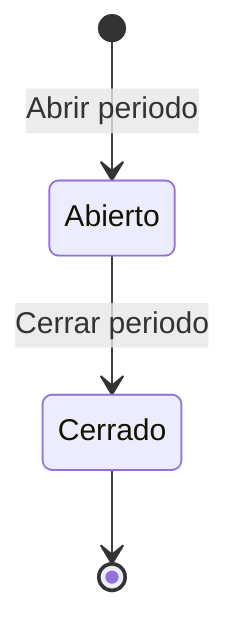

# Requerimientos Funcionales — Operación Multiempresa y Multisucursal (Grupo Reyes)

| Campo   | Valor        |
|---------|--------------|
| Versión | 1.0          |
| Fecha   | 2026-09-18   |
| Estado  | Definición   |
| Módulo  | Backbone (Seguridad/Catálogos), Ventas-Facturación, Ventas-CXC, Inmobiliaria |
| Autor   | Análisis de Negocio |

---

## 1. Propósito del documento

Este documento describe los requerimientos funcionales necesarios para que el sistema Inmobiliaria de Grupo Reyes opere bajo un esquema multiempresa —considerando las razones sociales **Vicente Reyes Magaña, Grupo Malia y María Reyes**— y multisucursal-empresa por empleado.

El sistema deberá permitir que un mismo colaborador opere en más de una sucursal y/o empresa, así como que los documentos transaccionales, tales como **movimientos bancarios y transacciones de cuentas por cobrar**, permitan seleccionar la empresa correspondiente.

Asimismo, los documentos CFDI, incluyendo **facturas, notas de crédito, abonos y anticipos**, deberán permitir seleccionar y asociar correctamente la empresa emisora que corresponda.

A continuación, se presentan los requerimientos funcionales que contemplan estas necesidades:

- **RF-01** — Configuración de múltiples sucursal y/o empresa para el empleado.
- **RF-02** — Cuenta bancaria ligada a sucursal y/o empresa del empleado.
- **RF-03** — Apertura de periodos por cuenta bancaria.
- **RF-04** — Cierre de periodos por cuenta bancaria.
- **RF-05** — Cambio de Empresa/Sucursal en Movimientos Bancarios.
- **RF-06** — Selección de empresa emisora en Facturas.
- **RF-07** — Selección de empresa emisora en Notas de Crédito.
- **RF-08** — Selección de empresa emisora en Abono.
- **RF-09** — Selección de empresa emisora en Anticipos.
- **RF-10** — Registro de Transacciones CXC manuales con selección de empresa emisora.
- **RF-11** — Filtro por sucursal en consultas del módulo Ventas y Facturación.
- **RF-12** — Regularización de información transaccional histórica a Empresa "Vicente Reyes" y Sucursal "Matriz".
- **RF-13** — Configuración de Serie por combinación Documento + Subtipo + Empresa + Régimen Fiscal.
- **RF-14** — Alta de la empresa "Maria Reyes" y "Grupo Malia" (puesta en marcha).
- **RF-15** — Campo Empresa en el catálogo Pac.
- **RF-16** — Resolución del PAC por Empresa emisora al timbrar.
- **RF-17** — Configuración del PAC de cada una de las 3 empresas.

Este documento se basa en la solicitud de negocio recibida (documento de alcance funcional RY-01INN01-FT01) y en una revisión técnica del código fuente actual del sistema, de modo que cada requerimiento describe explícitamente qué existe hoy y qué debe construirse o modificarse.

Los RF-13 y RF-14 se incorporan del documento **RF-separacion-folios-empresa-regimen-fiscal.md**, referente a la separación de folios de Factura/Nota de Crédito/Anticipo/Abono por Empresa y Régimen Fiscal. Conservan una dependencia externa con los RF-01/RF-02/RF-05 de dicho documento (habilitación de múltiples Regímenes Fiscales por Empresa, selección de Régimen Fiscal Emisor y bloqueo de emisión sin Serie configurada), que no se incluyen en este documento.

## 2. Alcance del documento

**Incluye:**
- La relación M:M entre Empleado y Sucursal, y el concepto de sucursal/empresa predeterminada del empleado.
- La apertura/cierre de periodos por cuenta bancaria y el permiso especial asociado.
- La selección y restricción de la empresa emisora en Movimientos Bancarios, Facturas, Notas de Crédito, Abono, Anticipos y Transacciones CXC.
- El filtrado por sucursal en módulo de consultas.
- La regularización de datos históricos para que queden ligados a Empresa "Vicente Reyes" y Sucursal "Matriz".
- La configuración inicial de la empresa "Grupo Malia" (certificados y cuentas bancarias) y el alta de sucursales matriz para ambas empresas, como requerimientos no funcionales de puesta en marcha.

**No incluye:**
- La separación de listas de precios por razón social (se documenta como requerimiento no funcional que **no** debe implementarse; ver RNF-002 y el riesgo asociado en la sección de Riesgos, dado que el modelo actual de `ListaPrecio` sí exige una Empresa).
- Cambios al proceso de sincronización de Empleado/Sucursal contra el sistema externo BSuite (se documenta como dependencia/riesgo, no como alcance de construcción).
- Integraciones fiscales nuevas (timbrado, buzón tributario) distintas a las ya existentes; solo se ajusta a qué empresa quedan ligados los documentos ya timbrados.

## 3. Actores y roles

| Actor / Rol | Descripción |
|-------------|-------------|
| Administrador del sistema Inmobiliaria | Configura empleados, sus sucursales y sucursal predeterminada, cuentas bancarias, certificados y catálogos de Empresa/Sucursal. |
| Usuario con rol Ventas y Facturación | Abre y cierra periodos de las cuentas bancarias ligadas a sus empresas/sucursales configuradas; consulta reportes de Ventas y CXC filtrando por sucursal. |
| Usuario con rol Facturación | Registra y edita Movimientos Bancarios, Facturas, Notas de Crédito, Abonos, Anticipos y Transacciones CXC, seleccionando la empresa/sucursal emisora entre las configuradas a su usuario. |
| Personal operativo de Inmobiliaria | Registra Arrendatarios, Rentas, Abonos, Gastos e Ingresos; los campos Empresa y Sucursal se capturan de forma automática y son de solo consulta para este actor. |
| Auditor / Área de cumplimiento | No opera el sistema directamente; consume los campos Empresa/Sucursal capturados con fines de auditoría y los reportes filtrados por sucursal. |

## 4. Entidad a la que aplica

Este documento aplica de forma transversal sobre el catálogo **Empleado** (agrega la relación M:M con **Sucursal** y el concepto de sucursal/empresa predeterminada), sobre una nueva entidad **Periodo** ligada a **CuentaBancaria** (estatus inicial *Abierto*, estatus terminal *Cerrado*), sobre los procesos transaccionales **MovimientoBancario, Factura, NotaCredito, Abono, Anticipo y Transaccion (CXC)**.

## 5. Índice de requerimientos

> **Navegación rápida:** cada identificador RF en la primera columna es un enlace que lleva directamente al detalle del requerimiento. Hacer clic para ir al RF.

| RF | Título | Sistema | Aplica a |
|----|--------|---------|----------|
| [RF-01](#rf-01) | Configuración de múltiples sucursales para el empleado | Backbone (Seguridad) | Catálogo Empleado |
| [RF-02](#rf-02) | Cuenta bancaria ligada a sucursal y/o empresa del empleado | Backbone (Catálogos) | Catálogo CuentaBancaria |
| [RF-03](#rf-03) | Apertura de periodos por cuenta bancaria | Backbone (Catálogos) | Cuenta Bancaria / Periodo |
| [RF-04](#rf-04) | Cierre de periodos por cuenta bancaria | Backbone (Catálogos) | Cuenta Bancaria / Periodo |
| [RF-05](#rf-05) | Cambio de Empresa/Sucursal en Movimientos Bancarios | Ventas (CXP) | Movimiento Bancario |
| [RF-06](#rf-06) | Selección de empresa emisora en Facturas | Ventas (Facturación) | Factura |
| [RF-07](#rf-07) | Selección de empresa emisora en Notas de Crédito | Ventas (Facturación) | Nota de Crédito |
| [RF-08](#rf-08) | Selección de empresa emisora en Abono | Ventas (Facturación/CXC) | Abono |
| [RF-09](#rf-09) | Selección de empresa emisora en Anticipos | Ventas (Facturación/CXC) | Anticipo |
| [RF-10](#rf-10) | Registro de Transacciones CXC manuales con selección de empresa | Ventas (CXC) | Transacción CXC |
| [RF-11](#rf-11) | Filtro por sucursal en consultas de Ventas y Facturación | Ventas (Facturación) | Consultas/Reportes de Ventas |
| [RF-12](#rf-12) | Regularización de información transaccional histórica | Backbone / Ventas / Inmobiliaria | Movimiento Bancario, Transacción CXC, Factura, Abono, Anticipo |
| [RF-13](#rf-13) | Configuración de Serie por combinación Documento+Subtipo+Empresa+Régimen Fiscal | Backbone (Catálogos) | VariableSistema |
| [RF-14](#rf-14) | Alta de la empresa "Maria Reyes" y "Grupo Malia" (puesta en marcha) | Backbone (Catálogos) | Empresa, Sucursal, Certificados, Cuenta Bancaria |
| [RF-15](#rf-15) | Campo Empresa en el catálogo Pac | Backbone (Catálogos-Configuración) | Catálogo Pac |
| [RF-16](#rf-16) | Resolución del PAC por Empresa emisora al timbrar | Ventas-Facturación (Timbrado) | Timbrado (TimbrarJob) |
| [RF-17](#rf-17) | Configuración del PAC de cada una de las 3 empresas (puesta en marcha) | Backbone (Catálogos-Configuración) | Catálogo Pac |

---
---

# RF-01 — Configuración de múltiples sucursales para el empleado

| Campo        | Valor       |
|--------------|-------------|
| Prioridad    | Must        |
| Estado       | Definición  |
| Dependencias | Ninguna |

## Objetivo
Permitir que un empleado quede relacionado con varias sucursales (de la misma o distinta empresa) en lugar de una sola, y que una de ellas se marque como predeterminada para precargar los procesos que capture.

## Descripción
El sistema deberá permitir que el catálogo Empleado soporte una relación de **muchos a muchos** con el catálogo Sucursal, agregando o quitando sucursales vigentes y marcando una de ellas como predeterminada. Actualmente `Empleado` mantiene una única sucursal (`EmpleadoDeSucursal`), no editable desde la interfaz porque se sincroniza automáticamente desde el sistema externo BSuite (`OidBSuite`).
### Información / atributos

| Campo | Obligatorio | Descripción |
|-------|-------------|-------------|
| Sucursal | Sí | Sucursal vigente (estatus Activo) que se relaciona al empleado. |
| Predeterminada | Sí | Indicador booleano; solo una sucursal por empleado puede tenerlo en verdadero. |
| Empresa (Asignada) | No (calculado) | Se recalcula automáticamente a partir de la Empresa dueña de la sucursal predeterminada. |

### Operaciones
- Agregar sucursal a empleado.
- Quitar relación de sucursal a empleado.
- Marcar/desmarcar sucursal como predeterminada.

## HU-1.1 — Configurar múltiples sucursales del empleado

Como usuario con rol Administrador del sistema Inmobiliaria, quiero configurar múltiples sucursales a un empleado y visualmente mostrar el **listado de Sucursales relacionadas**, para que un mismo colaborador pueda operar procesos en más de una sucursal y empresa sin necesidad de crear un empleado distinto por cada una.

### Reglas de negocio

**RN-1.1** Solo se pueden relacionar sucursales cuyo estatus sea Activo.

**RN-1.2** No se podrá duplicar la relación de la misma sucursal para un mismo empleado.

**RN-1.3** Todo empleado deberá tener relacionada al menos una sucursal; el sistema no permite guardar un empleado sin ninguna sucursal relacionada.

**RN-1.4** Se permite relacionar sucursales de cualquier empresa configurada en el sistema (no se restringe a una sola razón social por empleado).

**RN-1.5** Al quitar la relación de una sucursal marcada como predeterminada, el sistema exige que el usuario marque otra sucursal como predeterminada antes de guardar (ver RN-1.7 en HU-1.2).

### Criterios de Aceptación

**CA-1.1.1 — Agregar sucursal a un empleado**
Dado que el administrador edita un empleado y selecciona una sucursal en estatus Activo que aún no está relacionada
Cuando confirma el alta de la relación
Entonces el sistema agrega la sucursal a la Lista de sucursales del empleado y la deja disponible para marcarse como predeterminada.

**CA-1.1.2 — Bloqueo de sucursal inactiva**
Dado que el administrador intenta relacionar una sucursal cuyo estatus es distinto de Activo
Cuando busca la sucursal en el selector de alta
Entonces el sistema no la muestra como opción disponible.

**CA-1.1.3 — Bloqueo de duplicidad**
Dado que la sucursal ya está relacionada al empleado
Cuando el administrador intenta agregarla nuevamente
Entonces el sistema impide el alta duplicada e informa que la sucursal ya está relacionada.

**CA-1.1.4 — Quitar sucursal relacionada**
Dado que un empleado tiene dos o más sucursales relacionadas y la sucursal a quitar no es la predeterminada
Cuando el administrador quita la relación
Entonces el sistema elimina de la lista sin afectar la sucursal predeterminada vigente.

**CA-1.1.5 — Empleado sin ninguna sucursal**
Dado que el administrador intenta guardar un empleado tras quitar su única sucursal relacionada
Cuando confirma los cambios
Entonces el sistema rechaza el guardado e indica que se requiere al menos una sucursal relacionada.

### Casos de prueba

**CP-1.1.1 — Alta exitosa de sucursal adicional (camino feliz)**
Verifica: CA-1.1.1
Dado que el empleado "Juan Pérez" tiene relacionada únicamente la sucursal "Matriz Vicente Reyes" (Activa)
Cuando el administrador agrega la sucursal "Sucursal Norte" (Activa)
Entonces el empleado queda con dos sucursales relacionadas y solo una quedará como predeterminada.

**CP-1.1.2 — Rechazo de sucursal inactiva (validación)**
Verifica: CA-1.1.2 · RN-1.1
Dado que la sucursal "Sucursal Sur" tiene estatus Baja
Cuando el administrador abre el selector de sucursales para relacionar al empleado
Entonces "Sucursal Sur" no aparece en la lista de opciones disponibles.

**CP-1.1.3 — Rechazo de duplicidad (error/validación)**
Verifica: CA-1.1.3 · RN-1.2
Dado que "Matriz Vicente Reyes" ya está relacionada al empleado "Juan Pérez"
Cuando el administrador intenta agregarla de nuevo
Entonces el sistema muestra el mensaje "La sucursal ya está relacionada a este empleado" y no crea una segunda relación.

**CP-1.1.4 — Quitar sucursal no predeterminada (camino feliz)**
Verifica: CA-1.1.4
Dado que el empleado tiene "Matriz Vicente Reyes" (predeterminada) y "Sucursal Norte" relacionadas
Cuando el administrador quita "Sucursal Norte"
Entonces el empleado conserva únicamente "Matriz Vicente Reyes" como sucursal predeterminada y relacionada.

**CP-1.1.5 — Bloqueo por empleado sin sucursales (error/validación)**
Verifica: CA-1.1.5 · RN-1.3
Dado que el empleado tiene una sola sucursal relacionada
Cuando el administrador la quita e intenta guardar
Entonces el sistema impide guardar y muestra el mensaje "El empleado debe tener al menos una sucursal relacionada".

**CP-1.1.6 — Usuario sin permiso no puede modificar sucursales (permisos)**
Verifica: CA-1.1.1
Dado que un usuario sin el rol Administrador abre la ficha de un empleado
Cuando busca la opción para agregar/quitar sucursales
Entonces el sistema no muestra o deshabilita dicha opción.

| CA | Caso(s) de prueba | Escenarios cubiertos |
| --- | --- | --- |
| CA-1.1.1 | CP-1.1.1, CP-1.1.6 | Camino feliz, Permisos |
| CA-1.1.2 | CP-1.1.2 | Validación (estatus) |
| CA-1.1.3 | CP-1.1.3 | Error/validación (duplicidad) |
| CA-1.1.4 | CP-1.1.4 | Camino feliz |
| CA-1.1.5 | CP-1.1.5 | Error/validación (mínimo requerido) |

## HU-1.2 — Marcar una sucursal como predeterminada

Como usuario con rol Administrador del sistema Inmobiliaria, quiero marcar una sucursal como predeterminada dentro de la **lista de sucursales relacionadas** al empleado, para que los procesos que el empleado capture tomen automáticamente esa sucursal y su empresa como valores iniciales.

### Reglas de negocio

**RN-1.6** Es requerido que el empleado tenga exactamente una sucursal marcada como predeterminada en todo momento.

**RN-1.7** Al marcar una sucursal como predeterminada, el sistema asigna en el empleado los campos "Sucursal Asignada" y "Empresa Asignada" (esta última calculada a partir de la Empresa dueña de la sucursal); al desmarcarla, ambos campos se limpian hasta que se marque otra.

**RN-1.8** Los campos "Empresa Asignada" y "Sucursal Asignada" en empleado no son editables de forma directa: siempre se deriva de la sucursal predeterminada vigente.

**RN-1.9** La sincronización automática con el sistema externo BSuite deja de alimentar la sucursal del empleado: a partir de este requerimiento, el alta, baja y marca de predeterminada de la relación Empleado-Sucursal se administra en su totalidad de forma manual dentro del sistema por la **lista de sucursales relacionadas**, sin que un proceso de sincronización externo pueda sobrescribirla.

### Criterios de Aceptación

**CA-1.2.1 — Marcar predeterminada**
Dado que el empleado tiene relacionadas "Matriz Vicente Reyes" y "Sucursal Norte", ninguna marcada como predeterminada
Cuando el administrador marca "Sucursal Norte" como predeterminada
Entonces el sistema asigna "Sucursal Norte" en el campo Sucursal Asignada y "Vicente Reyes Magaña" en el campo Empresa Asignada del empleado.

**CA-1.2.2 — Cambiar la predeterminada**
Dado que "Matriz Vicente Reyes" está marcada como predeterminada
Cuando el administrador marca "Sucursal Norte" como la nueva predeterminada
Entonces el sistema desmarca automáticamente "Matriz Vicente Reyes" y actualiza Sucursal Asignada/Empresa Asignada con los valores de "Sucursal Norte".

**CA-1.2.3 — Intento de guardar sin predeterminada**
Dado que el empleado tiene sucursales relacionadas pero ninguna marcada como predeterminada
Cuando el administrador intenta guardar los cambios
Entonces el sistema rechaza el guardado e indica que debe marcarse una sucursal predeterminada.

### Casos de prueba

**CP-1.2.1 — Asignación automática al marcar predeterminada (camino feliz)**
Verifica: CA-1.2.1 · RN-1.7
Dado que el empleado no tiene sucursal predeterminada
Cuando el administrador marca "Sucursal Norte" (de la empresa "Vicente Reyes Magaña") como predeterminada
Entonces Sucursal Asignada queda en "Sucursal Norte" y Empresa Asignada en "Vicente Reyes Magaña".

**CP-1.2.2 — Reemplazo de predeterminada (alternativo)**
Verifica: CA-1.2.2 · RN-1.6
Dado que "Matriz Vicente Reyes" está marcada como predeterminada
Cuando el administrador marca "Sucursal Malia Centro" (empresa "Grupo Malia") como predeterminada
Entonces "Matriz Vicente Reyes" deja de estar marcada y Empresa Asignada cambia a "Grupo Malia".

**CP-1.2.3 — Bloqueo por falta de predeterminada (error/validación)**
Verifica: CA-1.2.3 · RN-1.6
Dado que el empleado desmarcó su única sucursal predeterminada sin marcar otra
Cuando intenta guardar el registro
Entonces el sistema impide guardar y solicita marcar una sucursal como predeterminada.

**CP-1.2.4 — Limpieza de campos al desmarcar (alternativo)**
Verifica: CA-1.2.1 · RN-1.7
Dado que "Sucursal Norte" está marcada como predeterminada
Cuando el administrador la desmarca sin marcar otra en el mismo momento
Entonces Sucursal Asignada y Empresa Asignada quedan vacíos hasta que se marque una nueva predeterminada.

**CP-1.2.5 — La sincronización con BSuite ya no modifica la sucursal (regla de negocio)**
Verifica: RN-1.9
Dado que el empleado "Juan Pérez" tiene configuradas manualmente sus sucursales y una predeterminada dentro del sistema
Cuando el proceso de sincronización con BSuite se ejecuta nuevamente
Entonces la relación Empleado-Sucursal y la sucursal predeterminada del empleado no se modifican por dicha sincronización.

| CA | Caso(s) de prueba | Escenarios cubiertos |
| --- | --- | --- |
| CA-1.2.1 | CP-1.2.1, CP-1.2.4 | Camino feliz, Alternativo (limpieza) |
| CA-1.2.2 | CP-1.2.2 | Alternativo (reemplazo) |
| CA-1.2.3 | CP-1.2.3 | Error/validación |

---

**Regla transversal:**
El campo "Sucursal Asignada"/"Empresa Asignada" resultante de este RF es la base que usan `ProcesoBaseObject` y sus derivados (Movimiento Bancario, Factura, Nota de Crédito, Abono, Anticipo, Transacción CXC) para precargar Empresa/Sucursal al crear un documento nuevo (ver RF-05 a RF-10). Decisión de negocio confirmada: la sincronización con BSuite deja de controlar la sucursal del empleado (RN-1.9); la tarea técnica pendiente es coordinar con el equipo responsable de la integración BSuite la desactivación de esa escritura sobre `EmpleadoDeSucursal` antes de liberar este RF (ver DEP-01).

[⬆ Volver al índice](#indice-requerimientos)

---

# RF-02 — Cuenta bancaria ligada a sucursal y/o empresa del empleado

| Campo        | Valor       |
|--------------|-------------|
| Prioridad    | Should      |
| Estado       | Definición  |
| Dependencias | RF-01 |

## Objetivo
Permitir que, al agregar una cuenta bancaria, el sistema precargue la sucursal/empresa según la configuración del empleado en sesión y permita modificarla dentro de las sucursales que tiene asignadas.

## Descripción
El catálogo `CuentaBancaria` **ya cuenta hoy** con los campos `Empresa` y `Sucursal` como llaves foráneas requeridas (con regla de unicidad de cuenta "efectivo"/"remisión" acotada por sucursal). Por lo tanto, el trabajo de este requerimiento no es agregar los campos, sino ajustar la experiencia de captura: precargar Sucursal (y, por consecuencia, Empresa) con los valores predeterminados del empleado en sesión y permitir que el usuario los cambie únicamente entre las sucursales que tiene relacionadas (RF-01), en vez de mostrar el catálogo completo de sucursales del sistema.

## HU-2.1 — Precargar y editar la sucursal de la cuenta bancaria

Como usuario con rol Administrador de Inmobiliaria, quiero que al agregar una Cuenta Bancaria se precargue la sucursal predeterminada de mi usuario y pueda cambiarla entre mis sucursales asignadas, para agilizar la captura sin perder control sobre a qué empresa/sucursal queda ligada la cuenta.

### Reglas de negocio

**RN-2.1** La sucursal relacionada a la cuenta bancaria deberá encontrarse en estatus Activo.

**RN-2.2** El campo Sucursal se precarga con la sucursal predeterminada del empleado en sesión (RF-01, HU-1.2) y el campo Empresa se deriva automáticamente de dicha sucursal en caso de la acción nueva sucursal.

**RN-2.3** El selector de Sucursal solo debe ofrecer las sucursales relacionadas al empleado en sesión (RF-01); un administrador con permiso especial de "gestión global de catálogos" puede seleccionar cualquier sucursal Activa del sistema.

### Criterios de Aceptación

**CA-2.1.1 — Precarga automática**
Dado que el empleado en sesión tiene como predeterminada la sucursal "Matriz Vicente Reyes"
Cuando abre el formulario de alta de Cuenta Bancaria
Entonces los campos Sucursal y Empresa se precargan con "Matriz Vicente Reyes" y "Vicente Reyes Magaña" respectivamente.

**CA-2.1.2 — Cambio dentro de las sucursales asignadas**
Dado que el empleado en sesión tiene relacionadas "Matriz Vicente Reyes" y "Sucursal Norte"
Cuando cambia el campo Sucursal a "Sucursal Norte" antes de guardar
Entonces el sistema actualiza también el campo Empresa conforme a la empresa dueña de "Sucursal Norte".

**CA-2.1.3 — Restricción de sucursales no asignadas**
Dado que el empleado en sesión no tiene relacionada la sucursal "Sucursal Malia Centro"
Cuando intenta seleccionar dicha sucursal en el formulario de Cuenta Bancaria
Entonces el sistema no la muestra como opción disponible.

### Casos de prueba

**CP-2.1.1 — Alta con valores precargados (camino feliz)**
Verifica: CA-2.1.1 · RN-2.2
Dado que el empleado en sesión tiene como predeterminada "Matriz Vicente Reyes"
Cuando registra una Cuenta Bancaria sin modificar Sucursal/Empresa
Entonces la cuenta queda ligada a "Matriz Vicente Reyes" / "Vicente Reyes Magaña".

**CP-2.1.2 — Cambio de sucursal permitida (alternativo)**
Verifica: CA-2.1.2
Dado que el empleado tiene asignadas "Matriz Vicente Reyes" y "Sucursal Norte"
Cuando cambia la Sucursal a "Sucursal Norte" en el alta de la cuenta
Entonces la cuenta queda ligada a "Sucursal Norte" y su Empresa correspondiente.

**CP-2.1.3 — Bloqueo de sucursal no asignada (permisos/validación)**
Verifica: CA-2.1.3 · RN-2.3
Dado que el empleado no tiene relacionada "Sucursal Malia Centro"
Cuando abre el selector de Sucursal en el alta de Cuenta Bancaria
Entonces "Sucursal Malia Centro" no aparece entre las opciones.

**CP-2.1.4 — Rechazo de sucursal inactiva (validación)**
Verifica: RN-2.1
Dado que la sucursal "Sucursal Sur" está en estatus Baja
Cuando el usuario intenta seleccionarla para la Cuenta Bancaria
Entonces el sistema no la ofrece como opción disponible.

| CA | Caso(s) de prueba | Escenarios cubiertos |
| --- | --- | --- |
| CA-2.1.1 | CP-2.1.1 | Camino feliz |
| CA-2.1.2 | CP-2.1.2 | Alternativo |
| CA-2.1.3 | CP-2.1.3, CP-2.1.4 | Permisos, Validación |

[⬆ Volver al índice](#indice-requerimientos)

---

# RF-03 — Apertura de periodos por cuenta bancaria

| Campo        | Valor       |
|--------------|-------------|
| Prioridad    | Must        |
| Estado       | Definición  |
| Dependencias | RF-01, RF-02 |

## Objetivo
Permitir abrir, de forma masiva, un periodo operativo por cada cuenta bancaria ligada a las sucursales/empresa del empleado en sesión.

## Descripción
El sistema deberá permitir abrir un **periodo** por cada cuenta bancaria ligada a la empresa configurada al usuario. Actualmente **no existe** en el sistema el concepto de Periodo/PeriodoContable: es una entidad nueva a construir, asociada a `CuentaBancaria`, con estatus Abierto/Cerrado, límite de periodos abiertos simultáneos y control por permiso especial (aprovechando el catálogo `SpecialPermissionPolicy` ya existente en el sistema para extensiones de este tipo).

El diagrama resume el ciclo de vida de un Periodo: nace en estatus Abierto al ejecutar la acción de este RF y termina en Cerrado mediante la acción de RF-04; no se contempla reapertura dentro de este alcance.

## HU-3.1 — Abrir periodos de las cuentas bancarias de mis sucursales

Como usuario con rol Ventas y Facturación del sistema Inmobiliaria, quiero abrir de un solo clic el periodo de todas las cuentas bancarias ligadas a las empresas/sucursales configuradas a mi usuario, para agilizar el inicio de operación sin abrir cuenta por cuenta.

### Reglas de negocio

**RN-3.1** Al ejecutar "Abrir periodo" el sistema crea automáticamente un periodo Abierto para cada cuenta bancaria ligada a las sucursales/empresa del empleado en sesión que no tenga ya un periodo Abierto vigente.

**RN-3.2** Se permiten como máximo 2 periodos abiertos simultáneos por cuenta bancaria.

**RN-3.3** La acción "Abrir periodo" requiere que el usuario cuente con el permiso especial correspondiente; sin él, la acción no está disponible.

**RN-3.4** La acción aplica a cuentas bancarias de sucursales de las empresas según las configuradas al empleado.

### Criterios de Aceptación

**CA-3.1.1 — Apertura masiva exitosa**
Dado que el empleado tiene configuradas 3 cuentas bancarias sin periodo abierto y cuenta con el permiso especial
Cuando ejecuta la acción "Abrir periodo"
Entonces el sistema crea un periodo en estatus Abierto para cada una de las cuentas.

**CA-3.1.2 — Límite de periodos abiertos**
Dado que una cuenta bancaria ya tiene 2 periodos en estatus Abierto
Cuando el usuario ejecuta nuevamente "Abrir periodo"
Entonces el sistema omite esa cuenta e informa que alcanzó el máximo de periodos abiertos permitidos.

**CA-3.1.3 — Usuario sin permiso especial**
Dado que el usuario en sesión no cuenta con el permiso especial de apertura de periodos
Cuando intenta acceder a la acción "Abrir periodo"
Entonces el sistema no muestra o deshabilita la acción.

**CA-3.1.4 — Cobertura multiempresa**
Dado que el empleado tiene configuradas sucursales de "Vicente Reyes" y de "Grupo Malia"
Cuando ejecuta "Abrir periodo"
Entonces se abren periodos para las cuentas bancarias de ambas empresas.

### Casos de prueba

**CP-3.1.1 — Apertura exitosa para todas las cuentas del empleado (camino feliz)**
Verifica: CA-3.1.1 · RN-3.1
Dado que el empleado tiene 3 cuentas bancarias sin periodo abierto y el permiso especial habilitado
Cuando ejecuta "Abrir periodo"
Entonces las 3 cuentas quedan con un periodo en estatus Abierto.

**CP-3.1.2 — Bloqueo por límite de 2 periodos abiertos (validación)**
Verifica: CA-3.1.2 · RN-3.2
Dado que la cuenta "BBVA-Matriz" ya tiene 2 periodos Abiertos
Cuando el usuario ejecuta "Abrir periodo"
Entonces el sistema no crea un tercer periodo para "BBVA-Matriz" y muestra el aviso de límite alcanzado.

**CP-3.1.3 — Usuario sin permiso especial no ve la acción (permisos)**
Verifica: CA-3.1.3 · RN-3.3
Dado que el usuario en sesión no tiene asignado el permiso especial "Abrir/Cerrar periodo de cuenta bancaria"
Cuando busca la acción en la pantalla de Cuentas Bancarias
Entonces la acción no aparece disponible.

**CP-3.1.4 — Apertura cubre ambas empresas (multiempresa)**
Verifica: CA-3.1.4 · RN-3.4
Dado que el empleado tiene sucursales configuradas de "Vicente Reyes" y "Grupo Malia" con cuentas bancarias propias
Cuando ejecuta "Abrir periodo"
Entonces se crean periodos Abiertos para las cuentas de ambas empresas en la misma operación.

**CP-3.1.5 — Re-ejecución no duplica periodos vigentes (alternativo)**
Verifica: CA-3.1.1 · RN-3.1
Dado que una cuenta ya tiene 1 periodo Abierto y las demás no tienen ninguno
Cuando el usuario ejecuta "Abrir periodo" nuevamente
Entonces solo se crean periodos para las cuentas sin periodo Abierto vigente; la cuenta con periodo ya abierto no se duplica.

| CA | Caso(s) de prueba | Escenarios cubiertos |
| --- | --- | --- |
| CA-3.1.1 | CP-3.1.1, CP-3.1.5 | Camino feliz, Alternativo |
| CA-3.1.2 | CP-3.1.2 | Validación (límite) |
| CA-3.1.3 | CP-3.1.3 | Permisos |
| CA-3.1.4 | CP-3.1.4 | Multiempresa |

[⬆ Volver al índice](#indice-requerimientos)

---

# RF-04 — Cierre de periodos por cuenta bancaria

| Campo        | Valor       |
|--------------|-------------|
| Prioridad    | Must        |
| Estado       | Definición  |
| Dependencias | RF-03 |

## Objetivo
Permitir cerrar, de forma masiva, el periodo operativo vigente de cada cuenta bancaria ligada a las sucursales/empresa del empleado en sesión.

## Descripción
El sistema deberá permitir cerrar el periodo Abierto de cada cuenta bancaria ligada a la empresa configurada al usuario, con el mismo alcance multiempresa y control de permiso especial que la apertura (RF-03).

## HU-4.1 — Cerrar periodos de las cuentas bancarias de mis sucursales

Como usuario con rol Ventas y Facturación del sistema Inmobiliaria, quiero cerrar de un solo clic el periodo vigente de todas las cuentas bancarias ligadas a las empresas/sucursales configuradas a mi usuario, para concluir la operación del periodo sin cerrar cuenta por cuenta.

### Reglas de negocio

**RN-4.1** Al ejecutar "Cerrar periodo" el sistema aplica el cierre al periodo Abierto más reciente de cada cuenta bancaria ligada a las sucursales/empresa del empleado en sesión.

**RN-4.2** La acción "Cerrar periodo" requiere que el usuario cuente con el permiso especial correspondiente; sin él, la acción no está disponible.

**RN-4.3** La acción aplica tanto a cuentas bancarias de sucursales de la empresa "Vicente Reyes" como de "Grupo Malia", según las sucursales configuradas al empleado.

**RN-4.4** Una cuenta bancaria sin ningún periodo Abierto se omite de la operación de cierre sin generar error que detenga el resto del proceso.

**RN-4.5** Mientras una cuenta bancaria no tenga ningún periodo en estatus Abierto (es decir, su periodo más reciente está Cerrado), el sistema no permite capturar nuevos Movimientos Bancarios ni Transacciones CXC contra esa cuenta; la captura se reactiva automáticamente al abrir un nuevo periodo (RF-03).

### Criterios de Aceptación

**CA-4.1.1 — Cierre masivo exitoso**
Dado que el empleado tiene 3 cuentas bancarias con periodo Abierto y cuenta con el permiso especial
Cuando ejecuta la acción "Cerrar periodo"
Entonces el sistema cambia el estatus de los 3 periodos a Cerrado.

**CA-4.1.2 — Usuario sin permiso especial**
Dado que el usuario en sesión no cuenta con el permiso especial de cierre de periodos
Cuando intenta acceder a la acción "Cerrar periodo"
Entonces el sistema no muestra o deshabilita la acción.

**CA-4.1.3 — Cuenta sin periodo abierto**
Dado que una de las cuentas bancarias del empleado no tiene ningún periodo Abierto
Cuando se ejecuta "Cerrar periodo"
Entonces esa cuenta se omite del proceso y las demás cuentas con periodo Abierto sí se cierran correctamente.

**CA-4.1.4 — Cobertura multiempresa**
Dado que el empleado tiene sucursales/cuentas con periodo Abierto en "Vicente Reyes" y "Grupo Malia"
Cuando ejecuta "Cerrar periodo"
Entonces se cierran los periodos de cuentas de ambas empresas en la misma operación.

**CA-4.1.5 — Bloqueo de captura con periodo Cerrado**
Dado que la cuenta bancaria "BBVA-Matriz" tiene su periodo más reciente en estatus Cerrado
Cuando un usuario intenta registrar un Movimiento Bancario o una Transacción CXC contra esa cuenta
Entonces el sistema rechaza la captura e indica que la cuenta no tiene un periodo Abierto vigente.

**CA-4.1.6 — Reactivación de captura al reabrir periodo**
Dado que la cuenta "BBVA-Matriz" tenía su periodo Cerrado y bloqueada la captura
Cuando se abre un nuevo periodo para esa cuenta (RF-03)
Entonces el sistema vuelve a permitir el registro de Movimientos Bancarios y Transacciones CXC contra ella.

### Casos de prueba

**CP-4.1.1 — Cierre exitoso para todas las cuentas del empleado (camino feliz)**
Verifica: CA-4.1.1 · RN-4.1
Dado que el empleado tiene 3 cuentas con periodo Abierto y el permiso especial habilitado
Cuando ejecuta "Cerrar periodo"
Entonces los 3 periodos cambian a estatus Cerrado.

**CP-4.1.2 — Usuario sin permiso especial no ve la acción (permisos)**
Verifica: CA-4.1.2 · RN-4.2
Dado que el usuario en sesión no tiene asignado el permiso especial de cierre
Cuando busca la acción en la pantalla de Cuentas Bancarias
Entonces la acción no aparece disponible.

**CP-4.1.3 — Cuenta sin periodo abierto se omite sin error (alternativo)**
Verifica: CA-4.1.3 · RN-4.4
Dado que la cuenta "Santander-Norte" no tiene periodo Abierto y las demás sí
Cuando el usuario ejecuta "Cerrar periodo"
Entonces "Santander-Norte" se omite y el resto de las cuentas cierra su periodo sin que el proceso se detenga.

**CP-4.1.4 — Cierre cubre ambas empresas (multiempresa)**
Verifica: CA-4.1.4 · RN-4.3
Dado que existen cuentas con periodo Abierto en sucursales de "Vicente Reyes" y "Grupo Malia" del mismo empleado
Cuando ejecuta "Cerrar periodo"
Entonces ambas quedan Cerradas en la misma operación.

**CP-4.1.5 — Bloqueo de captura con cuenta en periodo Cerrado (error/regla)**
Verifica: CA-4.1.5 · RN-4.5
Dado que la cuenta "BBVA-Matriz" no tiene ningún periodo Abierto
Cuando un usuario intenta registrar un Movimiento Bancario contra "BBVA-Matriz"
Entonces el sistema rechaza el registro e indica que debe abrirse un periodo antes de capturar.

**CP-4.1.6 — Captura habilitada tras reabrir periodo (alternativo)**
Verifica: CA-4.1.6 · RN-4.5
Dado que "BBVA-Matriz" tenía la captura bloqueada por periodo Cerrado
Cuando el usuario ejecuta "Abrir periodo" para esa cuenta
Entonces puede registrar Movimientos Bancarios y Transacciones CXC contra ella nuevamente.

| CA | Caso(s) de prueba | Escenarios cubiertos |
| --- | --- | --- |
| CA-4.1.1 | CP-4.1.1 | Camino feliz |
| CA-4.1.2 | CP-4.1.2 | Permisos |
| CA-4.1.3 | CP-4.1.3 | Alternativo |
| CA-4.1.4 | CP-4.1.4 | Multiempresa |
| CA-4.1.5 | CP-4.1.5 | Error/regla |
| CA-4.1.6 | CP-4.1.6 | Alternativo |

---

**Regla transversal (RF-03/RF-04):**
La entidad Periodo es nueva y no reemplaza ningún control existente. Decisión de negocio confirmada: cerrar el periodo de una cuenta bancaria **sí bloquea** la captura de nuevos Movimientos Bancarios y Transacciones CXC contra ella (RN-4.5) hasta que se abra un nuevo periodo; esta validación debe implementarse en la capa de guardado de `MovimientoBancario` y `Transaccion`, no solo como advertencia visual. Asimismo, el permiso especial que habilita ambas acciones (RN-3.3 y RN-4.2) es **uno solo**: "Abrir/Cerrar periodo de cuenta bancaria", registrado como una única clave en `SpecialPermissionPolicy` y validado igual en ambas acciones.

[⬆ Volver al índice](#indice-requerimientos)

---

# RF-05 — Cambio de Empresa en Movimientos Bancarios

| Campo        | Valor       |
|--------------|-------------|
| Prioridad    | Must        |
| Estado       | Definición  |
| Dependencias | RF-01 |

## Objetivo
Permitir editar el campo Empresa de un Movimiento Bancario, precargado según el origen del movimiento o la configuración del empleado.

## Descripción
`MovimientoBancario` ya tiene el campo `Sucursal`, pero **no tiene hoy un campo propio `Empresa`** (se infiere indirectamente desde `PersonalCaptura.Empresa`). Este requerimiento agrega el campo `Empresa` propio del Movimiento Bancario y define dos formas de precarga: automática, tomando Empresa del documento que originó el movimiento (pago, anticipo, abono o factura relacionados vía `fk_pago`/`fk_anticipo`/`fk_abono`/`fk_factura`), y manual, tomando como base la Empresa predeterminada del empleado en sesión (RF-01) y permitiendo su edición.

## HU-5.1 — Editar Empresa en un movimiento bancario manual

Como usuario con el rol de Facturación del sistema Inmobiliaria, quiero poder editar el campo Empresa en Movimientos Bancarios capturados manualmente, para reflejar correctamente a qué empresa pertenece el movimiento cuando no coincide con la sucursal - Empresa predeterminada.

### Reglas de negocio

**RN-5.1** Cuando el Movimiento Bancario se origina automáticamente desde otro documento (pago, anticipo, abono o factura), los campos Empresa se toman del documento origen y no es editable.

**RN-5.2** Cuando el registro del Movimiento Bancario es manual, el sistema precarga Empresa con los valores predeterminados del empleado en sesión y permite su edición.

**RN-5.3** Todo Movimiento Bancario deberá requerir Empresa para poder registrarse, sin importar si es automático o manual.

### Criterios de Aceptación

**CA-5.1.1 — Precarga en movimiento manual**
Dado que el empleado en sesión tiene como predeterminada la sucursal - empresa "Matriz Vicente Reyes"
Cuando registra un Movimiento Bancario manual
Entonces el campo empresa  se precargan con "Vicente Reyes Magaña".

**CA-5.1.2 — Edición permitida en movimiento manual**
Dado que un Movimiento Bancario manual está precargado con "Vicente Reyes Magaña"
Cuando el usuario cambia a empresa "Grupo Malia"
Entonces el sistema actualiza a "Grupo Malia" conforme a la elegida.

**CA-5.1.3 — Campos no editables en movimiento automático**
Dado que un Movimiento Bancario se generó automáticamente a partir de una Factura
Cuando el usuario abre el movimiento para su consulta
Entonces los campos Empresa se muestran de solo lectura con los valores heredados de la Factura.

**CA-5.1.4 — Bloqueo por falta de Empresa/**
Dado que el usuario intenta guardar un Movimiento Bancario manual sin seleccionar Empresa
Cuando confirma el guardado
Entonces el sistema rechaza la operación e indica que el campo es obligatorio.

### Casos de prueba

**CP-5.1.1 — Precarga correcta en alta manual (camino feliz)**
Verifica: CA-5.1.1 · RN-5.2
Dado que el empleado en sesión tiene predeterminada "Matriz Vicente Reyes"
Cuando abre el formulario de alta manual de Movimiento Bancario
Entonces Empresa  aparecen precargados con los valores del empleado.

**CP-5.1.2 — Edición exitosa antes de guardar (alternativo)**
Verifica: CA-5.1.2
Dado que el movimiento manual está precargado con la sucursal predeterminada
Cuando el usuario la cambia a otra sucursal de su configuración
Entonces al guardar el movimiento queda ligado a la nueva Empresa/ seleccionada.

**CP-5.1.3 — Movimiento automático es de solo lectura (permisos/reglas)**
Verifica: CA-5.1.3 · RN-5.1
Dado que el movimiento se generó automáticamente desde un Abono
Cuando el usuario intenta modificar Empresa 
Entonces el sistema no permite la edición de esos campos.

**CP-5.1.4 — Bloqueo por campos vacíos (error/validación)**
Verifica: CA-5.1.4 · RN-5.3
Dado que el usuario deja el campo Empresa sin seleccionar en un movimiento manual
Cuando intenta guardar
Entonces el sistema impide el guardado e indica que Empresa es obligatoria.

| CA | Caso(s) de prueba | Escenarios cubiertos |
| --- | --- | --- |
| CA-5.1.1 | CP-5.1.1 | Camino feliz |
| CA-5.1.2 | CP-5.1.2 | Alternativo |
| CA-5.1.3 | CP-5.1.3 | Regla de negocio (solo lectura) |
| CA-5.1.4 | CP-5.1.4 | Error/validación |

[⬆ Volver al índice](#indice-requerimientos)

---

# RF-06 — Selección de empresa emisora en Facturas

| Campo        | Valor       |
|--------------|-------------|
| Prioridad    | Must        |
| Estado       | Definición  |
| Dependencias | RF-01 |

## Objetivo
Permitir cambiar la razón social emisora de una Factura entre las empresas configuradas al personal en sesión, con su régimen fiscal correspondiente.

## Descripción
`Factura` hereda de `ProcesoBaseObject` y ya cuenta con los campos `Empresa`/`Sucursal`, que hoy se autoasignan desde el empleado que crea el documento y no se exponen como una decisión explícita del usuario en la interfaz. Este requerimiento agrupa visualmente los campos "razón social emisor" (Empresa) y "régimen fiscal emisor", permite su edición restringida a las empresas configuradas al usuario, define el régimen fiscal por defecto según la empresa elegida (particularmente "Arrendamiento" cuando el emisor es "Grupo Malia"), y homologa que exista una sola sección de datos del cliente en la pantalla.

### Diseño UX/UI
- Agrupar en una sola sección visual los campos "Razón social emisor" y "Régimen fiscal emisor".
- El selector de razón social emisor solo ofrece las empresas configuradas al personal en sesión (RF-01) y preselecciona la correspondiente a la sucursal predeterminada.
- Eliminar duplicidad de secciones de datos del cliente, dejando una sola.

## HU-6.1 — Cambiar la empresa que emite la Factura

Como usuario con el rol de Facturación del sistema Inmobiliaria, quiero poder cambiar la empresa que emite en la pantalla Facturas, para emitir correctamente a nombre de "Vicente Reyes Magaña" o "Grupo Malia" según corresponda a la operación.

### Reglas de negocio

**RN-6.1** La razón social emisor debe precargar únicamente las empresas configuradas  por la **lista de sucursales relacionadas** al personal en sesión, dejando seleccionada por defecto la correspondiente a la sucursal predeterminada.

**RN-6.2** En una nueva Factura, el Régimen fiscal Emisor se precarga con "Arrendamiento" cuando la razón social emisor es "Grupo Malia"; en cualquier otro caso, se precarga el régimen fiscal configurado en la Empresa.

**RN-6.3** La Factura y la Transacción CXC relacionada deben corresponder siempre a la misma empresa.

**RN-6.4** No se permite editar la razón social emisor cuando la Factura está en estatus Cancelado o cuando ya está Timbrada.

**RN-6.5** Cuando la Factura se aplica contra un anticipo, la Factura, el Anticipo y la Transacción relacionada deben corresponder a la misma empresa.

**RN-6.6** Para aplicar saldo a favor, solo se permite relacionar anticipos emitidos por la misma razón social emisor y para el mismo cliente seleccionados en la Factura.

**RN-6.7** Toda Factura deberá requerir Empresa y Sucursal de registro para poder emitirse.

### Criterios de Aceptación

**CA-6.1.1 — Cambio de razón social permitido**
Dado que el usuario en sesión tiene configuradas "Vicente Reyes Magaña" y "Grupo Malia"
Cuando cambia la razón social emisor a "Grupo Malia" en una Factura nueva
Entonces el sistema permite sea editable el campo régimen fiscal emisor y y actualiza por "Arrendamiento" y ajusta el campo Empresa de la Factura.

**CA-6.1.2 — Precarga desde sucursal predeterminada**
Dado que la sucursal predeterminada del usuario pertenece a "Vicente Reyes Magaña"
Cuando abre el formulario de una Factura nueva
Entonces la razón social emisor aparece preseleccionada como "Vicente Reyes Magaña" con su régimen fiscal configurado.

**CA-6.1.3 — Bloqueo de edición en Factura timbrada**
Dado que la Factura ya se encuentra Timbrada
Cuando el usuario intenta cambiar la razón social emisor
Entonces el sistema no permite la edición del campo.

**CA-6.1.4 — Bloqueo de edición en Factura cancelada**
Dado que la Factura está en estatus Cancelado
Cuando el usuario intenta modificar la razón social emisor
Entonces el sistema no permite la edición del campo.

**CA-6.1.5 — Restricción de anticipos por razón social**
Dado que la Factura tiene como emisor a "Grupo Malia"
Cuando el usuario busca anticipos disponibles para aplicar saldo a favor
Entonces el sistema solo ofrece anticipos emitidos por "Grupo Malia" para el mismo cliente.

### Casos de prueba

**CP-6.1.1 — Cambio de emisor con régimen fiscal correcto (camino feliz)**
Verifica: CA-6.1.1 · RN-6.2
Dado que una Factura nueva tiene "Vicente Reyes Magaña" precargado
Cuando el usuario cambia el emisor a "Grupo Malia"
Entonces el régimen fiscal emisor cambia automáticamente a "Arrendamiento" y permitir sea editable.

**CP-6.1.2 — Precarga según sucursal predeterminada (camino feliz)**
Verifica: CA-6.1.2 · RN-6.1
Dado que el usuario en sesión tiene como predeterminada una sucursal de "Vicente Reyes Magaña"
Cuando crea una nueva Factura
Entonces "Vicente Reyes Magaña" aparece preseleccionada como emisor.

**CP-6.1.3 — Selector limitado a empresas configuradas (permisos/validación)**
Verifica: CA-6.1.1 · RN-6.1
Dado que el usuario solo tiene configurada la empresa "Vicente Reyes Magaña"
Cuando abre el selector de razón social emisor
Entonces "Grupo Malia" no aparece como opción disponible.

**CP-6.1.4 — Bloqueo de edición en Factura timbrada (error/regla)**
Verifica: CA-6.1.3 · RN-6.4
Dado que la Factura FAC-00123 está Timbrada
Cuando el usuario intenta cambiar el emisor
Entonces el campo se muestra de solo lectura y no admite el cambio.

**CP-6.1.5 — Bloqueo de edición en Factura cancelada (error/regla)**
Verifica: CA-6.1.4 · RN-6.4
Dado que la Factura FAC-00124 está Cancelada
Cuando el usuario intenta cambiar el emisor
Entonces el campo se muestra de solo lectura y no admite el cambio.

**CP-6.1.6 — Aplicación de saldo a favor restringida por emisor (validación)**
Verifica: CA-6.1.5 · RN-6.6
Dado que la Factura tiene como emisor a "Vicente Reyes Magaña" y existe un anticipo del mismo cliente emitido por "Grupo Malia"
Cuando el usuario busca anticipos disponibles para aplicar
Entonces el anticipo de "Grupo Malia" no aparece en la lista de anticipos aplicables.

**CP-6.1.7 — Consistencia Factura-Transacción CXC (regla de negocio)**
Verifica: RN-6.3
Dado que se emite una Factura con "Grupo Malia" como emisor
Cuando el sistema genera la Transacción CXC asociada
Entonces la Transacción queda registrada con Empresa "Grupo Malia", igual a la de la Factura.

| CA | Caso(s) de prueba | Escenarios cubiertos |
| --- | --- | --- |
| CA-6.1.1 | CP-6.1.1, CP-6.1.3 | Camino feliz, Permisos |
| CA-6.1.2 | CP-6.1.2 | Camino feliz |
| CA-6.1.3 | CP-6.1.4 | Error/regla |
| CA-6.1.4 | CP-6.1.5 | Error/regla |
| CA-6.1.5 | CP-6.1.6 | Validación |

---

**Regla transversal:**
El cálculo automático del Régimen fiscal Emisor "Arrendamiento" para "Grupo Malia" (RN-6.2) no existe hoy en el código: actualmente el régimen/uso CFDI del documento se deriva del Cliente, no de la Empresa emisora. Es funcionalidad nueva que aplica igual en RF-07, RF-08 y RF-09.

[⬆ Volver al índice](#indice-requerimientos)

---

# RF-07 — Selección de empresa emisora en Notas de Crédito

| Campo        | Valor       |
|--------------|-------------|
| Prioridad    | Must        |
| Estado       | Definición  |
| Dependencias | RF-01, RF-06 |

## Objetivo
Permitir cambiar la razón social emisora de una Nota de Crédito entre las empresas configuradas al usuario, manteniendo consistencia con la Factura que relaciona.

## Descripción
`NotaCredito` hereda igualmente de `ProcesoBaseObject`/`MasterVentaBaseObject` y comparte la misma mecánica de Empresa/Sucursal que Factura. Este requerimiento agrupa los campos de razón social/régimen fiscal emisor, restringe la relación a facturas de la misma razón social y bloquea la edición cuando el documento está cancelado o timbrado.

## HU-7.1 — Cambiar la empresa que emite la Nota de Crédito

Como usuario con el rol de Facturación del sistema Inmobiliaria, quiero poder cambiar la empresa que emite en la pantalla Notas de Crédito, para asegurar que la nota se emita a nombre de la misma razón social que la factura que corrige.

### Reglas de negocio

**RN-7.1** Solo se pueden relacionar a la Nota de Crédito facturas emitidas por la misma razón social emisor seleccionada.

**RN-7.2** La Nota de Crédito, la Factura relacionada y la Transacción CXC generada deben corresponder a la misma empresa.

**RN-7.3** No se permite editar la razón social emisor cuando la Nota de Crédito está en estatus Cancelado o cuando ya está Timbrada.

**RN-7.4** Toda Nota de Crédito deberá requerir Empresa de registro para poder emitirse.

### Criterios de Aceptación

**CA-7.1.1 — Cambio de razón social permitido**
Dado que el usuario en sesión tiene configuradas "Vicente Reyes Magaña" y "Grupo Malia"
Cuando cambia la razón social emisor de una Nota de Crédito nueva a "Grupo Malia"
Entonces el sistema actualiza el campo Empresa de la nota y limpia las facturas relacionadas al documento actual.

**CA-7.1.2 — Restricción de facturas relacionables**
Dado que la Nota de Crédito tiene como emisor a "Vicente Reyes Magaña"
Cuando el usuario busca la factura a relacionar
Entonces el sistema solo ofrece facturas emitidas por "Vicente Reyes Magaña".

**CA-7.1.3 — Bloqueo de edición en documento timbrado o cancelado**
Dado que la Nota de Crédito ya está Timbrada
Cuando el usuario intenta cambiar la razón social emisor
Entonces el sistema no permite la edición del campo.

### Casos de prueba

**CP-7.1.1 — Cambio de emisor exitoso (camino feliz)**
Verifica: CA-7.1.1 · RN-7.2
Dado que una Nota de Crédito nueva tiene "Vicente Reyes Magaña" precargado y sin factura relacionada
Cuando el usuario cambia el emisor a "Grupo Malia" y selecciona una factura de "Grupo Malia"
Entonces la Nota de Crédito, la Factura y la Transacción quedan ligadas a "Grupo Malia".

**CP-7.1.2 — Restricción de facturas de otra razón social (validación)**
Verifica: CA-7.1.2 · RN-7.1
Dado que existe la factura FAC-00200 emitida por "Grupo Malia" y la Nota de Crédito tiene emisor "Vicente Reyes Magaña"
Cuando el usuario busca facturas para relacionar
Entonces FAC-00200 no aparece en el selector.

**CP-7.1.3 — Bloqueo por documento timbrado (error/regla)**
Verifica: CA-7.1.3 · RN-7.3
Dado que la Nota de Crédito NC-00050 está Timbrada
Cuando el usuario intenta cambiar el emisor
Entonces el campo permanece de solo lectura.

**CP-7.1.4 — Bloqueo por documento cancelado (error/regla)**
Verifica: CA-7.1.3 · RN-7.3
Dado que la Nota de Crédito NC-00051 está Cancelada
Cuando el usuario intenta cambiar el emisor
Entonces el campo permanece de solo lectura.

**CP-7.1.5 — Falta de Empresa/Sucursal bloquea el registro (validación)**
Verifica: RN-7.4
Dado que el usuario intenta guardar una Nota de Crédito sin Sucursal seleccionada
Cuando confirma el guardado
Entonces el sistema impide el registro e indica que la Sucursal es obligatoria.

| CA | Caso(s) de prueba | Escenarios cubiertos |
| --- | --- | --- |
| CA-7.1.1 | CP-7.1.1 | Camino feliz |
| CA-7.1.2 | CP-7.1.2 | Validación |
| CA-7.1.3 | CP-7.1.3, CP-7.1.4, CP-7.1.5 | Error/regla, Validación |

[⬆ Volver al índice](#indice-requerimientos)

---

# RF-08 — Selección de empresa emisora en Abono

| Campo        | Valor       |
|--------------|-------------|
| Prioridad    | Must        |
| Estado       | Definición  |
| Dependencias | RF-01, RF-06 |

## Objetivo
Permitir cambiar la razón social emisora de un Abono entre las empresas configuradas al usuario, manteniendo consistencia con las facturas que aplica.

## Descripción
`Abono` hereda de `ProcesoBaseObject` y participa del mismo mecanismo de Empresa/Sucursal. Este requerimiento agrupa los campos de razón social/régimen fiscal emisor y restringe las facturas aplicables al mismo emisor y cliente.

## HU-8.1 — Cambiar la empresa que emite el Abono

Como usuario con el rol de Facturación del sistema Inmobiliaria, quiero poder cambiar la empresa que emite en la pantalla Abono, para aplicar correctamente el pago a facturas de la misma razón social.

### Reglas de negocio

**RN-8.1** Solo se pueden relacionar al Abono facturas emitidas por la misma razón social emisor y del mismo cliente seleccionados.

**RN-8.2** El Abono, la Factura y la Transacción CXC relacionada deben corresponder a la misma empresa.

**RN-8.3** No se permite editar la razón social emisor cuando el Abono está en estatus Cancelado o cuando ya está Timbrado.

**RN-8.4** Todo Abono deberá requerir Empresa y Sucursal de registro para poder emitirse.

### Criterios de Aceptación

**CA-8.1.1 — Cambio de razón social permitido**
Dado que el usuario en sesión tiene configuradas "Vicente Reyes Magaña" y "Grupo Malia"
Cuando cambia la razón social emisor de un Abono nuevo a "Grupo Malia"
Entonces el sistema limpia las facturas relacionadas al documento actual y ajusta el campo Empresa del Abono.

**CA-8.1.2 — Restricción de facturas aplicables**
Dado que el Abono tiene como emisor a "Vicente Reyes Magaña" para el cliente "Constructora ABC"
Cuando el usuario busca facturas a aplicar
Entonces solo se muestran facturas de "Vicente Reyes Magaña" del cliente "Constructora ABC".

**CA-8.1.3 — Bloqueo de edición en documento timbrado o cancelado**
Dado que el Abono ya está Timbrado
Cuando el usuario intenta cambiar la razón social emisor
Entonces el sistema no permite la edición del campo.

### Casos de prueba

**CP-8.1.1 — Cambio de emisor exitoso (camino feliz)**
Verifica: CA-8.1.1 · RN-8.2
Dado que un Abono nuevo tiene "Vicente Reyes Magaña" precargado
Cuando el usuario lo cambia a "Grupo Malia" y selecciona facturas de "Grupo Malia"
Entonces el Abono, las facturas aplicadas y la Transacción quedan ligados a "Grupo Malia".

**CP-8.1.2 — Restricción por cliente y emisor (validación)**
Verifica: CA-8.1.2 · RN-8.1
Dado que existe la factura FAC-00300 de "Grupo Malia" para el cliente "Constructora XYZ" y el Abono es para "Constructora ABC" con emisor "Vicente Reyes Magaña"
Cuando el usuario busca facturas para aplicar el Abono
Entonces FAC-00300 no aparece en el selector.

**CP-8.1.3 — Bloqueo por Abono timbrado (error/regla)**
Verifica: CA-8.1.3 · RN-8.3
Dado que el Abono AB-00080 está Timbrado
Cuando el usuario intenta cambiar el emisor
Entonces el campo permanece de solo lectura.

**CP-8.1.4 — Bloqueo por Abono cancelado (error/regla)**
Verifica: CA-8.1.3 · RN-8.3
Dado que el Abono AB-00081 está Cancelado
Cuando el usuario intenta cambiar el emisor
Entonces el campo permanece de solo lectura.

**CP-8.1.5 — Falta de Sucursal bloquea el registro (validación)**
Verifica: RN-8.4
Dado que el usuario intenta guardar un Abono sin Sucursal seleccionada
Cuando confirma el guardado
Entonces el sistema impide el registro e indica que la Sucursal es obligatoria.

| CA | Caso(s) de prueba | Escenarios cubiertos |
| --- | --- | --- |
| CA-8.1.1 | CP-8.1.1 | Camino feliz |
| CA-8.1.2 | CP-8.1.2 | Validación |
| CA-8.1.3 | CP-8.1.3, CP-8.1.4, CP-8.1.5 | Error/regla, Validación |

[⬆ Volver al índice](#indice-requerimientos)

---

# RF-09 — Selección de empresa emisora en Anticipos

| Campo        | Valor       |
|--------------|-------------|
| Prioridad    | Must        |
| Estado       | Definición  |
| Dependencias | RF-01, RF-06 |

## Objetivo
Permitir cambiar la razón social emisora de un Anticipo entre las empresas configuradas al usuario, con su régimen fiscal correspondiente.

## Descripción
`Anticipo` hereda de `ProcesoBaseObject` y comparte el mismo mecanismo de Empresa/Sucursal que Factura. Este requerimiento agrupa los campos de razón social/régimen fiscal emisor, aplica la misma regla de "Arrendamiento" cuando el emisor es "Grupo Malia" y mantiene consistencia con la Transacción CXC generada.

## HU-9.1 — Cambiar la empresa que emite el Anticipo

Como usuario con el rol de Facturación del sistema Inmobiliaria, quiero poder cambiar la empresa que emite en la pantalla Anticipo, para registrar el anticipo a nombre de la razón social correcta.

### Reglas de negocio

**RN-9.1** La razón social emisor debe precargar únicamente las empresas configuradas al personal en sesión, dejando seleccionada por defecto la correspondiente a la sucursal predeterminada.

**RN-9.2** En un nuevo Anticipo, el Régimen fiscal Emisor se precarga con "Arrendamiento" cuando la razón social emisor es "Grupo Malia"; en cualquier otro caso, se precarga el régimen fiscal configurado en la Empresa.

**RN-9.3** El Anticipo y la Transacción CXC relacionada deben corresponder a la misma empresa.

**RN-9.4** No se permite editar la razón social emisor cuando el Anticipo está en estatus Cancelado o cuando ya está Timbrado.

**RN-9.5** Todo Anticipo deberá requerir Empresa y Sucursal de registro para poder emitirse.

### Criterios de Aceptación

**CA-9.1.1 — Cambio de razón social con régimen fiscal**
Dado que el usuario en sesión tiene configuradas "Vicente Reyes Magaña" y "Grupo Malia"
Cuando cambia la razón social emisor de un Anticipo nuevo a "Grupo Malia"
Entonces el régimen fiscal emisor cambia automáticamente a "Arrendamiento".

**CA-9.1.2 — Precarga desde sucursal predeterminada**
Dado que la sucursal predeterminada del usuario pertenece a "Vicente Reyes Magaña"
Cuando abre el formulario de un Anticipo nuevo
Entonces la razón social emisor aparece preseleccionada como "Vicente Reyes Magaña".

**CA-9.1.3 — Bloqueo de edición en Anticipo timbrado o cancelado**
Dado que el Anticipo ya está Timbrado
Cuando el usuario intenta cambiar la razón social emisor
Entonces el sistema no permite la edición del campo.

### Casos de prueba

**CP-9.1.1 — Cambio de emisor con régimen fiscal correcto (camino feliz)**
Verifica: CA-9.1.1 · RN-9.2
Dado que un Anticipo nuevo tiene "Vicente Reyes Magaña" precargado
Cuando el usuario cambia el emisor a "Grupo Malia"
Entonces el régimen fiscal emisor cambia automáticamente a "Arrendamiento".

**CP-9.1.2 — Precarga según sucursal predeterminada (camino feliz)**
Verifica: CA-9.1.2 · RN-9.1
Dado que el usuario en sesión tiene predeterminada una sucursal de "Vicente Reyes Magaña"
Cuando crea un nuevo Anticipo
Entonces "Vicente Reyes Magaña" aparece preseleccionada como emisor.

**CP-9.1.3 — Bloqueo por Anticipo timbrado (error/regla)**
Verifica: CA-9.1.3 · RN-9.4
Dado que el Anticipo AN-00040 está Timbrado
Cuando el usuario intenta cambiar el emisor
Entonces el campo permanece de solo lectura.

**CP-9.1.4 — Bloqueo por Anticipo cancelado (error/regla)**
Verifica: CA-9.1.3 · RN-9.4
Dado que el Anticipo AN-00041 está Cancelado
Cuando el usuario intenta cambiar el emisor
Entonces el campo permanece de solo lectura.

**CP-9.1.5 — Consistencia Anticipo-Transacción CXC (regla de negocio)**
Verifica: RN-9.3
Dado que se registra un Anticipo con "Grupo Malia" como emisor
Cuando el sistema genera la Transacción CXC asociada
Entonces la Transacción queda registrada con Empresa "Grupo Malia".

| CA | Caso(s) de prueba | Escenarios cubiertos |
| --- | --- | --- |
| CA-9.1.1 | CP-9.1.1 | Camino feliz |
| CA-9.1.2 | CP-9.1.2 | Camino feliz |
| CA-9.1.3 | CP-9.1.3, CP-9.1.4, CP-9.1.5 | Error/regla |

[⬆ Volver al índice](#indice-requerimientos)

---

# RF-10 — Registro de Transacciones CXC manuales con selección de empresa

| Campo        | Valor       |
|--------------|-------------|
| Prioridad    | Should      |
| Estado       | Definición  |
| Dependencias | RF-01, RF-06 |

## Objetivo
Permitir registrar Transacciones CXC manuales seleccionando la empresa emisora entre las configuradas al personal en sesión.

## Descripción
`Transaccion` (Transacción CXC) ya tiene los campos `Empresa`/`Sucursal` de solo lectura y se genera normalmente de forma automática a partir de Factura, Nota de Crédito, Abono o Anticipo (`FromFactura`, `FromNotaCredito`, `FromAbono`, `FromAnticipo`), heredando Empresa/Sucursal del documento origen. Este requerimiento habilita el registro **manual** de una Transacción CXC (para ajustes que no provienen de un documento de venta), agrupando los campos de razón social/régimen fiscal emisor y precargando la empresa correspondiente a la sucursal predeterminada del usuario.

## HU-10.1 — Registrar una Transacción CXC manual con empresa emisora

Como usuario con el rol de Facturación del sistema Inmobiliaria, quiero registrar Transacciones CXC manuales y poder cambiar la empresa que emite, para reflejar ajustes de cartera que no se originan en un documento de venta existente.

### Reglas de negocio

**RN-10.1** La razón social emisor debe precargar únicamente las empresas configuradas al personal en sesión, dejando seleccionada por defecto la correspondiente a la sucursal predeterminada.

**RN-10.2** Toda Transacción CXC deberá requerir Empresa de registro para poder guardarse.

**RN-10.3** Si el registro de la Transacción es automático (generado desde Factura, Nota de Crédito, Abono o Anticipo), los campos Empresa de registro corresponden a los del documento que le dio origen y no son editables; en su defecto (registro manual), quedan a criterio del usuario dentro de sus empresas configuradas.

### Criterios de Aceptación

**CA-10.1.1 — Registro manual con empresa seleccionable**
Dado que el usuario en sesión tiene configuradas "Vicente Reyes Magaña" y "Grupo Malia"
Cuando registra una Transacción CXC manual y selecciona "Grupo Malia" como razón social emisor
Entonces la Transacción queda registrada con Empresa "Grupo Malia".

**CA-10.1.2 — Precarga desde sucursal predeterminada**
Dado que la sucursal predeterminada del usuario pertenece a "Vicente Reyes Magaña"
Cuando abre el formulario de una Transacción CXC manual
Entonces la razón social emisor aparece preseleccionada como "Vicente Reyes Magaña".

**CA-10.1.3 — Transacción automática no editable**
Dado que la Transacción se generó automáticamente a partir de una Factura
Cuando el usuario la consulta
Entonces los campos Empresa se muestran de solo lectura con los valores heredados de la Factura.

### Casos de prueba

**CP-10.1.1 — Registro manual exitoso (camino feliz)**
Verifica: CA-10.1.1 · RN-10.1
Dado que el usuario tiene configuradas ambas empresas
Cuando registra una Transacción CXC manual seleccionando "Grupo Malia"
Entonces la Transacción queda ligada a "Grupo Malia".

**CP-10.1.2 — Precarga según sucursal predeterminada (camino feliz)**
Verifica: CA-10.1.2 · RN-10.1
Dado que la sucursal predeterminada del usuario es de "Vicente Reyes Magaña"
Cuando abre el formulario de registro manual
Entonces "Vicente Reyes Magaña" aparece preseleccionada.

**CP-10.1.3 — Bloqueo por falta de Empresa/Sucursal (validación)**
Verifica: RN-10.2
Dado que el usuario intenta guardar una Transacción manual sin seleccionar Sucursal
Cuando confirma el guardado
Entonces el sistema impide el registro e indica que la Sucursal es obligatoria.

**CP-10.1.4 — Transacción automática es de solo lectura (regla de negocio)**
Verifica: CA-10.1.3 · RN-10.3
Dado que la Transacción TR-00500 se generó automáticamente desde un Anticipo
Cuando el usuario intenta modificar Empresa o Sucursal
Entonces el sistema no permite la edición de esos campos.

| CA | Caso(s) de prueba | Escenarios cubiertos |
| --- | --- | --- |
| CA-10.1.1 | CP-10.1.1, CP-10.1.3 | Camino feliz, Validación |
| CA-10.1.2 | CP-10.1.2 | Camino feliz |
| CA-10.1.3 | CP-10.1.4 | Regla de negocio |

[⬆ Volver al índice](#indice-requerimientos)

---

# RF-11 — Filtro para las consultas

| Campo        | Valor       |
|--------------|-------------|
| Prioridad    | Should      |
| Estado       | Definición  |
| Dependencias | RF-01 |

## Objetivo
Permitir filtrar las consultas del módulo Ventas y CXC por sucursal asignada al empleado en sesión.

## Descripción
El sistema deberá permitir filtrar y consultar la información de forma independiente por Empresa en las siguientes rutas de la interfaz gráfica:
Consultas > CXC > **CFDIs CFDIs Complementos**, 
Consultas > Ventas > **CFDIs Emitidos**

### Operaciones
- Agregar filtro `Empresa` permitir seleccionar la empresas relacionadas por sucursales configuradas a personal en session.
- Restringir las opciones del filtro a empresas en estatus Activo.

## HU-11.1 — Filtrar consultas de Ventas por sucursal

Como usuario con el rol de Facturación del sistema Inmobiliaria, quiero filtrar el módulo de consultas de Ventas por empresa asignadas a mi usuario, para revisar únicamente la información de las sucursales que me corresponden.

### Reglas de negocio

**RN-11.1** El filtro de empresa permite selección solo de sucursales empresa en estatus Activo.

**RN-11.2** Cuando no se selecciona ninguna empresa en el filtro, la consulta muestra la información de todas las empresas asignadas al empleado en sesión (comportamiento por defecto, no del sistema completo).

**RN-11.3** El filtro aplica de manera uniforme a las 2 consultas: CFDIs Complementos y CFDIs Emitidos.

### Criterios de Aceptación

**CA-11.1.1 — Filtro disponible y funcional**
Dado que el usuario abre la consulta "Facturas Emitidas"
Cuando selecciona la empresa "Matriz Vicente Reyes" en el filtro
Entonces la consulta muestra únicamente los registros de esa empresa.

**CA-11.1.2 — Selección de empresa**
Dado que el usuario tiene asignadas N empresas
Cuando selecciona 1 de ellas.
Entonces las consultas muestran la información de la empresa seleccionada.

**CA-11.1.3 — Solo empresas activas en el selector**
Dado que existe una empresa en estatus Baja asignada históricamente al empleado
Cuando abre el filtro de empresas de cualquiera de las 2 consultas
Entonces dicha empresa no aparece como opción seleccionable.

### Casos de prueba

**CP-11.1.1 — Filtro por una empresa (camino feliz)**
Verifica: CA-11.1.1 · RN-11.1
Dado que el usuario tiene asignadas "Matriz Vicente Reyes" y "Sucursal Norte"
Cuando filtra "Facturas Emitidas" por "Matriz Vicente Reyes"
Entonces solo se listan facturas de la empresa seleccionada.

**CP-11.1.2 — Filtro ninguna empresa**
Verifica: CA-11.1.1 · RN-11.1
Dado que el usuario no selecciona empresa
Entonces se listan facturas de todas las empresas asignadas al empleado en sesión.

**CP-11.1.3 — Cobertura del filtro en las 2 consultas (regresión funcional)**
Verifica: CA-11.1.1 · RN-11.3
Dado que se navega, una por una, a las 2 consultas listadas en este RF
Cuando se revisa cada pantalla
Entonces todas exponen el mismo filtro de empresa con el mismo comportamiento.

| CA | Caso(s) de prueba | Escenarios cubiertos |
| --- | --- | --- |
| CA-11.1.1 | CP-11.1.1, CP-11.1.5 | Camino feliz, Regresión |
| CA-11.1.2 | CP-11.1.2 | Alternativo |
| CA-11.1.3 | CP-11.1.3 | Alternativo (default) |
| CA-11.1.4 | CP-11.1.4 | Validación |

[⬆ Volver al índice](#indice-requerimientos)

---

# RF-12 — Regularización de información transaccional histórica

| Campo        | Valor       |
|--------------|-------------|
| Prioridad    | Must (prerrequisito de puesta en marcha) |
| Estado       | Definición  |
| Dependencias | RF-01, RF-02, RF-05, RF-06, RF-07, RF-08, RF-09, RF-10 |

## Objetivo
Asegurar que la información transaccional generada antes de esta iniciativa quede ligada de forma consistente a la Empresa "Vicente Reyes" y Sucursal "Matriz", de modo que los nuevos filtros y validaciones por sucursal no dejen huérfanos los registros históricos.

## Descripción
El sistema deberá completar (o regularizar) la información de Empresa/Sucursal en los registros históricos de Movimientos Bancarios, Transacciones CXC, Facturas, Abonos y Anticipos generados previamente, ligándolos a la Empresa "Vicente Reyes" y Sucursal "Matriz". Es importante señalar, como hallazgo técnico, que `ProcesoBaseObject` (clase base de Factura, NotaCredito, Abono, Anticipo y Transaccion) ya autoasigna Empresa/Sucursal desde el empleado creador al momento de la creación (`AfterConstruction`); por lo tanto, es probable que estos registros históricos ya tengan un valor no nulo, y que la tarea real sea una **corrección/estandarización** hacia "Vicente Reyes"/"Matriz" (en los casos en que el valor difiera o esté vacío) más que un llenado de datos nulos desde cero. Esto debe confirmarse antes de ejecutar la migración (ver PA-03).

## HU-12.1 — Regularizar Empresa/Sucursal de los registros históricos

Como usuario con el rol de Facturación del sistema Inmobiliaria, quiero que la información transaccional generada antes de este proyecto quede ligada a la Empresa "Vicente Reyes" y Sucursal "Matriz", para que los reportes y filtros por sucursal (RF-11) reflejen el histórico completo sin registros huérfanos.

### Reglas de negocio

**RN-12.1** Todo registro histórico (previo a la fecha de liberación del proyecto) de Movimiento Bancario, Transacción CXC, Factura, Abono o Anticipo sin Empresa/Sucursal asignada, o con un valor distinto que deba estandarizarse, queda ligado a Empresa "Vicente Reyes" y Sucursal "Matriz".

**RN-12.2** La regularización se ejecuta una sola vez, como proceso de migración previo a la liberación de los RF-05 a RF-10 en producción, y no como una acción recurrente del sistema.

**RN-12.3** La regularización no debe alterar los importes, estatus ni ninguna otra información fiscal/contable de los documentos afectados; únicamente completa/corrige los campos Empresa y Sucursal.

### Criterios de Aceptación

**CA-12.1.1 — Regularización de Movimientos Bancarios históricos**
Dado que existen Movimientos Bancarios generados antes de la liberación de este proyecto
Cuando se ejecuta el proceso de regularización
Entonces todos quedan con Empresa "Vicente Reyes" y Sucursal "Matriz".

**CA-12.1.2 — Regularización de Facturas, Abonos y Anticipos históricos**
Dado que existen Facturas, Abonos y Anticipos generados antes de la liberación de este proyecto
Cuando se ejecuta el proceso de regularización
Entonces todos quedan con Empresa "Vicente Reyes" y Sucursal "Matriz".

**CA-12.1.3 — Regularización de Transacciones CXC históricas**
Dado que existen Transacciones CXC generadas antes de la liberación de este proyecto
Cuando se ejecuta el proceso de regularización
Entonces todas quedan con Empresa "Vicente Reyes" y Sucursal "Matriz".

**CA-12.1.4 — Preservación de datos fiscales/contables**
Dado que un documento histórico se regulariza con este proceso
Cuando se compara antes y después de la ejecución
Entonces el importe, estatus, folio y demás datos fiscales del documento permanecen sin cambios; solo Empresa y Sucursal se ven afectados.

### Casos de prueba

**CP-12.1.1 — Regularización exitosa de Movimientos Bancarios (camino feliz)**
Verifica: CA-12.1.1 · RN-12.1
Dado un lote de Movimientos Bancarios generados antes del corte del proyecto
Cuando se ejecuta la regularización
Entonces todos aparecen con Empresa "Vicente Reyes" y Sucursal "Matriz".

**CP-12.1.2 — Regularización exitosa de Facturas/Abonos/Anticipos (camino feliz)**
Verifica: CA-12.1.2 · RN-12.1
Dado un lote de Facturas, Abonos y Anticipos históricos
Cuando se ejecuta la regularización
Entonces todos aparecen con Empresa "Vicente Reyes" y Sucursal "Matriz".

**CP-12.1.3 — Regularización exitosa de Transacciones CXC (camino feliz)**
Verifica: CA-12.1.3 · RN-12.1
Dado un lote de Transacciones CXC históricas
Cuando se ejecuta la regularización
Entonces todas aparecen con Empresa "Vicente Reyes" y Sucursal "Matriz".

**CP-12.1.4 — No se alteran importes ni estatus (validación de integridad)**
Verifica: CA-12.1.4 · RN-12.3
Dado que la Factura FAC-00010 histórica tiene importe $15,000 y estatus Timbrado antes de la regularización
Cuando se ejecuta el proceso
Entonces conserva el mismo importe y estatus, y solo se actualizan Empresa/Sucursal.

**CP-12.1.5 — Documentos posteriores a la liberación no se ven afectados (alternativo)**
Verifica: RN-12.2
Dado que existen Facturas creadas después de la liberación del proyecto, ya con Empresa/Sucursal elegidos por el usuario (RF-06)
Cuando se ejecuta el proceso de regularización
Entonces esos documentos no se modifican.

| CA | Caso(s) de prueba | Escenarios cubiertos |
| --- | --- | --- |
| CA-12.1.1 | CP-12.1.1 | Camino feliz |
| CA-12.1.2 | CP-12.1.2 | Camino feliz |
| CA-12.1.3 | CP-12.1.3 | Camino feliz |
| CA-12.1.4 | CP-12.1.4, CP-12.1.5 | Validación de integridad, Alternativo |

[⬆ Volver al índice](#indice-requerimientos)

---

# RF-13 — Configuración de Serie por combinación Documento + Empresa + Régimen Fiscal

| Campo        | Valor       |
|--------------|-------------|
| Prioridad    | Must        |
| Estado       | Definición  |
| Dependencias | RF-01 (externo, documento RF-separacion-folios-empresa-regimen-fiscal.md) |

## Objetivo
Permitir configurar una Serie propia para cada combinación de Documento (Factura/NotaCredito/Anticipo/Abono) de modo que cada RFC emisor y cada régimen fiscal administren su numeración de forma completamente independiente.

## Descripción
Cuando se habilita un nuevo régimen fiscal a una Empresa el sistema debe asegurar la existencia de una serie por cada combinación

| DOCUMENTO | EMPRESA | REGIMEN FISCAL | SERIE |
| --- | --- | --- | --- |
| FACTURA | VICENTE REYES | ARRENDAMIENTO | A |
| FACTURA | VICENTE REYES | INGRESOS POR INTERESES | I |
| FACTURA | VICENTE REYES | PERSONAS FÍSICAS CON ACTIVIDADES EMPRESARIALES Y PROFESIONALES | E |
| FACTURA | GRUPO MALIA | ARRENDAMIENTO | Pendiente |
| FACTURA | GRUPO MALIA | INGRESOS POR INTERESES | Pendiente |
| FACTURA | GRUPO MALIA | PERSONAS FÍSICAS CON ACTIVIDADES EMPRESARIALES Y PROFESIONALES | Pendiente |
| FACTURA | MARIA REYES | ARRENDAMIENTO | Pendiente |
| FACTURA | MARIA REYES | INGRESOS POR INTERESES | Pendiente |
| FACTURA | MARIA REYES | PERSONAS FÍSICAS CON ACTIVIDADES EMPRESARIALES Y PROFESIONALES | Pendiente |
| NOTA CREDITO | VICENTE REYES | ARRENDAMIENTO | Pendiente |
| NOTA CREDITO | VICENTE REYES | INGRESOS POR INTERESES | Pendiente |
| NOTA CREDITO | VICENTE REYES | PERSONAS FÍSICAS CON ACTIVIDADES EMPRESARIALES Y PROFESIONALES | Pendiente |
| NOTA CREDITO | GRUPO MALIA | ARRENDAMIENTO | Pendiente |
| NOTA CREDITO | GRUPO MALIA | INGRESOS POR INTERESES | Pendiente |
| NOTA CREDITO | GRUPO MALIA | PERSONAS FÍSICAS CON ACTIVIDADES EMPRESARIALES Y PROFESIONALES | Pendiente |
| NOTA CREDITO | MARIA REYES | ARRENDAMIENTO | Pendiente |
| NOTA CREDITO | MARIA REYES | INGRESOS POR INTERESES | Pendiente |
| NOTA CREDITO | MARIA REYES | PERSONAS FÍSICAS CON ACTIVIDADES EMPRESARIALES Y PROFESIONALES | Pendiente |
| ANTICIPO | VICENTE REYES | ARRENDAMIENTO | Pendiente |
| ANTICIPO | VICENTE REYES | INGRESOS POR INTERESES | Pendiente |
| ANTICIPO | VICENTE REYES | PERSONAS FÍSICAS CON ACTIVIDADES EMPRESARIALES Y PROFESIONALES | Pendiente |
| ANTICIPO | GRUPO MALIA | ARRENDAMIENTO | Pendiente |
| ANTICIPO | GRUPO MALIA | INGRESOS POR INTERESES | Pendiente |
| ANTICIPO | GRUPO MALIA | PERSONAS FÍSICAS CON ACTIVIDADES EMPRESARIALES Y PROFESIONALES | Pendiente |
| ANTICIPO | MARIA REYES | ARRENDAMIENTO | Pendiente |
| ANTICIPO | MARIA REYES | INGRESOS POR INTERESES | Pendiente |
| ANTICIPO | MARIA REYES | PERSONAS FÍSICAS CON ACTIVIDADES EMPRESARIALES Y PROFESIONALES | Pendiente |
| ABONO | VICENTE REYES | ARRENDAMIENTO | B |
| ABONO | VICENTE REYES | INGRESOS POR INTERESES | B |
| ABONO | VICENTE REYES | PERSONAS FÍSICAS CON ACTIVIDADES EMPRESARIALES Y PROFESIONALES | B |
| ABONO | GRUPO MALIA | ARRENDAMIENTO | Pendiente |
| ABONO | GRUPO MALIA | INGRESOS POR INTERESES | Pendiente |
| ABONO | GRUPO MALIA | PERSONAS FÍSICAS CON ACTIVIDADES EMPRESARIALES Y PROFESIONALES | Pendiente |
| ABONO | MARIA REYES | ARRENDAMIENTO | Pendiente |
| ABONO | MARIA REYES | INGRESOS POR INTERESES | Pendiente |
| ABONO | MARIA REYES | PERSONAS FÍSICAS CON ACTIVIDADES EMPRESARIALES Y PROFESIONALES | Pendiente |

## HU-13.1 — Considerar la serie correspondiente para la generación de folios.

Como usuario con rol Administrador del sistema Inmobiliaria, quiero que el sistema gestione las Serie correspondiente para la generación de folios en los documentos Factura, Nota Crédito, Abono y Anticipo.

### Reglas de negocio

**RN-13.1** Al habilitar un régimen fiscal a una Empresa El documento conservara la separacion de folios por empresa y regimen-fiscal.

**RN-13.2** El valor (Serie) de cada combinación debe ser distinto entre combinaciones para evitar que dos combinaciones compartan consecutivo.

### Criterios de Aceptación

**CA-13.1.1 — No duplicación de claves existentes**
Dado que la clave `SERIEFACTURAF_VRM_606` ya existe con Serie "A" configurada
Cuando se vuelve a evaluar la generación automática para esa misma combinación
Entonces el sistema no sobrescribe ni duplica la fila existente.

### Casos de prueba

**CP-13.1.1 — Generación automática folios (camino feliz)**
Verifica: CA-13.1.1 · RN-13.1
Con base en la tabla antes mencionada, validar que cada combinación de documento, empresa y régimen fiscal cuente con su propia serie.

| CA | Caso(s) de prueba | Escenarios cubiertos |
| --- | --- | --- |
| CA-13.1.1 | CP-13.1.1 | Camino feliz |
| CA-13.1.2 | CP-13.1.2 | Alternativo |
| CA-13.1.3 | CP-13.1.3 | Error/validación |

[⬆ Volver al índice](#indice-requerimientos)

---

# RF-14 — Alta de la empresa "Maria Reyes" y "Grupo Malia"

| Campo        | Valor       |
|--------------|-------------|
| Prioridad    | Should      |
| Estado       | Definición  |
| Dependencias | RF-01 (externo, documento RF-separacion-folios-empresa-regimen-fiscal.md); RF-13 |

## Objetivo
Configurar en el sistema la nueva razón social "Maria Reyes" y"Grupo Malia" (aún no registrada en el catálogo `Empresa` a la fecha de este documento), para que pueda operar bajo el esquema de folios separados por Empresa.

## Descripción
Al igual que "Grupo Malia" la Empresa "Maria Reyes" se requiere el registro de empresas de sus certificados de sello digital (`EmpresaCertificado`) y PAC activo, al menos una cuenta bancaria, y su sucursal matriz. Una vez dada de alta, deben generarse (RF-13) y configurarse las Series correspondientes a cada combinación Documento+Régimen Fiscal habilitado para esta nueva Empresa antes de poder emitir documentos.

## HU-14.1 — Dar de alta la empresa  "Maria Reyes" y "Grupo Malia"

Como usuario con rol Administrador del sistema Inmobiliaria, quiero dar de alta la razón social  "Maria Reyes" y"Grupo Malia" con su información fiscal, certificados, cuenta bancaria y sucursal matriz, para que el sistema pueda emitir documentos a su nombre bajo el nuevo esquema de folios.

### Reglas de negocio

**RN-14.1** La Empresa  "Maria Reyes" y "Grupo Malia" debe darse de alta con al menos un régimen fiscal habilitado y su predeterminado (RF-01 del documento RF-separacion-folios-empresa-regimen-fiscal.md).

**RN-14.2** Debe contar con al menos un certificado de sello digital vigente y un PAC activo antes de poder timbrar documentos (`Empresa.GetCurrentCertificate()`, `Empresa.cs:360-371`, ya exige esto para cualquier Empresa).

**RN-14.3** Debe configurarse al menos una Sucursal de tipo Matriz asociada a "Maria Reyes" antes de poder operar (mismo patrón exigido para "Grupo Malia").

### Criterios de Aceptación

**CA-14.1.1 — Alta completa de la Empresa**
Dado que  "Maria Reyes" y "Grupo Malia" no existe en el catálogo Empresa
Cuando el administrador la da de alta con RFC, régimen(es) fiscal(es), certificado vigente, cuenta bancaria y sucursal matriz
Entonces la Empresa queda disponible para seleccionarse como emisora en Factura, Nota de Crédito, Anticipo y Abono (RF-06 a RF-09 de este documento).

**CA-14.1.2 — Bloqueo de timbrado sin certificado vigente**
Dado que " "Maria Reyes" y "Grupo Malia" no tiene un certificado de sello digital vigente
Cuando se intenta timbrar un documento a su nombre
Entonces el sistema rechaza el timbrado indicando que la Empresa no cuenta con un certificado vigente (comportamiento ya existente en `GetCurrentCertificate()`).

### Casos de prueba

**CP-14.1.2 — Bloqueo de timbrado sin certificado (error/regla)**
Verifica: CA-14.1.2 · RN-14.2
Dado que  "Maria Reyes" y "Grupo Malia" aún no tiene certificado vigente cargado
Cuando se intenta timbrar una Factura a su nombre
Entonces el sistema rechaza la operación con el mensaje de certificado no vigente.

| CA | Caso(s) de prueba | Escenarios cubiertos |
| --- | --- | --- |
| CA-14.1.1 | CP-14.1.1 | Camino feliz |
| CA-14.1.2 | CP-14.1.2 | Error/regla |

[⬆ Volver al índice](#indice-requerimientos)

---

# RF-15 — Campo Empresa en el catálogo Pac

| Campo        | Valor       |
|--------------|-------------|
| Prioridad    | Must        |
| Estado       | Definición  |
| Dependencias | Ninguna |

## Objetivo
Que cada registro del catálogo `Pac` declare explícitamente a qué Empresa pertenece, dejando de depender de la ruta indirecta Certificado→Pacs para saber de quién es cada PAC.

## Descripción
Que cada registro del catálogo Pac declare explícitamente a qué Empresa pertenece, dejando de depender de la ruta indirecta Certificado→Pacs para saber de quién es cada PAC.

## HU-15.1 — Asociar cada PAC a una única Empresa

Como Administrador del sistema Inmobiliaria, quiero asociar cada PAC a una única Empresa al darlo de alta, para identificar sin ambigüedad qué proveedor de certificación timbra los documentos de cada razón social.

### Reglas de negocio

**RN-15.1** El campo Empresa es obligatorio en el catálogo `Pac`.

**RN-15.2** La relación es uno a uno: una Empresa no puede tener más de un Pac asociado, y un Pac no puede estar asociado a más de una Empresa (unicidad de la FK Empresa en `Pac`).

**RN-15.3** Solo se pueden asociar Empresas en estatus Activo.

**RN-15.4** No se permite eliminar o inactivar un Pac si su Empresa asociada está Activa y no tiene otro Pac de respaldo configurado; el sistema debe advertir que esa Empresa se quedaría sin proveedor de timbrado.

### Criterios de Aceptación

**CA-15.1.1 — Alta de Pac con Empresa**
Dado que el administrador da de alta un nuevo Pac
Cuando captura la información del proveedor y selecciona la Empresa "Vicente Reyes"
Entonces el sistema guarda el Pac asociado a "Vicente Reyes" y lo muestra en su ficha.

**CA-15.1.2 — Bloqueo de doble asociación**
Dado que "Vicente Reyes" ya tiene un Pac asociado
Cuando el administrador intenta asociar esa misma Empresa a un segundo Pac
Entonces el sistema rechaza el guardado e indica que la Empresa ya tiene un PAC configurado.

**CA-15.1.3 — Bloqueo de Empresa inactiva**
Dado que una Empresa está en estatus Inactivo
Cuando el administrador abre el selector de Empresa en el alta de un Pac
Entonces dicha Empresa no aparece como opción disponible.

### Casos de prueba

**CP-15.1.1 — Alta exitosa de Pac con Empresa (camino feliz)**
Verifica: CA-15.1.1 · RN-15.1
Dado que el administrador registra un Pac nuevo y selecciona "Vicente Reyes" como Empresa
Cuando confirma el alta
Entonces el Pac queda guardado y ligado a "Vicente Reyes".

**CP-15.1.2 — Bloqueo de doble asociación (error/validación)**
Verifica: CA-15.1.2 · RN-15.2
Dado que "Vicente Reyes" ya tiene el Pac "PAC-VR" asociado
Cuando el administrador intenta asociar "Vicente Reyes" a un segundo Pac "PAC-VR2"
Entonces el sistema rechaza el guardado e informa que la Empresa ya tiene un PAC configurado.

**CP-15.1.3 — Bloqueo de Empresa inactiva (validación)**
Verifica: CA-15.1.3 · RN-15.3
Dado que la Empresa "Empresa Demo" está en estatus Inactivo
Cuando el administrador abre el selector de Empresa en el alta de un Pac
Entonces "Empresa Demo" no aparece entre las opciones disponibles.

**CP-15.1.4 — Advertencia al inactivar el único Pac de una Empresa (regla de negocio)**
Verifica: CA-15.1.4 · RN-15.4
Dado que "Grupo Malia" solo tiene el Pac "PAC-Malia" activo
Cuando el administrador intenta inactivarlo
Entonces el sistema muestra la advertencia de que "Grupo Malia" quedaría sin PAC y solicita confirmación o bloquea la acción.

| CA | Caso(s) de prueba | Escenarios cubiertos |
| --- | --- | --- |
| CA-15.1.1 | CP-15.1.1 | Camino feliz |
| CA-15.1.2 | CP-15.1.2 | Error/validación |
| CA-15.1.3 | CP-15.1.3 | Validación |
| CA-15.1.4 | CP-15.1.4 | Regla de negocio |

[⬆ Volver al índice](#indice-requerimientos)

---

# RF-16 — Resolución del PAC por Empresa emisora al timbrar

| Campo        | Valor       |
|--------------|-------------|
| Prioridad    | Must        |
| Estado       | Definición  |
| Dependencias | RF-15 |

## Objetivo
Que al timbrar una Factura, Nota de Crédito, Anticipo o Abono, el sistema identifique la Empresa (razón social) que emite el documento y use el PAC ligado directamente a esa Empresa (RF-15) para el timbrado, en lugar de resolverlo por la vía indirecta actual del certificado.

## Descripción
Que al timbrar una Factura, Nota de Crédito, Anticipo o Abono, el sistema identifique la Empresa (razón social) que emite el documento y use el PAC ligado directamente a esa Empresa (RF-15) para el timbrado, en lugar de resolverlo por la vía indirecta actual del certificado.

## HU-16.1 — Timbrar con el PAC de la Empresa emisora

Como usuario con rol Facturación, quiero que al timbrar cualquier documento el sistema use automáticamente el PAC de la Empresa emisora, para que el timbrado se realice siempre con el proveedor correcto sin intervención manual ni riesgo de usar el PAC de otra razón social.

### Reglas de negocio

**RN-16.1** Al timbrar Factura, Nota de Crédito, Anticipo o Abono, el sistema determina la Empresa emisora del documento (`doc.Empresa`) y usa el Pac asociado a esa Empresa (RF-15) para el timbrado.

**RN-16.2** Esta lógica es única y uniforme para los 4 tipos de documento, ya que todos comparten el mismo mecanismo de timbrado (`TimbrarJob` sobre `IDocumentoTimbrable`).

**RN-16.3** Si la Empresa emisora del documento no tiene un Pac asociado, o su Pac está Inactivo, el sistema bloquea el timbrado e indica qué Empresa no cuenta con un PAC configurado.

**RN-16.4** El certificado de sello digital (CSD) usado para sellar el CFDI sigue determinándose de forma independiente mediante `Empresa.GetCurrentCertificate()`, sin cambios.

### Criterios de Aceptación

**CA-16.1.1 — Timbrado con el PAC correcto (Factura)**
Dado que la Factura tiene como Empresa emisora a "Grupo Malia", y "Grupo Malia" tiene asociado el Pac "PAC-Malia"
Cuando el sistema timbra la Factura
Entonces el timbrado se envía usando las credenciales de "PAC-Malia".

**CA-16.1.2 — Consistencia entre tipos de documento**
Dado que "Vicente Reyes" tiene asociado el Pac "PAC-VR"
Cuando se timbra una Factura, una Nota de Crédito, un Anticipo y un Abono, todos emitidos por "Vicente Reyes"
Entonces los 4 documentos se timbran usando "PAC-VR".

**CA-16.1.3 — Bloqueo por Empresa sin PAC**
Dado que la Empresa "María Reyes" aún no tiene un Pac asociado
Cuando se intenta timbrar un documento emitido por "María Reyes"
Entonces el sistema rechaza el timbrado e indica que "María Reyes" no tiene un PAC configurado.

**CA-16.1.4 — No se mezclan PACs entre Empresas**
Dado que "Vicente Reyes" usa "PAC-VR" y "Grupo Malia" usa "PAC-Malia"
Cuando se timbra un documento de "Grupo Malia"
Entonces el sistema nunca utiliza las credenciales de "PAC-VR" para ese documento.

### Casos de prueba

**CP-16.1.1 — Timbrado exitoso con el PAC de la Empresa (camino feliz)**
Verifica: CA-16.1.1 · RN-16.1
Dado que la Factura FAC-00500 tiene como emisor a "Grupo Malia" y esta tiene asociado "PAC-Malia"
Cuando se ejecuta el timbrado
Entonces la petición se envía con las credenciales de "PAC-Malia".

**CP-16.1.2 — Consistencia entre los 4 tipos de documento (regresión funcional)**
Verifica: CA-16.1.2 · RN-16.2
Dado que "Vicente Reyes" tiene asociado "PAC-VR"
Cuando se timbran, una por una, una Factura, una Nota de Crédito, un Anticipo y un Abono emitidos por "Vicente Reyes"
Entonces los 4 documentos usan "PAC-VR" para el timbrado.

**CP-16.1.3 — Bloqueo de timbrado por Empresa sin PAC (error/regla)**
Verifica: CA-16.1.3 · RN-16.3
Dado que "María Reyes" no tiene ningún Pac asociado
Cuando se intenta timbrar una Factura emitida por "María Reyes"
Entonces el sistema rechaza el timbrado e indica que "María Reyes" no tiene un PAC configurado.

**CP-16.1.4 — No se mezclan credenciales entre Empresas (validación de integridad)**
Verifica: CA-16.1.4 · RN-16.1
Dado que "Vicente Reyes" usa "PAC-VR" y "Grupo Malia" usa "PAC-Malia"
Cuando se timbra un documento de "Grupo Malia"
Entonces la petición de timbrado nunca incluye las credenciales de "PAC-VR".

**CP-16.1.5 — El CSD no se ve afectado por el cambio de PAC (regla de negocio)**
Verifica: RN-16.4
Dado que la resolución del PAC cambia a la nueva lógica de este RF
Cuando se timbra un documento
Entonces el certificado de sello digital sigue determinándose por `GetCurrentCertificate()` sin cambios.

| CA | Caso(s) de prueba | Escenarios cubiertos |
| --- | --- | --- |
| CA-16.1.1 | CP-16.1.1 | Camino feliz |
| CA-16.1.2 | CP-16.1.2 | Regresión funcional |
| CA-16.1.3 | CP-16.1.3 | Error/regla |
| CA-16.1.4 | CP-16.1.4, CP-16.1.5 | Validación de integridad, Regla de negocio |

[⬆ Volver al índice](#indice-requerimientos)

---

# RF-17 — Configuración del PAC de cada una de las 3 empresas (puesta en marcha)

| Campo        | Valor       |
|--------------|-------------|
| Prioridad    | Should      |
| Estado       | Definición  |
| Dependencias | RF-15 |

## Objetivo
Dejar configurados los 3 Pacs del grupo, cada uno asociado a su Empresa correspondiente, para que el esquema de timbrado por Empresa (RF-16) pueda operar desde su liberación.

## Descripción
Tarea de puesta en marcha: configurar en el catálogo `Pac` un registro Activo por cada una de las 3 razones sociales del grupo (Vicente Reyes, Grupo Malia y María Reyes), con las credenciales de producción propias del contrato de cada Empresa con su proveedor de certificación.

## HU-17.1 — Configurar el PAC de las 3 empresas del grupo

Como Administrador del sistema Inmobiliaria, quiero configurar el PAC correspondiente a "Vicente Reyes", "Grupo Malia" y "María Reyes", para que cada una pueda timbrar sus documentos con su propio proveedor de certificación.

### Reglas de negocio

**RN-17.1** Deben existir 3 registros Pac Activos, cada uno asociado a una Empresa distinta: Vicente Reyes, Grupo Malia y María Reyes.

**RN-17.2** El Pac de "María Reyes" solo puede configurarse una vez que dicha Empresa exista en el catálogo `Empresa` (alta cubierta por RF-14 de este documento / RF-06 de `RF-separacion-folios-empresa-regimen-fiscal.md`).

**RN-17.3** Cada Pac debe capturarse con las credenciales de producción (URL de timbrado, usuario, contraseña) propias del contrato de esa Empresa con su proveedor.

### Criterios de Aceptación

**CA-17.1.1 — Las 3 empresas quedan operativas**
Dado que se completó la configuración de los 3 Pacs
Cuando se timbra un documento de cada una de las 3 Empresas
Entonces cada uno se timbra correctamente con el PAC correspondiente a su Empresa.

**CA-17.1.2 — María Reyes bloqueada hasta tener PAC**
Dado que "María Reyes" ya existe como Empresa pero su Pac aún no se ha configurado
Cuando se intenta timbrar un documento a su nombre
Entonces el sistema lo bloquea conforme a RN-16.3 (RF-16), hasta que se configure su Pac.

### Casos de prueba

**CP-17.1.1 — Las 3 empresas timbran con su propio PAC (camino feliz)**
Verifica: CA-17.1.1 · RN-17.1
Dado que "Vicente Reyes", "Grupo Malia" y "María Reyes" tienen cada una su Pac Activo configurado
Cuando se timbra un documento de prueba de cada Empresa
Entonces cada documento se timbra con el PAC correspondiente a su Empresa.

**CP-17.1.2 — Bloqueo mientras María Reyes no tenga PAC (error/regla)**
Verifica: CA-17.1.2 · RN-17.2
Dado que "María Reyes" ya existe en el catálogo Empresa pero aún no tiene Pac asociado
Cuando se intenta timbrar un documento a su nombre
Entonces el sistema rechaza el timbrado conforme a RN-16.3, indicando que "María Reyes" no tiene un PAC configurado.

**CP-17.1.3 — Credenciales de producción propias por Empresa (validación)**
Verifica: RN-17.3
Dado que se configura el Pac de "Grupo Malia"
Cuando se capturan la URL, usuario y contraseña de timbrado
Entonces corresponden al contrato específico de "Grupo Malia" con su proveedor, distintas a las de las otras 2 empresas.

| CA | Caso(s) de prueba | Escenarios cubiertos |
| --- | --- | --- |
| CA-17.1.1 | CP-17.1.1, CP-17.1.3 | Camino feliz, Validación |
| CA-17.1.2 | CP-17.1.2 | Error/regla |

[⬆ Volver al índice](#indice-requerimientos)

---

## Requerimientos no funcionales (RNF)

### RNF-001 — Configuración inicial: Empresa "Grupo Malia" y "Maria Reyes"
- **Descripción:** Antes de liberar RF-06 a RF-10, la empresa "Grupo Malia" debe estar dada de alta en el catálogo `Empresa` con Certificados de sello digital (CSD) vigentes y sus Cuentas Bancarias configuradas, de forma equivalente a como hoy está configurada "Vicente Reyes".
- **Métrica / criterio de verificación:** Se emite y timbra exitosamente al menos un documento de prueba (Factura o Anticipo) a nombre de "Grupo Malia" en ambiente de pruebas antes de pasar a producción.
- **Prioridad:** Must

### RNF-002 — Lista de precios compartida entre ambas empresas
- **Descripción:** Para la operación de Inmobiliaria no se requiere separar las listas de precios por razón social; se debe mantener una sola lista de precios compartida entre "Vicente Reyes Magaña" y "Grupo Malia", para no dificultar la gestión y mantenimiento de precios.
- **Métrica / criterio de verificación:** Un mismo producto/servicio conserva el mismo precio vigente sin importar si se factura desde "Vicente Reyes Magaña" o "Grupo Malia".
- **Prioridad:** Must
- **Decisión de negocio confirmada:** La lista de precios será compartida y utilizable por cualquier empresa; no se duplica ni se captura por separado para cada razón social.
- **Nota técnica:** El modelo actual de `ListaPrecio` exige una `Empresa` (FK requerida) y valida unicidad/vigencia por la combinación Tipo+Empresa, lo que hoy impide compartir una lista entre dos empresas. Para cumplir la decisión anterior, `Empresa` en `ListaPrecio` debe volverse **opcional**: una lista sin Empresa asignada queda disponible para cualquier empresa (Vicente Reyes Magaña, Grupo Malia o las que se agreguen a futuro), y la regla de unicidad/vigencia por Tipo+Empresa se ajusta para considerar también el caso "sin Empresa" (lista global) sin permitir dos listas globales del mismo Tipo vigentes al mismo tiempo. Las listas por Empresa ya existentes no se eliminan; conviven con la posibilidad de crear listas globales.

### RNF-003 — Configuración de usuarios y sucursales matriz
- **Descripción:** Se deberá configurar a los usuarios vigentes en el sistema Inmobiliaria (ver sección 7 de usuarios, "inmfac" y "inmfac02") y agregar las sucursales matriz correspondientes a las empresas "Vicente Reyes" y "Grupo Malia", como parte de la puesta en marcha de RF-01.
- **Métrica / criterio de verificación:** Los usuarios listados quedan con al menos una sucursal matriz configurada y una sucursal predeterminada asignada, verificable en el catálogo Empleado.
- **Prioridad:** Must

### RNF-004 — Trazabilidad y auditoría de cambios de empresa/sucursal en documentos
- **Descripción:** Todo cambio de la razón social emisora en Factura, Nota de Crédito, Abono, Anticipo o Transacción CXC (mientras el documento lo permita, antes de Timbrado/Cancelado) debe quedar registrado en bitácora con usuario, fecha/hora y valores anterior/nuevo.
- **Métrica / criterio de verificación:** Cada cambio de Empresa en un documento editable genera un registro de auditoría consultable, conservado conforme a la política de retención fiscal vigente del sistema.
- **Prioridad:** Should

### RNF-005 — Desempeño de los filtros de sucursal en consultas
- **Descripción:** Agregar el filtro de sucursal a las consultas de RF-11 no debe degradar su tiempo de respuesta actual.
- **Métrica / criterio de verificación:** El 95% de las ejecuciones de estas consultas con filtro de sucursal aplicado responde en un tiempo igual o menor al que tenían antes de este proyecto, medido con el mismo volumen de datos de referencia.
- **Prioridad:** Should

## Matriz de trazabilidad

| Objetivo de negocio | RF | Historia | Criterio de aceptación | Prioridad | Estado |
|---------------------|-----|----------|------------------------|-----------|--------|
| OBJ-1 Operar formalmente como dos razones sociales (Vicente Reyes Magaña y Grupo Malia) sin duplicar personal | RF-01 | HU-1.1, HU-1.2 | CA-1.1.1, CA-1.2.1 | Must | Propuesto |
| OBJ-1 | RF-06 | HU-6.1 | CA-6.1.1 | Must | Propuesto |
| OBJ-1 | RF-07 | HU-7.1 | CA-7.1.1 | Must | Propuesto |
| OBJ-1 | RF-08 | HU-8.1 | CA-8.1.1 | Must | Propuesto |
| OBJ-1 | RF-09 | HU-9.1 | CA-9.1.1 | Must | Propuesto |
| OBJ-2 Permitir que un empleado atienda múltiples sucursales/empresas sin fricción operativa | RF-01 | HU-1.1 | CA-1.1.1 | Must | Propuesto |
| OBJ-2 | RF-02 | HU-2.1 | CA-2.1.1 | Should | Propuesto |
| OBJ-2 | RF-05 | HU-5.1 | CA-5.1.1 | Must | Propuesto |
| OBJ-2 | RF-10 | HU-10.1 | CA-10.1.1 | Should | Propuesto |
| OBJ-3 Garantizar control operativo de periodos por cuenta bancaria y empresa | RF-03 | HU-3.1 | CA-3.1.1 | Must | Propuesto |
| OBJ-3 | RF-04 | HU-4.1 | CA-4.1.1 | Must | Propuesto |
| OBJ-5 Habilitar supervisión y reportes segmentados por sucursal | RF-11 | HU-11.1 | CA-11.1.1 | Should | Propuesto |
| OBJ-6 Consistencia histórica de la información al migrar al nuevo modelo | RF-12 | HU-12.1 | CA-12.1.1 | Must | Propuesto |
| OBJ-7 Timbrar cada documento con el PAC de su Empresa emisora, sin depender de la ruta indirecta vía certificado | RF-15 | HU-15.1 | CA-15.1.1 | Must | Propuesto |
| OBJ-7 | RF-16 | HU-16.1 | CA-16.1.1 | Must | Propuesto |
| OBJ-7 | RF-17 | HU-17.1 | CA-17.1.1 | Should | Propuesto |

### Reglas de negocio transversales (referencia global)

| ID | Regla | Aplica a |
|----|-------|----------|
| RN-G-01 | La razón social/empresa seleccionable en cualquier documento transaccional se restringe siempre a las empresas configuradas al personal en sesión (salvo permiso especial de gestión global). | RF-02, RF-06, RF-07, RF-08, RF-09, RF-10 |
| RN-G-02 | Un documento y su Transacción CXC generada deben pertenecer siempre a la misma Empresa. | RF-06, RF-07, RF-08, RF-09, RF-10 |
| RN-G-03 | No se permite editar la Empresa/razón social emisora de un documento en estatus Cancelado o Timbrado. | RF-06, RF-07, RF-08, RF-09 |

## Supuestos, Dependencias y Riesgos

### Supuestos (SUP)

| ID | Supuesto | Impacto si es falso |
|----|----------|---------------------|
| SUP-01 | Es técnicamente viable desactivar, en el punto de integración con BSuite, únicamente la escritura sobre `EmpleadoDeSucursal`, sin afectar el resto de los datos que BSuite sincroniza hacia el Empleado (RH, nómina, etc.). | Si la integración no permite desactivar ese campo de forma aislada, se requiere un cambio más amplio en el punto de integración con BSuite antes de liberar RF-01 (ver DEP-01, RGO-01). |
| SUP-02 | Los registros históricos de Movimientos Bancarios, Transacciones CXC, Facturas, Abonos y Anticipos ya tienen un valor de Empresa/Sucursal poblado (heredado del creador vía `ProcesoBaseObject`), por lo que RF-12 es una estandarización y no un llenado desde nulo. | Si existen registros con Empresa/Sucursal nulos (por ejemplo, cargas iniciales o importaciones directas a base de datos), el script de regularización debe contemplar también el caso NULL, no solo el de reasignación. |
| SUP-03 | El negocio confirma que "Matriz" es el nombre exacto de la sucursal a la que deben quedar ligados los registros históricos, y que dicha sucursal ya existe o se crea como parte de RNF-003. | Si el nombre real difiere, deberá ajustarse el criterio de aceptación de RF-12 y el script de migración. |
| SUP-04 | Los Pacs existentes hoy ya están ligados de forma indirecta a una Empresa vía `EmpresaCertificado.Pacs`, por lo que llenar el nuevo campo Empresa (RF-15) es una asignación consistente con esa relación existente y no una captura desde cero. | Si existen Pacs sin una asociación clara o compartidos entre certificados de distintas Empresas, se requiere un proceso de descubrimiento manual con negocio para determinar su dueño antes de activar RF-16. |

### Dependencias (DEP)

| ID | Dependencia | De quién / de qué |
|----|-------------|-------------------|
| DEP-01 | Coordinar con el equipo responsable de la integración BSuite la desactivación de la escritura automática sobre `EmpleadoDeSucursal`, conforme a la decisión de negocio de que la sucursal del empleado se administra 100% de forma manual (RN-1.9). | Equipo responsable de la integración con BSuite |
| DEP-02 | Alta de certificados de sello digital (CSD) y cuentas bancarias de "Grupo Malia" (RNF-001) antes de poder probar de punta a punta RF-06 a RF-10. | Área de Finanzas / Administración de Grupo Reyes |
| DEP-03 | Cambio de modelo de datos en `ListaPrecio` (volver `Empresa` opcional) antes de poder cumplir el RNF-002 de lista compartida; debe planearse junto con pruebas de regresión sobre las validaciones de unicidad/vigencia existentes. | Equipo de desarrollo / Dirección de Sistemas |
| DEP-04 | El Pac de "María Reyes" (RF-17) depende de que dicha Empresa ya exista en el catálogo `Empresa` (RF-14 de este documento / RF-06 de `RF-separacion-folios-empresa-regimen-fiscal.md`); no puede configurarse antes. | Área de Finanzas/Administración de Grupo Reyes + equipo de desarrollo |

### Riesgos (RGO)

| ID | Riesgo | Prob. | Impacto | Mitigación |
|----|--------|-------|---------|------------|
| RGO-01 | La desactivación de la sincronización BSuite→Sucursal (RN-1.9, DEP-01) puede tener dependientes no documentados en otros módulos que hoy asumen que `EmpleadoDeSucursal` siempre refleja el dato de BSuite. | Media | Alto | Antes de desactivar la escritura, hacer un inventario de todo el código que lee `EmpleadoDeSucursal` para confirmar que ninguno depende de que el valor provenga específicamente de BSuite. |
| RGO-02 | Volver `Empresa` opcional en `ListaPrecio` (RNF-002) obliga a ajustar la regla de unicidad/vigencia actual (hoy validada por Tipo+Empresa); un ajuste incompleto podría permitir dos listas globales del mismo Tipo vigentes simultáneamente o romper validaciones que asumen Empresa siempre poblada. | Alta | Alto | Cubrir con pruebas de regresión específicas la validación de unicidad de `ListaPrecio` antes y después del cambio, incluyendo el caso de listas ya existentes por Empresa conviviendo con listas globales nuevas. |
| RGO-04 | Cambios frecuentes de alcance sobre qué reportes exactos requieren filtro de sucursal (algunos nombres del documento de negocio no tienen una clase homónima exacta en el código, ver PA-01). | Media | Medio | Confirmar con negocio, pantalla por pantalla, el nombre exacto de cada reporte antes de iniciar el desarrollo de RF-11. |
| RGO-05 | El bloqueo de captura con periodo Cerrado (RN-4.5) es una validación nueva sobre `MovimientoBancario`/`Transaccion`; si se implementa solo en la UI y no en la capa de guardado del backend, podría evadirse desde procesos automáticos (por ejemplo, un Movimiento Bancario generado automáticamente desde una Factura contra una cuenta sin periodo Abierto). | Media | Alto | Definir con negocio qué debe pasar cuando un documento automático (Factura/Abono/Anticipo) genera un Movimiento Bancario contra una cuenta sin periodo Abierto: ¿se bloquea también la Factura, o el Movimiento Bancario se genera igual y solo se bloquea la captura manual? Ver PA-02. |
| RGO-06 | El documento `Pago` (CXP) también implementa `IDocumentoTimbrable` y comparte el mismo `TimbrarJob`/`Empresa.GetCurrentPac()`; si en la práctica también se timbra con PAC, heredaría automáticamente el comportamiento de RF-16 aunque no fue solicitado explícitamente en su alcance (que solo cubre Factura, Nota de Crédito, Anticipo y Abono). | Media | Medio | Confirmar con negocio si `Pago` debe incluirse explícitamente en el alcance de RF-16 o excluirse a propósito antes de liberar. |

## Preguntas abiertas

| ID | Pregunta | Responsable sugerido |
|----|----------|-----------------------|
| PA-01 | Para los reportes "CFDI Complemento", "CFDI Emitidos" y "Buzón Tributario Interno", no se localizó en el código una clase con nombre exactamente homónimo: ¿cuál es la pantalla/reporte real del sistema que corresponde a cada nombre de negocio? | Equipo de desarrollo + Negocio (usuarias inmfac/inmfac02) |
| PA-02 | El bloqueo de captura por periodo Cerrado (RN-4.5) ya fue confirmado para captura manual: ¿debe extenderse también a los Movimientos Bancarios que se generan automáticamente desde Factura/Abono/Anticipo/Pago contra una cuenta sin periodo Abierto, o esos casos deben permitirse igual y solo bloquear la captura manual? | Negocio (Administración/Finanzas) |
| PA-03 | ¿Existen registros históricos de Movimientos Bancarios/Transacciones/Facturas/Abonos/Anticipos con Empresa o Sucursal realmente nulos, o todos ya cuentan con un valor (heredado del único empleado/empresa operando hasta hoy) que solo debe confirmarse/estandarizarse a "Vicente Reyes"/"Matriz"? | Equipo de desarrollo (análisis de datos) + DBA |
