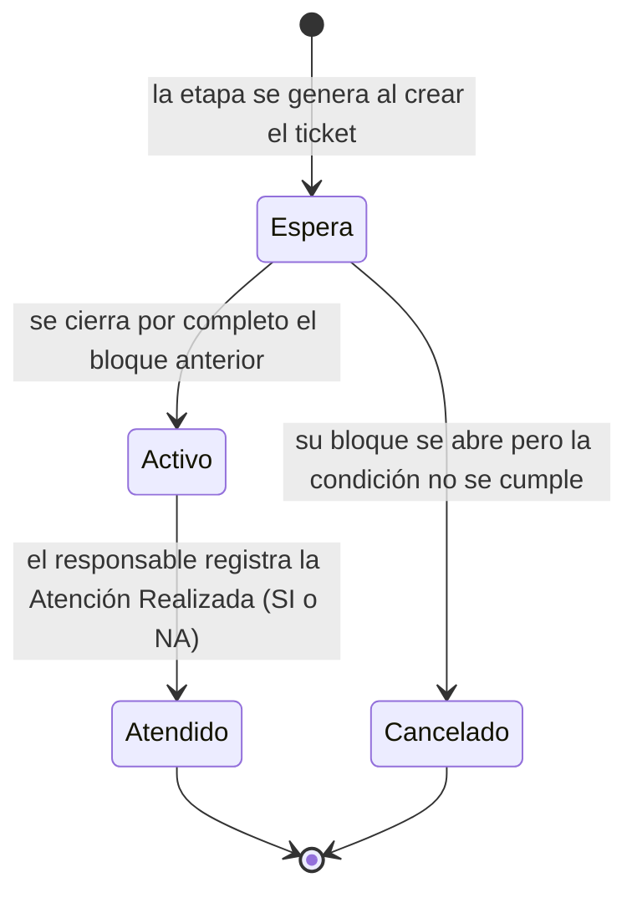
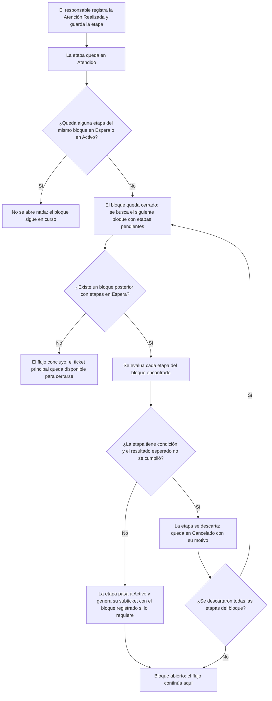
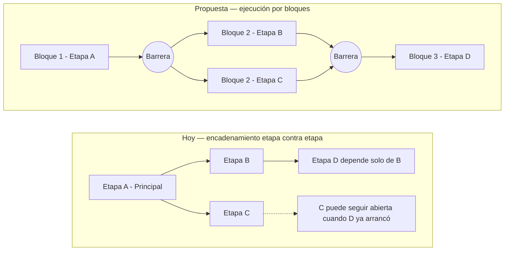
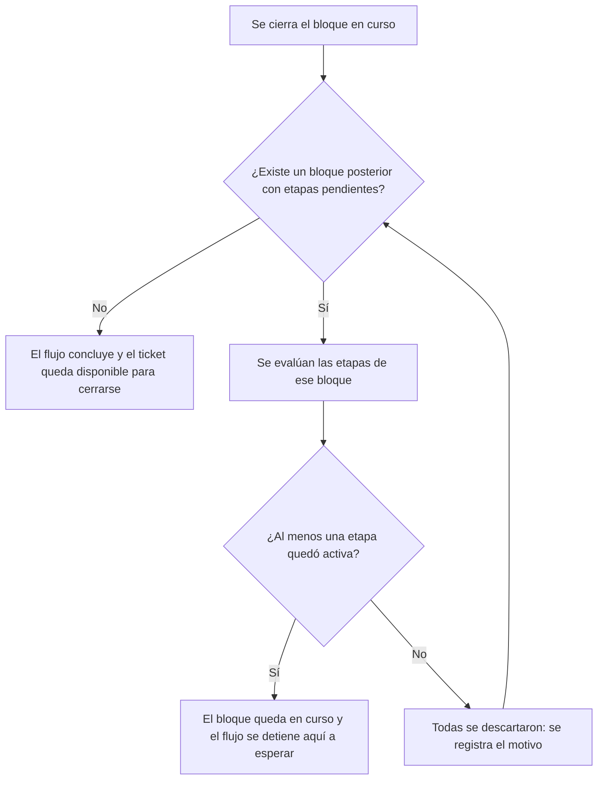

# Requerimientos Funcionales — Ejecución del Flujo de Trabajo de Tickets por Bloques

| Campo   | Valor                                                  |
|---------|--------------------------------------------------------|
| Versión | 1.1                                                    |
| Fecha   | 2026-08-21                                             |
| Estado  | Definición                                             |
| Módulo  | Innovación & Negocios — Cómputo / Tickets Escalonados  |
| Autor   | Análisis de Negocio                                    |

---

## 1. Propósito del documento

Cuando se asigna equipo de cómputo a un colaborador, el sistema no genera un solo ticket: genera un **flujo de trabajo escalonado**, es decir, una cadena de actividades que se van abriendo unas a otras conforme se atienden, y donde cada actividad que lo requiere produce su propio subticket dirigido al área responsable. Hoy ese encadenamiento funciona **etapa contra etapa**: cada actividad declara de cuál otra depende, y en cuanto esa única actividad se cierra, la siguiente arranca.

Ese comportamiento tiene un límite que el negocio ya está encontrando: **no existe forma de exigir que un grupo completo de actividades termine antes de que empiece el grupo siguiente**. Si tres actividades deben trabajarse en paralelo y la cuarta solo tiene sentido cuando las tres estén listas, hoy la cuarta se abre en cuanto termina aquella de la que se colgó, sin importar que las otras dos sigan pendientes. El resultado es trabajo que arranca sin sus insumos, retrabajo, y actividades que se dan por buenas sobre información incompleta.

Este documento describe los siete requerimientos funcionales necesarios para que el flujo de trabajo opere **por bloques**: tandas de actividades que se abren juntas y donde el siguiente bloque no arranca hasta que **todas** las actividades del bloque en curso hayan concluido.

- **RF-01 — Definición de bloques en la configuración del flujo de trabajo**, que incorpora el bloque como la unidad que agrupa las etapas y que gobierna el avance, en sustitución de la dependencia etapa contra etapa.
- **RF-02 — Integridad del armado del flujo por bloques**, que impide guardar configuraciones mal armadas que dejarían tickets detenidos en producción.
- **RF-03 — Registro y visualización del bloque en el ticket y en sus subtickets**, que lleva el bloque al ticket, lo deja registrado en cada subticket que se genera y hace visible en qué tanda va el trabajo y por qué una etapa todavía no está disponible.
- **RF-04 — Activación por barrera del siguiente bloque**, que es el corazón del cambio: el siguiente bloque se abre en una sola operación cuando, y solo cuando, el bloque en curso quedó completamente cerrado.
- **RF-05 — Continuidad del flujo ante bloques vacíos o descartados**, que garantiza que un bloque que no aplica al caso no detenga el ticket para siempre.
- **RF-06 — Condicionamiento de una etapa al resultado de una etapa previa**, que preserva —ahora de forma explícita— la capacidad actual de descartar actividades según cómo se haya resuelto una decisión anterior.
- **RF-07 — Migración de los flujos configurados y de los tickets en curso**, que convierte lo ya configurado al nuevo esquema y permite liberar el cambio sin detener el trabajo en proceso.

El objetivo es que cualquier persona del negocio entienda, sin consultar otro documento, qué es un bloque, cuándo se abre el siguiente, qué pasa cuando una tanda completa no aplica, cómo se configura todo esto y qué ocurre con los tickets que ya estaban abiertos el día de la liberación.

## 2. Alcance del documento

**Incluye:**
- La incorporación del **bloque** como atributo de cada etapa en la configuración del flujo de trabajo, y su uso como mecanismo que gobierna el avance del flujo.
- Las **validaciones de armado** que impiden guardar un flujo con bloques incompletos, mal numerados o con la etapa principal fuera de lugar.
- El traslado del bloque al ticket en el momento de generarlo, el **sello del bloque en cada subticket que se genera**, y la **presentación agrupada** del flujo de trabajo por bloque, con indicador del bloque en curso.
- La **regla de barrera**: apertura del siguiente bloque únicamente cuando todas las etapas del bloque en curso quedaron en un estatus terminal, y apertura simultánea de todas las etapas de ese siguiente bloque con sus respectivos subtickets.
- El **avance automático** sobre bloques que quedaron sin etapas aplicables al caso concreto o cuyas etapas se descartaron en su totalidad.
- El **condicionamiento explícito** de una etapa al resultado registrado en una etapa previa específica, en sustitución del parámetro de activación actual, que dependía del antecesor único.
- La **conversión de los flujos ya configurados** al esquema de bloques, con reporte de resultado para su validación, y el tratamiento de los **tickets abiertos** al momento de la liberación.
- El registro en **bitácora** de la apertura de cada bloque, de la activación de cada etapa y del descarte de cada etapa con su motivo.

**No incluye:**
- El contenido funcional de cada etapa —alta de correo electrónico, directorio activo, VPN, perfil de seguridad, configuración de red, check list—, que continúa operando exactamente como hoy.
- El mecanismo de creación del ticket principal a partir de la asignación de cómputo, la elección del flujo por subrama del activo y el descarte de etapas no solicitadas, que se conservan sin cambio.
- La resolución del responsable de cada etapa por unidad de negocio, que se mantiene con su comportamiento actual.
- El flujo escalonado de **baja de personal vía nómina**, que opera con un mecanismo distinto —genera todos sus subtickets de una sola vez, sin dependencias entre ellos— y que no se configura desde el catálogo de flujos de trabajo.
- El proceso de cierre del ticket principal y de los subtickets, que conserva sus reglas actuales; este documento únicamente cambia **cuándo** quedan disponibles para cerrarse.
- Nuevos estatus para las etapas ni para los tickets: el requerimiento reutiliza los estatus vigentes.
- La reingeniería de las pantallas de captura de cada tipo de etapa.

## 3. Actores y roles

| Actor / Rol | Descripción |
|-------------|-------------|
| Administrador del flujo de trabajo | Persona de Innovación & Negocios que da de alta y mantiene los flujos de trabajo y sus etapas: define los bloques, el orden, los responsables y las condiciones de cada actividad. |
| Responsable de etapa | Colaborador del departamento al que está dirigida una etapa del flujo; es quien captura la información de la actividad y registra la atención realizada. |
| Coordinador / Jefe de Cómputo | Da seguimiento al avance del flujo de un ticket, revisa los bloques pendientes y detecta desviaciones. |
| Colaborador solicitante | Persona a la que se le asigna el equipo de cómputo y cuyo expediente se completa a lo largo del flujo. No interviene en la ejecución. |
| Sistema (motor de flujo) | Mecanismo automático que evalúa el cierre de un bloque, abre el siguiente, genera los subtickets y descarta las etapas que no aplican. |
| Equipo de Desarrollo | Área responsable de implementar el cambio, ejecutar la conversión de los flujos existentes y operar el modo de compatibilidad. |

## 4. Glosario

| Término / Sigla | Definición |
|-----------------|------------|
| Flujo de trabajo | Plantilla configurable que describe todas las actividades que deben ejecutarse para atender una asignación de equipo de cómputo, quién las atiende y en qué momento se abren. Se configura una sola vez y se reutiliza en cada ticket. |
| Etapa del flujo | Cada una de las actividades que componen un flujo de trabajo (por ejemplo: alta de correo electrónico, alta en directorio activo, configuración de red, check list de entrega). Es la unidad que se atiende y que puede generar un subticket. |
| **Bloque** | Conjunto de etapas de un mismo flujo que se abren juntas y se trabajan en paralelo. Es la unidad que gobierna el avance: **hasta que todas las etapas de un bloque concluyen, no se abre el bloque siguiente**. Se identifica con un número entero consecutivo empezando en 1. |
| Barrera | Punto de sincronización al final de cada bloque. El flujo se detiene ahí hasta que la última etapa pendiente del bloque queda concluida, y solo entonces continúa. Es el concepto que da nombre a la regla de activación de RF-04. |
| Etapa en curso / bloque en curso | Etapa o bloque cuyas actividades están abiertas y disponibles para atenderse en este momento. Solo puede haber un bloque en curso a la vez. |
| Estatus de la etapa | Situación de una etapa dentro del ticket. **Espera**: todavía no le toca, no es editable ni generó subticket. **Activo**: está en curso y disponible para atenderse. **Atendido**: se registró su atención y concluyó. **Cancelado**: se descartó porque no aplica al caso. |
| Estatus terminal | Estatus del que una etapa ya no sale: **Atendido** o **Cancelado**. Una etapa en estatus terminal se considera concluida para efectos de cerrar el bloque. |
| Atención realizada | Resultado con el que el responsable cierra una etapa. Admite dos valores: **SI**, cuando la actividad se ejecutó, y **NA**, cuando la actividad no aplicaba al caso. Es el dato que dispara el avance del flujo y el que se evalúa en las etapas condicionadas. |
| Etapa mandatoria | Etapa que siempre forma parte del flujo de un ticket, sin importar qué cuentas o accesos se hayan solicitado. |
| Etapa condicional | Etapa que solo forma parte del flujo de un ticket cuando la cuenta o acceso al que está asociada fue efectivamente solicitado. Si no se solicitó, la etapa nunca se genera en ese ticket. |
| Etapa condicionante | Etapa previa cuyo resultado (SI o NA) determina si otra etapa se activa o se descarta. Concepto introducido en RF-06. |
| Descartar una etapa | Dejar una etapa en estatus Cancelado porque no aplica al caso, sin que nadie la atienda. Una etapa descartada cuenta como concluida y no impide cerrar el bloque ni el ticket. |
| Ticket principal | Ticket que se genera al asignar el equipo de cómputo y que contiene el flujo de trabajo completo. Es el que concentra todas las etapas. |
| Subticket | Ticket que el sistema genera automáticamente a partir de una etapa marcada para registrar ticket, dirigido al responsable de esa etapa. Depende del ticket principal y queda registrado con el bloque de la etapa que lo originó. |
| Grupo escalonado | Nombre con el que el negocio se refiere al bloque cuando se habla del dato que queda registrado en el ticket y en sus subtickets. Es el mismo concepto que **bloque**: la tanda de etapas a la que perteneció la actividad que originó el ticket. |
| Antecesor | Mecanismo actual de encadenamiento: referencia de una etapa a **una sola** etapa previa, cuya conclusión la activa. Es el mecanismo que este documento sustituye por el bloque. |
| Ticket escalonado | Forma de operar en la que un ticket principal va generando subtickets conforme avanza el flujo, en lugar de generarlos todos al inicio. |
| Modo de compatibilidad | Operación temporal en la que el sistema atiende con las reglas anteriores los tickets que se generaron antes de la liberación del esquema de bloques. |

## 5. Entidad a la que aplica

Este requerimiento aplica sobre dos entidades que hoy ya existen y que se relacionan como plantilla e instancia.

La primera es la **etapa del flujo de trabajo en su definición**, es decir, el renglón que el administrador captura al configurar un flujo. Sobre ella se agrega el bloque y se ajustan sus validaciones. No tiene ciclo de estatus relevante para este documento más allá de estar activa o cancelada dentro del catálogo.

La segunda, y la que concentra el cambio de comportamiento, es la **etapa del flujo de trabajo dentro de un ticket**: la copia que se genera en el momento de crear el ticket principal y que es la que realmente se atiende. Su **estatus inicial es Espera** —salvo la etapa del primer bloque, que se activa de inmediato— y sus **estatus terminales son Atendido**, cuando el responsable registró la atención realizada, **o Cancelado**, cuando el sistema la descartó por no aplicar al caso. El proceso descrito por este documento concluye cuando **ninguna etapa del ticket permanece en Espera ni en Activo**, momento en el que el ticket principal queda disponible para cerrarse.

Es importante entender que la etapa del ticket es una **copia congelada** de la configuración: se lleva el bloque, el orden, el responsable, la condición y el expediente del colaborador tal como estaban al momento del alta. Un cambio posterior en la plantilla no altera los tickets ya generados, lo cual es deliberado: cada ticket termina de ejecutarse con las reglas con las que nació.

A esa copia congelada se suma un tercer punto de registro: el **subticket**. Cada subticket que el flujo genera se registra con el número de bloque —el grupo escalonado— de la etapa que lo originó, de modo que el dato viaja de la plantilla a la etapa del ticket y de ahí al subticket, y queda disponible para consulta y filtrado sin necesidad de abrir el ticket principal.

### Visión general del flujo

El primer diagrama muestra el ciclo de vida de una etapa dentro del ticket. Nótese que **Cancelado no es un fracaso**: es la salida normal de una etapa que no aplicaba al caso, y cuenta igual que Atendido para dar por cerrado el bloque.

El segundo diagrama muestra la decisión que ejecuta el sistema cada vez que un responsable cierra una etapa. La pregunta central —y la que cambia respecto de hoy— es la primera: ya no se pregunta *"¿quién dependía de esta etapa?"*, se pregunta *"¿ya terminó todo el bloque?"*.

El tercer diagrama ilustra la diferencia de comportamiento con un ejemplo de cuatro actividades. Arriba, cómo avanza hoy; abajo, cómo avanzaría por bloques.

## 6. Índice de requerimientos

> **Navegación rápida:** cada identificador RF en la primera columna es un enlace que lleva directamente al detalle del requerimiento. Hacer clic para ir al RF.

| RF | Título | Sistema | Aplica a |
|----|--------|---------|----------|
| [RF-01](#rf-01) | Definición de bloques en la configuración del flujo de trabajo | Business Suite | Flujos de Trabajo / Configuración |
| [RF-02](#rf-02) | Integridad del armado del flujo por bloques | Business Suite | Flujos de Trabajo / Configuración |
| [RF-03](#rf-03) | Registro y visualización del bloque en el ticket y en sus subtickets | Business Suite | Tickets de Cómputo |
| [RF-04](#rf-04) | Activación por barrera del siguiente bloque | Business Suite | Tickets de Cómputo |
| [RF-05](#rf-05) | Continuidad del flujo ante bloques vacíos o descartados | Business Suite | Tickets de Cómputo |
| [RF-06](#rf-06) | Condicionamiento de una etapa al resultado de una etapa previa | Business Suite | Flujos de Trabajo / Tickets de Cómputo |
| [RF-07](#rf-07) | Migración de los flujos configurados y de los tickets en curso | Business Suite | Transversal / Liberación |

---
---

# RF-01 — Definición de Bloques en la Configuración del Flujo de Trabajo

| Campo        | Valor      |
|--------------|------------|
| Prioridad    | Must       |
| Estado       | Definición |
| Dependencias | Ninguna    |

## Objetivo

Permitir que el administrador agrupe las etapas de un flujo de trabajo en tandas numeradas, de manera que el flujo exprese la idea de negocio "estas actividades se trabajan juntas y hasta que todas terminen no empieza la siguiente tanda", sin tener que armar dependencias etapa por etapa.

## Descripción

El sistema deberá incorporar, en cada etapa del flujo de trabajo, un campo **Bloque** que indique a qué tanda pertenece esa actividad. El bloque es un número entero que empieza en 1 y avanza de uno en uno; todas las etapas que compartan el mismo número forman una tanda que se abre y se trabaja en paralelo.

El bloque **sustituye al antecesor como el mecanismo que gobierna el avance del flujo**. Hasta hoy, cada etapa declaraba de qué otra etapa dependía y arrancaba en cuanto esa dependencia se cerraba; a partir de este requerimiento, lo que determina cuándo arranca una etapa es únicamente el bloque al que pertenece. Esto simplifica la configuración —el administrador piensa en tandas, no en cadenas— y elimina de raíz la posibilidad de armar dependencias circulares o etapas que nunca se alcanzan.

El campo **Orden** conserva su lugar, pero cambia de significado: dentro de un bloque ya no expresa secuencia de ejecución, porque todas las etapas del bloque se abren al mismo tiempo. Sirve únicamente para **presentar las etapas en un orden legible** dentro de su bloque, tanto en la configuración como en el ticket.

El campo **Antecesor** deja de capturarse en flujos nuevos. Se conserva en los flujos existentes como dato histórico y como insumo de la conversión descrita en RF-07, pero no vuelve a intervenir en la decisión de activar una etapa.

### Información / atributos

| Campo | Obligatorio | Descripción |
|---|---|---|
| Bloque | Sí | Número entero mayor o igual a 1 que identifica la tanda a la que pertenece la etapa. Todas las etapas con el mismo número se abren juntas. El bloque 1 se reserva a la etapa principal. |
| Orden | Sí | Número entero que determina la posición en la que se presenta la etapa **dentro de su bloque**. No influye en el momento de activación. Debe ser único dentro del bloque, pero puede repetirse entre bloques distintos. |
| Principal | Sí | Marca la etapa con la que arranca el flujo. Solo puede haber una por flujo y debe estar en el bloque 1. |
| Mandatorio | Sí | Indica que la etapa siempre forma parte del flujo del ticket, sin importar qué cuentas o accesos se hayan solicitado. |
| Antecesor | No | Referencia histórica a la etapa de la que dependía en el esquema anterior. Solo lectura; no se captura en etapas nuevas y no interviene en la activación. |

### Operaciones

El administrador del flujo de trabajo deberá poder:
- Capturar el bloque al registrar una etapa nueva.
- Modificar el bloque de una etapa existente mientras el flujo lo permita.
- Consultar el flujo con sus etapas **agrupadas por bloque**, en orden ascendente de bloque y, dentro de cada uno, en el orden capturado.

---

## HU-1.1 — Agrupación de las etapas en bloques

Como administrador del flujo de trabajo, quiero agrupar las etapas de un flujo en bloques numerados, para que el equipo trabaje por tandas completas y ninguna actividad arranque antes de que estén listos los insumos que produce la tanda anterior.

### Reglas de negocio

**RN-1.1** Cada etapa del flujo deberá pertenecer a exactamente un bloque, identificado por un número entero mayor o igual a 1.

**RN-1.2** El bloque es un dato obligatorio; no podrá guardarse una etapa sin bloque asignado.

**RN-1.3** El bloque 1 se reserva a la etapa principal y contendrá únicamente esa etapa.

**RN-1.4** Dentro de un mismo bloque, el Orden determina únicamente la presentación de las etapas; no condiciona el momento en que se activan, porque todas las etapas del bloque se activan simultáneamente.

**RN-1.5** El Orden deberá ser único dentro de un mismo bloque. Dos etapas de bloques distintos podrán tener el mismo Orden sin que ello represente un conflicto.

**RN-1.6** El Antecesor deja de gobernar la activación de las etapas. Se conserva como dato de consulta en los flujos configurados antes del cambio y no se captura en etapas nuevas.

### Criterios de Aceptación

**CA-1.1.1 — Captura del bloque en una etapa nueva**
Dado que el administrador registra una etapa nueva en un flujo de trabajo
Cuando captura el bloque 2, un orden y los demás datos obligatorios de la etapa
Entonces el sistema guarda la etapa asociada al bloque 2 y la presenta agrupada junto con las demás etapas de ese bloque.

**CA-1.1.2 — El bloque es obligatorio**
Dado que el administrador registra una etapa nueva y deja el bloque vacío
Cuando intenta guardar la etapa
Entonces el sistema impide el guardado e informa que el bloque es un dato requerido.

**CA-1.1.3 — Orden duplicado dentro del mismo bloque**
Dado que en el bloque 2 ya existe una etapa con orden 1
Cuando el administrador intenta guardar otra etapa del bloque 2 también con orden 1
Entonces el sistema impide el guardado e informa que el orden ya está utilizado dentro de ese bloque.

**CA-1.1.4 — Orden repetido en bloques distintos**
Dado que en el bloque 2 existe una etapa con orden 1
Cuando el administrador guarda una etapa del bloque 3 con orden 1
Entonces el sistema acepta el guardado, porque la unicidad del orden aplica dentro de cada bloque y no en todo el flujo.

**CA-1.1.5 — El antecesor ya no se captura**
Dado que el administrador registra una etapa nueva en un flujo de trabajo
Cuando revisa los datos disponibles para captura
Entonces el sistema no le solicita ni le permite capturar un antecesor, y presenta el bloque como el único dato que determina cuándo se abrirá la etapa.

**CA-1.1.6 — Presentación agrupada de la configuración**
Dado que un flujo de trabajo tiene una etapa en el bloque 1, tres en el bloque 2 y dos en el bloque 3
Cuando el administrador consulta el flujo
Entonces el sistema presenta las seis etapas agrupadas por bloque, en orden ascendente de bloque y, dentro de cada bloque, en el orden capturado.

---

**Regla transversal:**
El bloque capturado en la configuración es el que se copia al ticket en el momento de generarlo (RF-03) y el que gobierna la apertura de las etapas durante la ejecución (RF-04). Un cambio de bloque en la configuración surte efecto únicamente en los tickets que se generen a partir de ese momento.

---
---

# RF-02 — Integridad del Armado del Flujo por Bloques

| Campo        | Valor      |
|--------------|------------|
| Prioridad    | Must       |
| Estado       | Definición |
| Dependencias | RF-01      |

## Objetivo

Impedir que se guarde un flujo de trabajo cuyo armado por bloques dejaría tickets detenidos sin salida, de modo que los errores de configuración se detecten al momento de capturarlos y no cuando un ticket ya está atorado en producción.

## Descripción

El sistema deberá **validar el armado completo del flujo cada vez que se guarde**, y no únicamente la etapa que se está capturando. Un flujo por bloques es correcto solo si se puede recorrer de principio a fin sin huecos: cualquier bloque faltante en la secuencia rompe la cadena y deja las etapas posteriores esperando un momento que nunca llegará.

Las validaciones son de dos naturalezas. Las **bloqueantes** impiden el guardado porque describen configuraciones que con certeza dejarían un ticket detenido. Las **advertencias** permiten guardar pero informan al administrador de un riesgo que puede ser deliberado: es el caso de un bloque compuesto en su totalidad por etapas condicionales, que en un ticket concreto podría quedar sin ninguna actividad. Ese escenario está previsto y resuelto en RF-05, por lo que no debe impedirse; pero el administrador debe saber que lo está configurando.

Se incluye también la validación de la **cancelación de etapas**. Cancelar una etapa dentro de la configuración no debe poder dejar un bloque intermedio sin ninguna etapa activa, porque el efecto es idéntico al de un hueco en la numeración.

### Validaciones

| Validación | Tipo | Comportamiento esperado |
|---|---|---|
| La numeración de bloques debe ser consecutiva desde 1, sin huecos | Bloqueante | Impide guardar e indica qué número de bloque falta. |
| Todo bloque declarado debe tener al menos una etapa activa | Bloqueante | Impide guardar e indica el bloque vacío. |
| La etapa principal debe existir, ser única y estar en el bloque 1 | Bloqueante | Impide guardar e indica la inconsistencia detectada. |
| El bloque 1 no puede contener etapas adicionales a la principal | Bloqueante | Impide guardar e indica qué etapas deben moverse. |
| Un bloque compuesto exclusivamente por etapas condicionales | Advertencia | Permite guardar e informa que ese bloque podría quedar sin actividades en algunos tickets. |
| Cancelar la única etapa activa de un bloque intermedio | Bloqueante | Impide la cancelación mientras existan bloques posteriores con etapas activas. |

---

## HU-2.1 — Validación del armado del flujo

Como administrador del flujo de trabajo, quiero que el sistema no me permita guardar un flujo con bloques mal armados, para no descubrir el error cuando un ticket ya quedó detenido y sin forma de cerrarse.

### Reglas de negocio

**RN-2.1** La numeración de los bloques de un flujo deberá ser consecutiva a partir de 1, sin huecos intermedios.

**RN-2.2** Todo bloque declarado en un flujo deberá tener al menos una etapa activa.

**RN-2.3** Todo flujo deberá tener una y solo una etapa principal, y esa etapa deberá pertenecer al bloque 1.

**RN-2.4** El bloque 1 no podrá contener etapas distintas a la principal.

**RN-2.5** Cuando un bloque se componga exclusivamente de etapas condicionales, el sistema deberá advertirlo al guardar, sin impedir la operación, porque ese bloque podría quedar sin actividades aplicables en un ticket concreto.

**RN-2.6** No podrá cancelarse la única etapa activa de un bloque cuando existan bloques posteriores con etapas activas, porque la cancelación dejaría un hueco en la numeración.

### Criterios de Aceptación

**CA-2.1.1 — Hueco en la numeración de bloques**
Dado que un flujo tiene etapas en los bloques 1, 2 y 4, y ninguna en el bloque 3
Cuando el administrador intenta guardar el flujo
Entonces el sistema impide el guardado e informa que el bloque 3 no tiene etapas y que la numeración debe ser consecutiva.

**CA-2.1.2 — El bloque 1 contiene etapas adicionales**
Dado que un flujo tiene la etapa principal y otra etapa más, ambas en el bloque 1
Cuando el administrador intenta guardar el flujo
Entonces el sistema impide el guardado e informa que el bloque 1 se reserva exclusivamente a la etapa principal.

**CA-2.1.3 — Etapa principal fuera del bloque 1**
Dado que el administrador marca como principal una etapa que está en el bloque 2
Cuando intenta guardar el flujo
Entonces el sistema impide el guardado e informa que la etapa principal debe pertenecer al bloque 1.

**CA-2.1.4 — Advertencia por bloque enteramente condicional**
Dado que el bloque 3 de un flujo se compone únicamente de etapas condicionales no mandatorias
Cuando el administrador guarda el flujo
Entonces el sistema guarda la configuración y le advierte que el bloque 3 podría quedar sin actividades en los tickets donde ninguna de esas cuentas se solicite.

**CA-2.1.5 — Cancelación que dejaría un bloque vacío**
Dado que el bloque 2 de un flujo tiene una sola etapa activa y existe un bloque 3 con etapas activas
Cuando el administrador intenta cancelar esa etapa del bloque 2
Entonces el sistema impide la cancelación e informa que el bloque quedaría sin actividades y rompería la secuencia.

---

**Regla transversal:**
Estas validaciones operan sobre la configuración y garantizan que el flujo sea recorrible en el papel. No sustituyen a RF-05, que resuelve las situaciones que solo aparecen en tiempo de ejecución, cuando el caso concreto de un ticket deja un bloque sin actividades aplicables.

---
---

# RF-03 — Registro y Visualización del Bloque en el Ticket y en sus Subtickets

| Campo        | Valor      |
|--------------|------------|
| Prioridad    | Must       |
| Estado       | Definición |
| Dependencias | RF-01      |

## Objetivo

Llevar el bloque configurado hasta el ticket y hacer visible, para quien trabaja el flujo, en qué tanda va el trabajo, cuáles actividades están disponibles ahora y cuáles todavía no, de modo que nadie tenga que preguntar por qué su etapa aparece bloqueada. Además, dejar registrado en cada subticket que se genera el bloque del que proviene, para que el dato viaje con el propio ticket y no solo con el flujo del ticket principal.

## Descripción

El sistema deberá **copiar el bloque de cada etapa al ticket** en el momento de generarlo, junto con los demás datos que hoy ya se copian: el orden, el responsable, el expediente del colaborador y la condición de activación. A partir de ese momento, el bloque registrado en el ticket es el que gobierna su ejecución, con independencia de que la configuración cambie después.

Esta congelación es deliberada y tiene una consecuencia que el negocio debe conocer: **si mañana se reorganizan los bloques de un flujo, los tickets que ya estaban abiertos terminan de ejecutarse con la organización que tenían al nacer**, y la nueva aplica solo a los tickets que se generen a partir de ese cambio. Es el mismo criterio con el que hoy opera el resto de la copia del flujo.

El bloque no se queda en el ticket principal: **cada subticket que el flujo genera se registra con el número de bloque de la etapa que lo originó**. El valor se toma en el momento en que el subticket se registra y se conserva sin cambio durante toda su vida, de manera que quien consulta un subticket suelto —o un listado de subtickets— puede saber de qué tanda del proceso proviene sin abrir el ticket principal ni reconstruir el flujo. El bloque queda además disponible como columna y como criterio de filtrado en los listados de tickets, que es lo que permite responder preguntas del tipo "¿qué trae pendiente el bloque 2 de todos los tickets abiertos?".

En la presentación, el flujo de trabajo del ticket deberá mostrarse **agrupado por bloque**, en orden ascendente, con una indicación clara de cuál es el bloque en curso y un **indicador de avance** del tipo "Bloque 2 de 4". El indicador se calcula sobre los bloques que efectivamente tienen etapas en ese ticket, no sobre los que existen en la plantilla, para que el número que ve el usuario corresponda con lo que realmente va a trabajar.

Las etapas de bloques posteriores permanecen visibles pero **no editables**: el responsable puede ver que su actividad viene más adelante y qué falta para que se abra, pero no puede adelantarse a capturarla. Esta restricción se suma —no sustituye— a la restricción vigente de que una etapa solo la edita el departamento responsable de esa etapa.

### Información / atributos

| Campo | Obligatorio | Descripción |
|---|---|---|
| Bloque de la etapa en el ticket | Sí | Copia del bloque configurado en la plantilla al momento de generar el ticket. No cambia durante la vida del ticket. |
| Bloque en curso | Sí | Número del bloque cuyas etapas están actualmente activas. Es único: solo puede haber un bloque en curso a la vez. |
| Indicador de avance | Sí | Texto que expresa el bloque en curso respecto del total de bloques con etapas en ese ticket (por ejemplo, "Bloque 2 de 4"). |
| Bloque del subticket (grupo escalonado) | Sí, cuando el subticket lo genera el flujo | Número de bloque de la etapa que originó el subticket, tomado al momento de registrarlo. No cambia durante la vida del subticket. Los subtickets que no provienen del flujo escalonado no lo llevan. |
| Bloque en los listados de tickets | Sí | El bloque del subticket se presenta como columna consultable y como criterio de filtrado en los listados de tickets. |

### Diseño UX/UI

Dentro de la pestaña de flujo de trabajo del ticket, las etapas se presentan agrupadas bajo un encabezado por bloque. El bloque en curso se distingue visualmente de los ya concluidos y de los pendientes, y el indicador de avance se muestra en la parte superior de la pestaña. En los subtickets, donde hoy ya se muestra el flujo completo del ticket principal como contexto, se aplica la misma agrupación y el mismo indicador.

---

## HU-3.1 — Visibilidad del avance por bloques

Como responsable de una etapa del flujo de trabajo, quiero ver el flujo agrupado por bloques y saber cuál está en curso, para entender por qué mi actividad todavía no está disponible y qué falta para que se abra.

### Reglas de negocio

**RN-3.1** Cada etapa del ticket conservará el número de bloque con el que se configuró al momento del alta; los cambios posteriores en la plantilla no afectarán a los tickets ya generados.

**RN-3.2** Únicamente las etapas del bloque en curso podrán editarse. Las etapas de bloques posteriores permanecerán visibles y no editables, además de la restricción vigente por departamento responsable.

**RN-3.3** El indicador de avance se calculará sobre los bloques que tengan al menos una etapa en ese ticket, excluyendo los bloques de la plantilla que no generaron ninguna etapa en el caso concreto.

**RN-3.4** Solo podrá existir un bloque en curso a la vez dentro de un mismo ticket.

### Criterios de Aceptación

**CA-3.1.1 — Presentación agrupada del flujo en el ticket**
Dado un ticket cuyo flujo tiene una etapa en el bloque 1, tres en el bloque 2 y dos en el bloque 3
Cuando el coordinador de Cómputo consulta la pestaña de flujo de trabajo
Entonces el sistema presenta las etapas agrupadas bajo el encabezado de su bloque, en orden ascendente de bloque.

**CA-3.1.2 — Indicador del bloque en curso**
Dado un ticket cuyo bloque 1 ya está concluido y cuyas etapas del bloque 2 están activas
Cuando el responsable consulta la pestaña de flujo de trabajo
Entonces el sistema muestra el indicador "Bloque 2 de 4" y distingue visualmente el bloque 2 como el bloque en curso.

**CA-3.1.3 — Indicador que excluye bloques sin etapas**
Dado un flujo configurado con cinco bloques, en el que un ticket concreto no generó ninguna etapa del bloque 4 porque esas cuentas no fueron solicitadas
Cuando el responsable consulta el indicador de avance
Entonces el sistema muestra un total de cuatro bloques, no de cinco, porque el bloque sin etapas no forma parte del trabajo de ese ticket.

**CA-3.1.4 — Etapa de bloque posterior no editable**
Dado que el bloque 2 está en curso y el responsable del departamento de una etapa del bloque 3 abre el ticket
Cuando intenta capturar la información de su etapa del bloque 3
Entonces el sistema le muestra la etapa en solo lectura, indica que pertenece a un bloque posterior y no le permite capturar ni registrar la atención realizada.

**CA-3.1.5 — Un cambio en la plantilla no altera un ticket en curso**
Dado un ticket generado cuando la etapa de alta de VPN estaba configurada en el bloque 2
Cuando el administrador mueve esa etapa al bloque 3 en la configuración del flujo
Entonces el ticket ya generado conserva la etapa en el bloque 2 y continúa ejecutándose con esa organización, y el cambio aplica únicamente a los tickets generados a partir de ese momento.

---

## HU-3.2 — Registro del bloque en el subticket generado

Como coordinador de Cómputo, quiero que cada subticket que genera el flujo traiga registrado el bloque —el grupo escalonado— al que perteneció la etapa que lo originó, para saber de qué tanda del proceso proviene cada atención sin tener que abrir el ticket principal y para poder agrupar y filtrar el trabajo por bloque.

### Reglas de negocio

**RN-3.5** Todo subticket que el sistema genere a partir de una etapa del flujo se registrará con el número de bloque al que pertenecía esa etapa dentro del ticket, tomado en el momento en que el subticket se registra.

**RN-3.6** El bloque será un dato obligatorio de los subtickets generados por el flujo: ninguno podrá quedar registrado sin bloque. Si el bloque no puede determinarse, el subticket no se registra y la apertura del bloque se revierte conforme a la regla transversal de RF-04.

**RN-3.7** El bloque registrado en el subticket no cambiará durante su vida: no lo altera una reorganización posterior de la plantilla ni el avance del ticket principal a bloques posteriores. Es el bloque con el que nació.

**RN-3.8** El bloque del subticket se mostrará en la consulta del propio subticket y estará disponible como columna y como criterio de filtrado en los listados de tickets.

**RN-3.9** Los subtickets que no provienen del flujo escalonado no llevarán bloque, y su ausencia no se tratará como error ni como dato incompleto.

### Criterios de Aceptación

**CA-3.2.1 — El subticket nace con el bloque de su etapa**
Dado un flujo cuyo bloque 2 contiene la etapa de alta de correo electrónico marcada para registrar ticket
Cuando el bloque 2 se abre y el sistema genera el subticket de esa etapa
Entonces el subticket queda registrado con el bloque 2 como grupo escalonado al que perteneció la etapa que lo originó, y ese valor es consultable desde el propio subticket.

**CA-3.2.2 — Todos los subtickets de una misma apertura traen su bloque**
Dado un bloque 3 con tres etapas marcadas para registrar ticket
Cuando el bloque 2 queda cerrado y el sistema abre el bloque 3 generando los tres subtickets en una sola operación
Entonces los tres subtickets quedan registrados con el bloque 3, cada uno dirigido al responsable configurado de su etapa.

**CA-3.2.3 — El bloque del subticket no cambia al avanzar el flujo**
Dado un subticket generado desde una etapa del bloque 2 y ya atendido
Cuando el ticket principal cierra el bloque 2 y abre el bloque 3
Entonces el subticket conserva el bloque 2 con el que se registró y no adopta el bloque en curso del ticket principal.

**CA-3.2.4 — Consulta y filtrado de los subtickets por bloque**
Dado un conjunto de tickets abiertos con subtickets generados en distintos bloques
Cuando el coordinador de Cómputo consulta el listado de tickets y filtra por el bloque 2
Entonces el sistema muestra únicamente los subtickets registrados con el bloque 2 y presenta el bloque como columna del listado.

**CA-3.2.5 — Un subticket ajeno al flujo escalonado no requiere bloque**
Dado un subticket registrado por una vía distinta al flujo escalonado de asignación de cómputo
Cuando el usuario lo consulta
Entonces el sistema lo presenta sin bloque, no lo señala como incompleto y no impide su atención ni su cierre.

---

**Regla transversal:**
La restricción de edición por bloque se suma a la restricción vigente por departamento responsable. Una etapa es editable únicamente cuando pertenece al bloque en curso, está activa y el usuario pertenece al departamento responsable de esa etapa; si cualquiera de las tres condiciones falla, la etapa se presenta en solo lectura.

---
---

# RF-04 — Activación por Barrera del Siguiente Bloque

| Campo        | Valor              |
|--------------|--------------------|
| Prioridad    | Must               |
| Estado       | Definición         |
| Dependencias | RF-01, RF-03       |

## Objetivo

Garantizar que el siguiente bloque de actividades se abra únicamente cuando todas las actividades del bloque en curso hayan concluido, de modo que ninguna actividad comience antes de que estén listos los insumos que produce la tanda anterior.

## Descripción

El sistema deberá evaluar, **cada vez que una etapa concluye**, si el bloque al que pertenece quedó completamente cerrado. Un bloque se considera cerrado cuando ninguna de sus etapas permanece en Espera ni en Activo, es decir, cuando todas quedaron en un estatus terminal: Atendido, porque el responsable registró la atención realizada, o Cancelado, porque el sistema las descartó por no aplicar al caso.

Mientras el bloque en curso no esté cerrado, **el sistema no modifica ninguna etapa de bloques posteriores**: no las activa, no las cancela y no genera sus subtickets. Esta es la diferencia esencial con el comportamiento actual, donde el cierre de una sola actividad bastaba para abrir a las que dependían de ella.

Cuando el bloque queda cerrado, el sistema abre el siguiente bloque que tenga etapas pendientes **en una sola operación**: todas sus etapas pasan a estar disponibles al mismo tiempo y cada una que esté marcada para registrar ticket genera su subticket dirigido al responsable configurado, registrado con el número de bloque del que proviene. Si una etapa del bloque tiene una condición que no se cumple, se descarta en ese mismo momento (RF-06) y no llega a abrirse.

El sistema deberá evitar la generación de subtickets duplicados: si por cualquier razón ya existe un subticket no cancelado asociado a una etapa, no se genera un segundo.

Cuando no exista ningún bloque posterior con etapas pendientes, el flujo concluye. En ese momento ninguna etapa del ticket permanece en Espera ni en Activo, y el ticket principal queda disponible para cerrarse conforme a sus reglas vigentes.

### Momento en que ocurre la evaluación

La evaluación se dispara al **registrar la atención realizada de una etapa y guardarla**. No existe una acción independiente de "finalizar bloque": el bloque se cierra solo, cuando su última etapa pendiente concluye. Esto conserva la forma de trabajar actual del responsable, que no necesita aprender un paso nuevo.

---

## HU-4.1 — Cierre completo del bloque antes de abrir el siguiente

Como coordinador de Cómputo, quiero que el siguiente bloque de actividades se abra solo cuando todas las actividades del bloque en curso hayan terminado, para que ninguna actividad se ejecute sobre información incompleta y se evite el retrabajo.

### Reglas de negocio

**RN-4.1** Una etapa se considerará concluida cuando quede en estatus Atendido o en estatus Cancelado. Ambos cuentan por igual para efectos de cerrar el bloque.

**RN-4.2** Un bloque se considerará cerrado cuando ninguna de sus etapas permanezca en estatus Espera ni en estatus Activo.

**RN-4.3** Mientras el bloque en curso no esté cerrado, ninguna etapa de un bloque posterior cambiará de estatus ni generará subticket.

**RN-4.4** Al cerrarse el bloque en curso, todas las etapas del siguiente bloque con etapas pendientes se abrirán en una sola operación.

**RN-4.5** Cada etapa que se abra y esté marcada para registrar ticket generará un subticket dirigido al responsable configurado para esa etapa. Cada subticket que se genere quedará registrado con el número de bloque de la etapa que lo originó (RN-3.5). No se generará un segundo subticket si ya existe uno no cancelado asociado a esa misma etapa.

**RN-4.6** En ningún momento podrán coexistir etapas activas de más de un bloque dentro de un mismo ticket.

**RN-4.7** Cuando no exista ningún bloque posterior con etapas pendientes, el flujo del ticket se dará por concluido.

**RN-4.8** La apertura de cada bloque y la activación de cada etapa quedarán registradas en la bitácora del ticket, con fecha, hora y el evento que las originó.

### Criterios de Aceptación

**CA-4.1.1 — El bloque no cierra mientras haya actividades pendientes**
Dado un bloque 2 con tres etapas activas, de las cuales una se atiende y dos siguen abiertas
Cuando el responsable registra la atención realizada de esa primera etapa y la guarda
Entonces el sistema deja la etapa en Atendido, mantiene el bloque 2 como bloque en curso y no activa ninguna etapa del bloque 3 ni genera subtickets.

**CA-4.1.2 — Apertura del siguiente bloque al concluir la última etapa**
Dado un bloque 2 con tres etapas, de las cuales dos ya están en Atendido y una sigue activa
Cuando el responsable registra la atención realizada de la última etapa pendiente y la guarda
Entonces el sistema da por cerrado el bloque 2, activa todas las etapas del bloque 3 en una sola operación y lo señala como el nuevo bloque en curso.

**CA-4.1.3 — Generación simultánea de los subtickets del bloque**
Dado un bloque 3 con cuatro etapas, de las cuales tres están marcadas para registrar ticket
Cuando el bloque 2 queda cerrado y el bloque 3 se abre
Entonces el sistema genera los tres subtickets correspondientes, cada uno dirigido al responsable configurado de su etapa, y deja la cuarta etapa activa sin subticket.

**CA-4.1.4 — No se duplican los subtickets**
Dado que una etapa del bloque 3 ya tiene un subticket no cancelado asociado
Cuando el sistema vuelve a evaluar la apertura de ese bloque
Entonces el sistema no genera un segundo subticket para esa etapa y conserva el existente.

**CA-4.1.5 — Una etapa descartada también cierra el bloque**
Dado un bloque 2 con dos etapas, de las cuales una quedó en Atendido y la otra fue descartada por el sistema
Cuando se evalúa el estado del bloque
Entonces el sistema considera el bloque 2 como cerrado y abre el bloque 3, porque una etapa descartada cuenta como concluida.

**CA-4.1.6 — Fin del flujo al cerrar el último bloque**
Dado un ticket cuyo último bloque tiene una sola etapa activa
Cuando el responsable registra la atención realizada de esa etapa y la guarda
Entonces el sistema no abre ningún bloque adicional, da por concluido el flujo y deja el ticket principal disponible para cerrarse.

**CA-4.1.7 — No coexisten dos bloques abiertos**
Dado un ticket cuyo bloque 3 acaba de abrirse
Cuando el coordinador consulta el flujo de trabajo
Entonces el sistema muestra etapas activas únicamente del bloque 3, con las del bloque 2 concluidas y las del bloque 4 en espera.

---

**Regla transversal:**
La apertura de un bloque es una operación indivisible: o se abren todas sus etapas aplicables con sus subtickets, o no se abre ninguna. Si la generación de un subticket falla, la apertura completa del bloque debe revertirse y notificarse, para no dejar el flujo en un estado intermedio en el que unas etapas quedaron activas y otras no.

---
---

# RF-05 — Continuidad del Flujo ante Bloques Vacíos o Descartados

| Campo        | Valor              |
|--------------|--------------------|
| Prioridad    | Must               |
| Estado       | Definición         |
| Dependencias | RF-04, RF-06       |

## Objetivo

Evitar que un bloque que no aplica al caso concreto detenga el ticket de manera permanente, garantizando que el flujo siempre encuentre su siguiente actividad o concluya de forma limpia.

## Descripción

Existen dos situaciones en las que un bloque completo puede quedarse sin actividades que ejecutar, y ambas deben resolverse sin intervención humana porque, de no hacerlo, el ticket quedaría detenido para siempre.

La primera es el **bloque sin etapas generadas**. Al crear el ticket, las etapas condicionales cuya cuenta o acceso no fue solicitado nunca llegan a generarse. Si todas las etapas de un bloque eran condicionales y ninguna fue solicitada, ese bloque simplemente no existe en ese ticket. El sistema deberá omitirlo y buscar el siguiente bloque que sí tenga etapas pendientes, en lugar de esperar el cierre de un bloque que no tiene nada que cerrar.

La segunda es el **bloque descartado en su totalidad**. Un bloque puede sí tener etapas, pero que todas ellas resulten descartadas al abrirse porque su condición no se cumplió (RF-06). En ese caso el bloque nace y muere en la misma operación, sin que ningún responsable intervenga. El sistema deberá continuar en ese mismo momento con el bloque siguiente, y repetir la evaluación tantas veces como haga falta, hasta abrir un bloque con al menos una etapa activa o hasta agotar los bloques del ticket.

Este comportamiento en cadena es indispensable: como el descarte de una etapa no lo ejecuta ninguna persona, nadie volvería a disparar la evaluación del flujo, y el ticket quedaría con etapas en espera de un momento que ya pasó.

Para hacer verificable que esto se cumple, el requerimiento establece un **invariante de no bloqueo**: mientras un ticket tenga etapas en Espera, deberá existir al menos una etapa en Activo. Si un ticket incumple esa condición, está detenido y requiere atención. El sistema deberá poder listar los tickets que la incumplan.

### Diagrama del avance en cadena

---

## HU-5.1 — Avance automático sobre bloques que no aplican

Como coordinador de Cómputo, quiero que el flujo continúe por sí solo cuando un bloque completo no aplica al caso, para que el ticket no quede detenido esperando actividades que nunca se van a ejecutar.

### Reglas de negocio

**RN-5.1** Los bloques que no tengan ninguna etapa generada en el ticket se omitirán; el sistema abrirá el siguiente bloque que sí tenga etapas pendientes.

**RN-5.2** Si al abrir un bloque todas sus etapas resultan descartadas, el sistema continuará en la misma operación con el bloque siguiente, y repetirá la evaluación hasta abrir un bloque con al menos una etapa activa o hasta agotar los bloques del ticket.

**RN-5.3** Mientras un ticket tenga etapas en estatus Espera, deberá existir al menos una etapa en estatus Activo. El incumplimiento de esta condición identifica un ticket detenido.

**RN-5.4** Todo descarte de una etapa deberá registrar en la bitácora del ticket el motivo por el que se descartó y la etapa cuyo resultado lo originó, cuando aplique.

**RN-5.5** Cuando el avance en cadena agote todos los bloques sin dejar ninguna etapa activa, el flujo se dará por concluido y el ticket principal quedará disponible para cerrarse.

### Criterios de Aceptación

**CA-5.1.1 — Bloque sin etapas generadas en el ticket**
Dado un ticket en el que el bloque 3 no generó ninguna etapa porque ninguna de sus cuentas fue solicitada
Cuando se cierra el bloque 2
Entonces el sistema omite el bloque 3 y abre directamente el bloque 4, dejándolo como bloque en curso.

**CA-5.1.2 — Bloque descartado en su totalidad**
Dado un ticket cuyo bloque 3 tiene dos etapas, ambas condicionadas a que la etapa de diagnóstico se resolviera con SI, y esa etapa se resolvió con NA
Cuando se cierra el bloque 2
Entonces el sistema descarta las dos etapas del bloque 3, registra el motivo en la bitácora y continúa abriendo el bloque 4 en la misma operación.

**CA-5.1.3 — Varios bloques consecutivos descartados**
Dado un ticket cuyos bloques 3 y 4 quedan descartados en su totalidad por no cumplirse sus condiciones
Cuando se cierra el bloque 2
Entonces el sistema descarta ambos bloques en la misma operación y abre el bloque 5, sin dejar etapas en espera de un bloque que ya no se abrirá.

**CA-5.1.4 — Todos los bloques restantes quedan descartados**
Dado un ticket cuyos bloques 3 y 4 son los últimos y ambos quedan descartados en su totalidad
Cuando se cierra el bloque 2
Entonces el sistema descarta todas las etapas restantes, da por concluido el flujo y deja el ticket principal disponible para cerrarse.

**CA-5.1.5 — Registro del motivo del descarte**
Dado que el sistema descarta una etapa porque la etapa de la que dependía se resolvió con un resultado distinto al esperado
Cuando el coordinador consulta la bitácora del ticket
Entonces encuentra el registro del descarte con la fecha, la etapa descartada, la etapa que originó el descarte y el motivo.

**CA-5.1.6 — Detección de tickets detenidos**
Dado un ticket con etapas en estatus Espera y ninguna etapa en estatus Activo
Cuando se ejecuta la verificación del invariante de no bloqueo
Entonces el sistema incluye ese ticket en el listado de tickets detenidos para su atención.

---

**Regla transversal:**
El avance en cadena descrito en este requerimiento y la barrera descrita en RF-04 son la misma operación vista desde dos ángulos: la barrera decide *cuándo* continuar, y este requerimiento decide *hasta dónde* continuar dentro de esa misma decisión. Ninguno de los dos puede implementarse sin el otro sin dejar tickets detenidos.

---
---

# RF-06 — Condicionamiento de una Etapa al Resultado de una Etapa Previa

| Campo        | Valor              |
|--------------|--------------------|
| Prioridad    | Must               |
| Estado       | Definición         |
| Dependencias | RF-01, RF-04       |

## Objetivo

Conservar, dentro del esquema de bloques, la capacidad de descartar una actividad cuando la decisión de la que depende se resolvió en sentido contrario, expresando de forma explícita **de cuál** etapa depende y **qué resultado** espera.

## Descripción

Hoy una etapa puede condicionarse al resultado de su antecesor: si el antecesor cerró con un resultado distinto al esperado, la etapa se descarta. Esa capacidad es necesaria y debe conservarse, pero al desaparecer el antecesor como mecanismo de encadenamiento (RF-01) la condición se queda sin referencia: en un bloque con varias etapas previas ya no existe "el antecesor" del que hablar.

El sistema deberá, por tanto, permitir que una etapa declare de forma explícita **la etapa condicionante** —cualquier etapa de un bloque anterior— y el **resultado esperado** de esa etapa: SI o NA. Al abrirse el bloque de la etapa condicionada, el sistema compara el resultado registrado en la etapa condicionante contra el esperado: si coinciden, la etapa se activa con normalidad; si no coinciden, la etapa se descarta y no llega a abrirse.

Cuando la etapa condicionante fue a su vez descartada, no existe un resultado que comparar. En ese caso la etapa condicionada **también se descarta**, porque la decisión de la que dependía nunca llegó a tomarse. Este arrastre es el que permite que ramas completas del flujo se poden de forma coherente.

Una etapa sin condición declarada se activa siempre que su bloque se abra. Una etapa mandatoria no puede declararse condicionada, porque las dos definiciones se contradicen: lo mandatorio siempre aplica.

### Información / atributos

| Campo | Obligatorio | Descripción |
|---|---|---|
| Etapa condicionante | No | Etapa de un bloque anterior cuyo resultado determina si esta etapa se activa. Si se deja vacía, la etapa se activa siempre que su bloque se abra. |
| Resultado esperado | Sí, cuando hay etapa condicionante | Resultado que debe haberse registrado en la etapa condicionante para que esta etapa se active. Admite SI o NA. |

### Operaciones

El administrador del flujo de trabajo deberá poder:
- Seleccionar la etapa condicionante de entre las etapas de bloques anteriores del mismo flujo, y solo de entre ellas.
- Capturar el resultado esperado cuando haya declarado una etapa condicionante.
- Retirar la condición, dejando la etapa como incondicional.

---

## HU-6.1 — Actividades que solo aplican según el resultado de otra

Como administrador del flujo de trabajo, quiero condicionar una etapa al resultado de una etapa previa específica, para que las actividades que dependen de una decisión no se abran ni generen subtickets cuando esa decisión se resolvió en sentido contrario.

### Reglas de negocio

**RN-6.1** Una etapa podrá declarar a lo sumo una etapa condicionante, con su respectivo resultado esperado.

**RN-6.2** La etapa condicionante deberá pertenecer a un bloque estrictamente anterior al de la etapa condicionada.

**RN-6.3** Cuando se declare una etapa condicionante, el resultado esperado será obligatorio y solo podrá tomar los valores SI o NA.

**RN-6.4** Al abrirse el bloque, si el resultado registrado en la etapa condicionante difiere del resultado esperado, la etapa condicionada se descartará y no se activará ni generará subticket.

**RN-6.5** Si la etapa condicionante fue descartada, la etapa condicionada también se descartará, porque la decisión de la que dependía nunca se tomó.

**RN-6.6** Una etapa sin condicionante declarado se activará siempre que su bloque se abra.

**RN-6.7** Una etapa marcada como mandatoria no podrá declararse condicionada.

### Criterios de Aceptación

**CA-6.1.1 — Condición cumplida: la etapa se activa**
Dado que la etapa de diagnóstico del bloque 2 se cerró con resultado SI y que la etapa de configuración del bloque 3 está condicionada a ese mismo resultado
Cuando se cierra el bloque 2 y se abre el bloque 3
Entonces el sistema activa la etapa de configuración y genera su subticket.

**CA-6.1.2 — Condición no cumplida: la etapa se descarta**
Dado que la etapa de diagnóstico del bloque 2 se cerró con resultado NA y que la etapa de configuración del bloque 3 está condicionada al resultado SI
Cuando se cierra el bloque 2 y se abre el bloque 3
Entonces el sistema descarta la etapa de configuración, no genera subticket y registra el motivo en la bitácora.

**CA-6.1.3 — Etapa sin condición**
Dado que una etapa del bloque 3 no tiene etapa condicionante declarada
Cuando se abre el bloque 3
Entonces el sistema activa la etapa sin evaluar ninguna condición.

**CA-6.1.4 — Arrastre del descarte**
Dado que la etapa del bloque 3 fue descartada y que una etapa del bloque 4 está condicionada al resultado de esa etapa descartada
Cuando se abre el bloque 4
Entonces el sistema descarta también la etapa del bloque 4 e indica en la bitácora que su etapa condicionante había sido descartada.

**CA-6.1.5 — La etapa condicionante debe ser de un bloque anterior**
Dado que el administrador captura una etapa del bloque 3
Cuando intenta seleccionar como condicionante otra etapa del bloque 3 o de un bloque posterior
Entonces el sistema no ofrece esas etapas en la selección y, de intentarse el guardado, lo impide indicando que la etapa condicionante debe pertenecer a un bloque anterior.

**CA-6.1.6 — Resultado esperado obligatorio**
Dado que el administrador selecciona una etapa condicionante y deja vacío el resultado esperado
Cuando intenta guardar la etapa
Entonces el sistema impide el guardado e informa que el resultado esperado es requerido cuando se declara una etapa condicionante.

**CA-6.1.7 — Etapa mandatoria no puede condicionarse**
Dado que el administrador marca una etapa como mandatoria
Cuando intenta declararle una etapa condicionante
Entonces el sistema impide el guardado e informa que una etapa mandatoria siempre aplica y por lo tanto no admite condición.

---

**Regla transversal:**
El descarte de etapas que se define en este requerimiento es la causa más frecuente de que un bloque completo quede sin actividades, situación que resuelve RF-05. Ambos requerimientos deben liberarse juntos: implementar el condicionamiento sin el avance en cadena dejaría tickets detenidos.

---
---

# RF-07 — Migración de los Flujos Configurados y de los Tickets en Curso

| Campo        | Valor              |
|--------------|--------------------|
| Prioridad    | Must               |
| Estado       | Definición         |
| Dependencias | RF-01, RF-04, RF-06 |

## Objetivo

Llevar los flujos ya configurados y los tickets abiertos al nuevo esquema sin detener la operación, y sin cambiar de manera involuntaria el comportamiento de procesos que hoy funcionan correctamente.

## Descripción

El cambio a bloques toca dos poblaciones de datos y cada una requiere un tratamiento distinto.

La primera son los **flujos ya configurados**. El sistema deberá convertirlos automáticamente asignando a cada etapa el bloque que le corresponde según su cadena de dependencias: la etapa principal queda en el bloque 1, y cada etapa queda en el bloque inmediato siguiente al de su antecesor. La conversión deberá producir un **reporte por flujo** con la asignación resultante, para que el administrador la revise y la valide antes de darla por buena.

Esa revisión no es un trámite. La conversión mecánica **cambia el comportamiento** cuando un flujo tiene ramas de distinta longitud: actividades que hoy corren desfasadas quedarían sincronizadas en una barrera, que es precisamente lo que se busca, pero el negocio debe confirmar que esa sincronización es la deseada en cada caso. Por eso el reporte debe señalar de manera explícita **qué etapas cambian su momento de arranque** respecto del comportamiento actual.

La conversión deberá trasladar también las condiciones vigentes: la condición que hoy se evalúa contra el antecesor se convierte en una condición referida explícitamente a esa misma etapa, conservando el resultado esperado. De este modo ningún flujo pierde su lógica de ramificación.

La segunda población son los **tickets abiertos** al momento de la liberación. Sus etapas se generaron sin bloque y no pueden reorganizarse sin alterar trabajo en proceso. El sistema deberá operar en **modo de compatibilidad** para ellos: las etapas que no tengan bloque asignado continúan avanzando con la regla anterior, etapa contra etapa, hasta que el ticket se cierre. El modo de compatibilidad se retira cuando ya no queden tickets abiertos sin bloque, y el sistema deberá permitir consultar cuántos quedan para saber cuándo es seguro retirarlo.

### Reglas de conversión

| Situación en el flujo actual | Asignación al convertir |
|---|---|
| Etapa marcada como principal | Bloque 1 |
| Etapa con antecesor | Bloque del antecesor más uno |
| Etapa con varias rutas hasta la principal | Bloque correspondiente a la ruta más larga, para no adelantarla |
| Etapa sin antecesor y no principal | Se marca como inconsistencia; requiere asignación manual antes de validar el flujo |
| Condición de activación contra el antecesor | Etapa condicionante igual al antecesor, con el mismo resultado esperado |

---

## HU-7.1 — Conversión de los flujos ya configurados

Como administrador del flujo de trabajo, quiero que los flujos existentes se conviertan automáticamente al esquema de bloques y poder revisar el resultado antes de darlo por bueno, para no cambiar sin darme cuenta el comportamiento de procesos que hoy operan correctamente.

### Reglas de negocio

**RN-7.1** El bloque de cada etapa se derivará de su cadena de dependencias: la etapa principal se asignará al bloque 1 y cada etapa al bloque inmediato siguiente al de su antecesor.

**RN-7.2** Cuando una etapa pueda alcanzarse por varias rutas de distinta longitud, se le asignará el bloque correspondiente a la ruta más larga, para no adelantar su arranque respecto de lo que el negocio espera.

**RN-7.3** Las etapas sin antecesor que no sean la principal se reportarán como inconsistencia y requerirán asignación manual de bloque antes de que el flujo pueda validarse.

**RN-7.4** Las condiciones de activación vigentes se convertirán en condición referida explícitamente al antecesor actual, conservando el resultado esperado.

**RN-7.5** La conversión producirá un reporte por flujo que señale la asignación resultante y, de forma explícita, las etapas cuyo momento de arranque cambia respecto del comportamiento actual.

**RN-7.6** Un flujo convertido no entrará en operación hasta que el administrador responsable valide su reporte de conversión.

### Criterios de Aceptación

**CA-7.1.1 — Conversión de una cadena simple**
Dado un flujo con una etapa principal, una etapa que depende de ella y una tercera que depende de la segunda
Cuando se ejecuta la conversión
Entonces el sistema asigna los bloques 1, 2 y 3 respectivamente y lo refleja en el reporte de conversión.

**CA-7.1.2 — Conversión de ramas de distinta longitud**
Dado un flujo en el que una etapa puede alcanzarse por una ruta de dos pasos y por otra de tres
Cuando se ejecuta la conversión
Entonces el sistema le asigna el bloque correspondiente a la ruta más larga y señala en el reporte que esa etapa cambia su momento de arranque.

**CA-7.1.3 — Etapa huérfana detectada**
Dado un flujo que contiene una etapa activa sin antecesor y que no está marcada como principal
Cuando se ejecuta la conversión
Entonces el sistema la reporta como inconsistencia, no le asigna bloque automáticamente y marca el flujo como pendiente de asignación manual.

**CA-7.1.4 — Conversión de las condiciones de activación**
Dado un flujo en el que una etapa se activa solo cuando su antecesor cierra con resultado SI
Cuando se ejecuta la conversión
Entonces el sistema declara a ese antecesor como etapa condicionante de la etapa convertida y conserva SI como resultado esperado.

**CA-7.1.5 — El flujo convertido requiere validación**
Dado un flujo cuya conversión se ejecutó y cuyo reporte no ha sido validado por el administrador
Cuando se genera un ticket que correspondería a ese flujo
Entonces el sistema no aplica la configuración convertida y advierte que el flujo está pendiente de validación.

---

## HU-7.2 — Continuidad de los tickets abiertos

Como responsable de Cómputo, quiero que los tickets que ya estaban abiertos al momento de la liberación sigan avanzando con normalidad, para no tener que cerrarlos a mano ni perder el trabajo en proceso.

### Reglas de negocio

**RN-7.7** Los tickets cuyas etapas se generaron sin bloque continuarán avanzando con la regla anterior de encadenamiento etapa contra etapa hasta su cierre.

**RN-7.8** Los tickets generados a partir de la liberación operarán exclusivamente con la regla de bloques.

**RN-7.9** El sistema deberá permitir consultar cuántos tickets abiertos permanecen operando en modo de compatibilidad.

**RN-7.10** El modo de compatibilidad se retirará únicamente cuando no queden tickets abiertos operando bajo él.

### Criterios de Aceptación

**CA-7.2.1 — Un ticket abierto antes de la liberación sigue avanzando**
Dado un ticket generado antes de la liberación, cuyas etapas no tienen bloque asignado
Cuando el responsable registra la atención realizada de una de sus etapas
Entonces el sistema activa las etapas que dependían de ella conforme a la regla anterior y el ticket continúa su curso sin intervención manual.

**CA-7.2.2 — Un ticket nuevo opera por bloques**
Dado un ticket generado después de la liberación a partir de un flujo convertido y validado
Cuando el responsable registra la atención realizada de una etapa
Entonces el sistema aplica la regla de barrera por bloques y no la regla anterior.

**CA-7.2.3 — Consulta de tickets en modo de compatibilidad**
Dado que existen tickets abiertos generados antes de la liberación
Cuando el equipo de desarrollo consulta el indicador de compatibilidad
Entonces el sistema informa cuántos tickets abiertos permanecen operando con la regla anterior.

---

**Regla transversal:**
Mientras existan tickets en modo de compatibilidad conviven dos reglas de avance en el sistema. Esa convivencia es temporal y debe tener fecha de revisión: el indicador de RN-7.9 es el insumo para decidir cuándo retirar la regla anterior.

---
---

# Requerimientos no funcionales (RNF)

### RNF-001 — Rendimiento: apertura de un bloque
- **Descripción:** La apertura de un bloque de hasta 20 etapas, con la generación de sus subtickets correspondientes, deberá completarse en menos de 5 segundos desde que el responsable guarda la última etapa del bloque anterior.
- **Métrica / criterio de verificación:** Medición del tiempo transcurrido entre el guardado y la disponibilidad de las etapas del nuevo bloque, en un ambiente de prueba con volumen equivalente al productivo, sobre 20 ejecuciones; el percentil 95 debe ubicarse por debajo de 5 segundos.
- **Prioridad:** Must

### RNF-002 — Integridad: operación indivisible de apertura
- **Descripción:** La apertura de un bloque deberá completarse en su totalidad o no aplicarse en absoluto. No podrá quedar un bloque parcialmente abierto, con unas etapas activas y otras en espera, ni etapas activas sin su subticket correspondiente.
- **Métrica / criterio de verificación:** Prueba de interrupción forzada durante la apertura de un bloque de cinco etapas; al reintentar, el estado del ticket debe ser el previo a la operación o el posterior completo, nunca intermedio. Cero estados intermedios en 10 ejecuciones.
- **Prioridad:** Must

### RNF-003 — Integridad: ausencia de tickets detenidos
- **Descripción:** Ningún ticket con etapas en estatus Espera podrá permanecer sin al menos una etapa en estatus Activo. El sistema deberá disponer de una verificación consultable de esta condición.
- **Métrica / criterio de verificación:** Ejecución diaria de la verificación del invariante sobre la totalidad de tickets abiertos; meta de cero tickets detenidos. Cualquier ocurrencia se atiende como incidente.
- **Prioridad:** Must

### RNF-004 — Compatibilidad: continuidad de la operación en curso
- **Descripción:** La liberación del esquema de bloques no deberá requerir la intervención manual de ningún ticket abierto ni el cierre anticipado de ninguno.
- **Métrica / criterio de verificación:** Conteo de tickets abiertos que requirieron intervención manual durante la semana posterior a la liberación; meta de cero.
- **Prioridad:** Must

### RNF-005 — Auditoría: trazabilidad del avance del flujo
- **Descripción:** Toda apertura de bloque, activación de etapa y descarte de etapa deberá registrarse en la bitácora del ticket con fecha, hora, usuario o proceso que la originó y, en el caso de los descartes, el motivo y la etapa condicionante involucrada.
- **Métrica / criterio de verificación:** Revisión de la bitácora de una muestra de 10 tickets con flujo completo; el 100% de las transiciones de estatus de sus etapas debe tener su registro correspondiente.
- **Prioridad:** Must

### RNF-006 — Seguridad: restricción de edición de etapas
- **Descripción:** Una etapa solo podrá editarse cuando pertenezca al bloque en curso, esté activa y el usuario pertenezca al departamento responsable de esa etapa. El incumplimiento de cualquiera de las tres condiciones deberá presentar la etapa en solo lectura.
- **Métrica / criterio de verificación:** Pruebas de acceso con tres perfiles distintos —responsable del bloque en curso, responsable de un bloque posterior y usuario de otro departamento— sobre el mismo ticket; solo el primero debe poder capturar.
- **Prioridad:** Must

### RNF-007 — Mantenibilidad: cobertura de pruebas del avance del flujo
- **Descripción:** La lógica que decide el cierre de un bloque, la apertura del siguiente, el descarte por condición y el avance en cadena deberá contar con pruebas automatizadas que cubran al menos el 80% de sus rutas de decisión.
- **Métrica / criterio de verificación:** Reporte de cobertura de pruebas automatizadas sobre los componentes de avance del flujo, ejecutado en la integración continua.
- **Prioridad:** Should

### RNF-008 — Usabilidad: comprensión del avance
- **Descripción:** Un responsable de etapa deberá identificar cuál es el bloque en curso y por qué su etapa no está disponible en un tiempo no mayor a 15 segundos desde que abre la pestaña de flujo de trabajo, sin ayuda externa.
- **Métrica / criterio de verificación:** Prueba de usabilidad con cinco responsables de distintos departamentos; al menos cuatro de cinco deben lograrlo dentro del tiempo indicado.
- **Prioridad:** Should

### RNF-009 — Trazabilidad: bloque registrado en todo subticket del flujo
- **Descripción:** La totalidad de los subtickets generados por el flujo escalonado deberá contar con el número de bloque de la etapa que los originó, disponible para consulta en el propio subticket y para filtrado en los listados de tickets.
- **Métrica / criterio de verificación:** Consulta de verificación sobre los subtickets generados a partir de la liberación, ejecutada de forma semanal; meta de cero subtickets del flujo escalonado sin bloque registrado.
- **Prioridad:** Must

---

# Matriz de trazabilidad

| Objetivo de negocio | RF | Historia | Criterio de aceptación | Prioridad | Estado |
|---------------------|-----|----------|------------------------|-----------|--------|
| OBJ-1 Evitar que una actividad arranque sin los insumos de su tanda | RF-01 | HU-1.1 | CA-1.1.1 Captura del bloque en una etapa nueva | Must | Propuesto |
| OBJ-1 | RF-01 | HU-1.1 | CA-1.1.4 Orden repetido en bloques distintos | Must | Propuesto |
| OBJ-1 | RF-04 | HU-4.1 | CA-4.1.1 El bloque no cierra mientras haya actividades pendientes | Must | Propuesto |
| OBJ-1 | RF-04 | HU-4.1 | CA-4.1.2 Apertura del siguiente bloque al concluir la última etapa | Must | Propuesto |
| OBJ-1 | RF-04 | HU-4.1 | CA-4.1.7 No coexisten dos bloques abiertos | Must | Propuesto |
| OBJ-1 | RF-06 | HU-6.1 | CA-6.1.1 Condición cumplida: la etapa se activa | Must | Propuesto |
| OBJ-2 Que ningún ticket quede detenido sin salida | RF-05 | HU-5.1 | CA-5.1.1 Bloque sin etapas generadas en el ticket | Must | Propuesto |
| OBJ-2 | RF-05 | HU-5.1 | CA-5.1.2 Bloque descartado en su totalidad | Must | Propuesto |
| OBJ-2 | RF-05 | HU-5.1 | CA-5.1.3 Varios bloques consecutivos descartados | Must | Propuesto |
| OBJ-2 | RF-05 | HU-5.1 | CA-5.1.6 Detección de tickets detenidos | Must | Propuesto |
| OBJ-2 | RF-06 | HU-6.1 | CA-6.1.4 Arrastre del descarte | Must | Propuesto |
| OBJ-2 | RF-02 | HU-2.1 | CA-2.1.1 Hueco en la numeración de bloques | Must | Propuesto |
| OBJ-3 Configuración del flujo entendible y a prueba de errores | RF-01 | HU-1.1 | CA-1.1.5 El antecesor ya no se captura | Must | Propuesto |
| OBJ-3 | RF-01 | HU-1.1 | CA-1.1.6 Presentación agrupada de la configuración | Must | Propuesto |
| OBJ-3 | RF-02 | HU-2.1 | CA-2.1.2 El bloque 1 contiene etapas adicionales | Must | Propuesto |
| OBJ-3 | RF-02 | HU-2.1 | CA-2.1.4 Advertencia por bloque enteramente condicional | Must | Propuesto |
| OBJ-3 | RF-03 | HU-3.1 | CA-3.1.2 Indicador del bloque en curso | Must | Propuesto |
| OBJ-3 | RF-03 | HU-3.2 | CA-3.2.1 El subticket nace con el bloque de su etapa | Must | Propuesto |
| OBJ-3 | RF-03 | HU-3.2 | CA-3.2.4 Consulta y filtrado de los subtickets por bloque | Should | Propuesto |
| OBJ-3 | RF-06 | HU-6.1 | CA-6.1.5 La etapa condicionante debe ser de un bloque anterior | Must | Propuesto |
| OBJ-4 Liberar el cambio sin afectar la operación en curso | RF-03 | HU-3.1 | CA-3.1.5 Un cambio en la plantilla no altera un ticket en curso | Must | Propuesto |
| OBJ-4 | RF-03 | HU-3.2 | CA-3.2.3 El bloque del subticket no cambia al avanzar el flujo | Must | Propuesto |
| OBJ-4 | RF-07 | HU-7.1 | CA-7.1.2 Conversión de ramas de distinta longitud | Must | Propuesto |
| OBJ-4 | RF-07 | HU-7.1 | CA-7.1.5 El flujo convertido requiere validación | Must | Propuesto |
| OBJ-4 | RF-07 | HU-7.2 | CA-7.2.1 Un ticket abierto antes de la liberación sigue avanzando | Must | Propuesto |
| OBJ-4 | RF-07 | HU-7.2 | CA-7.2.3 Consulta de tickets en modo de compatibilidad | Must | Propuesto |

Estados sugeridos: Propuesto → Aprobado → En desarrollo → Verificado.

---

# Reglas de negocio transversales

Reglas que se reutilizan en más de un requerimiento y que conviene tener a la vista de forma independiente:

| ID | Regla | Aplica a |
|----|-------|----------|
| RN-T.1 | Una etapa se considera concluida cuando queda en Atendido o en Cancelado; ambos estatus cuentan por igual para cerrar un bloque y para cerrar el ticket. | RF-04, RF-05, RF-06 |
| RN-T.2 | Solo puede existir un bloque en curso a la vez dentro de un mismo ticket. | RF-03, RF-04 |
| RN-T.3 | Las etapas del ticket son una copia congelada de la configuración vigente al momento del alta; los cambios posteriores en la plantilla no afectan tickets ya generados. | RF-03, RF-07 |
| RN-T.4 | Mientras un ticket tenga etapas en Espera, debe existir al menos una etapa en Activo. | RF-05 |
| RN-T.5 | Una etapa es editable únicamente cuando pertenece al bloque en curso, está activa y el usuario pertenece al departamento responsable. | RF-03, RNF-006 |
| RN-T.6 | Todo subticket generado por el flujo escalonado se registra con el bloque de la etapa que lo originó, y ese valor no cambia durante su vida. | RF-03, RF-04 |

---

# Supuestos (SUP)

| ID | Supuesto | Impacto si es falso |
|----|----------|---------------------|
| SUP-01 | Los flujos configurados hoy en producción son pocos y pueden revisarse uno a uno tras la conversión. | Si son muchos o muy ramificados, la validación de RF-07 se vuelve un proyecto en sí mismo y debe planearse por separado. |
| SUP-02 | El negocio acepta que dentro de un bloque no exista secuencia: todas sus etapas se abren al mismo tiempo. | Si se requiere secuencia interna, el modelo de bloques no basta y habría que reconsiderar el esquema de dependencias múltiples descartado en el análisis. |
| SUP-03 | La condición de activación vigente siempre se evalúa contra el antecesor directo de la etapa, sin excepciones en los flujos configurados. | Si existen configuraciones que dependen de otra etapa, la conversión de RF-07 perdería lógica de ramificación y requeriría revisión manual etapa por etapa. |
| SUP-04 | Los tickets abiertos al momento de la liberación se cierran en un plazo razonable, de modo que el modo de compatibilidad sea temporal. | Si algunos tickets permanecen abiertos indefinidamente, habría que migrarlos de forma asistida o convivir con dos reglas de avance por tiempo indefinido. |
| SUP-05 | Los responsables de etapa continúan cerrando sus actividades mediante el registro de la atención realizada, sin necesidad de una acción nueva. | Si el negocio pide una acción explícita de cierre de bloque, se agrega alcance de interfaz no contemplado en este documento. |

---

# Dependencias (DEP)

| ID | Dependencia | De quién / de qué |
|----|-------------|-------------------|
| DEP-01 | Inventario y revisión de los flujos de trabajo configurados en producción, para dimensionar la conversión. | Administrador del flujo de trabajo / Innovación & Negocios |
| DEP-02 | Definición del negocio sobre cómo debe convertirse cada flujo cuando la sincronización por barrera cambie el momento de arranque de una etapa. | Coordinación de Cómputo |
| DEP-03 | Ambiente de pruebas con volumen equivalente al productivo para verificar RNF-001 y RNF-002. | Equipo de Infraestructura |
| DEP-04 | Ventana de liberación acordada, dado que la conversión de flujos y la activación del modo de compatibilidad ocurren en el mismo despliegue. | Equipo de Desarrollo / Coordinación de Cómputo |

---

# Riesgos (RGO)

| ID | Riesgo | Prob. | Impacto | Mitigación |
|----|--------|-------|---------|------------|
| RGO-01 | Que el descarte de una etapa no propague el avance del flujo y deje tickets detenidos sin forma de cerrarse. Es el riesgo principal del cambio, porque el descarte no lo ejecuta ninguna persona y nadie volvería a disparar la evaluación. | Alta | Alto | Implementar RF-05 junto con RF-04 y RF-06, nunca por separado; verificar el invariante de RNF-003 de forma diaria desde el primer día. |
| RGO-02 | Que la conversión automática de los flujos existentes cambie el comportamiento de procesos que hoy operan correctamente, sin que nadie lo note. | Media | Alto | Reporte de conversión que señale explícitamente las etapas que cambian su momento de arranque, y validación obligatoria del administrador antes de poner el flujo en operación (RN-7.6). |
| RGO-03 | Que la apertura simultánea de un bloque numeroso genere muchos subtickets a la vez y sature al área responsable. | Media | Medio | Revisar el tamaño de los bloques al validar la conversión; considerar dividir en bloques más pequeños los que superen un umbral acordado con el negocio. |
| RGO-04 | Que una etapa quede sin responsable resoluble al abrirse un bloque y falle la apertura completa. | Media | Alto | Validar la existencia de responsable activo para todas las etapas del flujo al momento de validar la conversión; definir un responsable de respaldo por flujo. |
| RGO-05 | Que la convivencia temporal de dos reglas de avance genere confusión operativa o diagnósticos equivocados durante el periodo de compatibilidad. | Media | Medio | Identificar visiblemente en el ticket con qué regla opera; publicar el indicador de RN-7.9 y fijar fecha de revisión para retirar la regla anterior. |
| RGO-06 | Que el negocio descubra, ya en operación, que dentro de un bloque sí necesitaba secuencia entre algunas actividades. | Baja | Alto | Validar SUP-02 con la Coordinación de Cómputo antes de iniciar el desarrollo, sobre casos reales de los flujos vigentes. |

---

# Preguntas abiertas

1. **¿Qué tanto se usa hoy la condición de activación?** Antes de definir RF-06 es necesario revisar los flujos configurados en producción para saber cuántas etapas tienen condición y contra qué etapa se evalúan. Si prácticamente no se usa, RF-06 podría simplificarse o posponerse. *Responsable sugerido: Administrador del flujo de trabajo.*

2. **¿Se requiere secuencia dentro de un bloque?** El documento asume que no (SUP-02). Conviene confirmarlo contra los flujos reales antes de desarrollar, porque de requerirse cambiaría el modelo. *Responsable sugerido: Coordinación de Cómputo.*

3. **¿Debe notificarse al área responsable cuando su bloque completo se descarta?** Hoy el descarte es silencioso. Con bloques, un área podría no enterarse de que su tanda ya no aplica. *Responsable sugerido: Coordinación de Cómputo.*

4. **¿Debe existir una facultad excepcional para desbloquear un ticket detenido?** Actualmente las etapas no pueden cancelarse ni eliminarse desde la interfaz, por lo que un ticket detenido no tiene salida operativa. Con la verificación del invariante se detectarán, pero habría que decidir si un rol autorizado puede intervenirlos o si la corrección será siempre por parte del área de desarrollo. *Responsable sugerido: Coordinación de Cómputo / Equipo de Desarrollo.*

5. **¿Debe corregirse, dentro de este alcance, la asignación del responsable por unidad de negocio?** Durante el análisis del comportamiento actual se identificó que la selección del responsable de una etapa por unidad de negocio no está surtiendo efecto y que siempre se toma el primer responsable activo configurado. El comportamiento es previo a este requerimiento y no forma parte de su alcance, pero con bloques se abren más etapas a la vez y el efecto se vuelve más visible. *Responsable sugerido: Equipo de Desarrollo.*

6. **¿Cuál es el umbral aceptable de etapas por bloque?** Para mitigar RGO-03 conviene acordar un número máximo de subtickets simultáneos que el área puede absorber. *Responsable sugerido: Coordinación de Cómputo.*

7. **¿Qué se hace con los flujos cuya conversión detecte etapas huérfanas?** RN-7.3 los deja pendientes de asignación manual. Falta definir el plazo y quién ejecuta esa asignación. *Responsable sugerido: Administrador del flujo de trabajo.*

8. **¿Debe mostrarse el bloque en la notificación del subticket?** El bloque ya queda registrado en el subticket y disponible en los listados; falta decidir si además se incluye en el asunto o el cuerpo del correo con el que se avisa al responsable, para que ubique la tanda sin entrar al sistema. *Responsable sugerido: Coordinación de Cómputo.*

---

# Casos de prueba

**CP-001 — Registro de una etapa con bloque (camino feliz)**
Verifica: CA-1.1.1 · RN-1.1
Dado que el administrador registra una etapa nueva en un flujo de trabajo y captura el bloque 2, el orden 1 y los demás datos obligatorios
Cuando selecciona Guardar
Entonces el sistema guarda la etapa asociada al bloque 2 y la presenta agrupada con las demás etapas de ese bloque.

**CP-002 — Rechazo por bloque vacío (validación)**
Verifica: CA-1.1.2 · RN-1.2
Dado que el administrador registra una etapa nueva y deja el bloque sin capturar
Cuando intenta guardar la etapa
Entonces el sistema impide el guardado e informa que el bloque es un dato requerido.

**CP-003 — Rechazo por bloque cero o negativo (validación)**
Verifica: CA-1.1.2 · RN-1.1
Dado que el administrador captura el valor 0 en el bloque de una etapa
Cuando intenta guardar la etapa
Entonces el sistema impide el guardado e informa que el bloque debe ser un número entero mayor o igual a 1.

**CP-004 — Rechazo por orden duplicado dentro del mismo bloque (validación)**
Verifica: CA-1.1.3 · RN-1.5
Dado que en el bloque 2 ya existe la etapa "Alta de correo electrónico" con orden 1
Cuando el administrador intenta guardar la etapa "Alta en directorio activo" en el bloque 2 también con orden 1
Entonces el sistema impide el guardado e informa que el orden ya está utilizado dentro de ese bloque.

**CP-005 — Orden repetido entre bloques distintos (escenario alternativo)**
Verifica: CA-1.1.4 · RN-1.5
Dado que en el bloque 2 existe una etapa con orden 1
Cuando el administrador guarda una etapa del bloque 3 con orden 1
Entonces el sistema acepta el guardado sin señalar conflicto.

**CP-006 — El antecesor no está disponible para captura**
Verifica: CA-1.1.5 · RN-1.6
Dado que el administrador registra una etapa nueva en un flujo de trabajo
Cuando revisa los datos disponibles para captura
Entonces el sistema no le presenta el antecesor como dato capturable y sí presenta el bloque.

**CP-007 — Presentación agrupada de las etapas configuradas**
Verifica: CA-1.1.6
Dado un flujo con una etapa en el bloque 1, tres en el bloque 2 y dos en el bloque 3
Cuando el administrador consulta el flujo
Entonces el sistema presenta las seis etapas agrupadas por bloque en orden ascendente y, dentro de cada bloque, por el orden capturado.

**CP-008 — Usuario sin permiso no configura el flujo (permisos)**
Verifica: CA-1.1.1 · RNF-006
Dado que un usuario sin permiso de administración de flujos de trabajo abre el catálogo
Cuando intenta registrar o modificar una etapa
Entonces el sistema no le habilita la opción e impide cualquier cambio en la configuración.

**CP-009 — Rechazo por hueco en la numeración de bloques (validación)**
Verifica: CA-2.1.1 · RN-2.1
Dado un flujo con etapas en los bloques 1, 2 y 4, y ninguna en el bloque 3
Cuando el administrador intenta guardar el flujo
Entonces el sistema impide el guardado e informa que el bloque 3 no tiene etapas y que la numeración debe ser consecutiva.

**CP-010 — Guardado de un flujo con numeración correcta (camino feliz)**
Verifica: CA-2.1.1 · RN-2.1
Dado un flujo con etapas en los bloques 1, 2, 3 y 4, todos con al menos una etapa activa
Cuando el administrador guarda el flujo
Entonces el sistema acepta el guardado sin observaciones de numeración.

**CP-011 — Rechazo por etapa adicional en el bloque 1 (validación)**
Verifica: CA-2.1.2 · RN-2.4
Dado un flujo con la etapa principal y una etapa de alta de correo, ambas en el bloque 1
Cuando el administrador intenta guardar el flujo
Entonces el sistema impide el guardado e informa que el bloque 1 se reserva exclusivamente a la etapa principal.

**CP-012 — Rechazo por etapa principal fuera del bloque 1 (validación)**
Verifica: CA-2.1.3 · RN-2.3
Dado que el administrador marca como principal una etapa que pertenece al bloque 2
Cuando intenta guardar el flujo
Entonces el sistema impide el guardado e informa que la etapa principal debe pertenecer al bloque 1.

**CP-013 — Rechazo por flujo sin etapa principal (error)**
Verifica: CA-2.1.3 · RN-2.3
Dado un flujo en el que ninguna etapa está marcada como principal
Cuando el administrador intenta guardar el flujo
Entonces el sistema impide el guardado e informa que el flujo debe tener una etapa principal en el bloque 1.

**CP-014 — Advertencia por bloque compuesto solo de etapas condicionales**
Verifica: CA-2.1.4 · RN-2.5
Dado un flujo cuyo bloque 3 se compone únicamente de etapas condicionales no mandatorias
Cuando el administrador guarda el flujo
Entonces el sistema guarda la configuración y muestra la advertencia de que ese bloque podría quedar sin actividades en algunos tickets.

**CP-015 — Rechazo de la cancelación que dejaría un bloque intermedio vacío (validación)**
Verifica: CA-2.1.5 · RN-2.6
Dado que el bloque 2 tiene una sola etapa activa y existe un bloque 3 con etapas activas
Cuando el administrador intenta cancelar esa etapa del bloque 2
Entonces el sistema impide la cancelación e informa que el bloque quedaría sin actividades.

**CP-016 — Cancelación permitida en el último bloque (escenario alternativo)**
Verifica: CA-2.1.5 · RN-2.6
Dado que el bloque 4 es el último del flujo y tiene dos etapas activas
Cuando el administrador cancela una de ellas
Entonces el sistema acepta la cancelación porque el bloque conserva al menos una etapa activa y no se rompe la secuencia.

**CP-017 — El bloque se copia al ticket al generarlo (camino feliz)**
Verifica: CA-3.1.1 · RN-3.1
Dado un flujo con etapas distribuidas en cuatro bloques
Cuando se genera un ticket a partir de la asignación de equipo de cómputo
Entonces cada etapa del ticket queda registrada con el mismo número de bloque que tenía en la configuración.

**CP-018 — Presentación agrupada del flujo en el ticket**
Verifica: CA-3.1.1
Dado un ticket con una etapa en el bloque 1, tres en el bloque 2 y dos en el bloque 3
Cuando el coordinador de Cómputo consulta la pestaña de flujo de trabajo
Entonces el sistema presenta las etapas agrupadas bajo el encabezado de su bloque, en orden ascendente.

**CP-019 — Indicador del bloque en curso**
Verifica: CA-3.1.2 · RN-3.4
Dado un ticket con el bloque 1 concluido y las etapas del bloque 2 activas
Cuando el responsable consulta la pestaña de flujo de trabajo
Entonces el sistema muestra el indicador "Bloque 2 de 4" y distingue visualmente el bloque 2 como bloque en curso.

**CP-020 — El indicador excluye los bloques sin etapas**
Verifica: CA-3.1.3 · RN-3.3
Dado un flujo configurado con cinco bloques y un ticket en el que el bloque 4 no generó ninguna etapa
Cuando el responsable consulta el indicador de avance
Entonces el sistema muestra un total de cuatro bloques y no de cinco.

**CP-021 — Etapa de bloque posterior en solo lectura (permisos)**
Verifica: CA-3.1.4 · RN-3.2
Dado que el bloque 2 está en curso y el responsable del departamento de una etapa del bloque 3 abre el ticket
Cuando intenta capturar la información de esa etapa
Entonces el sistema la presenta en solo lectura, indica que pertenece a un bloque posterior y no permite registrar la atención realizada.

**CP-022 — Etapa del bloque en curso de otro departamento en solo lectura (permisos)**
Verifica: CA-3.1.4 · RNF-006
Dado que el bloque 2 está en curso y un usuario de un departamento distinto al responsable de una de sus etapas abre el ticket
Cuando intenta capturar esa etapa
Entonces el sistema la presenta en solo lectura y no permite la captura.

**CP-023 — Un cambio en la plantilla no altera un ticket en curso**
Verifica: CA-3.1.5 · RN-3.1
Dado un ticket generado cuando la etapa de alta de VPN estaba en el bloque 2
Cuando el administrador mueve esa etapa al bloque 3 en la configuración del flujo
Entonces el ticket ya generado conserva la etapa en el bloque 2 y continúa ejecutándose con esa organización.

**CP-024 — El bloque no cierra con actividades pendientes**
Verifica: CA-4.1.1 · RN-4.3
Dado un bloque 2 con tres etapas activas
Cuando el responsable registra la atención realizada de una de ellas y guarda
Entonces el sistema deja esa etapa en Atendido, mantiene el bloque 2 en curso y no activa ninguna etapa del bloque 3.

**CP-025 — Apertura del siguiente bloque al concluir la última etapa (camino feliz)**
Verifica: CA-4.1.2 · RN-4.4
Dado un bloque 2 con tres etapas, dos ya en Atendido y una activa
Cuando el responsable registra la atención realizada de la última y guarda
Entonces el sistema cierra el bloque 2, activa todas las etapas del bloque 3 y lo señala como bloque en curso.

**CP-026 — Generación simultánea de los subtickets del bloque**
Verifica: CA-4.1.3 · RN-4.5
Dado un bloque 3 con cuatro etapas, tres de ellas marcadas para registrar ticket
Cuando el bloque 2 queda cerrado y el bloque 3 se abre
Entonces el sistema genera los tres subtickets, cada uno dirigido al responsable configurado de su etapa.

**CP-027 — Etapa activa que no genera subticket (escenario alternativo)**
Verifica: CA-4.1.3 · RN-4.5
Dado un bloque 3 con una etapa que no está marcada para registrar ticket
Cuando el bloque 3 se abre
Entonces el sistema activa esa etapa sin generar subticket y la deja disponible para su captura dentro del ticket principal.

**CP-028 — No se duplican los subtickets**
Verifica: CA-4.1.4 · RN-4.5
Dado que una etapa del bloque 3 ya tiene un subticket no cancelado asociado
Cuando el sistema vuelve a evaluar la apertura de ese bloque
Entonces no genera un segundo subticket y conserva el existente.

**CP-029 — Una etapa descartada también cierra el bloque**
Verifica: CA-4.1.5 · RN-4.1
Dado un bloque 2 con dos etapas, una en Atendido y otra descartada por el sistema
Cuando se evalúa el estado del bloque
Entonces el sistema lo considera cerrado y abre el bloque 3.

**CP-030 — Fin del flujo al cerrar el último bloque**
Verifica: CA-4.1.6 · RN-4.7
Dado un ticket cuyo último bloque tiene una sola etapa activa
Cuando el responsable registra su atención realizada y guarda
Entonces el sistema no abre ningún bloque adicional y deja el ticket principal disponible para cerrarse.

**CP-031 — El ticket principal no puede cerrarse con etapas pendientes (error)**
Verifica: CA-4.1.6 · RN-4.7
Dado un ticket cuyo bloque 3 tiene etapas activas y cuyo bloque 4 tiene etapas en espera
Cuando un usuario de Cómputo intenta cerrar el ticket principal
Entonces el sistema no ofrece la acción de cierre o la impide, indicando que el flujo de trabajo no ha concluido.

**CP-032 — No coexisten dos bloques abiertos**
Verifica: CA-4.1.7 · RN-4.6
Dado un ticket cuyo bloque 3 acaba de abrirse
Cuando el coordinador consulta el flujo de trabajo
Entonces el sistema muestra etapas activas únicamente del bloque 3, con las del bloque 2 concluidas y las del bloque 4 en espera.

**CP-033 — Registro en bitácora de la apertura del bloque (auditoría)**
Verifica: CA-4.1.2 · RN-4.8
Dado que el bloque 3 se abrió al cerrarse el bloque 2
Cuando el coordinador consulta la bitácora del ticket
Entonces encuentra el registro de la apertura del bloque 3 y de la activación de cada una de sus etapas, con fecha y hora.

**CP-034 — Falla al generar un subticket revierte la apertura del bloque (error)**
Verifica: CA-4.1.3 · RNF-002
Dado un bloque 3 de cinco etapas en el que una de ellas no tiene responsable activo resoluble
Cuando el sistema intenta abrir el bloque
Entonces la apertura completa se revierte, ninguna etapa del bloque 3 queda activa, no se genera ningún subticket y el sistema informa el motivo del fallo.

**CP-035 — Bloque sin etapas generadas en el ticket**
Verifica: CA-5.1.1 · RN-5.1
Dado un ticket en el que el bloque 3 no generó ninguna etapa porque ninguna de sus cuentas fue solicitada
Cuando se cierra el bloque 2
Entonces el sistema omite el bloque 3 y abre directamente el bloque 4.

**CP-036 — Bloque descartado en su totalidad**
Verifica: CA-5.1.2 · RN-5.2
Dado un ticket cuyo bloque 3 tiene dos etapas condicionadas al resultado SI de la etapa de diagnóstico, y esa etapa se cerró con NA
Cuando se cierra el bloque 2
Entonces el sistema descarta ambas etapas del bloque 3, registra el motivo y abre el bloque 4 en la misma operación.

**CP-037 — Dos bloques consecutivos descartados**
Verifica: CA-5.1.3 · RN-5.2
Dado un ticket cuyos bloques 3 y 4 quedan descartados en su totalidad
Cuando se cierra el bloque 2
Entonces el sistema descarta ambos bloques en la misma operación y abre el bloque 5, sin dejar etapas esperando un bloque que ya no se abrirá.

**CP-038 — Todos los bloques restantes quedan descartados**
Verifica: CA-5.1.4 · RN-5.5
Dado un ticket cuyos bloques 3 y 4 son los últimos y ambos quedan descartados en su totalidad
Cuando se cierra el bloque 2
Entonces el sistema da por concluido el flujo y deja el ticket principal disponible para cerrarse.

**CP-039 — Motivo del descarte registrado en bitácora (auditoría)**
Verifica: CA-5.1.5 · RN-5.4
Dado que el sistema descartó una etapa porque su etapa condicionante se resolvió con un resultado distinto al esperado
Cuando el coordinador consulta la bitácora del ticket
Entonces encuentra el registro con la fecha, la etapa descartada, la etapa condicionante y el motivo del descarte.

**CP-040 — La verificación detecta un ticket detenido**
Verifica: CA-5.1.6 · RN-5.3
Dado un ticket con etapas en estatus Espera y ninguna en estatus Activo
Cuando se ejecuta la verificación del invariante de no bloqueo
Entonces el sistema incluye ese ticket en el listado de tickets detenidos.

**CP-041 — La verificación no marca un ticket sano (escenario alternativo)**
Verifica: CA-5.1.6 · RN-5.3
Dado un ticket con etapas en Espera y al menos una etapa en Activo
Cuando se ejecuta la verificación del invariante de no bloqueo
Entonces el sistema no lo incluye en el listado de tickets detenidos.

**CP-042 — Condición cumplida: la etapa se activa (camino feliz)**
Verifica: CA-6.1.1 · RN-6.4
Dado que la etapa de diagnóstico del bloque 2 se cerró con resultado SI y la etapa de configuración del bloque 3 está condicionada a ese resultado
Cuando se cierra el bloque 2 y se abre el bloque 3
Entonces el sistema activa la etapa de configuración y genera su subticket.

**CP-043 — Condición no cumplida: la etapa se descarta**
Verifica: CA-6.1.2 · RN-6.4
Dado que la etapa de diagnóstico del bloque 2 se cerró con resultado NA y la etapa de configuración del bloque 3 está condicionada al resultado SI
Cuando se cierra el bloque 2 y se abre el bloque 3
Entonces el sistema descarta la etapa de configuración, no genera subticket y registra el motivo.

**CP-044 — Etapa sin condición se activa siempre**
Verifica: CA-6.1.3 · RN-6.6
Dado que una etapa del bloque 3 no tiene etapa condicionante declarada
Cuando se abre el bloque 3
Entonces el sistema la activa sin evaluar condición alguna.

**CP-045 — Arrastre del descarte a la etapa dependiente**
Verifica: CA-6.1.4 · RN-6.5
Dado que la etapa del bloque 3 fue descartada y una etapa del bloque 4 está condicionada al resultado de esa etapa
Cuando se abre el bloque 4
Entonces el sistema descarta también la etapa del bloque 4 e indica en la bitácora que su etapa condicionante había sido descartada.

**CP-046 — La selección de condicionante se limita a bloques anteriores**
Verifica: CA-6.1.5 · RN-6.2
Dado que el administrador captura una etapa del bloque 3
Cuando abre la selección de etapa condicionante
Entonces el sistema solo le ofrece etapas de los bloques 1 y 2.

**CP-047 — Rechazo de condicionante del mismo bloque o posterior (validación)**
Verifica: CA-6.1.5 · RN-6.2
Dado que el administrador intenta asignar como condicionante de una etapa del bloque 3 otra etapa del bloque 3
Cuando intenta guardar
Entonces el sistema impide el guardado e informa que la etapa condicionante debe pertenecer a un bloque anterior.

**CP-048 — Resultado esperado obligatorio (validación)**
Verifica: CA-6.1.6 · RN-6.3
Dado que el administrador selecciona una etapa condicionante y deja vacío el resultado esperado
Cuando intenta guardar la etapa
Entonces el sistema impide el guardado e informa que el resultado esperado es requerido.

**CP-049 — Etapa mandatoria no admite condición (validación)**
Verifica: CA-6.1.7 · RN-6.7
Dado que el administrador marca una etapa como mandatoria
Cuando intenta declararle una etapa condicionante
Entonces el sistema impide el guardado e informa que una etapa mandatoria siempre aplica y no admite condición.

**CP-050 — Retiro de la condición de una etapa (escenario alternativo)**
Verifica: CA-6.1.3 · RN-6.6
Dado que una etapa del bloque 3 tiene declarada una etapa condicionante y un resultado esperado
Cuando el administrador retira la etapa condicionante y guarda
Entonces el sistema deja la etapa como incondicional y, en los tickets que se generen a partir de ese momento, la activa siempre que su bloque se abra.

**CP-051 — Conversión de una cadena simple (camino feliz)**
Verifica: CA-7.1.1 · RN-7.1
Dado un flujo con una etapa principal, una etapa que depende de ella y una tercera que depende de la segunda
Cuando se ejecuta la conversión
Entonces el sistema asigna los bloques 1, 2 y 3 respectivamente y lo refleja en el reporte de conversión.

**CP-052 — Conversión de ramas de distinta longitud**
Verifica: CA-7.1.2 · RN-7.2
Dado un flujo en el que una etapa puede alcanzarse por una ruta de dos pasos y por otra de tres
Cuando se ejecuta la conversión
Entonces el sistema le asigna el bloque correspondiente a la ruta más larga y señala en el reporte que esa etapa cambia su momento de arranque.

**CP-053 — Detección de etapa huérfana (error)**
Verifica: CA-7.1.3 · RN-7.3
Dado un flujo que contiene una etapa activa sin antecesor que no está marcada como principal
Cuando se ejecuta la conversión
Entonces el sistema la reporta como inconsistencia, no le asigna bloque y marca el flujo como pendiente de asignación manual.

**CP-054 — Conversión de las condiciones de activación**
Verifica: CA-7.1.4 · RN-7.4
Dado un flujo en el que una etapa se activa solo cuando su antecesor cierra con resultado SI
Cuando se ejecuta la conversión
Entonces el sistema declara a ese antecesor como etapa condicionante y conserva SI como resultado esperado.

**CP-055 — Flujo convertido sin validar no entra en operación (error)**
Verifica: CA-7.1.5 · RN-7.6
Dado un flujo cuya conversión se ejecutó y cuyo reporte no ha sido validado por el administrador
Cuando se genera un ticket que correspondería a ese flujo
Entonces el sistema no aplica la configuración convertida y advierte que el flujo está pendiente de validación.

**CP-056 — Flujo convertido y validado entra en operación (camino feliz)**
Verifica: CA-7.1.5 · RN-7.6
Dado un flujo cuya conversión fue validada por el administrador responsable
Cuando se genera un ticket que corresponde a ese flujo
Entonces el sistema aplica la configuración por bloques y abre el bloque 1 con la etapa principal.

**CP-057 — Ticket abierto antes de la liberación conserva la regla anterior**
Verifica: CA-7.2.1 · RN-7.7
Dado un ticket generado antes de la liberación, cuyas etapas no tienen bloque asignado
Cuando el responsable registra la atención realizada de una de sus etapas
Entonces el sistema activa las etapas que dependían de ella conforme a la regla anterior y el ticket continúa su curso sin intervención manual.

**CP-058 — Ticket nuevo opera por bloques**
Verifica: CA-7.2.2 · RN-7.8
Dado un ticket generado después de la liberación a partir de un flujo convertido y validado
Cuando el responsable registra la atención realizada de una etapa que deja pendientes otras del mismo bloque
Entonces el sistema no abre el siguiente bloque, aplicando la regla de barrera y no la regla anterior.

**CP-059 — Consulta de tickets en modo de compatibilidad**
Verifica: CA-7.2.3 · RN-7.9
Dado que existen tickets abiertos generados antes de la liberación
Cuando el equipo de desarrollo consulta el indicador de compatibilidad
Entonces el sistema informa cuántos tickets abiertos permanecen operando con la regla anterior.

**CP-060 — El subticket se registra con el bloque de su etapa (camino feliz)**
Verifica: CA-3.2.1 · RN-3.5
Dado un flujo cuyo bloque 2 contiene una etapa marcada para registrar ticket
Cuando el bloque 2 se abre y el sistema genera el subticket de esa etapa
Entonces el subticket queda registrado con el bloque 2 y el dato es consultable desde el propio subticket.

**CP-061 — Todos los subtickets de una apertura traen su bloque**
Verifica: CA-3.2.2 · RN-3.5 · RN-3.6
Dado un bloque 3 con tres etapas marcadas para registrar ticket
Cuando el sistema abre el bloque 3 y genera los tres subtickets en una sola operación
Entonces los tres quedan registrados con el bloque 3 y ninguno queda sin bloque.

**CP-062 — El bloque del subticket no cambia al avanzar el flujo**
Verifica: CA-3.2.3 · RN-3.7
Dado un subticket generado desde una etapa del bloque 2 y ya atendido
Cuando el ticket principal cierra el bloque 2 y abre el bloque 3
Entonces el subticket conserva el bloque 2 y no adopta el bloque en curso del ticket principal.

**CP-063 — Consulta y filtrado de subtickets por bloque**
Verifica: CA-3.2.4 · RN-3.8
Dado un conjunto de tickets abiertos con subtickets de distintos bloques
Cuando el coordinador filtra el listado de tickets por el bloque 2
Entonces el sistema muestra únicamente los subtickets del bloque 2 y presenta el bloque como columna del listado.

**CP-064 — Subticket ajeno al flujo escalonado sin bloque (escenario alternativo)**
Verifica: CA-3.2.5 · RN-3.9
Dado un subticket registrado por una vía distinta al flujo escalonado
Cuando el usuario lo consulta y lo atiende
Entonces el sistema lo presenta sin bloque, no lo marca como incompleto y permite su atención y cierre.

## Trazabilidad de la cobertura

| CA | Caso(s) de prueba | Escenarios cubiertos |
| --- | --- | --- |
| CA-1.1.1 | CP-001, CP-008 | Camino feliz, Permisos |
| CA-1.1.2 | CP-002, CP-003 | Validación (obligatoriedad y rango) |
| CA-1.1.3 | CP-004 | Validación (unicidad dentro del bloque) |
| CA-1.1.4 | CP-005 | Escenario alternativo |
| CA-1.1.5 | CP-006 | Camino feliz |
| CA-1.1.6 | CP-007 | Camino feliz |
| CA-2.1.1 | CP-009, CP-010 | Error, Camino feliz |
| CA-2.1.2 | CP-011 | Validación |
| CA-2.1.3 | CP-012, CP-013 | Validación, Error |
| CA-2.1.4 | CP-014 | Advertencia |
| CA-2.1.5 | CP-015, CP-016 | Error, Escenario alternativo |
| CA-3.1.1 | CP-017, CP-018 | Camino feliz, Visualización |
| CA-3.1.2 | CP-019 | Camino feliz |
| CA-3.1.3 | CP-020 | Escenario alternativo |
| CA-3.1.4 | CP-021, CP-022 | Permisos (por bloque y por departamento) |
| CA-3.1.5 | CP-023 | Escenario alternativo |
| CA-3.2.1 | CP-060 | Camino feliz |
| CA-3.2.2 | CP-061 | Camino feliz (apertura simultánea) |
| CA-3.2.3 | CP-062 | Escenario alternativo (congelación) |
| CA-3.2.4 | CP-063 | Visualización y filtrado |
| CA-3.2.5 | CP-064 | Escenario alternativo |
| CA-4.1.1 | CP-024 | Camino feliz (barrera activa) |
| CA-4.1.2 | CP-025, CP-033 | Camino feliz, Auditoría |
| CA-4.1.3 | CP-026, CP-027, CP-034 | Camino feliz, Alternativo, Error |
| CA-4.1.4 | CP-028 | Validación (idempotencia) |
| CA-4.1.5 | CP-029 | Escenario alternativo |
| CA-4.1.6 | CP-030, CP-031 | Camino feliz, Error |
| CA-4.1.7 | CP-032 | Camino feliz |
| CA-5.1.1 | CP-035 | Escenario alternativo |
| CA-5.1.2 | CP-036 | Escenario alternativo |
| CA-5.1.3 | CP-037 | Escenario alternativo (encadenado) |
| CA-5.1.4 | CP-038 | Escenario límite |
| CA-5.1.5 | CP-039 | Auditoría |
| CA-5.1.6 | CP-040, CP-041 | Error, Camino feliz |
| CA-6.1.1 | CP-042 | Camino feliz |
| CA-6.1.2 | CP-043 | Escenario alternativo |
| CA-6.1.3 | CP-044, CP-050 | Camino feliz, Alternativo |
| CA-6.1.4 | CP-045 | Escenario alternativo (arrastre) |
| CA-6.1.5 | CP-046, CP-047 | Visibilidad, Validación |
| CA-6.1.6 | CP-048 | Validación |
| CA-6.1.7 | CP-049 | Validación |
| CA-7.1.1 | CP-051 | Camino feliz |
| CA-7.1.2 | CP-052 | Escenario alternativo |
| CA-7.1.3 | CP-053 | Error |
| CA-7.1.4 | CP-054 | Camino feliz |
| CA-7.1.5 | CP-055, CP-056 | Error, Camino feliz |
| CA-7.2.1 | CP-057 | Camino feliz (compatibilidad) |
| CA-7.2.2 | CP-058 | Camino feliz |
| CA-7.2.3 | CP-059 | Camino feliz |

Los 49 criterios de aceptación del documento quedan cubiertos por al menos un caso de prueba; no hay criterios sin cobertura.
