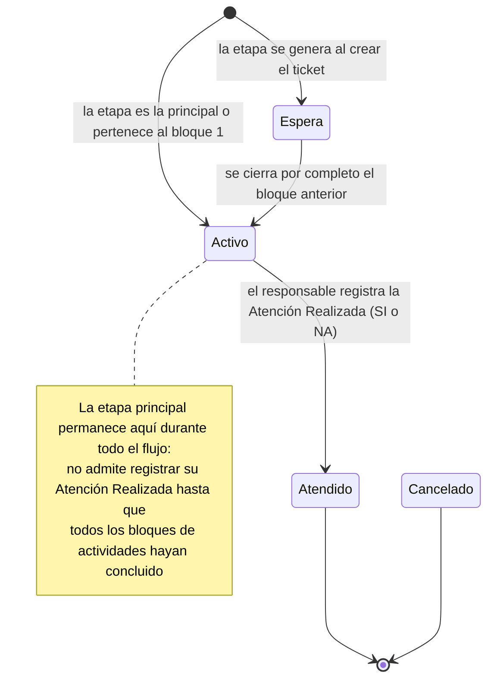
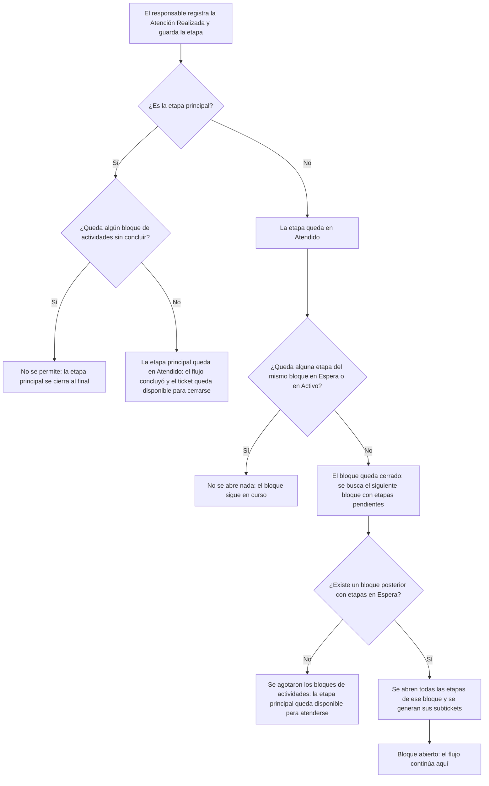
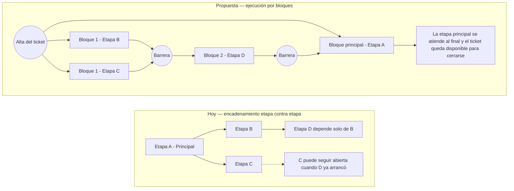
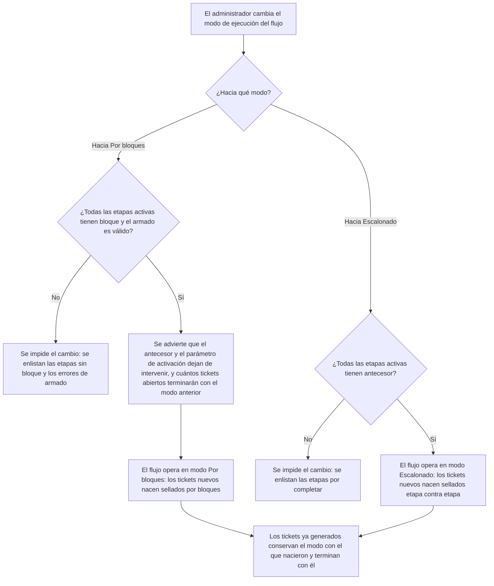
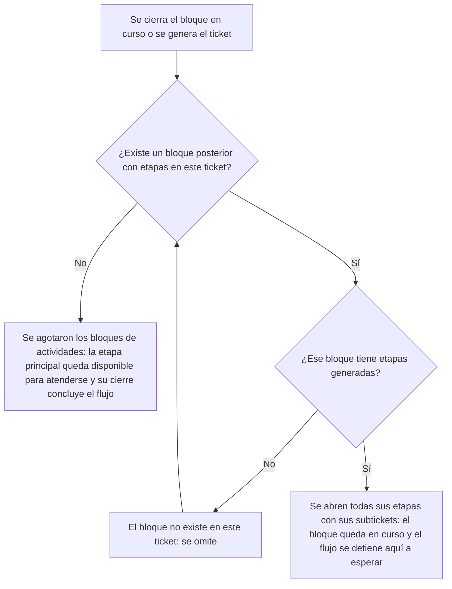

# Requerimientos Funcionales — Ejecución del Flujo de Trabajo de Tickets por Bloques

| Campo   | Valor                                                  |
|---------|--------------------------------------------------------|
| Versión | 2.1                                                    |
| Fecha   | 2026-09-11                                             |
| Estado  | Definición                                             |
| Módulo  | Innovación & Negocios — Cómputo / Tickets Escalonados  |
| Autor   | Análisis de Negocio                                    |

---

## 1. Propósito del documento

Cuando se asigna equipo de cómputo a un colaborador, el sistema no genera un solo ticket: genera un **flujo de trabajo escalonado**, es decir, una cadena de actividades que se van abriendo unas a otras conforme se atienden, y donde cada actividad que lo requiere produce su propio subticket dirigido al área responsable. Hoy ese encadenamiento funciona **etapa contra etapa**: cada actividad declara de cuál otra depende, y en cuanto esa única actividad se cierra, la siguiente arranca.

Ese comportamiento tiene un límite que el negocio ya está encontrando: **no existe forma de exigir que un grupo completo de actividades termine antes de que empiece el grupo siguiente**. Si tres actividades deben trabajarse en paralelo y la cuarta solo tiene sentido cuando las tres estén listas, hoy la cuarta se abre en cuanto termina aquella de la que se colgó, sin importar que las otras dos sigan pendientes. El resultado es trabajo que arranca sin sus insumos, retrabajo, y actividades que se dan por buenas sobre información incompleta.

Este documento describe los seis requerimientos funcionales necesarios para que el flujo de trabajo pueda operar **por bloques**: tandas de actividades que se abren juntas y donde el siguiente bloque no arranca hasta que **todas** las actividades del bloque en curso hayan concluido.

Dentro de un flujo por bloques hay un bloque que no se comporta como los demás: el **bloque principal**, que es el del propio ticket principal. Ese bloque no hace fila: se abre **junto con el primer bloque de actividades**, en el mismo momento en que nace el ticket, porque el ticket principal existe desde el arranque y no tiene sentido que espere a nadie. Y no se cierra cuando le toca su turno, sino **al final**: la etapa principal no puede darse por atendida mientras quede un solo bloque de actividades sin concluir. El bloque principal es, entonces, el paraguas del ticket: el primero que se abre y el último que se cierra.

La ejecución por bloques **no se impone a todos los flujos**. Cada flujo de trabajo decide, desde su propio detalle, con qué mecanismo quiere avanzar: puede conservar el **modo escalonado** con el que opera hoy —etapa contra etapa, mediante el antecesor— o adoptar el **modo por bloques**. Esa elección es lo que permite adoptar el cambio flujo por flujo, sin obligar a reorganizar de golpe procesos que hoy funcionan bien, y es el objeto de RF-01.

- **RF-01 — Selección del modo de ejecución en el detalle del flujo de trabajo**, que agrega en el propio flujo la opción de configurar con qué mecanismo avanza —escalonado por antecesor o por bloques—, determina qué datos y validaciones aplican en cada caso, y deja ese modo sellado en cada ticket al generarlo. Es el requerimiento que envuelve a los cinco siguientes: todos ellos describen el comportamiento de un flujo configurado **en modo por bloques**.
- **RF-02 — Definición de bloques en la configuración del flujo de trabajo**, que incorpora el bloque como la unidad que agrupa las etapas y que gobierna el avance, en sustitución de la dependencia etapa contra etapa.
- **RF-03 — Integridad del armado del flujo por bloques**, que impide guardar configuraciones mal armadas que dejarían tickets detenidos en producción.
- **RF-04 — Registro y visualización del bloque en el ticket y en sus subtickets**, que lleva el bloque al ticket, lo deja registrado en cada subticket que se genera y hace visible en qué tanda va el trabajo y por qué una etapa todavía no está disponible.
- **RF-05 — Apertura del bloque principal y activación por barrera del siguiente bloque**, que es el corazón del cambio: el bloque principal y el bloque 1 se abren juntos al generar el ticket, cada bloque siguiente se abre en una sola operación cuando —y solo cuando— el bloque en curso quedó completamente cerrado, y el bloque principal no puede cerrarse hasta que todos los demás concluyan.
- **RF-06 — Continuidad del flujo ante bloques vacíos**, que garantiza que un bloque sin actividades aplicables al caso no detenga el ticket para siempre.

El objetivo es que cualquier persona del negocio entienda, sin consultar otro documento, qué es un bloque, cuándo se abre el siguiente, qué pasa cuando una tanda completa no aplica, cómo se configura todo esto, cómo se elige el modo de ejecución de cada flujo y qué ocurre con los tickets que ya estaban abiertos el día de la liberación.

### El modelo en seis reglas

Si alguien solo va a leer una parte de este documento, que sea esta. Todo lo demás son los detalles de estas seis reglas.

1. **Cada etapa pertenece a un bloque numerado, y el bloque es lo único que determina cuándo se abre.** Ya no hay cadena de antecesores.
2. **Al generar el ticket se abren juntos el bloque principal y el bloque 1**, con los subtickets de las etapas de ambos que lo requieran.
3. **Un bloque queda cerrado cuando todas sus etapas están en Atendido o Cancelado**; ambos estatus cuentan por igual.
4. **El bloque siguiente se abre completo —con todos sus subtickets— solo cuando el bloque en curso cerró.** Nunca hay dos bloques de actividades abiertos a la vez.
5. **Un bloque que no aplica al caso se salta solo**, en cadena y sin intervención humana, hasta encontrar uno con actividades o agotarlos.
6. **El bloque principal se cierra al final**: no admite registrar su atención realizada mientras quede un bloque pendiente, y su cierre es el que concluye el flujo.

### Qué cambia respecto de hoy

| Hoy — escalonado por antecesor | Con bloques |
|---|---|
| Cada etapa declara **de cuál etapa** depende | Cada etapa declara **a qué tanda** pertenece |
| Al cerrar una etapa se abren las que colgaban de ella | Al cerrar el bloque completo se abre el siguiente completo |
| La etapa principal arranca sola; el resto espera a que cierre | El bloque principal y el bloque 1 arrancan juntos |
| La etapa principal se atiende al inicio | El bloque principal se atiende al final y ese cierre concluye el flujo |
| Una etapa puede descartarse según el resultado de otra | Una etapa se abre siempre que su bloque se abra: no hay descarte por condición |
| Una actividad puede arrancar aunque sus insumos sigan abiertos | Ninguna actividad arranca antes de que su tanda anterior esté completa |

## 2. Alcance del documento

**Incluye:**
- La **opción de configurar el modo de ejecución en el detalle de cada flujo de trabajo**: escalonado por antecesor —el comportamiento vigente— o por bloques, con las reglas que gobiernan el cambio de un modo al otro y el sellado del modo en cada ticket al generarlo.
- La incorporación del **bloque** como atributo de cada etapa en la configuración del flujo de trabajo, y su uso como mecanismo que gobierna el avance del flujo en los flujos configurados en modo por bloques.
- Las **validaciones de armado** que impiden guardar un flujo por bloques con bloques incompletos, mal numerados o con la etapa principal fuera de lugar.
- El traslado del bloque al ticket en el momento de generarlo, el **sello del bloque en cada subticket que se genera**, y la **presentación agrupada** del flujo de trabajo por bloque, con indicador del bloque en curso.
- La restricción de la **pestaña de flujo de trabajo al ticket principal** en los tickets que operan por bloques: los subtickets dejan de presentarla y conservan su bloque como dato propio.
- La **regla de barrera**: apertura del siguiente bloque únicamente cuando todas las etapas del bloque en curso quedaron en un estatus terminal, y apertura simultánea de todas las etapas de ese siguiente bloque con sus respectivos subtickets.
- El **bloque principal** como bloque paraguas del ticket: se abre junto con el primer bloque de actividades al generar el ticket, permanece abierto durante todo el flujo y **no puede cerrarse hasta que todos los bloques de actividades hayan concluido**.
- El **avance automático** sobre los bloques que quedaron sin etapas aplicables al caso concreto, incluso si son varios consecutivos.
- El retiro del **condicionamiento de una etapa al resultado de otra**: en modo por bloques el parámetro de activación deja de intervenir y ninguna etapa se descarta por el resultado de una etapa previa.
- El tratamiento de los **tickets que ya estaban abiertos** al momento de la liberación: no tienen modo sellado y continúan avanzando con la regla escalonada hasta cerrarse.
- El registro en **bitácora** de la apertura de cada bloque, de la activación de cada etapa y del descarte de cada etapa con su motivo.

**No incluye:**
- El contenido funcional de cada etapa —alta de correo electrónico, directorio activo, VPN, perfil de seguridad, configuración de red, check list—, que continúa operando exactamente como hoy.
- El mecanismo de creación del ticket principal a partir de la asignación de cómputo, la elección del flujo por subrama del activo y el descarte de etapas no solicitadas, que se conservan sin cambio.
- La resolución del responsable de cada etapa por unidad de negocio, que se mantiene con su comportamiento actual.
- El flujo escalonado de **baja de personal vía nómina**, que opera con un mecanismo distinto —genera todos sus subtickets de una sola vez, sin dependencias entre ellos— y que no se configura desde el catálogo de flujos de trabajo.
- El proceso de cierre del ticket principal y de los subtickets, que conserva sus reglas actuales; este documento únicamente cambia **cuándo** quedan disponibles para cerrarse.
- Nuevos estatus para las etapas ni para los tickets: el requerimiento reutiliza los estatus vigentes.
- La reingeniería de las pantallas de captura de cada tipo de etapa.
- El **retiro del modo escalonado**: el modo por antecesor se conserva como una opción válida y soportada del catálogo de flujos, no como un mecanismo en vías de eliminación. La decisión de retirarlo, si algún día se toma, es materia de otro requerimiento.
- Ninguna **migración ni conversión automática** de la información ya configurada: no se derivan bloques a partir de las cadenas de antecesor, no hay reporte de conversión ni estado de validación. El bloque de cada etapa lo captura el administrador antes de cambiar el flujo a modo por bloques.
- Ningún **aviso al área responsable ni al coordinador cuando un bloque completo no aplica** al caso: la omisión queda en la bitácora del ticket y no genera notificación.
- Ningún cambio en las **notificaciones por correo** de los subtickets: el bloque queda consultable en el subticket y en los listados, pero no se agrega al asunto ni al cuerpo del correo.
- Ninguna **facultad para brincar, omitir o forzar manualmente** un bloque o una etapa que quedó atorada, ni para hacer avanzar un ticket detenido desde la interfaz. La barrera no admite excepciones: si un ticket queda detenido, la verificación del invariante lo detecta (RF-06) y su corrección la ejecuta el área de desarrollo. Esto es deliberado: una opción de salto convertiría la barrera en una sugerencia y devolvería el problema que el requerimiento viene a resolver.

## 3. Actores y roles

| Actor / Rol | Descripción |
|-------------|-------------|
| Administrador del flujo de trabajo | Persona de Innovación & Negocios que da de alta y mantiene los flujos de trabajo y sus etapas: define los bloques, el orden, los responsables y las condiciones de cada actividad. |
| Responsable de etapa | Colaborador del departamento al que está dirigida una etapa del flujo; es quien captura la información de la actividad y registra la atención realizada. |
| Coordinador / Jefe de Cómputo | Da seguimiento al avance del flujo de un ticket, revisa los bloques pendientes y detecta desviaciones. |
| Colaborador solicitante | Persona a la que se le asigna el equipo de cómputo y cuyo expediente se completa a lo largo del flujo. No interviene en la ejecución. |
| Sistema (motor de flujo) | Mecanismo automático que abre el bloque principal y el primer bloque al generar el ticket, evalúa el cierre de cada bloque, abre el siguiente, genera los subtickets, descarta las etapas que no aplican e impide el cierre del bloque principal mientras queden bloques pendientes. |
| Equipo de Desarrollo | Área responsable de implementar el cambio y de atender los tickets que queden detenidos. |

## 4. Glosario

| Término / Sigla | Definición |
|-----------------|------------|
| Flujo de trabajo | Plantilla configurable que describe todas las actividades que deben ejecutarse para atender una asignación de equipo de cómputo, quién las atiende y en qué momento se abren. Se configura una sola vez y se reutiliza en cada ticket. |
| **Modo de ejecución del flujo** | Dato del detalle del flujo de trabajo que indica con qué mecanismo avanzan sus etapas. Admite dos valores: **Escalonado por antecesor** y **Por bloques**. Es el dato que decide qué reglas de este documento aplican al flujo y a los tickets que genere. Concepto introducido en RF-01. |
| Modo escalonado por antecesor | Modo de ejecución vigente hasta hoy: cada etapa declara de cuál otra depende y arranca en cuanto esa única etapa concluye. No usa bloques ni barreras. |
| Modo por bloques | Modo de ejecución que introduce este documento: las etapas se agrupan en bloques y el siguiente bloque no arranca hasta que todas las etapas del bloque en curso concluyeron. |
| Modo de ejecución del ticket | Copia del modo de ejecución del flujo tomada al generar el ticket. Es el que gobierna la ejecución de ese ticket hasta su cierre, con independencia de que la plantilla cambie de modo después. |
| Etapa del flujo | Cada una de las actividades que componen un flujo de trabajo (por ejemplo: alta de correo electrónico, alta en directorio activo, configuración de red, check list de entrega). Es la unidad que se atiende y que puede generar un subticket. |
| **Bloque** | Conjunto de etapas de un mismo flujo que se abren juntas y se trabajan en paralelo. Es la unidad que gobierna el avance: **hasta que todas las etapas de un bloque concluyen, no se abre el bloque siguiente**. Los bloques de actividades se identifican con un número entero consecutivo empezando en 1. |
| **Bloque principal** | Bloque del propio ticket principal, formado por la etapa marcada como principal. No lleva número y no participa en la fila de barreras: se abre **junto con el bloque 1** al generar el ticket y es el **último en cerrarse**, porque no puede darse por atendido mientras quede algún bloque de actividades sin concluir. Concepto introducido en RF-05. |
| Bloque de actividades | Cualquiera de los bloques numerados —bloque 1, bloque 2, bloque 3…— que agrupan las actividades del flujo y que sí avanzan uno tras otro atravesando barreras. |
| Barrera | Punto de sincronización al final de cada bloque de actividades. El flujo se detiene ahí hasta que la última etapa pendiente del bloque queda concluida, y solo entonces continúa. El bloque principal no impone barrera a la apertura del bloque 1. Es el concepto que da nombre a la regla de activación de RF-05. |
| Etapa en curso / bloque en curso | Etapa o bloque cuyas actividades están abiertas y disponibles para atenderse en este momento. Solo puede haber un bloque de actividades en curso a la vez, y conviven con él las etapas del bloque principal, que permanecen abiertas durante todo el flujo. |
| Estatus de la etapa | Situación de una etapa dentro del ticket. **Espera**: todavía no le toca, no es editable ni generó subticket. **Activo**: está en curso y disponible para atenderse. **Atendido**: se registró su atención y concluyó. **Cancelado**: se descartó porque no aplica al caso. |
| Estatus terminal | Estatus del que una etapa ya no sale: **Atendido** o **Cancelado**. Una etapa en estatus terminal se considera concluida para efectos de cerrar el bloque. |
| Atención realizada | Resultado con el que el responsable cierra una etapa. Admite dos valores: **SI**, cuando la actividad se ejecutó, y **NA**, cuando la actividad no aplicaba al caso. Es el dato que dispara el avance del flujo y el que se evalúa en las etapas condicionadas. |
| Etapa principal | Etapa marcada como principal en la configuración del flujo. Es la actividad del propio ticket principal y constituye por sí sola el bloque principal. Hay una y solo una por flujo. |
| Etapa mandatoria | Etapa que siempre forma parte del flujo de un ticket, sin importar qué cuentas o accesos se hayan solicitado. |
| Etapa condicional | Etapa que solo forma parte del flujo de un ticket cuando la cuenta o acceso al que está asociada fue efectivamente solicitado. Si no se solicitó, la etapa nunca se genera en ese ticket. |
| Descartar una etapa | Dejar una etapa en estatus Cancelado. En modo por bloques ninguna regla del flujo lo produce de forma automática, pero el estatus se conserva en el modelo: una etapa en Cancelado cuenta como concluida y no impide cerrar el bloque ni el ticket. |
| Ticket principal | Ticket que se genera al asignar el equipo de cómputo y que contiene el flujo de trabajo completo. Es el que concentra todas las etapas. |
| Subticket | Ticket que el sistema genera automáticamente a partir de una etapa marcada para registrar ticket, dirigido al responsable de esa etapa. Depende del ticket principal y queda registrado con el bloque de la etapa que lo originó. En los tickets que operan por bloques no presenta el flujo de trabajo completo: ese se consulta en el ticket principal. |
| Grupo escalonado | Nombre con el que el negocio se refiere al bloque cuando se habla del dato que queda registrado en el ticket y en sus subtickets. Es el mismo concepto que **bloque**: la tanda de etapas a la que perteneció la actividad que originó el ticket. |
| Antecesor | Mecanismo de encadenamiento del modo escalonado: referencia de una etapa a **una sola** etapa previa, cuya conclusión la activa. En los flujos configurados en modo por bloques, el bloque lo sustituye y el antecesor queda como dato histórico. |
| Ticket escalonado | Forma de operar en la que un ticket principal va generando subtickets conforme avanza el flujo, en lugar de generarlos todos al inicio. |
| Modo de compatibilidad | Operación en la que el sistema atiende con las reglas del modo escalonado los tickets que no tienen bloque asignado, ya sea porque se generaron antes de la liberación o porque su flujo está configurado en modo escalonado por antecesor. |

## 5. Entidad a la que aplica

Este requerimiento aplica sobre tres entidades que hoy ya existen y que se relacionan como catálogo, plantilla e instancia.

La primera es el **flujo de trabajo en su detalle**, es decir, el encabezado del flujo que el administrador consulta y edita en el catálogo. Sobre ella se agrega el **modo de ejecución** (RF-01), que es el dato que decide si ese flujo avanza etapa contra etapa o por bloques. No tiene ciclo de estatus relevante para este documento; sí tiene, en cambio, un estado de validación cuando el flujo se convierte de un modo al otro.

La segunda es la **etapa del flujo de trabajo en su definición**, es decir, el renglón que el administrador captura al configurar un flujo. Sobre ella se agrega el bloque y se ajustan sus validaciones. No tiene ciclo de estatus relevante para este documento más allá de estar activa o cancelada dentro del catálogo.

La tercera, y la que concentra el cambio de comportamiento, es la **etapa del flujo de trabajo dentro de un ticket**: la copia que se genera en el momento de crear el ticket principal y que es la que realmente se atiende. Su **estatus inicial es Espera** —salvo la etapa principal y las etapas del bloque 1, que se activan de inmediato y en la misma operación— y sus **estatus terminales son Atendido**, cuando el responsable registró la atención realizada, **o Cancelado**, cuando el sistema la descartó por no aplicar al caso. La etapa principal tiene además una restricción propia: permanece activa durante todo el flujo y **no admite registrar su atención realizada mientras quede algún bloque de actividades sin concluir**. El proceso descrito por este documento concluye cuando **ninguna etapa del ticket permanece en Espera ni en Activo** —lo que exige que la etapa principal se haya atendido al final—, momento en el que el ticket principal queda disponible para cerrarse.

Es importante entender que la etapa del ticket es una **copia congelada** de la configuración: se lleva el modo de ejecución del flujo, el bloque, el orden, el responsable, la condición y el expediente del colaborador tal como estaban al momento del alta. Un cambio posterior en la plantilla no altera los tickets ya generados, lo cual es deliberado: cada ticket termina de ejecutarse con las reglas con las que nació.

A esa copia congelada se suma un tercer punto de registro: el **subticket**. Cada subticket que el flujo genera se registra con el número de bloque —el grupo escalonado— de la etapa que lo originó, de modo que el dato viaja de la plantilla a la etapa del ticket y de ahí al subticket, y queda disponible para consulta y filtrado sin necesidad de abrir el ticket principal.

### Visión general del flujo

Los diagramas de esta sección describen el comportamiento de un ticket **generado a partir de un flujo configurado en modo por bloques**. Un ticket cuyo flujo está en modo escalonado por antecesor conserva íntegramente el comportamiento actual y no atraviesa barreras.

El primer diagrama muestra el ciclo de vida de una etapa dentro del ticket. Nótese que **Cancelado no es un fracaso**: es la salida normal de una etapa que no aplicaba al caso, y cuenta igual que Atendido para dar por cerrado el bloque.



El segundo diagrama muestra la decisión que ejecuta el sistema cada vez que un responsable cierra una etapa. La pregunta central —y la que cambia respecto de hoy— es la primera: ya no se pregunta *"¿quién dependía de esta etapa?"*, se pregunta *"¿ya terminó todo el bloque?"*.



El tercer diagrama ilustra la diferencia de comportamiento con un ejemplo de cuatro actividades. Arriba, cómo avanza hoy; abajo, cómo avanzaría por bloques. Nótese que la etapa principal arranca al mismo tiempo que el bloque 1 y se cierra después del último bloque.



## 6. Índice de requerimientos

> **Navegación rápida:** cada identificador RF en la primera columna es un enlace que lleva directamente al detalle del requerimiento. Hacer clic para ir al RF.

| RF | Título | Sistema | Aplica a |
|----|--------|---------|----------|
| [RF-01](#rf-01) | Selección del modo de ejecución en el detalle del flujo de trabajo | Business Suite | Flujos de Trabajo / Configuración |
| [RF-02](#rf-02) | Definición de bloques en la configuración del flujo de trabajo | Business Suite | Flujos de Trabajo / Configuración |
| [RF-03](#rf-03) | Integridad del armado del flujo por bloques | Business Suite | Flujos de Trabajo / Configuración |
| [RF-04](#rf-04) | Registro y visualización del bloque en el ticket y en sus subtickets | Business Suite | Tickets de Cómputo |
| [RF-05](#rf-05) | Apertura del bloque principal y activación por barrera del siguiente bloque | Business Suite | Tickets de Cómputo |
| [RF-06](#rf-06) | Continuidad del flujo ante bloques vacíos | Business Suite | Tickets de Cómputo |

---
---

<a id="rf-01"></a>
# RF-01 — Selección del Modo de Ejecución en el Detalle del Flujo de Trabajo

| Campo        | Valor      |
|--------------|------------|
| Prioridad    | Must       |
| Estado       | Definición |
| Dependencias | Ninguna    |

> **Habilita y condiciona a RF-02, RF-03, RF-04, RF-05 y RF-06:** todos ellos describen el comportamiento de un flujo configurado en modo Por bloques.

## Objetivo

Permitir que cada flujo de trabajo decida, desde su propio detalle, con qué mecanismo avanza —etapa contra etapa mediante el antecesor, como opera hoy, o por bloques—, para que el negocio adopte la ejecución por bloques en los procesos donde la necesita sin obligar a reorganizar aquellos que hoy funcionan correctamente.

## Descripción

El sistema deberá incorporar, en el **detalle del flujo de trabajo**, un campo **Modo de ejecución** con dos valores posibles y mutuamente excluyentes:

- **Escalonado por antecesor**: el comportamiento vigente. Cada etapa declara de cuál otra depende y arranca en cuanto esa única etapa concluye. No hay bloques ni barreras.
- **Por bloques**: el comportamiento que describen RF-02 a RF-06. Las etapas se agrupan en tandas numeradas y el siguiente bloque no arranca hasta que todas las etapas del bloque en curso concluyeron.

El modo de ejecución no es un dato informativo: es **el dato que decide qué reglas aplican** al flujo y a los tickets que genere. De él dependen tres cosas. La primera, **qué se captura en las etapas**: en modo por bloques el bloque es obligatorio y el antecesor no se captura; en modo escalonado el antecesor conserva su papel actual y el bloque no se pide ni se exige. La segunda, **qué se valida al guardar**: las validaciones de armado por bloques de RF-03 solo tienen sentido —y solo se ejecutan— en los flujos por bloques. La tercera, **cómo avanza el ticket**: la barrera de RF-05 y el avance en cadena de RF-06 se aplican únicamente a los tickets generados desde un flujo por bloques.

Los **flujos que ya existen** al momento de la liberación quedan en modo escalonado por antecesor. Esta es una decisión deliberada: nadie cambia de comportamiento sin pedirlo. Los **flujos nuevos** se presentan en modo por bloques por omisión, porque es el esquema al que el negocio quiere migrar, y el administrador puede cambiarlo antes de guardar.

El **cambio de modo** de un flujo ya configurado es la operación más delicada de este requerimiento y tiene reglas distintas en cada dirección, pero en las dos el criterio es el mismo: **el sistema no deriva nada por su cuenta**, exige que el dato que el modo nuevo necesita ya esté capturado. Al pasar de escalonado a bloques necesita el bloque de cada etapa, así que **impide el cambio** mientras alguna etapa activa esté sin bloque o el armado no pase las validaciones de RF-03, y al aceptarlo advierte que el antecesor y el parámetro de activación dejan de intervenir. Al pasar de bloques a escalonado necesita el antecesor de cada etapa —que en modo por bloques dejó de capturarse— y por eso impide el cambio mientras existan etapas activas sin antecesor. En ambos casos el sistema enlista lo que el administrador debe completar antes de reintentarlo.

Un cambio de modo **no toca los tickets en curso**. Cada ticket se sella con el modo del flujo en el momento de generarlo y termina de ejecutarse con ese mecanismo, exactamente con el mismo criterio con el que hoy se congela el resto de la configuración. Esto es lo que hace seguro cambiar el modo de un flujo que tiene trabajo en proceso.

### Diagrama del cambio de modo



### Información / atributos

| Campo | Obligatorio | Descripción |
|---|---|---|
| Modo de ejecución del flujo | Sí | Mecanismo con el que avanzan las etapas del flujo. Valores: **Escalonado por antecesor** o **Por bloques**. Valor por omisión: Por bloques en flujos nuevos; Escalonado por antecesor en los flujos que ya existían al liberar. |
| Modo de ejecución del ticket | Sí | Copia del modo del flujo tomada al generar el ticket. No cambia durante la vida del ticket. |
| Modo en el catálogo de flujos | Sí | El modo de ejecución se presenta en el detalle del flujo y está disponible como columna y criterio de filtrado en el listado del catálogo. |

### Operaciones

El administrador del flujo de trabajo deberá poder:
- Consultar el modo de ejecución de cualquier flujo desde su detalle y desde el listado del catálogo.
- Elegir el modo de ejecución al registrar un flujo nuevo.
- Cambiar el modo de ejecución de un flujo existente, sujeto a las reglas de cada dirección de cambio.
- Consultar la bitácora de cambios de modo de un flujo, con quién lo cambió y cuándo.

### Diseño UX/UI

El modo de ejecución se presenta en el encabezado del detalle del flujo de trabajo, junto con los datos que lo identifican, como una selección de dos opciones con su descripción a la vista, de modo que el administrador entienda qué implica cada una sin consultar documentación. Al cambiarlo, el sistema pide confirmación explícita y advierte del efecto: exigencia de bloques capturados y pérdida del parámetro de activación en un sentido, exigencia de antecesores en el otro, y en ambos casos cuántos tickets abiertos van a terminar con el modo anterior, porque los tickets ya generados no se modifican. En la pestaña de flujo de trabajo del ticket se indica con qué modo opera ese ticket, y el indicador de avance por bloques se muestra únicamente cuando el modo es Por bloques.

---

## HU-1.1 — Configuración del modo de ejecución de un flujo

Como administrador del flujo de trabajo, quiero elegir desde el detalle de cada flujo si avanza etapa contra etapa o por bloques, para adoptar la ejecución por bloques solo en los procesos que la necesitan y dejar los demás operando como hoy.

### Reglas de negocio

**RN-1.1** Todo flujo de trabajo deberá tener un modo de ejecución declarado, con exactamente uno de dos valores: Escalonado por antecesor o Por bloques. El dato es obligatorio y no admite quedarse vacío.

**RN-1.2** Los flujos de trabajo que existan al momento de la liberación quedarán en modo Escalonado por antecesor, para conservar sin cambio el comportamiento con el que operan.

**RN-1.3** Un flujo de trabajo nuevo se presentará con el modo Por bloques por omisión, y el administrador podrá cambiarlo antes de guardarlo.

**RN-1.4** El modo de ejecución determinará qué datos se capturan en las etapas del flujo: en modo Por bloques el bloque es obligatorio y el antecesor no se captura (RN-2.3, RN-2.7); en modo Escalonado por antecesor el antecesor conserva su comportamiento actual y el bloque no se solicita ni se exige.

**RN-1.5** El modo de ejecución determinará qué validaciones de armado se ejecutan al guardar el flujo: las validaciones por bloques de RF-03 aplicarán únicamente a los flujos en modo Por bloques, y los flujos en modo Escalonado por antecesor conservarán las validaciones vigentes.

**RN-1.6** El cambio de modo Escalonado por antecesor a modo Por bloques se impedirá mientras alguna etapa activa del flujo esté sin bloque capturado o el armado no cumpla las validaciones de RF-03. El sistema deberá indicar qué etapas requieren bloque y qué debe corregirse. **No existe conversión automática de la configuración**: el bloque de cada etapa lo captura el administrador. Al aceptarse el cambio, el sistema deberá advertir que el antecesor y el parámetro de activación dejan de intervenir, señalando las etapas que tengan parámetro de activación configurado, porque esa condición dejará de evaluarse.

**RN-1.7** El cambio de modo Por bloques a modo Escalonado por antecesor se impedirá mientras existan etapas activas del flujo sin antecesor, salvo la etapa principal. El sistema deberá indicar qué etapas requieren completarse y habilitar la captura del antecesor para poder hacerlo.

**RN-1.8** Únicamente el administrador del flujo de trabajo con permiso de configuración podrá consultar y cambiar el modo de ejecución. Ningún otro perfil podrá modificarlo, y el cambio no requerirá ninguna autorización adicional dentro del sistema: basta ese permiso, y el cambio queda registrado en bitácora (RN-1.9).

**RN-1.9** Todo cambio de modo de ejecución quedará registrado en la bitácora del flujo de trabajo con fecha, hora, usuario que lo realizó, modo anterior y modo nuevo.

**RN-1.10** El modo de ejecución podrá cambiarse aunque existan tickets abiertos generados a partir de ese flujo. Esos tickets terminarán de ejecutarse con el modo con el que nacieron (RN-1.12 y RN-1.13) y los que se generen a partir del cambio nacerán con el modo nuevo. Al confirmar el cambio, el sistema deberá **advertir** cuántos tickets abiertos van a terminar con el modo anterior y permitir consultarlos, sin impedir la operación.

**RN-1.11** El modo de ejecución se presentará en el detalle del flujo y estará disponible como columna y como criterio de filtrado en el listado del catálogo de flujos de trabajo.

### Criterios de Aceptación

**CA-1.1.1 — Configuración de un flujo nuevo en modo por bloques**
Dado que el administrador registra un flujo de trabajo nuevo
Cuando consulta el detalle del flujo antes de guardarlo
Entonces el sistema le presenta el modo de ejecución con el valor Por bloques por omisión y le solicita el bloque en la captura de cada etapa.

**CA-1.1.2 — Configuración de un flujo en modo escalonado**
Dado que el administrador registra un flujo de trabajo nuevo y selecciona el modo Escalonado por antecesor
Cuando captura las etapas del flujo
Entonces el sistema le solicita el antecesor de cada etapa conforme al comportamiento vigente, no le pide el bloque y no aplica las validaciones de armado por bloques.

**CA-1.1.3 — El modo de ejecución es obligatorio**
Dado que el administrador intenta guardar un flujo de trabajo sin modo de ejecución declarado
Cuando selecciona Guardar
Entonces el sistema impide el guardado e informa que el modo de ejecución es un dato requerido.

**CA-1.1.4 — Los flujos existentes conservan su comportamiento**
Dado un flujo de trabajo configurado antes de la liberación
Cuando el administrador consulta su detalle después de la liberación
Entonces el sistema lo muestra en modo Escalonado por antecesor y el flujo continúa generando tickets que avanzan etapa contra etapa, sin bloques ni barreras.

**CA-1.1.5 — Cambio a modo por bloques con los bloques capturados**
Dado un flujo en modo Escalonado por antecesor cuyas etapas ya tienen su bloque capturado y cuyo armado cumple las validaciones por bloques
Cuando el administrador cambia el modo a Por bloques y confirma la operación
Entonces el sistema acepta el cambio, advierte que el antecesor y el parámetro de activación dejan de intervenir, y el flujo opera por bloques para los tickets que se generen a partir de ese momento.

**CA-1.1.6 — Cambio a modo escalonado sin antecesores capturados**
Dado un flujo en modo Por bloques cuyas etapas no tienen antecesor porque el dato dejó de capturarse
Cuando el administrador intenta cambiar el modo a Escalonado por antecesor
Entonces el sistema impide el cambio, indica qué etapas requieren antecesor y habilita su captura para poder completarlas.

**CA-1.1.7 — Cambio a modo escalonado con los antecesores completos**
Dado un flujo en modo Por bloques en el que todas las etapas activas ya tienen antecesor
Cuando el administrador cambia el modo a Escalonado por antecesor y confirma la operación
Entonces el sistema acepta el cambio, deja de aplicar las validaciones de armado por bloques y los tickets que se generen a partir de ese momento avanzan etapa contra etapa.

**CA-1.1.8 — Registro y restricción del cambio de modo**
Dado que el administrador con permiso de configuración cambió el modo de ejecución de un flujo
Cuando el coordinador de Cómputo consulta la bitácora del flujo
Entonces encuentra el registro del cambio con la fecha, la hora, el usuario, el modo anterior y el modo nuevo, y el sistema no le habilita a él la opción de modificarlo.

**CA-1.1.9 — El cambio de modo procede con tickets abiertos, advirtiéndolo**
Dado un flujo de trabajo con tres tickets abiertos generados a partir de él
Cuando el administrador cambia su modo de ejecución y confirma la operación
Entonces el sistema acepta el cambio, advierte que esos tres tickets abiertos terminarán con el modo anterior, le permite consultarlos, y los tickets que se generen a partir de ese momento nacen con el modo nuevo.


## HU-1.2 — Ejecución del ticket conforme al modo con el que nació

Como coordinador de Cómputo, quiero que cada ticket avance con el modo de ejecución que tenía su flujo el día en que se generó, para que un cambio de configuración no altere el trabajo que ya está en proceso.

### Reglas de negocio

**RN-1.12** Al generar un ticket, el sistema copiará el modo de ejecución del flujo al ticket, y ese modo gobernará su avance hasta el cierre.

**RN-1.13** Un cambio de modo de ejecución en la plantilla no modificará el modo de ningún ticket ya generado, esté abierto o cerrado.

**RN-1.14** Los tickets sellados en modo Por bloques avanzarán conforme a la regla de barrera de RF-05 y al avance en cadena de RF-06. Los tickets sellados en modo Escalonado por antecesor avanzarán etapa contra etapa conforme a la regla vigente y no presentarán agrupación ni indicador de avance por bloques.

**RN-1.15** Dentro de un mismo ticket no podrán convivir los dos mecanismos de avance: el modo sellado se aplica a la totalidad de sus etapas.

**RN-1.16** El modo con el que opera un ticket será visible en la pestaña de flujo de trabajo de su ticket principal, para que quien lo consulta sepa con qué reglas está avanzando.

**RN-1.17** Los tickets que se generaron antes de la liberación no tienen modo sellado ni bloques en sus etapas. El sistema los atenderá con las reglas del modo Escalonado por antecesor hasta que cierren, sin requerir intervención manual ni migración de su información. Este tratamiento no tiene fecha de retiro propia: se extingue solo, cuando el último de esos tickets cierra.

### Criterios de Aceptación

**CA-1.2.1 — El ticket se sella con el modo de su flujo**
Dado un flujo de trabajo en modo Por bloques, convertido y validado
Cuando se genera un ticket a partir de la asignación de equipo de cómputo
Entonces el ticket queda registrado en modo Por bloques y su pestaña de flujo de trabajo presenta las etapas agrupadas con el indicador de avance por bloques.

**CA-1.2.2 — Un ticket abierto conserva su modo cuando el flujo cambia**
Dado un ticket abierto, generado a partir de un flujo que en ese momento estaba en modo Escalonado por antecesor
Cuando ese flujo se cambia a modo Por bloques mientras ese ticket sigue abierto
Entonces el ticket ya generado conserva el modo Escalonado por antecesor, termina de ejecutarse etapa contra etapa, y el modo nuevo aplica únicamente a los tickets generados a partir del cambio.

**CA-1.2.3 — Un ticket en modo escalonado avanza etapa contra etapa**
Dado un ticket en modo Escalonado por antecesor con tres etapas dependientes de una misma etapa previa y una cuarta que depende solo de la primera de ellas
Cuando el responsable registra la atención realizada de esa primera etapa
Entonces el sistema activa la cuarta etapa de inmediato, sin esperar a que las otras dos concluyan, conservando el comportamiento vigente.

**CA-1.2.4 — Un ticket en modo por bloques avanza por barrera**
Dado un ticket en modo Por bloques cuyo bloque 2 tiene tres etapas activas
Cuando el responsable registra la atención realizada de una de ellas y las otras dos siguen abiertas
Entonces el sistema no activa ninguna etapa del bloque 3 y mantiene el bloque 2 como bloque en curso.

**CA-1.2.5 — Presentación del ticket según su modo**
Dado un ticket en modo Escalonado por antecesor
Cuando el responsable consulta la pestaña de flujo de trabajo
Entonces el sistema presenta las etapas con la organización vigente, indica que el ticket opera en modo escalonado y no muestra encabezados de bloque ni indicador del tipo "Bloque 2 de 4".

**CA-1.2.6 — Un ticket sin modo sellado avanza con la regla escalonada**
Dado un ticket que se generó antes de la liberación, cuyas etapas no tienen bloque ni modo sellado
Cuando el responsable registra la atención realizada de una de sus etapas
Entonces el sistema activa las etapas que dependían de ella conforme a la regla escalonada vigente y el ticket continúa su curso hasta cerrarse, sin intervención manual y sin migrar su información.

---

**Regla transversal:**
El modo de ejecución es la puerta de entrada de todo este documento: RF-02 a RF-06 describen exclusivamente el comportamiento de un flujo en modo Por bloques y de los tickets sellados con ese modo. Un flujo en modo Escalonado por antecesor no ejecuta ninguna de esas reglas y conserva íntegramente su comportamiento actual.

---
---

<a id="rf-02"></a>
# RF-02 — Definición de Bloques en la Configuración del Flujo de Trabajo

| Campo        | Valor      |
|--------------|------------|
| Prioridad    | Must       |
| Estado       | Definición |
| Dependencias | RF-01      |

> **Aplica cuando:** el flujo de trabajo está configurado en modo **Por bloques** (RF-01). Un flujo en modo Escalonado por antecesor no ejecuta las reglas de este requerimiento.

## Objetivo

Permitir que el administrador agrupe las etapas de un flujo de trabajo en tandas numeradas, de manera que el flujo exprese la idea de negocio "estas actividades se trabajan juntas y hasta que todas terminen no empieza la siguiente tanda", sin tener que armar dependencias etapa por etapa.

## Descripción

El sistema deberá incorporar, en cada etapa del flujo de trabajo, un campo **Bloque** que indique a qué tanda pertenece esa actividad. El bloque es un número entero que empieza en 1 y avanza de uno en uno; todas las etapas que compartan el mismo número forman una tanda que se abre y se trabaja en paralelo.

La **etapa principal queda fuera de esa numeración**: por sí sola constituye el **bloque principal**, que es el bloque del propio ticket principal. No se le captura bloque, no ocupa el número 1 y no desplaza a nadie, porque su comportamiento es distinto al de los bloques de actividades: se abre junto con el bloque 1 y se cierra al final (RF-05). La numeración 1, 2, 3… queda entonces íntegramente disponible para las tandas de actividades, y el "bloque 1" es la primera tanda real de trabajo.

Todo lo que describe este requerimiento aplica a los flujos configurados en **modo Por bloques** (RF-01). En un flujo en modo Escalonado por antecesor el bloque no se captura ni se exige, y la configuración de sus etapas conserva su comportamiento actual.

Dentro de un flujo por bloques, el bloque **sustituye al antecesor como el mecanismo que gobierna el avance del flujo**. En el modo escalonado, cada etapa declara de qué otra etapa depende y arranca en cuanto esa dependencia se cierra; en el modo por bloques, lo que determina cuándo arranca una etapa es únicamente el bloque al que pertenece. Esto simplifica la configuración —el administrador piensa en tandas, no en cadenas— y elimina de raíz la posibilidad de armar dependencias circulares o etapas que nunca se alcanzan.

El campo **Orden** conserva su lugar, pero cambia de significado: dentro de un bloque ya no expresa secuencia de ejecución, porque todas las etapas del bloque se abren al mismo tiempo. Sirve únicamente para **presentar las etapas en un orden legible** dentro de su bloque, tanto en la configuración como en el ticket.

El campo **Antecesor** deja de capturarse en los flujos en modo por bloques. Se conserva como dato de consulta —histórico—, pero no interviene en la decisión de activar una etapa mientras el flujo opere por bloques. En los flujos en modo escalonado por antecesor el campo sigue capturándose con su comportamiento actual, y volverá a solicitarse si un flujo por bloques se regresa a ese modo (RN-1.7).

### Información / atributos

Estos son **todos los campos del detalle del flujo de trabajo** y lo que se requiere de cada uno cuando el flujo opera en modo Por bloques. La configuración por bloques no agrega trabajo de captura: reemplaza el armado de la cadena etapa por etapa por un solo número de tanda.

| Campo | En modo Por bloques | Descripción |
|---|---|---|
| Bloque | **Requerido**, salvo la etapa principal | Número entero mayor o igual a 1 que identifica la tanda a la que pertenece la etapa. Todas las etapas con el mismo número se abren juntas. Es el **único dato que determina cuándo se abre la etapa**. La etapa principal no lo captura: constituye el bloque principal. En flujos en modo Escalonado por antecesor no se captura. |
| Orden | Requerido | Número entero que determina la posición en la que se presenta la etapa **dentro de su bloque**. No influye en el momento de activación. Debe ser único dentro del bloque, pero puede repetirse entre bloques distintos. |
| Clave | Requerido | Clave de la etapa. Conserva efecto funcional: la clave del check list de entrega es la que dispara su generación al abrirse la etapa. |
| Nombre | Requerido | Nombre de la actividad, con el que se identifica en la configuración y en el ticket. |
| Servicio | Requerido cuando la etapa registra ticket | Tipo de servicio con el que se genera el subticket de la etapa. |
| Cuenta | Opcional | Cuenta o acceso al que está asociada la etapa. En etapas no mandatorias es lo que determina si la etapa se genera en el ticket: solo se genera cuando esa cuenta fue solicitada. |
| Principal | Requerido, uno por flujo | Marca la etapa del propio ticket principal, que constituye el bloque principal. Solo puede haber una por flujo y no lleva bloque numerado. |
| Mandatorio | Requerido | Indica que la etapa siempre forma parte del flujo del ticket, sin importar qué cuentas o accesos se hayan solicitado. |
| Registra ticket | Requerido | Indica si la etapa genera subticket al abrirse su bloque. |
| Departamento | Opcional | Se conserva como dato de clasificación de la etapa. No interviene en la activación ni en la resolución del responsable, que se resuelve desde la colección de Responsables por unidad de negocio. |
| Parámetro de activación | **No se captura** | En modo por bloques no interviene: ninguna etapa se descarta por el resultado de otra. Se conserva de solo lectura y sigue vigente en modo escalonado. |
| Antecesor | **No se captura** | En flujos por bloques es una referencia histórica a la etapa de la que dependía en el esquema anterior: solo lectura, no se captura en etapas nuevas y no interviene en la activación (RN-2.7). En flujos en modo escalonado conserva su obligatoriedad y su comportamiento actual. |
| Estatus | Requerido | Activo o Cancelado dentro del catálogo. Una etapa cancelada no forma parte del flujo. |
| Responsables | Al menos uno | Colección de responsables por unidad de negocio a quienes se dirige la etapa y su subticket. |

En el **listado de etapas del detalle del flujo**, un flujo en modo Por bloques presenta como columnas el Bloque —como primer criterio de ordenamiento ascendente—, el Orden, el Nombre, la Cuenta, Principal, Mandatorio y Estatus. El Antecesor **no se presenta** en ese listado cuando el flujo opera por bloques; solo se muestra en los flujos en modo Escalonado por antecesor, donde sigue gobernando la activación.

### Operaciones

El administrador del flujo de trabajo deberá poder:
- Capturar el bloque al registrar una etapa nueva, salvo cuando la marca como principal: en ese caso el sistema no solicita el dato porque la etapa constituye el bloque principal.
- Modificar el bloque de una etapa existente mientras el flujo lo permita.
- Consultar el flujo con sus etapas **agrupadas por bloque**, en orden ascendente de bloque y, dentro de cada uno, en el orden capturado.

---

## HU-2.1 — Agrupación de las etapas en bloques

Como administrador del flujo de trabajo, quiero agrupar las etapas de un flujo en bloques numerados, para que el equipo trabaje por tandas completas y ninguna actividad arranque antes de que estén listos los insumos que produce la tanda anterior.

### Reglas de negocio

**RN-2.1** Las reglas de este requerimiento aplicarán únicamente a los flujos configurados en modo Por bloques (RN-1.4). En los flujos en modo Escalonado por antecesor el bloque no se captura, no se exige y no interviene en ninguna decisión.

**RN-2.2** En un flujo en modo Por bloques, cada etapa distinta de la principal deberá pertenecer a exactamente un bloque de actividades, identificado por un número entero mayor o igual a 1.

**RN-2.3** En un flujo en modo Por bloques, el bloque es un dato obligatorio para toda etapa distinta de la principal; no podrá guardarse una etapa sin bloque asignado.

**RN-2.4** La etapa principal constituye por sí sola el bloque principal y no lleva bloque numerado: el sistema no le solicitará el dato ni lo aceptará. La numeración de bloques de actividades empieza en 1 y no reserva ningún número para la etapa principal.

**RN-2.5** Dentro de un mismo bloque, el Orden determina únicamente la presentación de las etapas; no condiciona el momento en que se activan, porque todas las etapas del bloque se activan simultáneamente.

**RN-2.6** El Orden deberá ser único dentro de un mismo bloque. Dos etapas de bloques distintos podrán tener el mismo Orden sin que ello represente un conflicto.

**RN-2.7** En un flujo en modo Por bloques, el Antecesor deja de gobernar la activación de las etapas: se conserva como dato de consulta histórico y no se captura en etapas nuevas. En un flujo en modo Escalonado por antecesor continúa gobernando la activación, tal como opera hoy.

### Criterios de Aceptación

**CA-2.1.1 — Captura del bloque en una etapa nueva**
Dado que el administrador registra una etapa nueva en un flujo de trabajo configurado en modo Por bloques
Cuando captura el bloque 2, un orden y los demás datos obligatorios de la etapa
Entonces el sistema guarda la etapa asociada al bloque 2 y la presenta agrupada junto con las demás etapas de ese bloque.

**CA-2.1.2 — El bloque es obligatorio**
Dado que el administrador registra una etapa nueva, no marcada como principal, y deja el bloque vacío
Cuando intenta guardar la etapa
Entonces el sistema impide el guardado e informa que el bloque es un dato requerido.

**CA-2.1.3 — Orden duplicado dentro del mismo bloque**
Dado que en el bloque 2 ya existe una etapa con orden 1
Cuando el administrador intenta guardar otra etapa del bloque 2 también con orden 1
Entonces el sistema impide el guardado e informa que el orden ya está utilizado dentro de ese bloque.

**CA-2.1.4 — Orden repetido en bloques distintos**
Dado que en el bloque 2 existe una etapa con orden 1
Cuando el administrador guarda una etapa del bloque 3 con orden 1
Entonces el sistema acepta el guardado, porque la unicidad del orden aplica dentro de cada bloque y no en todo el flujo.

**CA-2.1.5 — El antecesor ya no se captura en un flujo por bloques**
Dado que el administrador registra una etapa nueva en un flujo de trabajo configurado en modo Por bloques
Cuando revisa los datos disponibles para captura
Entonces el sistema no le solicita ni le permite capturar un antecesor, y presenta el bloque como el único dato que determina cuándo se abrirá la etapa.

**CA-2.1.6 — Presentación agrupada de la configuración**
Dado que un flujo de trabajo tiene su etapa principal, tres etapas en el bloque 1 y dos en el bloque 2
Cuando el administrador consulta el flujo
Entonces el sistema presenta las seis etapas agrupadas, con el bloque principal al inicio y después los bloques de actividades en orden ascendente y, dentro de cada bloque, en el orden capturado.

**CA-2.1.7 — La etapa principal no admite bloque numerado**
Dado que el administrador marca una etapa como principal
Cuando revisa los datos disponibles para captura
Entonces el sistema no le solicita el bloque para esa etapa, indica que constituye el bloque principal y no le permite asignarle un número de bloque.

---

**Regla transversal:**
El bloque capturado en la configuración es el que se copia al ticket en el momento de generarlo (RF-04) y el que gobierna la apertura de las etapas durante la ejecución (RF-05), siempre que el flujo esté en modo Por bloques (RF-01). Un cambio de bloque en la configuración surte efecto únicamente en los tickets que se generen a partir de ese momento.

---
---

<a id="rf-03"></a>
# RF-03 — Integridad del Armado del Flujo por Bloques

| Campo        | Valor        |
|--------------|--------------|
| Prioridad    | Must         |
| Estado       | Definición   |
| Dependencias | RF-01, RF-02 |

> **Aplica cuando:** el flujo de trabajo está configurado en modo **Por bloques** (RF-01). Los flujos en modo Escalonado por antecesor conservan las validaciones de armado vigentes.

## Objetivo

Impedir que se guarde un flujo de trabajo cuyo armado por bloques dejaría tickets detenidos sin salida, de modo que los errores de configuración se detecten al momento de capturarlos y no cuando un ticket ya está atorado en producción.

## Descripción

El sistema deberá **validar el armado completo del flujo cada vez que se guarde** un flujo en modo Por bloques, y no únicamente la etapa que se está capturando. En un flujo en modo Escalonado por antecesor estas validaciones no se ejecutan, porque no hay bloques que recorrer: ese flujo conserva las validaciones con las que opera hoy. Un flujo por bloques es correcto solo si se puede recorrer de principio a fin sin huecos: cualquier bloque faltante en la secuencia rompe la cadena y deja las etapas posteriores esperando un momento que nunca llegará.

Las validaciones son de dos naturalezas. Las **bloqueantes** impiden el guardado porque describen configuraciones que con certeza dejarían un ticket detenido. Las **advertencias** permiten guardar pero informan al administrador de un riesgo que puede ser deliberado: es el caso de un bloque compuesto en su totalidad por etapas condicionales, que en un ticket concreto podría quedar sin ninguna actividad. Ese escenario está previsto y resuelto en RF-06, por lo que no debe impedirse; pero el administrador debe saber que lo está configurando.

Se incluye también la validación de la **cancelación de etapas**. Cancelar una etapa dentro de la configuración no debe poder dejar un bloque intermedio sin ninguna etapa activa, porque el efecto es idéntico al de un hueco en la numeración.

### Validaciones

| Validación | Tipo | Comportamiento esperado |
|---|---|---|
| La numeración de bloques debe ser consecutiva desde 1, sin huecos | Bloqueante | Impide guardar e indica qué número de bloque falta. |
| Todo bloque declarado debe tener al menos una etapa activa | Bloqueante | Impide guardar e indica el bloque vacío. |
| La etapa principal debe existir y ser única en el flujo | Bloqueante | Impide guardar e indica la inconsistencia detectada. |
| La etapa principal no puede llevar bloque numerado | Bloqueante | Impide guardar e indica que la etapa principal constituye el bloque principal. |
| Ninguna etapa distinta de la principal puede quedar sin bloque | Bloqueante | Impide guardar e indica qué etapas requieren bloque. |
| Un bloque compuesto exclusivamente por etapas condicionales | Advertencia | Permite guardar e informa que ese bloque podría quedar sin actividades en algunos tickets. |
| Cancelar la única etapa activa de un bloque intermedio | Bloqueante | Impide la cancelación mientras existan bloques posteriores con etapas activas. |

---

## HU-3.1 — Validación del armado del flujo

Como administrador del flujo de trabajo, quiero que el sistema no me permita guardar un flujo con bloques mal armados, para no descubrir el error cuando un ticket ya quedó detenido y sin forma de cerrarse.

### Reglas de negocio

**RN-3.1** Las validaciones de este requerimiento se ejecutarán únicamente al guardar un flujo en modo Por bloques (RN-1.5). Un flujo en modo Escalonado por antecesor conservará las validaciones vigentes.

**RN-3.2** La numeración de los bloques de un flujo deberá ser consecutiva a partir de 1, sin huecos intermedios.

**RN-3.3** Todo bloque declarado en un flujo deberá tener al menos una etapa activa.

**RN-3.4** Todo flujo deberá tener una y solo una etapa principal, y esa etapa no deberá llevar bloque numerado, porque constituye el bloque principal (RN-2.4).

**RN-3.5** Ninguna etapa distinta de la principal podrá quedar sin bloque asignado.

**RN-3.6** Cuando un bloque se componga exclusivamente de etapas condicionales, el sistema deberá advertirlo al guardar, sin impedir la operación, porque ese bloque podría quedar sin actividades aplicables en un ticket concreto.

**RN-3.7** No podrá cancelarse la única etapa activa de un bloque cuando existan bloques posteriores con etapas activas, porque la cancelación dejaría un hueco en la numeración.

### Criterios de Aceptación

**CA-3.1.1 — Hueco en la numeración de bloques**
Dado que un flujo tiene etapas en los bloques 1, 2 y 4, y ninguna en el bloque 3
Cuando el administrador intenta guardar el flujo
Entonces el sistema impide el guardado e informa que el bloque 3 no tiene etapas y que la numeración debe ser consecutiva.

**CA-3.1.2 — Etapa sin bloque asignado**
Dado que un flujo tiene una etapa activa, distinta de la principal, que quedó sin bloque
Cuando el administrador intenta guardar el flujo
Entonces el sistema impide el guardado e informa qué etapa requiere bloque, porque solo la etapa principal puede prescindir de él.

**CA-3.1.3 — Etapa principal con bloque numerado**
Dado que el administrador marca como principal una etapa que tiene asignado el bloque 2
Cuando intenta guardar el flujo
Entonces el sistema impide el guardado e informa que la etapa principal constituye el bloque principal y no puede llevar bloque numerado.

**CA-3.1.4 — Advertencia por bloque enteramente condicional**
Dado que el bloque 3 de un flujo se compone únicamente de etapas condicionales no mandatorias
Cuando el administrador guarda el flujo
Entonces el sistema guarda la configuración y le advierte que el bloque 3 podría quedar sin actividades en los tickets donde ninguna de esas cuentas se solicite.

**CA-3.1.5 — Cancelación que dejaría un bloque vacío**
Dado que el bloque 2 de un flujo tiene una sola etapa activa y existe un bloque 3 con etapas activas
Cuando el administrador intenta cancelar esa etapa del bloque 2
Entonces el sistema impide la cancelación e informa que el bloque quedaría sin actividades y rompería la secuencia.

---

**Regla transversal:**
Estas validaciones operan sobre la configuración y garantizan que el flujo sea recorrible en el papel. No sustituyen a RF-06, que resuelve las situaciones que solo aparecen en tiempo de ejecución, cuando el caso concreto de un ticket deja un bloque sin actividades aplicables.

---
---

<a id="rf-04"></a>
# RF-04 — Registro y Visualización del Bloque en el Ticket y en sus Subtickets

| Campo        | Valor        |
|--------------|--------------|
| Prioridad    | Must         |
| Estado       | Definición   |
| Dependencias | RF-01, RF-02 |

> **Aplica cuando:** el ticket se generó a partir de un flujo en modo **Por bloques**. Los tickets sellados en modo Escalonado por antecesor no llevan bloque ni indicador de avance por bloques (RN-1.14).

## Objetivo

Llevar el bloque configurado hasta el ticket y hacer visible, para quien trabaja el flujo, en qué tanda va el trabajo, cuáles actividades están disponibles ahora y cuáles todavía no, de modo que nadie tenga que preguntar por qué su etapa aparece bloqueada. Además, dejar registrado en cada subticket que se genera el bloque del que proviene, para que el dato viaje con el propio ticket y no solo con el flujo del ticket principal.

## Descripción

El sistema deberá **copiar el bloque de cada etapa al ticket** en el momento de generarlo, junto con el modo de ejecución del flujo (RN-1.12) y los demás datos que hoy ya se copian: el orden, el responsable, el expediente del colaborador y la condición de activación. A partir de ese momento, el bloque registrado en el ticket es el que gobierna su ejecución, con independencia de que la configuración cambie después.

Esta congelación es deliberada y tiene una consecuencia que el negocio debe conocer: **si mañana se reorganizan los bloques de un flujo, los tickets que ya estaban abiertos terminan de ejecutarse con la organización que tenían al nacer**, y la nueva aplica solo a los tickets que se generen a partir de ese cambio. Es el mismo criterio con el que hoy opera el resto de la copia del flujo.

El bloque no se queda en el ticket principal: **cada subticket que el flujo genera se registra con el número de bloque de la etapa que lo originó**. El valor se toma en el momento en que el subticket se registra y se conserva sin cambio durante toda su vida, de manera que quien consulta un subticket suelto —o un listado de subtickets— puede saber de qué tanda del proceso proviene sin abrir el ticket principal ni reconstruir el flujo. El bloque queda además disponible como columna y como criterio de filtrado en los listados de tickets, que es lo que permite responder preguntas del tipo "¿qué trae pendiente el bloque 2 de todos los tickets abiertos?".

La presentación del flujo tiene un lugar único: en los tickets que operan por bloques, la **pestaña de flujo de trabajo estará disponible únicamente en el ticket principal**, y los subtickets dejarán de mostrarla. La razón es que el flujo por bloques es una propiedad del ticket principal —el bloque en curso, la barrera y el avance solo tienen sentido vistos sobre el conjunto—, mientras que el subticket existe para atender **una** actividad. Mostrar el flujo completo en cada subticket repite la misma información en tantos lugares como subtickets abiertos haya, invita a intentar capturar desde ahí una etapa que no le corresponde y confunde sobre dónde se trabaja cada cosa.

Esto no deja al subticket sin contexto: conserva el **bloque con el que se registró** —el grupo escalonado— como dato propio y consultable, y conserva su vínculo con el ticket principal, que es donde se consulta el flujo completo. Los tickets que operan en modo escalonado por antecesor no se ven afectados por esta restricción y conservan la presentación con la que operan hoy.

En la presentación, el flujo de trabajo del ticket principal deberá mostrarse **agrupado por bloque**, en orden ascendente, con una indicación clara de cuál es el bloque en curso y un **indicador de avance** del tipo "Bloque 2 de 4". El indicador se calcula sobre los bloques que efectivamente tienen etapas en ese ticket, no sobre los que existen en la plantilla, para que el número que ve el usuario corresponda con lo que realmente va a trabajar.

Las etapas de bloques posteriores permanecen visibles pero **no editables**: el responsable puede ver que su actividad viene más adelante y qué falta para que se abra, pero no puede adelantarse a capturarla. Esta restricción se suma —no sustituye— a la restricción vigente de que una etapa solo la edita el departamento responsable de esa etapa.

### Información / atributos

| Campo | Obligatorio | Descripción |
|---|---|---|
| Modo de ejecución del ticket | Sí | Copia del modo de ejecución del flujo al momento de generar el ticket. Determina si el ticket se presenta y avanza por bloques o etapa contra etapa. No cambia durante la vida del ticket (RN-1.13). |
| Bloque de la etapa en el ticket | Sí, en tickets en modo Por bloques | Copia del bloque configurado en la plantilla al momento de generar el ticket. No cambia durante la vida del ticket. |
| Bloque en curso | Sí, en tickets en modo Por bloques | Número del bloque cuyas etapas están actualmente activas. Es único: solo puede haber un bloque en curso a la vez. |
| Indicador de avance | Sí, en tickets en modo Por bloques | Texto que expresa el bloque en curso respecto del total de bloques con etapas en ese ticket (por ejemplo, "Bloque 2 de 4"). No se presenta en los tickets en modo Escalonado por antecesor. |
| Bloque del subticket (grupo escalonado) | Sí, cuando el subticket lo genera el flujo | Número de bloque de la etapa que originó el subticket, tomado al momento de registrarlo. No cambia durante la vida del subticket. Los subtickets que no provienen del flujo escalonado no lo llevan. |
| Bloque en los listados de tickets | Sí | El bloque del subticket se presenta como columna consultable y como criterio de filtrado en los listados de tickets. |

### Diseño UX/UI

Dentro de la pestaña de flujo de trabajo del ticket principal, las etapas se presentan agrupadas bajo un encabezado por bloque. El **bloque principal se presenta primero y por separado**, señalado como el bloque del propio ticket, para que se entienda que acompaña a todo el flujo y no forma parte de la fila; mientras queden bloques pendientes se indica ahí mismo que aún no puede cerrarse. Después van los bloques de actividades: el bloque en curso se distingue visualmente de los ya concluidos y de los pendientes, y el indicador de avance se muestra en la parte superior de la pestaña. En los subtickets de un ticket por bloques la pestaña no se presenta: el subticket muestra su propio bloque —el grupo escalonado con el que se registró— entre sus datos, y el acceso al ticket principal, que es donde se consulta el flujo completo.

El cambio de fondo respecto de la presentación vigente es que **el bloque deja de ser una columna más y pasa a ser el agrupador de la rejilla**. Las columnas del listado se conservan —etapa, responsable, departamento responsable, atención realizada, estatus, quién finalizó y cuándo—, con la salvedad de que la columna de antecesor deja de presentarse, porque el agrupamiento por bloque la sustituye, y de que el orden solo ordena las filas dentro de su bloque.

Así se vería la pestaña en un ticket con tres bloques de actividades, con el bloque 1 ya concluido y el bloque 2 en curso:

```text
┌─ Flujo de trabajo ──────────────────────────────── Bloque 2 de 3 ──┐
│                                                                     │
│ ▼ BLOQUE PRINCIPAL · Abierto — se cierra al final                   │
│   Etapa              Responsable   Depto.   Atención   Estatus      │
│   Asignación equipo   Responsable A  CAU       —       Activo       │
│                                     (i) Pendientes: bloques 2 y 3   │
│                                                                     │
│ > BLOQUE 1 · Concluido (3 de 3)                                     │
│   Alta de correo      Responsable B  Redes     SI      Atendido     │
│   Directorio activo   Responsable B  Redes     SI      Atendido     │
│   Perfil seguridad    Responsable C  Segur.    NA      Cancelado    │
│                                                                     │
│ ▼ BLOQUE 2 · En curso (1 de 2)                                      │
│   Configuración red   Responsable D  Redes     SI      Atendido     │
│   Alta de VPN         Responsable D  Redes     —       Activo    E  │
│                                                                     │
│ > BLOQUE 3 · En espera                                              │
│   Check list entrega  Responsable E  CAU       —       Espera    L  │
└─────────────────────────────────────────────────────────────────────┘

E = editable      L = solo lectura
```

Los elementos que definen esa vista son cinco:

1. **Indicador de avance en la parte superior**, del tipo "Bloque 2 de 3", calculado sobre los bloques de actividades con etapas en ese ticket. El bloque principal no entra en el conteo (RN-4.3).
2. **El bloque principal va primero y aparte**, siempre abierto, con la leyenda de que se cierra al final y qué bloques siguen pendientes. Es lo que hace entendible que todavía no pueda darse por atendido (RN-5.13).
3. **Cada grupo indica su estado** —concluido, en curso o en espera— y su avance interno; el bloque en curso se distingue visualmente de los demás.
4. **Solo el bloque en curso y el bloque principal son editables**. Las etapas de bloques posteriores se ven en solo lectura, con la indicación de que pertenecen a un bloque posterior, y sobre ello sigue aplicando la restricción por departamento responsable (RN-4.2 y RNF-006).
5. **La columna de antecesor desaparece** de esta vista, sustituida por el agrupamiento por bloque.

---

## HU-4.1 — Visibilidad del avance por bloques

Como responsable de una etapa del flujo de trabajo, quiero ver el flujo agrupado por bloques y saber cuál está en curso, para entender por qué mi actividad todavía no está disponible y qué falta para que se abra.

### Reglas de negocio

**RN-4.1** Cada etapa del ticket conservará el número de bloque con el que se configuró al momento del alta, y el ticket conservará el modo de ejecución con el que nació; los cambios posteriores en la plantilla —de bloque o de modo— no afectarán a los tickets ya generados.

**RN-4.2** Únicamente las etapas del bloque en curso y la etapa principal podrán editarse. Las etapas de bloques posteriores permanecerán visibles y no editables, además de la restricción vigente por departamento responsable. La etapa principal, aunque editable durante todo el flujo, no admitirá el registro de su atención realizada hasta que todos los bloques de actividades concluyan (RN-5.2).

**RN-4.3** El indicador de avance se calculará sobre los bloques de actividades que tengan al menos una etapa en ese ticket, excluyendo los bloques de la plantilla que no generaron ninguna etapa en el caso concreto. El bloque principal no se cuenta en el indicador: se presenta aparte, porque acompaña a todo el flujo.

**RN-4.4** Solo podrá existir un bloque de actividades en curso a la vez dentro de un mismo ticket. El bloque principal permanecerá abierto en paralelo con ese bloque en curso durante todo el flujo.

**RN-4.5** En los tickets que operan en modo Por bloques, la pestaña de flujo de trabajo estará disponible únicamente en el ticket principal. Los subtickets de ese ticket no la presentarán, ni siquiera en solo lectura, y conservarán el bloque con el que se registraron como dato propio (RN-4.6) junto con el vínculo al ticket principal. Los tickets en modo Escalonado por antecesor conservarán la presentación vigente.

### Criterios de Aceptación

**CA-4.1.1 — Presentación agrupada del flujo en el ticket**
Dado un ticket cuyo flujo tiene la etapa principal, tres etapas en el bloque 1 y dos en el bloque 2
Cuando el coordinador de Cómputo consulta la pestaña de flujo de trabajo
Entonces el sistema presenta el bloque principal al inicio y después las etapas agrupadas bajo el encabezado de su bloque, en orden ascendente de bloque.

**CA-4.1.2 — Indicador del bloque en curso**
Dado un ticket con cuatro bloques de actividades, cuyo bloque 1 ya está concluido y cuyas etapas del bloque 2 están activas
Cuando el responsable consulta la pestaña de flujo de trabajo
Entonces el sistema muestra el indicador "Bloque 2 de 4" —sin contar el bloque principal— y distingue visualmente el bloque 2 como el bloque en curso.

**CA-4.1.3 — Indicador que excluye bloques sin etapas**
Dado un flujo configurado con cinco bloques de actividades, en el que un ticket concreto no generó ninguna etapa del bloque 4 porque esas cuentas no fueron solicitadas
Cuando el responsable consulta el indicador de avance
Entonces el sistema muestra un total de cuatro bloques, no de cinco, porque el bloque sin etapas no forma parte del trabajo de ese ticket.

**CA-4.1.4 — Etapa de bloque posterior no editable**
Dado que el bloque 2 está en curso y el responsable del departamento de una etapa del bloque 3 abre el ticket
Cuando intenta capturar la información de su etapa del bloque 3
Entonces el sistema le muestra la etapa en solo lectura, indica que pertenece a un bloque posterior y no le permite capturar ni registrar la atención realizada.

**CA-4.1.5 — Un cambio en la plantilla no altera un ticket en curso**
Dado un ticket generado cuando la etapa de alta de VPN estaba configurada en el bloque 2
Cuando el administrador mueve esa etapa al bloque 3 en la configuración del flujo
Entonces el ticket ya generado conserva la etapa en el bloque 2 y continúa ejecutándose con esa organización, y el cambio aplica únicamente a los tickets generados a partir de ese momento.

**CA-4.1.6 — El subticket de un ticket por bloques no presenta el flujo de trabajo**
Dado un subticket generado por un ticket principal que opera en modo Por bloques
Cuando el responsable lo abre para atender su actividad
Entonces el sistema no le presenta la pestaña de flujo de trabajo, ni siquiera en solo lectura, y le muestra el bloque con el que se registró el subticket y el vínculo al ticket principal.

**CA-4.1.7 — El flujo se consulta en el ticket principal**
Dado el ticket principal en modo Por bloques del que provienen esos subtickets
Cuando el coordinador de Cómputo lo consulta
Entonces el sistema presenta ahí la pestaña de flujo de trabajo con las etapas agrupadas por bloque y el indicador de avance, como único lugar donde se consulta el flujo completo.

**CA-4.1.8 — Un ticket escalonado conserva su presentación**
Dado un subticket generado por un ticket principal que opera en modo Escalonado por antecesor
Cuando el responsable lo abre
Entonces el sistema conserva la presentación vigente del flujo de trabajo en ese subticket, porque la restricción de RN-4.5 aplica únicamente a los tickets que operan por bloques.

**CA-4.1.9 — El bloque principal se presenta aparte y abierto desde el inicio**
Dado un ticket recién generado en modo Por bloques
Cuando el coordinador de Cómputo consulta la pestaña de flujo de trabajo
Entonces el sistema presenta el bloque principal y el bloque 1 como abiertos al mismo tiempo, distingue el bloque principal como el bloque paraguas del ticket y señala que se cerrará al final.

---

## HU-4.2 — Registro del bloque en el subticket generado

Como coordinador de Cómputo, quiero que cada subticket que genera el flujo traiga registrado el bloque —el grupo escalonado— al que perteneció la etapa que lo originó, para saber de qué tanda del proceso proviene cada atención sin tener que abrir el ticket principal y para poder agrupar y filtrar el trabajo por bloque.

### Reglas de negocio

**RN-4.6** Todo subticket que el sistema genere a partir de una etapa del flujo se registrará con el número de bloque al que pertenecía esa etapa dentro del ticket, tomado en el momento en que el subticket se registra.

**RN-4.7** El bloque será un dato obligatorio de los subtickets generados por el flujo: ninguno podrá quedar registrado sin bloque. Si el bloque no puede determinarse, el subticket no se registra y la apertura del bloque se revierte conforme a la regla transversal de RF-05.

**RN-4.8** El bloque registrado en el subticket no cambiará durante su vida: no lo altera una reorganización posterior de la plantilla ni el avance del ticket principal a bloques posteriores. Es el bloque con el que nació.

**RN-4.9** El bloque del subticket se mostrará en la consulta del propio subticket y estará disponible como columna y como criterio de filtrado en los listados de tickets.

**RN-4.10** Los subtickets que no provienen del flujo escalonado no llevarán bloque, y su ausencia no se tratará como error ni como dato incompleto.

### Criterios de Aceptación

**CA-4.2.1 — El subticket nace con el bloque de su etapa**
Dado un flujo cuyo bloque 2 contiene la etapa de alta de correo electrónico marcada para registrar ticket
Cuando el bloque 2 se abre y el sistema genera el subticket de esa etapa
Entonces el subticket queda registrado con el bloque 2 como grupo escalonado al que perteneció la etapa que lo originó, y ese valor es consultable desde el propio subticket.

**CA-4.2.2 — Todos los subtickets de una misma apertura traen su bloque**
Dado un bloque 3 con tres etapas marcadas para registrar ticket
Cuando el bloque 2 queda cerrado y el sistema abre el bloque 3 generando los tres subtickets en una sola operación
Entonces los tres subtickets quedan registrados con el bloque 3, cada uno dirigido al responsable configurado de su etapa.

**CA-4.2.3 — El bloque del subticket no cambia al avanzar el flujo**
Dado un subticket generado desde una etapa del bloque 2 y ya atendido
Cuando el ticket principal cierra el bloque 2 y abre el bloque 3
Entonces el subticket conserva el bloque 2 con el que se registró y no adopta el bloque en curso del ticket principal.

**CA-4.2.4 — Consulta y filtrado de los subtickets por bloque**
Dado un conjunto de tickets abiertos con subtickets generados en distintos bloques
Cuando el coordinador de Cómputo consulta el listado de tickets y filtra por el bloque 2
Entonces el sistema muestra únicamente los subtickets registrados con el bloque 2 y presenta el bloque como columna del listado.

**CA-4.2.5 — Un subticket ajeno al flujo escalonado no requiere bloque**
Dado un subticket registrado por una vía distinta al flujo escalonado de asignación de cómputo
Cuando el usuario lo consulta
Entonces el sistema lo presenta sin bloque, no lo señala como incompleto y no impide su atención ni su cierre.

---

**Regla transversal:**
La restricción de edición por bloque se suma a la restricción vigente por departamento responsable. Una etapa es editable únicamente cuando pertenece al bloque en curso, está activa y el usuario pertenece al departamento responsable de esa etapa; si cualquiera de las tres condiciones falla, la etapa se presenta en solo lectura. Esa evaluación ocurre en un solo lugar, porque en los tickets por bloques el flujo únicamente se presenta en el ticket principal (RN-4.5): el subticket no es una segunda vía para capturar una etapa.

---
---

<a id="rf-05"></a>
# RF-05 — Apertura del Bloque Principal y Activación por Barrera del Siguiente Bloque

| Campo        | Valor                |
|--------------|----------------------|
| Prioridad    | Must                 |
| Estado       | Definición           |
| Dependencias | RF-01, RF-02, RF-04  |

> **Aplica cuando:** el ticket se generó a partir de un flujo en modo **Por bloques**. Los tickets sellados en modo Escalonado por antecesor avanzan etapa contra etapa y no atraviesan barreras (RN-1.14).

## Objetivo

Garantizar que el siguiente bloque de actividades se abra únicamente cuando todas las actividades del bloque en curso hayan concluido, de modo que ninguna actividad comience antes de que estén listos los insumos que produce la tanda anterior; y que el bloque principal —el del propio ticket— arranque desde el inicio junto con el primer bloque y no pueda cerrarse antes de que todo el trabajo esté terminado.

## Descripción

La ejecución arranca con una **apertura conjunta**: al generar el ticket, el sistema abre en la misma operación el **bloque principal** y el **bloque 1**. El bloque principal no impone barrera al bloque 1 ni espera su turno, porque el ticket principal existe desde el primer momento; ambos quedan disponibles a la vez, cada etapa que esté marcada para registrar ticket genera su subticket, y las etapas de los bloques 2 en adelante quedan en Espera.

A partir de ahí, el avance de los bloques de actividades funciona en fila: el bloque 2 no se abre hasta que el bloque 1 queda cerrado, el bloque 3 no se abre hasta que se cierra el bloque 2, y así sucesivamente. **Mientras un bloque no cierre, no se detonan las etapas ni los subtickets del siguiente.**

El bloque principal tiene la regla inversa: **no puede cerrarse mientras quede algún bloque de actividades sin concluir**. El sistema deberá impedir el registro de la atención realizada de la etapa principal en ese caso, e informar cuántos bloques o cuáles etapas siguen pendientes. Cuando el último bloque de actividades queda cerrado, la etapa principal queda disponible para atenderse y su cierre es el que da por concluido el flujo.

En los tickets sellados en modo Por bloques, el sistema deberá evaluar, **cada vez que una etapa concluye**, si el bloque al que pertenece quedó completamente cerrado. En los tickets sellados en modo Escalonado por antecesor esta evaluación no ocurre: al concluir una etapa se activan las etapas que dependían de ella, conforme a la regla vigente. Un bloque se considera cerrado cuando ninguna de sus etapas permanece en Espera ni en Activo, es decir, cuando todas quedaron en un estatus terminal: Atendido, porque el responsable registró la atención realizada, o Cancelado, porque el sistema las descartó por no aplicar al caso.

Mientras el bloque en curso no esté cerrado, **el sistema no modifica ninguna etapa de bloques posteriores**: no las activa, no las cancela y no genera sus subtickets. Esta es la diferencia esencial con el comportamiento actual, donde el cierre de una sola actividad bastaba para abrir a las que dependían de ella.

Cuando el bloque queda cerrado, el sistema abre el siguiente bloque que tenga etapas pendientes **en una sola operación**: todas sus etapas pasan a estar disponibles al mismo tiempo y cada una que esté marcada para registrar ticket genera su subticket dirigido al responsable configurado, registrado con el número de bloque del que proviene. 

El sistema deberá evitar la generación de subtickets duplicados: si por cualquier razón ya existe un subticket no cancelado asociado a una etapa, no se genera un segundo.

Cuando no exista ningún bloque de actividades posterior con etapas pendientes, el flujo entra en su tramo final: la etapa principal queda disponible y, al registrarse su atención realizada, ninguna etapa del ticket permanece en Espera ni en Activo y el ticket principal queda disponible para cerrarse conforme a sus reglas vigentes.

### Momento en que ocurre la evaluación

La evaluación se dispara al **registrar la atención realizada de una etapa y guardarla**. No existe una acción independiente de "finalizar bloque": el bloque se cierra solo, cuando su última etapa pendiente concluye. Esto conserva la forma de trabajar actual del responsable, que no necesita aprender un paso nuevo. La apertura conjunta del bloque principal y del bloque 1, en cambio, ocurre una sola vez y no la dispara ninguna persona: es parte de la generación del ticket.

---

## HU-5.1 — Arranque del ticket y cierre completo del bloque antes de abrir el siguiente

Como coordinador de Cómputo, quiero que el ticket arranque abriendo a la vez el bloque principal y el primer bloque de actividades, y que cada bloque siguiente se abra solo cuando todas las actividades del bloque en curso hayan terminado, para que el trabajo empiece de inmediato y ninguna actividad se ejecute sobre información incompleta.

### Reglas de negocio

**RN-5.1** La regla de barrera se aplicará únicamente a los tickets sellados en modo Por bloques (RN-1.14). Los tickets sellados en modo Escalonado por antecesor conservarán la activación etapa contra etapa vigente.

**RN-5.2** Una etapa se considerará concluida cuando quede en estatus Atendido o en estatus Cancelado. Ambos cuentan por igual para efectos de cerrar el bloque.

**RN-5.3** Un bloque se considerará cerrado cuando ninguna de sus etapas permanezca en estatus Espera ni en estatus Activo.

**RN-5.4** Mientras el bloque en curso no esté cerrado, ninguna etapa de un bloque posterior cambiará de estatus ni generará subticket.

**RN-5.5** Al cerrarse el bloque en curso, todas las etapas del siguiente bloque con etapas pendientes se abrirán en una sola operación.

**RN-5.6** Cada etapa que se abra y esté marcada para registrar ticket generará un subticket dirigido al responsable configurado para esa etapa. Cada subticket que se genere quedará registrado con el número de bloque de la etapa que lo originó (RN-4.6). No se generará un segundo subticket si ya existe uno no cancelado asociado a esa misma etapa.

**RN-5.7** En ningún momento podrán coexistir etapas activas de más de un bloque de actividades dentro de un mismo ticket. Las etapas del bloque principal quedan fuera de esta restricción: coexisten con el bloque de actividades en curso durante todo el flujo.

**RN-5.8** Cuando no exista ningún bloque de actividades posterior con etapas pendientes, el sistema no abrirá bloques adicionales y la etapa principal quedará disponible para atenderse (RN-5.13). El flujo del ticket se dará por concluido al registrarse la atención realizada de esa etapa principal.

**RN-5.9** La apertura de cada bloque y la activación de cada etapa quedarán registradas en la bitácora del ticket, con fecha, hora y el evento que las originó.

**RN-5.10** Al generar un ticket en modo Por bloques, el sistema abrirá en una sola operación el bloque principal y el bloque 1, y generará los subtickets de las etapas de ambos que estén marcadas para registrar ticket. El bloque principal no condiciona la apertura del bloque 1 ni la retrasa. Si en ese ticket el bloque 1 no generó ninguna etapa —porque todas eran condicionales y ninguna se solicitó—, el sistema aplicará el avance en cadena de RN-6.1 desde el arranque y abrirá el primer bloque posterior que sí tenga etapas. Si ningún bloque de actividades tiene etapas en ese ticket, el bloque principal quedará abierto y disponible para atenderse de inmediato.

**RN-5.11** Las etapas de los bloques 2 y posteriores quedarán en estatus Espera al generar el ticket, y no cambiarán de estatus ni generarán subticket hasta que se cierre el bloque que las precede.

### Criterios de Aceptación

**CA-5.1.1 — El bloque no cierra mientras haya actividades pendientes**
Dado un bloque 2 con tres etapas activas, de las cuales una se atiende y dos siguen abiertas
Cuando el responsable registra la atención realizada de esa primera etapa y la guarda
Entonces el sistema deja la etapa en Atendido, mantiene el bloque 2 como bloque en curso y no activa ninguna etapa del bloque 3 ni genera subtickets.

**CA-5.1.2 — Apertura del siguiente bloque al concluir la última etapa**
Dado un bloque 2 con tres etapas, de las cuales dos ya están en Atendido y una sigue activa
Cuando el responsable registra la atención realizada de la última etapa pendiente y la guarda
Entonces el sistema da por cerrado el bloque 2, activa todas las etapas del bloque 3 en una sola operación y lo señala como el nuevo bloque en curso.

**CA-5.1.3 — Generación simultánea de los subtickets del bloque**
Dado un bloque 3 con cuatro etapas, de las cuales tres están marcadas para registrar ticket
Cuando el bloque 2 queda cerrado y el bloque 3 se abre
Entonces el sistema genera los tres subtickets correspondientes, cada uno dirigido al responsable configurado de su etapa, y deja la cuarta etapa activa sin subticket.

**CA-5.1.4 — No se duplican los subtickets**
Dado que una etapa del bloque 3 ya tiene un subticket no cancelado asociado
Cuando el sistema vuelve a evaluar la apertura de ese bloque
Entonces el sistema no genera un segundo subticket para esa etapa y conserva el existente.

**CA-5.1.5 — Una etapa cancelada también cierra el bloque**
Dado un bloque 2 con dos etapas, de las cuales una quedó en Atendido y la otra en Cancelado
Cuando se evalúa el estado del bloque
Entonces el sistema considera el bloque 2 como cerrado y abre el bloque 3, porque una etapa en Cancelado cuenta como concluida.

**CA-5.1.6 — Cierre del último bloque de actividades**
Dado un ticket cuyo último bloque de actividades tiene una sola etapa activa
Cuando el responsable registra la atención realizada de esa etapa y la guarda
Entonces el sistema no abre ningún bloque adicional y deja la etapa principal disponible para atenderse, sin dar por concluido el flujo todavía.

**CA-5.1.7 — No coexisten dos bloques de actividades abiertos**
Dado un ticket cuyo bloque 3 acaba de abrirse
Cuando el coordinador consulta el flujo de trabajo
Entonces el sistema muestra etapas activas únicamente del bloque 3 y del bloque principal, con las del bloque 2 concluidas y las del bloque 4 en espera.

**CA-5.1.8 — Apertura conjunta del bloque principal y del bloque 1**
Dado un flujo en modo Por bloques con su etapa principal, tres etapas en el bloque 1 y dos en el bloque 2
Cuando se genera el ticket a partir de la asignación de equipo de cómputo
Entonces el sistema abre en una sola operación el bloque principal y las tres etapas del bloque 1, genera los subtickets que correspondan a esas etapas y deja las dos etapas del bloque 2 en Espera.

**CA-5.1.9 — El bloque 2 no se detona hasta cerrar el bloque 1**
Dado un ticket recién generado cuyo bloque 1 tiene tres etapas activas
Cuando el responsable atiende dos de ellas y la tercera sigue abierta
Entonces el sistema no activa ninguna etapa del bloque 2 ni genera sus subtickets, y mantiene el bloque 1 como bloque de actividades en curso.

**CA-5.1.10 — Bloque 1 sin etapas generadas en el ticket**
Dado un flujo cuyo bloque 1 se compone solo de etapas condicionales y un ticket en el que ninguna de esas cuentas fue solicitada
Cuando se genera el ticket
Entonces el sistema abre el bloque principal y, en la misma operación, omite el bloque 1 y abre el primer bloque posterior con etapas, dejándolo como bloque en curso.

**CA-5.1.11 — Ticket sin bloques de actividades**
Dado un ticket en el que ningún bloque de actividades generó etapas
Cuando se genera el ticket
Entonces el sistema abre únicamente el bloque principal y lo deja disponible para atenderse de inmediato, porque no hay bloques pendientes que esperar.

---

## HU-5.2 — Cierre del bloque principal al final del flujo

Como coordinador de Cómputo, quiero que el bloque principal no pueda cerrarse hasta que todos los bloques de actividades hayan terminado, para que el ticket principal no se dé por atendido mientras siga habiendo trabajo pendiente en el flujo.

### Reglas de negocio

**RN-5.12** El bloque principal permanecerá abierto desde la generación del ticket hasta que todos los bloques de actividades de ese ticket queden concluidos.

**RN-5.13** El sistema impedirá el registro de la atención realizada de la etapa principal mientras exista al menos una etapa de un bloque de actividades en estatus Espera o en estatus Activo, e informará qué bloques o etapas siguen pendientes. La etapa principal sí admitirá captura de su información durante ese tiempo: lo que se impide es darla por atendida.

**RN-5.14** Al quedar concluidos todos los bloques de actividades, la etapa principal quedará disponible para atenderse. El registro de su atención realizada dará por concluido el flujo y dejará el ticket principal disponible para cerrarse conforme a sus reglas vigentes.

**RN-5.15** El cierre del bloque principal quedará registrado en la bitácora del ticket como el evento que concluye el flujo, y también quedará registrado todo intento rechazado de cerrarlo antes de tiempo, con el motivo del rechazo.

### Criterios de Aceptación

**CA-5.2.1 — Rechazo del cierre del bloque principal con bloques pendientes**
Dado un ticket en modo Por bloques cuyo bloque 2 sigue en curso y cuyo bloque 3 está en Espera
Cuando el responsable de la etapa principal intenta registrar su atención realizada
Entonces el sistema impide la operación e informa que el bloque principal solo puede cerrarse cuando todos los bloques de actividades hayan concluido, señalando los bloques pendientes.

**CA-5.2.2 — La etapa principal admite captura aunque no pueda cerrarse**
Dado el mismo ticket con bloques de actividades pendientes
Cuando el responsable captura información en la etapa principal sin registrar la atención realizada
Entonces el sistema acepta y conserva la captura, y mantiene la etapa principal en estatus Activo.

**CA-5.2.3 — La etapa principal queda disponible al concluir el último bloque**
Dado un ticket cuyo último bloque de actividades acaba de quedar cerrado
Cuando el responsable de la etapa principal la consulta
Entonces el sistema le indica que ya no hay bloques pendientes y le permite registrar la atención realizada.

**CA-5.2.4 — El cierre del bloque principal concluye el flujo**
Dado un ticket cuyos bloques de actividades están todos concluidos y cuya etapa principal es la única activa
Cuando el responsable registra la atención realizada de la etapa principal y la guarda
Entonces el sistema da por concluido el flujo, deja el ticket principal disponible para cerrarse y registra el cierre del bloque principal en la bitácora.

---

**Regla transversal:**
La apertura de un bloque es una operación indivisible: o se abren todas sus etapas aplicables con sus subtickets, o no se abre ninguna. Si la generación de un subticket falla, la apertura completa del bloque debe revertirse y notificarse, para no dejar el flujo en un estado intermedio en el que unas etapas quedaron activas y otras no. Esto aplica también a la apertura conjunta del arranque: si falla la generación de un subticket del bloque principal o del bloque 1, la apertura completa se revierte.

---
---

<a id="rf-06"></a>
# RF-06 — Continuidad del Flujo ante Bloques Vacíos

| Campo        | Valor          |
|--------------|----------------|
| Prioridad    | Must           |
| Estado       | Definición     |
| Dependencias | RF-01, RF-05   |

> **Aplica cuando:** el ticket se generó a partir de un flujo en modo **Por bloques**. El invariante de no bloqueo de RN-6.3, en cambio, se verifica sobre la totalidad de los tickets abiertos, sin importar su modo.

## Objetivo

Evitar que un bloque que no aplica al caso concreto detenga el ticket de manera permanente, garantizando que el flujo siempre encuentre su siguiente actividad o concluya de forma limpia.

## Descripción

Un bloque completo puede quedarse sin actividades que ejecutar, y esa situación debe resolverse sin intervención humana porque, de no hacerlo, el ticket quedaría detenido para siempre.

El caso es el **bloque sin etapas generadas**. Al crear el ticket, las etapas condicionales cuya cuenta o acceso no fue solicitado nunca llegan a generarse. Si todas las etapas de un bloque eran condicionales y ninguna fue solicitada, ese bloque simplemente no existe en ese ticket. El sistema deberá omitirlo y buscar el siguiente bloque que sí tenga etapas pendientes, en lugar de esperar el cierre de un bloque que no tiene nada que cerrar.

La omisión debe ser **en cadena**: si el bloque siguiente tampoco tiene etapas en ese ticket, el sistema repite la evaluación tantas veces como haga falta, hasta abrir un bloque con etapas o hasta agotar los bloques del ticket. Sin ese encadenamiento, dos bloques vacíos consecutivos dejarían el ticket esperando un momento que ya pasó, porque nadie volvería a disparar la evaluación del flujo.

Esta continuidad aplica por igual en los dos momentos en que el sistema busca el siguiente bloque: al **cerrarse un bloque** y al **generarse el ticket**, cuando se abren el bloque principal y el bloque 1 (RN-5.10).

Para hacer verificable que esto se cumple, el requerimiento establece un **invariante de no bloqueo**: mientras un ticket tenga etapas en Espera, deberá existir al menos una etapa en Activo **de un bloque de actividades**. La etapa principal no cuenta para este invariante, porque permanece activa durante todo el flujo y su presencia enmascararía un ticket detenido. Si un ticket incumple esa condición, está detenido y requiere atención. El sistema deberá poder listar los tickets que la incumplan. Ese listado es un **instrumento de detección, no de corrección**: no habilita ninguna acción para brincar el bloque atorado ni para forzar el avance del ticket, porque eso está fuera de alcance (sección 2). La corrección de un ticket detenido la ejecuta el área de desarrollo.

### Diagrama del avance en cadena



---

## HU-6.1 — Avance automático sobre bloques que no aplican

Como coordinador de Cómputo, quiero que el flujo continúe por sí solo cuando un bloque completo no aplica al caso, para que el ticket no quede detenido esperando actividades que nunca se van a ejecutar.

### Reglas de negocio

**RN-6.1** Los bloques que no tengan ninguna etapa generada en el ticket se omitirán; el sistema abrirá el siguiente bloque que sí tenga etapas pendientes.

**RN-6.2** La omisión se aplicará en cadena y en la misma operación: si el bloque siguiente tampoco tiene etapas en ese ticket, el sistema repetirá la evaluación hasta abrir un bloque con etapas o hasta agotar los bloques del ticket. La regla opera tanto al cerrarse un bloque como al generarse el ticket.

**RN-6.3** Mientras un ticket tenga etapas en estatus Espera, deberá existir al menos una etapa de un bloque de actividades en estatus Activo. La etapa principal no se cuenta para esta verificación. El incumplimiento de esta condición identifica un ticket detenido.

**RN-6.4** Cuando el avance en cadena agote todos los bloques de actividades sin dejar ninguna etapa activa, la etapa principal quedará disponible para atenderse (RN-5.14) y el flujo se dará por concluido al registrarse su atención realizada.

### Criterios de Aceptación

**CA-6.1.1 — Bloque sin etapas generadas en el ticket**
Dado un ticket en el que el bloque 3 no generó ninguna etapa porque ninguna de sus cuentas fue solicitada
Cuando se cierra el bloque 2
Entonces el sistema omite el bloque 3 y abre directamente el bloque 4, dejándolo como bloque en curso.

**CA-6.1.2 — Varios bloques consecutivos sin etapas generadas**
Dado un ticket en el que ni el bloque 3 ni el bloque 4 generaron etapas porque ninguna de sus cuentas fue solicitada
Cuando se cierra el bloque 2
Entonces el sistema omite ambos bloques en la misma operación y abre el bloque 5, sin dejar etapas en espera de un bloque que no existe en ese ticket.

**CA-6.1.3 — Detección de tickets detenidos**
Dado un ticket con etapas en estatus Espera cuya única etapa en estatus Activo es la etapa principal
Cuando se ejecuta la verificación del invariante de no bloqueo
Entonces el sistema incluye ese ticket en el listado de tickets detenidos para su atención.

---

**Regla transversal:**
El avance en cadena descrito en este requerimiento y la barrera descrita en RF-05 son la misma operación vista desde dos ángulos: la barrera decide *cuándo* continuar, y este requerimiento decide *hasta dónde* continuar dentro de esa misma decisión. Ninguno de los dos puede implementarse sin el otro sin dejar tickets detenidos.

---

---

# Requerimientos no funcionales (RNF)

### RNF-001 — Rendimiento: apertura de un bloque
- **Descripción:** La apertura de un bloque de hasta 20 etapas, con la generación de sus subtickets correspondientes, deberá completarse en menos de 5 segundos desde que el responsable guarda la última etapa del bloque anterior.
- **Métrica / criterio de verificación:** Medición del tiempo transcurrido entre el guardado y la disponibilidad de las etapas del nuevo bloque, en un ambiente de prueba con volumen equivalente al productivo, sobre 20 ejecuciones; el percentil 95 debe ubicarse por debajo de 5 segundos.
- **Prioridad:** Must

### RNF-002 — Integridad: operación indivisible de apertura
- **Descripción:** La apertura de un bloque deberá completarse en su totalidad o no aplicarse en absoluto. No podrá quedar un bloque parcialmente abierto, con unas etapas activas y otras en espera, ni etapas activas sin su subticket correspondiente.
- **Métrica / criterio de verificación:** Prueba de interrupción forzada durante la apertura de un bloque de cinco etapas; al reintentar, el estado del ticket debe ser el previo a la operación o el posterior completo, nunca intermedio. Cero estados intermedios en 10 ejecuciones.
- **Prioridad:** Must

### RNF-003 — Integridad: ausencia de tickets detenidos
- **Descripción:** Ningún ticket con etapas en estatus Espera podrá permanecer sin al menos una etapa de un bloque de actividades en estatus Activo; la etapa principal no cuenta para esta verificación, porque permanece activa durante todo el flujo. El sistema deberá disponer de una verificación consultable de esta condición.
- **Métrica / criterio de verificación:** Ejecución diaria de la verificación del invariante sobre la totalidad de tickets abiertos; meta de cero tickets detenidos. Cualquier ocurrencia se atiende como incidente.
- **Prioridad:** Must

### RNF-004 — Compatibilidad: continuidad de la operación en curso
- **Descripción:** La liberación del esquema de bloques no deberá requerir la intervención manual de ningún ticket abierto ni el cierre anticipado de ninguno.
- **Métrica / criterio de verificación:** Conteo de tickets abiertos que requirieron intervención manual durante la semana posterior a la liberación; meta de cero.
- **Prioridad:** Must

### RNF-005 — Auditoría: trazabilidad del avance del flujo
- **Descripción:** Toda apertura de bloque, activación de etapa y omisión de un bloque sin etapas deberá registrarse en la bitácora del ticket con fecha, hora y el usuario o proceso que la originó.
- **Métrica / criterio de verificación:** Revisión de la bitácora de una muestra de 10 tickets con flujo completo; el 100% de las transiciones de estatus de sus etapas debe tener su registro correspondiente.
- **Prioridad:** Must

### RNF-006 — Seguridad: restricción de edición de etapas
- **Descripción:** Una etapa solo podrá editarse cuando pertenezca al bloque en curso —o al bloque principal—, esté activa y el usuario pertenezca al departamento responsable de esa etapa. El incumplimiento de cualquiera de las tres condiciones deberá presentar la etapa en solo lectura. Además, la etapa principal no deberá admitir el registro de su atención realizada mientras queden bloques de actividades pendientes.
- **Métrica / criterio de verificación:** Pruebas de acceso con tres perfiles distintos —responsable del bloque en curso, responsable de un bloque posterior y usuario de otro departamento— sobre el mismo ticket; solo el primero debe poder capturar.
- **Prioridad:** Must

### RNF-007 — Mantenibilidad: cobertura de pruebas del avance del flujo
- **Descripción:** La lógica que decide el cierre de un bloque, la apertura del siguiente, el descarte por condición y el avance en cadena deberá contar con pruebas automatizadas que cubran al menos el 80% de sus rutas de decisión.
- **Métrica / criterio de verificación:** Reporte de cobertura de pruebas automatizadas sobre los componentes de avance del flujo, ejecutado en la integración continua.
- **Prioridad:** Should

### RNF-008 — Usabilidad: comprensión del avance
- **Descripción:** Un responsable de etapa deberá identificar cuál es el bloque en curso y por qué su etapa no está disponible en un tiempo no mayor a 15 segundos desde que abre la pestaña de flujo de trabajo del ticket principal, sin ayuda externa.
- **Métrica / criterio de verificación:** Prueba de usabilidad con cinco responsables de distintos departamentos; al menos cuatro de cinco deben lograrlo dentro del tiempo indicado.
- **Prioridad:** Should

### RNF-009 — Trazabilidad: bloque registrado en todo subticket del flujo
- **Descripción:** La totalidad de los subtickets generados por el flujo escalonado deberá contar con el número de bloque de la etapa que los originó, disponible para consulta en el propio subticket y para filtrado en los listados de tickets.
- **Métrica / criterio de verificación:** Consulta de verificación sobre los subtickets generados a partir de la liberación, ejecutada de forma semanal; meta de cero subtickets del flujo escalonado sin bloque registrado.
- **Prioridad:** Must

### RNF-010 — Auditoría: trazabilidad del cambio de modo de ejecución
- **Descripción:** Todo cambio del modo de ejecución de un flujo de trabajo deberá quedar registrado con fecha, hora, usuario que lo realizó, modo anterior y modo nuevo, y deberá conservarse el historial completo de cambios del flujo.
- **Métrica / criterio de verificación:** Revisión del historial de los flujos cuyo modo se haya cambiado durante el primer mes posterior a la liberación; el 100% de los cambios debe tener su registro completo.
- **Prioridad:** Must

### RNF-011 — Compatibilidad: aislamiento entre modos de ejecución
- **Descripción:** La operación de un flujo en un modo no deberá alterar el comportamiento de los flujos configurados en el otro modo ni de los tickets sellados con el otro modo. Ambos mecanismos de avance deberán poder coexistir de forma indefinida sin degradación funcional.
- **Métrica / criterio de verificación:** Ejecución de la batería de pruebas de regresión del flujo escalonado vigente con flujos por bloques activos en el mismo ambiente; cero regresiones en el comportamiento del modo escalonado.
- **Prioridad:** Must


---

# Impacto en la configuración vigente

Esta sección traduce el requerimiento a los objetos que ya existen, para que el desarrollo sepa qué se agrega, qué se conserva y qué deja de intervenir. No sustituye al diseño técnico: solo fija el alcance del cambio sobre lo que hoy está en producción.

### Flujo de trabajo — encabezado (`ga_tr_flujos_trabajos`)

| Acción | Campo | Detalle |
|---|---|---|
| Agregar | Modo de ejecución | Escalonado por antecesor o Por bloques. Es el dato que decide qué reglas aplican (RF-01). |

### Etapa del flujo — detalle (`ga_tr_flujos_trabajos_det`)

| Acción | Campo | Detalle |
|---|---|---|
| Agregar | Bloque | Entero mayor o igual a 1. Queda vacío en la etapa principal, que constituye el bloque principal (RN-2.4). |
| Deja de intervenir | Parámetro de activación | En modo por bloques no se evalúa: ninguna etapa se descarta por el resultado de otra. Se conserva el dato y sigue vigente en modo escalonado. |
| Conservar, cambia su regla | Orden | Deja de ser único en todo el flujo y pasa a ser único **dentro del bloque**; solo ordena la presentación (RN-2.5, RN-2.6). |
| Conservar sin cambio | Clave, Nombre, Servicio, Cuenta, Principal, Mandatorio, Registra ticket, Departamento, Estatus, Responsables | Ver el inventario completo en RF-02. |
| Deja de intervenir | Antecesor | En modo por bloques queda de solo lectura y no participa en la activación; en modo escalonado conserva su comportamiento actual (RN-2.7). |

### Etapa del flujo dentro del ticket (`ga_tr_tickets_flujos_trabajos`)

| Acción | Campo | Detalle |
|---|---|---|
| Agregar | Bloque | Copia congelada del bloque de la plantilla al generar el ticket (RN-4.1). |
| Agregar | Modo de ejecución del ticket | Sello del modo con el que nació el ticket; gobierna su avance hasta el cierre (RN-1.12). |
| Conservar | Antecesor y parámetro de activación ya copiados | Se siguen copiando para los tickets en modo escalonado y para trazabilidad. |

### Ticket (`ga_tr_tickets`)

| Acción | Campo | Detalle |
|---|---|---|
| Agregar | Bloque —grupo escalonado— | Se registra en cada subticket que genera el flujo y queda disponible como columna y filtro en los listados (RN-4.6 a RN-4.9). |

El subticket ya guarda hoy su vínculo a la etapa que lo originó, así que el bloque persistido en el ticket no es la única forma de conocerlo: se persiste para poder consultarlo y filtrarlo en los listados sin recorrer la relación.

### Reglas y validaciones vigentes que cambian

| Regla vigente | Qué pasa con ella |
|---|---|
| El antecesor es obligatorio cuando la etapa no es la principal | Se retira en los flujos en modo por bloques; sigue vigente en modo escalonado. |
| El orden debe ser único en todo el flujo | Pasa a ser único dentro de cada bloque. |
| Al desmarcar la etapa como principal se fuerza su orden a 1 | Deja de aplicar: la etapa principal no lleva bloque ni participa del orden dentro de un bloque. |
| Solo puede haber una etapa principal por flujo | Se conserva, y se le agrega que no puede llevar bloque numerado (RN-3.4). |
| La activación busca las etapas cuyo antecesor acaba de cerrar | Se sustituye por la evaluación de cierre de bloque y apertura del siguiente (RF-05). |

### Puntos de atención detectados en el comportamiento actual

Dos hallazgos del análisis del código vigente que conviene resolver dentro de este cambio, porque el esquema de bloques los vuelve visibles:

1. **El orden se usa hoy para emparejar un subticket con su etapa.** Los controladores del flujo de correo electrónico y de directorio activo localizan el subticket comparando el orden de la etapa contra el orden del ticket dependiente. Al relajar la unicidad del orden a "único por bloque", dos etapas de bloques distintos pueden compartir el mismo orden y esa búsqueda traería el subticket equivocado. El emparejamiento debe hacerse por la etapa del flujo asignada al subticket, no por el orden, **antes** de cambiar la validación de unicidad.
2. **La resolución del responsable por unidad de negocio no está surtiendo efecto.** El filtro que debería elegir al responsable de la unidad de negocio solicitante evalúa el estatus del ticket en lugar del estatus del responsable configurado, por lo que la búsqueda falla siempre y se toma el primer responsable activo de la lista. El comportamiento es previo a este requerimiento, pero con bloques se abren más etapas a la vez y el efecto se multiplica.

---

# Matriz de trazabilidad

| Objetivo de negocio | RF | Historia | Criterio de aceptación | Prioridad | Estado |
|---------------------|-----|----------|------------------------|-----------|--------|
| OBJ-1 Evitar que una actividad arranque sin los insumos de su tanda | RF-02 | HU-2.1 | CA-2.1.1 Captura del bloque en una etapa nueva | Must | Propuesto |
| OBJ-1 | RF-02 | HU-2.1 | CA-2.1.4 Orden repetido en bloques distintos | Must | Propuesto |
| OBJ-1 | RF-05 | HU-5.1 | CA-5.1.1 El bloque no cierra mientras haya actividades pendientes | Must | Propuesto |
| OBJ-1 | RF-05 | HU-5.1 | CA-5.1.2 Apertura del siguiente bloque al concluir la última etapa | Must | Propuesto |
| OBJ-1 | RF-05 | HU-5.1 | CA-5.1.7 No coexisten dos bloques de actividades abiertos | Must | Propuesto |
| OBJ-1 | RF-05 | HU-5.1 | CA-5.1.8 Apertura conjunta del bloque principal y del bloque 1 | Must | Propuesto |
| OBJ-1 | RF-05 | HU-5.1 | CA-5.1.9 El bloque 2 no se detona hasta cerrar el bloque 1 | Must | Propuesto |
| OBJ-1 | RF-05 | HU-5.2 | CA-5.2.1 Rechazo del cierre del bloque principal con bloques pendientes | Must | Propuesto |
| OBJ-1 | RF-05 | HU-5.2 | CA-5.2.4 El cierre del bloque principal concluye el flujo | Must | Propuesto |
| OBJ-2 Que ningún ticket quede detenido sin salida | RF-06 | HU-6.1 | CA-6.1.1 Bloque sin etapas generadas en el ticket | Must | Propuesto |
| OBJ-2 | RF-06 | HU-6.1 | CA-6.1.2 Varios bloques consecutivos sin etapas generadas | Must | Propuesto |
| OBJ-2 | RF-06 | HU-6.1 | CA-6.1.3 Detección de tickets detenidos | Must | Propuesto |
| OBJ-2 | RF-05 | HU-5.2 | CA-5.2.3 La etapa principal queda disponible al concluir el último bloque | Must | Propuesto |
| OBJ-2 | RF-03 | HU-3.1 | CA-3.1.1 Hueco en la numeración de bloques | Must | Propuesto |
| OBJ-3 Configuración del flujo entendible y a prueba de errores | RF-02 | HU-2.1 | CA-2.1.5 El antecesor ya no se captura | Must | Propuesto |
| OBJ-3 | RF-02 | HU-2.1 | CA-2.1.6 Presentación agrupada de la configuración | Must | Propuesto |
| OBJ-3 | RF-03 | HU-3.1 | CA-3.1.2 Etapa sin bloque asignado | Must | Propuesto |
| OBJ-3 | RF-02 | HU-2.1 | CA-2.1.7 La etapa principal no admite bloque numerado | Must | Propuesto |
| OBJ-3 | RF-04 | HU-4.1 | CA-4.1.9 El bloque principal se presenta aparte y abierto desde el inicio | Should | Propuesto |
| OBJ-3 | RF-03 | HU-3.1 | CA-3.1.4 Advertencia por bloque enteramente condicional | Must | Propuesto |
| OBJ-3 | RF-04 | HU-4.1 | CA-4.1.2 Indicador del bloque en curso | Must | Propuesto |
| OBJ-3 | RF-04 | HU-4.2 | CA-4.2.1 El subticket nace con el bloque de su etapa | Must | Propuesto |
| OBJ-3 | RF-04 | HU-4.2 | CA-4.2.4 Consulta y filtrado de los subtickets por bloque | Should | Propuesto |
| OBJ-3 | RF-04 | HU-4.1 | CA-4.1.6 El subticket de un ticket por bloques no presenta el flujo de trabajo | Must | Propuesto |
| OBJ-3 | RF-04 | HU-4.1 | CA-4.1.7 El flujo se consulta en el ticket principal | Must | Propuesto |
| OBJ-4 Liberar el cambio sin afectar la operación en curso | RF-04 | HU-4.1 | CA-4.1.5 Un cambio en la plantilla no altera un ticket en curso | Must | Propuesto |
| OBJ-4 | RF-04 | HU-4.2 | CA-4.2.3 El bloque del subticket no cambia al avanzar el flujo | Must | Propuesto |
| OBJ-4 | RF-01 | HU-1.2 | CA-1.2.6 Un ticket sin modo sellado avanza con la regla escalonada | Must | Propuesto |
| OBJ-4 | RF-01 | HU-1.2 | CA-1.2.2 Un ticket abierto conserva su modo cuando el flujo cambia | Must | Propuesto |
| OBJ-5 Adoptar la ejecución por bloques flujo por flujo, sin imponerla | RF-01 | HU-1.1 | CA-1.1.1 Configuración de un flujo nuevo en modo por bloques | Must | Propuesto |
| OBJ-5 | RF-01 | HU-1.1 | CA-1.1.2 Configuración de un flujo en modo escalonado | Must | Propuesto |
| OBJ-5 | RF-01 | HU-1.1 | CA-1.1.4 Los flujos existentes conservan su comportamiento | Must | Propuesto |
| OBJ-5 | RF-01 | HU-1.1 | CA-1.1.5 Cambio a modo por bloques con los bloques capturados | Must | Propuesto |
| OBJ-5 | RF-01 | HU-1.1 | CA-1.1.6 Cambio a modo escalonado sin antecesores capturados | Must | Propuesto |
| OBJ-5 | RF-01 | HU-1.1 | CA-1.1.8 Registro y restricción del cambio de modo | Must | Propuesto |
| OBJ-5 | RF-01 | HU-1.2 | CA-1.2.1 El ticket se sella con el modo de su flujo | Must | Propuesto |
| OBJ-5 | RF-01 | HU-1.2 | CA-1.2.3 Un ticket en modo escalonado avanza etapa contra etapa | Must | Propuesto |
| OBJ-5 | RF-01 | HU-1.2 | CA-1.2.5 Presentación del ticket según su modo | Should | Propuesto |

Estados sugeridos: Propuesto → Aprobado → En desarrollo → Verificado.

---

# Reglas de negocio transversales

Reglas que se reutilizan en más de un requerimiento y que conviene tener a la vista de forma independiente:

| ID | Regla | Aplica a |
|----|-------|----------|
| RN-T.1 | Una etapa se considera concluida cuando queda en Atendido o en Cancelado; ambos estatus cuentan por igual para cerrar un bloque y para cerrar el ticket. | RF-05, RF-06 |
| RN-T.2 | Solo puede existir un bloque de actividades en curso a la vez dentro de un mismo ticket; el bloque principal permanece abierto en paralelo durante todo el flujo. | RF-04, RF-05 |
| RN-T.3 | Las etapas del ticket son una copia congelada de la configuración vigente al momento del alta; los cambios posteriores en la plantilla no afectan tickets ya generados. | RF-01, RF-04 |
| RN-T.4 | Mientras un ticket tenga etapas en Espera, debe existir al menos una etapa de un bloque de actividades en Activo; la etapa principal no cuenta para el invariante. | RF-06 |
| RN-T.5 | Una etapa es editable únicamente cuando pertenece al bloque en curso o al bloque principal, está activa y el usuario pertenece al departamento responsable. | RF-04, RNF-006 |
| RN-T.6 | Todo subticket generado por el flujo escalonado se registra con el bloque de la etapa que lo originó, y ese valor no cambia durante su vida. | RF-04, RF-05 |
| RN-T.7 | El modo de ejecución del flujo decide qué reglas aplican: las reglas de bloques operan únicamente sobre flujos en modo Por bloques y sobre los tickets sellados con ese modo. | RF-01, RF-02 a RF-06 |
| RN-T.8 | Cada ticket se sella al generarse con el modo de ejecución de su flujo y termina de ejecutarse con ese mecanismo; un cambio de modo en la plantilla no altera tickets ya generados. | RF-01, RF-04 |
| RN-T.9 | En los tickets que operan por bloques, el flujo de trabajo se consulta únicamente en el ticket principal; el subticket solo conserva el bloque con el que se registró. | RF-04 |
| RN-T.10 | El bloque principal se abre junto con el bloque 1 al generar el ticket y es el último en cerrarse: no admite registrar su atención realizada mientras quede algún bloque de actividades sin concluir. | RF-02, RF-04, RF-05, RF-06 |

---

# Supuestos (SUP)

| ID | Supuesto | Impacto si es falso |
|----|----------|---------------------|
| SUP-01 | Los flujos configurados hoy en producción son pocos y sus etapas pueden capturarse con su bloque una por una al cambiarlos de modo. | Si son muchos o muy grandes, la captura manual de los bloques se vuelve un trabajo en sí mismo y debe planearse por separado. |
| SUP-02 | **Confirmado por el negocio:** dentro de un bloque no existe secuencia; todas sus etapas se abren al mismo tiempo. Si alguna actividad debe esperar a otra, se configuran en bloques distintos. | Ya no es un supuesto abierto. Si más adelante apareciera la necesidad de secuencia interna, se resuelve dividiendo el bloque, no cambiando el modelo. |
| SUP-04 | Los tickets abiertos al momento de la liberación pueden terminar de ejecutarse con la regla escalonada, sin que importe cuánto tarden en cerrarse. | Ninguno: al ser permanente el modo escalonado (SUP-06) y no existir migración, un ticket que permanezca abierto mucho tiempo no obliga a nada; simplemente termina con las reglas con las que nació (RN-1.17). |
| SUP-05 | Los responsables de etapa continúan cerrando sus actividades mediante el registro de la atención realizada, sin necesidad de una acción nueva. | Si el negocio pide una acción explícita de cierre de bloque, se agrega alcance de interfaz no contemplado en este documento. |
| SUP-06 | **Confirmado por el negocio:** ambos modos de ejecución conviven de forma indefinida y el modo escalonado por antecesor se mantiene soportado, sin fecha de retiro. | Si se decide retirar el modo escalonado, habría que planear la conversión de todos los flujos restantes y el alcance de RF-01 se reduce a una etapa de transición. |
| SUP-07 | Un flujo se cambia de modo con poca frecuencia: es una decisión de diseño del proceso, no una operación cotidiana. | Si el modo se cambiara con frecuencia, convivirían muchas generaciones de tickets con modos distintos del mismo flujo y el diagnóstico operativo se complicaría. |

---

# Dependencias (DEP)

| ID | Dependencia | De quién / de qué |
|----|-------------|-------------------|
| DEP-01 | Inventario de los flujos de trabajo configurados en producción, para dimensionar la captura de bloques que implica cambiarlos de modo. | Administrador del flujo de trabajo / Innovación & Negocios |
| DEP-02 | Definición del negocio sobre cómo se agrupan en bloques las etapas de cada flujo que se lleve a modo por bloques, dado que la sincronización por barrera puede cambiar el momento de arranque de una etapa. | Coordinación de Cómputo |
| DEP-03 | Ambiente de pruebas con volumen equivalente al productivo para verificar RNF-001 y RNF-002. | Equipo de Infraestructura |
| DEP-04 | Ventana de liberación acordada, dado que la incorporación del modo de ejecución y el tratamiento de los tickets abiertos ocurren en el mismo despliegue. | Equipo de Desarrollo / Coordinación de Cómputo |
| DEP-05 | Decisión del negocio sobre qué flujos se cambian a modo por bloques y en qué orden, dado que la adopción es flujo por flujo. | Coordinación de Cómputo / Administrador del flujo de trabajo |

---

# Riesgos (RGO)

| ID | Riesgo | Prob. | Impacto | Mitigación |
|----|--------|-------|---------|------------|
| RGO-01 | Que la omisión de un bloque sin etapas no propague el avance del flujo y deje tickets detenidos sin forma de cerrarse. Es el riesgo principal del cambio, porque esa omisión no la ejecuta ninguna persona y nadie volvería a disparar la evaluación. | Alta | Alto | Implementar RF-06 junto con RF-05, nunca por separado; verificar el invariante de RNF-003 de forma diaria desde el primer día. |
| RGO-02 | Que la captura manual de bloques reproduzca mal la secuencia que el flujo tenía por antecesor y cambie el comportamiento de un proceso que hoy opera correctamente. | Media | Alto | Presentar el flujo agrupado por bloque en la configuración (CA-2.1.6) para que el administrador vea el efecto de su captura antes de cambiar el modo, y advertir los efectos al aceptar el cambio (RN-1.6). |
| RGO-03 | Que la apertura simultánea de un bloque numeroso genere muchos subtickets a la vez y sature al área responsable. | Media | Medio | El negocio decidió no fijar umbral ni validar el tamaño de los bloques: la revisión del tamaño queda a criterio del administrador al armar el flujo, y el riesgo se atiende si llega a presentarse. |
| RGO-04 | Que una etapa quede sin responsable resoluble al abrirse un bloque y falle la apertura completa. | Media | Alto | Validar la existencia de responsable activo para todas las etapas del flujo al cambiarlo a modo por bloques; definir un responsable de respaldo por flujo. |
| RGO-05 | Que la convivencia de dos reglas de avance genere confusión operativa o diagnósticos equivocados, sobre todo con los tickets abiertos antes de la liberación, que no tienen modo sellado. | Media | Medio | Identificar visiblemente en el ticket con qué regla opera (RN-1.16); los tickets sin modo sellado se extinguen solos al cerrarse (RN-1.17). |
| RGO-06 | Que el negocio descubra, ya en operación, que dentro de un bloque sí necesitaba secuencia entre algunas actividades. | Baja | Medio | Confirmado con el negocio que no existe secuencia dentro del bloque (SUP-02). Si el caso aparece, se resuelve configurando bloques distintos, sin cambiar el modelo. |
| RGO-07 | Que el mantenimiento de dos mecanismos de avance permanentes duplique el costo de cada cambio posterior al motor de flujo y multiplique los escenarios de prueba. | Alta | Medio | Aislar la decisión de avance en un único punto que consulte el modo sellado del ticket (RNF-011); exigir que toda prueba de regresión del motor se ejecute en ambos modos. |
| RGO-08 | Que un administrador cambie el modo de un flujo sin entender el efecto y sincronice actividades que el negocio esperaba desfasadas, o al revés. | Media | Alto | Confirmación explícita con advertencia del efecto al cambiar el modo (RF-01, Diseño UX/UI); advertencia de los efectos al aceptar el cambio (RN-1.6); restricción del cambio al perfil administrador (RN-1.8) y bitácora del cambio (RN-1.9). |
| RGO-09 | Que un flujo quede a medio capturar —unas etapas con bloque y otras sin él— y el negocio crea que ya opera por bloques cuando sigue generando tickets en modo escalonado. | Media | Medio | Presentar el modo vigente en el detalle y en el listado del catálogo; impedir el cambio de modo hasta que todas las etapas tengan bloque (RN-1.6). |
| RGO-10 | Que el bloque principal permanezca activo durante todo el flujo y enmascare tickets detenidos, porque siempre habrá una etapa en Activo. | Alta | Alto | Excluir la etapa principal del invariante de no bloqueo (RN-6.3 y RNF-003), de modo que la verificación exija una etapa activa de un bloque de actividades. |
| RGO-11 | Que alguien intente cerrar el ticket principal antes de que concluyan los bloques y, al impedírselo el sistema, lo interprete como una falla. | Media | Bajo | Mensaje explícito al rechazar el cierre, con los bloques pendientes a la vista (RN-5.13); indicar en el propio bloque principal que se cierra al final (RF-04, Diseño UX/UI). |

---

# Decisiones tomadas

Las preguntas que quedaron abiertas durante el análisis fueron resueltas con el negocio. Quedan aquí registradas con su resolución y el lugar del documento donde surte efecto, para que no se vuelvan a abrir en el desarrollo.

| # | Pregunta | Decisión | Dónde aplica |
|---|---|---|---|
| 1 | ¿Se conserva la capacidad de condicionar una etapa al resultado de otra? | **No.** Se retira del alcance: en modo por bloques el parámetro de activación deja de intervenir y ninguna etapa se descarta por el resultado de una etapa previa. Sigue vigente en modo escalonado. | Sección 2 (No incluye); inventario de campos de RF-02; advertencia del cambio de modo en RN-1.6 |
| 2 | ¿Se requiere secuencia entre actividades dentro de un mismo bloque? | **No.** Todas las etapas de un bloque se abren al mismo tiempo. Si una actividad debe esperar a otra, se configuran en bloques distintos. | SUP-02, RGO-06, RN-2.5 |
| 3 | ¿Debe notificarse cuando un bloque completo no aplica al caso? | **No notificar.** El hecho queda en la bitácora del ticket; no se genera aviso a las áreas ni al coordinador. | Sección 2 (No incluye) |
| 4 | ¿Qué umbral de etapas por bloque debe vigilarse? | **Sin umbral.** No se valida ni se advierte el tamaño del bloque; la revisión queda a criterio del administrador al armar el flujo. | RGO-03 |
| 5 | ¿Quién asigna el bloque de las etapas al llevar un flujo a bloques, y con qué plazo? | **El administrador del flujo, sin plazo adicional.** Sin conversión automática, captura el bloque de cada etapa cuando decide cambiar ese flujo; mientras no lo complete, el flujo permanece en modo escalonado y su operación no se altera. | RN-1.6, SUP-01 |
| 6 | ¿Se permite cambiar el modo de un flujo con tickets abiertos? | **Sí, con advertencia.** Los tickets ya detonados terminan con el modo con el que nacieron y los posteriores nacen con el modo nuevo; al confirmar, el sistema advierte cuántos tickets abiertos seguirán con el modo anterior. | RN-1.10 a RN-1.13, CA-1.1.9 |
| 7 | ¿Quién autoriza el cambio de modo de un flujo? | **Solo el administrador del flujo** con permiso de configuración. No requiere autorización adicional en el sistema; el cambio queda en bitácora. | RN-1.8, RN-1.9 |
| 8 | ¿El modo escalonado por antecesor es transitorio o permanente? | **Permanente.** Ambos modos conviven de forma indefinida, sin fecha de retiro. | SUP-06, RGO-07 |
| 9 | ¿El bloque debe aparecer en el correo de aviso del subticket? | **No.** El bloque queda consultable en el subticket y en los listados; las notificaciones no cambian. | Sección 2 (No incluye) |

Una advertencia sobre la decisión 1, para que quede a la vista de quien desarrolle: hoy el parámetro de activación **sí existe y sí opera** en producción. Al retirarlo del modo por bloques, cualquier flujo que lo tenga configurado pierde su lógica de ramificación en cuanto se cambia de modo, y todas sus etapas se abrirán siempre que se abra su bloque. Por eso el sistema debe advertir esas etapas al aceptar el cambio de modo (RN-1.6), para que el administrador vea el efecto antes de confirmarlo. Conviene contar, antes de desarrollar, cuántas etapas tienen hoy un parámetro de activación distinto de vacío: si son varias, el retiro deja de ser una simplificación y se convierte en un cambio de proceso que el negocio debe confirmar caso por caso.

---

# Casos de prueba

**CP-001 — Registro de una etapa con bloque (camino feliz)**
Verifica: CA-2.1.1 · RN-2.2
Dado que el administrador registra una etapa nueva en un flujo de trabajo y captura el bloque 2, el orden 1 y los demás datos obligatorios
Cuando selecciona Guardar
Entonces el sistema guarda la etapa asociada al bloque 2 y la presenta agrupada con las demás etapas de ese bloque.

**CP-002 — Rechazo por bloque vacío (validación)**
Verifica: CA-2.1.2 · RN-2.3
Dado que el administrador registra una etapa nueva y deja el bloque sin capturar
Cuando intenta guardar la etapa
Entonces el sistema impide el guardado e informa que el bloque es un dato requerido.

**CP-003 — Rechazo por bloque cero o negativo (validación)**
Verifica: CA-2.1.2 · RN-2.2
Dado que el administrador captura el valor 0 en el bloque de una etapa
Cuando intenta guardar la etapa
Entonces el sistema impide el guardado e informa que el bloque debe ser un número entero mayor o igual a 1.

**CP-004 — Rechazo por orden duplicado dentro del mismo bloque (validación)**
Verifica: CA-2.1.3 · RN-2.6
Dado que en el bloque 2 ya existe la etapa "Alta de correo electrónico" con orden 1
Cuando el administrador intenta guardar la etapa "Alta en directorio activo" en el bloque 2 también con orden 1
Entonces el sistema impide el guardado e informa que el orden ya está utilizado dentro de ese bloque.

**CP-005 — Orden repetido entre bloques distintos (escenario alternativo)**
Verifica: CA-2.1.4 · RN-2.6
Dado que en el bloque 2 existe una etapa con orden 1
Cuando el administrador guarda una etapa del bloque 3 con orden 1
Entonces el sistema acepta el guardado sin señalar conflicto.

**CP-006 — El antecesor no está disponible para captura**
Verifica: CA-2.1.5 · RN-2.7
Dado que el administrador registra una etapa nueva en un flujo de trabajo
Cuando revisa los datos disponibles para captura
Entonces el sistema no le presenta el antecesor como dato capturable y sí presenta el bloque.

**CP-007 — Presentación agrupada de las etapas configuradas**
Verifica: CA-2.1.6
Dado un flujo con su etapa principal, tres etapas en el bloque 1 y dos en el bloque 2
Cuando el administrador consulta el flujo
Entonces el sistema presenta las seis etapas agrupadas, con el bloque principal al inicio y los bloques de actividades en orden ascendente y, dentro de cada bloque, por el orden capturado.

**CP-008 — Usuario sin permiso no configura el flujo (permisos)**
Verifica: CA-2.1.1 · RNF-006
Dado que un usuario sin permiso de administración de flujos de trabajo abre el catálogo
Cuando intenta registrar o modificar una etapa
Entonces el sistema no le habilita la opción e impide cualquier cambio en la configuración.

**CP-009 — Rechazo por hueco en la numeración de bloques (validación)**
Verifica: CA-3.1.1 · RN-3.2
Dado un flujo con etapas en los bloques 1, 2 y 4, y ninguna en el bloque 3
Cuando el administrador intenta guardar el flujo
Entonces el sistema impide el guardado e informa que el bloque 3 no tiene etapas y que la numeración debe ser consecutiva.

**CP-010 — Guardado de un flujo con numeración correcta (camino feliz)**
Verifica: CA-3.1.1 · RN-3.2
Dado un flujo con etapas en los bloques 1, 2, 3 y 4, todos con al menos una etapa activa
Cuando el administrador guarda el flujo
Entonces el sistema acepta el guardado sin observaciones de numeración.

**CP-011 — Rechazo por etapa sin bloque asignado (validación)**
Verifica: CA-3.1.2 · RN-3.5
Dado un flujo con una etapa de alta de correo, no marcada como principal, que quedó sin bloque asignado
Cuando el administrador intenta guardar el flujo
Entonces el sistema impide el guardado e informa qué etapa requiere bloque, porque solo la etapa principal puede prescindir de él.

**CP-012 — Rechazo por etapa principal con bloque numerado (validación)**
Verifica: CA-3.1.3 · RN-3.4
Dado que el administrador marca como principal una etapa que tiene asignado el bloque 2
Cuando intenta guardar el flujo
Entonces el sistema impide el guardado e informa que la etapa principal constituye el bloque principal y no puede llevar bloque numerado.

**CP-013 — Rechazo por flujo sin etapa principal (error)**
Verifica: CA-3.1.3 · RN-3.4
Dado un flujo en el que ninguna etapa está marcada como principal
Cuando el administrador intenta guardar el flujo
Entonces el sistema impide el guardado e informa que el flujo debe tener una etapa principal, que constituirá su bloque principal.

**CP-014 — Advertencia por bloque compuesto solo de etapas condicionales**
Verifica: CA-3.1.4 · RN-3.6
Dado un flujo cuyo bloque 3 se compone únicamente de etapas condicionales no mandatorias
Cuando el administrador guarda el flujo
Entonces el sistema guarda la configuración y muestra la advertencia de que ese bloque podría quedar sin actividades en algunos tickets.

**CP-015 — Rechazo de la cancelación que dejaría un bloque intermedio vacío (validación)**
Verifica: CA-3.1.5 · RN-3.7
Dado que el bloque 2 tiene una sola etapa activa y existe un bloque 3 con etapas activas
Cuando el administrador intenta cancelar esa etapa del bloque 2
Entonces el sistema impide la cancelación e informa que el bloque quedaría sin actividades.

**CP-016 — Cancelación permitida en el último bloque (escenario alternativo)**
Verifica: CA-3.1.5 · RN-3.7
Dado que el bloque 4 es el último del flujo y tiene dos etapas activas
Cuando el administrador cancela una de ellas
Entonces el sistema acepta la cancelación porque el bloque conserva al menos una etapa activa y no se rompe la secuencia.

**CP-017 — El bloque se copia al ticket al generarlo (camino feliz)**
Verifica: CA-4.1.1 · RN-4.1
Dado un flujo con etapas distribuidas en cuatro bloques
Cuando se genera un ticket a partir de la asignación de equipo de cómputo
Entonces cada etapa del ticket queda registrada con el mismo número de bloque que tenía en la configuración.

**CP-018 — Presentación agrupada del flujo en el ticket**
Verifica: CA-4.1.1
Dado un ticket con su etapa principal, tres etapas en el bloque 1 y dos en el bloque 2
Cuando el coordinador de Cómputo consulta la pestaña de flujo de trabajo
Entonces el sistema presenta el bloque principal al inicio y después las etapas agrupadas bajo el encabezado de su bloque, en orden ascendente.

**CP-019 — Indicador del bloque en curso**
Verifica: CA-4.1.2 · RN-4.4
Dado un ticket con cuatro bloques de actividades, el bloque 1 concluido y las etapas del bloque 2 activas
Cuando el responsable consulta la pestaña de flujo de trabajo
Entonces el sistema muestra el indicador "Bloque 2 de 4" —sin contar el bloque principal— y distingue visualmente el bloque 2 como bloque en curso.

**CP-020 — El indicador excluye los bloques sin etapas**
Verifica: CA-4.1.3 · RN-4.3
Dado un flujo configurado con cinco bloques de actividades y un ticket en el que el bloque 4 no generó ninguna etapa
Cuando el responsable consulta el indicador de avance
Entonces el sistema muestra un total de cuatro bloques y no de cinco.

**CP-021 — Etapa de bloque posterior en solo lectura (permisos)**
Verifica: CA-4.1.4 · RN-4.2
Dado que el bloque 2 está en curso y el responsable del departamento de una etapa del bloque 3 abre el ticket
Cuando intenta capturar la información de esa etapa
Entonces el sistema la presenta en solo lectura, indica que pertenece a un bloque posterior y no permite registrar la atención realizada.

**CP-022 — Etapa del bloque en curso de otro departamento en solo lectura (permisos)**
Verifica: CA-4.1.4 · RNF-006
Dado que el bloque 2 está en curso y un usuario de un departamento distinto al responsable de una de sus etapas abre el ticket
Cuando intenta capturar esa etapa
Entonces el sistema la presenta en solo lectura y no permite la captura.

**CP-023 — Un cambio en la plantilla no altera un ticket en curso**
Verifica: CA-4.1.5 · RN-4.1
Dado un ticket generado cuando la etapa de alta de VPN estaba en el bloque 2
Cuando el administrador mueve esa etapa al bloque 3 en la configuración del flujo
Entonces el ticket ya generado conserva la etapa en el bloque 2 y continúa ejecutándose con esa organización.

**CP-024 — El bloque no cierra con actividades pendientes**
Verifica: CA-5.1.1 · RN-5.4
Dado un bloque 2 con tres etapas activas
Cuando el responsable registra la atención realizada de una de ellas y guarda
Entonces el sistema deja esa etapa en Atendido, mantiene el bloque 2 en curso y no activa ninguna etapa del bloque 3.

**CP-025 — Apertura del siguiente bloque al concluir la última etapa (camino feliz)**
Verifica: CA-5.1.2 · RN-5.5
Dado un bloque 2 con tres etapas, dos ya en Atendido y una activa
Cuando el responsable registra la atención realizada de la última y guarda
Entonces el sistema cierra el bloque 2, activa todas las etapas del bloque 3 y lo señala como bloque en curso.

**CP-026 — Generación simultánea de los subtickets del bloque**
Verifica: CA-5.1.3 · RN-5.6
Dado un bloque 3 con cuatro etapas, tres de ellas marcadas para registrar ticket
Cuando el bloque 2 queda cerrado y el bloque 3 se abre
Entonces el sistema genera los tres subtickets, cada uno dirigido al responsable configurado de su etapa.

**CP-027 — Etapa activa que no genera subticket (escenario alternativo)**
Verifica: CA-5.1.3 · RN-5.6
Dado un bloque 3 con una etapa que no está marcada para registrar ticket
Cuando el bloque 3 se abre
Entonces el sistema activa esa etapa sin generar subticket y la deja disponible para su captura dentro del ticket principal.

**CP-028 — No se duplican los subtickets**
Verifica: CA-5.1.4 · RN-5.6
Dado que una etapa del bloque 3 ya tiene un subticket no cancelado asociado
Cuando el sistema vuelve a evaluar la apertura de ese bloque
Entonces no genera un segundo subticket y conserva el existente.

**CP-029 — Una etapa cancelada también cierra el bloque**
Verifica: CA-5.1.5 · RN-5.2
Dado un bloque 2 con dos etapas, una en Atendido y otra en Cancelado
Cuando se evalúa el estado del bloque
Entonces el sistema lo considera cerrado y abre el bloque 3.

**CP-030 — Cierre del último bloque de actividades**
Verifica: CA-5.1.6 · RN-5.8
Dado un ticket cuyo último bloque de actividades tiene una sola etapa activa
Cuando el responsable registra su atención realizada y guarda
Entonces el sistema no abre ningún bloque adicional y deja la etapa principal disponible para atenderse.

**CP-031 — El ticket principal no puede cerrarse con etapas pendientes (error)**
Verifica: CA-5.1.6 · RN-5.8
Dado un ticket cuyo bloque 3 tiene etapas activas y cuyo bloque 4 tiene etapas en espera
Cuando un usuario de Cómputo intenta cerrar el ticket principal
Entonces el sistema no ofrece la acción de cierre o la impide, indicando que el flujo de trabajo no ha concluido.

**CP-032 — No coexisten dos bloques de actividades abiertos**
Verifica: CA-5.1.7 · RN-5.7
Dado un ticket cuyo bloque 3 acaba de abrirse
Cuando el coordinador consulta el flujo de trabajo
Entonces el sistema muestra etapas activas únicamente del bloque 3 y del bloque principal, con las del bloque 2 concluidas y las del bloque 4 en espera.

**CP-033 — Registro en bitácora de la apertura del bloque (auditoría)**
Verifica: CA-5.1.2 · RN-5.9
Dado que el bloque 3 se abrió al cerrarse el bloque 2
Cuando el coordinador consulta la bitácora del ticket
Entonces encuentra el registro de la apertura del bloque 3 y de la activación de cada una de sus etapas, con fecha y hora.

**CP-034 — Falla al generar un subticket revierte la apertura del bloque (error)**
Verifica: CA-5.1.3 · RNF-002
Dado un bloque 3 de cinco etapas en el que una de ellas no tiene responsable activo resoluble
Cuando el sistema intenta abrir el bloque
Entonces la apertura completa se revierte, ninguna etapa del bloque 3 queda activa, no se genera ningún subticket y el sistema informa el motivo del fallo.

**CP-035 — Bloque sin etapas generadas en el ticket**
Verifica: CA-6.1.1 · RN-6.1
Dado un ticket en el que el bloque 3 no generó ninguna etapa porque ninguna de sus cuentas fue solicitada
Cuando se cierra el bloque 2
Entonces el sistema omite el bloque 3 y abre directamente el bloque 4.

**CP-036 — Dos bloques consecutivos sin etapas generadas**
Verifica: CA-6.1.2 · RN-6.2
Dado un ticket en el que ni el bloque 3 ni el bloque 4 generaron etapas
Cuando se cierra el bloque 2
Entonces el sistema omite ambos bloques en la misma operación y abre el bloque 5, sin dejar etapas esperando un bloque que no existe en ese ticket.

**CP-037 — La verificación detecta un ticket detenido**
Verifica: CA-6.1.3 · RN-6.3
Dado un ticket con etapas en estatus Espera y ninguna en estatus Activo
Cuando se ejecuta la verificación del invariante de no bloqueo
Entonces el sistema incluye ese ticket en el listado de tickets detenidos.

**CP-038 — La verificación no marca un ticket sano (escenario alternativo)**
Verifica: CA-6.1.3 · RN-6.3
Dado un ticket con etapas en Espera y al menos una etapa en Activo
Cuando se ejecuta la verificación del invariante de no bloqueo
Entonces el sistema no lo incluye en el listado de tickets detenidos.

**CP-039 — El subticket se registra con el bloque de su etapa (camino feliz)**
Verifica: CA-4.2.1 · RN-4.6
Dado un flujo cuyo bloque 2 contiene una etapa marcada para registrar ticket
Cuando el bloque 2 se abre y el sistema genera el subticket de esa etapa
Entonces el subticket queda registrado con el bloque 2 y el dato es consultable desde el propio subticket.

**CP-040 — Todos los subtickets de una apertura traen su bloque**
Verifica: CA-4.2.2 · RN-4.6 · RN-4.7
Dado un bloque 3 con tres etapas marcadas para registrar ticket
Cuando el sistema abre el bloque 3 y genera los tres subtickets en una sola operación
Entonces los tres quedan registrados con el bloque 3 y ninguno queda sin bloque.

**CP-041 — El bloque del subticket no cambia al avanzar el flujo**
Verifica: CA-4.2.3 · RN-4.8
Dado un subticket generado desde una etapa del bloque 2 y ya atendido
Cuando el ticket principal cierra el bloque 2 y abre el bloque 3
Entonces el subticket conserva el bloque 2 y no adopta el bloque en curso del ticket principal.

**CP-042 — Consulta y filtrado de subtickets por bloque**
Verifica: CA-4.2.4 · RN-4.9
Dado un conjunto de tickets abiertos con subtickets de distintos bloques
Cuando el coordinador filtra el listado de tickets por el bloque 2
Entonces el sistema muestra únicamente los subtickets del bloque 2 y presenta el bloque como columna del listado.

**CP-043 — Subticket ajeno al flujo escalonado sin bloque (escenario alternativo)**
Verifica: CA-4.2.5 · RN-4.10
Dado un subticket registrado por una vía distinta al flujo escalonado
Cuando el usuario lo consulta y lo atiende
Entonces el sistema lo presenta sin bloque, no lo marca como incompleto y permite su atención y cierre.

**CP-044 — Modo por bloques por omisión en un flujo nuevo (camino feliz)**
Verifica: CA-1.1.1 · RN-1.3
Dado que el administrador registra un flujo de trabajo nuevo
Cuando consulta el detalle del flujo antes de guardarlo
Entonces el sistema presenta el modo de ejecución con el valor Por bloques y solicita el bloque en la captura de las etapas.

**CP-045 — Flujo nuevo configurado en modo escalonado (escenario alternativo)**
Verifica: CA-1.1.2 · RN-1.4
Dado que el administrador registra un flujo de trabajo nuevo y selecciona el modo Escalonado por antecesor
Cuando captura una etapa del flujo
Entonces el sistema le solicita el antecesor, no le solicita el bloque y guarda la etapa sin exigirlo.

**CP-046 — Rechazo por modo de ejecución sin declarar (validación)**
Verifica: CA-1.1.3 · RN-1.1
Dado que el administrador intenta guardar un flujo de trabajo sin modo de ejecución declarado
Cuando selecciona Guardar
Entonces el sistema impide el guardado e informa que el modo de ejecución es un dato requerido.

**CP-047 — Los flujos existentes quedan en modo escalonado (compatibilidad)**
Verifica: CA-1.1.4 · RN-1.2
Dado un flujo de trabajo configurado antes de la liberación
Cuando el administrador consulta su detalle después de la liberación
Entonces el sistema lo muestra en modo Escalonado por antecesor, sin bloques asignados y sin cambios en su configuración.

**CP-048 — Las validaciones por bloques no se ejecutan en un flujo escalonado**
Verifica: CA-1.1.2 · RN-1.5 · RN-3.1
Dado un flujo en modo Escalonado por antecesor cuyas etapas no tienen bloque asignado
Cuando el administrador guarda el flujo
Entonces el sistema acepta el guardado sin señalar huecos de numeración, bloques vacíos ni exigencias sobre el bloque de la etapa principal.

**CP-049 — Cambio a modo por bloques con los bloques capturados (camino feliz)**
Verifica: CA-1.1.5 · RN-1.6
Dado un flujo en modo Escalonado por antecesor cuyas tres etapas ya tienen bloque capturado y cuyo armado es válido
Cuando el administrador cambia el modo a Por bloques y confirma la operación
Entonces el sistema acepta el cambio, advierte que el antecesor y el parámetro de activación dejan de intervenir y deja el flujo operando por bloques.

**CP-050 — Rechazo del cambio a escalonado sin antecesores (validación)**
Verifica: CA-1.1.6 · RN-1.7
Dado un flujo en modo Por bloques con cuatro etapas activas sin antecesor capturado
Cuando el administrador intenta cambiar el modo a Escalonado por antecesor
Entonces el sistema impide el cambio, enlista las etapas que requieren antecesor y habilita su captura.

**CP-051 — Cambio a escalonado con los antecesores completos (camino feliz)**
Verifica: CA-1.1.7 · RN-1.7
Dado un flujo en modo Por bloques en el que todas las etapas activas tienen antecesor
Cuando el administrador cambia el modo a Escalonado por antecesor y confirma la operación
Entonces el sistema acepta el cambio y los tickets que se generen a partir de ese momento avanzan etapa contra etapa.

**CP-052 — Bitácora del cambio de modo (auditoría)**
Verifica: CA-1.1.8 · RN-1.9
Dado que el administrador cambió el modo de ejecución de un flujo
Cuando el coordinador de Cómputo consulta la bitácora del flujo
Entonces encuentra el registro con la fecha, la hora, el usuario, el modo anterior y el modo nuevo.

**CP-053 — Usuario sin permiso no cambia el modo (permisos)**
Verifica: CA-1.1.8 · RN-1.8
Dado un usuario sin permiso de administración de flujos de trabajo
Cuando abre el detalle de un flujo e intenta cambiar su modo de ejecución
Entonces el sistema no le habilita la opción e impide cualquier cambio.

**CP-054 — El ticket se sella con el modo de su flujo (camino feliz)**
Verifica: CA-1.2.1 · RN-1.12
Dado un flujo en modo Por bloques, convertido y validado
Cuando se genera un ticket a partir de la asignación de equipo de cómputo
Entonces el ticket queda registrado en modo Por bloques y presenta sus etapas agrupadas con el indicador de avance.

**CP-055 — Un ticket abierto antes de la liberación conserva su modo**
Verifica: CA-1.2.2 · RN-1.13
Dado un ticket abierto generado cuando su flujo estaba en modo Escalonado por antecesor
Cuando el administrador cambia ese flujo a modo Por bloques
Entonces el ticket conserva el modo Escalonado por antecesor y termina de ejecutarse etapa contra etapa.

**CP-056 — Ticket en modo escalonado avanza etapa contra etapa (camino feliz)**
Verifica: CA-1.2.3 · RN-1.14
Dado un ticket en modo Escalonado por antecesor con tres etapas dependientes de una misma etapa previa y una cuarta que depende solo de la primera de ellas
Cuando el responsable registra la atención realizada de esa primera etapa
Entonces el sistema activa la cuarta etapa de inmediato, sin esperar a que las otras dos concluyan.

**CP-057 — Ticket en modo por bloques se detiene en la barrera**
Verifica: CA-1.2.4 · RN-1.14
Dado un ticket en modo Por bloques cuyo bloque 2 tiene tres etapas activas
Cuando el responsable registra la atención realizada de una de ellas
Entonces el sistema no activa ninguna etapa del bloque 3 y mantiene el bloque 2 como bloque en curso.

**CP-058 — Presentación del ticket escalonado sin indicador de bloque**
Verifica: CA-1.2.5 · RN-1.14 · RN-1.16
Dado un ticket en modo Escalonado por antecesor
Cuando el responsable consulta la pestaña de flujo de trabajo
Entonces el sistema indica que el ticket opera en modo escalonado y no presenta encabezados de bloque ni indicador del tipo "Bloque 2 de 4".

**CP-059 — Un ticket no mezcla los dos mecanismos (escenario límite)**
Verifica: CA-1.2.4 · RN-1.15
Dado un ticket sellado en modo Por bloques cuyo flujo de origen fue cambiado después a modo Escalonado por antecesor
Cuando el responsable registra la atención realizada de la última etapa pendiente del bloque en curso
Entonces el sistema aplica la regla de barrera a la totalidad de las etapas del ticket y en ningún momento activa etapas por antecesor.

**CP-060 — Consulta y filtrado del catálogo por modo de ejecución**
Verifica: CA-1.1.4 · RN-1.11
Dado un catálogo con flujos configurados en ambos modos
Cuando el administrador filtra el listado por el modo Por bloques
Entonces el sistema muestra únicamente los flujos en ese modo y presenta el modo de ejecución como columna del listado.

**CP-061 — El subticket por bloques no presenta la pestaña de flujo de trabajo (camino feliz)**
Verifica: CA-4.1.6 · RN-4.5
Dado un subticket generado por un ticket principal en modo Por bloques
Cuando el responsable de la etapa lo abre para atenderlo
Entonces el sistema no presenta la pestaña de flujo de trabajo en ese subticket.

**CP-062 — El subticket conserva su bloque aunque no muestre el flujo**
Verifica: CA-4.1.6 · RN-4.6
Dado un subticket generado desde una etapa del bloque 2 de un ticket en modo Por bloques
Cuando el responsable lo consulta
Entonces el sistema le muestra el bloque 2 como grupo escalonado del subticket y el vínculo al ticket principal, sin presentar el flujo completo.

**CP-063 — El flujo completo se consulta en el ticket principal (camino feliz)**
Verifica: CA-4.1.7 · RN-4.5
Dado el ticket principal en modo Por bloques del que se generaron esos subtickets
Cuando el coordinador de Cómputo lo consulta
Entonces el sistema presenta la pestaña de flujo de trabajo con las etapas agrupadas por bloque y el indicador de avance.

**CP-064 — El subticket de un ticket escalonado conserva la pestaña (escenario alternativo)**
Verifica: CA-4.1.8 · RN-4.5
Dado un subticket generado por un ticket principal en modo Escalonado por antecesor
Cuando el responsable lo abre
Entonces el sistema conserva la presentación vigente del flujo de trabajo en ese subticket y no aplica la restricción del modo por bloques.

**CP-065 — Apertura conjunta del bloque principal y del bloque 1 (camino feliz)**
Verifica: CA-5.1.8 · RN-5.10
Dado un flujo en modo Por bloques con su etapa principal, tres etapas en el bloque 1 y dos en el bloque 2
Cuando se genera el ticket a partir de la asignación de equipo de cómputo
Entonces el sistema abre en una sola operación el bloque principal y las tres etapas del bloque 1, genera los subtickets correspondientes y deja las dos etapas del bloque 2 en Espera.

**CP-066 — El bloque principal no retrasa la apertura del bloque 1**
Verifica: CA-5.1.8 · RN-5.10
Dado un ticket recién generado en modo Por bloques
Cuando el responsable de una etapa del bloque 1 la consulta
Entonces la encuentra activa y disponible para capturar desde el primer momento, sin necesidad de que la etapa principal se haya atendido.

**CP-067 — El bloque 2 no se detona hasta cerrar el bloque 1 (validación)**
Verifica: CA-5.1.9 · RN-5.11
Dado un ticket recién generado cuyo bloque 1 tiene tres etapas activas y cuyo bloque 2 tiene dos etapas en Espera
Cuando el responsable atiende dos etapas del bloque 1 y la tercera sigue abierta
Entonces las dos etapas del bloque 2 permanecen en Espera, no se genera ninguno de sus subtickets y el bloque 1 sigue siendo el bloque en curso.

**CP-068 — Rechazo del cierre del bloque principal con bloques pendientes (error)**
Verifica: CA-5.2.1 · RN-5.13
Dado un ticket en modo Por bloques cuyo bloque 2 está en curso y cuyo bloque 3 tiene etapas en Espera
Cuando el responsable de la etapa principal intenta registrar su atención realizada
Entonces el sistema impide la operación e informa que el bloque principal se cierra al final, señalando los bloques pendientes.

**CP-069 — La etapa principal admite captura sin cerrarse (escenario alternativo)**
Verifica: CA-5.2.2 · RN-5.13
Dado el mismo ticket con bloques de actividades pendientes
Cuando el responsable captura información en la etapa principal y guarda sin registrar la atención realizada
Entonces el sistema conserva la captura y mantiene la etapa principal en estatus Activo.

**CP-070 — La etapa principal queda disponible al concluir el último bloque (camino feliz)**
Verifica: CA-5.2.3 · RN-5.14
Dado un ticket cuyo último bloque de actividades acaba de quedar cerrado
Cuando el responsable de la etapa principal la consulta
Entonces el sistema le permite registrar la atención realizada e indica que no quedan bloques pendientes.

**CP-071 — El cierre del bloque principal concluye el flujo (camino feliz)**
Verifica: CA-5.2.4 · RN-5.14 · RN-5.15
Dado un ticket cuyos bloques de actividades están todos concluidos y cuya etapa principal es la única activa
Cuando el responsable registra la atención realizada de la etapa principal y guarda
Entonces el sistema da por concluido el flujo, deja el ticket principal disponible para cerrarse y registra el cierre del bloque principal en la bitácora.

**CP-072 — La etapa principal no enmascara un ticket detenido (error)**
Verifica: CA-6.1.3 · RN-6.3
Dado un ticket con etapas en Espera cuya única etapa en Activo es la etapa principal
Cuando se ejecuta la verificación del invariante de no bloqueo
Entonces el sistema lo incluye en el listado de tickets detenidos, porque la etapa principal no cuenta como etapa activa para el invariante.

**CP-073 — La etapa principal no admite bloque numerado (validación)**
Verifica: CA-2.1.7 · RN-2.4
Dado que el administrador marca una etapa como principal en un flujo en modo Por bloques
Cuando revisa los datos disponibles para captura
Entonces el sistema no le solicita el bloque, indica que esa etapa constituye el bloque principal y no le permite asignarle un número.

**CP-074 — El bloque principal se presenta aparte en el ticket**
Verifica: CA-4.1.9 · RN-4.3
Dado un ticket recién generado en modo Por bloques
Cuando el coordinador de Cómputo consulta la pestaña de flujo de trabajo
Entonces el sistema presenta el bloque principal por separado al inicio, señala que se cierra al final y no lo incluye en el conteo del indicador de avance.

**CP-075 — Bloque 1 sin etapas generadas al arrancar el ticket (escenario alternativo)**
Verifica: CA-5.1.10 · RN-5.10 · RN-6.1
Dado un flujo cuyo bloque 1 se compone solo de etapas condicionales y un ticket donde ninguna de esas cuentas fue solicitada
Cuando se genera el ticket
Entonces el sistema abre el bloque principal, omite el bloque 1 y abre el bloque 2 como bloque en curso, sin dejar etapas esperando un bloque que no existe en ese ticket.

**CP-076 — Ticket sin bloques de actividades (escenario límite)**
Verifica: CA-5.1.11 · RN-5.10
Dado un ticket en el que ningún bloque de actividades generó etapas
Cuando el responsable de la etapa principal la consulta
Entonces la encuentra activa y puede registrar su atención realizada de inmediato, porque no hay bloques pendientes.
**CP-077 — El cambio de modo advierte los tickets abiertos y procede**
Verifica: CA-1.1.9 · RN-1.10
Dado un flujo de trabajo con tres tickets abiertos generados a partir de él
Cuando el administrador cambia su modo de ejecución y confirma la operación
Entonces el sistema acepta el cambio, advierte que esos tres tickets abiertos terminarán con el modo anterior, le permite consultarlos, y los tickets que se generen a partir de ese momento nacen con el modo nuevo.

**CP-078 — Un ticket abierto antes de la liberación conserva la regla escalonada**
Verifica: CA-1.2.6 · RN-1.17
Dado un ticket generado antes de la liberación, cuyas etapas no tienen bloque ni modo sellado
Cuando el responsable registra la atención realizada de una de sus etapas
Entonces el sistema activa las etapas que dependían de ella conforme a la regla escalonada y el ticket continúa su curso sin intervención manual.


## Trazabilidad de la cobertura

| CA | Caso(s) de prueba | Escenarios cubiertos |
| --- | --- | --- |
| CA-1.1.1 | CP-044 | Camino feliz |
| CA-1.1.2 | CP-045, CP-048 | Escenario alternativo, Validación |
| CA-1.1.3 | CP-046 | Validación |
| CA-1.1.4 | CP-047, CP-060 | Compatibilidad, Visualización y filtrado |
| CA-1.1.5 | CP-049 | Camino feliz |
| CA-1.1.6 | CP-050 | Validación (antecesor requerido) |
| CA-1.1.7 | CP-051 | Camino feliz |
| CA-1.1.8 | CP-052, CP-053 | Auditoría, Permisos |
| CA-1.1.9 | CP-077 | Camino feliz (advertencia) |
| CA-1.2.1 | CP-054 | Camino feliz |
| CA-1.2.2 | CP-055 | Escenario alternativo (congelación) |
| CA-1.2.3 | CP-056 | Camino feliz (modo escalonado) |
| CA-1.2.4 | CP-057, CP-059 | Camino feliz (barrera), Escenario límite |
| CA-1.2.5 | CP-058 | Visualización |
| CA-1.2.6 | CP-078 | Camino feliz (compatibilidad) |
| CA-2.1.1 | CP-001, CP-008 | Camino feliz, Permisos |
| CA-2.1.2 | CP-002, CP-003 | Validación (obligatoriedad y rango) |
| CA-2.1.3 | CP-004 | Validación (unicidad dentro del bloque) |
| CA-2.1.4 | CP-005 | Escenario alternativo |
| CA-2.1.5 | CP-006 | Camino feliz |
| CA-2.1.6 | CP-007 | Camino feliz |
| CA-2.1.7 | CP-073 | Validación |
| CA-3.1.1 | CP-009, CP-010 | Error, Camino feliz |
| CA-3.1.2 | CP-011 | Validación |
| CA-3.1.3 | CP-012, CP-013 | Validación, Error |
| CA-3.1.4 | CP-014 | Advertencia |
| CA-3.1.5 | CP-015, CP-016 | Error, Escenario alternativo |
| CA-4.1.1 | CP-017, CP-018 | Camino feliz, Visualización |
| CA-4.1.2 | CP-019 | Camino feliz |
| CA-4.1.3 | CP-020 | Escenario alternativo |
| CA-4.1.4 | CP-021, CP-022 | Permisos (por bloque y por departamento) |
| CA-4.1.5 | CP-023 | Escenario alternativo |
| CA-4.1.6 | CP-061, CP-062 | Camino feliz, Visualización |
| CA-4.1.7 | CP-063 | Camino feliz |
| CA-4.1.8 | CP-064 | Escenario alternativo |
| CA-4.1.9 | CP-074 | Visualización |
| CA-4.2.1 | CP-039 | Camino feliz |
| CA-4.2.2 | CP-040 | Camino feliz (apertura simultánea) |
| CA-4.2.3 | CP-041 | Escenario alternativo (congelación) |
| CA-4.2.4 | CP-042 | Visualización y filtrado |
| CA-4.2.5 | CP-043 | Escenario alternativo |
| CA-5.1.1 | CP-024 | Camino feliz (barrera activa) |
| CA-5.1.2 | CP-025, CP-033 | Camino feliz, Auditoría |
| CA-5.1.3 | CP-026, CP-027, CP-034 | Camino feliz, Alternativo, Error |
| CA-5.1.4 | CP-028 | Validación (idempotencia) |
| CA-5.1.5 | CP-029 | Escenario alternativo |
| CA-5.1.6 | CP-030, CP-031 | Camino feliz, Error |
| CA-5.1.7 | CP-032 | Camino feliz |
| CA-5.1.8 | CP-065, CP-066 | Camino feliz (apertura conjunta) |
| CA-5.1.9 | CP-067 | Validación (barrera del bloque 1) |
| CA-5.1.10 | CP-075 | Escenario alternativo (bloque vacío al arranque) |
| CA-5.1.11 | CP-076 | Escenario límite |
| CA-5.2.1 | CP-068 | Error |
| CA-5.2.2 | CP-069 | Escenario alternativo |
| CA-5.2.3 | CP-070 | Camino feliz |
| CA-5.2.4 | CP-071 | Camino feliz (fin del flujo) |
| CA-6.1.1 | CP-035 | Escenario alternativo |
| CA-6.1.2 | CP-036 | Escenario alternativo (encadenado) |
| CA-6.1.3 | CP-037, CP-038, CP-072 | Error, Camino feliz, Error (invariante) |

Los 59 criterios de aceptación del documento quedan cubiertos por al menos un caso de prueba; no hay criterios sin cobertura.
