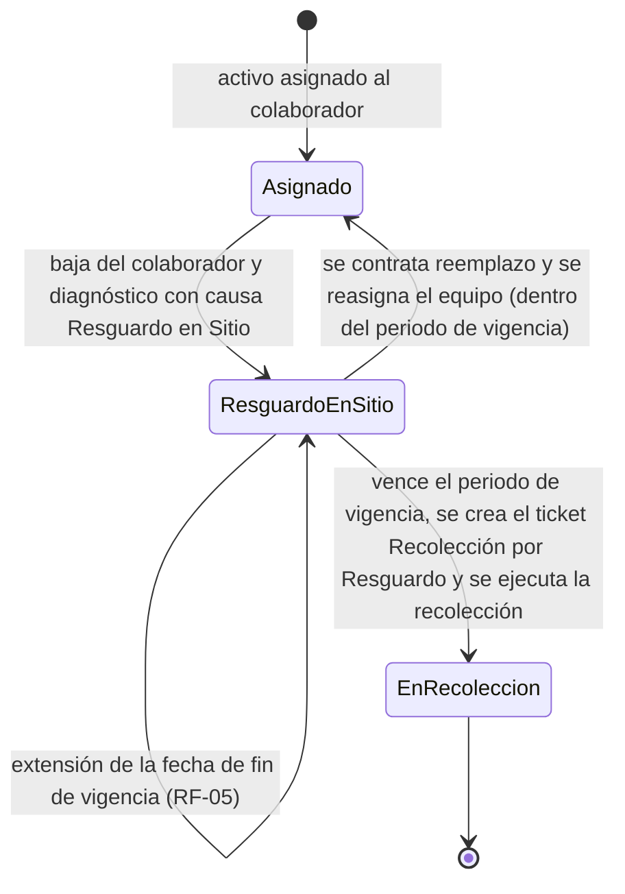
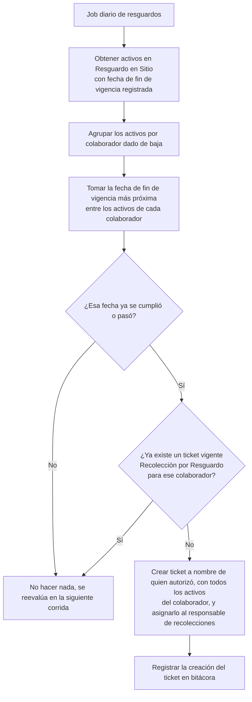
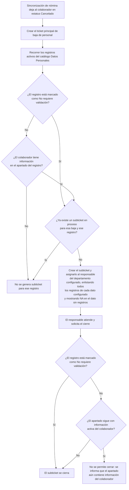

# Requerimientos Funcionales — Vigencia del Resguardo en Sitio y Recolección Automática de Activos

| Campo   | Valor                                                  |
|---------|--------------------------------------------------------|
| Versión | 1.14                                                   |
| Fecha   | 2026-08-28                                             |
| Estado  | Definición                                             |
| Módulo  | Innovación & Negocios — Cómputo / Activos de Cómputo    |
| Autor   | Análisis de Negocio                                    |

---

## 1. Propósito del documento

Cuando un colaborador se da de baja de la empresa —ya sea por despido o por decisión propia— el equipo de cómputo que tenía asignado no siempre se recolecta de inmediato: se deja **en resguardo en sitio**, bajo la custodia de una persona del mismo centro de trabajo, previendo que se contrate un reemplazo al que se le asignará ese mismo equipo. Ese resguardo tiene un **periodo de vigencia** definido por el negocio (por ejemplo, 15 días). Hoy, cuando ese periodo se vence sin que llegue un reemplazo, nadie genera la solicitud de recolección: el activo se queda indefinidamente fuera del almacén, sin responsable formal de recuperarlo y sin visibilidad para el área de Cómputo.

La baja del colaborador, además, deja pendientes que no tienen que ver con el equipo físico: la reserva de IP que tenía apartada sigue ocupada, sus activos de telefonía siguen registrados a su nombre en el control interno del área, su equipo sigue reportando al monitoreo de antivirus y su HostName sigue habilitado en el directorio activo. El sistema ya sabe generar subtickets al detectar una baja de nómina y dirigirlos al departamento que corresponde, pero los condiciona a la información capturada en el expediente del colaborador: si el apartado viene vacío el subticket no se abre, y mientras conserve información el subticket no se puede cerrar. Esas revisiones se resuelven en herramientas externas a Business Suite, donde esa condición estorba en los dos extremos. Lo que falta, entonces, es **configurar** esas revisiones —dos subtickets, porque la telefonía y la reserva de IP se atienden juntas y la desactivación del HostName viaja en el subticket que ya se detona para la baja de Directorio Activo— y poder marcarlas como **"No requiere validación"**: que se detonen siempre, esté o no capturado el dato, y que se cierren sin exigir que el expediente esté depurado.

Este documento describe los siete requerimientos funcionales necesarios para cerrar esos huecos:

- **RF-01 — Configuración de los subtickets automáticos por baja de personal**, que deja operando dos revisiones nuevas —activos de telefonía y datos del directorio telefónico junto con la reserva de la dirección IP, en un solo subticket; y remoción del monitoreo de antivirus— mediante el alta de registros en el catálogo "Datos Personales", ajusta el asunto del subticket que ya se detona para la baja de los directorios activos para que declare también la desactivación del HostName, y agrega en ese catálogo el campo **"No requiere validación"**: los registros marcados se detonan siempre y se cierran sin validar la información del colaborador. El mecanismo queda abierto para configurar después cualquier otra revisión que deba generarse al registrar una baja, sin desarrollo.

- **RF-02 — Parametrización de la vigencia del resguardo**, que hace administrable la cantidad de días que un activo puede permanecer en resguardo en sitio, sin requerir cambios de desarrollo.
- **RF-03 — Registro de las fechas de vigencia del resguardo**, que garantiza que todo activo que entra en resguardo quede con su fecha de inicio y su fecha de fin de vigencia guardadas desde el primer momento.
- **RF-04 — Generación automática del ticket "Recolección por Resguardo"**, que al vencer el periodo de vigencia crea de manera desatendida un ticket de recolección por colaborador, con el detalle de todos sus equipos en resguardo, y lo asigna al personal y departamento encargados de recolectar activos.
- **RF-05 — Extensión de la vigencia del resguardo**, que permite mover hacia adelante la fecha de fin de vigencia de los equipos de un colaborador seleccionando la nueva fecha en un calendario, cuando el negocio necesita conservarlos más tiempo en sitio, sin detener ni alterar el resto del proceso.
- **RF-06 — Bloque "Resguardo" en la pantalla del activo**, que concentra en un solo lugar la información del resguardo —responsable, quién autorizó, fecha de inicio y fecha de fin de vigencia— y desde donde se extiende su vigencia.
- **RF-07 — Días restantes de resguardo en el listado de activos**, que agrega al inventario una columna con los días que le quedan de resguardo a cada equipo, para detectar los próximos a vencer sin abrir activo por activo.

El objetivo es que cualquier persona del negocio entienda, sin consultar otro documento, qué subtickets nacen al registrar una baja de personal, cuáles están marcados como "No requiere validación" —y por lo tanto se detonan siempre y se cierran sin revisar el expediente—, cómo agregar otros después sin desarrollo, cuándo un activo en resguardo está por vencer, qué pasa el día del vencimiento, cómo se gana tiempo cuando se necesita y cómo se detiene el proceso si el equipo se reasigna antes de esa fecha.

## 2. Alcance del documento

**Incluye:**
- La configuración, en el catálogo "Datos Personales", de los **dos** subtickets que el sistema debe generar automáticamente al registrar la baja de un colaborador —revisión de activos de telefonía y datos del directorio telefónico junto con la reserva de la dirección IP, en un solo subticket; y remoción del monitoreo de antivirus—, cada uno con su departamento destino, su asunto y los datos del colaborador que debe transcribir al subticket: Dirección IP y HostName en el primero, Usuario de Directorio Activo y Host Name en el segundo. En los tres asuntos —los dos nuevos y el ajustado— el listado enlista **todos** los registros que el colaborador tenga de cada dato —en el caso de la IP, todos los activos que cuenten con una, con nombre del activo e IP— y muestra **NA** cuando no tenga ninguno. Se incluye además el **ajuste del asunto del subticket ya existente de baja de los directorios activos**, que pasa a declarar también la desactivación del HostName y a transcribir el nombre del equipo del colaborador, sin que esa desactivación requiera un registro propio. La lista es la del arranque, no un límite: el mismo catálogo permite configurar después cualquier otra revisión que deba detonarse al registrar una baja.
- El campo **"No requiere validación"** en ese mismo catálogo, que se marca por registro. Los registros **marcados** generan su subticket **siempre** —sin evaluar el expediente del colaborador— y lo **cierran sin validación**. Los dos subtickets del arranque se dan de alta con esa marca puesta; los registros sin marcar —entre ellos el de baja de Directorio Activo— conservan el comportamiento actual.
- La configuración administrable de los **días de vigencia del resguardo en sitio**, única variable de sistema que este documento da de alta.
- El registro en el activo de la fecha de inicio y la fecha de fin de vigencia del resguardo.
- La creación automática y desatendida (job programado) del ticket de recolección identificado como **"Recolección por Resguardo"**, generado **uno por colaborador dado de baja**, que nace en estatus **En Proceso** y lleva en su detalle todos los activos que el colaborador tenía asignados antes de su baja, a nombre de quien autorizó el resguardo y asignado al responsable de recolecciones.
- La opción de **extender la vigencia** del resguardo de un colaborador **seleccionando la nueva fecha de fin de vigencia en un calendario**, que se aplica a todos sus activos en resguardo, **restringida por un permiso propio**, con validación de la fecha mínima permitida, motivo obligatorio y registro en bitácora.
- Un **bloque "Resguardo" en la pantalla del activo**, visible solo cuando el equipo está en resguardo, que reúne la información del resguardo y desde el cual se extiende su vigencia.
- Una **columna de días restantes de resguardo en el listado principal de activos**, que se llena únicamente cuando el equipo está en resguardo en sitio.
- Las condiciones que interrumpen el proceso: reasignación del equipo a un nuevo colaborador, recolección anticipada, baja o cancelación del activo.
- El registro en bitácora de las extensiones otorgadas y del ticket generado automáticamente.

**No incluye:**
- Un flujo de prórroga con solicitud y autorización: la extensión de la fecha es una acción directa del rol facultado, sin cadena de aprobaciones.
- El tratamiento de los resguardos que ya estaban en curso antes de la puesta en marcha de esta funcionalidad; esos activos quedan sin fecha de fin de vigencia registrada y, por eso, fuera del proceso automático (RN-4.2, RN-4.16 y SUP-09).
- El proceso operativo de recolección física del activo (levantamiento, traslado, entrada a almacén, responsiva), que continúa operando con la funcionalidad ya existente de recolección de activos.
- El flujo de baja del colaborador vía nómina y el **mecanismo** que genera el ticket principal y sus subtickets, que ya existen y no se modifican: RF-01 únicamente da de alta dos registros nuevos en el catálogo que gobierna ese mecanismo, ajusta el mensaje de un registro ya existente —el de baja de Directorio Activo— y agrega el campo "No requiere validación", que exenta de la validación al generar y al cerrar. Para los requerimientos de resguardo, el documento parte de que el activo ya quedó en estatus **Resguardo en Sitio**.
- El contenido operativo de las revisiones nuevas —cómo se libera una reserva de IP, cómo se remueve el agente de antivirus, cómo se desactiva un HostName en el directorio activo o cómo se coteja el control interno de telefonía—, que se ejecuta en las herramientas de cada especialidad y no dentro de Business Suite.
- La reasignación del equipo al nuevo colaborador, que se ejecuta con la funcionalidad de asignación/reasignación ya existente.
- Nuevos estatus para el activo o para el ticket: este requerimiento reutiliza los estatus vigentes.

## 3. Actores y roles

| Actor / Rol | Descripción |
|-------------|-------------|
| Administrador del sistema | Mantiene la configuración del sistema: los subtickets que se generan al registrar una baja de personal —con su departamento destino, los datos que transcriben y la marca "No requiere validación"— y los **días de vigencia del resguardo en sitio**. |
| Coordinación de Redes y Telecomunicaciones | Departamento al que se dirigen los dos subtickets nuevos: el de revisión de activos de telefonía y baja de la reserva de IP y el de remoción del monitoreo de antivirus. |
| Responsable del subticket de baja de Directorio Activo | Juan Carlos Segovia Espinoza, responsable del departamento configurado en ese registro, que atiende la baja de los directorios activos del colaborador y, con el ajuste que introduce RF-01, la desactivación del HostName de su equipo. |
| Responsable del subticket de baja | Colaborador del departamento destino que atiende y cierra el subticket generado automáticamente al registrarse la baja. |
| Personal que resguarda | Colaborador del centro de trabajo que quedó como custodio físico del equipo mientras está en resguardo en sitio. |
| Responsable de recolecciones | Persona del departamento encargado de recolectar activos, a quien se asigna el ticket "Recolección por Resguardo". |
| Quien autoriza el resguardo | Persona que aprobó que el equipo permaneciera en sitio tras la baja del colaborador. El ticket de recolección se genera a su nombre como solicitante. |
| Departamento encargado de recolecciones | Área responsable de ejecutar las recolecciones de activos de cómputo; recibe y opera el ticket generado. |
| Coordinador / Jefe de Cómputo | Da seguimiento a los activos en resguardo y decide si se reasigna el equipo o se procede a recolectarlo. |
| Colaborador dado de baja | Persona que causó baja por despido o decisión propia y que tenía asignado el activo; no participa en el proceso, es el origen del resguardo. |
| Sistema (proceso automático / job) | Proceso desatendido que evalúa diariamente los resguardos vigentes y crea el ticket de recolección al vencimiento. |

## 4. Glosario

| Término / Sigla | Definición |
|-----------------|------------|
| Baja de usuario | Terminación de la relación laboral de un colaborador, por despido o por decisión propia, que llega al sistema a través de la sincronización de nómina y deja al colaborador en estatus Cancelado. |
| Resguardo en sitio | Situación en la que, tras la baja de un colaborador, su equipo de cómputo no se recolecta y permanece físicamente en el centro de trabajo bajo la custodia de una persona designada, a la espera de un posible reemplazo. Corresponde al estatus **Resguardo en Sitio** del activo. |
| Fecha de resguardo (inicio de vigencia) | Fecha en que el activo quedó formalmente en resguardo en sitio. Es el punto de partida de la vigencia y se registra en el momento en que el activo entra en resguardo. |
| Días de vigencia del resguardo | Cantidad de días naturales, configurable en una variable del sistema, que un activo puede permanecer en resguardo en sitio antes de que deba recolectarse. El valor lo define el negocio al configurar; en los ejemplos de este documento se usan 15 días. Cuando el documento habla del "periodo de vigencia" se refiere a este plazo. |
| Fecha de fin de vigencia del resguardo | Fecha límite del resguardo. **Es un dato que se guarda en el activo**, no un cálculo que se rehace cada vez: se registra al iniciar el resguardo sumando a la fecha de resguardo los días de vigencia configurados, y solo cambia si se otorga una extensión. Es la fecha contra la que se evalúa el vencimiento y se genera la recolección. |
| Extensión del resguardo | Acción que mueve hacia adelante la fecha de fin de vigencia del resguardo de un colaborador, seleccionando la nueva fecha en un calendario y aplicándola a todos sus activos en resguardo, para conservarlos más tiempo en sitio. La nueva fecha solo puede ser posterior a la vigente y al día actual. No requiere autorización de un tercero, pero exige capturar un motivo y queda registrada en la bitácora del activo. |
| Recolección por Resguardo | Motivo con el que se identifica el ticket que el sistema crea automáticamente al vencer el periodo de vigencia, para recuperar los equipos de un colaborador que quedaron en resguardo en sitio y no fueron reasignados. Se genera **un ticket por colaborador**, en estatus En Proceso y con todos los activos que ese colaborador tenía asignados antes de su baja en el detalle. |
| Autorizador del resguardo | Persona que aprobó el resguardo en sitio y que figura como solicitante del ticket de recolección. Se toma del registro de autorización del resguardo. |
| Ticket interno | Registro de atención del área de Cómputo que se genera dentro del sistema (no lo levanta el usuario final) y que se asigna a un responsable para su ejecución. |
| Job | Proceso automático que el sistema ejecuta de forma periódica y desatendida, sin que ninguna persona lo dispare. |
| Variable de sistema | Parámetro administrable, identificado por una clave, que el negocio puede modificar desde la configuración del sistema sin requerir despliegue de código. |
| Activo de cómputo | Equipo inventariado del área de Cómputo (laptop, desktop, monitor, periférico) identificado por etiqueta de activo y número de serie. |
| Subticket de baja de personal | Ticket interno que el sistema genera automáticamente al detectar la baja de un colaborador, colgado del ticket principal de esa baja y dirigido al departamento que debe atender una revisión concreta. Cada uno nace de un registro del catálogo "Datos Personales"; si ese registro está marcado como "No requiere validación" se genera siempre, y si no lo está, solo cuando el colaborador tiene información en el apartado configurado. |
| Catálogo "Datos Personales" | Catálogo de configuración donde cada registro define un subticket de baja de personal: el departamento destino, el apartado del expediente del colaborador asociado a la revisión, los datos de ese apartado que se transcriben al subticket, el mensaje con el que nace y si está marcado como "No requiere validación". Es el catálogo desde el que se configuran —sin desarrollo— todos los subtickets que se detonan al registrar una baja, los del arranque y los que el negocio agregue después. |
| Validación de información | Condición que el sistema aplica sobre el apartado configurado en el registro, en dos momentos: al **generar** el subticket, que solo nace si el colaborador tiene información ahí, y al **cerrarlo**, que se impide mientras el colaborador conserve información activa. Es la validación de la que quedan exentos los registros marcados como "No requiere validación". |
| No requiere validación | Campo del catálogo "Datos Personales" que se marca por registro. **Marcado**, el subticket se detona en toda baja y se cierra sin revisar el apartado del colaborador. **Sin marcar** —que es como nace—, el subticket conserva el comportamiento condicionado de siempre. |
| Reserva de IP | Dirección IP apartada en la red para el equipo de un colaborador. Al causar baja el colaborador, la reserva debe liberarse para que la dirección vuelva a estar disponible. |
| Dirección IP | Dirección de red registrada al equipo de cómputo del colaborador. Es uno de los dos datos que lleva el subticket de revisión de activos de telefonía y baja de la reserva de IP, y con ella el responsable identifica en la red la reserva que debe liberar. Un colaborador puede tener varios activos con dirección IP: el subticket los enlista todos, con el nombre del activo y su IP, y muestra NA si no tiene ninguno (RN-1.21, RN-1.22). |
| HostName | Nombre con el que el equipo del colaborador está registrado en la red y en el directorio activo. |
| Directorio Activo | Servicio de directorio donde se administran los usuarios y equipos de la empresa; conserva el usuario y el equipo del colaborador hasta que se desactivan. |
| Usuario de Directorio Activo | Cuenta con la que el colaborador está registrado en el directorio activo. Es uno de los dos datos que lleva el subticket de remoción del monitoreo de antivirus, y con ella el responsable localiza el equipo en la consola del antivirus. |
| Monitoreo de antivirus | Consola de administración del antivirus donde el equipo del colaborador aparece registrado y reportando; al causar baja, el equipo debe removerse de ese monitoreo. |
| Directorio telefónico | Registro interno de extensiones y activos de telefonía asignados a cada colaborador, que el área de Redes y Telecomunicaciones coteja contra su control interno al registrarse una baja. |

## 5. Entidad a la que aplica

Este documento aplica sobre dos entidades distintas, según el requerimiento.

RF-01 aplica sobre el **registro de configuración del catálogo "Datos Personales"** y sobre el **subticket de baja de personal** que ese registro produce. Para el registro de configuración, el **estatus inicial** es Activo desde su alta y su **estatus terminal** es Baja, cuando el negocio decide que ese subticket deje de generarse. Para el subticket, el estatus inicial es el estatus con el que nacen los subtickets de baja de personal (En Proceso) y el terminal es Finalizado o Cancelado, conforme al flujo de tickets internos ya existente. La marca "No requiere validación" no cambia esos estatus: cambia únicamente si el subticket llega a existir y qué exige el sistema para llevarlo al estatus terminal.

Los requerimientos RF-02 a RF-07 aplican sobre el **activo de cómputo** que quedó en resguardo en sitio como consecuencia de la baja de un colaborador, y producen como resultado un **ticket interno de cómputo** con motivo "Recolección por Resguardo", que se genera **uno por colaborador dado de baja**, nace en estatus En Proceso y reúne en su detalle todos los activos que ese colaborador tenía asignados antes de su baja.

Para el activo, el **estatus inicial** que activa este proceso es **Resguardo en Sitio**, acompañado de dos fechas que definen la vigencia del resguardo: la **fecha de resguardo**, que marca el inicio, y la **fecha de fin de vigencia**, que marca el límite. Ambas se registran en el activo en el momento en que entra en resguardo: la primera con la fecha del día y la segunda sumándole los días de vigencia configurados. El proceso descrito termina cuando el activo sale de ese estatus, ya sea porque se reasignó a un nuevo colaborador (**Asignado**) o porque entró al proceso de recolección (**En Recolección**) derivado del ticket generado.

Guardar la fecha de fin de vigencia en lugar de recalcularla en cada ejecución tiene una consecuencia deliberada: **cada resguardo conserva las condiciones con las que nació**. Si mañana el negocio cambia la vigencia de 15 a 20 días, los resguardos que ya estaban en curso mantienen la fecha que se les registró, y el nuevo valor aplica solo a los resguardos que inicien a partir de ese cambio.

Para el ticket, el **estatus inicial** es el estatus con el que nacen los tickets internos generados por el sistema (En Proceso, con estatus interno Recibido) y su **estatus terminal** es Finalizado o Cancelado, conforme al flujo de tickets internos ya existente.

### Visión general del flujo

El siguiente diagrama muestra el ciclo de vida del activo desde la baja del colaborador hasta la recolección o la reasignación:



Y este diagrama muestra la decisión que ejecuta el proceso automático cada vez que corre:



## 6. Índice de requerimientos

> **Navegación rápida:** cada identificador RF en la primera columna es un enlace que lleva directamente al detalle del requerimiento. Hacer clic para ir al RF.

| RF | Título | Sistema | Aplica a |
|----|--------|---------|----------|
| [RF-01](#rf-01) | Configuración de los subtickets automáticos por baja de personal | Business Suite | Tickets Internos / Configuración |
| [RF-02](#rf-02) | Parametrización de la vigencia del resguardo | Business Suite | Transversal / Configuración |
| [RF-03](#rf-03) | Registro de las fechas de vigencia del resguardo | Business Suite | Activos de Cómputo |
| [RF-04](#rf-04) | Generación automática del ticket "Recolección por Resguardo" | Business Suite | Activos de Cómputo / Tickets Internos |
| [RF-05](#rf-05) | Extensión de la vigencia del resguardo | Business Suite | Activos de Cómputo |
| [RF-06](#rf-06) | Bloque "Resguardo" en la pantalla del activo | Business Suite | Activos de Cómputo |
| [RF-07](#rf-07) | Días restantes de resguardo en el listado de activos | Business Suite | Activos de Cómputo |

---
---

<a id="rf-01"></a>
# RF-01 — Configuración de los Subtickets Automáticos por Baja de Personal

| Campo        | Valor      |
|--------------|------------|
| Prioridad    | Must       |
| Estado       | Definición |
| Dependencias | Ninguna    |

## Objetivo

Permitir que el negocio configure, desde el catálogo "Datos Personales" y sin desarrollo, qué revisiones deben generar un subticket al registrarse la baja de un colaborador, y marcar en cada una si **no requiere validación**. Las revisiones marcadas se detonan **siempre**, sin evaluar el expediente del colaborador, y se cierran sin exigir que ese expediente esté depurado. Con ese mecanismo se dejan operando las dos revisiones que el negocio requiere hoy —activos de telefonía y datos del directorio telefónico junto con la reserva de la dirección IP, en un solo subticket; y remoción del monitoreo de antivirus—, se ajusta el asunto del subticket que ya se detona para la baja de los directorios activos para que declare también la desactivación del HostName, y queda abierta la puerta para agregar después cualquier otra revisión sin volver a desarrollar.

## Descripción

El sistema **ya cuenta con el mecanismo** que atiende la baja de un colaborador: cuando la sincronización de nómina deja al colaborador en estatus Cancelado, un proceso automático crea el **ticket principal** de baja de personal y, colgado de él, un subticket por cada registro activo del catálogo "Datos Personales". Cada registro de ese catálogo describe una revisión: a qué departamento se dirige, qué apartado del expediente del colaborador debe revisarse, con qué criterio se consulta ese apartado, qué datos se transcriben al cuerpo del subticket y con qué mensaje nace.

Ese mecanismo es hoy **condicionado en los dos extremos**, y siempre por la misma vía: el criterio de consulta configurado en el registro.

- **Al generar.** El sistema consulta el apartado y crea el subticket **solo si el colaborador tiene información ahí**. Si el apartado viene vacío, la revisión no se abre.
- **Al cerrar.** El sistema vuelve a consultar el mismo apartado y, si el colaborador todavía tiene información activa, **impide el cierre** e informa que el apartado aún contiene información de ese colaborador.

Esa doble condición tiene sentido cuando atender el subticket consiste precisamente en depurar ese apartado dentro de Business Suite —cancelar una cuenta de correo, dar de baja un usuario de directorio activo—: si no hay nada que depurar no hay nada que hacer, y mientras quede algo el trabajo no está terminado.

Pero hay revisiones donde esa lógica se invierte. Liberar una reserva de IP, remover un equipo del monitoreo de antivirus o cotejar el control interno de telefonía son acciones que se ejecutan **en herramientas externas** a Business Suite. Ahí, la información capturada en el expediente no dice si hay trabajo pendiente ni si el trabajo se hizo:

- Que el expediente **no tenga** capturados la Dirección IP, el HostName o el Usuario de Directorio Activo no significa que el equipo no exista en la red: significa que el dato no se registró. La revisión sigue siendo necesaria —y es justo en esos casos donde más falta hace—, pero con la regla actual el subticket nunca se abriría.
- Que el expediente **siga teniendo** esa información después de atender la revisión es lo normal, porque la depuración ocurrió afuera. Con la regla actual el subticket nunca podría cerrarse.

Por eso este requerimiento agrega al catálogo un **campo validador** llamado **"No requiere validación"**. Es una marca por registro: **los registros marcados no se validan**, ni al generar el subticket ni al cerrarlo. Los que quedan sin marcar conservan exactamente el comportamiento de hoy.

| Estado del campo | Al generar el subticket | Al cerrar el subticket |
|---|---|---|
| **Sin marcar** (valor por omisión) | Se genera **solo si** el colaborador tiene información en el apartado configurado. Es el comportamiento actual. | Se reevalúa el apartado y, si el colaborador conserva información activa, se impide el cierre. Es el comportamiento actual. |
| **Marcado** — "No requiere validación" | Se genera **siempre**, en toda baja de personal, sin evaluar el apartado ni el criterio de consulta. | Se cierra sin reevaluar el apartado, aunque el colaborador conserve información activa ahí. |

Que el valor por omisión sea "sin marcar" es deliberado: al liberarse la funcionalidad, ningún registro existente cambia de comportamiento. Solo se comporta distinto aquello que el administrador marca expresamente.

El campo es **configuración, no desarrollo**. Las revisiones que el negocio requiere hoy se resuelven dando de alta **dos** registros con "No requiere validación" **marcado** —más el ajuste del mensaje del registro ya existente de baja de Directorio Activo, que también es configuración—, y **cualquier revisión futura** que deba detonarse siempre —hoy no identificada— se resolverá dando de alta un registro más con esa misma marca, sin código y sin liberación. Lo único que este requerimiento desarrolla es el campo y el efecto que tiene sobre la generación y sobre el cierre.

### Información / atributos

Estos son los datos que componen cada registro de configuración del catálogo "Datos Personales". Todos existen hoy salvo el campo **"No requiere validación"**, que es el único elemento nuevo del requerimiento.

| Campo | Obligatorio | Descripción |
|---|---|---|
| Nombre | Sí | Nombre de la revisión, con el que el subticket se identifica ante el responsable que lo atiende y con el que aparece en el mensaje de la validación al cierre. |
| Clave | Sí | Identificador corto del registro. No es editable después del alta. |
| Departamento | Sí | Departamento al que se dirige el subticket. Debe estar activo y contar con un responsable asignado, porque es a ese responsable a quien se asigna el subticket. |
| Apartado del expediente | Sí | Apartado de información del colaborador asociado a la revisión. Es el origen de los datos que se transcriben al subticket y, **cuando el registro no está marcado**, el que se consulta para decidir si el subticket se genera y para reevaluarlo al cierre. |
| Datos que se transcriben al subticket | Sí | Lista de los datos de ese apartado que el sistema copia al cuerpo del subticket, para que el responsable no tenga que buscarlos en otra pantalla. De cada dato se transcriben **todos** los registros que el colaborador tenga en el apartado y, cuando no tenga ninguno, el renglón se llena con **NA**, esté el registro marcado o no (RN-1.21, RN-1.22). |
| Mensaje del subticket | Sí | Texto con el que nace el subticket, en el que el sistema intercala el nombre del colaborador dado de baja, su RFC y los datos transcritos. |
| Criterio de consulta | Sí | Condición con la que el sistema obtiene del apartado la información del colaborador dado de baja. **Cuando el registro no está marcado**, es la condición que decide la generación y la que se reevalúa al cierre; cuando está marcado, se usa únicamente para transcribir los datos disponibles. |
| **No requiere validación** | No | **Campo nuevo.** Marca que exenta al subticket de la validación de información. **Marcado**, el subticket se detona siempre y se cierra sin validar el apartado. **Sin marcar**, el comportamiento es el actual: se genera solo si el colaborador tiene información ahí y no se puede cerrar mientras la conserve. Nace **sin marcar**, para que los subtickets ya configurados conserven su comportamiento. |
| Estatus | Sí | Activo o Baja. Solo los registros activos generan subtickets nuevos. |

### Configuraciones requeridas

Las altas que el negocio requiere hoy en el catálogo son **dos**, y ninguna implica desarrollo: son registros de configuración, y las dos se dan de alta con **"No requiere validación" marcado**, de modo que se detonen en toda baja y puedan cerrarse sin validación. A ellas se suma un **ajuste** —también de configuración— sobre un registro que ya existe, el de la baja de Directorio Activo, que se describe más abajo.

| # | Subticket que se genera al registrar la baja | Departamento asignado | Datos que debe incluir el subticket | No requiere validación |
|---|---|---|---|---|
| 1 | Revisión de activos de telefonía y datos del directorio telefónico, y reserva de la dirección IP del equipo del colaborador | Coordinación de Redes y Telecomunicaciones | Dirección IP —**todos** los activos del colaborador que tengan IP, con nombre del activo e IP— y HostName —**todos** los que tenga registrados—. Si no tiene ninguno, **NA** | Marcado |
| 2 | Remoción del monitoreo de antivirus del equipo del colaborador | Coordinación de Redes y Telecomunicaciones | Usuario de Directorio Activo y Host Name —**todos** los que tenga registrados—. Si no tiene ninguno, **NA** | Marcado |

**Asunto con el que nace cada subticket.** Cada registro se da de alta con el texto que se muestra a continuación, tal como el negocio lo definió. Los espacios entre llaves `{ }` los sustituye el sistema al generar el subticket: el primero con el **nombre del colaborador** dado de baja, el segundo con su **RFC**, y los del bloque **LISTADO** con los datos configurados en "datos que se transcriben al subticket". El listado no se captura renglón por renglón: el sistema lo arma solo con la información del apartado del expediente, y la etiqueta de cada renglón es el nombre del dato configurado.

**El listado es completo o dice NA.** El parámetro de cada renglón del bloque LISTADO no se llena con un solo valor: el sistema lo llena con **todos** los registros que el colaborador tenga de ese dato y, cuando no tiene ninguno, con la leyenda **NA**. En concreto, y para los tres asuntos de este requerimiento:

- **Dirección IP.** El renglón se llena con **todos los activos del colaborador que cuenten con una dirección IP**, indicando de cada uno el **nombre del activo y su IP**, para que el responsable sepa a qué equipo pertenece cada reserva que debe liberar. Si el colaborador **no tiene ningún activo con IP**, el renglón se llena con **NA**.
- **HostName.** El renglón se llena con **todos los HostName** que el colaborador tenga registrados. Si no tiene ninguno, con **NA**.
- **Directorio Activo.** El renglón se llena con **todos los usuarios de directorio activo** que el colaborador tenga registrados. Si no tiene ninguno, con **NA**.

El renglón **nunca se omite**: aunque el colaborador no tenga el dato, el subticket nace con el renglón y con **NA**, de modo que el responsable distinga "el colaborador no tiene nada registrado" de "el sistema no me mostró el dato". La regla queda formalizada en RN-1.21 y RN-1.22, y **no cambia la captura del asunto**: las plantillas se dan de alta tal como el negocio las definió, con un `{ }` por renglón.

| # | Subticket | Responsable que lo atiende |
|---|---|---|
| 1 | IP y Activos de telefonía | Víctor Hugo Gómez Aguiluz |
| 2 | Remoción de Antivirus | Cesar Rafael Figueroa López |
| 3 | Baja de Directorio Activo — registro ya existente, del que solo se ajusta el asunto | Juan Carlos Segovia Espinoza |

**1. IP y Activos de telefonía** — asignado a Víctor Hugo Gómez Aguiluz:

```text
BUEN DÍA, SE NOTIFICA BAJA DE PERSONAL CON NOMBRE: { } Y RFC: { } EN NÓMINA DE RECURSOS HUMANOS, ES NECESARIO REALIZAR LA REVISIÓN DE ACTIVOS DE TELEFONÍA Y DATOS DEL DIRECTORIO TELEFÓNICO, ASÍ COMO LA RESERVA DE LA DIRECCIÓN IP.
LISTADO:
IP: { }
HostName: { }
```

**2. Remoción de Antivirus** — asignado a Cesar Rafael Figueroa López:

```text
BUEN DÍA, SE NOTIFICA BAJA DE PERSONAL CON NOMBRE: { } Y RFC: { } EN NÓMINA DE RECURSOS HUMANOS, ES NECESARIO REALIZAR LA REMOCIÓN DEL MONITOREO DEL ANTIVIRUS.
LISTADO:
DirectorioActivo: { }
HostName: { }
```

**3. Baja de Directorio Activo** — asignado a Juan Carlos Segovia Espinoza. Es el registro que ya existe y del que únicamente se ajusta el asunto:

```text
BUEN DÍA, SE NOTIFICA BAJA DE PERSONAL CON NOMBRE: { } Y RFC: { } EN NÓMINA DE RECURSOS HUMANOS, ES NECESARIO REALIZAR LA BAJA DE LOS DIRECTORIOS ACTIVOS Y DESACTIVACIÓN DE HOSTNAME.
LISTADO:
NombreEquipo: { }
DirectorioActivo:  { }
```

**Qué llega en el parámetro de cada renglón.** El asunto se captura tal como está arriba: cada `{ }` es un parámetro que el sistema llena al generar el subticket, y es ahí donde aplican las reglas de enlistado y de NA —no se capturan renglones adicionales en la plantilla—. En el renglón de **IP** el parámetro se llena con **todos los activos del colaborador que cuenten con una dirección IP**, indicando de cada uno el **nombre del activo y su IP**; en los de **HostName** y **DirectorioActivo**, con **todos** los que el colaborador tenga registrados. Cuando el colaborador no tiene ningún registro de ese dato, el parámetro se llena con **NA** y el renglón se conserva en el asunto.

En el tercer subticket, el renglón de **NombreEquipo** se captura una sola vez, igual que los demás: un colaborador puede tener más de un equipo registrado en el directorio activo y el responsable debe verlos todos, pero eso lo resuelve el parámetro al enlistarlos, no la captura de renglones repetidos. Son esos nombres de equipo los que indican sobre qué HostName aplica la desactivación que el asunto declara. La regla de NA aplica dato por dato también aquí: si el colaborador tiene usuario de directorio activo pero ningún equipo registrado, el renglón de NombreEquipo se llena con **NA**. Lo que no cambia en ese tercer subticket es su condición de generación —al no estar marcado como "No requiere validación", solo nace cuando el colaborador tiene información en el apartado de Directorio Activo (RGO-13)—: el **NA** describe cómo se llena un dato sin registros, no sustituye esa validación.

**El subticket se asigna al responsable del departamento configurado en el registro.** Ese responsable es un dato administrable del catálogo de departamentos, de modo que para que cada uno de los tres subtickets llegue a la persona indicada arriba basta con que el departamento capturado en su registro tenga configurada a esa persona como responsable, conforme a SUP-24.

La revisión de los activos de telefonía y la baja de la reserva de IP se resuelven en **un solo subticket** y no en dos: ambas se dirigen al mismo departamento, se resuelven sobre el mismo equipo del colaborador y las atiende la misma persona en la misma sesión de trabajo. Separarlas duplicaba el trámite sin agregar control, y obligaba a cerrar dos tickets por un trabajo que se hace de una vez. El subticket declara las dos acciones en su mensaje, y su cierre da por atendidas ambas. La remoción del monitoreo de antivirus, en cambio, queda como subticket propio: se ejecuta en la consola del antivirus y se coteja contra el usuario de Directorio Activo del colaborador, no contra su dirección de red.

**Los datos de cada registro provienen de un solo apartado del expediente**, que es lo que el catálogo admite —un registro apunta a un apartado y transcribe los datos de ese apartado—. En el registro 1, la Dirección IP y el HostName se toman del apartado de direcciones IP del activo de cómputo del colaborador, donde el HostName corresponde al nombre de red del equipo. En el registro 2, el Usuario de Directorio Activo y el Host Name se toman del apartado de Directorio Activo. Esa correspondencia debe confirmarse con el equipo de desarrollo antes de capturar los registros, conforme a SUP-18: de ella depende que ambos datos de cada subticket puedan transcribirse sin desarrollo. El apartado puede tener **varios registros** para el mismo colaborador —varios activos con IP, varios equipos, varios usuarios de directorio—: el subticket los enlista todos, y cuando el apartado no tiene ninguno el renglón se muestra con **NA** (RN-1.21, RN-1.22).

**Ajuste del subticket de baja de Directorio Activo.** La desactivación del HostName **no se da de alta como registro nuevo**. El sistema ya detona un subticket para la baja de los directorios activos del colaborador, y esa desactivación la atiende el mismo responsable sobre el mismo registro del directorio; por eso lo único que se hace es **ajustar el asunto de ese registro** al texto del punto 3 de arriba, en el que el subticket declara las dos acciones —la baja de los directorios activos y la desactivación del HostName— y transcribe el nombre del equipo junto con el usuario de Directorio Activo, de modo que ambas se atiendan en la misma sesión de trabajo. Ese registro conserva su departamento, su apartado, sus datos a transcribir y su comportamiento de validación actuales: no se marca como "No requiere validación", porque la baja del usuario sí se depura dentro de Business Suite. La consecuencia de esa decisión queda registrada en RGO-13.

Al estar los dos registros nuevos marcados, sus subtickets nacen en **toda** baja de personal, tenga o no el colaborador su Dirección IP, su HostName o su Usuario de Directorio Activo capturados en el expediente —cuando no los tiene, el listado del asunto muestra **NA** en el renglón correspondiente—. Nacen colgados del ticket principal de la baja, en la misma corrida del proceso automático y junto con los subtickets que estén configurados sin la marca —entre ellos el de baja de Directorio Activo—. Ninguno depende del cierre de otro: se abren todos a la vez y cada responsable atiende el suyo por su cuenta.

Esta lista es la del arranque, no un límite: si mañana el negocio identifica otra revisión que deba detonarse en toda baja —de sistemas, de accesos físicos, de licencias—, se resuelve con un registro más en este mismo catálogo y la marca puesta, sin desarrollo.

### Operaciones

El administrador del sistema deberá poder:
- Dar de alta un registro de configuración con todos sus datos, marcando o no "No requiere validación".
- Consultar y editar los registros existentes, incluido poner o quitar la marca en un registro ya configurado.
- Dar de baja un registro para que deje de generar subtickets nuevos, sin afectar los subtickets ya generados.
- Consultar la bitácora de cambios de cada registro.

### Diseño UX/UI

El campo se presenta en la pantalla del catálogo "Datos Personales" como una casilla de verificación etiquetada **"No requiere validación"**, dentro del mismo bloque donde se capturan el departamento y el apartado del expediente, acompañada de una leyenda que explique su doble efecto: "Al marcarla, el subticket se genera en toda baja aunque el colaborador no tenga información en el apartado, y se cierra sin volver a revisarlo". La casilla aparece **desmarcada** al dar de alta un registro. El listado del catálogo deberá mostrar el campo como una columna más, para que el administrador distinga de un vistazo qué revisiones se detonan siempre y cuáles están condicionadas. No se agregan pantallas nuevas ni se modifica la pantalla del subticket.

### Visión general del flujo

El siguiente diagrama muestra qué hace el proceso automático con cada registro del catálogo cuando detecta una baja de personal, y cómo la misma marca gobierna la generación y el cierre:



---

## HU-1.1 — Configuración de los subtickets que se generan al registrar una baja

Como administrador del sistema, quiero configurar en el catálogo "Datos Personales" los subtickets que deben generarse automáticamente al registrarse la baja de un colaborador, marcando en cada uno si no requiere validación, para que las revisiones de telefonía y reserva de IP y de remoción del monitoreo de antivirus —y las que el negocio agregue después— lleguen al departamento que las atiende sin depender de que alguien las recuerde ni de una liberación de desarrollo.

### Reglas de negocio

**RN-1.1** Cada revisión que deba generar un subticket al registrarse una baja de personal deberá existir como un registro propio y activo del catálogo "Datos Personales"; ninguna de estas revisiones deberá quedar fija en código, de modo que el negocio pueda agregar, modificar o retirar revisiones sin desarrollo.

**RN-1.2** El departamento destino de cada registro deberá estar activo y contar con un responsable asignado, porque el subticket se asigna a ese responsable; si no cumple ambas condiciones, la configuración no podrá guardarse.

**RN-1.3** Cada registro deberá dirigirse al departamento que tenga configurada como responsable a la persona que debe atender su subticket, porque es a ese responsable a quien el sistema lo asigna: el de revisión de activos de telefonía y reserva de la dirección IP a **Víctor Hugo Gómez Aguiluz** y el de remoción del monitoreo de antivirus a **Cesar Rafael Figueroa López**, ambos de **Coordinación de Redes y Telecomunicaciones**. La desactivación del HostName no se dirige a un departamento propio: se atiende en el subticket ya existente de baja de los directorios activos, asignado a **Juan Carlos Segovia Espinoza**, que conserva el departamento que tiene configurado hoy.

**RN-1.4** La revisión de los activos de telefonía y la baja de la reserva de IP deberán resolverse en un **único subticket**, no en dos: ambas se dirigen al mismo departamento y se resuelven sobre el mismo equipo del colaborador. Ese subticket deberá declarar las dos acciones en su mensaje, y su cierre deberá dar por atendidas ambas. La remoción del monitoreo de antivirus deberá quedar como un subticket propio, porque se ejecuta en una consola distinta y se coteja contra otros datos del expediente.

**RN-1.5** El subticket de revisión de activos de telefonía y baja de la reserva de IP deberá incluir en su cuerpo la **Dirección IP** y el **HostName** del colaborador dado de baja; el de remoción del monitoreo de antivirus deberá incluir el **Usuario de Directorio Activo** y el **Host Name**. De cada dato deberán enlistarse **todos** los registros que el colaborador tenga y, cuando no tenga ninguno, deberá mostrarse **NA**, conforme a RN-1.21 y RN-1.22; la ausencia del dato no deberá impedir la generación del subticket, conforme a RN-1.13.

**RN-1.6** La desactivación del HostName **no deberá configurarse como un registro nuevo** del catálogo: del registro ya existente que detona el subticket de baja de los directorios activos únicamente se ajustará el asunto, al texto definido por el negocio, en el que se declaran esa baja y la desactivación del HostName y se transcriben el nombre del equipo del colaborador —donde viaja el HostName— y su usuario de Directorio Activo. Ese registro conservará su departamento, su apartado del expediente, sus datos a transcribir y su comportamiento de validación actuales.

**RN-1.7** El sistema no deberá generar un segundo subticket cuando ya exista uno en proceso para la misma baja, el mismo registro de configuración y el mismo ticket principal, de modo que las corridas sucesivas del proceso automático no produzcan duplicados. Esta regla aplica por igual a los registros marcados y a los que no lo están.

**RN-1.8** Los subtickets deberán nacer colgados del ticket principal de la baja de personal y sin dependencia entre sí: ninguno espera el cierre de otro para abrirse, y la falla de uno no deberá impedir la generación de los demás ni la del ticket principal.

**RN-1.9** Un registro en estatus Baja no deberá generar subtickets nuevos, esté marcado o no; los subtickets ya generados a partir de ese registro se conservan y pueden cerrarse con normalidad.

**RN-1.10** El alta, la edición y la baja de los registros de este catálogo deberán estar restringidas al administrador del sistema y quedar registradas en la bitácora de auditoría, indicando el valor anterior, el valor nuevo, el usuario que hizo el cambio y la fecha y hora en que lo realizó.

**RN-1.11** La puesta en marcha de las dos revisiones del arranque, el ajuste del mensaje del subticket de baja de Directorio Activo y la incorporación de cualquier revisión que el negocio agregue después deberán resolverse por configuración del catálogo, sin desarrollo ni liberación de código. La única excepción es el campo "No requiere validación" que se describe en HU-1.2, que se desarrolla una sola vez y queda disponible para todos los registros, presentes y futuros. Los dos registros nuevos deberán darse de alta con el campo **"No requiere validación" marcado**, de modo que sus subtickets se detonen en toda baja y puedan cerrarse sin validación, conforme a HU-1.2.

**RN-1.21** El listado del asunto deberá mostrar **todos** los registros que el colaborador dado de baja tenga de cada dato configurado, sin límite, de modo que el responsable atienda el inventario completo y no únicamente el primer registro que encuentre el sistema. La regla aplica sobre el **parámetro** que el sistema sustituye al generar el subticket, sin modificar la captura del asunto —cada renglón se captura una sola vez, con su `{ }`—. En particular:

- **Dirección IP:** deberán enlistarse **todos los activos del colaborador que cuenten con una dirección IP**, indicando de cada uno el **nombre del activo y su dirección IP**, para que el responsable identifique a qué equipo corresponde cada reserva que debe liberar.
- **HostName:** deberán enlistarse **todos los HostName** que el colaborador tenga registrados.
- **Usuario de Directorio Activo:** deberán enlistarse **todos los usuarios de directorio activo** que el colaborador tenga registrados.

Esta regla aplica a los tres asuntos del requerimiento —el de IP y activos de telefonía, el de remoción de antivirus y el de baja de Directorio Activo— y a cualquier registro que el negocio configure después con esos datos.

**RN-1.22** Cuando el colaborador **no tenga ningún registro** de un dato configurado —ningún activo con dirección IP, ningún HostName o ningún usuario de directorio activo—, el parámetro de ese renglón deberá llenarse con la leyenda **NA**. El renglón **no deberá omitirse** ni dejarse en blanco, para que el responsable distinga "el colaborador no tiene nada registrado" de "el dato no se transcribió", y el **NA no deberá impedir la generación del subticket** en los registros marcados como "No requiere validación", conforme a RN-1.13. Cada dato se evalúa por separado: un mismo asunto puede llevar varios renglones enlistados en un dato y NA en otro. El **NA** describe únicamente cómo se muestra un dato sin registros y **no modifica las condiciones de generación** de los registros sin marcar, que siguen sujetas a RN-1.15.

### Criterios de Aceptación

**CA-1.1.1 — Alta del subticket de revisión de activos de telefonía y baja de la reserva de IP**
Dado que el administrador ingresa al catálogo "Datos Personales"
Cuando da de alta **un único registro** para la revisión de activos de telefonía y la baja de la reserva de IP, con departamento Coordinación de Redes y Telecomunicaciones, con Dirección IP y HostName como datos a transcribir, con un mensaje que declara las dos acciones y con "No requiere validación" marcado
Entonces el sistema guarda un solo registro en estatus Activo para ambas acciones, y los subtickets que se generen a partir de él enlistarán en su cuerpo todos los activos del colaborador que cuenten con dirección IP —con el nombre del activo y su IP— y todos sus HostName registrados, o la leyenda NA en el dato del que no tenga ninguno.

**CA-1.1.2 — Alta del subticket de remoción del monitoreo de antivirus**
Dado que el administrador da de alta el registro de remoción del monitoreo de antivirus
Cuando lo configura con departamento Coordinación de Redes y Telecomunicaciones, con Usuario de Directorio Activo y Host Name como datos a transcribir y con "No requiere validación" marcado
Entonces el sistema guarda el registro en estatus Activo, y los subtickets que se generen a partir de él enlistarán en su cuerpo todos los usuarios de directorio activo y todos los Host Name que el colaborador tenga registrados, o la leyenda NA en el dato del que no tenga ninguno.

**CA-1.1.3 — Ajuste del subticket existente de baja de Directorio Activo**
Dado el registro ya existente del catálogo que detona el subticket de baja de los directorios activos
Cuando el administrador ajusta su asunto al texto definido por el negocio, en el que se declaran la baja de los directorios activos y la desactivación del HostName, y se transcriben el nombre del equipo y el usuario de Directorio Activo
Entonces el sistema conserva ese registro con su departamento, su apartado y su comportamiento de validación actuales, no se da de alta ningún registro nuevo para la desactivación del HostName, y los subtickets que se generen a partir de ese registro nacen con ese asunto y con el listado de **todos** los equipos y **todos** los usuarios de directorio activo registrados al colaborador, mostrando NA en el dato del que no tenga ningún registro.

**CA-1.1.4 — Generación de los dos subtickets nuevos al registrarse la baja**
Dado que los dos registros nuevos están activos y marcados como "No requiere validación", y un colaborador queda en estatus Cancelado por la sincronización de nómina
Cuando el proceso automático de tickets por baja de personal se ejecuta
Entonces el sistema crea el ticket principal de la baja y, colgados de él, exactamente **dos** subtickets a partir de esos registros —no tres—, ambos asignados al responsable de Coordinación de Redes y Telecomunicaciones, con los datos del colaborador transcritos en su cuerpo y sin dependencia entre ellos ni con los subtickets de los demás registros del catálogo.

**CA-1.1.5 — Alta de una revisión nueva después de la puesta en marcha**
Dado que el negocio identifica una revisión adicional que debe detonarse en toda baja de personal
Cuando el administrador la da de alta como un registro más del catálogo, con su departamento destino y con "No requiere validación" marcado
Entonces el sistema empieza a generar ese subticket en la siguiente baja que se registre, sin desarrollo ni liberación de código.

**CA-1.1.6 — Ejecuciones sucesivas sin subtickets duplicados**
Dado que los dos subtickets nuevos ya se generaron para una baja y siguen en proceso
Cuando el proceso automático se ejecuta de nuevo
Entonces el sistema no crea subtickets adicionales para esa baja y conserva los dos existentes.

**CA-1.1.7 — Validación del departamento destino**
Dado que el administrador selecciona como departamento destino uno que está inactivo o que no tiene responsable asignado
Cuando intenta guardar el registro
Entonces el sistema impide el guardado e informa que el departamento debe estar activo y contar con un responsable.

**CA-1.1.8 — Registro dado de baja**
Dado un registro de configuración que el administrador pasa a estatus Baja y un subticket ya generado a partir de ese registro que sigue en proceso
Cuando el proceso automático se ejecuta para una baja de personal nueva
Entonces no genera subtickets a partir de ese registro, aunque estuviera marcado como "No requiere validación", y el subticket que ya existía se conserva y puede cerrarse con normalidad.

**CA-1.1.9 — Restricción y registro de los cambios de configuración**
Dado un usuario del área de Cómputo sin permiso de administración del sistema
Cuando intenta dar de alta o modificar un registro del catálogo "Datos Personales"
Entonces el sistema se lo impide; y cuando el cambio lo realiza el administrador, la bitácora de auditoría registra el valor anterior, el valor nuevo, el usuario y la fecha y hora del cambio.

**CA-1.1.10 — Listado completo de los activos con IP, de los HostName y de los directorios activos**
Dado un colaborador dado de baja que tiene tres activos asignados, dos de ellos con dirección IP, y dos equipos con HostName y dos usuarios de directorio activo registrados en su expediente
Cuando el proceso automático genera los subtickets
Entonces en el renglón de IP del subticket de IP y activos de telefonía aparecen **los dos** activos que tienen dirección IP, cada uno con su nombre y su dirección IP y sin incluir el activo que no tiene IP, y en el de HostName **los dos** HostName registrados; y en el de remoción de antivirus y en el de baja de Directorio Activo aparecen **los dos** HostName y **los dos** usuarios de directorio activo, de modo que el responsable ve todos los registros que debe atender y no solo el primero.

**CA-1.1.11 — Leyenda NA cuando el colaborador no tiene el dato**
Dado un colaborador dado de baja que no tiene ningún activo con dirección IP, ningún HostName y ningún usuario de directorio activo registrados
Cuando el proceso automático genera los subtickets a partir de los registros marcados
Entonces cada asunto conserva sus renglones y llena cada uno con la leyenda **NA** —`IP: NA`, `HostName: NA`, `DirectorioActivo: NA`, `NombreEquipo: NA`—, ningún renglón se omite ni queda en blanco, y la generación del subticket no se detiene por el dato faltante.

---

## HU-1.2 — Subtickets marcados como "No requiere validación"

Como responsable de un subticket generado por una baja de personal, quiero que las revisiones que se resuelven fuera del sistema se abran en toda baja y pueda cerrarlas sin depender del expediente del colaborador, para no perder revisiones cuando la información está incompleta ni quedarme con tickets abiertos de forma indefinida por una validación que nunca se va a cumplir.

### Reglas de negocio

**RN-1.12** El catálogo "Datos Personales" deberá contar con un campo **"No requiere validación"** que se marque por registro. Esa marca deberá gobernar los dos momentos en que hoy se aplica la validación de información: la generación del subticket y su cierre.

**RN-1.13** Cuando el registro esté **marcado**, el sistema deberá generar su subticket **siempre**, en toda baja de personal, sin evaluar el apartado del expediente ni el criterio de consulta configurados. De cada dato configurado deberán transcribirse al cuerpo del subticket **todos** los registros que el colaborador tenga; cuando no tenga ninguno, el subticket deberá generarse igual y mostrar ese renglón con **NA**, conforme a RN-1.21 y RN-1.22.

**RN-1.14** Cuando el registro esté **marcado**, el sistema no deberá reevaluar el apartado al cerrar el subticket, y el cierre deberá permitirse aunque el colaborador siga teniendo información activa ahí.

**RN-1.15** Cuando el registro esté **sin marcar**, el sistema deberá conservar íntegro el comportamiento actual: generar el subticket únicamente cuando el colaborador tenga información en el apartado configurado, y al intentar cerrarlo reevaluar ese apartado e impedir el cierre —informando que aún contiene información del colaborador— mientras la conserve.

**RN-1.16** El campo deberá nacer **sin marcar**, de modo que los registros ya existentes al momento de la liberación conserven exactamente el comportamiento que tienen hoy, tanto al generar como al cerrar, y que un registro nuevo solo se comporte distinto si el administrador lo marca expresamente.

**RN-1.17** El campo deberá leerse en el momento en que se aplica cada validación —al generar y al cerrar— y no congelarse en el subticket, de manera que poner o quitar la marca aplique de inmediato a los subtickets que ya están abiertos y a las bajas que se registren después.

**RN-1.18** La marca deberá exentar únicamente la validación de información del apartado: el resto de las condiciones de generación y de cierre del subticket —incluida la no duplicidad de RN-1.7 y el estatus Activo del registro de RN-1.9— deberán seguir aplicándose sin cambio.

**RN-1.19** La marca no deberá aplicar al **ticket principal** de la baja de personal, que conserva íntegras sus propias reglas de cierre.

**RN-1.20** Poner o quitar la marca deberá estar restringido al administrador del sistema y quedar registrado en la bitácora de auditoría con el valor anterior, el valor nuevo, el usuario y la fecha y hora del cambio.

### Criterios de Aceptación

**CA-1.2.1 — Marcado de un registro como "No requiere validación"**
Dado que el administrador edita el registro de revisión de activos de telefonía y baja de la reserva de IP en el catálogo "Datos Personales"
Cuando marca "No requiere validación" y guarda
Entonces el sistema almacena la marca, y los subtickets de ese registro se generarán en toda baja y podrán cerrarse sin reevaluar el apartado del colaborador.

**CA-1.2.2 — Generación en una baja sin información en el apartado**
Dado un colaborador dado de baja cuyo expediente no tiene registrados la Dirección IP, el HostName ni el Usuario de Directorio Activo, y los dos registros nuevos marcados
Cuando el proceso automático se ejecuta
Entonces el sistema genera los dos subtickets de todos modos, y cada uno muestra en su cuerpo el renglón correspondiente con la leyenda **NA** en lugar del dato, sin omitir renglones, conforme a RN-1.22.

**CA-1.2.3 — Cierre de un subticket marcado con información aún activa en el apartado**
Dado un subticket de revisión de activos de telefonía y baja de la reserva de IP, generado a partir de un registro marcado, cuyo colaborador dado de baja todavía tiene información activa en el apartado configurado
Cuando el responsable registra su atención de las dos acciones y solicita el cierre
Entonces el sistema cierra el subticket sin exigir que el apartado esté depurado y sin mostrar el mensaje de información activa.

**CA-1.2.4 — Conservación del comportamiento en los registros sin marcar**
Dado un registro sin la marca "No requiere validación" y un colaborador dado de baja sin información en su apartado
Cuando el proceso automático se ejecuta y, en otra baja donde sí había información, el responsable intenta cerrar el subticket con el apartado aún poblado
Entonces en el primer caso el subticket no se genera y en el segundo el sistema impide el cierre e informa que el apartado aún contiene información activa del colaborador.

**CA-1.2.5 — Estado del campo en los registros ya configurados**
Dado que la funcionalidad se libera y existen registros del catálogo configurados desde antes
Cuando el administrador los consulta
Entonces todos aparecen con "No requiere validación" sin marcar y sus subtickets conservan el comportamiento que tenían antes de la liberación, tanto al generarse como al cerrarse.

**CA-1.2.6 — Efecto de poner la marca sobre los subtickets ya abiertos y las bajas siguientes**
Dado un subticket abierto cuyo registro está sin marcar y cuyo cierre está siendo impedido por información activa en el apartado
Cuando el administrador marca ese registro como "No requiere validación" y el responsable vuelve a intentar el cierre
Entonces el sistema permite cerrar el subticket sin necesidad de generarlo de nuevo, y a partir de ese momento las bajas nuevas generan ese subticket sin evaluar el apartado.

**CA-1.2.7 — Alcance de la marca**
Dado un subticket marcado que tiene pendiente alguna otra condición de cierre propia del ticket interno, y un registro marcado que el administrador pasa a estatus Baja
Cuando el responsable intenta cerrar el primero y el proceso automático se ejecuta para una baja nueva
Entonces el sistema aplica esa otra condición e impide el cierre mientras no se cumpla, no genera subtickets del registro dado de baja pese a estar marcado, y el ticket principal de la baja conserva íntegras sus propias reglas de cierre.

**CA-1.2.8 — Restricción y registro del cambio de la marca**
Dado un usuario sin permiso de administración del sistema
Cuando intenta marcar o desmarcar "No requiere validación" en un registro del catálogo
Entonces el sistema se lo impide; y cuando el cambio lo realiza el administrador, la bitácora de auditoría registra el valor anterior, el valor nuevo, el usuario y la fecha y hora del cambio.

---

**Regla transversal:**
Este requerimiento es independiente de los seis siguientes: comparte con ellos el origen —la baja de un colaborador— pero opera sobre el expediente del colaborador y no sobre el activo en resguardo. En particular, el ticket "Recolección por Resguardo" de RF-04 **no** es un subticket del catálogo "Datos Personales": nace del proceso de vigencia del resguardo, con sus propias reglas de generación y de cierre, y la marca "No requiere validación" descrita aquí no le aplica.

---
---

<a id="rf-02"></a>
# RF-02 — Parametrización de la Vigencia del Resguardo

| Campo        | Valor      |
|--------------|------------|
| Prioridad    | Must       |
| Estado       | Definición |
| Dependencias | Ninguna    |

## Objetivo

Permitir que el negocio defina y ajuste, sin intervención de desarrollo, cuántos días puede permanecer un activo en resguardo en sitio.

## Descripción

El sistema deberá exponer como **configuración administrable** los **días de vigencia del resguardo en sitio**, de manera que el negocio pueda modificarlos sin requerir despliegue de código. La consulta y la edición del valor se hacen desde la **pantalla de administración de variables del sistema, que ya existe**: este requerimiento no agrega pantallas ni operaciones nuevas, se limita al alta de la variable.

Es el **único parámetro que este documento da de alta**. El departamento encargado de las recolecciones y el motivo con el que se identifica el ticket generado no se configuran aquí: ambos ya existen en el sistema —el primero en el catálogo de departamentos, con su responsable asignado; el segundo en el catálogo de motivos de ticket— y RF-04 los consume de ahí, sin una variable nueva de por medio.

Este parámetro es insumo de RF-03, que lo aplica al registrar las fechas del resguardo en el activo.

### Información / atributos

| Campo | Obligatorio | Descripción |
|---|---|---|
| Días de vigencia del resguardo | Sí | Número entero de días naturales que un activo puede permanecer en resguardo en sitio, contados desde la fecha de resguardo. Es el valor que el sistema suma para calcular la fecha de fin de vigencia al iniciar el resguardo. Lo define el negocio; el documento usa 15 como ejemplo. |

### Clave de la variable de sistema

Las variables de sistema se identifican por una **clave de máximo 15 caracteres**, límite ya establecido en el catálogo actual. Se propone la siguiente clave, sujeta a validación del equipo de desarrollo para no colisionar con las existentes:

| Parámetro | Clave propuesta | Tipo | Valor por omisión |
|---|---|---|---|
| Días de vigencia del resguardo | `DIASVIGRESG` | Entero | 15 |

El sistema ya cuenta con un mecanismo que **crea la variable con su valor por omisión la primera vez que se consulta**, por lo que no se requiere una carga previa de datos ni una regla para el caso de que el parámetro no exista: la primera consulta lo deja creado con su valor inicial.

---

## HU-2.1 — Configuración de los días de vigencia del resguardo

Como administrador del sistema, quiero configurar los días de vigencia del resguardo en sitio, para que el negocio pueda ajustar la política de resguardo cuando cambien sus tiempos operativos sin depender del área de desarrollo.

### Reglas de negocio

**RN-2.1** Los días de vigencia del resguardo deberán ser un número entero mayor a cero, expresado en días naturales.

**RN-2.2** Un cambio en los días de vigencia del resguardo aplicará **únicamente a los resguardos que inicien después del cambio**: los activos que ya están en resguardo conservan la fecha de fin de vigencia que se les registró, sin recálculo retroactivo.

**RN-2.3** La configuración será **única y general para toda la empresa**: no se parametriza por centro de trabajo, sucursal, departamento ni tipo de activo. Todos los resguardos que inicien bajo una misma configuración quedan sujetos a los mismos días de vigencia.

**RN-2.4** Los días de vigencia del resguardo serán una **cantidad configurable por el negocio**. El valor que aparece en este documento es ilustrativo, sirve para ejemplificar los criterios de aceptación y no constituye un compromiso funcional; el valor definitivo se establece al configurar el sistema.

### Criterios de Aceptación

**CA-2.1.1 — Consulta de la configuración vigente**
Dado que el administrador ingresa a la configuración del sistema
Cuando consulta el parámetro de resguardo en sitio
Entonces visualiza los días de vigencia configurados.

**CA-2.1.2 — Edición de los días de vigencia y no retroactividad**
Dado que los días de vigencia están configurados en 15 y existe un activo en resguardo desde el 1 de septiembre con fecha de fin de vigencia registrada el 16 de septiembre
Cuando el administrador cambia los días de vigencia a 20 y guarda
Entonces el sistema almacena el nuevo valor, el activo que ya estaba en resguardo conserva su fecha de fin de vigencia del 16 de septiembre, y los activos que entren en resguardo a partir de ese momento reciben una fecha de fin de vigencia a 20 días.

**CA-2.1.3 — Validación de días de vigencia inválidos**
Dado que el administrador captura como días de vigencia un valor igual a cero o negativo
Cuando intenta guardar
Entonces el sistema impide el guardado e informa que los días de vigencia deben ser un número entero mayor a cero.

---

**Regla transversal:**
Este requerimiento es prerrequisito de RF-03, que aplica los días de vigencia al registrar la fecha de fin de vigencia del resguardo. Ninguna funcionalidad de resguardo debe llevar ese plazo fijo en código. El departamento encargado de recolecciones y el motivo del ticket que consume RF-04 no forman parte de esta configuración: se toman de los catálogos que ya existen en el sistema.

---
---

<a id="rf-03"></a>
# RF-03 — Registro de las Fechas de Vigencia del Resguardo

| Campo        | Valor      |
|--------------|------------|
| Prioridad    | Must       |
| Estado       | Definición |
| Dependencias | RF-02      |

## Objetivo

Garantizar que todo activo que entra en resguardo en sitio quede, desde el primer momento, con su plazo definido y consultable: una fecha de inicio y una fecha de fin de vigencia registradas en el propio activo.

## Descripción

El sistema deberá **registrar en el activo las fechas de inicio y fin de vigencia** en el momento en que este entra en estatus Resguardo en Sitio, aplicando los días de vigencia configurados en RF-02 en ese instante.

La distinción importante es que la **fecha de fin de vigencia se guarda, no se recalcula**: el sistema la escribe una sola vez, al iniciar el resguardo, y a partir de ahí es el único dato que gobierna la recolección de RF-04. Solo una extensión (RF-05) puede modificarla.

### Datos que se registran en el activo

| Campo | Obligatorio | Descripción |
|---|---|---|
| Fecha de resguardo (inicio de vigencia) | Sí | Fecha en que el activo quedó en resguardo en sitio. Ya existe en el sistema y se registra con la fecha del servidor al momento del resguardo. |
| Fecha de fin de vigencia del resguardo | Sí | Fecha límite del resguardo. **Es un dato nuevo**: se registra en el mismo momento que la fecha de resguardo, sumándole los días de vigencia configurados, y se conserva hasta que el activo salga de resguardo o se otorgue una extensión. |

### Operaciones

- Registrar ambas fechas al iniciar el resguardo.
- Limpiar ambas fechas al salir del resguardo.
- Consultar el registro de las fechas desde la bitácora del activo.

---

## HU-3.1 — Registro de las fechas de vigencia al iniciar el resguardo

Como responsable de Cómputo, quiero que al dejar un equipo en resguardo en sitio el sistema registre por sí solo desde cuándo y hasta cuándo corre el resguardo, para que el plazo quede definido desde el primer día y no dependa de que alguien lo calcule ni lo recuerde.

### Reglas de negocio

**RN-3.1** En el momento en que un activo queda en estatus **Resguardo en Sitio**, el sistema deberá registrar en el activo la **fecha de resguardo** con la fecha del servidor y la **fecha de fin de vigencia** con esa misma fecha más los días de vigencia configurados.

**RN-3.2** Ambas fechas se registrarán en la misma operación: ningún activo podrá quedar en estatus Resguardo en Sitio con alguna de las dos fechas vacía.

**RN-3.3** Los días de vigencia que se aplican son los configurados **en el momento de iniciar el resguardo**; conforme a RN-2.2, un cambio posterior de ese parámetro no altera la fecha ya registrada.

**RN-3.4** Cuando el activo sale del resguardo —por reasignación, recolección, baja o cancelación— ambas fechas deberán limpiarse, de modo que un activo fuera de resguardo nunca conserve una vigencia vigente.

**RN-3.5** El registro de ambas fechas deberá quedar asentado en la bitácora del activo, indicando la fecha de resguardo, la fecha de fin de vigencia y los días de vigencia aplicados.

**RN-3.6** Si un activo entra en resguardo más de una vez a lo largo de su vida, cada nuevo resguardo registrará fechas nuevas que sustituyen a las anteriores; el historial de resguardos previos permanece en la bitácora del activo.

### Criterios de Aceptación

**CA-3.1.1 — Registro de ambas fechas al iniciar el resguardo**
Dado que los días de vigencia están configurados en 15 y la fecha del servidor es el 1 de septiembre
Cuando un activo queda en estatus Resguardo en Sitio
Entonces el sistema registra en el activo la fecha de resguardo del 1 de septiembre y la fecha de fin de vigencia del 16 de septiembre.

**CA-3.1.2 — Ningún resguardo sin fechas**
Dado un activo que acaba de quedar en estatus Resguardo en Sitio
Cuando se consulta el activo
Entonces tiene registradas tanto la fecha de resguardo como la fecha de fin de vigencia, sin que ninguna esté vacía.

**CA-3.1.3 — Se aplica la configuración vigente al iniciar**
Dado que los días de vigencia se cambiaron de 15 a 20 el 5 de septiembre
Cuando un activo queda en resguardo el 6 de septiembre
Entonces su fecha de fin de vigencia se registra a 20 días de la fecha de resguardo.

**CA-3.1.4 — Limpieza al salir del resguardo**
Dado un activo en resguardo con sus dos fechas registradas
Cuando el activo se reasigna a un nuevo colaborador y queda en estatus Asignado
Entonces el sistema limpia la fecha de resguardo y la fecha de fin de vigencia, y el activo deja de ser considerado por el proceso automático.

**CA-3.1.5 — Registro en la bitácora del activo**
Dado que un activo acaba de quedar en resguardo en sitio
Cuando un usuario consulta la bitácora del activo
Entonces encuentra el registro con la fecha de resguardo, la fecha de fin de vigencia y los días de vigencia que se aplicaron.

**CA-3.1.6 — Segundo resguardo del mismo activo**
Dado un activo que estuvo en resguardo, salió por reasignación y vuelve a quedar en resguardo
Cuando el sistema registra el nuevo resguardo
Entonces las fechas corresponden al nuevo resguardo y la bitácora conserva el registro del resguardo anterior.

---

**Regla transversal:**
La fecha de fin de vigencia que produce este requerimiento es el único dato contra el que se evalúa el resguardo: RF-04 toma la más próxima entre los activos de cada colaborador para decidir si toca generar la recolección, y RF-05 la sobrescribe en todos ellos al extender. Ninguno de ellos vuelve a calcularla a partir de los días de vigencia configurados, de modo que un cambio de configuración nunca altera un resguardo ya iniciado.

---
---

<a id="rf-04"></a>
# RF-04 — Generación Automática del Ticket "Recolección por Resguardo"

| Campo        | Valor          |
|--------------|----------------|
| Prioridad    | Must           |
| Estado       | Definición     |
| Dependencias | RF-03          |

## Objetivo

Garantizar que ningún activo se quede en resguardo en sitio más allá del periodo de vigencia autorizado, creando de manera automática y desatendida **un ticket de recolección por cada colaborador dado de baja**, que nace en estatus **En Proceso** y reúne en su detalle todos los activos que ese colaborador tenía asignados antes de su baja, asignado al personal y departamento responsables de ejecutar la recolección.

## Descripción

El sistema deberá contar con un proceso automático (job) que se ejecute periódicamente y que, cuando se agota el periodo de vigencia del resguardo de un colaborador dado de baja, cree un **ticket interno** identificado con el motivo **"Recolección por Resguardo"** y lo asigne al responsable del departamento encargado de las recolecciones que el sistema ya tiene definido.

El ticket se genera **por colaborador, no por activo**: un solo ticket reúne en su detalle **todos los activos que ese colaborador tenía asignados antes de su baja**, no únicamente los que quedaron en resguardo en sitio. La razón es que el resguardo nace de la baja de una persona y se resuelve por persona —cuando llega el reemplazo se le entrega el equipo completo—, de modo que la recolección se coordina una sola vez con el custodio en lugar de abrir un ticket por cada pieza. Por la misma razón el ticket agrupa todos los activos del colaborador aunque estén en centros de trabajo distintos.

Lo que **detona** el ticket sigue siendo el vencimiento del periodo de vigencia del resguardo; lo que cambia es la amplitud de su **detalle**. Cada renglón muestra el estatus vigente del activo, de modo que el responsable de recolecciones tenga a la vista el inventario completo de la persona —qué sigue en resguardo y debe recuperar, y qué ya salió por recolección o por reasignación— sin reconstruirlo desde el expediente del colaborador ni consultar activo por activo.

El ticket nace en estatus **En Proceso**, con estatus interno Recibido: llega a la bandeja del responsable de recolecciones listo para atenderse, sin pasar por ningún estatus previo de borrador, de autorización o de revisión.

El ticket nace **a nombre de quien autorizó el resguardo en sitio**: esa persona, su departamento y su centro de trabajo son los datos del solicitante. El colaborador dado de baja no puede figurar como solicitante porque quedó en estatus Cancelado tras la baja, y quien autorizó es quien decidió que el equipo permaneciera en sitio, por lo que es el interlocutor natural cuando el plazo se agota.

### Información con la que nace el ticket

| Campo | Obligatorio | Descripción |
|---|---|---|
| Motivo | Sí | "Recolección por Resguardo". |
| Solicitante | Sí | Persona que autorizó el resguardo en sitio, tomada del registro de autorización. |
| Departamento del solicitante | Sí | Departamento de quien autorizó el resguardo. |
| Centro de trabajo del solicitante | Sí | Centro de trabajo de quien autorizó el resguardo. |
| Colaborador dado de baja | Sí | Colaborador que tenía asignados los activos antes de la baja; es el criterio con el que se agrupa el ticket. |
| Detalle de activos | Sí | Un renglón por cada activo que el colaborador tenía asignado antes de su baja, con etiqueta de activo, número de serie, descripción, estatus vigente del activo, centro de trabajo donde se encuentra, personal que lo resguarda, fecha de resguardo y fecha de fin de vigencia. |
| Personal asignado (responsable) | Sí | Responsable del departamento encargado de recolecciones ya definido en el sistema. |
| Departamento | Sí | Departamento encargado de recolecciones ya definido en el sistema. |
| Observaciones | Sí | Texto que indica que el ticket se generó automáticamente por vencimiento del resguardo en sitio, con la fecha de fin de vigencia que lo originó y la cantidad de activos incluidos. |
| Estatus | Sí | **En Proceso**, con estatus interno Recibido: el ticket nace en proceso y listo para atenderse, como todos los tickets internos que genera el sistema. |

### Operaciones

El proceso automático deberá, en cada ejecución:
- Identificar los colaboradores con activos en resguardo cuyo periodo de vigencia ya venció.
- Reunir, para cada uno de esos colaboradores, todos los activos que tenía asignados antes de su baja, con el estatus que cada uno tenga en ese momento.
- Verificar que no exista ya un ticket vigente de "Recolección por Resguardo" para ese colaborador.
- Crear el ticket con su detalle de activos, tomar del registro de autorización los datos del solicitante y asignarlo al responsable de recolecciones.
- Registrar el resultado de la ejecución, incluyendo los colaboradores y activos procesados y los omitidos con su razón.

---

## HU-4.1 — Creación automática del ticket de recolección al vencer el resguardo

Como responsable de recolecciones, quiero que el sistema genere y me asigne automáticamente un ticket de "Recolección por Resguardo" con todos los equipos de un colaborador en cuanto se agota el periodo de vigencia de su resguardo, para recuperarlos en una sola coordinación y sin depender de que alguien recuerde solicitarlo.

### Reglas de negocio

**RN-4.1** El proceso automático deberá ejecutarse de forma desatendida al menos una vez al día, sin intervención de ninguna persona.

**RN-4.2** Para **detonar** el ticket se considerarán únicamente los activos cuyo estatus vigente sea **Resguardo en Sitio**, con fecha de resguardo válida y con **fecha de fin de vigencia registrada**. La integración del detalle del ticket es más amplia y se rige por RN-4.4.

**RN-4.3** El ticket se generará **por colaborador dado de baja**: el proceso agrupa por colaborador todos los activos que tenía asignados antes de su baja y crea un único ticket para el conjunto, sin importar el centro de trabajo en el que se encuentre físicamente cada activo.

**RN-4.4** El ticket de un colaborador se creará cuando la **más próxima de las fechas de fin de vigencia** de sus activos en resguardo sea igual o anterior a la fecha del servidor, y deberá incluir en su detalle **todos los activos que ese colaborador tenía asignados antes de su baja**, no únicamente los que siguen en resguardo ni únicamente los vencidos. Cada renglón deberá mostrar el **estatus vigente** del activo, de modo que el responsable distinga los que debe recolectar de los que ya salieron del resguardo por recolección o por reasignación. Ningún activo del colaborador queda fuera del ticket.

**RN-4.5** El ticket nacerá a nombre de **quien autorizó el resguardo en sitio**: su personal, su departamento y su centro de trabajo son los datos del solicitante. Se asignará al responsable del departamento encargado de recolecciones y llevará el motivo "Recolección por Resguardo", ambos ya existentes en el sistema.

**RN-4.6** No podrá existir más de un ticket vigente de "Recolección por Resguardo" para el mismo colaborador: si ya existe uno en proceso, el sistema no creará otro, sin importar cuántas veces se ejecute el proceso ni cuántos activos de ese colaborador venzan después.

**RN-4.7** Si el ticket de "Recolección por Resguardo" previo de un colaborador fue cancelado y este conserva activos en estatus Resguardo en Sitio con el periodo de vigencia vencido, el sistema deberá generar un nuevo ticket en la siguiente ejecución, con los activos que sigan en resguardo en ese momento.

**RN-4.8** Si el departamento encargado de recolecciones no está configurado, está inactivo o no tiene responsable asignado, el proceso no creará el ticket para ningún colaborador, registrará el error en la bitácora técnica y deberá volver a intentarlo en la siguiente ejecución.

**RN-4.9** Si el registro de autorización del resguardo no está disponible o no tiene una persona autorizadora válida, el proceso no creará el ticket de ese colaborador, registrará el motivo en la bitácora técnica y continuará con los demás; el ticket se generará en una ejecución posterior, una vez regularizado el dato.

**RN-4.10** La creación del ticket no modificará por sí misma el estatus de los activos: permanecerán en Resguardo en Sitio y pasarán a En Recolección cuando el proceso de recolección se ejecute con la funcionalidad ya existente.

**RN-4.11** Un error al procesar un colaborador no deberá interrumpir el procesamiento del resto: el proceso registrará el error de ese colaborador y continuará con los siguientes.

**RN-4.12** El proceso deberá garantizar que solo una instancia se ejecute a la vez, aun cuando el sistema opere con varios servidores, para no generar tickets duplicados.

**RN-4.13** Cada ticket generado automáticamente deberá quedar registrado en la bitácora de auditoría del ticket y en la bitácora de **cada uno de los activos que estén en resguardo al momento de generarlo**, indicando que se originó por vencimiento del resguardo en sitio, con la fecha de resguardo, la fecha de fin de vigencia y el periodo de vigencia aplicado.

**RN-4.14** El ticket generado automáticamente se opera con el mismo flujo, permisos y estatus que cualquier otro ticket interno de cómputo; este requerimiento no crea estatus nuevos ni un flujo paralelo de atención.

**RN-4.15** Mientras todos los activos en resguardo de un colaborador tengan una fecha de fin de vigencia posterior a la fecha del servidor, el proceso no creará ticket para ese colaborador. Conforme a RN-5.5, una extensión mueve la fecha de todos los activos del colaborador a la vez, de modo que aplaza el ticket completo y no deja activos sueltos que puedan detonarlo antes de tiempo.

**RN-4.16** Los activos en resguardo que **no tengan registrada la fecha de fin de vigencia** —los que ya estaban en resguardo antes de la puesta en marcha de esta funcionalidad— no se considerarán para **detonar** el ticket; su recolección se gestiona de forma manual con la funcionalidad ya existente. Cuando el colaborador tenga además activos que sí detonen el ticket, esos activos aparecerán en el **detalle** con su estatus vigente, conforme a RN-4.4, para que el responsable tenga a la vista el inventario completo de la persona.

**RN-4.17** Las observaciones del ticket deberán indicar la fecha de fin de vigencia que originó la recolección, la cantidad de activos incluidos y, cuando el resguardo tuvo extensiones, señalar que la fecha fue extendida.

**RN-4.18** El ticket deberá crearse en estatus **En Proceso**, con estatus interno Recibido, de modo que nazca listo para atenderse: no pasa por ningún estatus previo de borrador, de autorización ni de revisión, y el responsable de recolecciones lo recibe directamente en su bandeja de trabajo.

### Criterios de Aceptación

**CA-4.1.1 — Creación de un ticket único por colaborador al vencer el periodo de vigencia**
Dado un colaborador dado de baja con tres activos en estatus Resguardo en Sitio, con fecha de resguardo del 1 de septiembre y un periodo de vigencia de 15 días
Cuando el proceso automático se ejecuta el 16 de septiembre
Entonces el sistema crea un único ticket interno con motivo "Recolección por Resguardo" que incluye en su detalle todos los activos que el colaborador tenía asignados antes de su baja, lo asigna al responsable del departamento encargado de recolecciones y lo deja en estatus **En Proceso** con estatus interno Recibido.

**CA-4.1.2 — El ticket nace a nombre de quien autorizó el resguardo**
Dado un colaborador cuyo resguardo en sitio fue autorizado por una persona registrada en el registro de autorización
Cuando el sistema crea el ticket de "Recolección por Resguardo"
Entonces el solicitante del ticket es esa persona, con su departamento y su centro de trabajo, y el ticket queda asignado al responsable de recolecciones definido en el sistema.

**CA-4.1.3 — Detalle de activos del ticket**
Dado que el sistema creó el ticket de "Recolección por Resguardo" de un colaborador que antes de su baja tenía cuatro activos asignados, de los cuales tres siguen en resguardo y uno ya se había recolectado
Cuando el responsable asignado lo consulta
Entonces visualiza el colaborador dado de baja y un renglón por cada uno de los cuatro activos con su etiqueta, número de serie, descripción, estatus vigente, centro de trabajo, personal que lo resguarda, fecha de resguardo y fecha de fin de vigencia, además de la observación de que el ticket se generó automáticamente por vencimiento del resguardo, con la fecha que lo originó y la cantidad de activos incluidos.

**CA-4.1.4 — Ningún activo del colaborador queda fuera del ticket**
Dado un colaborador que antes de su baja tenía tres activos asignados, que entraron en resguardo en momentos distintos y de los cuales solo uno alcanzó su fecha de fin de vigencia
Cuando el proceso automático se ejecuta ese día
Entonces el ticket creado incluye los tres activos en su detalle, no únicamente el que venció.

**CA-4.1.5 — Activos en centros de trabajo distintos**
Dado un colaborador con dos activos en resguardo ubicados en centros de trabajo distintos
Cuando el proceso automático crea el ticket
Entonces genera un único ticket con ambos activos y el detalle indica el centro de trabajo de cada uno.

**CA-4.1.6 — No se crea el ticket antes del vencimiento**
Dado un colaborador cuyos activos en resguardo tienen fecha de fin de vigencia el 16 de septiembre
Cuando el proceso automático se ejecuta el 15 de septiembre
Entonces el sistema no crea ningún ticket para ese colaborador.

**CA-4.1.7 — Sin duplicidad de tickets por colaborador**
Dado un colaborador que ya tiene un ticket vigente de "Recolección por Resguardo" en proceso
Cuando el proceso automático se ejecuta nuevamente
Entonces el sistema no crea un segundo ticket para ese colaborador.

**CA-4.1.8 — Regeneración tras la cancelación del ticket**
Dado un colaborador que conserva activos en estatus Resguardo en Sitio con el periodo de vigencia vencido y cuyo ticket de "Recolección por Resguardo" fue cancelado
Cuando el proceso automático se ejecuta
Entonces el sistema crea un nuevo ticket de "Recolección por Resguardo" con los activos que siguen en resguardo.

**CA-4.1.9 — Interrupción por reasignación de los equipos**
Dado un colaborador cuyos activos en resguardo vencían el 16 de septiembre y que el 12 de septiembre se reasignan a un nuevo colaborador, quedando en estatus Asignado
Cuando el proceso automático se ejecuta el 16 de septiembre y en las ejecuciones siguientes
Entonces el sistema no crea ningún ticket de "Recolección por Resguardo" para ese colaborador.

**CA-4.1.10 — Reasignación parcial de los equipos**
Dado un colaborador con tres activos en resguardo, de los cuales uno se reasigna a un nuevo colaborador antes del vencimiento
Cuando el proceso automático crea el ticket al vencer el resguardo
Entonces el ticket incluye únicamente los dos activos que siguen en estatus Resguardo en Sitio.

**CA-4.1.11 — Departamento de recolecciones mal configurado**
Dado que el departamento encargado de recolecciones no está configurado o no tiene responsable asignado
Cuando el proceso automático se ejecuta y encuentra colaboradores con el periodo de vigencia vencido
Entonces no crea ningún ticket, registra el error en la bitácora técnica y en la siguiente ejecución, ya corregida la configuración, crea los tickets pendientes.

**CA-4.1.12 — Resguardo sin autorizador registrado**
Dado un colaborador cuyo registro de autorización del resguardo no está disponible o no tiene una persona autorizadora válida
Cuando el proceso automático se ejecuta y encuentra su periodo de vigencia vencido
Entonces no crea el ticket de ese colaborador, registra el motivo en la bitácora técnica y continúa con los demás colaboradores.

**CA-4.1.13 — Un error no detiene el proceso**
Dado que existen cinco colaboradores con el periodo de vigencia vencido y que uno de ellos provoca un error al procesarse
Cuando el proceso automático se ejecuta
Entonces el sistema crea los tickets de los cuatro colaboradores restantes, registra el error del fallido y lo reintenta en la siguiente ejecución.

**CA-4.1.14 — Los activos no cambian de estatus al crearse el ticket**
Dado que el sistema creó el ticket de "Recolección por Resguardo" de un colaborador
Cuando se consultan sus activos inmediatamente después
Entonces todos siguen en estatus Resguardo en Sitio y solo cambiarán a En Recolección cuando se ejecute el proceso de recolección.

**CA-4.1.15 — Ejecución única en ambiente con varios servidores**
Dado que el sistema opera con más de un servidor de aplicación
Cuando el proceso automático se dispara al mismo tiempo en todos ellos
Entonces solo una instancia procesa los colaboradores y no se generan tickets duplicados.

**CA-4.1.16 — Registro en bitácora de auditoría**
Dado que el sistema creó un ticket de "Recolección por Resguardo" con tres activos
Cuando un usuario consulta la bitácora del ticket y la de cada activo incluido
Entonces encuentra en todas ellas el registro que indica que el ticket se originó automáticamente por vencimiento del resguardo en sitio, con la fecha de resguardo, la fecha de fin de vigencia y el periodo de vigencia aplicado.

**CA-4.1.17 — La extensión aplaza el ticket completo**
Dado un colaborador cuyo resguardo vencía el 16 de septiembre y cuya vigencia se extendió al 30 de septiembre
Cuando el proceso automático se ejecuta el 17 de septiembre
Entonces no crea el ticket de "Recolección por Resguardo" para ese colaborador, porque la extensión movió la fecha de todos sus activos.

**CA-4.1.18 — Creación al vencer la fecha extendida**
Dado el mismo colaborador con fecha de fin de vigencia extendida al 30 de septiembre y sin extensiones posteriores
Cuando el proceso automático se ejecuta el 30 de septiembre
Entonces crea el ticket de "Recolección por Resguardo" con todos sus activos y sus observaciones indican que la fecha de fin de vigencia fue extendida.

**CA-4.1.19 — Activos en resguardo sin fecha de fin de vigencia**
Dado un colaborador cuyos activos quedaron en resguardo antes de la puesta en marcha de la funcionalidad y no tienen registrada la fecha de fin de vigencia
Cuando el proceso automático se ejecuta
Entonces no crea ningún ticket de recolección para ese colaborador, porque ninguno de sus activos puede detonarlo.

---

**Regla transversal:**
Este requerimiento reutiliza el flujo de tickets internos y el proceso de recolección de activos ya existentes: no crea estatus nuevos para el activo ni para el ticket, y su aporte es el disparo automático, la agrupación por colaborador y la asignación al responsable de recolecciones. El ticket generado convive con los tickets de baja de personal que el sistema ya crea a partir de la cancelación por nómina, sin sustituirlos ni depender de ellos.

---
---
<a id="rf-05"></a>
# RF-05 — Extensión de la Vigencia del Resguardo

| Campo        | Valor                |
|--------------|----------------------|
| Prioridad    | Must                 |
| Estado       | Definición           |
| Dependencias | RF-03, RF-04, RF-06  |

## Objetivo

Permitir que el área de Cómputo conserve más tiempo en resguardo en sitio los equipos de un colaborador cuando el negocio lo justifica —por ejemplo, porque hay una contratación en curso—, **seleccionando en un calendario la nueva fecha de fin de vigencia**, sin necesidad de un flujo de autorización y sin perder el control automático sobre el vencimiento.

## Descripción

El sistema deberá ofrecer, **dentro del bloque "Resguardo" del activo definido en RF-06**, una acción que permita **extender la vigencia del resguardo seleccionando una nueva fecha de fin de vigencia en un calendario**. El usuario facultado elige la fecha y captura el motivo, y el sistema escribe esa fecha como nueva fecha de fin de vigencia, que es la que rige la generación automática del ticket de RF-04. La fecha de resguardo, que marca el inicio de la vigencia, no se modifica.

La extensión opera **a nivel del colaborador dado de baja, no del activo individual**: el sistema toma el colaborador titular del activo desde el que se ejecuta la acción y aplica la nueva fecha a **todos los activos de ese colaborador que estén en estatus Resguardo en Sitio**. Es la consecuencia directa de que el ticket de recolección se genere por colaborador (RN-4.3): si la extensión se aplicara a un solo activo, el vencimiento de cualquiera de los otros arrastraría al equipo completo a recolección y la extensión no serviría de nada. Extender por colaborador también es lo que corresponde al origen del resguardo, que se conserva porque se contratará un reemplazo para esa persona y no para un equipo suelto.

La **fecha de fin de vigencia del resguardo del colaborador** es la más próxima de las fechas registradas en sus activos en resguardo, que es la que detona el ticket conforme a RN-4.4 y la que el diálogo presenta como vigente. La fecha que el usuario selecciona se escribe en todos los activos del colaborador, de modo que después de una extensión todos quedan con la misma fecha de fin de vigencia.

Se selecciona una **fecha destino en un calendario** y no una cantidad de días porque el negocio razona el resguardo contra una fecha concreta —la del ingreso del reemplazo, la del cierre de la vacante— y verla en el calendario evita el cálculo mental de días. Para que la acción no pueda usarse como su contrario, el calendario **solo habilita fechas que efectivamente extienden la vigencia**: quedan fuera las anteriores o iguales a la fecha de fin de vigencia que el resguardo ya tiene —la que resultó de los días configurados en la variable de sistema de RF-02— y cualquier fecha anterior al día actual. Con eso, una extensión nunca puede acortar el plazo, dejarlo igual ni colocarlo en el pasado.

Cuando los activos del colaborador conservan **fechas distintas** —situación que se da antes de la primera extensión, si entraron en resguardo en momentos diferentes—, la fecha mínima que el calendario habilita es el día siguiente a la **más lejana** de esas fechas, porque la nueva fecha se escribe en todos y no debe acortar la vigencia de ninguno. Cuando todos comparten la misma fecha, que es lo habitual tras una extensión, ese mínimo coincide con la fecha vigente del resguardo.

Al seleccionar la fecha, el diálogo muestra los **días equivalentes** que se están agregando respecto de la vigencia actual, de modo que el usuario confirme con los dos datos a la vista y la bitácora pueda registrar ambos.

La extensión es una **acción directa**, no una solicitud: no requiere autorización de un tercero ni genera un ticket. El control no está en una cadena de aprobaciones sino en tres puntos: un **permiso propio** que decide quién puede ejecutarla, el **motivo obligatorio** y la **bitácora**. Esta última registra el cambio en cada activo afectado, de manera que siempre pueda saberse quién extendió el resguardo, cuándo, de qué fecha a qué fecha, cuántos días equivalen, sobre qué activos y por qué.

### Diseño UX/UI

La acción vive en el **bloque "Resguardo" de la pantalla del activo** (RF-06), que solo se muestra cuando el activo está en estatus **Resguardo en Sitio**; por lo tanto, la acción hereda esa misma condición de visibilidad. Además, solo se muestra a los usuarios que tienen el permiso de extensión definido en RN-5.13; para el resto, el bloque se presenta en modo de consulta y la acción no aparece. Al ejecutarla, el sistema presenta un diálogo que muestra el colaborador dado de baja, la fecha de fin de vigencia vigente de su resguardo, los días restantes y **la lista de activos que se verán afectados**, y solicita:

- **Nueva fecha de fin de vigencia** (obligatoria, se elige en un **calendario**).
- **Motivo de la extensión** (obligatorio, texto libre).

El calendario presenta **deshabilitadas** las fechas que no puede tomar la nueva vigencia —las anteriores o iguales a la fecha de fin de vigencia vigente y las anteriores al día actual—, de modo que el usuario no pueda seleccionarlas; si la fecha llega por captura directa en lugar de por el calendario, el sistema la rechaza con el mismo criterio e indica cuál es la fecha mínima permitida. Conforme el usuario selecciona la fecha, el diálogo muestra los **días equivalentes** que agrega respecto de la vigencia actual. El diálogo advierte explícitamente que la extensión aplica a todos los activos listados y requiere confirmación antes de aplicar el cambio.

### Información / atributos

| Campo | Obligatorio | Descripción |
|---|---|---|
| Colaborador dado de baja | Sí | Titular del resguardo; determina el conjunto de activos que la extensión afecta. Dato informativo, no se captura. |
| Fecha de fin de vigencia vigente | Sí | La más próxima entre los activos en resguardo del colaborador. Dato informativo que se muestra antes de extender. |
| Activos afectados | Sí | Lista de los activos del colaborador en estatus Resguardo en Sitio sobre los que se aplicará la nueva fecha. Dato calculado, no se captura. |
| Nueva fecha de fin de vigencia | Sí | Fecha que el usuario selecciona en el calendario. Deberá ser posterior a la fecha de fin de vigencia vigente del resguardo —y a la más lejana registrada entre los activos del colaborador— y posterior a la fecha del servidor. |
| Días equivalentes agregados | Sí | Diferencia en días entre la fecha seleccionada y la fecha de fin de vigencia vigente. Dato calculado que el sistema muestra antes de confirmar y registra en la bitácora; no se captura. |
| Motivo de la extensión | Sí | Texto libre que justifica por qué se conservan los equipos más tiempo en sitio. |
| Usuario que extiende | Sí | Se toma del usuario autenticado; no se captura. |
| Fecha y hora de la extensión | Sí | Se toma del servidor; no se captura. |

### Operaciones

- Extender la vigencia del resguardo de un colaborador seleccionando en el calendario una nueva fecha de fin de vigencia.
- Consultar el historial de extensiones desde el bloque "Resguardo" y desde la bitácora de cada activo.

---

## HU-5.1 — Extensión de la vigencia del resguardo

Como coordinador de Cómputo, quiero extender la vigencia del resguardo de un colaborador seleccionando en un calendario la nueva fecha de fin de vigencia y capturando el motivo, para conservar sus equipos en sitio cuando hay una contratación en curso, sin que el sistema los mande a recolección antes de tiempo.

### Reglas de negocio

**RN-5.1** La acción de extender solo estará disponible sobre activos cuyo estatus vigente sea **Resguardo en Sitio**, desde el bloque "Resguardo" definido en RF-06.

**RN-5.2** La nueva fecha de fin de vigencia deberá **seleccionarse en un calendario** y será obligatoria. El sistema únicamente aceptará fechas **posteriores a la fecha de fin de vigencia vigente** del resguardo del colaborador —la que resultó de los días configurados en la variable de sistema de RF-02 o de la última extensión aplicada— y **posteriores a la fecha del servidor**. Deberá rechazar cualquier fecha anterior o igual a esas, incluidas las del pasado, e informar cuál es la fecha mínima permitida. Las fechas no permitidas deberán presentarse deshabilitadas en el calendario, y la validación deberá aplicarse también en el servidor, de modo que una fecha enviada por otra vía se rechace igual.

**RN-5.3** El motivo de la extensión será obligatorio; sin motivo capturado la extensión no podrá aplicarse.

**RN-5.4** La extensión no requerirá autorización de un tercero ni generará ticket alguno: se aplica en el momento en que el usuario facultado la confirma.

**RN-5.5** La extensión se aplicará a **todos los activos en estatus Resguardo en Sitio del colaborador dado de baja** titular del activo desde el que se ejecuta la acción, no únicamente a ese activo. El sistema escribe en todos ellos la fecha seleccionada, de modo que al terminar la operación todos comparten la misma fecha de fin de vigencia.

**RN-5.6** La **fecha de fin de vigencia del resguardo del colaborador** será la más próxima entre las registradas en sus activos en resguardo, que es la que detona el ticket conforme a RN-4.4 y la que el diálogo presenta como vigente. Cuando los activos conserven fechas distintas, la **fecha mínima que el calendario habilitará** será el día siguiente a la más lejana de ellas, para que la nueva fecha no acorte la vigencia de ningún activo; cuando todos comparten la misma fecha, ese mínimo coincide con la fecha vigente del resguardo.

**RN-5.7** Antes de confirmar, el sistema deberá mostrar al usuario el colaborador titular del resguardo y la lista de activos que la extensión afectará, junto con la fecha de fin de vigencia vigente, la nueva fecha seleccionada y los días equivalentes que agrega.

**RN-5.8** Un resguardo podrá extenderse más de una vez; cada extensión toma como fecha mínima permitida la fecha de fin de vigencia vigente en ese momento y se registra de forma independiente.

**RN-5.9** La extensión **sobrescribe la fecha de fin de vigencia registrada en cada activo**; no crea una fecha paralela. A partir de ese momento, esa es la única fecha que gobierna la evaluación de vencimiento de RF-04.

**RN-5.10** Un cambio posterior en los días de vigencia configurados en RF-02 no modificará la fecha de fin de vigencia de ningún activo que ya esté en resguardo, tenga o no una extensión aplicada, conforme a RN-2.2.

**RN-5.11** Si ya existe un ticket vigente de "Recolección por Resguardo" para el colaborador, la extensión no estará disponible: primero deberá cancelarse ese ticket. El sistema informará al usuario esta condición.

**RN-5.12** Cada extensión deberá registrarse en la bitácora de **cada activo afectado**, indicando la fecha de fin de vigencia anterior de ese activo, la nueva fecha seleccionada, los días equivalentes que se agregaron, el motivo capturado, el usuario que la aplicó, la fecha y hora del cambio y la cantidad de activos que abarcó la operación.

**RN-5.13** La acción de extender la vigencia estará protegida por un **permiso propio y administrable**, independiente de los permisos de consulta y edición del activo de cómputo: contar con estos últimos no habilita por sí solo la extensión. Únicamente el personal al que se le haya otorgado ese permiso podrá ejecutar la acción; para el resto, no se muestra en el bloque "Resguardo" ni puede ejecutarse por otra vía. El permiso se asigna desde la administración de roles y permisos del sistema, sin requerir despliegue de código, y su verificación se realiza en el servidor en cada ejecución, no solo en la interfaz.

**RN-5.14** La extensión no modifica el estatus de los activos ni su fecha de resguardo original, que se conserva como dato histórico de cada uno.

### Criterios de Aceptación

**CA-5.1.1 — Extensión exitosa sobre todos los activos del colaborador**
Dado un colaborador con tres activos en estatus Resguardo en Sitio y fecha de fin de vigencia el 16 de septiembre
Cuando el usuario facultado abre la acción desde uno de ellos, selecciona el 30 de septiembre en el calendario, escribe el motivo y confirma
Entonces el sistema aplica la extensión a los tres activos, la fecha de fin de vigencia de todos pasa a ser el 30 de septiembre y el cambio queda registrado en la bitácora de cada uno con la fecha anterior, la nueva fecha, los 14 días equivalentes y el motivo.

**CA-5.1.2 — Vista previa del alcance de la extensión**
Dado un colaborador con tres activos en resguardo
Cuando el usuario facultado abre la acción de extender la vigencia desde uno de ellos
Entonces el diálogo muestra el colaborador titular del resguardo, la fecha de fin de vigencia vigente, los días restantes, la lista de los tres activos que la extensión afectará y el calendario con las fechas no permitidas deshabilitadas.

**CA-5.1.3 — Fecha mínima cuando los activos tienen fechas distintas**
Dado un colaborador con dos activos en resguardo, uno con fecha de fin de vigencia el 16 de septiembre y otro el 20 de septiembre
Cuando el usuario abre la acción desde cualquiera de los dos
Entonces el calendario no permite seleccionar fechas anteriores o iguales al 20 de septiembre —la más lejana de las dos, para no acortar la vigencia de ese activo—, y al seleccionar el 30 de septiembre y confirmar ambos activos quedan con esa fecha.

**CA-5.1.4 — Visibilidad de la acción por estatus**
Dado un activo cuyo estatus vigente no es Resguardo en Sitio
Cuando el usuario consulta el activo
Entonces el bloque "Resguardo" no se muestra y, con él, tampoco la acción de extender la vigencia.

**CA-5.1.5 — Motivo obligatorio**
Dado que el usuario seleccionó la nueva fecha de fin de vigencia sin escribir el motivo
Cuando intenta confirmar la extensión
Entonces el sistema no permite continuar y solicita capturar el motivo.

**CA-5.1.6 — Fecha anterior o igual a la vigencia actual**
Dado un resguardo cuya fecha de fin de vigencia es el 16 de septiembre y la fecha del servidor es el 10 de septiembre
Cuando el usuario intenta seleccionar el 16 de septiembre, una fecha anterior a esa o dejar la fecha vacía
Entonces el calendario presenta esas fechas deshabilitadas y, si la fecha llega por otra vía, el sistema impide la extensión e informa que la nueva fecha debe ser posterior al 16 de septiembre.

**CA-5.1.7 — Fecha en el pasado sobre una vigencia ya vencida**
Dado un colaborador cuya fecha de fin de vigencia fue el 10 de septiembre y la fecha del servidor es el 20 de septiembre
Cuando el usuario intenta seleccionar el 15 de septiembre
Entonces el sistema impide la extensión e informa que la nueva fecha debe ser posterior al día actual, siendo el 21 de septiembre la mínima permitida.

**CA-5.1.8 — Días equivalentes y confirmación**
Dado un resguardo con fecha de fin de vigencia el 16 de septiembre
Cuando el usuario selecciona el 30 de septiembre en el calendario
Entonces el diálogo muestra que la extensión agrega 14 días, y las fechas de los activos no se modifican hasta que el usuario confirme explícitamente la extensión.

**CA-5.1.9 — Extensiones sucesivas**
Dado un resguardo cuya fecha de fin de vigencia ya fue extendida al 30 de septiembre
Cuando el usuario selecciona el 15 de octubre capturando el motivo
Entonces la fecha de fin de vigencia de todos los activos del colaborador pasa a ser el 15 de octubre, el calendario había impedido seleccionar cualquier fecha igual o anterior al 30 de septiembre y la bitácora de cada activo conserva ambos registros, con su fecha anterior, su nueva fecha, sus días equivalentes y su motivo.

**CA-5.1.10 — Extensión bloqueada por ticket vigente**
Dado un colaborador que ya tiene un ticket vigente de "Recolección por Resguardo"
Cuando el usuario intenta extender la vigencia del resguardo
Entonces el sistema impide la extensión e informa que primero debe cancelarse el ticket de recolección.

**CA-5.1.11 — Restricción por permisos**
Dado un usuario sin permiso para extender el resguardo
Cuando intenta ejecutar la acción, incluso por acceso directo o llamada al servicio
Entonces el sistema impide la operación.

**CA-5.1.12 — Efecto sobre el proceso automático**
Dado un colaborador cuya fecha de fin de vigencia se extendió del 16 al 30 de septiembre
Cuando el proceso automático se ejecuta entre el 17 y el 29 de septiembre
Entonces no crea el ticket de recolección por la fecha original y evalúa el resguardo contra el 30 de septiembre.

**CA-5.1.13 — Las fechas de resguardo originales se conservan**
Dado un colaborador con activos cuya fecha de resguardo es el 1 de septiembre y cuya fecha de fin de vigencia se extendió
Cuando se consultan los activos después de la extensión
Entonces cada uno conserva su fecha de resguardo del 1 de septiembre y su estatus sigue siendo Resguardo en Sitio.

**CA-5.1.14 — Consulta del historial de extensiones**
Dado un resguardo con dos extensiones aplicadas
Cuando un usuario consulta la bitácora de cualquiera de los activos afectados
Entonces visualiza ambas extensiones con la fecha anterior, la nueva fecha, los días equivalentes, el motivo, el usuario que las aplicó, la fecha y hora del cambio y la cantidad de activos que abarcó cada operación.

**CA-5.1.15 — El permiso de extensión es independiente del de consulta del activo**
Dado un usuario con permiso para consultar y editar activos de cómputo pero sin el permiso de extensión del resguardo
Cuando consulta un activo en estatus Resguardo en Sitio
Entonces visualiza el bloque "Resguardo" completo, pero la acción "Extender vigencia" no se muestra ni puede ejecutarse.

---

**Regla transversal:**
La extensión es el único mecanismo previsto para ganar tiempo sin sacar los activos del proceso: no sustituye a la reasignación del equipo —que es la salida natural cuando llega el reemplazo— ni cancela el control automático, únicamente mueve la fecha contra la que RF-04 evalúa. Como opera sobre todo el resguardo del colaborador, mantiene alineado el plazo con el ticket único que RF-04 genera, y un resguardo extendido sigue siendo visible y evaluado por el proceso automático en cada ejecución.

---
---
<a id="rf-06"></a>
# RF-06 — Bloque "Resguardo" en la Pantalla del Activo

| Campo        | Valor      |
|--------------|------------|
| Prioridad    | Must       |
| Estado       | Definición |
| Dependencias | RF-03      |

## Objetivo

Reunir en un solo lugar del activo toda la información de su resguardo —quién lo custodia, quién lo autorizó, desde cuándo y hasta cuándo— para que quien lo consulte entienda la situación del equipo sin recorrer el ticket, el diagnóstico y la autorización por separado, y pueda extender la vigencia desde ahí mismo.

## Descripción

El sistema deberá incorporar en la pantalla del **activo de cómputo** un bloque llamado **"Resguardo"**, que se muestre **únicamente cuando el estatus vigente del activo sea Resguardo en Sitio** y que presente, en modo de solo lectura, la información del resguardo vigente. Desde este bloque se ejecuta además la acción de extender la vigencia descrita en RF-05.

Hoy esa información existe pero está repartida: el custodio y su centro de trabajo viven en el diagnóstico del ticket que originó el resguardo, la autorización vive en el registro de autorización, y las fechas viven en el activo. Reconstruirla obliga a abrir tres pantallas distintas. Este bloque la concentra.

### Diseño UX/UI

El bloque se ubica en el detalle del activo de cómputo, junto a los demás bloques de información del equipo. Su visibilidad está condicionada al estatus **Resguardo en Sitio**: cuando el activo no está en resguardo, el bloque no se muestra en absoluto, no aparece vacío ni deshabilitado.

Toda la información es de **consulta**; el bloque no permite editar ningún dato directamente. La única acción disponible es **"Extender vigencia"** (RF-05), que abre el calendario para seleccionar la nueva fecha de fin de vigencia, sujeta a los permisos definidos en RN-5.13.

Cuando la vigencia ya venció, el bloque deberá señalarlo de forma visible junto a la fecha de fin, indicando los días transcurridos desde el vencimiento.

### Información / atributos

Información principal del bloque:

| Campo | Obligatorio | Descripción |
|---|---|---|
| Fecha de inicio del resguardo | Sí | Fecha de resguardo registrada conforme a RF-03. |
| Fecha de fin de vigencia | Sí | Fecha límite del resguardo registrada conforme a RF-03, ya considerando las extensiones aplicadas. |
| Días restantes | Sí | Diferencia entre la fecha de fin de vigencia y el día actual. Si la vigencia ya venció, se indica esa condición y los días transcurridos desde el vencimiento. |
| Responsable del resguardo | Sí | Personal que resguarda físicamente el equipo. |
| Centro de trabajo del resguardo | Sí | Ubicación física donde se encuentra el equipo resguardado. |
| Autorizó | Sí | Persona o personas que autorizaron el resguardo en sitio, con su fecha de autorización y, cuando existan, sus comentarios. |
| Colaborador dado de baja | No | Colaborador que tenía asignado el activo antes de la baja que originó el resguardo. |

Información complementaria del bloque:

| Campo | Obligatorio | Descripción |
|---|---|---|
| Ticket que originó el resguardo | No | Folio del ticket cuyo diagnóstico dejó el equipo en resguardo, como referencia de consulta. |
| Historial de extensiones | No | Listado de las extensiones aplicadas al resguardo, con días agregados, fecha anterior, nueva fecha, motivo, usuario y fecha del cambio. Se muestra solo si existe al menos una extensión. |
| Ticket de recolección generado | No | Folio del ticket "Recolección por Resguardo" del colaborador cuando el proceso automático de RF-04 ya lo creó. |
| Otros activos del colaborador en resguardo | No | Listado de los demás activos del mismo colaborador que están en resguardo en sitio. Son los que comparten el plazo, los que una extensión afectaría junto con este y los que integrarán el mismo ticket de recolección. |

### Operaciones

- Consultar la información del resguardo vigente.
- Extender la vigencia del resguardo seleccionando una nueva fecha de fin de vigencia (RF-05).

---

## HU-6.1 — Consulta de la información del resguardo desde el activo

Como coordinador de Cómputo, quiero ver en el propio activo quién lo tiene resguardado, quién autorizó el resguardo y hasta cuándo corre la vigencia, para saber en un vistazo la situación del equipo sin abrir el ticket ni la autorización por separado.

### Reglas de negocio

**RN-6.1** El bloque "Resguardo" se mostrará únicamente cuando el estatus vigente del activo sea **Resguardo en Sitio**; en cualquier otro estatus no se muestra.

**RN-6.2** Toda la información del bloque será de solo lectura: ningún dato podrá editarse directamente desde ahí.

**RN-6.3** El responsable del resguardo y el centro de trabajo del resguardo se obtendrán del **diagnóstico con causa "Resguardo en Sitio"** que originó el resguardo, no del activo, dado que al entrar en resguardo el activo pierde su personal asignado.

**RN-6.4** El dato de quién autorizó se obtendrá del registro de autorización del resguardo en sitio. Si el resguardo tuvo más de un autorizador, se listarán todos, cada uno con su fecha de autorización y su orden de autorización.

**RN-6.5** Las fechas de inicio y de fin de vigencia serán las registradas en el activo conforme a RF-03, reflejando las extensiones aplicadas conforme a RF-05.

**RN-6.6** Los días restantes se calcularán como la diferencia en días naturales entre la fecha de fin de vigencia y la fecha del servidor. Cuando la fecha de fin de vigencia ya pasó, el bloque indicará que la vigencia está vencida y cuántos días han transcurrido desde entonces.

**RN-6.7** Si algún dato no está disponible —por ejemplo, un resguardo sin custodio registrado— el bloque mostrará la leyenda correspondiente en ese campo, sin ocultarse ni impedir la consulta del resto de la información.

**RN-6.8** El historial de extensiones se mostrará únicamente cuando el resguardo tenga al menos una extensión aplicada.

**RN-6.9** Cuando el proceso automático de RF-04 ya generó el ticket de "Recolección por Resguardo" del colaborador, el bloque mostrará su folio.

**RN-6.10** La acción "Extender vigencia" solo se mostrará a los usuarios con el permiso definido en RN-5.13; para el resto, el bloque se muestra en modo de consulta.

**RN-6.11** Cuando el activo sale del resguardo —por reasignación, recolección, baja o cancelación— el bloque deja de mostrarse, en consistencia con la limpieza de fechas establecida en RN-3.4. La información del resguardo concluido permanece consultable en la bitácora del activo.

**RN-6.12** El bloque mostrará los demás activos del mismo colaborador que se encuentran en estatus Resguardo en Sitio, por ser los que comparten la fecha de fin de vigencia, los que una extensión afectaría y los que integrarán el mismo ticket de recolección.

### Criterios de Aceptación

**CA-6.1.1 — Visibilidad del bloque**
Dado un activo cuyo estatus vigente es Resguardo en Sitio
Cuando el usuario consulta el detalle del activo
Entonces se muestra el bloque "Resguardo" con la información del resguardo vigente.

**CA-6.1.2 — Ocultamiento por estatus**
Dado un activo cuyo estatus vigente es Asignado, No Asignado o cualquier otro distinto de Resguardo en Sitio
Cuando el usuario consulta el detalle del activo
Entonces el bloque "Resguardo" no se muestra, ni siquiera vacío o deshabilitado.

**CA-6.1.3 — Contenido principal del bloque**
Dado un activo en resguardo con custodio y autorización registrados
Cuando el usuario consulta el bloque "Resguardo"
Entonces visualiza la fecha de inicio del resguardo, la fecha de fin de vigencia, los días restantes, el responsable del resguardo, el centro de trabajo y quién autorizó con su fecha de autorización.

**CA-6.1.4 — Varios autorizadores**
Dado un resguardo que fue autorizado por más de una persona
Cuando el usuario consulta el bloque "Resguardo"
Entonces visualiza a todos los autorizadores, cada uno con su fecha de autorización y su orden.

**CA-6.1.5 — Vigencia vencida**
Dado un activo cuya fecha de fin de vigencia fue el 16 de septiembre y la fecha del servidor es el 20 de septiembre
Cuando el usuario consulta el bloque "Resguardo"
Entonces el bloque señala que la vigencia está vencida e indica que han transcurrido 4 días desde el vencimiento.

**CA-6.1.6 — Dato no disponible**
Dado un activo en resguardo que no tiene registrado un personal que resguarda
Cuando el usuario consulta el bloque "Resguardo"
Entonces el bloque se muestra con la leyenda de dato no disponible en el campo del responsable y con el resto de la información completa.

**CA-6.1.7 — Solo lectura**
Dado que el usuario consulta el bloque "Resguardo"
Cuando intenta modificar cualquiera de los datos mostrados
Entonces el sistema no lo permite; la única acción disponible es extender la vigencia.

**CA-6.1.8 — Acceso a la extensión desde el bloque**
Dado un usuario con permiso para extender el resguardo
Cuando consulta el bloque "Resguardo" de un activo en resguardo
Entonces dispone de la acción "Extender vigencia" descrita en RF-05.

**CA-6.1.9 — Bloque en modo consulta sin permiso**
Dado un usuario sin permiso para extender el resguardo
Cuando consulta el bloque "Resguardo"
Entonces visualiza toda la información pero la acción "Extender vigencia" no se muestra.

**CA-6.1.10 — Historial de extensiones**
Dado un activo cuyo resguardo fue extendido dos veces
Cuando el usuario consulta el bloque "Resguardo"
Entonces visualiza ambas extensiones con los días agregados, la fecha anterior, la nueva fecha, el motivo, el usuario que la aplicó y la fecha del cambio.

**CA-6.1.11 — Resguardo sin extensiones**
Dado un activo en resguardo al que no se le ha aplicado ninguna extensión
Cuando el usuario consulta el bloque "Resguardo"
Entonces el historial de extensiones no se muestra.

**CA-6.1.12 — Referencia al ticket de recolección**
Dado un activo cuyo resguardo venció y para el que el sistema ya generó el ticket "Recolección por Resguardo"
Cuando el usuario consulta el bloque "Resguardo"
Entonces visualiza el folio de ese ticket.

**CA-6.1.13 — El bloque desaparece al salir del resguardo**
Dado un activo en resguardo que se reasigna a un nuevo colaborador
Cuando el usuario consulta el activo después de la reasignación
Entonces el bloque "Resguardo" ya no se muestra y la información del resguardo concluido permanece consultable en la bitácora del activo.

**CA-6.1.14 — Otros activos del colaborador en resguardo**
Dado un activo en resguardo cuyo colaborador dado de baja tiene otros dos activos también en estatus Resguardo en Sitio
Cuando el usuario consulta el bloque "Resguardo"
Entonces visualiza esos dos activos como parte del mismo resguardo, con la indicación de que comparten la vigencia y el ticket de recolección.

---

**Regla transversal:**
Este bloque es la ventana de consulta del resguardo, no su origen: no crea ni modifica el resguardo, que sigue naciendo del diagnóstico del ticket, ni sustituye la bitácora del activo, que conserva el histórico completo incluso después de que el resguardo termina. Su alcance es el activo consultado: el negocio determinó que no se requiere una pantalla dedicada de activos en resguardo, y la visibilidad sobre el conjunto del inventario se resuelve con la columna de días restantes que RF-07 agrega al listado de activos.

---
---

<a id="rf-07"></a>
# RF-07 — Días Restantes de Resguardo en el Listado de Activos

| Campo        | Valor      |
|--------------|------------|
| Prioridad    | Must       |
| Estado       | Definición |
| Dependencias | RF-03      |

## Objetivo

Hacer visible desde el listado principal de activos de cómputo cuánto tiempo le queda de resguardo a cada equipo, para que quien revisa el inventario detecte de un vistazo los resguardos próximos a vencer sin tener que abrir activo por activo.

## Descripción

El sistema deberá incorporar en el **listado principal de activos de cómputo** una columna que muestre los **días restantes de resguardo** de cada equipo.

La columna se alimenta de las dos fechas que RF-03 registra en el activo al iniciar el resguardo: la **fecha de resguardo**, que marca el inicio, y la **fecha de fin de vigencia**, que marca el límite. Sobre esas fechas se cuentan los días que faltan para llegar al final del plazo, de modo que el número disminuye conforme avanzan los días y refleja siempre las extensiones que RF-05 haya aplicado, porque estas sobrescriben la fecha de fin de vigencia.

La columna **solo se llena cuando el activo está en estatus Resguardo en Sitio**. En cualquier otro estatus se muestra vacía, porque el dato no aplica: un equipo asignado, no asignado o en recolección no tiene un plazo de resguardo corriendo. Esto es consistente con RN-3.4, que limpia ambas fechas cuando el activo sale del resguardo.

Este requerimiento no crea un listado ni un monitor nuevo: agrega una columna al listado de activos que ya existe. El negocio descartó una pantalla dedicada de activos en resguardo, y esta columna cubre la necesidad de visibilidad sobre el inventario que ya se consulta.

### Diseño UX/UI

La columna se incorpora al listado de activos de cómputo junto a las demás columnas del inventario y se comporta como cualquier otra en cuanto a orden y filtro, sin requerir un tratamiento especial. Cuando el activo no está en resguardo, la celda aparece vacía, no en cero ni con un guion que pueda confundirse con un plazo agotado.

Cuando la vigencia ya venció, la columna deberá distinguir visiblemente esa condición e indicar los días transcurridos desde el vencimiento, de modo que un resguardo vencido no se confunda con uno que vence hoy.

### Información / atributos

| Campo | Obligatorio | Descripción |
|---|---|---|
| Días restantes de resguardo | No | Número de días naturales que faltan para que se agote el plazo del resguardo. Es un dato calculado, no se captura ni se almacena. Se muestra únicamente cuando el activo está en estatus Resguardo en Sitio y tiene registrada su fecha de fin de vigencia. |

### Operaciones

- Consultar los días restantes de resguardo desde el listado de activos de cómputo.
- Ordenar y filtrar el listado por esa columna con el comportamiento estándar del listado.

---

## HU-7.1 — Consulta de los días restantes de resguardo desde el listado de activos

Como coordinador de Cómputo, quiero ver en el listado de activos cuántos días le quedan de resguardo a cada equipo, para identificar los que están por vencer sin abrir uno por uno y decidir a tiempo si los reasigno o los dejo proceder a recolección.

### Reglas de negocio

**RN-7.1** El listado principal de activos de cómputo deberá incluir una columna de **días restantes de resguardo**.

**RN-7.2** La columna se llenará **únicamente cuando el estatus vigente del activo sea Resguardo en Sitio**. En cualquier otro estatus la celda se mostrará vacía.

**RN-7.3** El valor se calculará como la diferencia en **días naturales** entre la **fecha de fin de vigencia registrada en el activo** conforme a RF-03 y la fecha del servidor, comparando fechas sin considerar la hora. La **fecha de resguardo** es el inicio del plazo del que se derivó esa fecha de fin, por lo que ambas fechas sostienen el cálculo.

**RN-7.4** El valor reflejará las extensiones aplicadas conforme a RF-05, porque estas sobrescriben la fecha de fin de vigencia del activo; la columna no recalcula el plazo a partir de los días de vigencia configurados en RF-02.

**RN-7.5** Cuando la fecha de fin de vigencia ya pasó, la columna deberá señalar que la vigencia está **vencida** e indicar cuántos días han transcurrido desde el vencimiento, sin confundirse con un resguardo que vence el mismo día.

**RN-7.6** El valor que muestra esta columna deberá coincidir con el que muestra el bloque "Resguardo" de la pantalla del activo conforme a RN-6.6: para el mismo activo y el mismo día, ambos presentan el mismo número.

**RN-7.7** Si un activo está en estatus Resguardo en Sitio pero no tiene registrada la fecha de fin de vigencia —caso de los resguardos iniciados antes de la puesta en marcha de esta funcionalidad, conforme a SUP-11— la celda se mostrará vacía, sin error y sin bloquear la consulta del resto del listado.

**RN-7.8** La columna será de **solo lectura**: no permite capturar ni editar ningún valor desde el listado.

**RN-7.9** La columna respetará las mismas reglas de visibilidad y permisos que el listado de activos de cómputo ya aplica; este requerimiento no introduce permisos nuevos.

### Criterios de Aceptación

**CA-7.1.1 — Días restantes de un activo en resguardo**
Dado un activo en estatus Resguardo en Sitio con fecha de resguardo del 1 de septiembre y fecha de fin de vigencia del 16 de septiembre, y la fecha del servidor es el 11 de septiembre
Cuando el usuario consulta el listado de activos de cómputo
Entonces la columna de días restantes de resguardo muestra 5 para ese activo.

**CA-7.1.2 — Celda vacía cuando el activo no está en resguardo**
Dado un activo cuyo estatus vigente es Asignado, No Asignado, En Recolección o cualquier otro distinto de Resguardo en Sitio
Cuando el usuario consulta el listado de activos de cómputo
Entonces la columna de días restantes de resguardo se muestra vacía para ese activo, no en cero.

**CA-7.1.3 — La columna se vacía al salir del resguardo**
Dado un activo en resguardo que muestra días restantes en el listado y que se reasigna a un nuevo colaborador
Cuando el usuario vuelve a consultar el listado
Entonces la celda de ese activo aparece vacía, en consistencia con la limpieza de fechas de RN-3.4.

**CA-7.1.4 — Vigencia vencida**
Dado un activo en resguardo cuya fecha de fin de vigencia fue el 16 de septiembre y la fecha del servidor es el 20 de septiembre
Cuando el usuario consulta el listado de activos de cómputo
Entonces la columna señala que la vigencia está vencida e indica que han transcurrido 4 días desde el vencimiento.

**CA-7.1.5 — Último día de vigencia**
Dado un activo en resguardo cuya fecha de fin de vigencia es el 16 de septiembre y la fecha del servidor es el 16 de septiembre
Cuando el usuario consulta el listado de activos de cómputo
Entonces la columna muestra cero días restantes y no lo presenta como vencido.

**CA-7.1.6 — La columna refleja la extensión aplicada**
Dado un activo cuya fecha de fin de vigencia se extendió del 16 al 30 de septiembre y la fecha del servidor es el 20 de septiembre
Cuando el usuario consulta el listado de activos de cómputo
Entonces la columna muestra 10 días restantes, calculados contra la fecha extendida.

**CA-7.1.7 — Consistencia con el bloque "Resguardo"**
Dado un activo en resguardo que en el listado muestra 5 días restantes
Cuando el usuario abre el detalle de ese activo y consulta el bloque "Resguardo"
Entonces el bloque muestra los mismos 5 días restantes.

**CA-7.1.8 — Activo en resguardo sin fecha de fin de vigencia**
Dado un activo en estatus Resguardo en Sitio cuyo resguardo inició antes de la puesta en marcha de la funcionalidad y que no tiene registrada la fecha de fin de vigencia
Cuando el usuario consulta el listado de activos de cómputo
Entonces la celda de ese activo se muestra vacía, sin error, y el resto del listado se consulta con normalidad.

**CA-7.1.9 — La columna es de solo lectura**
Dado que el usuario consulta el listado de activos de cómputo
Cuando intenta capturar o modificar el valor de la columna de días restantes de resguardo
Entonces el sistema no lo permite.

---

**Regla transversal:**
Esta columna es un dato derivado, no una fuente: no almacena nada ni modifica el resguardo, únicamente presenta en el inventario la misma información que gobierna el proceso automático de RF-04. Su cálculo depende exclusivamente de la fecha de fin de vigencia registrada en el activo, de modo que cualquier extensión otorgada en RF-05 se refleja en el listado sin intervención adicional.

---
---
## Requerimientos no funcionales

| RNF | Categoría | Descripción y métrica |
|-----|-----------|------------------------|
| RNF-001 | Disponibilidad del proceso | El proceso automático deberá ejecutarse al menos una vez cada 24 horas y reanudarse por sí solo tras un reinicio del servidor, sin intervención manual. |
| RNF-002 | Concurrencia | El proceso deberá impedir ejecuciones simultáneas en ambientes con varios servidores de aplicación, garantizando una única instancia activa por corrida. |
| RNF-003 | Trazabilidad | El 100 % de las extensiones de fecha otorgadas y de los tickets generados automáticamente deberá quedar registrado en bitácora, con fecha, hora, usuario cuando aplique y datos de origen, conservándose conforme a la política de auditoría vigente del sistema. |
| RNF-004 | Observabilidad | Cada ejecución deberá registrar en la bitácora técnica su inicio, su fin, la cantidad de activos evaluados, tickets creados y errores detectados. |
| RNF-005 | Configurabilidad | Los días de vigencia del resguardo deberán ser modificables desde la administración del sistema, sin requerir despliegue de código. |
| RNF-006 | Seguridad | El ticket generado automáticamente deberá respetar las mismas reglas de visibilidad y permisos que los tickets internos creados manualmente. |
| RNF-007 | Idempotencia | Ejecuciones repetidas del proceso en el mismo día no deberán producir tickets duplicados para el mismo colaborador. |
| RNF-008 | Seguridad de la extensión | La acción de extender la vigencia deberá estar protegida por un permiso propio, administrable desde la configuración de roles y verificado en el servidor en cada ejecución, de modo que ocultar el control en la interfaz no sea el único mecanismo de protección. |
| RNF-009 | Zona horaria | Todos los cálculos de días y fechas deberán realizarse con la fecha del servidor y la zona horaria configurada del sistema, comparando fechas sin considerar la hora. |
| RNF-010 | Extensibilidad | Agregar o retirar una revisión que deba generarse al registrar una baja de personal —incluidas las que deban detonarse marcadas como "No requiere validación"— deberá resolverse por configuración del catálogo "Datos Personales", sin desarrollo ni liberación de código. |
| RNF-011 | Compatibilidad | La incorporación del campo "No requiere validación" no deberá alterar el comportamiento de los subtickets ya configurados: el 100 % de los registros existentes al momento de la liberación deberá quedar **sin marcar**, conservando la validación tanto al generar como al cerrar. |
| RNF-012 | Confiabilidad de la generación | El 100 % de las bajas de personal registradas a partir de la liberación deberá producir un subticket por cada registro activo y marcado como "No requiere validación" —dos al arranque—, sin importar la completitud del expediente del colaborador. Toda ausencia deberá quedar registrada como error en la bitácora técnica y reintentarse en la siguiente corrida. |

## Matriz de trazabilidad

| Objetivo de negocio | RF | HU | Reglas de negocio | Criterios de aceptación |
|---------------------|----|----|-------------------|--------------------------|
| Que las revisiones de telefonía y reserva de IP, y la de remoción del monitoreo de antivirus, se detonen solas al registrar una baja, sin desarrollo y sin depender de la información capturada | RF-01 | HU-1.1 | RN-1.1 a RN-1.11 | CA-1.1.1 a CA-1.1.9 |
| Que el responsable vea en el asunto todos los activos con IP, todos los HostName y todos los directorios activos del colaborador, o NA cuando no tenga ninguno | RF-01 | HU-1.1 | RN-1.5, RN-1.21, RN-1.22 | CA-1.1.10, CA-1.1.11 |
| Que un subticket cuya atención se ejecuta fuera del sistema se abra siempre y pueda cerrarse sin quedar abierto indefinidamente | RF-01 | HU-1.2 | RN-1.12 a RN-1.20 | CA-1.2.1 a CA-1.2.8 |
| Que el negocio ajuste la política de resguardo sin depender de desarrollo | RF-02 | HU-2.1 | RN-2.1 a RN-2.4 | CA-2.1.1 a CA-2.1.3 |
| Que todo resguardo tenga desde el primer día un plazo definido y consultable | RF-03 | HU-3.1 | RN-3.1 a RN-3.6 | CA-3.1.1 a CA-3.1.6 |
| Garantizar la recuperación del activo cuando el resguardo vence, sin depender de la memoria de una persona | RF-04 | HU-4.1 | RN-4.1 a RN-4.18 | CA-4.1.1 a CA-4.1.19 |
| Conservar los equipos más tiempo en sitio cuando el negocio lo justifica, sin perder el control automático | RF-05 | HU-5.1 | RN-5.1 a RN-5.14 | CA-5.1.1 a CA-5.1.15 |
| Entender la situación de un equipo resguardado sin recorrer varias pantallas | RF-06 | HU-6.1 | RN-6.1 a RN-6.12 | CA-6.1.1 a CA-6.1.14 |
| Recolectar en una sola coordinación todos los equipos de un colaborador dado de baja | RF-04, RF-05 | HU-4.1, HU-5.1 | RN-4.3, RN-4.4, RN-5.5 | CA-4.1.1, CA-4.1.4, CA-5.1.1 |
| Detectar desde el inventario los resguardos próximos a vencer sin abrir activo por activo | RF-07 | HU-7.1 | RN-7.1 a RN-7.9 | CA-7.1.1 a CA-7.1.9 |
| Restringir quién puede alargar el plazo de un resguardo | RF-05, RF-06 | HU-5.1, HU-6.1 | RN-5.13, RN-6.10 | CA-5.1.11, CA-5.1.15, CA-6.1.9 |
| Dar un solicitante válido al ticket cuando el colaborador ya está cancelado | RF-04 | HU-4.1 | RN-4.5, RN-4.9 | CA-4.1.2, CA-4.1.12 |
| No afectar los resguardos que ya estaban en curso al poner en marcha la funcionalidad | RF-04 | HU-4.1 | RN-4.2, RN-4.16 | CA-4.1.19 |
| Mantener evidencia auditable de extensiones y tickets automáticos | RF-04, RF-05 | HU-4.1, HU-5.1 | RN-4.13, RN-5.12 | CA-4.1.16, CA-5.1.14 |

## Supuestos

**SUP-01** El activo ya queda en estatus **Resguardo en Sitio** con su **fecha de resguardo** registrada como parte del flujo actual de baja de personal y del diagnóstico con causa de recolección "Resguardo en Sitio"; este documento no modifica ese comportamiento.

**SUP-02** La vigencia se cuenta en **días naturales** desde la fecha de resguardo, sin excluir fines de semana ni días festivos.

**SUP-03** Los días de vigencia son una **cantidad configurable** cuyo valor definitivo establece el negocio al configurar el sistema. El valor usado a lo largo del documento —15 días de vigencia— es un **ejemplo** para hacer verificables los criterios de aceptación, no un valor comprometido.

**SUP-04** La creación del ticket no cambia el estatus del activo: el activo pasa a **En Recolección** cuando se ejecuta el proceso de recolección ya existente.

**SUP-05** La reasignación del equipo a un nuevo colaborador, ejecutada con la funcionalidad actual, deja el activo en estatus **Asignado** y limpia su fecha de resguardo, lo que lo excluye automáticamente de este proceso.

**SUP-06** El personal que resguarda el equipo y el centro de trabajo del resguardo se toman del diagnóstico con causa "Resguardo en Sitio" que originó el resguardo.

**SUP-07** La extensión de la fecha de fin de vigencia no requiere flujo de autorización porque la ejecuta un rol de confianza del área de Cómputo; el control se basa en un permiso propio, el motivo obligatorio y la bitácora, no en una cadena de aprobaciones.

**SUP-08** No se define una fecha máxima que el calendario pueda alcanzar ni un número máximo de extensiones por activo; la única restricción es la fecha mínima de RN-5.2. El negocio confirmó que por ahora no se requiere una figura formal de prórroga.

**SUP-09** Los activos que al momento de la puesta en marcha ya estén en resguardo no se procesan, porque quedan sin fecha de fin de vigencia registrada: su recolección se gestiona de forma manual con la funcionalidad ya existente. No se define una variable de fecha de corte; el filtro es la ausencia de esa fecha, conforme a RN-4.2 y RN-4.16.

**SUP-10** La fecha de fin de vigencia es un **dato nuevo** que debe agregarse al activo; la fecha de resguardo ya existe en el sistema y se reutiliza tal cual. Los activos que ya estén en resguardo al momento de la liberación quedarán sin fecha de fin de vigencia, lo cual es consistente con SUP-09: no se procesan.

**SUP-11** La clave de la variable de sistema propuesta en RF-02 respeta el límite de 15 caracteres del catálogo actual, pero deberá validarse contra las claves existentes antes de implementarse para descartar colisiones.

**SUP-12** El personal que resguarda el equipo y el colaborador dado de baja **no se obtienen del activo**, porque al entrar en resguardo el activo pierde su personal asignado y su departamento; ambos datos se recuperan del diagnóstico con causa "Resguardo en Sitio" que originó el resguardo, conforme a SUP-06.

**SUP-13** No se contempla una regla especial para el caso en que el colaborador dado de baja sea **recontratado**. Si eso ocurre, el equipo se le reasigna con la funcionalidad de asignación ya existente, lo que saca al activo del resguardo y detiene el proceso por sí solo; una regla adicional por reactivación duplicaría un mecanismo que ya opera.

**SUP-14** La autorización del resguardo en sitio la otorga **una sola persona**: la relación entre resguardo y autorizador es 1 a 1. Sobre ese supuesto se define que el ticket nace a nombre del autorizador (RN-4.5). Si el negocio habilita más adelante varios autorizadores, deberá definirse cuál de ellos figura como solicitante.

**SUP-15** El ticket interno de cómputo admite un **detalle de varios activos**; este requerimiento utiliza esa capacidad, no la crea. Debe validarse con el equipo de desarrollo antes de implementar, porque de ella depende que el ticket se genere por colaborador y no por activo.

**SUP-16** El mecanismo que genera el ticket principal de baja de personal y un subticket por cada registro activo del catálogo "Datos Personales" ya opera en producción. RF-01 agrega registros de configuración y el campo "No requiere validación"; del mecanismo solo modifica el punto en que decide si el subticket procede, para que respete esa marca. No cambia la periodicidad con la que se ejecuta.

**SUP-17** El departamento **Coordinación de Redes y Telecomunicaciones**, al que se dirigen los dos registros nuevos, ya existe, está activo y tiene responsable asignado. Si no cumpliera esas condiciones, deberá corregirse antes de dar de alta los registros, conforme a RN-1.2. El subticket de baja de Directorio Activo conserva el departamento que tiene configurado hoy: RF-01 no lo cambia.

**SUP-18** Los datos que llevan los dos subtickets nuevos ya existen en el expediente del colaborador y se toman de ahí cuando están capturados; RF-01 no crea campos nuevos en el expediente y, al estar los dos registros marcados como "No requiere validación", tampoco exige que estén capturados para generar el subticket. Los datos de cada registro provienen de **un solo apartado**, que es lo que el catálogo admite: la Dirección IP y el HostName se toman del apartado de direcciones IP del activo de cómputo del colaborador —donde el HostName corresponde al nombre de red del equipo—, y el Usuario de Directorio Activo y el Host Name se toman del apartado de Directorio Activo. Esa correspondencia debe confirmarse con el equipo de desarrollo antes de capturar los registros, porque de ella depende que ambos datos puedan transcribirse sin desarrollo.

**SUP-19** Los dos subtickets nuevos se atienden con el flujo de tickets internos ya existente: no requieren estatus, pantallas ni notificaciones nuevas. El de revisión de activos de telefonía y reserva de la dirección IP cubre dos acciones en un solo ticket, y su cierre da por atendidas ambas: el sistema no lleva control separado de cada una, porque las ejecuta la misma persona sobre el mismo equipo. La desactivación del HostName tampoco requiere ticket propio: se atiende con el subticket de baja de los directorios activos, que transcribe el nombre del equipo del colaborador y también opera con el flujo vigente.

**SUP-20** La marca "No requiere validación" se define como un dato del **registro de configuración** y no del subticket generado; por eso ponerla o quitarla alcanza también a los subtickets ya abiertos y a las bajas siguientes (RN-1.17). Si el negocio necesitara congelar el valor al momento de generar el subticket, deberá plantearse como un cambio posterior.

**SUP-21** La marca "No requiere validación" gobierna con un solo valor los dos momentos en que hoy se aplica la validación —la generación y el cierre—, porque en las revisiones que se resuelven fuera de Business Suite ambas condiciones sobran por la misma razón. Si el negocio identificara después un caso que deba generarse siempre pero sí validar al cerrar, o al revés, deberá plantearse como un cambio posterior que separe el campo en dos.

**SUP-22** Un registro marcado como "No requiere validación" genera su subticket en **toda** baja de personal que llegue por la sincronización de nómina, sin distinguir el motivo de la baja, el centro de trabajo, el departamento ni si el colaborador tenía o no equipo asignado. El negocio confirmó que ese es el comportamiento deseado para las dos revisiones del arranque: prefiere un subticket que se cierre sin hallazgos a una revisión que nunca se abra.

**SUP-23** La desactivación del HostName se atiende junto con la baja de los directorios activos del colaborador, por lo que no se configura como revisión propia: del subticket que ya se detona para esa baja solo se ajusta el asunto, para que declare las dos acciones y transcriba el nombre del equipo del colaborador además de su usuario de Directorio Activo. Ese registro conserva su departamento, su apartado y su comportamiento de validación actuales; con ello, la desactivación del HostName queda condicionada a que el colaborador tenga registro de Directorio Activo en su expediente, conforme a RGO-13.

**SUP-24** El subticket se asigna al **responsable del departamento** configurado en el registro. Ese responsable es un dato administrable del catálogo de departamentos, de modo que dirigir cada subticket a Víctor Hugo Gómez Aguiluz, a Cesar Rafael Figueroa López y a Juan Carlos Segovia Espinoza se resuelve por configuración, sin desarrollo: basta que el departamento que se capture en cada registro tenga configurada a esa persona como responsable.

**SUP-25** El bloque **LISTADO** del asunto se captura con un `{ }` por renglón, y cada `{ }` es un **parámetro** que el sistema llena al generar el subticket con los datos configurados en "datos que se transcriben al subticket". Ese llenado incluye **todos** los registros que encuentre en el apartado del expediente —por eso un subticket puede mostrar varios activos con IP, varios nombres de equipo o varios usuarios de directorio activo— y la leyenda **NA** cuando no encuentre ninguno, conforme a RN-1.21 y RN-1.22. La etiqueta de cada renglón es el nombre del dato configurado, de modo que los datos deberán capturarse con el nombre exacto con el que existen en el apartado para que el listado se lea como lo definió el negocio. Se asume que el parámetro del renglón de IP puede resolver **nombre del activo y dirección IP** de cada activo, que es lo que el negocio requiere; si el catálogo solo admitiera el valor de un campo, esa composición deberá confirmarse con el equipo de desarrollo junto con la correspondencia de apartados de SUP-18.

**SUP-26** El detalle del ticket de recolección puede contener activos que ya no están en estatus Resguardo en Sitio —porque se recolectaron o se reasignaron antes de que el plazo venciera—, ya que su propósito es mostrar el inventario completo del colaborador conforme a RN-4.4. Esos renglones son informativos: la recolección física se ejecuta sobre los activos que siguen en resguardo, y el ticket no cambia el estatus de ninguno (RN-4.10). Debe validarse con el equipo de desarrollo que el detalle del ticket interno admita activos en cualquier estatus, del mismo modo que SUP-15 valida que admita varios activos.

## Dependencias

**DEP-01** Departamento encargado de recolecciones dado de alta, activo y con responsable asignado.

**DEP-02** Flujo de baja de personal vía nómina y diagnóstico de activos operando, para que los activos lleguen a estatus Resguardo en Sitio con su fecha de resguardo.

**DEP-03** Proceso de recolección de activos ya existente, que es el que ejecuta el ticket generado.

**DEP-04** Infraestructura de procesos automáticos del servidor de aplicación, con el mecanismo de bloqueo que garantiza una única ejecución simultánea.

**DEP-05** Variable de sistema que habilita la ejecución de procesos en segundo plano: si está deshabilitada, el proceso automático de RF-04 no se ejecutará, aunque el resto de la configuración esté completa.

**DEP-06** Ambiente de pruebas en el que sea posible disparar el proceso automático a demanda o simular la fecha del servidor, requisito para ejecutar los casos de prueba que dependen del paso del tiempo.

**DEP-07** Registro de autorización del resguardo en sitio disponible y con la persona autorizadora identificada, del que el ticket toma los datos del solicitante.

**DEP-08** Catálogo "Datos Personales" operando y accesible al administrador del sistema, y proceso automático de tickets por baja de personal habilitado; de ellos depende por completo RF-01.

**DEP-09** Departamento Coordinación de Redes y Telecomunicaciones activo y con responsable asignado, porque es a ese responsable a quien se asignan los dos subtickets nuevos.

**DEP-10** Ambiente de pruebas en el que sea posible simular una baja de personal vía nómina y disparar a demanda el proceso automático de tickets por baja, requisito para ejecutar los casos de prueba de RF-01 que dependen de esa generación.

## Riesgos

**RGO-01** Activos que hoy ya están en resguardo con el periodo de vigencia vencido podrían generar una carga inicial grande de tickets en la primera ejecución. *Mitigación:* esos activos quedan sin fecha de fin de vigencia registrada, y RN-4.2 y RN-4.16 exigen esa fecha para detonar el ticket, por lo que los resguardos históricos se atienden de forma manual.

**RGO-02** Activos en resguardo sin fecha de resguardo válida o sin custodio registrado quedarían fuera del proceso o generarían tickets incompletos. *Mitigación:* depurar la información antes de habilitar la funcionalidad y reportar los activos con datos faltantes.

**RGO-03** Unos días de vigencia mal configurados (por ejemplo, 1 día) generarían recolecciones prematuras masivas. *Mitigación:* validación de RN-2.1 y restricción del permiso de configuración al administrador.

**RGO-04** Que el negocio reasigne el equipo físicamente pero no lo registre en el sistema, provocando un ticket de recolección de un equipo que ya está en uso. *Mitigación:* el bloque "Resguardo" del activo (RF-06) muestra la fecha de fin de vigencia y los días restantes, lo que permite detectar el caso antes del vencimiento; si el ticket ya se generó, basta cancelarlo y registrar la reasignación, conforme a RN-4.7 y RN-5.11.

**RGO-05** Al no existir una fecha máxima ni un límite de extensiones, un activo podría permanecer indefinidamente en resguardo mediante extensiones sucesivas, desvirtuando el propósito del periodo de vigencia. *Mitigación:* motivo obligatorio y bitácora de extensiones que permiten revisar el uso de la acción; si el negocio detecta abuso, puede incorporarse después una fecha máxima permitida en el calendario o un límite de número de extensiones.

**RGO-06** Los resguardos históricos que quedan fuera del proceso por no tener fecha de fin de vigencia podrían no recolectarse nunca si nadie los atiende manualmente. *Mitigación:* generar un listado de esos activos al momento de la puesta en marcha y acordar con el área de Cómputo su recolección o su regularización por la vía manual.

**RGO-07** Un colaborador con activos en varios centros de trabajo genera un solo ticket que obliga a coordinar la recolección en más de una ubicación. *Mitigación:* el detalle del ticket indica el centro de trabajo y el custodio de cada activo, de modo que el responsable puede planear las visitas; si la operación lo demanda, el negocio puede evaluar después la separación por centro de trabajo.

**RGO-08** Los resguardos sin autorizador registrado no generarán ticket y podrían quedar sin recolectar de forma indefinida. *Mitigación:* RN-4.9 obliga a registrar el motivo en la bitácora técnica y a reintentar en cada corrida; conviene revisar ese registro al poner en marcha la funcionalidad y depurar los resguardos sin autorización.

**RGO-09** Marcar un registro como "No requiere validación" permite cerrar sus subtickets con el expediente sin depurar, lo que podría dejar información del colaborador dado de baja viva dentro del sistema. *Mitigación:* la marca se pone registro por registro, se reserva para las revisiones que se ejecutan fuera de Business Suite (RN-1.11), el campo nace sin marcar (RN-1.16) y solo el administrador puede cambiarlo, con registro en bitácora (RN-1.20).

**RGO-10** Un departamento destino sin responsable asignado dejaría el subticket sin persona que lo atienda. *Mitigación:* la validación de RN-1.2 impide guardar la configuración en ese estado, y DEP-09 obliga a revisar el departamento destino antes de dar de alta los registros.

**RGO-11** Al detonarse siempre, los subtickets de los registros marcados incrementan la carga de tickets por cada baja de personal en los departamentos destino, incluidos los casos en que no hay nada que revisar. *Mitigación:* el negocio asumió ese costo de forma explícita (SUP-22), porque prefiere un subticket que se cierre sin hallazgos a una revisión que nunca se abra; además esos subtickets se cierran sin validación (RN-1.14), de modo que uno sin hallazgos se cierra de inmediato, y el negocio puede dar de baja el registro para dejar de generarlo sin requerir desarrollo (RN-1.9).

**RGO-12** Marcar por error como "No requiere validación" un registro cuya revisión sí se depura dentro de Business Suite haría que sus subtickets se cerraran sin depurar el apartado. *Mitigación:* el campo es visible como columna en el listado del catálogo, su cambio queda en bitácora (RN-1.20) y se corrige quitando la marca, lo que aplica de inmediato a los subtickets abiertos y a las bajas siguientes (RN-1.17).

**RGO-13** La desactivación del HostName deja de tener subticket propio y viaja en el subticket ya existente de baja de los directorios activos, que **sí** valida información: si el colaborador no tiene registro de Directorio Activo en su expediente, ese subticket no se genera y la desactivación no llega a solicitarse. *Mitigación:* el nombre del equipo se captura en ese mismo apartado, de modo que un colaborador sin registro de Directorio Activo tampoco tiene HostName registrado; el asunto declara expresamente las dos acciones, de modo que el responsable sabe que ambas van incluidas; y si el negocio necesita que la desactivación se solicite en toda baja, se resuelve marcando ese registro como "No requiere validación" o dándolo de alta como registro propio, por configuración y sin desarrollo (RN-1.1, RN-1.12).

## Casos de prueba

Esta sección reúne los casos de prueba que verifican los criterios de aceptación de todo el documento. Sirve como base para las pruebas funcionales del negocio y para las pruebas de QA: cada caso indica explícitamente qué criterio de aceptación comprueba y, cuando aplica, la regla de negocio que lo respalda. La cobertura es total —ningún criterio de aceptación queda sin al menos un caso de prueba— y de cada criterio se derivan además los escenarios alternativos, de error, de validación y de permisos que implica. Al cierre de la sección se incluye la tabla de cobertura que hace visible esa correspondencia.

Todas las fechas y cantidades que aparecen en los casos son las mismas que usan los criterios de aceptación —vigencia de 15 días— y son ilustrativas conforme a RN-2.4 y SUP-03; al ejecutar las pruebas deben sustituirse por los valores realmente configurados.

### Casos de prueba de RF-01 — Configuración de los subtickets automáticos por baja de personal

**CP-001 — Alta del registro de revisión de activos de telefonía y baja de la reserva de IP (camino feliz)**
Verifica: CA-1.1.1 · RN-1.3, RN-1.4, RN-1.5, RN-1.11
Dado que el administrador ingresa al catálogo "Datos Personales"
Cuando da de alta un único registro para la revisión de activos de telefonía y la baja de la reserva de IP, con departamento Coordinación de Redes y Telecomunicaciones, con Dirección IP y HostName como datos a transcribir, con un mensaje que declara las dos acciones y marcando "No requiere validación"
Entonces el sistema guarda un solo registro en estatus Activo con esos dos datos configurados y lo muestra en el listado del catálogo con la marca puesta.

**CP-002 — Alta del registro de remoción del monitoreo de antivirus (camino feliz)**
Verifica: CA-1.1.2 · RN-1.3, RN-1.5, RN-1.11
Dado que el administrador ingresa al catálogo "Datos Personales"
Cuando da de alta el registro de remoción del monitoreo de antivirus, con departamento Coordinación de Redes y Telecomunicaciones, con Usuario de Directorio Activo y Host Name como datos a transcribir y marcando "No requiere validación"
Entonces el sistema guarda el registro en estatus Activo con esos dos datos configurados y con la marca puesta.

**CP-003 — Un solo subticket para telefonía y reserva de IP (escenario alternativo)**
Verifica: CA-1.1.1, CA-1.1.4 · RN-1.4
Dado que el registro de revisión de activos de telefonía y baja de la reserva de IP está activo y marcado
Cuando el proceso automático se ejecuta para una baja de personal
Entonces se genera **un solo** subticket que declara las dos acciones en su mensaje, no dos subtickets separados, y su cierre da por atendidas ambas.

**CP-004 — Ajuste del subticket existente de baja de Directorio Activo (camino feliz)**
Verifica: CA-1.1.3 · RN-1.6
Dado el registro ya existente del catálogo que detona el subticket de baja de Directorio Activo
Cuando el administrador ajusta su asunto al texto definido por el negocio, en el que se declaran la baja de los directorios activos y la desactivación del HostName, y se transcriben el nombre del equipo y el usuario de Directorio Activo, y guarda
Entonces el sistema conserva el registro con su departamento, su apartado y su marca de validación actuales, no se crea ningún registro nuevo para la desactivación del HostName, y los subtickets que se generen a partir de ese registro nacen con ese asunto y con el listado de los equipos registrados al colaborador.

**CP-005 — Generación de los dos subtickets nuevos al registrarse la baja (camino feliz)**
Verifica: CA-1.1.4 · RN-1.8, RN-1.13
Dado que los dos registros nuevos están activos y marcados como "No requiere validación", y un colaborador queda en estatus Cancelado por la sincronización de nómina
Cuando el proceso automático de tickets por baja de personal se ejecuta
Entonces se crea el ticket principal de la baja y, colgados de él, exactamente dos subtickets a partir de esos registros —uno de telefonía y reserva de IP y uno de remoción de antivirus—, ambos asignados al responsable de Coordinación de Redes y Telecomunicaciones, abiertos al mismo tiempo, sin que ninguno espere el cierre de otro y sin afectar los subtickets de los demás registros del catálogo.

**CP-006 — Datos del colaborador transcritos a cada subticket (camino feliz)**
Verifica: CA-1.1.1, CA-1.1.2, CA-1.1.4, CA-1.1.10 · RN-1.5, RN-1.21
Dado un colaborador dado de baja cuyo expediente registra tres activos asignados —dos con dirección IP y uno sin ella—, dos HostName y dos usuarios de Directorio Activo
Cuando el proceso automático genera el subticket de telefonía y reserva de IP y el de remoción de antivirus
Entonces el primero muestra en su cuerpo el nombre del colaborador, su RFC, **los dos** activos con dirección IP —cada uno con su nombre y su IP, sin el activo que no tiene IP— y **los dos** HostName; y el segundo el nombre, el RFC, **los dos** usuarios de Directorio Activo y **los dos** Host Name, sin que el responsable tenga que consultarlos en otra pantalla.

**CP-007 — Alta de una revisión nueva después de la puesta en marcha (extensibilidad)**
Verifica: CA-1.1.5 · RN-1.1, RN-1.11
Dado un ambiente con la funcionalidad ya liberada y los dos registros del arranque operando
Cuando el administrador da de alta un tercer registro para una revisión distinta, con su departamento destino y marcando "No requiere validación"
Entonces la siguiente baja de personal genera también ese subticket, sin que haya mediado desarrollo ni liberación de código.

**CP-008 — Corridas sucesivas sin subtickets duplicados (idempotencia)**
Verifica: CA-1.1.6 · RN-1.7, RN-1.18
Dado que los dos subtickets nuevos ya se generaron para la baja de un colaborador y siguen en proceso
Cuando el proceso automático se ejecuta dos veces más
Entonces no se crean subtickets adicionales para esa baja y siguen existiendo exactamente dos, aunque los dos registros estén marcados.

**CP-009 — Departamento destino inactivo (escenario de error)**
Verifica: CA-1.1.7 · RN-1.2
Dado que el administrador captura un registro del catálogo y selecciona como departamento destino uno que está inactivo
Cuando intenta guardar
Entonces el sistema impide el guardado e informa que el departamento debe estar activo y contar con un responsable.

**CP-010 — Departamento destino sin responsable asignado (escenario de error)**
Verifica: CA-1.1.7 · RN-1.2
Dado que el administrador selecciona como departamento destino uno activo pero sin responsable asignado
Cuando intenta guardar
Entonces el sistema impide el guardado e informa que el departamento debe contar con un responsable.

**CP-011 — Registro sin datos a transcribir ni apartado configurado (validación)**
Verifica: CA-1.1.2 · RN-1.5
Dado que el administrador captura el registro de remoción del monitoreo de antivirus sin indicar el apartado del expediente ni los datos a transcribir
Cuando intenta guardar
Entonces el sistema impide el guardado e informa que esos datos son obligatorios, aunque el registro esté marcado como "No requiere validación".

**CP-012 — Registro marcado en estatus Baja (escenario alternativo)**
Verifica: CA-1.1.8 · RN-1.9, RN-1.18
Dado un registro marcado como "No requiere validación" que el administrador pasa a estatus Baja y un subticket generado a partir de él que sigue en proceso
Cuando el proceso automático se ejecuta para la baja de otro colaborador
Entonces no se genera ningún subticket a partir de ese registro pese a estar marcado, y el subticket que ya existía se conserva y puede cerrarse con normalidad.

**CP-013 — Configuración del catálogo sin permiso de administración y bitácora del cambio (permisos, trazabilidad)**
Verifica: CA-1.1.9 · RN-1.10
Dado un usuario del área de Cómputo sin permiso de administración del sistema
Cuando intenta abrir el catálogo "Datos Personales" para dar de alta o modificar un registro, y después el administrador cambia el departamento destino de un registro y guarda
Entonces al primero el sistema le impide el acceso o no le muestra la opción, y del cambio del administrador la bitácora de auditoría registra el departamento anterior, el nuevo, el usuario y la fecha y hora.

**CP-014 — Marcado de un registro como "No requiere validación" (camino feliz)**
Verifica: CA-1.2.1 · RN-1.12
Dado que el administrador edita el registro de revisión de activos de telefonía y baja de la reserva de IP
Cuando marca "No requiere validación" y guarda
Entonces el sistema almacena la marca y el registro queda visible en el catálogo como marcado, tanto para generar como para cerrar.

**CP-015 — Generación con el apartado vacío en un registro marcado: listado en NA (camino feliz)**
Verifica: CA-1.2.2, CA-1.1.11 · RN-1.13, RN-1.22
Dado un colaborador dado de baja que no tiene ningún activo con dirección IP, ningún HostName ni ningún Usuario de Directorio Activo registrados, y los dos registros nuevos marcados
Cuando el proceso automático se ejecuta
Entonces los dos subtickets se generan de todos modos y cada uno llena sus renglones con la leyenda **NA** —`IP: NA`, `HostName: NA`, `DirectorioActivo: NA`—, sin que ningún renglón se omita ni quede en blanco.

**CP-016 — Generación con un dato enlistado y el otro en NA (dato límite)**
Verifica: CA-1.2.2, CA-1.1.10, CA-1.1.11 · RN-1.13, RN-1.21, RN-1.22
Dado un colaborador dado de baja que tiene dos activos con dirección IP pero ningún HostName registrado
Cuando el proceso automático genera el subticket de telefonía y reserva de IP
Entonces el subticket muestra en el renglón de IP **los dos** activos con dirección IP, cada uno con su nombre y su IP, y el renglón de HostName con **NA**, sin que la generación se detenga por el dato faltante y sin que la ausencia de un dato afecte el enlistado del otro.

**CP-017 — Cierre de un subticket marcado con información aún activa en el apartado (camino feliz)**
Verifica: CA-1.2.3 · RN-1.14
Dado un subticket de remoción del monitoreo de antivirus generado a partir de un registro marcado, cuyo colaborador dado de baja todavía tiene información activa en el apartado configurado
Cuando el responsable registra su atención y solicita el cierre
Entonces el sistema cierra el subticket sin reevaluar el apartado y sin mostrar el mensaje de que aún contiene información del colaborador.

**CP-018 — Registro sin marcar: subticket no generado por apartado vacío (escenario alternativo)**
Verifica: CA-1.2.4 · RN-1.15
Dado un registro sin la marca "No requiere validación" y un colaborador dado de baja sin información en el apartado que ese registro señala
Cuando el proceso automático se ejecuta
Entonces ese subticket no se genera, y su ausencia no afecta al ticket principal ni a los subtickets de los registros marcados, que sí se generan.

**CP-019 — Registro sin marcar: cierre bloqueado por información activa (escenario de error)**
Verifica: CA-1.2.4 · RN-1.15
Dado un subticket generado a partir de un registro sin la marca "No requiere validación", cuyo colaborador dado de baja conserva información activa en el apartado configurado
Cuando el responsable intenta cerrarlo
Entonces el sistema impide el cierre e informa que el apartado aún contiene información activa del colaborador dado de baja.

**CP-020 — Estado del campo en los registros ya configurados (compatibilidad)**
Verifica: CA-1.2.5 · RN-1.16
Dado que la funcionalidad se libera en un ambiente que ya tenía registros configurados en el catálogo
Cuando el administrador los consulta después de la liberación
Entonces todos aparecen con "No requiere validación" sin marcar y sus subtickets siguen comportándose como antes de la liberación, tanto al generarse como al cerrarse.

**CP-021 — Efecto de poner la marca sobre los subtickets abiertos y las bajas siguientes (escenario alternativo)**
Verifica: CA-1.2.6 · RN-1.17
Dado un subticket abierto cuyo cierre está siendo impedido por información activa en el apartado, generado a partir de un registro sin marcar
Cuando el administrador marca ese registro como "No requiere validación", el responsable vuelve a intentar el cierre y después se registra una baja nueva
Entonces el sistema permite cerrar el subticket sin generarlo de nuevo, y la baja nueva genera ese subticket sin evaluar el apartado del colaborador.

**CP-022 — Alcance de la marca, ticket principal y restricción del cambio (alternativo, permisos)**
Verifica: CA-1.2.7, CA-1.2.8 · RN-1.18, RN-1.19, RN-1.20
Dado un subticket marcado que tiene pendiente otra condición de cierre propia del ticket interno, un ticket principal de baja que aún no cumple sus propias condiciones de cierre y un usuario sin permiso de administración
Cuando se intenta cerrar el subticket, se intenta cerrar el ticket principal y el usuario sin permiso intenta marcar o desmarcar "No requiere validación" en un registro
Entonces el sistema impide las tres cosas —la marca no alcanza a las demás condiciones de cierre ni al ticket principal— y, al realizar el cambio de la marca con el administrador, la bitácora de auditoría registra el valor anterior, el valor nuevo, el usuario y la fecha y hora.

### Casos de prueba de RF-02 — Parametrización de la vigencia del resguardo

**CP-023 — Consulta de la configuración vigente (camino feliz)**
Verifica: CA-2.1.1
Dado que están configurados 15 días de vigencia del resguardo
Cuando el administrador ingresa a la configuración del sistema y consulta el parámetro de resguardo en sitio
Entonces visualiza los 15 días de vigencia configurados.

**CP-024 — Consulta de la configuración sin permiso de administración (permisos)**
Verifica: CA-2.1.1
Dado un usuario del área de Cómputo sin permiso de administración del sistema
Cuando intenta abrir la configuración del parámetro de resguardo en sitio
Entonces el sistema no le muestra la opción o le impide el acceso, y no puede consultar ni modificar el parámetro.

**CP-025 — Cambio de los días de vigencia aplicado a los resguardos nuevos (camino feliz)**
Verifica: CA-2.1.2 · RN-2.2
Dado que los días de vigencia están configurados en 15
Cuando el administrador los cambia a 20, guarda, y un activo entra en resguardo el 20 de septiembre
Entonces el sistema almacena el nuevo valor y la fecha de fin de vigencia de ese activo se registra el 10 de octubre, a 20 días de su fecha de resguardo.

**CP-026 — No retroactividad sobre un resguardo ya iniciado (escenario alternativo)**
Verifica: CA-2.1.2 · RN-2.2
Dado un activo en resguardo desde el 1 de septiembre con fecha de fin de vigencia registrada el 16 de septiembre
Cuando el administrador cambia los días de vigencia de 15 a 20 y guarda
Entonces la fecha de fin de vigencia de ese activo sigue siendo el 16 de septiembre, sin recálculo retroactivo.

**CP-027 — Días de vigencia en cero (validación)**
Verifica: CA-2.1.3 · RN-2.1
Dado que el administrador captura 0 como días de vigencia del resguardo
Cuando intenta guardar
Entonces el sistema impide el guardado e informa que los días de vigencia deben ser un número entero mayor a cero.

**CP-028 — Días de vigencia negativos o no enteros (validación)**
Verifica: CA-2.1.3 · RN-2.1
Dado que el administrador captura -5 y luego 7.5 como días de vigencia del resguardo
Cuando intenta guardar en cada caso
Entonces el sistema impide el guardado en ambos e informa que los días de vigencia deben ser un número entero mayor a cero.

**CP-029 — La configuración es única y general para toda la empresa (escenario alternativo)**
Verifica: CA-2.1.1 · RN-2.3
Dado que existen activos en resguardo en centros de trabajo, departamentos y tipos de activo distintos
Cuando el administrador consulta la configuración
Entonces existe una sola configuración de días de vigencia aplicable a todos, sin posibilidad de parametrizar por centro de trabajo, sucursal, departamento ni tipo de activo.

### Casos de prueba de RF-03 — Registro de las fechas de vigencia del resguardo

**CP-030 — Registro de ambas fechas al iniciar el resguardo (camino feliz)**
Verifica: CA-3.1.1 · RN-3.1
Dado que los días de vigencia están configurados en 15 y la fecha del servidor es el 1 de septiembre
Cuando un activo queda en estatus Resguardo en Sitio
Entonces el sistema registra en el activo la fecha de resguardo del 1 de septiembre y la fecha de fin de vigencia del 16 de septiembre.

**CP-031 — Registro con una vigencia configurada distinta (escenario alternativo)**
Verifica: CA-3.1.1 · RN-3.1
Dado que los días de vigencia están configurados en 30 y la fecha del servidor es el 1 de septiembre
Cuando un activo queda en estatus Resguardo en Sitio
Entonces su fecha de fin de vigencia se registra el 1 de octubre, a 30 días de la fecha de resguardo.

**CP-032 — Ningún resguardo con fechas vacías (validación)**
Verifica: CA-3.1.2 · RN-3.2
Dado un activo que acaba de quedar en estatus Resguardo en Sitio
Cuando se consulta el activo
Entonces tiene registradas la fecha de resguardo y la fecha de fin de vigencia, sin que ninguna de las dos esté vacía.

**CP-033 — Se aplica la configuración vigente al momento de iniciar (escenario alternativo)**
Verifica: CA-3.1.3 · RN-3.3
Dado que los días de vigencia se cambiaron de 15 a 20 el 5 de septiembre
Cuando un activo queda en resguardo el 6 de septiembre
Entonces su fecha de fin de vigencia se registra a 20 días de su fecha de resguardo, aplicando la configuración vigente en ese momento.

**CP-034 — Limpieza de fechas al reasignar el activo (camino feliz)**
Verifica: CA-3.1.4 · RN-3.4
Dado un activo en resguardo con fecha de resguardo del 1 de septiembre y fecha de fin de vigencia del 16 de septiembre
Cuando el activo se reasigna a un nuevo colaborador y queda en estatus Asignado
Entonces el sistema limpia ambas fechas y el activo deja de ser considerado por el proceso automático.

**CP-035 — Limpieza de fechas por recolección, baja o cancelación (escenarios alternativos)**
Verifica: CA-3.1.4 · RN-3.4
Dado un activo en resguardo con sus dos fechas registradas
Cuando el activo se recolecta, se da de baja o se cancela
Entonces en cada caso el sistema limpia la fecha de resguardo y la fecha de fin de vigencia, de modo que ningún activo fuera de resguardo conserve una vigencia vigente.

**CP-036 — Registro del resguardo en la bitácora del activo (trazabilidad)**
Verifica: CA-3.1.5 · RN-3.5
Dado que un activo acaba de quedar en resguardo en sitio con 15 días de vigencia
Cuando un usuario consulta la bitácora del activo
Entonces encuentra el registro con la fecha de resguardo, la fecha de fin de vigencia y los 15 días de vigencia aplicados.

**CP-037 — Segundo resguardo del mismo activo (escenario alternativo)**
Verifica: CA-3.1.6 · RN-3.6
Dado un activo que estuvo en resguardo del 1 al 10 de septiembre, salió por reasignación y vuelve a quedar en resguardo el 1 de octubre
Cuando el sistema registra el nuevo resguardo
Entonces las fechas registradas corresponden al resguardo del 1 de octubre y la bitácora conserva el registro del resguardo anterior.

### Casos de prueba de RF-04 — Generación automática del ticket "Recolección por Resguardo"

**CP-038 — Creación de un ticket único por colaborador (camino feliz)**
Verifica: CA-4.1.1 · RN-4.3 · RN-4.4
Dado un colaborador dado de baja con tres activos en estatus Resguardo en Sitio, fecha de resguardo del 1 de septiembre y fecha de fin de vigencia del 16 de septiembre
Cuando el proceso automático se ejecuta el 16 de septiembre
Entonces el sistema crea un único ticket interno con motivo "Recolección por Resguardo" que incluye en su detalle todos los activos que el colaborador tenía asignados antes de su baja, lo asigna al responsable del departamento encargado de recolecciones y lo deja en estatus En Proceso con estatus interno Recibido.

**CP-039 — Creación del ticket cuando el vencimiento ya pasó (escenario alternativo)**
Verifica: CA-4.1.1 · RN-4.4
Dado un colaborador con activos en resguardo cuya fecha de fin de vigencia fue el 16 de septiembre y que aún no tiene ticket de recolección
Cuando el proceso automático se ejecuta el 20 de septiembre
Entonces el sistema crea el ticket de "Recolección por Resguardo", porque la condición considera las fechas de fin de vigencia iguales o anteriores a la fecha del servidor.

**CP-040 — Colaborador con un solo activo en resguardo (dato límite)**
Verifica: CA-4.1.1 · RN-4.3
Dado un colaborador con un único activo en estatus Resguardo en Sitio y el periodo de vigencia vencido
Cuando el proceso automático se ejecuta
Entonces crea un ticket con ese único activo en su detalle, con la misma estructura que un ticket de varios activos.

**CP-041 — El solicitante del ticket es quien autorizó el resguardo (camino feliz)**
Verifica: CA-4.1.2 · RN-4.5
Dado un colaborador cuyo resguardo en sitio fue autorizado por una persona registrada en el registro de autorización
Cuando el sistema crea el ticket de "Recolección por Resguardo"
Entonces el solicitante del ticket es esa persona, con su departamento y su centro de trabajo, y el ticket queda asignado al responsable de recolecciones definido en el sistema.

**CP-042 — Detalle completo de los activos del ticket (camino feliz)**
Verifica: CA-4.1.3 · RN-4.4, RN-4.17
Dado que el sistema creó el ticket de "Recolección por Resguardo" de un colaborador que antes de su baja tenía cuatro activos asignados, de los cuales tres siguen en resguardo y uno ya se había recolectado
Cuando el responsable asignado lo consulta
Entonces visualiza el colaborador dado de baja y un renglón por cada uno de los cuatro activos con etiqueta, número de serie, descripción, estatus vigente, centro de trabajo, personal que lo resguarda, fecha de resguardo y fecha de fin de vigencia, además de la observación de que el ticket se generó automáticamente por vencimiento del resguardo, con la fecha que lo originó y la cantidad de activos incluidos.

**CP-043 — Ningún activo del colaborador queda fuera del ticket (escenario alternativo)**
Verifica: CA-4.1.4 · RN-4.4
Dado un colaborador que antes de su baja tenía tres activos asignados, que entraron en resguardo en momentos distintos y con fechas de fin de vigencia del 16, 20 y 25 de septiembre
Cuando el proceso automático se ejecuta el 16 de septiembre
Entonces el ticket creado incluye los tres activos en su detalle, no únicamente el que venció ese día.

**CP-044 — Activos del colaborador en centros de trabajo distintos (escenario alternativo)**
Verifica: CA-4.1.5 · RN-4.3
Dado un colaborador con dos activos en resguardo ubicados en centros de trabajo distintos y con el periodo de vigencia vencido
Cuando el proceso automático se ejecuta
Entonces genera un único ticket con ambos activos y el detalle indica el centro de trabajo de cada uno.

**CP-045 — No se crea el ticket antes del vencimiento (escenario alternativo)**
Verifica: CA-4.1.6 · RN-4.4
Dado un colaborador cuyos activos en resguardo tienen fecha de fin de vigencia el 16 de septiembre
Cuando el proceso automático se ejecuta el 15 de septiembre
Entonces el sistema no crea ningún ticket para ese colaborador.

**CP-046 — Sin duplicidad de tickets en ejecuciones sucesivas (escenario de error)**
Verifica: CA-4.1.7 · RN-4.6
Dado un colaborador cuyo resguardo venció y que ya tiene un ticket vigente de "Recolección por Resguardo" en proceso
Cuando el proceso automático se ejecuta nuevamente al día siguiente
Entonces el sistema no crea un segundo ticket para ese colaborador.

**CP-047 — Un ticket vigente en cualquier estatus impide la duplicidad (escenario alternativo)**
Verifica: CA-4.1.7 · RN-4.6
Dado un colaborador cuyo ticket de "Recolección por Resguardo" se encuentra en un estatus vigente distinto de Recibido, por ejemplo En Validación
Cuando el proceso automático se ejecuta
Entonces tampoco crea un ticket adicional, porque ya existe un ticket vigente para ese colaborador.

**CP-048 — Un activo que vence después no genera un segundo ticket (escenario alternativo)**
Verifica: CA-4.1.7 · RN-4.6
Dado un colaborador con un ticket vigente de "Recolección por Resguardo" y un activo cuyo vencimiento se cumple días después
Cuando el proceso automático se ejecuta en esa fecha posterior
Entonces no crea un segundo ticket, porque ese activo ya estaba incluido en el detalle del ticket vigente.

**CP-049 — Regeneración del ticket tras su cancelación (escenario alternativo)**
Verifica: CA-4.1.8 · RN-4.7
Dado un colaborador que conserva dos activos en estatus Resguardo en Sitio con el periodo de vigencia vencido y cuyo ticket de "Recolección por Resguardo" fue cancelado
Cuando el proceso automático se ejecuta
Entonces crea un nuevo ticket de "Recolección por Resguardo" con los dos activos que siguen en resguardo.

**CP-050 — Interrupción por reasignación de todos los equipos (escenario alternativo)**
Verifica: CA-4.1.9 · RN-4.2
Dado un colaborador cuyos activos en resguardo vencían el 16 de septiembre y que el 12 de septiembre se reasignan a un nuevo colaborador, quedando en estatus Asignado
Cuando el proceso automático se ejecuta el 16 de septiembre y en las ejecuciones siguientes
Entonces el sistema no crea ningún ticket de "Recolección por Resguardo" para ese colaborador.

**CP-051 — Reasignación parcial de los equipos (escenario alternativo)**
Verifica: CA-4.1.10 · RN-4.4
Dado un colaborador con tres activos en resguardo, de los cuales uno se reasigna a un nuevo colaborador antes del vencimiento
Cuando el proceso automático crea el ticket al vencer el resguardo
Entonces el ticket incluye únicamente los dos activos que siguen en estatus Resguardo en Sitio.

**CP-052 — Departamento de recolecciones mal configurado (escenario de error)**
Verifica: CA-4.1.11 · RN-4.8
Dado que el departamento encargado de recolecciones no está configurado, está inactivo o no tiene responsable asignado
Cuando el proceso automático se ejecuta y encuentra colaboradores con el periodo de vigencia vencido
Entonces no crea ningún ticket y registra el error en la bitácora técnica.

**CP-053 — Reintento tras corregir la configuración del departamento (escenario alternativo)**
Verifica: CA-4.1.11 · RN-4.8
Dado que el proceso no pudo crear los tickets por un departamento de recolecciones sin responsable y que el administrador ya asignó el responsable
Cuando el proceso automático se ejecuta en la siguiente corrida
Entonces crea los tickets pendientes de los colaboradores con el periodo de vigencia vencido.

**CP-054 — Resguardo sin autorizador registrado (escenario de error)**
Verifica: CA-4.1.12 · RN-4.9
Dado un colaborador con el periodo de vigencia vencido cuyo registro de autorización del resguardo no está disponible o no tiene una persona autorizadora válida
Cuando el proceso automático se ejecuta
Entonces no crea el ticket de ese colaborador, registra el motivo en la bitácora técnica y continúa con los demás colaboradores.

**CP-055 — Creación del ticket tras regularizar la autorización (escenario alternativo)**
Verifica: CA-4.1.12 · RN-4.9
Dado un colaborador cuyo ticket no se generó por falta de autorizador y cuyo registro de autorización ya fue regularizado
Cuando el proceso automático se ejecuta en una corrida posterior
Entonces crea el ticket a nombre del autorizador registrado.

**CP-056 — Un error en un colaborador no detiene el proceso (escenario de error)**
Verifica: CA-4.1.13 · RN-4.11
Dado que existen cinco colaboradores con el periodo de vigencia vencido y uno de ellos provoca un error al procesarse
Cuando el proceso automático se ejecuta
Entonces el sistema crea los tickets de los cuatro colaboradores restantes, registra el error del fallido y lo reintenta en la siguiente ejecución.

**CP-057 — Los activos no cambian de estatus al crearse el ticket (camino feliz)**
Verifica: CA-4.1.14 · RN-4.10
Dado que el sistema creó el ticket de "Recolección por Resguardo" de un colaborador con tres activos
Cuando se consultan los tres activos inmediatamente después
Entonces todos siguen en estatus Resguardo en Sitio y solo cambiarán a En Recolección cuando se ejecute el proceso de recolección ya existente.

**CP-058 — Ejecución única en ambiente con varios servidores (escenario de error)**
Verifica: CA-4.1.15 · RN-4.12
Dado que el sistema opera con más de un servidor de aplicación
Cuando el proceso automático se dispara al mismo tiempo en todos ellos
Entonces solo una instancia procesa los colaboradores y no se generan tickets duplicados.

**CP-059 — Registro del ticket automático en la bitácora de cada activo (trazabilidad)**
Verifica: CA-4.1.16 · RN-4.13
Dado que el sistema creó un ticket de "Recolección por Resguardo" con tres activos
Cuando un usuario consulta la bitácora del ticket y la de cada uno de los tres activos
Entonces encuentra en todas ellas el registro que indica que el ticket se originó automáticamente por vencimiento del resguardo en sitio, con la fecha de resguardo, la fecha de fin de vigencia y el periodo de vigencia aplicado.

**CP-060 — La extensión aplaza el ticket completo (escenario alternativo)**
Verifica: CA-4.1.17 · RN-4.15
Dado un colaborador cuyo resguardo vencía el 16 de septiembre y cuya vigencia se extendió al 30 de septiembre
Cuando el proceso automático se ejecuta el 17 de septiembre
Entonces no crea el ticket de "Recolección por Resguardo" para ese colaborador, porque la extensión movió la fecha de todos sus activos.

**CP-061 — Creación del ticket al vencer la fecha extendida (camino feliz)**
Verifica: CA-4.1.18 · RN-4.17
Dado el mismo colaborador con fecha de fin de vigencia extendida al 30 de septiembre y sin extensiones posteriores
Cuando el proceso automático se ejecuta el 30 de septiembre
Entonces crea el ticket de "Recolección por Resguardo" con todos sus activos y sus observaciones indican la fecha vigente y señalan que fue extendida.

**CP-062 — Activos en resguardo sin fecha de fin de vigencia (escenario alternativo)**
Verifica: CA-4.1.19 · RN-4.16
Dado un colaborador cuyos activos quedaron en resguardo antes de la puesta en marcha y no tienen registrada la fecha de fin de vigencia
Cuando el proceso automático se ejecuta
Entonces no crea ningún ticket de recolección para ese colaborador y su recolección se gestiona de forma manual.

**CP-063 — El activo sin fecha de fin de vigencia no detona el ticket (dato límite)**
Verifica: CA-4.1.19 · RN-4.16
Dado un colaborador con dos activos en resguardo, uno sin fecha de fin de vigencia registrada y otro con esa fecha ya vencida
Cuando el proceso automático crea el ticket
Entonces lo detona únicamente el activo con fecha de fin de vigencia vencida, y el activo sin esa fecha aparece de todos modos en el detalle con su estatus vigente, conforme a RN-4.4.

**CP-064 — Colaborador en resguardo sin fecha de resguardo válida (escenario de error)**
Verifica: CA-4.1.19 · RN-4.2
Dado un activo en estatus Resguardo en Sitio cuya fecha de resguardo está vacía
Cuando el proceso automático se ejecuta
Entonces ese activo no se considera ni para detonar el ticket ni para integrar su detalle, y su omisión queda registrada en la bitácora técnica.

**CP-065 — Ejecución desatendida del proceso (camino feliz)**
Verifica: CA-4.1.1 · RN-4.1
Dado que el proceso automático está habilitado y existen colaboradores con el periodo de vigencia vencido
Cuando transcurre un día natural sin que ninguna persona intervenga
Entonces el proceso se ejecuta por sí solo al menos una vez y genera los tickets correspondientes.

**CP-066 — El ticket automático se opera con el flujo y los permisos existentes (permisos)**
Verifica: CA-4.1.3 · RN-4.14
Dado un ticket de "Recolección por Resguardo" generado automáticamente
Cuando un usuario sin permiso sobre los tickets internos de cómputo intenta consultarlo o atenderlo
Entonces el sistema aplica las mismas reglas de visibilidad y permisos que a cualquier otro ticket interno y le impide el acceso, sin estatus ni flujo especiales.

### Casos de prueba de RF-05 — Extensión de la vigencia del resguardo

**CP-067 — Extensión aplicada a todos los activos del colaborador (camino feliz)**
Verifica: CA-5.1.1 · RN-5.5
Dado un colaborador con tres activos en estatus Resguardo en Sitio y fecha de fin de vigencia el 16 de septiembre
Cuando el usuario facultado abre la acción desde uno de ellos, selecciona el 30 de septiembre en el calendario, escribe el motivo y confirma
Entonces la fecha de fin de vigencia de los tres activos pasa a ser el 30 de septiembre.

**CP-068 — Registro de la extensión en la bitácora de cada activo (trazabilidad)**
Verifica: CA-5.1.1 · RN-5.12
Dado que el usuario facultado acaba de extender al 30 de septiembre la vigencia del resguardo de un colaborador con tres activos que vencía el 16 de septiembre
Cuando consulta la bitácora de cada uno de los tres activos
Entonces encuentra en todas el registro con la fecha anterior del 16 de septiembre, la nueva fecha del 30 de septiembre, los 14 días equivalentes agregados, el motivo capturado, el usuario, la fecha y hora del cambio y la cantidad de activos que abarcó la operación.

**CP-069 — Vista previa del alcance de la extensión (camino feliz)**
Verifica: CA-5.1.2 · RN-5.7
Dado un colaborador con tres activos en resguardo
Cuando el usuario facultado abre la acción de extender la vigencia desde uno de ellos
Entonces el diálogo muestra el colaborador titular del resguardo, la fecha de fin de vigencia vigente, los días restantes, la lista de los tres activos que la extensión afectará y el calendario con las fechas no permitidas deshabilitadas.

**CP-070 — Fecha mínima cuando los activos tienen fechas distintas (dato límite)**
Verifica: CA-5.1.3 · RN-5.6
Dado un colaborador con dos activos en resguardo, uno con fecha de fin de vigencia el 16 de septiembre y otro el 20 de septiembre
Cuando el usuario abre la acción desde el activo que vence el 16 de septiembre e intenta seleccionar el 18 de septiembre
Entonces el calendario tiene deshabilitada esa fecha, porque el mínimo permitido es el 21 de septiembre —el día siguiente a la más lejana de las dos—, y al seleccionar el 30 de septiembre y confirmar ambos activos quedan con esa fecha.

**CP-071 — Las fechas de los activos quedan alineadas tras la extensión (escenario alternativo)**
Verifica: CA-5.1.3 · RN-5.5
Dado un colaborador con tres activos en resguardo con fechas de fin de vigencia distintas
Cuando el usuario aplica una extensión
Entonces los tres activos quedan con la misma fecha de fin de vigencia seleccionada.

**CP-072 — La acción no está disponible en otro estatus (escenario alternativo)**
Verifica: CA-5.1.4 · RN-5.1
Dado un activo cuyo estatus vigente es Asignado, No Asignado o cualquier otro distinto de Resguardo en Sitio
Cuando el usuario facultado consulta el activo
Entonces el bloque "Resguardo" no se muestra y, con él, tampoco la acción de extender la vigencia.

**CP-073 — Motivo de la extensión obligatorio (validación)**
Verifica: CA-5.1.5 · RN-5.3
Dado que el usuario seleccionó el 30 de septiembre como nueva fecha de fin de vigencia sin escribir el motivo
Cuando intenta confirmar la extensión
Entonces el sistema no permite continuar y solicita capturar el motivo.

**CP-074 — Fecha igual o anterior a la vigencia actual (validación)**
Verifica: CA-5.1.6 · RN-5.2
Dado un resguardo cuya fecha de fin de vigencia es el 16 de septiembre y la fecha del servidor es el 10 de septiembre
Cuando el usuario intenta seleccionar el 16 de septiembre y después el 12 de septiembre
Entonces el calendario presenta ambas fechas deshabilitadas y, si la fecha se envía por otra vía, el sistema impide la extensión e informa que la nueva fecha debe ser posterior al 16 de septiembre.

**CP-075 — Nueva fecha vacía o inválida (validación)**
Verifica: CA-5.1.6 · RN-5.2
Dado un resguardo vigente
Cuando el usuario intenta confirmar sin seleccionar fecha, o envía un valor que no corresponde a una fecha válida
Entonces el sistema impide la extensión e informa que la nueva fecha de fin de vigencia es obligatoria y debe ser una fecha posterior a la vigencia actual.

**CP-076 — Fecha en el pasado sobre una vigencia ya vencida (escenario de error)**
Verifica: CA-5.1.7 · RN-5.2
Dado un colaborador cuya fecha de fin de vigencia fue el 10 de septiembre y la fecha del servidor es el 20 de septiembre
Cuando el usuario intenta seleccionar el 15 de septiembre
Entonces el sistema impide la extensión e informa que la nueva fecha debe ser posterior al día actual, siendo el 21 de septiembre la mínima permitida.

**CP-077 — Fecha válida sobre una vigencia ya vencida (escenario alternativo)**
Verifica: CA-5.1.7 · RN-5.2
Dado el mismo colaborador con fecha de fin de vigencia del 10 de septiembre y fecha del servidor del 20 de septiembre
Cuando el usuario selecciona el 25 de septiembre, escribe el motivo y confirma
Entonces el sistema aplica la extensión y la nueva fecha de fin de vigencia queda el 25 de septiembre, posterior al día actual.

**CP-078 — Días equivalentes antes de confirmar (camino feliz)**
Verifica: CA-5.1.8
Dado un resguardo con fecha de fin de vigencia el 16 de septiembre
Cuando el usuario selecciona el 30 de septiembre en el calendario
Entonces el diálogo muestra que la extensión agrega 14 días y las fechas de los activos no se modifican hasta que el usuario confirme explícitamente la extensión.

**CP-079 — Cancelación del diálogo sin aplicar la extensión (escenario alternativo)**
Verifica: CA-5.1.8
Dado que el usuario seleccionó el 30 de septiembre y capturó el motivo pero no ha confirmado
Cuando cierra o cancela el diálogo
Entonces la fecha de fin de vigencia de todos los activos del colaborador permanece en el 16 de septiembre y no se registra ninguna extensión en la bitácora.

**CP-080 — Extensiones sucesivas sobre el mismo resguardo (escenario alternativo)**
Verifica: CA-5.1.9 · RN-5.8
Dado un resguardo cuya fecha de fin de vigencia ya fue extendida al 30 de septiembre
Cuando el usuario intenta seleccionar el 25 de septiembre y después selecciona el 15 de octubre capturando el motivo
Entonces el calendario tenía deshabilitado el 25 de septiembre por ser anterior a la vigencia extendida, la fecha de fin de vigencia de todos los activos pasa a ser el 15 de octubre y la bitácora de cada uno conserva ambos registros con su fecha anterior, su nueva fecha, sus días equivalentes y su motivo.

**CP-081 — Extensión bloqueada por un ticket de recolección vigente (escenario de error)**
Verifica: CA-5.1.10 · RN-5.11
Dado un colaborador que ya tiene un ticket vigente de "Recolección por Resguardo"
Cuando el usuario intenta extender la vigencia del resguardo desde cualquiera de sus activos
Entonces el sistema impide la extensión e informa que primero debe cancelarse el ticket de recolección.

**CP-082 — Extensión disponible tras cancelar el ticket de recolección (escenario alternativo)**
Verifica: CA-5.1.10 · RN-5.11
Dado un colaborador cuyo ticket de "Recolección por Resguardo" acaba de cancelarse y que conserva activos en estatus Resguardo en Sitio
Cuando el usuario facultado selecciona la nueva fecha de fin de vigencia, captura el motivo y confirma
Entonces el sistema aplica la extensión y actualiza la fecha de fin de vigencia de todos sus activos.

**CP-083 — La acción no se muestra a un usuario sin permiso (permisos)**
Verifica: CA-5.1.11 · RN-5.13
Dado un usuario sin permiso para extender el resguardo
Cuando consulta un activo en estatus Resguardo en Sitio
Entonces la acción "Extender vigencia" no se muestra.

**CP-084 — Bloqueo por permisos ante un acceso directo (permisos)**
Verifica: CA-5.1.11 · RN-5.13
Dado un usuario sin permiso para extender el resguardo
Cuando intenta ejecutar la acción por acceso directo o mediante una llamada al servicio
Entonces el sistema impide la operación y las fechas de fin de vigencia de los activos no se modifican.

**CP-085 — Efecto de la extensión sobre el proceso automático (camino feliz)**
Verifica: CA-5.1.12 · RN-5.9
Dado un colaborador cuya fecha de fin de vigencia se extendió del 16 al 30 de septiembre
Cuando el proceso automático se ejecuta entre el 17 y el 29 de septiembre
Entonces no crea el ticket de recolección por la fecha original y evalúa el resguardo contra el 30 de septiembre.

**CP-086 — Un cambio posterior de la configuración no altera la fecha extendida (escenario alternativo)**
Verifica: CA-5.1.12 · RN-5.10
Dado un resguardo cuya fecha de fin de vigencia se extendió al 30 de septiembre
Cuando el administrador cambia después los días de vigencia configurados de 15 a 25
Entonces la fecha de fin de vigencia de los activos sigue siendo el 30 de septiembre, sin recálculo por el cambio de configuración.

**CP-087 — Las fechas de resguardo y los estatus se conservan (camino feliz)**
Verifica: CA-5.1.13 · RN-5.14
Dado un colaborador con activos cuya fecha de resguardo es el 1 de septiembre y cuya fecha de fin de vigencia se extendió
Cuando se consultan los activos después de la extensión
Entonces cada uno conserva su fecha de resguardo del 1 de septiembre y su estatus sigue siendo Resguardo en Sitio.

**CP-088 — Consulta del historial de extensiones en la bitácora (trazabilidad)**
Verifica: CA-5.1.14 · RN-5.12
Dado un resguardo con dos extensiones aplicadas
Cuando un usuario consulta la bitácora de cualquiera de los activos afectados
Entonces visualiza ambas extensiones con la fecha anterior, la nueva fecha, los días equivalentes, el motivo, el usuario que las aplicó, la fecha y hora del cambio y la cantidad de activos que abarcó cada operación.

**CP-089 — La extensión no requiere autorización ni genera ticket (camino feliz)**
Verifica: CA-5.1.1 · RN-5.4
Dado un resguardo vigente y un usuario con el permiso correspondiente
Cuando confirma la extensión con su fecha y su motivo
Entonces la nueva fecha queda aplicada en ese momento, sin solicitar autorización a un tercero y sin generar ningún ticket.

**CP-090 — El permiso de extensión es independiente del de consulta del activo (permisos)**
Verifica: CA-5.1.15 · RN-5.13
Dado un usuario con permiso para consultar y editar activos de cómputo pero sin el permiso de extensión del resguardo
Cuando consulta un activo en estatus Resguardo en Sitio
Entonces visualiza el bloque "Resguardo" completo, pero la acción "Extender vigencia" no se muestra ni puede ejecutarse.

**CP-091 — Otorgamiento del permiso desde la administración de roles (permisos)**
Verifica: CA-5.1.15 · RN-5.13
Dado un usuario sin el permiso de extensión del resguardo al que el administrador se lo otorga desde la administración de roles y permisos
Cuando el usuario vuelve a consultar un activo en estatus Resguardo en Sitio
Entonces la acción "Extender vigencia" ya se muestra y puede ejecutarla, sin que haya sido necesario un despliegue de código.

**CP-092 — Verificación del permiso en el servidor (permisos)**
Verifica: CA-5.1.15 · RN-5.13
Dado un usuario sin el permiso de extensión del resguardo que invoca directamente el servicio de extensión, evitando la interfaz
Cuando el servidor recibe la petición
Entonces la rechaza por falta de permiso y las fechas de fin de vigencia de los activos no se modifican.

### Casos de prueba de RF-06 — Bloque "Resguardo" en la pantalla del activo

**CP-093 — Visibilidad del bloque en un activo resguardado (camino feliz)**
Verifica: CA-6.1.1 · RN-6.1
Dado un activo cuyo estatus vigente es Resguardo en Sitio
Cuando el usuario consulta el detalle del activo
Entonces se muestra el bloque "Resguardo" con la información del resguardo vigente.

**CP-094 — Ocultamiento del bloque por estatus (escenario alternativo)**
Verifica: CA-6.1.2 · RN-6.1
Dado un activo cuyo estatus vigente es Asignado, No Asignado o cualquier otro distinto de Resguardo en Sitio
Cuando el usuario consulta el detalle del activo
Entonces el bloque "Resguardo" no se muestra, ni siquiera vacío o deshabilitado.

**CP-095 — Contenido principal del bloque (camino feliz)**
Verifica: CA-6.1.3
Dado un activo en resguardo con custodio y autorización registrados
Cuando el usuario consulta el bloque "Resguardo"
Entonces visualiza la fecha de inicio del resguardo, la fecha de fin de vigencia, los días restantes, el responsable del resguardo, el centro de trabajo y quién autorizó con su fecha de autorización.

**CP-096 — El custodio y el centro de trabajo provienen del diagnóstico (escenario alternativo)**
Verifica: CA-6.1.3 · RN-6.3
Dado un activo en resguardo que, por estar resguardado, ya no tiene personal asignado ni departamento en el propio activo
Cuando el usuario consulta el bloque "Resguardo"
Entonces el responsable del resguardo y el centro de trabajo se muestran tomados del diagnóstico con causa "Resguardo en Sitio" que originó el resguardo.

**CP-097 — Resguardo con varios autorizadores (escenario alternativo)**
Verifica: CA-6.1.4 · RN-6.4
Dado un resguardo que fue autorizado por más de una persona
Cuando el usuario consulta el bloque "Resguardo"
Entonces visualiza a todos los autorizadores, cada uno con su fecha de autorización y su orden de autorización.

**CP-098 — Días restantes de una vigencia por vencer (camino feliz)**
Verifica: CA-6.1.3 · RN-6.6
Dado un activo con fecha de fin de vigencia el 16 de septiembre y fecha del servidor del 11 de septiembre
Cuando el usuario consulta el bloque "Resguardo"
Entonces el bloque indica que faltan 5 días para el vencimiento.

**CP-099 — Vigencia vencida (escenario alternativo)**
Verifica: CA-6.1.5 · RN-6.6
Dado un activo cuya fecha de fin de vigencia fue el 16 de septiembre y la fecha del servidor es el 20 de septiembre
Cuando el usuario consulta el bloque "Resguardo"
Entonces el bloque señala que la vigencia está vencida e indica que han transcurrido 4 días desde el vencimiento.

**CP-100 — Dato del resguardo no disponible (escenario de error)**
Verifica: CA-6.1.6 · RN-6.7
Dado un activo en resguardo que no tiene registrado un personal que resguarda
Cuando el usuario consulta el bloque "Resguardo"
Entonces el bloque se muestra con la leyenda de dato no disponible en el campo del responsable y con el resto de la información completa.

**CP-101 — El bloque es de solo lectura (validación)**
Verifica: CA-6.1.7 · RN-6.2
Dado que el usuario consulta el bloque "Resguardo"
Cuando intenta modificar cualquiera de los datos mostrados
Entonces el sistema no lo permite y la única acción disponible es extender la vigencia.

**CP-102 — Acceso a la extensión desde el bloque con permiso (permisos)**
Verifica: CA-6.1.8 · RN-6.10
Dado un usuario con permiso para extender el resguardo
Cuando consulta el bloque "Resguardo" de un activo en resguardo
Entonces dispone de la acción "Extender vigencia" descrita en RF-05.

**CP-103 — Bloque en modo consulta para un usuario sin permiso (permisos)**
Verifica: CA-6.1.9 · RN-6.10
Dado un usuario sin permiso para extender el resguardo
Cuando consulta el bloque "Resguardo"
Entonces visualiza toda la información del resguardo pero la acción "Extender vigencia" no se muestra.

**CP-104 — Historial de extensiones en el bloque (camino feliz)**
Verifica: CA-6.1.10 · RN-6.8
Dado un activo cuyo resguardo fue extendido dos veces
Cuando el usuario consulta el bloque "Resguardo"
Entonces visualiza ambas extensiones con los días agregados, la fecha anterior, la nueva fecha, el motivo, el usuario que la aplicó y la fecha del cambio.

**CP-105 — Resguardo sin extensiones (escenario alternativo)**
Verifica: CA-6.1.11 · RN-6.8
Dado un activo en resguardo al que no se le ha aplicado ninguna extensión
Cuando el usuario consulta el bloque "Resguardo"
Entonces el historial de extensiones no se muestra.

**CP-106 — Folio del ticket de recolección en el bloque (camino feliz)**
Verifica: CA-6.1.12 · RN-6.9
Dado un activo cuyo resguardo venció y para el que el sistema ya generó el ticket "Recolección por Resguardo"
Cuando el usuario consulta el bloque "Resguardo"
Entonces visualiza el folio de ese ticket.

**CP-107 — Activo sin ticket de recolección generado (escenario alternativo)**
Verifica: CA-6.1.12 · RN-6.9
Dado un activo en resguardo cuya vigencia aún no vence y que no tiene ticket de "Recolección por Resguardo"
Cuando el usuario consulta el bloque "Resguardo"
Entonces el bloque no muestra folio de ticket de recolección.

**CP-108 — El bloque desaparece al salir del resguardo (escenario alternativo)**
Verifica: CA-6.1.13 · RN-6.11
Dado un activo en resguardo que se reasigna a un nuevo colaborador
Cuando el usuario consulta el activo después de la reasignación
Entonces el bloque "Resguardo" ya no se muestra.

**CP-109 — La información del resguardo concluido permanece en la bitácora (trazabilidad)**
Verifica: CA-6.1.13 · RN-6.11
Dado un activo que salió del resguardo por reasignación, recolección, baja o cancelación
Cuando el usuario consulta la bitácora del activo
Entonces encuentra la información del resguardo concluido, aunque el bloque "Resguardo" ya no se muestre.

**CP-110 — Las fechas del bloque reflejan la extensión aplicada (escenario alternativo)**
Verifica: CA-6.1.3 · RN-6.5
Dado un activo cuya fecha de fin de vigencia se extendió del 16 al 30 de septiembre
Cuando el usuario consulta el bloque "Resguardo"
Entonces la fecha de fin de vigencia mostrada es el 30 de septiembre y los días restantes se calculan contra esa fecha.

**CP-111 — Otros activos del colaborador visibles en el bloque (camino feliz)**
Verifica: CA-6.1.14 · RN-6.12
Dado un activo en resguardo cuyo colaborador dado de baja tiene otros dos activos también en estatus Resguardo en Sitio
Cuando el usuario consulta el bloque "Resguardo"
Entonces visualiza esos dos activos como parte del mismo resguardo, con la indicación de que comparten la vigencia y el ticket de recolección.

### Casos de prueba de RF-07 — Días restantes de resguardo en el listado de activos

**CP-112 — Días restantes de un activo en resguardo (camino feliz)**
Verifica: CA-7.1.1 · RN-7.3
Dado un activo en estatus Resguardo en Sitio con fecha de resguardo del 1 de septiembre y fecha de fin de vigencia del 16 de septiembre, y la fecha del servidor es el 11 de septiembre
Cuando el usuario consulta el listado de activos de cómputo
Entonces la columna de días restantes de resguardo muestra 5 para ese activo.

**CP-113 — Celda vacía en un activo que no está en resguardo (escenario alternativo)**
Verifica: CA-7.1.2 · RN-7.2
Dado un activo cuyo estatus vigente es Asignado, No Asignado, En Recolección o Cancelado
Cuando el usuario consulta el listado de activos de cómputo
Entonces la columna de días restantes de resguardo se muestra vacía para ese activo, no en cero ni con un guion.

**CP-114 — La columna se vacía al salir del resguardo (escenario alternativo)**
Verifica: CA-7.1.3 · RN-7.2
Dado un activo en resguardo que muestra 5 días restantes en el listado y que se reasigna a un nuevo colaborador
Cuando el usuario vuelve a consultar el listado
Entonces la celda de ese activo aparece vacía, en consistencia con la limpieza de fechas de RN-3.4.

**CP-115 — Vigencia vencida (escenario alternativo)**
Verifica: CA-7.1.4 · RN-7.5
Dado un activo en resguardo cuya fecha de fin de vigencia fue el 16 de septiembre y la fecha del servidor es el 20 de septiembre
Cuando el usuario consulta el listado de activos de cómputo
Entonces la columna señala que la vigencia está vencida e indica que han transcurrido 4 días desde el vencimiento.

**CP-116 — Último día de vigencia (dato límite)**
Verifica: CA-7.1.5 · RN-7.5
Dado un activo en resguardo cuya fecha de fin de vigencia es el 16 de septiembre y la fecha del servidor es el 16 de septiembre
Cuando el usuario consulta el listado de activos de cómputo
Entonces la columna muestra cero días restantes y no presenta el activo como vencido.

**CP-117 — Cálculo sin considerar la hora (dato límite)**
Verifica: CA-7.1.1 · RN-7.3
Dado un activo en resguardo con fecha de fin de vigencia el 16 de septiembre
Cuando el usuario consulta el listado el 11 de septiembre, tanto en la primera hora del día como en la última
Entonces en ambos casos la columna muestra 5 días restantes, porque la comparación se hace sobre fechas y no sobre horas.

**CP-118 — La columna refleja la extensión aplicada (camino feliz)**
Verifica: CA-7.1.6 · RN-7.4
Dado un activo cuya fecha de fin de vigencia se extendió del 16 al 30 de septiembre y la fecha del servidor es el 20 de septiembre
Cuando el usuario consulta el listado de activos de cómputo
Entonces la columna muestra 10 días restantes, calculados contra la fecha extendida.

**CP-119 — Un cambio de configuración no altera la columna (escenario alternativo)**
Verifica: CA-7.1.6 · RN-7.4
Dado un activo en resguardo con fecha de fin de vigencia registrada el 16 de septiembre
Cuando el administrador cambia los días de vigencia configurados en RF-02 de 15 a 25
Entonces la columna sigue calculando los días restantes contra el 16 de septiembre, sin recálculo por el cambio de configuración.

**CP-120 — Consistencia con el bloque "Resguardo" (camino feliz)**
Verifica: CA-7.1.7 · RN-7.6
Dado un activo en resguardo que en el listado muestra 5 días restantes
Cuando el usuario abre el detalle de ese activo y consulta el bloque "Resguardo"
Entonces el bloque muestra los mismos 5 días restantes.

**CP-121 — Activo en resguardo sin fecha de fin de vigencia (escenario de error)**
Verifica: CA-7.1.8 · RN-7.7
Dado un activo en estatus Resguardo en Sitio cuyo resguardo inició antes de la puesta en marcha de la funcionalidad y que no tiene registrada la fecha de fin de vigencia
Cuando el usuario consulta el listado de activos de cómputo
Entonces la celda de ese activo se muestra vacía, sin error, y el resto del listado se consulta con normalidad.

**CP-122 — La columna es de solo lectura (validación)**
Verifica: CA-7.1.9 · RN-7.8
Dado que el usuario consulta el listado de activos de cómputo
Cuando intenta capturar o modificar el valor de la columna de días restantes de resguardo
Entonces el sistema no lo permite.

**CP-123 — Orden del listado por días restantes (escenario alternativo)**
Verifica: CA-7.1.1 · RN-7.1
Dado un listado con varios activos en resguardo con distintos días restantes
Cuando el usuario ordena el listado por la columna de días restantes de resguardo
Entonces los activos se ordenan por ese valor y los que no están en resguardo se agrupan aparte por tener la celda vacía.

**CP-124 — Visibilidad del listado sin permisos adicionales (permisos)**
Verifica: CA-7.1.2 · RN-7.9
Dado un usuario con permiso para consultar el listado de activos de cómputo y sin ningún permiso adicional de resguardo
Cuando consulta el listado
Entonces visualiza la columna de días restantes de resguardo con normalidad, porque el requerimiento no introduce permisos nuevos.

### Trazabilidad de la cobertura de pruebas

La tabla evidencia que los 85 criterios de aceptación del documento quedan cubiertos por al menos un caso de prueba, e indica qué tipo de escenarios cubre cada uno.

| CA | Caso(s) de prueba | Escenarios cubiertos |
| --- | --- | --- |
| CA-1.1.1 | CP-001, CP-003, CP-006 | Camino feliz, Alternativo |
| CA-1.1.2 | CP-002, CP-006, CP-011 | Camino feliz, Validación |
| CA-1.1.3 | CP-004 | Camino feliz |
| CA-1.1.4 | CP-003, CP-005, CP-006 | Camino feliz, Alternativo |
| CA-1.1.5 | CP-007 | Extensibilidad |
| CA-1.1.6 | CP-008 | Idempotencia |
| CA-1.1.7 | CP-009, CP-010 | Error |
| CA-1.1.8 | CP-012 | Alternativo |
| CA-1.1.9 | CP-013 | Permisos, Trazabilidad |
| CA-1.1.10 | CP-006, CP-016 | Camino feliz, Dato límite |
| CA-1.1.11 | CP-015, CP-016 | Camino feliz, Dato límite |
| CA-1.2.1 | CP-014 | Camino feliz |
| CA-1.2.2 | CP-015, CP-016 | Camino feliz, Dato límite |
| CA-1.2.3 | CP-017 | Camino feliz |
| CA-1.2.4 | CP-018, CP-019 | Alternativo, Error |
| CA-1.2.5 | CP-020 | Compatibilidad |
| CA-1.2.6 | CP-021 | Alternativo |
| CA-1.2.7 | CP-022 | Alternativo, Error |
| CA-1.2.8 | CP-022 | Permisos, Trazabilidad |
| CA-2.1.1 | CP-023, CP-024, CP-029 | Camino feliz, Permisos, Alternativo |
| CA-2.1.2 | CP-025, CP-026 | Camino feliz, Alternativo |
| CA-2.1.3 | CP-027, CP-028 | Validación |
| CA-3.1.1 | CP-030, CP-031 | Camino feliz, Alternativo |
| CA-3.1.2 | CP-032 | Validación |
| CA-3.1.3 | CP-033 | Alternativo |
| CA-3.1.4 | CP-034, CP-035 | Camino feliz, Alternativos |
| CA-3.1.5 | CP-036 | Trazabilidad |
| CA-3.1.6 | CP-037 | Alternativo |
| CA-4.1.1 | CP-038, CP-039, CP-040, CP-065 | Camino feliz, Alternativo, Dato límite |
| CA-4.1.2 | CP-041 | Camino feliz |
| CA-4.1.3 | CP-042, CP-066 | Camino feliz, Permisos |
| CA-4.1.4 | CP-043 | Alternativo |
| CA-4.1.5 | CP-044 | Alternativo |
| CA-4.1.6 | CP-045 | Alternativo |
| CA-4.1.7 | CP-046, CP-047, CP-048 | Error, Alternativo |
| CA-4.1.8 | CP-049 | Alternativo |
| CA-4.1.9 | CP-050 | Alternativo |
| CA-4.1.10 | CP-051 | Alternativo |
| CA-4.1.11 | CP-052, CP-053 | Error, Alternativo |
| CA-4.1.12 | CP-054, CP-055 | Error, Alternativo |
| CA-4.1.13 | CP-056 | Error |
| CA-4.1.14 | CP-057 | Camino feliz |
| CA-4.1.15 | CP-058 | Error |
| CA-4.1.16 | CP-059 | Trazabilidad |
| CA-4.1.17 | CP-060 | Alternativo |
| CA-4.1.18 | CP-061 | Camino feliz |
| CA-4.1.19 | CP-062, CP-063, CP-064 | Alternativo, Dato límite, Error |
| CA-5.1.1 | CP-067, CP-068, CP-089 | Camino feliz, Trazabilidad |
| CA-5.1.2 | CP-069 | Camino feliz |
| CA-5.1.3 | CP-070, CP-071 | Dato límite, Alternativo |
| CA-5.1.4 | CP-072 | Alternativo |
| CA-5.1.5 | CP-073 | Validación |
| CA-5.1.6 | CP-074, CP-075 | Validación |
| CA-5.1.7 | CP-076, CP-077 | Error, Alternativo |
| CA-5.1.8 | CP-078, CP-079 | Camino feliz, Alternativo |
| CA-5.1.9 | CP-080 | Alternativo |
| CA-5.1.10 | CP-081, CP-082 | Error, Alternativo |
| CA-5.1.11 | CP-083, CP-084 | Permisos |
| CA-5.1.12 | CP-085, CP-086 | Camino feliz, Alternativo |
| CA-5.1.13 | CP-087 | Camino feliz |
| CA-5.1.14 | CP-088 | Trazabilidad |
| CA-5.1.15 | CP-090, CP-091, CP-092 | Permisos |
| CA-6.1.1 | CP-093 | Camino feliz |
| CA-6.1.2 | CP-094 | Alternativo |
| CA-6.1.3 | CP-095, CP-096, CP-098, CP-110 | Camino feliz, Alternativo |
| CA-6.1.4 | CP-097 | Alternativo |
| CA-6.1.5 | CP-099 | Alternativo |
| CA-6.1.6 | CP-100 | Error |
| CA-6.1.7 | CP-101 | Validación |
| CA-6.1.8 | CP-102 | Permisos |
| CA-6.1.9 | CP-103 | Permisos |
| CA-6.1.10 | CP-104 | Camino feliz |
| CA-6.1.11 | CP-105 | Alternativo |
| CA-6.1.12 | CP-106, CP-107 | Camino feliz, Alternativo |
| CA-6.1.13 | CP-108, CP-109 | Alternativo, Trazabilidad |
| CA-6.1.14 | CP-111 | Camino feliz |
| CA-7.1.1 | CP-112, CP-117, CP-123 | Camino feliz, Dato límite, Alternativo |
| CA-7.1.2 | CP-113, CP-124 | Alternativo, Permisos |
| CA-7.1.3 | CP-114 | Alternativo |
| CA-7.1.4 | CP-115 | Alternativo |
| CA-7.1.5 | CP-116 | Dato límite |
| CA-7.1.6 | CP-118, CP-119 | Camino feliz, Alternativo |
| CA-7.1.7 | CP-120 | Camino feliz |
| CA-7.1.8 | CP-121 | Error |
| CA-7.1.9 | CP-122 | Validación |

Los casos que dependen de la ejecución del proceso automático de tickets por baja de personal (CP-005 a CP-008, CP-012 y CP-015 a CP-022) requieren poder simular una baja de nómina y disparar ese proceso a demanda en el ambiente de pruebas, conforme a DEP-10. Los casos que dependen de la ejecución del proceso automático de resguardos (CP-038 a CP-040, CP-043 a CP-056, CP-058, CP-060 a CP-065 y CP-085) requieren poder disparar el proceso a demanda o simular la fecha del servidor en el ambiente de pruebas; ese es el único prerrequisito técnico de esta sección y queda registrado como DEP-06.

## Preguntas abiertas

No quedan preguntas abiertas para el negocio: todos los puntos que estaban pendientes de definición fueron resueltos y se listan a continuación. Los supuestos que aún requieren validación técnica antes de implementar se señalan en la sección de Supuestos, en particular SUP-15 sobre el detalle de varios activos en el ticket interno.

### Puntos resueltos por el negocio

- **Subtickets automáticos por baja de personal:** son **dos** registros nuevos en el catálogo "Datos Personales", no tres ni cuatro. El primero fusiona la revisión de activos de telefonía y datos del directorio telefónico con la reserva de la dirección IP, porque ambas se resuelven sobre el mismo equipo; el segundo queda solo con la remoción del monitoreo de antivirus (RN-1.3, RN-1.4). Los dos se resuelven **por configuración** del catálogo, con el departamento destino, el asunto y los datos que definió el negocio —Dirección IP y HostName en el primero, Usuario de Directorio Activo y Host Name en el segundo—; no requieren desarrollo (RN-1.5, RN-1.11). La **desactivación del HostName no genera registro nuevo**: se ajusta el asunto del subticket que ya se detona para la baja de los directorios activos, que ahora declara también esa desactivación y transcribe el nombre del equipo del colaborador (RN-1.6). El mismo catálogo queda disponible para configurar después cualquier otra revisión que deba detonarse al registrar una baja (RN-1.1, CA-1.1.5).
- **Contenido del listado de los asuntos:** los asuntos se capturan tal como el negocio los definió —un `{ }` por renglón—; lo que se precisa es **con qué se llena ese parámetro**, que no es un solo valor por dato. Donde el asunto pide **IP** se enlistan **todos los activos del colaborador que cuenten con una dirección IP**, indicando de cada uno el **nombre del activo y su IP**; donde pide **HostName** o **Directorio Activo** se enlistan **todos** los que el colaborador tenga registrados. Cuando no tiene ninguno, el renglón se llena con **NA** y nunca se omite, para que el responsable distinga que el colaborador no tiene nada registrado (RN-1.21, RN-1.22, CA-1.1.10, CA-1.1.11).
- **Validación de información en los subtickets nuevos:** no se exige, ni para generarlos ni para cerrarlos. Se agrega en el catálogo el campo **"No requiere validación"**, que se marca registro por registro: el subticket marcado se detona en toda baja sin evaluar el expediente del colaborador y se cierra sin reevaluarlo, porque su atención se ejecuta en herramientas externas a Business Suite (RN-1.13, RN-1.14). Los **dos** registros del arranque se dan de alta con la marca puesta (RN-1.11); los registros ya existentes quedan sin marcar y conservan la validación (RN-1.16), incluido el de baja de Directorio Activo, del que solo se ajusta el mensaje.
- **Prórroga formal:** no se requiere. Se implementa únicamente la opción de extender la vigencia del resguardo (RF-05), sin flujo de solicitud ni autorización.
- **Mecanismo de la extensión:** la nueva vigencia se define **seleccionando una fecha en un calendario**, no capturando una cantidad de días, porque el negocio razona el resguardo contra una fecha concreta. El calendario solo habilita fechas que efectivamente extienden el plazo: quedan deshabilitadas las anteriores o iguales a la fecha de fin de vigencia vigente —la que resultó de los días configurados en la variable de sistema— y las anteriores al día actual, de modo que una extensión no pueda acortar la vigencia ni dejarla en el pasado (RN-5.2, RN-5.6).
- **Agrupación del ticket de recolección:** se genera **un ticket por colaborador dado de baja**, en estatus En Proceso y con el detalle de todos los activos que ese colaborador tenía asignados antes de su baja —no solo los que siguen en resguardo—, sin separar por centro de trabajo (RN-4.3, RN-4.4, RN-4.18).
- **Solicitante del ticket:** el ticket nace a nombre de **quien autorizó el resguardo en sitio**, con su departamento y su centro de trabajo, porque el colaborador dado de baja queda en estatus Cancelado y no puede figurar como solicitante (RN-4.5). La autorización del resguardo la otorga una sola persona (SUP-14).
- **Alcance de la extensión:** extender la vigencia aplica a **todos los activos en resguardo del colaborador**, no a un activo suelto, para que el plazo quede alineado con el ticket único que genera RF-04 (RN-5.5, RN-5.6).
- **Permiso de extensión:** basta con que el permiso sea **configurable** desde la administración de roles y permisos (RN-5.13). El documento no fija qué roles lo reciben: esa asignación es una decisión operativa que el negocio ajusta sin modificar el requerimiento.
- **Notificación de la extensión:** no se requiere notificar por correo la extensión de la vigencia a nadie. El registro en la bitácora de cada activo afectado es control suficiente (RN-5.12).
- **Listado o monitor de activos en resguardo:** no se requiere una **pantalla dedicada**. La visibilidad sobre el conjunto se resuelve con la columna de días restantes de resguardo que RF-07 agrega al listado principal de activos, y el detalle de cada resguardo con el bloque "Resguardo" de la pantalla del activo (RF-06).
- **Aviso previo al vencimiento:** no se requiere. El negocio determinó que no se enviarán correos de aviso antes del fin de la vigencia, por lo que tampoco existe una variable de días de anticipación ni una plantilla de correo de aviso. El seguimiento se hace desde el bloque "Resguardo" del activo (RF-06) y el control se conserva íntegro en la generación automática del ticket al vencimiento (RF-04), que no depende de que nadie vigile el plazo.
- **Resguardos históricos:** no se afectan los resguardos pasados ni los ya vencidos. No se crea una variable de fecha de corte: el proceso automático solo considera los activos que tienen registrada su fecha de fin de vigencia, dato que nace con esta funcionalidad, por lo que los resguardos anteriores quedan fuera por sí solos (RN-4.2 y RN-4.16).
- **Alcance de la configuración:** es **general para toda la empresa**; no se parametriza por centro de trabajo, sucursal, departamento ni tipo de activo (RN-2.3).
- **Valores de los plazos:** los días de vigencia son **configurables**; el valor que usa el documento es un ejemplo para hacer verificables los criterios de aceptación, no un valor comprometido (RN-2.4, SUP-03).
- **Recontratación del colaborador dado de baja:** no requiere regla especial. Al reasignarle el equipo con la funcionalidad existente, el activo sale del resguardo y el proceso se detiene por sí solo (SUP-13).
