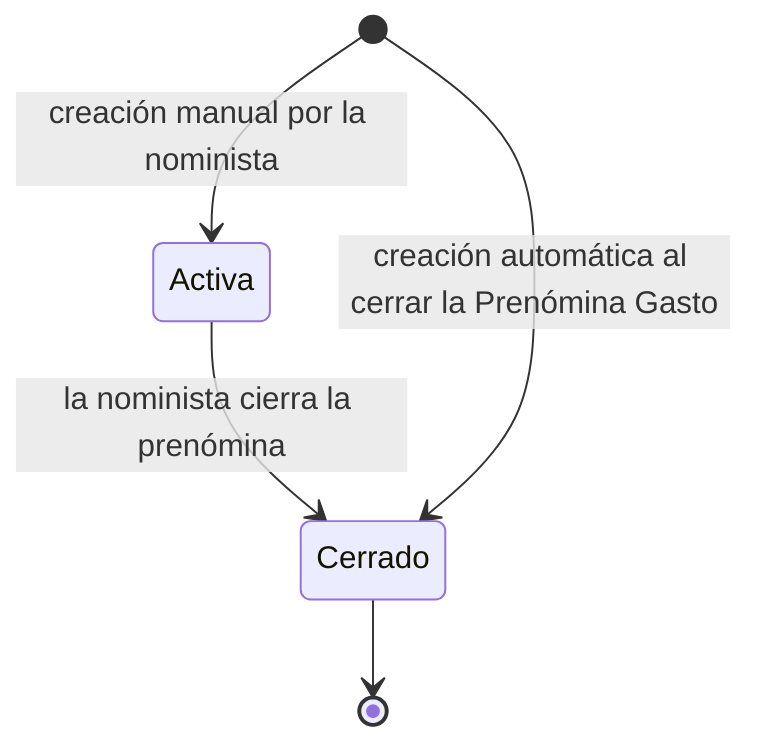
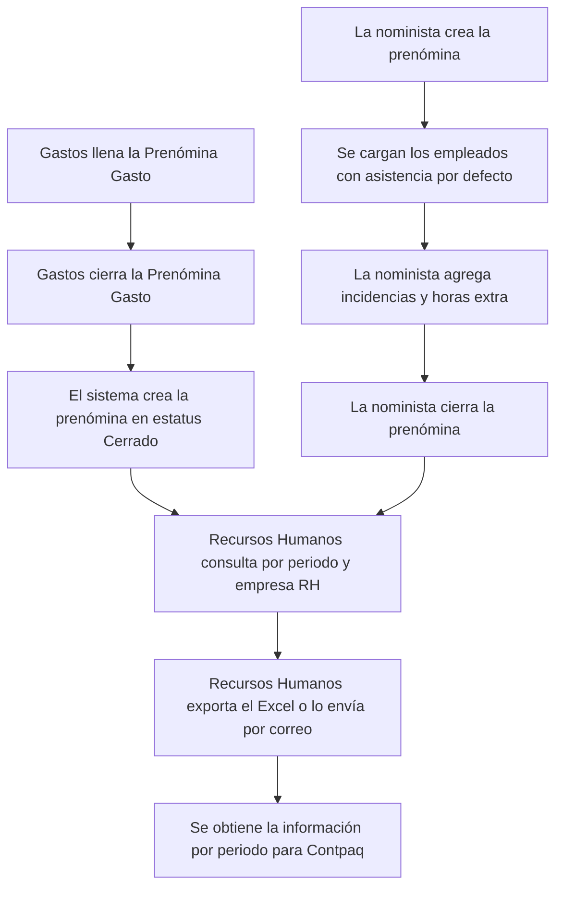
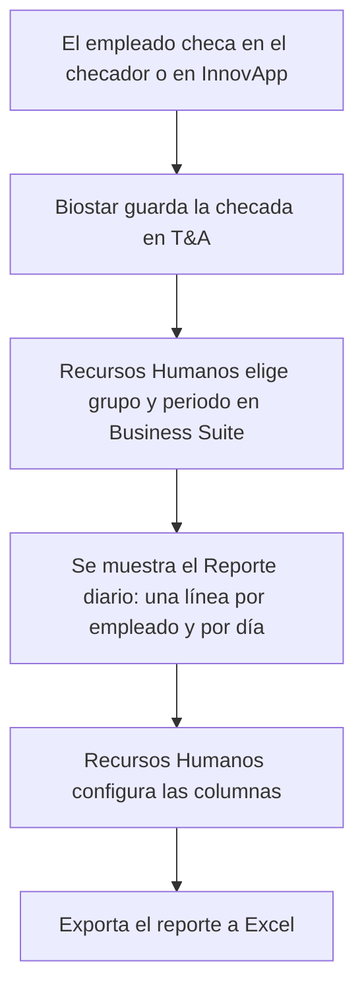
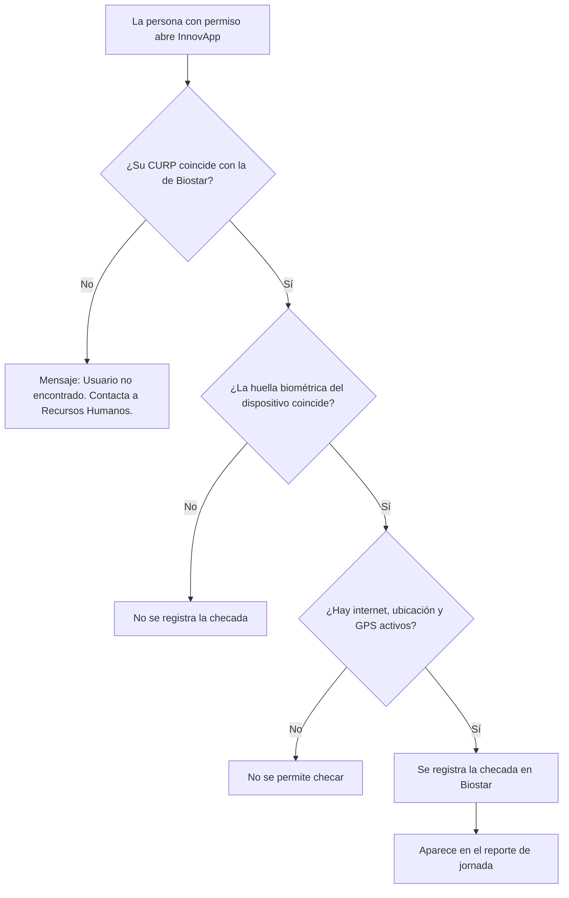

# Requerimientos Funcionales — Control de Asistencia: Prenómina, Reporte de jornada e InnovApp

Oct 8, 2026 · @Alejandro Saucedo

Este documento explica, en lenguaje sencillo, lo que debe hacer el proyecto Control de Asistencia Integración de Sistemas (solicitud 3976) en sus tres entregables: Prenómina, Reporte de jornada desde Biostar e InnovApp.

| Campo | Valor |
| --- | --- |
| Versión | 1.0 |
| Fecha | 2026-10-08 |
| Estado | Definición |
| Módulo | Business Suite, Biostar (complemento T&A), InnovApp y Contpaq |
| Autor | Análisis de Negocio |
| Área de negocio | Recursos Humanos |
| Área responsable | Célula de Innovación |

## 1. Propósito del documento

Este documento explica qué debe hacer el sistema en los tres entregables del proyecto, para que Recursos Humanos, las noministas, Gastos y el equipo de desarrollo entiendan lo mismo antes de construir. Se necesita antes del 1 de enero de 2027, cuando la Ley Federal del Trabajo (LFT) exige un registro electrónico de la jornada de trabajo.

Los tres entregables son:

1. **Prenómina:** los módulos Prenómina, Prenómina Gasto y Consulta Prenómina; los catálogos "Nómina Conceptos" y "Periodos Nómina"; los campos nuevos del expediente (Proceso y Turno); las horas extra; la validación de duplicados y la creación automática.
2. **Reporte de jornada desde Biostar:** el reporte, sus filtros, sus columnas y su exportación a Excel; la opción de comida en el checador y la lectura del complemento T&A de Biostar.
3. **InnovApp:** la checada móvil (validación de CURP, ubicación, GPS e internet), el permiso por persona, el teléfono autorizado y la alternativa supervisada por Recursos Humanos.

Los requerimientos (RF) de cada entregable son:

**Entregable 1 — Prenómina**

- RF-01 Catálogos "Nómina Conceptos" y "Periodos Nómina".
- RF-02 Campos nuevos del expediente: Proceso y Turno.
- RF-03 Prenómina: creación manual por la nominista.
- RF-04 Horas extra.
- RF-05 Prenómina Gasto.
- RF-06 Creación automática de la prenómina.
- RF-07 Validación de empleado duplicado.
- RF-08 Consulta Prenómina.
- RF-09 Exportar y enviar el Excel a Recursos Humanos.

**Entregable 2 — Reporte de jornada desde Biostar**

- RF-10 Reporte de jornada por empleado y por día.
- RF-11 Filtros del reporte.
- RF-12 Columnas configurables.
- RF-13 Exportación del reporte a Excel.
- RF-14 Opción de comida en el checador y relación de empleados por CURP.

**Entregable 3 — InnovApp**

- RF-15 Checada móvil desde InnovApp.
- RF-16 Permiso de checada por persona.
- RF-17 Teléfono autorizado (por evaluar).
- RF-18 Alternativa y revisión supervisada por Recursos Humanos.

## 2. Alcance del documento

El alcance cubre a todo Grupo Reyes a nivel nacional, con una prueba previa al 1 de enero de 2027.

**Incluye:**

*Entregable 1 — Prenómina*

- El módulo nuevo "Prenómina": carga automática de empleados, detalle por día y cierre por la nominista.
- La "Prenómina Gasto" (antes, el módulo de prenómina actual): celdas de horas extra por día, total de horas extra y creación automática de la prenómina al cerrarse.
- El módulo "Consulta Prenómina", solo para Recursos Humanos general, con exportación a Excel y envío manual por correo.
- Los catálogos "Nómina Conceptos" (relacionado con "Conceptos Nómina") y "Periodos Nómina" (semanal y quincenal).
- Los campos nuevos del expediente: "Proceso" y "Turno".
- Las horas extra por día y su total por periodo.
- La validación para que un empleado no esté en dos prenóminas.
- Agregar y quitar empleados en una prenómina activa.

*Entregable 2 — Reporte de jornada desde Biostar*

- El reporte "Reporte diario", con una línea por empleado y por día, consultable desde Business Suite de escritorio.
- Los filtros del reporte (solo cambian el grupo de usuarios y el periodo).
- Las columnas configurables y la exportación solo a Excel, con todos los campos.
- La lectura del complemento T&A de Biostar.
- El detalle de errores con los empleados cuya CURP no se encuentra entre Biostar, Business Suite y Contpaq.

*Entregable 3 — InnovApp*

- La checada móvil desde InnovApp, sin lector, en oficina, campo y remoto.
- La validación de la CURP y de la huella biométrica del dispositivo, con ubicación y GPS obligatorios.
- El permiso de checada por persona.
- El teléfono autorizado (por evaluar).
- La alternativa con revisión supervisada por Recursos Humanos para las fallas de la checada móvil.

**No incluye:**

*En general*

- Modificar o recalcular las checadas: toda la información viene de Biostar tal como se registra.
- Versiones o variantes del reporte distintas a la descrita.
- Configuraciones a cargo de otras áreas: los turnos y las horas base en Biostar, la CURP de los usuarios en Biostar (la captura Recursos Humanos) y la opción de comida en los checadores.
- Integraciones no mencionadas por el solicitante.
- La gestión de excepciones y correcciones de checadas (olvidos, fallas del checador, errores): se siguen llevando de forma manual, fuera del sistema.
- La interpretación de faltas, descansos, vacaciones, incapacidades, festivos o retardos en el reporte.
- Reemplazar las listas de asistencia que hoy entregan las empresas al equipo de nómina.

*Entregable 1 — Prenómina*

- El cálculo automático del pago de las horas extra: solo se capturan valores de horas; la explicación del pago es informativa.
- Una acción de cierre nueva: se reutiliza la que ya existe en la Prenómina Gasto.

*Entregable 3 — InnovApp*

- Que el empleado consulte el historial de sus marcas en InnovApp.
- Servicios externos en la ruta de checada, en cualquier etapa.
- Checar sin internet en el teléfono: se contempla más adelante, fuera de la primera etapa.
- Selfie, prueba de vida o comparación biométrica remota: no están aprobadas.
- Restricciones por zona (geocerca): el valor de la ubicación se guarda solo como dato informativo.

## 3. Actores y roles

| Actor / Rol | Descripción | Entregable |
| --- | --- | --- |
| Recursos Humanos (general) | Personal de Recursos Humanos. Consulta el reporte de jornada, usa "Consulta Prenómina", exporta o envía el Excel y administra el catálogo "Nómina Conceptos". | 1, 2 |
| Recursos Humanos de plantas | Personal de Recursos Humanos de cada planta. Consulta el reporte de jornada, pero solo ve su planta. No usa "Consulta Prenómina". | 2 |
| Nominista | Persona del equipo de nómina que crea y cierra la prenómina de forma manual. Asigna el proceso y el turno a su personal y configura los datos que falten de un empleado. No opera la Prenómina Gasto. | 1 |
| Personal de Gastos | Personal que lleva la Prenómina Gasto en conjunto con Recursos Humanos. | 1 |
| Célula de Innovación | Área de I&N que configura los permisos, la configuración del usuario de la nominista y los destinatarios del correo. Es el área responsable del proyecto. | 1, 3 |
| Líder de Célula de Innovación | Persona que valida que se cumplan todos los criterios de aceptación. | 1, 2, 3 |
| Empleados que checan | Personal de las plantas y centros de trabajo que registra su entrada, sus comidas y su salida en los checadores físicos. | 2 |
| Personas con permiso de InnovApp | Empleados a quienes se les asigna el permiso para checar desde el celular. | 3 |
| Destinatarios del correo | Personas de Recursos Humanos que reciben el Excel de la prenómina. Las configura la Célula de Innovación. | 1 |
| Biostar (complemento T&A) | Sistema donde se guardan las checadas y de donde sale el reporte de jornada. | 2, 3 |
| Business Suite | Sistema donde se consulta el reporte de jornada (versión de escritorio) y donde viven los módulos de prenómina. | 1, 2 |
| Contpaq | Sistema de nómina que recibe la información por periodo desde el Excel. | 1 |
| InnovApp | Aplicación móvil desde la que se checa. | 3 |

## 4. Entidad a la que aplica

El proyecto trabaja sobre estas entidades:

| Entidad | Qué es | Estatus |
| --- | --- | --- |
| Prenómina | Registro, por periodo, de lo que pasó con cada empleado cada día (asistencia, incidencias y horas extra). Se crea de forma manual o automática. | Inicial: Activa (creación manual) o Cerrado (creación automática). Terminal: Cerrado. |
| Prenómina Gasto | Módulo de prenómina que ya existe y lleva el personal de Gastos. | Ya tiene su flujo de estatus. Se cierra igual que la prenómina. |
| Empleado (expediente) | Persona que checa. Tiene CURP, empresa, empresa RH, sucursal y, con este proyecto, Proceso y Turno. | Activo o inactivo (dato que ya existe). |
| Marcaje (checada) | Registro de entrada, inicio de comida, fin de comida o salida. Vive en Biostar. | No aplica. |
| Catálogos | "Nómina Conceptos", "Conceptos Nómina", "Periodos Nómina", "Proceso" y catálogo de turnos. | No aplica. |

La prenómina tiene solo dos estatus. Si la crea una nominista, empieza en Activa y se puede ajustar hasta que se cierra. Si la crea el sistema al cerrar la Prenómina Gasto, nace en Cerrado y ya no se puede modificar.

## 5. Índice de requerimientos

> **Navegación rápida:** cada identificador RF de la primera columna es un enlace que lleva al detalle del requerimiento. Los entregables empiezan en [Entregable 1](#entregable-1--prenómina), [Entregable 2](#entregable-2--reporte-de-jornada-desde-biostar) y [Entregable 3](#entregable-3--innovapp).

| RF | Título | Sistema | Aplica a | Entregable |
| --- | --- | --- | --- | --- |
| [RF-01](#rf-01--catálogos-nómina-conceptos-y-periodos-nómina) | Catálogos "Nómina Conceptos" y "Periodos Nómina" | Business Suite | Catálogos | 1 |
| [RF-02](#rf-02--campos-nuevos-del-expediente-proceso-y-turno) | Campos nuevos del expediente: Proceso y Turno | Business Suite | Empleado | 1 |
| [RF-03](#rf-03--prenómina-creación-manual-por-la-nominista) | Prenómina: creación manual por la nominista | Business Suite | Prenómina | 1 |
| [RF-04](#rf-04--horas-extra) | Horas extra | Business Suite | Prenómina y Prenómina Gasto | 1 |
| [RF-05](#rf-05--prenómina-gasto) | Prenómina Gasto | Business Suite | Prenómina Gasto | 1 |
| [RF-06](#rf-06--creación-automática-de-la-prenómina) | Creación automática de la prenómina | Business Suite | Prenómina | 1 |
| [RF-07](#rf-07--validación-de-empleado-duplicado) | Validación de empleado duplicado | Business Suite | Prenómina y Prenómina Gasto | 1 |
| [RF-08](#rf-08--consulta-prenómina) | Consulta Prenómina | Business Suite | Prenómina | 1 |
| [RF-09](#rf-09--exportar-y-enviar-el-excel-a-recursos-humanos) | Exportar y enviar el Excel a Recursos Humanos | Business Suite y Contpaq | Prenómina | 1 |
| [RF-10](#rf-10--reporte-de-jornada-por-empleado-y-por-día) | Reporte de jornada por empleado y por día | Business Suite y Biostar (T&A) | Marcaje | 2 |
| [RF-11](#rf-11--filtros-del-reporte) | Filtros del reporte | Business Suite y Biostar | Marcaje | 2 |
| [RF-12](#rf-12--columnas-configurables) | Columnas configurables | Business Suite | Marcaje | 2 |
| [RF-13](#rf-13--exportación-del-reporte-a-excel) | Exportación del reporte a Excel | Business Suite | Marcaje | 2 |
| [RF-14](#rf-14--opción-de-comida-en-el-checador-y-relación-de-empleados-por-curp) | Opción de comida en el checador y relación de empleados por CURP | Biostar, Business Suite y Contpaq | Marcaje y Empleado | 2 |
| [RF-15](#rf-15--checada-móvil-desde-innovapp) | Checada móvil desde InnovApp | InnovApp y Biostar | Marcaje | 3 |
| [RF-16](#rf-16--permiso-de-checada-por-persona) | Permiso de checada por persona | InnovApp | Empleado | 3 |
| [RF-17](#rf-17--teléfono-autorizado-por-evaluar) | Teléfono autorizado (por evaluar) | InnovApp | Empleado | 3 |
| [RF-18](#rf-18--alternativa-y-revisión-supervisada-por-recursos-humanos) | Alternativa y revisión supervisada por Recursos Humanos | InnovApp | Marcaje | 3 |

# ENTREGABLE 1 — PRENÓMINA

Hoy parte del control de asistencia de la prenómina se lleva de forma manual en papel, y no todas las áreas usan el módulo de prenómina actual, que pasa a llamarse "Prenómina Gasto". Este entregable crea el módulo "Prenómina" y el módulo "Consulta Prenómina", para que la información de cada periodo llegue a Contpaq en un Excel y sin captura manual intermedia.

La prenómina se puede crear de dos maneras que conviven. En la manual, la nominista elige el periodo, se cargan sus empleados con la asistencia por defecto y ella agrega las incidencias. En la automática, el personal de Gastos llena y cierra la Prenómina Gasto y el sistema crea la prenómina ya cerrada. En los dos casos, la prenómina vive en el módulo "Prenómina" y es la que muestra "Consulta Prenómina".

El diagrama muestra las dos formas de crear la prenómina y cómo terminan en la misma consulta de Recursos Humanos.

# RF-01 — Catálogos "Nómina Conceptos" y "Periodos Nómina"

| Campo | Valor |
| --- | --- |
| Prioridad | Must |
| Estado | Definición |
| Dependencias | Ninguna |

## Objetivo

Dejar listos los dos catálogos que usa la prenómina: los conceptos que entiende Contpaq y los periodos semanales y quincenales.

## Descripción

El sistema deberá permitir que Recursos Humanos administre el catálogo "Nómina Conceptos", donde se registran los conceptos que usa Contpaq. Cada concepto se captura con una clave y un nombre, y se puede ligar a uno o más "Conceptos Nómina" (el catálogo que ya existe) desde el detalle del concepto.

El sistema deberá usar el catálogo "Periodos Nómina", que debe tener periodos semanales y quincenales. Al agregar un periodo se indica cuándo inicia y cuándo termina.

| Campo del catálogo "Nómina Conceptos" | Obligatorio | Descripción |
| --- | --- | --- |
| Clave | Sí | Identifica al concepto. No se puede repetir. |
| Nombre | Sí | Nombre del concepto. No se puede repetir. |
| Detalle: Conceptos Nómina | No | Lista de los "Conceptos Nómina" ligados. Se pueden ligar uno o más. |

## HU-1.1 — Administrar el catálogo "Nómina Conceptos"

Como Recursos Humanos, quiero registrar los conceptos de Contpaq y ligarlos a los "Conceptos Nómina", para que la prenómina use los conceptos correctos sin capturarlos a mano cada vez.

### Reglas de negocio

**RN-1.1** Recursos Humanos administra el catálogo "Nómina Conceptos".

**RN-1.2** Cada concepto se captura con su clave y su nombre, y ambos son obligatorios.

**RN-1.3** La clave y el nombre de un concepto no se pueden repetir.

**RN-1.4** Un concepto puede ligarse a uno o más "Conceptos Nómina" desde su detalle, pero no es obligatorio que tenga uno ligado.

### Criterios de Aceptación

**CA-1.1.1 — Alta de un concepto** Dado que Recursos Humanos está en el catálogo "Nómina Conceptos" Cuando da de alta un concepto con su clave y su nombre Entonces el concepto queda registrado y disponible.

**CA-1.1.2 — Ligar "Conceptos Nómina"** Dado que existe un concepto en el catálogo Cuando Recursos Humanos, en el detalle del concepto, liga uno o más "Conceptos Nómina" Entonces el concepto queda ligado a ellos.

**CA-1.1.3 — Datos obligatorios** Dado que Recursos Humanos da de alta un concepto Cuando omite la clave o el nombre Entonces el sistema no le permite guardarlo.

**CA-1.1.4 — Clave o nombre repetidos** Dado que ya existe un concepto con la misma clave o el mismo nombre Cuando Recursos Humanos intenta dar de alta otro igual Entonces el sistema no se lo permite.

**CA-1.1.5 — Concepto sin ligar** Dado que Recursos Humanos da de alta un concepto con su clave y su nombre Cuando no liga ningún "Conceptos Nómina" Entonces el sistema permite guardarlo.

### Casos de prueba

**CP-1.1.1 — Alta exitosa (camino feliz)** Verifica: CA-1.1.1 Dado que Recursos Humanos abre el catálogo "Nómina Conceptos" Cuando da de alta el concepto con clave "HE" y nombre "Horas extra" Entonces el concepto aparece en el catálogo.

**CP-1.1.2 — Ligar un concepto (camino feliz)** Verifica: CA-1.1.2 Dado que existe el concepto "Horas extra" Cuando Recursos Humanos le liga un "Conceptos Nómina" Entonces el detalle del concepto muestra el "Conceptos Nómina" ligado.

**CP-1.1.3 — Ligar varios (alternativo)** Verifica: CA-1.1.2 Dado que existe un concepto en el catálogo Cuando Recursos Humanos le liga tres "Conceptos Nómina" Entonces el detalle muestra los tres ligados.

**CP-1.1.4 — Falta la clave (error)** Verifica: CA-1.1.3 · RN-1.2 Dado que Recursos Humanos captura solo el nombre del concepto Cuando intenta guardar Entonces el sistema no deja guardarlo.

**CP-1.1.5 — Falta el nombre (error)** Verifica: CA-1.1.3 · RN-1.2 Dado que Recursos Humanos captura solo la clave del concepto Cuando intenta guardar Entonces el sistema no deja guardarlo.

**CP-1.1.6 — Clave repetida (validación)** Verifica: CA-1.1.4 · RN-1.3 Dado que ya existe un concepto con la clave "HE" Cuando Recursos Humanos intenta dar de alta otro con la clave "HE" Entonces el sistema no se lo permite.

**CP-1.1.7 — Nombre repetido (validación)** Verifica: CA-1.1.4 · RN-1.3 Dado que ya existe un concepto con el nombre "Horas extra" Cuando Recursos Humanos intenta dar de alta otro con ese nombre Entonces el sistema no se lo permite.

**CP-1.1.8 — Concepto sin ligar (alternativo)** Verifica: CA-1.1.5 · RN-1.4 Dado que Recursos Humanos captura clave y nombre de un concepto nuevo Cuando guarda sin ligar ningún "Conceptos Nómina" Entonces el concepto se guarda sin errores.

**CP-1.1.9 — Persona de otra área no administra el catálogo (permisos)** Verifica: CA-1.1.1 · RN-1.1 Dado que una persona que no es de Recursos Humanos abre el sistema Cuando intenta entrar al catálogo "Nómina Conceptos" Entonces el sistema no le permite dar de alta ni cambiar conceptos.

| CA | Caso(s) de prueba | Escenarios cubiertos |
| --- | --- | --- |
| CA-1.1.1 | CP-1.1.1, CP-1.1.9 | Camino feliz, Permisos |
| CA-1.1.2 | CP-1.1.2, CP-1.1.3 | Camino feliz, Alternativo |
| CA-1.1.3 | CP-1.1.4, CP-1.1.5 | Error |
| CA-1.1.4 | CP-1.1.6, CP-1.1.7 | Validación |
| CA-1.1.5 | CP-1.1.8 | Alternativo |

## HU-1.2 — Elegir periodos semanales y quincenales

Como nominista, quiero elegir un periodo semanal o quincenal de un catálogo, para trabajar la prenómina del periodo correcto sin escribir las fechas a mano.

### Reglas de negocio

**RN-1.5** El periodo de nómina se obtiene del catálogo "Periodos Nómina", que debe tener periodos semanales y quincenales.

**RN-1.6** Al agregar un periodo se especifican cuándo inicia y cuándo termina. El día en que inicia la semana se define en la configuración del periodo.

**RN-1.7** La nómina quincenal también puede tener un corte, igual que la nómina corta. La fecha del corte no se define aparte: la dan el inicio y el fin del periodo.

### Criterios de Aceptación

**CA-1.2.1 — Elegir semanal o quincenal** Dado que el catálogo "Periodos Nómina" tiene periodos semanales y quincenales Cuando la nominista elige el periodo de nómina Entonces puede escoger tanto uno semanal como uno quincenal.

**CA-1.2.2 — Fechas del periodo** Dado que se agrega un periodo al catálogo Cuando se indica cuándo inicia y cuándo termina Entonces el periodo usa esas fechas para mostrar sus días.

### Casos de prueba

**CP-1.2.1 — Elegir un periodo semanal (camino feliz)** Verifica: CA-1.2.1 Dado que existe un periodo semanal en el catálogo Cuando la nominista lo elige Entonces el sistema trabaja con ese periodo.

**CP-1.2.2 — Elegir un periodo quincenal (alternativo)** Verifica: CA-1.2.1 Dado que existe un periodo quincenal en el catálogo Cuando la nominista lo elige Entonces el sistema trabaja con ese periodo.

**CP-1.2.3 — Días del periodo (camino feliz)** Verifica: CA-1.2.2 · RN-1.6 Dado que un periodo inicia el 1 y termina el 15 del mismo mes Cuando se abre una prenómina de ese periodo Entonces se muestran 15 días, del 1 al 15.

| CA | Caso(s) de prueba | Escenarios cubiertos |
| --- | --- | --- |
| CA-1.2.1 | CP-1.2.1, CP-1.2.2 | Camino feliz, Alternativo |
| CA-1.2.2 | CP-1.2.3 | Camino feliz |

---

**Regla transversal:** estos dos catálogos los usan la Prenómina, la Prenómina Gasto y "Consulta Prenómina" (RF-03, RF-05, RF-06, RF-08 y RF-09).

# RF-02 — Campos nuevos del expediente: Proceso y Turno

| Campo | Valor |
| --- | --- |
| Prioridad | Must |
| Estado | Definición |
| Dependencias | Ninguna |

## Objetivo

Saber a qué proceso pertenece cada empleado y en qué turno trabaja, para cargarlo en la prenómina correcta.

## Descripción

El sistema deberá agregar dos campos al expediente del empleado: "Proceso" y "Turno". Las noministas los asignan al personal que tienen asignado. El campo "Proceso" toma sus valores del catálogo "Proceso" que ya existe y muestra solo los procesos normalizados y activos. El campo "Turno" toma sus valores de un catálogo de turnos.

| Dato del expediente | ¿Es nuevo? | Descripción |
| --- | --- | --- |
| Proceso | Sí | Proceso al que pertenece el empleado. |
| Turno | Sí | Turno en el que trabaja el empleado. |
| Empresa | No | Empresa del empleado. Se usa para cargar empleados en la prenómina. |
| Empresa RH | No | Es distinta de "Empresa". Se usa como filtro en "Consulta Prenómina". |
| Sucursal | No | Sucursal del empleado. Se muestra en la prenómina. |

## HU-2.1 — Asignar el proceso a mi personal

Como nominista, quiero asignar a mi personal un proceso del catálogo "Proceso", para que el sistema sepa a qué proceso pertenece cada empleado cuando cargue la prenómina.

### Reglas de negocio

**RN-2.1** En el expediente del empleado, el campo "Proceso" solo muestra los procesos con "Normalizado" en verdadero y que están activos. Solo esos se pueden asignar al personal.

**RN-2.2** Las noministas asignan el proceso al personal que tienen asignado.

**RN-2.3** El "proceso asignado (área RH)" de la Prenómina Gasto y el campo "Proceso" del expediente son datos diferentes.

**RN-2.4** La sucursal, la empresa y la empresa RH son datos independientes del expediente y no se relacionan entre sí.

### Criterios de Aceptación

**CA-2.1.1 — Procesos disponibles** Dado que el catálogo "Proceso" tiene registros normalizados y activos Cuando la nominista abre el campo "Proceso" en el expediente de un empleado Entonces ve la lista de esos procesos.

**CA-2.1.2 — Procesos que no se muestran** Dado que un proceso tiene "Normalizado" en falso o está inactivo Cuando la nominista busca asignarlo a un empleado de su personal Entonces el proceso no aparece en la lista.

**CA-2.1.3 — Guardar el proceso** Dado que una nominista eligió un proceso disponible para su personal asignado Cuando guarda el expediente Entonces el proceso queda asignado al empleado.

### Casos de prueba

**CP-2.1.1 — Ver la lista de procesos (camino feliz)** Verifica: CA-2.1.1 · RN-2.1 Dado que existen los procesos "Empaque" y "Producción", ambos normalizados y activos Cuando la nominista abre el campo "Proceso" de un empleado Entonces ve "Empaque" y "Producción".

**CP-2.1.2 — Proceso inactivo no aparece (validación)** Verifica: CA-2.1.2 · RN-2.1 Dado que el proceso "Almacén" está inactivo Cuando la nominista abre la lista de procesos Entonces "Almacén" no aparece.

**CP-2.1.3 — Proceso no normalizado no aparece (validación)** Verifica: CA-2.1.2 · RN-2.1 Dado que el proceso "Calidad" tiene "Normalizado" en falso Cuando la nominista abre la lista de procesos Entonces "Calidad" no aparece.

**CP-2.1.4 — Guardar el proceso (camino feliz)** Verifica: CA-2.1.3 Dado que la nominista eligió "Empaque" para un empleado de su personal Cuando guarda el expediente Entonces el expediente muestra "Empaque" como proceso.

**CP-2.1.5 — Persona que no es nominista no asigna procesos (permisos)** Verifica: CA-2.1.3 · RN-2.2 Dado que una persona sin rol de nominista abre un expediente Cuando intenta cambiar el proceso Entonces el sistema no se lo permite.

| CA | Caso(s) de prueba | Escenarios cubiertos |
| --- | --- | --- |
| CA-2.1.1 | CP-2.1.1 | Camino feliz |
| CA-2.1.2 | CP-2.1.2, CP-2.1.3 | Validación |
| CA-2.1.3 | CP-2.1.4, CP-2.1.5 | Camino feliz, Permisos |

## HU-2.2 — Asignar el turno a mi personal

Como nominista, quiero asignar el turno en el que trabaja cada empleado desde un catálogo de turnos, para que la prenómina muestre el turno de cada persona.

### Reglas de negocio

**RN-2.5** El campo "Turno" del expediente define el turno en el que trabaja el personal. Sus valores salen de un catálogo de turnos y lo capturan las noministas.

**RN-2.6** El turno del expediente y el turno de Biostar deberían coincidir, pero se registran al personal de manera independiente. El sistema no los compara.

### Criterios de Aceptación

**CA-2.2.1 — Asignar el turno** Dado que una nominista abre el expediente de un empleado Cuando elige el turno en el que trabaja y guarda Entonces el turno queda asignado al empleado.

**CA-2.2.2 — Solo turnos del catálogo** Dado que existe un catálogo de turnos Cuando la nominista abre el campo "Turno" Entonces solo ve los turnos de ese catálogo.

### Casos de prueba

**CP-2.2.1 — Asignar un turno (camino feliz)** Verifica: CA-2.2.1 Dado que el catálogo tiene el turno "Nocturno" Cuando la nominista lo elige para un empleado y guarda Entonces el expediente muestra "Nocturno".

**CP-2.2.2 — Lista de turnos (validación)** Verifica: CA-2.2.2 · RN-2.5 Dado que el catálogo tiene tres turnos Cuando la nominista abre el campo "Turno" Entonces ve esos tres turnos y ningún otro.

**CP-2.2.3 — Persona que no es nominista no asigna turnos (permisos)** Verifica: CA-2.2.1 · RN-2.5 Dado que una persona sin rol de nominista abre un expediente Cuando intenta cambiar el turno Entonces el sistema no se lo permite.

**CP-2.2.4 — Turno distinto al de Biostar (alternativo)** Verifica: CA-2.2.1 · RN-2.6 Dado que el turno del expediente es "Nocturno" y en Biostar es "Matutino" Cuando la nominista guarda el expediente Entonces el sistema lo guarda sin compararlos.

| CA | Caso(s) de prueba | Escenarios cubiertos |
| --- | --- | --- |
| CA-2.2.1 | CP-2.2.1, CP-2.2.3, CP-2.2.4 | Camino feliz, Permisos, Alternativo |
| CA-2.2.2 | CP-2.2.2 | Validación |

---

**Regla transversal:** el proceso y la empresa del expediente se usan para cargar a los empleados en la prenómina (RF-03). El turno y la sucursal se muestran en ella.

# RF-03 — Prenómina: creación manual por la nominista

| Campo | Valor |
| --- | --- |
| Prioridad | Must |
| Estado | Definición |
| Dependencias | RF-01, RF-02, RF-07 |

## Objetivo

Que la nominista cree la prenómina de un periodo con sus empleados ya cargados, agregue las incidencias y la cierre.

## Descripción

El sistema deberá ofrecer el módulo nuevo "Prenómina", que es independiente del módulo de prenómina actual (ahora "Prenómina Gasto"). Una prenómina lleva sus datos generales (folio, estatus, quién la registra y cuándo) y su periodo. Al cargar el periodo, el sistema trae automáticamente a los empleados que le corresponden a la nominista y muestra una columna por cada día del periodo, que puede ser semanal o quincenal. Cada día viene con la asistencia por defecto y la nominista solo agrega las incidencias. Mientras la prenómina está Activa se puede ajustar, y se pueden agregar o quitar empleados. Al cerrarla, ya no se puede modificar.

| Columna de la prenómina | Qué muestra | Cómo se llena |
| --- | --- | --- |
| N° Nómina | Número de nómina del empleado. | Dato del empleado. |
| Personal | Nombre del empleado. | Dato del empleado. |
| Estatus Personal | Estatus del empleado (por ejemplo, Activo). | Dato del empleado. |
| RFC | RFC del empleado. | Dato del empleado. |
| Proceso | Proceso del empleado (campo nuevo del expediente). | Dato del empleado. |
| Turno | Turno en el que trabaja el empleado. | Dato del expediente. |
| Sucursal | Sucursal del empleado. | Dato que ya existe en el expediente. |
| Una columna por cada día | El concepto de "Nómina Conceptos" de ese día. | En la creación manual se precarga con asistencia y la nominista agrega las incidencias. |
| Celda de horas extra (a la derecha de cada día) | Horas extra del empleado ese día, en horas. | La nominista captura el valor. |
| Horas extra totales (al final) | Suma de las horas extra del periodo. | Se calcula con las celdas diarias. |

## HU-3.1 — Configurar los procesos y la empresa de la nominista

Como Célula de Innovación, quiero configurar en el usuario de cada nominista sus procesos y su empresa, para que solo cargue a los empleados que le corresponden.

### Reglas de negocio

**RN-3.1** La nominista que genera la prenómina debe tener configurados en su usuario los procesos que tiene asignados y la empresa a la que pertenecen esos procesos.

**RN-3.2** La Célula de Innovación realiza esa configuración, igual que todas las asignaciones de permisos.

### Criterios de Aceptación

**CA-3.1.1 — Configuración del usuario** Dado que una nominista tiene configurados en su usuario los procesos asignados y la empresa a la que pertenecen Cuando genera una prenómina Entonces el sistema usa esa configuración para cargar a los empleados.

**CA-3.1.2 — Sin configuración** Dado que una nominista no tiene procesos ni empresa configurados Cuando carga un periodo Entonces el sistema no le carga empleados.

### Casos de prueba

**CP-3.1.1 — Usuario configurado (camino feliz)** Verifica: CA-3.1.1 · RN-3.1 Dado que la nominista Ana tiene el proceso "Empaque" y la empresa "Empresa A" Cuando carga un periodo Entonces el sistema usa "Empaque" y "Empresa A" para cargar sus empleados.

**CP-3.1.2 — Usuario sin configuración (error)** Verifica: CA-3.1.2 · RN-3.1 Dado que la nominista Luis no tiene procesos ni empresa configurados Cuando carga un periodo Entonces no aparece ningún empleado.

**CP-3.1.3 — Solo la Célula de Innovación configura (permisos)** Verifica: CA-3.1.1 · RN-3.2 Dado que una nominista abre su propio usuario Cuando intenta cambiar sus procesos o su empresa Entonces el sistema no se lo permite.

| CA | Caso(s) de prueba | Escenarios cubiertos |
| --- | --- | --- |
| CA-3.1.1 | CP-3.1.1, CP-3.1.3 | Camino feliz, Permisos |
| CA-3.1.2 | CP-3.1.2 | Error |

## HU-3.2 — Crear una prenómina con su folio y su periodo

Como nominista, quiero crear una prenómina eligiendo el periodo, para trabajar los días de ese periodo con un folio que la identifique.

### Reglas de negocio

**RN-3.3** Los datos generales de la prenómina son: folio generado de manera automática, estatus, personal que registra y fecha de registro.

**RN-3.4** La prenómina creada de forma manual nace con estatus "Activa".

**RN-3.5** El periodo se elige del catálogo "Periodos Nómina" (RF-01).

**RN-3.6** Para ver los módulos, la persona debe tener el permiso; la Célula de Innovación lo asigna. Se ven "Prenómina Gasto" y, por separado, "Prenómina".

### Criterios de Aceptación

**CA-3.2.1 — Datos generales** Dado que la nominista registra una prenómina Cuando la guarda Entonces el sistema genera el folio de manera automática y registra el estatus "Activa", quién la registra y la fecha de registro.

**CA-3.2.2 — Elegir el periodo** Dado que el catálogo "Periodos Nómina" tiene periodos semanales y quincenales Cuando la nominista elige el periodo de nómina Entonces puede escoger tanto uno semanal como uno quincenal.

**CA-3.2.3 — Dos módulos separados** Dado que el módulo de prenómina actual se llama "Prenómina Gasto" Cuando una persona con acceso entra a los módulos Entonces ve "Prenómina Gasto" y, por separado, el módulo "Prenómina".

### Casos de prueba

**CP-3.2.1 — Registro con folio automático (camino feliz)** Verifica: CA-3.2.1 · RN-3.3 Dado que la nominista Ana elige un periodo y registra la prenómina Cuando la guarda Entonces la prenómina tiene un folio generado por el sistema, estatus "Activa", el nombre de Ana y la fecha de hoy.

**CP-3.2.2 — Folios distintos (validación)** Verifica: CA-3.2.1 · RN-3.3 Dado que se registran dos prenóminas Cuando se revisan sus folios Entonces cada una tiene un folio diferente.

**CP-3.2.3 — Elegir periodo semanal y quincenal (alternativo)** Verifica: CA-3.2.2 · RN-3.5 Dado que el catálogo tiene un periodo semanal y uno quincenal Cuando la nominista abre la lista de periodos Entonces ve los dos.

**CP-3.2.4 — Dos módulos visibles (camino feliz)** Verifica: CA-3.2.3 Dado que una persona tiene acceso a ambos módulos Cuando entra al sistema Entonces ve "Prenómina Gasto" y "Prenómina" como módulos separados.

**CP-3.2.5 — Persona sin permiso no ve el módulo (permisos)** Verifica: CA-3.2.3 · RN-3.6 Dado que una persona no tiene el permiso del módulo "Prenómina" Cuando entra al sistema Entonces no ve el módulo "Prenómina".

| CA | Caso(s) de prueba | Escenarios cubiertos |
| --- | --- | --- |
| CA-3.2.1 | CP-3.2.1, CP-3.2.2 | Camino feliz, Validación |
| CA-3.2.2 | CP-3.2.3 | Alternativo |
| CA-3.2.3 | CP-3.2.4, CP-3.2.5 | Camino feliz, Permisos |

## HU-3.3 — Cargar mis empleados al elegir el periodo

Como nominista, quiero que al cargar el periodo se carguen automáticamente mis empleados, para no agregarlos uno por uno.

### Reglas de negocio

**RN-3.7** Al cargar el periodo se cargan automáticamente solo los empleados cuyo proceso y empresa, asignados en su expediente, corresponden a los de la nominista.

**RN-3.8** La prenómina muestra por cada empleado los datos de la tabla de columnas de esta descripción, seguidos de una columna por cada día del periodo (semanal o quincenal).

### Criterios de Aceptación

**CA-3.3.1 — Empleados de la nominista** Dado que la nominista tiene procesos y empresa configurados Cuando carga el periodo de nómina Entonces se cargan automáticamente solo los empleados cuyo proceso y empresa corresponden a los de ella.

**CA-3.3.2 — Datos del empleado** Dado que se cargaron los empleados Cuando la nominista abre el detalle Entonces ve por empleado el número de nómina, el personal, el estatus personal, el RFC, el proceso, el turno y la sucursal.

**CA-3.3.3 — Días del periodo** Dado que el periodo es semanal o quincenal Cuando se carga el detalle Entonces se muestra una columna por cada día del periodo, con una celda de horas extra a la derecha de cada día y una columna final de horas extra totales.

### Casos de prueba

**CP-3.3.1 — Carga de los empleados correctos (camino feliz)** Verifica: CA-3.3.1 · RN-3.7 Dado que Ana tiene "Empaque" y "Empresa A", y hay 10 empleados con ese proceso y esa empresa Cuando carga el periodo Entonces aparecen esos 10 empleados.

**CP-3.3.2 — No se cargan empleados de otro proceso (validación)** Verifica: CA-3.3.1 · RN-3.7 Dado que hay un empleado de "Producción" en "Empresa A" Cuando Ana, con "Empaque", carga el periodo Entonces ese empleado no aparece.

**CP-3.3.3 — No se cargan empleados de otra empresa (validación)** Verifica: CA-3.3.1 · RN-3.7 Dado que hay un empleado de "Empaque" en "Empresa B" Cuando Ana, con "Empresa A", carga el periodo Entonces ese empleado no aparece.

**CP-3.3.4 — Datos del empleado visibles (camino feliz)** Verifica: CA-3.3.2 · RN-3.8 Dado que se cargó un empleado Cuando Ana abre el detalle Entonces ve su número de nómina, nombre, estatus, RFC, proceso, turno y sucursal.

**CP-3.3.5 — Periodo semanal (camino feliz)** Verifica: CA-3.3.3 · RN-3.8 Dado que el periodo es semanal de 7 días Cuando se carga el detalle Entonces hay 7 columnas de días, cada una con su celda de horas extra, y una columna final de horas extra totales.

**CP-3.3.6 — Periodo quincenal (alternativo)** Verifica: CA-3.3.3 · RN-3.8 Dado que el periodo es quincenal de 15 días Cuando se carga el detalle Entonces hay 15 columnas de días.

| CA | Caso(s) de prueba | Escenarios cubiertos |
| --- | --- | --- |
| CA-3.3.1 | CP-3.3.1, CP-3.3.2, CP-3.3.3 | Camino feliz, Validación |
| CA-3.3.2 | CP-3.3.4 | Camino feliz |
| CA-3.3.3 | CP-3.3.5, CP-3.3.6 | Camino feliz, Alternativo |

## HU-3.4 — Agregar solo las incidencias

Como nominista, quiero que cada día venga con asistencia y agregar solo las incidencias, para capturar menos y equivocarme menos.

### Reglas de negocio

**RN-3.9** En la creación manual, cada día de cada empleado se precarga con el concepto de "Nómina Conceptos" que indica asistencia. La nominista solo agrega las incidencias.

**RN-3.10** Para cada incidencia, la nominista elige el concepto que corresponde del catálogo "Nómina Conceptos", donde están registrados los conceptos para Contpaq.

### Criterios de Aceptación

**CA-3.4.1 — Asistencia por defecto** Dado que se cargó el detalle Cuando la nominista lo abre Entonces cada día de cada empleado trae el concepto de "Nómina Conceptos" que indica asistencia.

**CA-3.4.2 — Agregar una incidencia** Dado que todos los días traen asistencia Cuando la nominista elige, en "Nómina Conceptos", el concepto de una incidencia para un día Entonces ese día muestra el concepto de la incidencia en lugar de la asistencia.

### Casos de prueba

**CP-3.4.1 — Todos los días con asistencia (camino feliz)** Verifica: CA-3.4.1 · RN-3.9 Dado que se cargó una prenómina semanal con 5 empleados Cuando la nominista abre el detalle Entonces los 35 días (5 empleados por 7 días) muestran el concepto de asistencia.

**CP-3.4.2 — Agregar una falta (camino feliz)** Verifica: CA-3.4.2 · RN-3.10 Dado que el día martes de un empleado muestra asistencia Cuando la nominista elige el concepto de falta para ese día Entonces el martes muestra la falta y los demás días siguen con asistencia.

**CP-3.4.3 — Cambiar una incidencia (alternativo)** Verifica: CA-3.4.2 Dado que un día muestra una incidencia Cuando la nominista elige otro concepto para ese día Entonces el día muestra el nuevo concepto.

| CA | Caso(s) de prueba | Escenarios cubiertos |
| --- | --- | --- |
| CA-3.4.1 | CP-3.4.1 | Camino feliz |
| CA-3.4.2 | CP-3.4.2, CP-3.4.3 | Camino feliz, Alternativo |

## HU-3.5 — Agregar y quitar empleados

Como nominista, quiero agregar empleados que faltan y quitar a los que no corresponden mientras la prenómina esté activa, para que la prenómina tenga exactamente a mi personal.

### Reglas de negocio

**RN-3.11** Mientras la prenómina esté activa, se pueden agregar empleados que cumplan con el proceso y la empresa de la nominista, igual que en la carga automática, y quitar empleados del listado.

**RN-3.12** Al agregar un empleado aplica la validación de empleado duplicado (RF-07).

**RN-3.13** Los empleados que no cumplen el proceso y la empresa no se muestran para agregar y no se muestra ningún mensaje.

**RN-3.14** Si a un empleado le falta algún dato, las noministas deben configurarlo primero antes de agregarlo.

**RN-3.15** La Prenómina Gasto ya cuenta con la funcionalidad de agregar y quitar empleados.

### Criterios de Aceptación

**CA-3.5.1 — Agregar un empleado** Dado que la prenómina está activa Cuando la nominista agrega un empleado que cumple con el proceso y la empresa Entonces el empleado queda en el listado.

**CA-3.5.2 — Empleado que no cumple** Dado que la prenómina está activa Cuando la nominista busca empleados para agregar y uno no cumple con el proceso y la empresa Entonces ese empleado no se muestra y no aparece ningún mensaje.

**CA-3.5.3 — Quitar un empleado** Dado que la prenómina está activa Cuando la nominista quita un empleado del listado Entonces el empleado deja de formar parte de esa prenómina.

**CA-3.5.4 — Dato faltante** Dado que a un empleado le falta algún dato necesario Cuando se intenta agregarlo Entonces las noministas deben configurar primero ese dato.

**CA-3.5.5 — Prenómina cerrada** Dado que la prenómina está cerrada Cuando se intenta agregar o quitar un empleado Entonces el sistema no lo permite.

### Casos de prueba

**CP-3.5.1 — Agregar un empleado válido (camino feliz)** Verifica: CA-3.5.1 · RN-3.11 Dado que una prenómina activa y un empleado de "Empaque" en "Empresa A" que no está en ella Cuando Ana, con ese proceso y esa empresa, lo agrega Entonces aparece en el listado.

**CP-3.5.2 — Empleado de otro proceso no aparece (validación)** Verifica: CA-3.5.2 · RN-3.13 Dado que un empleado de "Producción" Cuando Ana, con "Empaque", busca empleados para agregar Entonces no lo ve y no aparece ningún mensaje.

**CP-3.5.3 — Empleado de otra empresa no aparece (validación)** Verifica: CA-3.5.2 · RN-3.13 Dado que un empleado de "Empresa B" Cuando Ana, con "Empresa A", busca empleados para agregar Entonces no lo ve y no aparece ningún mensaje.

**CP-3.5.4 — Quitar un empleado (camino feliz)** Verifica: CA-3.5.3 Dado que una prenómina activa con 10 empleados Cuando Ana quita a uno Entonces la prenómina queda con 9 empleados.

**CP-3.5.5 — Empleado sin proceso (error)** Verifica: CA-3.5.4 · RN-3.14 Dado que un empleado no tiene proceso asignado Cuando se intenta agregarlo Entonces primero se debe asignar su proceso.

**CP-3.5.6 — Prenómina cerrada no cambia (error)** Verifica: CA-3.5.5 Dado que una prenómina cerrada Cuando Ana intenta agregar o quitar un empleado Entonces el sistema no lo permite.

| CA | Caso(s) de prueba | Escenarios cubiertos |
| --- | --- | --- |
| CA-3.5.1 | CP-3.5.1 | Camino feliz |
| CA-3.5.2 | CP-3.5.2, CP-3.5.3 | Validación |
| CA-3.5.3 | CP-3.5.4 | Camino feliz |
| CA-3.5.4 | CP-3.5.5 | Error |
| CA-3.5.5 | CP-3.5.6 | Error |

## HU-3.6 — Ajustar y cerrar la prenómina

Como nominista, quiero ajustar el detalle mientras esté activa y cerrarla cuando termine, para dejar lista la información que verá Recursos Humanos.

### Reglas de negocio

**RN-3.16** Mientras la prenómina tenga estatus "Activa", se pueden hacer ajustes al detalle.

**RN-3.17** El proceso de prenómina lo cierra un empleado con rol de nominista, con la acción de cierre que ya existe en la Prenómina Gasto. Al cerrarse, el estatus cambia a "Cerrado" y sus empleados quedan disponibles en "Consulta Prenómina".

**RN-3.18** Una vez cerrada, no se permite modificar sus registros, conceptos ni horas extra.

### Criterios de Aceptación

**CA-3.6.1 — Ajustes antes del cierre** Dado que la prenómina está activa Cuando la nominista modifica el detalle Entonces el sistema permite el ajuste.

**CA-3.6.2 — Cerrar la prenómina** Dado que un empleado con rol de nominista terminó la prenómina Cuando la cierra Entonces el estatus cambia a "Cerrado" y sus empleados quedan disponibles en "Consulta Prenómina".

**CA-3.6.3 — Prenómina cerrada no se modifica** Dado que la prenómina está cerrada Cuando la nominista intenta modificar un concepto o las horas extra Entonces el sistema no lo permite.

### Casos de prueba

**CP-3.6.1 — Ajuste con la prenómina activa (camino feliz)** Verifica: CA-3.6.1 · RN-3.16 Dado que una prenómina con estatus "Activa" Cuando Ana cambia un concepto Entonces el cambio se guarda.

**CP-3.6.2 — Cierre exitoso (camino feliz)** Verifica: CA-3.6.2 · RN-3.17 Dado que una prenómina activa terminada Cuando Ana la cierra Entonces el estatus es "Cerrado" y los empleados aparecen en "Consulta Prenómina".

**CP-3.6.3 — No se modifica un concepto cerrado (error)** Verifica: CA-3.6.3 · RN-3.18 Dado que una prenómina con estatus "Cerrado" Cuando Ana intenta cambiar un concepto Entonces el sistema no lo permite.

**CP-3.6.4 — No se modifican las horas extra cerradas (error)** Verifica: CA-3.6.3 · RN-3.18 Dado que una prenómina con estatus "Cerrado" Cuando Ana intenta cambiar las horas extra de un día Entonces el sistema no lo permite.

**CP-3.6.5 — Persona que no es nominista no cierra (permisos)** Verifica: CA-3.6.2 · RN-3.17 Dado que una persona sin rol de nominista abre una prenómina activa Cuando intenta cerrarla Entonces el sistema no se lo permite.

| CA | Caso(s) de prueba | Escenarios cubiertos |
| --- | --- | --- |
| CA-3.6.1 | CP-3.6.1 | Camino feliz |
| CA-3.6.2 | CP-3.6.2, CP-3.6.5 | Camino feliz, Permisos |
| CA-3.6.3 | CP-3.6.3, CP-3.6.4 | Error |

---

**Regla transversal:** la prenómina cerrada es la que muestra "Consulta Prenómina" (RF-08). Las horas extra se detallan en RF-04 y la validación de duplicados en RF-07.

# RF-04 — Horas extra

| Campo | Valor |
| --- | --- |
| Prioridad | Must |
| Estado | Definición |
| Dependencias | RF-03, RF-05 |

## Objetivo

Capturar las horas extra de cada día y ver el total del periodo, tanto en la Prenómina Gasto como en la Prenómina.

## Descripción

El sistema deberá agregar, para cada empleado, una celda de horas extra a la derecha de cada día del periodo y, al final, una columna con las horas extra totales del periodo seleccionado. Solo se capturan valores de horas, sin claves ni catálogo. En la Prenómina Gasto se capturan en cada celda y, al cerrarla, pasan tal cual a la prenómina. En la creación manual de la prenómina también se capturan valores manuales, y ese valor es el que se exporta en el Excel.

## HU-4.1 — Capturar las horas extra de cada día

Como nominista o personal de Gastos, quiero escribir las horas extra de cada empleado en la celda de su día y ver el total del periodo, para no sumar a mano.

### Reglas de negocio

**RN-4.1** En la Prenómina Gasto y en la Prenómina, cada día lleva a su derecha una celda para capturar las horas extra del empleado ese día, y al final hay una columna de horas extra totales con la suma de las celdas diarias del periodo seleccionado.

**RN-4.2** Se capturan solo valores de horas, sin claves ni catálogo. Al cerrar la Prenómina Gasto, los valores pasan tal cual a la prenómina. En la creación manual se capturan valores manuales, que son los que se exportan en el Excel.

**RN-4.3** Las horas extra del reporte de jornada son las que genera Biostar. En teoría deben coincidir con las capturadas, pero por ahora no hay una validación que lo controle.

### Criterios de Aceptación

**CA-4.1.1 — Celda diaria** Dado que se abre la Prenómina Gasto o la Prenómina para un periodo Cuando se muestran los días del periodo Entonces a la derecha de cada día hay una celda para capturar las horas extra del empleado en ese día.

**CA-4.1.2 — Total de horas extra** Dado que un empleado tiene horas extra en las celdas diarias Cuando se consulta el periodo seleccionado Entonces la columna final de horas extra totales muestra la suma de esas celdas.

**CA-4.1.3 — Paso a la prenómina** Dado que se capturaron horas extra en la Prenómina Gasto Cuando se cierra Entonces los valores pasan tal cual a la prenómina, sin registrarse en el catálogo.

**CA-4.1.4 — Creación manual** Dado que la nominista crea la prenómina de forma manual Cuando captura las horas extra Entonces captura solo valores de horas, y esos valores son los que se exportan en el Excel.

### Casos de prueba

**CP-4.1.1 — Capturar horas en un día (camino feliz)** Verifica: CA-4.1.1 · RN-4.1 Dado que una prenómina semanal abierta Cuando la nominista escribe 3 en la celda de horas extra del martes de un empleado Entonces la celda muestra 3.

**CP-4.1.2 — Total del periodo (camino feliz)** Verifica: CA-4.1.2 · RN-4.1 Dado que un empleado tiene 3 horas el martes y 2 horas el jueves Cuando se consulta el periodo Entonces las horas extra totales son 5.

**CP-4.1.3 — Empleado sin horas (alternativo)** Verifica: CA-4.1.2 Dado que un empleado no tiene horas extra capturadas Cuando se consulta el periodo Entonces las horas extra totales quedan vacías o en cero.

**CP-4.1.4 — Paso desde Gasto (camino feliz)** Verifica: CA-4.1.3 · RN-4.2 Dado que en la Prenómina Gasto un empleado tiene 5 horas el lunes Cuando se cierra la Prenómina Gasto Entonces la prenómina muestra 5 en el lunes de ese empleado.

**CP-4.1.5 — Captura manual y exportación (camino feliz)** Verifica: CA-4.1.4 · RN-4.2 Dado que la nominista capturó 2 horas en un día de una prenómina manual cerrada Cuando Recursos Humanos exporta el Excel Entonces el Excel muestra 2 en ese día.

**CP-4.1.6 — No se comparan con Biostar (alternativo)** Verifica: CA-4.1.4 · RN-4.3 Dado que Biostar calculó 4 horas extra y la nominista capturó 3 Cuando guarda la prenómina Entonces el sistema la guarda sin compararlas.

| CA | Caso(s) de prueba | Escenarios cubiertos |
| --- | --- | --- |
| CA-4.1.1 | CP-4.1.1 | Camino feliz |
| CA-4.1.2 | CP-4.1.2, CP-4.1.3 | Camino feliz, Alternativo |
| CA-4.1.3 | CP-4.1.4 | Camino feliz |
| CA-4.1.4 | CP-4.1.5, CP-4.1.6 | Camino feliz, Alternativo |

### Cómo se paga una hora extra (solo información)

Esta explicación es solo informativa: el sistema no aplica esta lógica ni valida claves, y solo se capturan valores de horas. Así funciona el pago. La clave de una hora extra tiene la forma `<horas>HE<pago>`: el primer valor son las horas trabajadas, HE significa horas extra y el último valor indica cómo se pagan (2, dobles; 3, triples). Por ejemplo, 1HE2 es 1 hora pagada doble y 2HE3 son 2 horas pagadas triple. Las primeras 4 horas de un día se pagan dobles y las siguientes, triples. Las horas dobles del periodo suman hasta 12; a partir de ahí, todo se paga triple.

| Horas extra en el día | Cómo se calculan | Claves |
| --- | --- | --- |
| 3 | Las 3 están dentro de las primeras 4 | 3HE2 |
| 4 | Las 4 se pagan dobles | 4HE2 |
| 5 | 4 dobles y 1 triple | 4HE2, 1HE3 |
| 7 | 4 dobles y 3 triples | 4HE2, 3HE3 |

| Día | Horas extra | Horas dobles acumuladas | Claves |
| --- | --- | --- | --- |
| Lunes | 4 | 4 | 4HE2 |
| Martes | 4 | 8 | 4HE2 |
| Miércoles | 3 | 11 | 3HE2 |
| Jueves | 4 | 12 | 1HE2, 3HE3 |
| Viernes | 2 | 12 | 2HE3 |

El jueves solo queda 1 hora doble para llegar a 12; las otras 3 se pagan triples. El viernes todo se paga triple. Las horas extra totales del periodo son 17.

---

**Regla transversal:** el Excel de "Consulta Prenómina" muestra las horas extra del día y el total (RF-09).

# RF-05 — Prenómina Gasto

| Campo | Valor |
| --- | --- |
| Prioridad | Must |
| Estado | Definición |
| Dependencias | RF-01, RF-04 |

## Objetivo

Mantener la Prenómina Gasto que ya usa el personal de Gastos, con el nuevo nombre, las celdas de horas extra y la creación automática de la prenómina.

## Descripción

El módulo de prenómina actual pasa a llamarse "Prenómina Gasto". Es un proceso del personal de Gastos, que trabaja en conjunto con Recursos Humanos, y es aparte del proceso de Recursos Humanos: ambos conviven y los dos dan lugar a la prenómina. El sistema deberá agregarle las celdas de horas extra por día y la columna de horas extra totales, y deberá crear la prenómina de forma automática al cerrarse (RF-06). Ya cuenta con un flujo de estatus y con la funcionalidad de agregar y quitar empleados, y se cierra igual que la prenómina.

| Columna de la Prenómina Gasto | Qué muestra |
| --- | --- |
| N° Nómina | Número de nómina del empleado. |
| Personal | Nombre del empleado. |
| Estatus Personal | Estatus del empleado. |
| RFC | RFC del empleado. |
| Proceso Asignado | Proceso asignado (área RH). |
| Una columna por cada fecha | El concepto del catálogo "Conceptos Nómina" de ese día, según el periodo configurado. |
| Celda de horas extra (a la derecha de cada día) | Horas extra del empleado ese día, en horas. |
| Horas extra totales (al final) | Suma de las horas extra diarias del periodo. |

## HU-5.1 — Llenar la Prenómina Gasto con horas extra

Como personal de Gastos, quiero capturar los conceptos y las horas extra de cada día en la Prenómina Gasto, para que al cerrarla se cree la prenómina sin volver a capturar.

### Reglas de negocio

**RN-5.1** La "Prenómina Gasto" es un proceso del personal de Gastos, que trabaja en conjunto con Recursos Humanos. Es un proceso aparte del de Recursos Humanos y ambos conviven: el personal de Gastos lleva la "Prenómina Gasto" y las noministas llevan la prenómina de forma manual. Ambos procesos dan lugar a la prenómina.

**RN-5.2** Cada renglón de empleado muestra: número de nómina, personal, estatus personal, RFC y proceso asignado (área RH), seguidos de una columna por cada día del periodo configurado, con su celda de horas extra a la derecha, y una columna final de horas extra totales.

**RN-5.3** Los detalles de cada fecha se llenan con los conceptos del catálogo "Conceptos Nómina".

**RN-5.4** El periodo, semanal o quincenal, se toma del catálogo "Periodos Nómina". Ya tiene su flujo de estatus y se cierra igual que la prenómina.

### Criterios de Aceptación

**CA-5.1.1 — Datos del empleado** Dado que se abre la "Prenómina Gasto" para un periodo Cuando se muestran los empleados Entonces cada renglón trae el número de nómina, el personal, el estatus personal, el RFC y el proceso asignado (área RH).

**CA-5.1.2 — Días y horas extra** Dado que el periodo está configurado Cuando se muestran los días Entonces hay una columna por cada día, una celda de horas extra a la derecha de cada una y una columna final de horas extra totales.

**CA-5.1.3 — Conceptos de cada fecha** Dado que se llena el detalle de una fecha Cuando se elige el concepto Entonces se usa el catálogo "Conceptos Nómina".

**CA-5.1.4 — Periodo semanal o quincenal** Dado que el catálogo "Periodos Nómina" tiene periodos semanales y quincenales Cuando se abre la "Prenómina Gasto" para un periodo Entonces el periodo puede ser semanal o quincenal.

### Casos de prueba

**CP-5.1.1 — Columnas del empleado (camino feliz)** Verifica: CA-5.1.1 · RN-5.2 Dado que se abre la Prenómina Gasto de un periodo Cuando se muestra un empleado Entonces trae número de nómina, nombre, estatus, RFC y proceso asignado (área RH).

**CP-5.1.2 — Días y celdas de horas (camino feliz)** Verifica: CA-5.1.2 · RN-5.2 Dado que el periodo es de 7 días Cuando se muestran los días Entonces hay 7 columnas de días, 7 celdas de horas extra y una columna de total.

**CP-5.1.3 — Concepto de "Conceptos Nómina" (camino feliz)** Verifica: CA-5.1.3 · RN-5.3 Dado que el personal de Gastos llena el lunes de un empleado Cuando abre la lista de conceptos Entonces ve los conceptos del catálogo "Conceptos Nómina".

**CP-5.1.4 — Periodo quincenal (alternativo)** Verifica: CA-5.1.4 · RN-5.4 Dado que existe un periodo quincenal en el catálogo Cuando el personal de Gastos abre la Prenómina Gasto con ese periodo Entonces se muestran los días de la quincena.

**CP-5.1.5 — Periodo semanal (alternativo)** Verifica: CA-5.1.4 · RN-5.4 Dado que existe un periodo semanal en el catálogo Cuando el personal de Gastos abre la Prenómina Gasto con ese periodo Entonces se muestran los días de la semana.

| CA | Caso(s) de prueba | Escenarios cubiertos |
| --- | --- | --- |
| CA-5.1.1 | CP-5.1.1 | Camino feliz |
| CA-5.1.2 | CP-5.1.2 | Camino feliz |
| CA-5.1.3 | CP-5.1.3 | Camino feliz |
| CA-5.1.4 | CP-5.1.4, CP-5.1.5 | Alternativo |

---

**Regla transversal:** al cerrarse, la Prenómina Gasto crea la prenómina (RF-06) y no puede incluir a un empleado que ya esté en otra prenómina (RF-07).

# RF-06 — Creación automática de la prenómina

| Campo | Valor |
| --- | --- |
| Prioridad | Must |
| Estado | Definición |
| Dependencias | RF-01, RF-04, RF-05 |

## Objetivo

Que la prenómina se cree sola, ya cerrada y con los conceptos que entiende Contpaq, cuando el personal de Gastos cierra la Prenómina Gasto.

## Descripción

El sistema deberá crear de manera automática una prenómina, en el módulo "Prenómina", cuando se cierre la Prenómina Gasto. La prenómina nace con estatus "Cerrado", hereda el periodo de la Prenómina Gasto, trae las horas extra tal cual y usa los conceptos de "Nómina Conceptos" que estén ligados a los "Conceptos Nómina" usados. Como nace cerrada, no se puede modificar. Para que esto funcione, los "Conceptos Nómina" deben estar ligados previamente en "Nómina Conceptos", y el sistema lo valida al cerrar la Prenómina Gasto para evitar detalles en la prenómina.

## HU-6.1 — Crear la prenómina al cerrar la Prenómina Gasto

Como personal de Gastos, quiero que al cerrar la Prenómina Gasto el sistema cree la prenómina, para no capturar lo mismo dos veces.

### Reglas de negocio

**RN-6.1** Al cerrar la "Prenómina Gasto", el sistema crea de manera automática, en el módulo "Prenómina", una prenómina en estatus "Cerrado" que hereda el periodo de la "Prenómina Gasto".

**RN-6.2** La prenómina automática trae las horas extra y usa los conceptos de "Nómina Conceptos" ligados a los "Conceptos Nómina" usados, que son los conceptos registrados para Contpaq.

**RN-6.3** La prenómina, creada de forma manual o automática, vive en el módulo "Prenómina" y es la que muestra "Consulta Prenómina".

**RN-6.4** Una prenómina creada de forma automática nace cerrada, por lo que no se puede modificar.

### Criterios de Aceptación

**CA-6.1.1 — Creación al cerrar** Dado que se cierra la "Prenómina Gasto" Cuando termina el cierre Entonces el sistema crea de manera automática, en el módulo "Prenómina", una prenómina en estatus "Cerrado" que hereda el periodo.

**CA-6.1.2 — Conceptos y horas extra** Dado que se creó la prenómina de forma automática Cuando se revisan sus registros Entonces los conceptos son los de "Nómina Conceptos" ligados a los "Conceptos Nómina" y trae las horas extra de la "Prenómina Gasto".

**CA-6.1.3 — No modificable** Dado que la prenómina se creó de forma automática Cuando alguien intenta modificar un concepto o las horas extra Entonces el sistema no lo permite.

**CA-6.1.4 — Periodo heredado** Dado que la "Prenómina Gasto" tiene un periodo del catálogo "Periodos Nómina" Cuando se crea la prenómina de forma automática Entonces hereda ese mismo periodo.

### Casos de prueba

**CP-6.1.1 — Se crea la prenómina cerrada (camino feliz)** Verifica: CA-6.1.1 · RN-6.1 Dado que Gastos terminó la Prenómina Gasto de la semana 41 Cuando la cierra Entonces existe una prenómina de la semana 41 con estatus "Cerrado" en el módulo "Prenómina".

**CP-6.1.2 — Conceptos y horas pasan (camino feliz)** Verifica: CA-6.1.2 · RN-6.2 Dado que en la Prenómina Gasto un empleado tiene el concepto "Falta" el martes y 3 horas extra el jueves Cuando se crea la prenómina Entonces muestra el concepto ligado de "Nómina Conceptos" el martes y 3 horas el jueves.

**CP-6.1.3 — Consulta la muestra (camino feliz)** Verifica: CA-6.1.1 · RN-6.3 Dado que se creó una prenómina automática cerrada Cuando Recursos Humanos filtra ese periodo y esa empresa RH en "Consulta Prenómina" Entonces aparece la información de esa prenómina.

**CP-6.1.4 — No se puede cambiar un concepto (error)** Verifica: CA-6.1.3 · RN-6.4 Dado que una prenómina automática cerrada Cuando alguien intenta cambiar un concepto Entonces el sistema no lo permite.

**CP-6.1.5 — No se pueden cambiar las horas extra (error)** Verifica: CA-6.1.3 · RN-6.4 Dado que una prenómina automática cerrada Cuando alguien intenta cambiar las horas extra Entonces el sistema no lo permite.

**CP-6.1.6 — Periodo quincenal heredado (alternativo)** Verifica: CA-6.1.4 Dado que la Prenómina Gasto es de un periodo quincenal Cuando se cierra Entonces la prenómina creada es de ese mismo periodo quincenal.

| CA | Caso(s) de prueba | Escenarios cubiertos |
| --- | --- | --- |
| CA-6.1.1 | CP-6.1.1, CP-6.1.3 | Camino feliz |
| CA-6.1.2 | CP-6.1.2 | Camino feliz |
| CA-6.1.3 | CP-6.1.4, CP-6.1.5 | Error |
| CA-6.1.4 | CP-6.1.6 | Alternativo |

## HU-6.2 — Revisar que los conceptos estén ligados

Como Recursos Humanos, quiero que el sistema revise que cada concepto usado tenga un concepto ligado en "Nómina Conceptos", para evitar detalles en la prenómina.

### Reglas de negocio

**RN-6.5** Para crear la prenómina de forma automática, los "Conceptos Nómina" usados en la "Prenómina Gasto" deben estar ligados previamente en el catálogo "Nómina Conceptos".

**RN-6.6** Al cerrar la "Prenómina Gasto" se valida que todos los conceptos usados tengan un concepto ligado, para evitar detalles en la prenómina.

### Criterios de Aceptación

**CA-6.2.1 — Conceptos ligados** Dado que algún concepto usado en la "Prenómina Gasto" no tiene un concepto ligado en "Nómina Conceptos" Cuando se cierra la "Prenómina Gasto" Entonces la validación lo detecta, para evitar detalles en la prenómina.

**CA-6.2.2 — Todos ligados** Dado que todos los conceptos usados están ligados Cuando se cierra la "Prenómina Gasto" Entonces la validación no encuentra problemas y se crea la prenómina.

### Casos de prueba

**CP-6.2.1 — Concepto sin ligar (error)** Verifica: CA-6.2.1 · RN-6.6 Dado que la Prenómina Gasto usa el concepto "Permiso", que no está ligado en "Nómina Conceptos" Cuando Gastos intenta cerrarla Entonces la validación detecta el concepto sin ligar.

**CP-6.2.2 — Todos los conceptos ligados (camino feliz)** Verifica: CA-6.2.2 · RN-6.5 Dado que todos los conceptos usados están ligados Cuando Gastos cierra la Prenómina Gasto Entonces la validación pasa y se crea la prenómina.

| CA | Caso(s) de prueba | Escenarios cubiertos |
| --- | --- | --- |
| CA-6.2.1 | CP-6.2.1 | Error |
| CA-6.2.2 | CP-6.2.2 | Camino feliz |

---

**Regla transversal:** la creación automática aplica también la validación de empleado duplicado (RF-07).

# RF-07 — Validación de empleado duplicado

| Campo | Valor |
| --- | --- |
| Prioridad | Must |
| Estado | Definición |
| Dependencias | RF-03, RF-05, RF-06 |

## Objetivo

Evitar que un mismo empleado esté en dos prenóminas del mismo periodo.

## Descripción

El sistema deberá validar, en la Prenómina Gasto y en la Prenómina, que un mismo empleado no esté en dos prenóminas. No deja incluir a un empleado que ya esté en otra prenómina activa, de cualquiera de los dos módulos, ni a uno que ya esté en una prenómina cerrada del mismo periodo. En otro periodo no hay problema. La validación aplica tanto en la creación manual como en la automática.

## HU-7.1 — Impedir empleados duplicados

Como nominista o personal de Gastos, quiero que el sistema no me deje incluir a un empleado que ya está en otra prenómina, para no pagar dos veces a la misma persona.

### Reglas de negocio

**RN-7.1** Un mismo empleado no puede estar en dos prenóminas al mismo tiempo. Se valida en la "Prenómina Gasto" y en la "Prenómina".

**RN-7.2** No se permite incluir a un empleado que ya esté en otra prenómina activa, de cualquiera de los dos módulos, ni a uno que ya esté en una prenómina cerrada del mismo periodo.

**RN-7.3** Si ya está en una prenómina activa, el mensaje es "Este empleado ya está en una prenómina activa." Si ya está en una cerrada del mismo periodo, el mensaje es "Este empleado ya está en una prenómina cerrada de este periodo."

**RN-7.4** La validación aplica tanto en la creación manual como en la automática.

### Criterios de Aceptación

**CA-7.1.1 — Empleado en una prenómina activa** Dado que un empleado ya está en una "Prenómina Gasto" o en una prenómina activa Cuando se intenta incluirlo en otra Entonces el sistema bloquea la acción y muestra el mensaje "Este empleado ya está en una prenómina activa."

**CA-7.1.2 — Empleado en una prenómina cerrada del mismo periodo** Dado que un empleado ya está en una prenómina cerrada de un periodo Cuando se intenta incluirlo en otra prenómina nueva del mismo periodo Entonces el sistema bloquea la acción y muestra el mensaje "Este empleado ya está en una prenómina cerrada de este periodo."

**CA-7.1.3 — Sin duplicidad** Dado que un empleado no está en otra prenómina activa ni en una cerrada del mismo periodo Cuando se incluye en una prenómina Entonces el sistema lo permite.

**CA-7.1.4 — Creación automática** Dado que un empleado ya está en otra prenómina activa o en una cerrada del mismo periodo Cuando se crea la prenómina de forma automática al cerrar la "Prenómina Gasto" Entonces se aplica la misma validación que en la creación manual.

### Casos de prueba

**CP-7.1.1 — Ya está en una prenómina activa (error)** Verifica: CA-7.1.1 · RN-7.3 Dado que el empleado 1001 está en una prenómina activa de la semana 41 Cuando Ana intenta agregarlo a otra prenómina de la semana 41 Entonces el sistema lo bloquea y muestra "Este empleado ya está en una prenómina activa."

**CP-7.1.2 — Ya está en la Prenómina Gasto activa (error)** Verifica: CA-7.1.1 · RN-7.2 Dado que el empleado 1001 está en una Prenómina Gasto activa Cuando Ana intenta agregarlo a una prenómina Entonces el sistema lo bloquea.

**CP-7.1.3 — Ya está en una cerrada del mismo periodo (error)** Verifica: CA-7.1.2 · RN-7.3 Dado que el empleado 1002 está en una prenómina cerrada de la semana 41 Cuando Ana intenta agregarlo a otra prenómina de la semana 41 Entonces el sistema lo bloquea y muestra "Este empleado ya está en una prenómina cerrada de este periodo."

**CP-7.1.4 — Otro periodo sí se permite (alternativo)** Verifica: CA-7.1.3 · RN-7.2 Dado que el empleado 1002 está en una prenómina cerrada de la semana 41 Cuando Ana lo agrega a una prenómina de la semana 42 Entonces el sistema lo permite.

**CP-7.1.5 — Empleado libre (camino feliz)** Verifica: CA-7.1.3 Dado que el empleado 1003 no está en ninguna prenómina Cuando Ana lo agrega Entonces el sistema lo permite.

**CP-7.1.6 — Creación automática con duplicado (error)** Verifica: CA-7.1.4 · RN-7.4 Dado que el empleado 1001 ya está en una prenómina cerrada de la semana 41 y está en la Prenómina Gasto de esa semana Cuando Gastos cierra la Prenómina Gasto Entonces se aplica la validación de empleado duplicado.

| CA | Caso(s) de prueba | Escenarios cubiertos |
| --- | --- | --- |
| CA-7.1.1 | CP-7.1.1, CP-7.1.2 | Error |
| CA-7.1.2 | CP-7.1.3 | Error |
| CA-7.1.3 | CP-7.1.4, CP-7.1.5 | Alternativo, Camino feliz |
| CA-7.1.4 | CP-7.1.6 | Error |

---

**Regla transversal:** esta validación aplica al agregar empleados en RF-03 y en la creación automática de RF-06.

# RF-08 — Consulta Prenómina

| Campo | Valor |
| --- | --- |
| Prioridad | Must |
| Estado | Definición |
| Dependencias | RF-02, RF-03, RF-06 |

## Objetivo

Que Recursos Humanos vea en un solo lugar, por periodo y empresa RH, la información de las prenóminas cerradas y quién falta por cerrar.

## Descripción

El sistema deberá ofrecer el módulo "Consulta Prenómina", disponible solo para Recursos Humanos general (no incluye a Recursos Humanos de plantas). Se filtra por periodo de nómina y por empresa RH, un campo que ya existe en el expediente del empleado y que es distinto de la "empresa" con la que se cargan los empleados en la prenómina. Al filtrar, aparecen todos los empleados de esa empresa RH con la información capturada en la prenómina ya cerrada. Los empleados que faltan por cerrar su nómina aparecen en el reporte, pero con los días del periodo sin información. Eso no bloquea la exportación ni el envío.

## HU-8.1 — Consultar por periodo y empresa RH

Como Recursos Humanos, quiero filtrar por periodo y empresa RH, para ver la información cerrada de todos los empleados de esa empresa.

### Reglas de negocio

**RN-8.1** El módulo "Consulta Prenómina" es accesible solo para Recursos Humanos general y permite filtrar por periodo de nómina y empresa RH. Muestra a todos los empleados de esa empresa RH en el expediente, con la información capturada en la prenómina ya cerrada.

**RN-8.2** La "empresa RH" es un campo del expediente distinto de la "empresa" que se usa para cargar a los empleados en "Prenómina". El filtro usa la empresa RH. La sucursal, la empresa y la empresa RH no se relacionan entre sí.

**RN-8.3** La información de un empleado solo aparece cuando su nómina ya está cerrada.

### Criterios de Aceptación

**CA-8.1.1 — Filtros de la consulta** Dado que una persona de Recursos Humanos entra a "Consulta Prenómina" Cuando abre el módulo Entonces puede filtrar por periodo de nómina y empresa RH.

**CA-8.1.2 — Acceso solo para Recursos Humanos** Dado que una persona no es de Recursos Humanos general (por ejemplo, de plantas) Cuando intenta entrar a "Consulta Prenómina" Entonces el módulo no está disponible para ella.

**CA-8.1.3 — Empleados de la empresa RH** Dado que Recursos Humanos filtra por un periodo y una empresa RH Cuando ejecuta la consulta Entonces aparecen todos los empleados de esa empresa RH del expediente, con la información capturada en la prenómina ya cerrada.

### Casos de prueba

**CP-8.1.1 — Filtrar por periodo y empresa RH (camino feliz)** Verifica: CA-8.1.1 · RN-8.1 Dado que una persona de Recursos Humanos abre el módulo Cuando elige la semana 41 y la empresa RH "Grupo A" Entonces el sistema ejecuta la consulta con esos dos filtros.

**CP-8.1.2 — Recursos Humanos de plantas no entra (permisos)** Verifica: CA-8.1.2 · RN-8.1 Dado que una persona de Recursos Humanos de plantas abre el sistema Cuando intenta entrar a "Consulta Prenómina" Entonces el módulo no está disponible.

**CP-8.1.3 — Persona de otra área no entra (permisos)** Verifica: CA-8.1.2 · RN-8.1 Dado que una nominista abre el sistema sin ser de Recursos Humanos general Cuando intenta entrar a "Consulta Prenómina" Entonces el módulo no está disponible.

**CP-8.1.4 — Todos los empleados de la empresa RH (camino feliz)** Verifica: CA-8.1.3 · RN-8.1 Dado que la empresa RH "Grupo A" tiene 20 empleados y 15 están en prenóminas cerradas de la semana 41 Cuando Recursos Humanos filtra semana 41 y "Grupo A" Entonces aparecen los 20 empleados.

**CP-8.1.5 — Se usa la empresa RH, no la empresa (validación)** Verifica: CA-8.1.3 · RN-8.2 Dado que un empleado tiene empresa "Empresa A" y empresa RH "Grupo B" Cuando Recursos Humanos filtra por la empresa RH "Grupo A" Entonces ese empleado no aparece.

| CA | Caso(s) de prueba | Escenarios cubiertos |
| --- | --- | --- |
| CA-8.1.1 | CP-8.1.1 | Camino feliz |
| CA-8.1.2 | CP-8.1.2, CP-8.1.3 | Permisos |
| CA-8.1.3 | CP-8.1.4, CP-8.1.5 | Camino feliz, Validación |

## HU-8.2 — Ver quién falta por cerrar

Como Recursos Humanos, quiero ver con los días vacíos a los empleados que faltan por cerrar su nómina, para saber a quién le falta información antes de exportar.

### Reglas de negocio

**RN-8.4** Los empleados de la empresa RH que faltan por cerrar su nómina aparecen en el reporte sin información en los días del periodo.

**RN-8.5** Esto no bloquea la exportación ni el envío. Un Excel puede salir con empleados pendientes, por lo que conviene revisar los empleados sin información antes de exportar o enviar.

### Criterios de Aceptación

**CA-8.2.1 — Empleado sin nómina cerrada** Dado que un empleado de la empresa RH no tiene su nómina cerrada en el periodo Cuando Recursos Humanos consulta ese periodo y esa empresa RH Entonces el empleado aparece en el reporte con los días del periodo sin información.

**CA-8.2.2 — Exportación con pendientes** Dado que hay empleados sin nómina cerrada Cuando Recursos Humanos exporta o envía el Excel Entonces el sistema lo permite y esos empleados salen con los días vacíos.

### Casos de prueba

**CP-8.2.1 — Empleado pendiente aparece vacío (camino feliz)** Verifica: CA-8.2.1 · RN-8.4 Dado que el empleado 1004 no está en ninguna prenómina cerrada de la semana 41 Cuando Recursos Humanos consulta la semana 41 Entonces el empleado 1004 aparece con sus 7 días sin información.

**CP-8.2.2 — Empleado en prenómina activa también vacío (alternativo)** Verifica: CA-8.2.1 · RN-8.3 Dado que el empleado 1005 está en una prenómina activa de la semana 41 Cuando Recursos Humanos consulta la semana 41 Entonces el empleado 1005 aparece con los días vacíos.

**CP-8.2.3 — Exportar con pendientes (alternativo)** Verifica: CA-8.2.2 · RN-8.5 Dado que hay 3 empleados pendientes en la consulta Cuando Recursos Humanos exporta el Excel Entonces el Excel se genera y esos 3 empleados salen con los días vacíos.

**CP-8.2.4 — Enviar con pendientes (alternativo)** Verifica: CA-8.2.2 · RN-8.5 Dado que hay empleados pendientes en la consulta Cuando Recursos Humanos elige enviar el Excel por correo Entonces el correo se envía sin bloqueo.

| CA | Caso(s) de prueba | Escenarios cubiertos |
| --- | --- | --- |
| CA-8.2.1 | CP-8.2.1, CP-8.2.2 | Camino feliz, Alternativo |
| CA-8.2.2 | CP-8.2.3, CP-8.2.4 | Alternativo |

---

**Regla transversal:** la información que muestra esta consulta es la de las prenóminas cerradas, sean manuales (RF-03) o automáticas (RF-06).

# RF-09 — Exportar y enviar el Excel a Recursos Humanos

| Campo | Valor |
| --- | --- |
| Prioridad | Must |
| Estado | Definición |
| Dependencias | RF-04, RF-08 |

## Objetivo

Que Recursos Humanos obtenga, en un Excel, la información por periodo que necesita para Contpaq.

## Descripción

Desde "Consulta Prenómina", el sistema deberá permitir que el personal de Recursos Humanos exporte a Excel la información consultada, y que la envíe por correo electrónico a los destinatarios que configure la Célula de Innovación. El envío es una opción manual, bajo demanda: el sistema nunca envía un correo por su cuenta. De ese Excel se obtiene la información por periodo, con los conceptos para Contpaq. Es el mismo Excel para exportar y para enviar, y sustituye el reporte manual en papel. No hay un layout aparte para Contpaq: se usa este Excel.

| Columna del Excel | Qué muestra |
| --- | --- |
| N° Nómina | Número de nómina del empleado. |
| Nombre | Nombre del empleado. |
| Una columna por cada día del periodo | La clave del concepto de "Nómina Conceptos" de ese día, que coincide con Contpaq. Vacía si el empleado falta por cerrar. |
| Horas extra del día (a la derecha de cada día) | Horas extra del empleado ese día, tal como se capturaron. |
| Horas extra totales (al final) | Suma de las horas extra del periodo. |

No hay un layout aparte para Contpaq: el Excel que se exporta desde "Consulta Prenómina" es el formato que se usa.

## HU-9.1 — Exportar la consulta a Excel

Como Recursos Humanos, quiero exportar la consulta a Excel, para llevar la información del periodo a Contpaq sin capturarla a mano.

### Reglas de negocio

**RN-9.1** El archivo Excel es el que se usa para Contpaq, sin otro layout aparte, y trae la información por periodo; en cada día va la clave del concepto de "Nómina Conceptos" para Contpaq y las horas extra del día, y al final las horas extra totales. Incluye el número de nómina y el nombre de cada empleado y los días del periodo.

**RN-9.2** La exportación y el envío por correo los hace Recursos Humanos desde "Consulta Prenómina", de forma manual y bajo demanda.

### Criterios de Aceptación

**CA-9.1.1 — Exportar a Excel** Dado que Recursos Humanos consultó un periodo y una empresa RH Cuando exporta Entonces el sistema descarga un Excel con el número de nómina y el nombre de cada empleado, los días del periodo y, en cada día, la clave del concepto de "Nómina Conceptos" que coincide con Contpaq y las horas extra del día, y al final las horas extra totales.

### Casos de prueba

**CP-9.1.1 — Exportación exitosa (camino feliz)** Verifica: CA-9.1.1 · RN-9.1 Dado que Recursos Humanos consultó la semana 41 y la empresa RH "Grupo A" Cuando exporta Entonces se descarga un Excel con una fila por empleado y una columna por cada día de la semana.

**CP-9.1.2 — Clave del concepto en cada día (camino feliz)** Verifica: CA-9.1.1 · RN-9.1 Dado que un empleado tiene el concepto de asistencia el lunes Cuando se abre el Excel Entonces el lunes muestra la clave de ese concepto, no su nombre.

**CP-9.1.3 — Horas extra en el Excel (camino feliz)** Verifica: CA-9.1.1 · RN-9.1 Dado que un empleado tiene 3 horas extra el martes y 2 el jueves Cuando se abre el Excel Entonces el martes muestra 3, el jueves muestra 2 y el total muestra 5.

**CP-9.1.4 — Persona sin acceso no exporta (permisos)** Verifica: CA-9.1.1 · RN-9.2 Dado que una persona de Recursos Humanos de plantas Cuando intenta exportar desde "Consulta Prenómina" Entonces el sistema no se lo permite porque no tiene acceso al módulo.

| CA | Caso(s) de prueba | Escenarios cubiertos |
| --- | --- | --- |
| CA-9.1.1 | CP-9.1.1, CP-9.1.2, CP-9.1.3, CP-9.1.4 | Camino feliz, Permisos |

## HU-9.2 — Enviar el Excel por correo

Como Recursos Humanos, quiero enviar el Excel por correo a las personas que lo necesitan, para que lleguen a Contpaq sin pasar archivos a mano.

### Reglas de negocio

**RN-9.3** Al elegir la opción de enviar, el sistema manda un correo electrónico a los destinatarios configurados por la Célula de Innovación, con un Excel con la información de "Consulta Prenómina", con la información por periodo para Contpaq.

**RN-9.4** El envío es manual y bajo demanda. El envío no modifica la información.

### Criterios de Aceptación

**CA-9.2.1 — Envío por correo** Dado que Recursos Humanos consultó un periodo y una empresa RH Cuando elige la opción de enviar Entonces el sistema envía un correo electrónico a los destinatarios configurados por la Célula de Innovación con ese Excel.

**CA-9.2.2 — Envío solo bajo demanda** Dado que Recursos Humanos exporta el Excel Cuando no elige la opción de enviar Entonces el sistema no manda ningún correo.

**CA-9.2.3 — Contenido del correo** Dado que se envió el correo Cuando se abre el Excel Entonces incluye la información por empleado, con el número de nómina, el nombre, los días del periodo y, en cada día, la clave del concepto y las horas extra del día, y al final las horas extra totales.

### Casos de prueba

**CP-9.2.1 — Envío exitoso (camino feliz)** Verifica: CA-9.2.1 · RN-9.3 Dado que Recursos Humanos consultó la semana 41 y "Grupo A" y la Célula de Innovación configuró 2 destinatarios Cuando elige enviar Entonces los 2 destinatarios reciben el correo con el Excel.

**CP-9.2.2 — Sin envío automático (validación)** Verifica: CA-9.2.2 · RN-9.4 Dado que Recursos Humanos exportó el Excel Cuando pasa un día sin que elija enviar Entonces no se envía ningún correo.

**CP-9.2.3 — Mismo contenido que la exportación (validación)** Verifica: CA-9.2.3 · RN-9.1 Dado que se exportó un Excel y se envió otro con los mismos filtros Cuando se comparan Entonces el contenido es el mismo.

**CP-9.2.4 — El envío no cambia la información (validación)** Verifica: CA-9.2.1 · RN-9.4 Dado que Recursos Humanos envió el Excel Cuando vuelve a consultar el mismo periodo Entonces la información es la misma que antes del envío.

| CA | Caso(s) de prueba | Escenarios cubiertos |
| --- | --- | --- |
| CA-9.2.1 | CP-9.2.1, CP-9.2.4 | Camino feliz, Validación |
| CA-9.2.2 | CP-9.2.2 | Validación |
| CA-9.2.3 | CP-9.2.3 | Validación |

---

**Regla transversal:** los destinatarios y todas las asignaciones de permisos los configura la Célula de Innovación.

# ENTREGABLE 2 — REPORTE DE JORNADA DESDE BIOSTAR

A partir del 1 de enero de 2027, la LFT exigirá un registro electrónico de la jornada de trabajo. Las checadas ya se guardan en Biostar, tanto las de los checadores físicos de cada planta como las de InnovApp. Este entregable crea un reporte en Business Suite que las presenta con una sola línea por empleado y por día, para que Recursos Humanos las consulte y las audite.

El reporte no cambia ni recalcula nada: toma la información de Biostar, de su complemento T&A (tiempo y asistencia), tal como viene. Tampoco reemplaza las listas de asistencia que hoy entregan las empresas al equipo de nómina.

El diagrama muestra el camino de una checada hasta el Excel.

# RF-10 — Reporte de jornada por empleado y por día

| Campo | Valor |
| --- | --- |
| Prioridad | Must |
| Estado | Definición |
| Dependencias | RF-11, RF-14 |

## Objetivo

Dar a Recursos Humanos un registro electrónico, claro y auditable, de la jornada de cada empleado.

## Descripción

El sistema deberá mostrar, en Business Suite de escritorio, una sola línea por empleado y por día, para todos los días del periodo que se filtró. Cada línea trae el nombre, la CURP, la fecha, los cuatro tipos de marcaje (entrada, inicio de comida, fin de comida y salida) en horizontal, las horas extra y las excepciones. Si falta una marcación, queda vacía. Todo se toma de Biostar, de su complemento T&A, sin modificarlo. Lo opera el personal de Recursos Humanos.

| Campo del reporte | Qué muestra |
| --- | --- |
| Nombre | Nombre del empleado. |
| CURP | CURP del empleado, el dato que Recursos Humanos captura en Biostar. |
| Fecha | Fecha de la línea. |
| Entrada | Hora de la checada de entrada. Vacío si no existe. |
| Inicio de comida | Hora de la checada de salida a comida. Vacío si no existe. |
| Fin de comida | Hora de la checada de regreso de comida. Vacío si no existe. |
| Salida | Hora de la checada de salida. Vacío si no existe. |
| Horas extra | Las que genera Biostar según el turno y las horas base. |
| Excepciones | Las que indica Biostar, por ejemplo ausencia o tiempo de trabajo insuficiente. |

## HU-10.1 — Ver una línea por empleado y por día

Como Recursos Humanos, quiero ver una sola línea por empleado y por día con sus cuatro marcajes, para revisar la jornada sin interpretar checadas sueltas.

### Reglas de negocio

**RN-10.1** Toda la información de las checadas, incluidas las de InnovApp, se toma de Biostar, de su complemento T&A. El reporte solo cambia su estructura de lectura; se conecta únicamente para consultar y no modifica nada.

**RN-10.2** El reporte muestra una sola línea por empleado y por día, no una línea por cada checada. Incluye todos los días del periodo filtrado.

**RN-10.3** Cada línea incluye: nombre, CURP, fecha, los cuatro tipos de marcaje en horizontal (entrada, inicio de comida, fin de comida y salida; vacíos si no existe alguno), horas extra y excepciones. Todo va en la misma línea por día y por empleado.

**RN-10.4** En cada tipo de marcaje se muestra siempre la primera checada que se registró de ese tipo en el día.

**RN-10.5** Si en un día el empleado no tiene ninguna checada, la línea de ese día aparece con los cuatro tipos de marcaje vacíos y muestra la excepción que indique Biostar.

### Criterios de Aceptación

**CA-10.1.1 — Una línea por día** Dado que un empleado tiene checadas de entrada, comida y salida en un día Cuando Recursos Humanos consulta el reporte Entonces se muestra una sola línea con nombre, CURP, fecha, los cuatro tipos de marcaje, las horas extra y las excepciones.

**CA-10.1.2 — Días del periodo** Dado que Recursos Humanos filtra un periodo de varios días Cuando ejecuta el reporte Entonces cada día del periodo (por ejemplo, lunes, martes y así hasta cubrirlo) tiene su línea con los cuatro tipos de marcaje.

**CA-10.1.3 — Primera checada de cada tipo** Dado que un empleado tiene varias checadas del mismo tipo de marcaje en un día Cuando Recursos Humanos consulta el reporte Entonces la celda de ese tipo de marcaje muestra la primera que se registró.

**CA-10.1.4 — Día sin checadas** Dado que un empleado no tiene ninguna checada en un día del periodo Cuando Recursos Humanos consulta el reporte Entonces la línea de ese día aparece con los cuatro tipos de marcaje vacíos y muestra la excepción que indique Biostar.

### Casos de prueba

**CP-10.1.1 — Línea completa (camino feliz)** Verifica: CA-10.1.1 · RN-10.3 Dado que Luis checó entrada 08:02, inicio de comida 14:00, fin de comida 14:30 y salida 18:05 el lunes Cuando Recursos Humanos consulta el reporte Entonces hay una sola línea del lunes con esas cuatro horas.

**CP-10.1.2 — Periodo de cinco días (camino feliz)** Verifica: CA-10.1.2 · RN-10.2 Dado que se filtra de lunes a viernes Cuando se ejecuta el reporte Entonces cada empleado tiene cinco líneas, una por día.

**CP-10.1.3 — Dos entradas en el mismo día (alternativo)** Verifica: CA-10.1.3 · RN-10.4 Dado que Luis checó entrada a las 08:02 y otra vez a las 08:05 Cuando se consulta el reporte Entonces la celda de entrada muestra 08:02.

**CP-10.1.4 — Falta una marcación (alternativo)** Verifica: CA-10.1.1 · RN-10.3 Dado que Luis no checó fin de comida Cuando se consulta el reporte Entonces la celda de fin de comida queda vacía.

**CP-10.1.5 — Día sin checadas (error)** Verifica: CA-10.1.4 · RN-10.5 Dado que Luis no checó el miércoles y Biostar marca la excepción de ausencia Cuando se consulta el reporte Entonces la línea del miércoles aparece con los cuatro marcajes vacíos y la excepción "ausencia".

**CP-10.1.6 — No se muestran varias líneas por checada (validación)** Verifica: CA-10.1.1 · RN-10.2 Dado que Luis tiene 4 checadas el lunes Cuando se consulta el reporte Entonces hay una línea del lunes, no cuatro.

| CA | Caso(s) de prueba | Escenarios cubiertos |
| --- | --- | --- |
| CA-10.1.1 | CP-10.1.1, CP-10.1.4, CP-10.1.6 | Camino feliz, Alternativo, Validación |
| CA-10.1.2 | CP-10.1.2 | Camino feliz |
| CA-10.1.3 | CP-10.1.3 | Alternativo |
| CA-10.1.4 | CP-10.1.5 | Error |

## HU-10.2 — Ver las horas extra y las excepciones tal como las trae Biostar

Como Recursos Humanos, quiero ver las horas extra y las excepciones que calcula Biostar, para auditar sin que el reporte cambie ningún dato.

### Reglas de negocio

**RN-10.6** Los turnos y las horas base se configuran en Biostar (complemento T&A). Las horas extra del reporte son las que Biostar genera según esa configuración.

**RN-10.7** Si Biostar trae un campo vacío o un dato distinto a una hora (por ejemplo, en caso de falta), el reporte lo muestra tal como viene, sin completarlo ni corregirlo.

**RN-10.8** Las excepciones (por ejemplo, ausencia o tiempo de trabajo insuficiente) son las que indica Biostar; el reporte las muestra tal como vienen.

### Criterios de Aceptación

**CA-10.2.1 — Horas coinciden con Biostar** Dado que el reporte muestra las horas de un empleado Cuando se comparan con las checadas de Biostar Entonces todas coinciden.

**CA-10.2.2 — Horas extra de Biostar** Dado que el turno y las horas base están configurados en Biostar y un empleado trabaja más de sus horas base Cuando Recursos Humanos consulta el reporte Entonces las horas extra son las que Biostar generó.

**CA-10.2.3 — Datos tal como vienen** Dado que Biostar trae un campo vacío o un dato distinto a una hora (por ejemplo, en caso de falta) Cuando Recursos Humanos consulta el reporte Entonces el reporte muestra el campo vacío o el dato tal como viene.

**CA-10.2.4 — Excepciones** Dado que Biostar indica una excepción para un empleado en un día (por ejemplo, ausencia o tiempo de trabajo insuficiente) Cuando Recursos Humanos consulta el reporte Entonces la línea de ese día muestra la excepción tal como viene en Biostar.

### Casos de prueba

**CP-10.2.1 — Horas iguales a Biostar (camino feliz)** Verifica: CA-10.2.1 · RN-10.1 Dado que Biostar tiene entrada 08:02 y salida 18:05 de Luis Cuando se consulta el reporte Entonces muestra 08:02 y 18:05.

**CP-10.2.2 — Horas extra de Biostar (camino feliz)** Verifica: CA-10.2.2 · RN-10.6 Dado que el turno de Luis es de 8 horas y trabajó 10 Cuando se consulta el reporte Entonces las horas extra son las que Biostar calculó para ese día.

**CP-10.2.3 — Dato distinto a una hora (alternativo)** Verifica: CA-10.2.3 · RN-10.7 Dado que Biostar trae la palabra "Falta" en lugar de una hora Cuando se consulta el reporte Entonces el reporte muestra "Falta" sin cambiarla.

**CP-10.2.4 — Campo vacío (alternativo)** Verifica: CA-10.2.3 · RN-10.7 Dado que Biostar trae un campo vacío Cuando se consulta el reporte Entonces la celda queda vacía.

**CP-10.2.5 — Excepción de tiempo insuficiente (camino feliz)** Verifica: CA-10.2.4 · RN-10.8 Dado que Biostar marca "tiempo de trabajo insuficiente" para Luis el jueves Cuando se consulta el reporte Entonces la línea del jueves muestra esa excepción.

| CA | Caso(s) de prueba | Escenarios cubiertos |
| --- | --- | --- |
| CA-10.2.1 | CP-10.2.1 | Camino feliz |
| CA-10.2.2 | CP-10.2.2 | Camino feliz |
| CA-10.2.3 | CP-10.2.3, CP-10.2.4 | Alternativo |
| CA-10.2.4 | CP-10.2.5 | Camino feliz |

## HU-10.3 — Consultar desde Business Suite según mi alcance

Como Recursos Humanos, quiero consultar el reporte desde Business Suite y que Recursos Humanos de cada planta vea solo su planta, para que cada persona vea lo que le corresponde.

### Reglas de negocio

**RN-10.9** El reporte está disponible para Recursos Humanos y para Recursos Humanos de plantas. El personal de Recursos Humanos de cada planta ve solo su planta. Se consulta desde Business Suite de escritorio.

**RN-10.10** El empleado debe estar registrado en Biostar. Si no lo está, no puede checar y sus registros no aparecen en el reporte.

### Criterios de Aceptación

**CA-10.3.1 — Business Suite de escritorio** Dado que una persona autorizada abre Business Suite de escritorio Cuando ejecuta el reporte Entonces lo ve con la estructura descrita.

**CA-10.3.2 — Solo mi planta** Dado que una persona de Recursos Humanos de una planta ejecuta el reporte Cuando se muestran los resultados Entonces solo ve a los empleados de su planta.

**CA-10.3.3 — Empleado no registrado** Dado que un empleado no está registrado en Biostar Cuando Recursos Humanos consulta el reporte Entonces ese empleado no aparece.

### Casos de prueba

**CP-10.3.1 — Consulta desde Business Suite (camino feliz)** Verifica: CA-10.3.1 · RN-10.9 Dado que una persona autorizada Cuando abre Business Suite de escritorio y ejecuta el reporte Entonces ve el reporte con la estructura descrita.

**CP-10.3.2 — Recursos Humanos de planta ve su planta (permisos)** Verifica: CA-10.3.2 · RN-10.9 Dado que la persona de Recursos Humanos de la planta Norte Cuando ejecuta el reporte Entonces solo aparecen empleados de la planta Norte.

**CP-10.3.3 — Recursos Humanos general ve todo (alternativo)** Verifica: CA-10.3.2 · RN-10.9 Dado que una persona de Recursos Humanos general Cuando ejecuta el reporte Entonces puede ver a los empleados de todas las plantas.

**CP-10.3.4 — Empleado fuera de Biostar (error)** Verifica: CA-10.3.3 · RN-10.10 Dado que un empleado no está registrado en Biostar Cuando Recursos Humanos consulta el reporte Entonces ese empleado no aparece.

**CP-10.3.5 — Persona sin permiso no ve el reporte (permisos)** Verifica: CA-10.3.1 · RN-10.9 Dado que una persona sin permiso para el reporte Cuando abre Business Suite Entonces no puede ejecutar el reporte.

| CA | Caso(s) de prueba | Escenarios cubiertos |
| --- | --- | --- |
| CA-10.3.1 | CP-10.3.1, CP-10.3.5 | Camino feliz, Permisos |
| CA-10.3.2 | CP-10.3.2, CP-10.3.3 | Permisos, Alternativo |
| CA-10.3.3 | CP-10.3.4 | Error |

---

**Regla transversal:** los filtros del reporte se describen en RF-11, las columnas en RF-12, la exportación en RF-13 y la CURP en RF-14.

# RF-11 — Filtros del reporte

| Campo | Valor |
| --- | --- |
| Prioridad | Must |
| Estado | Definición |
| Dependencias | RF-10 |

## Objetivo

Que el reporte se genere siempre igual, y que Recursos Humanos solo cambie el grupo y el periodo.

## Descripción

El sistema deberá generar el reporte con filtros fijos y filtros modificables. Fijos: nombre "Reporte diario", tipo de reporte "Individual" y marcaciones "Todas las marcaciones" (todas las checadas: hora de entrada, inicio de comida, fin de comida y salida). Modificables, y únicos que se pueden cambiar: el grupo de usuarios, que son los grupos por proceso configurados en Biostar y cuyo listado se consume de Biostar, y el periodo, que es personalizado con fecha de inicio y fecha de fin obligatorias.

## HU-11.1 — Filtrar por grupo y periodo

Como Recursos Humanos, quiero elegir solo el grupo de usuarios y el periodo, para obtener siempre el mismo reporte sin configurar nada más.

### Reglas de negocio

**RN-11.1** Los filtros fijos son: nombre "Reporte diario", tipo de reporte "Individual" y marcaciones "Todas las marcaciones". No se pueden modificar.

**RN-11.2** El grupo de usuarios se elige entre los grupos por proceso configurados en Biostar; el listado se consume de Biostar.

**RN-11.3** El periodo es personalizado y requiere fecha de inicio y fecha de fin.

### Criterios de Aceptación

**CA-11.1.1 — Filtro por grupo y periodo** Dado que Recursos Humanos elige un grupo de usuarios y un periodo personalizado, con fecha de inicio y fecha de fin Cuando ejecuta el "Reporte diario" Entonces solo aparecen empleados de ese grupo y fechas de ese periodo.

**CA-11.1.2 — Periodo personalizado** Dado que Recursos Humanos elige un periodo personalizado Cuando indica fecha inicial y final Entonces el reporte cubre exactamente ese rango.

**CA-11.1.3 — Filtros fijos** Dado que Recursos Humanos abre el reporte Cuando ve los filtros Entonces el nombre, el tipo de reporte y las marcaciones no se pueden modificar; solo se modifican el grupo de usuarios y el periodo.

**CA-11.1.4 — Grupos de Biostar** Dado que hay grupos por proceso configurados en Biostar Cuando Recursos Humanos abre la lista de grupos de usuarios Entonces ve los grupos que se consumen de Biostar.

**CA-11.1.5 — Fechas obligatorias** Dado que Recursos Humanos no indica la fecha de inicio o la fecha de fin Cuando intenta ejecutar el reporte Entonces el sistema no lo permite.

### Casos de prueba

**CP-11.1.1 — Filtrar por grupo y periodo (camino feliz)** Verifica: CA-11.1.1 · RN-11.2 Dado que existe el grupo "Empaque" en Biostar Cuando Recursos Humanos elige "Empaque" y del 5 al 11 de octubre Entonces solo aparecen empleados de "Empaque" con fechas del 5 al 11.

**CP-11.1.2 — Rango exacto (camino feliz)** Verifica: CA-11.1.2 · RN-11.3 Dado que se elige del 1 al 15 de octubre Cuando se ejecuta el reporte Entonces hay 15 días por empleado, del 1 al 15.

**CP-11.1.3 — Filtros fijos bloqueados (validación)** Verifica: CA-11.1.3 · RN-11.1 Dado que Recursos Humanos abre el reporte Cuando intenta cambiar el tipo de reporte a otro distinto de "Individual" Entonces el sistema no lo permite.

**CP-11.1.4 — Lista de grupos de Biostar (camino feliz)** Verifica: CA-11.1.4 · RN-11.2 Dado que Biostar tiene 3 grupos por proceso Cuando Recursos Humanos abre la lista de grupos Entonces ve esos 3 grupos.

**CP-11.1.5 — Sin fecha de inicio (error)** Verifica: CA-11.1.5 · RN-11.3 Dado que Recursos Humanos solo indica la fecha de fin Cuando intenta ejecutar el reporte Entonces el sistema no lo permite.

**CP-11.1.6 — Sin fecha de fin (error)** Verifica: CA-11.1.5 · RN-11.3 Dado que Recursos Humanos solo indica la fecha de inicio Cuando intenta ejecutar el reporte Entonces el sistema no lo permite.

| CA | Caso(s) de prueba | Escenarios cubiertos |
| --- | --- | --- |
| CA-11.1.1 | CP-11.1.1 | Camino feliz |
| CA-11.1.2 | CP-11.1.2 | Camino feliz |
| CA-11.1.3 | CP-11.1.3 | Validación |
| CA-11.1.4 | CP-11.1.4 | Camino feliz |
| CA-11.1.5 | CP-11.1.5, CP-11.1.6 | Error |

# RF-12 — Columnas configurables

| Campo | Valor |
| --- | --- |
| Prioridad | Should |
| Estado | Definición |
| Dependencias | RF-10 |

## Objetivo

Que cada persona de Recursos Humanos vea solo las columnas que necesita.

## Descripción

El sistema deberá permitir que Recursos Humanos elija qué columnas del reporte quiere ver. Al ejecutar el reporte, solo se muestran las columnas elegidas.

## HU-12.1 — Elegir las columnas del reporte

Como Recursos Humanos, quiero elegir qué columnas ver, para leer el reporte sin información que no necesito.

### Reglas de negocio

**RN-12.1** Recursos Humanos elige qué columnas del reporte se muestran. Las columnas disponibles son las del reporte de jornada (RF-10).

### Criterios de Aceptación

**CA-12.1.1 — Columnas elegidas** Dado que Recursos Humanos configura las columnas del reporte Cuando guarda su selección y ejecuta el reporte Entonces solo se muestran las columnas seleccionadas.

### Casos de prueba

**CP-12.1.1 — Mostrar algunas columnas (camino feliz)** Verifica: CA-12.1.1 · RN-12.1 Dado que Recursos Humanos elige solo Nombre, Fecha, Entrada y Salida Cuando ejecuta el reporte Entonces el reporte muestra solo esas cuatro columnas.

**CP-12.1.2 — Mostrar todas (alternativo)** Verifica: CA-12.1.1 Dado que Recursos Humanos elige todas las columnas Cuando ejecuta el reporte Entonces el reporte muestra todas.

**CP-12.1.3 — Sin guardar no cambia (validación)** Verifica: CA-12.1.1 Dado que Recursos Humanos cambia las columnas pero no guarda Cuando ejecuta el reporte Entonces el reporte usa la última selección guardada.

| CA | Caso(s) de prueba | Escenarios cubiertos |
| --- | --- | --- |
| CA-12.1.1 | CP-12.1.1, CP-12.1.2, CP-12.1.3 | Camino feliz, Alternativo, Validación |

# RF-13 — Exportación del reporte a Excel

| Campo | Valor |
| --- | --- |
| Prioridad | Must |
| Estado | Definición |
| Dependencias | RF-10, RF-11 |

## Objetivo

Llevar el reporte a un archivo que Recursos Humanos pueda guardar y revisar.

## Descripción

El sistema deberá permitir exportar el reporte, con los filtros aplicados, solo a Excel y con todos los campos que trae el reporte. No se exporta a PDF.

## HU-13.1 — Exportar el reporte a Excel

Como Recursos Humanos, quiero exportar el reporte a Excel, para conservarlo y revisarlo fuera del sistema.

### Reglas de negocio

**RN-13.1** El reporte se exporta solo a Excel, con todos los campos del reporte y con los filtros aplicados.

### Criterios de Aceptación

**CA-13.1.1 — Exportar a Excel** Dado que el reporte está filtrado Cuando Recursos Humanos elige exportar a Excel Entonces el archivo contiene las mismas líneas y todos los campos que trae el reporte.

### Casos de prueba

**CP-13.1.1 — Exportación completa (camino feliz)** Verifica: CA-13.1.1 · RN-13.1 Dado que el reporte filtrado muestra 40 líneas Cuando Recursos Humanos exporta Entonces el Excel tiene esas 40 líneas con todos los campos.

**CP-13.1.2 — Respeta los filtros (validación)** Verifica: CA-13.1.1 · RN-13.1 Dado que el reporte está filtrado por el grupo "Empaque" Cuando Recursos Humanos exporta Entonces el Excel solo trae empleados de "Empaque".

**CP-13.1.3 — Solo hay formato Excel (validación)** Verifica: CA-13.1.1 · RN-13.1 Dado que Recursos Humanos abre las opciones de exportación Cuando revisa los formatos disponibles Entonces solo existe Excel, no PDF.

| CA | Caso(s) de prueba | Escenarios cubiertos |
| --- | --- | --- |
| CA-13.1.1 | CP-13.1.1, CP-13.1.2, CP-13.1.3 | Camino feliz, Validación |

# RF-14 — Opción de comida en el checador y relación de empleados por CURP

| Campo | Valor |
| --- | --- |
| Prioridad | Must |
| Estado | Definición |
| Dependencias | RF-10 |

## Objetivo

Que las comidas queden registradas con su tipo correcto y que cada empleado se reconozca igual en Biostar, Business Suite y Contpaq.

## Descripción

En los checadores físicos, el empleado indica si su checada es salida a comida o regreso de comida; la configuración del checador está a cargo de otras áreas y no es parte del desarrollo. Además, el sistema deberá usar la CURP como llave común para relacionar a cada empleado entre Biostar, Business Suite y Contpaq. La CURP ya existe en Business Suite y Recursos Humanos la captura en Biostar. Los empleados cuya CURP no se encuentre en alguno de los tres sistemas se listan en un detalle de errores.

## HU-14.1 — Indicar la comida en el checador

Como empleado que checa, quiero indicar en el checador si salgo o regreso de comer, para que mi comida quede registrada con el tipo correcto.

### Reglas de negocio

**RN-14.1** En el checador, el empleado debe indicar si su checada es salida a comida o regreso de comida. Esta configuración está a cargo de otras áreas.

### Criterios de Aceptación

**CA-14.1.1 — Comida registrada** Dado que un empleado checa en el checador e indica salida a comida Cuando el sistema trae sus checadas de Biostar Entonces el reporte muestra esa hora en el inicio de comida.

**CA-14.1.2 — Sin indicar la comida** Dado que un empleado no usa la opción de comida en el checador Cuando Recursos Humanos consulta el reporte Entonces los campos de comida de ese día quedan vacíos.

### Casos de prueba

**CP-14.1.1 — Salida a comida visible (camino feliz)** Verifica: CA-14.1.1 · RN-14.1 Dado que Luis indicó salida a comida a las 14:00 Cuando Recursos Humanos consulta el reporte Entonces el inicio de comida del día muestra 14:00.

**CP-14.1.2 — Regreso de comida visible (camino feliz)** Verifica: CA-14.1.1 · RN-14.1 Dado que Luis indicó regreso de comida a las 14:30 Cuando Recursos Humanos consulta el reporte Entonces el fin de comida muestra 14:30.

**CP-14.1.3 — No usó la opción (alternativo)** Verifica: CA-14.1.2 Dado que Luis checó sin indicar comida Cuando Recursos Humanos consulta el reporte Entonces el inicio y el fin de comida quedan vacíos.

| CA | Caso(s) de prueba | Escenarios cubiertos |
| --- | --- | --- |
| CA-14.1.1 | CP-14.1.1, CP-14.1.2 | Camino feliz |
| CA-14.1.2 | CP-14.1.3 | Alternativo |

## HU-14.2 — Relacionar al empleado por CURP

Como Recursos Humanos, quiero que el sistema relacione a cada empleado por su CURP y me muestre a quién no encontró, para corregir los datos antes de la prueba.

### Reglas de negocio

**RN-14.2** El empleado debe corresponder entre Biostar, Business Suite y Contpaq mediante el campo CURP, que ya existe en el empleado de Business Suite. Recursos Humanos captura la CURP en Biostar (fuera del desarrollo).

**RN-14.3** Los empleados cuya CURP no se encuentre en alguno de los tres sistemas se listan en un detalle de errores.

### Criterios de Aceptación

**CA-14.2.1 — CURP encontrada en los tres sistemas** Dado que un empleado tiene la misma CURP en Biostar, Business Suite y Contpaq Cuando el sistema relaciona a los empleados Entonces lo reconoce como la misma persona.

**CA-14.2.2 — Detalle de errores** Dado que la CURP de un empleado no se encuentra en alguno de los tres sistemas Cuando el sistema termina de relacionar a los empleados Entonces lista a ese empleado en el detalle de errores.

### Casos de prueba

**CP-14.2.1 — CURP en los tres sistemas (camino feliz)** Verifica: CA-14.2.1 · RN-14.2 Dado que Luis tiene la CURP "XXXX" en los tres sistemas Cuando se relacionan los empleados Entonces Luis queda relacionado.

**CP-14.2.2 — CURP ausente en Biostar (error)** Verifica: CA-14.2.2 · RN-14.3 Dado que Ana tiene CURP en Business Suite y Contpaq pero no en Biostar Cuando se relacionan los empleados Entonces Ana aparece en el detalle de errores.

**CP-14.2.3 — CURP ausente en Contpaq (error)** Verifica: CA-14.2.2 · RN-14.3 Dado que Pedro tiene CURP en Biostar y Business Suite pero no en Contpaq Cuando se relacionan los empleados Entonces Pedro aparece en el detalle de errores.

| CA | Caso(s) de prueba | Escenarios cubiertos |
| --- | --- | --- |
| CA-14.2.1 | CP-14.2.1 | Camino feliz |
| CA-14.2.2 | CP-14.2.2, CP-14.2.3 | Error |

---

**Regla transversal:** la CURP también se usa para ligar al usuario de InnovApp con la persona de Biostar (RF-15).

# ENTREGABLE 3 — INNOVAPP

Este entregable permite checar desde el celular, dentro de InnovApp, sin lector, para el personal de oficina, campo y trabajo remoto. La checada queda registrada en Biostar como cualquier otra y se ve en el reporte de jornada. Se acordó el camino de checada desde la app sin lector, con una API dedicada separada de la API actual de InnovApp.

Para checar, la persona necesita el permiso, que el sistema reconozca su CURP, que valide la huella biométrica del dispositivo, que la ubicación y el GPS estén activos y que haya internet. Se empieza con un piloto reducido antes de ampliar.

El diagrama muestra las validaciones que hace la app antes de registrar una checada.

# RF-15 — Checada móvil desde InnovApp

| Campo | Valor |
| --- | --- |
| Prioridad | Must |
| Estado | Definición |
| Dependencias | RF-10, RF-14, RF-16 |

## Objetivo

Permitir que el personal registre su asistencia desde el celular, con las mismas cuatro checadas que en un checador físico.

## Descripción

El sistema deberá permitir registrar asistencia desde InnovApp, sin lector, para uso en oficina, campo y remoto. Se registran los mismos cuatro movimientos que en el checador: entrada, salida a comida, regreso de comida y salida. Primero se valida la CURP (InnovApp la toma del expediente de personal; en Biostar se agrega la CURP a los usuarios para hacer coincidir a la persona) y después la huella biométrica del dispositivo. Para checar, la ubicación y el GPS deben estar siempre activos y debe haber internet. La ubicación se guarda solo como dato informativo.

## HU-15.1 — Registrar las cuatro checadas desde InnovApp

Como persona con permiso, quiero registrar mi entrada, mi salida a comida, mi regreso de comida y mi salida desde InnovApp, para checar sin ir a un checador.

### Reglas de negocio

**RN-15.1** La checada móvil se hace desde InnovApp, sin lector, y se usa en oficina, campo y remoto. No se permiten servicios externos en ninguna etapa de la ruta de checada.

**RN-15.2** Desde InnovApp se registran los mismos cuatro eventos que en el checador: entrada, salida a comida, regreso de comida y salida. Cada checada queda en Biostar como una asistencia y se refleja en el reporte igual que las demás. Se contemplan desde el inicio los turnos especiales (por ejemplo, nocturnos) y varios sitios.

**RN-15.3** En la primera etapa solo se puede checar cuando se tiene acceso a internet; checar sin internet en el teléfono se contempla más adelante.

**RN-15.4** El empleado no consulta el historial de sus marcas en InnovApp.

### Criterios de Aceptación

**CA-15.1.1 — Registrar una checada** Dado que una persona con permiso abre InnovApp con acceso a internet Cuando elige entrada, salida a comida, regreso de comida o salida Entonces la checada queda registrada en Biostar como asistencia.

**CA-15.1.2 — Sin internet** Dado que el dispositivo no tiene acceso a internet Cuando la persona intenta checar en InnovApp Entonces no se le permite checar.

**CA-15.1.3 — Se ve en el reporte** Dado que una persona checó desde InnovApp entrada, salida a comida, regreso de comida o salida Cuando Recursos Humanos consulta el reporte Entonces la checada aparece igual que las de los demás checadores.

### Casos de prueba

**CP-15.1.1 — Entrada desde el celular (camino feliz)** Verifica: CA-15.1.1 · RN-15.2 Dado que Ana tiene permiso y abre InnovApp con internet Cuando elige "entrada" Entonces Biostar registra una entrada de Ana.

**CP-15.1.2 — Los cuatro tipos (alternativo)** Verifica: CA-15.1.1 · RN-15.2 Dado que Ana tiene permiso y abre InnovApp con internet Cuando registra salida a comida, regreso de comida y salida Entonces Biostar tiene las tres checadas.

**CP-15.1.3 — Sin internet (error)** Verifica: CA-15.1.2 · RN-15.3 Dado que el teléfono de Ana está sin internet Cuando intenta checar Entonces no se le permite y no se registra nada.

**CP-15.1.4 — Aparece en el reporte (camino feliz)** Verifica: CA-15.1.3 · RN-15.2 Dado que Ana checó entrada a las 08:02 desde InnovApp Cuando Recursos Humanos consulta el reporte de ese día Entonces la entrada de Ana muestra 08:02.

**CP-15.1.5 — Sin historial para el empleado (validación)** Verifica: CA-15.1.1 · RN-15.4 Dado que Ana ya checó varias veces Cuando abre InnovApp Entonces no hay una pantalla de historial de sus marcas.

| CA | Caso(s) de prueba | Escenarios cubiertos |
| --- | --- | --- |
| CA-15.1.1 | CP-15.1.1, CP-15.1.2, CP-15.1.5 | Camino feliz, Alternativo, Validación |
| CA-15.1.2 | CP-15.1.3 | Error |
| CA-15.1.3 | CP-15.1.4 | Camino feliz |

## HU-15.2 — Validar mi identidad antes de checar

Como Recursos Humanos, quiero que la app valide la CURP y la huella biométrica del dispositivo, para que nadie checque por otra persona.

### Reglas de negocio

**RN-15.5** Para checar desde InnovApp, primero se valida la CURP y después la huella biométrica del dispositivo. Una checada solo es válida si ambas validaciones se cumplen. El criterio de identidad (teléfono autorizado más biometría local) está por evaluar (RF-17).

**RN-15.6** El usuario de InnovApp se liga con la persona de Biostar mediante la CURP. Si no la encuentra, muestra "Usuario no encontrado. Contacta a Recursos Humanos." y no permite checar.

### Criterios de Aceptación

**CA-15.2.1 — CURP y huella** Dado que una persona con permiso abre InnovApp Cuando su CURP coincide con la de Biostar, se valida su huella biométrica y la huella coincide Entonces se registra su checada.

**CA-15.2.2 — Huella no coincide** Dado que la validación biométrica del dispositivo no coincide con la persona Cuando intenta checar Entonces la checada no se registra.

**CA-15.2.3 — CURP no encontrada** Dado que la CURP del usuario de InnovApp no se encuentra en Biostar Cuando intenta checar Entonces el sistema muestra el mensaje "Usuario no encontrado. Contacta a Recursos Humanos." y no permite checar.

**CA-15.2.4 — Orden de las validaciones** Dado que una persona intenta checar en InnovApp Cuando el sistema valida su identidad Entonces valida primero la CURP y después la huella biométrica del dispositivo.

### Casos de prueba

**CP-15.2.1 — Identidad válida (camino feliz)** Verifica: CA-15.2.1 · RN-15.5 Dado que la CURP de Ana está en Biostar y su huella coincide Cuando checa Entonces la checada se registra.

**CP-15.2.2 — Huella distinta (error)** Verifica: CA-15.2.2 · RN-15.5 Dado que la CURP de Ana está en Biostar pero la huella del teléfono es de otra persona Cuando intenta checar Entonces no se registra la checada.

**CP-15.2.3 — CURP no encontrada (error)** Verifica: CA-15.2.3 · RN-15.6 Dado que la CURP del usuario no existe en Biostar Cuando intenta checar Entonces ve el mensaje "Usuario no encontrado. Contacta a Recursos Humanos." y no puede checar.

**CP-15.2.4 — CURP primero, huella después (validación)** Verifica: CA-15.2.4 · RN-15.5 Dado que la CURP no coincide Cuando intenta checar Entonces el sistema no llega a pedir la huella.

| CA | Caso(s) de prueba | Escenarios cubiertos |
| --- | --- | --- |
| CA-15.2.1 | CP-15.2.1 | Camino feliz |
| CA-15.2.2 | CP-15.2.2 | Error |
| CA-15.2.3 | CP-15.2.3 | Error |
| CA-15.2.4 | CP-15.2.4 | Validación |

## HU-15.3 — Checar con la ubicación y el GPS activos

Como Recursos Humanos, quiero que la app exija ubicación y GPS activos al checar, para saber desde dónde se registró cada checada.

### Reglas de negocio

**RN-15.7** Al registrar la asistencia en InnovApp se obtiene la ubicación y se almacena solo como dato informativo; su valor no se usa para permitir ni impedir la checada (no hay zona permitida). Se captura únicamente al checar, sin seguimiento continuo.

**RN-15.8** La ubicación es obligatoria para checar: el usuario debe haber dado el permiso de ubicación (si no lo tiene, la app lo solicita) y la ubicación y el GPS deben estar siempre activos; la app lo valida.

### Criterios de Aceptación

**CA-15.3.1 — Ubicación informativa** Dado que una persona checa en InnovApp Cuando se registra la asistencia Entonces se obtiene y se almacena su ubicación, sin condicionar la checada por su valor.

**CA-15.3.2 — Permiso de ubicación** Dado que el usuario no ha dado el permiso de ubicación Cuando intenta checar en InnovApp Entonces la app le solicita el permiso y no permite checar hasta que lo dé.

**CA-15.3.3 — Ubicación y GPS activos** Dado que la ubicación o el GPS del teléfono están apagados Cuando el usuario intenta checar Entonces la app lo valida y no permite checar hasta que estén activos.

### Casos de prueba

**CP-15.3.1 — Ubicación guardada (camino feliz)** Verifica: CA-15.3.1 · RN-15.7 Dado que Ana checa con ubicación y GPS activos Cuando se registra la checada Entonces se guarda su ubicación como dato informativo.

**CP-15.3.2 — Checar lejos de la oficina (alternativo)** Verifica: CA-15.3.1 · RN-15.7 Dado que Ana checa desde un lugar distinto a su sitio de trabajo Cuando se registra la checada Entonces se permite y se guarda la ubicación.

**CP-15.3.3 — Sin permiso de ubicación (error)** Verifica: CA-15.3.2 · RN-15.8 Dado que Ana no ha dado el permiso de ubicación Cuando intenta checar Entonces la app le pide el permiso y no la deja checar hasta que lo dé.

**CP-15.3.4 — GPS apagado (error)** Verifica: CA-15.3.3 · RN-15.8 Dado que el GPS del teléfono de Ana está apagado Cuando intenta checar Entonces la app no la deja checar hasta que lo encienda.

**CP-15.3.5 — Ubicación apagada (error)** Verifica: CA-15.3.3 · RN-15.8 Dado que la ubicación del teléfono de Ana está apagada Cuando intenta checar Entonces la app no la deja checar hasta que la active.

| CA | Caso(s) de prueba | Escenarios cubiertos |
| --- | --- | --- |
| CA-15.3.1 | CP-15.3.1, CP-15.3.2 | Camino feliz, Alternativo |
| CA-15.3.2 | CP-15.3.3 | Error |
| CA-15.3.3 | CP-15.3.4, CP-15.3.5 | Error |

---

**Regla transversal:** el resultado de las marcas de la app debe demostrarse en el reporte de asistencia (T&A) antes de ampliar el piloto; si no es viable, se evalúa otra alternativa. Se inicia con un piloto reducido antes de ampliar.

# RF-16 — Permiso de checada por persona

| Campo | Valor |
| --- | --- |
| Prioridad | Must |
| Estado | Definición |
| Dependencias | Ninguna |

## Objetivo

Que solo las personas autorizadas puedan checar desde el celular.

## Descripción

El sistema deberá permitir asignar a cada persona el permiso para checar desde InnovApp. La Célula de Innovación asigna el permiso según sea necesario, igual que todas las asignaciones de permisos.

## HU-16.1 — Asignar el permiso de checada

Como Célula de Innovación, quiero asignar a cada persona el permiso de checar desde InnovApp, para controlar quién puede hacerlo.

### Reglas de negocio

**RN-16.1** Solo las personas con permiso asignado pueden checar desde InnovApp. La Célula de Innovación lo asigna según sea necesario.

**RN-16.2** Todas las asignaciones de permisos las configura la Célula de Innovación.

### Criterios de Aceptación

**CA-16.1.1 — Persona con permiso** Dado que la Célula de Innovación asignó el permiso a una persona Cuando abre InnovApp Entonces puede checar.

**CA-16.1.2 — Persona sin permiso** Dado que una persona no tiene el permiso Cuando intenta checar en InnovApp Entonces el sistema no se lo permite.

### Casos de prueba

**CP-16.1.1 — Con permiso puede checar (camino feliz)** Verifica: CA-16.1.1 · RN-16.1 Dado que Ana tiene el permiso Cuando abre InnovApp Entonces puede checar.

**CP-16.1.2 — Sin permiso no checa (permisos)** Verifica: CA-16.1.2 · RN-16.1 Dado que Luis no tiene el permiso Cuando intenta checar Entonces el sistema no se lo permite.

**CP-16.1.3 — Quitar el permiso (alternativo)** Verifica: CA-16.1.2 · RN-16.1 Dado que Ana tenía el permiso y la Célula de Innovación se lo quita Cuando intenta checar Entonces el sistema no se lo permite.

**CP-16.1.4 — Solo la Célula de Innovación asigna (permisos)** Verifica: CA-16.1.1 · RN-16.2 Dado que una persona de Recursos Humanos abre la configuración de permisos Cuando intenta asignar el permiso de checada Entonces el sistema no se lo permite.

| CA | Caso(s) de prueba | Escenarios cubiertos |
| --- | --- | --- |
| CA-16.1.1 | CP-16.1.1, CP-16.1.4 | Camino feliz, Permisos |
| CA-16.1.2 | CP-16.1.2, CP-16.1.3 | Permisos, Alternativo |

# RF-17 — Teléfono autorizado (por evaluar)

| Campo | Valor |
| --- | --- |
| Prioridad | Should |
| Estado | Por evaluar |
| Dependencias | RF-15, RF-16 |

## Objetivo

Asegurar que cada persona checa desde su propio teléfono.

## Descripción

Se evaluará, como criterio de identidad, un teléfono autorizado más biometría local. Cada empleado con permiso asociaría un teléfono (personal o de la empresa, con Android o iOS) antes de checar desde InnovApp. No se permiten teléfonos compartidos. El mecanismo exacto está por evaluar; los detalles de cómo se autoriza el teléfono quedan fuera de este proyecto.

## HU-17.1 — Asociar un teléfono a mi persona

Como Recursos Humanos, quiero que cada persona con permiso tenga un solo teléfono autorizado, para que nadie checque por otra persona.

### Reglas de negocio

**RN-17.1** Los teléfonos pueden ser personales o de la empresa, con Android o iOS. No se permiten teléfonos compartidos.

**RN-17.2** Como criterio de identidad se evalúa un teléfono autorizado más biometría local.

### Criterios de Aceptación

**CA-17.1.1 — Teléfono autorizado** Dado que un empleado con permiso tiene un teléfono autorizado Cuando intenta checar desde InnovApp Entonces el sistema continúa con las validaciones de identidad.

**CA-17.1.2 — Teléfono no autorizado** Dado que un empleado intenta checar desde un teléfono que no está autorizado Cuando intenta checar Entonces el sistema no se lo permite.

**CA-17.1.3 — Teléfono compartido** Dado que un teléfono ya está asociado a un empleado Cuando se intenta asociarlo a otro Entonces el sistema no lo permite.

### Casos de prueba

**CP-17.1.1 — Teléfono autorizado checa (camino feliz)** Verifica: CA-17.1.1 · RN-17.1 Dado que Ana tiene su teléfono Android autorizado Cuando intenta checar Entonces el sistema continúa con las validaciones.

**CP-17.1.2 — Teléfono iOS autorizado (alternativo)** Verifica: CA-17.1.1 · RN-17.1 Dado que Pedro tiene su iPhone de la empresa autorizado Cuando intenta checar Entonces el sistema continúa con las validaciones.

**CP-17.1.3 — Teléfono no autorizado (error)** Verifica: CA-17.1.2 · RN-17.2 Dado que Ana intenta checar desde un teléfono que no está autorizado Cuando abre InnovApp Entonces el sistema no se lo permite.

**CP-17.1.4 — Teléfono ya asociado a otra persona (error)** Verifica: CA-17.1.3 · RN-17.1 Dado que el teléfono de Ana ya está asociado a ella Cuando se intenta asociarlo a Luis Entonces el sistema no lo permite.

| CA | Caso(s) de prueba | Escenarios cubiertos |
| --- | --- | --- |
| CA-17.1.1 | CP-17.1.1, CP-17.1.2 | Camino feliz, Alternativo |
| CA-17.1.2 | CP-17.1.3 | Error |
| CA-17.1.3 | CP-17.1.4 | Error |

# RF-18 — Alternativa y revisión supervisada por Recursos Humanos

| Campo | Valor |
| --- | --- |
| Prioridad | Should |
| Estado | Definición |
| Dependencias | RF-15 |

## Objetivo

Que una falla de la checada móvil no se convierta en una falta injusta.

## Descripción

El sistema deberá contar con una alternativa y con una revisión supervisada por Recursos Humanos para las fallas de la checada móvil (por ejemplo, biometría bloqueada, teléfono perdido o equipo incompatible) y para las marcas que requieran corrección. Un fallo técnico no se convierte automáticamente en falta laboral. El canal, los responsables y los plazos se concretarán en el análisis.

## HU-18.1 — Revisar las fallas con apoyo de Recursos Humanos

Como empleado, quiero que Recursos Humanos revise mi caso cuando la app falla, para que mi asistencia se registre bien.

### Reglas de negocio

**RN-18.1** Un fallo técnico de la checada móvil no se convierte automáticamente en falta laboral.

**RN-18.2** Las fallas y las marcas que requieren corrección tienen una alternativa y una revisión supervisada por Recursos Humanos.

### Criterios de Aceptación

**CA-18.1.1 — Alternativa ante una falla** Dado que un empleado no puede checar por una falla (por ejemplo, biometría bloqueada, teléfono perdido o equipo incompatible) Cuando Recursos Humanos revisa el caso Entonces existe una alternativa supervisada para registrar su asistencia.

**CA-18.1.2 — Sin falta automática** Dado que ocurre un fallo técnico en la checada móvil Cuando se registra la incidencia Entonces el sistema no la convierte automáticamente en falta laboral.

**CA-18.1.3 — Marca por corregir** Dado que una marca requiere corrección Cuando Recursos Humanos la revisa Entonces la corrección queda bajo su supervisión.

### Casos de prueba

**CP-18.1.1 — Biometría bloqueada (alternativo)** Verifica: CA-18.1.1 · RN-18.2 Dado que la biometría del teléfono de Ana está bloqueada Cuando Recursos Humanos revisa su caso Entonces hay una alternativa supervisada para registrar su asistencia.

**CP-18.1.2 — Teléfono perdido (alternativo)** Verifica: CA-18.1.1 · RN-18.2 Dado que Luis perdió su teléfono Cuando Recursos Humanos revisa su caso Entonces hay una alternativa supervisada para registrar su asistencia.

**CP-18.1.3 — Falla técnica no es falta (validación)** Verifica: CA-18.1.2 · RN-18.1 Dado que la app falló y Ana no pudo checar Cuando se registra la incidencia Entonces el sistema no la marca como falta laboral.

**CP-18.1.4 — Corrección supervisada (camino feliz)** Verifica: CA-18.1.3 · RN-18.2 Dado que una marca de Pedro requiere corrección Cuando Recursos Humanos la revisa Entonces la corrección queda registrada bajo su supervisión.

| CA | Caso(s) de prueba | Escenarios cubiertos |
| --- | --- | --- |
| CA-18.1.1 | CP-18.1.1, CP-18.1.2 | Alternativo |
| CA-18.1.2 | CP-18.1.3 | Validación |
| CA-18.1.3 | CP-18.1.4 | Camino feliz |

---

**Regla transversal:** las correcciones de checadas se siguen llevando fuera del sistema; este requerimiento solo define la alternativa y la revisión de Recursos Humanos.

## Requerimientos no funcionales

Solo se incluyen las expectativas que el negocio expresó, con una forma de medirlas.

### RNF-001 — Auditoría y trazabilidad

- **Descripción:** el reporte de jornada debe ser auditable: cada línea corresponde a checadas de Biostar, sin recalcularlas ni modificarlas.
- **Métrica / criterio de verificación:** en la prueba previa al 1 de enero de 2027, el 100% de las líneas revisadas en una muestra coincide con las checadas de Biostar.
- **Prioridad:** Must

### RNF-002 — Seguridad y permisos

- **Descripción:** solo el personal autorizado puede consultar el reporte y los módulos "Prenómina" y "Consulta Prenómina", y solo quien tenga permiso puede checar desde InnovApp. La Célula de Innovación configura todos los permisos.
- **Métrica / criterio de verificación:** en las pruebas de permisos, el 100% de los intentos de una persona sin permiso es rechazado.
- **Prioridad:** Must

### RNF-003 — Compatibilidad móvil

- **Descripción:** la checada móvil debe funcionar en teléfonos Android e iOS, personales y de la empresa. Las versiones mínimas se definen en el análisis.
- **Métrica / criterio de verificación:** el piloto incluye al menos un teléfono Android y uno iOS que completan las cuatro checadas.
- **Prioridad:** Must

### RNF-004 — Cumplimiento y plazo

- **Descripción:** el registro electrónico de la jornada debe estar probado antes del 1 de enero de 2027, fecha en que la LFT lo exige.
- **Métrica / criterio de verificación:** la prueba previa se realiza y se aprueba antes del 1 de enero de 2027.
- **Prioridad:** Must

## Matriz de trazabilidad

Conecta cada objetivo de negocio con los requerimientos que lo cumplen.

- **OBJ-1:** cumplir el registro electrónico de la jornada que exige la LFT desde el 1 de enero de 2027 (Entregable 2).
- **OBJ-2:** llevar la información de cada periodo a Contpaq sin captura manual intermedia (Entregable 1).
- **OBJ-3:** permitir checar desde el celular, sin lector (Entregable 3).
- **OBJ-4:** mantener la información confiable y controlada, con permisos y sin duplicados (los tres entregables).

| Objetivo de negocio | RF | Historia | Criterios de aceptación | Prioridad | Estado |
| --- | --- | --- | --- | --- | --- |
| OBJ-2 | RF-01 | HU-1.1, HU-1.2 | CA-1.1.1 a CA-1.2.2 | Must | Propuesto |
| OBJ-2 | RF-02 | HU-2.1, HU-2.2 | CA-2.1.1 a CA-2.2.2 | Must | Propuesto |
| OBJ-2 | RF-03 | HU-3.1 a HU-3.6 | CA-3.1.1 a CA-3.6.3 | Must | Propuesto |
| OBJ-2 | RF-04 | HU-4.1 | CA-4.1.1 a CA-4.1.4 | Must | Propuesto |
| OBJ-2 | RF-05 | HU-5.1 | CA-5.1.1 a CA-5.1.4 | Must | Propuesto |
| OBJ-2 | RF-06 | HU-6.1, HU-6.2 | CA-6.1.1 a CA-6.2.2 | Must | Propuesto |
| OBJ-4 | RF-07 | HU-7.1 | CA-7.1.1 a CA-7.1.4 | Must | Propuesto |
| OBJ-2 | RF-08 | HU-8.1, HU-8.2 | CA-8.1.1 a CA-8.2.2 | Must | Propuesto |
| OBJ-2 | RF-09 | HU-9.1, HU-9.2 | CA-9.1.1 a CA-9.2.3 | Must | Propuesto |
| OBJ-1 | RF-10 | HU-10.1 a HU-10.3 | CA-10.1.1 a CA-10.3.3 | Must | Propuesto |
| OBJ-1 | RF-11 | HU-11.1 | CA-11.1.1 a CA-11.1.5 | Must | Propuesto |
| OBJ-1 | RF-12 | HU-12.1 | CA-12.1.1 | Should | Propuesto |
| OBJ-1 | RF-13 | HU-13.1 | CA-13.1.1 | Must | Propuesto |
| OBJ-1, OBJ-4 | RF-14 | HU-14.1, HU-14.2 | CA-14.1.1 a CA-14.2.2 | Must | Propuesto |
| OBJ-3 | RF-15 | HU-15.1 a HU-15.3 | CA-15.1.1 a CA-15.3.3 | Must | Propuesto |
| OBJ-3, OBJ-4 | RF-16 | HU-16.1 | CA-16.1.1, CA-16.1.2 | Must | Propuesto |
| OBJ-3, OBJ-4 | RF-17 | HU-17.1 | CA-17.1.1 a CA-17.1.3 | Should | Por evaluar |
| OBJ-3 | RF-18 | HU-18.1 | CA-18.1.1 a CA-18.1.3 | Should | Propuesto |

## Supuestos, dependencias y riesgos

### Supuestos

| ID | Supuesto | Impacto si es falso |
| --- | --- | --- |
| SUP-01 | Todo el personal está registrado en Biostar; quien no lo esté no puede checar ni aparece en el reporte. | Habría empleados sin checadas y sin reporte. |
| SUP-02 | El complemento T&A de Biostar está instalado y licenciado, y es la fuente del reporte de jornada. | El reporte no tendría de dónde leer las checadas. |
| SUP-03 | Se realiza una prueba antes del 1 de enero de 2027. | No se sabría si el registro cumple a tiempo. |
| SUP-04 | El reporte no sustituye las listas de asistencia que hoy entregan las empresas al equipo de nómina. | Habría que cambiar también ese proceso. |
| SUP-05 | La nómina corta va de viernes a jueves y las listas de asistencia de jueves a miércoles (se piden con un día de atraso por los turnos nocturnos). Se paga el periodo completo y las incidencias se descuentan en el periodo siguiente. En fechas especiales, como el 25 de diciembre, las listas se piden hasta el lunes, se paga el periodo completo y las incidencias van al periodo siguiente. | Los descuentos podrían quedar en el periodo equivocado. |
| SUP-06 | La nómina quincenal también puede tener un corte; sus fechas las dan el inicio y el fin del periodo. | Habría que definir otro dato de corte. |
| SUP-07 | Las marcas de InnovApp aparecen en T&A y se calculan bien. Debe demostrarse; si no es viable, se evalúa otra alternativa. | La checada móvil no se vería en el reporte. |
| SUP-08 | Las horas extra se capturan como valores de horas; la explicación del pago es solo informativa. | Habría que construir la lógica de pago. |
| SUP-09 | La sucursal, la empresa y la empresa RH son datos independientes del expediente. | La carga y la consulta podrían traer empleados equivocados. |

### Dependencias

| ID | Dependencia | De quién / de qué |
| --- | --- | --- |
| DEP-01 | Capturar la CURP de cada empleado en Biostar antes del arranque. | Recursos Humanos |
| DEP-02 | Cargar los conceptos de Contpaq en el catálogo "Nómina Conceptos" y ligarlos a los "Conceptos Nómina" usados en la Prenómina Gasto. | Recursos Humanos |
| DEP-03 | Que el catálogo "Periodos Nómina" tenga periodos semanales y quincenales. | Recursos Humanos |
| DEP-04 | Que los empleados tengan proceso (campo nuevo) y empresa en su expediente. | Noministas |
| DEP-05 | Que cada nominista tenga configurados sus procesos y su empresa, y que se configuren los permisos y los destinatarios del correo. | Célula de Innovación |
| DEP-06 | Configurar los turnos y las horas base en Biostar y la opción de comida en los checadores. | Otras áreas |
| DEP-08 | Revisar las capacidades reales de InnovApp (tecnología, versiones de Android e iOS, biometría, ubicación y almacenamiento protegido). | Célula de Innovación |
| DEP-09 | Contar con una API dedicada de checada móvil, separada de la API actual de InnovApp, con dispositivo virtual y licencia de la Event Log API por confirmar. | Célula de Innovación y proveedor |

### Riesgos

La probabilidad y el impacto son una estimación de este análisis.

| ID | Riesgo | Prob. | Impacto | Mitigación |
| --- | --- | --- | --- | --- |
| RGO-01 | Recursos Humanos debe capturar a mano la CURP de todos en Biostar. Si falta, no se puede relacionar al empleado. | Media | Alto | Fecha límite de captura y revisión con el detalle de errores. |
| RGO-02 | Quedan menos de tres meses para el 1 de enero de 2027, e incluyen la prueba. | Alta | Alto | Priorizar el entregable 2 y el piloto reducido. |
| RGO-03 | Los empleados deben usar la opción de comida en el checador; si no, los campos de comida salen vacíos. | Media | Medio | Capacitar al personal que checa. |
| RGO-04 | Quien no está registrado en Biostar no puede checar y sus registros no aparecen. | Media | Alto | Confirmar el alta de todo el personal antes del arranque. |
| RGO-06 | El corte de la nómina (viernes a jueves) no coincide con el de la lista de asistencia (jueves a miércoles). | Alta | Medio | Seguir la regla de pagar el periodo completo y descontar en el siguiente. |
| RGO-07 | Si el reporte no cumple lo que exige la LFT, el negocio queda expuesto a sanciones. | Baja | Alto | Validar el reporte antes de la prueba. |
| RGO-08 | Los empleados que faltan por cerrar su nómina salen sin información y no se bloquea la exportación ni el envío; un Excel puede salir con pendientes. | Media | Medio | Revisar a los empleados sin información antes de exportar o enviar. |
| RGO-09 | El turno del expediente y el de Biostar se registran por separado y pueden no coincidir. | Media | Medio | Revisar de forma periódica que ambos coincidan. |
| RGO-10 | Las horas extra capturadas y las de Biostar pueden no coincidir; por ahora no hay validación que lo controle. | Media | Medio | Revisar las diferencias antes de cerrar la prenómina. |
| RGO-11 | Importar una marca de la app no prueba que las horas se calculen bien en T\&A; si no se calculan, el reporte no las mostrará correctas. | Media | Alto | Demostrar el recorrido con un usuario de prueba antes del piloto. |
| RGO-12 | La biometría local del teléfono no acredita por sí sola la identidad laboral de quien checa. | Media | Alto | Evaluar el teléfono autorizado más biometría local. |
| RGO-13 | Los costos y las licencias de la checada móvil están por confirmar, y el desarrollo y el mantenimiento propios requieren estimación y aprobación. | Media | Alto | Estimar y aprobar antes de ampliar más allá del piloto. |

### Impacto organizacional y capacitación

El cambio alcanza a todo Grupo Reyes a nivel nacional. No existe un número exacto de personas a capacitar. Se necesita material para: el registro de comida en los checadores, la consulta de jornada en Business Suite, el módulo "Prenómina" (carga y cierre), la "Prenómina Gasto" (cambio de nombre y horas extra), "Consulta Prenómina" (consulta, exportación y envío), el catálogo "Nómina Conceptos", la asignación de proceso y de turno en el expediente, y la checada en InnovApp.

## Preguntas abiertas

Lo que todavía falta resolver, con un responsable sugerido.

| ID | Pregunta | Entregable | Responsable sugerido |
| --- | --- | --- | --- |
| PA-02 | Detalle de errores por CURP: dónde se consulta y quién lo ve. | 2 | Recursos Humanos |
| PA-03 | Plan de arranque: fecha del piloto y plantas participantes, fecha límite de captura de CURP en Biostar y criterio para dar por buena la prueba. | 1, 2, 3 | Recursos Humanos y Célula de Innovación |
| PA-04 | Capacitación: cantidad de personas por rol y si el personal que checa (incluida la checada por InnovApp) la requiere. | 1, 2, 3 | Recursos Humanos |
| PA-05 | Checada móvil: revisar las capacidades reales de InnovApp y dónde se incorpora la checada. | 3 | Célula de Innovación |
| PA-06 | Checada móvil: demostrar que las marcas llegan a T&A y producen entradas, salidas y horas correctas, y mapear entrada, salida y comidas; si no es viable, definir la alternativa. | 3 | Célula de Innovación |
| PA-07 | Alternativa y revisión supervisada por RH: definir el canal, los responsables y los plazos, y si se lleva dentro o fuera del sistema. | 3 | Recursos Humanos |
| PA-08 | Checada móvil: precisar la población, las cantidades y los sitios; cuáles turnos especiales y sitios aplican y cómo se reportan; y la población, duración y criterios de aceptación del piloto. | 3 | Recursos Humanos y Célula de Innovación |
| PA-09 | Servicios externos, costos y licencias: confirmar con I&N y el proveedor que la ruta de checada no depende de ningún servicio externo y confirmar los costos y las licencias, incluidas las de T&A y de la Event Log API. | 3 | Célula de Innovación |
